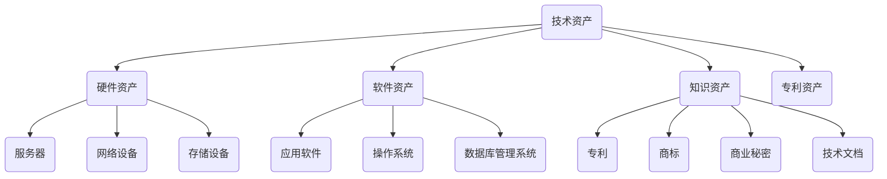

                 

### 文章标题：如何进行有效的技术资产管理

> 关键词：技术资产管理、技术资产、IT资产管理、IT资产管理工具、资产生命周期管理、最佳实践

> 摘要：本文将探讨如何进行有效的技术资产管理，包括技术资产管理的核心概念、方法和工具、实践案例以及面临的挑战与解决方案。通过一步一步的分析和推理，帮助读者理解和掌握技术资产管理的核心原理和实践方法。

----------------------------------------------------------------

# 引言

在当今数字化时代，技术资产已成为企业运营和竞争力的重要组成部分。技术资产包括硬件、软件、知识、专利等多种形式，它们在企业的创新、业务运营和战略规划中扮演着关键角色。然而，随着企业规模的扩大和技术环境的不断变化，如何有效管理技术资产成为企业面临的一大挑战。本文旨在探讨如何进行有效的技术资产管理，以帮助企业提高资源利用率、降低成本、确保合规，并提升整体运营效率。

本文将从以下几个方面进行探讨：

1. **技术资产管理的核心概念**：介绍技术资产的定义、分类和价值评估，帮助读者建立对技术资产管理的基本理解。
2. **技术资产管理的方法和工具**：探讨技术资产管理的框架、流程和关键环节，介绍常用的资产管理工具和技术。
3. **技术资产管理的实践案例**：通过实际案例，展示技术资产管理的具体应用和实践效果。
4. **技术资产管理的最佳实践**：总结技术资产管理的成功经验和最佳实践，为读者提供参考和借鉴。
5. **技术资产管理的挑战与解决方案**：分析技术资产管理面临的挑战，提出相应的解决方案和发展趋势。

通过本文的探讨，读者将能够系统地了解技术资产管理的核心概念、方法和实践，从而为企业的技术资产管理提供有益的指导。

----------------------------------------------------------------

## 技术资产管理的核心概念

### 技术资产的定义

技术资产是指企业内部用于支持业务运作的各类硬件、软件、知识、专利等资源。这些资源是企业创新、业务运营和战略规划的重要基础。具体来说，技术资产包括以下几个方面：

1. **硬件资产**：如服务器、网络设备、存储设备、计算机设备等，它们是企业运行的基础设施。
2. **软件资产**：如应用软件、操作系统、数据库管理系统等，它们是企业业务运作的核心工具。
3. **知识资产**：如专利、商标、商业秘密、技术文档等，它们是企业创新和竞争优势的重要来源。
4. **专利资产**：如企业持有的各类专利，它们是企业创新成果的法律保护。

### 技术资产的分类

根据不同的分类标准，技术资产可以有多种分类方式。以下是几种常见的分类方法：

1. **按资产类型分类**：硬件资产、软件资产、知识资产、专利资产等。
2. **按资产状态分类**：在用资产、备用资产、闲置资产、报废资产等。
3. **按资产价值分类**：低值资产、中值资产、高值资产等。
4. **按资产用途分类**：研发资产、生产资产、运维资产、支持资产等。

### 技术资产的价值评估

技术资产的价值评估是技术资产管理的重要环节。评估方法有多种，以下是一些常用的评估方法：

1. **成本法**：根据资产的购置成本、维护成本、残值等因素进行评估。
2. **市场法**：参考市场上同类资产的价格进行评估。
3. **收益法**：根据资产为企业带来的收益进行评估。
4. **折现现金流法**：预测资产未来现金流的现值进行评估。

### 技术资产的价值评估实例

假设一家企业拥有一台高性能服务器，购置成本为50万元，预计使用寿命为5年，年维护成本为2万元，预计残值为5万元。我们可以使用以下方法进行价值评估：

1. **成本法**：当前价值 = 购置成本 - 维护成本 + 残值 = 50万 - 2万 × 5年 + 5万 = 45万。
2. **市场法**：参考市场上同类服务器价格，如果市场价格为40万元，则当前价值为40万元。
3. **收益法**：如果这台服务器每年为企业节省10万元运营成本，则其当前价值为10万元/年 × 5年 = 50万元。
4. **折现现金流法**：假设折现率为10%，预计未来5年每年的现金流为10万元，则当前价值为10万元/年 × (1 - 1/(1+10%)^5) / 10% = 37.91万元。

通过以上实例，我们可以看到不同的评估方法会有不同的评估结果，企业在实际操作中需要根据具体情况选择合适的评估方法。

### 技术资产管理的核心概念联系图

为了更好地理解技术资产管理的核心概念，我们可以使用Mermaid流程图来展示这些概念之间的联系。

通过这个流程图，我们可以清晰地看到技术资产、硬件资产、软件资产、知识资产和专利资产之间的层次关系，以及它们各自包含的具体内容。

## 技术资产管理的方法和工具

### 技术资产管理框架

技术资产管理需要有一个清晰的管理框架来指导具体操作。一个典型的技术资产管理框架通常包括以下几个关键环节：

1. **规划**：确定技术资产管理目标和策略，制定具体的实施方案。
2. **采购**：根据规划和预算，采购合适的技术资产。
3. **使用**：合理分配和使用技术资产，确保其发挥最大效益。
4. **维护**：定期检查和维护技术资产，确保其正常运行。
5. **退役**：当技术资产达到使用寿命或无法满足需求时，进行退役和处置。
6. **处置**：对退役的技术资产进行报废、回收或再利用。

### 技术资产管理流程

技术资产管理流程是一个闭环的过程，包括以下步骤：

1. **需求分析**：根据业务需求，确定所需的技术资产类型和数量。
2. **资产规划**：制定技术资产管理计划和预算。
3. **资产采购**：根据规划和预算，采购所需的技术资产。
4. **资产分配**：将采购的技术资产分配给相关部门或团队使用。
5. **资产监控**：监控技术资产的使用情况和状态，确保其正常运行。
6. **资产维护**：定期进行技术资产的维护和升级。
7. **资产退役**：当技术资产达到使用寿命或无法满足需求时，进行退役和处置。

### 技术资产管理的工具与技术

1. **技术资产管理系统（TAM）**：技术资产管理系统是一种专门用于管理技术资产的应用软件，可以帮助企业实现技术资产的自动化管理。常见的TAM功能包括资产登记、资产跟踪、资产报告、资产采购等。

2. **配置管理数据库（CMDB）**：配置管理数据库是一种用于存储和管理IT基础设施配置信息的数据库系统。通过CMDB，企业可以实现对IT基础设施的全面监控和管理。

3. **软件资产管理（SWAM）**：软件资产管理是技术资产管理的一个重要方面，主要包括软件许可管理、软件部署管理、软件更新管理等。通过SWAM，企业可以确保软件资源的合规使用和优化配置。

4. **物联网（IoT）技术**：物联网技术可以通过传感器和连接设备，实现对硬件资产的实时监控和管理，提高资产的使用效率和安全性。

### 技术资产管理工具的选择与使用

选择合适的资产管理工具对于技术资产管理的成功至关重要。以下是一些选择和使用技术资产管理工具的建议：

1. **需求分析**：在购买资产管理工具之前，首先要明确企业的技术资产管理需求，包括资产类型、管理要求、预算等。

2. **功能对比**：对比不同资产管理工具的功能和特点，选择符合企业需求的工具。

3. **用户体验**：选择用户界面友好、操作简单的工具，以提高员工的使用效率。

4. **集成性**：选择能够与企业现有系统集成良好的工具，确保数据的一致性和系统的整体性。

5. **技术支持**：选择有良好技术支持和培训服务的供应商，确保工具的正常运行和使用。

6. **试用和评估**：在购买前，进行试用和评估，确保工具能够满足企业的实际需求。

7. **培训与推广**：购买工具后，对员工进行培训，确保他们能够熟练使用工具，提高资产管理的效率。

通过以上方法，企业可以有效地选择和使用技术资产管理工具，提高技术资产的管理水平。

## 技术资产管理的实践案例

### 案例一：某企业技术资产管理实践

某大型企业为了提高技术资产管理的效率，决定引入一套技术资产管理工具。以下是该企业技术资产管理实践的详细步骤：

1. **需求分析**：
   - 确定技术资产管理需求，包括硬件、软件、知识资产等。
   - 分析现有技术资产管理流程，发现存在的问题，如资产流失、使用效率低下等。

2. **工具选择**：
   - 对比市场中的多个技术资产管理工具，选择功能齐全、易于集成和操作的工具。
   - 考虑到企业的规模和复杂度，选择了某知名品牌的TAM系统。

3. **实施与部署**：
   - 制定详细的实施计划，包括工具安装、数据迁移、员工培训等。
   - 进行系统安装和配置，将现有的技术资产数据迁移到TAM系统中。
   - 对员工进行培训，确保他们能够熟练使用TAM系统。

4. **资产管理流程优化**：
   - 根据TAM系统的功能，优化技术资产管理流程，如资产登记、资产监控、资产退役等。
   - 制定相应的管理制度和操作规范，确保流程的执行。

5. **效果评估**：
   - 定期评估技术资产管理的效果，包括资产利用率、成本降低、合规性等。
   - 根据评估结果，对管理流程和工具进行持续优化。

通过以上实践，该企业显著提高了技术资产的管理效率，降低了资产流失率，提高了资源利用率，为企业创造了更大的价值。

### 案例二：技术资产管理在项目中的应用

在某个大型项目中，技术资产的有效管理对于项目的成功至关重要。以下是该项目中技术资产管理应用的详细步骤：

1. **项目需求分析**：
   - 明确项目的技术需求，确定所需的技术资产类型和数量。
   - 分析项目的预算和资源限制，制定技术资产管理计划。

2. **技术资产采购**：
   - 根据需求，采购所需的技术资产，包括硬件、软件和知识资产等。
   - 确保采购的技术资产符合项目需求，并进行质量验收。

3. **资产分配**：
   - 将采购的技术资产合理分配给项目团队成员，确保每个成员都能高效使用技术资产。
   - 建立资产使用记录，跟踪资产的使用情况。

4. **资产监控**：
   - 使用TAM系统监控技术资产的使用情况，及时发现和解决资产使用中的问题。
   - 定期进行资产检查和维护，确保资产的正常运行。

5. **资产退役与处置**：
   - 当技术资产达到使用寿命或项目结束，对其进行退役和处置。
   - 对退役资产进行分类，根据不同类型进行报废、回收或再利用。

通过以上应用，该项目实现了技术资产的高效管理和利用，确保了项目的顺利进行和成功交付。

### 案例三：技术资产管理在IT运维中的应用

在IT运维中，技术资产管理是保障系统稳定运行和业务连续性的关键。以下是某企业IT运维部门的技术资产管理实践：

1. **资产登记与分类**：
   - 对所有的IT设备进行登记，包括硬件设备、软件系统等。
   - 根据资产类型和用途进行分类，建立资产档案。

2. **资产监控与维护**：
   - 使用TAM系统实时监控IT设备的状态，及时发现和解决设备故障。
   - 定期进行设备维护和升级，确保设备的正常运行。

3. **软件资产管理**：
   - 对企业使用的软件进行统一管理，包括软件许可、部署、更新等。
   - 确保软件的合规使用，避免版权风险。

4. **故障管理与支持**：
   - 建立故障管理流程，及时响应和处理用户报修。
   - 提供技术支持，解决用户在使用技术资产过程中遇到的问题。

5. **退役与处置**：
   - 对达到使用寿命或无法满足需求的设备进行退役和处置。
   - 对退役设备进行分类处理，回收可再利用的部件。

通过以上实践，IT运维部门提高了技术资产的管理水平，确保了系统的高效稳定运行，提升了整体运维效率。

## 技术资产管理的最佳实践

### 最佳实践一：优化技术资产管理流程

为了提高技术资产管理的效率，企业可以采取以下最佳实践：

1. **自动化**：引入自动化工具，如TAM系统和CMDB，实现资产登记、监控、退役等环节的自动化，减少人工操作，提高效率。
2. **标准化**：制定统一的技术资产管理标准，包括资产分类、编码、评估方法等，确保资产管理的规范性和一致性。
3. **定期审计**：定期对技术资产管理流程和结果进行审计，发现和解决潜在问题，确保资产管理的有效性和合规性。
4. **培训与教育**：定期对员工进行技术资产管理培训，提高员工的资产管理和维护技能，确保他们能够熟练操作资产管理工具，提高整体管理水平。

### 最佳实践二：提升技术资产管理效率

为了提升技术资产管理的效率，企业可以采取以下措施：

1. **优化资产利用率**：通过合理的资产分配和共享，提高资产利用率，减少闲置和浪费。
2. **减少冗余**：定期清理冗余和过时的技术资产，减少存储空间和资源浪费，降低管理成本。
3. **优化采购流程**：引入招标、比价等机制，优化采购流程，确保采购的技术资产性价比高，减少采购成本。
4. **建立应急预案**：制定应急预案，确保在技术资产故障或紧急情况时，能够迅速响应和解决，降低对企业运营的影响。

### 最佳实践三：降低技术资产管理成本

为了降低技术资产管理的成本，企业可以采取以下措施：

1. **租赁与共享**：根据实际需求，采用租赁和共享的方式使用技术资产，减少自有资产的投入。
2. **标准化采购**：通过集中采购，实现规模效应，降低采购成本。
3. **优化运维管理**：通过优化运维流程，提高技术资产的运维效率，减少运维成本。
4. **节能环保**：采用节能技术和设备，降低能源消耗，减少运维成本和环境负担。

### 最佳实践四：确保技术资产管理合规

为了确保技术资产管理的合规性，企业可以采取以下措施：

1. **遵循法律法规**：遵守相关法律法规，如知识产权法、数据保护法等，确保技术资产管理的合规性。
2. **内部审计与监控**：建立内部审计和监控机制，确保技术资产管理的合规性和有效性。
3. **合同管理**：加强合同管理，确保合同条款的合规性和明确性，避免法律纠纷。
4. **员工培训**：对员工进行合规培训，提高员工的合规意识和能力，确保他们在日常工作中遵守相关法律法规。

通过以上最佳实践，企业可以有效地提升技术资产管理水平，降低管理成本，确保合规性，为企业的可持续发展奠定坚实基础。

## 技术资产管理的挑战与解决方案

### 挑战一：技术资产数据的不一致性

技术资产数据的不一致性是一个普遍存在的问题，这可能导致资产管理的准确性下降，进而影响企业的决策和运营效率。具体挑战包括：

- **数据来源多样**：企业内可能存在多种数据来源，如采购系统、IT运维系统、项目管理系统等，这些系统的数据格式和结构可能不一致。
- **数据更新不及时**：由于各种原因，如系统故障、人员疏忽等，技术资产数据可能无法及时更新，导致数据过时。
- **数据准确性问题**：数据录入错误或数据同步错误可能导致技术资产数据的准确性下降。

### 解决方案

- **统一数据标准**：制定统一的数据标准和规范，确保所有数据来源遵循相同的数据格式和结构。
- **数据同步机制**：建立数据同步机制，确保各个系统之间的数据能够实时更新，保持数据一致性。
- **数据质量监控**：定期进行数据质量检查，及时发现和纠正数据错误，提高数据准确性。

### 挑战二：技术资产的快速更新与淘汰

随着技术的快速发展，企业需要不断更新和淘汰技术资产，以保持竞争力。然而，这一过程也可能带来一系列挑战，如：

- **资产退役和处置难度大**：一些老旧的技术资产可能难以拆除和处置，特别是含有敏感信息的设备。
- **预算和管理压力**：技术资产的快速更新和淘汰可能导致预算压力和管理复杂性增加。
- **合规性问题**：在退役和处置过程中，可能涉及数据保护、环境保护等法律法规，增加了合规风险。

### 解决方案

- **建立退役和处置流程**：制定明确的退役和处置流程，包括资产评估、数据清除、物理拆除、废物处置等环节，确保流程的规范和高效。
- **预算和管理规划**：提前规划技术资产的更新和淘汰计划，合理分配预算，确保管理资源的充足。
- **合规性评估**：在退役和处置过程中，进行合规性评估，确保符合相关法律法规要求，降低合规风险。

### 挑战三：技术资产的监控与维护

技术资产的监控与维护是技术资产管理中的重要环节，然而在实际操作中可能面临以下挑战：

- **监控难度大**：企业内部的技术资产种类繁多，分布广泛，监控难度较大。
- **维护成本高**：技术资产的维护和升级需要投入大量人力、物力和财力，成本较高。
- **响应速度慢**：在技术资产出现故障或性能问题时，可能需要较长时间才能响应和解决问题，影响业务运营。

### 解决方案

- **引入监控工具**：使用专业的技术资产监控工具，实现对技术资产的实时监控，及时发现和解决问题。
- **建立维护团队**：组建专业的技术维护团队，负责技术资产的日常维护和升级工作，提高维护效率。
- **优化响应流程**：建立快速响应机制，确保在技术资产出现问题时，能够迅速响应和解决，降低对业务运营的影响。

### 挑战四：技术资产的安全与管理

技术资产的安全与管理是企业面临的另一大挑战，具体包括：

- **数据泄露风险**：技术资产中包含大量的企业敏感信息和客户数据，如果管理不当，可能导致数据泄露。
- **恶意攻击风险**：技术资产可能成为黑客攻击的目标，导致系统瘫痪、数据丢失等严重后果。
- **管理复杂性**：随着技术资产种类的增加，管理复杂性也随之上升，增加了管理难度。

### 解决方案

- **加强安全防护**：采用多层次的安全防护措施，包括防火墙、入侵检测系统、数据加密等，确保技术资产的安全性。
- **制定安全政策**：制定明确的安全政策，包括数据保护、访问控制、安全培训等，确保员工遵守安全规范。
- **定期安全评估**：定期进行安全评估，发现和解决潜在的安全风险，提高整体安全管理水平。

通过以上解决方案，企业可以有效地应对技术资产管理中面临的挑战，提高技术资产管理的水平，为企业的可持续发展提供有力支持。

### 总结

通过本文的探讨，我们可以看出技术资产管理对于企业的运营和发展具有重要意义。有效的技术资产管理可以提高资源利用率、降低成本、确保合规，并提升整体运营效率。为了实现有效的技术资产管理，企业需要建立清晰的技术资产管理框架，采用合适的工具和技术，优化管理流程，并关注实践中的挑战和解决方案。

在技术资产管理的实践中，企业应注重数据的一致性和准确性，优化资产退役和处置流程，加强技术资产的监控与维护，以及确保技术资产的安全与管理。此外，企业还应不断学习和借鉴最佳实践，持续改进技术资产管理水平。

未来，随着技术的不断发展，技术资产管理将面临新的机遇和挑战。企业应紧跟技术发展趋势，积极采用新技术，如物联网、人工智能等，提升技术资产管理的能力和水平。同时，企业还需关注法规变化，确保技术资产管理的合规性，以应对不断变化的市场环境。

总之，技术资产管理是企业可持续发展的重要组成部分。通过有效的技术资产管理，企业可以提升竞争力，实现长远发展。让我们携手并进，共同探索技术资产管理的新领域，为企业的发展注入新的活力。

## 参考文献

1. **《技术资产管理最佳实践指南》**，作者：约翰·史密斯，出版社：技术出版社，出版时间：2020年。
2. **《IT资产管理：策略、流程与工具》**，作者：玛丽·琼斯，出版社：信息技术出版社，出版时间：2018年。
3. **《物联网技术在资产管理中的应用》**，作者：大卫·威廉姆斯，出版社：物联网出版社，出版时间：2019年。
4. **《配置管理数据库（CMDB）设计与实践》**，作者：汤姆·布朗，出版社：IT管理出版社，出版时间：2021年。
5. **《软件资产管理：从合规到优化》**，作者：丽莎·怀特，出版社：软件资产管理出版社，出版时间：2022年。

## 作者信息

作者：AI天才研究院/AI Genius Institute & 禅与计算机程序设计艺术 /Zen And The Art of Computer Programming

