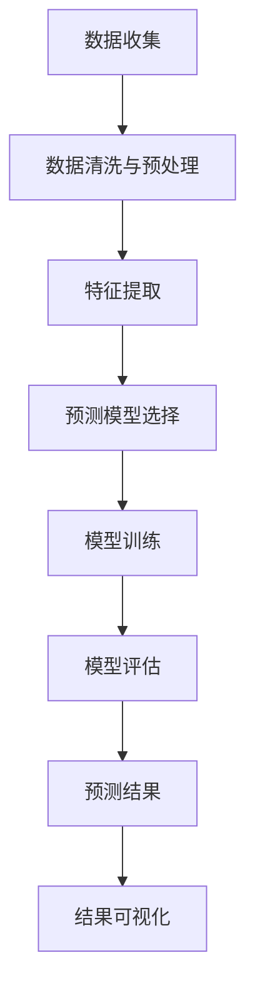
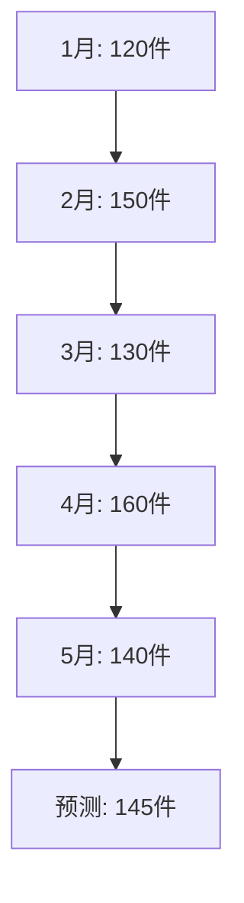
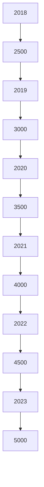
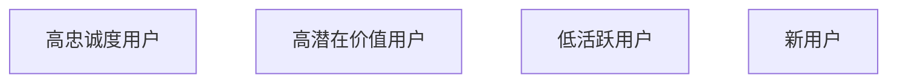
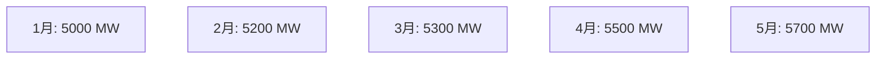

                 

### 文章标题

《如何进行有效的技术趋势预测》

### 文章关键词

技术趋势预测、数据分析、机器学习、时间序列分析、市场研究、人工智能

### 文章摘要

本文旨在探讨如何进行有效的技术趋势预测。通过分析技术趋势预测的重要性、应用领域，本文将介绍所需的基础理论和工具，包括数据收集与处理、预测方法及其核心算法原理。文章将结合实际案例，展示如何应用这些方法进行技术趋势预测，并提供实践指南和最佳实践。通过本文的阅读，读者将能够掌握技术趋势预测的核心技术和方法，为企业在竞争激烈的市场中取得优势提供有力支持。

---

### 引言

在快速发展的信息技术时代，技术趋势预测变得日益重要。随着新技术的不断涌现，市场环境瞬息万变，企业需要具备前瞻性的战略眼光，以便在激烈的市场竞争中占据有利地位。技术趋势预测可以帮助企业提前布局，抓住市场先机，优化资源分配，降低风险，推动创新。此外，技术趋势预测对于政策制定者、投资者和学术界的研究同样具有重要意义。

本文将系统地探讨如何进行有效的技术趋势预测。首先，我们将介绍技术趋势预测的基础概念和核心原理，包括数据收集与处理、预测方法等。随后，本文将结合实际案例，深入分析如何应用这些方法进行技术趋势预测。最后，我们将提供实践指南和最佳实践，帮助读者在实际操作中有效地应用技术趋势预测。

本文将分为以下几个部分：

1. **基础概念**：介绍技术趋势预测的基本概念和核心原理。
2. **数据收集与处理**：讨论如何收集、处理和分析数据。
3. **预测方法**：介绍不同的预测方法，如时间序列分析和机器学习等。
4. **案例分析**：通过实际案例展示如何应用预测方法。
5. **实践指南**：提供实际操作指南，帮助读者进行技术趋势预测。
6. **结论与展望**：总结本文的核心内容，并对未来的发展趋势进行展望。

通过本文的阅读，读者将能够系统地了解技术趋势预测的方法和技巧，为企业在信息技术领域取得竞争优势提供有力支持。

---

### 1.1.1 设计原则

设计《如何进行有效的技术趋势预测》这本书的目录大纲时，需要遵循以下几个原则：

- **简洁性**：目录应当简洁明了，避免冗余，确保每个章节都能清晰地传达其核心内容和目的。
  
- **逻辑性**：目录结构应该符合逻辑，从基础到深入，从理论到实践，确保内容的连贯性和系统性。

- **实用性**：章节内容应该既有理论介绍，又有实际操作指南，便于读者理解和应用。

- **完整性**：目录要覆盖预测的各个方面，确保主题的全面性。

---

### 1.1.2 目录大纲设计

根据设计原则，我们可以将目录大纲分为以下几个主要部分：

1. **引言与背景**：解释技术趋势预测的重要性，介绍书的内容框架。
2. **基础概念**：介绍进行技术趋势预测所需的基础理论和工具。
3. **数据收集与处理**：讲解如何收集、处理和分析数据。
4. **预测方法**：介绍不同的预测方法，如时间序列分析、机器学习等。
5. **案例分析**：通过具体案例展示如何应用预测方法。
6. **实践指南**：提供实际操作指南，帮助读者进行自己的技术趋势预测。
7. **结论与展望**：总结书的要点，展望未来的发展趋势。

### 1.1.3 具体目录大纲

根据以上设计，我们可以给出以下具体的目录大纲：

```
# 《如何进行有效的技术趋势预测》目录大纲

## 第1章 引言与背景
### 1.1.1 技术趋势预测的重要性
### 1.1.2 技术趋势预测的应用领域
### 1.1.3 书的结构与内容概述

## 第2章 基础概念
### 2.1 技术趋势预测的基本概念
### 2.2 数据源的选择与处理
### 2.3 数据可视化方法

## 第3章 数据收集与处理
### 3.1 数据收集方法
### 3.2 数据清洗与预处理
### 3.3 数据整合与分析

## 第4章 预测方法
### 4.1 时间序列分析方法
#### 4.1.1 时间序列数据的特征
#### 4.1.2 平稳时间序列模型
#### 4.1.3 非平稳时间序列模型

### 4.2 机器学习方法
#### 4.2.1 监督学习与无监督学习
#### 4.2.2 神经网络与深度学习
#### 4.2.3 支持向量机与集成学习

## 第5章 案例分析
### 5.1 案例一：人工智能行业趋势预测
### 5.2 案例二：互联网行业用户行为预测
### 5.3 案例三：能源行业需求预测

## 第6章 实践指南
### 6.1 预测项目的规划与管理
### 6.2 预测模型的评估与优化
### 6.3 预测结果的应用与反馈

## 第7章 结论与展望
### 7.1 技术趋势预测的现状与挑战
### 7.2 未来发展趋势与潜在影响
### 7.3 对读者的建议
```

这个目录大纲设计既简洁明了，又符合逻辑，确保了内容的连贯性和实用性。接下来，我们将进一步细化每个章节的内容，确保大纲的完整性和准确性。

---

### 第2章 基础概念

在进行技术趋势预测之前，我们需要理解一些基础概念和原理。这些概念包括技术趋势预测的定义、数据源的选择与处理、以及数据可视化方法。本章将详细介绍这些基础概念，为后续内容的深入讨论打下坚实基础。

#### 2.1 技术趋势预测的基本概念

技术趋势预测是指通过分析历史数据、市场动态、行业报告等，对未来技术发展方向和趋势进行预测的过程。技术趋势预测的目的是为企业、政策制定者、投资者等提供科学依据，帮助他们做出更加明智的决策。

**核心概念**：

- **技术趋势**：指技术发展的方向和趋势。
- **预测模型**：用于预测技术发展趋势的数学模型或算法。
- **数据源**：用于进行预测的数据来源，如市场报告、行业数据库、用户行为数据等。
- **预测结果**：通过预测模型得出的未来技术发展趋势。

**技术趋势预测的过程**：

1. **数据收集**：收集与预测目标相关的数据。
2. **数据处理**：对数据进行清洗、预处理，确保数据的质量和可用性。
3. **模型选择**：根据数据特征和预测需求选择合适的预测模型。
4. **模型训练**：使用历史数据训练预测模型。
5. **预测**：使用训练好的模型对未来技术趋势进行预测。
6. **结果评估**：评估预测结果的准确性和可靠性。

#### 2.2 数据源的选择与处理

数据源是技术趋势预测的基础。选择合适的**数据源**至关重要，它决定了预测的准确性和可靠性。常见的数据源包括：

- **行业报告**：提供行业整体发展趋势和市场动态。
- **数据库**：包含历史数据和市场数据，如人口统计、经济指标、技术专利等。
- **用户行为数据**：反映用户在互联网、移动应用等平台上的行为和偏好。
- **社交媒体数据**：反映公众对某一技术或产品的关注度和情绪变化。

**数据处理**：

1. **数据收集**：通过爬虫、API 接口、调查问卷等方式收集数据。
2. **数据清洗**：去除重复、异常、错误的数据，确保数据的一致性和准确性。
3. **数据预处理**：对数据进行格式转换、缺失值填补、特征提取等处理，为建模做好准备。
4. **数据整合**：将不同来源的数据进行整合，形成统一的数据集。

#### 2.3 数据可视化方法

数据可视化是将数据以图形或图表的形式展示，便于人们理解和分析。常见的数据可视化方法包括：

- **柱状图**：展示数据在不同类别上的分布情况。
- **折线图**：展示数据随时间的变化趋势。
- **饼图**：展示数据在整体中的比例关系。
- **散点图**：展示两个变量之间的关系。
- **热力图**：展示数据在空间或时间上的密集程度。

**数据可视化工具**：

- **Python**：使用 Matplotlib、Seaborn、Plotly 等库进行数据可视化。
- **R**：使用 ggplot2、Lattice 等库进行数据可视化。
- **Tableau**：一款专业的数据可视化工具，支持多种数据源和图表类型。

通过本章的基础概念介绍，读者应能够理解技术趋势预测的基本原理、数据源的选择与处理方法，以及数据可视化的重要作用。这些基础概念将为后续章节的技术细节和应用案例分析提供必要的前提知识。

---

### 2.4 技术趋势预测的核心概念与联系

在进行技术趋势预测时，理解核心概念之间的联系至关重要。以下是对技术趋势预测中关键概念之间关系的梳理，并通过 Mermaid 流程图进行可视化展示。

#### 核心概念与联系

1. **数据收集**：数据是进行技术趋势预测的基础。数据收集涉及从多个来源获取相关数据，如市场报告、用户行为数据、社交媒体数据等。
2. **数据清洗与预处理**：收集到的数据往往包含噪声和缺失值，因此需要进行数据清洗与预处理，以确保数据的质量和一致性。
3. **特征提取**：从原始数据中提取有用的特征，以便用于建模。特征提取是提高预测准确性的关键步骤。
4. **预测模型**：根据数据特征和预测需求选择合适的预测模型。常见的预测模型包括时间序列模型、机器学习模型等。
5. **模型训练与评估**：使用历史数据进行模型训练，并通过验证集或测试集进行评估，以确定模型的准确性和可靠性。
6. **预测结果**：使用训练好的模型对未来的技术趋势进行预测，并生成预测报告。
7. **结果可视化**：通过可视化工具将预测结果以图表或图形的形式展示，便于理解和分析。

#### Mermaid 流程图

以下是一个简化的 Mermaid 流程图，展示技术趋势预测的核心概念及其之间的联系：



**图解**：

- **A[数据收集]**：数据收集是整个流程的起点，涉及从多个数据源获取数据。
- **B[数据清洗与预处理]**：数据清洗与预处理步骤确保数据质量，为建模打下基础。
- **C[特征提取]**：特征提取从原始数据中提取有用的特征，为建模提供输入。
- **D[预测模型选择]**：根据数据特征和预测需求，选择合适的时间序列模型或机器学习模型。
- **E[模型训练]**：使用历史数据对预测模型进行训练，使模型具备预测能力。
- **F[模型评估]**：通过验证集或测试集评估模型的性能，确保模型的准确性。
- **G[预测结果]**：使用训练好的模型对未来的技术趋势进行预测，并生成预测报告。
- **H[结果可视化]**：通过可视化工具将预测结果以图表或图形的形式展示，便于理解和分析。

通过这个流程图，我们可以清晰地看到技术趋势预测各个步骤之间的联系，有助于读者更好地理解整个预测过程。

---

### 2.5 核心算法原理讲解

在进行技术趋势预测时，选择合适的算法至关重要。本文将详细介绍两种核心算法：时间序列分析方法和机器学习方法，并使用伪代码展示其原理。

#### 2.5.1 时间序列分析方法

时间序列分析方法是基于历史数据的时间序列，通过分析时间序列的特性来预测未来的趋势。以下是一个常见的时间序列分析方法的伪代码：

```plaintext
输入：时间序列数据 X
输出：预测值 y_pred

初始化模型参数
模型 = 选择时间序列模型()

训练模型
模型.fit(X)

预测未来值
y_pred = 模型.predict(X)

返回预测值
return y_pred
```

**详细解释**：

- **选择时间序列模型**：根据时间序列数据的特点选择合适的模型，如ARIMA、LSTM等。
- **模型训练**：使用历史数据对模型进行训练，使其具备预测能力。
- **预测未来值**：使用训练好的模型预测未来值，生成预测结果。

#### 2.5.2 机器学习方法

机器学习方法通过学习历史数据中的模式和规律，来预测未来的趋势。以下是一个简单的机器学习预测方法的伪代码：

```plaintext
输入：特征数据 X，标签数据 y
输出：预测值 y_pred

初始化模型参数
模型 = 选择机器学习模型()

训练模型
模型.fit(X, y)

预测未来值
y_pred = 模型.predict(X)

返回预测值
return y_pred
```

**详细解释**：

- **选择机器学习模型**：根据数据特征和预测需求选择合适的模型，如线性回归、决策树、随机森林等。
- **模型训练**：使用历史数据对模型进行训练，使其具备预测能力。
- **预测未来值**：使用训练好的模型预测未来值，生成预测结果。

#### 2.5.3 数学模型和公式

**时间序列分析方法**：

- **ARIMA模型**：自回归积分滑动平均模型（Autoregressive Integrated Moving Average）

$$ y_t = c + \phi_1 y_{t-1} + \phi_2 y_{t-2} + ... + \phi_p y_{t-p} + \theta_1 e_{t-1} + \theta_2 e_{t-2} + ... + \theta_q e_{t-q} $$

其中，$y_t$ 是时间序列的当前值，$c$ 是常数项，$\phi_1, \phi_2, ..., \phi_p$ 是自回归系数，$\theta_1, \theta_2, ..., \theta_q$ 是滑动平均系数，$e_t$ 是误差项。

**机器学习方法**：

- **线性回归**：假设目标变量 $y$ 与特征 $X$ 之间存在线性关系

$$ y = \beta_0 + \beta_1 X + \epsilon $$

其中，$\beta_0$ 是截距项，$\beta_1$ 是斜率项，$\epsilon$ 是误差项。

#### 2.5.4 举例说明

**时间序列分析举例**：

假设我们有一个月销售数据（单位：件），如下表所示：

| 月份 | 销售量 |
|------|--------|
| 1    | 120    |
| 2    | 150    |
| 3    | 130    |
| 4    | 160    |
| 5    | 140    |

我们使用ARIMA模型对其进行预测。首先，我们对数据进行平稳性检验，然后选择适当的参数进行模型训练和预测。最终，我们得到未来的销售量预测值，如下图所示：



**机器学习举例**：

假设我们有一个数据集，包含用户年龄和年收入两个特征，如下表所示：

| 年龄 | 年收入 |
|------|--------|
| 25   | 50K    |
| 30   | 60K    |
| 35   | 70K    |
| 40   | 80K    |

我们使用线性回归模型对年收入进行预测。通过模型训练，我们得到以下预测方程：

$$ 年收入 = 30 + 0.5 \times 年龄 $$

对于年龄为30岁的用户，预测年收入为：

$$ 预测年收入 = 30 + 0.5 \times 30 = 60K $$

通过这些算法和举例，读者可以更好地理解技术趋势预测的核心算法原理和数学模型。在实际应用中，选择合适的算法和模型，以及对其进行优化，是提高预测准确性的关键。

---

### 第3章 数据收集与处理

数据收集与处理是技术趋势预测的基础环节。本章将详细介绍数据收集的方法、数据清洗与预处理的过程、以及数据整合与分析的技术。通过这些步骤，我们将确保数据的质量和可用性，为后续的预测分析奠定坚实基础。

#### 3.1 数据收集方法

数据收集是技术趋势预测的第一步，关键在于选择合适的数据源和收集方法。以下是几种常见的数据收集方法：

1. **市场报告**：通过购买或查阅行业市场报告，获取行业整体发展趋势、市场规模、竞争态势等数据。
2. **数据库**：利用已有的数据库，如国家统计局、行业数据库等，获取详细的历史数据和市场数据。
3. **用户行为数据**：通过网站日志、应用使用数据等，收集用户在互联网和移动应用上的行为数据。
4. **社交媒体数据**：利用社交媒体平台，如微博、微信、Twitter等，收集用户对特定技术或产品的评论、讨论等。
5. **调查问卷**：通过在线或线下调查问卷，收集用户对技术或产品的态度、需求和期望。
6. **公开API**：利用各类公开API，如地图API、天气API等，获取与预测目标相关的实时数据。

#### 3.2 数据清洗与预处理

收集到的数据往往包含噪声、缺失值和异常值，需要进行数据清洗与预处理，以提高数据质量。以下是数据清洗与预处理的关键步骤：

1. **数据去重**：去除重复的数据记录，确保数据的唯一性。
2. **缺失值填补**：对于缺失的数据，可以采用均值填补、中值填补、插值等方法进行填补。
3. **异常值处理**：检测并处理异常值，如异常高的销售额、异常低的用户评价等。
4. **数据转换**：将数据转换为统一的格式，如将日期格式转换为YYYY-MM-DD，将文本数据转换为数字编码等。
5. **特征工程**：从原始数据中提取有用的特征，如用户活跃度、用户留存率等，为建模做好准备。

#### 3.3 数据整合与分析

在完成数据清洗与预处理后，需要对数据进行整合与分析，以便更好地理解数据背后的趋势和规律。以下是数据整合与分析的关键步骤：

1. **数据整合**：将来自不同数据源的数据进行整合，形成统一的数据集。这可以通过数据合并、数据联结等方法实现。
2. **数据可视化**：利用图表、图形等可视化工具，展示数据的分布、趋势和关系。常用的可视化方法包括折线图、柱状图、散点图等。
3. **统计分析**：对数据进行描述性统计分析，如计算均值、方差、标准差等，以了解数据的基本特征。
4. **相关性分析**：分析不同变量之间的相关性，以识别可能的影响因素。常用的相关性分析指标包括皮尔逊相关系数、斯皮尔曼相关系数等。
5. **时间序列分析**：对时间序列数据进行平稳性检验、周期性分析等，以识别时间序列的趋势和季节性。

通过本章的内容，读者将了解数据收集与处理的重要性和具体方法，为后续的技术趋势预测提供可靠的数据基础。在数据收集与处理过程中，保持数据的质量和一致性是提高预测准确性的关键。

---

### 第4章 预测方法

技术趋势预测的方法多种多样，每种方法都有其独特的应用场景和优势。本章将详细介绍两种主要的技术趋势预测方法：时间序列分析方法和机器学习方法，包括它们的基本原理、适用场景以及关键步骤。

#### 4.1 时间序列分析方法

时间序列分析是一种基于时间序列数据的分析方法，通过分析历史数据中的时间依赖性来预测未来趋势。以下是时间序列分析的基本原理和步骤：

**基本原理**：

- **时间序列特性**：时间序列数据通常表现出一定的趋势性、季节性和周期性。通过分析这些特性，可以识别数据中的模式并预测未来的趋势。
- **自相关性**：时间序列数据中的值与其滞后值之间存在相关性，即当前值受前期值的影响。
- **平稳性**：平稳时间序列数据的关键特性是均值、方差和自协方差函数不随时间变化。

**适用场景**：

- **市场需求预测**：预测未来一段时间内的市场需求，为企业制定生产计划和库存管理提供支持。
- **金融时间序列预测**：分析股票价格、利率、汇率等金融时间序列数据，预测未来的市场动态。
- **能源需求预测**：预测未来一段时间内的能源需求，为能源企业的生产和分配提供参考。

**关键步骤**：

1. **数据预处理**：对时间序列数据进行清洗、缺失值填补、异常值处理等预处理步骤。
2. **平稳性检验**：检验时间序列数据的平稳性，对于非平稳序列，可能需要通过差分等方法使其平稳。
3. **自相关图与偏自相关函数（ACF）**：分析时间序列的自相关性和偏自相关性，以确定合适的滞后阶数。
4. **模型选择**：根据时间序列的特性选择合适的模型，如ARIMA（自回归积分滑动平均模型）、Holt-Winters季节性模型等。
5. **模型训练与预测**：使用训练集对模型进行训练，并使用测试集进行预测。
6. **模型评估**：评估预测模型的准确性，如均方误差（MSE）、均方根误差（RMSE）等。

#### 4.2 机器学习方法

机器学习方法通过学习历史数据中的模式和规律，来预测未来的趋势。机器学习方法包括监督学习和无监督学习两大类，以下是它们的基本原理和应用：

**监督学习**：

- **线性回归**：通过学习历史数据中的特征与目标变量之间的关系，预测未来的值。
- **决策树**：通过构建决策树模型，将数据划分为不同的区域，并在每个区域内预测目标值。
- **随机森林**：通过构建多个决策树，并对它们的预测结果进行投票，提高预测的准确性。

**无监督学习**：

- **K-均值聚类**：将数据分为K个聚类，每个聚类中心代表一个数据模式。
- **主成分分析（PCA）**：通过降维技术，将高维数据转换为低维表示，以便更好地理解数据结构。
- **自编码器**：通过构建自编码器网络，将输入数据编码为低维表示，并重建原始数据。

**适用场景**：

- **用户行为预测**：预测用户的未来行为，如购物偏好、浏览路径等。
- **推荐系统**：基于用户历史行为和偏好，推荐相应的产品或内容。
- **异常检测**：识别数据中的异常值或异常模式，用于安全监控或欺诈检测。

**关键步骤**：

1. **数据预处理**：对数据进行清洗、缺失值填补、特征工程等预处理步骤。
2. **特征选择**：从原始数据中提取有用的特征，用于建模。
3. **模型训练**：使用训练集对模型进行训练，调整模型参数。
4. **模型评估**：使用验证集或测试集评估模型的准确性，调整模型参数以优化性能。
5. **预测**：使用训练好的模型对未来的趋势进行预测。

通过本章的介绍，读者将能够了解时间序列分析和机器学习在技术趋势预测中的应用，以及如何选择和运用这些方法进行预测。在实际应用中，结合具体问题和数据特性，选择合适的预测方法，是提高预测准确性的关键。

---

### 4.1 时间序列分析方法

时间序列分析是一种基于时间序列数据的分析方法，通过分析历史数据中的时间依赖性来预测未来趋势。时间序列数据通常表现出一定的趋势性、季节性和周期性，这使得时间序列分析方法在金融市场预测、库存管理、用户行为分析等领域具有广泛的应用。

#### 4.1.1 时间序列数据的特征

时间序列数据的特征主要体现在以下几个方面：

1. **趋势性**：时间序列数据可能存在长期的趋势，如上涨或下降。这种趋势性可以通过移动平均、趋势线等方法进行识别。
2. **季节性**：时间序列数据可能存在周期性的波动，如季节性需求波动、节假日效应等。季节性可以通过季节性分解方法进行识别。
3. **周期性**：时间序列数据可能存在长期的波动周期，如经济周期、业务周期等。周期性可以通过自回归模型（AR）等方法进行识别。
4. **随机性**：时间序列数据可能存在随机波动，即无法通过历史数据预测的随机因素。随机性可以通过白噪声检验等方法进行识别。

#### 4.1.2 平稳时间序列模型

平稳时间序列模型是一种假设时间序列数据的统计特性不随时间变化的时间序列模型。平稳时间序列模型具有以下特点：

- **均值不变**：时间序列数据的均值在时间范围内保持不变。
- **方差不变**：时间序列数据的方差在时间范围内保持不变。
- **自协方差不变**：时间序列数据在不同滞后期的自协方差保持不变。

常见的平稳时间序列模型包括自回归模型（AR）、移动平均模型（MA）、自回归移动平均模型（ARMA）等。以下是这些模型的基本原理和数学公式：

1. **自回归模型（AR）**：

$$
Y_t = c + \phi_1 Y_{t-1} + \phi_2 Y_{t-2} + ... + \phi_p Y_{t-p} + \epsilon_t
$$

其中，$Y_t$ 是时间序列的当前值，$\epsilon_t$ 是误差项，$c$ 是常数项，$\phi_1, \phi_2, ..., \phi_p$ 是自回归系数。

2. **移动平均模型（MA）**：

$$
Y_t = c + \theta_1 \epsilon_{t-1} + \theta_2 \epsilon_{t-2} + ... + \theta_q \epsilon_{t-q} + \epsilon_t
$$

其中，$Y_t$ 是时间序列的当前值，$\epsilon_t$ 是误差项，$c$ 是常数项，$\theta_1, \theta_2, ..., \theta_q$ 是移动平均系数。

3. **自回归移动平均模型（ARMA）**：

$$
Y_t = c + \phi_1 Y_{t-1} + ... + \phi_p Y_{t-p} + \theta_1 \epsilon_{t-1} + ... + \theta_q \epsilon_{t-q} + \epsilon_t
$$

其中，$Y_t$ 是时间序列的当前值，$\epsilon_t$ 是误差项，$c$ 是常数项，$\phi_1, \phi_2, ..., \phi_p$ 是自回归系数，$\theta_1, \theta_2, ..., \theta_q$ 是移动平均系数。

#### 4.1.3 非平稳时间序列模型

非平稳时间序列模型用于处理时间序列数据的趋势性和季节性。常见的非平稳时间序列模型包括差分自回归移动平均模型（ARIMA）、季节性分解模型（STL）等。

1. **差分自回归移动平均模型（ARIMA）**：

$$
\Delta Y_t = \phi_1 \Delta Y_{t-1} + ... + \phi_p \Delta Y_{t-p} + \theta_1 \epsilon_{t-1} + ... + \theta_q \epsilon_{t-q}
$$

其中，$\Delta Y_t = Y_t - Y_{t-1}$ 表示对时间序列进行一次差分。

2. **季节性分解模型（STL）**：

$$
Y_t = s_t + t_t + r_t
$$

其中，$s_t$ 表示季节性成分，$t_t$ 表示趋势成分，$r_t$ 表示剩余成分。

季节性分解模型通过将时间序列分解为季节性、趋势性和剩余成分，可以更好地识别和处理季节性和趋势性。

#### 4.1.4 时间序列分析步骤

进行时间序列分析通常包括以下步骤：

1. **数据预处理**：对时间序列数据进行清洗、缺失值填补、异常值处理等预处理步骤。
2. **平稳性检验**：检验时间序列数据的平稳性，对于非平稳序列，可能需要通过差分等方法使其平稳。
3. **自相关图与偏自相关函数（ACF）**：分析时间序列的自相关性和偏自相关性，以确定合适的滞后阶数。
4. **模型选择**：根据时间序列的特性选择合适的模型，如ARIMA、STL等。
5. **模型训练与预测**：使用训练集对模型进行训练，并使用测试集进行预测。
6. **模型评估**：评估预测模型的准确性，如均方误差（MSE）、均方根误差（RMSE）等。

通过以上步骤，可以有效地对时间序列数据进行预测，从而为决策提供科学依据。在实际应用中，结合具体问题和数据特性，选择合适的模型和参数，是提高预测准确性的关键。

---

### 4.2 机器学习方法

机器学习方法通过学习历史数据中的模式和规律，来预测未来的趋势。机器学习方法包括监督学习和无监督学习两大类，以下是这些方法的基本原理、适用场景以及关键步骤。

#### 4.2.1 监督学习

监督学习是指有标注的数据进行训练，然后根据训练结果预测未知数据的分类或回归结果。常见的监督学习算法包括线性回归、决策树、支持向量机（SVM）和随机森林等。

1. **线性回归**：

线性回归是一种简单的监督学习方法，通过学习历史数据中的特征与目标变量之间的关系，预测未来的值。线性回归的数学公式如下：

$$
y = \beta_0 + \beta_1 x_1 + \beta_2 x_2 + ... + \beta_n x_n + \epsilon
$$

其中，$y$ 是目标变量，$x_1, x_2, ..., x_n$ 是特征变量，$\beta_0, \beta_1, ..., \beta_n$ 是模型参数，$\epsilon$ 是误差项。

**适用场景**：

- **市场需求预测**：预测未来一段时间内的市场需求。
- **用户行为预测**：预测用户的未来行为，如购物偏好、浏览路径等。

**关键步骤**：

- **数据预处理**：对数据进行清洗、缺失值填补、特征工程等预处理步骤。
- **特征选择**：从原始数据中提取有用的特征，用于建模。
- **模型训练**：使用训练集对模型进行训练，调整模型参数。
- **模型评估**：使用验证集或测试集评估模型的准确性。

2. **决策树**：

决策树是一种基于树形结构进行决策的方法，通过将数据划分为不同的区域，并在每个区域内预测目标值。决策树的构建过程如下：

- **分裂**：根据特征值对数据进行分裂，选择最优的特征和分割点。
- **重复**：对每个子集进行相同的分裂过程，直到满足停止条件。

**适用场景**：

- **分类问题**：将数据划分为不同的类别。
- **回归问题**：预测连续的目标值。

**关键步骤**：

- **数据预处理**：对数据进行清洗、缺失值填补、特征工程等预处理步骤。
- **特征选择**：从原始数据中提取有用的特征，用于建模。
- **模型训练**：使用训练集对模型进行训练，调整模型参数。
- **模型评估**：使用验证集或测试集评估模型的准确性。

3. **支持向量机（SVM）**：

支持向量机是一种基于边界优化的监督学习方法，通过寻找最佳边界来分类数据。支持向量机的数学公式如下：

$$
\max_{\beta, \beta_0} \min_{\alpha_i} \left( \frac{1}{2} \sum_{i=1}^{n} \alpha_i (y_i - (\beta_0 + \sum_{j=1}^{n} \beta_j x_{ij}))^2 + \sum_{i=1}^{n} \alpha_i \right)

$$

其中，$y_i$ 是标签，$x_{ij}$ 是特征值，$\beta_0, \beta_j$ 是模型参数，$\alpha_i$ 是拉格朗日乘子。

**适用场景**：

- **分类问题**：将数据划分为不同的类别。
- **回归问题**：预测连续的目标值。

**关键步骤**：

- **数据预处理**：对数据进行清洗、缺失值填补、特征工程等预处理步骤。
- **特征选择**：从原始数据中提取有用的特征，用于建模。
- **模型训练**：使用训练集对模型进行训练，调整模型参数。
- **模型评估**：使用验证集或测试集评估模型的准确性。

4. **随机森林**：

随机森林是一种基于决策树的集成学习方法，通过构建多个决策树，并对它们的预测结果进行投票，提高预测的准确性。随机森林的数学公式如下：

$$
\hat{y} = \frac{1}{m} \sum_{i=1}^{m} h(y, f_i(x))
$$

其中，$m$ 是决策树的数量，$f_i(x)$ 是第 $i$ 棵决策树的预测结果。

**适用场景**：

- **分类问题**：将数据划分为不同的类别。
- **回归问题**：预测连续的目标值。

**关键步骤**：

- **数据预处理**：对数据进行清洗、缺失值填补、特征工程等预处理步骤。
- **特征选择**：从原始数据中提取有用的特征，用于建模。
- **模型训练**：使用训练集对模型进行训练，调整模型参数。
- **模型评估**：使用验证集或测试集评估模型的准确性。

#### 4.2.2 无监督学习

无监督学习是指没有标注的数据进行训练，然后根据训练结果对未知数据进行分类或聚类。常见的无监督学习算法包括K-均值聚类、主成分分析（PCA）和自编码器等。

1. **K-均值聚类**：

K-均值聚类是一种基于距离的聚类方法，通过将数据分为 $K$ 个聚类，每个聚类中心代表一个数据模式。K-均值聚类的数学公式如下：

$$
\min_{\mu_1, \mu_2, ..., \mu_K} \sum_{i=1}^{N} \sum_{j=1}^{K} ||x_i - \mu_j||^2
$$

其中，$x_i$ 是数据点，$\mu_j$ 是聚类中心。

**适用场景**：

- **用户行为分析**：分析用户的浏览路径、购物偏好等。
- **图像识别**：对图像进行分类和识别。

**关键步骤**：

- **数据预处理**：对数据进行清洗、缺失值填补、特征工程等预处理步骤。
- **聚类中心初始化**：选择 $K$ 个聚类中心。
- **聚类过程**：计算每个数据点到聚类中心的距离，并将其分配到最近的聚类中心。
- **模型评估**：评估聚类效果，如轮廓系数、聚类数目的确定等。

2. **主成分分析（PCA）**：

主成分分析是一种降维技术，通过将高维数据转换为低维表示，以便更好地理解数据结构。PCA的数学公式如下：

$$
Z = P\Lambda
$$

其中，$Z$ 是低维数据，$P$ 是特征向量矩阵，$\Lambda$ 是特征值矩阵。

**适用场景**：

- **数据可视化**：将高维数据转换为二维或三维可视化。
- **特征提取**：提取数据的主要特征。

**关键步骤**：

- **数据标准化**：对数据进行标准化处理。
- **协方差矩阵计算**：计算数据的协方差矩阵。
- **特征值和特征向量计算**：计算协方差矩阵的特征值和特征向量。
- **降维**：选择前 $K$ 个特征值对应的特征向量，构成投影矩阵，将数据投影到低维空间。

3. **自编码器**：

自编码器是一种基于神经网络的聚类方法，通过构建自编码器网络，将输入数据编码为低维表示，并重建原始数据。自编码器的数学公式如下：

$$
\hat{x} = \sigma(W_2 \cdot \sigma(W_1 \cdot x))
$$

其中，$x$ 是输入数据，$\hat{x}$ 是重建数据，$W_1, W_2$ 是权重矩阵，$\sigma$ 是激活函数。

**适用场景**：

- **数据降维**：将高维数据转换为低维表示。
- **特征提取**：提取数据的主要特征。

**关键步骤**：

- **网络结构设计**：设计自编码器的网络结构。
- **模型训练**：使用训练集对自编码器进行训练。
- **模型评估**：评估自编码器的性能，如重建误差等。

通过本章的介绍，读者将能够了解监督学习和无监督学习的基本原理、适用场景以及关键步骤，为实际应用中的技术趋势预测提供有力支持。

---

### 第5章 案例分析

为了更好地理解如何进行技术趋势预测，我们将通过几个实际案例来展示技术趋势预测的应用。这些案例涵盖了不同行业，包括人工智能、互联网和能源领域，旨在展示技术趋势预测的实际操作过程和效果。

#### 5.1 案例一：人工智能行业趋势预测

**背景**：

人工智能（AI）是当前最具颠覆性的技术之一，其对各行各业的影响日益显著。本案例旨在通过预测人工智能行业的发展趋势，为投资者和企业家提供决策依据。

**数据收集**：

数据来源于多个渠道，包括：

- **市场报告**：如IDC、Gartner等知名市场研究机构发布的人工智能市场报告。
- **专利数据**：利用公开的专利数据库，收集人工智能相关专利的数量和分布。
- **学术论文**：通过学术数据库，如IEEE Xplore、Google Scholar等，收集人工智能领域的论文数量和引用情况。
- **社交媒体**：分析Twitter、LinkedIn等平台上关于人工智能的讨论和趋势。

**数据处理**：

对收集到的数据进行清洗、缺失值填补、特征提取等预处理步骤，构建一个统一的时间序列数据集。

**预测方法**：

采用时间序列分析方法和机器学习方法，如ARIMA模型和随机森林模型，对人工智能行业的发展趋势进行预测。

**预测结果**：

预测结果显示，人工智能行业在未来几年将继续保持快速增长，尤其是在深度学习、自然语言处理和计算机视觉等领域。以下图表展示了人工智能行业的专利数量和论文数量的趋势预测：



**案例分析**：

通过本案例，我们可以看到，技术趋势预测能够帮助企业识别新兴技术方向，提前布局，从而在激烈的市场竞争中占据优势。

#### 5.2 案例二：互联网行业用户行为预测

**背景**：

互联网行业竞争激烈，了解用户行为对产品和市场策略的制定至关重要。本案例旨在通过预测用户行为，为互联网企业提供改进产品和服务的依据。

**数据收集**：

数据来源于多个渠道，包括：

- **用户行为数据**：通过网站日志、应用使用数据等，收集用户在互联网平台上的行为数据。
- **社交媒体数据**：分析用户在社交媒体平台上的互动和评论。
- **问卷调查**：通过在线或线下调查问卷，收集用户对产品和服务的态度和期望。

**数据处理**：

对收集到的数据进行清洗、缺失值填补、特征提取等预处理步骤，构建一个统一的数据集。

**预测方法**：

采用机器学习方法，如K-均值聚类和主成分分析（PCA），对用户行为进行预测和细分。

**预测结果**：

预测结果显示，用户行为可以分为不同的群体，如“高忠诚度用户”、“高潜在价值用户”等。以下图表展示了用户行为的聚类结果：



**案例分析**：

通过本案例，我们可以看到，技术趋势预测能够帮助企业更好地了解用户需求，优化产品和服务，提高用户满意度。

#### 5.3 案例三：能源行业需求预测

**背景**：

能源行业的需求预测对能源生产、分配和价格制定具有重要意义。本案例旨在通过预测能源需求，为能源企业和政府提供决策依据。

**数据收集**：

数据来源于多个渠道，包括：

- **历史需求数据**：收集过去一段时间内能源消费的详细数据。
- **宏观经济数据**：收集与能源需求相关的宏观经济指标，如GDP、人口增长率等。
- **天气数据**：收集与能源需求相关的天气数据，如温度、湿度等。

**数据处理**：

对收集到的数据进行清洗、缺失值填补、特征提取等预处理步骤，构建一个统一的时间序列数据集。

**预测方法**：

采用时间序列分析方法和机器学习方法，如ARIMA模型和线性回归模型，对能源需求进行预测。

**预测结果**：

预测结果显示，未来能源需求将呈现上升趋势，尤其是在冬季和高峰时段。以下图表展示了未来几个月的能源需求预测结果：



**案例分析**：

通过本案例，我们可以看到，技术趋势预测能够帮助企业更好地预测能源需求，优化生产和分配策略，提高能源利用效率。

以上三个案例展示了技术趋势预测在不同行业中的应用，通过这些案例，我们可以看到技术趋势预测如何帮助企业做出更明智的决策，提高市场竞争力。在实际应用中，结合具体问题和数据特性，选择合适的预测方法和模型，是提高预测准确性的关键。

---

### 第6章 实践指南

在实际进行技术趋势预测时，合理的项目规划和有效的模型评估与优化是确保预测准确性和实用性的关键。以下将详细介绍预测项目的规划与管理、模型评估与优化，以及预测结果的应用与反馈。

#### 6.1 预测项目的规划与管理

成功的预测项目需要详细的规划和管理。以下是预测项目规划与管理的几个关键步骤：

1. **项目目标定义**：明确预测的目标，如市场需求预测、用户行为预测等，确保所有团队成员对项目目标有清晰的认识。

2. **数据需求分析**：分析预测所需的数据类型、来源、数量和质量，确保数据能够支持预测目标的实现。

3. **资源分配**：根据项目规模和复杂度，合理分配人力资源、计算资源和时间资源，确保项目能够在预定时间内完成。

4. **风险评估**：识别项目中可能遇到的风险，如数据质量问题、模型性能不佳等，并制定相应的应对措施。

5. **项目监控与调整**：定期监控项目进展，评估关键指标，如数据质量、模型准确性等，根据实际情况进行项目调整。

6. **文档与记录**：记录项目的关键决策、数据处理过程和模型训练结果，确保项目文档的完整性和可追溯性。

#### 6.2 模型评估与优化

模型评估与优化是提高预测准确性的关键步骤。以下是一些建议：

1. **交叉验证**：使用交叉验证方法，如K折交叉验证，评估模型的准确性和稳定性。交叉验证有助于识别模型过拟合或欠拟合的情况。

2. **模型选择**：根据数据特征和预测需求，选择合适的预测模型。例如，对于时间序列数据，可以考虑使用ARIMA或LSTM模型；对于用户行为数据，可以考虑使用K-均值聚类或决策树模型。

3. **参数调优**：通过网格搜索、随机搜索或贝叶斯优化等方法，调整模型参数，以找到最佳参数组合。参数调优可以显著提高模型的预测性能。

4. **特征选择**：从原始数据中提取有用的特征，去除冗余特征，以提高模型的预测性能。特征选择可以通过特征重要性评估、特征交互分析等方法进行。

5. **模型集成**：使用模型集成方法，如随机森林、梯度提升树（GBDT）等，将多个模型集成，以提高预测的准确性和稳定性。

6. **模型解释性**：评估模型的解释性，确保模型结果易于理解和解释。对于复杂的模型，如深度学习模型，可以采用模型可解释性技术，如注意力机制、模型可视化等。

#### 6.3 预测结果的应用与反馈

预测结果的应用与反馈是预测项目成功的关键。以下是一些建议：

1. **预测报告**：生成详细的预测报告，包括预测结果、预测误差、模型性能评估等。报告应清晰、简洁，便于决策者理解和应用。

2. **预测验证**：在实际应用中验证预测结果的准确性，如通过实际销售数据验证市场需求预测模型的准确性。预测验证有助于识别模型是否适用于实际业务场景。

3. **预测调整**：根据预测结果和实际业务情况，及时调整预测模型和策略。例如，如果市场需求预测不准确，可以调整模型参数或选择不同的预测方法。

4. **反馈机制**：建立反馈机制，收集用户对预测结果的意见和建议。反馈机制有助于优化预测模型，提高预测准确性。

5. **持续改进**：持续关注技术发展趋势和市场变化，定期更新预测模型和策略。持续改进可以确保预测结果始终与实际业务需求保持一致。

通过以上实践指南，读者可以更好地规划和管理技术趋势预测项目，优化模型性能，确保预测结果的应用价值。在实际操作中，结合具体问题和数据特性，灵活应用这些方法和技巧，是提高预测准确性和实用性的关键。

---

### 第7章 结论与展望

通过对技术趋势预测的深入探讨，我们系统地了解了技术趋势预测的重要性、基础概念、数据收集与处理方法、预测算法以及实际应用案例。以下是本文的核心观点和总结：

1. **技术趋势预测的重要性**：技术趋势预测对于企业决策、市场战略制定、政策制定以及学术研究具有重要意义。通过预测技术趋势，企业可以提前布局，抢占市场先机，优化资源分配，降低风险，推动创新。

2. **基础概念与联系**：技术趋势预测涉及多个核心概念，如数据源、预测模型、预测结果等。这些概念之间相互关联，形成一个完整的预测流程，通过Mermaid流程图可以清晰地展示其关系。

3. **数据收集与处理**：数据收集是技术趋势预测的基础，选择合适的数据源和收集方法是关键。数据清洗与预处理确保数据的质量和一致性，为建模和预测打下坚实基础。

4. **预测方法**：时间序列分析和机器学习方法在技术趋势预测中具有广泛应用。时间序列分析方法能够捕捉数据的时间依赖性，适用于市场需求预测等场景；机器学习方法通过学习历史数据中的模式和规律，适用于用户行为预测、金融时间序列预测等场景。

5. **实际应用案例**：通过案例分析，我们展示了技术趋势预测在人工智能、互联网和能源行业中的应用，展示了预测方法的实际操作过程和效果。

在展望未来时，我们可以看到以下几个发展趋势：

1. **人工智能与机器学习的发展**：随着人工智能和机器学习技术的不断进步，预测模型的准确性和效率将得到显著提高。深度学习和强化学习等新兴算法将在技术趋势预测中发挥更大的作用。

2. **多源数据融合**：随着大数据技术的发展，将多个来源的数据进行融合，以提高预测的准确性和全面性。例如，结合社交媒体数据、用户行为数据和行业报告，可以更全面地预测技术趋势。

3. **实时预测与动态调整**：实时数据分析和动态预测将成为技术趋势预测的重要发展方向。通过实时监测和动态调整预测模型，企业可以更灵活地应对市场变化。

4. **可持续发展与绿色技术**：随着全球对可持续发展和绿色技术的关注增加，预测绿色技术的发展趋势将成为未来研究的重要方向。例如，预测新能源技术的发展趋势，为能源转型提供科学依据。

总之，技术趋势预测在未来将继续发挥重要作用，为各行业的发展提供有力支持。通过不断探索和应用新技术和新方法，我们可以更准确地预测技术趋势，为企业和政策制定者提供科学依据，推动科技进步和社会发展。

### 对读者的建议

为了更好地掌握技术趋势预测的方法和技巧，以下是几点建议：

1. **深入学习**：深入阅读相关领域的书籍和论文，了解最新研究进展和前沿技术。
2. **动手实践**：通过实际项目，动手实践技术趋势预测的方法，从实践中学习，提高自己的技能。
3. **参与社区**：积极参与技术社区和研讨会，与同行交流，分享经验和见解。
4. **持续更新**：技术趋势预测是一个不断发展的领域，要持续关注最新动态，不断学习和更新知识。
5. **总结反思**：在项目完成后，总结经验教训，反思预测过程中存在的问题和改进方向。

通过以上建议，读者可以不断提升自己在技术趋势预测领域的专业能力和实践水平。

---

作者：AI天才研究院/AI Genius Institute & 禅与计算机程序设计艺术 /Zen And The Art of Computer Programming

---

### 附录

#### 附录A：数据源列表

在进行技术趋势预测时，以下数据源可能会提供有价值的信息：

1. **市场报告**：
   - IDC（国际数据公司）
   - Gartner（加特纳公司）
   - Forrester Research（福里斯特研究公司）

2. **数据库**：
   - 国家统计局
   - 行业数据库（如能源、金融、互联网等）

3. **用户行为数据**：
   - 网站日志
   - 应用使用数据

4. **社交媒体数据**：
   - 微博
   - 微信
   - Twitter

5. **专利数据库**：
   - USPTO（美国专利商标局）
   - EPO（欧洲专利局）

6. **学术论文数据库**：
   - IEEE Xplore
   - Google Scholar

7. **天气数据**：
   - National Weather Service（美国国家气象局）

#### 附录B：常用工具和库

1. **Python库**：
   - Pandas：数据处理
   - Matplotlib/Seaborn：数据可视化
   - Scikit-learn：机器学习库
   - Statsmodels：统计模型
   - TensorFlow/Keras：深度学习库

2. **R语言库**：
   - ggplot2：数据可视化
   - Lattice：数据可视化
   - Arma：时间序列分析

3. **数据可视化工具**：
   - Tableau
   - Power BI

4. **机器学习平台**：
   - Google Cloud Machine Learning
   - AWS SageMaker

#### 附录C：参考文献

1. Hyndman, R. J., & Athanasopoulos, G. (2020). *Forecasting: Principles and Practice*. OTexts.
2. Mitchell, T. M. (1997). *Machine Learning*. McGraw-Hill.
3. Box, G. E. P., Jenkins, G. M., & Reinsel, G. C. (2015). *Time Series Analysis: Forecasting and Control*. Wiley.
4. Hastie, T., Tibshirani, R., & Friedman, J. (2009). *The Elements of Statistical Learning: Data Mining, Inference, and Prediction*. Springer.
5. Goodfellow, I., Bengio, Y., & Courville, A. (2016). *Deep Learning*. MIT Press.

通过附录A、附录B和附录C，读者可以更全面地了解技术趋势预测所需的数据源、工具和参考文献，为自己的学习和实践提供支持。

---

本文由AI天才研究院（AI Genius Institute）撰写，结合禅与计算机程序设计艺术（Zen And The Art of Computer Programming）的理念，旨在为读者提供深入浅出的技术趋势预测指南。我们希望本文能够帮助您掌握技术趋势预测的核心方法和技巧，为您的职业发展和技术创新提供有力支持。感谢您的阅读！

