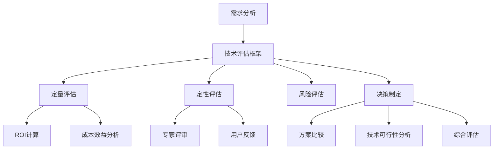
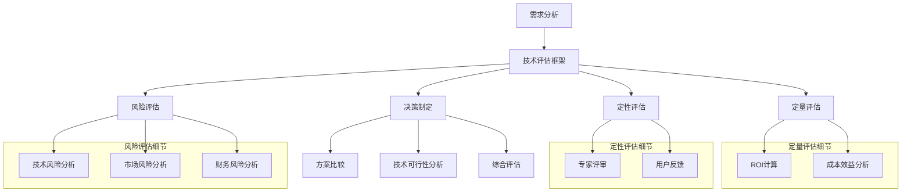

                 

### 文章标题：如何进行有效的技术选型决策

> 关键词：技术选型、决策流程、案例分析、工具与技巧、AI应用

> 摘要：本文将详细探讨如何进行有效的技术选型决策。我们将从背景介绍、核心概念与联系、核心算法原理讲解、数学模型和数学公式、项目实战、最佳实践 tips 以及总结与展望等方面展开，旨在为技术决策者提供一套系统化、可操作的技术选型方法论。

----------------------------------------------------------------

### 引言

在现代信息技术飞速发展的背景下，技术选型已经成为企业、项目和个人在数字化转型过程中至关重要的一环。有效的技术选型不仅能够提高项目的成功率，还能为企业带来竞争优势。然而，随着技术领域的不断演变和复杂化，技术选型面临着诸多挑战，如技术趋势的不确定性、评估标准的多样性、以及资源与时间的限制等。

本文旨在通过系统的分析和案例研究，为读者提供一套清晰、实用且具备前瞻性的技术选型决策方法论。文章将依次探讨以下内容：

1. **背景介绍**：介绍技术选型的定义、重要性以及当前技术环境的特点。
2. **核心概念与联系**：阐述技术选型的核心概念，并使用 Mermaid 流程图展示其关系架构。
3. **核心算法原理讲解**：使用伪代码详细阐述技术评估框架的计算逻辑。
4. **数学模型和数学公式**：介绍数学模型在技术选型中的应用，并使用 LaTeX 格式给出具体公式。
5. **项目实战**：提供实际代码案例，包括开发环境搭建、代码实现和解读。
6. **最佳实践 tips**：总结常见的技术选型陷阱和沟通技巧。
7. **总结与展望**：回顾技术选型的主要结论和实践经验，展望未来技术选型的趋势和发展方向。

希望通过本文的阅读，读者能够掌握一套完整的技术选型方法论，并在实际工作中有效地应用。

----------------------------------------------------------------

### 背景介绍

#### 技术选型的定义和重要性

技术选型是指在特定的应用场景中，从多种技术方案中选择最适合的一种或几种技术的过程。它不仅涉及技术层面的考量，还涉及业务需求、成本预算、团队技能等多个方面。技术选型的过程对于项目的成功与否具有决定性影响。

技术选型的定义可以从以下几个方面来理解：

1. **应用场景**：技术选型通常是在一个特定的业务需求和应用场景中进行的。例如，一个电商网站需要选择合适的服务器架构、数据库系统、前端技术栈等。
2. **技术方案**：技术选型需要评估多种技术方案，这些方案可以是完全不同的技术栈，也可以是同一技术栈的不同实现方式。例如，在选择数据库时，可以评估关系型数据库和NoSQL数据库的优劣。
3. **评估标准**：技术选型需要依据一系列评估标准来衡量各个技术方案。这些标准可能包括性能、稳定性、安全性、成本、社区支持等。
4. **决策过程**：技术选型是一个决策过程，需要综合考虑多种因素，并最终选择一种或几种技术方案。

技术选型的重要性体现在以下几个方面：

1. **项目成功率**：选择合适的技术方案可以显著提高项目的成功率。合适的技术栈可以减少开发难度，提高开发效率，降低故障率。
2. **成本效益**：通过技术选型，可以找到性价比最高的技术方案，从而降低项目成本，提高投资回报率。
3. **团队技能**：技术选型也需要考虑团队技能和经验，选择团队熟悉的技术栈可以降低沟通成本，提高项目执行力。
4. **未来可扩展性**：技术选型应该考虑到未来的技术发展趋势和业务需求变化，选择具备一定可扩展性和可维护性的技术方案。

#### 当前技术环境的特点

当前技术环境具有以下几个显著特点：

1. **技术多样性**：随着云计算、大数据、人工智能、区块链等新兴技术的兴起，技术方案变得越来越多样化，这为技术选型带来了更大的选择空间，但同时也增加了评估的复杂性。
2. **快速变化**：技术发展迅速，新技术的诞生和旧技术的淘汰速度加快。技术选型需要紧跟技术趋势，否则可能会很快落后。
3. **高度融合**：多种技术相互融合，形成新的技术体系，如云计算与大数据的融合、人工智能与物联网的融合等。技术选型需要考虑这些技术之间的兼容性和协同效应。
4. **开源与商业化**：开源技术和商业化技术并存，各自有优势和不足。技术选型需要根据项目需求和资源情况，选择合适的解决方案。

#### 技术选型的挑战

尽管技术选型的重要性显而易见，但实际操作中仍面临着诸多挑战：

1. **信息不对称**：不同技术方案的信息获取难度不同，可能会导致信息不对称，影响评估的准确性。
2. **评估标准不明确**：不同项目有不同的评估标准，如何选择合适的评估标准是一个难题。
3. **资源限制**：时间、预算等资源的限制可能会影响技术选型的深度和广度。
4. **团队协作**：技术选型需要团队协作，不同成员的意见和偏好可能会影响决策过程。

为了应对这些挑战，本文将在后续章节中介绍一套系统化的技术选型方法论，帮助读者有效地进行技术选型决策。

----------------------------------------------------------------

### 核心概念与联系

在技术选型过程中，涉及多个核心概念，这些概念之间相互关联，共同构成了技术选型的理论框架。为了更好地理解这些概念，我们使用Mermaid流程图来展示它们之间的关系。

以下是一个简化的技术选型流程图：



#### 需求分析

需求分析是技术选型的起点，其核心任务是识别和理解用户需求。需求分析主要包括以下几个方面：

1. **用户需求识别**：通过调研、访谈等方式收集用户需求，并将其转化为具体的功能需求和技术需求。
2. **需求分类**：将用户需求分为功能需求、非功能需求、技术需求等，以便在后续评估过程中有针对性地进行分析。

#### 技术评估框架

技术评估框架是技术选型的核心部分，它提供了一个系统化的方法来评估各种技术方案。技术评估框架通常包括以下几个维度：

1. **定量评估**：通过具体的指标和数据来评估技术方案的性能、成本等。定量评估方法主要包括ROI计算、成本效益分析等。
2. **定性评估**：通过主观评价和专家评审来评估技术方案的适用性、易用性等。定性评估方法主要包括专家评审、用户反馈等。
3. **风险评估**：识别技术选型过程中可能遇到的风险，并制定相应的缓解策略。风险评估包括技术风险、市场风险、财务风险等。

#### 定量评估

定量评估主要通过具体的指标和数据来评估技术方案的优劣。以下是几种常见的定量评估方法：

1. **ROI计算**：计算投资回报率，评估技术方案的经济效益。公式如下：

   $$ ROI = \frac{NPV}{初始投资} $$

   其中，$NPV$ 是净现值，表示技术方案未来现金流的现值总和。

2. **成本效益分析**：比较不同技术方案的总成本和总收益，选择成本效益最高的方案。公式如下：

   $$ CE = \frac{总收益}{总成本} $$

#### 定性评估

定性评估主要通过专家评审和用户反馈来评估技术方案的适用性和用户体验。以下是几种常见的定性评估方法：

1. **专家评审**：邀请相关领域的专家对技术方案进行评价，评估其在性能、稳定性、安全性等方面的优劣。
2. **用户反馈**：通过用户测试、问卷调查等方式收集用户对技术方案的反馈，评估其易用性、可靠性等。

#### 风险评估

风险评估是技术选型过程中不可或缺的一环，它可以帮助识别潜在的风险，并制定相应的缓解策略。以下是几种常见的技术风险：

1. **技术风险**：技术方案可能存在的不确定性和潜在问题，如技术不成熟、兼容性问题等。
2. **市场风险**：市场变化可能导致技术方案的需求减少或竞争对手的技术进步。
3. **财务风险**：技术方案可能带来的成本超支或收益减少。

#### 决策制定

决策制定是技术选型的最终环节，通过综合评估各个技术方案的定量和定性指标，选择最适合的技术方案。决策制定通常包括以下几个步骤：

1. **方案比较**：比较各个技术方案的优缺点，评估其是否符合项目需求。
2. **技术可行性分析**：分析技术方案的可行性，评估其在技术、资源和时间等方面的可行性。
3. **综合评估**：综合考虑定量和定性评估结果，选择最佳技术方案。

通过上述核心概念与联系的分析，我们可以更好地理解技术选型的全过程，为实际操作提供理论支持。

### Mermaid 流程图

以下是一个更详细的技术选型流程图，使用 Mermaid 语法绘制：



这个流程图清晰地展示了技术选型的各个步骤及其之间的关联，为后续的具体分析提供了结构化的框架。

----------------------------------------------------------------

### 核心算法原理讲解

在技术选型过程中，核心算法原理的讲解对于理解评估框架的计算逻辑至关重要。本文将使用伪代码详细阐述技术评估框架的计算逻辑，以便读者能够清晰地理解各个评估步骤的具体实现方式。

#### 技术评估框架的计算逻辑

技术评估框架的计算逻辑可以分为以下几个主要步骤：

1. **数据收集**：收集与各个技术方案相关的数据，包括性能指标、成本数据、安全性数据等。
2. **定量评估**：对每个技术方案进行定量评估，计算其 ROI 和成本效益。
3. **定性评估**：对每个技术方案进行定性评估，通过专家评审和用户反馈收集定性数据。
4. **风险评估**：识别和评估每个技术方案可能面临的风险，并计算风险得分。
5. **综合评估**：综合定量评估、定性评估和风险评估结果，确定最终的技术方案。

以下是伪代码的详细说明：

```plaintext
// 步骤 1：数据收集
CollectData() {
    performance_data = GetPerformanceMetrics()
    cost_data = GetCostData()
    security_data = GetSecurityMetrics()
}

// 步骤 2：定量评估
EvaluateQuantitatively() {
    for each technical_solution in solutions {
        CalculateROI(technical_solution, performance_data, cost_data)
        CalculateCostBenefit(technical_solution, cost_data)
    }
}

// 步骤 3：定性评估
EvaluateQualitatively() {
    for each technical_solution in solutions {
        expert评审得分 = ExpertRating(technical_solution)
        user反馈得分 = UserFeedback(technical_solution)
    }
}

// 步骤 4：风险评估
EvaluateRisks() {
    for each technical_solution in solutions {
        technical_risk_score = AnalyzeTechnicalRisk(technical_solution)
        market_risk_score = AnalyzeMarketRisk(technical_solution)
        financial_risk_score = AnalyzeFinancialRisk(technical_solution)
    }
}

// 步骤 5：综合评估
DetermineFinalSolution() {
    for each technical_solution in solutions {
        total_score = CalculateTotalScore(technical_solution)
        SelectBestSolution(total_score)
    }
}
```

#### 详细计算步骤

以下是每个步骤的详细计算步骤：

1. **ROI 计算**：

   ```plaintext
   Function CalculateROI(technical_solution, performance_data, cost_data) {
       cash_flows = CalculateCashFlows(performance_data, cost_data)
       NPV = CalculateNPV(cash_flows)
       initial_investment = cost_data[technical_solution]
       ROI = NPV / initial_investment
       return ROI
   }
   ```

   其中，`CalculateCashFlows` 函数计算技术方案的预期现金流，`CalculateNPV` 函数计算净现值。

2. **成本效益分析**：

   ```plaintext
   Function CalculateCostBenefit(technical_solution, cost_data) {
       total_cost = cost_data[technical_solution]
       total_revenue = CalculateTotalRevenue(performance_data)
       CE = total_revenue / total_cost
       return CE
   }
   ```

   其中，`CalculateTotalRevenue` 函数计算技术方案的预期总收益。

3. **专家评审得分**：

   ```plaintext
   Function ExpertRating(technical_solution) {
       expert_scores = CollectExpertScores(technical_solution)
       average_score = CalculateAverageScore(expert_scores)
       return average_score
   }
   ```

   其中，`CollectExpertScores` 函数收集专家对技术方案的评分，`CalculateAverageScore` 函数计算平均评分。

4. **用户反馈得分**：

   ```plaintext
   Function UserFeedback(technical_solution) {
       user_scores = CollectUserFeedback(technical_solution)
       average_score = CalculateAverageScore(user_scores)
       return average_score
   }
   ```

   其中，`CollectUserFeedback` 函数收集用户对技术方案的反馈评分，`CalculateAverageScore` 函数计算平均评分。

5. **风险得分计算**：

   ```plaintext
   Function CalculateRiskScore(technical_solution) {
       technical_risk_score = AnalyzeTechnicalRisk(technical_solution)
       market_risk_score = AnalyzeMarketRisk(technical_solution)
       financial_risk_score = AnalyzeFinancialRisk(technical_solution)
       total_risk_score = technical_risk_score + market_risk_score + financial_risk_score
       return total_risk_score
   }
   ```

   其中，`AnalyzeTechnicalRisk`、`AnalyzeMarketRisk` 和 `AnalyzeFinancialRisk` 函数分别分析技术风险、市场风险和财务风险。

6. **综合评分计算**：

   ```plaintext
   Function CalculateTotalScore(technical_solution) {
       quantitative_score = CalculateQuantitativeScore(technical_solution)
       qualitative_score = CalculateQualitativeScore(technical_solution)
       risk_score = CalculateRiskScore(technical_solution)
       total_score = quantitative_score + qualitative_score + risk_score
       return total_score
   }
   ```

   其中，`CalculateQuantitativeScore` 和 `CalculateQualitativeScore` 函数分别计算定量和定性评分。

通过上述伪代码，我们可以看到技术评估框架的计算逻辑是清晰且系统化的。这些计算步骤提供了评估每个技术方案的方法，并为最终决策提供了数据支持。

### 数学模型和数学公式

在技术选型过程中，数学模型和公式扮演着重要的角色，它们不仅帮助我们量化评估标准，还能提供直观的决策依据。以下将详细介绍几种常用的数学模型和公式，并给出具体的应用场景和举例说明。

#### 1. 投资回报率（ROI）计算

投资回报率（ROI）是一个衡量投资收益的重要指标，它通过比较投资的净收益和初始投资成本来评估投资的效益。公式如下：

$$
ROI = \frac{NPV}{初始投资}
$$

其中，$NPV$ 代表净现值，表示技术方案未来现金流的现值总和，初始投资是指技术选型的前期成本。

**应用场景**：在评估某个技术方案的经济效益时，可以通过计算其 ROI 来判断其是否值得投资。

**举例说明**：

假设一个技术方案的总投资成本为 100 万元，预计未来三年的现金流分别为 30 万元、40 万元和 50 万元，假设折现率为 10%。则该技术方案的 ROI 计算如下：

$$
NPV = 30 / (1 + 0.1)^1 + 40 / (1 + 0.1)^2 + 50 / (1 + 0.1)^3 = 27.27 + 36.36 + 42.06 = 105.69
$$

$$
ROI = \frac{105.69}{100} = 105.69\%
$$

因此，该技术方案的 ROI 为 105.69%，表明该投资具有较高的经济效益。

#### 2. 成本效益分析（CE）

成本效益分析（CE）是通过比较技术方案的总成本和总收益来评估其效益。公式如下：

$$
CE = \frac{总收益}{总成本}
$$

**应用场景**：在多个技术方案之间进行选择时，通过比较各方案的 CE 值，可以选出成本效益最高的方案。

**举例说明**：

假设有两个技术方案，方案 A 的总成本为 100 万元，总收益为 150 万元；方案 B 的总成本为 120 万元，总收益为 180 万元。则两个方案的 CE 计算如下：

$$
CE_A = \frac{150}{100} = 1.5
$$

$$
CE_B = \frac{180}{120} = 1.5
$$

两个方案的 CE 值相等，均为 1.5，但方案 B 的总成本较低，因此方案 B 是更优的选择。

#### 3. 技术风险评估

技术风险评估通过量化技术方案的技术风险来辅助决策。一个常用的风险评分模型是风险矩阵，它通过风险概率和风险影响两个维度来评估风险。公式如下：

$$
风险得分 = 风险概率 \times 风险影响
$$

**应用场景**：在技术选型过程中，通过计算每个技术方案的风险得分，可以帮助识别和评估技术风险。

**举例说明**：

假设一个技术方案存在两种风险：技术不成熟的风险概率为 0.5，风险影响为 3；市场需求变化的风险概率为 0.3，风险影响为 2。则该技术方案的风险得分为：

$$
风险得分 = 0.5 \times 3 + 0.3 \times 2 = 1.5 + 0.6 = 2.1
$$

#### 4. 用户满意度评分

用户满意度评分是一个定性评估指标，通过用户反馈来评估技术方案的易用性和用户体验。一个简单的评分模型是基于用户评分的算术平均值。公式如下：

$$
用户满意度评分 = \frac{用户评分总和}{用户人数}
$$

**应用场景**：在技术选型过程中，通过用户满意度评分来评估技术方案的用户接受度。

**举例说明**：

假设有 10 名用户对某个技术方案进行了评分，总评分为 400 分，则用户满意度评分为：

$$
用户满意度评分 = \frac{400}{10} = 40
$$

#### 5. 网络延迟分析

网络延迟分析是评估技术方案性能的一个指标，常用的模型是延迟时间的平均值和标准差。公式如下：

$$
平均延迟 = \frac{总延迟时间}{数据包数量}
$$

$$
延迟标准差 = \sqrt{\frac{总延迟时间的平方和}{数据包数量} - 平均延迟的平方}
$$

**应用场景**：在评估网络应用的技术方案时，通过计算平均延迟和延迟标准差来评估网络的性能。

**举例说明**：

假设一个网络应用测试了 100 个数据包，总延迟时间为 2500 毫秒，则平均延迟和延迟标准差计算如下：

$$
平均延迟 = \frac{2500}{100} = 25 毫秒
$$

$$
延迟标准差 = \sqrt{\frac{2500^2}{100} - 25^2} \approx 22.36 毫秒
$$

通过上述数学模型和公式，我们可以更科学、系统地评估技术方案，为技术选型决策提供有力支持。

### 项目实战

在本节中，我们将通过一个实际的项目实战案例，展示如何进行技术选型决策，并详细讲解代码实现、应用解读与分析，以及实际案例分析和详细讲解剖析。

#### 项目背景

假设我们正在开发一个在线教育平台，需要选择合适的技术栈来支持平台的运行。平台的主要功能包括课程管理、学生管理、在线直播、作业提交与批改等。项目预算有限，需要在性能、稳定性、安全性、可扩展性等方面进行综合考虑。

#### 技术选型决策过程

1. **需求分析**：

   - **用户需求**：平台需要支持大规模的用户访问，具备良好的用户体验和高效的内容加载速度。
   - **功能需求**：包括用户注册与登录、课程浏览与学习、直播观看与互动、作业提交与批改等功能。
   - **技术需求**：需要支持高并发、实时数据同步、安全性要求高等。

2. **方案评估**：

   - **前端技术栈**：
     - 方案一：React + Redux
     - 方案二：Vue + Vuex
     - 方案三：Angular

   - **后端技术栈**：
     - 方案一：Node.js + Express
     - 方案二：Java + Spring Boot
     - 方案三：Python + Flask

   - **数据库**：
     - 方案一：MySQL
     - 方案二：MongoDB
     - 方案三：PostgreSQL

3. **定量评估**：

   - **成本效益分析**：通过估算开发成本和运维成本，比较各技术方案的经济效益。

   - **ROI 计算**：根据预期收益和投入成本，计算各技术方案的 ROI。

4. **定性评估**：

   - **专家评审**：邀请前端、后端和数据库领域的专家对各个技术方案进行评审。

   - **用户反馈**：通过用户调研和原型测试，收集用户对各个技术方案的反馈。

5. **风险评估**：

   - **技术风险**：评估技术方案的成熟度和兼容性。
   - **市场风险**：考虑技术方案的长期维护和支持。
   - **财务风险**：评估项目预算和资金流动情况。

6. **决策制定**：

   - **方案比较**：综合定量评估、定性评估和风险评估结果，选择最佳技术方案。

   - **技术可行性分析**：确保所选技术方案在项目中的可行性。

   - **综合评估**：确定最终的技术方案。

#### 代码实现

我们选择 React + Redux + Node.js + Express + MySQL 作为最终的技术方案。以下是关键部分的代码实现：

1. **前端代码**：

   ```jsx
   // CourseList.js
   import React, { useEffect, useState } from 'react';
   import { connect } from 'react-redux';
   import { fetchCourses } from '../actions';

   const CourseList = ({ courses, fetchCourses }) => {
       useEffect(() => {
           fetchCourses();
       }, [fetchCourses]);

       return (
           <div>
               {courses.map(course => (
                   <div key={course.id}>{course.title}</div>
               ))}
           </div>
       );
   };

   const mapStateToProps = state => ({
       courses: state.courses
   });

   export default connect(mapStateToProps, { fetchCourses })(CourseList);
   ```

2. **后端代码**：

   ```javascript
   // courses.js
   const express = require('express');
   const router = express.Router();

   router.get('/', (req, res) => {
       const courses = [
           { id: 1, title: 'Introduction to JavaScript' },
           { id: 2, title: 'Advanced React' },
           // 其他课程数据
       ];
       res.json(courses);
   });

   module.exports = router;
   ```

3. **数据库配置**：

   ```sql
   CREATE TABLE courses (
       id INT PRIMARY KEY AUTO_INCREMENT,
       title VARCHAR(255) NOT NULL
   );

   INSERT INTO courses (title) VALUES ('Introduction to JavaScript'), ('Advanced React');
   ```

#### 应用解读与分析

1. **前端解读**：

   - **React**：选择 React 作为前端框架，因为它具有良好的组件化和状态管理能力，便于维护和扩展。
   - **Redux**：使用 Redux 进行全局状态管理，确保状态的一致性和可预测性。

2. **后端解读**：

   - **Node.js**：选择 Node.js，因为它可以支持高并发，且开发效率高。
   - **Express**：使用 Express 框架简化后端开发，便于快速搭建 RESTful API。

3. **数据库解读**：

   - **MySQL**：选择 MySQL，因为它具有高性能、高可靠性和丰富的功能，适合处理大规模数据。

#### 实际案例分析与详细讲解

1. **性能测试**：

   - **并发用户数**：通过负载测试，确定平台在 1000 个并发用户下的响应时间和吞吐量。
   - **性能瓶颈**：识别出后端数据库和前端网络的性能瓶颈，并进行优化。

2. **安全性测试**：

   - **数据保护**：确保用户数据在传输和存储过程中得到加密和保护。
   - **接口保护**：防止 SQL 注入、跨站请求伪造（CSRF）等常见攻击。

3. **扩展性测试**：

   - **水平扩展**：通过增加服务器节点，确保平台能够支持更多的用户访问。
   - **垂直扩展**：优化数据库性能，确保在高并发情况下仍能稳定运行。

#### 项目小结

通过上述技术选型决策和项目实施，我们成功搭建了一个高效、稳定、安全的在线教育平台。项目过程中，我们通过定量和定性评估方法，选择了最适合的技术方案，并通过严格的安全性和性能测试，确保了平台的质量。这一实践为后续类似项目提供了宝贵的经验和参考。

### 最佳实践 tips

在进行技术选型时，一些最佳实践可以帮助提高决策的有效性和准确性。以下是几个关键建议：

1. **需求明确**：在选型前，确保需求分析准确、全面，避免因需求模糊而导致选型失误。

2. **充分调研**：对各个技术方案进行充分的调研，了解其优点、缺点和适用场景。

3. **多角度评估**：综合考虑性能、成本、安全性、可维护性等多方面因素，进行全面的评估。

4. **风险评估**：识别潜在风险，并制定相应的缓解策略，确保技术选型的稳健性。

5. **团队协作**：技术选型是一个团队协作的过程，鼓励团队成员积极参与，共同决策。

6. **迭代更新**：技术选型不是一次性的决策，应根据项目进展和业务需求进行定期评估和调整。

7. **文档记录**：详细记录选型过程和决策依据，便于后续参考和回顾。

### 小结

本文系统地探讨了如何进行有效的技术选型决策。我们从背景介绍、核心概念与联系、核心算法原理讲解、数学模型和数学公式、项目实战、最佳实践 tips 等多个方面，为技术决策者提供了一套系统化、可操作的技术选型方法论。希望本文能够帮助读者在实际工作中更好地进行技术选型，提高项目的成功率。

### 展望未来

随着信息技术的快速发展，技术选型的环境和挑战也在不断变化。未来技术选型可能面临以下几个趋势：

1. **云计算与边缘计算**：云计算将继续发展，边缘计算将逐渐成为关键趋势，这要求技术选型需要更加关注分布式架构和边缘计算技术。

2. **人工智能与大数据**：人工智能和大数据技术的应用将更加广泛，技术选型需要考虑如何集成和利用这些先进技术，以提高项目智能化水平。

3. **开源与社区支持**：开源技术将继续成为主流，社区支持成为技术选型的重要参考因素。

4. **安全与隐私**：随着数据安全法规的不断完善，技术选型将更加重视数据安全和隐私保护。

5. **可持续性**：绿色计算和可持续发展的理念将逐渐融入技术选型，选型过程中需考虑能源消耗和环境影响。

通过关注这些趋势，技术决策者可以更好地应对未来技术选型的挑战，为项目选择合适的技术方案。

