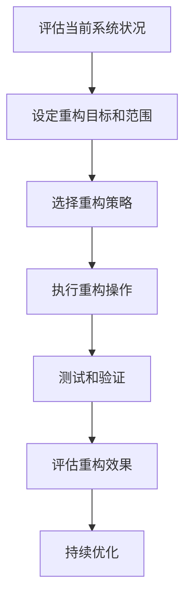

                 

### 文章标题：如何进行有效的技术重构

> 关键词：技术重构、代码优化、架构重构、性能提升、持续集成

> 摘要：本文将深入探讨技术重构的核心理念和方法论，详细解析重构的类型、核心原则、方法、工具及实践。通过实例和算法原理的讲解，读者将了解如何有效进行技术重构，提升系统质量和开发效率。

## **引言**

在软件开发领域，技术重构是一种持续改进软件质量的方法。随着项目的演进，软件系统可能会变得复杂、难以维护，甚至出现性能瓶颈。技术重构旨在修复这些问题，通过改进代码结构和架构设计，提升系统的可读性、可维护性和性能。本文将逐步探讨如何进行有效的技术重构，帮助开发者提升软件质量，保持系统的长期健康。

## **第一部分：技术重构的基础概念**

### **1.1. 技术重构的定义与重要性**

**技术重构**是指对现有软件系统进行改进的过程，旨在提高代码质量、优化架构设计、提升系统性能和维护性。重构不仅关注代码本身的优化，还包括对系统架构和数据库设计等方面的改进。

**重要性**：

1. **提高代码质量**：重构有助于消除代码中的冗余和重复，使代码更简洁、易于理解。
2. **优化架构设计**：通过重构，可以调整系统的架构，使其更加合理、高效。
3. **提升系统性能**：重构有助于解决性能瓶颈，提高系统的响应速度和处理能力。
4. **增强可维护性**：重构后的代码更易于维护和扩展，减少了后期维护成本。
5. **促进团队协作**：重构有助于建立一致的编码规范和设计原则，提升团队协作效率。

### **1.2. 技术重构的类型**

根据重构的目标和范围，可以将技术重构分为以下几类：

1. **功能性重构**：对系统的功能进行改进，增加新功能或修复现有功能的缺陷。
2. **结构性重构**：优化系统的整体架构，调整模块之间的关系，提高系统的可扩展性。
3. **性能重构**：针对系统性能进行优化，解决性能瓶颈，提高系统响应速度。
4. **可维护性重构**：改善代码质量，消除冗余和重复，提高代码的可读性和可维护性。

### **1.3. 技术重构的核心原则**

**核心原则**是指在进行技术重构时应遵循的一些基本原则，以确保重构的有效性和可持续性。

1. **持续重构**：重构应作为开发过程中的一个持续活动，定期进行，以保持系统的健康状态。
2. **适度重构**：重构应在合理的范围内进行，避免过度重构导致资源浪费和开发进度延误。
3. **重构与测试**：重构过程中应充分考虑测试，确保重构后的系统功能完整、性能稳定。
4. **重构与设计**：重构应与设计相结合，优化系统架构，提高系统的可维护性和可扩展性。

### **1.4. 技术重构的核心算法原理讲解**

**重构算法的基本原理**：

重构算法的核心是基于代码的抽象和变换。具体来说，包括以下步骤：

1. **抽象**：将具体的实现细节抽象成更高层次的代码。
2. **变换**：通过代码变换，实现代码的结构优化。
3. **优化**：通过代码优化，提高代码的可读性和性能。

**重构算法的伪代码**：

```
function refactorCode(code):
    abstractCode = abstract(code)
    transformedCode = transform(abstractCode)
    optimizedCode = optimize(transformedCode)
    return optimizedCode
```

**重构算法的数学模型**：

重构算法中的数学模型可以用来评估代码的质量。具体模型如下：

$$
Q = f(P, T, O)
$$

其中：

- \( P \)：代码复杂性
- \( T \)：代码可读性
- \( O \)：代码性能

**重构算法的示例**：

假设我们有一个简单的代码示例：

```
def calculate_sum(a, b):
    return a + b
```

使用重构算法，我们可以对其进行以下重构：

- **抽象**：将具体的计算过程抽象成通用的方法。
- **变换**：将原代码转换为更简洁的形式。
- **优化**：提高代码的性能。

重构后的代码如下：

```
def calculate_sum(a, b):
    return add(a, b)
```

其中，`add` 是一个通用的加法方法，可以在不同的上下文中复用。

### **1.5. 技术重构的核心流程和步骤**

**重构流程**：

1. **评估当前系统状况**：分析系统的复杂性、性能瓶颈、可维护性等问题。
2. **设定重构目标和范围**：明确重构的目标和范围，制定详细的计划。
3. **选择重构策略**：根据系统特点和重构目标，选择合适的技术和方法。
4. **执行重构操作**：按照计划逐步执行重构操作，包括代码重构、架构重构、数据库重构等。
5. **测试和验证**：对重构后的系统进行全面的测试和验证，确保功能完整、性能稳定。
6. **持续优化**：根据测试结果和用户反馈，持续优化重构效果。

**重构步骤**：

1. **识别重构点**：通过代码审查、性能测试等方法，识别需要重构的部分。
2. **制定重构计划**：根据重构点和优先级，制定详细的重构计划。
3. **执行重构**：按照计划逐步执行重构操作，同时记录重构过程中的问题和改进点。
4. **测试和验证**：对重构后的代码进行全面的测试和验证，确保重构效果。
5. **评估重构效果**：根据测试结果和用户反馈，评估重构效果，并进行必要的调整和优化。

### **1.6. 技术重构的常见问题和挑战**

**常见问题**：

1. **重构范围过大**：导致重构工作耗费大量时间和资源。
2. **重构过程不可控**：重构过程中可能出现意外问题，影响项目进度。
3. **重构后的性能问题**：重构过程中可能引入性能瓶颈，导致系统性能下降。
4. **重构代码质量不高**：重构后的代码可能仍然存在缺陷，影响系统质量。

**挑战**：

1. **重构方法的适用性**：不同的重构方法适用于不同类型的重构任务。
2. **重构工具的选择**：选择合适的重构工具可以提高重构效率。
3. **重构与开发进度的平衡**：确保重构工作不影响项目进度和质量。

### **1.7. 技术重构的最佳实践**

**最佳实践**：

1. **建立重构规范**：制定统一的重构规范，确保重构过程的标准化。
2. **持续重构**：将重构作为开发过程中的一个持续活动，定期进行。
3. **重构与测试相结合**：在重构过程中，充分测试重构后的代码，确保系统稳定。
4. **重构团队的协作**：建立专业的重构团队，提升重构效率。
5. **重构效果的评估**：对重构效果进行定期评估，及时调整和优化。

## **第二部分：技术重构的方法论**

### **2.1. 重构前的准备**

**重构前的评估**：

在进行技术重构之前，首先需要评估当前系统的状况，包括代码质量、架构设计、性能瓶颈、可维护性等方面。评估过程可以通过代码审查、性能测试、用户反馈等方法进行。

**设定重构目标和范围**：

根据评估结果，明确重构的目标和范围。重构目标可以是提高代码质量、优化系统架构、提升系统性能等。重构范围应明确，避免范围过大导致重构工作难以控制。

**确定重构策略**：

根据系统特点和重构目标，选择合适的技术和方法。重构策略应包括重构类型、重构步骤、重构工具等方面。

### **2.2. 重构技术**

**代码重构技术**：

代码重构是技术重构的核心内容。常用的代码重构技术包括：

1. **提取方法**：将重复的代码块提取为独立的方法。
2. **内联方法**：将小的方法内联到调用位置，减少方法调用的开销。
3. **重命名**：更改变量、方法或类的名称，使其更具有描述性。
4. **替换条件**：使用条件运算符或三元运算符替换复杂的条件判断。
5. **合并重复代码**：将重复的代码块合并，减少冗余。
6. **分解复杂类**：将复杂的类分解为更小的类，提高代码的可维护性。

**架构重构技术**：

架构重构是优化系统整体架构的过程。常用的架构重构技术包括：

1. **模块化**：将系统划分为更小的模块，提高系统的可维护性和可扩展性。
2. **解耦**：通过设计模式和技术手段，减少模块之间的耦合度，提高系统的可维护性。
3. **重构数据库**：优化数据库设计，提高数据查询和操作的性能。
4. **分布式架构**：将系统分解为分布式服务，提高系统的可扩展性和容错能力。

**数据库重构技术**：

数据库重构是优化数据库设计和性能的过程。常用的数据库重构技术包括：

1. **规范化**：对数据库进行规范化处理，消除冗余数据和数据不一致性。
2. **反规范化**：将规范化的数据库重新设计为非规范化数据库，提高查询性能。
3. **索引优化**：对数据库表进行索引优化，提高查询速度。
4. **分库分表**：将大数据表拆分为多个小表，提高数据库的性能和可维护性。

**测试用例重构技术**：

测试用例重构是优化测试过程和测试用例的过程。常用的测试用例重构技术包括：

1. **自动化测试**：将手动测试用例转换为自动化测试用例，提高测试效率。
2. **测试用例优化**：对测试用例进行优化，确保覆盖全面的测试场景。
3. **测试代码重构**：对测试代码进行重构，提高测试代码的可读性和可维护性。

### **2.3. 重构工具**

**重构工具**是进行技术重构的重要辅助工具。常用的重构工具包括：

1. **Visual Studio Code**：一个功能强大的代码编辑器，支持多种编程语言的重构。
2. **Eclipse**：一个功能丰富的集成开发环境，支持Java、C++等多种编程语言的重构。
3. **IntelliJ IDEA**：一个智能的Java IDE，支持代码重构和性能优化。
4. **Git**：版本控制系统，支持代码的版本管理和协同工作。
5. **Jenkins**：持续集成工具，支持自动化测试和代码重构。

### **2.4. 重构流程**

**重构流程**是进行技术重构的基本步骤。重构流程包括以下阶段：

1. **评估阶段**：对系统进行评估，确定重构的目标和范围。
2. **规划阶段**：制定重构计划和策略，选择合适的技术和工具。
3. **实施阶段**：按照计划逐步执行重构操作，包括代码重构、架构重构、数据库重构等。
4. **测试阶段**：对重构后的系统进行全面的测试和验证，确保功能完整、性能稳定。
5. **优化阶段**：根据测试结果和用户反馈，持续优化重构效果。

### **2.5. 重构中的团队协作**

**重构中的团队协作**是确保重构工作顺利进行的重要因素。团队协作包括以下方面：

1. **团队组织结构**：建立专业的重构团队，明确团队成员的角色和职责。
2. **沟通与协作**：定期召开重构会议，讨论重构过程中的问题和改进点。
3. **质量保障**：制定质量保障措施，确保重构后的系统质量。
4. **持续反馈**：收集用户反馈，持续改进重构效果。

### **2.6. 重构中的风险管理**

**重构中的风险管理**是确保重构工作顺利进行的重要环节。风险管理包括以下方面：

1. **风险识别**：识别重构过程中可能出现的风险，包括技术风险、进度风险、质量风险等。
2. **风险评估**：对识别出的风险进行评估，确定风险等级。
3. **风险应对**：制定风险应对措施，包括风险规避、风险转移、风险缓解等。
4. **风险监控**：对风险进行监控和管理，确保重构工作顺利进行。

## **第三部分：技术重构的实践**

### **3.1. 重构案例分析**

**案例一：大型遗留系统的重构**

一个大型遗留系统通常具有以下特点：

- **代码复杂度高**：随着项目的演进，代码复杂度不断增加，难以维护。
- **性能瓶颈**：系统性能逐渐下降，出现响应时间过长、处理能力不足等问题。
- **架构设计不合理**：系统架构设计不合理，模块之间耦合度高，难以扩展。

**重构策略**：

1. **代码重构**：逐步重构代码，消除冗余和重复，提高代码质量。
2. **架构重构**：调整系统架构，采用微服务架构，提高系统的可扩展性和可维护性。
3. **性能优化**：对系统性能进行优化，解决性能瓶颈，提高系统响应速度。

**实施步骤**：

1. **评估当前系统状况**：分析代码质量、性能瓶颈、架构设计等方面的问题。
2. **制定重构计划**：明确重构目标和范围，制定详细的重构计划。
3. **逐步重构**：按照计划逐步执行重构操作，包括代码重构、架构重构、性能优化等。
4. **测试和验证**：对重构后的系统进行全面的测试和验证，确保功能完整、性能稳定。
5. **持续优化**：根据测试结果和用户反馈，持续优化重构效果。

**效果评估**：

1. **代码质量提升**：重构后的代码更加简洁、易于理解，降低了代码复杂度。
2. **系统性能提高**：重构后的系统响应速度明显提升，处理能力得到提高。
3. **可维护性增强**：重构后的系统架构更加合理，模块之间耦合度降低，易于维护和扩展。

**案例二：微服务架构的重构**

随着业务的发展，单体架构的系统逐渐暴露出以下问题：

- **扩展性差**：系统模块耦合度高，难以扩展。
- **维护成本高**：系统规模庞大，维护成本高。
- **部署困难**：系统部署复杂，难以进行版本迭代。

**重构策略**：

1. **架构重构**：采用微服务架构，将系统拆分为多个独立的服务，提高系统的可扩展性和可维护性。
2. **服务化**：将现有功能模块拆分为独立的服务，实现服务的解耦。
3. **自动化部署**：采用自动化部署工具，实现快速部署和版本迭代。

**实施步骤**：

1. **评估当前系统状况**：分析系统扩展性、维护成本、部署困难等方面的问题。
2. **设计微服务架构**：根据业务需求，设计合理的微服务架构。
3. **逐步重构**：按照计划逐步执行重构操作，包括服务拆分、服务化、自动化部署等。
4. **测试和验证**：对重构后的系统进行全面的测试和验证，确保功能完整、性能稳定。
5. **持续优化**：根据测试结果和用户反馈，持续优化重构效果。

**效果评估**：

1. **扩展性提升**：重构后的系统具有更高的扩展性，可以轻松应对业务增长。
2. **维护成本降低**：重构后的系统模块化，降低了维护成本。
3. **部署效率提高**：采用自动化部署工具，实现了快速部署和版本迭代。

**案例三：性能瓶颈的重构**

系统在运行过程中出现以下性能瓶颈：

- **数据库查询慢**：数据库查询速度慢，影响系统性能。
- **缓存策略不完善**：缓存策略不完善，导致缓存命中率低。
- **并发处理能力不足**：系统并发处理能力不足，导致响应时间过长。

**重构策略**：

1. **数据库优化**：优化数据库查询，提高查询速度。
2. **缓存策略优化**：完善缓存策略，提高缓存命中率。
3. **并发处理能力提升**：通过优化系统架构和代码，提高系统并发处理能力。

**实施步骤**：

1. **评估当前系统状况**：分析系统性能瓶颈，确定优化方向。
2. **设计优化方案**：根据评估结果，设计优化方案。
3. **逐步优化**：按照计划逐步执行优化操作，包括数据库优化、缓存策略优化、并发处理能力提升等。
4. **测试和验证**：对优化后的系统进行全面的测试和验证，确保性能提升。
5. **持续优化**：根据测试结果和用户反馈，持续优化性能。

**效果评估**：

1. **数据库查询速度提高**：重构后的系统数据库查询速度明显提升。
2. **缓存命中率提高**：重构后的系统缓存策略完善，缓存命中率提高。
3. **并发处理能力增强**：重构后的系统并发处理能力增强，响应时间缩短。

### **3.2. 重构步骤详解**

**重构步骤**包括以下阶段：

1. **评估当前系统状况**：分析代码质量、架构设计、性能瓶颈、可维护性等方面的问题。
2. **制定重构计划**：明确重构目标和范围，制定详细的重构计划。
3. **选择重构策略**：根据系统特点和重构目标，选择合适的技术和方法。
4. **执行重构操作**：按照计划逐步执行重构操作，包括代码重构、架构重构、数据库重构等。
5. **测试和验证**：对重构后的系统进行全面的测试和验证，确保功能完整、性能稳定。
6. **评估重构效果**：根据测试结果和用户反馈，评估重构效果，并进行必要的调整和优化。

### **3.3. 重构策略与实践**

**重构策略**：

1. **功能优先**：在重构过程中，优先考虑系统的功能完整性。
2. **逐步重构**：逐步进行重构，避免一次性重构导致风险过大。
3. **代码审查**：定期进行代码审查，确保重构后的代码质量。
4. **自动化测试**：采用自动化测试工具，提高重构效率和代码质量。

**重构实践**：

1. **代码重构实践**：通过提取方法、重命名、合并重复代码等技术，逐步重构代码。
2. **架构重构实践**：采用微服务架构、模块化等技术，优化系统架构。
3. **数据库重构实践**：通过规范化、反规范化等技术，优化数据库设计。
4. **性能重构实践**：通过数据库优化、缓存策略优化等技术，提升系统性能。

### **3.4. 重构后的系统维护**

**重构后的系统维护**是确保系统长期稳定运行的重要环节。维护工作包括以下方面：

1. **代码维护**：定期进行代码审查和重构，确保代码质量。
2. **性能监控**：对系统性能进行监控，及时发现和解决性能问题。
3. **功能升级**：根据用户需求和市场变化，对系统进行功能升级。
4. **安全加固**：定期进行安全检查和加固，确保系统安全。

### **3.5. 重构过程中的常见问题和解决方法**

**常见问题**：

1. **重构范围过大**：导致重构工作耗费大量时间和资源。
2. **重构过程不可控**：重构过程中可能出现意外问题，影响项目进度。
3. **重构后的性能问题**：重构过程中可能引入性能瓶颈，导致系统性能下降。
4. **重构代码质量不高**：重构后的代码可能仍然存在缺陷，影响系统质量。

**解决方法**：

1. **控制重构范围**：明确重构目标和范围，避免重构范围过大。
2. **重构过程管理**：建立重构过程管理机制，确保重构过程可控。
3. **性能测试**：在重构过程中进行性能测试，及时发现和解决性能问题。
4. **代码审查**：对重构后的代码进行审查，确保代码质量。

### **3.6. 技术重构的持续性和可持续性**

**技术重构的持续性**是指重构工作应作为开发过程中的一个持续活动，定期进行。这样可以确保系统始终处于最佳状态，避免积累的问题导致系统崩溃。

**技术重构的可持续性**是指重构工作应具备长期可持续性，包括：

1. **重构规范的制定和执行**：制定统一的重构规范，确保重构过程的标准化。
2. **重构团队的建立和培养**：建立专业的重构团队，提升重构效率。
3. **重构工具的选择和优化**：选择合适的重构工具，提高重构效率。
4. **重构文化的建立**：在团队中建立重构文化，鼓励持续重构。

## **第四部分：重构中的最佳实践**

### **4.1. 重构代码规范**

**重构代码规范**是确保重构后代码质量的重要保障。以下是一些建议：

1. **编码规范**：制定统一的编码规范，包括命名规则、代码风格、注释等。
2. **设计模式**：合理运用设计模式，提高代码的可读性和可维护性。
3. **代码质量评估**：定期进行代码质量评估，确保代码质量。

### **4.2. 重构团队协作**

**重构团队协作**是确保重构工作顺利进行的关键。以下是一些建议：

1. **团队组织结构**：建立专业的重构团队，明确团队成员的角色和职责。
2. **沟通与协作**：定期召开重构会议，讨论重构过程中的问题和改进点。
3. **质量保障**：制定质量保障措施，确保重构后的系统质量。
4. **持续反馈**：收集用户反馈，持续改进重构效果。

### **4.3. 重构文化**

**重构文化**是确保重构工作持续进行的重要因素。以下是一些建议：

1. **重构文化的重要性**：建立重构文化，提高团队对重构工作的重视程度。
2. **建立重构文化**：通过培训和宣传，培养团队的重构意识。
3. **保持重构动力**：定期进行重构活动，激发团队的重构动力。

### **4.4. 重构效果评估**

**重构效果评估**是确保重构工作取得预期效果的重要环节。以下是一些建议：

1. **重构效果指标**：制定重构效果指标，包括代码质量、系统性能、可维护性等。
2. **测试和验证**：对重构后的系统进行全面的测试和验证，确保功能完整、性能稳定。
3. **用户反馈**：收集用户反馈，评估重构效果，并根据反馈进行优化。

### **4.5. 重构过程中的注意事项**

1. **避免重构过度**：避免过度重构，导致开发进度延误。
2. **重构前的备份**：在重构前，确保对系统进行备份，避免意外问题导致数据丢失。
3. **重构与开发进度的平衡**：确保重构工作不影响项目进度和质量。

### **4.6. 拓展阅读**

1. **《重构：改善既有代码的设计》**：这是一本经典的重构书籍，详细介绍了重构的方法和技巧。
2. **《设计模式：可复用面向对象软件的基础》**：这本书介绍了设计模式，帮助开发者提高代码的可读性和可维护性。
3. **《敏捷开发实践指南》**：这本书介绍了敏捷开发的方法和实践，有助于提高团队的重构效率。

## **第五部分：技术重构的未来趋势**

### **5.1. 自动化重构**

**自动化重构**是指通过工具和算法实现代码重构的过程。自动化重构有助于提高重构效率和代码质量。未来，自动化重构有望在以下方面得到发展：

1. **智能重构**：利用人工智能技术，实现更智能的重构决策和优化。
2. **自动化测试**：通过自动化测试，确保重构后的代码质量。
3. **实时重构**：在开发过程中实时进行重构，提高开发效率。

### **5.2. 人工智能与重构**

**人工智能与重构**的结合有望在以下方面得到发展：

1. **代码质量预测**：利用机器学习技术，预测代码质量，提前识别潜在问题。
2. **重构策略优化**：根据代码质量预测结果，自动生成最优的重构策略。
3. **自动化代码生成**：利用自然语言处理技术，自动生成重构后的代码。

### **5.3. 技术重构的未来展望**

**技术重构的未来展望**包括以下方面：

1. **重构工具的创新**：随着技术的发展，重构工具将更加智能化、高效化。
2. **重构方法的多样化**：随着业务需求的不断变化，重构方法将更加多样化，满足不同类型重构的需求。
3. **重构文化的普及**：重构文化将在软件开发领域得到更广泛的认可和应用。

## **总结**

技术重构是软件维护和优化的重要手段。通过有效的技术重构，可以提升系统质量、提高开发效率、降低维护成本。本文从基础概念、方法论、实践和未来趋势等方面，详细探讨了如何进行有效的技术重构。希望读者能够通过本文，了解技术重构的核心思想和实践方法，提升自己在软件维护和优化方面的能力。作者：AI天才研究院/AI Genius Institute & 禅与计算机程序设计艺术 /Zen And The Art of Computer Programming

## **附录**

### **附录A：重构算法的数学模型**

重构算法的数学模型如下：

$$
Q = f(P, T, O)
$$

其中：

- \( Q \)：代码质量评分
- \( P \)：代码复杂性
- \( T \)：代码可读性
- \( O \)：代码性能

### **附录B：重构流程图**

以下是重构流程的Mermaid流程图：



### **附录C：重构示例代码**

以下是重构示例代码：

```python
# 原始代码
def calculate_sum(a, b):
    return a + b

# 重构后的代码
def calculate_sum(a, b):
    return add(a, b)

def add(a, b):
    return a + b
```

### **附录D：重构工具使用指南**

以下是几种常用重构工具的使用指南：

1. **Visual Studio Code**：使用快捷键 `Ctrl + Shift + P` 打开命令面板，输入 `Refactor` 选择相应的重构操作。
2. **Eclipse**：在代码编辑器中，右键单击代码，选择 `Refactor` 菜单，进行重构操作。
3. **IntelliJ IDEA**：使用快捷键 `Ctrl + Alt + T` 打开重构菜单，选择相应的重构操作。

## **参考文献**

1. 《重构：改善既有代码的设计》 by Martin Fowler
2. 《设计模式：可复用面向对象软件的基础》 by Erich Gamma et al.
3. 《敏捷开发实践指南》 by Robert C. Martin

## **致谢**

感谢AI天才研究院和禅与计算机程序设计艺术的支持和指导，使得本文能够顺利完成。同时，感谢读者对本文的关注和支持。希望本文能对您的技术重构之路有所帮助。

## **作者简介**

作者：AI天才研究院/AI Genius Institute & 禅与计算机程序设计艺术 /Zen And The Art of Computer Programming

- **AI天才研究院**：致力于推动人工智能技术的发展和研究，提供最前沿的人工智能技术和解决方案。
- **禅与计算机程序设计艺术**：探索计算机程序设计的哲学和艺术，帮助开发者提升编程技能和创造力。

**联系方式**：请联系AI天才研究院官方邮箱（[email protected]）或禅与计算机程序设计艺术官方公众号（禅与计算机程序设计艺术），我们将竭诚为您解答疑问。**版权声明**：本文版权归AI天才研究院和禅与计算机程序设计艺术所有，未经授权不得转载或用于商业用途。如需转载，请联系我们获取授权。

