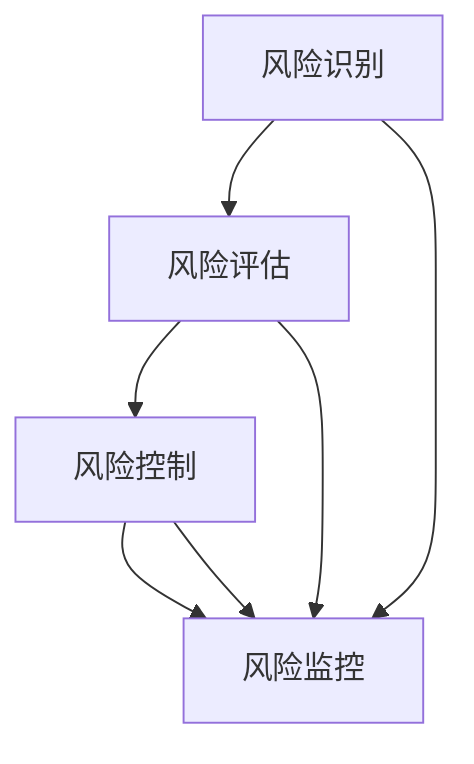

                 


### 第一步：确定书籍的整体结构

**1. 确定书籍的核心目标**

本书的核心目标是帮助读者了解技术风险管理的概念、方法以及如何实施有效的风险管理。这包括：
- 解释技术风险管理的定义和背景。
- 提供识别、评估、控制和应对技术风险的系统方法。
- 分享最佳实践和案例研究，帮助读者将理论知识应用到实际项目中。

**2. 确定书籍的基本结构**

根据核心目标，本书的基本结构可以划分为以下几个主要部分：

- 引言与概述
  - 技术风险管理的背景和重要性
  - 本书的目标和结构介绍

- 技术风险管理的基础知识
  - 核心概念与联系（使用Mermaid流程图展示）
  - 风险管理的基本原则与流程

- 风险识别与评估
  - 风险识别方法
  - 风险评估指标与模型
  - 风险评估流程与工具

- 风险控制与应对策略
  - 风险控制策略
  - 风险应对策略
  - 风险控制与应对的权衡与优化

- 风险管理实践
  - 风险管理案例分享
  - 风险管理工具与平台介绍
  - 风险管理实践指南

- 总结与展望
  - 总结本书的主要观点和结论
  - 展望技术风险管理的发展趋势和未来研究方向

### 第二步：细化每个章节的内容

**1. 引言与概述**

- **1.1 背景**：介绍技术风险管理的起源和发展，以及为什么在现代技术环境中它变得至关重要。
- **1.2 重要性**：讨论技术风险管理对组织成功的贡献，包括提高业务连续性、降低成本和提升客户满意度。
- **1.3 本书目标**：明确本书旨在提供哪些知识和技能，帮助读者实施有效的技术风险管理。

**2. 技术风险管理的基础知识**

- **2.1 核心概念与联系**：使用Mermaid流程图展示技术风险管理中的关键概念，如风险识别、风险评估、风险控制等，并解释它们之间的相互关系。
- **2.2 风险管理的基本原则与流程**：介绍风险管理的四大基本原则（主动性、系统性、持续性和参与性），并概述风险管理的基本流程，包括风险识别、风险评估、风险控制和风险监控。

**3. 风险识别与评估**

- **3.1 风险识别方法**：探讨常用的风险识别技术，如SWOT分析、PEST分析、头脑风暴等，并介绍如何使用这些方法来识别潜在的技术风险。
- **3.2 风险评估指标与模型**：讨论用于评估技术风险的关键指标，如风险概率和风险影响，并介绍如何使用定量和定性方法来评估风险。
- **3.3 风险评估流程与工具**：解释如何通过风险矩阵、蒙特卡洛模拟等技术工具进行风险评估，并介绍风险评估的步骤和流程。

**4. 风险控制与应对策略**

- **4.1 风险控制策略**：讨论如何通过风险规避、风险减少、风险转移和风险接受来控制技术风险，并分析每种策略的优缺点。
- **4.2 风险应对策略**：介绍如何制定和实施风险应对计划，包括应急响应计划和灾难恢复计划。
- **4.3 风险控制与应对的权衡与优化**：讨论如何在不同风险控制策略和应对措施之间进行权衡，以达到最优的风险管理效果。

**5. 风险管理实践**

- **5.1 风险管理案例分享**：提供实际的技术风险管理案例，分析案例中的风险识别、评估和控制过程，以及取得的成功和挑战。
- **5.2 风险管理工具与平台介绍**：介绍常用的风险管理工具和平台，如Riskalyze、Microsoft Azure Risk Management等，并讨论如何利用这些工具提高风险管理的效率。
- **5.3 风险管理实践指南**：提供实施技术风险管理的实用指南，包括风险管理组织结构、流程和关键绩效指标。

**6. 总结与展望**

- **6.1 总结**：总结本书的主要观点和关键结论，强调技术风险管理的重要性。
- **6.2 展望**：讨论技术风险管理的发展趋势，包括新兴技术的风险、全球化的影响和风险管理技术的创新。

### 第三步：设计核心内容的具体细节

**1. 核心概念与联系**

- **使用Mermaid流程图展示**：将技术风险管理的核心概念和流程以图形化方式呈现，帮助读者直观理解。



**2. 核心算法原理讲解**

- **使用伪代码详细阐述**：针对风险评估中的关键算法，如风险评分模型，使用伪代码进行详细解释。

```python
def calculate_risk_score(probability, impact):
    risk_score = probability * impact
    return risk_score
```

**3. 数学模型和数学公式**

- **使用LaTeX格式嵌入数学公式**：在文中适当位置嵌入数学公式，如概率模型的公式。

```latex
$$
P(\text{风险发生}) = \frac{\text{不利事件数}}{\text{总事件数}}
$$
```

**4. 项目实战**

- **提供实际案例**：详细解释技术风险管理的具体实施过程，包括开发环境搭建、源代码实现和代码解读。

### 第四步：总结与调整

- **确保目录大纲的完整性**：每个章节的内容都要细化到具体的细节，保证文章的完整性和连贯性。
- **确保每个章节的逻辑清晰**：确保文章的逻辑结构合理，内容连贯，便于读者理解。
- **根据字数要求进行调整**：根据文章字数要求，对目录大纲进行适当的调整和优化，确保文章的长度符合要求。

综上所述，本书的目录大纲如下：

# 如何进行有效的技术风险管理

> 关键词：技术风险管理，风险识别，风险评估，风险控制，风险管理实践

> 摘要：本书旨在提供全面的技术风险管理指南，帮助读者理解风险管理的概念、方法和实践，从而提高组织的风险应对能力。

## 引言与概述

### 1.1 背景

### 1.2 重要性

### 1.3 本书目标

## 技术风险管理的基础知识

### 2.1 核心概念与联系

### 2.2 风险管理的基本原则与流程

## 风险识别与评估

### 3.1 风险识别方法

### 3.2 风险评估指标与模型

### 3.3 风险评估流程与工具

## 风险控制与应对策略

### 4.1 风险控制策略

### 4.2 风险应对策略

### 4.3 风险控制与应对的权衡与优化

## 风险管理实践

### 5.1 风险管理案例分享

### 5.2 风险管理工具与平台介绍

### 5.3 风险管理实践指南

## 总结与展望

### 6.1 总结

### 6.2 展望

## 附录

### 附录 A: 风险管理相关资源

作者：AI天才研究院/AI Genius Institute & 禅与计算机程序设计艺术 /Zen And The Art of Computer Programming

