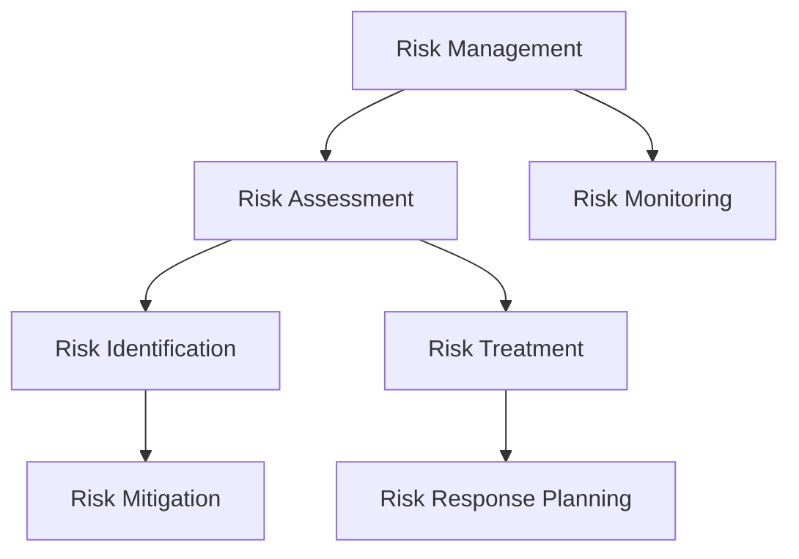

                 

### Step 1: Introduction to Technical Risk Assessment

**Background Introduction**

In the rapidly evolving world of technology, the complexity of systems and the volume of data being processed have grown exponentially. This has led to an increased occurrence of technical risks, which can have significant impacts on businesses, organizations, and even entire industries. Technical risk assessment is a crucial process that helps in identifying, analyzing, and mitigating these risks. It involves the systematic evaluation of potential threats and vulnerabilities to ensure the stability, security, and reliability of a system or a project.

**Core Concepts and Relationships**

The core concepts in technical risk assessment include risk management, risk assessment, risk identification, and risk mitigation. These concepts are interconnected and work together to create a comprehensive risk management strategy.

- **Risk Management**: This is the overall process of handling and mitigating risks. It includes risk identification, risk assessment, risk treatment, and risk monitoring.
- **Risk Assessment**: This is the process of identifying and analyzing risks to determine their potential impact and likelihood.
- **Risk Identification**: This is the process of recognizing potential risks that may affect a project or system.
- **Risk Mitigation**: This is the process of implementing measures to reduce the impact or likelihood of risks.

To illustrate these relationships, we can use the following Mermaid diagram:

**Core Algorithms and Principles**

The core algorithms in technical risk assessment include SWOT analysis, risk matrix, and decision trees. These algorithms help in identifying and prioritizing risks.

- **SWOT Analysis**: This is a strategic planning tool used to evaluate the strengths, weaknesses, opportunities, and threats associated with a project or a system.
- **Risk Matrix**: This is a tool used to assess the impact and likelihood of risks, and to prioritize them based on their severity.
- **Decision Trees**: These are graphical representations of decisions and their potential outcomes, used to analyze and compare different risk mitigation strategies.

**Mathematical Models and Formulas**

The assessment of risks often involves mathematical models to quantitatively evaluate the impact and likelihood of risks. One such model is the Expected Monetary Value (EMV), which is calculated as:

$$
EMV = (Impact \times Probability)
$$

This formula helps in prioritizing risks based on their potential impact.

**Examples**

Let's consider a project involving the development of a new software application. Using the SWOT analysis, we can identify potential risks related to technical issues, such as:

- **Strengths**: The development team has extensive experience in similar projects.
- **Weaknesses**: The team lacks experience with the new programming language being used.
- **Opportunities**: The new language offers better performance and scalability.
- **Threats**: The lack of experience with the new language could lead to longer development times and potential bugs.

**Project Case Study**

A real-world example of technical risk assessment is the development of the Mars Rover by NASA. The project involved significant technical risks, including the reliability of the robotic systems and the communication systems. Through careful risk assessment and mitigation, NASA was able to successfully launch and operate the Mars Rover.

**Best Practices**

To conduct effective technical risk assessment, it is essential to follow best practices:

- **Identify Risks Early**: Risks should be identified and assessed as early as possible in the project lifecycle.
- **Involve Stakeholders**: Stakeholders from various departments should be involved in the risk assessment process to ensure a comprehensive view.
- **Document and Review**: All identified risks, assessments, and mitigation plans should be documented and reviewed regularly.
- **Continuous Improvement**: The risk assessment process should be continuous and should evolve with the project.

**Conclusion**

Technical risk assessment is a critical process in ensuring the success of any project or system. By understanding the core concepts, using appropriate algorithms and mathematical models, and following best practices, organizations can effectively manage and mitigate technical risks. This not only ensures the stability and reliability of their systems but also enhances their competitive advantage in the market.

---

**Author Information**

- **Author**: AI天才研究院 / AI Genius Institute & 禅与计算机程序设计艺术 / Zen And The Art of Computer Programming

This introductory section sets the stage for a deeper dive into the intricacies of technical risk assessment, providing readers with a foundational understanding of the core concepts and their interrelationships. It also highlights the importance of risk assessment in today's complex technological landscape. As we move forward, we will delve deeper into specific frameworks, methods, and practical applications to ensure a comprehensive understanding of this critical process.

