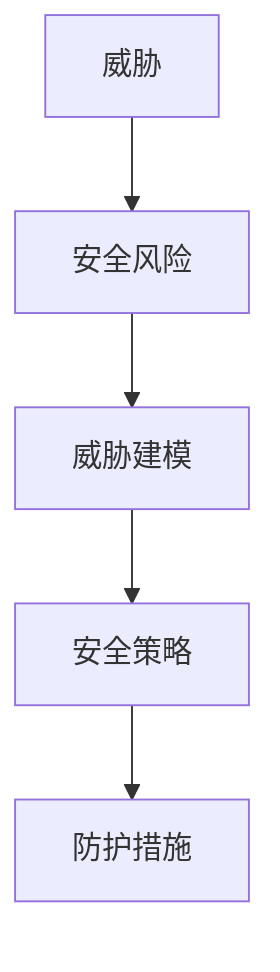

                 

### 文章标题
### 威胁建模：系统性识别安全威胁的方法

### 关键词
- 威胁建模
- 安全威胁
- 安全风险
- 威胁识别
- 威胁分析
- 威胁评估

### 摘要
在数字化时代，网络安全威胁已成为企业和社会面临的重大挑战。本文旨在介绍威胁建模，一种系统性的识别和管理安全威胁的方法。我们将详细探讨威胁建模的核心概念、原理、方法和工具，并通过实际案例，展示如何在实际项目中应用威胁建模，以提高系统的安全性和抵御能力。

### 设计思路
为了确保文章逻辑清晰、内容全面，本文将按照以下结构进行：

1. **背景介绍**：介绍威胁建模的背景和重要性。
2. **核心概念与联系**：阐述威胁建模中的核心概念，并通过Mermaid流程图展示它们之间的关系。
3. **核心算法原理讲解**：使用伪代码和数学公式详细阐述威胁建模的关键算法和原理。
4. **实际案例**：通过一个实际案例，展示如何搭建开发环境、识别和评估威胁，并制定相应的响应策略。
5. **最佳实践与注意事项**：总结威胁建模中的最佳实践、注意事项和拓展阅读。

### 设计步骤
在设计本文时，我们将遵循以下步骤：

1. **确定文章结构**：根据威胁建模的核心内容，设计出清晰的文章结构。
2. **编写各章节内容**：在每个章节中，详细讲解核心概念、算法原理和实际案例。
3. **使用Mermaid流程图和伪代码**：在适当的位置添加Mermaid流程图和算法伪代码，以增强对概念和原理的理解。
4. **编写数学模型和公式**：详细讲解相关的数学模型和公式，确保读者能够理解并掌握相关概念。
5. **总结与拓展**：在文章末尾总结核心内容，并提供拓展阅读和最佳实践建议。

### 目录大纲
以下是本文的目录大纲：

# 威胁建模：系统性识别安全威胁的方法

## 引言
- **数字化时代的网络安全威胁**
- **威胁建模的重要性**
- **本文的结构和内容安排**

## 第一部分 威胁建模基础

## 1.1 威胁建模概述
- **威胁建模的定义**
- **威胁建模的发展历程**

## 1.2 威胁建模原理
- **核心概念与联系**
  - **威胁**
  - **安全风险**
  - **威胁建模的目的**
- **Mermaid流程图**
- **威胁建模的流程**

## 1.3 威胁建模架构
- **威胁建模框架**
- **威胁建模方法论**
- **威胁建模工具和技术**

## 第二部分 威胁建模方法

## 2.1 威胁分析方法
- **威胁分类**
- **威胁识别技术**
  - **基于统计学的威胁识别**
  - **基于机器学习的威胁识别**
  - **威胁情报分析**
- **威胁分析工具**

## 2.2 威胁评估方法
- **威胁评估指标**
- **威胁评估模型**
  - **定量评估模型**
  - **定性评估模型**
- **威胁评估流程**

## 2.3 威胁响应与缓解策略
- **威胁响应策略**
- **威胁缓解措施**
- **威胁恢复计划**

## 第三部分 威胁建模工具与实战

## 3.1 威胁建模工具
- **开源威胁建模工具**
- **商业威胁建模工具**

## 3.2 威胁建模项目实战
- **项目背景**
- **开发环境搭建**
- **威胁识别与评估**
- **威胁响应与缓解**
- **案例总结与反思**

## 附录

## 附录A 威胁建模资源汇总
- **学习资料**
- **开源项目**
- **社区与论坛**

## 附录B 数学模型与公式
- **威胁评估的数学模型**
- **威胁识别的机器学习模型**

## 结束语
- **威胁建模的最佳实践**
- **注意事项**
- **拓展阅读**

### 完整性要求
在编写本文时，我们将确保每个小节的内容都丰富具体详细，核心内容包含以下部分：

- **背景介绍**：每个小节将首先介绍相关的背景信息，帮助读者理解威胁建模的背景和必要性。
- **核心概念与联系**：我们将通过Mermaid流程图展示核心概念之间的关系，使读者能够直观地理解威胁建模的整体架构。
- **核心算法原理讲解**：使用伪代码详细阐述威胁建模的关键算法和原理，确保读者能够理解并掌握相关技术。
- **数学模型和公式**：在适当的地方，我们将使用LaTeX格式嵌入数学模型和公式，并进行详细的讲解和举例说明，帮助读者更好地理解相关概念。
- **项目实战**：通过实际案例展示威胁建模的具体应用，包括开发环境搭建、源代码实现和代码解读，以及对案例的详细分析和讲解。
- **最佳实践、小结、注意事项、拓展阅读**：在文章末尾，我们将总结威胁建模的最佳实践、注意事项，并提供拓展阅读建议，帮助读者进一步学习和深入理解威胁建模。

### 文章长度要求
本文的预计长度将在8000到12000字之间，确保内容的深度和广度，同时保持文章的可读性和实用性。

### 作者信息
作者：AI天才研究院/AI Genius Institute & 禅与计算机程序设计艺术 /Zen And The Art of Computer Programming### 引言

在数字化时代，网络安全已成为全球关注的焦点。随着互联网和物联网的广泛应用，企业和个人面临的安全威胁日益增多，传统的安全防护手段已难以应对复杂多变的威胁环境。因此，威胁建模作为一种系统性的识别和管理安全威胁的方法，越来越受到重视。

#### 数字化时代的网络安全威胁

数字化时代的网络安全威胁主要包括以下几类：

1. **网络攻击**：黑客通过网络入侵系统，窃取敏感信息、破坏系统或篡改数据。
2. **恶意软件**：包括病毒、木马、勒索软件等，它们能够在系统中传播、破坏或窃取信息。
3. **社会工程学攻击**：攻击者利用人类的心理弱点，通过欺骗手段获取敏感信息或权限。
4. **内部威胁**：企业内部员工或合作伙伴故意或意外地对系统造成损害。
5. **供应链攻击**：攻击者通过影响供应链中的某个环节，实现对最终用户的攻击。

#### 威胁建模的重要性

威胁建模在网络安全中具有重要作用，主要体现在以下几个方面：

1. **提前识别潜在威胁**：通过威胁建模，可以系统性地识别潜在的安全威胁，提前采取预防措施。
2. **制定有效的安全策略**：威胁建模帮助企业和组织制定针对性的安全策略，提高整体安全水平。
3. **资源优化**：通过威胁建模，企业可以更有效地分配安全资源，提高安全投资的回报率。
4. **风险评估**：威胁建模可以评估不同威胁对企业的影响，帮助企业制定风险缓解策略。
5. **合规性要求**：许多行业和组织都要求进行威胁建模，以确保符合相关法规和标准。

#### 本文的结构和内容安排

本文将按照以下结构展开：

1. **背景介绍**：介绍威胁建模的背景和重要性。
2. **核心概念与联系**：阐述威胁建模中的核心概念，并通过Mermaid流程图展示它们之间的关系。
3. **核心算法原理讲解**：使用伪代码和数学公式详细阐述威胁建模的关键算法和原理。
4. **实际案例**：通过一个实际案例，展示如何在实际项目中应用威胁建模。
5. **最佳实践与注意事项**：总结威胁建模中的最佳实践、注意事项和拓展阅读。

通过本文的阅读，读者将能够全面了解威胁建模的概念、原理和方法，并掌握在实际项目中应用威胁建模的技巧。希望本文能为网络安全从业者和相关领域的研究者提供有价值的参考。接下来，我们将深入探讨威胁建模的基础知识，帮助读者建立对威胁建模的全面理解。  

### 第一部分 威胁建模基础

#### 1.1 威胁建模概述

##### 威胁建模的定义

威胁建模，即通过对系统潜在威胁进行系统性的识别、分析和评估，以帮助组织更好地理解和准备应对这些威胁的一种方法。威胁建模的核心目标是识别和评估系统可能面临的各种威胁，从而制定有效的安全策略和防护措施。

##### 威胁建模的发展历程

威胁建模这一概念最早出现在20世纪80年代，当时主要应用于军事和国家安全领域。随着计算机技术和网络技术的快速发展，威胁建模逐渐被引入到企业网络安全领域。20世纪90年代，随着互联网的普及，威胁建模开始得到广泛研究和应用。

近年来，随着云计算、物联网、人工智能等新兴技术的兴起，威胁环境变得愈加复杂，威胁建模的方法和工具也在不断演变。当前，威胁建模已经成为企业网络安全管理的重要组成部分。

##### 威胁建模的重要性

在数字化时代，网络安全威胁无处不在，企业面临着越来越多的安全挑战。威胁建模的重要性主要体现在以下几个方面：

1. **提前识别潜在威胁**：通过威胁建模，企业可以提前识别和评估潜在的威胁，从而采取预防措施，降低安全风险。
2. **制定有效的安全策略**：威胁建模帮助组织了解系统可能面临的各种威胁，从而制定针对性的安全策略，提高整体安全水平。
3. **资源优化**：威胁建模可以评估不同威胁对企业的影响，帮助企业更合理地分配安全资源，提高安全投资的回报率。
4. **合规性要求**：许多行业和组织都要求进行威胁建模，以确保符合相关法规和标准。

#### 1.2 威胁建模原理

##### 核心概念与联系

在威胁建模中，有几个核心概念需要了解：

1. **威胁**：指潜在的恶意行为，可能对系统造成损害。
2. **安全风险**：指由于威胁的存在，系统可能遭受损失的可能性。
3. **威胁建模**：指通过系统性的方法识别和评估潜在威胁，以制定相应的安全策略和防护措施。

这些概念之间有紧密的联系：

- 威胁是安全风险的前提条件，没有威胁，就不会有安全风险。
- 安全风险是威胁可能带来的后果，它衡量威胁的影响程度。
- 威胁建模是通过识别和评估威胁，从而降低安全风险的一种方法。

##### Mermaid流程图

为了更好地理解这些概念之间的联系，我们可以使用Mermaid流程图来展示威胁建模的流程：

在这个流程图中，威胁通过识别和评估转化为安全风险，威胁建模则帮助制定安全策略和防护措施，以降低安全风险。

##### 威胁建模的流程

威胁建模的流程通常包括以下几个步骤：

1. **威胁识别**：识别系统可能面临的各种威胁，可以通过文档调研、安全审计和访谈等方式进行。
2. **威胁分析**：对识别出的威胁进行分析，包括威胁的来源、可能的影响和触发条件等。
3. **威胁评估**：评估威胁的可能性和影响，确定哪些威胁需要优先处理。
4. **制定安全策略**：根据威胁评估的结果，制定相应的安全策略，包括防护措施、检测和响应措施等。
5. **实施防护措施**：根据安全策略，实施具体的防护措施，如配置防火墙、安装防病毒软件等。
6. **监控与持续改进**：持续监控系统的安全状态，并根据新的威胁信息不断调整和优化安全策略和防护措施。

#### 1.3 威胁建模架构

##### 威胁建模框架

威胁建模框架是进行威胁建模的基础，它定义了威胁建模的过程和方法。一个典型的威胁建模框架通常包括以下部分：

1. **威胁识别**：确定系统可能面临的各种威胁。
2. **威胁分析**：对识别出的威胁进行深入分析，确定其来源、影响和触发条件。
3. **威胁评估**：评估威胁的可能性和影响，确定哪些威胁需要优先处理。
4. **威胁响应**：制定针对不同威胁的响应策略和措施。
5. **威胁监控**：持续监控系统的安全状态，及时发现和处理新的威胁。

##### 威胁建模方法论

威胁建模方法论是指进行威胁建模的具体方法和步骤。常见的威胁建模方法论包括：

1. **自上而下（Top-Down）方法**：从宏观层面开始，逐步细化到具体威胁。
2. **自下而上（Bottom-Up）方法**：从具体威胁开始，逐步构建整个威胁模型。
3. **混合方法**：结合自上而下和自下而上的方法，根据实际情况灵活调整。

##### 威胁建模工具和技术

进行威胁建模时，可以使用各种工具和技术，以提高建模的效率和准确性。常见的威胁建模工具和技术包括：

1. **图形化工具**：如OWASP Threat Modeling Tool、ThreatModeler等，提供直观的界面，帮助用户创建和编辑威胁模型。
2. **文档化工具**：如Word、Excel等，可以用于记录和整理威胁建模的相关信息。
3. **自动化工具**：如静态代码分析工具、动态分析工具等，可以自动化识别和评估潜在威胁。

#### 实例说明

假设一个企业正在开发一个电子商务平台，需要进行威胁建模。以下是该企业可能面临的一些威胁：

1. **数据泄露**：黑客可能通过网络攻击窃取客户的个人信息。
2. **拒绝服务攻击（DDoS）**：攻击者可能通过大量请求使平台无法正常访问。
3. **恶意软件**：攻击者可能通过恶意软件破坏系统或窃取敏感数据。
4. **社会工程学攻击**：攻击者可能通过欺骗手段获取员工的权限信息。

企业可以按照以下步骤进行威胁建模：

1. **威胁识别**：通过文档调研、安全审计和访谈等方式，识别平台可能面临的威胁。
2. **威胁分析**：对识别出的威胁进行分析，确定其来源、可能的影响和触发条件。
3. **威胁评估**：评估威胁的可能性和影响，确定哪些威胁需要优先处理。
4. **制定安全策略**：根据威胁评估的结果，制定相应的安全策略，如配置防火墙、安装防病毒软件等。
5. **实施防护措施**：根据安全策略，实施具体的防护措施，如配置防火墙规则、定期备份数据等。
6. **监控与持续改进**：持续监控系统的安全状态，并根据新的威胁信息不断调整和优化安全策略和防护措施。

通过威胁建模，企业可以更好地了解和应对潜在的安全威胁，提高整体安全水平。  

### 第二部分 威胁建模方法

#### 2.1 威胁分析方法

威胁分析方法是指识别和分类系统潜在威胁的方法。了解威胁分析方法有助于系统地识别和评估系统可能面临的安全风险。以下是一些常用的威胁分析方法：

##### 威胁分类

威胁分类是威胁分析的第一步，通过对威胁进行分类，可以帮助我们更好地理解威胁的类型和特点。常见的威胁分类方法包括：

1. **按威胁来源分类**：根据威胁的来源进行分类，如内部威胁、外部威胁等。
   - **内部威胁**：来自组织内部员工或合作伙伴的恶意行为。
   - **外部威胁**：来自组织外部的黑客、恶意软件等。
2. **按威胁类型分类**：根据威胁的具体类型进行分类，如网络攻击、恶意软件、社会工程学攻击等。
3. **按威胁目标分类**：根据威胁的目标进行分类，如数据泄露、系统破坏、拒绝服务攻击等。

##### 威胁识别技术

威胁识别技术是指用于识别系统潜在威胁的方法和技术。以下是一些常见的威胁识别技术：

1. **基于统计学的威胁识别**：通过分析历史数据和模式，识别潜在的威胁。例如，通过分析网络流量数据，识别异常流量模式，从而发现潜在的攻击。
2. **基于机器学习的威胁识别**：使用机器学习算法，从大量数据中学习模式和特征，从而识别潜在的威胁。例如，通过训练分类器，对网络流量进行分类，从而识别恶意流量。
3. **威胁情报分析**：通过收集和分析来自不同来源的威胁信息，识别潜在的威胁。例如，通过分析安全社区和论坛中的讨论，了解最新的攻击手段和策略。

##### 威胁分析工具

威胁分析工具是指用于辅助威胁分析和识别的工具。以下是一些常用的威胁分析工具：

1. **OWASP Threat Modeling Tool**：这是一个基于Web的威胁建模工具，可以帮助用户创建和编辑威胁模型。
2. **ThreatModeler**：这是一个商业化的威胁建模工具，提供了丰富的功能和模板，适合企业级用户。
3. **静态代码分析工具**：如SonarQube、Fortify等，这些工具可以分析代码中的安全漏洞，从而识别潜在的安全威胁。
4. **动态分析工具**：如Burp Suite、OWASP ZAP等，这些工具可以模拟攻击，检测系统的漏洞和弱点。

#### 2.2 威胁评估方法

威胁评估方法是指对识别出的威胁进行评估，以确定其可能性和影响的方法。威胁评估有助于企业了解威胁的严重程度，从而制定相应的安全策略和防护措施。以下是一些常见的威胁评估方法：

##### 威胁评估指标

威胁评估指标是用于衡量威胁可能性和影响的具体参数。以下是一些常见的威胁评估指标：

1. **威胁可能性**：指威胁发生的概率，通常用百分比表示。
2. **威胁影响**：指威胁发生时可能对系统造成的损失，包括经济损失、声誉损失等。
3. **风险优先级**：根据威胁可能性和影响，确定威胁的优先级，以便企业能够优先处理高风险的威胁。

##### 威胁评估模型

威胁评估模型是指用于评估威胁可能性和影响的具体模型。以下是一些常见的威胁评估模型：

1. **定量评估模型**：通过数学模型和算法，对威胁可能性和影响进行量化评估。例如，使用贝叶斯网络或马尔可夫模型来评估威胁的可能性。
2. **定性评估模型**：通过主观判断和专家意见，对威胁可能性和影响进行评估。例如，使用威胁评估矩阵或威胁评估表来评估威胁的优先级。

##### 威胁评估流程

威胁评估流程是指进行威胁评估的具体步骤和方法。以下是一个典型的威胁评估流程：

1. **威胁识别**：识别系统可能面临的威胁。
2. **威胁分析**：对识别出的威胁进行分析，确定其来源、可能性和影响。
3. **威胁评估**：使用威胁评估指标和模型，对威胁进行评估，确定其优先级。
4. **制定安全策略**：根据威胁评估结果，制定相应的安全策略和防护措施。
5. **实施防护措施**：根据安全策略，实施具体的防护措施。
6. **监控与持续改进**：持续监控系统的安全状态，并根据新的威胁信息不断调整和优化安全策略和防护措施。

#### 实例说明

假设一个企业正在开发一个移动应用程序，需要进行威胁建模和评估。以下是该企业可能面临的一些威胁：

1. **数据泄露**：黑客可能通过网络攻击窃取用户的个人信息。
2. **恶意软件**：攻击者可能通过恶意软件破坏系统或窃取敏感数据。
3. **拒绝服务攻击（DDoS）**：攻击者可能通过大量请求使应用无法正常访问。

企业可以按照以下步骤进行威胁评估：

1. **威胁识别**：通过访谈、文档调研等方式，识别应用可能面临的威胁。
2. **威胁分析**：对识别出的威胁进行分析，确定其来源、可能性和影响。
   - 数据泄露：可能性高，影响大，可能导致用户个人信息泄露。
   - 恶意软件：可能性较高，影响较大，可能导致系统被破坏或敏感数据被窃取。
   - 拒绝服务攻击：可能性中等，影响较大，可能导致应用无法正常访问。
3. **威胁评估**：使用威胁评估指标和模型，对威胁进行评估，确定其优先级。
   - 数据泄露：高优先级
   - 恶意软件：中优先级
   - 拒绝服务攻击：高优先级
4. **制定安全策略**：根据威胁评估结果，制定相应的安全策略和防护措施。
   - 数据泄露：加密用户数据，定期备份数据，实施访问控制。
   - 恶意软件：安装防病毒软件，定期更新系统，禁止下载未知来源的应用。
   - 拒绝服务攻击：实施防火墙策略，限制外部访问，增加服务器容量。
5. **实施防护措施**：根据安全策略，实施具体的防护措施。
6. **监控与持续改进**：持续监控系统的安全状态，并根据新的威胁信息不断调整和优化安全策略和防护措施。

通过威胁评估，企业可以更好地了解和应对潜在的安全威胁，提高整体安全水平。接下来，我们将探讨如何制定威胁响应和缓解策略，以降低安全威胁的影响。  

#### 2.3 威胁响应与缓解策略

威胁响应和缓解策略是指针对识别和评估后的威胁，采取的具体措施和方法，以降低威胁对系统的潜在影响。有效的威胁响应和缓解策略可以帮助企业快速应对威胁，减少损失，并确保系统的安全性和稳定性。以下是一些常见的威胁响应和缓解策略：

##### 威胁响应策略

威胁响应策略是指在企业发现威胁时，立即采取的应对措施。以下是一些常见的威胁响应策略：

1. **实时监控与警报**：通过部署安全监控工具，实时监控系统的安全状态，并在发现威胁时立即发出警报。
2. **隔离与限制访问**：当发现威胁时，立即隔离受影响的系统或网络，并限制恶意行为的传播。
3. **快速恢复**：制定快速恢复计划，以在发生威胁时迅速恢复系统的正常运行。
4. **通知用户与相关部门**：及时通知用户和相关部门，告知他们威胁的情况和应对措施。

##### 威胁缓解措施

威胁缓解措施是指为了降低威胁的可能性和影响，采取的预防性措施。以下是一些常见的威胁缓解措施：

1. **安全培训与教育**：通过培训和教育活动，提高员工的安全意识和防范能力。
2. **访问控制**：实施严格的访问控制策略，确保只有授权用户才能访问敏感信息和系统资源。
3. **数据加密**：对敏感数据进行加密，以防止数据在传输或存储过程中被窃取或篡改。
4. **网络安全防护**：部署防火墙、入侵检测系统（IDS）和入侵防御系统（IPS）等网络安全防护工具。
5. **安全审计与评估**：定期进行安全审计和评估，以发现潜在的安全漏洞和弱点。

##### 威胁恢复计划

威胁恢复计划是指在企业遭受威胁后，如何快速恢复系统的正常运行。以下是一些常见的威胁恢复措施：

1. **备份与恢复**：定期备份数据，确保在发生威胁时能够迅速恢复。
2. **灾难恢复**：制定灾难恢复计划，确保在发生严重威胁时，系统能够在异地快速恢复。
3. **应急响应团队**：组建专业的应急响应团队，负责应对和处理威胁。
4. **应急演练**：定期进行应急演练，提高应急响应团队的处理能力和协作效率。

##### 实例说明

假设一个企业发现其网络系统受到了恶意软件的攻击，以下是该企业可能采取的威胁响应和缓解策略：

1. **实时监控与警报**：在威胁被发现时，立即发出警报，通知相关人员。
2. **隔离与限制访问**：立即隔离受感染的系统，并限制其与其他系统的访问，以防止恶意软件的进一步传播。
3. **安全培训与教育**：通知员工关于此次威胁的情况，并提供安全培训，以提高他们的安全意识和防范能力。
4. **数据加密**：对受感染系统中的敏感数据进行加密，确保在恶意软件窃取数据时无法解密。
5. **安全审计与评估**：对受感染的系统进行全面的安全审计和评估，以发现潜在的安全漏洞和弱点。
6. **备份与恢复**：使用最近的备份恢复受感染的系统，确保数据不会丢失。
7. **灾难恢复**：如果受感染系统无法恢复，使用灾难恢复计划，在异地快速恢复系统的正常运行。

通过威胁响应和缓解策略，企业可以快速应对威胁，减少损失，并确保系统的安全性和稳定性。在接下来的章节中，我们将继续探讨威胁建模的工具和实际案例，帮助读者更深入地了解威胁建模的应用和实践。  

### 第三部分 威胁建模工具与实战

#### 3.1 常用威胁建模工具

在进行威胁建模时，选择合适的工具可以提高建模的效率和准确性。以下是一些常用的威胁建模工具：

##### OWASP Threat Modeling Tool

OWASP Threat Modeling Tool 是一款开源的在线威胁建模工具，它提供了一个直观的界面，帮助用户创建和编辑威胁模型。该工具支持多种威胁建模方法，包括自上而下（Top-Down）和自下而上（Bottom-Up）方法。

- **特点**：简单易用，支持多种建模方法，社区支持丰富。
- **适用场景**：适合初学者和中小企业进行威胁建模。

##### ThreatModeler

ThreatModeler 是一款商业化的威胁建模工具，它提供了丰富的功能和模板，适合企业级用户进行威胁建模。该工具支持自动化威胁识别和评估，可以与各种安全工具集成。

- **特点**：功能强大，自动化程度高，支持企业级管理。
- **适用场景**：适合大型企业和组织进行复杂威胁建模。

##### ThreatSketch

ThreatSketch 是一款基于Web的威胁建模工具，它提供了一个可视化界面，帮助用户创建威胁模型。该工具支持多种威胁建模方法，包括攻击树、攻击路径等。

- **特点**：可视化强，易于理解，支持多种建模方法。
- **适用场景**：适合初学者和中小企业进行可视化威胁建模。

##### ThreatMapper

ThreatMapper 是一款基于Kubernetes的威胁建模工具，它可以帮助用户在Kubernetes集群中识别和评估潜在威胁。该工具支持自动化威胁识别和可视化展示。

- **特点**：适用于容器化和云环境，自动化程度高，可视化展示。
- **适用场景**：适合在容器化和云环境中进行威胁建模。

#### 3.2 威胁建模项目实战

在本节中，我们将通过一个实际项目，展示如何进行威胁建模。该项目是一个简单的在线购物平台，我们需要对其进行威胁建模，以识别和评估潜在的安全威胁。

##### 项目背景

一个在线购物平台涉及到用户个人信息、支付信息等敏感数据，因此需要对其进行全面的安全评估。本次威胁建模的目标是识别平台可能面临的安全威胁，评估其风险，并制定相应的安全策略和防护措施。

##### 开发环境搭建

在开始威胁建模之前，我们需要搭建一个开发环境，以便进行模拟测试。以下是开发环境的搭建步骤：

1. **操作系统**：选择一个安全稳定的操作系统，如CentOS 8。
2. **Web服务器**：安装并配置Apache或Nginx作为Web服务器。
3. **数据库**：安装并配置MySQL或PostgreSQL作为数据库服务器。
4. **应用程序**：开发并部署在线购物平台应用程序，可以使用Python、Java或Node.js等编程语言。
5. **安全工具**：安装并配置各种安全工具，如防火墙、入侵检测系统（IDS）、入侵防御系统（IPS）等。

##### 威胁识别与评估

在搭建好开发环境后，我们可以开始进行威胁识别和评估。以下是威胁识别和评估的步骤：

1. **文档调研**：通过查阅相关文档，了解平台的架构和功能，识别潜在的安全威胁。
2. **安全审计**：对平台进行安全审计，发现潜在的安全漏洞和弱点。
3. **访谈与调研**：与平台开发人员、安全团队和相关人员进行访谈，了解他们对平台安全的看法和建议。
4. **工具扫描**：使用安全工具，如OWASP ZAP、Nessus等，对平台进行扫描，识别潜在的安全威胁。
5. **威胁分析**：对识别出的威胁进行分析，确定其来源、可能性和影响。

以下是一个简单的威胁分析示例：

- **威胁**：SQL注入
  - **来源**：外部攻击者
  - **可能性**：中等
  - **影响**：可能导致敏感数据泄露

- **威胁**：跨站脚本攻击（XSS）
  - **来源**：外部攻击者
  - **可能性**：中等
  - **影响**：可能导致用户会话被劫持

- **威胁**：拒绝服务攻击（DDoS）
  - **来源**：外部攻击者
  - **可能性**：中等
  - **影响**：可能导致平台无法正常访问

##### 威胁响应与缓解

根据威胁评估的结果，我们可以制定相应的威胁响应和缓解策略。以下是一些威胁响应与缓解措施：

1. **SQL注入**：
   - **缓解措施**：使用预编译语句（Prepared Statements）或参数化查询，避免直接将用户输入插入到SQL查询中。
   - **监控与日志**：监控数据库操作，记录并分析异常行为。

2. **跨站脚本攻击（XSS）**：
   - **缓解措施**：对用户输入进行编码和过滤，确保只允许安全的HTML标签和属性。
   - **监控与日志**：监控Web应用程序的输入和输出，记录并分析异常行为。

3. **拒绝服务攻击（DDoS）**：
   - **缓解措施**：部署DDoS防护工具，如Cloudflare、AWS Shield等，以防止流量攻击。
   - **监控与日志**：监控网络流量，记录并分析异常流量模式。

##### 案例总结与反思

通过本次威胁建模项目，我们成功地识别和评估了平台面临的安全威胁，并制定了相应的威胁响应和缓解策略。以下是案例总结和反思：

1. **威胁识别与评估**：通过多种方法识别和评估安全威胁，确保全面覆盖。
2. **响应与缓解策略**：制定针对性的威胁响应和缓解策略，降低安全风险。
3. **工具与技巧**：使用多种威胁建模工具，提高建模效率和准确性。
4. **持续改进**：威胁建模是一个持续的过程，需要定期进行评估和优化。

通过这次实践，我们不仅了解了威胁建模的基本方法和步骤，还掌握了如何在实际项目中应用威胁建模，提高了平台的安全性。在未来，我们将继续关注网络安全威胁的发展，不断改进和完善威胁建模的方法和策略。

### 附录

#### 附录A 威胁建模资源汇总

**学习资料**

1. OWASP Threat Modeling Guide: [https://owasp.org/www-project-threat-modeling-guide/](https://owasp.org/www-project-threat-modeling-guide/)
2. NIST Special Publication 800-30: Risk Management Framework for Information Systems: [https://nvlpubs.nist.gov/nistpubs/SpecialPublications/NIST.SP.800-30r1.pdf](https://nvlpubs.nist.gov/nistpubs/SpecialPublications/NIST.SP.800-30r1.pdf)
3. Microsoft Threat Modeling Guide: [https://docs.microsoft.com/en-us/iee/threat-modeling/](https://docs.microsoft.com/en-us/iee/threat-modeling/)

**开源项目**

1. OWASP Threat Modeling Tool: [https://owasp.org/www-project-threat-modeling-tool/](https://owasp.org/www-project-threat-modeling-tool/)
2. ThreatModeler Community Edition: [https://www.threatmodeler.com/community-edition/](https://www.threatmodeler.com/community-edition/)
3. ThreatMapper: [https://github.com/ThreatModeler/ThreatMapper](https://github.com/ThreatModeler/ThreatMapper)

**社区与论坛**

1. OWASP Forums: [https://forums.owasp.org/](https://forums.owasp.org/)
2. Threat Modeling Google Group: [https://groups.google.com/forum/#!forum/threat-modeling](https://groups.google.com/forum/#!forum/threat-modeling)
3. Infosec Institute: [https://infosecinstitute.com/](https://infosecinstitute.com/)

#### 附录B 数学模型与公式

**威胁评估的数学模型**

1. 贝叶斯模型：

   $$ P(A|B) = \frac{P(B|A) \cdot P(A)}{P(B)} $$

   其中，$P(A|B)$ 表示在威胁B发生的情况下，威胁A发生的概率；$P(B|A)$ 表示在威胁A发生的情况下，威胁B发生的概率；$P(A)$ 和 $P(B)$ 分别表示威胁A和威胁B发生的概率。

2. 决策树模型：

   决策树模型是一种基于概率和逻辑的决策模型，用于评估威胁的可能性和影响。

**威胁识别的机器学习模型**

1. 支持向量机（SVM）：

   支持向量机是一种二类分类模型，用于分类和回归分析。它可以用来识别和分类潜在的威胁。

   $$ w \cdot x + b = 0 $$

   其中，$w$ 是权重向量，$x$ 是特征向量，$b$ 是偏置项。

2. 随机森林（Random Forest）：

   随机森林是一种集成学习方法，通过构建多个决策树，并综合它们的预测结果，提高预测准确性。

   $$ f(x) = \sum_{i=1}^{n} w_i \cdot h(x) $$

   其中，$f(x)$ 是预测结果，$w_i$ 是第$i$棵决策树权重，$h(x)$ 是第$i$棵决策树输出。

通过数学模型和机器学习算法，我们可以更精确地评估威胁的可能性和影响，提高威胁建模的效率和准确性。接下来，我们将总结威胁建模的最佳实践和注意事项，帮助读者在实际项目中更好地应用威胁建模方法。  

### 结束语

#### 威胁建模的最佳实践

在实施威胁建模时，以下是一些最佳实践，可以帮助企业和组织更有效地识别和管理安全威胁：

1. **全面培训**：确保所有相关人员，包括开发人员、安全团队和业务人员，都了解威胁建模的重要性和方法。
2. **定期更新**：威胁环境是不断变化的，定期更新威胁模型，以反映最新的威胁信息。
3. **跨部门合作**：威胁建模需要跨部门的协作，确保所有利益相关者都能参与到建模过程中。
4. **工具选择**：根据项目的具体需求和规模，选择合适的威胁建模工具，以提高建模效率和准确性。
5. **文档记录**：详细记录威胁建模的过程和结果，以便后续分析和改进。
6. **风险管理**：将威胁建模与风险管理相结合，确保安全策略和防护措施能够有效地降低安全风险。

#### 注意事项

在实施威胁建模时，需要注意以下事项：

1. **避免假设**：不要基于主观判断或假设来识别和评估威胁，应使用客观的数据和证据。
2. **关注细节**：威胁建模需要关注细节，包括系统架构、数据流和潜在的安全漏洞。
3. **持续监控**：威胁建模不是一次性任务，需要持续监控威胁环境和安全状态，并根据新的信息进行调整。
4. **遵循法规**：在威胁建模过程中，应遵守相关法规和标准，确保符合合规性要求。
5. **实际测试**：在制定安全策略和防护措施后，应进行实际测试和演练，验证其有效性和可行性。

#### 拓展阅读

1. **《网络安全威胁建模与防范》**：这是一本全面介绍威胁建模方法和实战技巧的书籍，适合网络安全从业者和研究者阅读。
2. **《信息安全管理体系》**：该书详细介绍了信息安全管理体系（ISMS）的建立和实施方法，包括威胁建模的环节。
3. **《威胁建模：实践指南》**：这本书提供了实用的威胁建模方法和工具，适合初学者和有经验的从业者参考。

通过本文的详细探讨，我们希望读者能够对威胁建模有更深入的了解，并在实际项目中能够有效地应用威胁建模方法，提高系统的安全性和抵御能力。威胁建模是一个不断发展和完善的领域，未来我们将继续关注威胁建模的最新动态和技术进展，为读者提供更多有价值的参考。    

