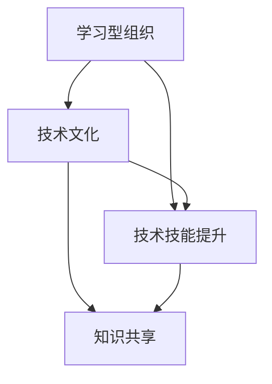
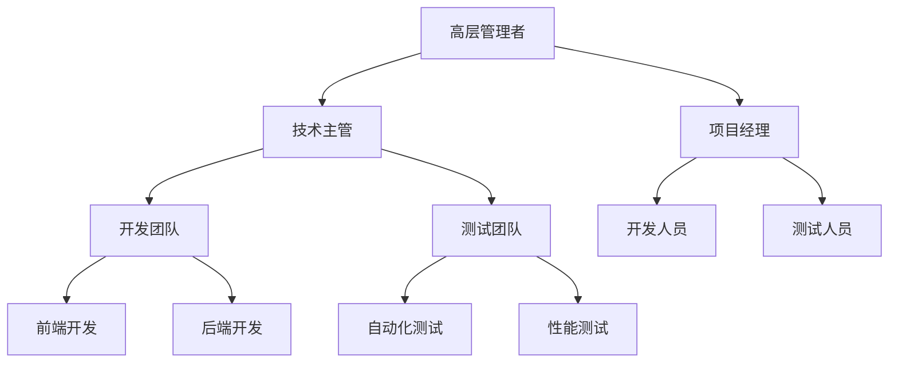

                 

### 引言

在现代企业中，技术组织正面临着前所未有的挑战。随着技术的快速迭代和市场需求的变化，传统的“一次性”项目模式已逐渐无法满足企业持续发展的需求。为了在竞争激烈的市场中保持领先地位，技术组织必须具备持续学习和适应变化的能力。因此，学习型技术组织（Learning-Driven Technical Organization）的概念应运而生，成为企业提升核心竞争力的关键。

#### 什么是学习型技术组织

学习型技术组织是一种以持续学习为核心价值的技术团队，它通过建立学习机制、优化组织结构和管理流程，不断更新知识和技能，以适应快速变化的市场需求。这种组织不仅注重技术能力的提升，更强调团队整体的学习能力和创新能力的培养。

#### 学习型技术组织的重要性

1. **适应变化**：在快速变化的市场环境中，学习型技术组织能够快速适应新需求，持续优化产品和服务。
2. **提升创新能力**：通过持续学习，技术团队可以不断挖掘新的技术机会，推动产品创新和业务拓展。
3. **提高员工满意度**：学习型组织为员工提供了不断成长和发展的机会，从而提升员工的满意度和忠诚度。
4. **增强组织竞争力**：学习型技术组织具备更强的竞争力和适应力，能够持续保持市场领先地位。

#### 学习型技术组织的特点

1. **知识共享**：技术团队内部建立高效的知识共享机制，确保知识在团队内快速传播和应用。
2. **持续学习**：组织鼓励员工不断学习新技术、新方法，并将其应用到实际工作中。
3. **自主性**：团队成员具有高度的自主性，可以根据项目需求和自身兴趣选择学习方向。
4. **迭代优化**：技术组织不断进行自我评估和优化，以提高整体效率和绩效。

通过引入学习型技术组织，企业可以在复杂多变的市场环境中保持竞争力，实现可持续发展。接下来，我们将进一步探讨学习型技术组织的核心概念、组织结构、持续学习实践以及技术文化塑造等内容，帮助读者深入了解这一先进的管理理念。

### 核心概念与联系

在深入探讨学习型技术组织之前，有必要明确一些核心概念，并分析它们之间的相互关系。这些概念包括学习型组织、技术文化以及技术技能提升等。

#### 学习型组织

学习型组织（Learning Organization）最早由彼得·圣吉（Peter Senge）在其著作《第五项修炼》中提出。学习型组织强调组织成员的持续学习和自我超越，通过建立共同愿景、团队学习、改变思维模式、系统思考和共享愿景等机制，实现组织的持续成长和进步。

**定义**：学习型组织是一个能够不断学习、适应和自我完善，从而在复杂和动态环境中保持竞争优势的团队或组织。

**关键特征**：
- **共同愿景**：组织成员拥有共同的目标和愿景，激发每个人的积极性和创造力。
- **团队学习**：通过团队学习和合作，促进知识的共享和技能的传递。
- **系统思考**：组织成员能够从系统整体出发，理解问题和解决方案的内在联系。
- **自主性**：成员在学习和工作中具有高度自主性和责任感。

#### 技术文化

技术文化（Tech Culture）是组织内部关于技术、创新和发展的共同价值观和行为规范。技术文化不仅影响组织的技术能力，还影响员工的职业发展和工作满意度。

**定义**：技术文化是组织成员在技术、创新和发展方面的共同价值观、信念和习惯，它通过潜移默化的方式影响组织的行为和决策。

**关键特征**：
- **创新氛围**：鼓励创新思维和技术探索，允许失败并从中学习。
- **协作精神**：强调团队合作和知识共享，促进技术知识的传递和应用。
- **持续学习**：组织成员持续学习新技术、新方法，不断提升自身能力。
- **开放沟通**：鼓励开放的沟通渠道，使信息能够快速传播和反馈。

#### 技术技能提升

技术技能提升（Skill Enhancement）是学习型技术组织的核心目标之一。通过不断学习、培训和实践，技术组织可以不断提升员工的技术能力和解决问题的能力。

**定义**：技术技能提升是通过学习、培训和实践，不断提高员工在特定技术领域的能力和绩效的过程。

**关键特征**：
- **个性化培训**：根据员工的兴趣和职业发展需求，提供个性化的培训计划。
- **实践机会**：提供丰富的实践机会，使员工能够在实际项目中应用所学知识。
- **知识更新**：定期更新培训内容，确保员工掌握最新的技术趋势和工具。
- **技能认证**：通过技能认证，验证员工的技术能力，激励他们不断提升。

#### 关系架构

学习型技术组织、技术文化和技术技能提升之间存在着密切的联系。学习型组织为技术文化的建立提供了基础，技术文化又为技术技能提升创造了良好的环境。具体来说，学习型组织的机制（如共同愿景、团队学习和系统思考）有助于形成积极向上的技术文化，而技术文化则通过鼓励创新、协作和持续学习，推动技术技能的提升。技术技能提升反过来又强化了学习型组织的机制，形成良性循环。

**Mermaid流程图**：

通过这个流程图，我们可以清晰地看到学习型技术组织、技术文化和技术技能提升之间的相互作用和相互依赖关系。这种紧密的联系是建立成功的学习型技术组织的关键。

在接下来的章节中，我们将进一步探讨学习型技术组织的组织结构和管理机制，以及如何在实践中建立持续学习的文化。通过深入分析这些核心概念和它们之间的联系，我们将为读者提供更全面、更具体的指导，帮助他们在实际工作中成功构建学习型技术组织。

### 组织结构与机制

要建立一个成功的学习型技术组织，合理的组织结构和有效的管理机制是至关重要的。以下将从领导者与团队成员的角色、团队合作与知识共享机制、以及组织的层次结构等方面，详细探讨学习型技术组织的组织结构与机制。

#### 领导者与团队成员的角色

1. **领导者角色**：
   - **倡导者**：领导者作为学习型技术组织的倡导者，负责制定学习愿景和目标，激发团队的学习热情，并确保学习活动与组织战略目标一致。
   - **激励者**：领导者通过激励政策和奖励机制，鼓励团队成员积极参与学习和知识共享，确保学习活动得到有效执行。
   - **协调者**：领导者需要协调团队成员之间的工作，解决冲突，确保学习活动能够顺利进行。

2. **团队成员角色**：
   - **学习者**：团队成员是学习型技术组织的主要学习者和知识创造者。他们需要积极参与各种学习活动，不断更新知识和技能，并将其应用到实际工作中。
   - **知识贡献者**：团队成员通过参与知识共享机制，将所学知识和经验分享给其他成员，促进整个团队的知识积累和共享。

#### 团队合作与知识共享机制

1. **团队合作**：
   - **跨职能团队**：学习型技术组织通常采用跨职能团队的形式，使团队成员能够从不同角度思考和解决问题，促进知识的多样性和创新。
   - **协作平台**：组织建立协作平台，如项目管理系统、团队聊天工具等，方便团队成员之间的沟通和协作，提高工作效率和团队凝聚力。

2. **知识共享机制**：
   - **内部知识库**：建立内部知识库，收集和整理团队成员的经验、知识和最佳实践，方便成员查阅和学习。
   - **定期分享会**：定期举办内部分享会，由团队成员分享自己的学习心得、项目经验和新技术应用，促进知识的传播和共享。
   - **导师制度**：通过导师制度，使经验丰富的成员能够指导新成员，帮助他们快速成长，同时实现知识的传承。

#### 组织的层次结构

1. **扁平化管理**：学习型技术组织通常采用扁平化管理结构，减少管理层级，使信息能够快速传递，提高决策效率。
2. **矩阵式组织**：在复杂项目或特定领域，学习型技术组织可能采用矩阵式组织结构，使团队成员能够跨部门、跨团队合作，充分利用组织内的资源和知识。

**层次结构图**：

通过上述组织结构与机制的设计，学习型技术组织能够有效地促进知识的传播和共享，激发团队成员的积极性和创造力，从而在快速变化的市场环境中保持竞争优势。接下来，我们将探讨如何在组织中建立持续学习的文化，进一步深化学习型技术组织的建设。

### 持续学习的实践

建立一个学习型技术组织不仅仅是理论上的构想，更需要将其转化为实际的行动和实践。以下从学习计划与时间管理、内部培训与发展项目以及外部合作与交流三个方面，探讨如何在组织中建立持续学习的文化。

#### 学习计划与时间管理

1. **制定学习计划**：
   - **个人学习计划**：每个团队成员都应制定个人学习计划，明确学习目标、时间安排和学习内容。这有助于团队成员明确自己的学习方向和进度。
   - **团队学习计划**：团队应制定整体学习计划，确保学习活动与组织目标和项目需求相一致。学习计划应包括培训课程、知识分享会、项目实践等环节。

2. **时间管理**：
   - **时间预留**：在团队的工作计划中预留学习时间，确保团队成员有充足的时间进行学习和知识分享。
   - **灵活安排**：根据项目进展和团队成员的实际情况，灵活调整学习时间，避免学习时间与工作冲突。

#### 内部培训与发展项目

1. **内部培训**：
   - **技术培训**：定期举办技术培训课程，涵盖最新的技术趋势和工具，帮助团队成员掌握前沿技术。
   - **管理培训**：为技术管理人员提供管理技能培训，提升他们的领导力和团队管理能力。

2. **发展项目**：
   - **项目实践**：通过实际项目，为团队成员提供实践机会，让他们在实际工作中应用所学知识，提高实际操作能力。
   - **轮岗制度**：实施轮岗制度，使团队成员有机会在不同职位和项目中工作，拓宽他们的视野和技能。

#### 外部合作与交流

1. **行业交流**：
   - **技术沙龙**：参加技术沙龙和行业会议，与业内同行交流学习，了解最新的技术动态和市场趋势。
   - **专家讲座**：邀请行业专家进行讲座，分享他们的经验和技术见解，为团队成员提供宝贵的知识资源。

2. **外部培训**：
   - **认证课程**：参加外部认证课程，通过考试获得专业认证，提升个人技术能力和职业竞争力。
   - **海外交流**：组织海外交流项目，让团队成员有机会到国外学习和工作，了解国际先进技术和管理经验。

通过上述实践，学习型技术组织能够在日常工作中不断促进知识和技能的更新，提高团队的创新能力。同时，这种持续学习的文化也将吸引更多优秀的人才加入，为组织的长期发展提供坚实的人才保障。

### 技术文化的特点与塑造

技术文化是学习型技术组织的核心组成部分，它不仅影响员工的工作方式，还决定了组织的创新能力和竞争力。为了构建一个积极向上的技术文化，我们需要了解技术文化的定义、特点以及如何通过具体措施来塑造和维持这种文化。

#### 技术文化的定义

技术文化是一种组织内部关于技术、创新和发展的共同价值观和行为规范。它反映了组织成员在技术追求中的态度和行为方式，是组织成员共同信仰和遵守的原则。

#### 技术文化的特点

1. **创新氛围**：技术文化鼓励创新思维和技术探索，允许员工尝试新的方法和技术，即使这些尝试可能会失败。组织鼓励从失败中学习和成长，而不是将失败视为负面事件。

2. **协作精神**：技术文化强调团队合作和知识共享，团队成员之间相互支持，共同解决问题。这种协作精神促进了跨部门、跨团队的合作，提高了整体工作效率。

3. **持续学习**：技术文化鼓励员工不断学习新技术、新工具和新方法。组织提供各种学习和培训机会，帮助员工不断提升自己的技能和知识水平。

4. **开放沟通**：技术文化倡导开放的沟通渠道，鼓励团队成员自由表达意见和建议。这种开放性有助于信息快速传播和反馈，促进团队的透明度和信任。

5. **实践导向**：技术文化强调将理论知识应用到实际项目中，通过实践验证和优化技术方案。组织支持员工参与实际项目，提供实践机会，帮助他们在真实环境中学习和成长。

#### 技术文化的塑造

1. **领导示范**：领导者的行为对组织文化具有深远影响。领导者应以身作则，展示出对创新、学习和协作的重视，鼓励团队成员积极参与学习和知识共享。

2. **激励机制**：组织应建立激励机制，鼓励员工积极参与学习和创新。这可以包括奖励制度、晋升机会和职业发展支持等。通过这些激励措施，组织能够激发员工的积极性和创造力。

3. **培训与发展**：提供各种培训和发展机会，帮助员工不断提升技能和知识。这不仅包括技术培训，还应涵盖软技能培训，如沟通、团队协作和项目管理。

4. **知识共享平台**：建立内部知识共享平台，如内部论坛、知识库和分享会，方便员工交流和分享知识。这种平台有助于知识的传播和应用，促进技术文化的形成。

5. **开放沟通**：鼓励开放的沟通环境，确保团队成员能够自由表达意见和建议。组织可以通过定期的会议、反馈机制和意见箱等方式，促进沟通和反馈。

6. **实践导向**：为员工提供实践机会，鼓励他们在实际项目中应用所学知识和技能。通过实践，员工不仅能够巩固所学，还能发现和解决实际问题，提升整体技术能力。

通过上述措施，组织可以逐步塑造和维持积极向上的技术文化。这种文化不仅有助于提升组织的创新能力，还能增强团队凝聚力和员工满意度，为组织的长期发展奠定坚实基础。

### 技术技能提升的方法与策略

在技术快速变革的今天，技术技能的提升不仅是个人职业发展的关键，也是企业保持竞争力的必要条件。以下将详细探讨如何通过技能评估、培训与发展项目以及最佳实践，系统地提升技术技能。

#### 技能评估

1. **自我评估**：
   - **技能树模型**：使用技能树模型，将技术技能分解为不同层级和类别，如编程语言、数据库、前端开发、后端开发等。员工可以根据自己的实际能力和学习需求，选择适当的技能进行自我评估。
   - **问卷和测试**：通过在线问卷或技能测试，评估员工在各个技术领域的掌握程度，识别他们的优势和短板。

2. **团队评估**：
   - **360度反馈**：组织可以实施360度反馈机制，邀请团队成员和上级对员工的技术能力进行评价，提供多角度的反馈。
   - **绩效评估**：将技术能力作为绩效评估的一部分，通过定期的绩效评估，识别员工的技能提升需求和改进方向。

#### 培训与发展项目

1. **内部培训**：
   - **技术讲座**：定期举办技术讲座，邀请内部或外部专家分享最新的技术趋势和实战经验。
   - **编程马拉松**：组织编程马拉松活动，让员工在短时间内集中精力解决问题，提高实战能力。

2. **外部培训**：
   - **认证课程**：鼓励员工参加外部认证课程，如认证的程序员、数据库管理员等，提升专业水平。
   - **在线课程**：推荐员工参加在线学习平台，如Coursera、Udacity等，选择符合职业发展需求的课程。

3. **实践项目**：
   - **导师制度**：为新员工配备导师，帮助他们快速融入团队并提升技能。
   - **轮岗机制**：实施轮岗机制，使员工在不同部门和项目中工作，拓宽技能和视野。

#### 最佳实践

1. **持续学习**：
   - **知识共享**：建立内部知识库和共享平台，鼓励员工分享经验和心得，促进知识的传播和应用。
   - **学习社区**：创建学习社区，如技术微信群、论坛等，为员工提供一个交流和学习的平台。

2. **问题解决**：
   - **故障排除**：在项目实践中，鼓励员工面对问题，独立或团队协作解决问题，提升问题解决能力。
   - **案例分析**：通过分析成功和失败的项目案例，总结经验教训，提高项目管理和决策能力。

3. **技术竞赛**：
   - **内部竞赛**：定期举办技术竞赛，如编程比赛、黑客马拉松等，激发员工的创新思维和竞争意识。
   - **外部竞赛**：鼓励员工参加外部技术竞赛，提升团队的整体技术水平和知名度。

通过上述方法与策略，技术组织可以系统、有效地提升员工的技能水平，确保团队在技术变革中保持领先地位。技能提升不仅是员工个人的需求，更是组织整体发展的需要。通过持续的学习和实践，技术组织能够不断提升自身的竞争力，为企业的长期发展奠定坚实的基础。

### 案例研究

为了更好地理解学习型技术组织的成功实践，以下将分析三个典型的案例，探讨它们在建立持续学习文化方面的经验与教训。

#### 案例一：谷歌的技术文化

**背景**：
谷歌（Google）是一家以技术创新著称的科技公司，其技术文化被认为是行业标杆之一。谷歌的技术文化强调持续学习、创新和团队合作。

**经验**：
1. **开放沟通**：谷歌鼓励员工自由表达意见，并在公司内部建立了多个开放的讨论平台，如谷歌论坛（Google+），方便员工分享技术和个人经验。
2. **内部培训**：谷歌提供丰富的内部培训项目，包括技术讲座、编程马拉松和工作坊，帮助员工不断提升技能和知识。
3. **导师制度**：谷歌实施导师制度，为新员工提供一对一的指导，确保他们能够快速融入团队并成长。

**教训**：
尽管谷歌的技术文化非常成功，但也存在一些挑战。例如，在快速扩张的过程中，如何确保每个团队都保持相同的创新氛围和学习文化，成为谷歌需要关注的问题。

#### 案例二：Netflix的技术实践

**背景**：
Netflix是一家以流媒体服务为主的科技公司，其技术团队在技术迭代和持续学习方面有着丰富的经验。

**经验**：
1. **自主性**：Netflix鼓励员工自主选择学习方向和项目，这激发了员工的学习热情和创新精神。
2. **知识共享**：Netflix建立了内部技术博客和文档库，方便员工共享技术经验和最佳实践，促进了知识的传播和应用。
3. **灵活的工作时间**：Netflix提供灵活的工作时间，让员工有更多的时间进行学习和研究。

**教训**：
Netflix的技术实践证明了自主性和灵活性对持续学习的重要性，但也面临一些挑战。例如，如何确保团队成员在自主学习过程中保持对整体项目的关注，避免分散精力。

#### 案例三：亚马逊的工程师文化

**背景**：
亚马逊（Amazon）以其高效的物流和电商平台著称，其工程师文化在技术组织和持续学习方面有着显著成效。

**经验**：
1. **项目实践**：亚马逊鼓励工程师参与实际项目，通过解决实际问题提升技能。例如，亚马逊的“Kubernetes Day”活动，让工程师每天专注于研究Kubernetes，提升其在容器编排方面的技能。
2. **外部合作**：亚马逊积极参与开源项目，与外部开发者合作，促进技术交流和知识共享。
3. **定期回顾**：亚马逊定期组织技术回顾会议，员工可以分享项目经验、技术挑战和解决方案，促进团队学习和改进。

**教训**：
亚马逊的工程师文化强调实践和开放合作，但也面临一些挑战。例如，如何在快速扩展团队的同时，维持高效的学习和协作文化，是亚马逊需要持续关注的问题。

通过以上案例研究，我们可以看到，成功的学习型技术组织在建立持续学习文化方面有着许多共同的经验，如开放沟通、内部培训、自主学习和知识共享。同时，每个组织也面临着独特的挑战，需要根据自身情况不断调整和优化。这些经验教训为其他技术组织提供了宝贵的参考和借鉴。

### 总结与展望

通过本文的探讨，我们深入了解了学习型技术组织的概念、核心概念与联系、组织结构与机制、持续学习的实践、技术文化塑造以及技术技能提升的方法与策略。学习型技术组织不仅仅是一个理念，更是企业在快速变化的市场环境中保持竞争力的必要手段。

#### 重要结论

1. **持续学习的重要性**：学习型技术组织通过持续学习不断提升员工的技能和知识水平，以适应市场变化和技术迭代。
2. **知识共享与协作**：建立高效的知识共享机制和团队合作文化，可以促进技术知识的传播和应用，提高整体创新能力。
3. **技术文化塑造**：积极向上的技术文化能够激发员工的创造力和主动性，促进组织内部的创新和协作。
4. **技能提升策略**：通过技能评估、培训项目和实践机会，系统性地提升员工的技术能力和竞争力。

#### 未来展望

未来，学习型技术组织将更加注重以下几个方面的发展：

1. **智能化学习**：利用人工智能和大数据技术，为员工提供个性化的学习路径和推荐，提高学习的针对性和效率。
2. **跨领域合作**：打破传统的组织边界，与外部组织进行更紧密的合作，共享资源和知识，促进技术跨领域融合和创新。
3. **全球化视野**：在全球化的背景下，学习型技术组织需要具备国际视野，借鉴和吸收全球范围内的先进经验和理念，推动组织的国际化发展。
4. **可持续性发展**：在追求技术卓越的同时，关注可持续性发展，推动绿色技术和社会责任，实现经济、社会和环境的协调发展。

通过持续学习和优化，学习型技术组织将不断适应新的市场和技术环境，实现长期可持续的发展。我们期待，未来的技术组织能够在全球范围内发挥更大的作用，推动技术进步和社会繁荣。

### 参考文献

1. Senge, P. M. (1990). The Fifth Discipline: The Art & Practice of The Learning Organization. Doubleday.
2. Davenport, T. H., & Prusak, L. (1998). Working Knowledge: How Organizations Manage What They Know. Harvard Business Press.
3. Lakhani, K., & von Hippel, E. (2013). How Open Source Software Works: "Free" User-to-User Assistance. Research Policy, 42(1), 3-16.
4. Brown, S. (2015). The Social Life of Information. Harvard Business Review Press.
5. Nonaka, I., & Takeuchi, H. (1995). The Knowledge-Creating Company: How Japanese Companies Create the Dynamics of Innovation. Oxford University Press.
6. O’Reilly, C., & C. Douglass. (2001). Cultivating Innovation: How IBM, Intel, Microsoft, and Other Companies Learn to Innovate. John Wiley & Sons.
7. Dearden, J., & L. Dearden. (2019). Building a Learning Organization: A Step-by-Step Guide. Kogan Page.
8. Beesley, M., & P. Scholes. (2013). Organizational Behavior: An Introductory Text. Pearson Education.

### 术语表

- **学习型组织**：一种能够不断学习、适应和自我完善的组织形式。
- **技术文化**：组织内部关于技术、创新和发展的共同价值观和行为规范。
- **持续学习**：组织成员持续学习新技术、新方法，并将其应用到实际工作中。
- **知识共享**：组织内部成员之间共享知识和经验，促进整体知识水平的提高。
- **技能提升**：通过培训、实践等手段，提高员工在特定技术领域的能力。
- **跨职能团队**：由不同职能部门成员组成的团队，共同完成项目任务。
- **导师制度**：通过经验丰富的成员指导新成员，帮助他们快速成长。
- **内部培训**：组织内部提供的各种培训项目，帮助员工提升技能和知识。
- **外部培训**：组织外部提供的培训项目，如在线课程、认证课程等。

