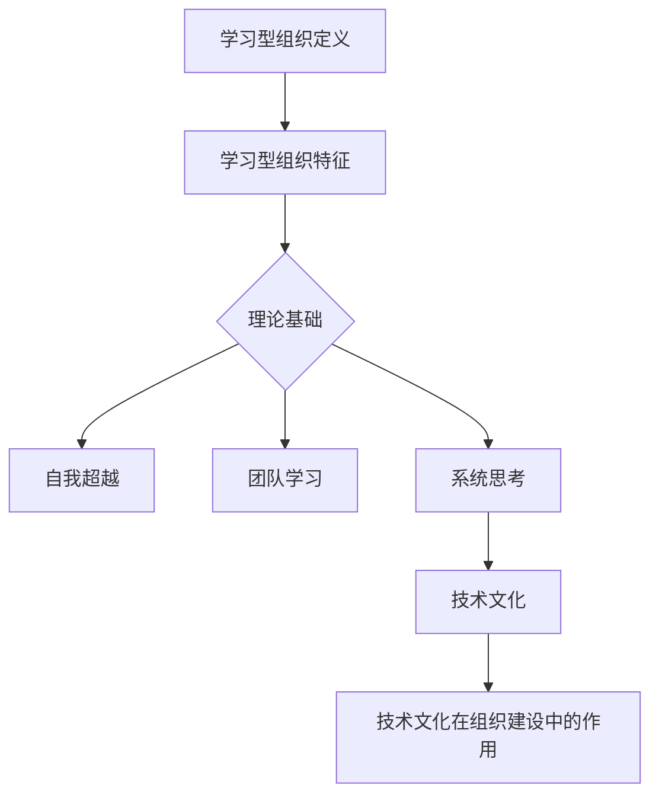

                 

### 文章标题：学习型组织建设：打造持续学习的技术文化

#### 关键词：学习型组织、技术文化、持续学习、组织建设、创新与发展

> 摘要：本文深入探讨了学习型组织的概念、特征及其在技术文化背景下的建设过程。通过理论篇与实践篇的有机结合，本文旨在为组织管理者提供一套完整的建设策略，帮助其在技术驱动时代中，打造具有持续学习能力和创新活力的团队文化。

### 设计框架

#### 第一部分：理论篇
- **第1章：学习型组织的概念与特征**
  - 1.1 学习型组织的定义
  - 1.2 学习型组织的特征
  - 1.3 学习型组织与敏捷组织的联系与区别

- **第2章：构建学习型组织的理论基础**
  - 2.1 自我超越
  - 2.2 团队学习
  - 2.3 系统思考

- **第3章：技术文化在组织建设中的作用**
  - 3.1 技术文化的重要性
  - 3.2 技术文化对学习型组织建设的影响
  - 3.3 技术文化的构建方法

#### 第二部分：实践篇
- **第4章：评估组织的当前学习状况**
  - 4.1 学习状况评估指标
  - 4.2 学习状况评估方法
  - 4.3 学习状况评估案例分析

- **第5章：制定学习型组织的战略规划**
  - 5.1 学习型组织战略的制定过程
  - 5.2 学习型组织战略的制定方法
  - 5.3 学习型组织战略案例分析

- **第6章：培养持续学习的技术团队**
  - 6.1 技术团队学习的重要性
  - 6.2 技术团队学习的培养方法
  - 6.3 技术团队学习案例分析

- **第7章：实施学习型组织的变革**
  - 7.1 变革管理的理论
  - 7.2 学习型组织变革的实施策略
  - 7.3 学习型组织变革的案例分析

#### 第三部分：总结与展望
- **第8章：学习型组织建设的总结与展望**
- **第9章：未来学习型组织建设的发展趋势**

### 概念与联系

学习型组织的建设需要理解以下几个核心概念：学习型组织的定义、特征、理论基础和技术文化。这些概念之间有着紧密的联系。学习型组织的定义和特征为我们提供了框架，而理论基础（自我超越、团队学习、系统思考）则是实现学习型组织的关键。技术文化作为组织建设的核心要素，影响着学习型组织的构建和运营。

下面是一个使用Mermaid绘制的流程图，展示这些概念之间的关系：



### 核心算法原理讲解

在本章中，我们将不涉及复杂的算法原理，而是专注于理解学习型组织建设的基本逻辑和方法。然而，为了更好地阐述这些方法，我们引入一个简化的“学习效率计算模型”作为示例。

```plaintext
函数：学习效率（learningEfficiency）
输入：学习时间（learningTime），知识吸收率（knowledgeAbsorptionRate）
输出：学习效率（learningEfficiency）

学习效率 = 学习时间 * 知识吸收率
```

这个模型表明，学习效率是学习时间和知识吸收率的乘积。学习时间越长，且知识吸收率越高，学习效率就越高。这个简单的模型帮助我们理解如何通过增加学习时间和提高知识吸收率来提高学习效率。

### 数学模型和数学公式

在学习型组织建设过程中，评估组织的当前学习状况是一个重要的环节。为此，我们引入一个评估指标模型，使用数学公式来描述。

```latex
学习状况得分（learningStatusScore）= \frac{知识产出（knowledgeOutput）}{学习成本（learningCost）}
```

这个公式中，知识产出表示组织在一定时间内创造的新知识量，学习成本表示组织在学习和知识创造过程中的投入。学习状况得分越高，表示组织的知识创造能力越强，学习效率越高。

### 项目实战

在本章中，我们将通过一个实际案例来展示学习型组织建设的过程。假设某企业想要建设一个学习型组织，以下是该企业的实施步骤：

1. **评估当前学习状况**：使用前述的学习状况得分模型，评估企业的知识产出和学习成本，确定当前的学习效率。

2. **制定学习型组织战略**：根据评估结果，制定针对性的战略计划，包括增加学习时间、提高知识吸收率等。

3. **培养持续学习的技术团队**：通过培训、学习分享会等形式，提高团队成员的知识吸收率。

4. **实施学习型组织的变革**：通过引入新的工作流程、技术工具等，支持持续学习和知识创造。

在这个案例中，企业通过一系列的步骤，成功建设了一个学习型组织，提升了整体的学习效率和创新能力。

### 最佳实践 Tips

- **定期评估学习状况**：学习型组织需要定期评估学习状况，以便及时调整策略。
- **培养团队学习文化**：通过组织学习分享会、技术沙龙等活动，营造团队学习的氛围。
- **提供丰富的学习资源**：确保团队成员能够获取到最新的技术知识，支持持续学习。

### 小结

本文通过理论篇与实践篇的结合，深入探讨了学习型组织的概念、特征及其在技术文化背景下的建设过程。我们介绍了学习型组织建设的核心概念、理论基础和技术文化，并通过实际案例展示了实施步骤。通过本文，我们希望为组织管理者提供一套完整的建设策略，帮助他们在技术驱动时代中，打造具有持续学习能力和创新活力的团队文化。

### 注意事项

- 在建设学习型组织时，需结合组织的实际情况，制定合适的战略和实施计划。
- 学习型组织的建设是一个持续的过程，需要组织的长期投入和持续努力。

### 拓展阅读

- 《第五项修炼：心智模式改变》（Peter Senge）：深入探讨学习型组织的理论基础。
- 《敏捷开发实践指南》（Jeff Sutherland）：讨论敏捷组织与学习型组织的关系。
- 《精益创业》（Eric Ries）：探讨创新组织建设的方法和策略。

### 作者信息

- 作者：AI天才研究院/AI Genius Institute & 禅与计算机程序设计艺术 /Zen And The Art of Computer Programming

