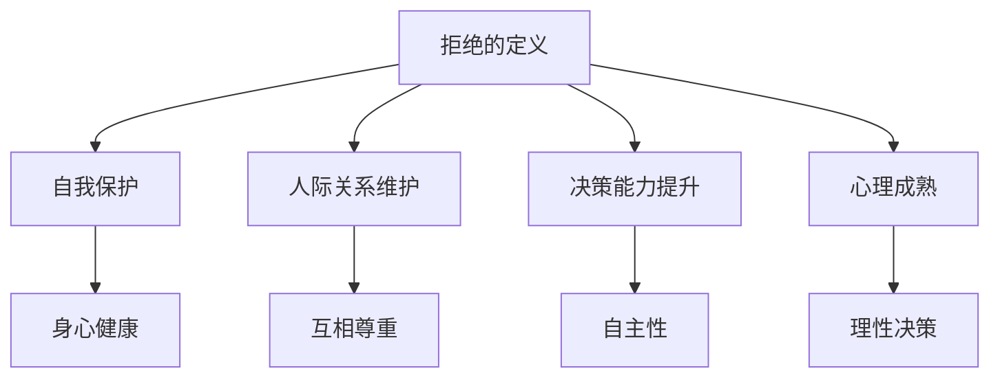
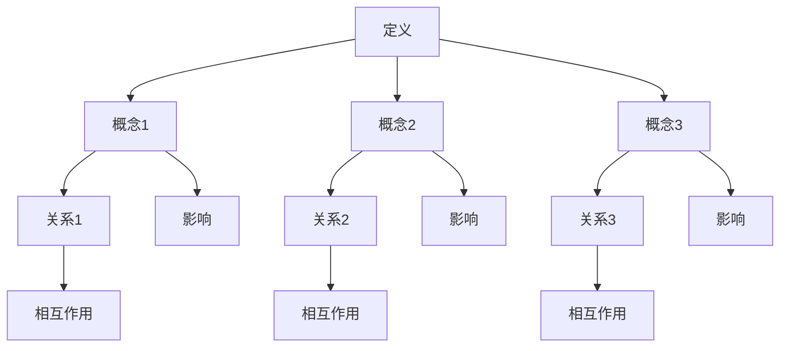

                 

### 拒绝的概念与重要性

在现代社会，拒绝他人是一种常见且必要的社交技能。它不仅体现了个人价值观和界限感，更是在维护自身权益和促进健康人际关系中扮演着关键角色。理解拒绝的概念及其重要性，是学会有效拒绝的第一步。

首先，**拒绝的定义**是指对他人提出的请求、要求或邀请进行否决或不予理睬的行为。它是一种选择性的回应，意味着个体有权决定是否接受或拒绝某种提议。拒绝并非总是负面的，适时的拒绝可以帮助个体避免不必要的压力和过度的责任，从而保持内心的平和。

其次，**拒绝的重要性**体现在以下几个方面：

1. **自我保护**：拒绝可以保护个体的身心健康，避免因过度承诺而导致的压力和疲惫。它帮助个体设立界限，避免被迫承担超出自身能力或违背个人价值观的任务。

2. **人际关系维护**：适度的拒绝可以传递出个体的价值观和界限，有助于建立互相尊重的人际关系。同时，拒绝他人也意味着在必要时维护自己的权益，这是健康人际关系的基础。

3. **决策能力提升**：拒绝是一种决策行为，通过反复练习拒绝，个体可以提升自我决策能力和自主性，更好地掌握自己的时间和资源。

4. **心理成熟**：学会拒绝是心理成熟的表现。它意味着个体能够理性地评估自己的需求和能力，并在此基础上做出明智的选择。

为了更直观地理解拒绝的概念与重要性，我们可以使用一个**Mermaid 流程图**来展示核心概念之间的关系：



该流程图清晰地展示了拒绝的核心概念及其对个体和社会的积极影响。通过理解和应用这些概念，个体可以更好地掌握拒绝的艺术，从而在社交和职业生涯中取得更好的成果。

### 核心概念与联系：拒绝的定义与理解

在探讨拒绝的定义与理解时，我们需要明确几个核心概念，并分析它们之间的联系。以下是关键概念的Mermaid流程图表示，用于直观地展示它们之间的相互作用：



**定义**：拒绝是一种行为，指的是个体对他人提出的请求、要求或邀请做出否定的回应。

**概念1：自我保护**：这是拒绝的最基本功能，旨在避免因过度承诺而导致的负面后果，如压力和焦虑。自我保护帮助个体维护个人界限，确保自身身心健康。

**概念2：人际关系维护**：拒绝并不是简单的拒绝，它需要在不损害人际关系的前提下进行。通过适度的拒绝，个体可以在维护自我利益的同时，保持与他人的良好互动。

**概念3：社会规范**：社会规范要求个体在特定情境下做出适当的反应。拒绝作为社会规范的一部分，意味着个体需要根据情境和社会期望进行判断和行动。

**关系1：自我保护与自我认知**：自我保护依赖于个体的自我认知。只有了解自己的能力和界限，个体才能做出合理的拒绝决策。

**关系2：人际关系维护与沟通技巧**：拒绝的适当表达与沟通技巧密切相关。有效的沟通可以减少误解和冲突，从而维护良好的人际关系。

**关系3：社会规范与情境判断**：社会规范在不同情境下可能有不同的表现。个体需要根据具体情境，灵活应用社会规范，以确保拒绝行为既符合规范，又能够被他人接受。

这些核心概念和它们之间的联系，共同构成了拒绝行为的基本框架。理解这些概念之间的关系，有助于我们更深入地探讨拒绝的艺术和技巧。

为了更好地理解这些核心概念，我们可以使用伪代码来详细阐述拒绝的定义和其在不同情境下的应用：

```python
# 拒绝函数：用于在特定情境下拒绝他人请求
def refuse_request(request, context):
    """
    参数：
    request：他人提出的请求
    context：当前情境
    
    返回值：
    refuse_message：拒绝的消息
    """
    
    # 根据请求类型判断拒绝策略
    if is_high_priority_request(request):
        refuse_message = "非常抱歉，我现在无法满足您的请求。"
    elif is_personal_boundary_violation(request):
        refuse_message = "我很抱歉，这违背了我的个人原则，我不能答应您。"
    else:
        refuse_message = "谢谢您的理解，但我目前无法接受这个请求。"

    # 根据情境调整拒绝的语气和措辞
    if context == "紧急情况":
        refuse_message += "我理解您的紧急需求，但请原谅我目前的困境。"
    elif context == "工作场合":
        refuse_message += "这需要我仔细考虑，暂时无法立即答应您。"
    elif context == "社交场合":
        refuse_message += "我真的很感谢您的邀请，但很遗憾这次我不能参加。"

    return refuse_message

# 举例说明
print(refuse_request("帮我看一下这份报告", "工作场合"))
```

上述伪代码展示了如何根据不同的请求类型和情境，制定合适的拒绝策略。这不仅帮助我们理解拒绝的核心概念，也为实际应用提供了具体的指导。

### 拒绝的重要性分析

拒绝他人并不只是简单的“不”，它承载着深刻的自我保护、人际关系维护、决策能力提升和心理成熟等多重意义。以下是这些重要性的详细分析。

首先，**拒绝的自我保护作用**不可忽视。现代社会中，人们常常因为害怕拒绝而接受各种请求，结果反而让自己陷入了过度的忙碌和压力之中。这种压力不仅影响身心健康，还会导致工作效率和质量的下降。通过适时的拒绝，个体可以保护自己免受不必要的压力，确保自己的时间和精力用于真正重要的事情。例如，当一个人被要求加班，而他已经超负荷工作时，适时的拒绝可以帮助他保持工作与生活的平衡，从而避免身心俱疲。

其次，**拒绝在人际关系维护中的作用**同样重要。拒绝并不是一种孤立的行为，它需要在维护人际关系的前提下进行。适度的拒绝能够传递出个体的价值观和界限，有助于建立互相尊重和健康的人际关系。通过合理的拒绝，个体可以在不损害他人利益的同时，维护自己的权益。例如，在团队合作中，如果某个成员不断要求其他成员承担额外的责任，而没有提供相应的回报或补偿，其他成员可以适当地拒绝，从而确保团队的公平和稳定。

第三，**拒绝能够提升个体的决策能力**。拒绝是一种决策行为，通过反复的拒绝练习，个体可以学会如何评估不同请求的价值和可行性，从而做出更加明智的决策。这种能力不仅在工作中有助于个体合理分配时间和资源，在生活中也同样重要。例如，当一个人收到多个社交邀请时，他需要考虑自己的实际情况，拒绝一些不合适的邀请，以保持生活的平衡和高质量。

最后，**拒绝是心理成熟的重要标志**。一个成熟的人能够理性地对待他人的请求，不会因为害怕拒绝而盲目接受或逃避。这种心理成熟表现在多个方面，包括自我认知、情绪管理和决策能力等。例如，当一个人意识到自己无法完成某项任务时，他能够冷静地拒绝，并寻找其他解决方案，而不是因为害怕拒绝而仓促答应，最终导致任务失败。

为了更好地理解拒绝的重要性，我们可以使用一个简单的**数学模型**来分析：

假设一个人每天有24小时的时间，每小时的效率相同。如果这个人没有任何拒绝行为，接受所有的请求，那么他每天能够处理的时间总量为：

\[ 总时间 = 24 \text{小时} \times 1 \text{效率} = 24 \text{小时} \]

然而，如果他能够适当地拒绝一些不重要的请求，假设每天拒绝2小时的请求，那么他每天能够处理的时间总量为：

\[ 总时间 = (24 \text{小时} - 2 \text{小时}) \times 1 \text{效率} = 22 \text{小时} \]

虽然总时间减少了2小时，但这2小时的时间可以被用于休息、学习和个人兴趣，从而提高整体的生活质量和工作效率。这只是一个简化的模型，但它直观地展示了拒绝如何帮助个体更有效地管理时间和资源。

通过上述分析，我们可以看到，拒绝不仅是一种简单的社交行为，更是一种深刻的自我保护、人际关系维护、决策能力提升和心理成熟的表现。学会适时的拒绝，对于个体的成长和成功至关重要。

### 拒绝与人际关系的关联

拒绝不仅仅是一个行为动作，它深刻地影响着人际关系。在人际沟通中，拒绝的处理方式直接关系到双方的关系质量。理解拒绝与人际关系的关联，有助于我们在处理社交互动时，更加得体和有效。

首先，**拒绝对人际沟通的影响**不可小觑。有效的沟通需要建立在互相信任和理解的基础上，而适时的拒绝能够增强这种信任。通过拒绝，个体能够清晰地传达自己的需求和界限，这有助于对方理解自己的立场。例如，当一个人在工作团队中拒绝承担额外的责任时，如果能够给出合理的原因，团队成员会理解他的难处，从而增进彼此的信任。相反，如果一个人因为害怕拒绝而盲目答应，导致无法履行承诺，这会严重破坏双方的信任。

其次，**拒绝与人际信任的关系**是维护健康人际关系的核心。信任是人际关系中最重要的基石之一，而拒绝作为表达自我界限的方式，可以帮助建立和维护这种信任。适度的拒绝表明个体能够为自己设定合理的界限，这不仅保护了个体，也向他人展示了尊重和理解。例如，在朋友请求你帮忙时，如果你因为自己的实际情况无法答应，但能够真诚地表达你的难处和歉意，这会让对方感受到你的诚意和尊重，从而加深你们之间的信任。反之，如果一个人因为害怕拒绝而不断违背自己的原则，最终会导致信任的破裂。

再次，**拒绝与人际冲突的关系**也是一个重要的方面。在人际交往中，冲突是难以避免的，而拒绝处理得当可以有效减少冲突的发生。拒绝并不是拒绝沟通，而是通过有效的沟通方式来表达自己的立场。当个体能够以礼貌和尊重的方式拒绝他人时，可以避免因为误解或冲动而产生的冲突。例如，当你的同事请求你加班，但你确实有其他安排时，如果你能够提前沟通并给出合理的原因，对方会理解你的立场，减少冲突的可能。

为了更好地理解这些关联，我们可以通过一些实际案例来分析。

**案例1**：小王是公司的项目经理，他最近收到了一个紧急项目，但由于手头已有几个重要项目尚未完成，他意识到自己无法承担这个额外的任务。面对同事的请求，小王没有立即答应，而是进行了如下沟通：

```
小王：非常感谢你考虑我，这个项目确实很有挑战性，但我目前有几个紧急项目要处理，担心无法同时兼顾。我建议我们找一个能够更好地处理这个任务的同事，你觉得怎么样？
```

通过这种拒绝方式，小王不仅表明了自己的立场，还提出了解决方案，避免了直接冲突，同时也维护了同事之间的关系。

**案例2**：小李是朋友小张的同事，小张邀请小李参加一个社交活动，但小李因为家庭原因无法参加。小李在拒绝时，采用了以下方式：

```
小李：真的很抱歉，那天我有一个家庭聚会，无法参加。希望你能有一个愉快的活动，下次有机会我一定参加。
```

小李的拒绝既表达了歉意，又表示了对对方的关心，这不仅没有破坏友谊，反而让小张感受到了小李的真诚。

通过这些案例，我们可以看到，合理的拒绝不仅不会损害人际关系，反而可以在一定程度上维护和加深信任。拒绝的艺术在于如何以礼貌和尊重的方式传达信息，让对方理解和接受。这不仅是个人能力的体现，也是建立和维护健康人际关系的必要技巧。

### 拒绝的艺术与技巧

拒绝的艺术在于如何在不伤害对方感情的情况下，表达出自己的立场和界限。为了达到这一目标，我们需要掌握一系列语言和肢体技巧，以确保拒绝行为既得体又有效。

**语言技巧**

1. **礼貌用语**：使用礼貌用语是拒绝他人时的重要一环。例如，可以使用“谢谢您的理解”、“真的很抱歉”等词语，这些词语可以缓解对方的情绪，减少拒绝带来的尴尬。

2. **委婉表达**：直接拒绝可能会让对方感到被拒绝，从而产生负面情绪。因此，我们可以使用委婉的语言来表达拒绝。例如，当朋友邀请你参加活动时，你可以说：“这个周末我有一个重要的安排，可能无法参加，希望你们玩得开心。”

3. **合理解释**：提供合理的解释可以增加拒绝的可信度。例如，当同事要求你加班时，你可以说：“我现在正在处理一个紧急的项目，需要集中精力完成，可能无法加班。”

4. **转移焦点**：将注意力从拒绝的行为转移到其他积极的事物上，可以减少对方的负面情绪。例如，当朋友请求你帮忙时，你可以说：“我现在有点忙，不过我可以帮你找其他人，他们可能更有时间。”

**肢体技巧**

1. **面部表情**：保持微笑或者面带微笑的表情，可以传达出你的善意和诚意，减少对方的抵触情绪。

2. **身体姿势**：保持开放的身体姿势，避免封闭或防御的姿态。这可以传达出你的友好和愿意沟通的态度。

3. **眼神交流**：适度的眼神交流可以表明你对对方的尊重和认真态度，有助于对方理解你的立场。

4. **适当的身体动作**：例如，点头或轻微的点头动作，可以表示你在认真听取对方的请求，并理解其含义。

**实际应用**

为了更好地理解这些技巧，我们可以通过一个场景来具体演示如何使用这些语言和肢体技巧。

**场景**：小张的同事小王请求小张帮忙完成一份紧急报告。

**语言技巧**：

1. **礼貌用语**：小张可以说：“谢谢您的理解，我很愿意帮忙，但恐怕我最近有点忙。”

2. **委婉表达**：小张可以继续说：“我现在正在处理一个紧急项目，可能需要一些时间来完成这份报告。”

3. **合理解释**：小张可以解释说：“我需要集中精力处理这个项目，以确保按时完成。”

4. **转移焦点**：小张可以说：“我可以帮你找到其他同事，他们可能更有时间。”

**肢体技巧**：

1. **面部表情**：小张可以保持微笑，表示自己的善意。

2. **身体姿势**：小张可以保持开放的身体姿势，避免封闭或防御的姿态。

3. **眼神交流**：小张可以保持适度的眼神交流，表示自己在认真听取对方的请求。

4. **适当的身体动作**：小张可以轻轻点头，表示对对方的理解。

通过上述语言和肢体技巧，小张不仅成功地拒绝了小王的请求，还避免了对方感到被拒绝的尴尬，保持了良好的人际关系。

总之，掌握拒绝的艺术和技巧，可以帮助我们更加得体地处理各种社交场合，维护健康的人际关系。在实际应用中，我们需要根据具体情况灵活运用这些技巧，以达到最佳效果。

### 拒绝的肢体语言

在拒绝他人时，肢体语言往往比语言本身更能传达出情感和态度。适当的肢体语言可以增强我们的拒绝效果，让对方更好地理解我们的立场。以下是一些常见的拒绝肢体语言及其应用。

**微笑**：微笑是一种强大的肢体语言，可以传达出善意和理解。即使在拒绝他人时，微笑也能让对方感受到你的友好和真诚。例如，当朋友请求你帮忙时，你可以说：“真的很抱歉，我最近有点忙，不能帮忙。”同时，保持微笑可以缓解对方的不满情绪。

**点头**：点头是一种积极的肢体信号，表明你正在认真倾听对方的需求。在拒绝时，适度的点头可以传达出你理解对方的要求，但无法满足。例如，当同事请求你加班时，你可以点头表示：“我明白您的需求，但今天我真的有其他安排。”

**保持眼神接触**：眼神接触可以表明你对对方的尊重和认真态度。在拒绝时，适度的眼神接触可以增强你的诚意，让对方感受到你的坚定。例如，当家人请求你做一些你不愿意做的事情时，你可以直视对方的眼睛，然后礼貌地拒绝。

**开放的身体姿势**：开放的身体姿势表明你愿意沟通和交流。在拒绝时，保持开放的身体姿势可以避免让对方感到被攻击或被排斥。例如，当朋友请求你参加一个你不想去的活动时，你可以双手自然放在身体两侧，表示你愿意倾听，但最终无法接受。

**避免封闭的姿态**：封闭的姿态，如交叉双臂或双手插进口袋，往往会传达出防御和不满的情绪。这种姿态在拒绝时可能会让对方感到不舒服。因此，在拒绝时，尽量保持开放的身体姿势，以传达出友好和尊重。

**举例说明**

**场景**：小张的邻居小王请求小张帮忙照顾宠物。

**语言表达**：“非常抱歉，今天我有其他安排，不能帮忙。”

**肢体语言**：

1. **微笑**：小张面带微笑，表示自己愿意倾听和理解。
2. **点头**：小张适度点头，表明自己理解小王的需求。
3. **保持眼神接触**：小张直视小王，表示自己尊重他的请求。
4. **开放的身体姿势**：小张双手自然放在身体两侧，保持开放的身体姿势。

通过上述语言和肢体语言的综合运用，小张不仅成功拒绝了小王的请求，还保持了友好和尊重的态度。

总之，拒绝的肢体语言是沟通中的重要组成部分。通过适当的肢体语言，我们可以更好地传达出自己的立场，维护良好的人际关系。在实际应用中，我们需要根据具体情况灵活运用这些技巧，以达到最佳效果。

### 拒绝的情境技巧

在不同情境下，拒绝他人需要采用不同的技巧，以避免误解和冲突。以下是一些常见的情境和相应的拒绝技巧。

**紧急情况**：在紧急情况下，拒绝他人时需要迅速而果断。此时，强调自己的困境和无法满足请求的原因尤为重要。例如，当同事在紧急情况下请求你帮忙时，你可以这样说：“我现在正在处理一个紧急项目，无法立即提供帮助。我建议你找其他人，他们可能更有时间。”

**社交场合**：在社交场合中，拒绝他人时需要更加委婉和礼貌。此时，你可以借助社交礼仪和对方的情感需求来拒绝。例如，当朋友邀请你参加一个你不想去的活动时，你可以这样说：“真的很感谢你的邀请，但我那天已经有一个重要的私人安排了。希望你们玩得开心！”

**工作场合**：在工作场合中，拒绝他人时需要强调工作的优先级和个人职责。此时，你可以通过明确自己的工作计划和任务来拒绝。例如，当上级要求你承担一个额外的任务时，你可以这样说：“我很愿意帮助，但我目前有一个重要项目要处理，可能无法承担这个任务。我建议我们重新安排工作计划。”

**家庭关系**：在家庭关系中，拒绝他人时需要考虑亲情和情感因素。此时，你可以借助家庭责任和个人情感来表达拒绝。例如，当家人请求你做一些你不愿意做的事情时，你可以这样说：“我理解你的需求，但我现在确实有其他安排，可能无法帮忙。希望你能理解。”

**处理拒绝后的反馈**：在拒绝他人后，处理对方的反馈也是关键。如果对方表达了不满或困惑，你可以通过解释和安抚来缓解情况。例如，当朋友对你的拒绝感到不满时，你可以这样说：“我真的很抱歉，这是我的个人原因，我希望你能理解。”

为了更好地应对这些情境，以下是一些具体的建议：

1. **预演和准备**：在可能的情况下，提前预演和准备拒绝的场景和语言，以增强自信心和应对能力。

2. **保持冷静和专注**：在拒绝他人时，保持冷静和专注，避免因为紧张或情绪波动而影响判断。

3. **重视对方的感受**：在拒绝时，重视对方的感受，尽量减少对方的负面情绪。

4. **提供替代方案**：在适当的情况下，提供替代方案或建议，以缓解拒绝带来的不便。

通过掌握这些情境技巧，我们可以在各种社交和职业场合中更加得体和有效地拒绝他人，维护良好的人际关系。

### 拒绝的方法

在拒绝他人时，选择合适的方法至关重要。以下是几种常见的拒绝方法，包括直接拒绝法、委婉拒绝法和推诿拒绝法，每种方法都有其适用场景和注意事项。

**直接拒绝法**

直接拒绝法是最直接、最简单的拒绝方式。这种方法适用于请求不太重要或你确信自己无法满足的情况。直接拒绝能够快速解决问题，避免不必要的拖延和误解。

**适用场景**：紧急任务、不需要解释的请求或你已经明确拒绝过的请求。

**注意事项**：
- 直接但礼貌：即使在拒绝时，也要保持礼貌和尊重。
- 简明扼要：无需过多解释，只需简单说明原因。

**示例**：同事请求你帮忙处理一份紧急报告，而你已有其他重要任务在身。

```
我理解你的需求，但我现在正在处理一个重要的项目，恐怕无法立即帮忙。谢谢你的理解。
```

**委婉拒绝法**

委婉拒绝法适用于需要维护关系的场合，尤其是在与家人、朋友或重要客户交流时。这种方法通过委婉的语言和解释来减轻对方的负面情绪，同时保持和谐的沟通。

**适用场景**：与亲友的请求、需要解释的请求或你认为对方可能会感到被拒绝的情况。

**注意事项**：
- 使用礼貌用语：如“谢谢您的理解”、“我真的很抱歉”等。
- 提供合理的解释：解释为什么无法满足请求，让对方感受到你的诚意。

**示例**：朋友邀请你参加一个你不想去的活动。

```
真的很感谢你的邀请，但我那天已经有其他安排了。希望你们玩得开心！
```

**推诿拒绝法**

推诿拒绝法是通过将责任或任务推给其他人或组织来拒绝。这种方法适用于你不想直接拒绝，但又不想承担责任的请求。

**适用场景**：你不想承担的责任或任务、你认为可以由其他人处理的请求。

**注意事项**：
- 避免过于直接：使用委婉的语言，如“我可能需要找人帮忙”或“我建议你联系其他人”。
- 保持诚实：确保你推诿的对象有能力处理任务，避免给对方带来额外麻烦。

**示例**：上级要求你完成一个超出你能力范围的报告。

```
我理解这个任务很重要，但我对这个领域不太熟悉。我建议我们找一个更合适的同事来完成这项工作。
```

通过掌握这三种拒绝方法，我们可以在不同的社交和职业场合中灵活运用，以达到既得体又有效的拒绝效果。

### 拒绝的策略

在拒绝他人时，制定合理的策略至关重要。这不仅能帮助我们更好地表达自己的立场，还能维护与他人的良好关系。以下是几个关键的策略，包括评估拒绝的需求、制定拒绝的计划以及执行拒绝的行动。

**评估拒绝的需求**

1. **明确请求的性质**：首先，我们需要明确对方请求的性质。这是一个初步评估，可以帮助我们判断是否需要拒绝。请求可以是紧急的、非紧急的、私人的或工作的等。

2. **评估自身能力和时间**：在拒绝前，我们需要评估自身的能力和可用时间。如果你认为无法在规定的时间内完成任务，或者这个任务会严重影响你的其他工作或生活，那么拒绝是合理的。

3. **考虑请求的重要性**：考虑对方请求的重要性。如果是重要的事务，我们可能需要优先考虑。但如果你认为请求并不紧急或不那么重要，那么拒绝也是一种合理的选择。

4. **分析请求的可行性**：分析请求的可行性，考虑是否有其他资源或解决方案。如果请求确实无法完成，那么拒绝可能是唯一的选择。

**制定拒绝的计划**

1. **确定拒绝的方式**：根据评估结果，确定适合的拒绝方式。可以选择直接拒绝、委婉拒绝或推诿拒绝等。

2. **选择适当的时机**：选择一个合适的时机进行拒绝，避免在对方情绪激动或要求迫切的时候拒绝，以免引起不必要的冲突。

3. **准备拒绝的理由**：准备合理的拒绝理由，以便在拒绝时能够给出明确的解释。这不仅能增加拒绝的可信度，还能让对方更容易接受。

4. **考虑替代方案**：在适当的情况下，提供替代方案或建议，让对方知道你愿意帮助，但确实无法满足原始请求。

**执行拒绝的行动**

1. **礼貌地表达拒绝**：使用礼貌用语，如“谢谢您的理解”、“我真的很抱歉”等，以减轻对方的负面情绪。

2. **明确而简洁**：在表达拒绝时，保持明确和简洁，避免过多解释，以免让对方误解。

3. **保持自信和坚定**：在拒绝时，保持自信和坚定的态度，这有助于传达出你的决心和尊重。

4. **处理对方的反馈**：在拒绝后，注意对方的反应和反馈。如果对方有疑问或不满，可以通过解释和安抚来缓解情绪。

以下是一个具体的拒绝计划示例：

**情境**：同事小张请求你帮忙处理一个紧急任务，但你已有其他紧急项目在身。

**评估拒绝的需求**：
- 请求是紧急的。
- 你的时间已经安排满，无法承担额外的任务。
- 任务对你的其他项目有潜在影响。

**制定拒绝的计划**：
- 直接拒绝法。
- 选择合适的时机进行拒绝，避免在同事情绪激动时拒绝。
- 准备拒绝的理由，包括你的其他紧急项目。
- 提供替代方案，建议同事联系其他同事。

**执行拒绝的行动**：
- 礼貌地表达拒绝：“小张，谢谢你的请求，但我现在的确有其他紧急项目需要处理，恐怕无法立即帮忙。”
- 提供替代方案：“我建议你联系小王，他在这方面可能有更多经验，或许能够帮助你。”

通过这个例子，我们可以看到如何通过评估、计划和执行拒绝的各个步骤，来达到既得体又有效的拒绝效果。

### 拒绝的实际应用

在日常生活中，学会如何拒绝他人是一项重要的社交技能。以下是一些实际案例，展示了如何在不同场景下有效地拒绝他人，并分析了这些拒绝方式的效果。

**案例1：拒绝朋友借钱**

**场景**：朋友小张向你借钱，但你目前手头紧张，无法提供帮助。

**拒绝方式**：委婉拒绝

**对话**：
小张：嘿，我最近有点经济困难，你能借我一些钱吗？
你：小张，我真的很理解你的困境。我现在手头也不宽裕，可能无法立即借给你。不过，我可以帮你找一些其他的解决办法，比如联系你的家人或看看有没有紧急贷款。

**分析**：通过委婉地拒绝，你不仅避免了直接伤害朋友的感情，还提供了替代方案，表明你仍然愿意帮助他。

**案例2：拒绝同事加班请求**

**场景**：同事小王请求你在周末加班处理紧急任务，但你已有其他私人安排。

**拒绝方式**：直接拒绝

**对话**：
小王：明天我们需要处理一个紧急任务，你能加班吗？
你：小王，很抱歉，我明天有其他安排，无法加班。不过，我可以帮你协调其他同事，看看他们是否有时间。

**分析**：直接拒绝表明了你的立场，同时提供了解决方案，避免了不必要的争执。

**案例3：拒绝家人帮忙带孩子**

**场景**：家人要求你在周末帮忙照顾孩子，但你已经计划了户外活动。

**拒绝方式**：提前沟通

**对话**：
家人：这个周末你能帮忙照顾孩子吗？
你：抱歉，这个周末我计划了一些活动，可能无法帮忙。不过，我可以在下周找时间帮忙。

**分析**：通过提前沟通，你避免了临时取消计划的尴尬，同时也为家人提供了替代的时间安排。

**案例4：拒绝上级不合理的要求**

**场景**：上级要求你承担一个明显超出你能力范围的任务。

**拒绝方式**：推诿拒绝

**对话**：
上级：这个项目很重要，我希望你能负责。
你：我非常愿意参与这个项目，但我对这个领域不太熟悉。我建议我们找一个更有经验的同事来负责，这样项目成功的可能性会更大。

**分析**：通过推诿，你避免了直接拒绝带来的负面影响，同时也提出了合理的解决方案，表明你对项目的重视。

通过这些实际案例，我们可以看到，不同场景下选择合适的拒绝方式至关重要。适时的拒绝不仅能维护个人的权益，还能保持良好的人际关系。在实际应用中，我们需要根据具体情况灵活运用这些技巧，以达到最佳效果。

### 拒绝成功案例分析

在拒绝他人时，成功案例分析不仅能够帮助我们发现有效的拒绝策略，还能提供实用的启示。以下是一些拒绝成功的案例分析，让我们深入探讨这些案例的细节及其对实际应用的启示。

**案例1：拒绝不合理的加班请求**

**背景**：一位工程师小张经常接到团队领导的加班请求，但由于他已经超负荷工作，感到压力巨大。一天，领导又要求他周末加班处理一个紧急项目。

**拒绝过程**：
小张首先评估了任务的重要性和自己的时间安排。他意识到这个项目虽然紧急，但并不是非他不可，于是决定使用委婉拒绝法。

小张：领导，我理解这个项目的重要性，但我目前确实有其他紧急任务在身，担心无法同时完成。我建议我们重新评估资源，看看是否有其他同事可以分担任务。

领导：好的，我会和团队讨论这个问题。

**分析**：
小张的成功在于他使用了合理的解释和替代方案。他不仅明确表达了无法加班的原因，还提出了可行的解决方案，使得领导能够接受他的拒绝。这一案例表明，在拒绝时提供替代方案和解释是关键。

**启示**：
1. **提供替代方案**：在拒绝时，提出其他可能的解决方案，可以减轻对方的抵触情绪。
2. **合理解释**：解释拒绝的原因，让对方理解你的立场。
3. **保持尊重**：即使拒绝，也要保持对对方的尊重，避免冲突。

**案例2：拒绝无理的借钱请求**

**背景**：朋友小王在财务紧张时向小张借钱，但小张自己也有经济压力，无法提供帮助。

**拒绝过程**：
小张：小王，我真的很理解你的困境，但我目前自己的财务状况也不宽裕，可能无法立即帮助你。我建议你找一些其他的借款途径，比如金融机构或家人。

**分析**：
小张通过提供替代方案和关心，成功地拒绝了小王的请求。他没有直接拒绝，而是给出了可行的建议，这有助于维护他们的友谊。

**启示**：
1. **关心对方**：在拒绝时，表达对对方的关心和理解。
2. **提供帮助**：即使无法直接帮助，也可以提供其他可行的解决方案。
3. **避免直接冲突**：通过委婉的语言，减少对方因拒绝而产生的负面情绪。

**案例3：拒绝无意义的社交邀请**

**背景**：同事小李经常邀请小张参加一些他并不感兴趣的社交活动。

**拒绝过程**：
小张：小李，谢谢你的邀请，但我对这个活动不感兴趣。我建议你找其他人，他们可能更愿意参加。

**分析**：
小张成功地使用了直接拒绝法，同时提出了替代建议。这种拒绝方式既直接又得体，避免了不必要的尴尬。

**启示**：
1. **直接但礼貌**：直接表达拒绝，但要保持礼貌。
2. **避免过多解释**：简明扼要地表达立场，避免过多解释。
3. **保持真诚**：真诚地表达自己的感受和原因。

**总结**：
通过这些案例，我们可以看到，成功的拒绝不仅需要合理的策略和技巧，还需要真诚和关心。在拒绝时，提供替代方案和解释、保持尊重和关心、直接但礼貌地表达立场，都是关键要素。这些策略不仅有助于我们更好地拒绝他人，还能维护良好的人际关系。

### 拒绝失败案例分析

在拒绝他人时，失败案例同样值得我们深入分析，以从中吸取教训，避免重复同样的错误。以下是一些拒绝失败的案例分析，探讨导致失败的原因，以及我们可以从中得到的教训。

**案例1：过于强硬的拒绝**

**背景**：小张在一次团队会议中被上级要求承担一个额外项目，但他已经超负荷工作，感到无法承担。

**拒绝过程**：
小张：这真的不可能，我已经有太多任务了，无法再承担这个项目。

**分析**：
小张的拒绝过于强硬，没有提供任何解释或替代方案，这让上级感到不满和被忽视。这种拒绝方式不仅没有解决问题，反而可能导致上级对团队合作的信任度下降。

**教训**：
- **提供解释**：在拒绝时，解释你的困境和原因，让对方理解你的立场。
- **保持礼貌**：即使在拒绝时，也要保持礼貌和尊重，避免伤害对方感情。
- **提出替代方案**：提供替代方案或建议，让对方知道你仍然愿意帮助，但当前情况确实不允许。

**案例2：未能及时拒绝**

**背景**：小李在一次社交活动中，被朋友多次邀请参加他并不感兴趣的活动。

**拒绝过程**：
小李没有在第一次邀请时拒绝，最终在多次被邀请后，他忍不住直接生气地说：“我不想再去了，你们自己玩吧。”

**分析**：
小李的拒绝发生在多次被邀请后，他情绪失控，直接表达了不满。这种拒绝方式不仅没有解决问题，反而可能导致朋友间的尴尬和矛盾。

**教训**：
- **及时拒绝**：在第一次邀请时就明确表达自己的立场，避免不必要的重复邀请和压力。
- **避免情绪化**：保持冷静和理性，避免因拒绝而情绪化。
- **礼貌地表达**：使用委婉和礼貌的语言表达拒绝，避免让对方感到被攻击。

**案例3：误解对方意图**

**背景**：小王在一次公司会议上，被同事请求帮助准备一个重要报告。但小王误以为这是一个临时任务，不愿承担。

**拒绝过程**：
小王：我最近太忙了，恐怕无法帮忙。

同事：这个报告非常重要，如果你能帮忙，我会非常感激。

小王：抱歉，我确实有其他任务在身。

**分析**：
小王误以为这是一个临时任务，因此拒绝帮忙。实际上，这个报告非常重要，同事急需帮助。小王的拒绝导致任务延误，也影响了团队合作。

**教训**：
- **准确理解对方意图**：在拒绝前，准确理解对方的请求和意图，避免误解。
- **主动沟通**：如果不确定对方意图，可以主动询问，以获得更准确的信息。
- **保持开放态度**：在评估拒绝时，考虑对方的紧急性和重要性，避免因误解而拒绝。

通过分析这些失败案例，我们可以看到，拒绝失败通常源于强硬的态度、未及时拒绝、误解对方意图等问题。为了避免类似情况，我们需要在拒绝时保持礼貌、及时表达立场、准确理解对方意图，并提供合理的替代方案。

### 拒绝后的沟通与处理

在拒绝他人后，如何处理后续的沟通是非常重要的。这不仅关系到我们与对方的关系，也影响到我们个人的形象和信誉。以下是几个关键方面，包括如何处理拒绝后的情绪、应对拒绝后的反馈以及保持拒绝后的关系。

**处理拒绝后的情绪**

拒绝他人可能会引起自己的负面情绪，如焦虑、愧疚或自我怀疑。为了有效应对这些情绪，可以采取以下方法：

1. **自我接纳**：首先，接受自己拒绝他人的行为是合理的。每个人都有权利根据自身情况做出决策，无需因此感到愧疚。
2. **理性分析**：理性分析拒绝的原因，确保自己的决策是合理的。这样可以增强自信，减少负面情绪。
3. **情绪宣泄**：找到合适的渠道进行情绪宣泄，如与朋友倾诉、进行运动或写日记。这有助于释放情绪，避免负面情绪积累。

**应对拒绝后的反馈**

拒绝他人后，可能会收到不同的反馈，包括对方的接受、质疑或不理解。以下是几种常见的反馈及其应对方法：

1. **对方接受**：如果对方能够理解并接受你的拒绝，这是一种积极的反馈。你可以表示感谢，并继续保持良好的沟通。
2. **对方质疑**：如果对方质疑你的拒绝，可以解释你的立场和原因。保持冷静，使用事实和逻辑来支持你的观点。
3. **对方不满**：如果对方因拒绝而感到不满，首先要理解他们的感受。你可以表达歉意，并尝试寻找折中的解决方案，以减轻对方的不满。

**保持拒绝后的关系**

拒绝他人并不一定意味着关系的终结，以下方法有助于保持良好的关系：

1. **保持沟通**：即使拒绝了对方的请求，也要保持沟通。这表明你仍然关心对方，愿意维持良好关系。
2. **提供帮助**：即使无法满足对方的原始请求，也可以提供其他形式的帮助，如建议、资源或信息。这有助于维持对方的信任和好感。
3. **维持尊重**：在处理拒绝后的沟通中，保持对对方的尊重和礼貌。即使对方感到不满，也要避免言辞激烈，以免损害关系。

**实际案例分析**

**案例1**：同事请求加班，你拒绝后如何处理？

拒绝后，你可以与同事进行沟通，了解他的具体需求，并提供替代方案，如帮助协调其他团队成员或提供工作上的指导。同时，表达你的歉意，并表示愿意在非加班时间提供帮助。

**案例2**：朋友请求借钱，你拒绝后如何处理？

拒绝后，你可以与朋友沟通，解释自己的财务状况，并表达对他困境的理解。提供其他帮助，如建议他寻找其他借款途径，或与他一起探讨解决财务问题的方法。

通过以上方法，我们可以在拒绝他人后，妥善处理情绪、应对反馈并保持良好的关系，从而实现个人权益与人际关系的平衡。

### 拒绝后的处理

在拒绝他人之后，如何处理后续的请求和责任，是确保个人权益和维持人际关系的重要环节。以下是几个关键点，包括如何处理拒绝后的请求、责任和反思。

**处理拒绝后的请求**

1. **坚持立场**：在拒绝他人后，如果对方再次提出类似请求，我们需要坚持自己的立场，避免因反复纠缠而动摇。坚持立场不仅有助于维护个人的权益，还能增强自我认知。
2. **提供替代方案**：如果可能，我们可以为对方提供替代方案，帮助他们找到其他解决途径。这不仅能显示我们的关心和诚意，还能减少对方因被拒绝而产生的负面情绪。
3. **合理沟通**：在处理拒绝后的请求时，保持良好的沟通是关键。通过解释我们的立场和原因，让对方理解我们的决定，从而避免误解和冲突。

**处理拒绝后的责任**

1. **评估责任**：在拒绝他人后，我们需要评估自己是否承担了某些隐性责任。例如，如果拒绝了一个同事的请求，可能需要承担后续沟通和协调的责任。了解这些责任，有助于我们更好地规划时间和精力。
2. **履行责任**：如果确实需要履行拒绝后的责任，应制定明确的行动计划，确保任务能够顺利完成。例如，在拒绝一个朋友的邀请后，你可能需要负责安排其他活动，以补偿他无法参加的损失。
3. **寻求支持**：在履行拒绝后的责任时，如果感到力不从心，可以寻求他人的支持和帮助。这不仅能减轻个人的负担，还能增强团队的协作。

**反思和改进**

1. **反思原因**：在拒绝他人后，进行反思是必要的。思考为什么会出现这样的拒绝，是否是我们的沟通方式、时间管理或其他方面存在问题。通过反思，我们可以发现自身的不足，并寻求改进。
2. **改进策略**：基于反思的结果，我们可以制定改进策略。例如，提高时间管理能力、增强沟通技巧或调整拒绝方式。这些改进措施将有助于我们更有效地应对未来的类似情况。
3. **持续学习**：拒绝是一种复杂的社交行为，需要我们不断学习和实践。通过积累经验和反思，我们可以不断提高拒绝的技巧和效果，从而在职业生涯和社交生活中取得更好的成果。

通过以上方法，我们可以在拒绝他人后，妥善处理后续的请求和责任，确保个人权益的同时，维护良好的人际关系。

### 拒绝的心理建设与自我提升

学会拒绝是一项重要的心理建设任务，它不仅关乎自我保护，还影响到个人的心理健康和自我认知。以下是几个关键方面，包括如何建立拒绝的自信心、克服拒绝的恐惧以及提升自我认知。

**建立拒绝的自信心**

1. **自我认可**：首先，我们需要认可自己的价值和能力。了解自己在哪些方面有优势，以及哪些请求是我们能够合理拒绝的。这种自我认可有助于增强自信心，使我们更敢于拒绝不合理的请求。

2. **模拟练习**：通过模拟不同情境下的拒绝对话，我们可以逐渐熟悉拒绝的过程，减少实际拒绝时的紧张感。这种模拟练习不仅帮助我们提高沟通技巧，还能增强心理承受能力。

3. **积极反馈**：在日常生活中，积累积极的拒绝经验，并及时给予自我反馈。每次成功的拒绝都是一次自我肯定的积累，有助于我们建立更强大的自信心。

**克服拒绝的恐惧**

1. **理性分析**：拒绝他人可能会引起我们的恐惧，如害怕失去关系或被误解。在这种情况下，通过理性分析来缓解恐惧是非常重要的。我们可以思考拒绝的长期利益和潜在风险，从而更好地应对这些情绪。

2. **心理调适**：学会心理调适技巧，如深呼吸、冥想或运动，可以帮助我们在拒绝前和拒绝过程中保持冷静和专注。这些技巧有助于减轻紧张和焦虑，使我们能够更从容地面对拒绝的挑战。

3. **寻求支持**：当我们面对拒绝的恐惧时，可以寻求亲朋好友或专业人士的支持。他们的建议和鼓励可以缓解我们的压力，帮助我们建立更强的心理承受能力。

**提升自我认知**

1. **自我反思**：通过定期进行自我反思，我们可以更好地了解自己的价值观、需求和界限。这种自我认知有助于我们做出更明智的决策，包括何时拒绝和如何拒绝。

2. **情感管理**：学会管理自己的情感是提升自我认知的重要一环。通过情感管理，我们可以更好地控制自己的情绪，避免因情绪波动而做出冲动的决定。

3. **终身学习**：拒绝是一门需要不断学习和实践的艺术。通过阅读相关书籍、参加培训课程或寻求专业指导，我们可以不断积累经验和知识，提高自己的拒绝能力。

通过以上方法，我们可以在心理建设中不断成长，克服拒绝的恐惧，提升自我认知。这不仅有助于我们更好地应对日常生活中的挑战，还能提高我们的整体心理健康和幸福感。

### 提升沟通能力

在学会拒绝的过程中，提升沟通能力是至关重要的。有效的沟通不仅能够帮助我们更好地表达自己的立场和需求，还能减少误解和冲突。以下是一些实用的建议，帮助我们提升沟通能力。

**1. 倾听技巧**：倾听是沟通的基础。通过认真倾听对方的需求和意见，我们能够更好地理解对方的立场，从而做出更合理的决策。例如，在同事请求你帮助时，先认真倾听他的具体需求，然后再表达自己的立场。

**2. 明确表达**：在沟通中，明确表达自己的观点和需求是非常重要的。使用简洁明了的语言，避免使用含糊不清的表述，可以减少误解。例如，当你拒绝一个朋友的请求时，可以明确地表达：“我目前有其他安排，无法帮忙。”

**3. 非语言沟通**：肢体语言和面部表情在沟通中同样重要。保持微笑、眼神交流和开放的身体姿势，可以传达出友好和尊重的态度，有助于建立良好的沟通氛围。

**4. 反馈技巧**：在沟通中，及时给予对方反馈可以帮助他们理解你的立场。例如，当你拒绝一个请求后，可以补充说：“我理解你的需求，但我真的无法满足，希望你能理解。”

**5. 寻求共识**：在沟通中，寻求共识和妥协是有效沟通的关键。通过提出替代方案或共同探讨解决方案，可以增进双方的理解和合作。

**6. 情感管理**：学会管理自己的情绪，避免在沟通中因为情绪波动而说出伤害对方的话语。例如，当对方的要求让你感到困扰时，可以先深呼吸，冷静下来再进行沟通。

**7. 持续学习**：沟通是一种技能，需要不断练习和提升。通过参加沟通培训课程、阅读相关书籍或寻求专业指导，我们可以不断提高自己的沟通能力。

通过以上方法，我们可以在日常沟通中更加得体和有效，从而在学会拒绝的过程中更加自信和从容。

### 提升决策能力

在学会拒绝的过程中，提升决策能力同样至关重要。有效的决策不仅能够帮助我们更好地管理时间和资源，还能增强我们的自信心和自我控制力。以下是一些实用的建议，帮助我们提升决策能力。

**1. 理性分析**：在做出决策时，首先要进行理性分析。评估每个请求的重要性和紧急程度，以及自己是否具备完成这些任务的能力。通过理性分析，我们可以避免因情绪波动而做出错误的决策。

**2. 时间管理**：良好的时间管理能力是提升决策能力的重要基础。通过合理安排时间，我们可以更好地分配资源，避免因时间不足而做出仓促的决策。例如，使用日程表或任务清单来规划每天的工作和生活。

**3. 设定优先级**：在面临多个请求时，学会设定优先级是非常重要的。根据任务的重要性和紧急程度，将任务分为优先级不同的类别，并优先处理最重要的任务。这有助于我们集中精力完成最重要的工作，避免因分散注意力而降低决策质量。

**4. 寻求反馈**：在做出决策前，寻求他人的反馈和建议可以提供不同的视角和观点。通过听取不同的意见，我们可以更全面地评估每个请求，从而做出更明智的决策。

**5. 情绪管理**：学会管理自己的情绪是提升决策能力的关键。在面对复杂或具有挑战性的决策时，保持冷静和理性，避免因情绪波动而做出冲动的决策。

**6. 练习决策**：通过不断练习决策，我们可以提高自己的决策能力。例如，在日常工作和生活中，遇到问题时可以尝试多种解决方案，并评估每个方案的可能结果，从而逐步提高自己的决策水平。

**7. 反思与总结**：在做出决策后，及时反思和总结决策的结果，可以帮助我们了解自己的决策能力，并发现改进的空间。通过不断反思和总结，我们可以不断完善自己的决策策略。

通过以上方法，我们可以在日常生活中不断提升决策能力，从而在学会拒绝的过程中更加自信和从容。

### 提升自我认知

学会拒绝不仅关乎沟通和决策能力，更涉及到自我认知的提升。自我认知是指我们对自己内心世界和外部环境的深刻理解。以下是一些方法，帮助我们提升自我认知，从而更好地学会拒绝。

**1. 自我反思**：定期进行自我反思是提升自我认知的重要步骤。通过反思，我们可以深入了解自己的价值观、信念和需求。例如，每天花几分钟时间思考自己的行为和决策，分析哪些行为符合自己的价值观，哪些需要改进。

**2. 自我探索**：通过自我探索，我们可以更深入地了解自己的内心世界。这包括了解自己的情绪、恐惧、渴望和动机。例如，通过写日记或进行心理测试，我们可以更好地认识自己的情感和行为模式。

**3. 情感管理**：学会管理自己的情感是提升自我认知的关键。通过情绪管理，我们可以更好地控制自己的情绪，避免因情绪波动而做出冲动的决策。例如，通过深呼吸、冥想或运动来调节情绪。

**4. 学习与成长**：持续学习与成长有助于提升自我认知。通过阅读、参加培训课程或寻求专业指导，我们可以不断积累知识和经验，从而更好地理解自己和外部世界。例如，学习心理学、沟通技巧或时间管理等知识，可以帮助我们更清晰地认识自我。

**5. 寻求反馈**：从他人那里获得反馈也是提升自我认知的重要途径。通过倾听他人的意见和建议，我们可以了解自己的盲点和不足，从而不断改进。例如，向家人、朋友或同事征求他们对你的看法，并认真思考他们的反馈。

**6. 社交互动**：积极参与社交互动可以帮助我们提升自我认知。通过与不同类型的人交往，我们可以了解自己在不同情境下的表现和反应，从而更全面地认识自己。例如，参加社交活动或加入兴趣小组，可以拓展我们的社交圈，提升自我认知。

通过以上方法，我们可以在日常生活中不断提升自我认知，从而更好地学会拒绝。这不仅有助于我们在社交和职业生活中取得更好的成果，还能提高我们的整体幸福感和生活质量。

### 总结

在《学会拒绝别人》中，我们系统地探讨了拒绝的核心主题和多个重要方面。首先，我们明确了拒绝的定义与重要性，强调了拒绝在自我保护、人际关系维护、决策能力提升和心理成熟方面的积极作用。接着，我们深入分析了拒绝与人际关系的关联，了解了在人际沟通中如何运用语言和肢体技巧进行有效拒绝。

接下来，我们详细介绍了拒绝的方法与策略，包括直接拒绝法、委婉拒绝法和推诿拒绝法，并通过具体案例展示了这些方法在实际中的应用。此外，我们还讨论了如何在紧急情况、社交场合、工作场合和家庭关系中灵活运用拒绝技巧。

在具体章节中，我们通过核心概念与联系的Mermaid流程图、伪代码示例和数学模型，对每个主题进行了详细讲解。同时，我们通过实际案例分析，展示了成功和失败的经验，以提供实用的启示。

通过这些内容，读者不仅可以深入理解拒绝的复杂性和艺术性，还能在日常生活中灵活运用这些技巧，提升自我认知和沟通能力。拒绝不仅是一种社交技能，更是个人成长和自我提升的重要途径。

### 最佳实践 Tips

为了帮助读者在实际生活中更有效地应用拒绝技巧，以下是一些最佳实践建议：

1. **提前规划**：在面临可能需要拒绝的情境前，提前进行规划。例如，对于频繁的社交活动邀请，可以提前制定一个“接受-拒绝”列表，以便在需要时快速做出决策。

2. **练习拒绝**：通过模拟不同情境下的拒绝对话，提前练习和熟悉拒绝的表达方式。这不仅可以增强自信心，还能减少实际拒绝时的紧张感。

3. **使用“三明治”法则**：在拒绝他人时，可以使用“三明治”法则，即首先表达感谢，然后提出拒绝的理由，最后再次表达善意。例如：“谢谢你的邀请，但我这个周末有其他安排，所以无法参加，希望你们玩得开心！”

4. **保持礼貌和尊重**：无论拒绝的方式如何，始终保持礼貌和尊重。这不仅能减少对方的负面情绪，还能维护良好的人际关系。

5. **提供替代方案**：在拒绝他人时，尽量提供替代方案或建议，让对方感受到你的关心和诚意。例如，当无法帮助朋友时，可以建议他寻求其他帮助途径。

6. **坚持立场**：在拒绝时，坚持自己的立场和原则，避免因对方的劝说而动摇。这不仅能保护个人权益，还能增强自信心。

7. **及时反馈**：在拒绝后，及时给予对方反馈，解释你的决定和原因，这有助于减少误解和冲突。

通过这些最佳实践，读者可以在实际生活中更加得体和有效地应用拒绝技巧，从而提升个人沟通能力和人际关系。

### 小结与注意事项

在总结《学会拒绝别人》的核心内容时，我们可以看到，拒绝不仅是一种重要的社交技能，更是一种深层次的自我认知和自我提升过程。通过合理地拒绝，我们能够保护自己的时间和精力，维护良好的人际关系，提升决策能力和心理成熟度。

**注意事项**：

1. **合理评估**：在拒绝前，合理评估请求的重要性和紧急程度，确保拒绝是合理的。
2. **尊重他人**：在拒绝时，保持礼貌和尊重，避免使用攻击性或侮辱性的语言。
3. **及时沟通**：拒绝后，及时给予对方反馈，解释拒绝的原因，以减少误解和冲突。
4. **灵活应对**：根据不同情境，灵活运用拒绝技巧，如直接拒绝法、委婉拒绝法和推诿拒绝法。

通过理解和应用这些内容，读者可以在实际生活中更加自信和从容地面对拒绝，从而提升个人沟通能力和人际关系。

### 拓展阅读

为了进一步探索拒绝的深度和广度，以下是一些建议的拓展阅读资料，这些书籍和资源将为读者提供更多有关拒绝的艺术和实践的见解。

1. **《如何说，如何听》（How to Say No and How to Say It）**：这本书详细介绍了如何在各种社交和职业场合中有效地表达拒绝，并通过实例和技巧提供了实用的指导。

2. **《非暴力沟通》（Nonviolent Communication）**：作者马歇尔·卢森堡提出的非暴力沟通方法，不仅适用于拒绝，还涵盖了一系列提升沟通效果的技巧。

3. **《拒绝的艺术》（The Art of Saying No）**：作者查尔斯·J·沃纳（Charles J. Wheelan）深入探讨了拒绝的重要性和艺术性，提供了许多实用的拒绝策略。

4. **TED演讲《拒绝的艺术》（The Art of Saying No）**：TED演讲者Donald Latumahina分享了他如何通过合理拒绝，提高工作效率和生活质量的经验。

5. **《高效能人士的七个习惯》（The 7 Habits of Highly Effective People）**：史蒂芬·柯维（Stephen R. Covey）的这本书虽然主要讨论习惯，但其中关于设定优先级和拒绝不必要任务的章节，对于理解如何合理拒绝具有很好的参考价值。

通过这些拓展阅读，读者可以更深入地理解拒绝的艺术和技巧，从而在实际生活中更加得体和有效地应对各种拒绝情境。

