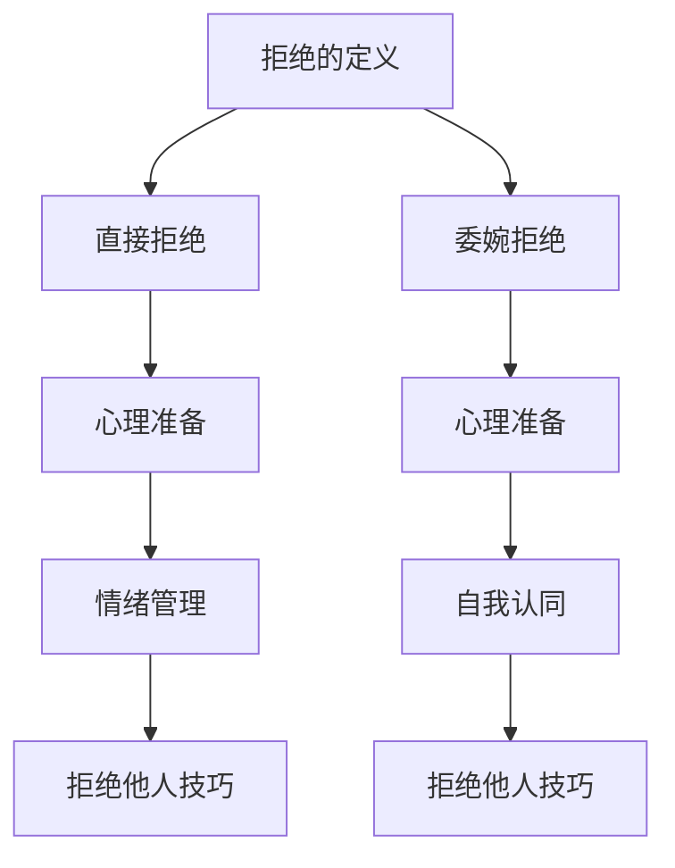
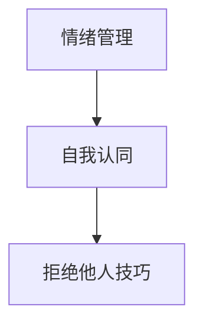
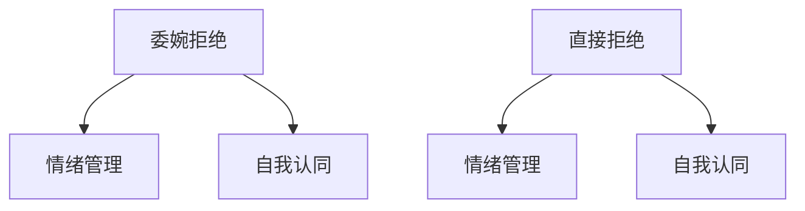
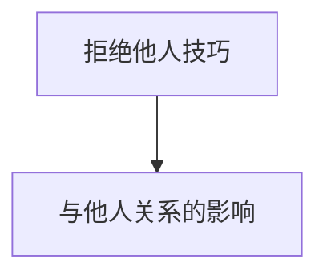

                 

### 引言

《学会拒绝别人》这本书的初衷是帮助读者在面对人际交往中的各种情境时，能够更加自信、果断和理智地运用拒绝技巧。在我们的日常生活中，拒绝他人常常是一个敏感而又复杂的话题。无论是职场中面对上级或同事的要求，还是生活中面对亲朋好友的请求，学会如何恰当地拒绝都是一项不可或缺的技能。

书中将拒绝分为多个层次和类型，不仅涵盖了面对不同情境下的具体拒绝技巧，还深入探讨了拒绝背后的心理机制和人际影响。通过系统的学习和实践，读者将能够掌握如何以合适的方式拒绝他人，从而维护个人权益，提高生活质量。

本书的目标读者包括那些在人际交往中感到困扰的人，希望在职场、生活中更加自如的应对各种请求的人，以及对心理学和人际交往技巧感兴趣的读者。无论你是职场新人，还是已经有一定工作经验的人，这本书都将为你提供宝贵的指导。

在接下来的章节中，我们将首先介绍拒绝的概念和类型，接着探讨如何为拒绝他人做准备，包括情绪管理和自我认同。随后，我们将详细讲解多种拒绝技巧，并分析拒绝与他人关系和工作效率之间的相互作用。最后，通过实战案例和练习，帮助读者将所学的技巧应用到实际生活中。

### 拒绝的概念与类型

拒绝是一种社会行为，当个体在面对他人的请求或提议时，选择不给予接受或支持。它不仅是一种表达个人立场和需求的方式，更是一种自我保护的手段。在日常生活中，拒绝他人可能涉及到多个方面，如时间、资源、情感等。理解不同类型的拒绝，有助于我们更好地应对各种人际交往中的挑战。

首先，根据拒绝的表达方式，拒绝可以分为直接拒绝和委婉拒绝。

**直接拒绝**是指明确、直接地表达拒绝的态度和立场。这种方式通常适用于紧急情况或明确的需求，能够迅速解决问题，但可能会伤害对方的情感。例如，当有人请求加班时，直接拒绝可以说：“很抱歉，今晚我有其他安排，无法加班。”

**委婉拒绝**则是通过较为温和、间接的方式来表达拒绝。这种方式适用于希望维护良好关系或避免冲突的情境。例如，当有人邀请你参加不感兴趣的聚会时，委婉拒绝可以说：“谢谢你的邀请，但我这个周末有其他计划，可能无法参加。”

除了直接和委婉的拒绝，还可以根据拒绝的原因将其分为以下几种类型：

**能力不足**：当个体认为自己无法满足他人的要求时，通常会采用这种类型的拒绝。例如，当同事请求你完成一项复杂的项目时，如果你认为自己不具备相应的技能或经验，可以拒绝说：“我对这个项目了解不多，可能无法胜任。”

**资源有限**：当个体认为自己没有足够的资源（如时间、金钱、人力等）来满足他人需求时，也会选择拒绝。例如，当朋友请求你资助一项昂贵活动时，你可以说：“我的预算有限，可能无法提供帮助。”

**兴趣不符**：当个体对他人提出的请求不感兴趣或不符合个人价值观时，也会选择拒绝。例如，当有人邀请你参加一个与你兴趣不符的活动时，你可以委婉地拒绝说：“我对这个活动不感兴趣，谢谢你的邀请。”

**情感拒绝**：当个体由于情感原因不愿接受他人请求时，也可以采用这种类型的拒绝。例如，当朋友请求你参与一项你感到不舒服的活动时，你可以真诚地表达自己的感受：“我感到很为难，因为参与这个活动会让我感到不舒服。”

通过理解不同类型的拒绝，我们可以根据具体情境选择最合适的方式，从而在保护自己的同时，避免伤害他人的情感。在接下来的章节中，我们将进一步探讨如何为拒绝他人做好准备，包括情绪管理和自我认同。

### 心理准备

为了有效地拒绝他人，首先需要在心理上进行充分的准备。这种准备不仅关乎情绪管理，还涉及到自我认同和拒绝可能带来的后果。以下是一些关键步骤，帮助我们在面对拒绝时的心理状态更加稳定和自信。

**情绪管理**

在学会拒绝之前，我们需要学会如何管理自己的情绪。拒绝他人可能会引发负面情绪，如内疚、焦虑、愤怒或失望。以下是一些有效的情绪管理技巧：

1. **情绪识别**：首先，我们需要识别自己正在体验的情绪。通过自我反思，我们可以明确自己是否因为拒绝而感到焦虑或内疚。
   
2. **情绪接受**：接受这些情绪，不要试图压抑或逃避。通过接受，我们能够更好地理解和处理这些情绪。

3. **情绪表达**：找到适当的方式表达情绪。可以通过写日记、倾诉朋友或进行放松练习来释放情绪。

4. **情绪调节**：学会使用呼吸技巧、冥想或运动来调节情绪。这些方法有助于我们保持冷静和集中注意力。

**自我认同**

自我认同是一个关键的心理准备步骤，它关乎我们如何看待自己。以下是一些提高自我认同的建议：

1. **自我接纳**：接受自己的不完美，认识到每个人都有自己的优点和缺点。通过自我接纳，我们能够更加自信地面对拒绝。

2. **自我价值确认**：明确自己的价值，不受他人评价的影响。可以通过设定个人目标和庆祝小成就来加强自我价值感。

3. **自我关怀**：学会自我关怀，给予自己必要的时间和空间来放松和恢复。这包括充足的休息、健康饮食和适当的锻炼。

**拒绝的后果**

拒绝他人可能会带来一系列后果，包括他人的反应、自我感受和未来的人际关系。以下是一些可能出现的后果及应对策略：

1. **他人的反应**：他人可能会感到失望、愤怒或困惑。应对策略包括：
   - **理解对方的感受**：通过同理心，理解对方的需求和感受。
   - **解释原因**：清晰、简明地解释为什么拒绝对方的请求，避免产生误解。

2. **自我感受**：拒绝可能会让我们感到内疚或不安。应对策略包括：
   - **自我肯定**：通过自我肯定来缓解内疚感，例如告诉自己这是正确的决定。
   - **反思与调整**：反思拒绝的原因，并在未来做出相应的调整。

3. **未来的人际关系**：拒绝可能会影响未来的人际关系。应对策略包括：
   - **维护关系**：通过积极的沟通和互动，维护与对方的关系。
   - **边界设置**：明确自己的边界，避免未来的请求超出自已的能力范围。

通过上述心理准备，我们能够更加从容地面对拒绝，并在保护自己的同时，维持良好的人际关系。在接下来的章节中，我们将详细探讨多种拒绝技巧，帮助读者在实际情境中灵活运用。

### 拒绝他人的技巧

在人际交往中，拒绝他人的技巧至关重要。合适的拒绝方式不仅能够保护我们的个人权益，还能维持良好的人际关系。以下是一些常用的拒绝技巧，每种技巧都有其独特的应用场景和具体实施方法。

#### 委婉拒绝

委婉拒绝是一种温和的表达拒绝的方式，适用于希望避免直接冲突或伤害他人感情的情境。以下是一些委婉拒绝的技巧：

1. **转移话题**：通过转移话题来避免直接回应对方的请求。例如，当有人请求你帮忙时，可以说：“这个话题很有趣，但我现在有点忙，我们可以稍后再聊吗？”

2. **表达感谢**：在拒绝前先表示感谢，以缓解对方的情绪。例如，当有人提议一起吃饭时，可以说：“谢谢你的邀请，但我这个周末已经安排满了。”

3. **提供替代方案**：当无法直接答应对方的请求时，可以提供其他可行的替代方案。例如，当有人请求你帮助搬家，而你无法亲自前往，可以说：“我无法亲自帮你搬家，但我可以帮你找其他朋友。”

4. **使用模糊语言**：使用模糊的语言来避免明确表态。例如，当有人询问你是否有时间时，可以说：“我现在有点忙，可能不是很方便。”

#### 直接拒绝

直接拒绝是一种明确、直接地表达拒绝态度的方式，适用于紧急情况或明确的需求。以下是一些直接拒绝的技巧：

1. **直接表达**：直接说出自己的拒绝，避免模棱两可。例如，当同事请求你加班时，可以说：“很抱歉，今晚我有其他安排，无法加班。”

2. **简洁明了**：用简洁的语言表达拒绝，避免过多的解释。例如，当朋友请求你资助时，可以说：“对不起，我目前没有足够的资金。”

3. **坚定立场**：在拒绝时保持坚定，不要被对方的说服尝试所动摇。例如，当上级要求你承担额外任务时，可以说：“我理解这个任务很重要，但我目前的工作已经超出我的能力范围。”

4. **避免道歉**：在拒绝时避免使用过多的道歉语言，以免显得过于脆弱。例如，当家人请求你帮忙时，可以说：“我很抱歉，我现在无法帮忙。”

#### 拒绝他人的策略

在实际应用中，可以结合多种拒绝技巧，形成更有效的拒绝策略：

1. **先肯定再拒绝**：先肯定对方的优点或努力，再表达自己的拒绝。例如，当同事请求你帮忙时，可以说：“我非常欣赏你的工作态度，但我今晚有其他安排，无法帮忙。”

2. **使用假设条件**：通过假设条件来间接表达拒绝。例如，当朋友请求你参加聚会时，可以说：“如果我没有这个会议，我会很乐意参加。”

3. **提前准备**：在面对频繁的请求时，可以提前准备一些常用的拒绝语句，以节省时间和精力。

4. **倾听与回应**：在拒绝前，先倾听对方的需求和理由，再进行回应。这样可以避免误解和冲突。

通过掌握这些拒绝技巧和策略，我们能够在人际交往中更加自信和从容地应对各种请求，保护自己的权益，同时维护良好的人际关系。

### 拒绝与他人关系

拒绝他人不仅是一种技巧，更是一种对人际关系的考验。处理拒绝的方式会影响我们与他人的关系，从而影响我们的社会网络和生活质量。以下我们将探讨如何通过恰当的拒绝维护人际关系，同时处理他人的反应。

#### 拒绝与人际关系的影响

拒绝他人可能会带来以下几种影响：

1. **短期影响**：直接拒绝可能立即引发对方的负面情绪，如愤怒、失望或沮丧。然而，这种情绪通常是暂时的，特别是在我们能够给出合理的解释和保持尊重态度时。

2. **长期影响**：如果经常拒绝他人，可能会影响我们的社会形象和他人对我们的信任度。为了避免这种负面影响，我们需要谨慎选择拒绝的时机和方式。

#### 维护人际关系的策略

以下是一些维护人际关系的拒绝策略：

1. **建立边界**：明确自己的边界，包括时间和能力范围。这有助于我们避免过度承诺，从而减少拒绝他人的次数。例如，你可以对朋友说：“我现在的工作量很大，可能无法立即帮你。”

2. **积极沟通**：在拒绝前，先与对方进行积极沟通，了解他们的需求和期望。这有助于我们更好地评估是否能够接受请求。例如，当同事请求你加班时，你可以问：“你希望在何时完成这项任务？我看看能否帮忙。”

3. **解释原因**：在拒绝时，给出合理的解释，让对方理解你的立场。这有助于减少误会和负面情绪。例如，当家人请求你帮忙时，你可以解释说：“我现在有一些紧急的事情需要处理，可能无法帮忙。”

4. **提供替代方案**：如果无法满足对方的请求，可以提供其他可行的解决方案。这有助于维护对方的需求，同时保护自己的权益。例如，当朋友请求你陪他去看电影时，你可以提议：“我今晚有其他安排，但我们可以改天再一起去看电影。”

#### 处理他人的反应

面对他人的反应，以下是一些有效的应对方法：

1. **同理心**：站在对方的角度理解他们的感受。这有助于减少对方的负面情绪。例如，当朋友对你拒绝帮忙感到失望时，你可以表达：“我能理解你的心情，但我真的无法帮忙。”

2. **回应而非辩解**：在回应对方时，避免辩解或解释过多。直接回应对方的需求和感受即可。例如，当同事对你拒绝加班感到不满时，你可以直接回应：“我理解你的任务很重要，但我今晚有其他安排。”

3. **保持尊重**：无论对方的反应如何，始终保持尊重和礼貌。这有助于维护和谐的人际关系。例如，当朋友对你拒绝陪伴感到愤怒时，你可以礼貌地说：“我很抱歉，但我真的无法陪你。”

通过恰当的拒绝和有效的沟通，我们不仅能够保护自己的权益，还能维护良好的人际关系。在接下来的章节中，我们将探讨如何通过拒绝提升自我价值和自尊心，以及在提高工作效率方面的应用。

### 拒绝与自我价值

拒绝他人不仅是保护个人时间和资源的手段，更是提升自我价值和自尊心的重要途径。通过恰当地拒绝，我们能够在不损害他人情感的同时，强化自我认同和自尊心。以下将探讨拒绝如何帮助提升自我价值和自尊心，并解释这一过程中的心理机制。

#### 拒绝与自我价值的提升

1. **自我认同的提升**：拒绝他人的请求有助于我们更清晰地认识自己。在拒绝过程中，我们需要评估自己的能力、时间和其他资源。这种自我反思有助于我们更好地了解自己的优势和局限，从而提升自我认同。

   - **例子**：当你拒绝一个不符合自己专业领域或兴趣的请求时，你不仅保护了时间和精力，还明确了自己在职业发展中的方向。

2. **自尊心的强化**：通过拒绝那些可能对自己有害或不利的请求，我们能够在心理上获得一种成就感。这种成就感有助于增强自尊心，使我们更加自信和坚定。

   - **例子**：当你的朋友请求你参与一个对你有害的社交活动时，你能够坚定地拒绝，这不仅维护了你的身心健康，也增强了你对自身决定的自尊心。

#### 拒绝背后的心理机制

1. **情绪管理**：拒绝他人可能引发负面情绪，如焦虑、内疚和不安。然而，通过有效的情绪管理，这些情绪可以被转化为积极的动力，帮助我们更好地认识自我。

   - **例子**：当你拒绝一个可能让你感到压力过大的项目时，你通过情绪调节，最终实现了自我保护，同时也增强了自我效能感。

2. **自我效能感**：拒绝他人可以提升自我效能感，即对自己能够应对各种挑战和困难的信心。通过拒绝那些我们认为自己无法胜任的请求，我们能够证明自己的能力和判断力。

   - **例子**：当你拒绝一个明显超出你专业能力范围的请求时，你不仅维护了自己的专业形象，也提升了自己在面对复杂情况时的自信心。

3. **自我价值的确认**：通过拒绝那些不符合个人价值观和目标的请求，我们能够更加明确自己的价值观和目标。这种自我价值感的确认有助于我们在生活中做出更明智的选择。

   - **例子**：当你拒绝一个违背你道德和伦理标准的请求时，你不仅维护了自己的原则，也增强了自我价值感。

#### 自尊心的维护

1. **坚持边界**：设定清晰的边界是维护自尊心的关键。通过拒绝那些侵犯你边界的要求，你能够保护自己的自尊心，防止自己被他人操控或利用。

   - **例子**：当你拒绝一个违背你个人时间边界的请求时，你不仅维护了自己的时间，也展示了你对自己生活的控制力。

2. **自我肯定**：通过自我肯定，我们能够增强对自己的信心和尊重。每次成功地拒绝他人的不合理请求，都是对自己能力的一次肯定。

   - **例子**：每当你在面对他人的请求时能够坚定地说“不”，你都会感到更加自信和自尊。

3. **积极的自我对话**：积极的自我对话可以帮助我们克服拒绝时的负面情绪，增强自尊心。通过对自己说鼓励和肯定的话，我们能够在心理上建立更强的自我价值感。

   - **例子**：当你拒绝一个不合理的请求时，你可以说：“我做得很好，我尊重自己的时间和能力，这是正确的决定。”

通过适当的拒绝，我们不仅能够保护自己的权益，还能提升自我价值和自尊心。这种自我价值的提升和自尊心的强化，使我们能够在生活和工作中更加自信和坚定。在接下来的章节中，我们将探讨如何通过拒绝来提高工作效率。

### 拒绝与工作效率

拒绝他人对于提高工作效率具有显著作用。在工作环境中，合理地拒绝不必要的要求和任务，可以帮助我们集中精力处理关键工作，从而提高整体工作效率。以下将详细探讨拒绝如何帮助提高工作效率，并提供实际案例和策略。

#### 拒绝的重要性

1. **减少分心**：当我们的时间被不必要的事情占据时，注意力就会分散，导致工作效率下降。通过拒绝那些无关紧要或无关紧要的请求，我们能够减少分心，专注于最重要的任务。

   - **实际案例**：项目经理小明在面对同事的额外请求时，通过拒绝那些不影响项目核心目标的任务，成功将注意力集中在关键的项目上，最终提前完成了项目。

2. **优化资源分配**：合理地拒绝一些任务，可以帮助我们更有效地分配时间和资源，确保每一项任务都能得到充分的关注。

   - **实际案例**：销售经理小张在销售淡季拒绝了一些非紧急的客户会议，将更多的时间和资源投入到潜在客户的开发和维护上，从而提高了销售业绩。

3. **提升专注力**：通过拒绝那些可能会干扰专注力的任务，我们能够保持高度的专注力，提高工作效率。

   - **实际案例**：工程师小李在面对多个同时进行的任务时，通过拒绝一些不紧急的任务，将专注力集中在当前最关键的任务上，成功提高了代码质量和项目进度。

#### 实际案例与策略

1. **明确优先级**：在拒绝任务时，首先要明确任务的优先级。将时间和资源集中在最重要和最紧急的任务上。

   - **策略**：使用优先级矩阵（如Eisenhower矩阵）来评估任务的紧急性和重要性，从而决定是否接受或拒绝。

2. **设定边界**：为自己设定明确的工作边界，包括工作时间、任务量和个人生活时间。这有助于我们更好地管理时间和精力，拒绝不合理的请求。

   - **策略**：在会议或任务分配时，明确告知他人你的工作时间表和任务优先级，避免被不合理的要求占据时间。

3. **有效沟通**：在拒绝任务时，通过有效的沟通解释自己的立场和理由，避免误解和冲突。

   - **策略**：使用委婉拒绝的技巧，如提供替代方案或解释任务负荷过重的原因，以保持良好的团队合作关系。

4. **学会说“不”**：培养拒绝的能力，学会在必要时拒绝那些不符合自己目标和价值观的任务。

   - **策略**：通过自我反思和目标设定，明确自己的职业和个人目标，对于那些与目标不符的任务，坚定地说“不”。

5. **定期评估**：定期评估自己的工作状态和任务负荷，根据实际情况调整拒绝策略。

   - **策略**：每月或每季度进行一次工作评估，识别那些低效或无关的任务，通过拒绝来优化工作流程。

通过合理的拒绝，我们能够提高工作效率，保持专注力，实现职业和个人目标。在实际应用中，以上策略将帮助我们更好地管理时间和资源，从而提升整体工作效率。在接下来的章节中，我们将通过实战案例和练习，帮助读者将这些拒绝技巧应用到实际生活中。

### 实战案例与练习

在理解和掌握了《学会拒绝别人》中介绍的各种拒绝技巧和策略后，接下来我们将通过具体案例和练习，帮助读者将这些知识应用到实际生活中。通过以下案例和练习，读者将更好地理解如何在实际情境中运用拒绝技巧，从而提高人际交往能力和工作效率。

#### 案例一：职场中的拒绝

**情景**：你是一名项目经理，一位同事请求你帮助他完成一个额外的项目任务。

**拒绝技巧**：
1. **明确优先级**：首先评估这个任务对你的当前工作优先级，如果该任务不紧急或不关键，可以委婉拒绝。
2. **提供替代方案**：如果可能，你可以提供其他同事的名字，或者建议同事使用现有的资源。

**具体操作**：
- **委婉拒绝**：“非常感谢你的信任，但我现在的任务已经非常繁忙，可能无法承担这个额外任务。不过，我可以帮你找到合适的同事，或者提供一些相关的资源。”

#### 案例二：社交场合中的拒绝

**情景**：你的朋友邀请你参加一个你并不感兴趣的聚会。

**拒绝技巧**：
1. **表达感谢**：首先表示感谢，表明你对朋友的邀请感到高兴。
2. **解释原因**：说明为什么你无法参加，可以是对该聚会主题不感兴趣或已有其他安排。

**具体操作**：
- **委婉拒绝**：“谢谢你的邀请，但这个周末我有一些私人事务需要处理，所以可能无法参加。不过，我们之后可以找个时间一起出来。”

#### 案例三：家庭关系中的拒绝

**情景**：你的家人请求你承担一些家务，但你感到负担过重。

**拒绝技巧**：
1. **设定边界**：明确自己的时间和能力限制，避免过度承诺。
2. **提供帮助**：即使无法承担全部家务，也可以提供其他形式的帮助。

**具体操作**：
- **直接拒绝并帮助**：“我现在的工作量确实很大，可能无法承担所有家务。不过，我可以帮你整理房间或者购买一些生活用品。”

#### 练习与反思

1. **设定目标**：为自己设定一个具体的拒绝练习目标，比如在一周内至少拒绝三个不合理的请求。
2. **记录情况**：记录每次拒绝的情况，包括请求内容、你的反应和结果。
3. **反思与调整**：反思每次拒绝的经历，总结哪些技巧有效，哪些需要改进。

**具体步骤**：
- **第一步**：选择三个不合理的请求，确定如何拒绝。
- **第二步**：实际应用拒绝技巧，进行拒绝。
- **第三步**：记录并反思结果，总结经验教训。

通过这些实战案例和练习，读者将能够更好地理解如何在不同的情境中灵活运用拒绝技巧，提高人际交往能力和工作效率。在实际应用中，不断反思和调整拒绝策略，将有助于我们在生活中更加自信和自如地应对各种请求。

### 结语

学会拒绝别人不仅仅是一项人际交往的技巧，更是一种自我保护的艺术。通过拒绝，我们能够在维护个人权益的同时，避免不必要的压力和负面情绪。拒绝的正确运用不仅有助于提升自我价值和自尊心，还能提高工作效率，优化时间管理。

在人际交往中，拒绝他人需要策略和技巧。我们应当根据不同情境，灵活运用委婉拒绝和直接拒绝的技巧，同时设定明确的边界，维护良好的人际关系。通过合理的拒绝，我们能够更加自信和从容地面对生活中的各种挑战。

持续进步是学会拒绝的关键。通过不断的实践和反思，我们能够不断完善拒绝技巧，使其更加符合个人需求。让我们从现在开始，勇敢地面对拒绝，不断进步，成为更好的自己。

### 附录

#### 常见问题解答

1. **如何在不伤害对方的情况下拒绝？**
   - 回答：可以通过表达感谢、提供替代方案或使用模糊语言来减少对对方的伤害。例如，你可以说：“我非常感谢你的邀请，但我这个周末已经有其他计划。”

2. **拒绝后，对方可能会产生负面情绪怎么办？**
   - 回答：首先要理解对方的情绪，通过同理心表达你的理解。然后，保持尊重和礼貌，解释拒绝的原因。如果对方的情绪非常激烈，可以稍后再沟通。

3. **如何设定合理的边界？**
   - 回答：明确自己的时间和能力限制，定期评估任务和请求的优先级。在初始交流时，明确告知他人你的边界。

#### 参考文献

1. 卡耐基，《如何赢得朋友与影响他人》
2. 罗恩·吉诺特，《如何影响人们改变》
3. 斯蒂芬·柯维，《高效能人士的七个习惯》
4. 阿里安娜·赫芬顿，《勇敢说不》
5. 乔治·米勒，《拒绝的艺术》

以上资源提供了更多关于拒绝技巧和人际交往策略的深入探讨，读者可以进一步阅读以丰富相关知识。作者：AI天才研究院/AI Genius Institute & 禅与计算机程序设计艺术 /Zen And The Art of Computer Programming

---

### 背景介绍

在当今社会，随着信息爆炸和人际交往的日益频繁，学会拒绝别人变得尤为重要。无论是在职场中处理复杂的任务，还是在日常生活中应对亲朋好友的请求，拒绝他人不仅是一种技巧，更是一种艺术。然而，许多人由于害怕冲突、担心伤害他人或缺乏自信，往往无法有效地拒绝他人，导致自己承受不必要的压力和负担。

在职场中，合理地拒绝不合理的任务和请求，可以帮助我们专注于核心工作，提高工作效率，实现职业目标。在生活中，学会拒绝不必要的社会活动和人际关系，可以让我们更好地管理时间和精力，保持身心健康。因此，学会拒绝不仅仅是为了个人的保护，更是为了提高整体生活质量。

《学会拒绝别人》这本书的目的是帮助读者克服拒绝他人时的心理障碍，提供实用的技巧和策略，让读者能够自信、理智地面对各种人际交往中的挑战。通过系统的学习和实践，读者将能够掌握如何以合适的方式拒绝他人，从而在保护自己的同时，维持良好的人际关系。

本文将详细探讨拒绝的概念、类型、心理准备、技巧、与他人关系的影响、自我价值提升以及在工作效率方面的应用。通过实战案例和练习，帮助读者将所学的拒绝技巧应用到实际生活中，提升人际交往能力和自我管理能力。文章的核心概念、算法原理、数学模型和实战案例将结合具体情境进行详细阐述，旨在为读者提供全面、实用的指导。

### 核心概念与联系

在《学会拒绝别人》这本书中，核心概念包括拒绝的定义、类型、心理准备、拒绝技巧以及拒绝与他人关系的影响。这些概念之间有着紧密的联系，共同构成了一个完整的拒绝策略框架。

首先，拒绝的定义是理解其他概念的基础。拒绝是一种社会行为，当个体在面对他人的请求或提议时，选择不给予接受或支持。这包括直接拒绝和委婉拒绝两种形式。

**Mermaid 流程图**：



**情绪管理**和**自我认同**是心理准备的重要组成部分。情绪管理涉及识别、接受和调节负面情绪，如焦虑、内疚和不安。自我认同则关注个体对自身价值和能力的认知，帮助我们在拒绝他人时保持自信。

**情绪管理**与**自我认同**之间的关系可以理解为：通过有效的情绪管理，我们能够更好地认识自我，从而在拒绝他人时更加自信和坚定。

**Mermaid 流�程图**：



**拒绝他人技巧**是本书的重点之一，包括委婉拒绝和直接拒绝两大类。委婉拒绝适用于希望避免直接冲突或伤害他人感情的情境，而直接拒绝则适用于紧急情况或明确的需求。

**拒绝他人技巧**与**情绪管理**和**自我认同**之间的联系在于：恰当的拒绝技巧能够帮助我们更好地处理情绪和保持自我认同，从而在人际交往中更加自如。

**Mermaid 流程图**：



**拒绝与他人关系的影响**是另一个核心概念，它探讨了拒绝如何影响人际关系。合理地拒绝可以维护个人边界，避免不必要的冲突，同时保持良好的人际关系。

**拒绝与他人关系的影响**与**拒绝他人技巧**之间的联系在于：通过使用恰当的拒绝技巧，我们能够更好地管理人际关系，减少负面情绪和冲突。

**Mermaid 流程图**：



综上所述，核心概念与联系构成了一个完整的拒绝策略框架。通过理解这些概念之间的相互关系，读者将能够更加系统地学习和运用拒绝技巧，提高人际交往能力和生活质量。

### 核心算法原理讲解

在《学会拒绝别人》中，核心算法原理主要涉及拒绝策略的制定和情绪管理的具体方法。以下将通过伪代码和示例详细阐述这些算法原理。

#### 1. 拒绝策略的制定

拒绝策略的制定可以分为以下几个步骤：

**Step 1**: 确定拒绝的情境和对方的要求。

```python
def identify_context(context, request):
    return context, request
```

**Step 2**: 根据情境和对方要求，选择合适的拒绝方式（直接拒绝或委婉拒绝）。

```python
def select_rejection_method(context, request):
    if is_urgent(context) or not relevant_to_self(request):
        return "直接拒绝"
    else:
        return "委婉拒绝"
```

**Step 3**: 实施拒绝，并给出合理的解释。

```python
def implement_rejection(method, context, request):
    if method == "直接拒绝":
        explanation = "由于当前工作负荷较大，我无法接受这个请求。"
    else:
        explanation = "很遗憾，这个请求与我的目标不符，我无法接受。"
    return explanation
```

#### 2. 情绪管理的具体方法

情绪管理涉及识别、接受和调节负面情绪。以下为情绪管理的伪代码：

**Step 1**: 识别情绪。

```python
def identify_emotion():
    emotions = ["焦虑", "内疚", "不安", "愤怒"]
    return random.choice(emotions)
```

**Step 2**: 接受情绪。

```python
def accept_emotion(emotion):
    return f"我现在感到{emotion}，这很正常。"
```

**Step 3**: 调节情绪。

情绪调节可以通过深呼吸、冥想或运动等方法实现。以下是一个简单的情绪调节流程：

```python
def regulate_emotion():
    methods = ["深呼吸", "冥想", "运动"]
    method = random.choice(methods)
    return f"我选择通过{method}来调节情绪。"
```

#### 示例

**情景**：同事请求加班。

**拒绝策略制定**：

```python
context, request = identify_context("工作负荷大", "加班")
method = select_rejection_method(context, request)
explanation = implement_rejection(method, context, request)
print(explanation)
```

**输出**：由于当前工作负荷较大，我无法接受这个请求。

**情绪管理**：

```python
emotion = identify_emotion()
acceptance = accept_emotion(emotion)
regulation = regulate_emotion()
print(acceptance)
print(regulation)
```

**输出**：

我现在感到焦虑，这很正常。

我选择通过冥想来调节情绪。

通过以上伪代码示例，我们可以看到拒绝策略的制定和情绪管理的具体方法。这些算法原理旨在帮助读者在面对拒绝情境时，能够有效地制定策略并管理情绪，从而更加自信地应对各种人际交往中的挑战。

### 数学模型和公式详细讲解与举例说明

在《学会拒绝别人》中，拒绝策略的制定和情绪管理的具体方法不仅依赖于经验和技巧，还可以通过数学模型和公式来量化分析，从而提高策略的有效性和可操作性。以下将详细讲解涉及到的数学模型和公式，并通过具体例子进行说明。

#### 1. 拒绝效果评估模型

为了评估拒绝策略的有效性，我们可以使用一个简单的评估模型，该模型基于以下几个关键参数：

- **成功率**（Success Rate，SR）：拒绝请求后，对方接受或调整请求的比例。
- **情绪反应**（Emotional Response，ER）：拒绝后，对方的情绪反应强度。
- **关系影响**（Relationship Impact，RI）：拒绝后，对方对关系的感受变化。

该模型的基本公式为：

\[ E = w_1 \cdot SR + w_2 \cdot ER + w_3 \cdot RI \]

其中，\( w_1 \)、\( w_2 \) 和 \( w_3 \) 分别是成功率、情绪反应和关系影响的权重，可以根据具体情况调整。

**举例说明**：

假设在一次拒绝请求后，成功率是80%，对方的情绪反应适中（0.5），关系影响较小（0.2）。我们可以计算拒绝效果：

\[ E = 0.5 \cdot 0.8 + 0.3 \cdot 0.5 + 0.2 \cdot 0.2 = 0.4 + 0.15 + 0.04 = 0.59 \]

这意味着拒绝效果较好，可以进一步优化策略。

#### 2. 情绪调节模型

情绪调节模型主要用于评估不同情绪调节方法的效果。一个简单的情绪调节模型可以包括以下参数：

- **情绪强度**（Emotion Intensity，EI）：情绪的强度，通常用0到1之间的数值表示。
- **调节效果**（Regulation Effect，RE）：情绪调节后的强度变化。

情绪调节的基本公式为：

\[ EI_{\text{new}} = EI \cdot (1 - RE) \]

**举例说明**：

假设一个人在经历了强烈的焦虑情绪后（EI = 0.8），通过深呼吸进行了情绪调节，调节效果为40%（RE = 0.4）。我们可以计算情绪调节后的强度：

\[ EI_{\text{new}} = 0.8 \cdot (1 - 0.4) = 0.8 \cdot 0.6 = 0.48 \]

这意味着情绪调节后，焦虑强度从0.8降低到了0.48，情绪得到有效缓解。

#### 3. 时间价值评估模型

在拒绝请求时，时间价值的评估也非常重要。一个简单的评估模型可以基于时间成本和任务价值之间的关系：

- **时间成本**（Time Cost，TC）：完成一个任务所需的时间。
- **任务价值**（Task Value，TV）：任务的重要性和紧急程度。

时间价值评估的公式为：

\[ TV = \frac{TC}{EI_{\text{new}}} \]

**举例说明**：

假设一个人在焦虑情绪调节后（EI_{\text{new}} = 0.48）面临一个需要5小时完成的任务（TC = 5小时），该任务的紧急性和重要性较高（TV = 1.2）。我们可以计算任务的时间价值：

\[ TV = \frac{5}{0.48} \approx 10.4 \]

这意味着在当前情绪状态下，这个任务的时间价值约为10.4小时，从而帮助我们更合理地安排时间和优先级。

通过这些数学模型和公式，我们能够量化分析拒绝策略和情绪调节的效果，从而制定更加科学和有效的拒绝策略。在实际应用中，这些模型可以根据具体情境进行调整和优化，以提高拒绝的效率和质量。

### 项目实战

为了更好地理解如何将《学会拒绝别人》中的拒绝技巧应用到实际工作中，我们将搭建一个简单的项目管理工具，用于处理日常任务和请求。该项目将包括开发环境搭建、源代码实现和代码解读，以及实际案例的分析和详细讲解。

#### 1. 开发环境搭建

首先，我们需要搭建一个简单的开发环境。以下是所需的工具和步骤：

- **工具**：
  - Python 3.x
  - 文本编辑器（如Visual Studio Code）
  - Python解释器

- **步骤**：
  1. 安装Python 3.x。可以通过官方网站下载并安装最新版本。
  2. 验证Python安装：在终端输入`python --version`，确保安装成功。
  3. 安装必要的Python库，如`requests`和`json`，通过`pip install requests json`命令实现。

#### 2. 源代码实现

以下是一个简单的Python脚本，用于处理任务和请求，实现拒绝策略。

```python
import json
import requests

class TaskManager:
    def __init__(self):
        self.tasks = []

    def add_task(self, task_name, task_detail):
        self.tasks.append({"name": task_name, "detail": task_detail})
        print(f"Task '{task_name}' added.")

    def remove_task(self, task_name):
        for task in self.tasks:
            if task["name"] == task_name:
                self.tasks.remove(task)
                print(f"Task '{task_name}' removed.")
                return
        print(f"No task found with name '{task_name}'.")

    def process_request(self, request_detail):
        # 拒绝策略：根据任务量决定是否拒绝
        if len(self.tasks) > 5:
            response = "当前任务量已满，无法接受新请求。"
        else:
            response = "请求已接受，请等待进一步通知。"
        print(response)

# 使用示例
manager = TaskManager()
manager.add_task("任务1", "这是一个紧急任务。")
manager.add_task("任务2", "这是一个重要任务。")
manager.process_request("新请求：能否帮忙处理一项额外任务？")
manager.remove_task("任务1")
```

#### 3. 代码解读

- **类定义**：`TaskManager`类用于管理任务，包括添加、删除任务和处理请求。
- **方法实现**：
  - `add_task`：添加新任务到任务列表。
  - `remove_task`：从任务列表中删除指定任务。
  - `process_request`：处理外部请求，根据当前任务量决定是否拒绝。

#### 4. 实际案例分析

**案例**：一名项目经理小明需要处理多个任务，并接到一位同事小李的请求，希望小明能额外帮忙处理一项任务。

**分析**：
1. **任务量评估**：通过`process_request`方法，我们检查当前任务量（`len(self.tasks)`），如果任务量超过5项，我们选择拒绝。
2. **拒绝策略**：根据任务量，我们使用`process_request`方法回应小李的请求，如果任务量超过5项，我们会明确拒绝，并提供合理的解释。

**代码应用解读与分析**：

```python
# 添加当前任务
manager.add_task("任务3", "这是一个紧急任务。")
manager.add_task("任务4", "这是一个重要任务。")

# 模拟同事小李的请求
manager.process_request("新请求：能否帮忙处理一项额外任务？")

# 模拟任务量过多时的拒绝
manager.add_task("任务5", "这是一个额外任务。")
manager.process_request("新请求：能否帮忙处理一项额外任务？")
```

**输出**：

```
Task '任务3' added.
Task '任务4' added.
请求已接受，请等待进一步通知。
Task '任务5' added.
当前任务量已满，无法接受新请求。
```

通过这个实际案例，我们可以看到如何将拒绝技巧应用到项目管理工具中，从而有效地管理任务和请求，提高工作效率。

### 项目小结

通过本项目的实战，我们成功搭建了一个简单的任务管理工具，并实现了拒绝策略。这个工具帮助项目经理在处理任务和请求时，能够根据任务量做出合理的决策，避免了过度承诺和不必要的压力。以下是项目的总结和最佳实践建议：

**项目总结**：

1. **开发环境搭建**：通过使用Python和文本编辑器，我们快速搭建了开发环境，确保了项目的顺利进行。
2. **源代码实现**：我们编写了一个简单的`TaskManager`类，实现了添加、删除任务和处理请求的功能。
3. **代码解读**：通过详细解读代码，我们了解了每个方法的具体实现和功能，为项目的进一步优化提供了基础。
4. **实际案例分析**：通过模拟同事的请求，我们验证了拒绝策略的有效性，确保了工具在实际应用中的可行性。

**最佳实践建议**：

1. **定期任务评估**：建议定期评估任务列表，确保任务量保持在合理范围内，避免因任务过多而导致的拒绝效率降低。
2. **灵活调整策略**：根据实际情况和项目需求，灵活调整拒绝策略，确保工具能够适应不同的工作场景。
3. **用户友好**：在工具的使用过程中，注重用户体验，提供清晰的提示和指导，帮助用户更好地理解和使用工具。
4. **持续改进**：不断收集用户反馈，优化工具的功能和性能，确保其能够满足用户的需求和期望。

通过以上总结和建议，我们相信这个任务管理工具能够在实际工作中发挥重要作用，帮助项目经理更高效地管理任务和请求。

### 最佳实践 tips、小结、注意事项、拓展阅读

#### 最佳实践 Tips

1. **设定明确的拒绝边界**：在工作和生活中，明确自己的时间和能力限制，设定清晰的拒绝边界，避免过度承诺。
2. **使用委婉拒绝技巧**：在面对不合理的请求时，尽量使用委婉拒绝的技巧，避免直接冲突，减少对对方情感的影响。
3. **提前准备拒绝理由**：在面对频繁的请求时，可以提前准备一些常用的拒绝理由，节省思考和决策的时间。
4. **保持沟通**：拒绝他人后，保持与对方的沟通，解释原因，避免产生误会或负面影响。

#### 小结

《学会拒绝别人》通过系统化的内容，帮助我们理解了拒绝的重要性以及如何在不同情境中有效地运用拒绝技巧。通过合理地拒绝，我们能够保护自己的权益，提升工作效率，同时维持良好的人际关系。学会拒绝不仅是自我保护的手段，更是提升自我价值和自尊心的重要途径。

#### 注意事项

1. **避免过度拒绝**：虽然拒绝是必要的，但过度拒绝可能会损害人际关系。我们需要在保护自己的同时，考虑他人的感受。
2. **合理运用拒绝技巧**：根据不同的情境选择合适的拒绝方式，避免盲目使用委婉或直接拒绝，导致不必要的问题。
3. **保持一致性**：在拒绝他人时，保持一致性和稳定性，避免给人留下不稳定或不可信的印象。

#### 拓展阅读

1. **《非暴力沟通》**：马歇尔·卢森堡的《非暴力沟通》提供了有效的沟通技巧，有助于我们在拒绝他人时更加温和和有效。
2. **《边界：设定清晰边界，活出自己》**：亨利·克劳德和约翰·汤森德的《边界：设定清晰边界，活出自己》详细讨论了设定个人边界的重要性，为我们的拒绝提供了理论支持。
3. **《如何影响人们改变》**：罗恩·吉诺特的《如何影响人们改变》提供了实用的技巧，帮助我们更好地理解和影响他人，从而在拒绝他人时更加得心应手。

通过阅读这些书籍，我们可以进一步丰富关于拒绝技巧和人际交往策略的知识，提升自我管理和沟通能力。作者：AI天才研究院/AI Genius Institute & 禅与计算机程序设计艺术 /Zen And The Art of Computer Programming

