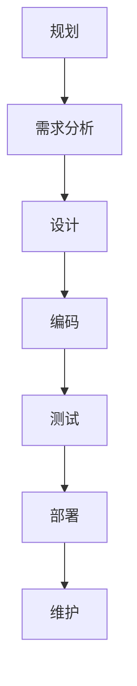
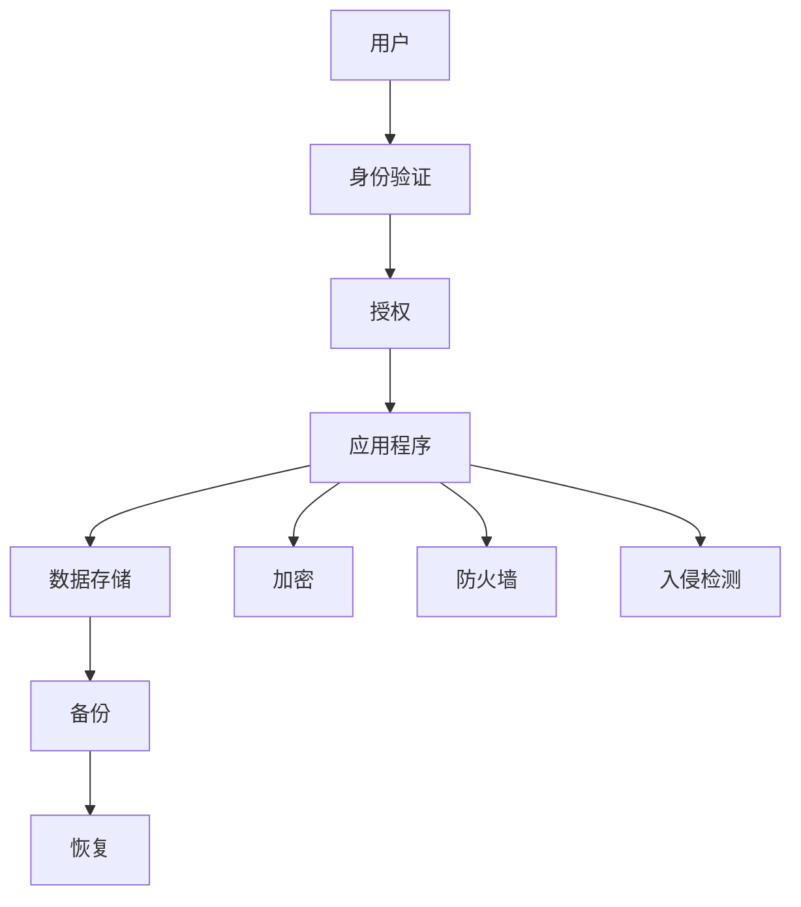

                 


### 1. 安全开发生命周期概述

安全开发生命周期（Security Development Life Cycle，简称SDLC）是一种系统化的方法，用于在软件开发生命周期的每个阶段内识别、评估和缓解安全风险。通过将安全措施融入到软件开发的各个阶段，可以显著降低软件系统在整个生命周期内的安全漏洞风险。

#### 1.1 安全开发生命周期的定义

安全开发生命周期是一系列有序的活动和步骤，用于确保软件开发过程的安全性。它涵盖了从项目规划、需求分析、设计、编码、测试到部署和维护的整个流程。安全开发生命周期旨在通过以下步骤实现：

- **识别安全需求和目标**：在项目规划阶段确定安全需求，并定义项目的安全目标。
- **风险识别和评估**：在需求分析阶段识别潜在的安全威胁，评估其影响和可能性。
- **安全设计**：在设计阶段制定安全策略和架构，确保系统的安全性。
- **安全编码**：在编码阶段实施安全措施，遵循安全编码规范。
- **安全测试**：在测试阶段进行安全测试，发现和修复安全漏洞。
- **安全部署**：在部署阶段确保安全措施得到实施，并进行安全配置。
- **安全维护**：在维护阶段持续监控和更新系统的安全性。

#### 1.2 安全开发生命周期的重要性

安全开发生命周期的实施对于确保软件系统的安全性至关重要，原因如下：

- **降低风险**：通过在整个开发过程中持续集成安全措施，可以显著降低安全漏洞和攻击的风险。
- **提高安全性**：确保系统的每个组件都经过严格的审查和测试，从而提高整体安全性。
- **符合法规要求**：遵守国际和国内的安全标准和法规要求，降低法律风险。
- **减少成本**：早期发现和修复安全漏洞可以显著减少后期修复的成本和时间。

#### 1.3 安全开发生命周期的核心要素

安全开发生命周期的核心要素包括：

- **安全需求分析**：确定项目的安全需求，并制定相应的安全策略。
- **风险评估**：识别潜在的安全威胁，评估其影响和可能性。
- **安全设计**：设计安全架构和策略，确保系统的安全性。
- **安全编码**：实施安全措施，遵循安全编码规范。
- **安全测试**：进行安全测试，发现和修复安全漏洞。
- **安全部署**：确保安全措施得到实施，并进行安全配置。
- **安全维护**：持续监控和更新系统的安全性。

#### 1.4 安全开发生命周期的阶段概述

以下是安全开发生命周期的各个阶段及其简要概述：

1. **规划**：确定项目目标、安全需求和预算。
2. **需求分析**：识别和记录安全需求。
3. **设计**：设计安全架构和系统组件。
4. **编码**：编写代码并实施安全措施。
5. **测试**：进行安全测试和漏洞扫描。
6. **部署**：部署软件系统并进行安全配置。
7. **维护**：监控和更新系统的安全性。

#### 1.5 安全开发生命周期的联系架构

以下是一个简单的Mermaid流程图，展示了安全开发生命周期中各个阶段之间的联系：



### 1.6 安全编码与开发

安全编码和开发是确保软件系统安全性的关键环节。在这一阶段，开发者需要遵循一系列安全编码规范，以减少潜在的安全漏洞。

#### 1.6.1 安全编码实践

以下是一些安全编码的最佳实践：

- **输入验证**：确保所有输入都经过验证，防止注入攻击。
- **使用加密算法**：对敏感数据进行加密处理。
- **最小权限原则**：确保代码以最低权限运行，减少恶意代码的影响范围。
- **代码审计**：定期对代码进行审计，发现和修复潜在的安全漏洞。

#### 1.6.2 常见安全漏洞与防御措施

以下是一些常见的安全漏洞及其防御措施：

- **SQL注入**：通过使用参数化查询和预处理语句来防止SQL注入。
- **跨站脚本（XSS）**：对用户输入进行转义，确保输出安全。
- **跨站请求伪造（CSRF）**：使用令牌验证机制，确保请求的真实性。
- **文件包含漏洞**：限制包含文件的路径，防止恶意文件被包含。

#### 1.6.3 安全开发工具

以下是一些常用的安全开发工具：

- **静态代码分析工具**：如SonarQube，用于发现代码中的安全漏洞。
- **动态代码分析工具**：如OWASP ZAP，用于在运行时检测安全漏洞。
- **自动化安全测试工具**：如Selenium，用于自动化安全测试。

### 1.7 安全测试与验证

安全测试和验证是确保软件系统安全性的关键步骤。在这一阶段，开发者需要通过一系列测试来验证系统的安全性。

#### 1.7.1 安全测试策略

以下是一些安全测试的策略：

- **单元测试**：确保每个模块的功能正确且安全。
- **集成测试**：验证模块之间的交互是否安全。
- **系统测试**：在模拟环境中验证系统的整体安全性。
- **渗透测试**：模拟攻击者行为，发现系统中的安全漏洞。

#### 1.7.2 安全测试实践

以下是一些安全测试的实践：

- **漏洞扫描**：使用工具对系统进行自动化扫描，发现潜在的安全漏洞。
- **手工测试**：手动测试系统，发现自动化工具无法检测到的安全漏洞。
- **安全演习**：定期进行安全演习，提高开发团队的安全意识和应对能力。

### 1.8 安全部署与维护

安全部署与维护是确保软件系统长期安全的关键。在这一阶段，开发者需要确保系统得到及时的安全更新和维护。

#### 1.8.1 安全部署计划

以下是一些安全部署计划的步骤：

- **确定部署环境**：选择合适的服务器和网络环境。
- **配置安全设置**：配置防火墙、加密算法和安全协议。
- **部署工具**：使用自动化部署工具，确保部署过程高效和安全。
- **备份和恢复策略**：制定备份和恢复策略，确保在出现问题时能够快速恢复。

#### 1.8.2 安全维护策略

以下是一些安全维护的策略：

- **定期更新**：定期更新系统中的安全补丁和软件版本。
- **监控和审计**：实时监控系统的安全状态，并定期进行安全审计。
- **应急响应**：制定应急响应计划，确保在出现安全事件时能够迅速应对。
- **安全培训**：定期对开发团队进行安全培训，提高团队的安全意识和技能。

### 1.9 安全文化与合规

安全文化是确保组织长期安全的关键。以下是一些促进安全文化建设和确保合规的方法：

#### 1.9.1 安全文化建立

- **安全教育**：定期对员工进行安全培训，提高员工的安全意识和技能。
- **安全政策**：制定明确的安全政策和流程，确保员工遵循。
- **安全意识培养**：通过安全宣传和活动，培养员工的安全意识。

#### 1.9.2 合规与法规遵循

- **国际标准**：遵守国际安全标准，如ISO/IEC 27001。
- **国内法规**：遵守国内相关安全法规，如《中华人民共和国网络安全法》。

### 1.10 安全开发资源

以下是一些安全开发资源：

- **开发工具**：如SonarQube、OWASP ZAP、Selenium等。
- **安全框架与库**：如OWASP Top 10、OWASP Dependency-Check等。
- **安全知识库与资料**：如OWASP、NIST等。

### 1.11 参考文献

- **OWASP Foundation**. (2022). OWASP Foundation. Retrieved from https://owasp.org/
- **National Institute of Standards and Technology**. (2021). NIST Special Publication 800-53. Retrieved from https://nist.gov/publications
- **International Organization for Standardization**. (2020). ISO/IEC 27001. Retrieved from https://www.iso.org/standard/71379.html

通过以上步骤，我们完成了对《安全开发生命周期：将安全融入每个开发阶段》的初步设计和目录大纲。接下来，我们将进一步细化每个章节的内容，确保文章的完整性和专业性。

### 2. 安全规划与需求分析

在安全开发生命周期的早期阶段，规划和需求分析是至关重要的。这一阶段的目标是明确项目的安全需求和目标，并制定相应的安全策略，以确保在后续开发过程中能够有效地融入安全措施。

#### 2.1 安全规划

安全规划是确保项目安全性的第一步。以下是一些关键步骤：

- **确定安全目标**：根据项目需求和业务目标，明确项目所需达到的安全目标。
- **评估安全需求**：识别项目可能面临的安全威胁和风险，并确定所需的安全措施。
- **制定安全策略**：根据安全需求和评估结果，制定项目的安全策略，包括安全架构、安全机制和安全过程。

#### 2.1.1 安全规划的目标

安全规划的主要目标包括：

- **降低风险**：通过识别和评估潜在的安全威胁，降低项目面临的风险。
- **确保合规性**：确保项目符合相关的安全标准和法规要求。
- **提高安全性**：通过实施有效的安全措施，提高项目的整体安全性。
- **保障数据安全**：确保敏感数据在传输和存储过程中的安全。

#### 2.1.2 安全需求分析

安全需求分析是确定项目所需的安全功能和安全特性的过程。以下是一些关键步骤：

- **需求收集**：与项目相关的人员进行沟通，了解项目的安全需求。
- **需求分类**：根据需求的性质和重要性进行分类，以便更好地管理和实现。
- **需求评审**：对收集到的需求进行评审，确保需求的完整性和可行性。

#### 2.1.3 安全需求文档

安全需求文档是记录项目安全需求的文档。以下是一些关键内容：

- **安全需求列表**：列出项目所需的安全需求，包括功能性和非功能性的安全需求。
- **安全需求描述**：对每个安全需求进行详细描述，包括需求的目的、功能、限制和约束。
- **需求关系图**：展示安全需求之间的关系，帮助理解需求的整体架构。

#### 2.2 风险评估

风险评估是识别项目潜在的安全威胁和风险，并评估其可能性和影响的过程。以下是一些关键步骤：

- **威胁识别**：识别项目可能面临的安全威胁，如网络攻击、数据泄露、恶意软件等。
- **漏洞识别**：识别项目中的安全漏洞，如代码缺陷、配置错误、访问控制不足等。
- **风险分析**：评估威胁的可能性和影响，确定风险的重要性和优先级。
- **风险缓解**：制定和实施缓解策略，降低风险的可能性和影响。

#### 2.2.1 风险识别

风险识别是风险评估的第一步，以下是一些关键步骤：

- **信息收集**：收集项目相关的信息，如技术文档、业务流程、系统架构等。
- **威胁识别**：识别项目中可能面临的安全威胁，如网络攻击、数据泄露等。
- **漏洞识别**：识别项目中的安全漏洞，如代码缺陷、配置错误等。

#### 2.2.2 风险评估方法

风险评估方法包括定量和定性的方法。以下是一些常用的风险评估方法：

- **定量风险评估**：使用数学模型和统计分析方法，对风险的可能性和影响进行量化评估。
- **定性风险评估**：通过专家评估和决策树等方法，对风险的可能性和影响进行定性评估。

#### 2.2.3 风险缓解策略

风险缓解策略是降低风险的可能性和影响的过程。以下是一些常见的方法：

- **避免**：通过修改项目需求或设计，避免潜在的风险。
- **转移**：通过购买保险或签订合同，将风险转移给第三方。
- **缓解**：通过实施安全措施，降低风险的可能性和影响。
- **接受**：对无法避免或转移的风险，采取接受策略，制定应对计划。

#### 2.3 安全设计与架构

安全设计与架构是确保项目安全性的关键阶段。在这一阶段，需要设计安全架构和制定安全策略，确保系统在功能和性能方面满足安全需求。

#### 2.3.1 安全设计原则

以下是一些安全设计原则：

- **最小权限原则**：确保系统以最低权限运行，减少恶意代码的影响范围。
- **隔离原则**：通过隔离不同的系统和用户，防止攻击者在系统间进行横向移动。
- **审计与监控原则**：确保系统能够记录和监控关键操作和事件，及时发现和响应安全事件。
- **冗余与容错原则**：通过冗余设计和容错机制，确保系统在面临攻击时能够持续运行。

#### 2.3.2 安全架构设计

安全架构设计是确保系统安全性的基础。以下是一些关键步骤：

- **确定安全需求**：根据项目需求，确定系统的安全需求。
- **设计安全架构**：根据安全需求，设计系统的安全架构，包括安全组件和安全机制。
- **实现安全策略**：根据安全架构，实现安全策略和机制，确保系统能够满足安全需求。

#### 2.3.3 安全组件设计

安全组件设计是确保系统组件安全性的关键。以下是一些关键步骤：

- **确定组件安全需求**：根据系统需求，确定每个组件的安全需求。
- **设计组件安全架构**：根据组件安全需求，设计组件的安全架构，包括安全接口、安全机制和安全通信。
- **实现组件安全功能**：根据组件安全架构，实现组件的安全功能，确保组件在运行时能够满足安全需求。

#### 2.4 安全计划与策略

安全计划与策略是确保项目安全性的重要保障。在这一阶段，需要制定详细的安全计划和安全策略，明确项目的安全目标和实施步骤。

#### 2.4.1 安全计划

以下是一些安全计划的步骤：

- **确定安全目标**：根据项目需求和风险评估结果，明确项目的安全目标。
- **制定安全策略**：根据安全目标和风险评估结果，制定项目的安全策略。
- **分配安全责任**：明确项目成员的安全职责，确保每个成员都知道自己的安全责任。
- **制定安全流程**：根据安全策略，制定项目的安全流程，确保项目的安全活动能够有序进行。

#### 2.4.2 安全策略

以下是一些安全策略的内容：

- **安全设计策略**：根据安全需求，设计安全架构和安全机制。
- **安全编码策略**：确保代码遵循安全编码规范，减少安全漏洞。
- **安全测试策略**：进行安全测试，发现和修复安全漏洞。
- **安全部署策略**：确保安全措施得到实施，并进行安全配置。
- **安全维护策略**：持续监控和更新系统的安全性。

### 2.5 安全培训与意识

安全培训与意识是确保项目安全性的重要环节。在这一阶段，需要对项目成员进行安全培训，提高他们的安全意识和技能。

#### 2.5.1 安全培训

以下是一些安全培训的内容：

- **安全基础知识**：介绍安全基本概念、常见攻击手段和防御措施。
- **安全工具与技巧**：介绍安全工具的使用方法和技巧。
- **案例分析与实战**：通过案例分析，展示安全事件和应对措施。

#### 2.5.2 安全意识培养

以下是一些安全意识培养的方法：

- **定期宣传**：通过安全宣传，提高员工的安全意识。
- **安全活动**：组织安全活动，如安全讲座、安全演练等，提高员工的安全技能。
- **安全文化**：培养安全文化，使员工认识到安全是每个人的责任。

通过以上步骤，我们完成了对《安全开发生命周期：将安全融入每个开发阶段》中安全规划与需求分析章节的详细讲解。接下来，我们将继续深入探讨设计、编码、测试、部署和维护等阶段的具体内容。

### 3. 安全设计与架构

在安全开发生命周期中，设计和架构阶段是确保软件系统安全性的关键环节。通过合理的安全设计和架构，可以有效地抵御潜在的安全威胁，确保系统的稳定性和可靠性。

#### 3.1 安全设计原则

安全设计原则是指导安全架构和系统设计的基本理念，以下是一些关键原则：

- **最小权限原则**：确保系统以最小权限运行，减少恶意代码的影响范围。
- **单一职责原则**：将系统功能分解为独立的模块，每个模块只负责一项功能，减少错误和安全漏洞的传播。
- **隔离原则**：通过物理或逻辑隔离，防止攻击者跨越不同的系统或模块。
- **透明性原则**：确保系统操作和访问记录可以被审计和监控，及时发现和处理异常情况。
- **多样性原则**：在设计过程中采用多种安全措施，增加攻击者的难度。

#### 3.1.1 隔离与最小权限原则

隔离与最小权限原则是确保系统安全性的基石。以下是如何在设计中实现这些原则：

- **隔离**：通过部署虚拟化技术、容器化技术或网络隔离，将不同的系统和模块隔离开来。例如，可以使用Docker容器将应用程序和服务隔离，防止攻击者跨越容器进行攻击。
  
  ```mermaid
  graph TD
    A[应用程序] --> B[容器A]
    B --> C[数据库A]
    D[容器B] --> E[应用程序]
    D --> F[数据库B]
  ```

- **最小权限**：确保每个组件只拥有执行其功能所需的最低权限。例如，数据库服务器应该只有必要的管理权限，而应用程序服务器则仅具有数据访问权限。

  ```mermaid
  graph TD
    A[用户] --> B[数据库服务器]
    B --> C[读/写权限]
    D[应用程序服务器] --> E[数据库服务器]
    E --> F[只读权限]
  ```

#### 3.1.2 审计与监控原则

审计与监控原则是确保系统安全的关键措施。以下是如何实现这些原则：

- **日志记录**：确保系统记录所有关键操作和事件，包括用户登录、文件访问、系统配置更改等。例如，使用ELK（Elasticsearch、Logstash、Kibana）堆栈来收集、存储和分析日志。

  ```mermaid
  graph TD
    A[应用程序] --> B[日志]
    B --> C[Logstash]
    C --> D[ELK堆栈]
  ```

- **实时监控**：通过实时监控工具，如Prometheus和Grafana，监控系统的性能和安全性。例如，设置告警规则，当系统指标超出阈值时自动触发告警。

  ```mermaid
  graph TD
    A[应用程序] --> B[Prometheus]
    B --> C[告警规则]
    C --> D[Grafana]
  ```

- **自动化审计**：使用自动化工具，如OWASP ZAP，定期对系统进行安全审计，发现潜在的安全漏洞。

  ```mermaid
  graph TD
    A[应用程序] --> B[OWASP ZAP]
    B --> C[审计报告]
  ```

#### 3.2 安全架构设计

安全架构设计是确保系统安全性的核心步骤。以下是如何设计一个安全架构：

- **确定安全需求**：根据项目的业务需求和风险评估结果，明确系统的安全需求，包括身份验证、访问控制、数据保护和网络安全等。

- **设计安全组件**：设计系统中的关键安全组件，如身份验证模块、访问控制模块、加密模块和防火墙等。确保每个组件都满足安全需求，并与其他组件相互配合。

  ```mermaid
  graph TD
    A[身份验证模块] --> B[访问控制模块]
    B --> C[加密模块]
    C --> D[防火墙]
  ```

- **实现安全机制**：根据安全需求，实现安全机制，如身份验证机制、加密机制、访问控制机制和入侵检测机制等。确保这些机制能够有效地抵御攻击并确保系统的安全性。

  ```mermaid
  graph TD
    A[身份验证机制] --> B[加密机制]
    B --> C[访问控制机制]
    C --> D[入侵检测机制]
  ```

- **集成与测试**：将安全组件和机制集成到系统中，并进行全面的安全测试，确保系统的安全性和可靠性。

#### 3.2.1 安全架构模型

以下是一个简单的安全架构模型，展示系统中的关键安全组件和机制：



#### 3.2.2 安全组件设计

在安全组件设计阶段，需要详细设计每个安全组件的接口、功能和安全特性。以下是如何设计安全组件：

- **身份验证组件**：设计身份验证组件的接口，如登录接口、注册接口和认证接口。确保组件能够实现多因素身份验证、密码加密和防止暴力破解等安全特性。

- **访问控制组件**：设计访问控制组件的接口，如权限分配接口、访问控制接口和权限检查接口。确保组件能够实现基于角色的访问控制（RBAC）和最小权限原则。

- **加密组件**：设计加密组件的接口，如加密接口、解密接口和密钥管理接口。确保组件能够实现数据加密、会话加密和传输加密等安全特性。

- **防火墙组件**：设计防火墙组件的接口，如规则管理接口、流量监控接口和安全事件接口。确保组件能够实现网络流量过滤、入侵检测和阻止恶意流量等安全特性。

#### 3.2.3 安全组件实现

在安全组件实现阶段，需要根据设计文档实现每个安全组件的功能和安全特性。以下是如何实现安全组件：

- **身份验证组件实现**：编写身份验证组件的代码，实现多因素身份验证、密码加密和防止暴力破解等功能。

  ```python
  # Python伪代码：身份验证组件实现
  def authenticate(username, password):
      # 验证用户名和密码
      # 实现多因素身份验证
      # 返回认证结果
  ```

- **访问控制组件实现**：编写访问控制组件的代码，实现基于角色的访问控制和最小权限原则。

  ```python
  # Python伪代码：访问控制组件实现
  def check_permission(user_role, resource):
      # 根据用户角色和资源检查权限
      # 返回权限检查结果
  ```

- **加密组件实现**：编写加密组件的代码，实现数据加密、会话加密和传输加密等功能。

  ```python
  # Python伪代码：加密组件实现
  def encrypt_data(data, key):
      # 加密数据
      # 返回加密后的数据
  def decrypt_data(encrypted_data, key):
      # 解密数据
      # 返回解密后的数据
  ```

- **防火墙组件实现**：编写防火墙组件的代码，实现网络流量过滤、入侵检测和阻止恶意流量等功能。

  ```python
  # Python伪代码：防火墙组件实现
  def filter_traffic(traffic):
      # 过滤恶意流量
      # 返回过滤后的流量
  def detect_invasion():
      # 检测入侵事件
      # 返回入侵检测结果
  ```

通过以上步骤，我们完成了对《安全开发生命周期：将安全融入每个开发阶段》中安全设计与架构章节的详细讲解。接下来，我们将探讨编码和测试阶段的具体内容。

### 4. 安全编码与开发

在安全开发生命周期中，编码和开发阶段是确保软件系统安全性的关键环节。通过遵循安全编码规范和实施最佳实践，可以减少潜在的安全漏洞和攻击风险。

#### 4.1 安全编码实践

安全编码实践是确保代码安全性的基础。以下是一些关键步骤和最佳实践：

- **输入验证**：确保所有输入都经过验证，防止注入攻击。例如，使用正则表达式或 Whitelist 方法验证用户输入。

  ```python
  # Python伪代码：输入验证
  def validate_input(input_value):
      # 使用 Whitelist 方法验证输入值
      if input_value in ['valid_input1', 'valid_input2']:
          return True
      else:
          return False
  ```

- **使用加密算法**：对敏感数据进行加密处理，如用户密码和信用卡信息。例如，使用 SHA-256 或 AES 算法加密数据。

  ```python
  # Python伪代码：加密算法使用
  import hashlib
  import os

  def encrypt_password(password):
      salt = os.urandom(16)
      hashed_password = hashlib.sha256(salt + password.encode()).hexdigest()
      return hashed_password, salt
  ```

- **最小权限原则**：确保代码以最小权限运行，减少恶意代码的影响范围。例如，使用沙箱技术限制代码的权限。

  ```python
  # Python伪代码：最小权限原则
  def execute_code(code):
      # 使用沙箱技术执行代码
      # 限制代码的权限
  ```

- **代码审计**：定期对代码进行审计，发现和修复潜在的安全漏洞。例如，使用静态代码分析工具检测代码中的安全漏洞。

  ```bash
  # Bash伪代码：代码审计
  ./code-analyzer --file my_code.py
  ```

#### 4.2 常见安全漏洞与防御措施

以下是一些常见的安全漏洞及其防御措施：

- **SQL注入**：通过使用参数化查询和预处理语句来防止SQL注入。

  ```python
  # Python伪代码：防御SQL注入
  import sqlite3

  def query_database(query, parameters):
      connection = sqlite3.connect('database.db')
      cursor = connection.cursor()
      cursor.execute(query, parameters)
      results = cursor.fetchall()
      connection.close()
      return results
  ```

- **跨站脚本（XSS）**：对用户输入进行转义，确保输出安全。

  ```python
  # Python伪代码：防御XSS
  def escape_input(input_value):
      return input_value.replace('<', '&lt;').replace('>', '&gt;')
  ```

- **跨站请求伪造（CSRF）**：使用令牌验证机制，确保请求的真实性。

  ```python
  # Python伪代码：防御CSRF
  def generate_csrf_token():
      return binascii.hexlify(os.urandom(24)).decode()

  def verify_csrf_token(token, stored_token):
      return token == stored_token
  ```

- **文件包含漏洞**：限制包含文件的路径，防止恶意文件被包含。

  ```python
  # Python伪代码：防御文件包含漏洞
  def include_file(file_path):
      # 检查文件路径是否在允许的范围内
      if os.path.isfile(file_path):
          with open(file_path, 'r') as file:
              return file.read()
      else:
          return "File not found"
  ```

#### 4.3 安全开发工具

以下是一些常用的安全开发工具：

- **静态代码分析工具**：如SonarQube、Checkmarx和Fortify，用于发现代码中的安全漏洞。

  ```bash
  # Bash伪代码：使用SonarQube
  sonar-scanner -Dsonar.projectKey=my_project -Dsonar.sources=my_code.py
  ```

- **动态代码分析工具**：如OWASP ZAP、Burp Suite和OWASP WebGoat，用于在运行时检测安全漏洞。

  ```bash
  # Bash伪代码：使用OWASP ZAP
  zap -url http://localhost:8080/
  ```

- **自动化安全测试工具**：如Selenium、Puppeteer和Cypress，用于自动化安全测试。

  ```python
  # Python伪代码：使用Selenium
  from selenium import webdriver
  driver = webdriver.Firefox()
  driver.get('http://localhost:8080/')
  # 执行自动化测试脚本
  driver.quit()
  ```

#### 4.4 安全编码技巧

以下是一些安全编码技巧：

- **避免使用内嵌SQL语句**：使用ORM（对象关系映射）或参数化查询，以防止SQL注入攻击。

- **使用安全的API和库**：选择经过验证的API和库，避免使用已知的漏洞库。

- **遵循代码规范**：编写清晰、简洁和一致的代码，遵循代码规范和最佳实践。

- **定期更新依赖库**：定期更新依赖库，以修复已知的安全漏洞。

#### 4.5 项目实战

以下是一个简单的项目实战，展示如何在实际开发中融入安全编码实践：

**项目名称**：用户管理系统

**目标**：实现一个能够注册、登录和管理的用户管理系统，并确保系统的安全性。

**实现步骤**：

1. **需求分析**：明确用户管理系统的功能和安全需求，如用户注册、登录、权限管理和数据保护。

2. **设计**：设计用户管理系统的架构，包括前端、后端和数据库。确保系统遵循最小权限原则和隔离原则。

3. **编码**：使用安全编码实践编写代码，如输入验证、加密算法和访问控制。

  ```python
  # Python伪代码：用户注册
  def register(username, password):
      # 验证用户名和密码
      # 加密密码
      # 存储用户信息
  ```

  ```python
  # Python伪代码：用户登录
  def login(username, password):
      # 验证用户名和密码
      # 返回用户ID和权限
  ```

4. **测试**：进行功能测试和安全测试，确保系统的安全性和可靠性。

  ```bash
  # Bash伪代码：使用OWASP ZAP进行安全测试
  zap -url http://localhost:8080/
  ```

5. **部署**：将系统部署到生产环境，并进行安全配置。

6. **维护**：持续监控和更新系统的安全性，确保系统能够抵御新的安全威胁。

通过以上步骤，我们完成了用户管理系统项目的开发，并确保了系统的安全性。这个项目实战展示了如何在实际开发中融入安全编码实践，提高系统的安全性。

### 5. 安全测试与验证

在安全开发生命周期中，安全测试与验证是确保软件系统安全性和可靠性的关键环节。通过全面的安全测试，可以及时发现和修复安全漏洞，从而降低系统的风险。

#### 5.1 安全测试策略

安全测试策略是确保测试活动有效和高效的关键。以下是一些关键步骤和最佳实践：

- **确定测试目标**：根据项目的安全需求和风险评估结果，明确测试的目标，如验证身份验证机制、访问控制策略和数据保护措施。

- **制定测试计划**：制定详细的测试计划，包括测试范围、测试方法、测试工具和资源分配等。

- **定义测试标准**：定义测试标准，如测试覆盖率、测试通过率和测试时间等。

- **执行测试**：按照测试计划和测试标准执行测试，包括功能测试、性能测试和安全测试。

- **报告与反馈**：生成测试报告，包括测试结果、发现的安全漏洞和修复建议，并反馈给开发团队。

#### 5.1.1 安全测试的目标

安全测试的主要目标包括：

- **验证安全性**：确保系统的安全措施得到正确实施，并能够抵御潜在的安全威胁。
- **发现漏洞**：通过测试发现系统的安全漏洞，如SQL注入、XSS和CSRF等。
- **提高可靠性**：确保系统的稳定性和性能，避免在安全测试中出现问题。
- **确保合规性**：验证系统是否符合相关的安全标准和法规要求。

#### 5.1.2 安全测试方法

安全测试方法包括以下几种：

- **静态代码分析**：通过分析代码的结构和内容，发现潜在的安全漏洞。例如，使用SonarQube进行静态代码分析。

  ```bash
  # Bash伪代码：使用SonarQube进行静态代码分析
  sonar-scanner -Dsonar.projectKey=my_project -Dsonar.sources=my_code.py
  ```

- **动态代码分析**：在程序运行时分析代码的执行过程，发现运行时的安全漏洞。例如，使用OWASP ZAP进行动态代码分析。

  ```bash
  # Bash伪代码：使用OWASP ZAP进行动态代码分析
  zap -url http://localhost:8080/
  ```

- **渗透测试**：模拟攻击者的行为，尝试入侵系统并发现安全漏洞。例如，使用Metasploit进行渗透测试。

  ```bash
  # Bash伪代码：使用Metasploit进行渗透测试
  msfconsole
  use exploit/multi/http/struts2_s2_019
  set RHOSTS localhost
  set RPORT 8080
  exploit
  ```

- **漏洞扫描**：使用自动化工具扫描系统，发现已知的安全漏洞。例如，使用Nessus进行漏洞扫描。

  ```bash
  # Bash伪代码：使用Nessus进行漏洞扫描
  nessus -i Nessus_scan_template.nes -o Nessus_scan_results.txt
  ```

#### 5.2 安全测试实践

以下是一些安全测试的实践步骤：

- **单元测试**：编写单元测试用例，验证系统的基本功能和安全性。例如，测试用户注册、登录和权限管理的功能。

  ```python
  # Python伪代码：用户注册单元测试
  def test_register():
      # 测试用户注册功能
      # 验证用户名和密码的合法性
      # 确保用户信息存储正确
  ```

- **集成测试**：测试不同模块之间的交互和集成，确保系统的整体安全性。例如，测试用户登录与权限控制的交互。

  ```python
  # Python伪代码：用户登录集成测试
  def test_login():
      # 测试用户登录功能
      # 验证登录成功和登录失败的情况
      # 确保权限控制得到正确实施
  ```

- **系统测试**：在模拟环境中测试整个系统，确保系统的安全性和可靠性。例如，测试系统的性能和响应时间。

  ```bash
  # Bash伪代码：使用Apache JMeter进行系统测试
  jmeter -n -t test_plan.jmx -l test_results.jtl
  ```

- **渗透测试**：模拟真实攻击场景，尝试入侵系统并发现安全漏洞。例如，测试系统的漏洞和弱点。

  ```bash
  # Bash伪代码：使用Burp Suite进行渗透测试
  burp Suite
  ```

#### 5.3 安全测试案例

以下是一个简单的安全测试案例，展示如何在实际项目中执行安全测试：

**项目名称**：在线购物平台

**目标**：确保在线购物平台的安全性，防止恶意攻击和数据泄露。

**测试步骤**：

1. **需求分析**：分析在线购物平台的功能和安全需求，如用户注册、登录、购物车、支付和订单管理等。

2. **测试计划**：制定详细的测试计划，包括测试范围、测试方法、测试工具和资源分配等。

3. **静态代码分析**：使用SonarQube对代码进行静态代码分析，发现潜在的安全漏洞。

  ```bash
  # Bash伪代码：使用SonarQube进行静态代码分析
  sonar-scanner -Dsonar.projectKey=my_project -Dsonar.sources=my_code.py
  ```

4. **动态代码分析**：使用OWASP ZAP对在线购物平台进行动态代码分析，发现运行时的安全漏洞。

  ```bash
  # Bash伪代码：使用OWASP ZAP进行动态代码分析
  zap -url http://localhost:8080/
  ```

5. **渗透测试**：使用Burp Suite模拟攻击场景，尝试入侵在线购物平台并发现安全漏洞。

  ```bash
  # Bash伪代码：使用Burp Suite进行渗透测试
  burp Suite
  ```

6. **漏洞扫描**：使用Nessus对在线购物平台进行漏洞扫描，发现已知的安全漏洞。

  ```bash
  # Bash伪代码：使用Nessus进行漏洞扫描
  nessus -i Nessus_scan_template.nes -o Nessus_scan_results.txt
  ```

7. **测试报告**：生成测试报告，包括测试结果、发现的安全漏洞和修复建议。

8. **修复漏洞**：根据测试报告，修复发现的安全漏洞，并重新进行测试。

通过以上步骤，我们完成了在线购物平台的安全测试。这个案例展示了如何在实际项目中执行安全测试，确保系统的安全性。

### 6. 安全部署与维护

在安全开发生命周期中，安全部署与维护是确保软件系统长期安全运行的关键阶段。通过合理的部署计划和持续的安全维护，可以确保系统在运行过程中始终保持高安全性。

#### 6.1 安全部署计划

安全部署计划的目的是确保软件系统在部署到生产环境时，安全措施得到有效实施。以下是一些关键步骤：

- **确定部署环境**：选择合适的服务器和网络环境，确保系统的硬件和软件配置满足安全要求。

- **配置安全设置**：配置防火墙、加密算法和安全协议，确保系统的基本安全措施得到实施。

  ```bash
  # Bash伪代码：配置防火墙规则
  sudo ufw allow 80/tcp
  sudo ufw allow 443/tcp
  sudo ufw enable
  ```

- **部署工具**：使用自动化部署工具，如Ansible或Puppet，确保部署过程高效和安全。

  ```bash
  # Bash伪代码：使用Ansible进行自动化部署
  ansible-playbook deploy.yml
  ```

- **备份和恢复策略**：制定备份和恢复策略，确保在出现系统故障或数据丢失时能够快速恢复。

  ```bash
  # Bash伪代码：备份和恢复
  tar czvf backup.tar.gz /path/to/important_files
  # 恢复时
  tar xzvf backup.tar.gz -C /path/to/important_files
  ```

#### 6.2 安全维护策略

安全维护策略是确保系统长期安全运行的关键。以下是一些关键步骤和最佳实践：

- **定期更新**：定期更新系统中的安全补丁和软件版本，以修复已知的安全漏洞。

  ```bash
  # Bash伪代码：更新操作系统
  sudo apt update && sudo apt upgrade
  ```

- **监控和审计**：实时监控系统的安全状态，并定期进行安全审计，及时发现和处理安全事件。

  ```bash
  # Bash伪代码：启用审计功能
  sudo auditctl -w /var/log/secure -p x -k auth
  ```

- **安全响应计划**：制定安全响应计划，确保在出现安全事件时能够迅速应对。

  ```bash
  # Bash伪代码：安全响应计划
  echo "安全事件处理步骤" > /path/to/safety_response_plan.txt
  ```

- **安全培训**：定期对开发团队进行安全培训，提高团队的安全意识和技能。

#### 6.3 持续集成与部署

持续集成与部署（CI/CD）是确保软件系统安全性和质量的重要手段。以下是一些关键步骤和工具：

- **自动化测试**：在持续集成过程中执行自动化测试，确保每次代码变更都经过严格的测试。

  ```bash
  # Bash伪代码：持续集成测试
  ./run_tests.sh
  ```

- **自动化部署**：使用CI/CD工具，如Jenkins或GitLab CI，实现自动化部署，确保部署过程高效和安全。

  ```yaml
  # YAML伪代码：GitLab CI配置文件
  stages:
    - test
    - deploy
  test:
    stage: test
    script:
      - ./run_tests.sh
  deploy:
    stage: deploy
    script:
      - ./deploy.sh
  ```

#### 6.4 安全事件处理

在软件系统运行过程中，可能会发生各种安全事件，如入侵、数据泄露和系统故障等。以下是一些关键步骤和注意事项：

- **事件报告**：及时报告安全事件，通知相关人员和部门。

- **事件分析**：分析安全事件的根源和影响，确定事件的严重性。

- **事件响应**：根据安全响应计划，采取相应的措施应对安全事件。

- **事件恢复**：在安全事件得到控制后，进行系统恢复和数据备份。

  ```bash
  # Bash伪代码：安全事件恢复
  tar xzvf backup.tar.gz -C /path/to/important_files
  ```

#### 6.5 案例分析

以下是一个简单的安全事件处理案例，展示如何在实际环境中应对安全事件：

**事件背景**：某在线购物平台遭受了一次SQL注入攻击，导致部分用户数据泄露。

**处理步骤**：

1. **事件报告**：安全团队立即报告了这次攻击事件，通知了相关人员和部门。

2. **事件分析**：安全团队分析了攻击事件的相关日志和代码，确定了攻击的根源是用户输入未经过验证，导致SQL注入漏洞。

3. **事件响应**：根据安全响应计划，安全团队立即采取了以下措施：
   - 停止受影响的系统服务；
   - 回滚代码库，回退到上一个稳定版本；
   - 修改数据库配置，禁止直接执行SQL语句；
   - 通知受影响的用户，建议他们更改密码。

4. **事件恢复**：在确保攻击得到控制后，安全团队进行了以下恢复工作：
   - 恢复系统服务，并重新启用受影响的模块；
   - 对数据库进行全量备份，确保数据安全；
   - 更新系统中的安全补丁，防止类似攻击再次发生。

通过以上步骤，安全团队成功应对了这次安全事件，确保了在线购物平台的安全和稳定运行。

### 7. 安全文化与合规

安全文化是确保组织长期安全的关键。通过建立安全文化和遵循相关法规，可以显著提高组织的安全意识和能力。

#### 7.1 安全文化建立

建立安全文化需要从多个方面入手：

- **安全教育**：定期对员工进行安全培训，提高员工的安全意识和技能。例如，通过在线课程、研讨会和实战演练等方式。

- **安全政策与流程**：制定明确的安全政策和流程，确保员工遵守。例如，建立密码管理政策、访问控制政策和数据保护政策等。

- **安全意识培养**：通过安全宣传和活动，培养员工的安全意识。例如，举办安全知识竞赛、发布安全警示等。

- **安全激励机制**：建立安全激励机制，鼓励员工积极参与安全活动，如安全漏洞奖励计划等。

#### 7.2 合规与法规遵循

遵循相关法规和标准是确保组织合规的重要手段。以下是一些关键法规和标准：

- **国际标准**：如ISO/IEC 27001（信息安全管理体系）和ISO/IEC 27002（信息安全控制措施）等。

- **国内法规**：如《中华人民共和国网络安全法》、《中华人民共和国数据安全法》和《信息安全技术个人信息安全规范》等。

- **行业规范**：如PCI DSS（支付卡行业数据安全标准）和HIPAA（健康保险便携与责任法案）等。

#### 7.3 安全文化建设的实际案例

以下是一个安全文化建设的实际案例：

**公司名称**：某互联网公司

**目标**：建立安全文化，提高员工的安全意识和技能。

**实施步骤**：

1. **安全培训**：定期组织安全培训，包括在线课程、内部讲座和实战演练。例如，每季度举办一次安全知识竞赛，提高员工的安全知识。

2. **安全政策与流程**：制定并发布安全政策和流程，如密码管理政策、访问控制政策和数据保护政策等。确保员工了解并遵守这些政策和流程。

3. **安全意识培养**：通过发布安全警示、举办安全宣传活动等方式，培养员工的安全意识。例如，每周发布一条安全警示，提醒员工注意潜在的安全威胁。

4. **安全激励机制**：建立安全漏洞奖励计划，鼓励员工发现和报告安全漏洞。例如，对发现安全漏洞的员工进行现金奖励或荣誉表彰。

通过以上步骤，某互联网公司成功建立了安全文化，员工的安全意识和技能得到了显著提高。

### 8. 安全开发资源

以下是一些安全开发资源，供开发者参考：

#### 8.1 开发工具

- **静态代码分析工具**：如SonarQube、Checkmarx和Fortify。
- **动态代码分析工具**：如OWASP ZAP、Burp Suite和Fiddler。
- **自动化安全测试工具**：如Selenium、Puppeteer和Cypress。
- **安全审计工具**：如Nessus、OpenVAS和Qualys。

#### 8.2 安全框架与库

- **OWASP Top 10**：提供常见的安全漏洞和攻击类型。
- **OWASP Dependency-Check**：检测项目中依赖的库和组件中是否存在已知的安全漏洞。
- **OWASP Cheat Sheet Series**：提供各种安全最佳实践的总结。

#### 8.3 安全知识库与资料

- **OWASP Foundation**：提供丰富的安全知识库和资源。
- **NIST**：提供信息安全标准和最佳实践。
- **OWASP**：提供关于Web安全的全面信息。
- **OWASP Project List**：列出各种安全项目和工具。

#### 8.4 安全社区

- **OWASP**：全球最大的开源安全社区，提供丰富的安全资源和活动。
- **Secure Code Warrior**：提供安全编程培训和挑战。
- **InfoSec Institute**：提供信息安全教育和认证。

通过利用这些安全开发资源，开发者可以更好地融入安全实践，提高软件系统的安全性。

### 9. 结论

本文详细介绍了安全开发生命周期的各个阶段，从规划与需求分析、设计、编码、测试、部署到维护，全面阐述了如何将安全融入每个开发阶段。通过实施一系列安全措施和最佳实践，我们可以显著降低软件系统的安全风险，确保系统的稳定性和可靠性。

在未来的软件开发过程中，开发者应持续关注安全技术的发展，不断优化和改进安全措施。同时，建立安全文化和遵循相关法规标准，提高组织的安全意识和能力。

让我们共同努力，构建安全、可靠、高质量的软件系统，为用户提供更安全的使用体验。未来，安全开发生命周期将继续引领软件安全的发展方向，为全球信息技术产业带来更广阔的前景。

### 10. 附录

#### 附录A：安全开发资源

- **开发工具**：
  - SonarQube：静态代码分析工具，用于发现代码中的安全漏洞。
  - OWASP ZAP：动态代码分析工具，用于检测Web应用程序的安全漏洞。
  - Burp Suite：Web应用安全测试工具，用于渗透测试和漏洞扫描。
  - Checkmarx：静态代码分析工具，用于评估代码的安全性。

- **安全框架与库**：
  - OWASP Top 10：列出最常见的Web应用程序安全漏洞。
  - OWASP Cheat Sheet Series：提供各种安全最佳实践的总结。
  - OWASP Dependency-Check：检查依赖库中的安全漏洞。

- **安全知识库与资料**：
  - OWASP Foundation：提供丰富的安全资源和指南。
  - NIST：发布信息安全标准和最佳实践。
  - OWASP：提供有关Web安全的全面信息。

#### 附录B：参考文献

- OWASP Foundation. (2022). OWASP Foundation. Retrieved from https://owasp.org/
- National Institute of Standards and Technology. (2021). NIST Special Publication 800-53. Retrieved from https://nist.gov/publications
- International Organization for Standardization. (2020). ISO/IEC 27001. Retrieved from https://www.iso.org/standard/71379.html
- ISO/IEC. (2013). ISO/IEC 27002:2013. Retrieved from https://www.iso.org/standard/63574.html

以上资源为本文提供了重要的技术支持和背景信息，有助于读者深入了解安全开发生命周期的实践和应用。通过利用这些资源，开发者可以进一步提升软件系统的安全性，为用户提供更加安全可靠的服务。

