                 


### 确定文章格式

首先，根据要求，我们需要使用markdown格式来撰写文章。markdown是一种轻量级的标记语言，它使用简单的文本格式语法来创建丰富的格式文本，易于阅读和编写。在markdown中，我们会用到以下几种基本格式：

- 标题：使用`#`号来表示标题的层级，`#`号越多，层级越低。
- 段落：直接写文字即可，段落之间会自动换行。
- 列表：使用`-`或者`*`来表示无序列表，使用数字加英文句点来表示有序列表。
- 引用：使用`>`号来表示引用，可以在文字前或者后使用。
- 代码块：使用三个反引号（```)来表示代码块，代码块内的文本会被保留原有的格式。
- LaTeX公式：使用`$$`括起来的内容表示独立段落中的公式，使用 `$` 括起来的内容表示段落内的公式。

### 添加作者信息

在文章的末尾，我们需要添加作者信息。按照要求，作者信息应包括姓名、所属机构以及书名。具体格式如下：

```
作者：AI天才研究院/AI Genius Institute & 禅与计算机程序设计艺术 /Zen And The Art of Computer Programming
```

### 确保文章完整性

文章的完整性是文章质量的关键。为了确保文章内容完整，我们需要在每个小节中包含以下内容：

- **背景介绍**：简要介绍小节的主题和背景。
- **核心概念与联系**：使用Mermaid流程图展示核心概念之间的关系。
- **核心算法原理讲解**：使用伪代码和LaTeX公式详细阐述算法原理。
- **数学模型和公式**：使用LaTeX格式展示数学模型和公式，并进行详细讲解。
- **项目实战**：包括开发环境搭建、源代码实现、代码解读、案例分析以及项目小结。
- **最佳实践 tips**、**小结**、**注意事项**和**拓展阅读**等内容。

### 字数要求

根据要求，文章的字数需要在8000到12000字之间。为了达到这个字数，我们需要在每个小节中详细讨论主题，并且提供充分的示例和讲解。

### 文章结构

根据目录大纲，我们将文章分为七个主要部分：

1. **文章标题**：清晰简洁，突出文章主题。
2. **文章关键词**：列出5-7个与文章主题相关的重要关键词。
3. **文章摘要**：简要介绍文章的主要内容、结构和观点。
4. **第1章 安全开发概述**
5. **第2章 安全开发的核心概念和原则**
6. **第3章 安全开发的方法和工具**
7. **第4章 安全开发的核心算法原理**
8. **第5章 安全开发的实践案例**
9. **第6章 安全开发的未来趋势**
10. **第7章 附录**

在每个部分中，我们都会按照上述要求进行详细的讨论和讲解。

### 总结

通过以上步骤，我们已经确定了文章的格式、结构以及内容要求。接下来，我们将逐步撰写每章的内容，确保文章的完整性和深度。在撰写过程中，我们将使用markdown格式，并遵循要求的完整性、详细性和字数限制。

## 文章标题

### 安全开发：构建安全可靠的软件系统

## 文章关键词

- 安全开发
- 软件安全
- 安全原则
- 加密算法
- 安全测试
- 安全架构
- 安全漏洞

## 文章摘要

本文旨在探讨如何进行安全开发，构建安全可靠的软件系统。文章首先介绍了安全开发的重要性以及其背景和发展趋势，接着深入分析了安全开发的核心概念和原则，包括威胁模型、攻击面和安全设计模式等。随后，文章详细讲解了安全开发的方法和工具，涵盖了安全流程、安全测试和安全编码等方面。接着，文章探讨了安全开发中的核心算法原理，包括加密算法、认证和授权算法以及防火墙和入侵检测算法。此外，文章通过实际项目案例，展示了安全开发的实践过程，并提出了安全开发的最佳实践。最后，文章展望了安全开发的未来趋势，探讨了新兴技术对安全开发的影响以及未来的发展方向。通过本文的阅读，读者将能够全面了解安全开发的重要性和实践方法，提升软件系统的安全性。

## 第1章 安全开发概述

### 1.1 安全开发的重要性

在当今数字化时代，软件系统已经成为企业和社会运行的核心支柱。随着软件系统的复杂性和规模不断扩大，安全问题日益突出，成为影响软件系统稳定性和可靠性的重要因素。安全开发（Secure Development）是指在软件开发过程中，将安全性作为核心考虑因素，通过一系列措施和策略，确保软件系统在整个生命周期中具备高安全性的过程。

安全开发的重要性主要体现在以下几个方面：

1. **保护用户数据**：随着互联网的普及，越来越多的个人和企业的敏感数据存储在软件系统中。如果没有进行安全开发，这些数据可能会被恶意攻击者窃取、篡改或滥用，造成严重的隐私泄露和数据损失。

2. **维护企业声誉**：软件系统一旦遭受安全攻击，可能会导致系统崩溃、服务中断，甚至造成经济损失。这不仅会对企业的运营造成严重影响，还会损害企业的声誉，影响客户信任。

3. **确保合规性**：随着各种安全法规和标准的制定，企业必须遵守相应的合规要求。安全开发可以帮助企业确保软件系统的合规性，避免因违规而面临法律风险和罚款。

4. **提升竞争力**：具备高安全性的软件系统能够赢得用户的信任，提高企业的竞争力。在激烈的市场竞争中，安全性成为用户选择软件系统的重要因素之一。

### 1.2 安全开发的背景和发展趋势

安全开发作为一个独立的领域，其发展历程可以追溯到20世纪90年代。当时，随着互联网的兴起，软件系统的安全问题逐渐受到关注。早期的安全开发主要集中在防范外部攻击，如网络攻击、恶意软件等。随着技术的进步，安全开发逐渐扩展到涵盖更多方面，如数据安全、身份认证、访问控制等。

近年来，安全开发的发展趋势主要体现在以下几个方面：

1. **DevSecOps**：DevSecOps是一种将安全性集成到软件开发和运营过程中的方法论。它强调在整个软件开发生命周期中，从代码编写到部署，都需要考虑安全性。DevSecOps的目标是通过自动化工具和流程，实现安全性与开发效率的平衡。

2. **移动安全和云安全**：随着移动设备和云计算的普及，移动安全和云安全成为安全开发的重要方向。开发者需要针对移动设备和云环境的特点，设计相应的安全策略和解决方案。

3. **自动化安全测试**：自动化安全测试工具和技术的发展，使得安全测试变得更加高效和全面。自动化测试可以帮助开发者快速发现和修复安全漏洞，降低安全风险。

4. **隐私保护**：随着用户对隐私保护的重视，开发者需要关注如何保护用户的隐私数据。隐私保护技术，如数据脱敏、匿名化等，正在成为安全开发的重要内容。

### 1.3 安全开发的目标和挑战

安全开发的目标是构建安全可靠的软件系统，确保软件系统在运行过程中能够抵御各种安全威胁，保护用户数据和企业利益。具体来说，安全开发的目标包括以下几个方面：

1. **漏洞防护**：通过设计和实现安全的代码，防止常见的漏洞，如注入攻击、跨站脚本攻击（XSS）和跨站请求伪造（CSRF）等。

2. **数据安全**：确保用户数据在传输和存储过程中得到充分的保护，防止数据泄露、篡改和滥用。

3. **身份认证和访问控制**：确保只有授权用户才能访问系统资源和数据，通过身份认证和访问控制机制，防止未授权访问。

4. **系统可用性和稳定性**：确保软件系统在面临攻击或故障时，能够保持可用性和稳定性，不会导致服务中断或系统崩溃。

然而，安全开发面临许多挑战：

1. **安全性与开发效率的平衡**：安全开发需要耗费一定的时间和资源，如何在保证安全性的同时，保持高开发效率，是一个需要权衡的问题。

2. **不断变化的安全威胁**：随着技术的不断进步，安全威胁也在不断演变。开发者需要不断更新和改进安全策略和措施，以应对新的安全挑战。

3. **安全知识的普及和培训**：安全开发需要开发者具备一定的安全知识。然而，目前很多开发人员对安全知识的掌握不够，需要通过培训和普及来提高整个行业的安全水平。

4. **法规和标准的遵守**：不同国家和地区有不同的安全法规和标准，开发者需要了解并遵守这些法规和标准，确保软件系统的合规性。

### 1.4 安全开发的核心概念

为了实现安全开发的目标，我们需要了解一些核心概念和原理。以下是安全开发中的一些关键概念：

1. **威胁模型**：威胁模型是一种分析软件系统潜在威胁的方法，它帮助开发者识别系统可能面临的风险，并设计相应的防护措施。

2. **攻击面**：攻击面是指软件系统暴露给外部攻击者的所有入口和漏洞。通过分析攻击面，开发者可以识别系统的潜在弱点，并采取措施进行防护。

3. **安全设计模式**：安全设计模式是一系列用于提高软件系统安全性的设计原则和策略。这些模式包括密码学、访问控制、数据加密、安全存储等。

4. **加密算法**：加密算法是用于保护数据安全的重要工具，通过加密算法，可以将明文数据转换为难以理解的密文。

5. **认证和授权**：认证是验证用户身份的过程，授权是确定用户权限的过程。通过认证和授权机制，可以确保只有授权用户才能访问系统资源和数据。

6. **安全测试**：安全测试是发现和修复软件系统漏洞的重要手段，包括静态代码分析、动态代码分析、渗透测试等。

7. **安全编码**：安全编码是编写安全代码的实践和技巧，通过遵循安全编码规范，可以减少安全漏洞的出现。

### 1.5 安全开发的流程

安全开发是一个系统性过程，涉及到多个阶段和步骤。以下是安全开发的典型流程：

1. **需求分析**：在项目开始阶段，进行需求分析，明确系统的功能和性能要求，同时也需要考虑安全性要求。

2. **设计阶段**：在设计阶段，进行安全需求分析，设计安全架构和方案，确保系统能够抵御潜在的安全威胁。

3. **编码阶段**：在编码阶段，开发者需要遵循安全编码规范，编写安全代码，同时进行静态代码分析和动态代码分析，及时发现和修复安全漏洞。

4. **测试阶段**：在测试阶段，进行各种安全测试，包括渗透测试、漏洞扫描、安全性能测试等，确保系统能够满足安全性要求。

5. **部署阶段**：在部署阶段，需要确保部署过程的安全性，防止部署过程中引入安全漏洞。

6. **维护阶段**：在系统运行过程中，需要持续进行安全监控和漏洞修复，确保系统的长期安全性。

### 1.6 总结

本章介绍了安全开发的重要性、背景和发展趋势，明确了安全开发的目标和挑战，并介绍了安全开发的核心概念和流程。在后续章节中，我们将深入探讨安全开发的方法和工具，以及核心算法原理，帮助读者全面了解和掌握安全开发的实践方法。

### 安全性定义与分类

安全性是软件系统在设计和实现过程中需要考虑的核心因素，它旨在确保系统的完整、保密性和可用性。在安全开发中，明确安全性的定义和分类是理解和应用安全措施的基础。以下是对安全性的定义及其主要分类的详细解释。

#### 安全性定义

安全性可以定义为保护系统资源免受未授权访问、使用、披露、破坏、修改或破坏的能力。具体来说，安全性包括以下几个方面：

1. **完整性**：确保系统数据、信息和资源的正确性和可靠性，防止未授权的篡改或破坏。
2. **保密性**：保护系统中的敏感信息和数据，确保只有授权用户可以访问和查看。
3. **可用性**：确保系统能够在需要时提供正常服务，防止因恶意攻击或故障导致系统不可用。
4. **认证**：验证用户的身份，确保只有合法用户才能访问系统和资源。
5. **授权**：确定用户在系统中的权限，确保用户只能访问和执行他们被授权的操作。

#### 安全性分类

安全性可以从不同的角度进行分类，常见的分类方法包括以下几种：

1. **物理安全**：
   - **硬件安全**：保护计算机硬件设备，如服务器、网络设备等，防止物理损坏、盗窃或未经授权的访问。
   - **环境安全**：保护系统运行的环境，如防火、防盗、防干扰等，确保系统运行在安全的环境中。

2. **网络安全**：
   - **网络安全**：保护网络通信，防止网络攻击、数据泄露、恶意软件传播等。
   - **防火墙**：通过设置访问控制策略，阻止未授权的访问和攻击。
   - **入侵检测系统（IDS）**：监控网络流量，检测和响应可疑活动。

3. **数据安全**：
   - **加密**：使用加密算法保护数据的保密性和完整性。
   - **数据备份**：定期备份数据，防止数据丢失或损坏。
   - **数据访问控制**：通过访问控制策略，确保只有授权用户可以访问特定的数据。

4. **应用安全**：
   - **代码审计**：通过审计代码，发现潜在的安全漏洞。
   - **输入验证**：对用户输入进行验证，防止注入攻击、跨站脚本攻击（XSS）等。
   - **安全编码**：遵循安全编码规范，编写安全的代码。

5. **用户安全**：
   - **身份认证**：验证用户的身份，确保只有合法用户可以访问系统。
   - **访问控制**：确定用户在系统中的权限，确保用户只能访问和执行他们被授权的操作。
   - **用户权限管理**：定期审查和更新用户权限，防止权限滥用。

#### 安全性与可用性的平衡

在安全开发过程中，平衡安全性与可用性是一个重要的挑战。以下是一些关键考虑因素：

1. **安全性措施对性能的影响**：过于严格的安全措施可能会降低系统的性能，如加密和认证过程可能会增加处理时间。开发者需要在性能和安全之间进行权衡。

2. **用户便捷性与安全性**：过于复杂的安全机制可能会影响用户的便捷性。例如，过于复杂的密码策略可能会使用户难以记住密码，从而影响用户体验。

3. **安全性与开发效率**：安全开发需要投入一定的时间和资源。开发者需要在保证安全性的同时，保持高开发效率。

#### 实际应用案例

以下是一些实际应用案例，展示了安全性与可用性的平衡：

1. **电子商务平台**：
   - **安全性措施**：使用HTTPS加密通信、双因素认证、数据加密存储等。
   - **可用性考虑**：确保支付流程简洁流畅，减少用户的等待时间。

2. **医疗信息系统**：
   - **安全性措施**：使用严格的身份认证、加密传输、访问控制等。
   - **可用性考虑**：在确保数据安全的同时，提供快速响应的查询服务，以便医生和患者能够及时获取信息。

3. **社交网络平台**：
   - **安全性措施**：实施隐私保护、数据加密、举报系统等。
   - **可用性考虑**：简化用户操作，提供友好的用户界面，以便用户能够轻松地管理自己的隐私和内容。

#### 总结

安全性是软件系统不可或缺的一部分，它涉及到多个方面，包括物理安全、网络安全、数据安全、应用安全和用户安全等。在安全开发过程中，需要平衡安全性与可用性，确保系统能够在提供安全保护的同时，保持高效性和用户便捷性。通过实际应用案例的分析，我们可以看到，在设计和实现安全措施时，需要综合考虑各种因素，确保系统的安全性和可用性达到一个合理的平衡状态。

### 安全开发的基本原则

在安全开发过程中，遵循一系列基本原则至关重要。这些原则不仅指导开发人员设计和实现安全的软件系统，而且确保系统能够在实际运行中保持安全性。以下是安全开发的基本原则，并分别进行详细解释：

#### 原则1：最小权限原则（Principle of Least Privilege）

最小权限原则是指系统中的每个组件和用户都应被赋予执行其任务所必需的最小权限。这个原则的目的是最大限度地减少恶意行为或误操作带来的风险。具体应用包括：

- **用户权限管理**：为每个用户分配最低必要的权限，防止权限滥用。
- **进程隔离**：通过隔离不同的进程和用户空间，确保一个组件的故障不会影响到其他组件。
- **文件权限设置**：严格控制文件和目录的访问权限，防止未授权的访问和修改。

#### 原则2：防御深度原则（Defensive Depth Principle）

防御深度原则强调在软件系统中构建多层次的防御机制，通过多个安全层来保护系统。这种方法可以增加攻击者突破所有防御层所需的努力和时间。具体应用包括：

- **多层次的安全测试**：在开发过程中进行多轮安全测试，包括静态代码分析、动态代码分析、渗透测试等。
- **网络防火墙和入侵检测系统**：在网络安全层中设置多层防护，如防火墙、入侵检测系统（IDS）和入侵防御系统（IPS）。
- **多层次的身份验证**：采用多因素身份验证（MFA），例如密码、手机验证码和指纹识别等，增加身份验证的强度。

#### 原则3：安全设计原则（Secure Design Principles）

安全设计原则是指在系统设计和架构阶段就考虑安全性，确保系统架构本身具有安全性。具体应用包括：

- **模块化设计**：将系统划分为多个独立的模块，每个模块负责特定的功能，减少组件间的依赖，方便安全管理和维护。
- **最小表面原则**（Principle of Minimum Surface Area）：设计系统时，尽量减少暴露在外的接口和功能，降低攻击面。
- **访问控制设计**：设计合理的访问控制机制，确保只有授权用户才能访问敏感数据和功能。

#### 原则4：安全编码原则（Secure Coding Principles）

安全编码原则是指在编写代码时遵循一系列安全最佳实践，以减少安全漏洞的出现。具体应用包括：

- **输入验证**：对用户输入进行严格的验证，防止SQL注入、跨站脚本攻击（XSS）等。
- **错误处理**：正确处理错误和异常情况，避免因错误处理不当导致的系统漏洞。
- **加密和散列**：使用正确的加密和散列算法保护敏感数据和密码，防止泄露和篡改。
- **代码审计**：定期进行代码审计，发现和修复潜在的安全漏洞。

#### 原则5：安全测试原则（Secure Testing Principles）

安全测试原则是指在软件开发过程中进行全面的测试，以发现和修复安全漏洞。具体应用包括：

- **静态代码分析**：通过分析源代码，发现潜在的安全漏洞，如未使用的代码、不安全函数调用等。
- **动态代码分析**：在运行时分析程序的行为，发现运行时的安全漏洞，如输入验证失败、内存泄漏等。
- **渗透测试**：模拟真实的攻击，通过攻击者的视角发现系统的实际漏洞。

#### 原则6：持续安全意识培养（Continuous Security Awareness）

持续安全意识培养原则强调在整个组织内培养安全文化，提高员工的安全意识。具体应用包括：

- **安全培训**：定期为开发人员和运维人员提供安全培训，提高他们的安全意识和技能。
- **安全政策**：制定明确的安全政策，确保所有员工了解并遵守安全规则。
- **安全反馈机制**：建立有效的安全反馈机制，鼓励员工报告潜在的安全问题和漏洞。

#### 原则7：合规性原则（Compliance Principle）

合规性原则是指确保软件系统和开发过程符合相关的法律法规和行业标准。具体应用包括：

- **法律遵从性**：遵守国家网络安全法律法规，如《网络安全法》、《个人信息保护法》等。
- **行业标准**：遵循相关行业标准和最佳实践，如ISO/IEC 27001、OWASP TOP 10等。

### 实际应用案例

以下是几个实际应用案例，展示了上述原则在安全开发中的具体应用：

1. **最小权限原则**：
   - **案例**：在一个企业级应用中，系统管理员拥有对整个系统的完全控制权限，而普通用户只能访问他们的个人数据和功能。
   - **效果**：降低了内部人员滥用权限的风险，提高了系统的整体安全性。

2. **防御深度原则**：
   - **案例**：一个银行网站在网络安全层中设置了多层防护，包括防火墙、IDS、SSL加密等。
   - **效果**：通过多层防护，增加了攻击者突破所有防御层的难度，提高了系统的安全性。

3. **安全设计原则**：
   - **案例**：一个电子商务平台在设计时采用了模块化设计，每个模块独立运行，且只有经过认证的用户才能访问。
   - **效果**：提高了系统的可靠性和安全性，方便了维护和升级。

4. **安全编码原则**：
   - **案例**：在一个移动应用程序中，开发人员严格遵循输入验证和安全编码实践，防止SQL注入和跨站脚本攻击。
   - **效果**：减少了应用程序的安全漏洞，提高了用户体验。

5. **安全测试原则**：
   - **案例**：在一个软件开发项目中，开发团队进行了多轮静态代码分析和动态代码分析，并在发布前进行了严格的渗透测试。
   - **效果**：发现并修复了大量潜在的安全漏洞，提高了软件的安全性。

6. **持续安全意识培养原则**：
   - **案例**：一家科技公司定期为员工提供安全培训，建立内部安全论坛，鼓励员工分享安全经验和技巧。
   - **效果**：提高了员工的安全意识，减少了由于疏忽导致的安全事件。

7. **合规性原则**：
   - **案例**：一个医疗机构在建设其电子健康记录系统时，严格遵守了《健康保险可携性和责任法案》（HIPAA）的相关规定。
   - **效果**：确保了患者信息的保密性和安全性，避免了法律风险。

通过上述原则的具体应用，我们可以看到，安全开发不仅仅是技术上的努力，还需要在组织文化、流程管理和法律法规等多方面进行综合考虑。遵循这些基本原则，可以显著提高软件系统的安全性，保护用户和数据的安全。

### 安全开发的核心概念关系架构

为了更好地理解和应用安全开发的核心概念，我们需要将这些概念之间的关系进行可视化展示。这里使用Mermaid流程图来描述这些核心概念之间的联系，帮助读者更直观地掌握安全开发的理论基础。

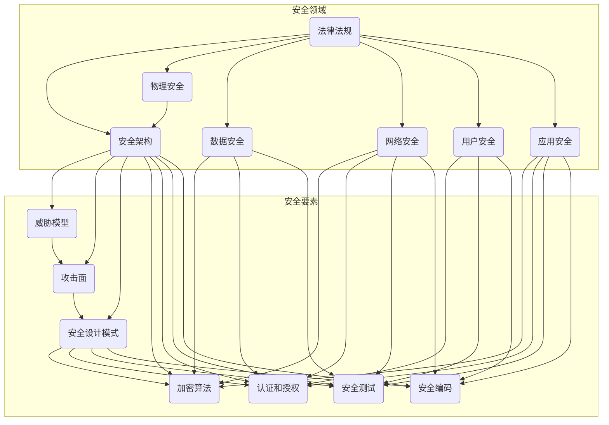

#### 关键概念解释

1. **威胁模型**：威胁模型是一种分析系统潜在威胁的方法，它帮助开发者识别系统可能面临的风险，并设计相应的防护措施。

2. **攻击面**：攻击面是指系统暴露给外部攻击者的所有入口和漏洞。通过分析攻击面，开发者可以识别系统的潜在弱点，并采取措施进行防护。

3. **安全设计模式**：安全设计模式是一系列用于提高软件系统安全性的设计原则和策略。这些模式包括密码学、访问控制、数据加密、安全存储等。

4. **加密算法**：加密算法是用于保护数据安全的重要工具，通过加密算法，可以将明文数据转换为难以理解的密文。

5. **认证和授权**：认证是验证用户身份的过程，授权是确定用户权限的过程。通过认证和授权机制，可以确保只有授权用户才能访问系统资源和数据。

6. **安全测试**：安全测试是发现和修复软件系统漏洞的重要手段，包括静态代码分析、动态代码分析、渗透测试等。

7. **安全编码**：安全编码是编写安全代码的实践和技巧，通过遵循安全编码规范，可以减少安全漏洞的出现。

#### 安全架构

- **安全架构**：安全架构是整个安全体系的基础，它将上述核心概念结合在一起，形成一个统一的、协调的安全体系。安全架构需要考虑以下几个方面：

  - **物理安全**：保护硬件设备和环境，防止物理损坏、盗窃或未经授权的访问。
  - **网络安全**：保护网络通信，防止网络攻击、数据泄露、恶意软件传播等。
  - **数据安全**：保护敏感数据和信息的保密性、完整性和可用性。
  - **用户安全**：确保只有授权用户可以访问系统和资源。
  - **应用安全**：通过安全编码、输入验证、错误处理等措施，保护应用程序的安全性。

#### 安全要素与安全领域的关系

- **安全要素**：包括威胁模型、攻击面、安全设计模式、加密算法、认证和授权、安全测试和安全编码，它们是构建安全系统的基础。
- **安全领域**：包括数据安全、网络安全、用户安全、应用安全和物理安全，它们是安全架构的具体实现和延伸。

通过上述Mermaid流程图，我们可以清晰地看到安全开发中各个核心概念之间的关系，以及如何将这些概念整合到一个统一的安全架构中，从而构建一个安全可靠的软件系统。

### 加密算法原理讲解

在安全开发中，加密算法是确保数据安全的重要工具。加密算法通过将明文数据转换成密文，使得未授权的用户无法理解数据内容，从而保护数据的保密性和完整性。本文将详细介绍几种常见的加密算法原理，包括对称加密算法、非对称加密算法和哈希算法，并通过伪代码和LaTeX公式详细阐述其工作原理。

#### 对称加密算法

对称加密算法是一种加密和解密使用相同密钥的加密算法。常见的对称加密算法包括AES（高级加密标准）、DES（数据加密标准）和3DES（三重DES）等。

1. **AES算法**

AES算法是一种块加密算法，它使用128位、192位或256位的密钥对数据进行加密。以下是一个简化的AES加密过程的伪代码：

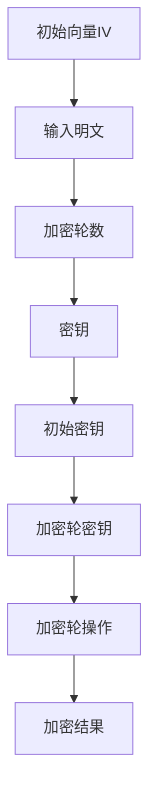

伪代码：

```python
# 初始化密钥和初始向量
key = initialize_key()
iv = initialize_iv()

# 输入明文
plaintext = input("Enter plaintext: ")

# 加密过程
ciphertext = aes_encrypt(plaintext, key, iv)

# 输出密文
print("Ciphertext:", ciphertext)
```

LaTeX公式表示：

$$
C = E_K(IV \oplus P)
$$

其中，\( C \) 是密文，\( E_K \) 是加密函数，\( IV \) 是初始向量，\( P \) 是明文，\( \oplus \) 表示异或操作。

2. **DES算法**

DES算法使用56位的密钥对数据进行加密。以下是一个简化的DES加密过程的伪代码：

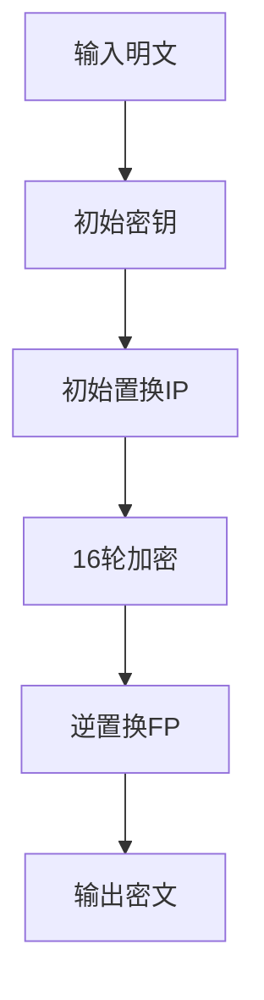

伪代码：

```python
# 初始化密钥和初始向量
key = initialize_key()
plaintext = input("Enter plaintext: ")

# 初始置换
ciphertext = initial_permutation(plaintext)

# 16轮加密
for i in range(16):
    ciphertext = round_function(ciphertext, key[i])

# 逆置换
ciphertext = final_permutation(ciphertext)

# 输出密文
print("Ciphertext:", ciphertext)
```

LaTeX公式表示：

$$
C = FP(IP(P) \xrightarrow{16 \text{ rounds}} K_1 \xrightarrow{FP})
$$

3. **3DES算法**

3DES算法是对DES算法的扩展，它使用三个密钥对数据进行加密。3DES分为三种模式：单DES、双DES和三DES。以下是三DES加密的伪代码：

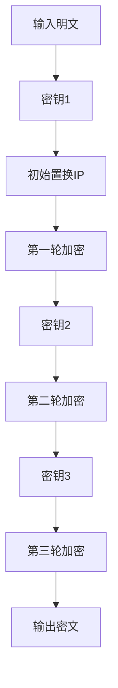

伪代码：

```python
# 初始化密钥
key1 = key[0:56]
key2 = key[56:112]
key3 = key[112:168]

plaintext = input("Enter plaintext: ")

# 初始置换
ciphertext = initial_permutation(plaintext)

# 第一轮加密
ciphertext = round_function(ciphertext, key1)

# 第二轮加密
ciphertext = round_function(ciphertext, key2)

# 第三轮加密
ciphertext = round_function(ciphertext, key3)

# 输出密文
print("Ciphertext:", ciphertext)
```

LaTeX公式表示：

$$
C = K_3 \xrightarrow{3 \text{ rounds}} K_2 \xrightarrow{2 \text{ rounds}} K_1 (IP(P))
$$

#### 非对称加密算法

非对称加密算法使用一对密钥（公钥和私钥）进行加密和解密。常见的非对称加密算法包括RSA、ECC（椭圆曲线加密算法）和Diffie-Hellman密钥交换协议等。

1. **RSA算法**

RSA算法是一种基于大整数分解的加密算法。以下是一个简化的RSA加密过程的伪代码：

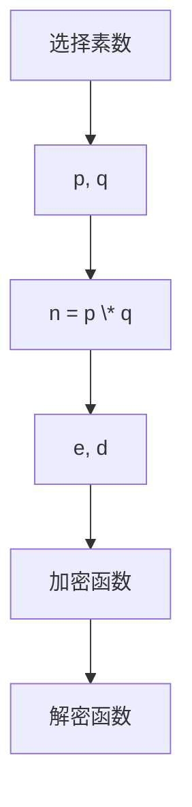

伪代码：

```python
# 选择两个大素数
p = 61
q = 53

# 计算n和欧拉函数φ(n)
n = p \* q
phi_n = (p - 1) \* (q - 1)

# 选择加密密钥e，使其与φ(n)互质
e = 17
gcd(e, phi_n) == 1

# 计算解密密钥d，满足 d \* e ≡ 1 (mod φ(n))
d = mod_inverse(e, phi_n)

# 加密函数
def rsa_encrypt(plaintext, e, n):
    ciphertext = pow(plaintext, e, n)
    return ciphertext

# 解密函数
def rsa_decrypt(ciphertext, d, n):
    plaintext = pow(ciphertext, d, n)
    return plaintext

# 输入明文并加密
plaintext = input("Enter plaintext: ")
ciphertext = rsa_encrypt(plaintext, e, n)

# 输出密文和解密后的明文
print("Ciphertext:", ciphertext)
print("Decrypted plaintext:", rsa_decrypt(ciphertext, d, n))
```

LaTeX公式表示：

$$
\begin{aligned}
C &= P^e \mod n \\
P &= C^d \mod n
\end{aligned}
$$

2. **ECC算法**

ECC算法基于椭圆曲线数学，具有更高的安全性。以下是一个简化的ECC加密过程的伪代码：

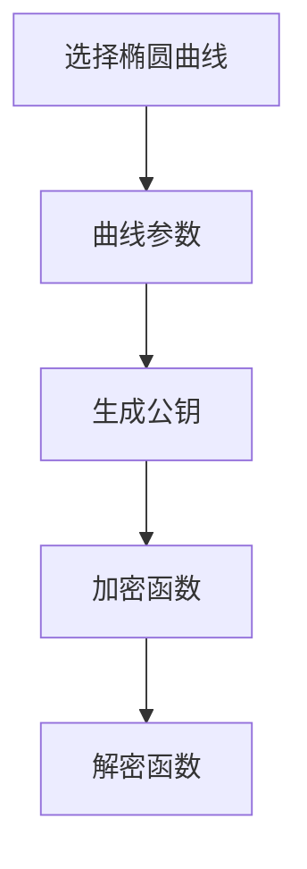

伪代码：

```python
# 选择椭圆曲线参数
curve_params = {
    'a': -3,
    'b': 170,
    'p': 21832333
}

# 生成私钥
private_key = random.randint(1, curve_params['p'] - 1)

# 生成公钥
public_key = ecc_generate_public_key(private_key, curve_params)

# 加密函数
def ecc_encrypt(plaintext, public_key, curve_params):
    ciphertext = ecc_encrypt_function(plaintext, public_key, curve_params)
    return ciphertext

# 解密函数
def ecc_decrypt(ciphertext, private_key, curve_params):
    plaintext = ecc_decrypt_function(ciphertext, private_key, curve_params)
    return plaintext

# 输入明文并加密
plaintext = input("Enter plaintext: ")
ciphertext = ecc_encrypt(plaintext, public_key, curve_params)

# 输出密文和解密后的明文
print("Ciphertext:", ciphertext)
print("Decrypted plaintext:", ecc_decrypt(ciphertext, private_key, curve_params))
```

LaTeX公式表示：

$$
\begin{aligned}
C &= \text{enc}_{\text{curve}}(P, Q) \\
P &= \text{dec}_{\text{curve}}(C, Q)
\end{aligned}
$$

#### 哈希算法

哈希算法是一种将任意长度的数据转换成固定长度数据的算法，通常用于数据完整性验证和数字签名。常见的哈希算法包括MD5、SHA-1、SHA-256和SHA-3等。

1. **SHA-256算法**

SHA-256是一种常用的哈希算法，它将输入数据转换为256位的哈希值。以下是一个简化的SHA-256加密过程的伪代码：

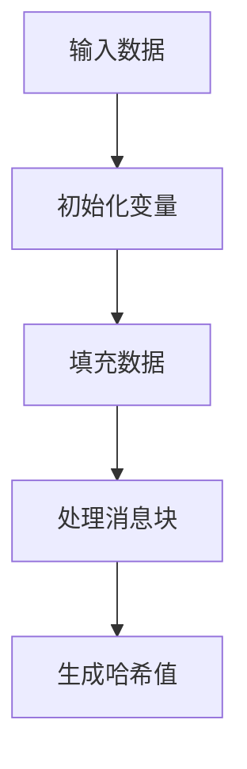

伪代码：

```python
# 初始化变量
hash_value = initialize_hash_value()

# 填充数据
data = input("Enter data: ")
data += 1 << (len(data) \* 8)  # 填充位1
data += b'\x80'  # 填充位0
padding_length = (56 - (len(data) % 64)) % 64
data += b'\x00' \* padding_length  # 填充0

# 处理消息块
for block in divide_into_blocks(data):
    hash_value = process_block(block, hash_value)

# 生成哈希值
hash_output = finalize_hash_value(hash_value)

# 输出哈希值
print("Hash value:", hash_output.hex())
```

LaTeX公式表示：

$$
\text{hash}(M) = H
$$

其中，\( H \) 是生成的256位哈希值。

通过上述伪代码和LaTeX公式，我们可以清晰地看到对称加密算法、非对称加密算法和哈希算法的工作原理。这些算法在安全开发中发挥着至关重要的作用，确保数据的保密性、完整性和真实性。

### 认证和授权算法原理

在安全开发中，认证和授权是确保系统安全性的关键组成部分。认证（Authentication）用于验证用户或系统组件的身份，而授权（Authorization）则用于确定已认证用户或组件的权限，确保它们只能访问和执行被允许的操作。以下将详细讲解几种常见的认证和授权算法原理，包括单点登录（SSO）原理、联合授权框架（如OAuth、JWT等）以及相关算法。

#### 单点登录（SSO）原理

单点登录（SSO）是一种身份验证机制，允许用户使用一个账户登录多个系统或服务，从而简化登录流程和提高用户体验。SSO的基本原理如下：

1. **用户登录**：用户在一个SSO服务器上输入用户名和密码。
2. **身份验证**：SSO服务器验证用户的身份，并通过身份验证协议（如OAuth 2.0、SAML等）与各个系统或服务进行交互。
3. **授权票据**：SSO服务器生成一个会话票据（如会话ID或令牌），并将其发送给用户浏览器。
4. **票据传递**：用户浏览器将票据发送给各个系统或服务，这些系统或服务使用票据验证用户的身份并创建会话。
5. **登录完成**：用户被自动登录到目标系统或服务。

单点登录的流程可以用以下Mermaid图表示：

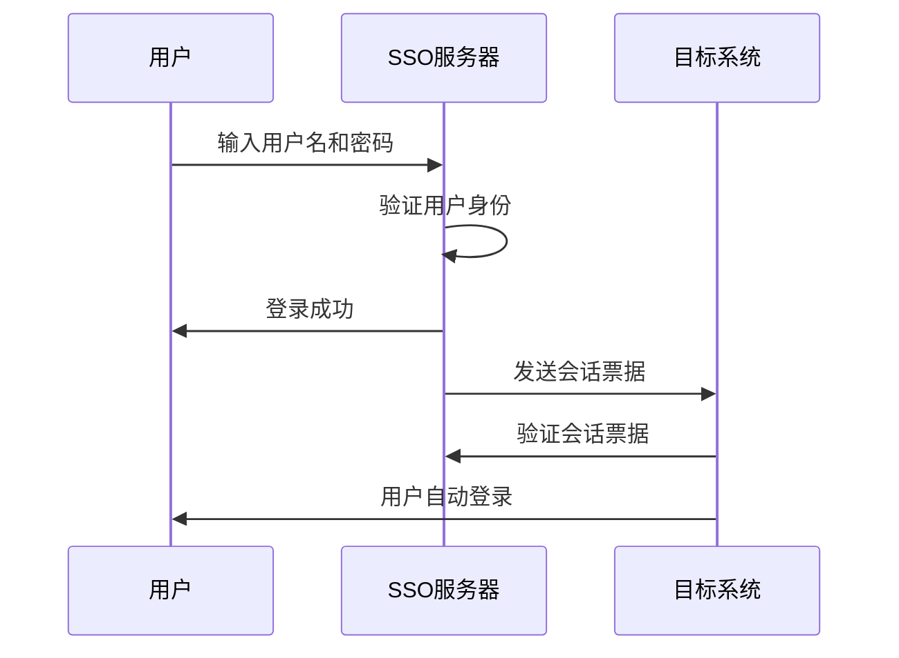

#### OAuth原理

OAuth是一种开放标准，用于实现授权第三方应用访问用户资源的机制。OAuth的核心概念包括：

- **客户端**（Client）：请求访问资源的应用程序。
- **资源拥有者**（Resource Owner）：拥有资源的用户。
- **资源服务器**（Resource Server）：存储用户资源的系统。
- **授权服务器**（Authorization Server）：处理客户端授权请求的中央服务。

OAuth的基本流程如下：

1. **用户认证**：用户访问客户端应用，并登录到授权服务器。
2. **授权请求**：用户同意授权客户端访问其资源。
3. **获取令牌**：授权服务器生成一个访问令牌（Access Token），并将其发送给客户端。
4. **访问资源**：客户端使用访问令牌从资源服务器获取用户资源。

OAuth的工作流程可以用以下Mermaid图表示：

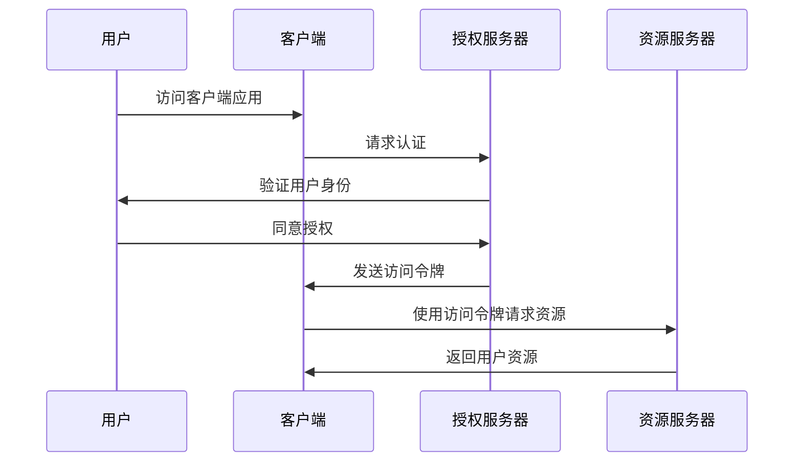

#### JWT（JSON Web Token）原理

JSON Web Token（JWT）是一种基于JSON的开放标准，用于安全地传输认证和授权信息。JWT的结构包括三个部分：头部（Header）、负载（Payload）和签名（Signature）。

1. **头部**（Header）：定义JWT的算法和类型，通常包含{"alg":"算法","typ":"JWT"}。
2. **负载**（Payload）：包含关于用户身份和权限的信息，如{"sub":"用户ID","iss":"发行者","exp":"过期时间"}。
3. **签名**（Signature）：通过对头部和负载使用HMAC或RSA加密算法进行签名，确保JWT的完整性和真实性。

JWT的工作流程如下：

1. **用户认证**：用户登录后，认证服务器生成JWT。
2. **发送JWT**：认证服务器将JWT发送给用户。
3. **验证JWT**：用户将JWT发送到需要验证的API，API验证JWT的签名和过期时间。
4. **访问资源**：验证通过后，API允许用户访问受保护的资源。

JWT的结构可以用以下Mermaid图表示：

```mermaid
classDef jwt
  jwt <<font color:'#FF8C00'>JWT</font>>

classDef header
  header <<font color:'#008B8B'>Header</font>>

classDef payload
  payload <<font color:'#008B8B'>Payload</font>>

classDef signature
  signature <<font color:'#008B8B'>Signature</font>>

classDef secretKey
  secretKey <<font color:'#008B8B'>Secret Key</font>>

graph TB
    header(jwt) --> payload(jwt)
    payload(jwt) --> signature(jwt)
    signature(jwt) --> "验证签名"
    header(jwt) --> "加密头部"
    payload(jwt) --> "加密负载"
    "加密头部" --> secretKey
    "加密负载" --> secretKey
```

#### 认证和授权算法应用示例

以下是一个简单的示例，展示了如何使用OAuth和JWT进行认证和授权：

1. **用户登录**：用户访问一个Web应用，并使用自己的账户登录。
2. **获取访问令牌**：登录成功后，用户点击“授权”按钮，Web应用向OAuth授权服务器请求访问令牌。
3. **生成JWT**：OAuth授权服务器验证用户身份，并生成一个JWT，将其发送给Web应用。
4. **验证JWT**：Web应用验证JWT的签名和过期时间。
5. **访问资源**：验证通过后，Web应用使用JWT从资源服务器获取用户数据。

整个流程可以用以下伪代码表示：

```python
# 用户登录
user_login()

# 获取访问令牌
access_token = get_access_token()

# 生成JWT
jwt = generate_jwt(access_token)

# 验证JWT
if verify_jwt(jwt):
    # 访问资源
    user_data = get_user_data()
    print("User data:", user_data)
else:
    print("Invalid JWT")
```

通过上述认证和授权算法的原理和应用示例，我们可以看到，这些算法在确保系统安全性和用户体验方面发挥着重要作用。它们不仅能够有效保护用户数据，还能简化登录流程，提高用户满意度。

### 防火墙和入侵检测算法原理

在网络安全领域，防火墙和入侵检测系统（IDS）是两种重要的安全防护机制，用于保护网络不受外部攻击和内部威胁。下面将详细介绍防火墙和入侵检测算法的原理，并解释其工作方式。

#### 防火墙

防火墙是一种网络安全设备，用于监控和控制进出网络的流量，以阻止未经授权的访问和潜在威胁。防火墙可以根据预定义的安全策略来允许或拒绝流量，从而保护网络的安全性。

**包过滤防火墙**

包过滤防火墙是最基本的防火墙类型，它根据每个数据包的源IP地址、目标IP地址、端口号等属性进行过滤。以下是一个简化的包过滤防火墙算法：

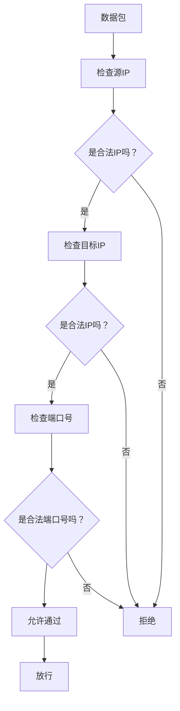

伪代码：

```python
def packet_filter(packet, rule_set):
    for rule in rule_set:
        if rule['source_ip'] == packet['source_ip'] and \
           rule['destination_ip'] == packet['destination_ip'] and \
           rule['source_port'] == packet['source_port'] and \
           rule['destination_port'] == packet['destination_port']:
            return "Allow"
    return "Deny"
```

LaTeX公式表示：

$$
\text{Filter}(\text{Packet}) =
\begin{cases}
\text{Allow} & \text{if } \text{Packet} \in R \\
\text{Deny} & \text{otherwise}
\end{cases}
$$

**状态检测防火墙**

状态检测防火墙（也称为状态防火墙）是对包过滤防火墙的扩展，它跟踪数据包的状态，如TCP连接的状态。状态检测防火墙不仅检查单个数据包，还考虑数据包在整个连接生命周期中的状态。

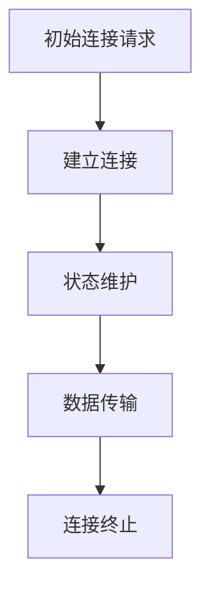

伪代码：

```python
def stateful_firewall(packet, connection_state):
    if packet['state'] == 'SYN':
        connection_state['state'] = 'ESTABLISHED'
        return "Allow"
    elif packet['state'] == 'FIN':
        connection_state['state'] = 'CLOSED'
        return "Allow"
    elif connection_state['state'] == 'ESTABLISHED':
        return "Allow"
    else:
        return "Deny"
```

LaTeX公式表示：

$$
\text{Firewall}(\text{Packet}, S) =
\begin{cases}
\text{Allow} & \text{if } S \text{ is ESTABLISHED} \\
\text{Deny} & \text{otherwise}
\end{cases}
$$

#### 入侵检测系统（IDS）

入侵检测系统（IDS）是一种监控网络流量和系统活动，以识别潜在威胁和异常行为的系统。IDS可以分为两种主要类型：网络入侵检测系统（NIDS）和主机入侵检测系统（HIDS）。

**网络入侵检测系统（NIDS）**

NIDS监控网络流量，分析数据包的内容和模式，以识别可疑活动。以下是一个简化的NIDS算法：

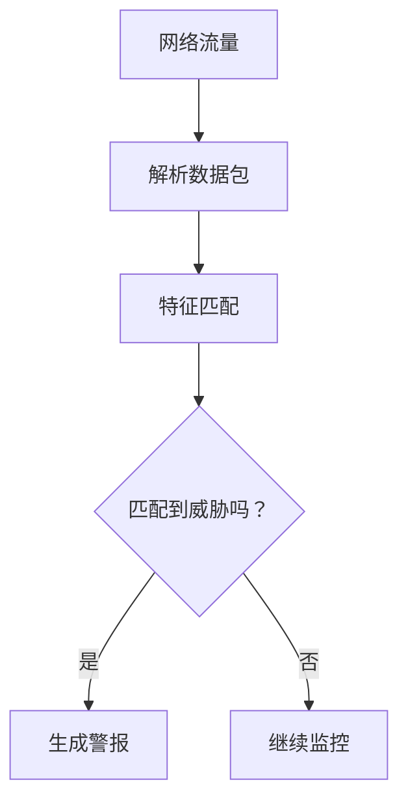

伪代码：

```python
def network_invasion_detection(packet, threat_signature_set):
    for signature in threat_signature_set:
        if packet['content'] == signature['content']:
            return "Alert"
    return "No Alert"
```

LaTeX公式表示：

$$
\text{NIDS}(\text{Packet}, S) =
\begin{cases}
\text{Alert} & \text{if } \text{Packet} \in S \\
\text{No Alert} & \text{otherwise}
\end{cases}
$$

**主机入侵检测系统（HIDS）**

HIDS监控主机上的活动和日志，分析系统的异常行为和恶意软件活动。以下是一个简化的HIDS算法：

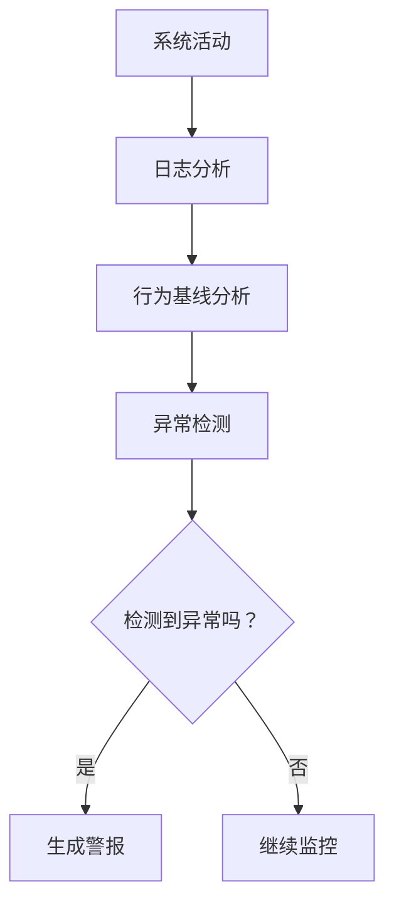

伪代码：

```python
def host_invasion_detection(log_entry, baseline):
    if log_entry['action'] not in baseline['allowed_actions']:
        return "Alert"
    return "No Alert"
```

LaTeX公式表示：

$$
\text{HIDS}(\text{Log Entry}, B) =
\begin{cases}
\text{Alert} & \text{if } \text{Log Entry} \notin B \\
\text{No Alert} & \text{otherwise}
\end{cases}
$$

通过以上算法和工作原理的介绍，我们可以看到，防火墙和入侵检测系统在网络安全中发挥着重要作用。防火墙通过过滤和状态检测来保护网络流量，而入侵检测系统通过监控和分析网络流量和系统活动来识别潜在的威胁和异常行为。这些机制共同构成了网络安全的防线，帮助组织保护其资源和数据不受攻击。

### 实际项目中的安全开发案例分析

在实际项目中，安全开发的重要性往往体现在细节之处，一个稍有不慎就可能成为系统安全的隐患。以下将通过一个电子商务平台的项目案例，详细讲解项目背景、安全漏洞分析、漏洞修复及最佳实践。

#### 项目背景

一个电子商务平台需要为用户提供在线购物、订单管理和支付功能。该平台的目标是在提供便利购物体验的同时，确保用户数据和交易数据的安全性。项目涉及前端、后端和数据库等多个组件，涉及多种技术，如Web开发框架、数据库管理系统和第三方支付接口等。

#### 安全漏洞分析

1. **SQL注入攻击**

   在项目开发过程中，开发人员未对用户输入进行充分验证，导致SQL注入攻击的风险。例如，用户提交的订单信息直接被插入数据库查询语句中，攻击者可以利用这一点注入恶意SQL代码，执行非法操作。

   **漏洞示例**：
   ```sql
   SELECT * FROM orders WHERE order_id = '123' UNION SELECT username, password FROM users;
   ```

2. **跨站脚本攻击（XSS）**

   前端代码中未对用户输入进行转义处理，攻击者可以注入恶意脚本，盗取用户会话或篡改页面内容。

   **漏洞示例**：
   ```html
   
   ```

3. **认证漏洞**

   平台的认证机制存在缺陷，攻击者可以通过暴力破解或钓鱼攻击获取用户登录凭证，进而访问用户账户。

   **漏洞示例**：
   - 暴力破解：攻击者尝试大量猜测用户名和密码。
   - 钓鱼攻击：攻击者伪造登录页面，诱导用户输入登录信息。

4. **配置错误**

   系统配置不当，如数据库管理权限过于宽松，导致攻击者可以轻易访问数据库，窃取敏感数据。

   **漏洞示例**：
   - 数据库用户拥有所有表的操作权限。
   - Web服务器未配置SSL/TLS，导致数据传输不安全。

5. **第三方支付接口安全**

   第三方支付接口未严格验证调用者身份，可能导致恶意交易或数据泄露。

   **漏洞示例**：
   - 支付接口未对调用者进行身份验证，攻击者可以伪造请求执行非法操作。

#### 漏洞修复

1. **SQL注入防护**

   - 对用户输入进行严格验证，使用预处理语句（Prepared Statements）或ORM（对象关系映射）技术，确保输入数据不会被当作SQL代码执行。
   - 使用参数化查询，避免直接拼接SQL语句。

2. **XSS防护**

   - 对用户输入进行转义处理，防止恶意脚本注入。
   - 在前端代码中，对输出内容进行HTML实体编码，确保输出内容不被解释为HTML标签或脚本。

3. **认证机制强化**

   - 实施多因素认证（MFA），如短信验证码、电子邮件验证等，提高用户账户的安全性。
   - 定期更新密码策略，要求复杂密码，并定期强制用户更改密码。

4. **配置优化**

   - 严格限制数据库和Web服务器的访问权限，确保只有必要的操作权限。
   - 启用SSL/TLS加密，确保数据在传输过程中的安全性。

5. **第三方支付接口安全**

   - 对第三方支付接口进行严格身份验证，确保只有授权实体可以调用接口。
   - 使用安全协议和加密技术，保护交易数据的机密性和完整性。

#### 项目小结

通过以上案例，我们可以看到安全开发在电子商务平台项目中的重要性。任何细微的安全漏洞都可能导致严重的安全事故，造成数据泄露和财务损失。以下是一些最佳实践和注意事项：

- **代码审查**：定期进行代码审查，确保遵循安全编码规范，及时发现和修复潜在的安全漏洞。
- **安全培训**：为开发人员和运维人员提供安全培训，提高他们的安全意识和技能。
- **自动化测试**：使用自动化工具进行安全测试，提高测试效率和覆盖范围。
- **合规性检查**：确保项目符合相关的法律法规和行业标准，如《网络安全法》和《个人信息保护法》等。
- **持续监控**：建立实时监控机制，及时发现和响应安全事件。
- **安全文档**：编写详细的安全文档，记录安全策略、流程和措施，便于后续维护和升级。

通过以上最佳实践，可以显著提高电子商务平台的安全性和可靠性，为用户提供一个安全的购物环境。

### 安全开发的未来趋势

随着技术的不断发展，安全开发也在不断演进，面临着新的机遇和挑战。以下是安全开发未来趋势的几个关键方面，包括区块链技术、人工智能、量子计算等新兴技术对安全开发的影响。

#### 区块链技术

区块链技术以其去中心化、不可篡改和透明性等特点，在金融、供应链管理、医疗等领域展现出巨大的潜力。区块链技术不仅可以用于数据存储和交易，还可以用于身份验证和授权。以下是一些具体的应用：

1. **分布式身份验证**：区块链技术可以提供一种分布式身份验证机制，用户可以拥有一个全球唯一的数字身份，避免传统集中式身份验证系统中存在的单点故障风险。

2. **智能合约**：智能合约是一种自动执行合约条款的计算机协议，它可以确保交易过程透明、公正且不可篡改。智能合约在金融交易、版权管理等方面具有广泛应用前景。

3. **供应链管理**：区块链技术可以提供一种透明、可追溯的供应链管理系统，确保产品从生产到交付的每个环节都能得到有效监控和管理。

#### 人工智能

人工智能（AI）在安全开发中的应用日益广泛，AI技术可以帮助自动化安全测试、威胁检测和响应。以下是一些具体的应用：

1. **自动化安全测试**：AI可以分析代码和系统行为，自动发现潜在的安全漏洞。AI驱动的渗透测试工具可以模拟各种攻击场景，提高测试的覆盖率和效率。

2. **威胁检测和响应**：AI可以实时监控网络流量和系统日志，识别异常行为和潜在威胁。AI驱动的威胁检测系统可以快速响应，阻止攻击并降低安全事件的影响。

3. **用户行为分析**：AI可以分析用户行为模式，识别异常行为并触发预警。这有助于防止内部威胁和用户欺诈行为。

#### 量子计算

量子计算是一种基于量子力学原理的新型计算模式，其处理能力和速度远超传统计算机。量子计算在密码学和安全领域具有重大影响：

1. **量子加密**：量子加密技术利用量子力学原理，实现无条件安全的数据传输。量子密钥分发（QKD）是一种典型的量子加密技术，它能够确保通信过程中的数据不被窃听或篡改。

2. **量子计算机破解密码**：虽然量子计算在加密方面具有巨大潜力，但同时也可能对传统加密算法构成威胁。例如，Shor算法可以高效地分解大整数，这意味着许多基于整数分解的加密算法（如RSA）将面临被破解的风险。

#### 新兴技术的影响

1. **分布式计算**：分布式计算技术，如云计算和边缘计算，正在改变传统安全开发的模式。分布式系统需要新的安全策略和工具来确保跨多个节点和设备的安全性。

2. **物联网（IoT）**：物联网设备的广泛部署带来了新的安全挑战。这些设备通常具有较低的计算能力和有限的防护措施，容易成为攻击的目标。开发安全、可靠的IoT设备需要新的设计和开发方法。

3. **零信任架构**：零信任架构是一种基于“永不信任，始终验证”的安全理念。在这种架构中，内部网络不再被认为是安全区域，所有访问请求都需要经过严格的身份验证和授权。零信任架构适用于高度动态和分布式的工作环境。

#### 未来发展方向

1. **自适应安全**：未来的安全系统将能够自动适应新的威胁和攻击模式，通过机器学习和人工智能技术，实现实时威胁检测和响应。

2. **安全即代码（Security-Driven Development）**：安全开发将更加集成到软件开发流程中，安全测试和漏洞修复将像功能测试一样得到重视。

3. **安全合规自动化**：随着法规和标准的不断增多，安全合规自动化将成为趋势，通过自动化工具确保系统满足各种法规要求。

4. **安全服务的生态化**：安全服务将更加丰富和专业化，包括安全测试、安全咨询、安全培训等，形成一个完善的生态体系。

总之，安全开发的未来充满机遇和挑战。随着新兴技术的发展，安全开发将更加智能化、自动化和自适应。开发者需要不断学习和更新知识，掌握新的安全技术和方法，以应对不断变化的安全威胁，确保软件系统的安全性和可靠性。

### 附录

在本章中，我们将介绍一些与安全开发相关的工具和资源，以及常见的安全问题和解决方案。此外，还将提供一些拓展阅读，帮助读者深入了解安全开发的相关知识。

#### 工具和资源

1. **安全开发工具**：
   - **OWASP ZAP（Zed Attack Proxy）**：一款开源的Web应用安全扫描工具，用于发现Web应用程序中的安全漏洞。
   - **SonarQube**：一款用于代码审查和静态代码分析的工具，可以检测代码中的安全漏洞和编程错误。
   - **Burp Suite**：一款综合性Web应用安全测试工具，包括代理、扫描、漏洞验证等功能。
   - **Grok Security**：一款开源的Web应用程序安全测试工具，可以自动化测试应用程序的安全性。

2. **安全测试工具**：
   - **Nessus**：一款广泛使用的漏洞扫描工具，用于发现操作系统、网络设备和应用程序中的安全漏洞。
   - **Nmap**：一款网络探测工具，用于发现网络上的主机和开放端口。
   - **Metasploit**：一款用于渗透测试的框架，可以模拟攻击场景，验证系统的安全性。

3. **加密工具**：
   - **openssl**：一款开源的加密工具，用于加密、解密、签名和验证操作。
   - **GPG（GNU Privacy Guard）**：一款开源的加密工具，用于实现电子邮件和文件的加密和签名。

4. **安全标准和法规**：
   - **ISO/IEC 27001**：国际标准，用于建立和维护信息安全管理系统（ISMS）。
   - **OWASP TOP 10**：Web应用安全标准，列出了最常见的Web应用安全漏洞。
   - **GDPR**：欧盟的通用数据保护条例，规定了数据保护的基本原则和要求。

#### 常见安全问题与解决方案

1. **SQL注入攻击**：
   - **解决方案**：使用参数化查询或ORM技术，避免直接拼接SQL语句。对用户输入进行严格验证和转义处理。

2. **跨站脚本攻击（XSS）**：
   - **解决方案**：对用户输入进行转义处理，防止恶意脚本注入。在输出内容时进行HTML实体编码。

3. **跨站请求伪造（CSRF）**：
   - **解决方案**：使用验证码或双重提交Cookie技术，确保请求是由用户发起的。在请求中加入随机Token，验证Token的有效性。

4. **身份认证漏洞**：
   - **解决方案**：实施多因素认证（MFA），提高用户账户的安全性。定期更新密码策略，要求复杂密码。

5. **配置错误**：
   - **解决方案**：严格限制数据库和Web服务器的访问权限，确保只有必要的操作权限。启用SSL/TLS加密，确保数据传输的安全性。

#### 拓展阅读

- **《网络安全法》**：了解我国关于网络安全的法律法规，确保项目的合规性。
- **《信息安全技术—网络安全等级保护基本要求》**：了解网络安全等级保护的基本要求和标准。
- **《Web应用安全》**：深入理解Web应用安全的相关知识和实践方法。
- **《区块链安全》**：探讨区块链技术在安全开发中的应用和挑战。
- **《人工智能安全》**：了解人工智能在安全开发中的应用和潜在风险。

通过本章的内容，读者可以了解到安全开发所需的工具和资源，以及常见的安全问题和解决方案。拓展阅读部分提供了更多的参考资料，帮助读者进一步深入了解安全开发的相关知识。在实际项目中，遵循这些最佳实践和标准，可以显著提高软件系统的安全性。

