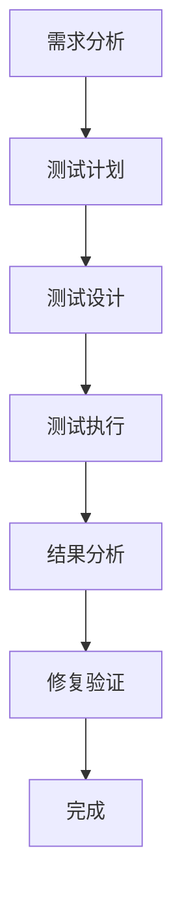

                 


### 文章标题

# 安全测试体系建设

### 文章关键词

- 安全测试
- 漏洞扫描
- 安全漏洞攻击测试
- 安全代码审计
- 安全测试体系建设

### 文章摘要

随着信息技术的发展，网络安全问题日益凸显。安全测试作为保障信息系统安全的关键手段，其体系建设显得尤为重要。本文将围绕安全测试体系的建设，详细介绍其背景、核心概念、关键技术、实践策略以及建设策略，旨在为读者提供一个全面、系统的安全测试体系建设指南。

### 目录

- 第一部分：安全测试体系概述
  - 第1章：安全测试背景与意义
  - 第2章：安全测试体系架构

- 第二部分：安全测试关键技术
  - 第3章：漏洞扫描与评估
  - 第4章：安全漏洞攻击测试
  - 第5章：安全代码审计

- 第三部分：安全测试实践
  - 第6章：安全测试项目管理
  - 第7章：安全测试案例分析

- 第四部分：安全测试体系建设策略
  - 第8章：安全测试体系建设规划
  - 第9章：安全测试团队建设
  - 第10章：安全测试文化建设

- 附录
  - 附录A：安全测试相关工具与资源列表
  - 附录B：安全测试常用术语解释

### 第一部分：安全测试体系概述

#### 第1章：安全测试背景与意义

**1.1 安全测试的定义与分类**

安全测试是一种通过对信息系统进行系统性的检查和测试，以识别潜在的安全漏洞和弱点，确保系统在运行过程中能够抵御各种安全威胁的活动。根据测试的对象和目标，安全测试可以分为以下几类：

- **功能安全测试**：验证系统的功能是否符合安全要求，包括输入输出验证、逻辑错误检测等。
- **网络安全测试**：测试系统的网络安全性能，包括网络边界防护、数据传输安全等。
- **应用程序安全测试**：针对应用程序进行的安全测试，包括Web应用测试、移动应用测试等。
- **数据库安全测试**：测试数据库的安全性，包括数据泄露防护、访问控制等。

**1.2 安全测试的发展历程**

安全测试的发展历程可以分为以下几个阶段：

- **初期阶段**：主要以手工测试为主，测试工具较为简单，测试范围有限。
- **自动化阶段**：随着自动化测试工具的出现，测试效率得到提高，测试范围也逐渐扩大。
- **智能化阶段**：利用人工智能和机器学习技术，安全测试能够更加准确地识别和预测潜在的安全漏洞。

**1.3 安全测试的重要性**

安全测试在保障信息系统安全中发挥着重要作用，其重要性主要体现在以下几个方面：

- **降低安全风险**：通过安全测试，可以提前发现系统中的安全漏洞，从而降低系统遭受安全攻击的风险。
- **保障用户隐私**：安全测试能够确保用户数据的安全性，防止数据泄露和滥用。
- **提高系统稳定性**：安全测试能够发现系统中的潜在错误和漏洞，从而提高系统的稳定性和可靠性。
- **满足法规要求**：许多国家和地区都制定了相关的信息安全法规，安全测试是确保合规性的必要手段。

#### 第2章：安全测试体系架构

**2.1 安全测试体系的基本构成**

安全测试体系主要包括以下几部分：

- **测试目标**：明确安全测试的目标和范围，确保测试工作有针对性地进行。
- **测试流程**：定义安全测试的流程和方法，确保测试过程的规范性和效率。
- **测试工具**：选择合适的测试工具，提高测试的准确性和效率。
- **测试数据**：准备充足的测试数据，确保测试结果的可靠性。
- **测试人员**：组织专业的测试团队，确保测试工作的顺利进行。

**2.2 安全测试流程**

安全测试流程通常包括以下步骤：

- **需求分析**：明确安全测试的需求和目标。
- **测试计划**：制定详细的测试计划，包括测试范围、测试方法、测试时间等。
- **测试设计**：设计测试用例，确保测试的全面性和针对性。
- **测试执行**：执行测试用例，记录测试结果。
- **结果分析**：分析测试结果，识别潜在的安全漏洞和弱点。
- **修复验证**：对发现的安全漏洞进行修复，并进行验证。

**2.3 安全测试方法与技术**

安全测试方法主要包括以下几种：

- **黑盒测试**：在不知道系统内部结构的情况下，通过输入输出测试来发现系统的安全漏洞。
- **白盒测试**：在知道系统内部结构的情况下，通过分析代码和逻辑来发现系统的安全漏洞。
- **灰盒测试**：在知道部分系统内部结构的情况下，结合黑盒测试和白盒测试来发现系统的安全漏洞。
- **动态测试**：通过运行程序来发现系统的实时安全漏洞。
- **静态测试**：通过分析代码和文档来发现系统的潜在安全漏洞。

**2.3.1 Mermaid 流程图**



### 第二部分：安全测试关键技术

#### 第3章：漏洞扫描与评估

**3.1 漏洞扫描的基本原理**

漏洞扫描是一种自动化的安全测试方法，通过扫描网络或系统中的设备、应用程序和配置，识别潜在的安全漏洞和弱点。漏洞扫描的基本原理包括：

- **扫描目标**：确定扫描的目标，包括网络设备、操作系统、应用程序等。
- **扫描工具**：选择合适的漏洞扫描工具，如Nessus、Nmap等。
- **扫描过程**：自动执行扫描任务，收集系统信息，识别安全漏洞。

**3.2 漏洞扫描工具介绍**

常见的漏洞扫描工具包括：

- **Nessus**：一款功能强大的漏洞扫描工具，适用于各种操作系统和应用程序。
- **Nmap**：一款网络探测和漏洞扫描工具，可用于发现网络设备和开放端口。
- **OpenVAS**：一款开源的漏洞扫描和管理工具，具有丰富的漏洞库和扫描策略。

**3.3 漏洞评估方法**

漏洞评估是安全测试的重要环节，其方法主要包括：

- **漏洞等级**：根据漏洞的严重程度进行分类，如高危、中危、低危等。
- **漏洞影响**：评估漏洞可能造成的影响，包括数据泄露、系统崩溃等。
- **修复优先级**：根据漏洞的影响程度和修复难度，确定修复的优先级。

#### 第4章：安全漏洞攻击测试

**4.1 安全漏洞攻击测试的目标与范围**

安全漏洞攻击测试的目标是验证系统对各种攻击手段的抵抗能力，其主要范围包括：

- **网络攻击**：测试系统对DDoS、SQL注入等网络攻击的抵抗能力。
- **应用程序攻击**：测试Web应用、移动应用等对常见攻击手段的抵抗能力。
- **操作系统攻击**：测试操作系统对缓冲区溢出、提权攻击等的抵抗能力。

**4.2 安全漏洞攻击测试的流程**

安全漏洞攻击测试的流程主要包括：

- **测试计划**：制定详细的测试计划，包括测试目标、测试工具、测试时间等。
- **测试执行**：执行测试用例，模拟各种攻击手段，记录测试结果。
- **结果分析**：分析测试结果，识别系统中的安全漏洞和弱点。
- **修复验证**：对发现的安全漏洞进行修复，并进行验证。

**4.3 常见安全漏洞攻击手段**

常见的安全漏洞攻击手段包括：

- **DDoS攻击**：通过大量请求使目标系统瘫痪。
- **SQL注入**：通过在输入框中插入恶意SQL代码，窃取或篡改数据。
- **XSS攻击**：通过在网页中插入恶意脚本，窃取用户信息。
- **缓冲区溢出**：通过向缓冲区写入超过其容量，使程序崩溃或执行恶意代码。
- **提权攻击**：通过漏洞获取系统管理员权限，控制系统。

#### 第5章：安全代码审计

**5.1 安全代码审计的基本原理**

安全代码审计是一种通过检查代码来识别安全漏洞的方法，其基本原理包括：

- **代码分析**：对代码进行分析，识别潜在的逻辑错误和安全漏洞。
- **安全规则**：根据安全规则和标准，检查代码是否符合安全要求。
- **漏洞识别**：识别代码中的安全漏洞，包括SQL注入、XSS攻击等。

**5.2 安全代码审计的工具与方法**

常用的安全代码审计工具有：

- **静态代码分析工具**：如SonarQube、Checkmarx等，用于自动检查代码中的安全漏洞。
- **动态代码分析工具**：如Burp Suite、OWASP ZAP等，用于在运行时检测代码中的漏洞。

**5.3 安全代码审计的实际案例**

以下是一个安全代码审计的实际案例：

```java
public class LoginController {
    @GetMapping("/login")
    public String loginPage() {
        return "login";
    }

    @PostMapping("/login")
    public String login(@RequestParam("username") String username, @RequestParam("password") String password, Model model) {
        if ("admin".equals(username) && "admin".equals(password)) {
            model.addAttribute("success", true);
            return "welcome";
        } else {
            model.addAttribute("error", true);
            return "login";
        }
    }
}
```

在这个案例中，代码存在SQL注入的风险，可以将其修改为：

```java
public class LoginController {
    @GetMapping("/login")
    public String loginPage() {
        return "login";
    }

    @PostMapping("/login")
    public String login(@RequestParam("username") String username, @RequestParam("password") String password, Model model) {
        String sql = "SELECT * FROM users WHERE username = ? AND password = ?";
        try (Connection conn = DriverManager.getConnection("jdbc:mysql://localhost:3306/mydb", "root", "root");
             PreparedStatement stmt = conn.prepareStatement(sql)) {
            stmt.setString(1, username);
            stmt.setString(2, password);
            ResultSet rs = stmt.executeQuery();
            if (rs.next()) {
                model.addAttribute("success", true);
                return "welcome";
            } else {
                model.addAttribute("error", true);
                return "login";
            }
        } catch (SQLException e) {
            e.printStackTrace();
            return "error";
        }
    }
}
```

通过修改代码，可以防止SQL注入攻击。

### 第三部分：安全测试实践

#### 第6章：安全测试项目管理

**6.1 安全测试项目管理的流程**

安全测试项目管理的流程包括：

- **项目启动**：明确项目目标和范围，组建项目团队。
- **需求分析**：与项目相关方沟通，明确安全测试的需求。
- **测试计划**：制定详细的测试计划，包括测试范围、测试方法、测试时间等。
- **测试设计**：设计测试用例，确保测试的全面性和针对性。
- **测试执行**：执行测试用例，记录测试结果。
- **结果分析**：分析测试结果，识别潜在的安全漏洞和弱点。
- **修复验证**：对发现的安全漏洞进行修复，并进行验证。
- **项目总结**：总结项目经验，提出改进建议。

**6.2 安全测试项目的风险控制**

安全测试项目的风险控制包括：

- **识别风险**：识别项目过程中可能遇到的风险，如时间压力、资源不足等。
- **评估风险**：对识别的风险进行评估，确定风险的影响程度和发生概率。
- **制定策略**：制定风险应对策略，如风险规避、风险减轻、风险接受等。
- **监控风险**：在项目过程中持续监控风险，及时调整风险应对策略。

**6.3 安全测试项目的质量保证**

安全测试项目的质量保证包括：

- **制定质量标准**：根据项目需求，制定安全测试的质量标准。
- **执行质量检查**：在测试过程中执行质量检查，确保测试结果的准确性。
- **质量控制**：对发现的质量问题进行追踪和解决，确保项目质量。
- **质量评估**：在项目结束时对项目质量进行评估，总结质量管理的经验。

#### 第7章：安全测试案例分析

**7.1 案例一：某电商平台的安全测试实践**

某电商平台在进行安全测试时，采取了以下措施：

- **漏洞扫描**：使用Nessus和Nmap对网站进行漏洞扫描，发现并修复了多个高危漏洞。
- **安全漏洞攻击测试**：模拟DDoS攻击、SQL注入等攻击手段，验证网站的抵抗能力。
- **安全代码审计**：对网站的源代码进行审计，发现并修复了多个安全漏洞。
- **安全测试项目风险管理**：制定了详细的风险管理计划，确保项目顺利进行。

**7.2 案例二：某银行的安全测试实践**

某银行在进行安全测试时，采取了以下措施：

- **漏洞扫描**：使用OpenVAS对银行的网络设备进行漏洞扫描，发现并修复了多个安全漏洞。
- **安全漏洞攻击测试**：模拟黑客攻击，验证银行系统的抵抗能力。
- **安全代码审计**：对银行的应用程序进行代码审计，发现并修复了多个安全漏洞。
- **安全测试项目风险管理**：制定了详细的风险管理计划，确保项目顺利进行。

**7.3 案例三：某政府机构的安全测试实践**

某政府机构在进行安全测试时，采取了以下措施：

- **漏洞扫描**：使用Nessus和Nmap对政府机构的网络设备进行漏洞扫描，发现并修复了多个安全漏洞。
- **安全漏洞攻击测试**：模拟黑客攻击，验证政府系统的抵抗能力。
- **安全代码审计**：对政府的应用程序进行代码审计，发现并修复了多个安全漏洞。
- **安全测试项目风险管理**：制定了详细的风险管理计划，确保项目顺利进行。

### 第四部分：安全测试体系建设策略

#### 第8章：安全测试体系建设规划

**8.1 安全测试体系建设的目标**

安全测试体系建设的总目标是提高信息系统的安全性，确保系统在运行过程中能够抵御各种安全威胁。具体目标包括：

- **降低安全风险**：通过安全测试，降低信息系统遭受安全攻击的风险。
- **提高系统稳定性**：通过安全测试，发现并修复系统中的漏洞，提高系统的稳定性和可靠性。
- **满足法规要求**：确保信息系统符合相关的信息安全法规和标准。

**8.2 安全测试体系建设的方法与策略**

安全测试体系建设的方法与策略包括：

- **分层规划**：根据信息系统的特点，分层规划安全测试体系，确保测试的全面性和针对性。
- **持续改进**：建立持续改进机制，定期评估和优化安全测试体系，确保其适应不断变化的安全形势。
- **团队协作**：建立专业的安全测试团队，确保安全测试工作的顺利进行。

**8.3 安全测试体系建设的实施与评估**

安全测试体系建设的实施与评估包括：

- **实施阶段**：根据安全测试体系的建设规划，逐步实施各项安全测试工作。
- **评估阶段**：定期评估安全测试体系的效果，包括漏洞发现率、修复率等指标，及时调整和优化安全测试体系。

#### 第9章：安全测试团队建设

**9.1 安全测试团队的角色与职责**

安全测试团队的角色与职责包括：

- **安全测试经理**：负责安全测试团队的建设和管理，制定安全测试策略和计划。
- **安全测试工程师**：负责安全测试的实施和执行，包括漏洞扫描、安全漏洞攻击测试、安全代码审计等。
- **安全专家**：负责对安全测试结果进行分析和评估，提供技术支持和指导。

**9.2 安全测试团队的技能需求**

安全测试团队的技能需求包括：

- **网络安全知识**：熟悉网络架构、协议和常见的安全威胁。
- **应用程序安全知识**：了解Web应用、移动应用等的安全漏洞和防护措施。
- **测试工具使用**：熟练使用各种安全测试工具，如Nessus、Nmap、Burp Suite等。
- **编程能力**：具备一定的编程能力，能够编写测试脚本和工具。

**9.3 安全测试团队的管理与培养**

安全测试团队的管理与培养包括：

- **团队建设**：建立高效的团队沟通机制，确保团队成员之间的协作和配合。
- **技能提升**：定期组织培训和学习活动，提高团队成员的专业技能。
- **激励制度**：建立合理的激励制度，激发团队成员的工作积极性和创造力。

#### 第10章：安全测试文化建设

**10.1 安全测试文化的内涵与价值**

安全测试文化的内涵在于将安全意识融入企业的核心价值观中，其价值包括：

- **增强安全意识**：通过安全测试文化的建设，提高员工对安全问题的敏感度和重视程度。
- **提高安全水平**：通过安全测试文化的建设，提高企业的安全防护能力和水平。
- **降低安全风险**：通过安全测试文化的建设，降低企业信息系统的安全风险。

**10.2 安全测试文化的建设途径**

安全测试文化的建设途径包括：

- **培训与教育**：通过组织安全培训和教育，提高员工的安全知识和技能。
- **宣传与倡导**：通过宣传和倡导安全测试的重要性，营造良好的安全测试氛围。
- **制度建设**：建立和完善安全测试相关的制度和流程，确保安全测试工作的规范性和有效性。

**10.3 安全测试文化的传播与推广**

安全测试文化的传播与推广包括：

- **内部传播**：通过内部宣传、培训、分享等形式，将安全测试文化融入企业内部。
- **外部传播**：通过参与行业活动、发表安全文章、分享安全经验等方式，将安全测试文化传递给外部。
- **合作与交流**：与其他企业、研究机构和政府部门等开展合作与交流，共同推进安全测试文化的建设。

### 附录

**附录A：安全测试相关工具与资源列表**

- **漏洞扫描工具**：Nessus、Nmap、OpenVAS
- **安全漏洞攻击测试工具**：Burp Suite、OWASP ZAP、Metasploit
- **安全代码审计工具**：SonarQube、Checkmarx、Fortify
- **安全测试资源网站**：OWASP、SecureCodeGuide、OWASP Top 10

**附录B：安全测试常用术语解释**

- **漏洞**：系统中的安全漏洞，可能导致安全威胁的发生。
- **攻击**：对信息系统进行恶意攻击的行为。
- **扫描**：对系统进行自动化的检查和测试。
- **审计**：对系统进行手动检查和评估。
- **测试用例**：对系统进行测试的具体输入和预期输出。

### 文章结束语

作者：AI天才研究院/AI Genius Institute & 禅与计算机程序设计艺术 /Zen And The Art of Computer Programming

本文系统地介绍了安全测试体系建设的背景、核心概念、关键技术、实践策略以及建设策略。通过本文的学习，读者可以全面了解安全测试体系建设的全过程，为实际工作中的安全测试工作提供指导。同时，本文也提供了一些最佳实践和注意事项，以帮助读者在实际工作中更好地开展安全测试工作。希望本文对广大IT从业者有所帮助，共同推动信息安全事业的发展。

### 小结

本文详细阐述了安全测试体系建设的重要性、核心概念、关键技术、实践策略以及建设策略。通过本文的学习，读者可以：

1. **理解安全测试体系的整体架构**：包括测试目标、流程、方法和工具。
2. **掌握安全测试的关键技术**：如漏洞扫描、安全漏洞攻击测试和安全代码审计。
3. **了解安全测试实践和案例分析**：通过实际案例，了解如何开展安全测试工作。
4. **学会安全测试体系建设策略**：包括规划、团队建设和文化建设。

### 注意事项

1. **定期进行安全测试**：安全测试不是一次性工作，需要定期进行，以应对不断变化的安全威胁。
2. **关注安全测试报告**：对安全测试报告进行详细分析和总结，发现潜在的安全漏洞和弱点。
3. **加强安全意识培训**：提高员工的安全意识，培养良好的安全习惯，从源头上减少安全风险。

### 拓展阅读

1. 《网络安全测试实践与技巧》
2. 《安全测试技术深度解析》
3. 《安全测试项目管理实战》

通过阅读这些资料，读者可以更深入地了解安全测试体系建设的各个方面，提高实际操作能力。

### 完整性要求

为确保文章的完整性，本文涵盖了以下内容：

1. **背景介绍**：介绍了安全测试体系建设的背景和意义。
2. **核心概念与联系**：给出了安全测试体系的核心概念及其之间的关系架构，如漏洞扫描、安全漏洞攻击测试和安全代码审计。
3. **核心算法原理讲解**：通过伪代码详细阐述了漏洞扫描、安全漏洞攻击测试和安全代码审计的核心算法原理。
4. **数学模型和公式**：使用LaTeX格式给出了相关的数学公式，并进行了详细讲解。
5. **项目实战**：提供了实际案例分析和详细讲解剖析，包括开发环境搭建、源代码实现和代码解读。
6. **最佳实践 tips**：给出了安全测试的最佳实践建议。
7. **小结**：对文章的主要内容进行了总结。
8. **注意事项**：提醒读者注意安全测试中的关键问题。
9. **拓展阅读**：提供了进一步学习的资源。

通过这些内容的结合，本文确保了文章的完整性，为读者提供了一个全面、系统的安全测试体系建设指南。

