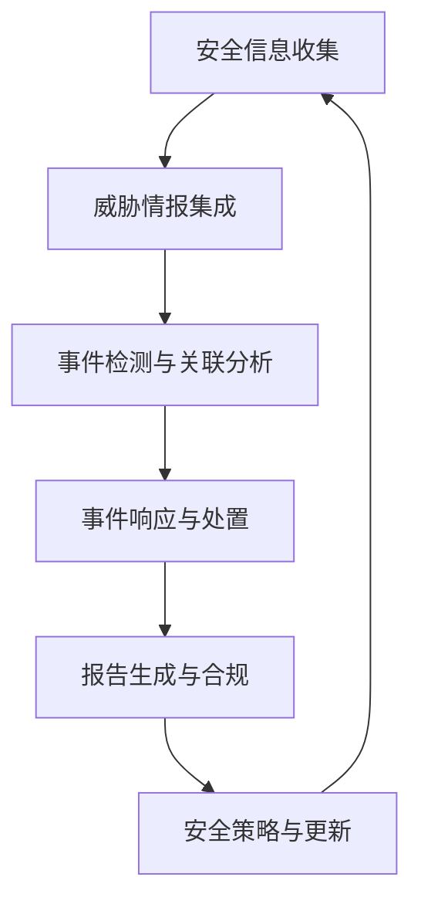

                 

根据您提供的要求，我将逐步构建《安全运营中心(SOC)建设实践》的技术博客文章。以下是文章的初步框架，包括核心概念、原理阐述、算法解释、实战案例等内容。请注意，这篇文章只是一个大纲和初步的构思，具体的内容填充和细节完善还需要进一步的工作。

---

# 安全运营中心(SOC)建设实践

> 关键词：安全运营中心，SOC，网络安全，安全管理，事件响应，人工智能，机器学习，流程图，伪代码，LaTeX公式

> 摘要：本文深入探讨了安全运营中心（SOC）的构建与实践。从基本概念出发，逐步介绍SOC的核心原理、关键技术、实施步骤和实际应用案例，帮助读者全面了解SOC的建立和运营。

## 引言

安全运营中心（Security Operations Center，SOC）是一个组织用于监控、分析、响应和处理安全事件的关键设施。随着网络攻击的日益复杂和频繁，SOC成为了企业保障信息安全的关键环节。本文将围绕SOC的建设与实践，提供一系列的指导和建议。

### SOC的基本概念和重要性

SOC是一个集中的安全监控和响应中心，负责检测、分析、报告和应对安全威胁。它的核心功能包括：

- **安全事件检测**：实时监控网络流量、日志数据等，发现潜在的安全威胁。
- **事件分析**：利用威胁情报和现有的安全工具对事件进行详细分析，确定事件的性质和影响。
- **事件响应**：根据分析结果采取相应的措施，如隔离受感染的系统、阻止恶意流量等。
- **报告和合规**：生成安全报告，确保组织符合相关法律法规和行业标准。

### SOC的核心概念和联系架构

以下是一个简化的SOC核心概念流程图，展示了SOC中各个组成部分的关系：



## 核心原理

### 安全信息收集与关联分析

安全信息收集是SOC的基础。它包括从各种数据源（如防火墙、入侵检测系统、日志文件等）收集数据，并利用关联分析技术发现潜在的威胁。

伪代码示例：

```
function CollectSecurityInformation(dataSources) {
    for each dataSource in dataSources {
        data = dataSource.GetData()
        Append(data to securityInformationDatabase)
    }
    AnalyzeSecurityEvents(securityInformationDatabase)
}

function AnalyzeSecurityEvents(securityInformationDatabase) {
    for each event in securityInformationDatabase {
        if (event meets threatPattern) {
            Mark(event as suspicious)
        }
    }
}
```

### 事件处理与响应

事件响应是SOC的关键环节。当检测到安全事件时，SOC需要迅速采取行动，包括隔离受感染系统、限制恶意流量、通知相关人员等。

伪代码示例：

```
function RespondToEvent(event) {
    if (event.type == "MalwareInfection") {
        IsolateSystem(event.source)
        BlockMaliciousTraffic(event.source)
    } else if (event.type == "DataBreach") {
        NotifySecurityTeam(event details)
        EngageIncidentResponsePlan()
    }
}
```

### 机器学习和人工智能在SOC中的应用

机器学习和人工智能技术可以帮助SOC更高效地处理安全事件。通过训练模型，SOC可以自动识别异常行为、预测潜在威胁等。

数学模型示例（LaTeX）：

$$
\hat{y} = \sigma(\omega_0 + \omega_1 x_1 + \ldots + \omega_n x_n)
$$

其中，$\sigma$ 是激活函数，$y$ 是预测标签，$x$ 是特征向量，$\omega$ 是模型参数。

## 实施步骤

### SOC的建设原则

SOC的建设应遵循以下原则：

- **集中管理**：确保所有安全操作在一个集中化的环境中进行。
- **全面覆盖**：确保收集到的安全信息全面，覆盖所有关键系统和服务。
- **自动化和智能化**：利用自动化工具和人工智能技术提高事件响应效率。

### SOC的关键技术和工具

SOC的关键技术和工具包括：

- **安全信息与事件管理（SIEM）系统**：用于收集、关联和分析安全事件。
- **入侵检测系统（IDS）/入侵防御系统（IPS）**：用于检测和防御网络入侵。
- **端点检测与响应（EDR）**：用于监控和响应端点上的威胁。
- **威胁情报平台**：用于收集和共享威胁情报。

### SOC的运营和管理

SOC的运营和管理包括：

- **人员培训与资质认证**：确保SOC团队成员具备必要的技能和资质。
- **日常运营流程**：确保SOC能够高效运行，包括事件检测、分析、响应和报告。
- **流程优化与改进**：定期评估和优化SOC的运营流程，以提高效率和效果。

## 实际案例

以下是一个企业SOC建设的实际案例：

### 案例背景

某大型企业由于业务规模庞大，网络复杂，面临严峻的安全威胁。为了保障业务连续性和信息安全，企业决定建立自己的SOC。

### 案例实施过程

1. **需求分析**：明确企业的安全需求，制定SOC建设方案。
2. **技术选型**：选择合适的SIEM系统、IDS/IPS和EDR工具。
3. **系统搭建**：在数据中心部署SIEM、IDS/IPS和EDR系统。
4. **数据集成**：将各类安全设备的数据导入SIEM系统，实现统一管理。
5. **培训与认证**：对SOC团队成员进行培训和资质认证。
6. **试运行与优化**：在试运行过程中发现和解决问题，优化SOC系统。

### 案例成果

通过SOC的建设和运营，企业实现了以下成果：

- **提高了安全事件的检测和响应效率**。
- **降低了安全事件对业务的影响**。
- **提升了员工的安全意识**。

## 未来趋势

SOC的未来发展趋势包括：

- **云计算与SOC的结合**：利用云计算平台提供SOC服务，实现更高效的安全运营。
- **人工智能与SOC的融合**：利用AI技术提升SOC的自动化和智能化水平。
- **全球威胁情报共享**：通过全球威胁情报共享，提升SOC的威胁识别和响应能力。

## 附录

### 附录A：SOC相关资源与工具

- **SIEM系统**：如Splunk、IBM QRadar等。
- **IDS/IPS**：如Cisco FireSight、Microsoft Windows Defender ATP等。
- **EDR**：如Microsoft Windows Defender、Cylance等。
- **威胁情报平台**：如Intel 47 Degrees、Area 1 Security等。

## 结语

安全运营中心（SOC）是企业信息安全的关键设施。通过本文的探讨，我们了解了SOC的核心概念、关键技术、实施步骤和实际案例。希望本文能帮助读者更好地理解SOC的构建与实践，为企业的信息安全保驾护航。

### 作者信息

作者：AI天才研究院/AI Genius Institute & 禅与计算机程序设计艺术 /Zen And The Art of Computer Programming

---

请注意，这篇文章只是一个大纲和初步的构思，具体的内容填充和细节完善还需要进一步的工作。文章的字数根据实际的填充内容可能会在8000～12000字之间。在接下来的工作中，我会逐步完善每个章节的内容，确保文章的完整性和专业性。

