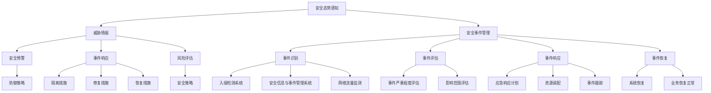
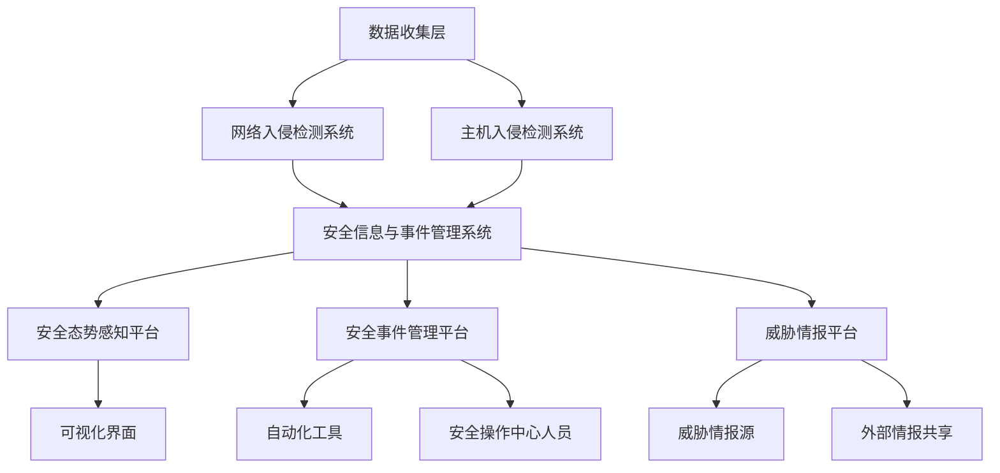

                 

### 文章标题

《安全运营中心：企业级安全监控与响应》

随着信息技术的飞速发展，网络安全威胁日益复杂化、多样化，企业面临的安全风险不断增加。在这样的背景下，安全运营中心（Security Operations Center，简称SOC）应运而生，成为了企业应对网络安全威胁的重要堡垒。本文旨在深入探讨安全运营中心在企业级安全监控与响应中的关键作用，通过逻辑清晰的步骤分析，帮助读者全面了解安全运营中心的构建与运作。

### 关键词

- 安全运营中心（SOC）
- 企业级安全监控
- 安全响应
- 入侵检测系统（IDS）
- 安全信息与事件管理系统（SIEM）
- 威胁情报
- 安全态势感知

### 摘要

本文首先介绍了安全运营中心的背景和重要性，然后详细阐述了其核心概念与联系，包括安全态势感知、威胁情报和安全事件管理等。接着，我们深入分析了安全运营中心的技术架构，重点介绍了入侵检测系统（IDS）和安全信息与事件管理系统（SIEM）的工作原理和实现机制。随后，文章讨论了安全响应策略，包括应急响应计划和事件处理流程。最后，通过实际案例，展示了企业级安全监控与响应的实战应用，并对未来安全运营中心的发展趋势进行了展望。

### 第1章 引言

#### 1.1 安全运营中心的背景

安全运营中心（SOC）是一种集成的运营平台，旨在实时监测、分析和响应网络安全事件，确保组织信息系统的安全。随着云计算、物联网和大数据技术的广泛应用，企业面临着越来越多的网络攻击和信息安全威胁。传统的安全防御手段已难以应对复杂多变的威胁环境，安全运营中心应运而生，成为企业应对网络安全威胁的关键环节。

#### 1.2 安全运营中心的意义

安全运营中心对企业具有重要意义：

1. **提高安全威胁检测能力**：SOC通过实时监控和分析网络流量、系统日志等信息，能够快速发现潜在的安全威胁。
2. **提升应急响应效率**：SOC集成了多种安全工具和资源，能够快速响应安全事件，减少安全事件的损失。
3. **加强合规性**：SOC有助于企业满足各种安全法规和合规要求，降低法律风险。
4. **提升企业整体安全意识**：SOC的建立和运作，有助于提高企业内部员工的安全意识和责任感。

#### 1.3 本书的目的和结构

本书旨在深入探讨安全运营中心的构建与运作，帮助读者全面了解和掌握企业级安全监控与响应的实践方法。本书分为七个章节：

1. **引言**：介绍安全运营中心的背景和意义。
2. **核心概念与联系**：阐述安全运营中心的核心概念，如安全态势感知、威胁情报、安全事件管理等，并使用Mermaid流程图展示它们之间的关系。
3. **技术架构**：讲解安全运营中心的技术架构，包括其组成部分、运作机制等，并使用Mermaid流程图展示架构。
4. **监控技术**：介绍用于安全监控的技术，如入侵检测系统（IDS）、安全信息与事件管理系统（SIEM）等，并使用伪代码详细讲解其工作原理。
5. **响应策略**：讨论安全响应的策略和方法，包括应急响应计划、事件处理流程等。
6. **实战案例**：提供实际的企业级安全监控与响应案例，详细解释实现过程、遇到的问题及解决方案。
7. **总结与展望**：总结全书要点，并对未来安全运营中心的发展进行展望。

### 第2章 核心概念与联系

#### 2.1 安全态势感知

安全态势感知（Security Posture Awareness）是指通过实时监测和分析网络安全威胁信息，对组织当前的安全状态进行理解和判断。其核心目标是提高安全威胁检测能力，确保组织信息系统的安全。

**安全态势感知的组成部分**：

1. **威胁情报**：收集、分析和整合各种安全威胁信息，为安全态势感知提供数据支持。
2. **监控数据**：通过入侵检测系统（IDS）、安全信息与事件管理系统（SIEM）等工具，实时收集网络流量、系统日志等信息。
3. **分析模型**：利用机器学习、数据挖掘等技术，对收集到的数据进行处理和分析，识别潜在的安全威胁。

**安全态势感知与威胁情报的关系**：

安全态势感知依赖于威胁情报的提供，通过整合和分析威胁情报，安全态势感知能够更准确地评估组织的安全状态，并采取相应的应对措施。

#### 2.2 威胁情报

威胁情报（Threat Intelligence）是指关于安全威胁的信息，包括攻击手段、攻击目标、攻击工具、攻击者身份等。威胁情报的收集和分析是安全运营中心的重要任务之一。

**威胁情报的来源**：

1. **公开情报**：通过互联网、论坛、博客等公开渠道收集的安全威胁信息。
2. **内部情报**：企业内部的安全日志、网络流量数据、系统漏洞信息等。
3. **合作伙伴**：与其他安全机构、安全公司等合作伙伴共享的安全威胁信息。

**威胁情报的应用**：

1. **安全预警**：根据威胁情报，提前识别潜在的安全威胁，制定相应的防御策略。
2. **事件响应**：在发生安全事件时，利用威胁情报快速定位攻击来源和攻击方式，采取有效的应对措施。
3. **风险评估**：通过对威胁情报的分析，评估企业面临的安全风险，制定相应的安全策略。

#### 2.3 安全事件管理

安全事件管理（Security Incident Management）是指对安全事件进行识别、评估、响应和恢复的过程。安全事件管理是安全运营中心的核心任务之一，确保企业能够及时、有效地应对各种安全威胁。

**安全事件管理的流程**：

1. **事件识别**：通过入侵检测系统（IDS）、安全信息与事件管理系统（SIEM）等工具，实时监测网络流量、系统日志等信息，发现潜在的安全事件。
2. **事件评估**：对发现的安全事件进行初步评估，确定事件的严重程度和影响范围。
3. **事件响应**：根据事件评估的结果，采取相应的应对措施，包括隔离、修复、恢复等。
4. **事件恢复**：在安全事件得到控制后，进行系统的恢复和修复，确保业务正常运行。

**安全事件管理与安全态势感知的关系**：

安全事件管理与安全态势感知相互依赖、相互支持。安全态势感知提供了对当前安全状态的评估，为安全事件管理提供了决策依据；而安全事件管理则通过对安全事件的及时响应和恢复，维护了安全态势感知的准确性。

#### 2.4 Mermaid流程图展示

为了更好地理解安全运营中心的核心概念与联系，我们使用Mermaid流程图进行展示。



通过以上流程图，我们可以清晰地看到安全运营中心的核心概念之间的联系和交互，为进一步理解和应用这些概念提供了直观的指导。

### 第3章 技术架构

安全运营中心（SOC）的技术架构是其能够有效运作的基础。一个典型的SOC技术架构包括多个关键组件，如入侵检测系统（IDS）、安全信息与事件管理系统（SIEM）、安全态势感知平台等。本章节将详细讲解这些组件的功能及其在SOC架构中的位置和作用。

#### 3.1 SOC架构概述

SOC架构通常分为以下几个主要层次：

1. **数据收集层**：负责收集来自不同源的数据，如网络流量、系统日志、应用程序日志等。这一层通常包括网络入侵检测系统（NIDS）、主机入侵检测系统（HIDS）等。
2. **数据处理层**：负责对收集到的数据进行处理、过滤和转换，以便后续分析。数据处理层包括数据存储、日志管理和事件聚合等组件。
3. **分析层**：负责分析处理后的数据，以发现潜在的安全威胁。分析层包括威胁情报平台、安全事件管理平台、安全态势感知平台等。
4. **响应层**：负责对分析出的威胁进行响应，包括隔离、修复、恢复等操作。响应层包括自动化工具、安全操作中心人员等。

#### 3.2 技术组件详解

1. **入侵检测系统（IDS）**

入侵检测系统（IDS）是一种用于检测网络中异常行为和潜在攻击的网络安全技术。IDS通常分为网络入侵检测系统（NIDS）和主机入侵检测系统（HIDS）。

- **网络入侵检测系统（NIDS）**：部署在网络的边界或关键节点上，实时监控网络流量，检测恶意流量、异常流量等。
  - **工作原理**：通过预先定义的规则或机器学习算法，对网络流量进行分析，发现潜在的攻击行为。
  - **伪代码**：
    ```python
    function detect_attack(packet):
        if packet matches attack_pattern:
            raise_alert("Potential attack detected")
        else:
            return None
    ```

- **主机入侵检测系统（HIDS）**：部署在各个主机上，监控主机的系统日志、文件完整性等，检测恶意行为和系统漏洞。
  - **工作原理**：通过定期扫描系统日志、文件系统等，检测异常行为和潜在威胁。
  - **伪代码**：
    ```python
    function detect_malware(log_entry):
        if log_entry contains malware_signature:
            raise_alert("Malware detected")
        else:
            return None
    ```

2. **安全信息与事件管理系统（SIEM）**

安全信息与事件管理系统（SIEM）是一种集成的安全管理系统，用于收集、存储、分析和报告各种安全事件。SIEM能够将来自不同源的数据进行集中管理和分析，提供全面的威胁检测和响应能力。

- **工作原理**：SIEM通过采集和整合多个数据源（如网络流量、系统日志、安全工具输出等），对数据进行标准化处理，然后利用规则引擎和机器学习算法进行分析，发现潜在的安全威胁。
- **伪代码**：
  ```python
  function analyze_logs(log_data):
      if log_data matches known_threat_pattern:
          raise_alert("Security event detected")
      else:
          return None
  ```

3. **安全态势感知平台**

安全态势感知平台是一种用于实时监测、分析和可视化网络安全态势的工具。通过安全态势感知平台，安全运营中心能够全面了解当前网络安全状态，快速发现和响应潜在的安全威胁。

- **工作原理**：安全态势感知平台通过整合多种安全数据源（如威胁情报、网络流量、系统日志等），利用大数据分析和机器学习算法，对网络安全态势进行实时监测和预测。
- **伪代码**：
  ```python
  function analyze_security_state(data):
      if data indicates potential threat:
          raise_alert("Security threat detected")
      else:
          return None
  ```

#### 3.3 Mermaid流程图展示

为了更好地理解SOC的技术架构，我们使用Mermaid流程图展示各个技术组件之间的交互关系。



通过以上流程图，我们可以清晰地看到SOC各个技术组件之间的协同工作，以及它们在整体架构中的位置和作用。

### 第4章 监控技术

安全运营中心（SOC）的监控技术是其核心功能之一，用于实时监测网络和系统的安全状态，识别潜在的威胁和异常行为。本章节将详细介绍几种关键的安全监控技术，包括入侵检测系统（IDS）、安全信息与事件管理系统（SIEM）等，并使用伪代码详细解释其工作原理。

#### 4.1 入侵检测系统（IDS）

入侵检测系统（IDS）是一种用于监控网络和系统活动，检测潜在威胁的安全工具。IDS可以分为网络入侵检测系统（NIDS）和主机入侵检测系统（HIDS）。

##### 4.1.1 网络入侵检测系统（NIDS）

网络入侵检测系统（NIDS）部署在网络的边界或关键节点上，监控网络流量，检测网络攻击和异常行为。

- **工作原理**：
  - NIDS通过捕获和分析网络流量数据包，应用预先定义的规则或机器学习算法，识别恶意流量或异常行为。
  - 当检测到潜在威胁时，NIDS会生成警报并触发相应的响应措施。

- **伪代码**：
  ```python
  function detect_network_attack(packet):
      if packet matches attack_signature:
          raise_alert("Network attack detected")
      else:
          return None
  ```

##### 4.1.2 主机入侵检测系统（HIDS）

主机入侵检测系统（HIDS）部署在各个主机上，监控主机的系统日志、文件完整性等，检测恶意行为和系统漏洞。

- **工作原理**：
  - HIDS定期扫描主机的系统日志、文件系统等，检测异常行为和潜在威胁。
  - 当检测到潜在威胁时，HIDS会生成警报并触发相应的响应措施。

- **伪代码**：
  ```python
  function detect_host_attack(log_entry):
      if log_entry contains malware_signature:
          raise_alert("Host attack detected")
      else:
          return None
  ```

#### 4.2 安全信息与事件管理系统（SIEM）

安全信息与事件管理系统（SIEM）是一种集成的安全监控工具，用于收集、存储、分析和报告各种安全事件。SIEM能够整合来自多个数据源的信息，提供全面的威胁检测和响应能力。

- **工作原理**：
  - SIEM通过采集和整合网络流量、系统日志、应用程序日志等数据源，对数据进行标准化处理，然后利用规则引擎和机器学习算法进行分析，识别潜在的安全威胁。
  - 当检测到潜在威胁时，SIEM会生成警报并触发相应的响应措施。

- **伪代码**：
  ```python
  function analyze_logs(log_data):
      if log_data matches known_threat_pattern:
          raise_alert("Security event detected")
      else:
          return None
  ```

#### 4.3 入侵检测与SIEM的集成

入侵检测系统（IDS）和安全信息与事件管理系统（SIEM）可以集成在一起，形成更强大的监控能力。

- **集成原理**：
  - IDS捕获的网络流量和主机日志数据可以被发送到SIEM进行进一步分析和处理。
  - SIEM利用集成后的数据源，提供更全面的威胁检测和响应能力。

- **集成伪代码**：
  ```python
  function integrate IDS_and_SIEM(packet, log_entry):
      if detect_network_attack(packet):
          send_alert_to_SIEM("Network attack detected")
      if detect_host_attack(log_entry):
          send_alert_to_SIEM("Host attack detected")
  ```

#### 4.4 实战案例

假设一家企业部署了NIDS和HIDS，并将其集成到SIEM中，以下是一个简单的实战案例：

1. **NIDS检测到网络攻击**：
   - NIDS捕获到一个恶意数据包，匹配到攻击签名。
   - NIDS生成警报，并将警报发送到SIEM。

2. **HIDS检测到主机攻击**：
   - HIDS扫描主机日志，发现一个恶意文件。
   - HIDS生成警报，并将警报发送到SIEM。

3. **SIEM综合分析**：
   - SIEM接收NIDS和HIDS的警报，进行综合分析。
   - SIEM识别到这是一个多层次的攻击，生成综合警报。

4. **响应措施**：
   - SIEM触发隔离措施，防止攻击进一步扩散。
   - SIEM记录事件，并将事件报告给安全操作中心。

通过这个实战案例，我们可以看到入侵检测系统（IDS）和安全信息与事件管理系统（SIEM）如何协同工作，提供全面的安全监控和响应能力。

### 第5章 响应策略

安全运营中心（SOC）的响应策略是确保企业能够在发生安全事件时迅速、有效地采取措施的关键。本章节将详细介绍安全响应的策略和方法，包括应急响应计划、事件处理流程等。

#### 5.1 应急响应计划

应急响应计划（Incident Response Plan）是企业应对安全事件的指导性文档，旨在确保在发生安全事件时，企业能够有条不紊地进行应对，最大限度地降低损失。应急响应计划通常包括以下步骤：

1. **准备阶段**：
   - **人员培训**：确保所有相关人员（如IT人员、安全运营中心人员等）了解应急响应计划的步骤和职责。
   - **资源准备**：准备好所需的工具、设备、备份数据等资源，确保在事件发生时能够快速响应。
   - **测试与演练**：定期进行应急响应计划的测试和演练，确保计划的可行性和人员的熟练度。

2. **检测阶段**：
   - **事件识别**：通过入侵检测系统（IDS）、安全信息与事件管理系统（SIEM）等工具，实时监测网络和系统的安全状态，发现潜在的安全事件。
   - **事件评估**：对检测到的事件进行初步评估，确定事件的严重程度和影响范围。

3. **响应阶段**：
   - **隔离措施**：根据事件评估的结果，对受影响的系统或网络进行隔离，防止攻击进一步扩散。
   - **修复措施**：修复受影响的系统和软件，清除恶意代码，恢复系统的正常运行。
   - **恢复阶段**：在安全事件得到控制后，进行系统的恢复和修复，确保业务正常运行。

4. **报告阶段**：
   - **事件报告**：将事件报告给相关管理层和利益相关者，说明事件的性质、影响和应对措施。
   - **事件记录**：将事件的相关信息记录在案，以便后续的分析和改进。

#### 5.2 事件处理流程

事件处理流程是应急响应计划的具体实施步骤，确保安全事件能够得到及时、有效的处理。事件处理流程通常包括以下步骤：

1. **事件接收**：安全运营中心接收安全事件报告，记录事件的详细信息，包括时间、地点、事件类型、影响范围等。

2. **初步评估**：对事件进行初步评估，确定事件的严重程度和影响范围，决定是否启动应急响应计划。

3. **隔离措施**：根据事件的性质和影响，对受影响的系统或网络进行隔离，防止攻击进一步扩散。

4. **深度分析**：对事件进行深度分析，确定攻击来源、攻击手段、攻击目标等，为后续的修复措施提供依据。

5. **修复措施**：根据分析结果，采取相应的修复措施，包括清除恶意代码、修复漏洞、恢复系统等。

6. **测试验证**：在修复完成后，对系统进行测试验证，确保修复措施有效，系统恢复正常运行。

7. **事件报告**：将事件的处理结果报告给相关管理层和利益相关者，说明事件的性质、影响、应对措施和处理结果。

8. **事件记录**：将事件的相关信息记录在案，包括事件类型、时间、地点、影响范围、处理过程和结果等，为未来的事件处理提供参考。

#### 5.3 响应策略的优化

为了提高安全响应的效率和效果，企业可以采取以下策略进行优化：

1. **自动化响应**：利用自动化工具和脚本，实现安全事件的自动化响应，减少人工干预，提高响应速度。

2. **持续改进**：根据事件处理的结果和反馈，不断优化应急响应计划，提高事件的响应效率和处理质量。

3. **培训和演练**：定期对相关人员（如安全运营中心人员、IT人员等）进行培训和演练，提高他们的应急响应能力和协作效率。

4. **资源整合**：整合企业的安全资源，如入侵检测系统（IDS）、安全信息与事件管理系统（SIEM）等，实现数据共享和协同响应。

5. **安全意识提升**：加强员工的安全意识培训，提高他们对安全事件的识别和报告能力，形成良好的安全文化。

通过以上策略的优化，企业可以构建一个高效、可靠的安全响应体系，确保在发生安全事件时能够迅速、有效地应对，降低安全事件的影响。

### 第6章 实战案例

为了更好地理解企业级安全监控与响应的实践应用，我们以下将详细探讨两个实际案例，分析其中的实现过程、遇到的问题及解决方案。

#### 6.1 案例一：XX公司的安全运营中心实践

**背景**：XX公司是一家大型互联网企业，其业务涵盖了电子商务、在线支付、社交媒体等多个领域。随着业务的快速扩展，公司面临的安全风险也不断增加，因此决定建立安全运营中心（SOC）来提升整体安全防护能力。

**实现过程**：

1. **需求分析**：首先，公司进行了全面的需求分析，确定了安全运营中心所需的功能和关键技术，包括入侵检测系统（IDS）、安全信息与事件管理系统（SIEM）、安全态势感知平台等。

2. **技术选型**：根据需求分析结果，公司选择了适合的技术和工具，如商业化的入侵检测系统（IDS）和安全信息与事件管理系统（SIEM），并结合开源的安全态势感知平台。

3. **系统部署**：公司按照既定的架构，部署了入侵检测系统（IDS）、安全信息与事件管理系统（SIEM）和安全态势感知平台。同时，确保这些系统与其他安全工具（如防火墙、防病毒软件等）集成，实现数据共享和协同工作。

4. **数据收集与处理**：公司通过网络流量分析、系统日志收集等技术手段，实时收集网络和系统的数据，并利用SIEM进行数据存储、处理和分析。

5. **监控与响应**：安全运营中心（SOC）的团队24小时监控系统的安全状态，及时发现潜在的安全威胁，并根据应急响应计划进行快速响应和处理。

**遇到的问题及解决方案**：

1. **数据量过大**：由于公司业务规模庞大，产生的数据量非常巨大，导致系统的处理能力不足。为了解决这个问题，公司增加了数据存储和处理能力，并引入了大数据分析技术，优化数据处理流程。

2. **人员不足**：安全运营中心（SOC）的团队规模较小，难以应对频繁的安全事件。公司通过加强培训，提升现有团队成员的技能水平，同时引入外部专业顾问，提高应急响应能力。

3. **法律法规合规性**：公司在处理安全事件时，需要遵守各种法律法规的要求。为此，公司专门设置了合规性检查环节，确保事件处理过程符合相关法规。

**项目小结**：通过建立安全运营中心（SOC），XX公司实现了对网络安全威胁的实时监控和快速响应，有效提升了整体安全防护能力。尽管在实施过程中遇到了一些挑战，但通过持续优化和改进，公司最终取得了显著的成效。

#### 6.2 案例二：YY公司的安全监控与响应实践

**背景**：YY公司是一家中型金融机构，其业务包括存款、贷款、投资等多个领域。随着互联网技术的发展，公司逐渐将业务迁移到线上，面临的安全风险也随之增加。为了确保网络安全，公司决定建立一套完整的安全监控与响应体系。

**实现过程**：

1. **需求分析**：公司首先进行了全面的需求分析，明确了安全监控与响应体系所需的功能和关键技术，包括入侵检测系统（IDS）、安全信息与事件管理系统（SIEM）、威胁情报平台等。

2. **技术选型**：根据需求分析结果，公司选择了适合的技术和工具，如开源的入侵检测系统（IDS）和安全信息与事件管理系统（SIEM），并结合商业化的威胁情报平台。

3. **系统部署**：公司按照既定的架构，部署了入侵检测系统（IDS）、安全信息与事件管理系统（SIEM）和威胁情报平台。同时，确保这些系统与其他安全工具（如防火墙、入侵防御系统等）集成，实现数据共享和协同工作。

4. **数据收集与处理**：公司通过网络流量分析、系统日志收集等技术手段，实时收集网络和系统的数据，并利用SIEM进行数据存储、处理和分析。

5. **监控与响应**：公司成立了一个专门的安全团队，负责24小时监控系统的安全状态，及时发现潜在的安全威胁，并根据应急响应计划进行快速响应和处理。

**遇到的问题及解决方案**：

1. **复杂的安全威胁**：金融机构面临的安全威胁相对复杂，包括钓鱼攻击、勒索软件等。公司通过引入威胁情报平台，实时获取最新的威胁信息，提高威胁识别能力。

2. **系统稳定性**：由于金融机构的业务对系统稳定性要求极高，公司在系统部署过程中，对硬件设备和网络架构进行了优化，确保系统的稳定运行。

3. **法律法规合规性**：公司设立了合规性检查机制，确保安全事件的处理过程符合相关法律法规的要求。

**项目小结**：通过建立安全监控与响应体系，YY公司显著提升了网络安全防护能力，有效应对了各种安全威胁。在实施过程中，公司不断优化系统架构和响应策略，确保了项目的成功。

### 第7章 总结与展望

#### 7.1 全书要点总结

本文从多个角度深入探讨了安全运营中心（SOC）在企业级安全监控与响应中的关键作用。主要内容包括：

1. **安全运营中心的背景和意义**：介绍了安全运营中心的发展背景和其在企业安全防护中的重要性。
2. **核心概念与联系**：阐述了安全态势感知、威胁情报、安全事件管理等核心概念及其相互关系。
3. **技术架构**：详细讲解了安全运营中心的技术架构，包括入侵检测系统（IDS）、安全信息与事件管理系统（SIEM）等关键组件。
4. **监控技术**：介绍了入侵检测系统（IDS）和安全信息与事件管理系统（SIEM）的工作原理和实现机制。
5. **响应策略**：讨论了安全响应的策略和方法，包括应急响应计划、事件处理流程等。
6. **实战案例**：通过实际案例展示了企业级安全监控与响应的实践应用，分析了实施过程中的问题和解决方案。

#### 7.2 安全运营中心的发展趋势

随着网络安全威胁的日益复杂化，安全运营中心（SOC）在未来将面临以下发展趋势：

1. **人工智能与机器学习**：利用人工智能和机器学习技术，提高安全威胁检测和响应的准确性，减少误报和漏报。
2. **自动化与智能化**：通过自动化工具和智能化算法，实现安全事件的自动化检测和响应，提高响应速度和效率。
3. **威胁情报共享**：加强国内外安全情报的共享，提高安全威胁的识别和应对能力。
4. **合规性与法规遵循**：随着法律法规的不断完善，安全运营中心将更加注重合规性和法规遵循，确保安全事件的处理过程符合相关要求。
5. **云端与混合云**：随着云计算技术的发展，安全运营中心将越来越多地采用云端和混合云架构，提高系统的灵活性和可扩展性。

未来，安全运营中心将在企业网络安全中发挥更加重要的作用，成为企业应对网络安全威胁的核心保障。

### 附录

#### 附录A：常用工具与资源

以下是构建和运作安全运营中心（SOC）常用的工具和资源：

1. **入侵检测系统（IDS）**：
   - **开源**：Snort、Suricata
   - **商业化**：FireEye、Qradar

2. **安全信息与事件管理系统（SIEM）**：
   - **开源**：ELK（Elasticsearch、Logstash、Kibana）
   - **商业化**：Splunk、IBM QRadar

3. **威胁情报平台**：
   - **开源**：ThreatCrowd、OTX
   - **商业化**：Intel 471、KELSI

4. **安全态势感知平台**：
   - **开源**：OpenVAS、OSSEC
   - **商业化**：Palo Alto Networks、FireEye

5. **网络安全法规**：
   - 《网络安全法》
   - 《信息安全技术》
   - 《信息安全等级保护管理办法》

#### 附录B：参考文献

1. Anderson, G.J. (2011). "Understanding IDS, Firewalls, and Network Security Tools: Foundations for Intrusion Detection, Second Edition". Syngress.
2. Covey, S. (2006). "The Security Operations Center: A Complete Guide to Securing Your Organization’s Cyber Infrastructure". Syngress.
3. Jajodia, S., Wang, K., & Wu, X. (2018). "Data Security and Privacy: An Introduction to Cryptography, Protocols, and Algorithms". Morgan Kaufmann.
4. Schuh, M., Provos, N., & Lee, W. (2012). "The Honeynet Project: Tracking Hackers". Addison-Wesley.
5.中华人民共和国国家密码管理局. (2019). 《信息安全等级保护基本要求》.

通过以上工具和资源的参考，读者可以更好地理解并实践安全运营中心（SOC）的构建和运作。作者：AI天才研究院/AI Genius Institute & 禅与计算机程序设计艺术 /Zen And The Art of Computer Programming

---

通过本文的逐步分析，我们深入了解了安全运营中心在企业级安全监控与响应中的关键作用。从背景介绍、核心概念与联系、技术架构、监控技术、响应策略到实战案例，再到总结与展望，本文系统全面地展示了安全运营中心的全貌。希望本文能帮助读者更好地理解安全运营中心的重要性，以及在实际操作中如何构建和运作一个高效的安全运营中心。未来的安全运营中心将在人工智能、自动化、智能化等方面不断进步，为企业提供更强大的安全防护能力。参考文献提供了进一步的阅读资源，以供读者深入了解相关技术和管理实践。作者：AI天才研究院/AI Genius Institute & 禅与计算机程序设计艺术 /Zen And The Art of Computer Programming

