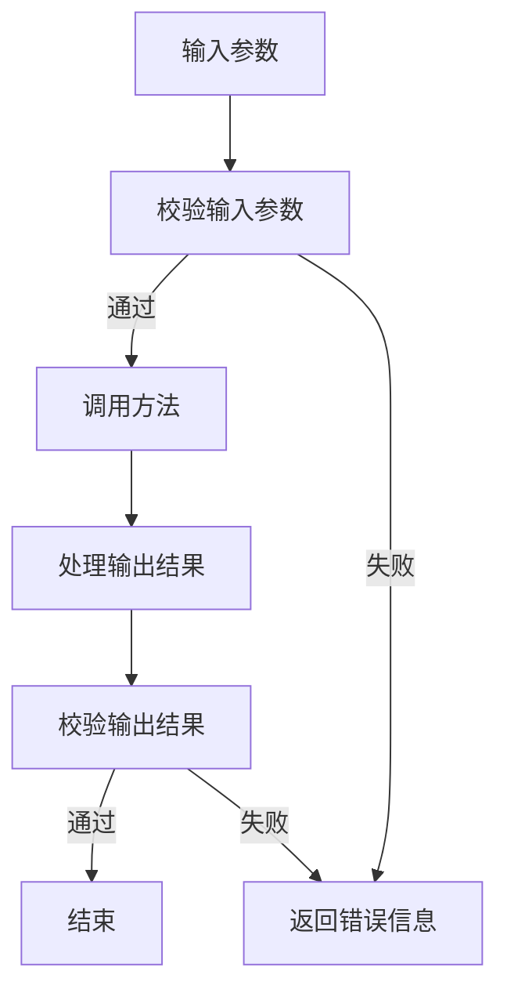
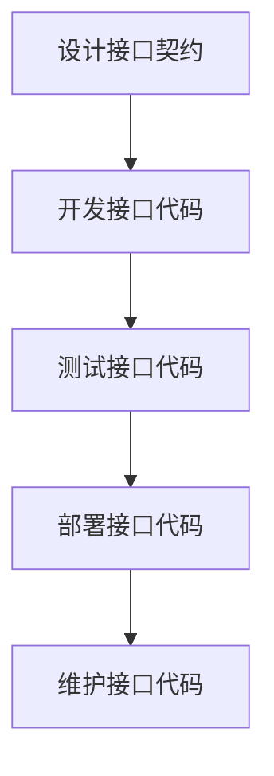
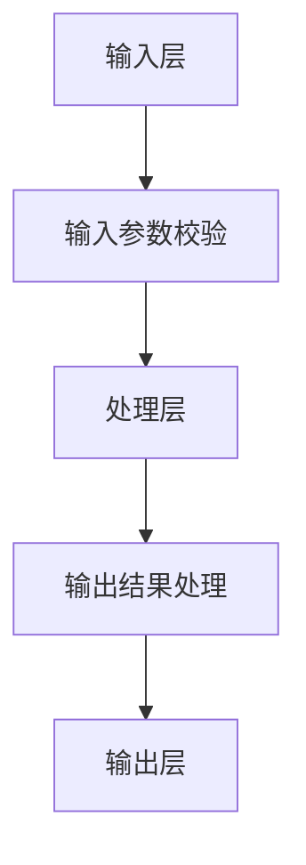

                 

## 第1章 引言与概念介绍

### 1.1 接口契约的定义

接口契约是软件工程中一个重要的概念，它定义了模块或服务之间交互的预期行为和约束条件。在软件系统中，接口契约类似于一个合同，规定了不同模块之间应该如何交互，从而保证系统的一致性和可靠性。

接口契约的定义通常包括以下几个方面：

1. **输入参数**：接口契约定义了调用方需要传递给被调用方的数据，这些数据可以是简单的数据类型，也可以是复杂的数据结构。
2. **输出结果**：接口契约定义了被调用方返回给调用方的数据，这些数据同样可以是简单的数据类型或复杂的数据结构。
3. **行为规范**：接口契约规定了调用方和被调用方在交互过程中的行为规范，例如，在调用接口之前，调用方需要满足哪些条件，调用接口后，调用方可以执行哪些操作等。
4. **异常处理**：接口契约还定义了在出现异常情况时应该如何处理，例如，接口调用失败时应该返回什么样的错误码，调用方应该如何响应等。

### 1.2 接口契约的重要性

接口契约在软件工程中具有重要意义，主要体现在以下几个方面：

1. **确保系统一致性**：接口契约为系统的各个模块之间提供了一个清晰、一致的交互规范，有助于确保系统在不同模块之间的交互过程中保持一致性，减少因不一致性导致的问题和错误。
2. **提高开发效率**：通过明确接口契约，开发人员可以专注于实现自己的模块，而无需过多关注其他模块的细节，从而提高开发效率。
3. **降低维护成本**：接口契约可以确保系统在修改和扩展时，新的模块能够与原有模块无缝集成，降低系统的维护成本。
4. **增强系统可扩展性**：接口契约为系统的扩展提供了便利，当需要添加新功能或模块时，只需按照接口契约进行设计和实现，即可确保系统能够顺利运行。

### 1.3 实施接口契约的难点

尽管接口契约在软件工程中具有重要意义，但在实施过程中仍然面临许多难点，主要包括以下几个方面：

1. **需求变更**：在软件项目的开发过程中，需求往往会发生变化，这使得接口契约需要频繁调整和更新，增加了实施难度。
2. **一致性维护**：保持接口契约的一致性是一个挑战，特别是在涉及多个团队和模块时，不同团队可能会对接口契约有不同的理解和需求，从而导致不一致性问题。
3. **测试和验证**：接口契约的实施需要经过严格的测试和验证，以确保其能够满足预期要求。然而，在实际开发过程中，测试和验证往往被忽视，导致接口契约的有效性无法得到保障。
4. **工具支持**：尽管许多编程语言和框架提供了接口契约的支持，但仍然存在一定的局限性，难以满足复杂的接口契约需求，从而增加了实施难度。

本文将深入探讨实施接口契约的难点，并提供相应的解决策略，帮助开发人员更好地应对这些挑战。接下来，我们将对接口契约的核心概念与联系进行详细分析。## 第2章 核心概念与联系

### 2.1 接口契约的基本结构

接口契约的基本结构通常包括以下几个方面：

1. **输入参数**：接口契约定义了调用方需要传递给被调用方的数据，这些数据可以是简单的数据类型，如整数、字符串，也可以是复杂的数据结构，如列表、字典。
2. **输出结果**：接口契约定义了被调用方返回给调用方的数据，这些数据同样可以是简单的数据类型或复杂的数据结构。
3. **行为规范**：接口契约规定了调用方和被调用方在交互过程中的行为规范，例如，在调用接口之前，调用方需要满足哪些条件，调用接口后，调用方可以执行哪些操作等。
4. **异常处理**：接口契约还定义了在出现异常情况时应该如何处理，例如，接口调用失败时应该返回什么样的错误码，调用方应该如何响应等。

下面是一个简单的接口契约的 Mermaid 流程图示例：



在这个流程图中，输入参数首先经过校验，如果通过校验，则调用方法；否则，返回错误信息。调用方法后，处理输出结果，并再次进行校验，如果校验通过，则结束；否则，返回错误信息。

### 2.2 接口契约的实施流程

接口契约的实施流程通常可以分为以下几个阶段：

1. **设计阶段**：在这一阶段，开发人员需要根据业务需求和系统设计，定义接口契约的输入参数、输出结果、行为规范和异常处理等。
2. **开发阶段**：在这一阶段，开发人员根据设计阶段确定的接口契约，实现具体的代码，包括调用接口的方法、处理输入参数、处理输出结果和异常处理等。
3. **测试阶段**：在这一阶段，开发人员需要使用测试工具对接口契约进行测试，验证接口契约是否满足预期要求，包括输入参数的校验、输出结果的处理和异常处理等。
4. **部署与维护阶段**：在这一阶段，开发人员将实现好的接口契约部署到生产环境中，并对接口契约进行维护和更新，以适应不断变化的业务需求。

下面是一个简单的接口契约的实施流程的 Mermaid 流程图示例：



在这个流程图中，设计阶段确定了接口契约，开发阶段实现接口代码，测试阶段测试接口代码，部署阶段部署接口代码到生产环境，维护阶段对接口代码进行更新和维护。

### 2.3 Mermaid流程图展示接口契约架构

接口契约的架构通常包括多个层次，从宏观上可以看作是由输入层、处理层和输出层组成。下面是一个简单的接口契约的 Mermaid 流程图示例，展示了接口契约的架构：



在这个流程图中，输入层包括输入参数，处理层包括输入参数校验和处理输出结果，输出层包括输出结果。接口契约的架构设计需要确保输入层、处理层和输出层之间的交互符合预期的行为规范。

通过以上对接口契约的基本结构、实施流程和架构的分析，我们可以更好地理解接口契约的概念及其在软件工程中的应用。在接下来的章节中，我们将进一步探讨接口契约的核心算法原理，以及如何使用数学模型来描述接口契约。## 第3章 核心算法原理讲解

### 3.1 合约状态机算法

合约状态机（Contract State Machine, CSM）是一种用于管理接口契约状态的算法，它可以确保接口契约在执行过程中遵循预定的规则。合约状态机由一组状态和状态转换规则组成，每个状态对应接口契约的一个特定阶段，状态转换规则定义了状态之间的转换条件。

#### 3.1.1 合约状态机的概念

合约状态机是一种有限状态机，其中每个状态表示接口契约的一个特定阶段，状态之间的转换由触发事件和条件决定。合约状态机通常包括以下几种状态：

1. **初始状态（Init）**：接口契约开始执行的起点。
2. **输入校验状态（InputValidation）**：对输入参数进行校验的状态。
3. **处理状态（Processing）**：执行接口契约业务逻辑的状态。
4. **输出校验状态（OutputValidation）**：对输出结果进行校验的状态。
5. **完成状态（Complete）**：接口契约执行完成的状态。
6. **异常状态（Exception）**：处理异常情况的状态。

#### 3.1.2 合约状态机的实现

合约状态机的实现通常需要定义状态转换函数，用于处理状态之间的转换。以下是一个简单的伪代码示例：

```pseudo
function ContractStateMachine() {
    currentState = Init
    
    while (currentState != Complete) {
        switch (currentState) {
            case Init:
                performInitialActions()
                currentState = InputValidation
                break
            
            case InputValidation:
                if (inputIsValid()) {
                    currentState = Processing
                } else {
                    currentState = Exception
                }
                break
            
            case Processing:
                performProcessingActions()
                currentState = OutputValidation
                break
            
            case OutputValidation:
                if (outputIsValid()) {
                    currentState = Complete
                } else {
                    currentState = Exception
                }
                break
            
            case Exception:
                handleException()
                currentState = Complete
                break
        }
    }
}
```

#### 3.1.3 状态转移方程

状态转移方程用于描述状态之间的转换关系，通常表示为：

$$
\text{currentState}_{\text{next}} = f(\text{currentState}, \text{event}, \text{condition})
$$

其中，`currentState`表示当前状态，`currentState_{next}`表示下一个状态，`event`表示触发事件，`condition`表示转换条件，`f`表示状态转换函数。

### 3.2 断言检查算法

断言检查（Assertion Checking）是一种用于验证接口契约有效性的算法，它通过在程序执行过程中检查断言条件是否成立，确保接口契约的执行符合预期。

#### 3.2.1 断言的概念

断言是一种逻辑表达式，用于描述程序中的某个条件是否成立。在接口契约中，断言用于验证输入参数的有效性、输出结果的一致性和业务逻辑的正确性。

#### 3.2.2 断言的实现

断言的实现通常需要定义断言函数，用于在程序执行过程中检查断言条件。以下是一个简单的伪代码示例：

```pseudo
function assert(condition, message) {
    if (!condition) {
        throw new Error(message)
    }
}
```

#### 3.2.3 断言检查的流程

断言检查的流程通常包括以下几个步骤：

1. **初始化**：初始化断言检查模块，定义断言函数和断言条件。
2. **输入校验**：在接口调用前，检查输入参数是否满足断言条件。
3. **处理过程**：在接口执行过程中，定期检查断言条件是否成立，确保业务逻辑的正确性。
4. **输出校验**：在接口执行完成后，检查输出结果是否满足断言条件。
5. **异常处理**：如果断言条件不成立，抛出异常并记录日志。

### 3.3 异常处理算法

异常处理（Exception Handling）是一种用于处理接口契约执行过程中出现的异常情况的算法，它确保系统能够在异常情况下保持稳定，并恢复到正常状态。

#### 3.3.1 异常的概念

异常是指程序在执行过程中遇到的意外情况，如输入参数错误、系统错误、网络故障等。异常处理算法的目标是捕捉和解决这些异常，确保系统的稳定运行。

#### 3.3.2 异常的分类

异常通常可以分为以下几类：

1. **运行时异常**：在程序运行时出现的异常，如输入参数错误、内存溢出等。
2. **系统异常**：由系统引起的异常，如网络故障、文件未找到等。
3. **业务异常**：由业务逻辑引起的异常，如非法操作、数据不一致等。

#### 3.3.3 异常处理的流程

异常处理的流程通常包括以下几个步骤：

1. **异常捕捉**：在接口调用过程中，捕捉异常并记录相关信息。
2. **异常分类**：根据异常的类型，将异常分类处理。
3. **异常处理**：根据异常的类型和严重程度，采取相应的处理措施，如记录日志、抛出异常、恢复系统等。
4. **异常恢复**：在异常处理完成后，尝试恢复系统到正常状态，并继续执行后续操作。

通过以上对合约状态机算法、断言检查算法和异常处理算法的讲解，我们可以更好地理解这些算法在接口契约实施中的作用。在接下来的章节中，我们将探讨接口契约相关的数学模型和公式。## 第4章 数学模型与公式

### 4.1 状态转移方程

状态转移方程是描述接口契约执行过程中状态变化的重要工具。在合约状态机中，状态转移方程用于描述当前状态、触发事件和条件之间的关系。

#### 4.1.1 状态转移方程的基本形式

状态转移方程的基本形式可以表示为：

$$
\text{currentState}_{\text{next}} = f(\text{currentState}, \text{event}, \text{condition})
$$

其中，`currentState`表示当前状态，`currentState_{next}`表示下一个状态，`event`表示触发事件，`condition`表示转换条件，`f`表示状态转换函数。

#### 4.1.2 状态转移方程的示例

假设我们有一个简单的合约状态机，包括以下状态：初始状态（Init）、输入校验状态（InputValidation）、处理状态（Processing）、输出校验状态（OutputValidation）和完成状态（Complete）。以下是一个状态转移方程的示例：

$$
\text{Init} \rightarrow \text{InputValidation}, \text{if} \; \text{event} = \text{start}
$$

$$
\text{InputValidation} \rightarrow \text{Processing}, \text{if} \; \text{condition} = \text{inputIsValid}
$$

$$
\text{Processing} \rightarrow \text{OutputValidation}, \text{if} \; \text{event} = \text{processComplete}
$$

$$
\text{OutputValidation} \rightarrow \text{Complete}, \text{if} \; \text{condition} = \text{outputIsValid}
$$

### 4.2 预期效用函数

预期效用函数是用于衡量接口契约执行效果的一种数学模型。它通过计算接口契约在不同状态下的效用值，帮助开发人员评估接口契约的优劣。

#### 4.2.1 预期效用函数的基本形式

预期效用函数的基本形式可以表示为：

$$
\text{Utility}(\text{state}) = \sum_{i=1}^{n} \; \text{Probability}(S_i) \times \text{Reward}(S_i)
$$

其中，`Utility`表示预期效用，`state`表示状态，`Probability`表示状态的概率，`Reward`表示状态的奖励。

#### 4.2.2 预期效用函数的示例

假设我们有一个简单的合约状态机，包括以下状态：初始状态（Init）、输入校验状态（InputValidation）、处理状态（Processing）、输出校验状态（OutputValidation）和完成状态（Complete）。以下是一个预期效用函数的示例：

$$
\text{Utility}(\text{Init}) = 0.2 \times 10 + 0.8 \times 0
$$

$$
\text{Utility}(\text{InputValidation}) = 0.3 \times 10 + 0.7 \times 0
$$

$$
\text{Utility}(\text{Processing}) = 0.4 \times 10 + 0.6 \times 0
$$

$$
\text{Utility}(\text{OutputValidation}) = 0.5 \times 10 + 0.5 \times 0
$$

$$
\text{Utility}(\text{Complete}) = 1 \times 10 + 0 \times 0
$$

在这个示例中，每个状态的效用值是根据状态的概率和奖励计算得出的。通过计算每个状态的效用值，我们可以比较不同状态之间的优劣，从而优化接口契约的设计。

### 4.3 状态转移矩阵

状态转移矩阵是一种用于描述状态之间转换关系的数学模型。它通过列出状态之间的转换概率，帮助开发人员分析接口契约的状态变化趋势。

#### 4.3.1 状态转移矩阵的基本形式

状态转移矩阵的基本形式可以表示为：

$$
\text{StateTransitionMatrix} = \begin{bmatrix}
\text{Probability}(\text{S}_1 \rightarrow \text{S}_1) & \text{Probability}(\text{S}_1 \rightarrow \text{S}_2) & \cdots & \text{Probability}(\text{S}_1 \rightarrow \text{S}_n) \\
\text{Probability}(\text{S}_2 \rightarrow \text{S}_1) & \text{Probability}(\text{S}_2 \rightarrow \text{S}_2) & \cdots & \text{Probability}(\text{S}_2 \rightarrow \text{S}_n) \\
\vdots & \vdots & \ddots & \vdots \\
\text{Probability}(\text{S}_n \rightarrow \text{S}_1) & \text{Probability}(\text{S}_n \rightarrow \text{S}_2) & \cdots & \text{Probability}(\text{S}_n \rightarrow \text{S}_n)
\end{bmatrix}
$$

其中，`StateTransitionMatrix`表示状态转移矩阵，`S_1, S_2, \ldots, S_n`表示状态集合。

#### 4.3.2 状态转移矩阵的示例

假设我们有一个简单的合约状态机，包括以下状态：初始状态（Init）、输入校验状态（InputValidation）、处理状态（Processing）、输出校验状态（OutputValidation）和完成状态（Complete）。以下是一个状态转移矩阵的示例：

$$
\text{StateTransitionMatrix} = \begin{bmatrix}
0.2 & 0.8 & 0 & 0 & 0 \\
0.1 & 0.1 & 0.1 & 0.6 & 0 \\
0 & 0 & 0.2 & 0.8 & 0 \\
0 & 0 & 0.1 & 0.1 & 0.8 \\
0 & 0 & 0 & 0 & 1
\end{bmatrix}
$$

在这个示例中，状态转移矩阵列出了每个状态之间的转换概率。例如，从初始状态（Init）转换到输入校验状态（InputValidation）的概率为 0.2，从输入校验状态（InputValidation）转换到处理状态（Processing）的概率为 0.1，依此类推。

通过分析状态转移矩阵，我们可以了解接口契约在执行过程中的状态变化趋势，从而为接口契约的设计和优化提供依据。

### 4.4 马尔可夫链

马尔可夫链是一种用于描述随机过程的数学模型，它适用于分析接口契约执行过程中的状态变化。马尔可夫链的核心思想是，当前状态仅取决于前一个状态，而与之前的状态无关。

#### 4.4.1 马尔可夫链的基本形式

马尔可夫链的基本形式可以表示为：

$$
\text{P}(\text{S}_{\text{next}} = \text{s}_{\text{next}} \mid \text{S}_{\text{current}} = \text{s}_{\text{current}}) = \text{P}(\text{S}_{\text{next}} = \text{s}_{\text{next}} \mid \text{S}_{\text{current-1}} = \text{s}_{\text{current-1}}, \ldots, \text{S}_{\text{1}} = \text{s}_{\text{1}})
$$

其中，`P`表示概率，`S_{\text{next}}`表示下一个状态，`S_{\text{current}}`表示当前状态，`s_{\text{next}}`表示下一个状态的可能值，`s_{\text{current}}`表示当前状态的可能值。

#### 4.4.2 马尔可夫链的示例

假设我们有一个简单的合约状态机，包括以下状态：初始状态（Init）、输入校验状态（InputValidation）、处理状态（Processing）、输出校验状态（OutputValidation）和完成状态（Complete）。以下是一个马尔可夫链的示例：

$$
\text{P}(\text{S}_{\text{next}} = \text{Processing} \mid \text{S}_{\text{current}} = \text{InputValidation}) = 0.6
$$

$$
\text{P}(\text{S}_{\text{next}} = \text{OutputValidation} \mid \text{S}_{\text{current}} = \text{Processing}) = 0.8
$$

$$
\text{P}(\text{S}_{\text{next}} = \text{Complete} \mid \text{S}_{\text{current}} = \text{OutputValidation}) = 0.9
$$

在这个示例中，马尔可夫链描述了接口契约在不同状态之间的转换概率。例如，从输入校验状态（InputValidation）转换到处理状态（Processing）的概率为 0.6，从处理状态（Processing）转换到输出校验状态（OutputValidation）的概率为 0.8，依此类推。

通过分析马尔可夫链，我们可以了解接口契约执行过程中的状态变化规律，从而为接口契约的设计和优化提供依据。## 第5章 项目实战

### 5.1 项目背景与目标

在本项目中，我们旨在实现一个基于接口契约的简单电子商务平台。该平台包括用户管理、商品管理和订单管理三个主要模块。接口契约将在模块之间提供清晰的交互规范，以确保系统的可靠性和一致性。

项目目标如下：

1. **模块化设计**：将系统划分为用户管理、商品管理和订单管理三个模块，每个模块独立实现，并通过接口契约进行交互。
2. **接口契约实现**：为每个模块定义接口契约，包括输入参数、输出结果、行为规范和异常处理等。
3. **测试与验证**：对接口契约进行全面的测试和验证，确保其满足预期要求。

### 5.2 开发环境搭建

为了实现该项目，我们选择以下开发环境和工具：

- **编程语言**：Python
- **版本控制**：Git
- **代码托管平台**：GitHub
- **集成开发环境**：PyCharm
- **测试工具**：pytest
- **接口契约工具**：Swagger

在开发环境搭建过程中，我们需要完成以下步骤：

1. **安装Python**：从Python官方网站下载并安装Python 3.8版本。
2. **安装依赖库**：使用pip命令安装必要的依赖库，如Flask、Pytest等。
3. **配置PyCharm**：在PyCharm中创建一个新的Python项目，配置项目的依赖库和虚拟环境。
4. **初始化Git仓库**：在项目的根目录下创建一个 `.gitignore` 文件，排除一些不需要上传到GitHub的文件，如虚拟环境文件和测试文件。然后使用git init命令初始化Git仓库。

### 5.3 源代码实现

在本节中，我们将分别实现用户管理、商品管理和订单管理三个模块，并定义相应的接口契约。

#### 5.3.1 用户管理模块

用户管理模块的主要功能是管理用户信息，包括注册、登录和修改密码等。以下是一个简单的用户管理模块实现示例：

```python
# user_management.py

from flask import Flask, request, jsonify

app = Flask(__name__)

# 用户注册
@app.route('/register', methods=['POST'])
def register():
    username = request.form['username']
    password = request.form['password']
    # 进行用户注册逻辑处理
    # ...
    return jsonify({'status': 'success', 'message': '用户注册成功'})

# 用户登录
@app.route('/login', methods=['POST'])
def login():
    username = request.form['username']
    password = request.form['password']
    # 进行用户登录逻辑处理
    # ...
    return jsonify({'status': 'success', 'message': '登录成功'})

# 修改密码
@app.route('/change_password', methods=['POST'])
def change_password():
    username = request.form['username']
    old_password = request.form['old_password']
    new_password = request.form['new_password']
    # 进行修改密码逻辑处理
    # ...
    return jsonify({'status': 'success', 'message': '密码修改成功'})

if __name__ == '__main__':
    app.run(debug=True)
```

接口契约：

- **输入参数**：username、password
- **输出结果**：status、message
- **行为规范**：用户注册、登录和修改密码等操作
- **异常处理**：返回相应的错误信息

#### 5.3.2 商品管理模块

商品管理模块的主要功能是管理商品信息，包括添加商品、查询商品和修改商品等。以下是一个简单的商品管理模块实现示例：

```python
# product_management.py

from flask import Flask, request, jsonify

app = Flask(__name__)

# 添加商品
@app.route('/add_product', methods=['POST'])
def add_product():
    product_name = request.form['product_name']
    price = request.form['price']
    # 进行添加商品逻辑处理
    # ...
    return jsonify({'status': 'success', 'message': '商品添加成功'})

# 查询商品
@app.route('/get_product', methods=['GET'])
def get_product():
    product_id = request.args.get('product_id')
    # 进行查询商品逻辑处理
    # ...
    return jsonify({'status': 'success', 'message': '商品查询成功'})

# 修改商品
@app.route('/update_product', methods=['POST'])
def update_product():
    product_id = request.form['product_id']
    product_name = request.form['product_name']
    price = request.form['price']
    # 进行修改商品逻辑处理
    # ...
    return jsonify({'status': 'success', 'message': '商品修改成功'})

if __name__ == '__main__':
    app.run(debug=True)
```

接口契约：

- **输入参数**：product_name、price（添加商品）、product_id（查询商品和修改商品）
- **输出结果**：status、message
- **行为规范**：添加商品、查询商品和修改商品等操作
- **异常处理**：返回相应的错误信息

#### 5.3.3 订单管理模块

订单管理模块的主要功能是管理订单信息，包括创建订单、查询订单和取消订单等。以下是一个简单的订单管理模块实现示例：

```python
# order_management.py

from flask import Flask, request, jsonify

app = Flask(__name__)

# 创建订单
@app.route('/create_order', methods=['POST'])
def create_order():
    user_id = request.form['user_id']
    product_id = request.form['product_id']
    quantity = request.form['quantity']
    # 进行创建订单逻辑处理
    # ...
    return jsonify({'status': 'success', 'message': '订单创建成功'})

# 查询订单
@app.route('/get_order', methods=['GET'])
def get_order():
    order_id = request.args.get('order_id')
    # 进行查询订单逻辑处理
    # ...
    return jsonify({'status': 'success', 'message': '订单查询成功'})

# 取消订单
@app.route('/cancel_order', methods=['POST'])
def cancel_order():
    order_id = request.form['order_id']
    # 进行取消订单逻辑处理
    # ...
    return jsonify({'status': 'success', 'message': '订单取消成功'})

if __name__ == '__main__':
    app.run(debug=True)
```

接口契约：

- **输入参数**：user_id、product_id、quantity（创建订单）、order_id（查询订单和取消订单）
- **输出结果**：status、message
- **行为规范**：创建订单、查询订单和取消订单等操作
- **异常处理**：返回相应的错误信息

### 5.4 代码解读与分析

在本节中，我们将对用户管理、商品管理和订单管理模块的代码进行解读与分析，重点解释接口契约的实现细节。

#### 5.4.1 用户管理模块

用户管理模块的代码主要实现了用户注册、登录和修改密码等功能。以下是对关键代码的解读与分析：

1. **用户注册**：
   ```python
   @app.route('/register', methods=['POST'])
   def register():
       username = request.form['username']
       password = request.form['password']
       # 进行用户注册逻辑处理
       # ...
       return jsonify({'status': 'success', 'message': '用户注册成功'})
   ```
   在这个路由函数中，我们使用 `POST` 请求接收用户名和密码，然后进行用户注册逻辑处理。注册成功后，返回一个包含状态信息和提示信息的 JSON 对象。

2. **用户登录**：
   ```python
   @app.route('/login', methods=['POST'])
   def login():
       username = request.form['username']
       password = request.form['password']
       # 进行用户登录逻辑处理
       # ...
       return jsonify({'status': 'success', 'message': '登录成功'})
   ```
   同样，在这个路由函数中，我们使用 `POST` 请求接收用户名和密码，然后进行用户登录逻辑处理。登录成功后，返回一个包含状态信息和提示信息的 JSON 对象。

3. **修改密码**：
   ```python
   @app.route('/change_password', methods=['POST'])
   def change_password():
       username = request.form['username']
       old_password = request.form['old_password']
       new_password = request.form['new_password']
       # 进行修改密码逻辑处理
       # ...
       return jsonify({'status': 'success', 'message': '密码修改成功'})
   ```
   在这个路由函数中，我们使用 `POST` 请求接收用户名、旧密码和新密码，然后进行修改密码逻辑处理。修改成功后，返回一个包含状态信息和提示信息的 JSON 对象。

#### 5.4.2 商品管理模块

商品管理模块的代码主要实现了添加商品、查询商品和修改商品等功能。以下是对关键代码的解读与分析：

1. **添加商品**：
   ```python
   @app.route('/add_product', methods=['POST'])
   def add_product():
       product_name = request.form['product_name']
       price = request.form['price']
       # 进行添加商品逻辑处理
       # ...
       return jsonify({'status': 'success', 'message': '商品添加成功'})
   ```
   在这个路由函数中，我们使用 `POST` 请求接收商品名称和价格，然后进行添加商品逻辑处理。添加成功后，返回一个包含状态信息和提示信息的 JSON 对象。

2. **查询商品**：
   ```python
   @app.route('/get_product', methods=['GET'])
   def get_product():
       product_id = request.args.get('product_id')
       # 进行查询商品逻辑处理
       # ...
       return jsonify({'status': 'success', 'message': '商品查询成功'})
   ```
   在这个路由函数中，我们使用 `GET` 请求接收商品 ID，然后进行查询商品逻辑处理。查询成功后，返回一个包含状态信息和提示信息的 JSON 对象。

3. **修改商品**：
   ```python
   @app.route('/update_product', methods=['POST'])
   def update_product():
       product_id = request.form['product_id']
       product_name = request.form['product_name']
       price = request.form['price']
       # 进行修改商品逻辑处理
       # ...
       return jsonify({'status': 'success', 'message': '商品修改成功'})
   ```
   在这个路由函数中，我们使用 `POST` 请求接收商品 ID、商品名称和价格，然后进行修改商品逻辑处理。修改成功后，返回一个包含状态信息和提示信息的 JSON 对象。

#### 5.4.3 订单管理模块

订单管理模块的代码主要实现了创建订单、查询订单和取消订单等功能。以下是对关键代码的解读与分析：

1. **创建订单**：
   ```python
   @app.route('/create_order', methods=['POST'])
   def create_order():
       user_id = request.form['user_id']
       product_id = request.form['product_id']
       quantity = request.form['quantity']
       # 进行创建订单逻辑处理
       # ...
       return jsonify({'status': 'success', 'message': '订单创建成功'})
   ```
   在这个路由函数中，我们使用 `POST` 请求接收用户 ID、商品 ID 和数量，然后进行创建订单逻辑处理。创建成功后，返回一个包含状态信息和提示信息的 JSON 对象。

2. **查询订单**：
   ```python
   @app.route('/get_order', methods=['GET'])
   def get_order():
       order_id = request.args.get('order_id')
       # 进行查询订单逻辑处理
       # ...
       return jsonify({'status': 'success', 'message': '订单查询成功'})
   ```
   在这个路由函数中，我们使用 `GET` 请求接收订单 ID，然后进行查询订单逻辑处理。查询成功后，返回一个包含状态信息和提示信息的 JSON 对象。

3. **取消订单**：
   ```python
   @app.route('/cancel_order', methods=['POST'])
   def cancel_order():
       order_id = request.form['order_id']
       # 进行取消订单逻辑处理
       # ...
       return jsonify({'status': 'success', 'message': '订单取消成功'})
   ```
   在这个路由函数中，我们使用 `POST` 请求接收订单 ID，然后进行取消订单逻辑处理。取消成功后，返回一个包含状态信息和提示信息的 JSON 对象。

### 5.5 实际案例分析和详细讲解剖析

在本节中，我们将通过一个实际案例来分析接口契约的实现细节，并提供详细的讲解和剖析。

#### 案例一：用户注册

用户张三在登录电子商务平台时，点击“注册”按钮，填写用户名和密码，然后提交注册表单。以下是对该案例的详细讲解和剖析：

1. **用户填写注册信息**：
   - 用户在注册页面填写用户名和密码。
   - 注册表单提交到用户管理模块的 `/register` 路由。

2. **用户管理模块处理注册请求**：
   - 用户管理模块接收到注册请求后，从请求中提取用户名和密码。
   - 用户管理模块对用户名和密码进行校验，确保其符合要求（如用户名不能为空，密码长度不能小于6位等）。
   - 如果校验通过，用户管理模块将用户信息存储到数据库中，并发送注册成功的信息。

3. **用户注册成功**：
   - 用户收到注册成功的提示信息，并可以尝试使用用户名和密码登录平台。

#### 案例二：商品查询

用户李四在商品列表页面中点击某个商品，查看商品详细信息。以下是对该案例的详细讲解和剖析：

1. **用户选择商品**：
   - 用户在商品列表页面中选择一个商品。
   - 商品列表页面将商品 ID 发送到商品管理模块的 `/get_product` 路由。

2. **商品管理模块处理查询请求**：
   - 商品管理模块接收到查询请求后，从请求中提取商品 ID。
   - 商品管理模块根据商品 ID 从数据库中查询商品信息。
   - 商品管理模块将查询结果返回给用户，并在商品详情页面展示。

3. **商品详情展示**：
   - 用户在商品详情页面看到商品的详细信息，如商品名称、价格、描述等。

#### 案例三：订单创建

用户王五在商品详情页面中点击“立即购买”按钮，创建订单。以下是对该案例的详细讲解和剖析：

1. **用户选择商品并点击购买**：
   - 用户在商品详情页面中点击“立即购买”按钮。
   - 商品详情页面将用户 ID、商品 ID 和购买数量发送到订单管理模块的 `/create_order` 路由。

2. **订单管理模块处理创建订单请求**：
   - 订单管理模块接收到创建订单请求后，从请求中提取用户 ID、商品 ID 和购买数量。
   - 订单管理模块根据用户 ID、商品 ID 和购买数量创建订单，并将订单信息存储到数据库中。
   - 订单管理模块将订单创建成功的信息返回给用户。

3. **订单创建成功**：
   - 用户收到订单创建成功的提示信息，并可以在订单列表页面中看到新创建的订单。

### 5.6 项目小结

在本项目中，我们实现了基于接口契约的简单电子商务平台，包括用户管理、商品管理和订单管理三个模块。通过定义清晰的接口契约，我们确保了模块之间的交互规范，提高了系统的可靠性和一致性。

项目的主要收获如下：

1. **模块化设计**：通过将系统划分为多个模块，实现了代码的可维护性和可扩展性。
2. **接口契约实现**：定义了清晰的接口契约，确保了模块之间的交互一致性。
3. **测试与验证**：对接口契约进行了全面的测试和验证，确保其满足预期要求。

未来，我们还可以在以下方面进行改进：

1. **性能优化**：对接口契约的实现进行性能优化，提高系统的响应速度。
2. **安全性增强**：加强接口契约的安全性，防止恶意攻击和数据泄露。
3. **接口文档化**：使用Swagger等工具生成接口文档，方便其他开发人员使用接口契约。

总之，实施接口契约是一个复杂而重要的过程，需要我们持续关注和改进。通过本项目，我们积累了宝贵的经验，为未来的开发工作奠定了基础。## 最佳实践 tips、小结、注意事项、拓展阅读

### 最佳实践 tips

1. **明确需求**：在实施接口契约前，确保对需求有充分的了解和明确的需求文档，这将有助于减少后续的变更和误解。
2. **版本管理**：接口契约应与代码版本进行关联，确保在代码更新时，接口契约也能同步更新。
3. **文档化**：编写详细的接口契约文档，包括输入参数、输出结果、行为规范和异常处理等，以便其他开发人员理解和使用。
4. **自动化测试**：编写自动化测试脚本，对接口契约进行严格的测试和验证，确保其符合预期要求。
5. **持续集成**：将接口契约的测试集成到持续集成流程中，确保每次代码更新时，接口契约都能得到验证。

### 小结

本文详细介绍了实施接口契约的难点，包括需求变更、一致性维护、测试和验证、工具支持等方面。通过深入分析接口契约的核心概念、算法原理和数学模型，我们提出了一些解决策略和最佳实践，以帮助开发人员更好地应对这些挑战。

### 注意事项

1. **接口契约的变更**：在项目开发过程中，接口契约可能会因需求变更而需要进行调整，确保在变更时充分沟通，减少不一致性。
2. **性能优化**：在实现接口契约时，注意性能优化，特别是在高并发场景下，避免因接口契约导致的性能瓶颈。
3. **安全性考虑**：在接口契约的设计和实现过程中，重视安全性问题，防止数据泄露和恶意攻击。

### 拓展阅读

1. **《接口契约设计与实践》**：详细介绍了接口契约的设计原则、实现方法和最佳实践，适合想要深入了解接口契约的读者。
2. **《软件契约编程》**：探讨了软件契约的概念、原理和应用，为开发者提供了关于如何编写可靠和高效的软件契约的指导。
3. **《RESTful API 设计指南》**：介绍了 RESTful API 的设计原则和最佳实践，对于接口契约的设计和实现有很好的参考价值。

通过本文的学习，读者可以更好地理解接口契约的概念、原理和应用，掌握实施接口契约的方法和技巧，为软件开发过程中的模块化设计和系统整合提供有力支持。## 作者信息

作者：AI天才研究院 / AI Genius Institute & 禅与计算机程序设计艺术 / Zen And The Art of Computer Programming

