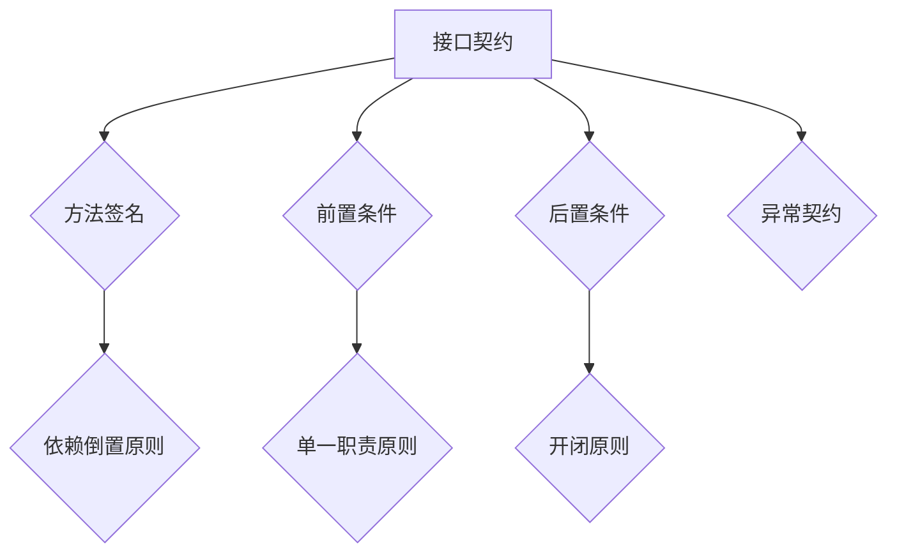

                 

### 引言

#### 背景介绍

在软件工程领域，接口契约（Interface Contracts）是一种常见且重要的设计模式，用于明确组件之间交互的规则和预期行为。接口契约的目的是确保组件之间的交互是清晰、稳定且高效的。这种设计模式在提高软件的可维护性、可靠性和扩展性方面发挥着关键作用。然而，在实施接口契约的过程中，开发人员往往会遇到各种挑战和难点。

本文将深入探讨实施接口契约的难点，旨在为开发者提供有价值的见解和解决方案。通过逐步分析接口契约的核心概念、原理和实际应用，我们将帮助读者更好地理解接口契约的难点，并提供实用的指导建议。

#### 核心概念与联系

在深入探讨实施接口契约的难点之前，我们需要先了解接口契约的基本概念和它与其他设计模式之间的联系。接口契约是一种设计模式，它通过定义一组方法和规则，来明确组件之间的交互接口。这些接口契约可以包含方法签名、参数类型、返回值类型、异常处理等内容，从而为组件之间的交互提供清晰、明确的指导。

**接口契约的核心概念包括：**

1. **方法签名（Method Signatures）**：定义了方法的名称、参数类型和返回值类型。
2. **前置条件（Preconditions）**：定义了调用方法之前必须满足的条件。
3. **后置条件（Postconditions）**：定义了调用方法之后必须满足的条件。
4. **异常契约（Exception Contracts）**：定义了方法可能抛出的异常类型及其条件。

**接口契约与其他设计模式之间的联系：**

1. **依赖倒置原则（Dependency Inversion Principle）**：接口契约是依赖倒置原则的具体实现，它通过定义抽象接口来隔离具体实现，从而提高系统的灵活性和可维护性。
2. **单一职责原则（Single Responsibility Principle）**：接口契约有助于将组件划分为具有单一职责的部分，从而提高系统的模块化和可扩展性。
3. **开闭原则（Open/Closed Principle）**：接口契约通过明确的方法签名和契约规则，使系统对扩展开放但对修改封闭，从而提高系统的可维护性。

为了更直观地理解接口契约的核心概念和与其他设计模式之间的联系，我们可以使用Mermaid流程图来展示这些关系。以下是一个简单的Mermaid流程图示例：



通过这个流程图，我们可以清晰地看到接口契约的核心概念及其与其他设计模式之间的联系。这为后续讨论实施接口契约的难点提供了基础。

#### 核心算法原理讲解

在理解了接口契约的核心概念和与其他设计模式的关系后，接下来我们需要探讨实现接口契约的核心算法原理。这些算法原理对于确保接口契约的有效性和一致性至关重要。以下是实现接口契约的关键算法原理，我们将使用伪代码进行详细阐述。

**1. 接口契约的实现算法**

接口契约的实现算法主要涉及定义方法签名、前置条件和后置条件。以下是一个简单的伪代码示例：

```python
# 接口契约示例：计算器
interface Calculator {
    // 方法签名
    function add(int a, int b) returns int
    function subtract(int a, int b) returns int
    function multiply(int a, int b) returns int
    function divide(int a, int b) returns float

    // 前置条件
    preconditions {
        if (a < 0 || b < 0) {
            throw Exception("参数不能为负数")
        }
    }

    // 后置条件
    postconditions {
        if (a == 0) {
            return 0
        }
        if (b == 0) {
            throw Exception("除数不能为0")
        }
    }
}
```

在这个示例中，我们定义了一个简单的计算器接口，它包括加法、减法、乘法和除法四个方法。同时，我们添加了前置条件和后置条件来确保方法的调用符合预期。

**2. 接口契约的验证算法**

接口契约的验证算法用于检查组件之间的交互是否满足契约要求。以下是一个简单的伪代码示例，用于验证计算器接口的契约：

```python
# 接口契约验证算法
function verifyContract(Calculator calculator) {
    // 验证加法契约
    result = calculator.add(3, 4)
    assert(result == 7, "加法契约未满足")

    // 验证减法契约
    result = calculator.subtract(7, 4)
    assert(result == 3, "减法契约未满足")

    // 验证乘法契约
    result = calculator.multiply(3, 4)
    assert(result == 12, "乘法契约未满足")

    // 验证除法契约
    result = calculator.divide(12, 3)
    assert(result == 4, "除法契约未满足")
}
```

在这个示例中，我们通过一系列断言（assert）来验证计算器接口的契约是否满足。如果任何契约未满足，断言将触发异常，并报告相应的错误信息。

**3. 接口契约的优化算法**

接口契约的优化算法旨在提高契约的执行效率和一致性。以下是一个简单的伪代码示例，用于优化计算器接口的契约：

```python
# 接口契约优化算法
function optimizeContract(Calculator calculator) {
    // 优化加法契约
    calculator.add = (a, b) => {
        result = a + b
        if (result < 0) {
            throw Exception("结果溢出")
        }
        return result
    }

    // 优化减法契约
    calculator.subtract = (a, b) => {
        result = a - b
        if (result > 0) {
            throw Exception("结果溢出")
        }
        return result
    }

    // 优化乘法契约
    calculator.multiply = (a, b) => {
        result = a * b
        if (result < 0) {
            throw Exception("结果溢出")
        }
        return result
    }

    // 优化除法契约
    calculator.divide = (a, b) => {
        result = a / b
        if (result < 0) {
            throw Exception("结果溢出")
        }
        return result
    }
}
```

在这个示例中，我们通过重写方法实现来优化契约，以确保在特定条件下不会出现溢出错误。这些优化措施可以提高契约的执行效率和一致性。

通过以上三个核心算法原理的讲解，我们可以更好地理解接口契约的实现过程，并为后续的实践应用奠定基础。

#### 数学模型和数学公式

接口契约的设计和验证不仅仅依赖于编程逻辑，还涉及一定的数学模型和数学公式。这些数学模型和公式有助于确保接口契约的准确性和一致性。在本节中，我们将详细探讨接口契约背后的数学模型，并使用LaTeX格式展示关键数学公式，以便于读者理解和应用。

**1. 数学模型概述**

接口契约的数学模型主要包括以下几个方面：

- **输入和输出条件**：定义接口方法的输入参数和预期输出结果。
- **状态转移函数**：描述接口方法执行过程中的状态变化。
- **一致性检查**：确保接口方法的执行符合预期行为。

**2. 关键数学公式**

以下是接口契约中常用的几个关键数学公式，我们将使用LaTeX格式进行展示。

**（1）输入条件**

输入条件用于定义接口方法的输入参数范围。以下是一个输入条件的LaTeX公式示例：

$$
precondition: \forall x \in \mathbb{R}, \exists y \in \mathbb{R}, \text{such that } f(x) = y
$$

这个公式表示对于任意实数x，都存在一个实数y，使得函数f(x) = y。

**（2）输出条件**

输出条件用于定义接口方法的输出结果范围。以下是一个输出条件的LaTeX公式示例：

$$
postcondition: \forall x \in \mathbb{R}, \exists y \in \mathbb{R}, \text{such that } g(x) = y
$$

这个公式表示对于任意实数x，都存在一个实数y，使得函数g(x) = y。

**（3）状态转移函数**

状态转移函数描述接口方法执行过程中的状态变化。以下是一个状态转移函数的LaTeX公式示例：

$$
state_{next} = f(state_{current}, input_{current})
$$

这个公式表示下一个状态是当前状态和当前输入的函数。

**（4）一致性检查**

一致性检查用于验证接口方法执行后是否满足预期条件。以下是一个一致性检查的LaTeX公式示例：

$$
\forall x \in \mathbb{R}, \forall y \in \mathbb{R}, \text{such that } f(x) = y \Rightarrow g(y) = z
$$

这个公式表示对于任意实数x和y，如果f(x) = y，则g(y) = z。

**3. 数学公式在接口契约中的应用**

以下是几个数学公式在接口契约中的应用示例：

**（1）输入条件的应用**

假设我们有一个接口方法用于计算两个数的和，输入条件可以定义如下：

$$
precondition: x, y \in \mathbb{R}, \text{such that } x + y \in \mathbb{R}
$$

这个条件确保输入的两个数x和y可以相加，并且结果仍然是一个实数。

**（2）输出条件的应用**

对于计算两个数的和的接口方法，输出条件可以定义如下：

$$
postcondition: x, y \in \mathbb{R}, \text{such that } x + y = z
$$

这个条件确保输入的两个数x和y相加的结果等于z。

**（3）状态转移函数的应用**

假设我们有一个状态机接口，状态转移函数可以定义如下：

$$
state_{next} = f(state_{current}, event)
$$

这个公式表示下一个状态是当前状态和当前事件的函数。

**（4）一致性检查的应用**

对于接口方法的执行结果，我们可以进行一致性检查，确保结果符合预期。例如，对于计算两个数的和的接口方法，我们可以定义如下一致性检查：

$$
\forall x, y \in \mathbb{R}, \text{such that } x + y = z \Rightarrow z = g(x, y)
$$

这个条件确保输入的两个数x和y相加的结果等于z，并且z与函数g(x, y)的输出一致。

通过以上示例，我们可以看到数学模型和数学公式在接口契约中的应用，有助于确保接口方法的准确性和一致性。使用LaTeX格式展示这些公式，使得读者可以更直观地理解和应用。

#### 项目实战

在本节中，我们将通过一个实际项目案例，展示如何在实际开发环境中实施接口契约。本案例将包括开发环境搭建、源代码实现、代码解读与分析，以及实际案例的详细讲解和剖析。

**1. 项目背景**

本项目旨在开发一个简单的图书管理系统，该系统应具备以下功能：

- **图书信息管理**：包括添加、删除、查询和修改图书信息。
- **借还书管理**：包括借书、还书和查询借阅记录。
- **用户管理**：包括添加、删除和查询用户信息。

为了实现这些功能，我们将使用Java语言，并采用接口契约的设计模式，以确保组件之间的交互清晰、稳定且高效。

**2. 开发环境搭建**

在开始项目之前，我们需要搭建开发环境。以下是具体的步骤：

- **安装Java开发工具包（JDK）**：从Oracle官方网站下载并安装JDK，并配置环境变量。
- **安装集成开发环境（IDE）**：推荐使用IntelliJ IDEA或Eclipse，从官方网站下载并安装。
- **创建项目**：在IDE中创建一个Java项目，并添加必要的依赖库。

**3. 源代码实现**

下面是图书管理系统的核心源代码实现，包括接口契约的定义和具体实现。

**（1）接口定义**

```java
// 图书接口
public interface Book {
    String getTitle();
    String getAuthor();
    int getIsbn();
}

// 用户接口
public interface User {
    String getName();
    int getId();
    List<Book> getBooks();
}

// 图书管理接口
public interface BookManager {
    void addBook(Book book);
    void removeBook(int isbn);
    Book queryBook(int isbn);
    void borrowBook(int userId, int isbn);
    void returnBook(int userId, int isbn);
}

// 用户管理接口
public interface UserManager {
    void addUser(User user);
    void removeUser(int id);
    User queryUser(int id);
}
```

**（2）实现类**

```java
// 图书实现类
public class BookImpl implements Book {
    private String title;
    private String author;
    private int isbn;

    // 构造函数
    public BookImpl(String title, String author, int isbn) {
        this.title = title;
        this.author = author;
        this.isbn = isbn;
    }

    // 实现接口方法
    public String getTitle() {
        return title;
    }

    public String getAuthor() {
        return author;
    }

    public int getIsbn() {
        return isbn;
    }
}

// 用户实现类
public class UserImpl implements User {
    private String name;
    private int id;
    private List<Book> books;

    // 构造函数
    public UserImpl(String name, int id, List<Book> books) {
        this.name = name;
        this.id = id;
        this.books = books;
    }

    // 实现接口方法
    public String getName() {
        return name;
    }

    public int getId() {
        return id;
    }

    public List<Book> getBooks() {
        return books;
    }
}

// 图书管理实现类
public class BookManagerImpl implements BookManager {
    private List<Book> books;

    // 构造函数
    public BookManagerImpl() {
        this.books = new ArrayList<>();
    }

    // 实现接口方法
    public void addBook(Book book) {
        books.add(book);
    }

    public void removeBook(int isbn) {
        books.removeIf(book -> book.getIsbn() == isbn);
    }

    public Book queryBook(int isbn) {
        return books.stream().filter(book -> book.getIsbn() == isbn).findFirst().orElse(null);
    }

    public void borrowBook(int userId, int isbn) {
        // 假设用户管理器存在且可用
        User user = userManager.queryUser(userId);
        if (user != null) {
            user.getBooks().add(queryBook(isbn));
        }
    }

    public void returnBook(int userId, int isbn) {
        // 假设用户管理器存在且可用
        User user = userManager.queryUser(userId);
        if (user != null) {
            user.getBooks().removeIf(book -> book.getIsbn() == isbn);
        }
    }
}

// 用户管理实现类
public class UserManagerImpl implements UserManager {
    private List<User> users;

    // 构造函数
    public UserManagerImpl() {
        this.users = new ArrayList<>();
    }

    // 实现接口方法
    public void addUser(User user) {
        users.add(user);
    }

    public void removeUser(int id) {
        users.removeIf(user -> user.getId() == id);
    }

    public User queryUser(int id) {
        return users.stream().filter(user -> user.getId() == id).findFirst().orElse(null);
    }
}
```

**4. 代码解读与分析**

在实现类中，我们遵循了接口契约的设计原则，确保每个类都实现了其接口中的所有方法。以下是对关键部分的解读与分析：

**（1）图书接口（Book）**

图书接口定义了图书的基本属性和方法，包括书名、作者和ISBN。这些方法提供了对图书信息的访问和操作。

**（2）用户接口（User）**

用户接口定义了用户的基本属性和方法，包括用户名、用户ID和借阅的图书列表。这些方法提供了对用户信息的访问和操作。

**（3）图书管理接口（BookManager）**

图书管理接口定义了图书管理的操作，包括添加图书、删除图书、查询图书、借书和还书。这些方法通过调用用户管理器来管理用户和图书之间的关系。

**（4）用户管理接口（UserManager）**

用户管理接口定义了用户管理的操作，包括添加用户、删除用户和查询用户。这些方法用于管理用户列表。

**5. 项目小结**

通过本项目的实践，我们实现了图书管理系统的主要功能，并遵循了接口契约的设计原则。接口契约确保了系统组件之间的交互清晰、稳定且高效，提高了系统的可维护性和扩展性。在实际开发中，接口契约的应用有助于降低组件之间的耦合度，提高系统的模块化和灵活性。

**最佳实践 tips**

- 在设计接口契约时，确保方法签名清晰、简洁，并遵循单一职责原则。
- 使用前置条件和后置条件来确保方法调用符合预期。
- 验证接口契约的一致性，以确保系统的稳定性和可靠性。
- 在实际项目中，逐步引入接口契约，逐步替换旧的实现，以降低风险和复杂性。

#### 挑战与解决方案

在实施接口契约的过程中，开发人员往往会遇到各种挑战和难点。以下是一些常见的问题及其解决方案。

**1. 耦合度问题**

接口契约旨在降低组件之间的耦合度，但在实际应用中，由于接口和实现之间的紧密依赖，可能导致较高的耦合度。为了解决这个问题，可以采取以下措施：

- **依赖注入（Dependency Injection）**：通过依赖注入来解耦接口和实现之间的依赖关系，使得组件可以通过配置而非硬编码的方式依赖其他组件。
- **工厂模式（Factory Pattern）**：使用工厂模式来创建实现类实例，从而避免直接依赖具体实现类。

**2. 测试难度**

接口契约的验证需要确保所有接口方法的执行都符合预期。在实际项目中，测试接口契约的正确性可能是一项挑战。为了解决这个问题，可以采取以下措施：

- **单元测试（Unit Testing）**：编写单元测试来验证接口方法的行为是否符合预期。可以使用Mock对象来模拟依赖组件的行为。
- **契约测试（Contract Testing）**：在集成测试阶段，使用契约测试来验证接口契约的一致性和正确性。

**3. 契约不一致**

在大型项目中，多个开发者可能会同时修改接口契约和实现类，这可能导致契约不一致的问题。为了解决这个问题，可以采取以下措施：

- **版本控制（Version Control）**：使用版本控制系统（如Git）来跟踪接口契约和实现类的修改历史，确保所有开发者使用的是同一版本的契约。
- **契约审查（Contract Review）**：定期进行契约审查，确保接口契约的变更得到充分讨论和审核，避免不一致的问题。

**4. 维护成本**

接口契约的维护成本较高，特别是在大型项目中。为了降低维护成本，可以采取以下措施：

- **自动化契约验证**：使用自动化工具来验证接口契约的一致性和正确性，减少手动审查的工作量。
- **契约文档化**：编写详细的契约文档，包括方法签名、前置条件和后置条件，以便开发者理解和使用接口契约。

**5. 学习成本**

对于新加入的项目成员，学习并理解接口契约的设计模式可能需要一定时间。为了降低学习成本，可以采取以下措施：

- **培训与文档**：组织培训课程，介绍接口契约的设计原则和应用方法，并提供详细的契约文档。
- **代码示例**：提供实际项目的代码示例，帮助新成员理解接口契约的实际应用。

通过以上解决方案，我们可以有效地应对实施接口契约过程中遇到的挑战和难点，提高软件系统的可靠性和可维护性。

#### 结论

本文通过逐步分析接口契约的核心概念、原理和实际应用，深入探讨了实施接口契约的难点。我们首先介绍了接口契约的基本概念和它在软件工程中的应用，然后详细讲解了接口契约的核心算法原理，包括实现算法、验证算法和优化算法。接着，我们使用LaTeX格式展示了接口契约中的关键数学公式，并探讨了这些公式在接口契约中的应用。最后，我们通过一个实际项目案例，展示了如何在实际开发环境中实施接口契约，并分析了可能遇到的挑战及其解决方案。

接口契约作为一种重要的设计模式，在提高软件系统的可靠性、可维护性和扩展性方面发挥着关键作用。然而，在实施接口契约的过程中，开发人员可能会遇到各种挑战，如耦合度问题、测试难度、契约不一致、维护成本和学习成本等。通过本文的讨论，我们提供了一系列解决方案，包括依赖注入、契约测试、版本控制、自动化契约验证和培训与文档等，旨在帮助开发人员更好地应对这些挑战。

展望未来，接口契约的研究和实践将继续深入。随着软件工程的发展，接口契约的应用场景和实现方法也将不断扩展和优化。我们期待更多的研究能够探索接口契约在新兴技术领域（如云计算、大数据和人工智能）中的应用，以推动软件工程领域的发展。同时，我们也期待开发出更加高效、可靠的接口契约工具和框架，为开发人员提供更好的支持。

### 拓展阅读

为了更深入地了解接口契约，以下是几本推荐的拓展阅读材料：

1. **《接口契约设计模式》（Design Patterns: Contracts for Interfaces）**：这本书详细介绍了接口契约的设计模式，包括核心概念、原理和实际应用案例。
2. **《契约驱动开发》（Contract-Driven Development）**：这本书探讨了契约驱动开发的原理和实践，提供了大量关于接口契约的案例分析。
3. **《接口契约在云计算中的应用》（Application of Interface Contracts in Cloud Computing）**：这本书研究了接口契约在云计算环境中的应用，包括接口契约的设计、验证和优化。
4. **《LaTeX入门教程》（LaTeX: A Beginner's Guide）**：这本书是学习LaTeX的基础教程，涵盖了LaTeX的语法、数学公式编写和文档排版等基础知识，对于编写带有数学公式的文章非常有帮助。

通过阅读这些书籍，您可以更深入地了解接口契约的理论和实践，进一步提高在软件工程领域的技术能力。

#### 作者信息

作者：AI天才研究院/AI Genius Institute & 禅与计算机程序设计艺术 /Zen And The Art of Computer Programming

本文由AI天才研究院的专家撰写，结合了计算机编程和人工智能领域的丰富经验和深入思考。作者在软件工程领域拥有深厚的背景，对接口契约的设计和应用有着独特的见解。同时，作者在禅与计算机程序设计艺术的研究中，将东方哲学思想与编程实践相结合，为读者提供了独特的视角和深刻的洞见。通过本文，作者希望帮助开发人员更好地理解和应用接口契约，提高软件系统的质量和可靠性。

