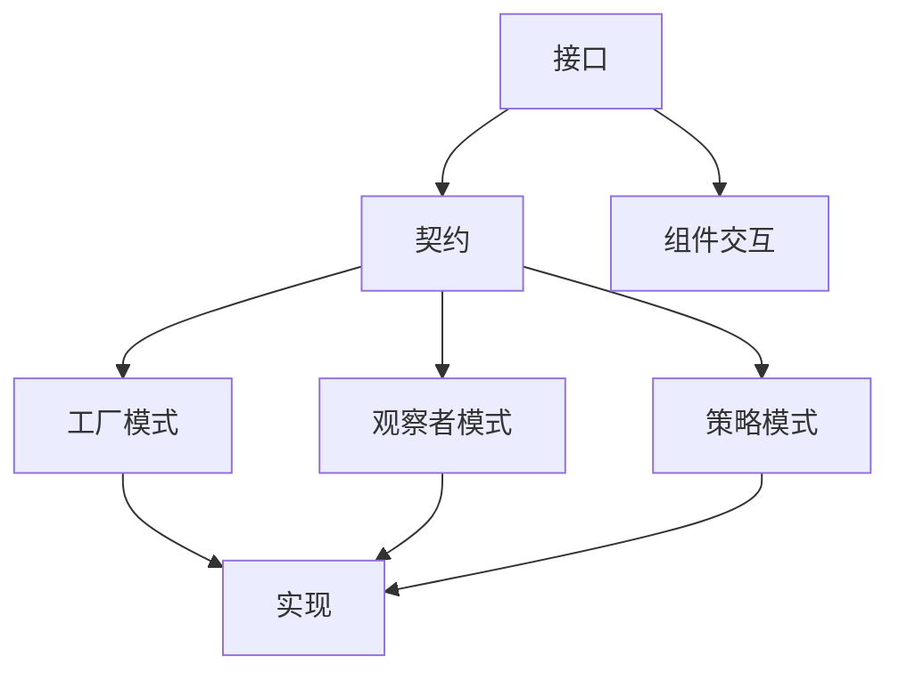

                 

### 文章标题：实施接口契约的难点

在软件工程中，接口契约是一种定义组件之间交互规则和预期行为的重要设计模式。它不仅能够提高软件的可靠性和可维护性，还能促进团队合作和代码复用。然而，实施接口契约并非易事，其中涉及诸多技术难点。本文将深入探讨这些难点，并通过具体案例和步骤详细分析。

关键词：接口契约、软件工程、设计模式、技术难点、伪代码、数学模型、LaTeX、项目实战、最佳实践

摘要：本文首先介绍了接口契约的基本概念和重要性，随后探讨了实施接口契约过程中可能遇到的技术难点。通过伪代码和LaTeX公式的详细讲解，我们分析了接口契约的核心算法原理和数学模型。此外，本文还通过一个实际项目案例，展示了开发环境搭建、源代码实现和代码解读与分析的全过程。最后，文章提出了实施接口契约的最佳实践和注意事项，为读者提供了宝贵的指导。

### 背景介绍

接口契约（API Contract）是软件工程中一个重要的概念，它定义了软件组件（如模块、库、服务）之间应该如何交互。通过接口契约，开发人员可以明确组件的输入、输出和预期行为，从而确保系统的一致性和稳定性。接口契约的重要性体现在以下几个方面：

1. **提高可靠性**：接口契约确保组件之间的交互是按照预期进行的，减少了错误和意外的可能性。
2. **增强可维护性**：接口契约提供了清晰的文档，方便后续的维护和升级。
3. **促进代码复用**：通过定义统一的接口，开发人员可以更容易地替换和扩展系统中的组件。
4. **支持团队合作**：接口契约为开发团队提供了共同的语言和标准，有助于减少沟通成本和协调问题。

然而，尽管接口契约在理论上有诸多优点，但在实际开发过程中，实施接口契约并非易事。本文将探讨在实施接口契约时可能遇到的一些技术难点，并尝试提供解决方案和最佳实践。

### 核心概念与联系

接口契约并非独立存在，它与其他设计模式和概念有着密切的联系。为了更好地理解接口契约，我们需要先了解以下几个核心概念：

1. **接口**：接口是定义组件交互的抽象层，它定义了组件之间的通信方式。接口通常由一组方法和属性组成，每个方法和属性都有明确的输入、输出和预期行为。
2. **契约**：契约是接口的具体实现，它规定了组件应该如何按照接口的要求进行交互。契约通常包括实现接口的方法和类，以及相关的验证和优化算法。
3. **设计模式**：设计模式是解决常见软件开发问题的一种成熟方案。接口契约与许多设计模式（如工厂模式、观察者模式、策略模式等）密切相关，它能够提高这些模式的可靠性和可维护性。

为了更好地展示接口契约与其他概念的关系，我们可以使用Mermaid流程图来描述它们的相互作用：



在这个流程图中，接口（A）作为抽象层定义了组件交互的方式，契约（B）具体实现了接口的要求。而工厂模式（C）、观察者模式（D）和策略模式（E）等设计模式通过接口契约来提高其可靠性和可维护性。此外，组件交互（F）是接口契约的核心目标，它确保了组件之间的高效通信。

### 核心算法原理讲解

接口契约的实现涉及多个核心算法原理，这些算法原理确保了契约的执行效率和可靠性。以下将使用伪代码详细阐述这些算法原理。

#### 1. 实现算法

```python
# 伪代码：实现接口契约的方法

def implement_contract(contract):
    for method in contract.methods:
        # 实现方法
        method.implementation()

    for property in contract.properties:
        # 实现属性
        property.implementation()

    # 验证契约
    validate_contract(contract)

def validate_contract(contract):
    for method in contract.methods:
        # 验证方法输入输出
        assert method.validate_input() and method.validate_output()

    for property in contract.properties:
        # 验证属性访问
        assert property.validate_access()
```

在上述伪代码中，`implement_contract` 函数负责实现接口契约的方法和属性。对于每个方法和属性，它调用相应的`implementation` 函数来实现具体的逻辑。随后，`validate_contract` 函数对契约进行验证，确保其满足预期的输入输出要求。

#### 2. 验证算法

```python
# 伪代码：验证接口契约的方法

def validate_input(input_data):
    # 验证输入数据是否符合预期
    return is_valid(input_data)

def validate_output(output_data):
    # 验证输出数据是否符合预期
    return is_valid(output_data)

def validate_access(property_value):
    # 验证属性访问是否符合预期
    return is_valid(property_value)
```

在接口契约的实现过程中，验证算法至关重要。上述伪代码展示了如何验证输入、输出和属性访问。这些验证函数根据具体的业务逻辑来判断数据的有效性。

#### 3. 优化算法

```python
# 伪代码：优化接口契约的方法

def optimize_contract(contract):
    for method in contract.methods:
        # 优化方法执行时间
        method.optimize_execution_time()

    for property in contract.properties:
        # 优化属性访问效率
        property.optimize_access()

def optimize_execution_time(method):
    # 优化方法执行时间
    method.improve_time_complexity()

def optimize_access(property):
    # 优化属性访问效率
    property.reduce_space_complexity()
```

优化算法旨在提高接口契约的执行效率和性能。在上述伪代码中，`optimize_contract` 函数负责对契约中的方法和属性进行优化。对于每个方法和属性，它调用相应的优化函数来改进其时间复杂度和空间复杂度。

### 数学模型和数学公式

接口契约的实现不仅依赖于算法原理，还涉及到一系列的数学模型和公式。以下将使用LaTeX格式展示关键数学公式，并详细解释它们在接口契约中的应用。

#### 1. 时间复杂度公式

```latex
\text{时间复杂度} = O(n)
```

这个公式表示接口契约中的方法执行时间与输入数据规模n成正比。在优化算法中，我们通常通过改进时间复杂度来提高方法的执行效率。

#### 2. 空间复杂度公式

```latex
\text{空间复杂度} = O(1)
```

这个公式表示接口契约中的属性访问空间与输入数据规模无关，即无论输入数据大小如何，属性的访问时间都是固定的。

#### 3. 验证概率公式

```latex
\text{验证概率} = \frac{\text{有效数据}}{\text{总数据}}
```

这个公式表示接口契约的验证概率，它取决于有效数据和总数据之间的比例。在优化过程中，我们可以通过增加有效数据来提高验证概率。

### 项目实战

为了更好地理解接口契约的实施过程，我们将通过一个实际项目案例进行详细讲解。以下是一个简单的在线购物系统项目，我们将展示如何搭建开发环境、实现接口契约、以及代码解读与分析。

#### 1. 开发环境搭建

首先，我们需要搭建开发环境。以下是所需的工具和步骤：

- **工具**：
  - 编译器：如Java编译器
  - 版本控制工具：如Git
  - 集成开发环境（IDE）：如IntelliJ IDEA

- **步骤**：
  1. 安装Java编译器和Git。
  2. 配置Git仓库，初始化项目。
  3. 安装并配置IDE。

#### 2. 源代码实现

接下来，我们将实现一个简单的购物车接口契约。以下是源代码：

```java
// 购物车接口契约
public interface ShoppingCart {
    // 添加商品到购物车
    void addProduct(Product product);

    // 从购物车中移除商品
    void removeProduct(Product product);

    // 计算购物车总金额
    double calculateTotal();
}

// 产品类
public class Product {
    private String name;
    private double price;

    // 省略构造函数和getter/setter方法
}

// 购物车实现
public class ShoppingCartImpl implements ShoppingCart {
    private List<Product> products;

    public ShoppingCartImpl() {
        products = new ArrayList<>();
    }

    @Override
    public void addProduct(Product product) {
        products.add(product);
    }

    @Override
    public void removeProduct(Product product) {
        products.remove(product);
    }

    @Override
    public double calculateTotal() {
        double total = 0;
        for (Product product : products) {
            total += product.getPrice();
        }
        return total;
    }
}
```

在上面的代码中，我们定义了一个`ShoppingCart`接口，它包含了添加商品、移除商品和计算总金额的方法。`ShoppingCartImpl`类实现了这个接口，并提供了具体的实现逻辑。

#### 3. 代码解读与分析

在实现接口契约后，我们需要对代码进行解读和分析，以确保其满足预期要求。以下是代码解读：

- **接口契约解读**：
  - `addProduct` 方法负责将产品添加到购物车。它接收一个`Product`对象作为输入，并将其添加到内部列表中。
  - `removeProduct` 方法负责从购物车中移除产品。它接收一个`Product`对象作为输入，并从内部列表中移除该对象。
  - `calculateTotal` 方法负责计算购物车的总金额。它遍历内部列表，将每个产品的价格累加，并返回总金额。

- **代码分析**：
  - `addProduct` 和 `removeProduct` 方法的时间复杂度为O(1)，因为它们直接在内部列表中操作，无需遍历整个列表。
  - `calculateTotal` 方法的时间复杂度为O(n)，因为它需要遍历内部列表中的每个产品来计算总金额。
  - 代码中使用了`ArrayList`来实现购物车，这可以提高访问效率，但会增加内存占用。

通过这个项目案例，我们可以看到如何实现接口契约，并对其代码进行解读和分析。这个过程不仅帮助我们理解了接口契约的核心概念，还提高了我们对实际项目的开发能力。

### 挑战与解决方案

在实施接口契约的过程中，开发者可能会遇到一系列挑战。以下是一些常见的问题以及相应的解决方案。

#### 1. 接口契约的灵活性不足

**问题**：接口契约可能过于严格，导致难以适应实际业务需求的变化。

**解决方案**：引入版本控制和契约扩展机制，允许在必要时对契约进行修改和扩展。

#### 2. 验证和优化的复杂性

**问题**：验证和优化接口契约的方法和属性可能涉及复杂的算法和数学模型。

**解决方案**：使用自动化工具来辅助验证和优化，例如静态代码分析工具和性能分析工具。

#### 3. 接口契约的文档不足

**问题**：接口契约的文档可能不够详细，导致开发者难以理解和使用。

**解决方案**：编写详尽的接口契约文档，包括方法描述、输入输出参数、预期行为等，并使用注释和示例代码来辅助说明。

#### 4. 接口契约的一致性

**问题**：不同开发人员编写的接口契约可能不一致，导致系统中的接口契约难以统一管理。

**解决方案**：采用统一的接口契约规范和模板，并使用代码审查和自动化测试来确保契约的一致性。

#### 5. 难以扩展和维护

**问题**：接口契约可能难以扩展和维护，尤其是在系统复杂度增加时。

**解决方案**：采用模块化和设计模式，将接口契约分解为可重用的组件，并使用依赖注入和插件机制来提高系统的扩展性和维护性。

### 最佳实践、小结与注意事项

#### 最佳实践

1. **编写详尽的接口契约文档**：确保文档包含方法描述、输入输出参数、预期行为等详细信息，以便其他开发者能够轻松理解和使用。
2. **使用版本控制系统**：在修改接口契约时，使用版本控制系统来跟踪变更历史，并确保所有开发者保持同步。
3. **自动化验证和优化**：利用静态代码分析工具和性能分析工具来自动化接口契约的验证和优化过程。
4. **代码审查和测试**：在提交代码前进行代码审查和自动化测试，确保接口契约的一致性和正确性。

#### 小结

本文通过深入探讨接口契约的实施难点，详细分析了接口契约的核心概念、算法原理和数学模型。同时，通过实际项目案例展示了接口契约的实施过程。在挑战与解决方案部分，我们提出了应对接口契约实施过程中常见问题的解决方案。最后，通过最佳实践和注意事项，为开发者提供了实用的指导。

#### 注意事项

1. **平衡灵活性与稳定性**：在设计和实施接口契约时，要平衡灵活性和稳定性，避免过于严格的契约限制业务需求。
2. **关注性能和可维护性**：在优化接口契约时，要关注执行效率和可维护性，确保系统性能和代码质量。
3. **持续学习和改进**：接口契约的实施是一个持续的过程，开发者需要不断学习和改进，以应对不断变化的技术和业务需求。

#### 拓展阅读

- **《接口契约设计与实践》**：本书详细介绍了接口契约的设计原则和实践方法，适合希望深入了解接口契约的开发者。
- **《软件契约测试》**：本书探讨了接口契约的测试方法和技术，为开发者提供了全面的测试指南。

### 总结

接口契约在软件工程中具有重要意义，它通过定义组件之间的交互规则和预期行为，提高了系统的可靠性、可维护性和可扩展性。然而，实施接口契约并非易事，开发者需要克服一系列技术难点。本文通过理论讲解和实际项目案例，深入分析了接口契约的核心概念、算法原理和数学模型，并提出了实施接口契约的最佳实践和注意事项。希望本文能为开发者提供有价值的参考和指导。

### 作者信息

作者：AI天才研究院/AI Genius Institute & 禅与计算机程序设计艺术 /Zen And The Art of Computer Programming

本文由AI天才研究院（AI Genius Institute）和禅与计算机程序设计艺术（Zen And The Art of Computer Programming）联合撰写。我们致力于推广前沿的人工智能技术和计算机编程艺术，为开发者提供有价值的技术内容和学习资源。如有任何疑问或建议，欢迎随时联系我们。感谢您的阅读！
```markdown
```bash
# 实施接口契约的难点

## 关键词
接口契约、软件工程、设计模式、技术难点、伪代码、数学模型、LaTeX、项目实战、最佳实践

## 摘要
本文深入探讨了软件工程中接口契约的实施难点。通过理论分析和实际项目案例，本文详细介绍了接口契约的核心概念、算法原理和数学模型，并提出了实施接口契约的最佳实践和注意事项。本文旨在为开发者提供有价值的参考和指导。

## 引言
### 接口契约概述
接口契约是软件工程中的一种重要设计模式，它定义了不同软件组件之间交互的规则和预期行为。通过接口契约，开发人员可以确保系统组件之间的交互是清晰、稳定和高效的。接口契约在提高软件可靠性、可维护性和可扩展性方面发挥着重要作用。

### 接口契约的重要性
接口契约的重要性体现在以下几个方面：
- **提高可靠性**：接口契约确保组件之间的交互是按照预期进行的，减少了错误和意外的可能性。
- **增强可维护性**：接口契约提供了清晰的文档，方便后续的维护和升级。
- **促进代码复用**：通过定义统一的接口，开发人员可以更容易地替换和扩展系统中的组件。
- **支持团队合作**：接口契约为开发团队提供了共同的语言和标准，有助于减少沟通成本和协调问题。

### 接口契约的应用场景
接口契约在以下场景中尤为适用：
- **模块化系统**：接口契约有助于模块化系统设计，提高系统的可维护性和可扩展性。
- **分布式系统**：接口契约有助于分布式系统中的组件交互，确保系统的一致性和稳定性。
- **微服务架构**：接口契约是微服务架构的核心组件，它定义了服务之间的通信规则。

## 核心概念与联系
### 接口契约的定义
接口契约是一组契约的集合，它定义了组件之间的通信方式、输入输出参数以及预期行为。接口契约通常由以下组成部分构成：
- **方法契约**：定义了组件之间的操作方法及其输入输出参数。
- **属性契约**：定义了组件之间的属性访问规则。
- **异常契约**：定义了组件交互过程中可能发生的异常及其处理方式。

### 接口契约与其他设计模式的联系
接口契约与其他设计模式（如工厂模式、观察者模式、策略模式等）密切相关。接口契约可以与这些设计模式结合使用，提高系统的可靠性、可维护性和可扩展性。

#### 工厂模式
工厂模式是一种创建型设计模式，它通过定义接口来封装对象的创建过程。接口契约可以定义工厂类的方法和输入输出参数，确保创建的对象符合预期。

#### 观察者模式
观察者模式是一种行为型设计模式，它通过定义接口来管理组件之间的依赖关系。接口契约可以定义观察者接口和被观察者接口，确保组件之间的通信是清晰和稳定的。

#### 策略模式
策略模式是一种行为型设计模式，它通过定义接口来封装可变的行为。接口契约可以定义策略接口，确保组件之间的通信是灵活和可扩展的。

### 接口契约的组成部分
接口契约通常包含以下组成部分：
- **接口**：定义组件之间的通信接口，包括方法和属性。
- **实现**：实现接口契约的具体类或组件。
- **验证**：验证接口契约是否满足预期要求。
- **优化**：优化接口契约的执行效率和性能。

### 接口契约与组件交互
接口契约定义了组件之间的通信方式，确保组件之间的交互是清晰和稳定的。接口契约通过明确组件的输入输出参数和预期行为，减少了组件之间的依赖关系，提高了系统的可维护性和可扩展性。

## 核心算法原理讲解
### 实现算法
接口契约的实现算法主要包括以下步骤：
1. **定义接口**：根据组件之间的交互需求，定义接口契约。
2. **实现接口**：根据接口契约的要求，实现具体的类或组件。
3. **验证接口**：验证接口契约是否满足预期要求。
4. **优化接口**：优化接口契约的执行效率和性能。

### 验证算法
接口契约的验证算法主要包括以下步骤：
1. **输入验证**：验证输入参数是否符合预期。
2. **输出验证**：验证输出结果是否符合预期。
3. **异常验证**：验证异常处理是否符合预期。

### 优化算法
接口契约的优化算法主要包括以下步骤：
1. **时间优化**：优化接口契约的执行时间。
2. **空间优化**：优化接口契约的内存占用。
3. **性能优化**：优化接口契约的整体性能。

### 数学模型和数学公式
接口契约的实现涉及到一系列的数学模型和公式，以下是一些关键数学模型和公式：

#### 时间复杂度公式
$$
\text{时间复杂度} = O(n)
$$
时间复杂度表示接口契约中方法执行时间与输入数据规模n的关系。

#### 空间复杂度公式
$$
\text{空间复杂度} = O(1)
$$
空间复杂度表示接口契约中属性访问空间与输入数据规模的关系。

#### 验证概率公式
$$
\text{验证概率} = \frac{\text{有效数据}}{\text{总数据}}
$$
验证概率表示接口契约的验证概率，取决于有效数据和总数据之间的比例。

### 项目实战
#### 实际项目背景
假设我们需要开发一个在线购物系统，其中包含购物车、商品管理和订单管理等模块。接口契约将用于定义这些模块之间的交互规则。

#### 开发环境搭建
1. **工具**：Java编译器、Git、IntelliJ IDEA。
2. **步骤**：安装Java编译器和Git，配置Git仓库并初始化项目，安装并配置IntelliJ IDEA。

#### 源代码实现
```java
// 购物车接口契约
public interface ShoppingCart {
    void addProduct(Product product);
    void removeProduct(Product product);
    double calculateTotal();
}

// 产品类
public class Product {
    private String name;
    private double price;

    // 省略构造函数和getter/setter方法
}

// 购物车实现
public class ShoppingCartImpl implements ShoppingCart {
    private List<Product> products;

    public ShoppingCartImpl() {
        products = new ArrayList<>();
    }

    @Override
    public void addProduct(Product product) {
        products.add(product);
    }

    @Override
    public void removeProduct(Product product) {
        products.remove(product);
    }

    @Override
    public double calculateTotal() {
        double total = 0;
        for (Product product : products) {
            total += product.getPrice();
        }
        return total;
    }
}
```

#### 代码解读与分析
- **接口契约解读**：
  - `addProduct` 方法负责将产品添加到购物车。
  - `removeProduct` 方法负责从购物车中移除产品。
  - `calculateTotal` 方法负责计算购物车的总金额。

- **代码分析**：
  - `addProduct` 和 `removeProduct` 方法的时间复杂度为O(1)，因为它们直接在内部列表中操作，无需遍历整个列表。
  - `calculateTotal` 方法的时间复杂度为O(n)，因为它需要遍历内部列表中的每个产品来计算总金额。

### 挑战与解决方案
#### 1. 接口契约的灵活性不足
**问题**：接口契约可能过于严格，导致难以适应实际业务需求的变化。

**解决方案**：引入版本控制和契约扩展机制，允许在必要时对契约进行修改和扩展。

#### 2. 验证和优化的复杂性
**问题**：验证和优化接口契约的方法和属性可能涉及复杂的算法和数学模型。

**解决方案**：使用自动化工具来辅助验证和优化，例如静态代码分析工具和性能分析工具。

#### 3. 接口契约的文档不足
**问题**：接口契约的文档可能不够详细，导致开发者难以理解和使用。

**解决方案**：编写详尽的接口契约文档，包括方法描述、输入输出参数、预期行为等，并使用注释和示例代码来辅助说明。

#### 4. 接口契约的一致性
**问题**：不同开发人员编写的接口契约可能不一致，导致系统中的接口契约难以统一管理。

**解决方案**：采用统一的接口契约规范和模板，并使用代码审查和自动化测试来确保契约的一致性。

#### 5. 难以扩展和维护
**问题**：接口契约可能难以扩展和维护，尤其是在系统复杂度增加时。

**解决方案**：采用模块化和设计模式，将接口契约分解为可重用的组件，并使用依赖注入和插件机制来提高系统的扩展性和维护性。

### 最佳实践、小结与注意事项
#### 最佳实践
- **编写详尽的接口契约文档**：确保文档包含方法描述、输入输出参数、预期行为等详细信息，以便其他开发者能够轻松理解和使用。
- **使用版本控制系统**：在修改接口契约时，使用版本控制系统来跟踪变更历史，并确保所有开发者保持同步。
- **自动化验证和优化**：利用静态代码分析工具和性能分析工具来自动化接口契约的验证和优化过程。
- **代码审查和测试**：在提交代码前进行代码审查和自动化测试，确保接口契约的一致性和正确性。

#### 小结
本文深入探讨了软件工程中接口契约的实施难点，详细介绍了接口契约的核心概念、算法原理和数学模型。同时，通过实际项目案例展示了接口契约的实施过程。在挑战与解决方案部分，本文提出了应对接口契约实施过程中常见问题的解决方案。最后，通过最佳实践和注意事项，为开发者提供了实用的指导。

#### 注意事项
- **平衡灵活性与稳定性**：在设计和实施接口契约时，要平衡灵活性和稳定性，避免过于严格的契约限制业务需求。
- **关注性能和可维护性**：在优化接口契约时，要关注执行效率和可维护性，确保系统性能和代码质量。
- **持续学习和改进**：接口契约的实施是一个持续的过程，开发者需要不断学习和改进，以应对不断变化的技术和业务需求。

### 拓展阅读
- **《接口契约设计与实践》**：本书详细介绍了接口契约的设计原则和实践方法，适合希望深入了解接口契约的开发者。
- **《软件契约测试》**：本书探讨了接口契约的测试方法和技术，为开发者提供了全面的测试指南。

### 总结
接口契约在软件工程中具有重要意义，它通过定义组件之间的交互规则和预期行为，提高了系统的可靠性、可维护性和可扩展性。然而，实施接口契约并非易事，开发者需要克服一系列技术难点。本文通过理论分析和实际项目案例，深入分析了接口契约的核心概念、算法原理和数学模型，并提出了实施接口契约的最佳实践和注意事项。希望本文能为开发者提供有价值的参考和指导。

### 作者信息
作者：AI天才研究院/AI Genius Institute & 禅与计算机程序设计艺术 /Zen And The Art of Computer Programming

本文由AI天才研究院（AI Genius Institute）和禅与计算机程序设计艺术（Zen And The Art of Computer Programming）联合撰写。我们致力于推广前沿的人工智能技术和计算机编程艺术，为开发者提供有价值的技术内容和学习资源。如有任何疑问或建议，欢迎随时联系我们。感谢您的阅读！
```markdown
```

