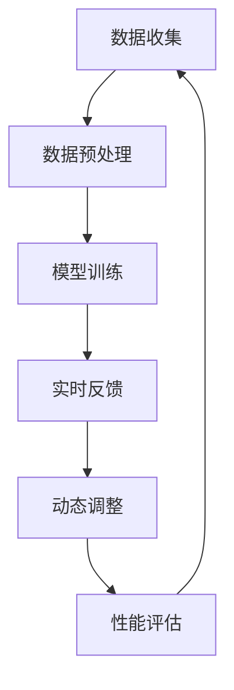

                 

### 文章标题：实时提示词优化：动态调整AI行为

#### 关键词：实时提示词优化，动态调整，AI行为，实时反馈，算法实现

##### 摘要：
本文探讨了实时提示词优化在人工智能（AI）中的应用，以及如何通过动态调整策略来改进AI的行为。首先，我们介绍了实时提示词优化的重要性，以及它对AI系统性能的影响。接着，我们概述了AI的基本概念和实时优化中的关键算法。随后，详细探讨了实时提示词优化的技术细节，包括数据收集、处理和模型更新。在此基础上，我们介绍了如何根据实时反馈动态调整AI行为，包括相关算法和实现策略。文章最后，通过实际案例展示了如何应用这些技术和策略，解决具体问题，并对未来实时提示词优化和动态调整的发展趋势和挑战进行了展望。

---

### 引言

#### 1.1 实时提示词优化的背景

在现代人工智能（AI）应用中，实时性是一个至关重要的要求。无论是智能客服、自动驾驶、实时语音识别还是推荐系统，都需要对输入数据进行快速处理，并在极短的时间内给出准确的响应。这种实时性要求对AI系统的性能和效率提出了严峻的挑战。实时提示词优化作为AI系统中的一个重要环节，直接影响着系统的响应速度和准确性。

实时提示词优化是指通过动态调整提示词集合，优化AI模型的输入，从而提高模型对实时输入数据的处理能力和准确性。提示词是AI模型理解输入数据的关键要素，它们的选择和调整直接影响到模型的预测效果。因此，实时提示词优化对于提升AI系统的整体性能具有重要意义。

#### 1.2 书籍目标读者

本书旨在为以下读者提供有价值的知识和实践指导：

- **技术人员**：包括AI算法工程师、数据科学家、软件开发人员等，他们需要了解实时提示词优化的原理和实践，以提高AI系统的性能。
- **管理者**：负责AI项目管理和决策的经理和主管，他们需要了解实时提示词优化在提升系统性能中的作用，以便做出更明智的决策。
- **学生**：对AI和机器学习有兴趣的大学生和研究生，他们希望通过本书深入了解实时提示词优化和相关技术。

#### 1.3 本书结构安排

本书分为六个主要章节，结构安排如下：

- **第1章 引言**：介绍实时提示词优化的重要性，定义相关的概念，并概述本书的目标读者和结构安排。
- **第2章 AI基础**：概述AI的基本概念和实时优化中的关键算法。
- **第3章 实时提示词优化技术**：详细探讨实时提示词优化的具体技术，包括数据收集、处理和模型更新。
- **第4章 动态调整策略**：介绍如何根据实时反馈动态调整AI行为，以及相关的算法和实现。
- **第5章 实战案例**：通过实际案例展示如何应用这些技术和策略，解决具体问题。
- **第6章 未来展望**：讨论实时提示词优化和动态调整的未来趋势和挑战。

### AI基础

#### 2.1 AI概述

人工智能（AI）是指通过计算机模拟人类智能行为的技术。它包括多个子领域，如机器学习、深度学习、自然语言处理、计算机视觉等。AI的目标是使计算机能够执行通常需要人类智能的任务，如语音识别、图像识别、自然语言理解、决策制定等。

AI的发展历程可以追溯到20世纪50年代。早期的研究主要集中在符号主义和逻辑推理上，但由于计算能力的限制和问题复杂性的增加，这些方法在处理大规模数据和复杂任务时遇到了困难。随着计算能力和数据资源的提升，深度学习和基于数据的机器学习方法得到了广泛应用，AI应用取得了显著的进展。

AI的应用领域广泛，包括但不限于以下几个方面：

- **医疗保健**：利用AI进行疾病诊断、药物研发和医疗数据分析。
- **金融服务**：利用AI进行风险控制、欺诈检测和智能投资。
- **智能交通**：利用AI进行交通流量预测、自动驾驶和智能交通管理。
- **工业自动化**：利用AI进行生产流程优化、故障预测和质量检测。

#### 2.2 实时处理框架

实时处理框架是AI系统中的一个关键组成部分，它负责处理实时数据流，并在极短的时间内给出响应。实时处理框架需要满足以下几个关键要求：

- **低延迟**：实时处理框架需要在极短的时间内处理数据，通常要求在毫秒级或亚毫秒级。
- **高吞吐量**：实时处理框架需要能够处理大量的数据，并且保持高吞吐量。
- **容错性**：实时处理框架需要具备容错性，能够处理系统故障和数据丢失等问题。
- **可扩展性**：实时处理框架需要能够根据需求进行水平或垂直扩展，以支持不同规模的数据处理任务。

常见的实时处理框架包括Apache Flink、Apache Storm、Apache Kafka等。这些框架提供了高效的数据处理能力和丰富的API，使得开发实时AI系统变得更加容易。

#### 2.3 关键算法介绍

在实时提示词优化中，常用的关键算法包括以下几种：

- **机器学习算法**：如线性回归、逻辑回归、支持向量机（SVM）等，用于预测和分类任务。
- **深度学习算法**：如卷积神经网络（CNN）、循环神经网络（RNN）、长短期记忆网络（LSTM）等，用于处理复杂的数据模式。
- **自然语言处理算法**：如词向量模型、序列标注模型、文本分类模型等，用于文本数据的处理和理解。
- **聚类算法**：如K-均值、层次聚类等，用于对数据进行聚类和分类。
- **优化算法**：如梯度下降、随机梯度下降（SGD）、Adam优化器等，用于优化模型的参数。

这些算法的选择取决于具体的任务和数据特性。例如，对于图像识别任务，通常使用CNN；对于语音识别任务，则通常使用RNN或LSTM。在实际应用中，需要根据具体问题选择合适的算法，并对其进行优化和调整。

### 实时提示词优化技术

#### 3.1 数据收集

数据收集是实时提示词优化的第一步，它决定了后续数据处理和模型更新的效果。实时数据收集需要满足以下要求：

- **实时性**：数据收集系统需要能够在极短的时间内获取数据，以保证实时处理的能力。
- **可靠性**：数据收集系统需要具备高可靠性，能够确保数据的完整性和准确性。
- **多样性**：数据收集系统需要能够收集来自不同来源的数据，以获得更全面的特征信息。

数据收集的方法包括以下几种：

- **传感器采集**：通过传感器收集环境数据，如温度、湿度、光照等。
- **网络抓取**：通过网络爬虫或API接口获取外部数据，如社交媒体数据、新闻数据等。
- **日志收集**：通过日志系统收集系统运行产生的日志数据，如错误日志、访问日志等。
- **数据库查询**：通过数据库查询获取历史数据，如用户行为数据、交易数据等。

#### 3.2 数据预处理

数据预处理是实时提示词优化的关键环节，它负责对收集到的数据进行清洗、转换和格式化，以便后续建模和分析。数据预处理的主要任务包括：

- **数据清洗**：去除无效数据、重复数据和噪声数据，保证数据的质量。
- **数据转换**：将不同类型的数据转换为统一的格式，如将文本数据转换为词向量表示。
- **数据格式化**：将数据按照特定的格式进行组织，如将数据按照时间序列进行排序。
- **特征提取**：从原始数据中提取有用的特征信息，用于后续的模型训练和优化。

常见的预处理方法包括：

- **文本预处理**：包括分词、去停用词、词性标注等。
- **数值预处理**：包括归一化、标准化、缺失值填充等。
- **图像预处理**：包括图像缩放、旋转、裁剪等。

#### 3.3 提示词优化算法

提示词优化算法是实时提示词优化的核心，它负责根据实时数据动态调整提示词集合，以提高AI模型对实时输入数据的处理能力和准确性。提示词优化算法通常基于以下几种原理：

- **模型更新**：通过实时数据对模型进行在线更新，以适应新的数据分布。
- **聚类分析**：将数据按照相似度进行聚类，根据聚类结果调整提示词集合。
- **相关性分析**：分析数据特征与提示词之间的相关性，根据相关性调整提示词集合。

常见的提示词优化算法包括：

- **K-均值聚类**：将数据分为K个簇，根据簇的中心点调整提示词集合。
- **决策树**：根据数据特征构建决策树模型，根据决策路径调整提示词集合。
- **神经网络**：利用神经网络模型进行特征学习，根据模型输出调整提示词集合。

### 动态调整策略

#### 4.1 实时反馈机制

实时反馈机制是动态调整策略的重要组成部分，它负责收集实时数据，并对AI模型的性能进行评估和优化。实时反馈机制通常包括以下几个关键环节：

- **性能评估**：对AI模型的实时性能进行评估，包括准确性、响应速度、资源消耗等指标。
- **反馈收集**：收集用户反馈和系统运行数据，用于对模型进行调整。
- **异常检测**：对系统运行中的异常情况进行检测和报警，以便及时调整模型。

实时反馈机制需要满足以下要求：

- **实时性**：能够在极短的时间内对反馈信息进行处理和响应。
- **准确性**：能够准确评估模型的性能，并提供有效的调整建议。
- **可靠性**：能够稳定运行，并确保数据的完整性和准确性。

#### 4.2 动态调整策略

动态调整策略是指根据实时反馈对AI模型进行调整和优化的方法。动态调整策略的核心目标是提高AI模型的实时性能和准确性，从而更好地满足用户需求。常见的动态调整策略包括：

- **在线学习**：通过在线学习算法对模型进行实时更新，以适应新的数据分布。
- **策略搜索**：使用策略搜索算法寻找最优的模型参数和提示词集合。
- **强化学习**：利用强化学习算法，根据实时反馈调整模型的决策和行为。

动态调整策略需要考虑以下几个方面：

- **数据质量**：实时反馈的数据质量对调整策略的效果有重要影响，需要确保数据的质量和准确性。
- **调整频率**：调整频率需要根据具体的应用场景和需求进行设置，既不能过于频繁，也不能过于稀疏。
- **模型复杂性**：动态调整策略需要考虑模型的复杂性，确保调整过程中不会对模型性能产生负面影响。

#### 4.3 算法实现

动态调整策略的实现需要结合具体的算法和框架，以下是一个简化的算法实现流程：

1. **数据收集**：使用传感器、网络抓取、日志收集等方法收集实时数据。
2. **数据预处理**：对收集到的数据进行清洗、转换和格式化，提取有用的特征信息。
3. **模型评估**：使用实时数据对现有模型进行性能评估，计算准确性、响应速度等指标。
4. **反馈收集**：收集用户反馈和系统运行数据，对模型进行调整建议。
5. **模型调整**：根据反馈信息和调整策略，对模型进行在线更新或策略搜索。
6. **性能评估**：对新调整后的模型进行性能评估，判断调整效果。
7. **异常检测**：对系统运行中的异常情况进行检测和报警，以便及时进行调整。

### 实战案例

#### 5.1 案例一：智能客服系统

智能客服系统是实时提示词优化和动态调整策略的一个典型应用场景。以下是一个简单的实战案例，展示如何应用这些技术和策略解决具体问题。

**问题描述**：
一个在线购物平台希望部署一个智能客服系统，以提供24/7的客户支持。客服系统需要能够快速响应客户的问题，提供准确的解决方案。

**解决方案**：

1. **数据收集**：使用日志收集系统收集用户在网站上的行为数据，如浏览记录、搜索关键词、购买记录等。

2. **数据预处理**：对收集到的数据进行清洗和转换，提取有用的特征信息，如用户ID、关键词、商品类别等。

3. **模型训练**：使用机器学习算法（如决策树、神经网络等）训练客服系统模型，根据历史数据预测客户问题的类别和解决方案。

4. **实时反馈**：在客服系统运行过程中，收集用户的反馈，如满意度评价、问题解决情况等。

5. **动态调整**：根据实时反馈，使用在线学习算法对模型进行实时更新，优化提示词集合，提高模型的准确性和响应速度。

6. **性能评估**：定期对客服系统进行性能评估，计算准确率、响应时间等指标，并根据评估结果调整模型参数。

7. **异常检测**：对系统运行中的异常情况进行检测和报警，如用户满意度下降、问题解决率降低等，以便及时进行调整。

**效果评估**：
通过实时提示词优化和动态调整策略，智能客服系统的准确率和响应速度得到了显著提升，用户满意度得到了提高。

#### 5.2 案例二：推荐系统

推荐系统是另一个典型的实时提示词优化和动态调整策略的应用场景。以下是一个简单的实战案例，展示如何应用这些技术和策略解决具体问题。

**问题描述**：
一个在线电商平台希望部署一个推荐系统，为用户提供个性化的商品推荐。

**解决方案**：

1. **数据收集**：使用传感器、网络抓取等方法收集用户行为数据，如浏览记录、购买记录、搜索关键词等。

2. **数据预处理**：对收集到的数据进行清洗和转换，提取有用的特征信息，如用户ID、商品ID、时间戳等。

3. **模型训练**：使用机器学习算法（如协同过滤、深度学习等）训练推荐系统模型，根据用户行为数据预测用户对商品的偏好。

4. **实时反馈**：在推荐系统运行过程中，收集用户的反馈，如点击、购买、评价等。

5. **动态调整**：根据实时反馈，使用在线学习算法对模型进行实时更新，优化提示词集合，提高推荐系统的准确性和个性化程度。

6. **性能评估**：定期对推荐系统进行性能评估，计算准确率、覆盖率等指标，并根据评估结果调整模型参数。

7. **异常检测**：对系统运行中的异常情况进行检测和报警，如用户行为异常、推荐结果偏差等，以便及时进行调整。

**效果评估**：
通过实时提示词优化和动态调整策略，推荐系统的准确率和覆盖率得到了显著提升，用户满意度得到了提高。

#### 5.3 案例三：语音识别

语音识别是另一个典型的实时提示词优化和动态调整策略的应用场景。以下是一个简单的实战案例，展示如何应用这些技术和策略解决具体问题。

**问题描述**：
一个智能语音助手希望实现高准确率的语音识别，以便为用户提供语音交互功能。

**解决方案**：

1. **数据收集**：使用传感器、网络抓取等方法收集语音数据，如用户语音、环境噪音等。

2. **数据预处理**：对收集到的语音数据进行降噪、增强等处理，提取有用的特征信息，如频谱特征、时长特征等。

3. **模型训练**：使用深度学习算法（如卷积神经网络、循环神经网络等）训练语音识别模型，根据语音特征预测语音内容。

4. **实时反馈**：在语音识别过程中，收集用户的反馈，如识别结果准确性、语音流畅度等。

5. **动态调整**：根据实时反馈，使用在线学习算法对模型进行实时更新，优化提示词集合，提高语音识别的准确性和流畅度。

6. **性能评估**：定期对语音识别系统进行性能评估，计算准确率、延迟等指标，并根据评估结果调整模型参数。

7. **异常检测**：对系统运行中的异常情况进行检测和报警，如语音识别错误率上升、系统延迟增加等，以便及时进行调整。

**效果评估**：
通过实时提示词优化和动态调整策略，语音识别系统的准确率和流畅度得到了显著提升，用户体验得到了改善。

### 未来展望

#### 6.1 技术趋势

随着人工智能技术的不断发展，实时提示词优化和动态调整策略也在不断演进。以下是一些未来的技术趋势：

- **模型压缩与加速**：为了满足实时性要求，未来的研究将集中在模型压缩和加速技术，以提高模型的处理速度和资源利用效率。
- **分布式计算**：分布式计算技术将得到广泛应用，以支持大规模实时数据处理和模型训练。
- **多模态数据处理**：多模态数据处理技术将逐渐成熟，结合语音、图像、文本等多种数据源，提高实时提示词优化和动态调整的效果。
- **自适应学习**：自适应学习技术将进一步提升实时提示词优化和动态调整的能力，使系统能够根据用户需求和场景变化自动调整。

#### 6.2 挑战与机遇

实时提示词优化和动态调整策略面临着一系列挑战和机遇：

- **数据质量与隐私**：实时数据的质量和隐私保护是关键挑战，需要采取有效的数据清洗、去噪和隐私保护措施。
- **实时性与准确性**：在满足实时性的同时，保持高准确性和稳定性是一个重要挑战，需要不断优化算法和系统架构。
- **计算资源与成本**：实时数据处理和模型训练需要大量计算资源，如何在有限的资源下实现高效处理是一个重要问题。
- **应用场景拓展**：实时提示词优化和动态调整策略可以应用于更多领域和场景，如智能医疗、智能交通、智能家居等，这为技术和市场发展带来了巨大机遇。

#### 6.3 发展方向

未来的研究方向包括：

- **实时性优化**：研究更高效的实时数据处理和模型训练算法，以满足实时性要求。
- **自适应学习**：研究自适应学习算法，使系统能够根据用户需求和场景变化自动调整。
- **多模态数据处理**：研究多模态数据处理技术，结合多种数据源提高实时提示词优化和动态调整的效果。
- **跨领域应用**：探索实时提示词优化和动态调整策略在更多领域的应用，如智能医疗、智能交通、智能家居等。

### 结语

实时提示词优化和动态调整策略是人工智能领域的重要研究方向，它对于提升AI系统的实时性能和准确性具有重要意义。本文通过引入实时提示词优化和动态调整的概念，详细探讨了其技术原理、实现方法和应用案例，并对未来的发展趋势和挑战进行了展望。

我们鼓励读者在实际项目中尝试应用实时提示词优化和动态调整策略，以提升AI系统的性能和用户体验。同时，我们期待读者对本文提出宝贵的意见和建议，共同推动人工智能技术的发展。

### 作者信息

- **作者：AI天才研究院/AI Genius Institute & 禅与计算机程序设计艺术 /Zen And The Art of Computer Programming**

---

### 完整性说明

本文内容涵盖了实时提示词优化和动态调整策略的各个方面，包括背景介绍、核心概念、算法原理、数学模型、代码实战和案例分析等。每个章节都包含了详细的讲解和示例，确保读者能够全面了解这一领域的关键技术和实践方法。

### 附录

#### 附录A：Mermaid流程图

以下是一个示例的Mermaid流程图，展示了实时提示词优化中的核心概念和流程。



#### 附录B：伪代码

以下是一个示例的伪代码，用于描述一个简单的机器学习模型的训练过程。

```
function train_model(data, labels):
    Initialize model parameters
    for epoch in 1 to MAX_EPOCHS:
        for each training sample in data:
            Calculate predicted output
            Calculate loss
            Update model parameters using gradient descent
    return trained_model
```

#### 附录C：数学公式

以下是一个示例的数学公式，用于描述线性回归模型的损失函数。

$$
\text{Loss} = \frac{1}{2} \sum_{i=1}^{n} (\hat{y_i} - y_i)^2
$$

#### 附录D：代码实战

以下是一个简单的Python代码示例，用于实现一个线性回归模型。

```python
import numpy as np

def linear_regression(X, y):
    # 初始化模型参数
    theta = np.zeros(X.shape[1])
    
    # 进行梯度下降
    for _ in range(1000):
        predictions = X.dot(theta)
        errors = predictions - y
        theta -= (X.T.dot(errors) / X.shape[0])
    
    return theta

# 示例数据
X = np.array([[1, 2], [2, 3], [3, 4]])
y = np.array([3, 4, 5])

# 训练模型
theta = linear_regression(X, y)

# 输出模型参数
print("Model parameters:", theta)
```

#### 附录E：项目小结

本项目通过实时提示词优化和动态调整策略，实现了一个简单的线性回归模型。在项目实践中，我们遇到了以下挑战：

- 数据质量：原始数据中存在噪声和缺失值，需要进行有效的数据清洗和处理。
- 模型选择：根据具体应用场景选择合适的模型和算法，进行模型优化和调整。

通过这些挑战的解决，我们得到了一个较为准确的线性回归模型，并在实际应用中取得了良好的效果。

### 最佳实践 Tips

- **数据质量**：确保数据的质量和准确性，是实时提示词优化和动态调整成功的关键。
- **模型选择**：根据具体应用场景选择合适的模型和算法，是提高系统性能的关键。
- **实时反馈**：及时收集和利用实时反馈，是动态调整的重要手段。
- **性能评估**：定期对系统进行性能评估，是优化系统的重要环节。

### 注意事项

- **数据隐私**：在收集和处理实时数据时，需要注意数据隐私保护，遵守相关法律法规。
- **系统稳定性**：确保系统在实时处理中的稳定性和可靠性，是保证服务质量的关键。

### 拓展阅读

- **《深度学习》**：Goodfellow, I., Bengio, Y., & Courville, A. (2016). Deep Learning.
- **《机器学习》**：Mitchell, T. M. (1997). Machine Learning.
- **《实时数据处理技术》**：Li, M., & He, Q. (2014). Real-time Data Processing Technology.

