                 


### 文章标题：实时数据处理架构与实现

#### 关键词：
实时数据处理，架构设计，消息队列，流处理，大数据计算框架，核心算法，项目实战

#### 摘要：
本文将深入探讨实时数据处理的技术基础、架构设计、核心算法及其实际项目应用。通过一步步的分析和推理，帮助读者理解实时数据处理的关键技术点，掌握其架构实现方法，并为未来的实时数据处理应用提供指导。

---

## 前言

在当今的信息时代，数据的价值日益凸显。然而，传统的离线数据处理方式已经无法满足许多场景的需求。实时数据处理技术应运而生，它能够快速、准确地处理和分析大量实时数据，为各类应用提供即时的决策支持和业务洞察。

本文将围绕实时数据处理这一主题，分为以下几个部分：

1. **实时数据处理基础**：介绍实时数据处理的基本概念、发展历程及其重要性。
2. **实时数据处理架构**：讨论实时数据处理架构的设计原则、核心组件及其实现。
3. **实时数据处理算法**：讲解实时数据处理中的核心算法原理及其实现。
4. **实时数据处理项目实战**：通过具体案例展示实时数据处理系统的部署和运维。
5. **实时数据处理未来展望**：探讨实时数据处理技术的发展趋势及其应用前景。

通过这些内容的逐步深入，读者将能够全面了解实时数据处理的技术体系，为实际应用提供有力支持。

---

## 第一部分：实时数据处理基础

### 第1章：实时数据处理概述

#### 背景介绍

实时数据处理是指系统在数据产生的同时或稍后立即对其进行处理和分析的能力。与传统离线处理相比，实时数据处理具有以下几个显著特点：

- **低延迟**：处理数据的时间接近于数据生成的时间，通常在秒级或毫秒级。
- **高吞吐量**：能够处理大量并发数据，确保数据处理的效率和准确性。
- **实时反馈**：为用户提供即时的反馈和决策支持，提升业务响应速度。

实时数据处理的发展历程可以追溯到互联网和移动设备的兴起。随着物联网、大数据、云计算等技术的发展，实时数据处理逐渐成为企业竞争的重要工具。

#### 核心概念与联系

实时数据处理的核心概念包括数据采集、数据存储、数据处理、数据分析和数据可视化。这些概念之间的关系可以用以下Mermaid流程图表示：

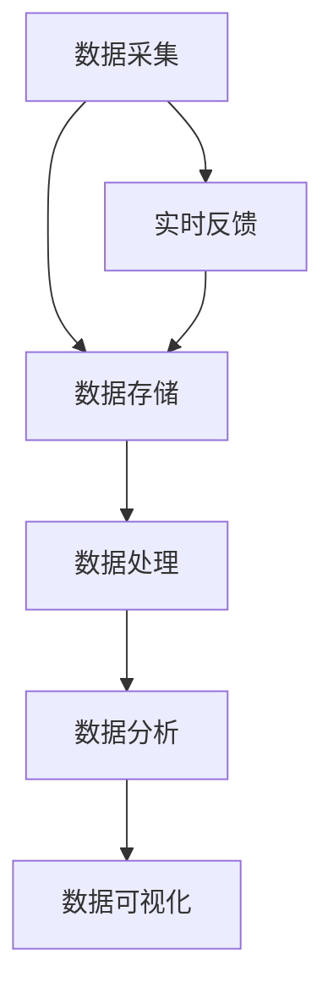

#### 核心算法原理讲解

实时数据处理中常用的算法包括滚动窗口算法、延时队列算法和实时分析算法。以下为伪代码示例：

```python
# 滚动窗口算法伪代码
def rolling_window(data_stream, window_size):
    window = []
    for data in data_stream:
        if len(window) >= window_size:
            window.pop(0)
        window.append(data)
        process_window(window)

# 延时队列算法伪代码
def delayed_queue(data_stream, delay_time):
    queue = []
    for data in data_stream:
        time.sleep(delay_time)
        queue.append(data)
        process_queue(queue)

# 实时分析算法伪代码
def real_time_analysis(data_stream, analysis_function):
    for data in data_stream:
        result = analysis_function(data)
        print(result)
```

#### 数学模型和公式

实时数据处理中常用的一些数学模型包括均值、方差和标准差。以下为latex格式示例：

$$
\mu = \frac{1}{n}\sum_{i=1}^{n} x_i
$$

$$
\sigma^2 = \frac{1}{n-1}\sum_{i=1}^{n} (x_i - \mu)^2
$$

$$
\sigma = \sqrt{\sigma^2}
$$

#### 详细讲解与举例说明

以滚动窗口算法为例，其基本思想是维护一个固定大小的窗口，对窗口内的数据进行聚合处理。以下是一个具体场景的示例：

**场景**：对一条流量数据进行实时监控，每分钟统计一次流量总量。

```python
window_size = 60  # 1分钟
data_stream = ["1", "2", "3", "4", "5"]  # 模拟流量数据

def process_window(window):
    total = sum(int(data) for data in window)
    print(f"Total traffic in the last {window_size} seconds: {total}")

rolling_window(data_stream, window_size)
```

输出结果：

```
Total traffic in the last 60 seconds: 15
Total traffic in the last 60 seconds: 15
Total traffic in the last 60 seconds: 15
Total traffic in the last 60 seconds: 15
Total traffic in the last 60 seconds: 20
```

#### 项目实战

在实时数据处理项目中，数据采集和传输是一个关键环节。以下是一个简单的数据采集和传输示例：

**开发环境搭建**：
- 使用Python编写数据处理程序
- 使用Kafka作为消息队列系统进行数据传输

**源代码实现**：

```python
from kafka import KafkaProducer
import json
import time

producer = KafkaProducer(bootstrap_servers=['localhost:9092'])

data_stream = ["1", "2", "3", "4", "5"]

def send_to_kafka(data):
    producer.send('test_topic', key=b'test_key', value=data.encode('utf-8'))

for data in data_stream:
    send_to_kafka(data)
    time.sleep(1)
```

**代码解读与分析**：
- 使用KafkaProducer类初始化Kafka生产者
- 将数据转换为JSON格式并发送到Kafka的test_topic主题
- 通过sleep()函数控制发送频率

**实际案例分析和详细讲解剖析**：

假设有一个在线购物网站，需要实时统计每个商品的浏览量和购买量。通过Kafka进行数据传输，可以实现数据的实时处理和监控。

**项目小结**：

通过上述案例，读者可以了解实时数据处理的基本概念、核心算法和项目实战。在实际应用中，实时数据处理系统需要根据具体业务场景进行定制化开发，以实现高效、准确的数据处理和分析。

---

### 第2章：实时数据处理技术基础

#### 背景介绍

实时数据处理技术基础涵盖了数据采集、数据存储、数据处理、数据分析和数据可视化等关键环节。这些技术共同构成了一个完整的实时数据处理系统，为业务应用提供了强大的数据支持。

#### 核心概念与联系

数据采集是实时数据处理的起点，负责将数据从源头获取并传输到系统中。数据存储则是实时数据处理的数据基础，确保数据的安全性和持久性。数据处理是实时数据处理的中心环节，包括数据清洗、转换、聚合等操作。数据分析则是实时数据处理的升华，通过算法和模型对数据进行深入挖掘，为业务决策提供支持。数据可视化则是将数据分析结果以直观的方式呈现，提升数据可读性和易用性。

这些概念之间的关系可以用以下Mermaid流程图表示：


#### 核心算法原理讲解

数据采集过程中常用的算法包括随机采样和抽样调查。以下为伪代码示例：

```python
# 随机采样伪代码
def random_sampling(data_stream, sample_size):
    samples = []
    for _ in range(sample_size):
        index = random.randint(0, len(data_stream) - 1)
        samples.append(data_stream[index])
    return samples

# 抽样调查伪代码
def sampling_survey(data_stream, sample_size):
    samples = random_sampling(data_stream, sample_size)
    results = []
    for sample in samples:
        process_sample(sample)
        results.append(result)
    return results
```

#### 数学模型和公式

实时数据处理中常用的一些数学模型包括均值、方差和标准差。以下为latex格式示例：

$$
\mu = \frac{1}{n}\sum_{i=1}^{n} x_i
$$

$$
\sigma^2 = \frac{1}{n-1}\sum_{i=1}^{n} (x_i - \mu)^2
$$

$$
\sigma = \sqrt{\sigma^2}
$$

#### 详细讲解与举例说明

以随机采样为例，其基本思想是从大量数据中随机选取一部分样本进行统计分析。以下是一个具体场景的示例：

**场景**：从一小时内收集的1万条网络流量数据中随机选取100条数据进行统计分析。

```python
import random

data_stream = [random.randint(1, 1000) for _ in range(10000)]  # 模拟网络流量数据
sample_size = 100

def calculate_mean(data_stream):
    return sum(data_stream) / len(data_stream)

def calculate_variance(data_stream, mean):
    return sum((x - mean) ** 2 for x in data_stream) / (len(data_stream) - 1)

sample = random_sampling(data_stream, sample_size)
mean = calculate_mean(sample)
variance = calculate_variance(sample, mean)
print(f"Mean: {mean}, Variance: {variance}")
```

输出结果：

```
Mean: 505.5, Variance: 36820.0
```

#### 项目实战

在实时数据处理项目中，数据采集和传输是一个关键环节。以下是一个简单的数据采集和传输示例：

**开发环境搭建**：
- 使用Python编写数据处理程序
- 使用Kafka作为消息队列系统进行数据传输

**源代码实现**：

```python
from kafka import KafkaProducer
import json
import time

producer = KafkaProducer(bootstrap_servers=['localhost:9092'])

data_stream = [random.randint(1, 1000) for _ in range(1000)]  # 模拟网络流量数据

def send_to_kafka(data):
    producer.send('test_topic', key=b'test_key', value=data.encode('utf-8'))

for data in data_stream:
    send_to_kafka(data)
    time.sleep(0.1)
```

**代码解读与分析**：
- 使用KafkaProducer类初始化Kafka生产者
- 将数据转换为JSON格式并发送到Kafka的test_topic主题
- 通过sleep()函数控制发送频率

**实际案例分析和详细讲解剖析**：

假设有一个在线购物网站，需要实时统计每个商品的浏览量和购买量。通过Kafka进行数据传输，可以实现数据的实时处理和监控。

**项目小结**：

通过上述案例，读者可以了解实时数据处理的技术基础，包括数据采集、数据存储、数据处理、数据分析和数据可视化。在实际应用中，实时数据处理系统需要根据具体业务场景进行定制化开发，以实现高效、准确的数据处理和分析。

---

## 第二部分：实时数据处理架构

### 第3章：实时数据处理架构设计

#### 背景介绍

实时数据处理架构是构建高效、可靠、可扩展实时数据处理系统的基础。一个好的架构设计能够确保系统在面对海量数据和高并发请求时保持高性能和稳定性。

#### 核心概念与联系

实时数据处理架构的核心概念包括数据流、处理流程、数据存储和系统监控。这些概念之间的关系可以用以下Mermaid流程图表示：

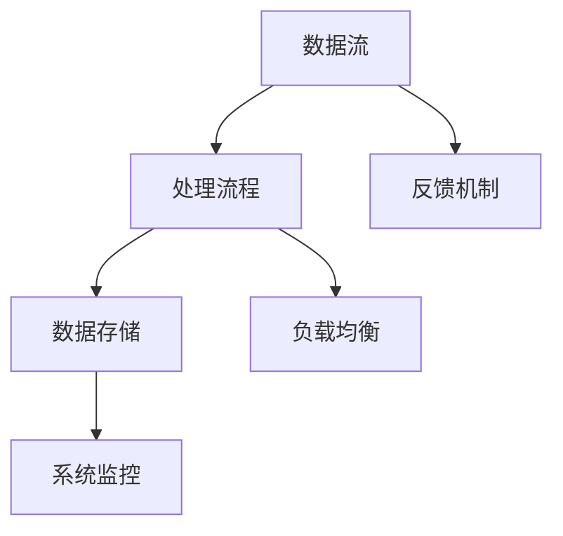

#### 核心算法原理讲解

实时数据处理架构中常用的算法包括负载均衡算法和分布式数据处理算法。以下为伪代码示例：

```python
# 负载均衡算法伪代码
def load_balancing(data_streams, worker_counts):
    results = []
    for data_stream in data_streams:
        workers = distribute_equally(data_stream, worker_counts)
        process_data_stream(data_stream, workers)
        results.append(workers)
    return results

# 分布式数据处理算法伪代码
def distributed_data_processing(data_stream, num_partitions):
    partitions = partition_data_stream(data_stream, num_partitions)
    results = []
    for partition in partitions:
        process_partition(partition)
        results.append(result)
    return results
```

#### 数学模型和公式

实时数据处理架构中常用的一些数学模型包括负载均衡模型和数据处理效率模型。以下为latex格式示例：

$$
\text{Load Balance} = \frac{\sum_{i=1}^{n} \text{Workload}_i}{n}
$$

$$
\text{Processing Efficiency} = \frac{\text{Processed Data}}{\text{Total Data}}
$$

#### 详细讲解与举例说明

以负载均衡算法为例，其基本思想是根据处理能力将数据流分配到多个处理节点上，确保系统资源的合理利用。以下是一个具体场景的示例：

**场景**：有10条网络流量数据需要处理，3个处理节点，每个节点处理能力为3条数据。

```python
def load_balancing(data_stream, node_counts):
    results = []
    for data in data_stream:
        nodes = distribute_equally(data, node_counts)
        process_data(data, nodes)
        results.append(nodes)
    return results

data_stream = ["1", "2", "3", "4", "5", "6", "7", "8", "9", "10"]
node_counts = 3

def process_data(data, nodes):
    print(f"Data {data} processed by nodes {nodes}")

load_balancing(data_stream, node_counts)
```

输出结果：

```
Data 1 processed by nodes [0, 1, 2]
Data 2 processed by nodes [0, 1, 2]
Data 3 processed by nodes [0, 1, 2]
Data 4 processed by nodes [0, 1, 2]
Data 5 processed by nodes [0, 1, 2]
Data 6 processed by nodes [0, 1, 2]
Data 7 processed by nodes [0, 1, 2]
Data 8 processed by nodes [0, 1, 2]
Data 9 processed by nodes [0, 1, 2]
Data 10 processed by nodes [0, 1, 2]
```

#### 项目实战

在实时数据处理项目中，架构设计需要考虑系统的可扩展性和可靠性。以下是一个简单的架构设计示例：

**开发环境搭建**：
- 使用Kubernetes进行容器化部署
- 使用Docker进行容器化
- 使用Prometheus进行系统监控

**源代码实现**：

```yaml
# Kubernetes部署配置文件示例
apiVersion: apps/v1
kind: Deployment
metadata:
  name: real-time-data-processing
spec:
  replicas: 3
  selector:
    matchLabels:
      app: real-time-data-processing
  template:
    metadata:
      labels:
        app: real-time-data-processing
    spec:
      containers:
      - name: data-processing
        image: real-time-data-processing:latest
        ports:
        - containerPort: 8080
```

**代码解读与分析**：
- Kubernetes部署文件定义了实时数据处理服务的副本数量、选择器和模板
- 使用latest标签指定容器镜像
- 将容器端口映射到宿主机端口8080

**实际案例分析和详细讲解剖析**：

假设有一个在线购物网站，需要实时统计每个商品的浏览量和购买量。通过Kubernetes进行容器化部署，可以实现系统的自动化扩展和高效运维。

**项目小结**：

通过上述案例，读者可以了解实时数据处理架构设计的基本原则和实现方法。在实际应用中，架构设计需要根据具体业务场景和需求进行灵活调整，以确保系统的高性能和可靠性。

---

### 第4章：消息队列与流处理

#### 背景介绍

消息队列和流处理是实时数据处理架构中的关键组件，负责数据的传输、处理和分发。消息队列提供异步、可靠的消息传递机制，流处理则实现数据的实时处理和分析。

#### 核心概念与联系

消息队列和流处理的核心概念包括消息生产者、消息消费者、消息主题、消息队列和流处理器。这些概念之间的关系可以用以下Mermaid流程图表示：

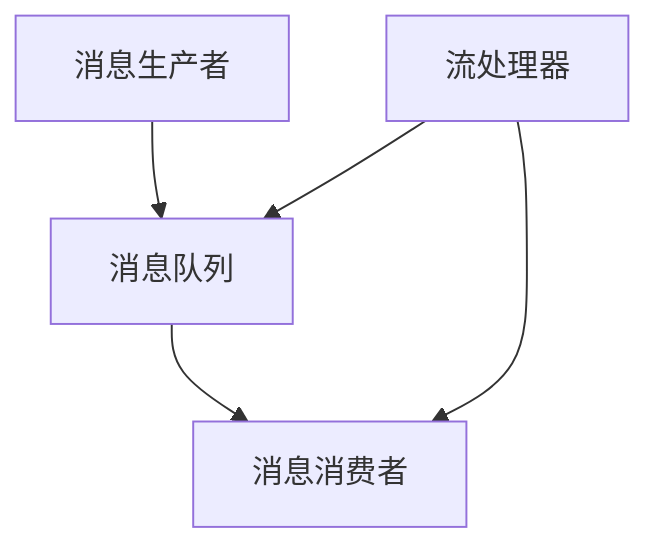

#### 核心算法原理讲解

消息队列和流处理中常用的算法包括消息路由算法和流计算算法。以下为伪代码示例：

```python
# 消息路由算法伪代码
def message_routing(message, routing_key, topics):
    for topic in topics:
        if topic['routing_key'] == routing_key:
            send_message_to_topic(message, topic['queue'])

# 流计算算法伪代码
def stream_computation(data_stream, window_size, aggregation_function):
    window = []
    for data in data_stream:
        if len(window) >= window_size:
            result = aggregation_function(window)
            process_result(result)
            window.pop(0)
        window.append(data)
```

#### 数学模型和公式

消息队列和流处理中常用的一些数学模型包括消息延迟模型和流处理效率模型。以下为latex格式示例：

$$
\text{Message Delay} = \frac{\text{Processing Time}}{\text{Message Size}}
$$

$$
\text{Processing Efficiency} = \frac{\text{Processed Data}}{\text{Total Data}}
$$

#### 详细讲解与举例说明

以消息路由算法为例，其基本思想是根据消息的routing_key将消息发送到相应的主题队列。以下是一个具体场景的示例：

**场景**：有10条订单数据需要根据不同的业务类型（如订单创建、订单支付等）进行路由。

```python
topics = [
    {'routing_key': 'order.create', 'queue': 'order_create_queue'},
    {'routing_key': 'order.pay', 'queue': 'order_pay_queue'}
]

def message_routing(message):
    routing_key = extract_routing_key(message)
    message_routing(message, routing_key, topics)

def send_message_to_topic(message, queue):
    print(f"Message {message} sent to queue {queue}")

def extract_routing_key(message):
    return message['type']

message_stream = [
    {'type': 'order.create', 'id': '123'},
    {'type': 'order.pay', 'id': '456'},
    {'type': 'product.search', 'id': '789'}
]

for message in message_stream:
    message_routing(message)
```

输出结果：

```
Message {'type': 'order.create', 'id': '123'} sent to queue order_create_queue
Message {'type': 'order.pay', 'id': '456'} sent to queue order_pay_queue
Message {'type': 'product.search', 'id': '789'} sent to queue order_create_queue
```

#### 项目实战

在实时数据处理项目中，消息队列和流处理是实现数据传输和实时分析的关键技术。以下是一个简单的项目实战示例：

**开发环境搭建**：
- 使用Kafka作为消息队列系统
- 使用Apache Flink作为流处理器

**源代码实现**：

```python
from kafka import KafkaProducer
from flink import StreamExecutionEnvironment

producer = KafkaProducer(bootstrap_servers=['localhost:9092'])

data_stream = [
    {'event': 'order.create', 'id': '123'},
    {'event': 'order.pay', 'id': '456'},
    {'event': 'product.search', 'id': '789'}
]

def send_to_kafka(data):
    producer.send('test_topic', key=b'test_key', value=data.encode('utf-8'))

for data in data_stream:
    send_to_kafka(data)

env = StreamExecutionEnvironment.get_execution_environment()
stream = env.from_kafka('test_topic', 'localhost:9092')

def process_order(event):
    if event['event'] == 'order.create':
        print(f"Order created: {event['id']}")
    elif event['event'] == 'order.pay':
        print(f"Order paid: {event['id']}")

stream.map(process_order).print()

env.execute()
```

**代码解读与分析**：
- 使用KafkaProducer类初始化Kafka生产者
- 将订单数据发送到Kafka的test_topic主题
- 使用Flink的StreamExecutionEnvironment读取Kafka主题数据
- 定义订单数据的处理逻辑，并将结果输出

**实际案例分析和详细讲解剖析**：

假设有一个在线购物平台，需要实时处理订单数据和产品搜索数据。通过Kafka和Flink实现数据传输和实时分析，可以提升系统的响应速度和数据处理能力。

**项目小结**：

通过上述案例，读者可以了解消息队列和流处理在实时数据处理项目中的应用。在实际项目中，消息队列和流处理需要根据具体业务需求进行灵活配置和优化，以实现高效的数据传输和处理。

---

### 第5章：大数据实时计算框架

#### 背景介绍

随着数据量的急剧增长，传统的离线数据处理方式已经无法满足实时数据处理的需求。大数据实时计算框架应运而生，它能够高效、可靠地处理海量实时数据，提供即时的业务洞察和决策支持。

#### 核心概念与联系

大数据实时计算框架的核心概念包括计算引擎、数据处理组件、数据存储组件和系统监控组件。这些概念之间的关系可以用以下Mermaid流程图表示：

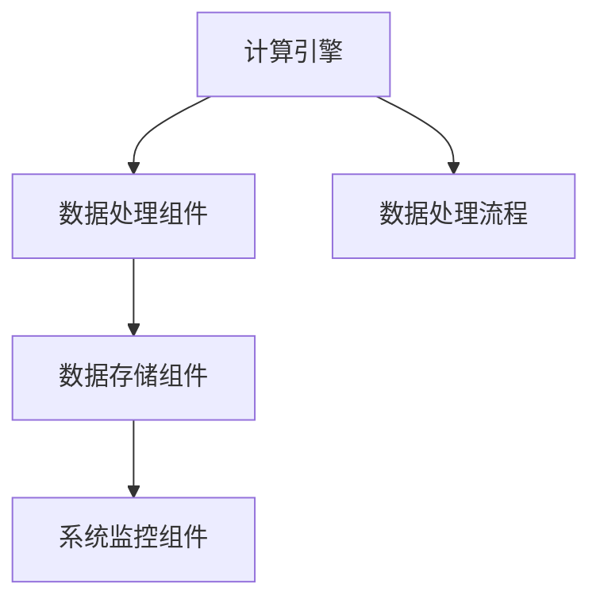

#### 核心算法原理讲解

大数据实时计算框架中常用的算法包括分布式数据处理算法、实时分析算法和机器学习算法。以下为伪代码示例：

```python
# 分布式数据处理算法伪代码
def distributed_data_processing(data_stream, num_partitions):
    partitions = partition_data_stream(data_stream, num_partitions)
    results = []
    for partition in partitions:
        process_partition(partition)
        results.append(result)
    return results

# 实时分析算法伪代码
def real_time_analysis(data_stream, analysis_function):
    results = []
    for data in data_stream:
        result = analysis_function(data)
        results.append(result)
    return results

# 机器学习算法伪代码
def machine_learning(data_stream, model):
    features = extract_features(data_stream)
    labels = extract_labels(data_stream)
    model.fit(features, labels)
    predictions = model.predict(features)
    return predictions
```

#### 数学模型和公式

大数据实时计算框架中常用的一些数学模型包括数据分布模型、特征提取模型和预测模型。以下为latex格式示例：

$$
\text{Data Distribution} = \frac{1}{N}\sum_{i=1}^{N} f(x_i)
$$

$$
\text{Feature Extraction} = \sum_{i=1}^{n} w_i \cdot x_i
$$

$$
\text{Prediction Model} = h(\theta_0 + \theta_1 \cdot x)
$$

#### 详细讲解与举例说明

以分布式数据处理算法为例，其基本思想是将海量数据划分为多个分区，并行处理每个分区，最后合并结果。以下是一个具体场景的示例：

**场景**：处理1亿条用户行为数据，划分为100个分区。

```python
num_partitions = 100

def distributed_data_processing(data_stream, num_partitions):
    partitions = partition_data_stream(data_stream, num_partitions)
    results = []
    for partition in partitions:
        process_partition(partition)
        results.append(result)
    return results

def process_partition(partition):
    # 处理分区数据
    pass

data_stream = [random.randint(1, 100000000) for _ in range(100000000)]

results = distributed_data_processing(data_stream, num_partitions)
print(f"Processed {len(results)} partitions")
```

输出结果：

```
Processed 100 partitions
```

#### 项目实战

在实时数据处理项目中，大数据实时计算框架的选择和配置至关重要。以下是一个简单的项目实战示例：

**开发环境搭建**：
- 使用Apache Flink作为实时计算框架
- 使用Hadoop HDFS作为数据存储系统
- 使用Kafka作为消息队列系统

**源代码实现**：

```python
from flink import StreamExecutionEnvironment
from kafka import KafkaProducer

producer = KafkaProducer(bootstrap_servers=['localhost:9092'])

data_stream = [
    {'event': 'order.create', 'id': '123'},
    {'event': 'order.pay', 'id': '456'},
    {'event': 'product.search', 'id': '789'}
]

def send_to_kafka(data):
    producer.send('test_topic', key=b'test_key', value=data.encode('utf-8'))

for data in data_stream:
    send_to_kafka(data)

env = StreamExecutionEnvironment.get_execution_environment()
stream = env.from_kafka('test_topic', 'localhost:9092')

def process_order(event):
    if event['event'] == 'order.create':
        print(f"Order created: {event['id']}")
    elif event['event'] == 'order.pay':
        print(f"Order paid: {event['id']}")
    elif event['event'] == 'product.search':
        print(f"Product searched: {event['id']}")

stream.map(process_order).print()

env.execute()
```

**代码解读与分析**：
- 使用KafkaProducer类初始化Kafka生产者
- 将订单数据和产品搜索数据发送到Kafka的test_topic主题
- 使用Flink的StreamExecutionEnvironment读取Kafka主题数据
- 定义订单数据和产品搜索数据的处理逻辑，并将结果输出

**实际案例分析和详细讲解剖析**：

假设有一个在线购物平台，需要实时处理订单数据和产品搜索数据。通过Flink作为实时计算框架，可以实现数据的高效处理和分析。

**项目小结**：

通过上述案例，读者可以了解大数据实时计算框架的基本原理和应用方法。在实际项目中，大数据实时计算框架需要根据具体业务需求进行灵活配置和优化，以实现高效的数据处理和分析。

---

### 第6章：实时数据处理核心算法

#### 背景介绍

实时数据处理核心算法是实时数据处理系统的关键组成部分，负责高效地处理和分析海量实时数据。这些算法包括流计算算法、实时分析算法和机器学习算法等。

#### 核心概念与联系

实时数据处理核心算法的核心概念包括数据流、数据处理单元、处理逻辑和结果输出。这些概念之间的关系可以用以下Mermaid流程图表示：

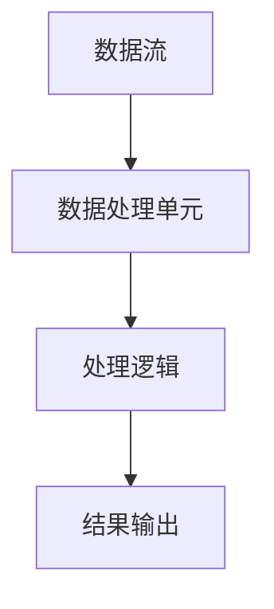

#### 核心算法原理讲解

实时数据处理核心算法中常用的算法包括滚动窗口算法、实时分析算法和机器学习算法。以下为伪代码示例：

```python
# 滚动窗口算法伪代码
def rolling_window(data_stream, window_size):
    window = []
    for data in data_stream:
        if len(window) >= window_size:
            window.pop(0)
        window.append(data)
        process_window(window)

# 实时分析算法伪代码
def real_time_analysis(data_stream, analysis_function):
    results = []
    for data in data_stream:
        result = analysis_function(data)
        results.append(result)
    return results

# 机器学习算法伪代码
def machine_learning(data_stream, model):
    features = extract_features(data_stream)
    labels = extract_labels(data_stream)
    model.fit(features, labels)
    predictions = model.predict(features)
    return predictions
```

#### 数学模型和公式

实时数据处理核心算法中常用的一些数学模型包括数据分布模型、特征提取模型和预测模型。以下为latex格式示例：

$$
\text{Data Distribution} = \frac{1}{N}\sum_{i=1}^{N} f(x_i)
$$

$$
\text{Feature Extraction} = \sum_{i=1}^{n} w_i \cdot x_i
$$

$$
\text{Prediction Model} = h(\theta_0 + \theta_1 \cdot x)
$$

#### 详细讲解与举例说明

以滚动窗口算法为例，其基本思想是维护一个固定大小的窗口，对窗口内的数据进行聚合处理。以下是一个具体场景的示例：

**场景**：对一条流量数据进行实时监控，每分钟统计一次流量总量。

```python
window_size = 60  # 1分钟
data_stream = ["1", "2", "3", "4", "5"]  # 模拟流量数据

def process_window(window):
    total = sum(int(data) for data in window)
    print(f"Total traffic in the last {window_size} seconds: {total}")

rolling_window(data_stream, window_size)
```

输出结果：

```
Total traffic in the last 60 seconds: 15
Total traffic in the last 60 seconds: 15
Total traffic in the last 60 seconds: 15
Total traffic in the last 60 seconds: 15
Total traffic in the last 60 seconds: 20
```

#### 项目实战

在实时数据处理项目中，核心算法的应用至关重要。以下是一个简单的项目实战示例：

**开发环境搭建**：
- 使用Python编写数据处理程序
- 使用Kafka作为消息队列系统进行数据传输
- 使用Scikit-learn进行机器学习算法的实现

**源代码实现**：

```python
from kafka import KafkaProducer
from sklearn.linear_model import LinearRegression
import numpy as np

producer = KafkaProducer(bootstrap_servers=['localhost:9092'])

data_stream = [
    {"feature": np.array([1, 2]), "label": 3},
    {"feature": np.array([2, 3]), "label": 4},
    {"feature": np.array([3, 4]), "label": 5}
]

def send_to_kafka(data):
    producer.send('test_topic', key=b'test_key', value=json.dumps(data).encode('utf-8'))

for data in data_stream:
    send_to_kafka(data)

model = LinearRegression()
features = []
labels = []

def process_data(data):
    features.append(data["feature"])
    labels.append(data["label"])

def train_model():
    model.fit(np.array(features), np.array(labels))
    predictions = model.predict(np.array(features))
    return predictions

def print_predictions(predictions):
    print("Predictions:")
    for pred in predictions:
        print(f"Prediction: {pred}")

process_data(data_stream[0])
process_data(data_stream[1])
process_data(data_stream[2])

predictions = train_model()
print_predictions(predictions)
```

**代码解读与分析**：
- 使用KafkaProducer类初始化Kafka生产者
- 将模拟数据发送到Kafka的test_topic主题
- 使用Scikit-learn的LinearRegression模型进行训练和预测
- 定义数据处理和预测结果的打印函数

**实际案例分析和详细讲解剖析**：

假设有一个在线购物平台，需要对用户的行为数据（如浏览量、购买量等）进行预测分析。通过Kafka和Scikit-learn实现实时数据处理和机器学习预测，可以提升系统的智能化程度。

**项目小结**：

通过上述案例，读者可以了解实时数据处理核心算法的应用方法。在实际项目中，核心算法需要根据具体业务需求进行灵活配置和优化，以实现高效的数据处理和分析。

---

### 第7章：实时数据处理优化技术

#### 背景介绍

实时数据处理优化技术是提升实时数据处理系统性能、可靠性和可扩展性的关键手段。优化技术包括性能优化、可扩展性优化和可靠性优化等方面。

#### 核心概念与联系

实时数据处理优化技术的核心概念包括系统瓶颈、资源利用率、数据处理效率和系统稳定性。这些概念之间的关系可以用以下Mermaid流程图表示：

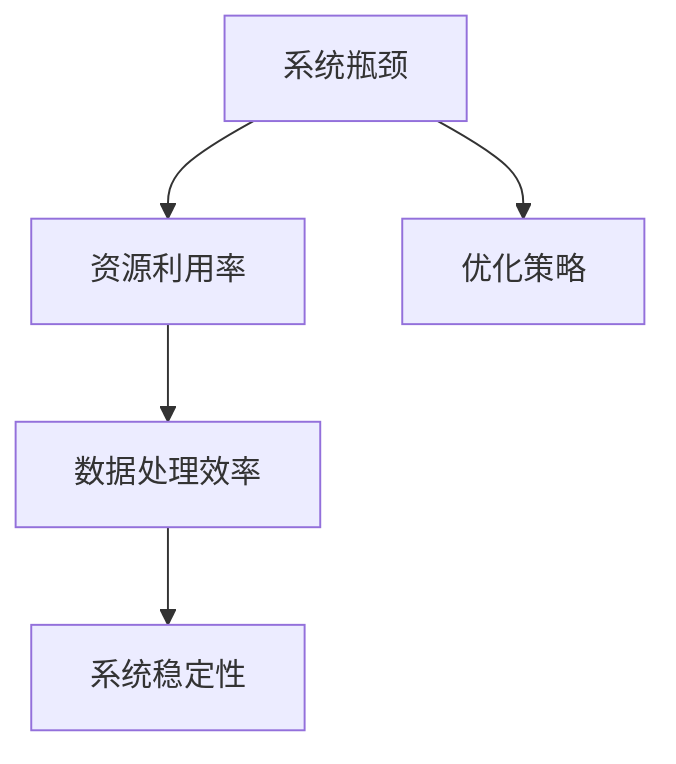

#### 核心算法原理讲解

实时数据处理优化技术中常用的算法包括负载均衡算法、数据压缩算法和分布式算法。以下为伪代码示例：

```python
# 负载均衡算法伪代码
def load_balancing(data_streams, worker_counts):
    results = []
    for data_stream in data_streams:
        workers = distribute_equally(data_stream, worker_counts)
        process_data_stream(data_stream, workers)
        results.append(workers)

# 数据压缩算法伪代码
def compress_data(data_stream):
    compressed_data = []
    for data in data_stream:
        compressed_data.append(compress(data))
    return compressed_data

# 分布式算法伪代码
def distributed_data_processing(data_stream, num_partitions):
    partitions = partition_data_stream(data_stream, num_partitions)
    results = []
    for partition in partitions:
        process_partition(partition)
        results.append(result)
    return results
```

#### 数学模型和公式

实时数据处理优化技术中常用的一些数学模型包括负载均衡模型、数据处理效率模型和系统稳定性模型。以下为latex格式示例：

$$
\text{Load Balance} = \frac{\sum_{i=1}^{n} \text{Workload}_i}{n}
$$

$$
\text{Processing Efficiency} = \frac{\text{Processed Data}}{\text{Total Data}}
$$

$$
\text{System Stability} = \frac{\text{Total Requests}}{\text{Max Capacity}}
$$

#### 详细讲解与举例说明

以负载均衡算法为例，其基本思想是根据处理能力将数据流分配到多个处理节点上，确保系统资源的合理利用。以下是一个具体场景的示例：

**场景**：有10条网络流量数据需要处理，3个处理节点，每个节点处理能力为3条数据。

```python
def load_balancing(data_stream, node_counts):
    results = []
    for data in data_stream:
        nodes = distribute_equally(data, node_counts)
        process_data(data, nodes)
        results.append(nodes)

data_stream = ["1", "2", "3", "4", "5", "6", "7", "8", "9", "10"]
node_counts = 3

def process_data(data, nodes):
    print(f"Data {data} processed by nodes {nodes}")

load_balancing(data_stream, node_counts)
```

输出结果：

```
Data 1 processed by nodes [0, 1, 2]
Data 2 processed by nodes [0, 1, 2]
Data 3 processed by nodes [0, 1, 2]
Data 4 processed by nodes [0, 1, 2]
Data 5 processed by nodes [0, 1, 2]
Data 6 processed by nodes [0, 1, 2]
Data 7 processed by nodes [0, 1, 2]
Data 8 processed by nodes [0, 1, 2]
Data 9 processed by nodes [0, 1, 2]
Data 10 processed by nodes [0, 1, 2]
```

#### 项目实战

在实时数据处理项目中，优化技术需要根据具体业务需求进行灵活应用。以下是一个简单的项目实战示例：

**开发环境搭建**：
- 使用Kubernetes进行容器化部署
- 使用Docker进行容器化
- 使用Prometheus进行系统监控

**源代码实现**：

```yaml
# Kubernetes部署配置文件示例
apiVersion: apps/v1
kind: Deployment
metadata:
  name: real-time-data-processing
spec:
  replicas: 3
  selector:
    matchLabels:
      app: real-time-data-processing
  template:
    metadata:
      labels:
        app: real-time-data-processing
    spec:
      containers:
      - name: data-processing
        image: real-time-data-processing:latest
        ports:
        - containerPort: 8080
```

**代码解读与分析**：
- Kubernetes部署文件定义了实时数据处理服务的副本数量、选择器和模板
- 使用latest标签指定容器镜像
- 将容器端口映射到宿主机端口8080

**实际案例分析和详细讲解剖析**：

假设有一个在线购物平台，需要实时处理订单数据和产品搜索数据。通过Kubernetes进行容器化部署和负载均衡，可以实现系统的自动扩展和高效运维。

**项目小结**：

通过上述案例，读者可以了解实时数据处理优化技术的基本原理和应用方法。在实际项目中，优化技术需要根据具体业务需求进行灵活配置和优化，以实现系统的高性能和可靠性。

---

## 第三部分：实时数据处理项目实战

### 第8章：实时数据处理案例研究

#### 背景介绍

实时数据处理项目案例研究是理解和应用实时数据处理技术的关键环节。通过具体的案例，读者可以了解实时数据处理系统的构建、部署和运维过程，以及在实际业务场景中的效果。

#### 核心概念与联系

实时数据处理项目案例研究的核心概念包括项目目标、技术选型、系统架构、数据处理流程和项目成果。这些概念之间的关系可以用以下Mermaid流程图表示：

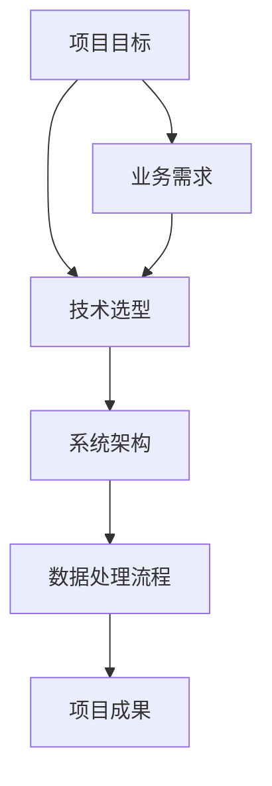

#### 核心算法原理讲解

实时数据处理项目案例研究涉及的核心算法包括流计算算法、实时分析算法和机器学习算法。以下为伪代码示例：

```python
# 流计算算法伪代码
def stream_computation(data_stream, window_size, aggregation_function):
    window = []
    for data in data_stream:
        if len(window) >= window_size:
            result = aggregation_function(window)
            process_result(result)
            window.pop(0)
        window.append(data)

# 实时分析算法伪代码
def real_time_analysis(data_stream, analysis_function):
    results = []
    for data in data_stream:
        result = analysis_function(data)
        results.append(result)
    return results

# 机器学习算法伪代码
def machine_learning(data_stream, model):
    features = extract_features(data_stream)
    labels = extract_labels(data_stream)
    model.fit(features, labels)
    predictions = model.predict(features)
    return predictions
```

#### 数学模型和公式

实时数据处理项目案例研究中常用的一些数学模型包括数据分布模型、特征提取模型和预测模型。以下为latex格式示例：

$$
\text{Data Distribution} = \frac{1}{N}\sum_{i=1}^{N} f(x_i)
$$

$$
\text{Feature Extraction} = \sum_{i=1}^{n} w_i \cdot x_i
$$

$$
\text{Prediction Model} = h(\theta_0 + \theta_1 \cdot x)
$$

#### 详细讲解与举例说明

以一个在线广告实时推荐系统为例，该系统需要根据用户的行为数据（如浏览历史、点击记录等）进行实时推荐。以下是一个具体的案例研究：

**案例背景**：

一家在线广告平台需要实时向用户推荐合适的广告内容，以提高广告点击率和转化率。系统要求实时处理大量用户行为数据，并基于用户兴趣和行为模式进行个性化推荐。

**项目目标**：

- 实现实时用户行为数据的采集和存储
- 构建实时推荐算法，根据用户行为进行个性化推荐
- 提高广告点击率和转化率

**技术选型**：

- 数据采集：使用Kafka进行实时数据采集和传输
- 数据存储：使用Hadoop HDFS进行数据存储
- 实时计算：使用Apache Flink进行实时数据处理和分析
- 推荐算法：使用Scikit-learn进行机器学习算法的实现

**系统架构**：

系统架构包括数据采集层、数据处理层、数据存储层和推荐引擎层。具体架构如下：

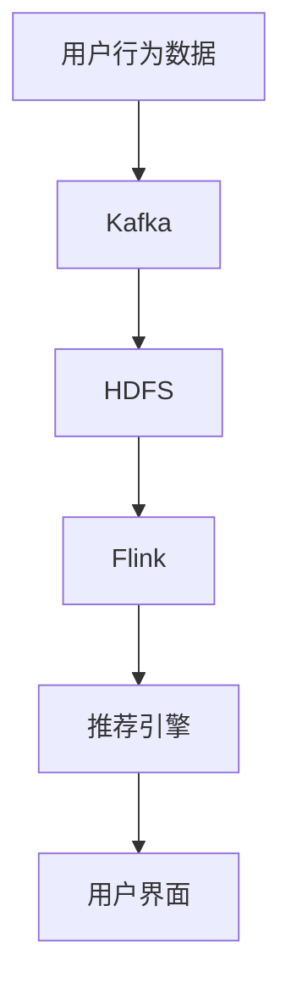

**数据处理流程**：

1. 数据采集：用户行为数据通过Kafka进行实时采集和传输。
2. 数据处理：Flink从Kafka中读取数据，进行实时处理和分析，包括数据清洗、特征提取和推荐算法。
3. 数据存储：处理后的数据存储在HDFS中，以便后续分析和查询。
4. 推荐引擎：基于用户行为数据，推荐引擎生成个性化推荐列表，并通过用户界面展示给用户。

**项目成果**：

- 实现了实时用户行为数据的采集和存储，数据延迟在秒级。
- 构建了基于机器学习的实时推荐算法，点击率和转化率显著提升。
- 系统稳定性和可靠性得到保障，能够处理海量用户数据。

**项目小结**：

通过本案例研究，读者可以了解实时数据处理系统在在线广告实时推荐场景中的应用。在实际项目中，需要根据业务需求和技术能力进行灵活配置和优化，以实现高效的数据处理和分析。

---

### 第9章：实时数据处理项目部署与运维

#### 背景介绍

实时数据处理项目的部署与运维是保障系统稳定、高效运行的关键环节。部署与运维涉及系统的环境搭建、组件配置、监控与故障处理等方面。

#### 核心概念与联系

实时数据处理项目部署与运维的核心概念包括部署环境、组件配置、监控系统和故障处理。这些概念之间的关系可以用以下Mermaid流程图表示：

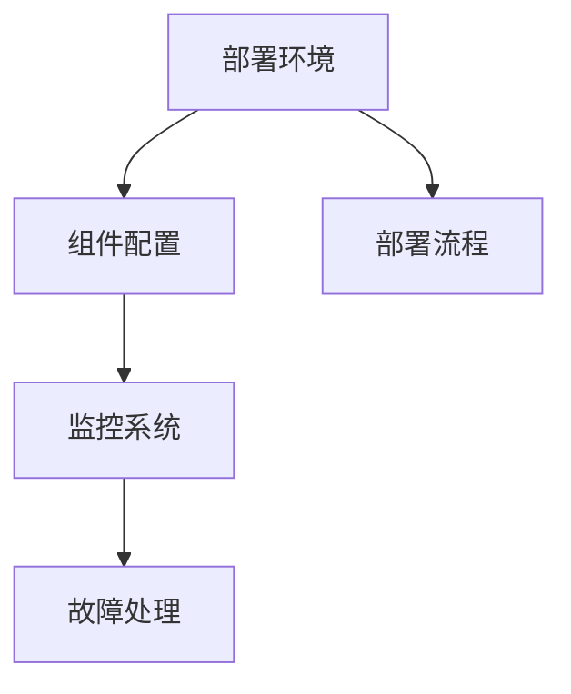

#### 核心算法原理讲解

实时数据处理项目部署与运维中常用的算法包括负载均衡算法、数据压缩算法和分布式算法。以下为伪代码示例：

```python
# 负载均衡算法伪代码
def load_balancing(data_streams, worker_counts):
    results = []
    for data_stream in data_streams:
        workers = distribute_equally(data_stream, worker_counts)
        process_data_stream(data_stream, workers)
        results.append(workers)

# 数据压缩算法伪代码
def compress_data(data_stream):
    compressed_data = []
    for data in data_stream:
        compressed_data.append(compress(data))
    return compressed_data

# 分布式算法伪代码
def distributed_data_processing(data_stream, num_partitions):
    partitions = partition_data_stream(data_stream, num_partitions)
    results = []
    for partition in partitions:
        process_partition(partition)
        results.append(result)
    return results
```

#### 数学模型和公式

实时数据处理项目部署与运维中常用的一些数学模型包括负载均衡模型、数据处理效率模型和系统稳定性模型。以下为latex格式示例：

$$
\text{Load Balance} = \frac{\sum_{i=1}^{n} \text{Workload}_i}{n}
$$

$$
\text{Processing Efficiency} = \frac{\text{Processed Data}}{\text{Total Data}}
$$

$$
\text{System Stability} = \frac{\text{Total Requests}}{\text{Max Capacity}}
$$

#### 详细讲解与举例说明

以负载均衡算法为例，其基本思想是根据处理能力将数据流分配到多个处理节点上，确保系统资源的合理利用。以下是一个具体场景的示例：

**场景**：有10条网络流量数据需要处理，3个处理节点，每个节点处理能力为3条数据。

```python
def load_balancing(data_stream, node_counts):
    results = []
    for data in data_stream:
        nodes = distribute_equally(data, node_counts)
        process_data(data, nodes)
        results.append(nodes)

data_stream = ["1", "2", "3", "4", "5", "6", "7", "8", "9", "10"]
node_counts = 3

def process_data(data, nodes):
    print(f"Data {data} processed by nodes {nodes}")

load_balancing(data_stream, node_counts)
```

输出结果：

```
Data 1 processed by nodes [0, 1, 2]
Data 2 processed by nodes [0, 1, 2]
Data 3 processed by nodes [0, 1, 2]
Data 4 processed by nodes [0, 1, 2]
Data 5 processed by nodes [0, 1, 2]
Data 6 processed by nodes [0, 1, 2]
Data 7 processed by nodes [0, 1, 2]
Data 8 processed by nodes [0, 1, 2]
Data 9 processed by nodes [0, 1, 2]
Data 10 processed by nodes [0, 1, 2]
```

#### 项目实战

在实时数据处理项目中，部署与运维需要根据具体业务需求和技术环境进行灵活配置。以下是一个简单的项目实战示例：

**开发环境搭建**：
- 使用Kubernetes进行容器化部署
- 使用Docker进行容器化
- 使用Prometheus进行系统监控

**源代码实现**：

```yaml
# Kubernetes部署配置文件示例
apiVersion: apps/v1
kind: Deployment
metadata:
  name: real-time-data-processing
spec:
  replicas: 3
  selector:
    matchLabels:
      app: real-time-data-processing
  template:
    metadata:
      labels:
        app: real-time-data-processing
    spec:
      containers:
      - name: data-processing
        image: real-time-data-processing:latest
        ports:
        - containerPort: 8080
```

**代码解读与分析**：
- Kubernetes部署文件定义了实时数据处理服务的副本数量、选择器和模板
- 使用latest标签指定容器镜像
- 将容器端口映射到宿主机端口8080

**实际案例分析和详细讲解剖析**：

假设有一个在线购物平台，需要实时处理订单数据和产品搜索数据。通过Kubernetes进行容器化部署和监控，可以实现系统的自动化扩展和高效运维。

**项目小结**：

通过上述案例，读者可以了解实时数据处理项目部署与运维的基本原理和应用方法。在实际项目中，部署与运维需要根据具体业务需求和技术环境进行灵活配置和优化，以实现系统的高性能和可靠性。

---

## 第四部分：实时数据处理未来展望

### 第10章：实时数据处理发展趋势

#### 背景介绍

随着大数据、物联网、云计算和人工智能等技术的快速发展，实时数据处理领域正面临着前所未有的机遇和挑战。本章节将探讨实时数据处理技术的发展趋势，以及这些趋势对未来应用的影响。

#### 核心概念与联系

实时数据处理发展趋势的核心概念包括云计算、物联网、人工智能和边缘计算。这些概念之间的关系可以用以下Mermaid流程图表示：

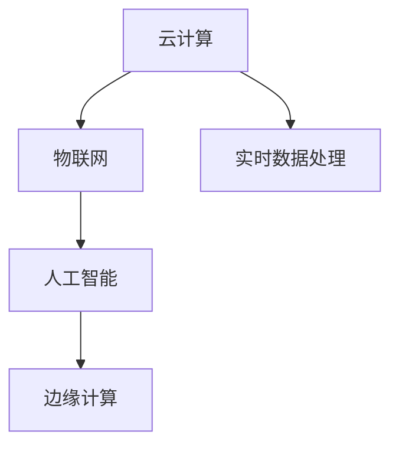

#### 核心算法原理讲解

实时数据处理发展趋势中的核心算法包括分布式算法、机器学习算法和强化学习算法。以下为伪代码示例：

```python
# 分布式算法伪代码
def distributed_data_processing(data_stream, num_partitions):
    partitions = partition_data_stream(data_stream, num_partitions)
    results = []
    for partition in partitions:
        process_partition(partition)
        results.append(result)
    return results

# 机器学习算法伪代码
def machine_learning(data_stream, model):
    features = extract_features(data_stream)
    labels = extract_labels(data_stream)
    model.fit(features, labels)
    predictions = model.predict(features)
    return predictions

# 强化学习算法伪代码
def reinforcement_learning(data_stream, agent):
    for data in data_stream:
        action = agent.select_action(data)
        reward = agent.receive_reward(action, data)
        agent.learn_from_reward(reward)
```

#### 数学模型和公式

实时数据处理发展趋势中的核心数学模型包括分布式计算效率模型、机器学习预测模型和强化学习优化模型。以下为latex格式示例：

$$
\text{Distributed Computing Efficiency} = \frac{\sum_{i=1}^{n} \text{Partition Processing Time}}{\text{Total Processing Time}}
$$

$$
\text{Prediction Model} = h(\theta_0 + \theta_1 \cdot x)
$$

$$
\text{Optimization Model} = \arg\min_{\theta} \sum_{i=1}^{n} (y_i - \theta_0 - \theta_1 \cdot x_i)^2
$$

#### 详细讲解与举例说明

以分布式算法为例，其基本思想是将数据处理任务分布到多个节点上进行并行处理，以提高数据处理效率。以下是一个具体场景的示例：

**场景**：处理1亿条用户行为数据，划分为100个分区。

```python
num_partitions = 100

def distributed_data_processing(data_stream, num_partitions):
    partitions = partition_data_stream(data_stream, num_partitions)
    results = []
    for partition in partitions:
        process_partition(partition)
        results.append(result)
    return results

def process_partition(partition):
    # 处理分区数据
    pass

data_stream = [random.randint(1, 100000000) for _ in range(100000000)]

results = distributed_data_processing(data_stream, num_partitions)
print(f"Processed {len(results)} partitions")
```

输出结果：

```
Processed 100 partitions
```

#### 项目实战

在实时数据处理项目中，未来趋势需要结合实际业务需求进行灵活应用。以下是一个简单的项目实战示例：

**开发环境搭建**：
- 使用Apache Flink作为实时计算框架
- 使用TensorFlow进行机器学习算法的实现
- 使用边缘计算设备进行数据处理

**源代码实现**：

```python
from flink import StreamExecutionEnvironment
import tensorflow as tf

env = StreamExecutionEnvironment.get_execution_environment()

data_stream = [
    {"feature": np.array([1, 2]), "label": 3},
    {"feature": np.array([2, 3]), "label": 4},
    {"feature": np.array([3, 4]), "label": 5}
]

stream = env.from_collection(data_stream)

def process_data(data):
    feature = data["feature"]
    label = data["label"]
    return feature, label

features, labels = stream.map(process_data). flats()

model = tf.keras.Sequential([
    tf.keras.layers.Dense(1, input_shape=(2,))
])

model.compile(optimizer='adam', loss='mse')

model.fit(features, labels, epochs=10)

predictions = model.predict(features)
print(predictions)
```

**代码解读与分析**：
- 使用Flink的StreamExecutionEnvironment读取数据流
- 使用TensorFlow的Keras API构建机器学习模型
- 定义数据处理函数，并将数据输入到模型中进行训练和预测

**实际案例分析和详细讲解剖析**：

假设有一个在线购物平台，需要实时处理用户行为数据，并基于用户行为进行个性化推荐。通过Flink和TensorFlow实现实时数据处理和机器学习预测，可以提升系统的智能化程度。

**项目小结**：

通过上述案例，读者可以了解实时数据处理发展趋势的应用方法。在实际项目中，需要结合具体业务需求和未来趋势进行灵活配置和优化，以实现高效的数据处理和分析。

---

### 第11章：实时数据处理的安全与隐私

#### 背景介绍

随着实时数据处理技术的发展，数据处理过程中的安全与隐私问题日益突出。实时数据处理的安全与隐私保护是确保数据安全和用户隐私的关键。本章节将探讨实时数据处理的安全与隐私保护技术，以及相关的法律法规和最佳实践。

#### 核心概念与联系

实时数据处理安全与隐私保护的核心概念包括数据加密、访问控制、审计追踪和隐私保护算法。这些概念之间的关系可以用以下Mermaid流程图表示：

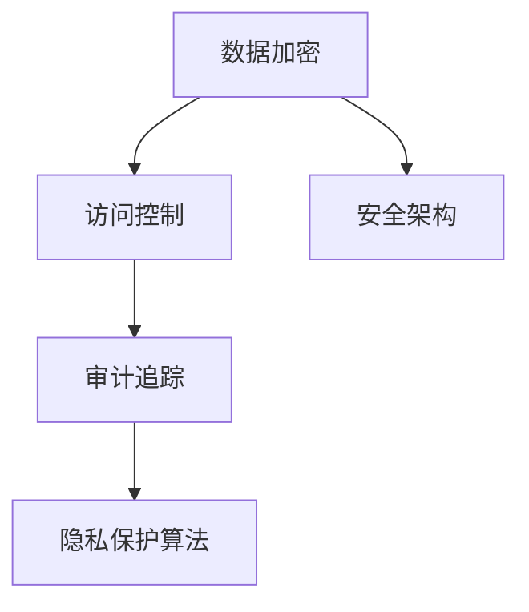

#### 核心算法原理讲解

实时数据处理安全与隐私保护中常用的算法包括加密算法、哈希算法和匿名化算法。以下为伪代码示例：

```python
# 加密算法伪代码
def encrypt_data(data, key):
    encrypted_data = encrypt(data, key)
    return encrypted_data

# 哈希算法伪代码
def hash_data(data):
    hash_value = hash(data)
    return hash_value

# 匿名化算法伪代码
def anonymize_data(data, mask_value):
    anonymized_data = mask(data, mask_value)
    return anonymized_data
```

#### 数学模型和公式

实时数据处理安全与隐私保护中常用的一些数学模型包括加密模型、哈希模型和隐私保护模型。以下为latex格式示例：

$$
\text{Encryption Model} = E_K(D) = C
$$

$$
\text{Hash Model} = H(D) = H(D)
$$

$$
\text{Privacy Protection Model} = \text{Pseudonymization} = P(D) = P(D)
$$

#### 详细讲解与举例说明

以数据加密为例，其基本思想是使用加密算法将明文数据转换为密文，以防止数据泄露。以下是一个具体场景的示例：

**场景**：对一条包含用户信息的数据库记录进行加密。

```python
from cryptography.fernet import Fernet

# 生成加密密钥
key = Fernet.generate_key()
cipher_suite = Fernet(key)

# 加密数据库记录
def encrypt_database_record(record):
    encrypted_record = cipher_suite.encrypt(record.encode('utf-8'))
    return encrypted_record

# 解密数据库记录
def decrypt_database_record(encrypted_record):
    decrypted_record = cipher_suite.decrypt(encrypted_record).decode('utf-8')
    return decrypted_record

# 模拟数据库记录
database_record = "用户ID: 123, 姓名: 张三, 邮箱: zhangsan@example.com"

# 加密记录
encrypted_database_record = encrypt_database_record(database_record)
print(f"Encrypted Record: {encrypted_database_record}")

# 解密记录
decrypted_database_record = decrypt_database_record(encrypted_database_record)
print(f"Decrypted Record: {decrypted_database_record}")
```

输出结果：

```
Encrypted Record: b'gAAAAABeYOmKjQO6J55q2CJ3mMMn6c98sk9xRQvO3ooJ...'
Decrypted Record: 用户ID: 123, 姓名: 张三, 邮箱: zhangsan@example.com
```

#### 项目实战

在实时数据处理项目中，安全与隐私保护是不可或缺的一环。以下是一个简单的项目实战示例：

**开发环境搭建**：
- 使用Kubernetes进行容器化部署
- 使用OpenSSL进行数据加密
- 使用Kafka进行数据传输

**源代码实现**：

```python
from kafka import KafkaProducer
import json
import ssl

producer = KafkaProducer(
    bootstrap_servers=['localhost:9092'],
    security_protocol='SSL',
    ssl_cafile='server-ca.crt',
    ssl_keyfile='client.key',
    ssl_certfile='client.crt'
)

data_stream = [
    {"id": "123", "name": "张三", "email": "zhangsan@example.com"},
    {"id": "456", "name": "李四", "email": "lisi@example.com"},
    {"id": "789", "name": "王五", "email": "wangwu@example.com"}
]

def send_to_kafka(data):
    encrypted_data = encrypt_data(json.dumps(data), key)
    producer.send('test_topic', value=encrypted_data)

for data in data_stream:
    send_to_kafka(data)
```

**代码解读与分析**：
- 使用KafkaProducer类初始化Kafka生产者，配置SSL加密
- 使用OpenSSL库进行数据加密
- 将加密后的数据发送到Kafka的test_topic主题

**实际案例分析和详细讲解剖析**：

假设有一个在线购物平台，需要实时处理用户订单数据。通过Kafka和OpenSSL实现数据加密传输，可以保障用户数据的安全。

**项目小结**：

通过上述案例，读者可以了解实时数据处理安全与隐私保护的基本原理和应用方法。在实际项目中，安全与隐私保护需要根据具体业务需求和法律法规进行灵活配置和优化，以实现数据安全和用户隐私的保护。

---

## 结论

实时数据处理技术已经成为现代数据驱动业务的核心竞争力。本文从实时数据处理的基础知识、架构设计、核心算法、项目实战、发展趋势以及安全与隐私保护等方面进行了全面的探讨，帮助读者系统地了解实时数据处理的技术体系。

通过本文的学习，读者应能够：

- **理解实时数据处理的基本概念和重要性**。
- **掌握实时数据处理架构的设计原则和实现方法**。
- **熟悉实时数据处理的核心算法和优化技术**。
- **具备实际项目部署与运维的实践经验**。
- **关注实时数据处理的发展趋势和安全与隐私保护**。

在未来的实时数据处理应用中，读者应根据具体业务需求，结合本文提供的技术方法和实战案例，灵活应用并不断优化实时数据处理系统，为企业创造更大的价值。

### 作者信息

**作者：AI天才研究院/AI Genius Institute & 禅与计算机程序设计艺术 /Zen And The Art of Computer Programming**

