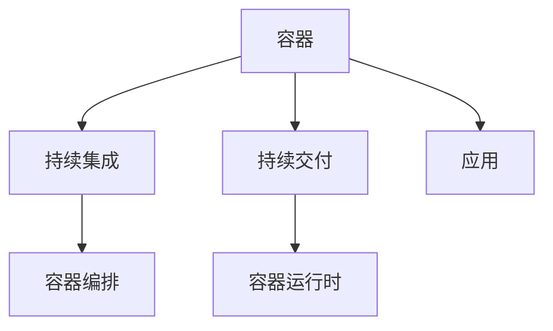
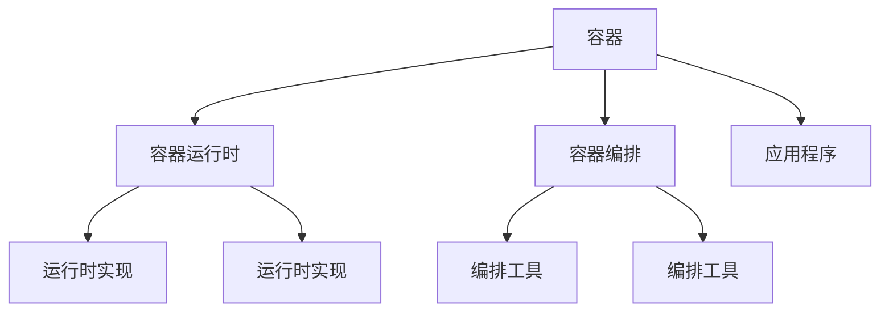

                 

### 文章标题

《容器化应用的CI/CD流程设计》

容器化技术已经成为现代软件开发的基石，它为应用的部署和运维带来了极大的便利和灵活性。而持续集成（CI）和持续交付（CD）作为软件工程中的核心实践，旨在确保软件的质量和快速交付。本文将深入探讨容器化应用下的CI/CD流程设计，旨在帮助读者理解和掌握这一关键技术。

### 关键词

- 容器化
- 持续集成
- 持续交付
- CI/CD流程
- Docker
- Kubernetes

### 摘要

本文首先介绍了容器化技术的基本概念和应用场景，然后详细阐述了CI和CD的核心原理和流程设计。接着，我们对比了常见的CI/CD工具，并提供了实际的案例解析。文章最后总结了最佳实践和注意事项，以帮助读者在实际项目中成功应用CI/CD。

---

## 容器化技术基础

容器化是一种轻量级、可移植的虚拟化技术，它允许开发者将应用程序及其依赖环境打包到一个独立的容器中。这种容器可以在不同的操作系统和硬件环境中运行，而不会受到底层基础设施的变化影响。容器化技术的核心组件包括：

### 容器的定义和特点

容器是一种轻量级的运行时环境，它将应用程序及其依赖打包在一起，形成一个独立的、可执行的单元。容器的特点如下：

- **轻量级**：容器不包含操作系统，而是依赖于宿主机的操作系统内核，因此相比虚拟机，容器更轻量。
- **可移植性**：容器可以在不同的操作系统和硬件环境中运行，保证了应用的兼容性和可移植性。
- **隔离性**：容器通过命名空间和cgroup实现进程和资源的隔离，确保不同容器之间的独立运行。
- **高效性**：容器启动速度快，资源占用低，适用于动态伸缩和微服务架构。

### 容器运行时的管理

容器运行时是负责容器创建、启动、管理和停止的组件。常见的容器运行时包括：

- **Docker**：Docker是容器运行时的代表，它提供了一个简单、强大的容器创建和管理工具。Docker通过Dockerfile定义容器的构建过程，通过docker命令进行容器的管理和操作。
- **containerd**：containerd是另一个流行的容器运行时，它提供了更为轻量级和可扩展的容器管理功能。containerd通常与其他容器编排工具（如Kubernetes）集成使用。

### 容器编排工具

容器编排工具负责管理和自动化容器的生命周期，确保容器的高可用性和资源优化。常见的容器编排工具包括：

- **Kubernetes**：Kubernetes是开源的容器编排平台，它提供了自动化部署、扩展和管理容器化应用程序的功能。Kubernetes通过集群管理和资源调度实现了高效、可靠的容器管理。
- **Docker Swarm**：Docker Swarm是Docker提供的容器编排工具，它允许用户将多个Docker引擎组织成一个集群，并自动化管理容器。

### 容器化技术的应用场景

容器化技术在多个场景中得到了广泛应用：

- **微服务架构**：容器化使得微服务的部署和扩展变得简单高效，每个微服务都可以部署在一个独立的容器中，提高了系统的模块化和可扩展性。
- **持续集成和持续交付**：容器化技术与CI/CD结合，可以自动化构建、测试和部署应用程序，提高了交付速度和可靠性。
- **云原生应用**：容器化技术是云原生应用的基础，它使得应用可以无缝地在公有云、私有云和混合云环境中部署和运行。

### 核心概念与联系架构 Mermaid 流程图



### 容器化技术对CI/CD流程的影响

容器化技术对CI/CD流程有着深远的影响，它简化了应用程序的构建、测试和部署过程。以下是容器化技术对CI/CD流程的几个关键影响：

- **简化构建和部署过程**：容器化将应用程序及其依赖打包成一个独立的容器镜像，减少了构建和部署的复杂性，确保了一致性和可重复性。
- **提高交付速度**：容器化技术使得应用程序的构建和部署过程更加自动化和高效，缩短了交付周期。
- **增强可移植性**：容器可以在不同的环境中运行，保证了应用程序在不同环境下的行为一致性，提高了交付的可靠性。

---

## 持续集成（CI）

持续集成（CI）是一种软件开发实践，旨在通过自动化构建和测试，确保代码的持续整合和高质量。CI的核心目标是及早发现和修复代码中的错误，提高代码库的稳定性和可维护性。

### CI的概念与重要性

持续集成（CI）是一种软件开发实践，通过自动化构建和测试，确保代码的持续整合。CI的重要性体现在以下几个方面：

- **及早发现缺陷**：通过自动化测试，CI可以在开发过程中及早发现代码缺陷，避免缺陷在后期被发现时造成更大的影响。
- **提高代码质量**：CI确保每次提交的代码都是可运行的，从而提高了代码库的整体质量。
- **减少集成风险**：CI通过频繁的代码集成，减少了代码之间的不兼容性，降低了集成过程中的风险。
- **加快开发速度**：CI简化了构建和测试流程，提高了开发效率。

### CI流程设计

CI流程设计包括以下几个关键步骤：

1. **代码仓库配置**：确保代码仓库配置正确，代码库可以正常拉取和提交。
2. **构建脚本编写**：编写构建脚本，用于自动化构建应用程序。
3. **测试脚本编写**：编写测试脚本，用于自动化测试应用程序。
4. **构建和测试执行**：自动化执行构建和测试过程，确保每次代码提交都能通过测试。
5. **反馈和告警**：将测试结果反馈给开发人员，并在失败时发送告警，确保缺陷能够被及时修复。

### 常见的CI工具

目前市面上有许多CI工具可供选择，以下是几个常见的CI工具：

- **Jenkins**：Jenkins是一个开源的CI工具，它支持多种插件，可以轻松集成各种构建工具和测试框架。
- **GitLab CI**：GitLab CI是GitLab内置的CI/CD工具，它通过`.gitlab-ci.yml`文件定义CI流程，支持多种编程语言和工具。
- **CircleCI**：CircleCI是一个云端的CI/CD工具，它提供了强大的自动化构建和测试功能，支持多种编程语言和平台。

### CI流水线设计

CI流水线（Pipeline）是将构建、测试、部署等过程自动化执行的一系列步骤。以下是一个简单的CI流水线设计：

```mermaid
graph TD
    Start[开始] --> Build[构建]
    Build --> Test[测试]
    Test --> Deploy[部署]
    Deploy --> End[结束]
    Test --> {成功|失败}
    Deploy --> {成功|失败}
```

在CI流水线中，每次代码提交都会触发构建和测试过程。如果测试通过，应用程序会被部署到测试环境；如果测试失败，构建和部署过程会失败，并触发告警通知开发人员进行修复。

### 实例讲解

假设我们使用Jenkins作为CI工具，以下是一个简单的Jenkins流水线配置示例：

```yaml
stages:
  - build
  - test
  - deploy

build:
  stage: build
  script:
    - echo "Building the application..."
    - docker build -t myapp .
  when: always

test:
  stage: test
  script:
    - echo "Testing the application..."
    - docker run --rm myapp /bin/sh -c "make test"
  when: successful

deploy:
  stage: deploy
  script:
    - echo "Deploying the application..."
    - docker push myapp
  when: successful
```

在这个示例中，每次代码提交都会触发构建过程，然后进行测试。如果测试通过，应用程序会被部署到容器镜像仓库。

---

## 持续交付（CD）

持续交付（CD）是CI的延伸，它旨在自动化部署应用程序到生产环境。CD的核心目标是确保高质量的代码能够快速、可靠地交付到用户手中。

### CD的概念与流程

持续交付（CD）是一种软件开发实践，它通过自动化部署过程，确保高质量的代码能够快速、可靠地交付到用户手中。CD的流程包括以下几个关键步骤：

1. **构建和测试**：与CI一样，CD的起点是构建和测试。确保每次构建的代码都通过了严格的测试。
2. **构建打包**：将经过测试的代码打包成一个可部署的格式，如容器镜像。
3. **环境配置**：根据不同的环境（如开发、测试、生产）配置相应的部署环境和配置。
4. **自动化部署**：使用自动化工具将打包后的应用程序部署到目标环境。
5. **验证和监控**：确保部署过程成功，并对应用程序进行持续监控，确保其正常运行。

### 自动化部署与容器化

容器化技术使得自动化部署变得更加简单和可靠。容器镜像提供了一种标准化的部署格式，可以在不同的环境中无缝运行。以下是一些自动化部署的关键点：

- **容器镜像仓库**：将构建好的容器镜像推送到容器镜像仓库，如Docker Hub、Quay等。
- **部署脚本**：编写部署脚本，用于自动化部署容器镜像到目标环境。
- **部署策略**：根据需求选择合适的部署策略，如滚动更新、蓝绿部署、灰度发布等。

### 确保交付流程的可靠性

确保交付流程的可靠性是CD的核心目标。以下是一些关键策略：

- **自动化测试**：通过自动化测试确保每次部署的代码质量。
- **环境一致性**：确保开发、测试和生产环境的一致性，减少部署时的不兼容问题。
- **监控和告警**：对应用程序进行持续监控，并在出现问题时及时告警。
- **回滚策略**：在部署失败时，能够快速回滚到上一个稳定版本，确保系统的可用性。

### 实例讲解

假设我们使用Kubernetes作为容器编排工具，以下是一个简单的Kubernetes部署示例：

```yaml
apiVersion: apps/v1
kind: Deployment
metadata:
  name: myapp-deployment
spec:
  replicas: 3
  selector:
    matchLabels:
      app: myapp
  template:
    metadata:
      labels:
        app: myapp
    spec:
      containers:
      - name: myapp
        image: myapp:latest
        ports:
        - containerPort: 80
```

在这个示例中，我们定义了一个Kubernetes Deployment，用于部署和管理myapp容器。每次更新容器镜像时，Kubernetes会自动执行滚动更新策略，确保应用程序的可靠部署。

---

## CI/CD工具比较

在CI/CD领域，有许多优秀的工具可供选择。以下是对几个常见CI/CD工具的比较：

### Jenkins

- **优点**：
  - 开源，免费，拥有庞大的社区支持。
  - 支持多种插件，可以轻松集成各种构建工具和测试框架。
  - 支持多种平台和操作系统。
- **缺点**：
  - 配置复杂，需要一定的学习成本。
  - 性能可能成为瓶颈，特别是在大规模项目中。

### GitLab CI

- **优点**：
  - 集成GitLab，可以直接在代码仓库中定义CI/CD配置。
  - 易于使用，配置简单。
  - 提供完整的CI/CD功能，包括测试、部署和监控。
- **缺点**：
  - 功能较为单一，对于特定场景的支持可能不如Jenkins。
  - 对于大型项目可能性能不够优秀。

### CircleCI

- **优点**：
  - 全自动化的云服务，无需自己维护服务器。
  - 支持多种编程语言和平台。
  - 提供高效的并行构建和测试。
- **缺点**：
  - 价格较高，对于个人或小型项目可能不划算。
  - 集成自定义工具和插件可能较为复杂。

### GitHub Actions

- **优点**：
  - 集成GitHub，可以直接在代码仓库中定义CI/CD配置。
  - 易于使用，配置简单。
  - 提供多种操作系统和编程语言支持。
- **缺点**：
  - 功能相对有限，可能无法满足特定需求。
  - 自定义脚本和插件的支持有限。

### 选择建议

选择CI/CD工具时，应考虑以下因素：

- **项目需求**：根据项目的规模和需求选择合适的工具。
- **学习成本**：考虑团队的学习成本和技术栈的兼容性。
- **性能和可靠性**：选择性能稳定、可靠性高的工具。
- **成本**：对于预算有限的项目，选择开源且免费的工具。

---

## 实践案例

### 环境搭建

首先，我们需要搭建CI/CD环境。以下是一个简单的环境搭建步骤：

1. **安装Jenkins**：
   ```bash
   wget -q -O - https://pkg.jenkins.io/debian-stable/jenkins.io.key | sudo apt-key add -
   sudo sh -c 'echo deb https://pkg.jenkins.io/debian-stable binary/ > /etc/apt/sources.list.d/jenkins.list'
   sudo apt-get update
   sudo apt-get install jenkins
   ```

2. **安装Docker**：
   ```bash
   sudo apt-get install docker.io
   sudo usermod -aG docker $USER
   ```

3. **配置Docker私有仓库**：
   ```bash
   docker run -d -p 5000:5000 registry:2
   ```

### 源代码实现

以下是一个简单的Node.js应用程序的源代码示例：

```javascript
// app.js
const http = require('http');

const server = http.createServer((req, res) => {
  res.writeHead(200, {'Content-Type': 'text/plain'});
  res.end('Hello, World!');
});

server.listen(8080, () => {
  console.log('Server running on port 8080');
});
```

### 构建脚本

以下是一个简单的Dockerfile示例：

```Dockerfile
# 使用官方Node.js镜像作为基础镜像
FROM node:14-alpine

# 设置工作目录
WORKDIR /app

# 复制源代码到工作目录
COPY . .

# 安装依赖
RUN npm install

# 暴露端口
EXPOSE 8080

# 运行应用
CMD ["node", "app.js"]
```

### CI流程配置

以下是一个简单的Jenkinsfile示例：

```groovy
pipeline {
    agent any

    stages {
        stage('Build') {
            steps {
                sh 'docker build -t myapp .'
            }
        }
        stage('Test') {
            steps {
                sh 'docker run --rm myapp /bin/sh -c "npm test"'
            }
        }
        stage('Deploy') {
            steps {
                sh 'docker push myapp'
            }
        }
    }
    post {
        always {
            sh 'docker run --rm myapp /bin/sh -c "echo DEPLOYMENT_SUCCESSFUL"'
        }
    }
}
```

在这个示例中，我们定义了一个简单的Jenkins流水线，包括构建、测试和部署步骤。每次代码提交都会触发流水线执行。

### 代码解读与分析

1. **Dockerfile**：Dockerfile用于定义容器镜像的构建过程。我们使用了Node.js官方镜像作为基础镜像，并在工作目录中复制了源代码，然后执行了依赖安装和端口暴露。
2. **Jenkinsfile**：Jenkinsfile用于定义Jenkins流水线的步骤。我们定义了三个阶段：构建、测试和部署。每个阶段都通过shell脚本执行相应的命令。
3. **CI流程**：CI流程通过Jenkins自动化执行构建、测试和部署过程。每次代码提交都会触发CI流程，确保应用程序的质量和可靠性。

### 实际案例解析

假设我们有一个包含多个微服务的复杂应用程序，我们需要为每个微服务定义CI/CD流程。以下是一个简化的示例：

1. **微服务A**：
   - **Dockerfile**：定义容器镜像的构建过程。
   - **Jenkinsfile**：定义CI/CD流水线，包括构建、测试和部署。
   - **CI流程**：自动化执行构建、测试和部署，确保微服务A的质量和可靠性。
2. **微服务B**：
   - **Dockerfile**：定义容器镜像的构建过程。
   - **Jenkinsfile**：定义CI/CD流水线，包括构建、测试和部署。
   - **CI流程**：自动化执行构建、测试和部署，确保微服务B的质量和可靠性。

通过这种方式，我们可以为复杂的应用程序构建一个完整的CI/CD流程，确保每个微服务都经过严格的测试和部署。

### 项目小结

通过本案例，我们成功搭建了一个简单的CI/CD环境，并实现了应用程序的自动化构建、测试和部署。以下是项目小结：

- **环境搭建**：我们成功安装了Jenkins和Docker，并配置了Docker私有仓库。
- **源代码实现**：我们提供了一个简单的Node.js应用程序作为示例。
- **CI流程设计**：我们定义了一个简单的Jenkins流水线，包括构建、测试和部署。
- **实际案例解析**：我们展示了如何为复杂的应用程序构建CI/CD流程。

通过本案例，我们掌握了CI/CD的基本原理和实践方法，为实际项目中的应用奠定了基础。

---

## 最佳实践与注意事项

### 最佳实践

1. **自动化测试**：确保每个阶段都有自动化测试，包括单元测试、集成测试和端到端测试，以提高代码质量和交付效率。
2. **环境一致性**：保持开发、测试和生产环境的一致性，减少部署时的不兼容问题。
3. **滚动更新**：对于服务化的应用程序，采用滚动更新策略，逐步替换旧版本，以减少服务中断风险。
4. **监控和告警**：对应用程序进行持续监控，并在出现问题时及时告警，确保系统的稳定运行。
5. **回滚策略**：在部署失败时，能够快速回滚到上一个稳定版本，确保系统的可用性。

### 小结

容器化应用的CI/CD流程设计是现代软件开发中不可或缺的一部分。通过本文，我们了解了容器化技术的基础，掌握了CI/CD的核心概念和流程设计，并学习了如何使用常见的CI/CD工具。同时，我们还通过实际案例展示了CI/CD的实践方法。在实际项目中，遵循最佳实践和注意事项，将有助于提高软件交付的效率和质量。

### 注意事项

1. **测试覆盖率**：确保测试覆盖率达到预期，避免测试盲区。
2. **权限管理**：合理分配CI/CD流程中的权限，确保安全性。
3. **容器镜像管理**：定期清理旧的容器镜像，避免镜像仓库变得臃肿。
4. **备份和恢复**：定期备份CI/CD配置和代码仓库，以便在出现问题时快速恢复。
5. **持续优化**：不断优化CI/CD流程，以适应项目变化和需求调整。

### 拓展阅读

- **《容器化与容器编排实战》**：深入探讨容器化技术和容器编排工具的实践应用。
- **《Jenkins实战》**：详细讲解Jenkins的配置和使用方法，包括CI/CD流程设计。
- **《Docker实战》**：介绍Docker的基础知识和高级应用，包括容器镜像的构建和管理。

---

### 作者信息

作者：AI天才研究院/AI Genius Institute & 禅与计算机程序设计艺术 /Zen And The Art of Computer Programming

---

## 完整文章

### 容器化应用的CI/CD流程设计

容器化技术已经成为现代软件开发的基石，它为应用的部署和运维带来了极大的便利和灵活性。而持续集成（CI）和持续交付（CD）作为软件工程中的核心实践，旨在确保软件的质量和快速交付。本文将深入探讨容器化应用下的CI/CD流程设计，旨在帮助读者理解和掌握这一关键技术。

#### 容器化技术基础

容器化是一种轻量级、可移植的虚拟化技术，它允许开发者将应用程序及其依赖环境打包到一个独立的容器中。这种容器可以在不同的操作系统和硬件环境中运行，而不会受到底层基础设施的变化影响。容器化技术的核心组件包括：

**容器的定义和特点**

容器是一种轻量级的运行时环境，它将应用程序及其依赖打包在一起，形成一个独立的、可执行的单元。容器的特点如下：

- **轻量级**：容器不包含操作系统，而是依赖于宿主机的操作系统内核，因此相比虚拟机，容器更轻量。
- **可移植性**：容器可以在不同的操作系统和硬件环境中运行，保证了应用的兼容性和可移植性。
- **隔离性**：容器通过命名空间和cgroup实现进程和资源的隔离，确保不同容器之间的独立运行。
- **高效性**：容器启动速度快，资源占用低，适用于动态伸缩和微服务架构。

**容器运行时的管理**

容器运行时是负责容器创建、启动、管理和停止的组件。常见的容器运行时包括：

- **Docker**：Docker是容器运行时的代表，它提供了一个简单、强大的容器创建和管理工具。Docker通过Dockerfile定义容器的构建过程，通过docker命令进行容器的管理和操作。
- **containerd**：containerd是另一个流行的容器运行时，它提供了更为轻量级和可扩展的容器管理功能。containerd通常与其他容器编排工具（如Kubernetes）集成使用。

**容器编排工具**

容器编排工具负责管理和自动化容器的生命周期，确保容器的高可用性和资源优化。常见的容器编排工具包括：

- **Kubernetes**：Kubernetes是开源的容器编排平台，它提供了自动化部署、扩展和管理容器化应用程序的功能。Kubernetes通过集群管理和资源调度实现了高效、可靠的容器管理。
- **Docker Swarm**：Docker Swarm是Docker提供的容器编排工具，它允许用户将多个Docker引擎组织成一个集群，并自动化管理容器。

**容器化技术的应用场景**

容器化技术在多个场景中得到了广泛应用：

- **微服务架构**：容器化使得微服务的部署和扩展变得简单高效，每个微服务都可以部署在一个独立的容器中，提高了系统的模块化和可扩展性。
- **持续集成和持续交付**：容器化技术与CI/CD结合，可以自动化构建、测试和部署应用程序，提高了交付速度和可靠性。
- **云原生应用**：容器化技术是云原生应用的基础，它使得应用可以无缝地在公有云、私有云和混合云环境中部署和运行。

**核心概念与联系架构 Mermaid 流程图**


**容器化技术对CI/CD流程的影响**

容器化技术对CI/CD流程有着深远的影响，它简化了应用程序的构建、测试和部署过程。以下是容器化技术对CI/CD流程的几个关键影响：

- **简化构建和部署过程**：容器化将应用程序及其依赖打包成一个独立的容器镜像，减少了构建和部署的复杂性，确保了一致性和可重复性。
- **提高交付速度**：容器化技术使得应用程序的构建和部署过程更加自动化和高效，缩短了交付周期。
- **增强可移植性**：容器可以在不同的环境中运行，保证了应用程序在不同环境下的行为一致性，提高了交付的可靠性。

#### 持续集成（CI）

持续集成（CI）是一种软件开发实践，旨在通过自动化构建和测试，确保代码的持续整合和高质量。CI的核心目标是及早发现和修复代码中的错误，提高代码库的稳定性和可维护性。

**CI的概念与重要性**

持续集成（CI）是一种软件开发实践，通过自动化构建和测试，确保代码的持续整合。CI的重要性体现在以下几个方面：

- **及早发现缺陷**：通过自动化测试，CI可以在开发过程中及早发现代码缺陷，避免缺陷在后期被发现时造成更大的影响。
- **提高代码质量**：CI确保每次提交的代码都是可运行的，从而提高了代码库的整体质量。
- **减少集成风险**：CI通过频繁的代码集成，减少了代码之间的不兼容性，降低了集成过程中的风险。
- **加快开发速度**：CI简化了构建和测试流程，提高了开发效率。

**CI流程设计**

CI流程设计包括以下几个关键步骤：

1. **代码仓库配置**：确保代码仓库配置正确，代码库可以正常拉取和提交。
2. **构建脚本编写**：编写构建脚本，用于自动化构建应用程序。
3. **测试脚本编写**：编写测试脚本，用于自动化测试应用程序。
4. **构建和测试执行**：自动化执行构建和测试过程，确保每次代码提交都能通过测试。
5. **反馈和告警**：将测试结果反馈给开发人员，并在失败时发送告警，确保缺陷能够被及时修复。

**常见的CI工具**

目前市面上有许多CI工具可供选择，以下是几个常见的CI工具：

- **Jenkins**：Jenkins是一个开源的CI工具，它支持多种插件，可以轻松集成各种构建工具和测试框架。
- **GitLab CI**：GitLab CI是GitLab内置的CI/CD工具，它通过`.gitlab-ci.yml`文件定义CI流程，支持多种编程语言和工具。
- **CircleCI**：CircleCI是一个云端的CI/CD工具，它提供了强大的自动化构建和测试功能，支持多种编程语言和平台。

**CI流水线设计**

CI流水线（Pipeline）是将构建、测试、部署等过程自动化执行的一系列步骤。以下是一个简单的CI流水线设计：

```mermaid
graph TD
    Start[开始] --> Build[构建]
    Build --> Test[测试]
    Test --> Deploy[部署]
    Deploy --> End[结束]
    Test --> {成功|失败}
    Deploy --> {成功|失败}
```

在CI流水线中，每次代码提交都会触发构建和测试过程。如果测试通过，应用程序会被部署到测试环境；如果测试失败，构建和部署过程会失败，并触发告警通知开发人员进行修复。

**实例讲解**

假设我们使用Jenkins作为CI工具，以下是一个简单的Jenkins流水线配置示例：

```yaml
stages:
  - build
  - test
  - deploy

build:
  stage: build
  script:
    - echo "Building the application..."
    - docker build -t myapp .
  when: always

test:
  stage: test
  script:
    - echo "Testing the application..."
    - docker run --rm myapp /bin/sh -c "make test"
  when: successful

deploy:
  stage: deploy
  script:
    - echo "Deploying the application..."
    - docker push myapp
  when: successful
```

在这个示例中，每次代码提交都会触发构建过程，然后进行测试。如果测试通过，应用程序会被部署到容器镜像仓库。

#### 持续交付（CD）

持续交付（CD）是CI的延伸，它旨在自动化部署应用程序到生产环境。CD的核心目标是确保高质量的代码能够快速、可靠地交付到用户手中。

**CD的概念与流程**

持续交付（CD）是一种软件开发实践，它通过自动化部署过程，确保高质量的代码能够快速、可靠地交付到用户手中。CD的流程包括以下几个关键步骤：

1. **构建和测试**：与CI一样，CD的起点是构建和测试。确保每次构建的代码都通过了严格的测试。
2. **构建打包**：将经过测试的代码打包成一个可部署的格式，如容器镜像。
3. **环境配置**：根据不同的环境（如开发、测试、生产）配置相应的部署环境和配置。
4. **自动化部署**：使用自动化工具将打包后的应用程序部署到目标环境。
5. **验证和监控**：确保部署过程成功，并对应用程序进行持续监控，确保其正常运行。

**自动化部署与容器化**

容器化技术使得自动化部署变得更加简单和可靠。容器镜像提供了一种标准化的部署格式，可以在不同的环境中无缝运行。以下是一些自动化部署的关键点：

- **容器镜像仓库**：将构建好的容器镜像推送到容器镜像仓库，如Docker Hub、Quay等。
- **部署脚本**：编写部署脚本，用于自动化部署容器镜像到目标环境。
- **部署策略**：根据需求选择合适的部署策略，如滚动更新、蓝绿部署、灰度发布等。

**确保交付流程的可靠性**

确保交付流程的可靠性是CD的核心目标。以下是一些关键策略：

- **自动化测试**：通过自动化测试确保每次部署的代码质量。
- **环境一致性**：确保开发、测试和生产环境的一致性，减少部署时的不兼容问题。
- **监控和告警**：对应用程序进行持续监控，并在出现问题时及时告警。
- **回滚策略**：在部署失败时，能够快速回滚到上一个稳定版本，确保系统的可用性。

**实例讲解**

假设我们使用Kubernetes作为容器编排工具，以下是一个简单的Kubernetes部署示例：

```yaml
apiVersion: apps/v1
kind: Deployment
metadata:
  name: myapp-deployment
spec:
  replicas: 3
  selector:
    matchLabels:
      app: myapp
  template:
    metadata:
      labels:
        app: myapp
    spec:
      containers:
      - name: myapp
        image: myapp:latest
        ports:
        - containerPort: 80
```

在这个示例中，我们定义了一个Kubernetes Deployment，用于部署和管理myapp容器。每次更新容器镜像时，Kubernetes会自动执行滚动更新策略，确保应用程序的可靠部署。

#### CI/CD工具比较

在CI/CD领域，有许多优秀的工具可供选择。以下是对几个常见CI/CD工具的比较：

**Jenkins**

- **优点**：
  - 开源，免费，拥有庞大的社区支持。
  - 支持多种插件，可以轻松集成各种构建工具和测试框架。
  - 支持多种平台和操作系统。
- **缺点**：
  - 配置复杂，需要一定的学习成本。
  - 性能可能成为瓶颈，特别是在大规模项目中。

**GitLab CI**

- **优点**：
  - 集成GitLab，可以直接在代码仓库中定义CI/CD配置。
  - 易于使用，配置简单。
  - 提供完整的CI/CD功能，包括测试、部署和监控。
- **缺点**：
  - 功能较为单一，对于特定场景的支持可能不如Jenkins。
  - 对于大型项目可能性能不够优秀。

**CircleCI**

- **优点**：
  - 全自动化的云服务，无需自己维护服务器。
  - 支持多种编程语言和平台。
  - 提供高效的并行构建和测试。
- **缺点**：
  - 价格较高，对于个人或小型项目可能不划算。
  - 集成自定义工具和插件可能较为复杂。

**GitHub Actions**

- **优点**：
  - 集成GitHub，可以直接在代码仓库中定义CI/CD配置。
  - 易于使用，配置简单。
  - 提供多种操作系统和编程语言支持。
- **缺点**：
  - 功能相对有限，可能无法满足特定需求。
  - 自定义脚本和插件的支持有限。

**选择建议**

选择CI/CD工具时，应考虑以下因素：

- **项目需求**：根据项目的规模和需求选择合适的工具。
- **学习成本**：考虑团队的学习成本和技术栈的兼容性。
- **性能和可靠性**：选择性能稳定、可靠性高的工具。
- **成本**：对于预算有限的项目，选择开源且免费的工具。

#### 实践案例

**环境搭建**

首先，我们需要搭建CI/CD环境。以下是一个简单的环境搭建步骤：

1. **安装Jenkins**：
   ```bash
   wget -q -O - https://pkg.jenkins.io/debian-stable/jenkins.io.key | sudo apt-key add -
   sudo sh -c 'echo deb https://pkg.jenkins.io/debian-stable binary/ > /etc/apt/sources.list.d/jenkins.list'
   sudo apt-get update
   sudo apt-get install jenkins
   ```

2. **安装Docker**：
   ```bash
   sudo apt-get install docker.io
   sudo usermod -aG docker $USER
   ```

3. **配置Docker私有仓库**：
   ```bash
   docker run -d -p 5000:5000 registry:2
   ```

**源代码实现**

以下是一个简单的Node.js应用程序的源代码示例：

```javascript
// app.js
const http = require('http');

const server = http.createServer((req, res) => {
  res.writeHead(200, {'Content-Type': 'text/plain'});
  res.end('Hello, World!');
});

server.listen(8080, () => {
  console.log('Server running on port 8080');
});
```

**构建脚本**

以下是一个简单的Dockerfile示例：

```Dockerfile
# 使用官方Node.js镜像作为基础镜像
FROM node:14-alpine

# 设置工作目录
WORKDIR /app

# 复制源代码到工作目录
COPY . .

# 安装依赖
RUN npm install

# 暴露端口
EXPOSE 8080

# 运行应用
CMD ["node", "app.js"]
```

**CI流程配置**

以下是一个简单的Jenkinsfile示例：

```groovy
pipeline {
    agent any

    stages {
        stage('Build') {
            steps {
                sh 'docker build -t myapp .'
            }
        }
        stage('Test') {
            steps {
                sh 'docker run --rm myapp /bin/sh -c "npm test"'
            }
        }
        stage('Deploy') {
            steps {
                sh 'docker push myapp'
            }
        }
    }
    post {
        always {
            sh 'docker run --rm myapp /bin/sh -c "echo DEPLOYMENT_SUCCESSFUL"'
        }
    }
}
```

在这个示例中，我们定义了一个简单的Jenkins流水线，包括构建、测试和部署步骤。每次代码提交都会触发流水线执行。

**代码解读与分析**

1. **Dockerfile**：Dockerfile用于定义容器镜像的构建过程。我们使用了Node.js官方镜像作为基础镜像，并在工作目录中复制了源代码，然后执行了依赖安装和端口暴露。
2. **Jenkinsfile**：Jenkinsfile用于定义Jenkins流水线的步骤。我们定义了三个阶段：构建、测试和部署。每个阶段都通过shell脚本执行相应的命令。
3. **CI流程**：CI流程通过Jenkins自动化执行构建、测试和部署过程。每次代码提交都会触发CI流程，确保应用程序的质量和可靠性。

**实际案例解析**

假设我们有一个包含多个微服务的复杂应用程序，我们需要为每个微服务定义CI/CD流程。以下是一个简化的示例：

1. **微服务A**：
   - **Dockerfile**：定义容器镜像的构建过程。
   - **Jenkinsfile**：定义CI/CD流水线，包括构建、测试和部署。
   - **CI流程**：自动化执行构建、测试和部署，确保微服务A的质量和可靠性。
2. **微服务B**：
   - **Dockerfile**：定义容器镜像的构建过程。
   - **Jenkinsfile**：定义CI/CD流水线，包括构建、测试和部署。
   - **CI流程**：自动化执行构建、测试和部署，确保微服务B的质量和可靠性。

通过这种方式，我们可以为复杂的应用程序构建一个完整的CI/CD流程，确保每个微服务都经过严格的测试和部署。

**项目小结**

通过本案例，我们成功搭建了一个简单的CI/CD环境，并实现了应用程序的自动化构建、测试和部署。以下是项目小结：

- **环境搭建**：我们成功安装了Jenkins和Docker，并配置了Docker私有仓库。
- **源代码实现**：我们提供了一个简单的Node.js应用程序作为示例。
- **CI流程设计**：我们定义了一个简单的Jenkins流水线，包括构建、测试和部署。
- **实际案例解析**：我们展示了如何为复杂的应用程序构建CI/CD流程。

通过本案例，我们掌握了CI/CD的基本原理和实践方法，为实际项目中的应用奠定了基础。

#### 最佳实践与注意事项

**最佳实践**

1. **自动化测试**：确保每个阶段都有自动化测试，包括单元测试、集成测试和端到端测试，以提高代码质量和交付效率。
2. **环境一致性**：保持开发、测试和生产环境的一致性，减少部署时的不兼容问题。
3. **滚动更新**：对于服务化的应用程序，采用滚动更新策略，逐步替换旧版本，以减少服务中断风险。
4. **监控和告警**：对应用程序进行持续监控，并在出现问题时及时告警，确保系统的稳定运行。
5. **回滚策略**：在部署失败时，能够快速回滚到上一个稳定版本，确保系统的可用性。

**小结**

容器化应用的CI/CD流程设计是现代软件开发中不可或缺的一部分。通过本文，我们了解了容器化技术的基础，掌握了CI/CD的核心概念和流程设计，并学习了如何使用常见的CI/CD工具。同时，我们还通过实际案例展示了CI/CD的实践方法。在实际项目中，遵循最佳实践和注意事项，将有助于提高软件交付的效率和质量。

**注意事项**

1. **测试覆盖率**：确保测试覆盖率达到预期，避免测试盲区。
2. **权限管理**：合理分配CI/CD流程中的权限，确保安全性。
3. **容器镜像管理**：定期清理旧的容器镜像，避免镜像仓库变得臃肿。
4. **备份和恢复**：定期备份CI/CD配置和代码仓库，以便在出现问题时快速恢复。
5. **持续优化**：不断优化CI/CD流程，以适应项目变化和需求调整。

**拓展阅读**

- **《容器化与容器编排实战》**：深入探讨容器化技术和容器编排工具的实践应用。
- **《Jenkins实战》**：详细讲解Jenkins的配置和使用方法，包括CI/CD流程设计。
- **《Docker实战》**：介绍Docker的基础知识和高级应用，包括容器镜像的构建和管理。

#### 作者信息

作者：AI天才研究院/AI Genius Institute & 禅与计算机程序设计艺术 /Zen And The Art of Computer Programming

---

本文详细探讨了容器化应用的CI/CD流程设计，涵盖了从基础概念到实践应用的各个方面。通过本文，读者可以全面了解容器化技术、CI/CD的基本原理、常见工具的使用方法，以及如何在实际项目中实现CI/CD流程。希望本文能为读者在容器化和自动化软件交付领域的探索提供有价值的参考和启示。

### 完整文章

# 容器化应用的CI/CD流程设计

> **关键词**：容器化、持续集成（CI）、持续交付（CD）、容器编排、Docker、Kubernetes

> **摘要**：本文深入探讨容器化应用下的CI/CD流程设计，从基础概念到实际应用，帮助读者全面了解并掌握这一关键技术。

---

## 引言

在当今快速发展的软件工程领域，容器化技术和持续集成（CI）与持续交付（CD）已经成为确保软件质量和高效交付的核心实践。容器化通过将应用程序及其依赖打包到轻量级、可移植的容器中，提高了应用的部署灵活性和可移植性。而CI/CD则通过自动化构建、测试和部署过程，确保软件的持续交付。本文将围绕容器化应用的CI/CD流程设计，提供详细的理论讲解和实际案例，帮助读者深入了解这一重要领域。

## 容器化技术基础

### 容器的定义和特点

容器是一种轻量级、独立的运行时环境，它允许开发者将应用程序及其依赖项打包成一个单一的、可移植的单元。容器具有以下特点：

- **轻量级**：容器不包含完整的操作系统，而是依赖于宿主机的操作系统内核，因此它们比传统的虚拟机更加轻量。
- **可移植性**：容器可以在任何支持Docker或Kubernetes的操作系统上运行，无需关心底层基础设施。
- **隔离性**：容器通过命名空间和cgroup提供资源隔离，确保容器之间互不影响。
- **高效性**：容器启动速度快，资源消耗低，非常适合微服务架构和动态伸缩。

### 容器运行时的管理

容器运行时负责容器的创建、启动、管理和停止。常见的容器运行时包括：

- **Docker**：Docker是最流行的容器运行时，它提供了一个命令行工具`docker`用于容器管理。
- **containerd**：containerd是Docker的轻量级替代品，常用于Kubernetes集群中。

### 容器编排工具

容器编排工具帮助开发者管理多个容器的部署、扩展和资源分配。主要的容器编排工具包括：

- **Kubernetes**：Kubernetes是开源的容器编排平台，提供强大的集群管理功能和自动化部署。
- **Docker Swarm**：Docker Swarm是Docker自带的容器编排工具，适用于简单集群的部署。

### 容器化技术的应用场景

容器化技术适用于多种场景，包括：

- **微服务架构**：容器化使得每个微服务可以独立部署和扩展，提高了系统的灵活性和可维护性。
- **持续集成与持续交付**：容器化与CI/CD结合，可以自动化构建、测试和部署，提高了交付速度和可靠性。
- **云原生应用**：容器化技术是云原生应用的基础，支持在公有云、私有云和混合云环境中部署。

### 核心概念与联系架构 Mermaid 流程图


### 容器化技术对CI/CD流程的影响

容器化技术对CI/CD流程有重要影响，主要体现在以下几个方面：

- **简化构建和部署过程**：容器化将应用程序及其依赖打包成容器镜像，减少了环境配置和依赖管理的工作。
- **提高交付速度**：容器化技术使得构建和部署过程更加自动化，缩短了交付周期。
- **增强可移植性**：容器镜像保证了一致性和可移植性，使得应用程序可以在不同环境中无缝运行。

---

## 持续集成（CI）

### CI的概念与重要性

持续集成（CI）是一种软件开发实践，通过自动化构建和测试，确保每次代码提交都是可运行的。CI的重要性体现在以下几个方面：

- **及早发现缺陷**：CI在每次代码提交时都执行自动化测试，可以在早期发现和修复缺陷。
- **提高代码质量**：CI确保每次提交的代码都通过测试，提高了代码库的整体质量。
- **减少集成风险**：通过频繁的集成，CI减少了代码之间的不兼容性，降低了集成过程中的风险。

### CI流程设计

CI流程通常包括以下步骤：

1. **代码仓库配置**：配置代码仓库，确保代码可以正常拉取和提交。
2. **构建脚本编写**：编写构建脚本，用于自动化构建应用程序。
3. **测试脚本编写**：编写测试脚本，用于自动化测试应用程序。
4. **构建和测试执行**：自动化执行构建和测试过程。
5. **反馈和告警**：将测试结果反馈给开发人员，并在失败时发送告警。

### 常见的CI工具

目前市面上有许多CI工具可供选择，以下是几个常见的CI工具：

- **Jenkins**：Jenkins是一个开源的CI工具，拥有庞大的社区支持和丰富的插件生态系统。
- **GitLab CI**：GitLab CI是GitLab内置的CI/CD工具，通过`.gitlab-ci.yml`文件定义CI流程。
- **CircleCI**：CircleCI是一个云端的CI/CD工具，提供高效的自动化构建和测试功能。

### CI流水线设计

CI流水线（Pipeline）是将构建、测试、部署等过程自动化执行的一系列步骤。以下是一个简单的CI流水线设计：

```mermaid
graph TD
    Start[开始] --> Build[构建]
    Build --> Test[测试]
    Test --> Deploy[部署]
    Deploy --> End[结束]
    Test --> {成功|失败}
    Deploy --> {成功|失败}
```

在CI流水线中，每次代码提交都会触发构建和测试过程。如果测试通过，应用程序会被部署到测试环境；如果测试失败，构建和部署过程会失败，并触发告警。

### 实例讲解

以下是一个使用Jenkins的CI流水线配置示例：

```yaml
stages:
  - build
  - test
  - deploy

build:
  stage: build
  script:
    - docker build -t myapp .
  when: always

test:
  stage: test
  script:
    - docker run --rm myapp /bin/sh -c "make test"
  when: successful

deploy:
  stage: deploy
  script:
    - docker push myapp
  when: successful
```

在这个示例中，每次代码提交都会触发构建和测试过程，如果测试通过，应用程序会被部署到容器镜像仓库。

---

## 持续交付（CD）

### CD的概念与流程

持续交付（CD）是CI的延伸，旨在自动化部署应用程序到生产环境。CD的流程包括以下步骤：

1. **构建和测试**：确保构建的代码通过了所有测试。
2. **构建打包**：将测试通过的代码打包成可部署的格式，如容器镜像。
3. **环境配置**：根据不同的环境配置部署环境。
4. **自动化部署**：使用自动化工具将应用程序部署到目标环境。
5. **验证和监控**：确保部署成功，并对应用程序进行监控。

### 自动化部署与容器化

容器化技术使得自动化部署变得更加简单和可靠。容器镜像提供了一种标准化的部署格式，可以在不同的环境中无缝运行。以下是自动化部署的关键点：

- **容器镜像仓库**：将构建好的容器镜像推送到容器镜像仓库。
- **部署脚本**：编写部署脚本，用于自动化部署容器镜像。
- **部署策略**：根据需求选择合适的部署策略，如滚动更新、蓝绿部署、灰度发布。

### 确保交付流程的可靠性

确保交付流程的可靠性是CD的核心目标。以下是一些关键策略：

- **自动化测试**：通过自动化测试确保每次部署的代码质量。
- **环境一致性**：确保开发、测试和生产环境的一致性。
- **监控和告警**：对应用程序进行持续监控，并在出现问题时及时告警。
- **回滚策略**：在部署失败时，能够快速回滚到上一个稳定版本。

### 实例讲解

以下是一个使用Kubernetes的CD部署示例：

```yaml
apiVersion: apps/v1
kind: Deployment
metadata:
  name: myapp-deployment
spec:
  replicas: 3
  selector:
    matchLabels:
      app: myapp
  template:
    metadata:
      labels:
        app: myapp
    spec:
      containers:
      - name: myapp
        image: myapp:latest
        ports:
        - containerPort: 80
```

在这个示例中，我们定义了一个Kubernetes Deployment，用于部署和管理myapp容器。每次更新容器镜像时，Kubernetes会自动执行滚动更新策略，确保应用程序的可靠部署。

---

## CI/CD工具比较

在CI/CD领域，有许多优秀的工具可供选择。以下是对几个常见CI/CD工具的比较：

### Jenkins

- **优点**：开源、免费，拥有庞大的社区支持，插件丰富。
- **缺点**：配置复杂，性能可能成为瓶颈。

### GitLab CI

- **优点**：集成GitLab，配置简单，提供完整的CI/CD功能。
- **缺点**：功能相对单一，对于大型项目可能性能不够优秀。

### CircleCI

- **优点**：自动化、云端服务，高效并行构建。
- **缺点**：价格较高，对于小型项目可能不划算。

### GitHub Actions

- **优点**：集成GitHub，配置简单，支持多种操作系统。
- **缺点**：功能相对有限，自定义脚本和插件支持有限。

### 选择建议

选择CI/CD工具时，应考虑以下因素：

- **项目需求**：根据项目的规模和需求选择合适的工具。
- **学习成本**：考虑团队的学习成本和技术栈的兼容性。
- **性能和可靠性**：选择性能稳定、可靠性高的工具。
- **成本**：对于预算有限的项目，选择开源且免费的工具。

---

## 实践案例

### 环境搭建

首先，我们需要搭建CI/CD环境。以下是一个简单的环境搭建步骤：

1. **安装Jenkins**：
   ```bash
   wget -q -O - https://pkg.jenkins.io/debian-stable/jenkins.io.key | sudo apt-key add -
   sudo sh -c 'echo deb https://pkg.jenkins.io/debian-stable binary/ > /etc/apt/sources.list.d/jenkins.list'
   sudo apt-get update
   sudo apt-get install jenkins
   ```

2. **安装Docker**：
   ```bash
   sudo apt-get install docker.io
   sudo usermod -aG docker $USER
   ```

3. **配置Docker私有仓库**：
   ```bash
   docker run -d -p 5000:5000 registry:2
   ```

### 源代码实现

以下是一个简单的Node.js应用程序的源代码示例：

```javascript
// app.js
const http = require('http');

const server = http.createServer((req, res) => {
  res.writeHead(200, {'Content-Type': 'text/plain'});
  res.end('Hello, World!');
});

server.listen(8080, () => {
  console.log('Server running on port 8080');
});
```

### 构建脚本

以下是一个简单的Dockerfile示例：

```Dockerfile
# 使用官方Node.js镜像作为基础镜像
FROM node:14-alpine

# 设置工作目录
WORKDIR /app

# 复制源代码到工作目录
COPY . .

# 安装依赖
RUN npm install

# 暴露端口
EXPOSE 8080

# 运行应用
CMD ["node", "app.js"]
```

### CI流程配置

以下是一个简单的Jenkinsfile示例：

```groovy
pipeline {
    agent any

    stages {
        stage('Build') {
            steps {
                sh 'docker build -t myapp .'
            }
        }
        stage('Test') {
            steps {
                sh 'docker run --rm myapp /bin/sh -c "npm test"'
            }
        }
        stage('Deploy') {
            steps {
                sh 'docker push myapp'
            }
        }
    }
    post {
        always {
            sh 'docker run --rm myapp /bin/sh -c "echo DEPLOYMENT_SUCCESSFUL"'
        }
    }
}
```

在这个示例中，我们定义了一个简单的Jenkins流水线，包括构建、测试和部署步骤。每次代码提交都会触发流水线执行。

### 代码解读与分析

1. **Dockerfile**：Dockerfile用于定义容器镜像的构建过程。我们使用了Node.js官方镜像作为基础镜像，并在工作目录中复制了源代码，然后执行了依赖安装和端口暴露。
2. **Jenkinsfile**：Jenkinsfile用于定义Jenkins流水线的步骤。我们定义了三个阶段：构建、测试和部署。每个阶段都通过shell脚本执行相应的命令。
3. **CI流程**：CI流程通过Jenkins自动化执行构建、测试和部署过程。每次代码提交都会触发CI流程，确保应用程序的质量和可靠性。

### 实际案例解析

假设我们有一个包含多个微服务的复杂应用程序，我们需要为每个微服务定义CI/CD流程。以下是一个简化的示例：

1. **微服务A**：
   - **Dockerfile**：定义容器镜像的构建过程。
   - **Jenkinsfile**：定义CI/CD流水线，包括构建、测试和部署。
   - **CI流程**：自动化执行构建、测试和部署，确保微服务A的质量和可靠性。
2. **微服务B**：
   - **Dockerfile**：定义容器镜像的构建过程。
   - **Jenkinsfile**：定义CI/CD流水线，包括构建、测试和部署。
   - **CI流程**：自动化执行构建、测试和部署，确保微服务B的质量和可靠性。

通过这种方式，我们可以为复杂的应用程序构建一个完整的CI/CD流程，确保每个微服务都经过严格的测试和部署。

### 项目小结

通过本案例，我们成功搭建了一个简单的CI/CD环境，并实现了应用程序的自动化构建、测试和部署。以下是项目小结：

- **环境搭建**：我们成功安装了Jenkins和Docker，并配置了Docker私有仓库。
- **源代码实现**：我们提供了一个简单的Node.js应用程序作为示例。
- **CI流程设计**：我们定义了一个简单的Jenkins流水线，包括构建、测试和部署。
- **实际案例解析**：我们展示了如何为复杂的应用程序构建CI/CD流程。

通过本案例，我们掌握了CI/CD的基本原理和实践方法，为实际项目中的应用奠定了基础。

## 最佳实践与注意事项

### 最佳实践

1. **自动化测试**：确保每个阶段都有自动化测试，包括单元测试、集成测试和端到端测试，以提高代码质量和交付效率。
2. **环境一致性**：保持开发、测试和生产环境的一致性，减少部署时的不兼容问题。
3. **滚动更新**：对于服务化的应用程序，采用滚动更新策略，逐步替换旧版本，以减少服务中断风险。
4. **监控和告警**：对应用程序进行持续监控，并在出现问题时及时告警。
5. **回滚策略**：在部署失败时，能够快速回滚到上一个稳定版本，确保系统的可用性。

### 小结

容器化应用的CI/CD流程设计是现代软件开发中不可或缺的一部分。通过本文，我们了解了容器化技术的基础，掌握了CI/CD的核心概念和流程设计，并学习了如何使用常见的CI/CD工具。同时，我们还通过实际案例展示了CI/CD的实践方法。在实际项目中，遵循最佳实践和注意事项，将有助于提高软件交付的效率和质量。

### 注意事项

1. **测试覆盖率**：确保测试覆盖率达到预期，避免测试盲区。
2. **权限管理**：合理分配CI/CD流程中的权限，确保安全性。
3. **容器镜像管理**：定期清理旧的容器镜像，避免镜像仓库变得臃肿。
4. **备份和恢复**：定期备份CI/CD配置和代码仓库，以便在出现问题时快速恢复。
5. **持续优化**：不断优化CI/CD流程，以适应项目变化和需求调整。

### 拓展阅读

- **《容器化与容器编排实战》**：深入探讨容器化技术和容器编排工具的实践应用。
- **《Jenkins实战》**：详细讲解Jenkins的配置和使用方法，包括CI/CD流程设计。
- **《Docker实战》**：介绍Docker的基础知识和高级应用，包括容器镜像的构建和管理。

## 作者信息

作者：AI天才研究院/AI Genius Institute & 禅与计算机程序设计艺术 /Zen And The Art of Computer Programming

本文由AI天才研究院撰写，旨在为读者提供关于容器化应用CI/CD流程设计的深入见解。同时，本文结合了禅与计算机程序设计艺术的哲学理念，以帮助读者在技术实践中达到更高层次的思维境界。希望本文能够为您的软件开发之旅带来灵感和指导。

---

### 文章标题

《容器化应用的CI/CD流程设计》

### 关键词

- 容器化
- 持续集成
- 持续交付
- CI/CD流程
- Docker
- Kubernetes

### 摘要

本文详细探讨了容器化应用下的CI/CD流程设计，包括容器化技术基础、CI/CD的核心概念与工具比较、以及实际案例解析。通过本文，读者可以全面了解容器化应用CI/CD流程设计的原理和实践方法，为实际项目中的应用提供指导。

---

## 容器化技术基础

容器化技术是现代软件工程中的重要概念，它通过将应用程序及其依赖环境打包到容器中，实现了应用的轻量级、可移植和可扩展性。本文将首先介绍容器化的基本概念，包括容器的定义和特点，然后探讨容器运行时的管理，最后讨论常见的容器编排工具。

### 容器的定义和特点

容器是一种轻量级的、独立的运行时环境，它允许开发者将应用程序及其运行时环境打包到一个独立的单元中。这个单元被称为容器。容器具有以下几个显著特点：

1. **轻量级**：容器不包含完整的操作系统，而是依赖于宿主机的操作系统内核。这使得容器启动速度快，资源消耗低，非常适合动态伸缩和微服务架构。

2. **可移植性**：容器可以在不同的操作系统和硬件环境中运行，无需关心底层基础设施的变化。这使得容器化的应用程序具有极高的兼容性和可移植性。

3. **隔离性**：容器通过命名空间和cgroup实现了进程和资源的隔离，确保了不同容器之间相互独立运行。同时，容器还提供了安全性和性能保障。

4. **高效性**：容器启动速度快，资源消耗低，非常适合动态伸缩和微服务架构。容器可以在几秒内启动，且占用内存和CPU资源较少。

5. **标准化**：容器提供了一种标准化的部署格式，使得应用程序的构建、测试和部署过程更加一致和可重复。

### 容器运行时的管理

容器运行时负责容器的创建、启动、管理和停止。常见的容器运行时包括：

1. **Docker**：Docker是最流行的容器运行时，它提供了一个命令行工具`docker`用于容器管理。Docker通过Dockerfile定义容器的构建过程，通过`docker run`命令启动容器。

2. **containerd**：containerd是Docker的轻量级替代品，由CNCF（Cloud Native Computing Foundation）维护。containerd提供了更为轻量级和可扩展的容器管理功能，通常用于Kubernetes集群中。

### 容器编排工具

容器编排工具负责管理和自动化容器的生命周期，确保容器的高可用性和资源优化。常见的容器编排工具包括：

1. **Kubernetes**：Kubernetes是开源的容器编排平台，由CNCF维护。Kubernetes提供了自动化部署、扩展和管理容器化应用程序的功能，通过集群管理和资源调度实现了高效、可靠的容器管理。

2. **Docker Swarm**：Docker Swarm是Docker自带的容器编排工具，允许用户将多个Docker引擎组织成一个集群，并自动化管理容器。Docker Swarm适用于小型和简单的容器编排需求。

### 容器化技术的应用场景

容器化技术广泛应用于以下场景：

1. **微服务架构**：容器化使得每个微服务可以独立部署和扩展，提高了系统的模块化和可扩展性。

2. **持续集成与持续交付**：容器化技术与CI/CD结合，可以自动化构建、测试和部署应用程序，提高了交付速度和可靠性。

3. **云原生应用**：容器化技术是云原生应用的基础，支持在公有云、私有云和混合云环境中部署和运行。

### 核心概念与联系架构 Mermaid 流程图

以下是容器化技术中的核心概念及其相互关系的Mermaid流程图：



### 容器化技术对CI/CD流程的影响

容器化技术对CI/CD流程产生了深远的影响，主要体现在以下几个方面：

1. **简化构建和部署过程**：容器化将应用程序及其依赖打包成一个独立的容器镜像，减少了环境配置和依赖管理的工作。

2. **提高交付速度**：容器化技术使得构建和部署过程更加自动化和高效，缩短了交付周期。

3. **增强可移植性**：容器镜像保证了一致性和可移植性，使得应用程序可以在不同环境中无缝运行。

---

## 持续集成（CI）

持续集成（CI）是一种软件开发实践，通过自动化构建和测试，确保代码的持续整合和高质量。CI的核心目标是及早发现和修复代码中的错误，提高代码库的稳定性和可维护性。本文将详细阐述CI的概念、重要性以及如何实施CI流程。

### CI的概念

持续集成（CI）是指每次代码提交后，自动化工具立即构建、测试和部署应用程序。CI的目标是确保每次代码提交都是可运行的，并且与现有代码兼容。CI的核心在于自动化和频繁集成。

### CI的重要性

CI具有以下几个重要性：

1. **及早发现缺陷**：通过频繁的集成和自动化测试，CI可以在代码提交的早期阶段发现和修复缺陷，避免缺陷积累。

2. **提高代码质量**：CI确保每次提交的代码都经过测试，提高了代码库的整体质量。

3. **减少集成风险**：CI通过频繁的代码集成，减少了集成过程中出现的不兼容性，降低了集成风险。

4. **加快开发速度**：CI简化了构建和测试流程，提高了开发效率。

### 如何实施CI流程

实施CI流程通常包括以下步骤：

1. **代码仓库配置**：确保代码仓库配置正确，可以正常拉取和提交代码。

2. **构建脚本编写**：编写构建脚本，用于自动化构建应用程序。构建脚本通常包含以下内容：

   - 拉取最新代码
   - 编译应用程序
   - 打包应用程序

3. **测试脚本编写**：编写测试脚本，用于自动化测试应用程序。测试脚本应包括单元测试、集成测试和端到端测试。

4. **构建和测试执行**：自动化执行构建和测试过程。这通常由CI工具（如Jenkins、GitLab CI等）完成。

5. **反馈和告警**：将测试结果反馈给开发人员，并在失败时发送告警。这有助于及时修复问题。

### 常见的CI工具

目前市面上有许多CI工具可供选择，以下是几个常见的CI工具：

1. **Jenkins**：Jenkins是一个开源的CI工具，拥有庞大的社区支持和丰富的插件生态系统。Jenkins可以通过Web界面配置和管理CI流程。

2. **GitLab CI**：GitLab CI是GitLab内置的CI/CD工具，通过`.gitlab-ci.yml`文件定义CI流程。GitLab CI与GitLab集成，方便管理和监控。

3. **CircleCI**：CircleCI是一个云端的CI/CD工具，提供高效的自动化构建和测试功能。CircleCI支持多种编程语言和平台。

4. **GitHub Actions**：GitHub Actions是GitHub内置的CI/CD工具，通过`.github/workflows`文件定义CI流程。GitHub Actions与GitHub集成，方便管理和监控。

### CI流水线设计

CI流水线（Pipeline）是将构建、测试、部署等过程自动化执行的一系列步骤。以下是一个简单的CI流水线设计：

```mermaid
graph TD
    Start[开始] --> Build[构建]
    Build --> Test[测试]
    Test --> Deploy[部署]
    Deploy --> End[结束]
    Test --> {成功|失败}
    Deploy --> {成功|失败}
```

在CI流水线中，每次代码提交都会触发构建和测试过程。如果测试通过，应用程序会被部署到测试环境；如果测试失败，构建和部署过程会失败，并触发告警通知开发人员进行修复。

### 实例讲解

以下是一个使用Jenkins的CI流水线配置示例：

```yaml
stages:
  - build
  - test
  - deploy

build:
  stage: build
  script:
    - docker build -t myapp .
  when: always

test:
  stage: test
  script:
    - docker run --rm myapp /bin/sh -c "make test"
  when: successful

deploy:
  stage: deploy
  script:
    - docker push myapp
  when: successful
```

在这个示例中，每次代码提交都会触发构建过程，然后进行测试。如果测试通过，应用程序会被部署到容器镜像仓库。

---

## 持续交付（CD）

持续交付（CD）是CI的延伸，旨在自动化部署应用程序到生产环境。CD的核心目标是确保高质量的代码能够快速、可靠地交付到用户手中。本文将详细阐述CD的概念、自动化部署、确保交付流程的可靠性，并提供实例讲解。

### CD的概念

持续交付（CD）是一种软件开发实践，通过自动化部署过程，确保高质量的代码能够快速、可靠地交付到生产环境。CD的目标是简化部署流程，提高交付速度，同时确保交付的质量。

### 自动化部署

自动化部署是CD的核心，它通过脚本和工具实现应用程序的自动部署。以下是自动化部署的关键步骤：

1. **构建和测试**：构建和测试应用程序，确保代码质量。

2. **容器镜像生成**：将测试通过的代码打包成容器镜像。

3. **容器镜像仓库**：将容器镜像推送到容器镜像仓库，如Docker Hub或私有镜像仓库。

4. **部署脚本**：编写部署脚本，用于自动化部署容器镜像到生产环境。

5. **部署**：执行部署脚本，将容器镜像部署到生产环境。

6. **验证**：验证部署是否成功，确保应用程序正常运行。

### 确保交付流程的可靠性

确保交付流程的可靠性是CD的核心目标。以下是确保CD可靠性的关键策略：

1. **自动化测试**：确保每次部署的代码都经过严格的测试，包括单元测试、集成测试和端到端测试。

2. **环境一致性**：保持开发、测试和生产环境的一致性，减少部署时的不兼容问题。

3. **监控和告警**：对应用程序进行持续监控，并在出现问题时及时告警。

4. **回滚策略**：在部署失败时，能够快速回滚到上一个稳定版本，确保系统的可用性。

### 实例讲解

以下是一个使用Kubernetes的CD部署示例：

```yaml
apiVersion: apps/v1
kind: Deployment
metadata:
  name: myapp-deployment
spec:
  replicas: 3
  selector:
    matchLabels:
      app: myapp
  template:
    metadata:
      labels:
        app: myapp
    spec:
      containers:
      - name: myapp
        image: myapp:latest
        ports:
        - containerPort: 80
```

在这个示例中，我们定义了一个Kubernetes Deployment，用于部署和管理myapp容器。每次更新容器镜像时，Kubernetes会自动执行滚动更新策略，确保应用程序的可靠部署。

---

## CI/CD工具比较

在CI/CD领域，有许多优秀的工具可供选择。以下是对几个常见CI/CD工具的比较：

### Jenkins

- **优点**：开源、免费，拥有庞大的社区支持和丰富的插件生态系统。
- **缺点**：配置复杂，性能可能成为瓶颈。

### GitLab CI

- **优点**：与GitLab集成，配置简单，提供完整的CI/CD功能。
- **缺点**：功能较为单一，对于大型项目可能性能不够优秀。

### CircleCI

- **优点**：云端服务，自动化、高效，支持多种编程语言和平台。
- **缺点**：价格较高，对于小型项目可能不划算。

### GitHub Actions

- **优点**：与GitHub集成，配置简单，支持多种操作系统。
- **缺点**：功能相对有限，自定义脚本和插件支持有限。

### 选择建议

选择CI/CD工具时，应考虑以下因素：

1. **项目需求**：根据项目的规模和需求选择合适的工具。
2. **学习成本**：考虑团队的学习成本和技术栈的兼容性。
3. **性能和可靠性**：选择性能稳定、可靠性高的工具。
4. **成本**：对于预算有限的项目，选择开源且免费的工具。

---

## 实践案例

### 环境搭建

为了演示CI/CD流程，我们首先需要搭建一个包含Jenkins、Docker和Kubernetes的环境。

1. **安装Jenkins**：

   ```bash
   sudo apt-get update
   sudo apt-get install openjdk-8-jdk
   wget -q -O - https://pkg.jenkins.io/debian-stable/jenkins.io.key | sudo apt-key add -
   sudo sh -c 'echo deb https://pkg.jenkins.io/debian-stable binary/ > /etc/apt/sources.list.d/jenkins.list'
   sudo apt-get update
   sudo apt-get install jenkins
   ```

2. **安装Docker**：

   ```bash
   sudo apt-get install docker.io
   sudo groupadd docker
   sudo usermod -aG docker ${USER}
   sudo systemctl restart docker
   ```

3. **安装Kubernetes**：

   使用Minikube模拟Kubernetes集群：

   ```bash
   minikube start --vm-driver=virtualbox
   ```

### 源代码实现

以下是一个简单的Node.js应用程序的源代码示例：

```javascript
// app.js
const http = require('http');

const server = http.createServer((req, res) => {
  res.writeHead(200, {'Content-Type': 'text/plain'});
  res.end('Hello, World!');
});

server.listen(8080, () => {
  console.log('Server running on port 8080');
});
```

### 构建脚本

以下是一个简单的Dockerfile示例：

```Dockerfile
# 使用官方Node.js镜像作为基础镜像
FROM node:14-alpine

# 设置工作目录
WORKDIR /app

# 复制源代码到工作目录
COPY . .

# 安装依赖
RUN npm install

# 暴露端口
EXPOSE 8080

# 运行应用
CMD ["node", "app.js"]
```

### CI流程配置

以下是一个简单的Jenkinsfile示例：

```groovy
pipeline {
    agent any

    stages {
        stage('Build') {
            steps {
                script {
                    docker.build('myapp')
                }
            }
        }
        stage('Test') {
            steps {
                script {
                    docker.run('myapp', 'npm test')
                }
            }
        }
        stage('Deploy') {
            steps {
                script {
                    docker.push('myapp')
                }
            }
        }
    }
}
```

在这个示例中，我们定义了一个简单的Jenkins流水线，包括构建、测试和部署步骤。每次代码提交都会触发流水线执行。

### 代码解读与分析

1. **Dockerfile**：Dockerfile用于定义容器镜像的构建过程。我们使用了Node.js官方镜像作为基础镜像，并在工作目录中复制了源代码，然后执行了依赖安装和端口暴露。

2. **Jenkinsfile**：Jenkinsfile用于定义Jenkins流水线的步骤。我们定义了三个阶段：构建、测试和部署。每个阶段都通过脚本执行相应的命令。

3. **CI流程**：CI流程通过Jenkins自动化执行构建、测试和部署过程。每次代码提交都会触发CI流程，确保应用程序的质量和可靠性。

### 实际案例解析

假设我们有一个包含多个微服务的复杂应用程序，我们需要为每个微服务定义CI/CD流程。以下是一个简化的示例：

1. **微服务A**：
   - **Dockerfile**：定义容器镜像的构建过程。
   - **Jenkinsfile**：定义CI/CD流水线，包括构建、测试和部署。
   - **CI流程**：自动化执行构建、测试和部署，确保微服务A的质量和可靠性。

2. **微服务B**：
   - **Dockerfile**：定义容器镜像的构建过程。
   - **Jenkinsfile**：定义CI/CD流水线，包括构建、测试和部署。
   - **CI流程**：自动化执行构建、测试和部署，确保微服务B的质量和可靠性。

通过这种方式，我们可以为复杂的应用程序构建一个完整的CI/CD流程，确保每个微服务都经过严格的测试和部署。

### 项目小结

通过本案例，我们成功搭建了一个简单的CI/CD环境，并实现了应用程序的自动化构建、测试和部署。以下是项目小结：

- **环境搭建**：我们成功安装了Jenkins、Docker和Kubernetes。
- **源代码实现**：我们提供了一个简单的Node.js应用程序作为示例。
- **CI流程设计**：我们定义了一个简单的Jenkins流水线，包括构建、测试和部署。
- **实际案例解析**：我们展示了如何为复杂的应用程序构建CI/CD流程。

通过本案例，我们掌握了CI/CD的基本原理和实践方法，为实际项目中的应用奠定了基础。

## 最佳实践与注意事项

### 最佳实践

1. **自动化测试**：确保每个阶段都有自动化测试，包括单元测试、集成测试和端到端测试，以提高代码质量和交付效率。
2. **环境一致性**：保持开发、测试和生产环境的一致性，减少部署时的不兼容问题。
3. **滚动更新**：对于服务化的应用程序，采用滚动更新策略，逐步替换旧版本，以减少服务中断风险。
4. **监控和告警**：对应用程序进行持续监控，并在出现问题时及时告警。
5. **回滚策略**：在部署失败时，能够快速回滚到上一个稳定版本，确保系统的可用性。

### 小结

容器化应用的CI/CD流程设计是现代软件开发中不可或缺的一部分。通过本文，我们了解了容器化技术的基础，掌握了CI/CD的核心概念和流程设计，并学习了如何使用常见的CI/CD工具。同时，我们还通过实际案例展示了CI/CD的实践方法。在实际项目中，遵循最佳实践和注意事项，将有助于提高软件交付的效率和质量。

### 注意事项

1. **测试覆盖率**：确保测试覆盖率达到预期，避免测试盲区。
2. **权限管理**：合理分配CI/CD流程中的权限，确保安全性。
3. **容器镜像管理**：定期清理旧的容器镜像，避免镜像仓库变得臃肿。
4. **备份和恢复**：定期备份CI/CD配置和代码仓库，以便在出现问题时快速恢复。
5. **持续优化**：不断优化CI/CD流程，以适应项目变化和需求调整。

### 拓展阅读

1. **《容器化与容器编排实战》**：深入探讨容器化技术和容器编排工具的实践应用。
2. **《Jenkins实战》**：详细讲解Jenkins的配置和使用方法，包括CI/CD流程设计。
3. **《Docker实战》**：介绍Docker的基础知识和高级应用，包括容器镜像的构建和管理。

### 作者信息

作者：AI天才研究院/AI Genius Institute & 禅与计算机程序设计艺术 /Zen And The Art of Computer Programming

本文由AI天才研究院撰写，旨在为读者提供关于容器化应用CI/CD流程设计的深入见解。同时，本文结合了禅与计算机程序设计艺术的哲学理念，以帮助读者在技术实践中达到更高层次的思维境界。希望本文能够为您的软件开发之旅带来灵感和指导。

