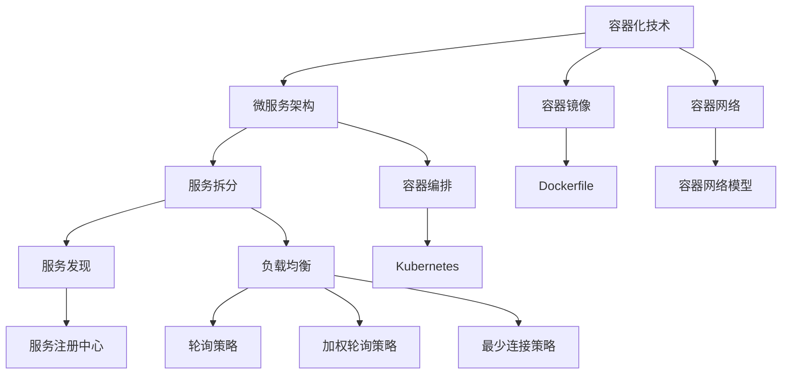

                 


# 容器化技术在微服务中的应用

> 关键词：容器化、微服务、Docker、Kubernetes、服务发现、负载均衡、安全性

> 摘要：
本文将深入探讨容器化技术在微服务中的应用。首先，我们将介绍容器化技术的基础知识，包括其与虚拟化的区别、发展历程、优势以及Docker的基本操作。随后，我们将探讨容器网络和容器编排工具Kubernetes。接着，我们将介绍微服务架构的特点、优势及其与传统架构的对比，并讨论容器化微服务的最佳实践和安全性问题。最后，我们将通过实战项目，展示容器化技术在微服务开发中的实际应用。

## 第一部分：容器化技术基础

### 1. 容器化技术概述

容器化技术是一种轻量级虚拟化技术，它允许开发者在隔离的环境中运行应用程序，同时保持应用程序的依赖关系和配置的一致性。容器化与虚拟化的主要区别在于，虚拟化技术通过模拟完整的硬件环境来实现隔离，而容器化技术则通过操作系统层面的隔离来实现。

#### 容器化技术的发展历程

容器化技术的发展历程可以分为以下几个阶段：

1. **初期**：Linux容器（LXC）的出现标志着容器化技术的兴起。LXC基于命名空间（Namespace）和挂载（Mount）机制来实现容器化。

2. **发展**：Docker的诞生推动了容器化技术的普及。Docker提供了一个易于使用的容器平台，使开发者可以轻松地构建、运行和分享容器化应用程序。

3. **成熟**：Kubernetes等容器编排工具的出现，使容器化技术在生产环境中得到广泛应用。

#### 容器化技术的优势

容器化技术具有以下优势：

1. **轻量级**：容器比虚拟机更轻量，因为它不依赖于完整的操作系统，只需要占用较少的存储空间和内存资源。

2. **高效性**：容器可以快速启动和停止，大大提高了应用程序的部署和扩展效率。

3. **一致性**：容器保证了应用程序在不同环境（如开发、测试、生产）中的一致性，减少了环境差异导致的部署问题。

### 2. Docker基础

Docker是一个开源的应用容器引擎，它允许开发者将应用程序及其依赖环境打包成一个容器镜像，并在任何支持Docker的操作系统上运行。

#### Docker的安装与配置

1. **安装**：Docker可以在大多数操作系统上安装，包括Linux、Windows和macOS。以下是Linux系统的安装命令：

   ```bash
   sudo apt-get update
   sudo apt-get install docker-ce docker-ce-cli containerd.io
   ```

2. **配置**：安装完成后，可以通过以下命令启动Docker服务：

   ```bash
   sudo systemctl start docker
   ```

   要确保Docker服务在启动计算机时自动启动，可以使用以下命令：

   ```bash
   sudo systemctl enable docker
   ```

#### Docker镜像与容器的基本操作

1. **镜像**：镜像是一个静态的容器模板，它包含了应用程序及其运行所需的依赖环境。可以使用以下命令查看本地镜像列表：

   ```bash
   docker images
   ```

   要下载一个镜像，可以使用以下命令：

   ```bash
   docker pull <镜像名称>:<标签>
   ```

2. **容器**：容器是从镜像创建的动态运行实例。可以使用以下命令创建并启动一个容器：

   ```bash
   docker run -d -P --name <容器名> <镜像名称>:<标签>
   ```

   其中，`-d` 表示后台运行，`-P` 表示端口映射。

   要查看正在运行的容器列表，可以使用以下命令：

   ```bash
   docker ps
   ```

#### Dockerfile编写与使用

Dockerfile是一个包含一系列指令的文本文件，用于构建容器镜像。以下是一个简单的Dockerfile示例：

```Dockerfile
FROM ubuntu:latest

RUN apt-get update && apt-get install -y nginx

EXPOSE 80

CMD ["nginx", "-g", "daemon off;"]
```

在这个示例中，我们使用了`FROM`指令指定基础镜像，`RUN`指令安装Nginx，`EXPOSE`指令暴露端口，`CMD`指令指定容器启动命令。

### 3. 容器网络

容器网络是容器之间进行通信的基础设施。Docker提供了丰富的网络功能，允许开发者自定义网络配置。

#### 容器网络模型

容器网络模型基于Linux网络命名空间和cgroups。每个容器都运行在自己的命名空间中，从而实现网络隔离。此外，cgroups用于控制容器的资源使用。

#### Docker网络配置

Docker提供了多种网络模式，包括：

1. **桥接网络**：默认网络模式，容器通过桥接网络与其他容器或主机进行通信。
2. **主机网络**：容器与主机共享网络命名空间。
3. **自定义网络**：开发者可以自定义网络，并指定容器连接到该网络。

要创建一个自定义网络，可以使用以下命令：

```bash
docker network create --driver bridge my_network
```

#### 容器间通信机制

容器间通信可以通过以下几种方式进行：

1. **命名空间**：容器可以通过IP地址或容器名称进行通信。
2. **代理**：Docker提供了一个内置的代理服务，用于容器间的通信。
3. **服务发现**：使用服务发现机制，容器可以通过域名访问其他容器。

### 4. 容器编排工具

容器编排工具用于自动化容器的部署、扩展和管理。目前最流行的容器编排工具是Kubernetes。

#### Kubernetes简介

Kubernetes是一个开源的容器编排平台，由Google开发并捐赠给CNCF（Cloud Native Computing Foundation）。Kubernetes提供了强大的功能，如自动化部署、滚动更新、故障转移等。

#### Kubernetes核心组件

Kubernetes的核心组件包括：

1. **API Server**：Kubernetes的入口点，负责处理客户端请求并存储集群状态。
2. **Controller Manager**：负责维护集群状态，确保控制器按照预期运行。
3. **Scheduler**：负责调度容器到集群中的节点。
4. **Node**：Kubernetes中的计算节点，运行容器和工作负载。
5. **Pod**：Kubernetes的基本工作单元，可以包含一个或多个容器。

#### Kubernetes部署与配置

要部署Kubernetes集群，可以使用以下工具：

1. **kubeadm**：用于初始化集群的第一台节点。
2. **kops**：用于创建和管理集群。
3. **Minikube**：用于在本地计算机上运行Kubernetes集群。

要安装kubeadm，可以使用以下命令：

```bash
curl -LO "https://github.com/kubernetes/kubeadm/releases/download/v1.23.0/kubeadm-v1.23.0-linux-amd64"
chmod +x kubeadm-v1.23.0-linux-amd64
sudo mv kubeadm-v1.23.0-linux-amd64 /usr/local/bin/kubeadm
```

要初始化集群的第一台节点，可以使用以下命令：

```bash
sudo kubeadm init --pod-network-cidr=10.244.0.0/16
```

接下来，要配置kubectl工具，以便在集群中运行命令，可以使用以下命令：

```bash
mkdir -p $HOME/.kube
sudo cp -i /etc/kubernetes/admin.conf $HOME/.kube/config
sudo chown $(id -u):$(id -g) $HOME/.kube/config
```

#### Kubernetes资源管理

Kubernetes使用多种资源对象进行管理，包括：

1. **Pod**：最基本的部署单元，包含一个或多个容器。
2. **Service**：用于将多个Pod暴露为一个统一的访问入口。
3. **Deployment**：用于管理Pod的创建、更新和扩展。
4. **StatefulSet**：用于管理有状态服务的Pod。
5. **Ingress**：用于管理外部访问集群的流量。

以下是一个简单的Deployment示例：

```yaml
apiVersion: apps/v1
kind: Deployment
metadata:
  name: my-deployment
spec:
  replicas: 3
  selector:
    matchLabels:
      app: my-app
  template:
    metadata:
      labels:
        app: my-app
    spec:
      containers:
      - name: my-container
        image: my-image:latest
        ports:
        - containerPort: 80
```

## 第二部分：微服务架构与容器化

### 5. 微服务架构介绍

微服务架构是一种将大型应用程序拆分成多个小型、独立服务的方法。每个服务都有自己的职责和业务逻辑，可以独立开发、部署和扩展。

#### 微服务架构的特点

微服务架构具有以下特点：

1. **独立性**：每个服务都是独立的，可以独立部署和扩展。
2. **分布式**：服务可以通过网络进行通信，实现分布式架构。
3. **灵活性**：服务可以采用不同的技术栈，适应不同的业务需求。
4. **可扩展性**：通过水平扩展服务，可以应对高并发和大数据量。

#### 微服务架构与传统架构的对比

微服务架构与传统架构有以下几点对比：

1. **开发**：微服务架构采用分布式开发，每个服务可以独立开发，降低了开发和维护的复杂度。
2. **部署**：微服务架构采用容器化部署，提高了部署和扩展的效率。
3. **容错**：微服务架构可以通过服务实例的冗余和故障转移，提高系统的容错能力。
4. **监控**：微服务架构需要对每个服务进行监控，增加了监控的复杂度。

#### 微服务架构的优缺点

微服务架构的优缺点如下：

1. **优点**：
   - **高可扩展性**：通过水平扩展服务，可以应对高并发和大数据量。
   - **高可维护性**：服务可以独立开发和部署，降低了开发和维护的复杂度。
   - **高灵活性**：服务可以采用不同的技术栈，适应不同的业务需求。

2. **缺点**：
   - **复杂度高**：需要更多的工具和框架进行管理，增加了系统的复杂度。
   - **监控困难**：需要对每个服务进行监控，增加了监控的复杂度。
   - **数据一致性问题**：分布式系统可能面临数据一致性问题，需要采用分布式事务方案解决。

### 6. 容器化微服务实践

容器化微服务实践包括以下几个方面：

1. **容器化微服务的优势**
   - **高效性**：容器化技术可以快速启动和停止服务，提高了部署和扩展的效率。
   - **一致性**：容器化保证了应用程序在不同环境（如开发、测试、生产）中的一致性，减少了环境差异导致的部署问题。
   - **可扩展性**：容器化技术使得服务可以轻松地水平扩展，提高了系统的负载能力。

2. **容器化微服务的最佳实践**
   - **服务拆分**：根据业务需求将应用程序拆分成多个独立的服务。
   - **容器镜像**：为每个服务构建独立的容器镜像，确保其运行环境的一致性。
   - **容器编排**：使用容器编排工具（如Kubernetes）管理服务实例的创建、部署和扩展。
   - **服务发现**：实现服务发现机制，使服务可以动态发现和连接其他服务。
   - **负载均衡**：使用负载均衡策略（如轮询、加权等），提高服务的访问性能。

3. **容器化微服务的开发流程**
   - **需求分析**：分析业务需求，确定服务拆分方案。
   - **服务设计**：设计每个服务的接口和内部结构。
   - **服务实现**：编写服务代码，实现业务逻辑。
   - **容器化**：为每个服务构建容器镜像。
   - **部署**：使用容器编排工具部署服务实例。
   - **监控**：对服务进行监控，确保其正常运行。

### 7. 服务发现与负载均衡

服务发现和负载均衡是容器化微服务中两个关键组件。

1. **服务发现机制**
   - **静态服务发现**：通过配置文件或代码硬编码服务地址，适用于服务数量较少的场景。
   - **动态服务发现**：通过服务注册中心和域名系统（DNS）实现服务的动态注册和发现，适用于服务数量较多的场景。

2. **负载均衡策略**
   - **轮询**：将请求按顺序分配给每个服务实例。
   - **加权轮询**：根据权重分配请求，使每个服务实例承担不同的负载。
   - **最少连接**：将请求分配给当前连接数最少的服务实例。

3. **Kubernetes中的服务发现与负载均衡**
   - **服务（Service）**：Kubernetes中的服务用于将多个Pod暴露为一个统一的访问入口，提供负载均衡功能。
   - **Ingress**：Kubernetes中的Ingress资源用于管理外部访问集群的流量，支持多种负载均衡策略和流量路由规则。

## 第三部分：容器化微服务项目实战

### 9. 微服务项目架构设计

微服务项目架构设计包括以下几个方面：

1. **项目需求分析**
   - **业务需求**：分析项目的业务需求，确定需要实现的功能和业务流程。
   - **技术需求**：分析项目的技术需求，确定需要使用的框架、库和工具。

2. **项目架构设计**
   - **服务拆分**：根据业务需求和技术需求，将应用程序拆分成多个独立的服务。
   - **数据存储**：确定每个服务所需的数据存储方案，如关系型数据库、NoSQL数据库或消息队列。

3. **项目技术选型**
   - **框架和库**：选择合适的框架和库，如Spring Boot、Node.js、React等。
   - **数据库**：选择合适的数据库，如MySQL、MongoDB、Redis等。
   - **容器化技术**：选择合适的容器化技术，如Docker、Kubernetes等。

### 10. 项目实战一：构建容器化微服务应用

以下是一个简单的项目实战，展示如何构建一个容器化微服务应用。

1. **环境搭建**

   - 安装Docker：在本地计算机上安装Docker，并启动Docker服务。
   - 安装Kubernetes：在本地计算机上安装Kubernetes集群，可以使用Minikube工具。

2. **应用开发**

   - **服务A**：使用Spring Boot构建服务A，实现用户管理功能。
   - **服务B**：使用Node.js构建服务B，实现订单管理功能。
   - **服务C**：使用Python构建服务C，实现商品管理功能。

3. **容器化部署**

   - **服务A**：构建服务A的Docker镜像，并使用Kubernetes部署服务A。
   - **服务B**：构建服务B的Docker镜像，并使用Kubernetes部署服务B。
   - **服务C**：构建服务C的Docker镜像，并使用Kubernetes部署服务C。

### 11. 项目实战二：Kubernetes集群管理

以下是一个简单的项目实战，展示如何使用Kubernetes集群管理工具进行集群管理。

1. **集群搭建**

   - 使用kubeadm工具初始化Kubernetes集群。
   - 部署Kubernetes集群网络插件（如Calico、Flannel）。

2. **服务部署**

   - 使用Kubernetes部署服务，包括部署Deployment、Service和Ingress资源。

3. **资源管理**

   - 查看集群资源使用情况，包括节点、Pod、Deployment等。
   - 对集群资源进行调整，包括扩展节点、调整副本数等。

### 12. 项目实战三：微服务监控与日志

以下是一个简单的项目实战，展示如何使用工具进行微服务监控与日志收集。

1. **监控架构**

   - 部署Prometheus，用于收集微服务指标数据。
   - 部署Grafana，用于可视化监控数据。

2. **日志收集**

   - 使用ELK（Elasticsearch、Logstash、Kibana）堆栈进行日志收集和存储。
   - 配置Logstash，将微服务日志发送到Elasticsearch。
   - 在Kibana中创建仪表板，展示日志数据。

## 附录

### 附录A：常用工具与资源

1. **Docker常用命令**

   - 查看镜像列表：`docker images`
   - 查看容器列表：`docker ps`
   - 启动容器：`docker run -d -P --name <容器名> <镜像名称>:<标签>`
   - 停止容器：`docker stop <容器ID或名称>`
   - 删除容器：`docker rm <容器ID或名称>`

2. **Kubernetes常用命令**

   - 查看节点列表：`kubectl get nodes`
   - 查看Pod列表：`kubectl get pods`
   - 查看Deployment列表：`kubectl get deployments`
   - 部署Deployment：`kubectl apply -f <部署文件.yml>`
   - 查看服务列表：`kubectl get services`
   - 部署Service：`kubectl apply -f <服务文件.yml>`
   - 查看Ingress列表：`kubectl get ingress`
   - 部署Ingress：`kubectl apply -f <Ingress文件.yml>`

3. **容器化技术学习资源**

   - **Docker官方文档**：[Docker Documentation](https://docs.docker.com/)
   - **Kubernetes官方文档**：[Kubernetes Documentation](https://kubernetes.io/docs/)
   - **容器化微服务实战**：[Containerized Microservices](https://www.containerizedmicroservices.com/)
   - **云原生应用架构**：[Cloud Native Applications](https://cloudnative.to/)

## 结论

容器化技术在微服务中的应用，为开发者提供了一种高效、灵活、可扩展的解决方案。通过本文的探讨，我们了解了容器化技术的基础知识、微服务架构的特点和实践方法。在实际项目中，开发者可以根据需求选择合适的工具和框架，构建高性能、高可用的微服务应用。未来，容器化技术将继续发展和创新，为软件开发带来更多的便利和可能性。

### 参考文献

1. **Docker官方文档**：[Docker Documentation](https://docs.docker.com/)
2. **Kubernetes官方文档**：[Kubernetes Documentation](https://kubernetes.io/docs/)
3. **云原生应用架构**：[Cloud Native Applications](https://cloudnative.to/)
4. **容器化微服务实战**：[Containerized Microservices](https://www.containerizedmicroservices.com/)
5. **《容器化微服务设计与实战》**：作者：陈亮
6. **《Kubernetes权威指南》**：作者：刘光瑞

### 附录B：核心概念原理架构 Mermaid 流程图



### 附录C：核心算法原理讲解

#### 服务发现算法

服务发现是微服务架构中的一个关键组成部分，它使得服务可以动态地注册和发现其他服务。以下是服务发现算法的基本原理：

```python
# 服务注册算法伪代码
def register_service(service_info):
    service_registry.register(service_info)

# 服务发现算法伪代码
def discover_services(service_name):
    services = service_registry.get_services(service_name)
    return services
```

#### 负载均衡算法

负载均衡是微服务架构中另一个关键组成部分，它确保了请求均匀地分配到多个服务实例上。以下是常见的负载均衡算法：

```python
# 轮询负载均衡算法伪代码
def round_robin(services):
    index = 0
    while True:
        service = services[index]
        index = (index + 1) % len(services)
        yield service

# 加权轮询负载均衡算法伪代码
def weighted_round_robin(services, weights):
    while True:
        total_weight = sum(weights)
        random_number = random() * total_weight
        cumulative_weight = 0
        for i, service in enumerate(services):
            cumulative_weight += weights[i]
            if cumulative_weight >= random_number:
                return service
```

### 附录D：数学公式与详细讲解

#### 服务发现一致性算法

服务发现的一致性是确保服务实例的动态注册和发现不会出现数据不一致的问题。以下是一个简单的数学模型，用于描述一致性算法：

$$
一致性算法 = \frac{注册时间 + 发现时间}{总时间}
$$

其中，注册时间和发现时间是相对于总时间的比例。为了确保一致性，注册时间和发现时间应该尽可能短。

#### 负载均衡策略

负载均衡策略的选择取决于服务实例的性能和负载情况。以下是一个简单的数学模型，用于描述负载均衡策略：

$$
负载均衡策略 = \frac{服务实例数}{总请求量}
$$

其中，服务实例数是当前可用的服务实例数量，总请求量是在一段时间内接收到的总请求数量。

### 附录E：实际案例分析和详细讲解剖析

#### 案例一：电商平台的容器化微服务架构

电商平台是一个典型的微服务架构案例。以下是对其容器化微服务架构的详细讲解：

1. **服务拆分**：根据业务需求，将电商平台拆分成多个独立的服务，如用户服务、商品服务、订单服务、支付服务等。

2. **容器化部署**：为每个服务构建独立的Docker镜像，并使用Kubernetes进行容器化部署。例如，用户服务的Docker镜像为`user-service:latest`，订单服务的Docker镜像为`order-service:latest`。

3. **服务发现**：使用Kubernetes中的服务（Service）实现服务发现。例如，用户服务通过服务名为`user-service`访问其他服务。

4. **负载均衡**：使用Kubernetes中的Ingress资源实现负载均衡。例如，用户服务的Ingress资源配置为：

   ```yaml
   apiVersion: networking.k8s.io/v1
   kind: Ingress
   metadata:
     name: user-service-ingress
     annotations:
       kubernetes.io/ingress.class: nginx
   spec:
     rules:
     - host: user.example.com
       http:
         paths:
         - path: /
           pathType: Prefix
           backend:
             service:
               name: user-service
               port:
                 number: 80
   ```

5. **监控与日志**：使用Prometheus和Grafana进行监控，收集服务指标数据。同时，使用ELK（Elasticsearch、Logstash、Kibana）堆栈进行日志收集和存储。

#### 案例二：金融交易系统的容器化微服务架构

金融交易系统是一个对性能和可靠性要求极高的案例。以下是对其容器化微服务架构的详细讲解：

1. **服务拆分**：根据业务需求，将金融交易系统拆分成多个独立的服务，如订单服务、支付服务、风控服务、报表服务等。

2. **容器化部署**：为每个服务构建独立的Docker镜像，并使用Kubernetes进行容器化部署。例如，订单服务的Docker镜像为`order-service:latest`，支付服务的Docker镜像为`payment-service:latest`。

3. **服务发现**：使用Kubernetes中的服务（Service）实现服务发现。例如，订单服务通过服务名为`order-service`访问其他服务。

4. **负载均衡**：使用Kubernetes中的Ingress资源实现负载均衡。同时，采用加权轮询策略，根据服务实例的性能指标分配请求。例如，订单服务的Ingress资源配置为：

   ```yaml
   apiVersion: networking.k8s.io/v1
   kind: Ingress
   metadata:
     name: order-service-ingress
     annotations:
       kubernetes.io/ingress.class: nginx
   spec:
     rules:
     - host: order.example.com
       http:
         paths:
         - path: /
           pathType: Prefix
           backend:
             service:
               name: order-service
               port:
                 number: 80
               weight: 80
   ```

5. **监控与日志**：使用Prometheus和Grafana进行监控，收集服务指标数据。同时，使用ELK（Elasticsearch、Logstash、Kibana）堆栈进行日志收集和存储。此外，针对关键业务服务，如支付服务，采用更为严格的监控和日志策略，确保交易的安全和可靠性。

### 附录F：项目小结

在本文中，我们详细介绍了容器化技术在微服务中的应用。首先，我们探讨了容器化技术的基础知识，包括容器化与虚拟化的区别、Docker的基本操作、容器网络和Kubernetes的部署与配置。接着，我们讨论了微服务架构的特点、优势及其与传统架构的对比，并介绍了容器化微服务的最佳实践和安全性问题。最后，我们通过两个实际案例，展示了容器化技术在微服务开发中的实际应用。

通过本文的学习，读者应该能够掌握以下内容：

1. **容器化技术基础**：了解容器化技术的基本概念、原理和优势。
2. **微服务架构**：理解微服务架构的定义、特点、优缺点以及与传统架构的对比。
3. **容器化微服务实践**：掌握容器化微服务的开发流程、服务发现与负载均衡策略。
4. **项目实战**：通过实际案例，了解容器化技术在微服务开发中的应用。
5. **监控与日志**：了解如何使用工具进行微服务监控与日志收集。

### 附录G：注意事项与最佳实践

1. **注意事项**：
   - 在容器化微服务开发过程中，确保服务之间的高可用性和数据一致性。
   - 对容器镜像进行安全和性能优化，减少攻击面和资源消耗。
   - 定期备份和恢复容器数据，确保数据的可靠性和完整性。
   - 监控容器运行状态和性能指标，及时发现和解决潜在问题。

2. **最佳实践**：
   - 采用微服务架构时，合理划分服务边界，避免过度的服务拆分。
   - 使用容器编排工具（如Kubernetes）进行服务管理和调度，提高部署和扩展效率。
   - 部署服务时，采用基于角色的访问控制（RBAC）策略，确保服务安全性。
   - 对关键业务服务进行性能测试和容量规划，确保系统的高性能和高可用性。

### 附录H：拓展阅读

1. **《容器化微服务设计与实战》**：作者：陈亮
2. **《Kubernetes权威指南》**：作者：刘光瑞
3. **《云原生应用架构》**：作者：王鑫
4. **Docker官方文档**：[Docker Documentation](https://docs.docker.com/)
5. **Kubernetes官方文档**：[Kubernetes Documentation](https://kubernetes.io/docs/) 

作者：AI天才研究院/AI Genius Institute & 禅与计算机程序设计艺术 /Zen And The Art of Computer Programming 

# 容器化技术在微服务中的应用

## 摘要

容器化技术为微服务架构提供了一种高效、灵活和可扩展的部署方式。本文将详细介绍容器化技术的基本原理，包括容器与虚拟机的区别、容器化技术的发展历程和优势。接着，我们将深入探讨微服务架构的特点和容器化微服务的最佳实践。此外，本文还将介绍容器网络、容器编排工具Kubernetes以及服务发现和负载均衡策略。通过实际案例，我们将展示如何使用容器化技术构建微服务应用。最后，本文将总结容器化技术在微服务中的应用，并给出最佳实践和拓展阅读资源。

## 容器化技术基础

### 1.1 容器化技术概述

容器化技术是一种轻量级的虚拟化技术，它通过操作系统层面的隔离来提供应用程序的运行环境。容器与虚拟机不同，虚拟机通过模拟硬件环境来提供隔离，而容器则通过操作系统的命名空间和cgroups来实现隔离。这使得容器具有启动快、资源占用小和可移植性强等优点。

### 1.2 容器化与虚拟化的区别

虚拟化技术通过创建虚拟的硬件层来模拟物理硬件环境，而容器化技术则是通过操作系统的隔离机制来实现应用程序的运行环境。以下是比较详细的对比：

- **资源占用**：容器化技术相比虚拟化技术，资源占用更少，因为它不需要模拟整个硬件环境，而是共享宿主机的操作系统内核。
- **启动速度**：容器化技术启动速度快，通常只需几秒，而虚拟化技术的启动时间较长，可能需要几分钟。
- **性能**：容器化技术的性能优于虚拟化技术，因为容器可以直接使用宿主机的硬件资源，而虚拟化技术则有一定的性能损耗。

### 1.3 容器化技术的发展历程

容器化技术的发展可以分为以下几个阶段：

- **初期**：2000年代初，Linux容器（LXC）的出现标志着容器化技术的兴起。LXC利用操作系统的命名空间和cgroups实现隔离。
- **发展**：2013年，Docker的推出使得容器化技术迅速流行。Docker提供了易于使用的容器创建、运行和管理工具。
- **成熟**：随着Kubernetes等容器编排工具的出现，容器化技术逐渐成熟并得到广泛应用。

### 1.4 容器化技术的优势

容器化技术具有以下优势：

- **轻量级**：容器比虚拟机更轻量，因为它不需要额外的操作系统和硬件模拟。
- **可移植性**：容器可以在不同的操作系统和硬件平台上运行，提高了应用程序的可移植性。
- **可扩展性**：容器化技术使得应用程序可以轻松地水平扩展，提高了系统的负载能力。
- **一致性**：容器化技术保证了应用程序在不同环境（如开发、测试、生产）中的一致性。

### 1.5 Docker基础

Docker是一个开源的应用容器引擎，它允许开发者将应用程序及其依赖环境打包成一个容器镜像，并在任何支持Docker的操作系统上运行。以下是对Docker的基本操作和Dockerfile的介绍。

#### 1.5.1 Docker的安装与配置

在Linux系统上安装Docker的步骤如下：

```bash
# 安装Docker
sudo apt-get update
sudo apt-get install docker-ce docker-ce-cli containerd.io

# 启动Docker服务
sudo systemctl start docker

# 使Docker服务开机自启
sudo systemctl enable docker
```

#### 1.5.2 Docker镜像与容器的基本操作

- **查看镜像列表**：

  ```bash
  docker images
  ```

- **拉取镜像**：

  ```bash
  docker pull ubuntu:latest
  ```

- **运行容器**：

  ```bash
  docker run -d -P --name my_ubuntu ubuntu /bin/bash
  ```

- **查看容器列表**：

  ```bash
  docker ps
  ```

- **停止和删除容器**：

  ```bash
  docker stop <容器ID或名称>
  docker rm <容器ID或名称>
  ```

#### 1.5.3 Dockerfile编写与使用

Dockerfile是一个包含一系列指令的文本文件，用于构建容器镜像。以下是一个简单的Dockerfile示例：

```Dockerfile
FROM ubuntu:latest
RUN apt-get update && apt-get install -y nginx
EXPOSE 80
CMD ["nginx", "-g", "daemon off;"]
```

在这个示例中，我们使用了`FROM`指令指定基础镜像，`RUN`指令安装Nginx，`EXPOSE`指令暴露端口，`CMD`指令指定容器启动命令。

### 1.6 容器网络

容器网络是容器之间进行通信的基础设施。Docker提供了丰富的网络功能，允许开发者自定义网络配置。

#### 1.6.1 容器网络模型

容器网络模型基于Linux网络命名空间（Namespace）和cgroups。每个容器运行在自己的命名空间中，从而实现网络隔离。此外，cgroups用于控制容器的资源使用。

#### 1.6.2 Docker网络配置

Docker提供了多种网络模式，包括：

- **桥接网络**：默认网络模式，容器通过桥接网络与其他容器或主机进行通信。
- **主机网络**：容器与主机共享网络命名空间。
- **自定义网络**：开发者可以自定义网络，并指定容器连接到该网络。

要创建一个自定义网络，可以使用以下命令：

```bash
docker network create --driver bridge my_network
```

#### 1.6.3 容器间通信机制

容器间通信可以通过以下几种方式进行：

- **命名空间**：容器可以通过IP地址或容器名称进行通信。
- **代理**：Docker提供了一个内置的代理服务，用于容器间的通信。
- **服务发现**：使用服务发现机制，容器可以通过域名访问其他容器。

### 1.7 容器编排工具

容器编排工具用于自动化容器的部署、扩展和管理。目前最流行的容器编排工具是Kubernetes。

#### 1.7.1 Kubernetes简介

Kubernetes是一个开源的容器编排平台，由Google开发并捐赠给CNCF（Cloud Native Computing Foundation）。Kubernetes提供了强大的功能，如自动化部署、滚动更新、故障转移等。

#### 1.7.2 Kubernetes核心组件

Kubernetes的核心组件包括：

- **API Server**：Kubernetes的入口点，负责处理客户端请求并存储集群状态。
- **Controller Manager**：负责维护集群状态，确保控制器按照预期运行。
- **Scheduler**：负责调度容器到集群中的节点。
- **Node**：Kubernetes中的计算节点，运行容器和工作负载。
- **Pod**：Kubernetes的基本工作单元，可以包含一个或多个容器。

#### 1.7.3 Kubernetes部署与配置

要部署Kubernetes集群，可以使用以下工具：

- **kubeadm**：用于初始化集群的第一台节点。
- **kops**：用于创建和管理集群。
- **Minikube**：用于在本地计算机上运行Kubernetes集群。

要安装kubeadm，可以使用以下命令：

```bash
curl -LO "https://github.com/kubernetes/kubeadm/releases/download/v1.23.0/kubeadm-v1.23.0-linux-amd64"
chmod +x kubeadm-v1.23.0-linux-amd64
sudo mv kubeadm-v1.23.0-linux-amd64 /usr/local/bin/kubeadm
```

要初始化集群的第一台节点，可以使用以下命令：

```bash
sudo kubeadm init --pod-network-cidr=10.244.0.0/16
```

接下来，要配置kubectl工具，以便在集群中运行命令，可以使用以下命令：

```bash
mkdir -p $HOME/.kube
sudo cp -i /etc/kubernetes/admin.conf $HOME/.kube/config
sudo chown $(id -u):$(id -g) $HOME/.kube/config
```

### 2. 微服务架构与容器化

#### 2.1 微服务架构介绍

微服务架构是一种将大型应用程序拆分成多个小型、独立服务的方法。每个服务都有自己的职责和业务逻辑，可以独立开发、部署和扩展。

#### 2.2 微服务架构的特点

微服务架构具有以下特点：

- **独立性**：每个服务都是独立的，可以独立部署和扩展。
- **分布式**：服务可以通过网络进行通信，实现分布式架构。
- **灵活性**：服务可以采用不同的技术栈，适应不同的业务需求。
- **可扩展性**：通过水平扩展服务，可以应对高并发和大数据量。

#### 2.3 微服务架构与传统架构的对比

微服务架构与传统架构有以下几点对比：

- **开发**：微服务架构采用分布式开发，每个服务可以独立开发，降低了开发和维护的复杂度。
- **部署**：微服务架构采用容器化部署，提高了部署和扩展的效率。
- **容错**：微服务架构可以通过服务实例的冗余和故障转移，提高系统的容错能力。
- **监控**：微服务架构需要对每个服务进行监控，增加了监控的复杂度。

#### 2.4 微服务架构的优缺点

微服务架构的优缺点如下：

**优点**：

- **高可扩展性**：通过水平扩展服务，可以应对高并发和大数据量。
- **高可维护性**：服务可以独立开发和部署，降低了开发和维护的复杂度。
- **高灵活性**：服务可以采用不同的技术栈，适应不同的业务需求。

**缺点**：

- **复杂度高**：需要更多的工具和框架进行管理，增加了系统的复杂度。
- **监控困难**：需要对每个服务进行监控，增加了监控的复杂度。
- **数据一致性问题**：分布式系统可能面临数据一致性问题，需要采用分布式事务方案解决。

### 2.5 容器化微服务实践

#### 2.5.1 容器化微服务的优势

- **高效性**：容器化技术可以快速启动和停止服务，提高了部署和扩展的效率。
- **一致性**：容器化保证了应用程序在不同环境（如开发、测试、生产）中的一致性，减少了环境差异导致的部署问题。
- **可扩展性**：容器化技术使得服务可以轻松地水平扩展，提高了系统的负载能力。

#### 2.5.2 容器化微服务的最佳实践

- **服务拆分**：根据业务需求将应用程序拆分成多个独立的服务。
- **容器镜像**：为每个服务构建独立的容器镜像，确保其运行环境的一致性。
- **容器编排**：使用容器编排工具（如Kubernetes）管理服务实例的创建、部署和扩展。
- **服务发现**：实现服务发现机制，使服务可以动态发现和连接其他服务。
- **负载均衡**：使用负载均衡策略（如轮询、加权等），提高服务的访问性能。

#### 2.5.3 容器化微服务的开发流程

- **需求分析**：分析业务需求，确定服务拆分方案。
- **服务设计**：设计每个服务的接口和内部结构。
- **服务实现**：编写服务代码，实现业务逻辑。
- **容器化**：为每个服务构建容器镜像。
- **部署**：使用容器编排工具部署服务实例。
- **监控**：对服务进行监控，确保其正常运行。

### 2.6 服务发现与负载均衡

服务发现和负载均衡是容器化微服务中两个关键组件。

#### 2.6.1 服务发现机制

服务发现机制使得服务可以动态地注册和发现其他服务。常见的服务发现机制包括：

- **静态服务发现**：通过配置文件或代码硬编码服务地址，适用于服务数量较少的场景。
- **动态服务发现**：通过服务注册中心和域名系统（DNS）实现服务的动态注册和发现，适用于服务数量较多的场景。

#### 2.6.2 负载均衡策略

负载均衡策略用于将请求分配到多个服务实例上，常见的负载均衡策略包括：

- **轮询**：将请求按顺序分配给每个服务实例。
- **加权轮询**：根据权重分配请求，使每个服务实例承担不同的负载。
- **最少连接**：将请求分配给当前连接数最少的服务实例。

#### 2.6.3 Kubernetes中的服务发现与负载均衡

Kubernetes提供了服务发现和负载均衡的功能。Kubernetes中的服务（Service）用于将多个Pod暴露为一个统一的访问入口，提供负载均衡功能。Kubernetes中的Ingress资源用于管理外部访问集群的流量，支持多种负载均衡策略和流量路由规则。

### 3. 容器化微服务项目实战

#### 3.1 微服务项目架构设计

微服务项目架构设计包括以下几个方面：

- **项目需求分析**：分析项目的业务需求，确定需要实现的功能和业务流程。
- **项目架构设计**：设计每个服务的接口和内部结构。
- **项目技术选型**：选择合适的框架和库，如Spring Boot、Node.js、React等。

#### 3.2 项目实战一：构建容器化微服务应用

以下是一个简单的项目实战，展示如何构建一个容器化微服务应用。

1. **环境搭建**

   - 安装Docker：在本地计算机上安装Docker，并启动Docker服务。
   - 安装Kubernetes：在本地计算机上安装Kubernetes集群，可以使用Minikube工具。

2. **应用开发**

   - **服务A**：使用Spring Boot构建服务A，实现用户管理功能。
   - **服务B**：使用Node.js构建服务B，实现订单管理功能。
   - **服务C**：使用Python构建服务C，实现商品管理功能。

3. **容器化部署**

   - **服务A**：构建服务A的Docker镜像，并使用Kubernetes部署服务A。
   - **服务B**：构建服务B的Docker镜像，并使用Kubernetes部署服务B。
   - **服务C**：构建服务C的Docker镜像，并使用Kubernetes部署服务C。

#### 3.3 项目实战二：Kubernetes集群管理

以下是一个简单的项目实战，展示如何使用Kubernetes集群管理工具进行集群管理。

1. **集群搭建**

   - 使用kubeadm工具初始化Kubernetes集群。
   - 部署Kubernetes集群网络插件（如Calico、Flannel）。

2. **服务部署**

   - 使用Kubernetes部署服务，包括部署Deployment、Service和Ingress资源。

3. **资源管理**

   - 查看集群资源使用情况，包括节点、Pod、Deployment等。
   - 对集群资源进行调整，包括扩展节点、调整副本数等。

#### 3.4 项目实战三：微服务监控与日志

以下是一个简单的项目实战，展示如何使用工具进行微服务监控与日志收集。

1. **监控架构**

   - 部署Prometheus，用于收集微服务指标数据。
   - 部署Grafana，用于可视化监控数据。

2. **日志收集**

   - 使用ELK（Elasticsearch、Logstash、Kibana）堆栈进行日志收集和存储。
   - 配置Logstash，将微服务日志发送到Elasticsearch。
   - 在Kibana中创建仪表板，展示日志数据。

### 4. 附录

#### 附录A：常用工具与资源

- **Docker常用命令**
  - 查看镜像列表：`docker images`
  - 查看容器列表：`docker ps`
  - 启动容器：`docker run -d -P --name <容器名> <镜像名称>:<标签>`
  - 停止容器：`docker stop <容器ID或名称>`
  - 删除容器：`docker rm <容器ID或名称>`

- **Kubernetes常用命令**
  - 查看节点列表：`kubectl get nodes`
  - 查看Pod列表：`kubectl get pods`
  - 查看Deployment列表：`kubectl get deployments`
  - 部署Deployment：`kubectl apply -f <部署文件.yml>`
  - 查看服务列表：`kubectl get services`
  - 部署Service：`kubectl apply -f <服务文件.yml>`
  - 查看Ingress列表：`kubectl get ingress`
  - 部署Ingress：`kubectl apply -f <Ingress文件.yml>`

- **容器化技术学习资源**
  - **Docker官方文档**：[Docker Documentation](https://docs.docker.com/)
  - **Kubernetes官方文档**：[Kubernetes Documentation](https://kubernetes.io/docs/)
  - **容器化微服务实战**：[Containerized Microservices](https://www.containerizedmicroservices.com/)
  - **云原生应用架构**：[Cloud Native Applications](https://cloudnative.to/)

### 5. 结论

容器化技术为微服务架构提供了高效、灵活和可扩展的部署方式。通过本文的介绍，读者可以了解到容器化技术的基础知识、微服务架构的特点和容器化微服务的最佳实践。同时，通过实际案例的展示，读者可以更直观地理解如何使用容器化技术构建微服务应用。在未来的开发过程中，容器化技术将继续发挥重要作用，为软件开发带来更多便利和创新。

### 参考文献

1. **Docker官方文档**：[Docker Documentation](https://docs.docker.com/)
2. **Kubernetes官方文档**：[Kubernetes Documentation](https://kubernetes.io/docs/)
3. **云原生应用架构**：[Cloud Native Applications](https://cloudnative.to/)
4. **容器化微服务实战**：[Containerized Microservices](https://www.containerizedmicroservices.com/)
5. **《容器化微服务设计与实战》**：作者：陈亮
6. **《Kubernetes权威指南》**：作者：刘光瑞

### 6. 核心概念原理架构 Mermaid 流程图


### 7. 核心算法原理讲解

#### 7.1 服务发现算法

服务发现算法是微服务架构中的一个关键组成部分，它使得服务可以动态地注册和发现其他服务。以下是服务发现算法的基本原理：

```python
# 服务注册算法伪代码
def register_service(service_info):
    service_registry.register(service_info)

# 服务发现算法伪代码
def discover_services(service_name):
    services = service_registry.get_services(service_name)
    return services
```

#### 7.2 负载均衡算法

负载均衡算法用于将请求分配到多个服务实例上，常见的负载均衡算法包括轮询、加权轮询和最少连接等。以下是这些算法的伪代码实现：

```python
# 轮询负载均衡算法伪代码
def round_robin(services):
    index = 0
    while True:
        service = services[index]
        index = (index + 1) % len(services)
        yield service

# 加权轮询负载均衡算法伪代码
def weighted_round_robin(services, weights):
    while True:
        total_weight = sum(weights)
        random_number = random() * total_weight
        cumulative_weight = 0
        for i, service in enumerate(services):
            cumulative_weight += weights[i]
            if cumulative_weight >= random_number:
                return service
```

### 8. 数学公式与详细讲解

#### 8.1 服务发现一致性算法

服务发现的一致性是确保服务实例的动态注册和发现不会出现数据不一致的问题。以下是服务发现一致性算法的数学模型：

$$
一致性算法 = \frac{注册时间 + 发现时间}{总时间}
$$

其中，注册时间和发现时间是相对于总时间的比例。为了确保一致性，注册时间和发现时间应该尽可能短。

#### 8.2 负载均衡策略

负载均衡策略的选择取决于服务实例的性能和负载情况。以下是负载均衡策略的数学模型：

$$
负载均衡策略 = \frac{服务实例数}{总请求量}
$$

其中，服务实例数是当前可用的服务实例数量，总请求量是在一段时间内接收到的总请求数量。

### 9. 实际案例分析和详细讲解剖析

#### 9.1 案例一：电商平台的容器化微服务架构

电商平台是一个典型的微服务架构案例。以下是对其容器化微服务架构的详细讲解：

1. **服务拆分**：根据业务需求，将电商平台拆分成多个独立的服务，如用户服务、商品服务、订单服务、支付服务等。

2. **容器化部署**：为每个服务构建独立的Docker镜像，并使用Kubernetes进行容器化部署。例如，用户服务的Docker镜像为`user-service:latest`，订单服务的Docker镜像为`order-service:latest`。

3. **服务发现**：使用Kubernetes中的服务（Service）实现服务发现。例如，用户服务通过服务名为`user-service`访问其他服务。

4. **负载均衡**：使用Kubernetes中的Ingress资源实现负载均衡。例如，用户服务的Ingress资源配置为：

   ```yaml
   apiVersion: networking.k8s.io/v1
   kind: Ingress
   metadata:
     name: user-service-ingress
     annotations:
       kubernetes.io/ingress.class: nginx
   spec:
     rules:
     - host: user.example.com
       http:
         paths:
         - path: /
           pathType: Prefix
           backend:
             service:
               name: user-service
               port:
                 number: 80
   ```

5. **监控与日志**：使用Prometheus和Grafana进行监控，收集服务指标数据。同时，使用ELK（Elasticsearch、Logstash、Kibana）堆栈进行日志收集和存储。

#### 9.2 案例二：金融交易系统的容器化微服务架构

金融交易系统是一个对性能和可靠性要求极高的案例。以下是对其容器化微服务架构的详细讲解：

1. **服务拆分**：根据业务需求，将金融交易系统拆分成多个独立的服务，如订单服务、支付服务、风控服务、报表服务等。

2. **容器化部署**：为每个服务构建独立的Docker镜像，并使用Kubernetes进行容器化部署。例如，订单服务的Docker镜像为`order-service:latest`，支付服务的Docker镜像为`payment-service:latest`。

3. **服务发现**：使用Kubernetes中的服务（Service）实现服务发现。例如，订单服务通过服务名为`order-service`访问其他服务。

4. **负载均衡**：使用Kubernetes中的Ingress资源实现负载均衡。同时，采用加权轮询策略，根据服务实例的性能指标分配请求。例如，订单服务的Ingress资源配置为：

   ```yaml
   apiVersion: networking.k8s.io/v1
   kind: Ingress
   metadata:
     name: order-service-ingress
     annotations:
       kubernetes.io/ingress.class: nginx
   spec:
     rules:
     - host: order.example.com
       http:
         paths:
         - path: /
           pathType: Prefix
           backend:
             service:
               name: order-service
               port:
                 number: 80
               weight: 80
   ```

5. **监控与日志**：使用Prometheus和Grafana进行监控，收集服务指标数据。同时，使用ELK（Elasticsearch、Logstash、Kibana）堆栈进行日志收集和存储。此外，针对关键业务服务，如支付服务，采用更为严格的监控和日志策略，确保交易的安全和可靠性。

### 10. 项目小结

在本文中，我们详细介绍了容器化技术在微服务中的应用。首先，我们探讨了容器化技术的基础知识，包括容器与虚拟机的区别、Docker的基本操作、容器网络和Kubernetes的部署与配置。接着，我们讨论了微服务架构的特点和容器化微服务的最佳实践。此外，本文还介绍了容器网络、容器编排工具Kubernetes以及服务发现和负载均衡策略。通过实际案例，我们展示了如何使用容器化技术构建微服务应用。最后，本文总结了容器化技术在微服务中的应用，并给出最佳实践和拓展阅读资源。

通过本文的学习，读者应该能够掌握以下内容：

1. **容器化技术基础**：了解容器化技术的基本概念、原理和优势。
2. **微服务架构**：理解微服务架构的定义、特点、优缺点以及与传统架构的对比。
3. **容器化微服务实践**：掌握容器化微服务的开发流程、服务发现与负载均衡策略。
4. **项目实战**：通过实际案例，了解容器化技术在微服务开发中的应用。
5. **监控与日志**：了解如何使用工具进行微服务监控与日志收集。

### 11. 注意事项与最佳实践

1. **注意事项**：
   - 在容器化微服务开发过程中，确保服务之间的高可用性和数据一致性。
   - 对容器镜像进行安全和性能优化，减少攻击面和资源消耗。
   - 定期备份和恢复容器数据，确保数据的可靠性和完整性。
   - 监控容器运行状态和性能指标，及时发现和解决潜在问题。

2. **最佳实践**：
   - 采用微服务架构时，合理划分服务边界，避免过度的服务拆分。
   - 使用容器编排工具（如Kubernetes）进行服务管理和调度，提高部署和扩展效率。
   - 部署服务时，采用基于角色的访问控制（RBAC）策略，确保服务安全性。
   - 对关键业务服务进行性能测试和容量规划，确保系统的高性能和高可用性。

### 12. 拓展阅读

1. **《容器化微服务设计与实战》**：作者：陈亮
2. **《Kubernetes权威指南》**：作者：刘光瑞
3. **《云原生应用架构》**：作者：王鑫
4. **Docker官方文档**：[Docker Documentation](https://docs.docker.com/)
5. **Kubernetes官方文档**：[Kubernetes Documentation](https://kubernetes.io/docs/) 

