                 


### 容器化技术：Docker与Kubernetes实践

> **关键词**：容器化、Docker、Kubernetes、微服务、持续集成、持续部署、DevOps

> **摘要**：本文深入探讨了容器化技术及其在现代化软件开发中的应用。首先，我们介绍了容器化的定义、背景及其优势。接着，本文详细阐述了Docker与Kubernetes这两大容器化技术框架，包括其核心概念、实践应用和高级特性。最后，本文展示了容器化技术在不同应用场景中的实践，以及如何将其落地于企业IT环境中。

## 第一部分：容器化技术概述

### 1.1 容器化技术的基本概念

容器化是一种轻量级的虚拟化技术，它允许开发者将应用程序及其依赖环境封装成一个独立的运行单元，以便在不同的计算环境中一致运行。与传统的虚拟机相比，容器具有更高效的资源利用率和更快的启动速度。

#### 核心概念与联系

容器化的核心概念包括：

1. **容器镜像（Container Image）**：容器镜像是一个静态的文件系统，它包含了应用程序及其运行时环境。
2. **容器运行时（Container Runtime）**：容器运行时是负责启动和管理容器进程的软件。
3. **容器编排（Container Orchestration）**：容器编排是管理多个容器及其生命周期的一种方法，它通常涉及到容器的部署、伸缩和管理。

下面是一个描述容器化技术核心概念之间关系的Mermaid流程图：

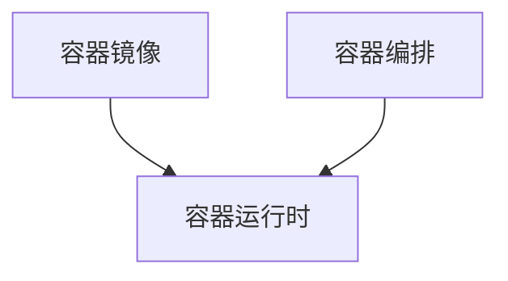

### 1.1.2 容器化技术的发展历程

容器化技术的起源可以追溯到Linux容器（LXC）和Aqua Security等公司的早期工作。然而，Docker的崛起标志着容器化技术的商业化和普及化。Docker在2013年发布，迅速成为容器化技术的代表。随后，Kubernetes作为容器编排工具的出现，进一步推动了容器化技术的应用和发展。

### 1.1.3 容器化的优势

容器化技术带来了诸多优势，包括：

1. **轻量级和高效性**：容器共享宿主机的操作系统内核，相较于虚拟机具有更高效的资源利用率和更快的启动速度。
2. **环境一致性**：通过容器镜像，应用程序可以在不同的环境中保持一致，从而减少了环境不一致带来的问题。
3. **易于部署和扩展**：容器化使得应用程序的部署更加简单，同时可以通过容器编排工具进行横向和纵向的扩展。

## 1.2 容器生态系统的组成

容器生态系统由多个组件组成，这些组件共同协作，实现了容器化技术的全面应用。

### 1.2.1 容器运行时

常见的容器运行时包括：

1. **Docker**：Docker是最流行的容器运行时，它提供了丰富的工具和功能，如容器镜像构建、容器管理和容器网络等。
2. **runc**：runc是Docker背后的容器运行时实现，它遵循OCI（开放容器倡议）标准。
3. **containerd**：containerd是Kubernetes等现代容器编排工具背后的容器运行时，它专注于容器生命周期管理和容器镜像存储。

### 1.2.2 容器编排工具

容器编排工具负责管理多个容器及其生命周期。主要的容器编排工具有：

1. **Kubernetes**：Kubernetes是当前最流行的容器编排工具，它提供了丰富的功能，如服务发现、负载均衡、存储卷管理和自动扩展等。
2. **Docker Swarm**：Docker Swarm是Docker提供的容器编排工具，它使得Docker容器可以轻松地集群管理。
3. **Mesos**：Mesos是一个开源的容器编排工具，它支持多种容器运行时，如Docker和Mesos容器。

### 1.2.3 容器镜像仓库

容器镜像仓库是用于存储和分发容器镜像的服务器。常见的容器镜像仓库包括：

1. **Docker Hub**：Docker Hub是Docker提供的官方容器镜像仓库，它拥有丰富的开源镜像。
2. **Quay**：Quay是一个企业级的容器镜像仓库，它提供了强大的安全和合规性功能。
3. **Harbor**：Harbor是一个开源的容器镜像仓库，它基于Docker Hub，并增加了安全、监控和多云支持。

## 1.3 容器网络和存储

容器网络和存储是容器化技术中不可或缺的组成部分。

### 1.3.1 容器网络模型

容器网络模型通常基于虚拟网络技术，如VXLAN和MACVLAN。常见的容器网络模型包括：

1. **桥接网络**：桥接网络通过虚拟桥接设备连接容器和宿主机网络，容器可以直接访问外部网络。
2. **主机网络**：主机网络使容器直接共享宿主机的网络命名空间，容器可以直接访问宿主机的网络接口。
3. **命名空间网络**：命名空间网络通过容器网络命名空间实现容器间的网络隔离，每个容器都有独立的网络命名空间。

### 1.3.2 容器存储解决方案

容器存储解决方案包括：

1. **本地存储**：本地存储直接使用宿主机的文件系统，适用于简单应用。
2. **远程存储**：远程存储通过NFS、iSCSI等协议访问远程存储系统，适用于需要高性能和可扩展性的应用。
3. **持久化存储卷**：持久化存储卷是Kubernetes提供的一种存储解决方案，它可以在容器生命周期内保持数据不丢失。

### 1.3.3 容器安全和权限管理

容器安全和权限管理包括：

1. **命名空间隔离**：通过命名空间隔离实现容器间的资源隔离，防止容器间的恶意攻击。
2. **用户名和组隔离**：通过设置容器内的用户名和组ID，确保容器内用户只能访问其授权的资源。
3. **能力集（Capabilities）**：通过能力集管理，允许容器执行特定的系统操作，而无需root权限。

## 第二部分：Docker 实践

### 2.1 Docker 基础

#### 2.1.1 Docker 镜像和容器

Docker 镜像是一个只读的模板，用于创建容器。容器是从镜像运行的一个实例，它包含应用程序及其环境设置。

**核心概念与联系**

Docker 镜像和容器的关系可以用以下 Mermaid 流程图描述：

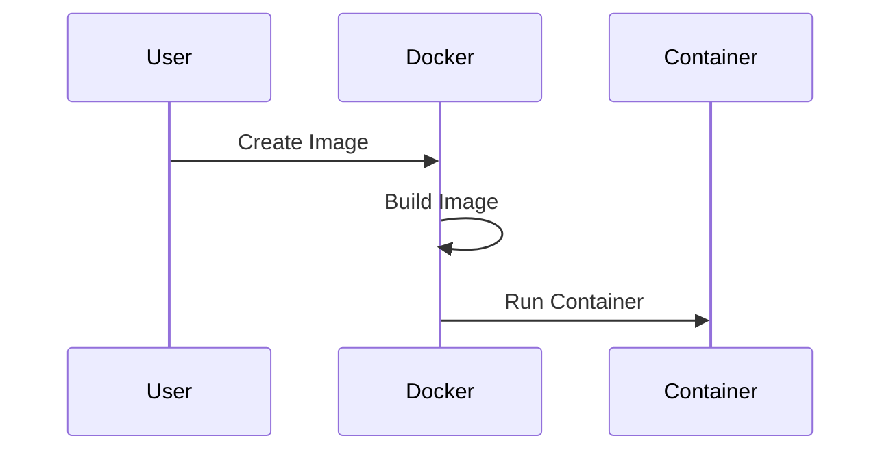

#### 2.1.2 Dockerfile 编写

Dockerfile 是一个包含一系列命令的文本文件，用于构建 Docker 镜像。

**Dockerfile 伪代码示例**

```bash
FROM ubuntu:18.04
MAINTAINER AI Genius Institute
RUN apt-get update && apt-get install -y python3
COPY . /app
WORKDIR /app
CMD ["python3", "app.py"]
```

**核心算法原理讲解**

Dockerfile 的构建过程可以看作是一个栈操作，每个指令将当前镜像的状态更新为新的状态。

```python
class DockerfileBuilder:
    def __init__(self):
        self.image_stack = []

    def FROM(self, image):
        self.image_stack.append(image)

    def RUN(self, command):
        for image in self.image_stack:
            run_command(image, command)

    def COPY(self, source, destination):
        for image in self.image_stack:
            copy_file(image, source, destination)

    def CMD(self, command):
        self.image_stack[-1].cmd = command

    def build(self):
        for image in self.image_stack:
            image.build()

def run_command(image, command):
    # 执行命令
    print(f"Running command in {image.name}: {command}")

def copy_file(image, source, destination):
    # 复制文件
    print(f"Copying {source} to {destination} in {image.name}")
```

#### 2.1.3 Docker Compose

Docker Compose 是一个用于定义和运行多容器应用的工具。它通过一个 `docker-compose.yml` 文件来描述应用程序的各个服务。

**docker-compose.yml 示例**

```yaml
version: '3'
services:
  web:
    build: ./web
    ports:
      - "8080:8080"
    depends_on:
      - db
  db:
    image: postgres:latest
    volumes:
      - db_data:/var/lib/postgresql/data
volumes:
  db_data:
```

**核心算法原理讲解**

Docker Compose 的核心算法是将 `docker-compose.yml` 文件中的服务映射到 Docker 容器，并按依赖关系启动和管理。

```python
import yaml
import docker

def load_config(file_path):
    with open(file_path, 'r') as f:
        return yaml.safe_load(f)

def run_compose(config):
    client = docker.from_env()
    for service_name, service_config in config['services'].items():
        container = client.containers.run(
            image=service_config['image'],
            ports=service_config['ports'],
            volumes=service_config['volumes'],
            name=service_name
        )
        if 'depends_on' in service_config:
            for dependent_service_name in service_config['depends_on']:
                dependent_container = client.containers.get(dependent_service_name)
                container.link(dependent_container)
```

### 2.2 Docker 实际应用

#### 2.2.1 应用部署与运维

Docker 的主要应用之一是简化应用的部署和运维。通过 Docker 镜像，开发者可以将应用程序及其环境打包，确保在任何环境中的一致性。

**核心概念与联系**

Docker 镜像和应用部署的关系可以用以下 Mermaid 流程图描述：

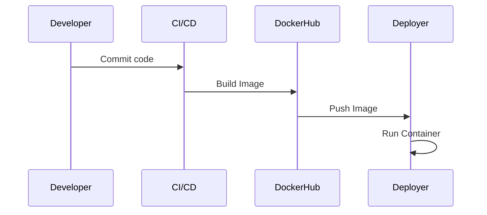

#### 2.2.2 Docker 容器性能调优

Docker 容器的性能调优是确保应用程序高效运行的关键。以下是一些常用的性能优化方法：

1. **资源限制**：通过限制 CPU、内存和磁盘使用量，确保容器不会过度消耗资源。
2. **网络调优**：通过调整容器网络参数，如 MTU 和 TCP 协议选项，提高容器网络性能。
3. **存储优化**：使用高性能存储解决方案，如 SSD 或分布式存储系统，以提高容器读写性能。

**数学模型和公式**

资源限制的数学模型可以表示为：

$$
\begin{align*}
CPU_{max} &= \text{CPU限制} \\
MEM_{max} &= \text{内存限制} \\
DISK_{max} &= \text{磁盘限制}
\end{align*}
$$

**详细讲解与举例说明**

以 CPU 限制为例，以下是一个 Docker 容器的资源限制配置：

```yaml
cpu_limits:
  limits:
    cpus: 2
```

这表示容器最多可以占用 2 个 CPU 核心。

#### 2.2.3 Docker 集群管理

Docker 集群管理涉及多个 Docker 容器的协同工作。通过 Docker Swarm，开发者可以轻松地管理 Docker 集群。

**核心概念与联系**

Docker Swarm 集群管理可以用以下 Mermaid 流程图描述：

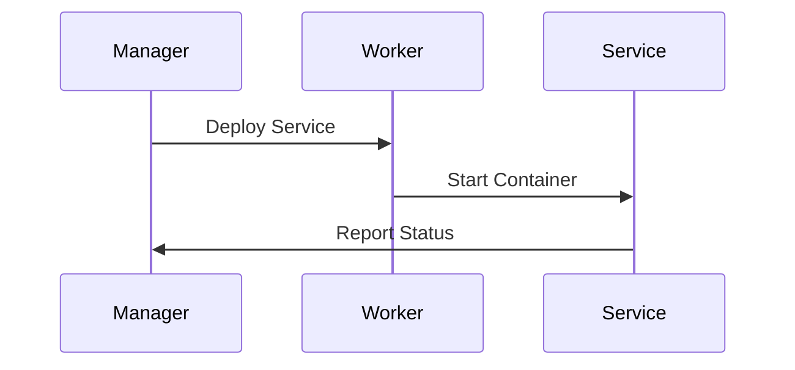

**项目实战**

以下是一个简单的 Docker Swarm 集群管理项目实战：

1. **安装 Docker Swarm**：在 Manager 节点上安装 Docker Swarm，并加入 Worker 节点。
2. **部署服务**：使用 `docker service create` 命令部署服务，如 Web 应用或数据库。
3. **监控与维护**：使用 `docker service ps` 和 `docker service logs` 命令监控服务的运行状态，并进行必要的维护。

### 2.3 Docker 与其他技术整合

#### 2.3.1 Docker 与 Kubernetes 的集成

Docker 和 Kubernetes 可以共同使用，以发挥两者的优势。Docker 可以用于构建和部署容器镜像，而 Kubernetes 可以用于编排和管理这些容器。

**核心概念与联系**

Docker 和 Kubernetes 的集成可以用以下 Mermaid 流程图描述：

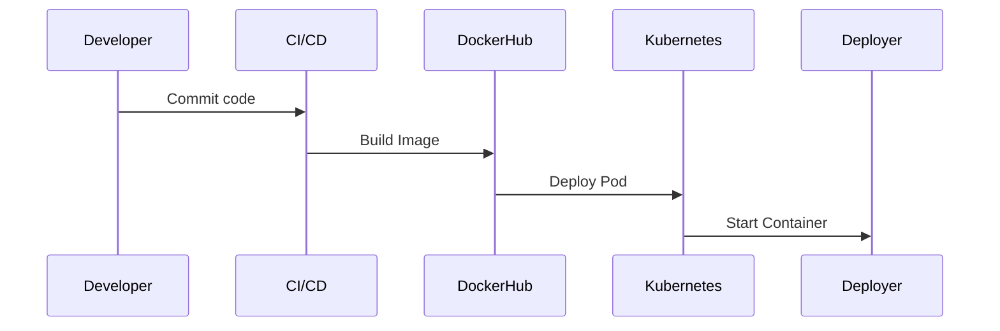

**项目实战**

以下是一个简单的 Docker 与 Kubernetes 集成的项目实战：

1. **构建 Docker 镜像**：在 CI/CD 系统中构建 Docker 镜像，并将其推送到 Docker Hub。
2. **部署 Kubernetes Pod**：在 Kubernetes 集群中部署 Pod，并使用 Docker 镜像运行容器。
3. **监控与维护**：使用 Kubernetes 命令行工具监控 Pod 的运行状态，并进行必要的维护。

#### 2.3.2 Docker 与容器镜像仓库

容器镜像仓库用于存储和分发容器镜像。Docker Hub 是最流行的容器镜像仓库，而 Harbor 是一个开源的替代方案。

**核心概念与联系**

Docker 与容器镜像仓库的关系可以用以下 Mermaid 流程图描述：

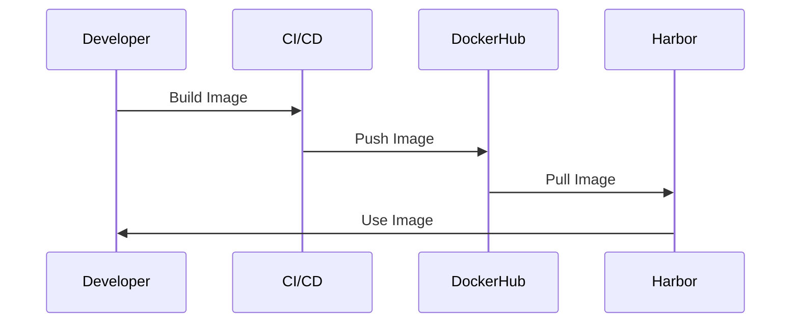

**项目实战**

以下是一个简单的 Docker 与容器镜像仓库的项目实战：

1. **构建 Docker 镜像**：在 CI/CD 系统中构建 Docker 镜像。
2. **推送镜像到 Docker Hub**：使用 `docker push` 命令将镜像推送到 Docker Hub。
3. **从 Harbor 拉取镜像**：在 Harbor 中创建项目，并从 Docker Hub 拉取镜像。
4. **部署容器**：使用 `docker run` 命令部署容器，并使用从 Harbor 拉取的镜像。

#### 2.3.3 Docker 与持续集成/持续部署（CI/CD）

Docker 与 CI/CD 系统的集成可以大大简化应用程序的部署流程。CI/CD 系统可以自动构建、测试和部署 Docker 镜像。

**核心概念与联系**

Docker 与 CI/CD 的集成可以用以下 Mermaid 流程图描述：

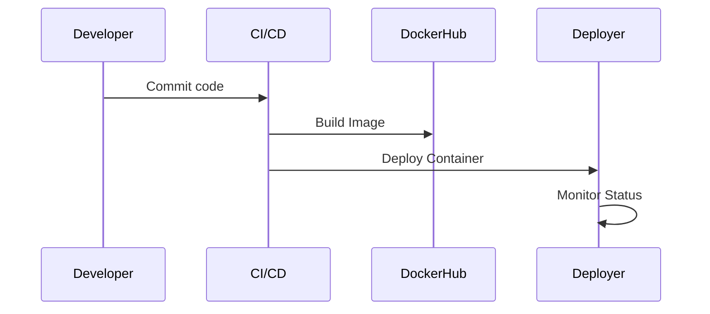

**项目实战**

以下是一个简单的 Docker 与 CI/CD 的项目实战：

1. **构建 Docker 镜像**：在 CI/CD 系统中构建 Docker 镜像。
2. **部署容器**：将构建好的 Docker 镜像部署到生产环境，并监控其运行状态。

## 第三部分：Kubernetes 实践

### 3.1 Kubernetes 概述

#### 3.1.1 Kubernetes 的核心概念

Kubernetes 是一个开源的容器编排工具，它提供了丰富的功能，如服务发现、负载均衡、存储卷管理和自动扩展等。Kubernetes 的核心概念包括：

1. **Pod**：Pod 是 Kubernetes 中的最小部署单位，它包含一个或多个容器。
2. **服务（Service）**：服务用于将一组 Pod 公开为一个统一的网络入口。
3. **部署（Deployment）**：部署用于管理 Pod 的创建和更新。
4. **状态集（StatefulSet）**：状态集用于管理有状态的应用程序。
5. **命名空间（Namespace）**：命名空间用于隔离不同的 Kubernetes 资源。

**核心概念与联系**

Kubernetes 的核心概念可以用以下 Mermaid 流程图描述：

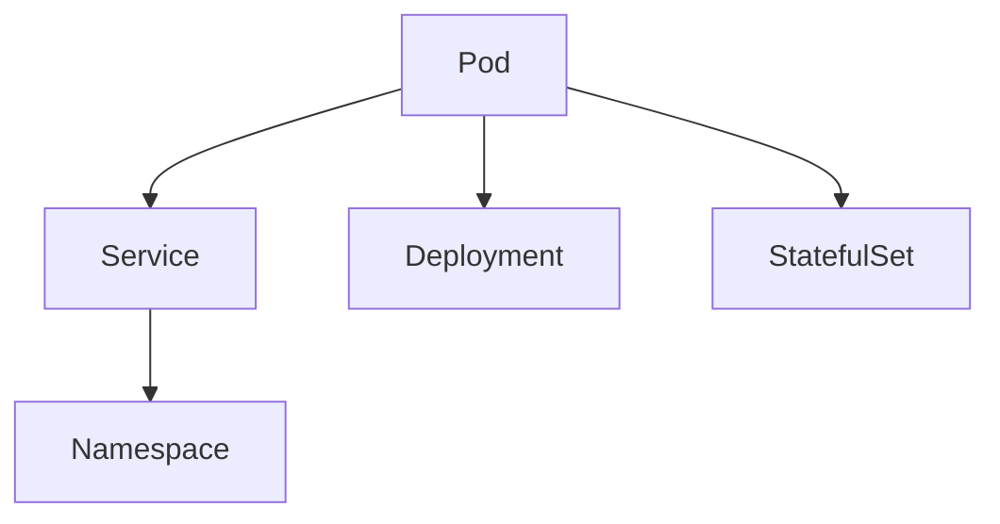

#### 3.1.2 Kubernetes 架构

Kubernetes 的架构由多个组件组成，包括：

1. **控制平面（Control Plane）**：控制平面负责集群的管理，如集群状态监控、资源分配和调度等。
2. **工作节点（Node）**：工作节点是 Kubernetes 集群中的计算资源，它们运行容器并执行 Kubernetes 任务。
3. **Pod**：Pod 是 Kubernetes 中的最小部署单位，它包含一个或多个容器。
4. **容器运行时（Container Runtime）**：容器运行时负责运行容器，如 Docker、containerd 等。

**Kubernetes 架构示意图**

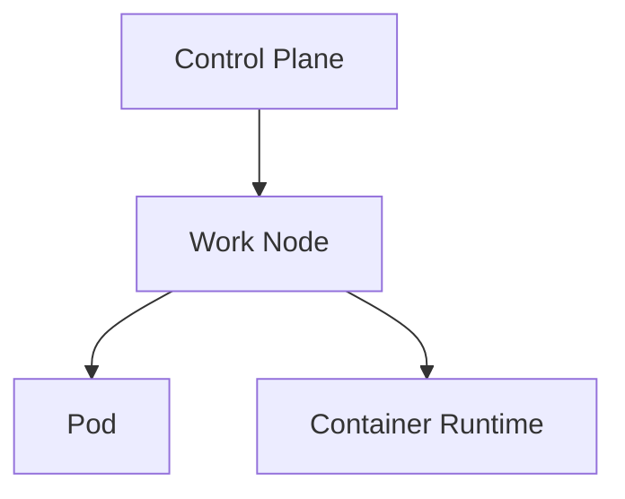

#### 3.1.3 Kubernetes 的工作原理

Kubernetes 的工作原理可以概括为以下几个步骤：

1. **资源请求**：用户通过 Kubernetes API 发送资源请求，如创建 Pod。
2. **资源调度**：Kubernetes 调度器根据资源需求和可用资源选择一个合适的工作节点。
3. **资源创建**：Kubernetes 控制平面将资源请求转换为 Kubernetes 对象，如 Pod。
4. **资源运行**：工作节点上的容器运行时启动容器，并运行应用程序。
5. **资源监控**：Kubernetes 监控器持续监控资源的运行状态，并根据需要更新资源状态。

**Kubernetes 工作原理流程图**

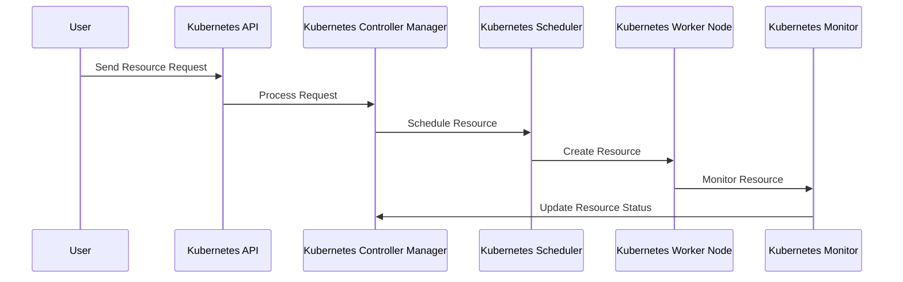

### 3.2 Kubernetes 配置与管理

#### 3.2.1 配置文件编写

Kubernetes 的配置文件通常以 YAML 格式编写，它们描述了 Kubernetes 对象的属性和设置。以下是一个简单的 Kubernetes 配置文件示例：

```yaml
apiVersion: v1
kind: Pod
metadata:
  name: my-pod
spec:
  containers:
    - name: my-container
      image: busybox
      command: ["/bin/sh", "-c", "echo Hello from the Pod!"]
```

**核心概念与联系**

配置文件和 Kubernetes 对象的关系可以用以下 Mermaid 流程图描述：

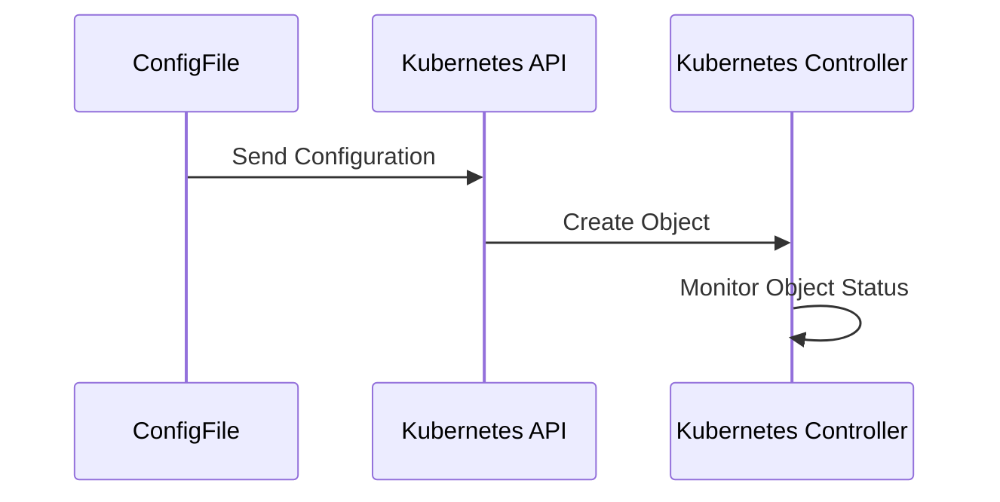

#### 3.2.2 资源对象管理

Kubernetes 提供了多种资源对象，如 Pod、Service、Deployment、StatefulSet 等。这些对象可以用于管理容器化应用程序的各个方面。

**核心概念与联系**

资源对象和 Kubernetes 对象的关系可以用以下 Mermaid 流程图描述：

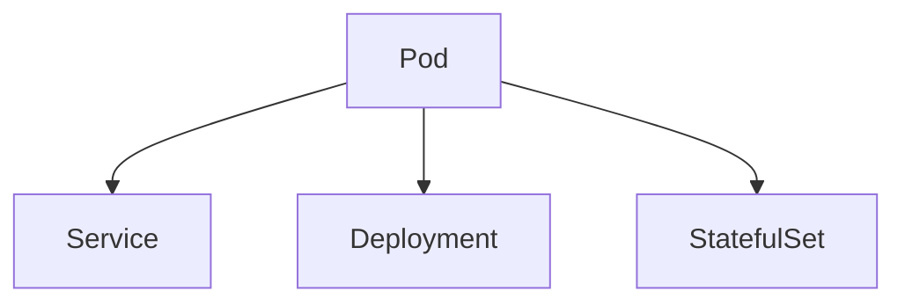

**项目实战**

以下是一个简单的 Kubernetes 资源对象管理的项目实战：

1. **创建 Pod**：使用 `kubectl create` 命令创建一个 Pod。
2. **部署 Deployment**：使用 `kubectl deploy` 命令部署一个 Deployment。
3. **管理 StatefulSet**：使用 `kubectl manage` 命令管理一个 StatefulSet。

#### 3.2.3 命名空间和配额限制

命名空间用于隔离不同的 Kubernetes 资源，而配额限制用于控制资源的消耗。

**核心概念与联系**

命名空间和配额限制的关系可以用以下 Mermaid 流程图描述：

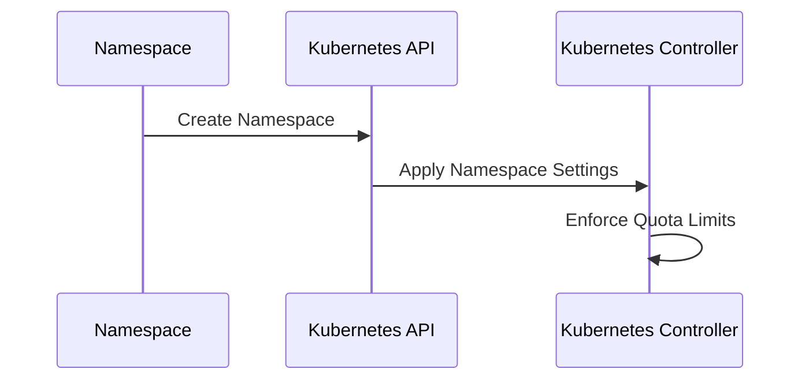

**项目实战**

以下是一个简单的 Kubernetes 命名空间和配额限制的项目实战：

1. **创建命名空间**：使用 `kubectl create namespace` 命令创建一个命名空间。
2. **设置配额限制**：使用 `kubectl quota` 命令设置命名空间的配额限制。

### 3.3 Kubernetes 网络与存储

#### 3.3.1 Kubernetes 网络模型

Kubernetes 的网络模型是基于虚拟网络技术，如 VXLAN 和 MACVLAN。Kubernetes 网络模型包括：

1. **集群网络**：集群网络用于容器之间的通信，通常使用 Pod IP 地址进行通信。
2. **服务网络**：服务网络用于服务之间的通信，服务 IP 地址用于访问服务。
3. **命名空间网络**：命名空间网络用于隔离不同的命名空间中的资源。

**核心概念与联系**

Kubernetes 网络模型可以用以下 Mermaid 流程图描述：

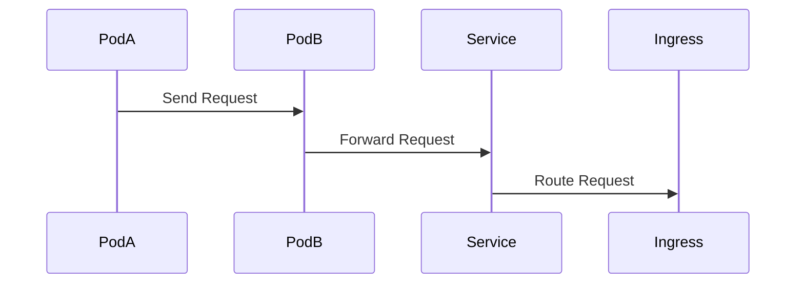

#### 3.3.2 Kubernetes 存储解决方案

Kubernetes 提供了多种存储解决方案，如本地存储、远程存储和持久化存储卷。

**核心概念与联系**

存储解决方案和 Kubernetes 存储卷的关系可以用以下 Mermaid 流程图描述：

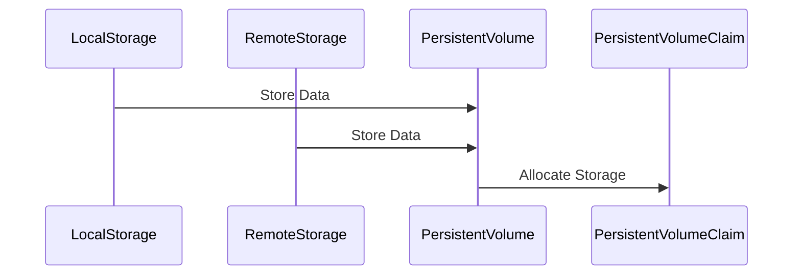

**项目实战**

以下是一个简单的 Kubernetes 存储解决方案的项目实战：

1. **使用本地存储**：在 Pod 中使用本地存储卷。
2. **使用远程存储**：在 Pod 中使用远程存储卷，如 NFS 或 iSCSI。
3. **使用持久化存储卷**：在 Kubernetes Deployment 中使用持久化存储卷。

#### 3.3.3 Kubernetes 服务发现与负载均衡

Kubernetes 提供了服务发现和负载均衡功能，以简化应用程序的部署和管理。

**核心概念与联系**

服务发现和负载均衡的关系可以用以下 Mermaid 流程图描述：

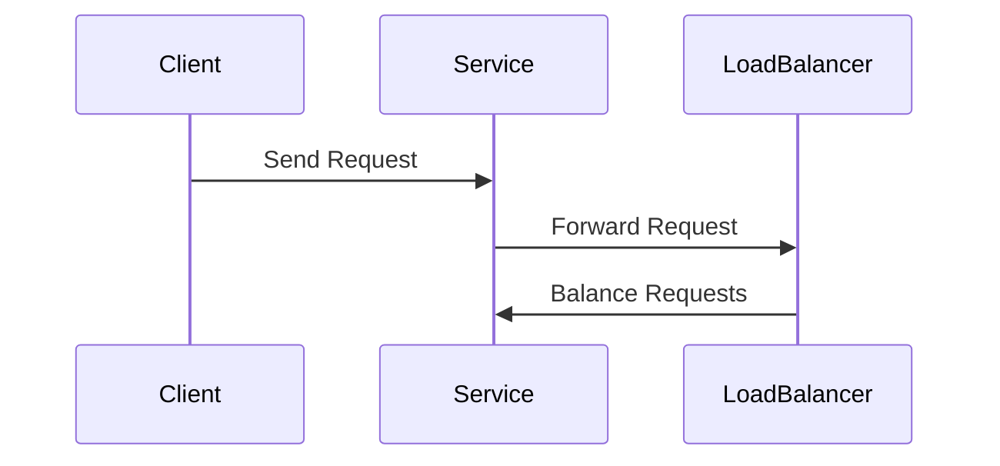

**项目实战**

以下是一个简单的 Kubernetes 服务发现和负载均衡的项目实战：

1. **配置 Service**：创建一个 Service，将 Pod 公开为一个统一的网络入口。
2. **配置 LoadBalancer**：将 Service 配置为 LoadBalancer，实现外部访问。
3. **测试服务发现和负载均衡**：使用外部 IP 地址访问 Service，并测试负载均衡效果。

### 3.4 Kubernetes 高级特性

#### 3.4.1 存储卷和持久化数据

Kubernetes 存储卷用于存储应用程序的数据，而持久化数据是指数据在容器生命周期结束后仍然保留。

**核心概念与联系**

存储卷和持久化数据的关系可以用以下 Mermaid 流程图描述：

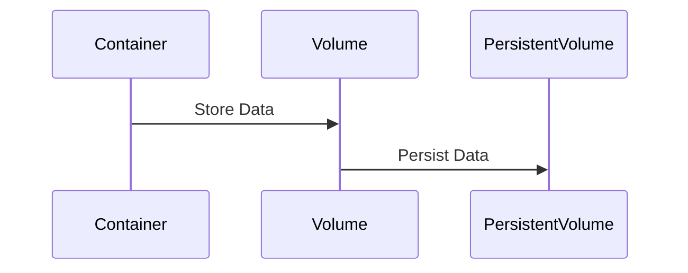

**项目实战**

以下是一个简单的 Kubernetes 存储卷和持久化数据的项目实战：

1. **创建存储卷**：在 Pod 中使用存储卷。
2. **配置持久化存储卷**：在 Kubernetes Deployment 中使用持久化存储卷。
3. **验证持久化数据**：在容器重启后验证存储卷中的数据是否保留。

#### 3.4.2 Pod 模式和容器编排

Kubernetes 支持多种 Pod 模式，如 Deployment、StatefulSet 和 DaemonSet，这些模式用于不同的容器编排场景。

**核心概念与联系**

Pod 模式和容器编排的关系可以用以下 Mermaid 流程图描述：

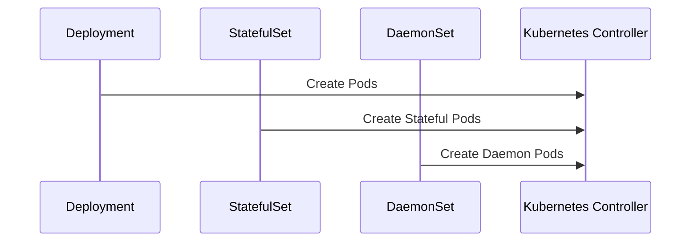

**项目实战**

以下是一个简单的 Kubernetes Pod 模式和容器编排的项目实战：

1. **创建 Deployment**：使用 `kubectl deploy` 命令创建 Deployment。
2. **创建 StatefulSet**：使用 `kubectl statefulset` 命令创建 StatefulSet。
3. **创建 DaemonSet**：使用 `kubectl daemonset` 命令创建 DaemonSet。

#### 3.4.3 工作负载自动扩展

Kubernetes 提供了自动扩展功能，可以根据工作负载的需求自动增加或减少 Pod 的数量。

**核心概念与联系**

自动扩展和 Kubernetes 控制器的联系可以用以下 Mermaid 流程图描述：

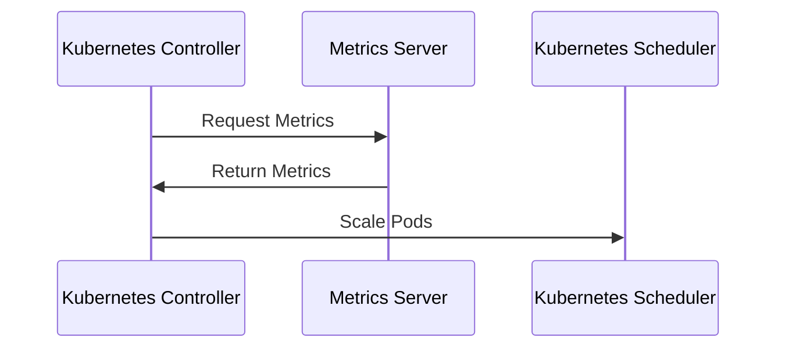

**项目实战**

以下是一个简单的 Kubernetes 工作负载自动扩展的项目实战：

1. **配置自动扩展**：在 Kubernetes Deployment 中配置自动扩展规则。
2. **监控工作负载**：使用 `kubectl top` 命令监控 Pod 的资源使用情况。
3. **验证自动扩展**：在 CPU 或内存使用率升高时，验证 Kubernetes 是否自动增加 Pod 数量。

### 3.5 Kubernetes 与 DevOps

#### 3.5.1 Kubernetes 与持续集成/持续部署（CI/CD）

Kubernetes 与 CI/CD 系统的集成可以大大简化应用程序的部署和管理。CI/CD 系统可以自动构建、测试和部署 Kubernetes 镜像。

**核心概念与联系**

Kubernetes 与 CI/CD 的关系可以用以下 Mermaid 流程图描述：

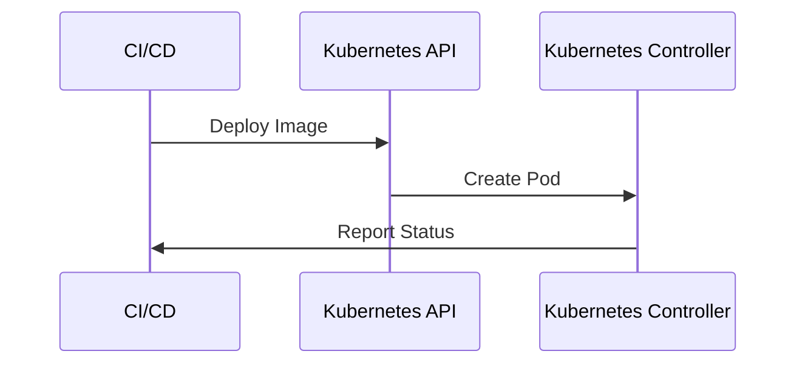

**项目实战**

以下是一个简单的 Kubernetes 与 CI/CD 的项目实战：

1. **配置 CI/CD 流水线**：在 CI/CD 系统中配置构建、测试和部署 Kubernetes 镜像的步骤。
2. **部署 Kubernetes 镜像**：将构建好的 Kubernetes 镜像部署到生产环境。
3. **监控部署过程**：使用 `kubectl` 命令行工具监控部署的进度和状态。

#### 3.5.2 Kubernetes 在自动化运维中的应用

Kubernetes 在自动化运维中的应用可以大大提高运维效率，减少人工干预。Kubernetes 提供了丰富的自动化运维工具，如 Helm、Kubernetes CLI、kubectl 等。

**核心概念与联系**

Kubernetes 在自动化运维中的应用可以用以下 Mermaid 流程图描述：

```mermaid
sequenceDiagram
    participant Operator
    participant Kubernetes API
    participant Kubernetes Controller
    
    Operator->>Kubernetes API: Send Command
    Kubernetes API->>Kubernetes Controller: Execute Command
    Kubernetes Controller->>Operator: Return Result
```

**项目实战**

以下是一个简单的 Kubernetes 在自动化运维中的应用的项目实战：

1. **使用 Helm**：使用 Helm 管理 Kubernetes 应用程序。
2. **使用 Kubernetes CLI**：使用 `kubectl` 命令行工具执行 Kubernetes 操作。
3. **编写自动化脚本**：编写自动化脚本，实现 Kubernetes 资源的管理和操作。

#### 3.5.3 Kubernetes 安全最佳实践

Kubernetes 的安全性是确保集群安全运行的关键。以下是一些 Kubernetes 安全最佳实践：

1. **命名空间隔离**：使用命名空间隔离不同用户或团队的资源。
2. **最小权限原则**：为用户或服务账户分配最小的权限，确保它们只能访问其授权的资源。
3. **网络策略**：配置网络策略，控制容器之间的网络通信。
4. **审计日志**：启用 Kubernetes 审计日志，记录用户操作和系统事件。

**核心概念与联系**

Kubernetes 安全最佳实践可以用以下 Mermaid 流程图描述：

```mermaid
sequenceDiagram
    participant Kubernetes Controller
    participant Operator
    participant Auditor
    
    Kubernetes Controller->>Operator: Assign Roles
    Operator->>Kubernetes Controller: Apply Network Policies
    Kubernetes Controller->>Auditor: Log Events
```

**项目实战**

以下是一个简单的 Kubernetes 安全最佳实践的项目实战：

1. **配置命名空间隔离**：为不同用户或团队创建命名空间，并设置权限。
2. **配置网络策略**：在命名空间中配置网络策略，控制容器之间的网络访问。
3. **启用审计日志**：在 Kubernetes 集群中启用审计日志，并定期检查日志。

## 第四部分：容器化技术的应用场景

### 4.1 微服务架构

微服务架构是一种基于容器的现代软件开发方法，它将应用程序分解为多个小型、独立的组件，每个组件负责一项特定的业务功能。

**核心概念与联系**

微服务架构和容器化的关系可以用以下 Mermaid 流程图描述：

```mermaid
sequenceDiagram
    participant MicroserviceA
    participant MicroserviceB
    participant Kubernetes
    
    MicroserviceA->>Kubernetes: Deploy Service
    MicroserviceB->>Kubernetes: Deploy Service
    Kubernetes->>MicroserviceA: Balance Traffic
    Kubernetes->>MicroserviceB: Balance Traffic
```

**项目实战**

以下是一个简单的微服务架构项目实战：

1. **设计微服务**：将应用程序分解为多个微服务，每个服务负责一项业务功能。
2. **容器化微服务**：使用 Docker 镜像容器化每个微服务。
3. **部署微服务**：使用 Kubernetes 部署微服务，并配置负载均衡。

### 4.2 容器云与容器编排平台

容器云是一种基于云计算的容器化平台，它提供了弹性、可扩展和自动化管理的容器环境。容器编排平台则是用于管理和协调容器化应用程序的工具。

**核心概念与联系**

容器云和容器编排平台的关系可以用以下 Mermaid 流程图描述：

```mermaid
sequenceDiagram
    participant Container Cloud
    participant Container Orchestration Platform
    participant Developer
    
    Developer->>Container Cloud: Deploy Application
    Container Cloud->>Container Orchestration Platform: Orchestrate Containers
    Container Orchestration Platform->>Developer: Monitor and Manage
```

**项目实战**

以下是一个简单的容器云和容器编排平台的项目实战：

1. **构建容器云**：在云计算平台上部署容器云基础设施。
2. **配置容器编排平台**：配置 Kubernetes 或其他容器编排平台。
3. **部署应用程序**：使用容器编排平台部署容器化应用程序。

### 4.3 容器化技术在企业中的落地

容器化技术在企业中的应用可以大大提高开发效率、运维效率和业务灵活性。然而，容器化技术的落地也面临诸多挑战。

**核心概念与联系**

容器化技术在企业中的应用可以用以下 Mermaid 流程图描述：

```mermaid
sequenceDiagram
    participant Developer
    participant DevOps
    participant Operations
    participant Business
    
    Developer->>DevOps: Develop Applications
    DevOps->>Operations: Deploy and Manage
    Operations->>Business: Monitor and Optimize
```

**项目实战**

以下是一个简单的容器化技术在企业中的应用项目实战：

1. **开发容器化应用程序**：使用 Docker 镜像和 Kubernetes 部署应用程序。
2. **部署容器化应用程序**：在 Kubernetes 集群中部署容器化应用程序。
3. **监控和优化**：使用 Prometheus、Grafana 等工具监控应用程序性能，并进行优化。

## 附录

### 附录A：常用命令和工具

**A.1 Docker 命令汇总**

- `docker build`：构建 Docker 镜像。
- `docker run`：运行 Docker 容器。
- `docker ps`：查看运行中的 Docker 容器。
- `docker exec`：在运行中的 Docker 容器中执行命令。
- `docker pull`：从 Docker Hub 拉取 Docker 镜像。
- `docker push`：将 Docker 镜像推送到 Docker Hub。

**A.2 Kubernetes 命令汇总**

- `kubectl create`：创建 Kubernetes 资源。
- `kubectl delete`：删除 Kubernetes 资源。
- `kubectl get`：获取 Kubernetes 资源信息。
- `kubectl describe`：描述 Kubernetes 资源的详细信息。
- `kubectl exec`：在 Kubernetes Pod 中执行命令。

**A.3 实用工具推荐**

- Prometheus：开源监控解决方案。
- Grafana：开源监控仪表板。
- Helm：Kubernetes 应用程序包管理工具。

### 附录B：参考文献

**B.1 Docker 官方文档**

- Docker 官方文档：[https://docs.docker.com/](https://docs.docker.com/)

**B.2 Kubernetes 官方文档**

- Kubernetes 官方文档：[https://kubernetes.io/docs/](https://kubernetes.io/docs/)

**B.3 相关书籍和论文**

- 《Docker 实战》作者：汤小丹。
- 《Kubernetes 权威指南》作者：李俊辰。
- 《微服务设计》作者：Martin Fowler。

