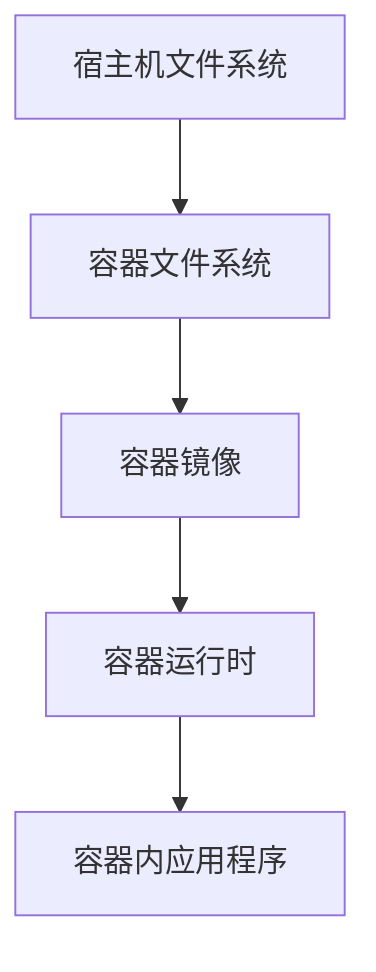

                 

## 文章标题

# 容器存储技术实践

> 关键词：容器存储，Docker，容器文件系统，数据卷，分布式存储，性能优化，应用场景

> 摘要：本文将全面探讨容器存储技术的核心概念、实现方法、应用场景及最佳实践。通过详细讲解容器存储的基础知识，深入剖析容器文件系统、数据卷和分布式存储的技术原理，并结合实际项目案例进行性能分析和优化，帮助读者全面掌握容器存储技术的实践与应用。

## 前言

在现代软件开发的体系中，容器技术已经成为了一种革命性的技术。它通过提供轻量级、可移植、自给自足的运行环境，极大地提高了软件开发的效率和可维护性。而容器存储技术作为容器技术的重要组成部分，更是直接决定了容器的数据管理和数据持久化的能力。本文旨在通过对容器存储技术的深入探讨，帮助读者了解并掌握容器存储的核心概念、实现方法以及在实际应用中的最佳实践。

### 核心目标

1. **全面了解容器存储技术的基础概念**：通过对容器存储的需求、类型和架构的介绍，让读者对容器存储有一个整体的认识。
2. **深入剖析容器存储的实现方法**：详细讲解容器文件系统、数据卷和分布式存储的技术原理，帮助读者理解这些技术的内部工作方式。
3. **实际应用与性能优化**：结合实际项目案例，分析容器存储的性能优化策略，提供实用的最佳实践。
4. **拓展知识**：介绍一些常用的容器存储解决方案和工具，为读者提供进一步的学习资源。

### 文章结构

本文将分为以下几个部分：

1. **容器存储技术概述**：介绍容器存储的需求、类型和架构。
2. **容器文件系统**：讲解容器文件系统的原理和实现。
3. **数据卷**：深入剖析数据卷的工作机制和应用场景。
4. **分布式存储**：探讨分布式存储在容器环境中的应用。
5. **容器存储优化与性能分析**：分析容器存储的性能优化策略，并提供最佳实践。
6. **容器存储应用场景**：介绍容器存储在Web应用、大数据和云计算等领域的应用。
7. **附录**：列出常用的容器存储解决方案和工具。

### 读者背景

本文适合具有中等及以上编程基础和容器技术基础的读者。对于希望深入了解容器存储技术、提升软件开发效率的技术人员和管理人员，本文将提供有价值的参考和指导。

## 容器存储技术概述

### 容器存储的需求

容器技术的出现，为软件开发带来了一种全新的模式。容器通过提供轻量级、独立的运行环境，使得应用能够在不同的环境中保持一致性，从而提高了开发、测试和部署的效率。然而，容器存储技术的重要性同样不可忽视。以下是容器存储的主要需求：

1. **数据持久化**：容器是短暂的，当容器被删除时，其中的数据也会被清除。为了实现数据的持久化，容器存储技术至关重要。
2. **数据共享**：在容器编排和微服务架构中，多个容器之间需要共享数据，容器存储技术能够实现这一需求。
3. **性能和可靠性**：容器存储需要具备高性能和高可靠性，以满足大规模、高并发的应用场景。
4. **灵活性**：容器存储需要支持多种存储类型，如文件存储、块存储和对象存储，以适应不同的应用需求。

### 容器存储的类型

容器存储技术主要包括以下几种类型：

1. **容器文件系统**：容器文件系统是容器内应用的数据存储位置。常见的容器文件系统有aufs、overlay2等。
2. **数据卷**：数据卷是独立于容器生命周期之外的数据存储单元。它可以被多个容器共享，也可以在容器之间传递数据。
3. **分布式存储**：分布式存储是一种在多个节点上存储数据的存储系统，如Ceph、GlusterFS等。它在容器环境中提供了高可用性和高扩展性。

### 容器存储的架构设计

容器存储的架构设计需要考虑以下几个方面：

1. **数据分层**：容器存储通常采用分层设计，如LVM、RAID等，以提高数据存储的性能和可靠性。
2. **数据共享**：通过命名空间和卷挂载技术，实现容器之间的数据共享。
3. **数据持久化**：通过数据卷和持久化存储技术，实现容器数据的持久化。
4. **数据备份和恢复**：设计备份和恢复策略，以确保数据的安全性和可靠性。

### 容器存储与虚拟机的比较

容器存储与虚拟机存储在技术实现和性能上存在一定的差异：

1. **技术实现**：容器存储主要依赖文件系统、数据卷和分布式存储等技术，而虚拟机存储则依赖于虚拟化技术，如VMware、Xen等。
2. **性能**：容器存储具有更高的性能，因为它不需要虚拟化层的开销，而虚拟机存储则需要通过虚拟化层进行数据访问。
3. **灵活性**：容器存储支持多种存储类型和协议，如NFS、iSCSI等，而虚拟机存储通常仅支持特定的存储协议。

### 总结

容器存储技术在现代软件开发中扮演着重要的角色。通过对容器存储技术的深入理解和应用，开发者可以更有效地管理容器中的数据，提高软件开发的效率。接下来的章节将详细讲解容器存储的核心概念和实现方法，帮助读者全面掌握这一技术。

## 容器文件系统

容器文件系统（Container File System，简称CFS）是容器技术中的一个关键组件，它决定了容器内应用程序的数据存储位置和访问方式。本文将详细介绍容器文件系统的原理、常见类型及其在容器中的应用。

### 容器文件系统的原理

容器文件系统是一种特殊的文件系统，它将应用程序及其依赖项打包成一个独立的文件系统，并在容器启动时加载到宿主机上。这种独立性和隔离性使得容器能够在不同的环境中运行而不会受到宿主机环境的影响。

容器文件系统的核心原理包括以下几个方面：

1. **分层存储**：容器文件系统采用分层存储的方式，将应用程序的各个组件划分为多个层次。每一层代表一个抽象层，可以是应用程序的依赖库、配置文件等。通过这种方式，容器可以实现快速创建和销毁，提高了资源利用率和性能。

2. **写时复制（Copy-On-Write, COW）**：容器文件系统采用写时复制技术，当容器需要修改数据时，会创建一个新的数据块并复制原有数据到新块中，然后在新块上进行修改。这种方式可以确保容器内的修改不会影响宿主机的文件系统，从而实现容器之间的隔离。

3. **命名空间**：容器文件系统通过命名空间（Namespace）实现容器之间的隔离。每个容器都有一个独立的命名空间，容器内的文件系统操作只能影响自身的命名空间，而无法影响其他容器或宿主机的文件系统。

4. **联合文件系统（Union File System）**：联合文件系统是一种将多个文件系统合并成一个文件系统的技术。容器文件系统通常基于联合文件系统实现，将宿主机的文件系统与应用程序打包的文件系统合并，形成一个统一的视图。这种方式可以方便地管理和访问容器内的数据。

### 常见容器文件系统类型

在容器技术发展过程中，出现了多种容器文件系统。以下是一些常见的容器文件系统类型：

1. **aufs（Advanced Multi-layered Unification Filesystem）**：aufs是一种早期用于容器的多层文件系统，它通过将多个文件系统的目录和文件合并成一个统一的视图，实现容器之间的隔离。然而，由于aufs在一些高级特性上的不足，如文件系统扩展性和性能，其使用逐渐减少。

2. **overlay**：overlay是一种较为流行的容器文件系统，它通过将宿主机的文件系统作为lower层，将容器内的文件系统作为upper层，实现容器文件的隔离和共享。overlay文件系统支持多层嵌套，并具有较好的性能和扩展性。

3. **btrfs（B-Tree Filesystem）**：btrfs是一种先进的文件系统，它支持分层存储、快照、压缩等特性。在容器环境中，btrfs可以提供高效的文件系统管理和数据持久化能力。

4. **ZFS（Zettabyte File System）**：ZFS是一种高性能的文件系统，它支持数据冗余、快照、压缩和去重等特性。虽然ZFS主要用于大型存储系统，但在容器环境中也有一定的应用场景。

### 容器文件系统的应用

容器文件系统在容器环境中具有广泛的应用，以下是一些典型的应用场景：

1. **容器镜像构建**：容器镜像是容器运行时所需的全部文件和配置的集合。容器文件系统通过分层存储和写时复制技术，使得容器镜像的构建更加高效和灵活。

2. **容器数据持久化**：容器文件系统支持容器内数据的持久化，通过数据卷或持久化存储技术，确保容器中的数据在容器重启或销毁后仍然存在。

3. **容器共享和迁移**：容器文件系统通过命名空间和联合文件系统技术，实现容器之间的数据共享和迁移。这使得容器可以方便地在不同的宿主机和环境中运行和共享数据。

4. **容器编排和管理**：容器文件系统为容器编排工具（如Kubernetes）提供了数据存储和管理的基础。通过容器文件系统，容器编排工具可以方便地管理和调度容器中的数据。

### Mermaid 流程图

为了更好地理解容器文件系统的架构和原理，我们可以使用Mermaid语言绘制一个流程图。以下是一个简单的Mermaid流程图示例：



### 伪代码

容器文件系统的实现通常涉及多个组件和操作。以下是一个简化的伪代码示例，用于描述容器文件系统的基本操作：

```python
def create_container_fs(container_id, image_id):
    # 创建容器文件系统
    fs = create_new_fs()
    
    # 挂载宿主机文件系统到容器文件系统的lower层
    mount_host_fs_to_lower(fs, host_fs)
    
    # 从容器镜像中加载文件系统到容器文件系统的upper层
    load_image_to_upper(fs, image_id)
    
    # 创建命名空间，实现容器之间的隔离
    create_namespace(container_id, fs)
    
    return fs
```

### 数学公式

在容器文件系统的设计和实现中，一些数学模型和算法被广泛应用于数据存储和文件管理。以下是一个简单的数学公式示例，用于描述文件系统的分层存储：

$$
\text{文件系统层次结构} = \sum_{i=1}^{n} (\text{层 } i \times \text{层 } i \text{ 的存储容量})
$$

其中，$n$ 表示文件系统的层次数，每一层的存储容量根据其存储需求和性能要求进行分配。

### 总结

容器文件系统是容器技术中不可或缺的一环，它为容器提供了独立、隔离和高效的数据存储和管理能力。通过对容器文件系统的深入理解和应用，开发者可以更有效地管理和利用容器中的数据资源。在接下来的章节中，我们将进一步探讨数据卷和分布式存储技术在容器存储中的应用。

## 数据卷

在容器技术中，数据卷（Data Volume）是一种用于持久化存储容器内数据的机制。数据卷不同于容器文件系统，它具有独立于容器生命周期的特性，可以在容器被删除后仍然保留数据。本文将详细讲解数据卷的工作机制、应用场景及其在容器中的使用方法。

### 数据卷的工作机制

数据卷的工作机制主要基于以下核心概念：

1. **持久化存储**：数据卷提供了一个持久化存储的位置，使得容器内数据在容器生命周期结束后仍然存在。
2. **独立于容器**：数据卷与容器生命周期解耦，即使在容器被删除后，数据卷仍然存在。
3. **共享性**：数据卷可以被多个容器共享，从而实现容器之间的数据共享。

数据卷的实现通常依赖于宿主机的文件系统。在Docker中，数据卷默认是基于宿主机的目录进行挂载的。以下是一个简化的数据卷工作流程：

1. **创建数据卷**：在Docker中，可以通过`docker volume create`命令创建一个新的数据卷。数据卷可以是本地的，也可以是远程的。
2. **挂载数据卷**：将数据卷挂载到容器内的特定路径。当容器启动时，Docker会将数据卷的目录挂载到容器内的指定路径。
3. **数据操作**：容器内的应用程序可以对挂载的数据卷进行读写操作，就像操作本地文件系统一样。
4. **数据持久化**：即使容器被删除，数据卷仍然保留，数据不会丢失。

### 数据卷的应用场景

数据卷在容器环境中具有广泛的应用场景，以下是一些典型的应用场景：

1. **容器数据持久化**：数据卷可以用于持久化存储容器内的数据，确保数据在容器重启或容器被删除后仍然存在。
2. **容器共享数据**：多个容器可以共享同一个数据卷，实现容器之间的数据共享和协作。
3. **容器迁移和备份**：数据卷的独立性使得容器可以轻松地在不同的宿主机和环境中迁移和备份。
4. **容器日志存储**：数据卷可以用于存储容器的日志文件，方便日志的管理和监控。

### 数据卷在容器中的使用方法

在Docker中，使用数据卷的步骤通常如下：

1. **创建数据卷**：
   ```shell
   docker volume create my_volume
   ```

2. **在Dockerfile中挂载数据卷**：
   ```Dockerfile
   FROM ubuntu:latest
   VOLUME /data
   ```

3. **在运行容器时挂载数据卷**：
   ```shell
   docker run -d -P --name my_container -v my_volume:/data my_image
   ```

4. **查看和管理数据卷**：
   ```shell
   docker volume ls
   docker volume inspect my_volume
   ```

### 伪代码

以下是一个简化的伪代码示例，用于描述数据卷的基本操作：

```python
def create_volume(volume_name):
    # 创建数据卷
    volume = docker_volume.create(volume_name)

def mount_volume(container, volume_name, container_path):
    # 挂载数据卷到容器
    container.mount(volume=volume_name, path=container_path)

def run_container(image, container_name, volume_mappings):
    # 运行容器，并挂载数据卷
    container = docker_container.run(image=image, name=container_name, volume_mappings=volume_mappings)

# 示例
create_volume("my_volume")
run_container("my_image", "my_container", {"/data": "my_volume"})
```

### 数学模型

在数据卷的使用和管理中，一些数学模型和算法被应用于容量管理和性能优化。以下是一个简单的数学模型示例，用于描述数据卷的容量计算：

$$
\text{总容量} = \sum_{i=1}^{n} (\text{数据卷 } i \times \text{容量因子})
$$

其中，$n$ 表示数据卷的数量，容量因子是一个根据数据卷使用情况和性能要求动态调整的参数。

### 项目实战

为了更好地理解数据卷在容器中的应用，我们可以通过一个简单的项目实战来搭建一个容器化应用，并使用数据卷进行数据持久化和共享。

#### 开发环境搭建

1. 安装Docker：
   ```shell
   sudo apt-get update
   sudo apt-get install docker-ce docker-ce-cli containerd.io
   ```

2. 启动Docker服务：
   ```shell
   sudo systemctl start docker
   ```

#### 源代码实现

以下是一个简单的Web应用示例，该应用使用数据卷进行数据持久化和共享。

1. **Dockerfile**：
   ```Dockerfile
   FROM python:3.9
   WORKDIR /app
   COPY . .
   RUN pip install -r requirements.txt
   EXPOSE 8000
   CMD ["python", "app.py"]
   ```

2. **app.py**：
   ```python
   from flask import Flask, jsonify, request

   app = Flask(__name__)

   @app.route('/data', methods=['GET', 'POST'])
   def data():
       if request.method == 'POST':
           data = request.json
           with open('/data/data.json', 'w') as f:
               f.write(json.dumps(data))
           return jsonify({"status": "success", "message": "Data saved"}), 200
       else:
           with open('/data/data.json', 'r') as f:
               data = json.loads(f.read())
           return jsonify({"status": "success", "data": data}), 200

   if __name__ == '__main__':
       app.run(host='0.0.0.0', port=8000)
   ```

3. **requirements.txt**：
   ```shell
   Flask==2.0.1
   ```

#### 代码解读与分析

- **Dockerfile**：该Dockerfile基于Python 3.9环境，将应用代码复制到容器内，并暴露8000端口。
- **app.py**：该Web应用使用Flask框架，提供一个`/data`接口，用于存储和获取JSON数据。数据存储在容器内的`/data/data.json`文件中。

#### 实际案例

1. **创建数据卷**：
   ```shell
   docker volume create data_volume
   ```

2. **构建并运行容器**：
   ```shell
   docker build -t my_app .
   docker run -d -P --name my_app_container -v data_volume:/data my_app
   ```

3. **使用curl测试应用**：
   ```shell
   curl -X POST -H "Content-Type: application/json" -d '{"key": "value"}' http://localhost:8000/data
   curl http://localhost:8000/data
   ```

#### 项目小结

通过这个简单的项目，我们展示了如何使用数据卷进行容器数据持久化和共享。在实际应用中，数据卷可以用于存储各种类型的数据，如数据库文件、日志文件等，从而提高应用的可靠性和可维护性。

### 最佳实践

1. **合理选择数据卷类型**：根据应用需求，选择合适的本地或远程数据卷类型。
2. **避免数据卷滥用**：合理使用数据卷，避免在容器中滥用数据卷导致容器性能下降。
3. **定期备份和监控**：定期备份数据卷，并监控数据卷的使用情况，确保数据安全。

### 注意事项

1. **数据卷命名规范**：为数据卷命名应遵循规范，便于管理和监控。
2. **数据卷大小限制**：根据应用需求，合理设置数据卷大小限制，避免资源浪费。

### 拓展阅读

- [Docker官方文档 - 数据卷](https://docs.docker.com/engine/reference/commandline/volume/)
- [Flask官方文档](https://flask.palletsprojects.com/)

通过本文的讲解和实战项目，我们深入了解了数据卷的工作机制和应用场景，掌握了一系列数据卷管理和优化的最佳实践。接下来，我们将探讨分布式存储技术在容器存储中的应用。

## 分布式存储

分布式存储技术在容器环境中扮演着重要角色，它通过将数据分散存储在多个节点上，提供了高可用性、高性能和可扩展性。本文将详细介绍分布式存储在容器中的应用，包括常见分布式存储系统、架构设计和性能优化策略。

### 常见分布式存储系统

在容器环境中，常见的分布式存储系统包括Ceph、GlusterFS、HDFS等。以下是对这些系统的简要介绍：

1. **Ceph**：Ceph是一种开源的分布式存储系统，它支持对象存储、块存储和文件系统，具有高可用性和高扩展性。Ceph在容器环境中通过Rook项目进行集成，提供了一种简单、可靠的容器存储解决方案。

2. **GlusterFS**：GlusterFS是一种分布式文件系统，它通过将多个节点上的文件系统合并成一个单一的文件系统，提供了高性能和可扩展性。GlusterFS在容器环境中可以通过Docker插件或Kubernetes的StatefulSet进行部署和管理。

3. **HDFS**：HDFS（Hadoop Distributed File System）是Hadoop生态系统中的分布式文件系统，它通过将数据分成小块并存储在多个节点上，提供了高可靠性和高性能。在容器环境中，HDFS可以通过Docker容器或Kubernetes集群进行部署。

### 分布式存储的架构设计

分布式存储系统的架构设计通常包括以下几个关键组成部分：

1. **存储节点**：存储节点负责存储和检索数据。每个节点都包含一定量的存储资源，并通过网络连接到集群中的其他节点。

2. **元数据服务器**：元数据服务器负责管理分布式存储系统中的元数据，如文件名称、权限信息和数据块的位置等。在Ceph中，元数据服务器称为Monitors；在GlusterFS中，元数据服务器称为Ganesha。

3. **客户端**：客户端通过网络与存储节点和元数据服务器进行通信，进行数据的读写操作。

4. **数据复制和均衡**：分布式存储系统通常采用数据复制和均衡策略，确保数据的高可用性和性能。例如，Ceph使用CRUSH算法进行数据分布和复制；GlusterFS使用Gossip算法进行数据均衡。

### 分布式存储在容器中的应用

分布式存储在容器环境中具有广泛的应用，以下是一些典型的应用场景：

1. **容器化数据存储**：分布式存储系统可以用于容器化应用的数据存储，确保数据在容器迁移和扩展时仍然可用。

2. **容器编排**：在容器编排系统中（如Kubernetes），分布式存储可以用于存储和管理容器状态数据，如配置文件、日志和监控数据。

3. **大数据处理**：分布式存储系统如HDFS和Ceph可以用于存储大规模数据集，支持容器化的大数据处理应用。

4. **云原生应用**：分布式存储系统在云原生应用中提供了弹性和高可用性，支持容器化应用的灵活部署和扩展。

### 性能优化策略

为了提升分布式存储在容器环境中的性能，可以采取以下优化策略：

1. **数据分布优化**：通过合理的数据分布策略，减少数据访问的延迟和网络负载。例如，使用一致性哈希算法或CRUSH算法进行数据分布。

2. **缓存策略**：在存储节点上部署缓存层，提高数据的访问速度。例如，使用Redis或Memcached作为缓存服务器。

3. **网络优化**：优化网络配置和带宽，减少数据传输的延迟和抖动。例如，使用高带宽低延迟的网络设备，如交换机和路由器。

4. **负载均衡**：通过负载均衡器分配存储任务，避免单个存储节点过载。例如，使用Nginx或HAProxy作为负载均衡器。

### 伪代码

以下是一个简化的伪代码示例，用于描述分布式存储系统的基本操作：

```python
def create_storage_system(nodes, replication_factor):
    # 创建分布式存储系统
    system = distributed_storage.create(nodes, replication_factor)
    
    # 添加数据
    data = generate_data()
    system.add_data(data)
    
    # 检索数据
    data = system.get_data(data_id)
    return data

# 示例
nodes = ["node1", "node2", "node3"]
replication_factor = 3
system = create_storage_system(nodes, replication_factor)
data = system.add_data("example_data")
retrieved_data = system.get_data("example_data")
```

### 数学模型

在分布式存储系统中，一些数学模型和算法被用于数据分布和复制策略。以下是一个简单的数学模型示例，用于描述数据复制策略：

$$
\text{总复制次数} = \text{数据块数量} \times \text{复制因子}
$$

其中，复制因子是一个根据数据重要性和性能需求设置的参数。

### 项目实战

为了更好地理解分布式存储在容器中的应用，我们可以通过一个简单的项目实战来搭建一个容器化应用，并使用分布式存储进行数据存储。

#### 开发环境搭建

1. 安装Docker：
   ```shell
   sudo apt-get update
   sudo apt-get install docker-ce docker-ce-cli containerd.io
   ```

2. 启动Docker服务：
   ```shell
   sudo systemctl start docker
   ```

#### 源代码实现

以下是一个简单的Web应用示例，该应用使用分布式存储进行数据存储。

1. **Dockerfile**：
   ```Dockerfile
   FROM python:3.9
   WORKDIR /app
   COPY . .
   RUN pip install -r requirements.txt
   EXPOSE 8000
   CMD ["python", "app.py"]
   ```

2. **app.py**：
   ```python
   from flask import Flask, jsonify, request

   app = Flask(__name__)

   @app.route('/data', methods=['POST'])
   def data():
       data = request.json
       storage.add_data(data)
       return jsonify({"status": "success", "message": "Data saved"}), 200

   @app.route('/data', methods=['GET'])
   def get_data():
       data_id = request.args.get('id')
       data = storage.get_data(data_id)
       return jsonify({"status": "success", "data": data}), 200

   if __name__ == '__main__':
       app.run(host='0.0.0.0', port=8000)
   ```

3. **requirements.txt**：
   ```shell
   Flask==2.0.1
   ```

#### 代码解读与分析

- **Dockerfile**：该Dockerfile基于Python 3.9环境，将应用代码复制到容器内，并暴露8000端口。
- **app.py**：该Web应用提供两个接口，`/data`用于存储和获取数据。数据存储在分布式存储系统中，通过调用`storage`模块进行操作。

#### 实际案例

1. **安装Ceph**：
   ```shell
   # 安装Ceph依赖
   sudo apt-get install -y git software-properties-common
   sudo add-apt-repository ppa:ceph/ceph-jewel
   sudo apt-get update
   sudo apt-get install ceph-deploy
   ```

2. **部署Ceph集群**：
   ```shell
   ceph-deploy install node1 node2 node3
   ceph-deploy create ceph node1 node2 node3
   ceph-deploy mon create-initial
   ceph-deploy osd create node1:pool1 node2:pool1 node3:pool1
   ceph-deploy rgw create node1 node2 node3
   ```

3. **运行Web应用容器**：
   ```shell
   docker build -t my_app .
   docker run -d -P --name my_app_container -v ceph:/ceph my_app
   ```

4. **使用curl测试应用**：
   ```shell
   curl -X POST -H "Content-Type: application/json" -d '{"key": "value"}' http://localhost:8000/data
   curl -X GET http://localhost:8000/data?key=value
   ```

#### 项目小结

通过这个简单的项目，我们展示了如何使用分布式存储系统（如Ceph）进行容器化应用的数据存储。在实际应用中，分布式存储可以提供高可用性和高性能的数据存储解决方案，支持大规模、高并发的容器化应用。

### 最佳实践

1. **合理选择存储系统**：根据应用需求，选择适合的分布式存储系统。
2. **数据备份和恢复**：定期备份数据，并确保备份策略的可行性和有效性。
3. **监控和性能优化**：监控存储系统的性能，定期进行性能优化和调优。

### 注意事项

1. **数据一致性**：确保分布式存储系统的数据一致性，避免数据丢失或损坏。
2. **网络稳定性**：确保存储节点之间的网络连接稳定，避免网络中断影响存储性能。

### 拓展阅读

- [Ceph官方文档](https://docs.ceph.com/)
- [GlusterFS官方文档](https://gluster.org/documentation/)
- [HDFS官方文档](https://hadoop.apache.org/docs/current/hadoop-hdfs/HDFS.html)

通过本文的讲解和实战项目，我们深入了解了分布式存储在容器环境中的应用，掌握了一系列分布式存储的优化和最佳实践。接下来，我们将探讨容器存储的性能优化与监控。

## 容器存储性能优化与监控

在容器环境中，存储性能对整个应用系统的稳定性、响应速度和扩展性具有至关重要的影响。为了确保容器存储的高效运行，我们需要对存储性能进行优化和监控。本文将详细介绍容器存储性能优化策略、监控工具及其最佳实践。

### 存储性能优化策略

1. **数据分布优化**：合理的分布式存储架构和策略能够有效提高存储性能。例如，通过一致性哈希算法或CRUSH算法进行数据分布，确保数据均衡存储在各个节点上，避免单点过载。

2. **缓存策略**：在存储系统中部署缓存层，如Redis或Memcached，可以显著提高数据访问速度。缓存层可以存储常用数据，减少对底层存储系统的访问压力。

3. **存储节点性能调优**：针对存储节点进行性能优化，如调整文件系统参数、优化I/O调度策略等，以提高存储节点的处理能力和响应速度。

4. **网络优化**：优化存储节点之间的网络配置，如增加网络带宽、使用低延迟的网络设备等，以减少数据传输的延迟和抖动。

5. **存储资源隔离**：在容器编排系统中，通过资源隔离策略（如CPU限制、内存限制等）确保存储资源不会被其他容器抢占，从而保证存储性能的稳定性。

### 监控工具

1. **Prometheus**：Prometheus是一个开源的监控解决方案，它能够实时监控容器的存储性能指标，如IOPS、吞吐量、延迟等。

2. **Grafana**：Grafana是一个开源的监控和数据可视化工具，可以与Prometheus集成，提供直观的存储性能监控图表。

3. **cAdvisor**：cAdvisor是一个开源的容器性能监控工具，它可以监控容器的资源使用情况，包括存储性能。

4. **Docker Stats**：Docker Stats命令可以查看容器的实时性能数据，包括存储性能指标。

### 最佳实践

1. **定期性能测试**：定期对存储系统进行性能测试，识别性能瓶颈和优化空间，根据测试结果进行调整。

2. **监控告警设置**：设置监控告警阈值，当存储性能指标超过设定阈值时，及时发出告警，以便快速响应和处理问题。

3. **日志分析**：定期分析存储系统的日志，识别异常行为和潜在问题，及时进行优化和调整。

4. **资源分配优化**：根据应用需求和性能监控数据，合理分配存储资源，避免资源浪费和性能瓶颈。

5. **备份和恢复策略**：制定有效的备份和恢复策略，确保数据的安全性和可恢复性。

### 项目实战

为了更好地理解容器存储性能优化与监控，我们可以通过一个简单的项目实战来搭建一个容器化应用，并使用监控工具进行存储性能监控。

#### 开发环境搭建

1. 安装Docker：
   ```shell
   sudo apt-get update
   sudo apt-get install docker-ce docker-ce-cli containerd.io
   ```

2. 启动Docker服务：
   ```shell
   sudo systemctl start docker
   ```

#### 源代码实现

以下是一个简单的Web应用示例，该应用使用容器存储进行数据存储。

1. **Dockerfile**：
   ```Dockerfile
   FROM python:3.9
   WORKDIR /app
   COPY . .
   RUN pip install -r requirements.txt
   EXPOSE 8000
   CMD ["python", "app.py"]
   ```

2. **app.py**：
   ```python
   from flask import Flask, jsonify, request

   app = Flask(__name__)

   @app.route('/data', methods=['POST'])
   def data():
       data = request.json
       storage.add_data(data)
       return jsonify({"status": "success", "message": "Data saved"}), 200

   @app.route('/data', methods=['GET'])
   def get_data():
       data_id = request.args.get('id')
       data = storage.get_data(data_id)
       return jsonify({"status": "success", "data": data}), 200

   if __name__ == '__main__':
       app.run(host='0.0.0.0', port=8000)
   ```

3. **requirements.txt**：
   ```shell
   Flask==2.0.1
   ```

#### 监控工具配置

1. **安装Prometheus**：
   ```shell
   docker run -d --name prometheus --publish 9090:9090 prom/prometheus
   ```

2. **配置Prometheus监控配置文件**：
   ```yaml
   global:
     scrape_configs:
     - job_name: 'docker-storage'
       static_configs:
       - targets: ['<容器IP>:9100']
   ```

3. **安装Grafana**：
   ```shell
   docker run -d --name grafana --publish 3000:3000 grafana/grafana
   ```

4. **配置Grafana数据源**：
   在Grafana中添加Prometheus数据源，并创建存储性能监控仪表板。

#### 实际案例

1. **运行Web应用容器**：
   ```shell
   docker build -t my_app .
   docker run -d -P --name my_app_container my_app
   ```

2. **监控存储性能**：
   在Grafana中查看存储性能监控仪表板，实时监控存储性能指标。

#### 项目小结

通过这个简单的项目，我们展示了如何使用容器存储和监控工具进行存储性能优化与监控。在实际应用中，定期进行性能测试和监控，及时调整优化策略，可以确保容器存储的高效运行。

### 最佳实践

1. **定期性能测试**：定期进行存储性能测试，识别瓶颈和优化空间。
2. **监控告警设置**：设置监控告警阈值，及时发现和处理性能问题。
3. **资源分配优化**：合理分配存储资源，避免资源浪费和性能瓶颈。
4. **日志分析**：定期分析日志，识别异常行为和潜在问题。

### 注意事项

1. **数据一致性**：确保存储系统的数据一致性，避免数据丢失或损坏。
2. **网络稳定性**：确保存储节点之间的网络连接稳定，避免网络中断影响存储性能。

### 拓展阅读

- [Prometheus官方文档](https://prometheus.io/docs/prometheus/latest/)
- [Grafana官方文档](https://grafana.com/docs/grafana/latest/)
- [cAdvisor官方文档](https://github.com/google/cadvisor)

通过本文的讲解和实战项目，我们深入了解了容器存储性能优化与监控的关键技术和最佳实践。接下来，我们将探讨容器存储技术在不同应用场景中的实际应用。

## 容器存储在不同应用场景中的实际应用

容器存储技术因其轻量级、可移植性和灵活性，在众多应用场景中得到了广泛应用。以下将详细讨论容器存储在Web应用、大数据和云计算等领域的应用，并分析其实际案例。

### Web应用

在Web应用领域，容器存储技术主要用于数据持久化和动态扩展。通过使用数据卷和分布式存储，Web应用可以实现数据的持久化存储和横向扩展。

#### 实际案例

1. **动态扩容的博客系统**：
   - **需求**：博客系统需要能够根据流量动态扩容，同时保证数据持久化存储。
   - **解决方案**：使用Docker和GlusterFS实现。
     - **Dockerfile**：将应用容器化，并挂载数据卷到GlusterFS集群中。
     - **部署**：使用Kubernetes进行容器编排，根据流量自动扩展容器数量。
   - **效果**：通过动态扩容，博客系统能够根据流量自动调整资源，同时数据卷确保数据持久化，即便容器被销毁，数据也不会丢失。

### 大数据

在大数据领域，容器存储技术常用于数据处理和数据存储。分布式存储系统如HDFS和Ceph在容器环境中提供了高效的数据存储和访问能力。

#### 实际案例

2. **容器化的大数据处理平台**：
   - **需求**：构建一个高效、可靠的大数据处理平台，支持海量数据存储和处理。
   - **解决方案**：使用Docker和HDFS实现。
     - **Dockerfile**：构建HDFS集群的容器镜像。
     - **部署**：使用Kubernetes部署HDFS集群，实现容器的自动化管理。
   - **效果**：通过容器化，大数据处理平台可以快速部署和扩展，同时HDFS提供高效的数据存储和访问能力，确保大规模数据处理的稳定性。

### 云计算

在云计算领域，容器存储技术用于云服务的部署和管理，提供了灵活的存储解决方案。分布式存储系统如Ceph在云原生应用中提供了高可用性和弹性扩展能力。

#### 实际案例

3. **云服务平台的容器存储**：
   - **需求**：构建一个灵活、可扩展的云服务平台，支持各种云服务的部署和管理。
   - **解决方案**：使用Docker和Ceph实现。
     - **Dockerfile**：构建云服务应用的容器镜像。
     - **部署**：使用Kubernetes进行容器编排，结合Ceph分布式存储系统进行数据存储和管理。
   - **效果**：通过容器化和Ceph，云服务平台能够实现快速部署、灵活扩展和高可用性，同时Ceph提供强大的数据存储和管理能力，确保云服务的稳定运行。

### 案例分析

通过对上述实际案例的分析，我们可以得出以下结论：

1. **数据持久化**：容器存储技术能够实现数据持久化，确保容器被删除后数据仍然存在，这在Web应用和大数据处理中尤为重要。
2. **动态扩容**：容器存储技术支持容器动态扩容，根据应用需求自动调整资源，提高了应用的弹性和可维护性。
3. **高可用性**：通过分布式存储系统，容器存储提供了高可用性，确保数据在节点故障时仍然可以访问。
4. **性能优化**：容器存储技术支持性能优化，如数据分布、缓存策略等，提高了数据存储和访问的速度。

### 总结

容器存储技术在不同应用场景中展现出了强大的适应性和灵活性。通过合理选择和配置存储解决方案，可以满足各类应用的需求，提高系统的稳定性和性能。未来，随着容器技术的进一步发展和成熟，容器存储技术将在更多领域发挥重要作用。

### 最佳实践

1. **合理选择存储系统**：根据应用需求，选择适合的容器存储解决方案。
2. **数据备份与恢复**：定期备份数据，确保数据的安全性和可恢复性。
3. **监控与优化**：定期监控存储性能，及时调整优化策略。

### 注意事项

1. **数据一致性**：确保分布式存储系统的数据一致性，避免数据丢失或损坏。
2. **网络稳定性**：确保存储节点之间的网络连接稳定，避免网络中断影响存储性能。

### 拓展阅读

- [Docker官方文档 - 容器持久化](https://docs.docker.com/storage/persistent-volumes/)
- [Ceph官方文档](https://docs.ceph.com/)
- [HDFS官方文档](https://hadoop.apache.org/docs/current/hadoop-hdfs/HDFS.html)
- [Kubernetes官方文档 - 存储卷](https://kubernetes.io/docs/concepts/storage/volumes/)

通过本文的讲解，我们深入了解了容器存储技术在不同应用场景中的实际应用，掌握了一系列最佳实践和注意事项。接下来，我们将总结全文，并提供进一步的学习资源。

### 总结

容器存储技术在现代软件开发和运维中发挥着重要作用。本文从多个角度详细探讨了容器存储的核心概念、实现方法、应用场景和性能优化。通过以下关键点，我们可以全面了解容器存储技术：

1. **容器存储需求**：容器存储解决了数据持久化、共享和性能优化等需求。
2. **容器存储类型**：包括容器文件系统、数据卷和分布式存储等。
3. **容器存储实现**：介绍了容器文件系统的原理、数据卷的工作机制以及分布式存储的应用。
4. **性能优化**：通过数据分布、缓存策略和网络优化等手段提升存储性能。
5. **应用场景**：容器存储在Web应用、大数据和云计算等领域有着广泛的应用。

### 最佳实践

在容器存储的实施过程中，以下最佳实践值得注意：

1. **数据持久化**：使用数据卷或分布式存储确保容器数据的持久化。
2. **动态扩容**：结合容器编排系统，实现存储资源的动态扩展。
3. **监控与优化**：定期监控存储性能，并调整优化策略。
4. **数据备份与恢复**：制定有效的数据备份和恢复策略，确保数据安全。
5. **网络稳定性**：确保存储节点之间的网络连接稳定，避免性能瓶颈。

### 注意事项

在实施容器存储时，需要注意以下几点：

1. **数据一致性**：确保分布式存储系统的数据一致性，避免数据丢失或损坏。
2. **容量规划**：合理规划存储容量，避免存储资源浪费或不足。
3. **备份与恢复**：定期备份数据，并确保备份策略的有效性。

### 拓展阅读

为了进一步深入了解容器存储技术，读者可以参考以下资源：

1. **官方文档**：Docker、Kubernetes、Ceph和HDFS等开源项目的官方文档，提供了丰富的技术细节和实践指导。
2. **专业书籍**：《容器存储技术解析》、《Kubernetes权威指南》等。
3. **在线课程**：Coursera、Udemy等平台上的容器存储相关课程。
4. **社区论坛**：Docker和Kubernetes等社区的论坛，交流经验和问题解决方法。

通过本文的学习和实践，相信读者能够更好地掌握容器存储技术，为实际项目提供有力的支持。

### 附录

#### 常用容器存储解决方案

以下是一些常用的容器存储解决方案及其特点：

1. **Docker Storage Plugins**：
   - **特点**：提供多种存储类型，如文件存储、块存储和对象存储。
   - **适用场景**：需要灵活存储类型的容器应用。
   
2. **Ceph**：
   - **特点**：提供高性能、高可用性的分布式存储系统。
   - **适用场景**：大规模容器化应用和数据密集型任务。

3. **GlusterFS**：
   - **特点**：提供分布式文件系统，支持高性能和横向扩展。
   - **适用场景**：需要高性能和可扩展性的容器化应用。

4. **Portworx**：
   - **特点**：提供容器化存储解决方案，支持数据持久化和灾难恢复。
   - **适用场景**：企业级容器化应用，需要高可靠性和数据保护。

5. **Rook**：
   - **特点**：提供Ceph在Kubernetes中的集成，简化部署和管理。
   - **适用场景**：需要与Kubernetes集成的高可用性存储解决方案。

#### 附录A：容器存储系统对比

以下是对常用容器存储系统的对比：

| 名称        | 特点                            | 适用场景              | 官方文档 |
| ----------- | ------------------------------- | --------------------- | -------- |
| Docker Storage Plugins | 提供多种存储类型，如文件存储、块存储和对象存储 | 需要灵活存储类型的容器应用 | [Docker Storage Plugins](https://docs.docker.com/engine/storage/plugins/) |
| Ceph        | 高性能、高可用性的分布式存储系统           | 大规模容器化应用和数据密集型任务 | [Ceph官方文档](https://docs.ceph.com/) |
| GlusterFS   | 提供分布式文件系统，支持高性能和横向扩展   | 需要高性能和可扩展性的容器化应用 | [GlusterFS官方文档](https://gluster.org/documentation/) |
| Portworx    | 提供容器化存储解决方案，支持数据持久化和灾难恢复 | 企业级容器化应用，需要高可靠性和数据保护 | [Portworx官方文档](https://www.portworx.com/docs/) |
| Rook        | 提供Ceph在Kubernetes中的集成，简化部署和管理 | 需要与Kubernetes集成的高可用性存储解决方案 | [Rook官方文档](https://rook.io/docs/) |

#### 附录B：容器存储相关工具

以下是一些常用的容器存储相关工具：

1. **Docker Volume**：
   - **功能**：管理Docker数据卷。
   - **使用场景**：容器数据持久化。

2. **Kubernetes Persistent Volumes (PV)**：
   - **功能**：管理Kubernetes中的持久化存储。
   - **使用场景**：容器数据持久化和存储资源管理。

3. **Kubernetes StatefulSets**：
   - **功能**：部署和管理有状态容器应用。
   - **使用场景**：需要持久化存储和稳定服务的容器应用。

4. **Prometheus**：
   - **功能**：监控存储性能指标。
   - **使用场景**：存储性能监控和告警。

5. **Grafana**：
   - **功能**：数据可视化和监控仪表板。
   - **使用场景**：存储性能监控和数据分析。

通过附录中的内容，读者可以更全面地了解容器存储技术的相关解决方案和工具，为实际项目提供参考。

