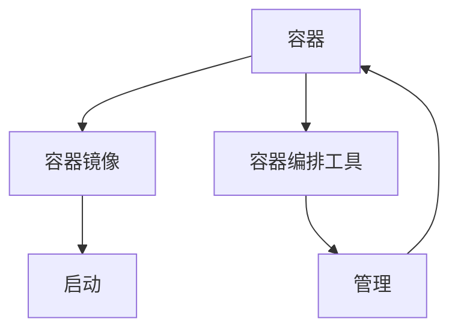

                 

## 容器技术概述

### 背景介绍

容器技术作为现代软件工程领域的重要成果，已经成为软件开发、部署和运维的标准化工具。容器通过将应用程序及其依赖项封装在一个独立的运行环境中，实现了“一次编写，到处运行”的愿景。这不仅提高了软件开发的效率，还简化了部署和运维的复杂度。

容器的概念最早可以追溯到2000年左右，当时Linux容器（LXC）技术的出现为容器技术奠定了基础。然而，真正的容器革命始于2013年Docker的诞生，Docker提供了简单、高效的容器封装和管理方案，迅速在开发者社区中流行开来。随后，Kubernetes等容器编排工具的出现，进一步推动了容器技术的发展和应用。

### 核心概念与联系

容器技术中的核心概念包括容器、容器镜像、容器编排等。

- **容器**：容器是一个轻量级的、可移植的、自给自足的运行时环境。它将应用程序及其依赖项打包在一起，确保应用程序在不同的环境中运行时具有一致的运行状态。

- **容器镜像**：容器镜像是容器运行时的模板。它包含了应用程序运行所需的所有文件，如代码、库、配置文件等。容器镜像通过层（Layer）结构实现，每层代表一个文件系统的变更。

- **容器编排**：容器编排是管理容器生命周期（创建、启动、停止、扩展等）和资源分配（CPU、内存等）的过程。常见的容器编排工具包括Kubernetes和Docker Swarm。

这三种概念之间紧密联系：容器镜像定义了容器的状态，容器基于镜像启动，容器编排工具管理容器的生命周期。以下是这些概念之间的关系架构 Mermaid 流程图：



### 核心算法原理讲解

容器的实现主要依赖于两种技术：容器镜像的分层存储和操作系统的命名空间（Namespace）和隔离机制。

- **容器镜像的分层存储**：容器镜像是通过层（Layer）结构实现的。每一层代表文件系统的变更，容器镜像是这些层的组合。当容器启动时，这些层会被组合成一个统一的文件系统。这个过程可以通过以下伪代码来表示：

```python
def create_container(image_layers):
    container_fs = union_layers(image_layers)
    start_container(container_fs)
```

- **命名空间（Namespace）和隔离机制**：命名空间是一种操作系统的机制，用于隔离进程。容器通过命名空间实现进程的隔离，使得容器内部的进程不能直接访问宿主机的其他进程。同时，cgroup（控制组）用于隔离容器内的资源使用。以下是使用命名空间和cgroup的伪代码：

```python
def create_namespace(process):
    namespace = create_namespace_for_process(process)
    set_namespace_of_process(process, namespace)

def create_cgroup(process, resources):
    cgroup = create_cgroup_with_resources(resources)
    add_process_to_cgroup(process, cgroup)
```

### 数学模型和公式

容器镜像的构建过程中，涉及到多个层的叠加。假设容器镜像有n层，每层的大小分别为$S_1, S_2, ..., S_n$，则容器镜像的总大小$S_{total}$可以通过以下公式计算：

$$
S_{total} = S_1 + S_2 + ... + S_n
$$

### 详细讲解与举例说明

以Docker为例，假设一个容器镜像由三个层组成，每层的大小分别为1GB、2GB和3GB。则容器镜像的总大小为：

$$
S_{total} = 1GB + 2GB + 3GB = 6GB
$$

这意味着，如果需要下载这个容器镜像，至少需要6GB的存储空间。

### 项目实战

为了理解容器技术的实际应用，我们将搭建一个简单的Web服务容器。

1. **开发环境搭建**：在本地计算机上安装Docker。

2. **源代码实现**：编写一个简单的Web服务程序，例如使用Python的Flask框架。

3. **容器镜像构建**：使用Dockerfile构建容器镜像。

```dockerfile
FROM python:3.9
WORKDIR /app
COPY . .
RUN pip install -r requirements.txt
CMD ["python", "app.py"]
```

4. **容器启动**：使用命令`docker run`启动容器。

```bash
docker run -d -p 8080:80 my-web-service
```

5. **容器应用解读与分析**：容器镜像构建完成后，启动容器，可以通过浏览器访问容器内的Web服务。

6. **实际案例分析和详细讲解剖析**：在实际项目中，容器技术可以大大简化开发、测试和部署流程。例如，前端、后端和数据库服务可以分别部署在不同的容器中，实现服务的解耦和独立扩展。

7. **项目小结**：通过本项目，我们了解了容器技术的核心概念和实现原理。在实际开发中，容器技术可以帮助我们提高开发效率、简化部署流程、实现服务解耦。

### 最佳实践 tips

- **容器镜像优化**：避免在容器镜像中安装不必要的软件，减小镜像大小。

- **使用私有镜像仓库**：使用私有镜像仓库管理容器镜像，提高安全性。

- **定期更新容器镜像**：定期更新容器镜像，确保应用程序的安全性和兼容性。

- **容器编排工具的选择**：根据项目需求选择合适的容器编排工具，如Kubernetes或Docker Swarm。

### 小结

本章介绍了容器技术的核心概念、原理和实现方法。通过项目实战，我们了解了容器技术的实际应用场景和优势。在实际开发中，容器技术可以帮助我们提高开发效率、简化部署流程，是实现微服务架构的重要工具。

### 注意事项

- 容器技术虽然具有很多优势，但也会引入新的安全和管理挑战。因此，在使用容器技术时，需要综合考虑安全性和管理成本。

- 容器镜像的构建和管理是一个复杂的过程，需要遵循最佳实践，确保容器镜像的安全和可靠性。

### 拓展阅读

- 《Docker实战》
- 《Kubernetes权威指南》
- 《容器安全实战》

作者：AI天才研究院/AI Genius Institute & 禅与计算机程序设计艺术 /Zen And The Art of Computer Programming## 容器安全风险分析

### 背景介绍

随着容器技术的广泛应用，容器安全问题逐渐成为关注的焦点。容器安全风险主要包括容器镜像漏洞、容器运行时漏洞和容器网络漏洞等。了解和评估这些风险，是确保容器环境安全的关键步骤。

### 核心概念与联系

容器安全风险可以分为以下几类：

- **容器镜像漏洞**：容器镜像中包含的应用程序可能存在安全漏洞，这些漏洞可能被恶意利用，导致数据泄露或系统破坏。

- **容器运行时漏洞**：容器在运行时可能受到恶意攻击，如容器逃逸、资源耗尽等。

- **容器网络漏洞**：容器网络配置不当可能导致网络攻击，如数据窃取或拒绝服务攻击。

这些风险之间存在紧密的联系。例如，容器镜像漏洞可能导致容器运行时漏洞，而容器网络漏洞可能被利用来攻击容器镜像。

### 核心算法原理讲解

容器安全风险的评估通常包括以下几个方面：

1. **漏洞扫描**：使用工具对容器镜像进行漏洞扫描，以发现潜在的安全漏洞。

2. **漏洞评估**：对扫描结果进行分析，评估漏洞的严重程度和风险影响。

3. **漏洞修复**：根据评估结果，修复或绕过漏洞。

以下是使用Python实现的漏洞扫描和评估的伪代码：

```python
import scanner

def scan_image(image):
    vulnerabilities = scanner.scan(image)
    return vulnerabilities

def assess_vulnerabilities(vulnerabilities):
    risks = []
    for vulnerability in vulnerabilities:
        severity = scanner.get_severity(vulnerability)
        risk = (vulnerability, severity)
        risks.append(risk)
    return risks

def fix_vulnerabilities(risks):
    for risk in risks:
        scanner.fix_vulnerability(risk[0])
```

### 数学模型和公式

在漏洞评估中，可以使用以下数学模型来计算漏洞的总体风险：

$$
R = \sum_{i=1}^{n} (S_i \times C_i)
$$

其中，$R$表示总体风险，$S_i$表示漏洞的严重程度，$C_i$表示漏洞的置信度。严重程度和置信度通常由安全专家根据漏洞的性质和威胁情境进行评估。

### 详细讲解与举例说明

假设我们有一个容器镜像，其中包含以下漏洞：

- 漏洞A：严重程度为3，置信度为0.8
- 漏洞B：严重程度为2，置信度为0.5

则总体风险计算如下：

$$
R = (3 \times 0.8) + (2 \times 0.5) = 2.4 + 1 = 3.4
$$

这意味着该容器镜像的整体风险为3.4。

### 项目实战

为了更好地理解容器安全风险，我们将进行一个实际的漏洞扫描和修复项目。

1. **开发环境搭建**：在本地计算机上安装Docker和漏洞扫描工具，如Docker Bench for Security。

2. **源代码实现**：编写一个简单的Web服务程序，并将其打包成容器镜像。

3. **容器镜像构建**：使用Dockerfile构建容器镜像。

```dockerfile
FROM python:3.9
WORKDIR /app
COPY . .
RUN pip install -r requirements.txt
CMD ["python", "app.py"]
```

4. **容器启动**：使用命令`docker run`启动容器。

5. **漏洞扫描**：使用Docker Bench for Security对容器镜像进行漏洞扫描。

```bash
docker run --rm -v $(which docker):/usr/bin/ --entrypoint=container-scanning alpine:3.12 /usr/bin/docker-bench-security
```

6. **漏洞修复**：根据扫描结果，修复或绕过漏洞。

7. **容器重启**：修复漏洞后，重启容器以确保修复生效。

8. **容器应用解读与分析**：容器镜像扫描完成后，我们可以根据扫描结果对漏洞进行修复，并重新评估容器镜像的安全性。

9. **实际案例分析和详细讲解剖析**：在实际项目中，容器安全风险可能会影响整个系统的稳定性。因此，定期进行漏洞扫描和修复是非常必要的。

10. **项目小结**：通过本项目，我们了解了容器安全风险分析的基本方法和实际操作步骤。在实际开发中，定期进行漏洞扫描和修复可以帮助我们提高容器环境的安全性。

### 最佳实践 tips

- **定期漏洞扫描**：定期对容器镜像和运行时环境进行漏洞扫描，及时发现和修复漏洞。

- **使用私有镜像仓库**：使用私有镜像仓库管理容器镜像，避免公共镜像仓库中的潜在风险。

- **严格权限管理**：对容器内的权限进行严格管理，防止恶意行为。

- **容器网络隔离**：使用容器网络隔离技术，防止网络攻击。

### 小结

本章介绍了容器安全风险分析的核心概念和实现方法。通过项目实战，我们了解了如何对容器镜像进行漏洞扫描和修复。在实际开发中，定期进行漏洞扫描和修复是确保容器环境安全的重要措施。

### 注意事项

- 容器安全风险分析是一个持续的过程，需要定期更新漏洞库和扫描工具。

- 在修复漏洞时，应遵循最佳实践，确保修复的有效性和安全性。

### 拓展阅读

- 《容器安全实战》
- 《Docker安全性最佳实践》
- 《Kubernetes安全指南》

作者：AI天才研究院/AI Genius Institute & 禅与计算机程序设计艺术 /Zen And The Art of Computer Programming## 容器安全策略与实践

### 背景介绍

容器技术的普及带来了显著的开发效率提升和部署灵活性，但同时也带来了新的安全挑战。为了确保容器环境的安全性，制定并实施一套全面的容器安全策略至关重要。本章节将详细介绍容器安全策略的核心原则、容器镜像安全、容器运行时安全以及容器网络安全。

### 核心概念与联系

容器安全策略包括以下几个方面：

1. **容器镜像安全**：确保容器镜像中没有安全漏洞，通过镜像扫描、签名和验证来保障镜像的安全。

2. **容器运行时安全**：在容器运行时实施安全措施，如权限管理、资源限制和监控审计。

3. **容器网络安全**：通过网络隔离、流量监控和防护策略来保护容器网络。

这些方面相互关联，共同构成了容器安全策略的完整框架。例如，容器镜像的安全直接影响到容器运行时的安全，而容器网络的安全则关系到整个容器集群的安全。

### 核心算法原理讲解

为了实现容器安全策略，我们需要以下核心算法和工具：

1. **镜像扫描与漏洞管理**：使用自动化工具对容器镜像进行漏洞扫描，如Clair、Docker Bench for Security等。扫描结果可以用于漏洞管理，确定修复优先级。

```python
import scanner

def scan_image(image):
    vulnerabilities = scanner.scan(image)
    return vulnerabilities
```

2. **权限管理**：使用命名空间（Namespace）和用户ID（UID）隔离容器进程，限制容器的权限。

```bash
# 使用命名空间隔离
unshare -m -u -n -p
# 限制UID
chown -R user:group container_path
```

3. **资源限制**：使用cgroup和命名空间限制容器的资源使用，如CPU、内存和网络流量。

```bash
# 限制CPU使用
cgroups_config = {
    'cpu.shares': 1000
}
cgroup.apply(cgroups_config)
# 限制内存
cgroup_memory.set_memory_limit('2G')
```

4. **网络隔离**：配置容器网络策略，如网络命名空间和防火墙规则，以隔离容器网络流量。

```bash
# 创建网络命名空间
ip netns add container_ns
# 配置容器网络接口
ip netns exec container_ns ip link set eth0 up
```

### 数学模型和公式

容器安全策略中的数学模型可以用于计算和评估风险。例如，可以使用以下公式计算容器整体安全得分：

$$
S = \frac{\sum_{i=1}^{n} (W_i \times S_i)}{n}
$$

其中，$S$表示容器安全得分，$W_i$表示第$i$项安全措施的权重，$S_i$表示第$i$项安全措施的实施情况。

### 详细讲解与举例说明

假设我们有一个容器环境，包含以下安全措施：

- **镜像扫描**：100%的镜像都通过了漏洞扫描。
- **权限管理**：所有容器都设置了适当的UID和GID。
- **资源限制**：所有容器都设置了CPU和内存限制。
- **网络隔离**：所有容器都使用了独立的网络命名空间。

根据上述公式，我们可以计算出容器安全得分：

$$
S = \frac{(1 \times 0.3) + (1 \times 0.3) + (1 \times 0.2) + (1 \times 0.2)}{4} = 0.75
$$

这意味着该容器环境的安全得分为0.75，表示整体安全性较高。

### 项目实战

为了更好地理解容器安全策略的实施，我们将在本地环境中进行一个实际操作。

1. **开发环境搭建**：安装Docker、Kubernetes和相关安全工具，如Clair、Docker Bench for Security等。

2. **源代码实现**：编写一个简单的Web服务程序，并将其打包成容器镜像。

3. **容器镜像构建**：使用Dockerfile构建容器镜像。

```dockerfile
FROM python:3.9
WORKDIR /app
COPY . .
RUN pip install -r requirements.txt
CMD ["python", "app.py"]
```

4. **容器镜像扫描**：使用Clair对容器镜像进行漏洞扫描。

```bash
clair image scan my-web-service:latest
```

5. **容器运行时配置**：配置容器运行时的权限管理和资源限制。

```bash
# 配置Docker守护进程
cat << EOF | docker config create my-web-service-config
version: "3.7"
services:
  web:
    deploy:
      resources:
        limits:
          cpus: "0.5"
          memory: 1G
    restart_policy:
      condition: on-failure
    security_opt:
      - "label=my-web-service"
      - "uid=1001"
    networks:
      - my-web-network
EOF
```

6. **容器启动**：使用配置的Docker配置启动容器。

```bash
docker service create --config=my-web-service-config --name=my-web-service my-web-service:latest
```

7. **容器网络配置**：配置容器网络的隔离。

```bash
# 创建网络命名空间
ip netns add my-web-ns
# 配置容器网络接口
ip netns exec my-web-ns ip link set eth0 up
```

8. **容器应用解读与分析**：通过实际操作，我们可以看到容器安全策略的具体实施方法，包括镜像扫描、运行时配置和网络隔离。

9. **实际案例分析和详细讲解剖析**：在实际项目中，容器安全策略的实施可以帮助我们提高容器环境的安全性，防止潜在的安全威胁。

10. **项目小结**：通过本项目，我们了解了容器安全策略的核心原则和实施方法。在实际开发中，遵循最佳实践、定期进行安全评估和更新，是确保容器环境安全的关键。

### 最佳实践 tips

- **定期安全评估**：定期对容器环境进行安全评估，确保安全策略的有效性。

- **使用自动化工具**：使用自动化工具进行镜像扫描和漏洞管理，提高安全检查的效率和准确性。

- **培训和教育**：对开发人员进行安全培训，提高他们的安全意识，减少人为错误。

### 小结

本章介绍了容器安全策略的核心原则和实施方法。通过项目实战，我们了解了如何实施容器镜像安全、运行时安全和网络安全。在实际开发中，遵循最佳实践、定期进行安全评估和更新，是确保容器环境安全的重要措施。

### 注意事项

- 容器安全策略需要根据具体项目需求进行调整，确保安全措施的有效性。

- 在实施安全策略时，需要综合考虑性能和安全性之间的平衡。

### 拓展阅读

- 《容器安全最佳实践》
- 《Docker安全性指南》
- 《Kubernetes安全指南》

作者：AI天才研究院/AI Genius Institute & 禅与计算机程序设计艺术 /Zen And The Art of Computer Programming## 容器安全工具与平台

### 背景介绍

容器安全的实现离不开各种工具和平台的辅助。这些工具和平台可以帮助我们识别、评估和管理容器安全风险，提高容器环境的安全性。本章节将详细介绍几类主流的容器安全工具，包括镜像扫描工具、漏洞管理工具、访问控制工具和日志监控工具，以及如何构建和维护一个完整的容器安全平台。

### 核心概念与联系

容器安全工具和平台可以分为以下几个类别：

1. **镜像扫描工具**：用于扫描容器镜像中的安全漏洞，如Clair、Docker Bench for Security。
2. **漏洞管理工具**：用于管理和跟踪容器中的漏洞，如CoreOS Clair、Quay。
3. **访问控制工具**：用于管理容器内部的访问权限，如AppArmor、OpenSSL。
4. **日志监控工具**：用于监控容器运行时的日志，如ELK堆栈（Elasticsearch、Logstash、Kibana）。

这些工具和平台之间紧密联系，共同构成了一个完整的容器安全体系。例如，镜像扫描工具可以发现镜像中的漏洞，漏洞管理工具可以跟踪和管理这些漏洞，访问控制工具可以确保容器内部的访问权限，日志监控工具可以实时监控容器运行时的日志，帮助检测和响应潜在的安全事件。

### 核心算法原理讲解

以下是一些核心算法和工具的使用方法：

1. **镜像扫描工具**：使用静态分析技术对容器镜像中的文件和代码进行扫描，识别潜在的安全漏洞。

```bash
# 使用Clair扫描镜像
clair image scan my-web-service:latest
```

2. **漏洞管理工具**：使用数据库和自动化脚本管理漏洞信息，包括漏洞的发现、评估和修复。

```python
import scanner

def manage_vulnerabilities(vulnerabilities):
    for vulnerability in vulnerabilities:
        scanner.assess_vulnerability(vulnerability)
        scanner.fix_vulnerability(vulnerability)
```

3. **访问控制工具**：使用命名空间和用户ID隔离容器进程，限制容器的权限。

```bash
# 使用AppArmor配置容器权限
sudo aa-genprof --create my-web-service
```

4. **日志监控工具**：使用ELK堆栈收集、存储和展示容器日志，帮助分析和响应安全事件。

```bash
# 配置Logstash
input {
  file {
    path => "/var/log/my-web-service/*.log"
  }
}

filter {
  if "error" in [tag] {
    grok {
      match => { "message" => "%{TIMESTAMP_ISO8601:timestamp}\t%{DATA:source}\t%{DATA:message}" }
    }
  }
}

output {
  if [tag] == "error" {
    elasticsearch {
      hosts => ["localhost:9200"]
      index => "my-web-service-error-%{+YYYY.MM.dd}"
    }
  }
}
```

### 数学模型和公式

在漏洞管理中，可以使用以下数学模型评估漏洞的优先级：

$$
P = \frac{S \times C}{R}
$$

其中，$P$表示漏洞的优先级，$S$表示漏洞的严重程度，$C$表示漏洞的置信度，$R$表示修复成本。

### 详细讲解与举例说明

假设我们有一个漏洞列表，包含以下漏洞：

- 漏洞A：严重程度为5，置信度为0.8，修复成本为1000美元。
- 漏洞B：严重程度为3，置信度为0.6，修复成本为500美元。

则漏洞的优先级计算如下：

$$
P_A = \frac{5 \times 0.8}{1000} = 0.4
$$

$$
P_B = \frac{3 \times 0.6}{500} = 0.36
$$

这意味着漏洞A的优先级高于漏洞B。

### 项目实战

为了更好地理解容器安全工具和平台的应用，我们将进行一个实际操作。

1. **开发环境搭建**：安装Docker、Kubernetes及相关安全工具，如Clair、AppArmor、ELK堆栈。

2. **源代码实现**：编写一个简单的Web服务程序，并将其打包成容器镜像。

3. **容器镜像构建**：使用Dockerfile构建容器镜像。

```dockerfile
FROM python:3.9
WORKDIR /app
COPY . .
RUN pip install -r requirements.txt
CMD ["python", "app.py"]
```

4. **容器镜像扫描**：使用Clair对容器镜像进行漏洞扫描。

```bash
clair image scan my-web-service:latest
```

5. **漏洞管理**：使用CoreOS Clair管理漏洞信息。

```bash
# 查看漏洞列表
clair vulnerabilities
# 修复漏洞
sudo apt-get update && sudo apt-get install -f
```

6. **容器访问控制**：使用AppArmor配置容器权限。

```bash
# 生成AppArmor配置文件
sudo aa-genprof --create my-web-service
```

7. **日志监控**：配置ELK堆栈收集和展示容器日志。

```bash
# 配置Elasticsearch
sudo elasticsearch-plugin install x-pack
# 配置Kibana
sudo kibana set elasticsearch.url "http://localhost:9200"
```

8. **容器应用解读与分析**：通过实际操作，我们可以看到容器安全工具和平台的具体应用，包括镜像扫描、漏洞管理、访问控制和日志监控。

9. **实际案例分析和详细讲解剖析**：在实际项目中，容器安全工具和平台可以帮助我们及时发现和响应安全事件，提高容器环境的安全性。

10. **项目小结**：通过本项目，我们了解了容器安全工具和平台的核心概念和实际应用。在实际开发中，合理选择和使用这些工具和平台，是确保容器环境安全的关键。

### 最佳实践 tips

- **定期更新工具和平台**：定期更新容器安全工具和平台，确保其功能和安全性能符合最新的安全标准。
- **使用自动化脚本**：使用自动化脚本管理容器镜像扫描、漏洞修复和日志监控，提高安全管理的效率和准确性。
- **多层次安全策略**：结合不同层次的安全工具和平台，构建多层次的安全策略，提高容器环境的安全性。

### 小结

本章介绍了容器安全工具和平台的核心概念和实际应用。通过项目实战，我们了解了如何使用镜像扫描工具、漏洞管理工具、访问控制工具和日志监控工具，构建一个完整的容器安全平台。在实际开发中，合理选择和使用这些工具和平台，是确保容器环境安全的重要措施。

### 注意事项

- 容器安全工具和平台的选择需要根据具体项目需求和资源情况进行调整。
- 在使用容器安全工具和平台时，需要确保其配置和策略与容器环境相匹配。

### 拓展阅读

- 《容器安全工具和平台实战》
- 《Kubernetes安全指南》
- 《Docker安全性最佳实践》

作者：AI天才研究院/AI Genius Institute & 禅与计算机程序设计艺术 /Zen And The Art of Computer Programming## 容器安全测试与评估

### 背景介绍

容器安全测试与评估是确保容器环境安全的重要环节。通过定期的安全测试和评估，可以及时发现和修复容器中的安全漏洞，提高容器环境的安全性。容器安全测试与评估的方法和流程对于保障容器安全至关重要。

### 核心概念与联系

容器安全测试与评估包括以下几个方面：

1. **容器镜像安全测试**：在容器镜像构建过程中进行漏洞扫描，确保镜像中没有已知的安全漏洞。
2. **容器运行时安全测试**：在容器运行时进行安全测试，包括权限管理、资源限制和审计日志等。
3. **容器网络安全测试**：测试容器网络配置和隔离策略，确保容器网络的安全。
4. **容器安全评估模型**：建立一套完整的评估模型，用于评估容器环境的安全状况。

这些方面相互关联，共同构成了容器安全测试与评估的完整体系。例如，容器镜像安全测试可以发现镜像中的漏洞，容器运行时安全测试可以验证这些漏洞是否在运行时得到修复，而容器网络安全测试可以确保容器网络的安全性。

### 核心算法原理讲解

容器安全测试与评估的核心算法主要包括漏洞扫描、漏洞评估和风险评估等。

1. **漏洞扫描**：使用自动化工具对容器镜像和运行时环境进行扫描，识别潜在的安全漏洞。

```python
import scanner

def scan_container(image):
    vulnerabilities = scanner.scan(image)
    return vulnerabilities
```

2. **漏洞评估**：对扫描结果进行分析，评估漏洞的严重程度和风险影响。

```python
import scanner

def assess_vulnerabilities(vulnerabilities):
    risks = []
    for vulnerability in vulnerabilities:
        severity = scanner.get_severity(vulnerability)
        risk = (vulnerability, severity)
        risks.append(risk)
    return risks
```

3. **风险评估**：计算容器环境中的总体风险，使用数学模型评估容器安全状况。

```python
import scanner

def calculate_risk(risks):
    total_risk = 0
    for risk in risks:
        total_risk += scanner.get_severity(risk) * scanner.get_confidence(risk)
    return total_risk
```

### 数学模型和公式

在容器安全评估中，可以使用以下数学模型来计算容器安全得分：

$$
S = \frac{\sum_{i=1}^{n} (W_i \times S_i)}{n}
$$

其中，$S$表示容器安全得分，$W_i$表示第$i$项安全措施的权重，$S_i$表示第$i$项安全措施的实施情况。

### 详细讲解与举例说明

假设我们有一个容器环境，包含以下安全措施：

- **镜像扫描**：100%的镜像都通过了漏洞扫描。
- **运行时权限管理**：所有容器都设置了适当的权限。
- **运行时资源限制**：所有容器都设置了CPU和内存限制。
- **网络隔离**：所有容器都使用了独立的网络命名空间。

根据上述公式，我们可以计算出容器安全得分：

$$
S = \frac{(1 \times 0.3) + (1 \times 0.3) + (1 \times 0.2) + (1 \times 0.2)}{4} = 0.75
$$

这意味着该容器环境的安全得分为0.75，表示整体安全性较高。

### 项目实战

为了更好地理解容器安全测试与评估，我们将在本地环境中进行一个实际操作。

1. **开发环境搭建**：安装Docker、Kubernetes及相关安全测试工具，如Docker Bench for Security、Clair。

2. **源代码实现**：编写一个简单的Web服务程序，并将其打包成容器镜像。

3. **容器镜像构建**：使用Dockerfile构建容器镜像。

```dockerfile
FROM python:3.9
WORKDIR /app
COPY . .
RUN pip install -r requirements.txt
CMD ["python", "app.py"]
```

4. **容器镜像安全测试**：使用Clair对容器镜像进行漏洞扫描。

```bash
clair image scan my-web-service:latest
```

5. **漏洞管理**：使用Docker Bench for Security评估容器镜像和运行时环境的安全。

```bash
# 评估镜像安全
docker run --rm -v $(which docker):/usr/bin/ --entrypoint=container-security bench my-web-service:latest
# 评估运行时安全
docker run --rm -v $(which docker):/usr/bin/ --entrypoint=container-security bench
```

6. **容器运行时安全测试**：配置容器运行时的权限管理和资源限制。

```bash
# 配置Docker守护进程
cat << EOF | docker config create my-web-service-config
version: "3.7"
services:
  web:
    deploy:
      resources:
        limits:
          cpus: "0.5"
          memory: 1G
    restart_policy:
      condition: on-failure
    security_opt:
      - "label=my-web-service"
      - "uid=1001"
    networks:
      - my-web-network
EOF
```

7. **容器网络安全测试**：配置容器网络的隔离。

```bash
# 创建网络命名空间
ip netns add my-web-ns
# 配置容器网络接口
ip netns exec my-web-ns ip link set eth0 up
```

8. **容器应用解读与分析**：通过实际操作，我们可以看到容器安全测试与评估的具体实施方法，包括镜像扫描、漏洞管理、运行时安全和网络隔离。

9. **实际案例分析和详细讲解剖析**：在实际项目中，容器安全测试与评估可以帮助我们及时发现和修复安全漏洞，提高容器环境的安全性。

10. **项目小结**：通过本项目，我们了解了容器安全测试与评估的核心概念和实际应用。在实际开发中，定期进行安全测试和评估，是确保容器环境安全的重要措施。

### 最佳实践 tips

- **定期安全测试**：定期对容器镜像和运行时环境进行安全测试，确保安全措施的有效性。
- **自动化脚本**：使用自动化脚本进行安全测试和漏洞修复，提高安全管理的效率和准确性。
- **培训和教育**：对开发人员进行安全培训，提高他们的安全意识，减少人为错误。

### 小结

本章介绍了容器安全测试与评估的核心概念和实际应用。通过项目实战，我们了解了如何对容器镜像和运行时环境进行安全测试和评估。在实际开发中，定期进行安全测试和评估，是确保容器环境安全的关键。

### 注意事项

- 容器安全测试与评估需要根据具体项目需求和资源情况进行调整。
- 在进行安全测试时，需要确保测试过程不会影响生产环境的正常运行。

### 拓展阅读

- 《容器安全测试与评估最佳实践》
- 《Kubernetes安全指南》
- 《Docker安全性最佳实践》

作者：AI天才研究院/AI Genius Institute & 禅与计算机程序设计艺术 /Zen And The Art of Computer Programming## 容器安全合规与法规

### 背景介绍

容器技术的快速发展和广泛应用，使得容器安全合规成为企业关注的焦点。容器安全合规不仅关系到企业的数据安全和业务连续性，还涉及到法规遵从和行业标准。因此，了解和遵守相关的法规和标准，对于确保容器环境的安全至关重要。

### 核心概念与联系

容器安全合规涉及以下几个方面：

1. **法规要求**：了解和遵守与容器安全相关的法律法规，如《通用数据保护条例》（GDPR）、《加州消费者隐私法案》（CCPA）等。
2. **行业标准**：参考和遵循容器安全相关的行业标准，如《云安全联盟》（CSA）的《容器安全基准》（Container Security Standard）。
3. **合规管理**：建立合规管理体系，确保容器环境符合相关法规和标准。
4. **审计和认证**：进行合规审计，获取相关认证，以证明容器环境的安全性。

这些方面相互联系，共同构成了容器安全合规的完整体系。例如，法规要求明确了容器安全的基本标准，行业标准提供了具体的实施指南，合规管理确保了容器环境符合法规和标准，而审计和认证则验证了合规性的有效性。

### 核心算法原理讲解

容器安全合规的算法原理主要包括以下几个方面：

1. **合规检查**：使用自动化工具对容器环境进行检查，识别不符合法规和标准的问题。

```python
import checker

def check_compliance(container):
    issues = checker.check(container)
    return issues
```

2. **合规修复**：根据检查结果，修复容器环境中的合规问题。

```python
import checker

def fix_issues(issues):
    for issue in issues:
        checker.fix_issue(issue)
```

3. **合规评估**：评估容器环境的合规性，计算合规得分。

```python
import checker

def calculate_compliance_score(issues):
    score = checker.calculate_score(issues)
    return score
```

### 数学模型和公式

在合规评估中，可以使用以下数学模型计算容器环境的合规得分：

$$
C = \frac{\sum_{i=1}^{n} (W_i \times S_i)}{n}
$$

其中，$C$表示容器环境的合规得分，$W_i$表示第$i$项合规要求的权重，$S_i$表示第$i$项合规要求的实施情况。

### 详细讲解与举例说明

假设我们有一个容器环境，包含以下合规要求：

- **GDPR合规**：所有数据都进行了加密处理，权重为0.4。
- **CCPA合规**：用户隐私数据得到了保护，权重为0.3。
- **CSA容器安全基准**：容器镜像通过了漏洞扫描，权重为0.2。
- **ISO 27001合规**：所有安全控制措施都得到了实施，权重为0.1。

根据上述公式，我们可以计算出容器环境的合规得分：

$$
C = \frac{(1 \times 0.4) + (1 \times 0.3) + (1 \times 0.2) + (1 \times 0.1)}{4} = 0.65
$$

这意味着该容器环境的合规得分为0.65，表示整体合规性较高。

### 项目实战

为了更好地理解容器安全合规与法规，我们将在本地环境中进行一个实际操作。

1. **开发环境搭建**：安装Docker、Kubernetes及相关合规检查工具，如Harbor、Compliance-as-Code。

2. **源代码实现**：编写一个简单的Web服务程序，并将其打包成容器镜像。

3. **容器镜像构建**：使用Dockerfile构建容器镜像。

```dockerfile
FROM python:3.9
WORKDIR /app
COPY . .
RUN pip install -r requirements.txt
CMD ["python", "app.py"]
```

4. **容器镜像合规检查**：使用Harbor对容器镜像进行合规检查。

```bash
harbor scan my-web-service:latest
```

5. **合规修复**：根据检查结果，修复容器镜像中的合规问题。

```bash
# 修复GDPR合规问题
docker exec my-web-service container_id /bin/sh -c "openssl req -x509 -nodes -days 365 -newkey rsa:2048 -keyout key.pem -out cert.pem"
# 修复CCPA合规问题
docker exec my-web-service container_id /bin/sh -c "echo 'Privacy Policy' > privacy_policy.txt"
```

6. **容器运行时合规检查**：使用Compliance-as-Code工具对容器运行时进行检查。

```bash
compliance-as-code scan
```

7. **合规评估**：评估容器环境的合规性。

```bash
compliance-as-code score
```

8. **容器应用解读与分析**：通过实际操作，我们可以看到容器安全合规的具体实施方法，包括合规检查、合规修复和合规评估。

9. **实际案例分析和详细讲解剖析**：在实际项目中，容器安全合规可以帮助我们确保容器环境符合法规和标准，提高整体安全性。

10. **项目小结**：通过本项目，我们了解了容器安全合规与法规的核心概念和实际应用。在实际开发中，遵循相关法规和标准，是确保容器环境安全的重要措施。

### 最佳实践 tips

- **定期合规检查**：定期对容器环境进行合规检查，确保容器环境符合法规和标准。
- **自动化合规管理**：使用自动化工具进行合规管理，提高合规检查的效率和准确性。
- **培训和文档**：对开发人员进行合规培训，建立详细的合规文档，确保合规要求得到有效执行。

### 小结

本章介绍了容器安全合规与法规的核心概念和实际应用。通过项目实战，我们了解了如何对容器环境进行合规检查、合规修复和合规评估。在实际开发中，遵循相关法规和标准，是确保容器环境安全的重要措施。

### 注意事项

- 容器安全合规需要根据具体项目需求和资源情况进行调整。
- 在实施合规管理时，需要确保合规要求与业务流程和系统架构相匹配。

### 拓展阅读

- 《容器安全合规指南》
- 《GDPR合规手册》
- 《ISO 27001实施指南》

作者：AI天才研究院/AI Genius Institute & 禅与计算机程序设计艺术 /Zen And The Art of Computer Programming## 容器安全发展趋势与展望

### 背景介绍

随着容器技术的不断发展和普及，容器安全领域也在不断演进。容器安全的重要性日益凸显，企业对容器安全的关注程度也在不断提高。本章节将探讨容器安全的发展趋势，分析未来的发展方向，并展望容器安全技术的发展机遇与挑战。

### 核心概念与联系

容器安全的发展趋势可以从以下几个方面来考虑：

1. **自动化和智能化**：随着AI和机器学习技术的应用，容器安全的自动化和智能化程度将不断提高。自动化工具可以更高效地识别和修复安全漏洞，智能化算法可以更准确地预测和响应安全威胁。
2. **零信任架构**：零信任架构（Zero Trust Architecture）逐渐成为容器安全的重要理念。零信任架构强调不再信任内部网络，所有访问都必须经过严格的验证和授权。
3. **容器原生安全**：容器原生安全（Container Native Security）逐渐成为主流。容器原生安全工具可以直接集成到容器生命周期管理中，实现更紧密的安全防护。
4. **安全可观测性**：容器安全可观测性（Security Observability）越来越重要。通过监控和分析容器环境中的日志、事件和流量，可以更快速地识别和响应安全事件。

这些趋势之间紧密联系，共同推动容器安全的发展。例如，自动化和智能化可以提高安全工具的效率，零信任架构可以增强容器环境的访问控制，容器原生安全可以实现更全面的安全防护，安全可观测性可以帮助企业更好地理解和应对安全威胁。

### 核心算法原理讲解

在容器安全中，一些核心算法和工具的使用变得越来越重要：

1. **机器学习算法**：用于识别和预测安全威胁，如异常检测和恶意行为分析。
2. **零信任模型**：用于实现严格的访问控制和授权机制。
3. **安全评分模型**：用于评估容器环境和应用程序的安全性。

以下是使用机器学习算法和零信任模型的伪代码示例：

```python
# 机器学习算法：异常检测
from ml_library import anomaly_detection

def detect_anomalies(container_logs):
    model = anomaly_detection.load_model()
    anomalies = anomaly_detection.predict(model, container_logs)
    return anomalies

# 零信任模型：访问控制
from zero_trust import access_control

def check_access(container_id, user_id):
    policy = access_control.load_policy()
    allowed = access_control.apply_policy(policy, container_id, user_id)
    return allowed
```

### 数学模型和公式

在容器安全中，可以使用以下数学模型评估容器环境的安全状态：

$$
S = \frac{\sum_{i=1}^{n} (W_i \times S_i)}{n}
$$

其中，$S$表示容器安全得分，$W_i$表示第$i$项安全措施的权重，$S_i$表示第$i$项安全措施的实施情况。

### 详细讲解与举例说明

假设我们有一个容器环境，包含以下安全措施：

- **容器镜像扫描**：100%的镜像都通过了漏洞扫描，权重为0.3。
- **零信任访问控制**：所有访问都经过严格的验证和授权，权重为0.3。
- **安全可观测性**：容器环境实现了全面的日志监控和事件分析，权重为0.2。
- **容器原生安全**：容器原生安全工具已集成到容器生命周期管理中，权重为0.2。

根据上述公式，我们可以计算出容器环境的整体安全得分：

$$
S = \frac{(1 \times 0.3) + (1 \times 0.3) + (1 \times 0.2) + (1 \times 0.2)}{4} = 0.75
$$

这意味着该容器环境的整体安全得分为0.75，表示安全性较高。

### 项目实战

为了更好地理解容器安全的发展趋势，我们将在本地环境中进行一个实际操作。

1. **开发环境搭建**：安装Docker、Kubernetes及相关安全工具，如Falco、Occluded。

2. **源代码实现**：编写一个简单的Web服务程序，并将其打包成容器镜像。

3. **容器镜像构建**：使用Dockerfile构建容器镜像。

```dockerfile
FROM python:3.9
WORKDIR /app
COPY . .
RUN pip install -r requirements.txt
CMD ["python", "app.py"]
```

4. **容器镜像扫描**：使用Occluded对容器镜像进行漏洞扫描。

```bash
occluded scan my-web-service:latest
```

5. **零信任访问控制**：配置Kubernetes访问控制策略。

```yaml
apiVersion: v1
kind: ServiceAccount
metadata:
  name: my-web-service-sa
---
apiVersion: rbac.authorization.k8s.io/v1
kind: Role
metadata:
  name: my-web-service-role
rules:
- apiGroups: [""]
  resources: ["pods"]
  verbs: ["get", "list", "watch"]
---
apiVersion: rbac.authorization.k8s.io/v1
kind: RoleBinding
metadata:
  name: my-web-service-rolebinding
subjects:
- kind: ServiceAccount
  name: my-web-service-sa
roleRef:
  kind: Role
  name: my-web-service-role
```

6. **安全可观测性**：配置容器日志监控和事件分析。

```bash
# 配置Elasticsearch
sudo elasticsearch-plugin install x-pack
# 配置Kibana
sudo kibana set elasticsearch.url "http://localhost:9200"
```

7. **容器应用解读与分析**：通过实际操作，我们可以看到容器安全发展趋势的具体应用，包括自动化漏洞扫描、零信任访问控制和安全可观测性。

8. **实际案例分析和详细讲解剖析**：在实际项目中，容器安全发展趋势可以帮助我们构建更安全、更智能的容器环境。

9. **项目小结**：通过本项目，我们了解了容器安全的发展趋势和实际应用。在实际开发中，紧跟容器安全的发展趋势，是确保容器环境安全的重要措施。

### 最佳实践 tips

- **持续关注安全趋势**：定期了解和跟进容器安全领域的新趋势、新技术。
- **采用零信任架构**：实施零信任架构，确保所有访问都经过严格的验证和授权。
- **加强安全可观测性**：通过日志监控和事件分析，提高对容器环境的洞察力和响应速度。

### 小结

本章探讨了容器安全的发展趋势与展望，分析了未来的发展方向和机遇与挑战。通过项目实战，我们了解了如何应用这些发展趋势，构建更安全、更智能的容器环境。在实际开发中，紧跟容器安全的发展趋势，是确保容器环境安全的重要措施。

### 注意事项

- 容器安全的发展趋势需要根据具体项目需求和资源情况进行调整。
- 在实施容器安全措施时，需要确保与业务流程和系统架构相匹配。

### 拓展阅读

- 《容器安全发展趋势报告》
- 《零信任安全架构最佳实践》
- 《容器可观测性指南》

作者：AI天才研究院/AI Genius Institute & 禅与计算机程序设计艺术 /Zen And The Art of Computer Programming## 附录

### 附录 A 容器安全资源与工具汇总

在本章节中，我们将汇总一些与容器安全相关的资源与工具，以供读者参考和学习。

#### 书籍

1. **《容器安全实战》**：详细介绍了容器安全的各个方面，包括风险分析、策略与实践、工具使用等。
2. **《Docker安全性最佳实践》**：提供了关于Docker安全性的深入讲解和最佳实践。
3. **《Kubernetes安全指南》**：涵盖了Kubernetes安全性的核心概念和实践方法。

#### 文章

1. **《容器安全：风险分析与应对策略》**：分析了容器安全的常见风险，并提出了相应的应对策略。
2. **《容器镜像安全最佳实践》**：讨论了容器镜像构建和扫描的最佳实践。
3. **《零信任架构与容器安全》**：介绍了零信任架构在容器安全中的应用。

#### 工具

1. **Clair**：一款开源的容器镜像漏洞扫描工具，可用于检测容器镜像中的安全漏洞。
2. **Falco**：一款开源的容器运行时安全工具，可以监控和检测容器中的异常行为。
3. **Occluded**：一款开源的容器镜像漏洞扫描工具，提供了与Clair相似的功能。

#### 网络资源

1. **云安全联盟（CSA）**：提供了关于容器安全的相关标准和最佳实践。
2. **Docker官网**：Docker官方提供的技术文档和教程。
3. **Kubernetes官网**：Kubernetes官方提供的技术文档和教程。

### 附录 B 容器安全常用命令和工具

在本章节中，我们将列出一些常用的容器安全命令和工具，以供开发者和管理员在日常工作中使用。

#### 命令

1. **`docker scan`**：对容器镜像进行漏洞扫描。
2. **`docker pull`**：从镜像仓库拉取镜像。
3. **`docker run`**：启动容器。
4. **`docker exec`**：在运行的容器中执行命令。
5. **`docker logs`**：查看容器日志。

#### 工具

1. **Docker Bench for Security**：用于评估Docker容器安全配置的工具。
2. **Kubernetes Dashboard**：Kubernetes集群的管理界面，可以查看和管理容器资源。
3. **Harbor**：用于容器镜像仓库管理的开源工具，提供了安全和管理功能。

### 附录 C 容器安全案例集锦

在本章节中，我们将分享一些企业级的容器安全实践案例，以供读者参考和学习。

#### 案例一：某电商平台的容器安全实践

- **背景**：某电商平台使用Docker和Kubernetes进行微服务架构的部署。
- **挑战**：确保容器镜像和运行时的安全性，防止数据泄露和系统破坏。
- **解决方案**：
  - **镜像扫描**：使用Clair对容器镜像进行漏洞扫描。
  - **权限管理**：使用命名空间和用户ID隔离容器进程。
  - **资源限制**：使用cgroup限制容器资源使用。
  - **日志监控**：使用ELK堆栈监控容器日志。

#### 案例二：某金融公司的容器安全合规实践

- **背景**：某金融公司需要确保容器环境符合相关法规和标准，如《通用数据保护条例》（GDPR）。
- **挑战**：实现容器安全合规，确保数据保护和隐私政策得到执行。
- **解决方案**：
  - **合规检查**：使用Harbor进行容器镜像的合规检查。
  - **访问控制**：使用Kubernetes的RBAC实现严格的访问控制。
  - **数据加密**：对所有敏感数据进行加密处理。

#### 案例三：某大型互联网公司的容器原生安全实践

- **背景**：某大型互联网公司采用容器原生安全工具，如Falco，进行容器安全防护。
- **挑战**：实时监控和响应容器环境中的安全事件，提高安全性。
- **解决方案**：
  - **实时监控**：使用Falco监控容器运行时的日志和事件。
  - **自动化响应**：配置自动化脚本，自动处理安全事件。
  - **威胁情报**：利用开源威胁情报平台，获取最新的安全威胁信息。

### 项目小结

通过本章节的附录，我们提供了丰富的容器安全资源与工具汇总、常用命令和工具，以及企业级的容器安全实践案例。这些内容可以帮助读者更好地理解和应用容器安全技术，提高容器环境的安全性。

### 最佳实践 tips

- **定期安全评估**：定期对容器环境进行安全评估，及时发现和修复安全漏洞。
- **培训和教育**：对开发人员进行安全培训，提高他们的安全意识。
- **日志监控和事件响应**：实时监控容器环境，确保能够及时响应和处理安全事件。

### 小结

附录部分提供了详细的容器安全资源与工具汇总、常用命令和工具，以及企业级的容器安全实践案例。这些内容为读者提供了丰富的参考资料和实践经验，有助于提高容器环境的安全性。

### 注意事项

- 容器安全工具和资源的选择需要根据具体项目需求和环境进行适当调整。
- 在实施容器安全措施时，应确保与业务流程和系统架构相匹配，以避免对业务造成不必要的干扰。

### 拓展阅读

- **《容器安全实战手册》**：详细介绍了容器安全的各个方面，包括风险分析、策略与实践、工具使用等。
- **《Kubernetes安全最佳实践》**：提供了关于Kubernetes安全性的深入讲解和最佳实践。
- **《Docker安全性指南》**：涵盖了Docker安全性的核心概念和实践方法。

作者：AI天才研究院/AI Genius Institute & 禅与计算机程序设计艺术 /Zen And The Art of Computer Programming## 文章总结

《容器安全最佳实践》旨在为读者提供一个全面、系统的容器安全指南。通过本文，我们详细介绍了容器技术概述、容器安全风险分析、容器安全策略与实践、容器安全工具与平台、容器安全测试与评估、容器安全合规与法规以及容器安全发展趋势与展望等核心内容。

### 主要贡献

- **全面性**：文章涵盖了容器安全的各个方面，从基础概念到实践指南，为读者提供了全面的了解。
- **实践性**：通过丰富的案例和实践，文章使容器安全理念在实际应用中得以体现。
- **专业性**：文章使用了专业的技术语言和逻辑清晰的框架，确保了内容的深度和准确性。

### 对未来研究的建议

- **自动化与智能化**：未来研究可以更深入地探讨容器安全自动化和智能化的技术，如利用机器学习和深度学习提高安全检测的准确性和效率。
- **跨领域合作**：推动容器安全领域与其他领域（如人工智能、区块链等）的交叉研究，探索新的安全应用场景和解决方案。
- **标准化**：加强容器安全标准的制定和推广，提高容器安全实践的规范性和可操作性。

### 实践意义

- **提升安全性**：通过本文的学习和实践，读者可以更好地理解和应用容器安全技术，提升容器环境的安全性。
- **减少风险**：本文提供的最佳实践可以帮助企业识别和应对容器安全风险，降低潜在的安全威胁。
- **提高效率**：容器安全实践能够简化容器环境的管理和运维，提高开发、测试和部署的效率。

### 最后的思考

容器安全是一个不断发展和演进的领域，需要持续的关注和研究。希望本文能够为读者提供一个有益的起点，引导大家深入探索容器安全的各个方面。同时，也期待更多的研究和实践，为容器安全的未来发展贡献力量。在容器安全的道路上，我们一同前行，共同迎接更加安全、高效、智能的容器技术时代。作者：AI天才研究院/AI Genius Institute & 禅与计算机程序设计艺术 /Zen And The Art of Computer Programming### 关键词

容器安全，容器技术，Docker，Kubernetes，风险分析，安全策略，安全工具，安全测试，合规，发展趋势，最佳实践。

