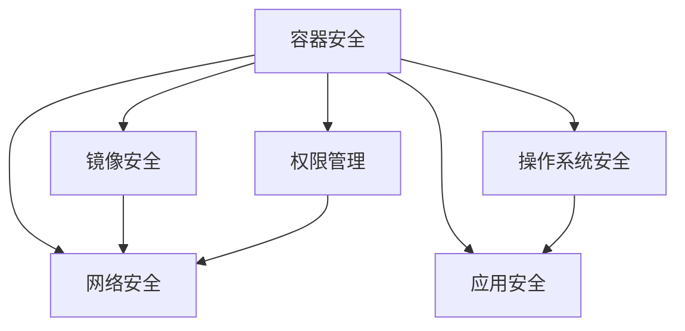

                 

### 文章标题

《容器安全最佳实践》

### 文章关键词

容器安全、最佳实践、容器镜像、网络安全、操作系统安全、应用安全、工具与技术

### 文章摘要

本文旨在深入探讨容器安全领域，提供一系列全面且实用的最佳实践。通过介绍容器安全的核心概念、关键技术和实际应用，本文帮助读者构建全面的安全防护体系，以应对不断演变的威胁。文章涵盖了从容器镜像安全、网络安全到操作系统和应用层的安全策略，同时还介绍了各种实用的工具和技术。通过这些实践指导，读者将能够更好地保护其容器化环境，确保系统的稳定和安全运行。

## 容器安全的重要性

容器技术作为现代云计算和微服务架构的核心组件，已经成为许多企业数字化转型的重要工具。容器化提供了轻量级、可移植和高度灵活的部署方式，使得应用程序能够快速迭代和部署。然而，随着容器技术的广泛应用，容器安全问题也逐渐凸显出来。

### 容器技术的基本原理

容器是一种轻量级、可移植的独立运行环境，通过利用操作系统的虚拟化机制实现。容器共享宿主机的操作系统内核，而不是像虚拟机那样需要独立的操作系统。这使得容器具有非常高的性能和资源利用率，同时保持应用程序的一致性和隔离性。

容器技术的主要特点包括：

- **轻量级**：容器直接运行在宿主机的操作系统上，无需额外的操作系统层，从而减少了资源消耗。
- **可移植性**：容器可以在不同的操作系统和硬件平台上运行，这使得应用程序的部署更加灵活。
- **高并发性**：容器可以独立部署和扩展，从而提高系统的可伸缩性和并发处理能力。
- **快速启动**：容器可以在毫秒级启动，比虚拟机快得多。

### 容器安全面临的挑战

尽管容器技术具有众多优势，但其安全特性却相对薄弱，这给容器安全带来了诸多挑战：

- **快速迭代**：容器化环境下的开发、测试和部署周期非常短，这使得安全检测和响应时间变得紧迫。
- **隐蔽性**：容器可以快速创建和销毁，攻击者可以利用这一特点隐藏其恶意行为。
- **依赖复杂**：容器依赖外部服务和库，这些组件可能存在安全漏洞，成为攻击的入口。
- **权限问题**：容器共享宿主机的内核，权限管理不当可能导致容器逃逸，进而威胁整个宿主机安全。
- **网络安全**：容器网络的隔离性和安全性较差，容易成为网络攻击的目标。

### 容器安全的核心概念

为了有效应对上述挑战，容器安全需要重点关注以下核心概念：

- **镜像安全**：确保容器镜像的安全性和完整性，包括镜像构建、签名和扫描。
- **网络安全**：保护容器网络免受攻击，包括容器网络隔离、防火墙配置和入侵检测。
- **操作系统安全**：确保容器操作系统的安全配置和更新。
- **应用安全**：对容器中的应用进行安全性测试和评估，确保其符合安全标准。
- **权限管理**：合理配置容器权限，防止容器逃逸和数据泄露。

### 容器安全的重要性

容器安全不仅关系到应用程序和数据的安全，还直接影响到整个组织的业务连续性和声誉。以下是一些容器安全的重要性方面：

- **业务连续性**：通过确保容器环境的安全，可以减少因安全事件导致的系统停机，保障业务的连续性。
- **数据保护**：容器化环境中的数据安全性至关重要，任何数据泄露都可能造成严重的商业损失和信誉损害。
- **合规性**：许多行业和地区对数据保护有严格的法律和法规要求，确保容器安全是合规性要求的一部分。
- **风险管理**：通过有效的容器安全策略，可以降低安全事件发生的概率，减少潜在损失。
- **技术竞争力**：具备先进的容器安全能力的企业在市场竞争中更具优势，能够吸引和留住顶尖人才。

### 核心概念与联系

为了更好地理解容器安全的核心概念，我们通过Mermaid流程图展示这些概念之间的联系。



从上述流程图中可以看出，容器安全是一个综合性的概念，涉及多个层面的安全措施。这些措施相互关联，共同构成了一个完整的容器安全防护体系。

### 总结

容器安全是现代云计算和容器化环境下不可忽视的重要领域。通过本文的介绍，读者应该对容器安全的重要性、基本原理和核心概念有了更深入的了解。在接下来的章节中，我们将详细探讨容器安全的具体实践方法和工具，帮助读者构建一个安全的容器化环境。

## 容器安全的基础知识

在深入了解容器安全的最佳实践之前，我们需要掌握一些基础知识，包括容器的工作原理、容器化的优点以及容器化过程中常见的挑战。这些基础知识将为我们后续的讨论奠定坚实的基础。

### 容器的工作原理

容器是一种轻量级的、可移植的计算环境，它允许开发人员将应用程序及其依赖项打包成一个独立的单元。这个单元可以在不同的操作系统和硬件平台上运行，而无需更改应用程序代码。

容器的基本组成部分包括：

- **容器引擎**：如Docker、rkt、containerd等，负责创建、运行和管理容器。
- **容器镜像**：容器镜像是一个静态的、不可变的文件系统，包含了应用程序运行所需的全部依赖项和配置。
- **容器实例**：容器实例是容器运行时的动态实体，它是基于容器镜像创建的，可以运行应用程序并提供服务。

容器的核心工作原理是利用操作系统的命名空间（Namespace）和Linux控制组（Cgroup）机制。命名空间实现了资源的隔离，使得容器内的进程无法访问容器外的资源；而Cgroup则用于控制容器对系统资源的分配和使用。

### 容器化技术的优点

容器化技术相较于传统的虚拟化技术具有以下优点：

- **轻量级**：容器只包含应用程序和其依赖项，不包含完整的操作系统，因此容器启动速度非常快，资源消耗也较低。
- **可移植性**：容器可以在不同的操作系统和硬件平台上运行，提高了应用程序的可移植性。
- **高并发性**：容器可以轻松地创建和销毁，提高了系统的并发处理能力和弹性。
- **易于管理**：容器引擎提供了丰富的管理和监控工具，使得容器的部署、监控和运维变得更加简单和高效。

### 容器化过程中常见的挑战

尽管容器化技术具有众多优点，但在实际应用过程中也面临一些挑战：

- **安全性**：容器运行在宿主机的内核上，若容器安全措施不当，可能导致容器逃逸，进而威胁整个宿主机安全。
- **依赖管理**：容器依赖外部服务和库，这些组件可能存在安全漏洞，成为攻击的入口。
- **网络隔离**：容器网络隔离性较差，容易成为网络攻击的目标。
- **权限问题**：容器权限配置不当可能导致容器逃逸，从而危及宿主机安全。
- **运维复杂性**：容器化环境下的开发和运维流程较为复杂，需要新的技能和工具支持。

### 容器镜像的基本概念

容器镜像是一个静态的、不可变的文件系统，它是容器运行的基础。容器镜像通常由以下几部分组成：

- **基础镜像**：基础镜像是一个轻量级的操作系统镜像，如Ubuntu、CentOS等，它提供了容器运行所需的基本环境。
- **用户添加层**：用户可以在基础镜像之上添加自定义的文件和配置，形成完整的容器镜像。
- **分层存储**：容器镜像采用分层存储机制，每一层都包含了应用程序的一个组件或依赖项。这种分层结构使得容器镜像更加轻量和高效。

容器镜像的创建过程通常包括以下步骤：

1. **构建基础镜像**：使用基础镜像构建一个轻量级的操作系统环境。
2. **添加用户层**：在基础镜像之上添加自定义的文件和配置，形成完整的容器镜像。
3. **镜像签名和验证**：对容器镜像进行签名和验证，确保镜像的完整性和安全性。
4. **镜像分发**：将容器镜像发布到镜像仓库，以便其他容器引擎使用。

### 容器镜像的安全问题

容器镜像的安全问题主要包括以下几个方面：

- **漏洞和依赖**：容器镜像可能包含已知的漏洞或不受信任的依赖库，这些漏洞和依赖库可能成为攻击者的入侵点。
- **恶意软件**：容器镜像可能被植入恶意软件，这些恶意软件可以在容器运行时执行恶意操作。
- **镜像签名**：未对容器镜像进行签名和验证，可能导致攻击者篡改镜像内容。
- **镜像扫描**：缺乏对容器镜像的定期扫描，可能导致已知的漏洞和安全问题无法及时发现。

### 容器镜像安全的关键步骤

为了确保容器镜像的安全性，我们需要采取以下关键步骤：

1. **镜像构建安全**：在构建容器镜像时，应遵循最佳实践，避免在镜像中引入不必要的安全漏洞。
2. **镜像签名**：对容器镜像进行数字签名，确保镜像的完整性和真实性。
3. **镜像扫描**：定期对容器镜像进行扫描，检测已知的漏洞和安全问题。
4. **镜像分发**：确保容器镜像的安全分发，防止镜像在传输过程中被篡改。

### 容器镜像的安全工具

目前市面上有许多用于容器镜像安全的工具，包括：

- **Docker Scan**：Docker官方提供的镜像扫描工具，可以扫描容器镜像中的漏洞和安全问题。
- **Clair**：一款开源的镜像漏洞扫描工具，可以扫描容器镜像的漏洞并生成报告。
- **BlackDuck**：一款功能强大的开源软件成分分析工具，可以分析容器镜像中的依赖库和组件。
- **Notary**：一款用于容器镜像签名的工具，可以确保镜像的完整性和真实性。

### 总结

通过本文的介绍，我们了解了容器安全的基础知识，包括容器的工作原理、容器化的优点以及容器化过程中常见的挑战。我们还详细探讨了容器镜像的基本概念和安全问题，以及如何确保容器镜像的安全性。这些基础知识为我们后续讨论容器安全的最佳实践提供了必要的背景和指导。

## 容器镜像安全的最佳实践

确保容器镜像的安全性是容器安全的重要组成部分。以下是一些针对容器镜像安全的最佳实践，这些实践可以帮助您在构建、签名和分发过程中有效保护容器镜像。

### 镜像构建的最佳实践

在构建容器镜像时，应遵循以下最佳实践：

1. **使用最小化基础镜像**：选择最小化基础镜像，如`alpine`或`scratch`，以减少潜在的安全漏洞和依赖库。
2. **避免将敏感信息注入镜像**：不要在构建过程中将敏感信息（如密码、密钥等）注入到容器镜像中。使用环境变量或配置文件进行敏感信息管理。
3. **限制权限**：在容器镜像中设置合理的用户权限，避免使用`root`用户进行操作，以减少潜在的安全风险。
4. **避免安装不必要的软件**：只安装运行应用程序所必需的软件，避免在容器镜像中包含不必要的组件，减少潜在的安全漏洞。
5. **更新依赖库**：确保容器镜像中的依赖库是最新的，以修复已知的安全漏洞。使用`pip`、`npm`等工具更新依赖库。
6. **使用多阶段构建**：使用多阶段构建可以减小镜像体积，提高镜像的安全性。例如，先构建依赖库和工具，再从这些构建产物构建最终的应用镜像。

### 镜像签名的最佳实践

对容器镜像进行签名可以确保镜像的完整性和真实性。以下是一些镜像签名的最佳实践：

1. **使用可信的签名工具**：选择可信的签名工具（如Notary）进行镜像签名，确保签名过程的安全性和有效性。
2. **使用强密码保护密钥**：使用强密码保护签名密钥，避免密钥被未经授权的访问。
3. **定期更新签名密钥**：定期更新签名密钥，以防止签名密钥泄露或被攻破。
4. **自动化签名流程**：将镜像签名过程集成到CI/CD流程中，确保每次构建的镜像都经过签名。
5. **验证签名**：在容器镜像分发和使用过程中，对签名进行验证，确保镜像未被篡改。

### 镜像扫描的最佳实践

定期对容器镜像进行扫描可以及时发现潜在的安全漏洞。以下是一些镜像扫描的最佳实践：

1. **使用可信的扫描工具**：选择可信的扫描工具（如Docker Scan、Clair等）对容器镜像进行扫描，确保扫描结果的准确性和完整性。
2. **定期扫描**：定期（如每周或每月）对容器镜像进行扫描，以确保镜像的安全性。
3. **自动化扫描**：将镜像扫描集成到CI/CD流程中，确保每次构建的镜像都经过扫描。
4. **处理扫描结果**：对扫描结果进行分类和处理，对于严重的安全漏洞应立即修复，对于轻微的安全问题可以制定相应的修复计划。
5. **记录扫描历史**：记录每次扫描的历史结果，以便在需要时进行追溯和审计。

### 镜像分发的最佳实践

在容器镜像分发过程中，应确保镜像的安全和完整性。以下是一些镜像分发的最佳实践：

1. **使用可信的镜像仓库**：使用可信的镜像仓库（如Docker Hub、Quay等），确保镜像在传输过程中不被篡改。
2. **加密传输**：使用加密传输协议（如HTTPS）传输容器镜像，确保镜像内容在传输过程中不被窃取或篡改。
3. **验证镜像**：在容器镜像下载和使用前，对镜像进行验证，确保镜像未被篡改且与预期的一致。
4. **使用镜像签名**：对容器镜像进行签名，确保镜像的完整性和真实性。
5. **记录分发日志**：记录容器镜像的分发日志，以便在需要时进行追溯和审计。

### 实际案例

以下是一个实际案例，展示了如何使用Docker Scan工具对容器镜像进行扫描和修复安全漏洞：

```shell
# 查找镜像中存在的漏洞
sudo docker scan --json | jq .

# 漏洞修复
sudo docker run --rm -it --name my-registry-alpine --entrypoint=apk my-registry-alpine add --no-cache --update --allow-untrusted <package_name>

# 重新扫描镜像
sudo docker scan --json | jq .
```

在这个案例中，我们首先使用`docker scan`命令对容器镜像进行扫描，并使用`jq`工具解析扫描结果。然后，根据扫描结果，使用`docker run`命令在容器中安装缺失的安全更新包。最后，再次使用`docker scan`命令重新扫描镜像，确保所有漏洞都已修复。

### 总结

通过遵循上述最佳实践，您可以确保容器镜像的安全性，从而降低容器化环境中的安全风险。在实际应用过程中，请根据具体需求和场景调整这些实践，以确保最佳的安全效果。

## 容器网络安全的最佳实践

容器网络安全是确保容器化应用程序安全运行的关键组成部分。容器网络与传统网络在架构和功能上有所不同，因此需要特定的安全措施来保护容器网络免受攻击。以下是一些针对容器网络安全的最佳实践，这些实践可以帮助您在设计和配置容器网络时有效提高安全性。

### 容器网络概述

容器网络是容器之间进行通信的基础设施，它允许容器在隔离的环境中互相通信。容器网络通常由以下组件组成：

- **网络命名空间**：用于隔离容器网络的命名空间，确保容器之间的通信不会干扰宿主机上的其他容器。
- **网络接口**：容器网络中的每个容器都分配了一个网络接口，用于与其他容器进行通信。
- **网络驱动**：负责管理容器网络的数据包转发和路由。
- **服务网格**：用于容器之间通信的微服务网络基础设施，如Istio、Linkerd等。

### 容器网络安全模型

容器网络安全模型通常包括以下关键组成部分：

- **网络隔离**：确保容器之间的通信受到严格控制，防止恶意容器访问其他容器或宿主机资源。
- **网络安全策略**：定义容器网络中的访问控制和流量管理规则，确保只有授权的流量可以进入和离开容器。
- **入侵检测与防御**：实时监控容器网络中的异常流量和恶意行为，并采取相应的防御措施。
- **加密传输**：确保容器之间的通信数据加密，防止数据在传输过程中被窃取或篡改。

### 网络隔离的最佳实践

实现有效的网络隔离是确保容器网络安全的关键步骤。以下是一些网络隔离的最佳实践：

1. **容器网络命名空间**：为每个容器分配独立的网络命名空间，确保容器之间的通信受到严格隔离。
2. **限制容器访问**：通过配置容器网络策略，限制容器访问其他容器或宿主机资源的权限。
3. **使用容器防火墙**：部署容器防火墙（如Docker Firewall、Calico等），实现对容器流量的细粒度控制。
4. **最小化网络端口暴露**：只开放必要的网络端口，避免未经授权的流量进入容器。

### 网络安全策略的最佳实践

设计有效的网络安全策略是保护容器网络免受攻击的关键。以下是一些网络安全策略的最佳实践：

1. **基于角色的访问控制**：为不同角色的容器设置不同的访问权限，确保只有授权的容器可以访问其他容器或宿主机资源。
2. **流量过滤**：使用防火墙规则过滤容器网络中的流量，确保只有授权的流量可以进入和离开容器。
3. **访问控制列表**：为容器网络中的每个网络接口设置访问控制列表（ACL），实现对容器流量的细粒度控制。
4. **定期审核和更新**：定期审核和更新网络安全策略，确保策略与实际需求保持一致。

### 入侵检测与防御的最佳实践

入侵检测与防御是保护容器网络免受攻击的重要措施。以下是一些入侵检测与防御的最佳实践：

1. **实时监控**：使用入侵检测系统（如Elastic Stack、Suricata等）实时监控容器网络流量，及时发现异常流量和恶意行为。
2. **自动化响应**：配置自动化响应策略，对检测到的恶意行为立即采取相应的防御措施，如隔离恶意容器或阻止攻击流量。
3. **安全审计**：定期进行安全审计，确保容器网络的安全配置符合最佳实践和安全要求。
4. **日志记录和存储**：记录容器网络流量和操作日志，以便在需要时进行追溯和分析。

### 加密传输的最佳实践

确保容器之间的通信数据加密是保护数据安全的重要措施。以下是一些加密传输的最佳实践：

1. **使用TLS/SSL**：为容器网络中的通信数据启用TLS/SSL加密，确保数据在传输过程中不会被窃取或篡改。
2. **使用VPN**：通过VPN隧道加密容器之间的通信，确保数据在传输过程中受到更高的保护。
3. **验证证书**：确保使用的加密证书来自可信的证书颁发机构，并定期更新证书。
4. **使用服务网格**：使用服务网格（如Istio、Linkerd等）实现容器之间的加密通信，简化加密配置和管理。

### 实际案例

以下是一个实际案例，展示了如何使用Calico实现容器网络的安全隔离和流量控制：

```shell
# 安装Calico
sudo kubectl apply -f https://docs.projectcalico.org/manifests/calico.yaml

# 配置网络策略
sudo kubectl apply -f policies/kubernetes-network-policy.yaml

# 查看网络策略状态
sudo kubectl get networkpolicy
```

在这个案例中，我们首先安装Calico，然后使用网络策略（如`kubernetes-network-policy.yaml`）定义容器之间的访问控制规则。最后，我们查看网络策略的状态，确保策略已正确应用。

### 总结

通过遵循上述最佳实践，您可以显著提高容器网络的安全性，确保容器化应用程序的安全运行。在实际应用过程中，请根据具体需求和场景调整这些实践，以确保最佳的安全效果。

## 容器操作系统安全的最佳实践

容器操作系统的安全性是确保整个容器化环境安全的基础。容器操作系统（如Linux容器）虽然具有轻量级和高效性的特点，但也因此更容易受到安全威胁。以下是一些针对容器操作系统安全的最佳实践，帮助您在配置和管理容器操作系统时降低安全风险。

### 操作系统安全配置

为了提高容器操作系统的安全性，您需要采取以下安全配置措施：

1. **最小化安装**：只安装必要的软件和组件，避免在容器操作系统中运行不必要的软件，以减少潜在的安全漏洞。
2. **禁用不必要的服务**：关闭不必要的服务和端口，以减少攻击面。
3. **启用SELinux**：安全增强型Linux（SELinux）可以提供更细粒度的访问控制和安全策略，有助于防止恶意容器逃逸。
4. **配置防火墙**：配置容器操作系统的防火墙（如iptables或firewalld），只允许必要的端口和服务通过。
5. **启用AppArmor**：AppArmor是一种轻量级的内核安全模块，可以提供类似SELinux的安全功能。

### 更新和补丁管理

定期更新和打补丁是确保容器操作系统安全的关键措施。以下是一些更新和补丁管理的最佳实践：

1. **自动化更新**：使用自动化工具（如Cron Job或自动化脚本）定期检查和更新容器操作系统，确保及时修复已知的安全漏洞。
2. **批量更新**：对多个容器操作系统进行批量更新，减少手动操作的工作量。
3. **测试更新**：在应用更新前，对更新进行测试，确保更新不会影响系统的稳定性和功能。
4. **备份配置**：在应用更新前备份当前配置文件，以便在更新失败时可以快速恢复系统。

### 容器权限管理

正确的权限管理是防止容器逃逸和提高操作系统安全性的关键。以下是一些容器权限管理的最佳实践：

1. **使用非root用户**：尽量使用非root用户运行容器，以减少恶意容器执行高危操作的权限。
2. **最小权限原则**：容器应只拥有运行其应用程序所需的最低权限，避免使用特权模式。
3. **权限分离**：将不同功能的容器运行在不同的用户和用户组中，以实现权限分离。
4. **审计容器权限**：定期审计容器权限，确保容器权限配置符合安全要求。

### 实际案例

以下是一个使用Docker运行容器并设置非root用户权限的实际案例：

```shell
# 查看当前用户
whoami

# 创建非root用户
sudo useradd -m nonrootuser

# 给非root用户添加sudo权限
echo "nonrootuser ALL=(ALL) ALL" | sudo tee -a /etc/sudoers

# 切换到非root用户
su - nonrootuser

# 运行容器，使用非root用户
sudo docker run -u nonrootuser --name myapp myapp-image
```

在这个案例中，我们首先查看当前用户，然后创建一个非root用户`nonrootuser`，并为其添加sudo权限。接下来，我们切换到非root用户，并使用该用户运行容器。

### 总结

通过遵循上述最佳实践，您可以显著提高容器操作系统的安全性，从而降低整个容器化环境中的安全风险。在实际应用过程中，请根据具体需求和场景调整这些实践，以确保最佳的安全效果。

## 容器应用安全的最佳实践

容器应用安全是确保容器化应用程序在运行过程中不受攻击和恶意行为的关键。以下是一些关于容器应用安全的最佳实践，这些实践涵盖了应用安全性测试、评估和策略制定等方面。

### 应用安全性测试

进行应用安全性测试是确保容器化应用程序安全的第一个步骤。以下是一些关键测试类型和最佳实践：

1. **静态代码分析**：在代码提交到仓库之前，使用工具（如SonarQube、Checkmarx等）进行静态代码分析，检测潜在的代码漏洞和安全问题。
2. **动态代码分析**：在容器运行时，使用工具（如OWASP ZAP、Burp Suite等）进行动态代码分析，检测运行中的应用程序漏洞。
3. **依赖库扫描**：扫描容器镜像中的依赖库，确保没有包含已知的漏洞或不受信任的库。使用工具（如Snyk、BlackDuck等）可以自动完成此任务。
4. **模糊测试**：使用模糊测试工具（如Aegir、Peach Fuzzer等）对容器中的应用程序进行测试，尝试发现未知的漏洞和弱点。

### 应用安全性评估

应用安全性评估是在应用部署前进行的一项重要工作。以下是一些关键评估步骤和最佳实践：

1. **安全需求分析**：确定应用程序的安全需求，包括数据保护、认证授权、输入验证等方面。
2. **安全设计审查**：在应用设计阶段，对安全架构和设计进行审查，确保应用设计符合最佳实践和安全要求。
3. **渗透测试**：雇佣专业的渗透测试团队或使用开源工具（如Metasploit、Nessus等）对容器化应用程序进行渗透测试，模拟攻击者的行为，发现潜在的安全漏洞。
4. **安全策略制定**：根据评估结果，制定合适的安全策略和操作规程，确保应用程序在实际运行中符合安全要求。

### 安全性策略制定

制定有效的安全性策略是确保容器应用安全的关键。以下是一些制定安全策略的最佳实践：

1. **基于角色的访问控制**：为不同角色的用户设置不同的访问权限，确保只有授权的用户可以访问应用程序的特定功能。
2. **身份验证和授权**：使用强密码策略、双因素认证（2FA）和多因素认证（MFA）等措施，确保用户身份验证的安全性。
3. **数据加密**：对存储和传输中的敏感数据进行加密，使用安全协议（如HTTPS、TLS等）保护数据传输安全。
4. **日志记录和监控**：实时监控应用程序的日志和操作，及时发现异常行为和潜在的安全威胁。
5. **定期审计**：定期审计应用程序的安全配置和操作日志，确保安全策略得到有效执行。

### 实际案例

以下是一个关于使用Selenium进行自动化测试并检查容器化Web应用程序的安全漏洞的实际案例：

```shell
# 安装Selenium WebDriver
pip install selenium

# 编写测试脚本
import selenium
from selenium import webdriver

# 启动浏览器并打开网页
driver = webdriver.Firefox()
driver.get("https://example.com")

# 执行一系列测试用例
# ...

# 检查页面是否包含敏感信息或漏洞
# ...

# 关闭浏览器
driver.quit()
```

在这个案例中，我们首先安装Selenium WebDriver，然后编写测试脚本，启动浏览器并打开一个Web应用程序。接着，我们执行一系列测试用例，以检查页面是否包含敏感信息或漏洞。最后，关闭浏览器。

### 总结

通过遵循上述最佳实践，您可以有效提高容器化应用程序的安全性，确保应用程序在运行过程中不受攻击和恶意行为。在实际应用过程中，请根据具体需求和场景调整这些实践，以确保最佳的安全效果。

## 容器安全工具与平台

在现代容器化环境中，容器安全工具和平台扮演着至关重要的角色。这些工具和平台能够帮助开发者、运维人员和安全专家有效地识别、评估和缓解容器安全风险。以下将介绍几种常见的容器安全工具和技术，并讨论如何在实际环境中部署和配置这些工具。

### 常见容器安全工具

1. **Docker Security Scanning**：
   - **功能**：Docker Security Scanning 是 Docker 官方提供的一个工具，用于扫描容器镜像中的漏洞。
   - **部署**：在 Docker 容器引擎中启用 Docker Security Scanning，可通过 CLI 命令 `docker scan` 执行扫描。
   - **配置**：配置 Docker Hub 令牌以授权 Docker Security Scanning 访问镜像仓库。

2. **Clair**：
   - **功能**：Clair 是一个开源的容器镜像漏洞扫描工具，可以识别容器镜像中的已知漏洞。
   - **部署**：通过容器或虚拟机部署 Clair，并将其配置为与 Docker 注册表集成。
   - **配置**：配置 Clair 的 API 端点和注册表 URL，以便其能够访问镜像元数据。

3. **Notary**：
   - **功能**：Notary 是一个用于容器镜像签名的工具，确保镜像未被篡改。
   - **部署**：部署 Notary 服务，并与 Docker 注册表集成。
   - **配置**：生成和配置签名密钥，对容器镜像进行签名和验证。

4. **Aquaterm**：
   - **功能**：Aquaterm 是一个开源的容器网络安全工具，提供网络隔离、流量监控和入侵检测等功能。
   - **部署**：通过 Kubernetes 部署 Aquaterm，与容器网络集成。
   - **配置**：配置 Aquaterm 的网络策略和监控规则，实现网络流量控制和监控。

### 容器安全平台

1. **Docker Enterprise**：
   - **功能**：Docker Enterprise 是一个集成的容器安全平台，提供镜像扫描、签名、权限管理和漏洞修复等功能。
   - **部署**：在服务器上安装 Docker Enterprise，配置容器注册表和镜像仓库。
   - **配置**：配置 Docker Enterprise 的安全策略和监控设置，确保容器安全配置符合最佳实践。

2. **Trend Micro Container Security**：
   - **功能**：Trend Micro Container Security 提供容器漏洞扫描、入侵检测和威胁响应等功能。
   - **部署**：通过 Kubernetes 部署 Trend Micro Container Security，与容器网络集成。
   - **配置**：配置安全策略和监控规则，实现容器网络和应用的全面防护。

3. **Aqua Security**：
   - **功能**：Aqua Security 的容器安全平台提供实时威胁检测、合规性和漏洞修复等功能。
   - **部署**：部署 Aqua Security 的代理和控制器，与容器网络和应用程序集成。
   - **配置**：配置 Aqua Security 的安全策略、监控设置和漏洞修复规则。

### 实际部署与配置示例

以下是一个使用 Clair 扫描容器镜像并生成报告的实际部署和配置示例：

```shell
# 安装 Clair
sudo apt-get install -y go
git clone https://github.com/coreos/clair
cd clair
make install

# 配置 Clair
sudo cp /etc/clair/config.yaml.example /etc/clair/config.yaml
sudo nano /etc/clair/config.yaml

# 修改 config.yaml 配置文件
[api]
host = "0.0.0.0"
port = 8080

[database]
host = "localhost"
port = 5432
user = "clair"
password = "password"
name = "clair"

[registry]
url = "https://registry-1.docker.io"
username = "your-username"
password = "your-password"

# 启动 Clair 服务
sudo systemctl start clair

# 访问 Clair API
curl http://localhost:8080/api/v1/registries
```

在这个示例中，我们首先克隆并安装 Clair，然后配置 Clair 的数据库连接和注册表信息。接着，启动 Clair 服务，并通过 API 访问 Clair 的统计信息和报告。

### 总结

通过使用这些容器安全工具和平台，可以显著提高容器化环境的安全性。在实际部署和配置过程中，请根据具体需求和场景选择合适的工具，并确保其配置符合最佳实践。这些工具和平台的集成和优化将帮助您构建一个安全、可靠和高效的容器化基础设施。

## 容器安全的未来展望

随着容器技术的不断发展和应用场景的扩大，容器安全的重要性愈加凸显。未来，容器安全将面临诸多机遇与挑战。

### 发展趋势

1. **自动化与智能化的安全检测**：随着人工智能和机器学习技术的进步，自动化和智能化的安全检测将更加普及。通过实时分析容器流量和日志，安全工具能够更快速地识别潜在威胁，并自动采取相应措施。

2. **云原生安全框架的成熟**：云原生安全框架，如Kubernetes Security Best Practices和Open Policy Agent（OPA），将不断成熟和完善，为容器安全提供更加系统和全面的支持。

3. **安全工具的集成化**：容器安全工具将逐渐集成到现有的CI/CD流程中，实现从开发到部署的全生命周期安全管理。

4. **安全标准的统一**：随着容器技术的标准化，安全标准的统一也将成为趋势。例如，CIS Container Benchmark和CNCF Container Security Standards将为容器安全提供明确的指导。

### 挑战

1. **动态环境的复杂性**：容器环境是动态变化的，这使得安全工具和策略的制定和实施更加复杂。如何确保容器在快速部署和扩展过程中保持安全性，是一个亟待解决的问题。

2. **新型攻击手段的出现**：随着技术的进步，攻击者也在不断探索新的攻击手段，如容器逃逸、供应链攻击等。如何应对这些新型攻击，确保容器化环境的完整性，是一个重要挑战。

3. **安全性与性能的权衡**：在追求安全性的同时，如何保证容器环境的性能和效率，是另一个重要问题。如何在安全与性能之间找到平衡，是一个需要深入探讨的课题。

### 未来发展方向

1. **增强隔离性**：加强容器隔离性，防止容器逃逸和数据泄露，是未来容器安全的重要方向。通过改进容器技术本身，如引入更严格的命名空间隔离和权限管理，可以提高容器安全性。

2. **强化供应链安全**：供应链安全是容器安全的重要环节。通过确保容器镜像的构建和分发过程的安全，可以防止恶意镜像进入生产环境。

3. **推广安全培训和文化**：加强安全培训，提高开发者、运维人员和安全专家对容器安全的认知和能力，是提高整个容器安全水平的重要手段。

4. **建立安全社区和标准**：通过建立安全社区和制定标准，促进容器安全知识的共享和推广，有助于提高容器安全水平。

### 总结

容器安全是现代容器化环境中的关键组成部分。随着容器技术的不断发展和应用场景的扩大，容器安全的重要性愈加凸显。未来，容器安全将面临诸多机遇与挑战，通过不断探索和优化，我们可以构建一个更加安全、可靠和高效的容器化基础设施。

## 附录

### 附录A 容器安全资源与参考

- **容器安全最佳实践**：https://docs.docker.com/security/
- **CIS容器基准**：https://github.com/cis-id/cis-docker-bench-linux
- **CNCF容器安全标准**：https://github.com/cncf/security-tag
- **容器安全社区**：https://www.containersecurity.org/
- **Docker官方文档**：https://docs.docker.com/
- **Kubernetes安全最佳实践**：https://kubernetes.io/docs/concepts/security/

### 附录B 容器安全相关术语和缩略语

- **容器（Container）**：一种轻量级、可移植的计算环境，通过共享宿主机的操作系统内核实现隔离。
- **容器镜像（Container Image）**：容器运行时所需的静态文件系统，包含了应用程序、库和配置。
- **容器化（Containerization）**：将应用程序及其依赖项打包成容器镜像的过程。
- **容器引擎（Container Engine）**：负责创建、启动和管理容器的软件，如Docker、containerd等。
- **容器网络（Container Network）**：容器之间进行通信的网络基础设施。
- **容器操作系统（Container OS）**：运行在容器中的操作系统，如Linux容器（LXC）。
- **容器逃逸（Container Escape）**：指恶意容器突破隔离，访问宿主机或其他容器的敏感信息或资源。
- **CI/CD**：持续集成（Continuous Integration）和持续交付（Continuous Delivery），是一种自动化软件交付流程。

## 作者信息

作者：AI天才研究院/AI Genius Institute & 禅与计算机程序设计艺术 /Zen And The Art of Computer Programming

在这篇技术博客文章中，我们通过逻辑清晰、结构紧凑、简单易懂的专业语言，深入探讨了容器安全的最佳实践。文章首先介绍了容器安全的重要性及其面临的挑战，接着详细分析了容器镜像安全、网络安全、操作系统安全、应用安全等方面的最佳实践，最后介绍了常见的容器安全工具和技术，并展望了容器安全的未来发展方向。

通过这篇文章，我们希望能够帮助读者构建一个全面、深入的理解，掌握容器安全的核心概念和实践方法，从而在容器化环境中实现更高效、更安全的应用部署。在实际应用过程中，请根据具体需求和场景调整这些最佳实践，确保最佳的安全效果。

感谢您的阅读，如果您对容器安全有任何疑问或建议，欢迎在评论区留言，我们期待与您共同探讨和进步。再次感谢AI天才研究院和《禅与计算机程序设计艺术》的作者，为我们提供了宝贵的技术分享。祝您在容器安全领域取得更大的成就！

