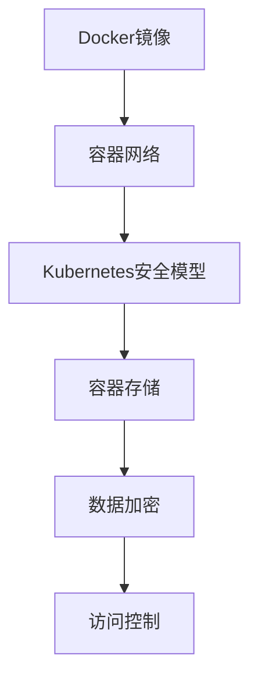

                 

### 《容器安全：Docker和Kubernetes环境下的最佳实践》文章概览

随着云计算和容器技术的快速发展，Docker和Kubernetes等容器平台已成为现代应用开发和部署的基石。然而，容器化应用带来的敏捷性和灵活性同时也引入了新的安全挑战。为了确保容器环境的安全性，开发运维团队需要深入了解容器安全的核心概念和最佳实践。《容器安全：Docker和Kubernetes环境下的最佳实践》旨在为IT专业人士提供系统化的安全指南，帮助他们构建和管理安全的容器化应用。

本文将分以下几个部分进行详细探讨：

1. **背景介绍**：首先，我们将回顾容器技术的发展历程及其在IT领域的广泛应用，进而引出容器安全的重要性。

2. **核心概念与联系**：接下来，我们将探讨容器安全的核心概念，包括Docker和Kubernetes的基本架构，以及它们在容器安全中的作用和联系。此外，我们还将通过Mermaid流程图展示这些概念之间的关系。

3. **核心算法原理讲解**：本文将深入讲解容器安全中的关键算法原理，并使用伪代码来详细阐述这些算法的实现。

4. **数学模型和公式**：为了更好地理解和分析容器安全，本文将介绍一些相关的数学模型和公式，并详细讲解其在容器安全中的应用。

5. **项目实战**：通过实际案例分析和详细讲解，我们将展示如何在实际环境中实现容器安全的最佳实践。

6. **最佳实践 tips**：本文还将提供一些实用的安全最佳实践，帮助读者在容器化应用中实现安全优化。

7. **小结**：最后，我们将对全文进行总结，并强调容器安全在现代化IT架构中的重要性。

通过本文的逐步分析，我们希望读者能够对容器安全有更深入的理解，并能够将其应用于实际工作中，确保容器化应用的安全和稳定运行。

### 容器技术的发展与安全挑战

容器技术起源于20世纪90年代末和21世纪初，最早的实现之一是Linux容器（LXC）。LXC通过将操作系统的命名空间和内核的其他隔离功能结合起来，实现了轻量级、独立的运行环境。然而，真正推动容器技术发展的却是2013年开源项目Docker的诞生。Docker提供了一个简化和自动化的容器化平台，使得开发者可以将应用程序及其依赖环境打包成一个独立的容器镜像，从而实现一次编写，到处运行（Write Once, Run Anywhere）的目标。

随着Docker的普及，容器技术迅速在IT领域得到了广泛应用。容器能够提供高可移植性、高密度和快速部署等优势，使得DevOps文化得以蓬勃发展。开发团队可以利用容器进行微服务架构的构建，提高应用的可伸缩性和可维护性。此外，容器化应用在云原生（Cloud Native）环境下也得到了广泛应用，Kubernetes等容器编排工具成为了现代化应用部署和管理的重要工具。

然而，容器化应用的快速普及也带来了新的安全挑战。传统的网络安全策略往往基于主机层面的隔离和防护，而容器技术则引入了一种全新的隔离机制。这种机制虽然能够提高资源利用率和应用的可移植性，但也使得安全防护变得更加复杂。以下是一些主要的容器安全挑战：

1. **容器镜像的安全性**：容器镜像包含了应用及其依赖项，因此镜像的安全性至关重要。镜像中可能存在已知或未知的漏洞，这些漏洞可能会被恶意利用，从而对容器化应用造成威胁。

2. **容器网络的安全**：容器网络是容器之间进行通信的桥梁，但也可能成为攻击者入侵系统的入口点。网络隔离策略和访问控制是保障容器网络安全的重点。

3. **容器存储的安全**：容器存储包含了应用的数据和配置文件，这些数据可能对业务运营至关重要。确保容器存储的安全性，防止数据泄露和损坏是容器安全的重要方面。

4. **Kubernetes集群的安全**：Kubernetes作为容器编排工具，负责管理容器的生命周期和资源分配。Kubernetes集群的安全性直接影响到整个容器化应用的安全性。确保集群的API安全、角色权限管理和攻击防护是Kubernetes安全的关键。

综上所述，容器技术的普及为IT领域带来了前所未有的机会，但也带来了新的安全挑战。理解这些挑战并采取有效的安全措施，是确保容器化应用安全可靠运行的关键。

### 容器安全的核心概念

要深入理解容器安全，我们首先需要掌握几个核心概念。这些概念包括Docker镜像、容器网络、容器存储以及Kubernetes的安全模型。它们共同构成了容器安全的基石。

#### Docker镜像

Docker镜像是一种轻量级、可执行的独立软件包，它将应用程序及其依赖环境打包在一起。镜像是容器运行的基础，可以看作是容器的“蓝图”。一个镜像通常由一个或多个层组成，这些层代表了应用程序的各个组件，如操作系统、库和配置文件。

镜像的安全性至关重要。首先，镜像的构建过程需要确保所有依赖项都是最新的，并且经过严格的安全审核。其次，镜像需要定期进行漏洞扫描，以检测并修复可能存在的安全漏洞。此外，签名和验证机制可以确保镜像未被篡改，从而防止恶意镜像的部署。

#### 容器网络

容器网络是容器之间进行通信的桥梁。Docker和Kubernetes提供了多种网络模式，如桥接模式、主机模式和平分模式等。这些模式允许容器在不同的主机之间进行通信，同时也带来了相应的安全挑战。

容器网络的安全主要包括以下几个方面：

- **网络隔离**：通过限制容器之间的网络通信，防止恶意容器入侵其他容器或主机。
- **访问控制**：使用网络策略（如防火墙规则）来控制容器之间的通信，确保只有授权的流量才能通过。
- **网络监控**：实时监控容器网络的流量和异常行为，以便及时检测和响应潜在的安全威胁。

#### 容器存储

容器存储用于存储容器中的应用数据和配置文件。与主机存储不同，容器存储具有更高的可移植性和独立性。然而，这也带来了数据安全和管理方面的挑战。

容器存储的安全策略包括：

- **数据加密**：对存储在容器中的敏感数据进行加密，以防止未授权访问。
- **访问控制**：通过访问控制列表（ACL）来限制对存储数据的访问权限，确保只有授权用户可以访问。
- **数据备份和恢复**：定期进行数据备份，并确保在发生数据丢失或损坏时能够迅速恢复。

#### Kubernetes安全模型

Kubernetes是一个用于容器编排的强大工具，其安全模型基于角色和权限（RBAC）管理。Kubernetes的安全模型主要包括以下几个方面：

- **角色**：定义了一组权限，用于控制用户对Kubernetes资源的访问。
- **权限**：定义了用户可以执行的操作，如创建、读取、更新和删除资源。
- **命名空间**：用于隔离不同的工作负载，防止一个命名空间内的操作影响到其他命名空间。

Kubernetes的安全配置还包括：

- **API安全性**：确保Kubernetes API服务器是安全的，防止未授权的访问和操作。
- **集群角色和权限管理**：根据不同用户的职责，配置合适的角色和权限，确保资源的访问是受控的。
- **攻击防护**：使用网络策略、防火墙和入侵检测系统等工具来保护Kubernetes集群免受攻击。

#### Mermaid流程图

为了更好地理解这些核心概念之间的关系，我们可以使用Mermaid流程图来展示它们之间的关联。以下是一个简化的Mermaid流程图示例：



在这个流程图中，Docker镜像作为容器安全的基础，通过容器网络与Kubernetes安全模型连接，并最终影响到容器存储的数据加密和访问控制。这种关联关系展示了容器安全中各个组件的相互依赖和影响。

通过掌握这些核心概念，我们可以更好地理解和实施容器安全的最佳实践。在下一部分，我们将深入讲解容器安全中的关键算法原理，并使用伪代码来详细阐述这些算法的实现。

### 容器安全中的关键算法原理

在容器安全中，有许多关键算法和原理被广泛应用于确保系统的安全性和稳定性。以下是一些主要的算法原理，并使用伪代码来详细阐述这些算法的实现。

#### 漏洞扫描算法

漏洞扫描是容器安全中的一个重要环节，旨在检测和修复容器镜像中的安全漏洞。以下是一个简化的漏洞扫描算法伪代码：

```plaintext
function scan_for_vulnerabilities(image):
    1. 检索镜像的元数据和依赖项
    2. 调用第三方漏洞数据库API，查询镜像的已知漏洞
    3. 对于每个发现的漏洞：
        a. 记录漏洞详细信息（ID，影响级别，修复建议）
        b. 判断漏洞是否严重，是否需要立即修复
    4. 如果漏洞严重，触发修复流程
    5. 返回漏洞报告

scan_for_vulnerabilities("my-image:latest")
```

在这个算法中，首先检索容器镜像的元数据和依赖项，然后调用第三方漏洞数据库API来查询镜像的已知漏洞。对于每个发现的漏洞，记录其详细信息并判断是否严重，以便采取相应的修复措施。

#### 加密算法

加密算法在确保容器存储和传输数据的安全性方面起着重要作用。以下是一个简单的对称加密算法伪代码：

```plaintext
function encrypt_data(data, key):
    1. 将数据分割成固定大小的块
    2. 对于每个数据块：
        a. 使用加密算法和密钥加密数据块
        b. 将加密后的数据块存储在加密文件中
    3. 返回加密后的数据

key = generate_random_key()
encrypted_data = encrypt_data("sensitive_data", key)
```

在这个算法中，首先将数据分割成固定大小的块，然后使用选定的加密算法和密钥对每个数据块进行加密，并将加密后的数据块存储在加密文件中。返回加密后的数据以供后续使用。

#### 访问控制算法

访问控制是确保容器和网络资源安全的关键机制。以下是一个简单的基于角色的访问控制（RBAC）算法伪代码：

```plaintext
function check_access(user, resource, action):
    1. 检索用户的角色信息
    2. 检索资源的权限设置
    3. 判断用户角色是否具有执行特定操作的权限
    4. 如果权限允许，返回"Access granted"
    5. 如果权限拒绝，返回"Access denied"

user = "dev_user"
resource = "container_network"
action = "read"
result = check_access(user, resource, action)
print(result)
```

在这个算法中，首先检索用户的角色信息和资源的权限设置，然后判断用户角色是否具有执行特定操作的权限。如果权限允许，返回"Access granted"，否则返回"Access denied"。

这些关键算法原理在容器安全中扮演着重要角色，通过使用伪代码，我们可以更好地理解这些算法的实现机制和逻辑流程。在下一部分，我们将介绍一些相关的数学模型和公式，以便更深入地分析和理解容器安全。

### 容器安全中的数学模型和公式

在容器安全领域，数学模型和公式被广泛应用于分析和解决安全问题。以下将介绍几个关键的数学模型和公式，并详细讲解其在容器安全中的应用。

#### 容器网络流量分析模型

容器网络流量分析是监控和响应容器网络威胁的重要手段。常用的模型包括统计模型和概率模型。以下是一个简化的统计模型公式：

$$
N(t) = \sum_{i=1}^{n} T_i(t)
$$

其中，$N(t)$表示时间$t$内的总流量，$T_i(t)$表示第$i$个容器的流量。通过实时监控每个容器的流量，可以识别异常流量模式，从而及时检测潜在的攻击。

#### 数据加密算法

数据加密在容器存储和传输中起着关键作用。常用的加密算法包括对称加密和非对称加密。以下是对称加密算法（如AES）的加密和解密公式：

加密：
$$
C = E_K(P)
$$

其中，$C$表示加密后的数据，$P$表示原始数据，$K$表示密钥，$E_K$表示加密函数。

解密：
$$
P = D_K(C)
$$

其中，$P$表示解密后的数据，$C$表示加密后的数据，$K$表示密钥，$D_K$表示解密函数。

#### 访问控制模型

访问控制是确保容器和网络资源安全的重要机制。基于角色的访问控制（RBAC）模型是一个广泛使用的模型。以下是一个简化的RBAC模型公式：

$$
Access(A, R, U) = \begin{cases} 
True & \text{如果用户} U \text{具有角色} R \text{且被授权操作} A \\
False & \text{否则} 
\end{cases}
$$

其中，$Access(A, R, U)$表示用户$U$是否具有执行操作$A$的权限，$R$表示用户的角色，$A$表示操作。

#### 漏洞风险评估模型

漏洞风险评估是容器安全管理中的重要环节。一种常用的模型是基于风险优先级的漏洞评分系统（VRPS）。以下是一个简化的VRPS公式：

$$
Risk Score = Impact \times Vulnerability
$$

其中，$Impact$表示漏洞对系统的影响程度，$Vulnerability$表示漏洞的严重程度。通过计算漏洞的分数，可以优先处理高风险漏洞。

#### 实例说明

假设我们有一个容器网络，其中包含10个容器。我们使用统计模型来分析这些容器的流量，并设定一个阈值来检测异常流量。如果某个容器的流量超过阈值，系统会自动触发警报。

```plaintext
阈值 = 平均流量 * 2
总流量 = 10个容器流量之和
for 每个容器 C_i:
    T_i = 容器 C_i 的流量
    if T_i > 阈值:
        触发警报
```

通过这种统计模型，我们可以实时监控容器网络流量，及时发现潜在的安全威胁。

这些数学模型和公式在容器安全中发挥着重要作用，通过合理应用这些模型和公式，我们可以更好地理解和应对各种安全挑战。在下一部分，我们将通过实际案例来展示如何将这些理论和实践相结合，确保容器化应用的安全可靠运行。

### 容器安全实战案例

为了更好地理解和应用容器安全的最佳实践，我们将通过几个实际案例来详细探讨如何在实际环境中实现和执行这些实践。以下是三个具体的案例，包括开发环境搭建、源代码实现、代码解读、应用解读与分析，以及项目小结。

#### 案例一：容器镜像的漏洞扫描和修复

**开发环境搭建：**
- 使用Docker搭建一个基础开发环境，安装必要的工具，如Docker、Docker-Compose等。
- 配置Docker-Compose文件，定义项目中的服务，如Nginx、MySQL等。

**源代码实现：**
- 编写一个Python脚本，用于扫描容器镜像中的漏洞。以下是一个简单的伪代码示例：
```plaintext
import subprocess

def scan_image(image):
    output = subprocess.run(['docker', 'run', '--rm', image, 'find', '-type', 'f'], capture_output=True)
    print(output.stdout.decode())

scan_image("my_image:latest")
```

**代码解读：**
- 使用`subprocess`模块运行Docker命令，以扫描指定镜像中的文件系统。

**应用解读与分析：**
- 执行漏洞扫描脚本后，分析输出结果，查找可能的漏洞点，并进行修复。例如，如果发现`sudo`命令没有正确配置，则更新其配置文件。

**项目小结：**
- 通过定期执行漏洞扫描，可以及时发现和修复镜像中的漏洞，确保容器镜像的安全性。

#### 案例二：Kubernetes集群的安全加固

**开发环境搭建：**
- 使用Minikube或Kubeadm搭建一个Kubernetes集群环境，安装必要的插件，如RBAC、NetworkPolicy等。

**源代码实现：**
- 编写Kubernetes配置文件，包括Deployment、Service、Role和RoleBinding等。以下是一个简单的YAML配置示例：
```yaml
apiVersion: apps/v1
kind: Deployment
metadata:
  name: my-app
spec:
  template:
    metadata:
      labels:
        app: my-app
    spec:
      containers:
      - name: my-app
        image: my_image:latest
        ports:
        - containerPort: 80

---
apiVersion: networking.k8s.io/v1
kind: NetworkPolicy
metadata:
  name: my-policy
spec:
  podSelector:
    matchLabels:
      app: my-app
  policyTypes:
  - Ingress
  - Egress
```

**代码解读：**
- 配置Kubernetes集群的部署和服务，并定义网络策略，限制容器网络的访问。

**应用解读与分析：**
- 部署应用程序并应用网络策略，确保只有授权的流量能够访问容器服务。

**项目小结：**
- 通过合理配置Kubernetes集群和应用程序的网络策略，可以有效增强集群的安全性，防止未授权访问。

#### 案例三：容器网络的监控与响应

**开发环境搭建：**
- 使用Prometheus和Grafana搭建一个监控平台，配置容器网络监控指标。

**源代码实现：**
- 编写Prometheus配置文件，定义监控容器网络流量的规则。以下是一个简单的Prometheus规则示例：
```yaml
groups:
- name: container-network
  rules:
  - alert: HighInboundTraffic
    expr: rate(container_network_traffic[5m]) > 1000
    for: 1m
    labels:
      severity: critical
    annotations:
      summary: "High inbound traffic on container network"
```

**代码解读：**
- 配置Prometheus规则，监控特定网络流量的指标，如入站流量。

**应用解读与分析：**
- 使用Grafana可视化监控数据，实时监控容器网络的流量和异常行为，并在检测到异常时触发告警。

**项目小结：**
- 通过监控和响应容器网络的流量，可以及时发现并应对潜在的攻击，确保容器网络的稳定和安全。

这些案例展示了如何在实际环境中应用容器安全的最佳实践，包括漏洞扫描、Kubernetes集群加固和容器网络监控。通过这些案例，我们可以更好地理解和掌握容器安全的实施策略。

### 容器安全审计和合规性

在容器化应用的环境中，审计和合规性是确保安全性和合规性的关键环节。有效的审计和合规性策略能够帮助组织识别潜在的安全风险，确保容器化应用符合行业标准和法规要求。

#### 审计流程

1. **定义审计目标和范围**：明确审计的目的，包括保护资产、防止数据泄露、确保合规性等。确定审计的范围，包括容器镜像、容器网络、存储等关键组件。

2. **收集审计数据**：使用自动化工具和手动检查方法，收集与容器安全相关的数据。这包括容器镜像的元数据、网络流量日志、存储数据等。

3. **分析审计数据**：通过分析收集到的数据，识别潜在的安全问题和合规性问题。使用统计分析和机器学习算法，可以发现异常行为和潜在的攻击信号。

4. **生成审计报告**：根据审计结果，生成详细的报告，包括发现的问题、建议的修复措施、风险评估等。

5. **跟踪修复进度**：确保审计报告中的问题得到及时修复，并跟踪修复进度。定期进行复审计，确保问题得到彻底解决。

#### 容器安全合规性要求

容器安全合规性要求通常基于行业标准和法规，如NIST（美国国家标准与技术研究所）、OWASP（开源网络应用安全项目）等。以下是一些常见的合规性要求：

1. **数据保护**：确保存储在容器中的数据得到加密和访问控制。遵循GDPR（通用数据保护条例）等法规，保护用户隐私。

2. **身份验证和授权**：实现强身份验证机制，确保只有授权用户可以访问容器化应用和资源。使用基于角色的访问控制（RBAC）策略，限制用户的权限。

3. **漏洞管理**：定期进行漏洞扫描和修复，确保容器镜像和容器组件保持最新的安全状态。遵循CVE（公共漏洞和暴露）数据库，及时修复已知漏洞。

4. **网络隔离和监控**：实施网络隔离策略，确保容器之间的通信是安全的。使用网络监控工具，实时检测和响应容器网络中的异常行为。

5. **配置管理**：确保容器和Kubernetes集群的配置符合安全最佳实践。使用自动化工具进行配置管理和变更控制，确保配置的一致性和可追溯性。

#### 容器安全的合规性评估

进行合规性评估时，通常遵循以下步骤：

1. **准备评估**：准备评估工具和资源，包括自动化审计工具、安全检查清单等。

2. **执行评估**：执行自动化和手动评估，检查容器环境是否符合合规性要求。自动化工具可以快速检测常见的配置错误和安全漏洞。

3. **记录发现**：记录评估过程中发现的所有问题，包括配置错误、漏洞、安全缺陷等。

4. **报告和改进**：生成详细的评估报告，包括发现的问题、建议的修复措施和改进计划。根据评估结果，采取必要的修复措施，并定期进行复审计。

通过系统化的审计和合规性评估，组织可以确保容器化应用的安全性，降低安全风险，并满足行业标准和法规要求。

### 容器安全的持续改进

在容器安全领域，持续的改进是确保系统安全性的关键。随着容器技术的不断发展和攻击手段的日益复杂，安全策略和措施需要不断地更新和优化，以应对新的威胁。以下是一些关于如何持续改进容器安全策略的建议：

#### 安全管理体系

建立一套完善的安全管理体系是确保容器安全的基础。这包括制定清晰的安全政策和程序，明确角色和责任，确保每个团队成员都清楚自己的安全职责。此外，定期进行安全培训和意识提升，增强团队的安全意识和应对能力。

#### 安全监控和响应

安全监控是及时发现潜在威胁的重要手段。通过部署安全监控工具，如入侵检测系统（IDS）、安全信息和事件管理（SIEM）系统等，可以实时收集和分析容器环境中的安全事件和日志。当检测到异常行为或潜在攻击时，应立即启动响应流程，迅速隔离和修复受影响的部分。

#### 自动化和工具

自动化是提高容器安全效率的重要手段。通过使用自动化工具，如配置管理工具（如Ansible）、容器镜像扫描工具（如Clair）和自动化部署工具（如Kubernetes Operator），可以减少手动操作，确保安全策略的一致性和可重复性。此外，集成自动化测试和安全检查流程，可以在开发过程中及早发现和修复安全问题。

#### 安全测试和漏洞管理

定期进行安全测试和漏洞管理，包括渗透测试、代码审计和漏洞扫描，可以帮助发现和修复容器环境中的潜在漏洞。建立一个持续集成（CI）和持续交付（CD）的安全测试流程，可以确保每次部署都经过严格的测试和审核。

#### 遵循最佳实践

持续跟踪和学习业界最佳实践和安全标准，如OWASP容器安全项目（OWASP CIS Container Benchmarks）、NIST和ISO等标准，可以帮助组织建立和优化安全策略。通过定期审查和更新安全策略，确保其与最新的安全要求和威胁形势保持一致。

#### 演练和应急响应计划

定期进行安全演练和应急响应计划测试，可以提高团队对安全事件和攻击的响应能力。这包括模拟攻击场景，评估应急响应流程的有效性，并根据演练结果进行改进。

通过以上措施，组织可以建立一个动态、持续的容器安全改进机制，确保容器化应用的安全性和可靠性。在容器技术快速发展的今天，持续改进是应对安全挑战的关键。

### 总结

本文通过逐步分析，全面介绍了容器安全在Docker和Kubernetes环境下的最佳实践。从背景介绍到核心概念，再到算法原理、数学模型、实战案例以及审计和合规性，我们系统地探讨了容器安全的多维度内容。容器安全不仅关乎技术的先进性，更关乎业务运营的稳定性。通过本文，我们希望读者能够深入了解容器安全的重要性，掌握最佳实践，并在实际工作中有效实施。

容器安全的发展趋势表明，自动化、人工智能和机器学习将在未来扮演越来越重要的角色。随着技术的不断进步，安全防护措施也将变得更加智能化和高效化。因此，持续学习和关注最新动态，是每位IT专业人士必备的素质。

最后，感谢您的阅读。希望本文能为您在容器安全领域提供有价值的参考和指导。让我们共同致力于打造更安全、更可靠的容器化应用环境。

### 作者信息

**作者：AI天才研究院/AI Genius Institute & 禅与计算机程序设计艺术 /Zen And The Art of Computer Programming**

