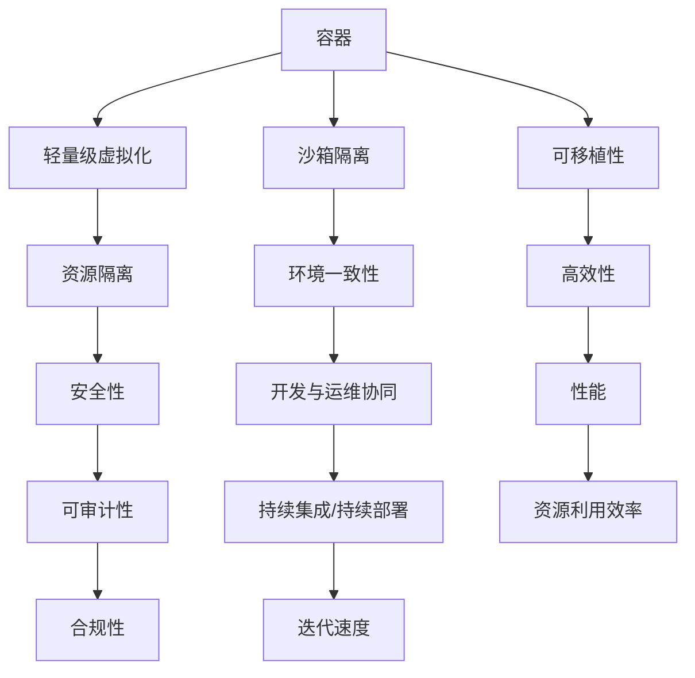
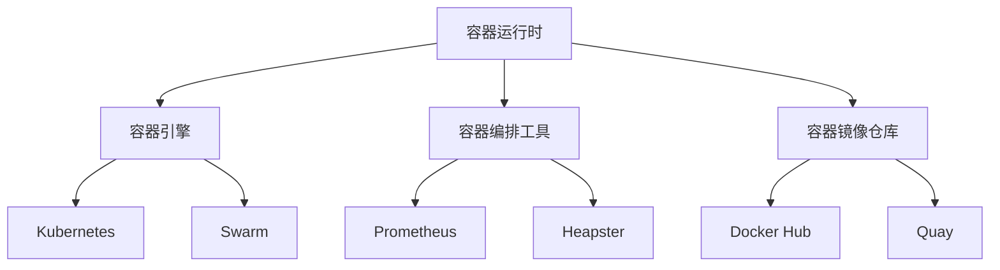
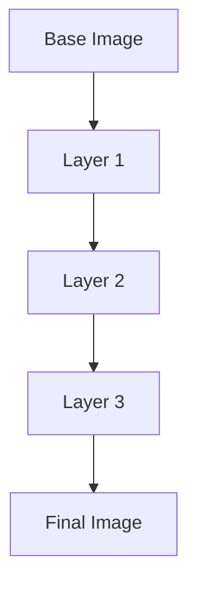
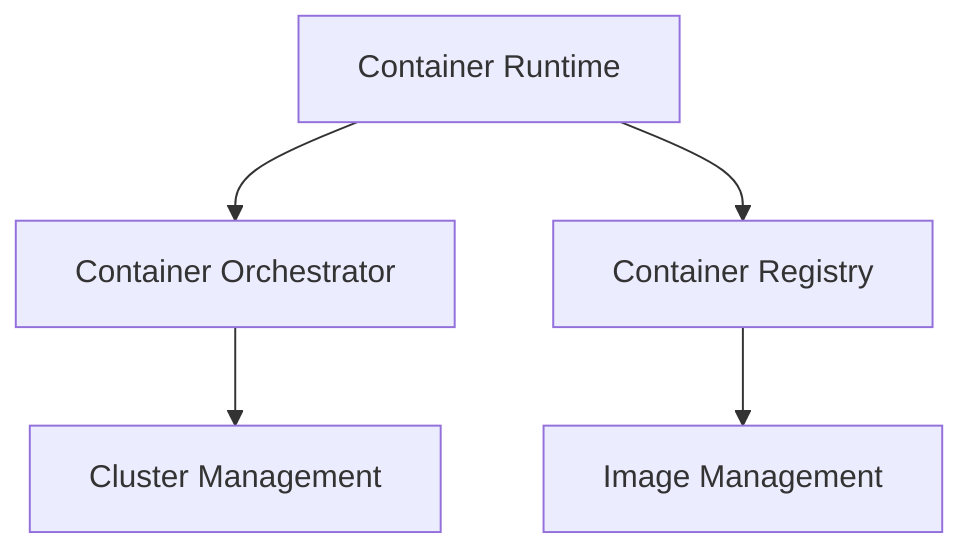
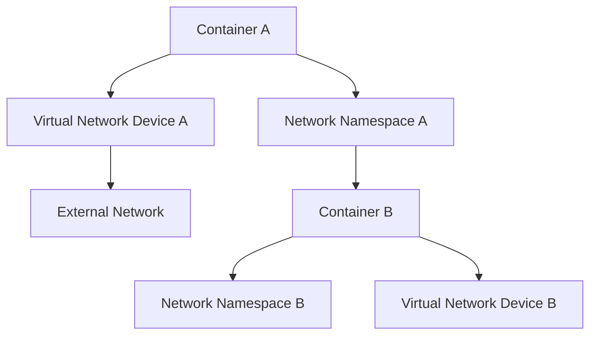

                 


### 容器安全：保护容器化环境的策略

---

#### 关键词：容器安全、容器技术、容器编排、Kubernetes、容器镜像、网络安全、应用安全

---

#### 摘要：

本文旨在深入探讨容器安全，解析容器化环境面临的安全挑战、核心概念及解决方案。通过逐步分析，我们将了解容器技术的基础、安全策略、网络安全措施以及应用安全措施，并总结出最佳实践和未来发展趋势。本文旨在为IT专业人士提供一套完整的容器安全策略框架，以保护容器化环境免受潜在威胁。

---

### 目录大纲

# 容器安全：保护容器化环境的策略

## 第一部分：容器技术概述

### 1.1 容器技术基本概念

#### 1.1.1 容器与虚拟机的区别

#### 1.1.2 容器生态体系

#### 1.1.3 容器技术发展历程

### 2. 容器编排与管理

#### 2.1 容器编排工具简介

#### 2.2 Kubernetes简介

#### 2.3 容器网络与存储

### 3. 容器镜像与基础架构

#### 3.1 容器镜像原理

#### 3.2 Dockerfile编写与优化

#### 3.3 容器基础架构

## 第二部分：容器安全核心概念

### 4. 容器安全挑战与威胁

#### 4.1 容器安全面临的挑战

#### 4.2 容器常见的安全威胁

### 5. 容器安全策略

#### 5.1 容器安全原则

#### 5.2 容器安全最佳实践

#### 5.3 容器安全框架

## 第三部分：容器安全解决方案

### 6. 容器镜像扫描与检测

#### 6.1 镜像扫描工具介绍

#### 6.2 镜像扫描流程

#### 6.3 镜像扫描结果分析与处理

### 7. 容器网络安全

#### 7.1 容器网络原理

#### 7.2 容器网络隔离与保护

#### 7.3 容器入侵检测与防御

### 8. 容器应用安全

#### 8.1 容器应用安全最佳实践

#### 8.2 容器内应用安全策略

#### 8.3 容器应用安全实战案例

## 第四部分：容器安全实施与运维

### 9. 容器安全实施

#### 9.1 容器安全评估

#### 9.2 容器安全部署

#### 9.3 容器安全监控

### 10. 容器安全运维

#### 10.1 容器安全运维策略

#### 10.2 容器安全运维工具

#### 10.3 容器安全运维案例

## 第五部分：容器安全趋势与展望

### 11. 容器安全发展趋势

#### 11.1 新兴容器安全技术

#### 11.2 容器安全产业生态

#### 11.3 容器安全未来展望

## 附录

### A. 容器安全工具与资源汇总

#### A.1 容器安全工具列表

#### A.2 容器安全资源推荐

---

### 容器技术概述

#### 1.1 容器技术基本概念

容器是一种轻量级的虚拟化技术，它允许在同一操作系统上同时运行多个隔离的环境。与传统的虚拟机相比，容器不需要额外的操作系统来运行，从而大大减少了资源消耗和启动时间。

**核心概念与联系：**



容器通过cgroup和命名空间实现资源隔离和环境一致性，同时保证了高效性和性能。安全性和可审计性是容器安全性的关键因素，而开发与运维的协同和持续集成/持续部署是容器技术优势的重要体现。

#### 1.2 容器生态体系

容器技术不仅仅是一种技术，更是一个庞大的生态系统。这个生态系统包括容器运行时、容器编排工具、容器镜像仓库、容器网络存储等多个组成部分。

**容器生态体系架构：**



容器引擎（如Docker）负责容器的创建、启动和管理，而容器编排工具（如Kubernetes）负责容器的自动化部署、伸缩和管理。容器镜像仓库（如Docker Hub）用于存储和管理容器镜像，而容器网络和存储则提供了容器运行所需的网络和存储资源。

#### 1.3 容器技术发展历程

容器技术的发展历程可以分为几个重要阶段：

1. **初始阶段**：2000年代初，Linux容器（LXC）等早期容器技术开始出现。
2. **发展初期**：2013年，Docker项目的兴起标志着容器技术的商业化。
3. **快速成长期**：2015年，Kubernetes项目成立，推动了容器编排技术的发展。
4. **成熟期**：如今，容器技术已成为企业应用程序开发、部署和运维的标准实践。

容器技术的发展历程展示了其在软件开发和运维领域的广泛应用，以及不断演进和完善的技术生态。

---

### 容器编排与管理

#### 2.1 容器编排工具简介

容器编排工具是管理容器化应用程序的核心组件。这些工具负责容器的自动化部署、扩展、更新和监控。目前，市场上主要的容器编排工具包括Kubernetes、Docker Swarm和OpenShift。

**容器编排工具对比：**

| 特性 | Kubernetes | Docker Swarm | OpenShift |
| --- | --- | --- | --- |
| 可扩展性 | 高 | 中 | 高 |
| 跨平台支持 | 好 | 一般 | 好 |
| 社区支持 | 强 | 强 | 强 |
| 学习曲线 | 中 | 低 | 中 |

Kubernetes因其强大的可扩展性和社区支持成为最流行的容器编排工具。Docker Swarm则因其简单性和易用性受到中小企业青睐。OpenShift则提供了更多与开发流程集成的功能。

#### 2.2 Kubernetes简介

Kubernetes是一个开源的容器编排平台，由Google设计并捐赠给云原生计算基金会（CNCF）。它提供了一种自动化部署、扩展和管理容器化应用程序的方法。

**Kubernetes核心组件：**

- **Master节点**：负责集群的协调和控制。
  - **API服务器**：集群的入口点，所有集群操作的接口。
  - **控制器管理器**：负责维护集群的状态。
  - **调度器**：负责将容器调度到合适的节点上。

- **Worker节点**：运行容器和执行工作负载。

**Kubernetes工作原理：**

1. **用户通过Kubernetes API提交资源定义**。
2. **API服务器接收请求并存储资源定义**。
3. **控制器管理器监视API服务器中的资源状态**。
4. **调度器根据资源定义选择合适的节点来部署容器**。
5. **容器在节点上启动并运行**。

#### 2.3 容器网络与存储

容器网络和存储是容器编排的重要组成部分。它们提供了容器之间通信和持久化存储的能力。

**容器网络：**

- **Flannel**：用于在集群中分配和管理子网。
- **Calico**：基于BGP的路由协议。
- **Weave Net**：简单的覆盖网络解决方案。

**容器存储：**

- **Docker Volume**：本地存储解决方案。
- **Portworx**：提供持久化存储和容器数据管理。
- **NFS**：网络文件系统。

容器网络和存储的选择取决于应用程序的需求和集群环境。

---

### 容器镜像与基础架构

#### 3.1 容器镜像原理

容器镜像是一种轻量级、可执行的独立软件包，它包含了运行应用程序所需的所有组件，如代码、运行库、环境变量等。容器镜像是通过Dockerfile构建的。

**Dockerfile构建过程：**

1. **FROM指令**：指定基础镜像。
2. **RUN指令**：运行命令以安装依赖和构建应用程序。
3. **CMD指令**：指定容器启动时要运行的命令。

**容器镜像分层原理：**

容器镜像是由一系列的层组成的，每层代表了一次文件系统的修改。这种设计提高了镜像的共享性和效率。



#### 3.2 Dockerfile编写与优化

编写高效的Dockerfile是容器化应用程序的关键。以下是一些优化Dockerfile的建议：

1. **最小化镜像大小**：使用轻量级基础镜像，删除无用文件。
2. **减少层**：合并多个命令到一个层中。
3. **使用缓存**：利用Docker的缓存机制，减少构建时间。
4. **环境变量**：使用环境变量来管理配置，提高可维护性。

#### 3.3 容器基础架构

容器基础架构包括容器运行时（如Docker）、容器编排工具（如Kubernetes）和容器镜像仓库（如Docker Hub）。这些组件协同工作，提供了容器化应用程序的完整生命周期管理。

**容器基础架构架构：**



容器运行时负责容器的创建和管理，容器编排工具负责容器的自动化部署和资源管理，容器镜像仓库负责镜像的存储和分发。

---

### 容器安全挑战与威胁

随着容器技术的广泛应用，容器化环境面临的安全挑战和威胁也日益增多。了解这些挑战和威胁是构建安全容器化环境的第一步。

#### 4.1 容器安全面临的挑战

**1. 镜像供应链攻击**：恶意镜像可能在镜像仓库中传播，从而影响整个容器化环境。

**2. 容器逃逸**：攻击者通过利用容器漏洞，突破容器的隔离机制，获取宿主机的权限。

**3. 配置错误**：容器配置错误可能导致安全漏洞，例如不正确的网络配置或权限设置。

**4. 容器编排工具漏洞**：容器编排工具（如Kubernetes）的漏洞可能导致整个集群的安全问题。

**5. 无状态服务安全问题**：容器化环境中的无状态服务可能受到分布式拒绝服务（DDoS）攻击的威胁。

#### 4.2 容器常见的安全威胁

**1. 恶意容器**：攻击者可能在容器中部署恶意软件，窃取数据或进行其他恶意行为。

**2. 镜像漏洞**：容器镜像中可能存在已知或未知的漏洞，这些漏洞可能导致容器化应用程序的安全风险。

**3. 不安全的网络通信**：容器之间的通信可能不加密，从而暴露敏感数据。

**4. 容器编排漏洞**：容器编排工具的配置错误或漏洞可能导致容器化的应用程序暴露在攻击之下。

**5. 无状态服务漏洞**：无状态服务的容器可能受到DDoS攻击，导致服务不可用。

---

### 容器安全策略

为了保护容器化环境，制定一套全面的容器安全策略至关重要。以下是一些核心原则和最佳实践。

#### 5.1 容器安全原则

**1. 隔离性**：确保容器具有良好的隔离性，防止容器逃逸。

**2. 最小权限**：容器应具有最小权限，仅授予必要的访问权限。

**3. 透明性**：容器安全策略应具有透明性，便于审计和监控。

**4. 自动化**：利用自动化工具来管理容器安全，提高效率和可重复性。

**5. 敏感性数据保护**：确保敏感数据得到妥善保护，例如使用加密存储和传输。

#### 5.2 容器安全最佳实践

**1. 使用官方镜像**：从官方镜像仓库获取镜像，避免使用未经认证的镜像。

**2. 构建最小化镜像**：删除无用文件和依赖，构建最小化镜像，减少攻击面。

**3. 定期更新镜像**：定期更新容器镜像，修复已知漏洞。

**4. 容器配置审计**：使用自动化工具对容器配置进行审计，确保配置符合安全要求。

**5. 网络隔离**：使用网络隔离技术，例如容器编排工具提供的网络命名空间，减少容器之间的通信。

**6. 使用安全配置**：使用安全的操作系统和应用程序配置，减少安全漏洞。

**7. 容器安全扫描**：定期使用容器安全扫描工具，检测和修复镜像和容器中的漏洞。

**8. 日志和监控**：启用容器日志和监控，及时发现和响应安全事件。

#### 5.3 容器安全框架

容器安全框架是一个系统化的方法，用于识别、评估和缓解容器化环境中的安全风险。以下是一个简单的容器安全框架：

1. **风险评估**：识别容器化环境中的潜在风险，评估其影响和可能性。
2. **安全需求**：根据风险评估结果，确定安全需求和目标。
3. **安全策略**：制定容器安全策略，包括安全原则、最佳实践和合规性要求。
4. **实施和部署**：将安全策略转化为具体的配置和操作，部署到容器化环境中。
5. **监控和审计**：持续监控容器化环境的安全状态，进行定期的安全审计。
6. **响应和改进**：根据监控和审计结果，及时响应安全事件，持续改进安全策略。

---

### 容器镜像扫描与检测

容器镜像扫描与检测是容器安全的重要组成部分。通过扫描镜像，可以发现和修复潜在的安全漏洞，确保容器镜像的安全性和可靠性。

#### 6.1 镜像扫描工具介绍

目前市场上存在多种容器镜像扫描工具，例如：

- **Clair**：一个开源的容器镜像漏洞扫描工具，提供基于签名的漏洞数据库。
- **Docker Bench for Security**：一个开源的工具，用于评估Docker容器的安全性。
- **Trivy**：一个开源的容器镜像漏洞扫描工具，支持多种平台。
- **Kube-bench**：一个开源的工具，用于评估Kubernetes集群的安全性。

这些工具提供了不同的功能，可以根据具体需求选择合适的工具。

#### 6.2 镜像扫描流程

镜像扫描的流程通常包括以下步骤：

1. **获取镜像**：从容器镜像仓库下载要扫描的镜像。
2. **解析镜像**：解析镜像的元数据，确定镜像的层次结构。
3. **扫描漏洞**：使用漏洞数据库扫描镜像中的漏洞，包括操作系统、应用程序和依赖库。
4. **生成报告**：生成详细的漏洞报告，包括漏洞的严重性、影响范围和修复建议。
5. **处理结果**：根据扫描结果，修复漏洞或调整容器配置，提高镜像的安全性。

#### 6.3 镜像扫描结果分析与处理

镜像扫描结果的分析和处理是确保容器安全的重要环节。以下是一些处理建议：

1. **分类漏洞**：根据漏洞的严重性和影响范围，将漏洞分为高、中、低三个等级。
2. **制定修复计划**：根据漏洞的等级和修复难度，制定优先级和修复计划。
3. **自动修复**：对于一些低严重性的漏洞，可以使用自动化工具进行修复，减少手动干预。
4. **人工修复**：对于一些高严重性的漏洞，需要人工干预，仔细评估风险和修复方案。
5. **审计和验证**：在修复漏洞后，进行审计和验证，确保修复方案的有效性和安全性。
6. **持续监控**：定期进行镜像扫描，及时发现和修复新出现的漏洞。

---

### 容器网络安全

容器网络安全是保护容器化环境的重要环节。通过实施有效的网络安全措施，可以防止攻击者利用容器漏洞入侵容器化环境。

#### 7.1 容器网络原理

容器网络是容器之间进行通信的基础设施。容器网络通常基于以下原理：

1. **网络命名空间**：容器通过网络命名空间实现网络隔离，每个容器都有自己的网络命名空间，从而保证了容器之间的网络独立性。
2. **虚拟网络设备**：容器通过虚拟网络设备（如虚拟网卡）与外部网络进行通信。
3. **网络接口**：容器网络接口负责容器与外部网络的连接。

**容器网络架构**：



#### 7.2 容器网络隔离与保护

容器网络隔离与保护是确保容器安全的重要措施。以下是一些网络隔离与保护的方法：

1. **网络命名空间**：使用网络命名空间实现容器之间的网络隔离，防止容器之间的恶意通信。
2. **容器编排工具的网络策略**：容器编排工具（如Kubernetes）提供网络策略，可以控制容器之间的通信。
3. **网络流量监控**：使用网络流量监控工具，实时监控容器网络流量，及时发现和响应异常流量。
4. **防火墙**：使用防火墙规则，限制容器之间的通信，防止未经授权的访问。
5. **加密通信**：使用加密技术，确保容器之间的通信安全，防止数据泄露。

#### 7.3 容器入侵检测与防御

容器入侵检测与防御是保护容器化环境的关键措施。以下是一些入侵检测与防御的方法：

1. **入侵检测系统（IDS）**：部署入侵检测系统，实时监控容器网络和主机安全，及时发现入侵行为。
2. **防火墙**：使用防火墙规则，限制未经授权的访问，防止恶意流量进入容器化环境。
3. **容器监控**：使用容器监控工具，实时监控容器状态和性能，及时发现异常行为。
4. **安全加固**：对容器操作系统和应用程序进行安全加固，减少潜在的安全漏洞。
5. **安全响应**：制定安全响应计划，及时响应和处理入侵事件，减少损失。

---

### 容器应用安全

容器应用安全是保护容器化应用程序的关键环节。通过实施有效的应用安全策略，可以确保容器化应用程序的安全性和可靠性。

#### 8.1 容器应用安全最佳实践

以下是一些容器应用安全的最佳实践：

1. **使用官方镜像**：从官方镜像仓库获取镜像，避免使用未经认证的镜像。
2. **构建最小化镜像**：删除无用文件和依赖，构建最小化镜像，减少攻击面。
3. **定期更新镜像**：定期更新容器镜像，修复已知漏洞。
4. **容器配置审计**：使用自动化工具对容器配置进行审计，确保配置符合安全要求。
5. **使用安全配置**：使用安全的操作系统和应用程序配置，减少安全漏洞。
6. **容器安全扫描**：定期使用容器安全扫描工具，检测和修复镜像和容器中的漏洞。
7. **日志和监控**：启用容器日志和监控，及时发现和响应安全事件。

#### 8.2 容器内应用安全策略

容器内应用安全策略包括以下方面：

1. **代码安全**：实施代码安全措施，如代码审计、静态代码分析，确保代码没有安全漏洞。
2. **依赖管理**：管理应用程序的依赖库，确保依赖库的安全性和可靠性。
3. **配置管理**：管理应用程序的配置文件，确保配置文件的安全和合规性。
4. **身份验证和授权**：实施身份验证和授权机制，确保只有授权用户可以访问应用程序。
5. **数据加密**：对敏感数据进行加密，确保数据在传输和存储过程中的安全性。

#### 8.3 容器应用安全实战案例

以下是一个容器应用安全的实战案例：

**案例背景**：一个企业级Web应用程序使用容器化技术部署在Kubernetes集群中。

**安全措施**：

1. **使用官方镜像**：从Docker Hub获取应用程序的官方镜像。
2. **构建最小化镜像**：删除无用的文件和依赖库，优化镜像大小。
3. **容器配置审计**：使用自动化工具对容器配置进行审计，确保配置符合安全要求。
4. **日志和监控**：启用容器日志和监控，实时监控容器状态和性能。
5. **容器安全扫描**：使用Trivy对容器镜像和运行中的容器进行安全扫描，发现并修复漏洞。
6. **网络隔离**：使用Kubernetes网络策略，限制容器之间的通信，防止未经授权的访问。

**效果**：通过实施上述安全措施，容器化应用程序的安全性得到了显著提高，减少了安全风险和漏洞暴露。

---

### 容器安全实施与运维

容器安全的实施与运维是确保容器化环境长期安全的关键。以下是一些实施和运维策略。

#### 9.1 容器安全评估

容器安全评估是确保容器化环境安全的第一步。以下是一些评估方法：

1. **漏洞扫描**：使用漏洞扫描工具对容器镜像和运行中的容器进行扫描，识别潜在的安全漏洞。
2. **配置审计**：使用自动化工具对容器配置进行审计，确保配置符合安全要求。
3. **合规性检查**：检查容器化环境是否符合行业标准和法规要求。
4. **安全测试**：进行渗透测试和漏洞测试，模拟攻击者的攻击行为，评估容器化环境的防御能力。

#### 9.2 容器安全部署

容器安全部署包括以下步骤：

1. **基础架构准备**：确保容器运行时和容器编排工具的版本和配置符合安全要求。
2. **安全配置**：配置容器网络、容器编排工具和容器镜像仓库的安全参数。
3. **镜像扫描**：使用容器镜像扫描工具，对容器镜像进行安全扫描，修复漏洞。
4. **部署策略**：制定部署策略，确保容器化应用程序的安全性和可靠性。

#### 9.3 容器安全监控

容器安全监控是确保容器化环境长期安全的关键。以下是一些监控方法：

1. **日志收集**：收集容器日志，实时监控容器状态和性能。
2. **异常检测**：使用异常检测工具，实时发现和响应异常行为。
3. **漏洞管理**：定期扫描容器镜像和运行中的容器，识别和修复漏洞。
4. **合规性检查**：定期检查容器化环境是否符合行业标准和法规要求。

---

### 容器安全运维

容器安全运维是确保容器化环境长期安全的关键。以下是一些运维策略和工具。

#### 10.1 容器安全运维策略

容器安全运维策略包括以下方面：

1. **定期评估**：定期评估容器化环境的安全性，发现和修复安全漏洞。
2. **日志审计**：收集和审计容器日志，确保容器化环境的操作合规。
3. **应急响应**：制定应急响应计划，快速响应和处理安全事件。
4. **安全培训**：定期进行安全培训，提高运维人员的安全意识。

#### 10.2 容器安全运维工具

以下是一些常用的容器安全运维工具：

1. **Kubernetes运维工具**：如Kubectl、kubectl-kubeconfig等，用于管理和监控Kubernetes集群。
2. **容器镜像仓库工具**：如Docker Hub、Quay等，用于管理和分发容器镜像。
3. **漏洞扫描工具**：如Trivy、Clair等，用于扫描容器镜像和运行中的容器，识别潜在的安全漏洞。
4. **日志管理工具**：如ELK（Elasticsearch、Logstash、Kibana）等，用于收集、存储和分析容器日志。

#### 10.3 容器安全运维案例

以下是一个容器安全运维的案例：

**案例背景**：一个企业级Web应用程序使用容器化技术部署在Kubernetes集群中。

**运维措施**：

1. **定期评估**：每周进行一次安全评估，扫描容器镜像和运行中的容器，识别潜在的安全漏洞。
2. **日志审计**：每天收集和审计容器日志，确保容器化环境的操作合规。
3. **应急响应**：制定应急响应计划，快速响应和处理安全事件。
4. **安全培训**：每月进行一次安全培训，提高运维人员的安全意识。

**效果**：通过实施上述运维措施，容器化应用程序的安全性得到了显著提高，减少了安全风险和漏洞暴露。

---

### 容器安全趋势与展望

随着容器技术的不断发展，容器安全也面临着新的挑战和机遇。以下是一些容器安全的发展趋势和展望：

#### 11.1 新兴容器安全技术

**1. 容器安全自动化**：随着自动化工具的不断发展，容器安全的自动化程度将越来越高，减少人工干预，提高安全性。

**2. 基于机器学习的威胁检测**：利用机器学习技术，实时监测和识别容器化环境中的异常行为和潜在威胁。

**3. 增强容器网络隔离**：研究和发展新的容器网络隔离技术，提高容器网络的安全性。

**4. 容器安全合规性**：随着法规和标准的发展，容器安全的合规性要求将越来越高，企业需要确保容器化环境符合相关法规和标准。

#### 11.2 容器安全产业生态

**1. 容器安全联盟**：越来越多的企业和组织加入容器安全联盟，共同推动容器安全技术的发展和标准化。

**2. 容器安全工具市场**：容器安全工具市场将持续增长，各种新兴工具和技术将不断涌现。

**3. 行业合作与交流**：容器安全相关的行业合作和交流将日益增多，促进技术和经验的共享。

#### 11.3 容器安全未来展望

**1. 容器安全将成为企业数字化转型的基石**：随着容器技术的广泛应用，容器安全将成为企业数字化转型的重要保障。

**2. 容器安全将更加自动化和智能化**：通过引入自动化工具和机器学习技术，容器安全的自动化程度将不断提高。

**3. 容器安全将融入整个开发运维流程**：容器安全将贯穿于整个开发运维流程，从代码编写、测试、部署到运维，确保容器化环境的安全和可靠。

---

## 附录

### A. 容器安全工具与资源汇总

#### A.1 容器安全工具列表

- **Clair**：开源的容器镜像漏洞扫描工具。
- **Docker Bench for Security**：Docker提供的安全评估工具。
- **Trivy**：开源的容器镜像漏洞扫描工具。
- **Kube-bench**：Kubernetes集群安全评估工具。
- **Aqua Security**：提供容器安全解决方案。
- **Twistlock**：提供容器安全解决方案。

#### A.2 容器安全资源推荐

- **CNCF容器安全工作组**：容器安全的官方资源。
- **OWASP容器化计算安全项目**：提供容器化计算的安全指南。
- **云原生计算基金会（CNCF）**：容器和云原生技术的官方组织。
- **Docker官方文档**：Docker的官方文档和教程。

---

### 作者信息

- **作者**：AI天才研究院/AI Genius Institute & 禅与计算机程序设计艺术 /Zen And The Art of Computer Programming

---

以上是对容器安全的一个全面而深入的探讨。通过本文，我们了解了容器技术的基本概念、容器安全的挑战与威胁、安全策略与解决方案，以及容器安全实施与运维的最佳实践。希望本文能为您提供宝贵的容器安全知识，助力您构建安全的容器化环境。### 容器镜像原理

容器镜像是一种轻量级、可执行的独立软件包，包含了应用程序运行所需的所有组件，如代码、运行库、环境变量和配置文件。它是一种静态的、不可变的文件系统，通过分层的方式构建，使得容器可以轻松地复制、共享和分发。

**Dockerfile：构建容器镜像**

Dockerfile是一个文本文件，用于定义如何构建容器镜像。它包含了一系列的指令，用于指定基础镜像、安装依赖、复制文件和设置环境变量等操作。以下是一个简单的Dockerfile示例：

```dockerfile
# 使用官方Python镜像作为基础
FROM python:3.9

# 设置工作目录
WORKDIR /app

# 复制当前目录下的应用程序文件到容器中的工作目录
COPY . .

# 安装依赖
RUN pip install --no-cache-dir -r requirements.txt

# 设置容器启动时运行的命令
CMD ["python", "app.py"]
```

在这个示例中，我们使用了`FROM`指令指定基础镜像，`WORKDIR`设置工作目录，`COPY`指令将应用程序文件复制到容器中，`RUN`指令安装依赖，最后`CMD`指定了容器启动时运行的命令。

**容器镜像分层原理**

容器镜像是由一系列的层组成的，每层代表了一次文件系统的修改。这种设计使得镜像可以轻松地共享和分发，同时也提高了镜像的构建和更新效率。以下是一个容器镜像的分层示例：


在这个示例中，`Base Image`是基础镜像，`Layer 1`到`Layer 3`是容器镜像的各个层，`Final Image`是最终的容器镜像。每一层都是对文件系统的修改，例如添加文件、删除文件或修改文件。当需要更新容器镜像时，只需在现有的层上添加新的层，而不需要重新构建整个镜像，这大大提高了构建和更新效率。

**容器镜像与虚拟机镜像的区别**

容器镜像与虚拟机镜像有以下区别：

1. **资源消耗**：容器镜像轻量级，仅包含应用程序和依赖，而虚拟机镜像包含完整的操作系统和应用程序。
2. **启动速度**：容器镜像启动速度快，通常在秒级，而虚拟机镜像启动速度较慢。
3. **隔离性**：容器镜像通过命名空间和cgroup实现隔离，而虚拟机镜像通过虚拟化技术实现隔离。
4. **可移植性**：容器镜像可移植性强，可以在不同的操作系统和硬件上运行，而虚拟机镜像通常依赖于特定的操作系统和硬件。

**容器镜像的构建过程**

容器镜像的构建过程通常包括以下步骤：

1. **基础镜像选择**：选择一个合适的官方基础镜像，例如Python、Node.js等。
2. **安装依赖**：安装应用程序所需的依赖，例如通过`RUN pip install`安装Python包。
3. **复制文件**：将应用程序源代码复制到容器镜像中，例如使用`COPY`指令。
4. **配置环境变量**：设置环境变量，例如使用`ENV`指令。
5. **指定启动命令**：指定容器启动时运行的命令，例如使用`CMD`指令。

**容器镜像的优化**

为了提高容器镜像的性能和安全性，可以对容器镜像进行优化：

1. **最小化基础镜像**：选择最小的基础镜像，减少镜像大小。
2. **合并层**：合并多个命令到一个层中，减少镜像的层数。
3. **清理无用文件**：删除不必要的文件和依赖，减少镜像大小。
4. **使用多阶段构建**：使用多阶段构建，将构建和运行阶段分离，减少镜像大小。

**容器镜像仓库**

容器镜像仓库是存储和管理容器镜像的地方。常见的容器镜像仓库包括Docker Hub、Quay、Google Container Registry等。用户可以上传、下载和管理自己的容器镜像。

**容器镜像的版本管理**

容器镜像的版本管理是确保容器镜像版本可控的重要手段。常见的版本管理方法包括：

1. **基于标签的版本管理**：使用标签（Tag）标记不同的版本，例如`latest`、`v1.0.0`等。
2. **基于哈希的版本管理**：使用镜像的哈希值作为版本标识，确保镜像的完整性。
3. **多版本控制**：同时维护多个版本的镜像，以便在需要时快速切换。

通过上述对容器镜像原理的详细讲解，我们了解了容器镜像的基本概念、构建过程、分层原理以及与虚拟机镜像的区别。容器镜像作为容器技术的核心组成部分，其安全性和性能直接影响容器化应用程序的运行效果。因此，了解和掌握容器镜像的构建和管理方法对于保障容器化环境的安全性和稳定性至关重要。

### Dockerfile编写与优化

Dockerfile是构建和定制容器镜像的核心文件，它定义了镜像的构建过程和最终状态。编写高效、安全和优化的Dockerfile对于提升容器镜像的质量和性能至关重要。以下是一些编写和优化Dockerfile的最佳实践。

#### 1. 使用官方基础镜像

选择合适的官方基础镜像可以大大提高镜像构建的效率和安全性。例如，对于Python应用程序，可以选择`python:3.9`作为基础镜像。使用官方镜像还可以确保镜像具有最新的安全补丁和性能优化。

```dockerfile
FROM python:3.9
```

#### 2. 清理无用文件和依赖

在构建过程中，删除不必要的文件和依赖可以减少镜像的大小，从而提高构建和运行速度。例如，在安装完依赖后，可以删除`pip`缓存：

```dockerfile
RUN pip install --no-cache-dir -r requirements.txt
```

#### 3. 合并层以减少镜像大小

Dockerfile中的每一行命令都会创建一个新的层。通过合并多个命令到一个层中，可以减少镜像的层数，从而减小镜像的大小。例如，可以将安装依赖和复制文件的命令合并：

```dockerfile
FROM python:3.9
WORKDIR /app
COPY requirements.txt .
RUN pip install --no-cache-dir -r requirements.txt
COPY . .
```

优化后的版本：

```dockerfile
FROM python:3.9
WORKDIR /app
COPY requirements.txt . && pip install --no-cache-dir -r requirements.txt && COPY . .
```

#### 4. 避免使用`USER`指令

使用`USER`指令切换用户可能会引入不必要的层。如果可以直接使用`RUN`指令中的用户身份，则应避免使用`USER`指令：

```dockerfile
# 不推荐
USER root
RUN apt-get update && apt-get install -y ...
```

优化后的版本：

```dockerfile
# 推荐
RUN apt-get update && apt-get install -y ...
```

#### 5. 使用`ARG`和`ENV`指令管理环境变量

使用`ARG`指令定义可传递参数，使用`ENV`指令设置环境变量。这样可以提高Dockerfile的可读性和可维护性。例如：

```dockerfile
ARG JAR_FILE=target/*.jar
ENV MY_ENV_VAR=value
```

#### 6. 为容器设置合理的默认命令

使用`CMD`指令为容器设置启动命令。如果应用程序需要根据不同环境有不同的启动命令，可以使用`CMD`的数组形式，以便容器可以根据传入的参数动态启动：

```dockerfile
CMD ["java", "-jar", "/app/myapp.jar"]
```

#### 7. 使用多阶段构建

多阶段构建可以将构建环境和运行环境分离，从而减小镜像的大小和提升安全性。例如，可以使用两个阶段分别构建和运行：

```dockerfile
# 阶段一：构建
FROM python:3.9 AS builder
WORKDIR /app
COPY requirements.txt .
RUN pip install --no-cache-dir -r requirements.txt

# 阶段二：运行
FROM python:3.9-slim
WORKDIR /app
COPY --from=builder /app .
CMD ["python", "app.py"]
```

通过上述最佳实践，我们可以编写出高效、安全和优化的Dockerfile，从而提高容器镜像的质量和性能。在实际开发过程中，应根据具体需求灵活应用这些技巧，持续优化Dockerfile。

### 容器基础架构

容器基础架构是确保容器化应用程序稳定运行的核心。它包括容器运行时、容器编排工具、容器镜像仓库以及容器网络和存储等组件。以下将详细探讨这些组件的功能及其相互关系。

#### 容器运行时

容器运行时（Container Runtime）是负责容器生命周期管理的核心组件，常见的容器运行时有Docker、runc和containerd。容器运行时的主要功能包括：

- **容器创建**：根据容器配置文件（如Dockerfile）创建容器。
- **容器启动**：启动容器并执行预定义的命令。
- **容器监控**：监控容器的运行状态，如CPU使用率、内存占用和网络流量等。
- **容器终止**：停止或终止容器的运行。

容器运行时还负责维护容器之间的隔离，通过cgroup和命名空间实现资源控制和进程隔离。例如，Docker使用cgroup实现资源限制，通过命名空间实现网络、进程、文件系统等隔离。

#### 容器编排工具

容器编排工具（Container Orchestrator）是管理大规模容器化应用程序的自动化工具，常见的容器编排工具包括Kubernetes、Docker Swarm和OpenShift。这些工具的主要功能包括：

- **容器部署**：根据应用程序的定义自动部署容器。
- **容器伸缩**：根据工作负载自动调整容器的数量。
- **服务发现和负载均衡**：确保容器之间的通信和服务发现。
- **自动化运维**：自动化容器的更新、回滚和故障恢复。

Kubernetes是目前最流行的容器编排工具，由Google设计，并捐赠给云原生计算基金会（CNCF）。Kubernetes通过一组核心组件（如API服务器、控制器管理器和调度器）协同工作，提供高可用性、可伸缩性和自动化的容器化环境。

#### 容器镜像仓库

容器镜像仓库（Container Registry）是用于存储和管理容器镜像的集中化存储库，常见的容器镜像仓库有Docker Hub、Quay和Google Container Registry。容器镜像仓库的主要功能包括：

- **镜像存储**：存储容器镜像的文件，通常以分层存储的方式组织。
- **镜像分发**：允许用户从仓库中拉取和推送镜像。
- **镜像版本控制**：通过标签（Tags）管理不同版本的镜像。

容器镜像仓库为开发人员提供了一个统一的镜像管理和分发平台，简化了镜像的发布、共享和部署过程。

#### 容器网络

容器网络是容器之间以及容器与外部网络通信的基础设施。容器网络的主要功能包括：

- **容器通信**：容器之间通过网络命名空间和虚拟网络设备进行通信。
- **网络隔离**：通过容器编排工具的网络策略实现容器之间的网络隔离。
- **服务暴露**：通过负载均衡和服务网格实现服务的暴露和路由。

容器网络通常基于以下技术实现：

- **网络命名空间**：为每个容器分配独立的网络命名空间，实现容器间的网络隔离。
- **虚拟网络设备**：容器通过虚拟网络设备（如虚拟网卡）与外部网络进行通信。
- **网络插件**：如Flannel、Calico和Weave Net等，用于实现容器网络的配置和管理。

#### 容器存储

容器存储为容器提供了持久化和共享存储的能力。容器存储的主要功能包括：

- **容器数据持久化**：容器数据在容器终止后仍然保持不变。
- **容器存储共享**：容器可以共享同一个存储卷，实现数据共享和同步。
- **存储卷管理**：管理容器存储卷的生命周期，如创建、挂载和卸载。

容器存储通常基于以下技术实现：

- **Docker Volume**：Docker提供的本地存储解决方案。
- **Portworx**：提供容器数据管理和持久化存储。
- **NFS**：网络文件系统，提供跨主机的存储共享。

#### 容器基础架构组件之间的关系

容器基础架构的各个组件相互协作，共同实现容器化应用程序的自动化部署、管理和运维。以下是一个简化的容器基础架构组件之间的关系图：


- **容器运行时**与**容器编排工具**协作，实现容器的创建、管理和监控。
- **容器镜像仓库**提供镜像的存储和管理，支持容器镜像的拉取和推送。
- **容器网络**和**容器存储**为容器提供通信和数据存储的能力。

通过这些组件的协同工作，容器基础架构为开发人员提供了一个高效、灵活和可扩展的容器化环境，从而加速应用程序的交付和部署。

### 容器安全挑战与威胁

随着容器技术的广泛应用，容器化环境面临的安全挑战和威胁也日益增多。了解这些挑战和威胁是构建安全容器化环境的第一步。

**镜像供应链攻击**：容器镜像供应链攻击是一种恶意攻击者通过篡改或伪造容器镜像来注入恶意软件或后门的行为。这种攻击可能发生在镜像构建、传输、存储或使用的任何一个环节。一旦恶意镜像被部署到生产环境中，攻击者就可以获得对应用程序或宿主机的控制权。

**容器逃逸**：容器逃逸是指攻击者利用容器中的漏洞或配置错误，突破容器的隔离机制，获得宿主机的权限。容器逃逸可能导致敏感数据的泄露、系统资源的滥用，甚至整个集群的瘫痪。常见的容器逃逸手段包括利用未授权的容器特权、破坏容器安全机制和利用内核漏洞。

**配置错误**：容器配置错误是导致安全漏洞的常见原因。配置错误可能包括不正确的网络配置、不安全的权限设置、未启用安全补丁等。例如，容器可能被赋予过高的权限，允许其访问不应访问的宿主机资源，从而为攻击者提供了攻击的入口。

**容器编排工具漏洞**：容器编排工具（如Kubernetes）的漏洞可能导致整个集群的安全问题。攻击者可能通过这些漏洞执行任意代码、篡改配置或窃取敏感数据。例如，Kubernetes API服务器的不当配置或漏洞可能被利用来获取集群的完全控制权限。

**无状态服务安全问题**：容器化环境中无状态服务可能受到分布式拒绝服务（DDoS）攻击的威胁。由于容器的高可扩展性，攻击者可以通过大量恶意流量使服务不可用。此外，无状态服务缺乏状态管理，可能无法有效应对恶意流量和攻击。

**恶意容器**：恶意容器是指在容器镜像中预置了恶意软件或后门的容器。这些容器可能通过未经授权的访问、数据泄露或其他恶意行为对宿主机或网络造成损害。恶意容器可能来自未经认证的镜像仓库，也可能源于内部开发和部署过程中的疏忽。

**镜像漏洞**：容器镜像中可能存在已知或未知的漏洞，这些漏洞可能被攻击者利用来执行恶意操作。镜像漏洞可能源于操作系统、应用程序或其依赖库。例如，一个包含已知安全漏洞的库可能在容器镜像中被忽略，从而导致安全风险。

**不安全的网络通信**：容器之间的通信可能不加密，从而暴露敏感数据。攻击者可能通过窃听容器网络流量来获取敏感信息。此外，不安全的网络配置可能允许外部攻击者直接访问容器，从而破坏容器的安全性。

**容器编排漏洞**：容器编排工具的配置错误或漏洞可能导致容器化的应用程序暴露在攻击之下。例如，一个未受保护的Kubernetes API服务器可能会被攻击者利用来执行恶意操作，导致容器和整个集群的安全问题。

**无状态服务漏洞**：无状态服务的容器可能受到DDoS攻击，导致服务不可用。由于容器的高可扩展性，攻击者可以通过大量恶意流量使服务不可用。此外，无状态服务缺乏状态管理，可能无法有效应对恶意流量和攻击。

通过了解这些容器安全挑战与威胁，开发人员和运维人员可以采取相应的安全措施来保护容器化环境，确保其安全性和可靠性。

### 容器安全策略

为了确保容器化环境的安全，制定一套全面的容器安全策略至关重要。以下是一些核心原则、最佳实践和框架，用于指导容器安全实施。

#### 5.1 容器安全原则

**最小权限原则**：容器应仅具备执行其任务所需的最小权限，避免授予不必要的特权。这包括操作系统权限和网络访问权限。

**最小化原则**：容器镜像应尽量最小化，仅包含运行应用程序所需的基本组件，避免不必要的依赖和文件，从而减少攻击面。

**透明性原则**：容器安全策略和操作应具有高透明性，便于审计和监控。通过记录和报告安全事件，可以及时发现和响应潜在威胁。

**自动化原则**：利用自动化工具来管理和执行安全策略，提高效率和一致性。自动化可以减少人为错误，加快响应速度。

**防御深度原则**：在容器化环境中实施多层安全措施，确保即使在某一层防御失败时，其他层仍然可以有效阻止攻击。

**持续改进原则**：容器安全策略应定期审查和更新，以应对新的威胁和漏洞。持续改进是确保容器安全策略有效性的关键。

#### 5.2 容器安全最佳实践

**使用官方镜像**：从官方镜像仓库获取容器镜像，避免使用未经认证的镜像，减少安全风险。

**构建最小化镜像**：通过删除无用文件和依赖，构建最小化镜像，减少攻击面。可以使用多阶段构建方法进一步减小镜像大小。

**定期更新镜像**：定期更新容器镜像，修复已知的漏洞和问题。可以使用自动化工具监控镜像的更新状态。

**容器配置审计**：使用自动化工具定期审计容器配置，确保配置符合安全要求。审计应包括网络配置、环境变量和文件权限等。

**使用安全配置**：为容器操作系统和应用程序配置启用安全补丁和加固措施，如启用安全组策略、限制网络访问等。

**容器安全扫描**：定期使用容器安全扫描工具（如Clair、Trivy等）扫描容器镜像和运行中的容器，检测潜在的安全漏洞。

**日志和监控**：启用容器日志和监控，记录和监控容器运行状态和安全事件。使用自动化工具分析日志，及时发现和响应异常行为。

**网络隔离**：使用容器编排工具的网络策略（如Kubernetes的网络策略）实现容器之间的网络隔离，防止未经授权的访问。

**权限管理**：实施最小权限原则，确保容器仅具备执行其任务所需的最小权限。使用`nsenter`、`chroot`等工具进一步限制容器的权限。

**数据加密**：对容器之间的通信数据使用加密协议（如TLS），确保数据传输过程中的安全性。

**多因素认证**：为容器化应用程序启用多因素认证（MFA），增加访问控制的安全性。

**安全培训**：为开发人员和运维人员提供安全培训，提高其安全意识和应对安全事件的能力。

**合规性检查**：确保容器化环境符合行业标准和法规要求，如ISO 27001、NIST等。

#### 5.3 容器安全框架

容器安全框架是一个系统化的方法，用于识别、评估和缓解容器化环境中的安全风险。以下是一个简单的容器安全框架：

1. **风险评估**：识别和评估容器化环境中的潜在安全风险，包括镜像漏洞、配置错误、网络威胁等。
2. **安全需求**：根据风险评估结果，确定容器化环境的安全需求。
3. **安全策略**：制定容器安全策略，包括安全原则、最佳实践和合规性要求。
4. **实施和部署**：将安全策略转化为具体的配置和操作，部署到容器化环境中。
5. **监控和审计**：持续监控容器化环境的安全状态，进行定期的安全审计。
6. **响应和改进**：根据监控和审计结果，及时响应安全事件，持续改进安全策略。

通过上述容器安全策略的制定和实施，可以有效地保护容器化环境，确保其安全性和可靠性。开发人员和运维人员应持续关注容器安全领域的发展，不断更新和完善安全策略。

### 容器镜像扫描与检测

容器镜像扫描与检测是确保容器安全性的关键环节。通过扫描容器镜像，可以识别和修复潜在的安全漏洞，确保容器镜像的安全性和可靠性。以下将详细介绍容器镜像扫描与检测的相关内容，包括工具介绍、流程和结果分析。

#### 6.1 镜像扫描工具介绍

市场上存在多种容器镜像扫描工具，以下是一些常用的工具：

- **Clair**：Clair是一个开源的容器镜像漏洞扫描工具，它基于静态分析技术，可以扫描容器镜像中的已知漏洞。 Clair提供了一个基于签名的漏洞数据库，可以实时更新漏洞信息。

- **Trivy**：Trivy是一个开源的容器镜像和宿主机安全扫描工具，它支持多种平台，包括Docker、Kubernetes和Windows。 Trivy基于漏洞数据库，可以扫描容器镜像和运行中的容器，识别潜在的安全漏洞。

- **Docker Bench for Security**：Docker Bench for Security是一个开源工具，用于评估Docker容器的安全性。 它可以扫描容器配置、文件权限和网络设置，确保容器符合安全最佳实践。

- **Aqua Security**：Aqua Security是一个商业容器安全解决方案提供商，其工具可以扫描容器镜像和运行中的容器，提供详细的安全报告。

- **Twistlock**：Twistlock是一个商业容器安全平台，提供容器镜像和运行时安全扫描功能。 它可以识别和修复潜在的安全漏洞，并提供实时监控和威胁响应。

#### 6.2 镜像扫描流程

容器镜像扫描的流程通常包括以下步骤：

1. **获取镜像**：从容器镜像仓库（如Docker Hub）下载要扫描的镜像。

2. **解析镜像**：使用镜像扫描工具解析容器镜像的元数据，包括镜像的层次结构和依赖关系。

3. **扫描漏洞**：使用漏洞数据库（如NVD、CNVD）扫描容器镜像中的漏洞。扫描过程包括对操作系统、应用程序和依赖库的全面检查。

4. **生成报告**：将扫描结果生成详细的漏洞报告，包括漏洞的严重性、影响范围和修复建议。

5. **处理结果**：根据扫描结果，对存在漏洞的镜像进行修复或调整。修复方法包括更新依赖库、删除无用文件和更改文件权限等。

#### 6.3 镜像扫描结果分析与处理

容器镜像扫描结果的分析与处理是确保容器安全的重要环节。以下是一些处理建议：

1. **分类漏洞**：根据漏洞的严重性和影响范围，将漏洞分为高、中、低三个等级。

2. **制定修复计划**：根据漏洞的等级和修复难度，制定优先级和修复计划。对于高严重性的漏洞，应优先处理。

3. **自动修复**：对于一些低严重性的漏洞，可以使用自动化工具进行修复，减少手动干预。例如，使用`yum update`更新系统依赖库。

4. **人工修复**：对于一些高严重性的漏洞，需要人工干预，仔细评估风险和修复方案。例如，修改配置文件或更改文件权限。

5. **审计和验证**：在修复漏洞后，进行审计和验证，确保修复方案的有效性和安全性。可以使用自动化工具或手动检查来验证修复结果。

6. **持续监控**：定期进行镜像扫描，及时发现和修复新出现的漏洞。建立漏洞管理流程，确保漏洞的及时发现和处理。

通过上述步骤，可以有效地识别和修复容器镜像中的安全漏洞，提高容器镜像的安全性和可靠性。容器镜像扫描与检测是容器安全的重要组成部分，开发人员和运维人员应将其纳入日常安全实践中。

### 容器网络安全

容器网络是容器间通信和数据传输的基础设施。随着容器技术的广泛应用，容器网络安全变得越来越重要。以下将详细介绍容器网络原理、隔离与保护方法以及入侵检测与防御策略。

#### 7.1 容器网络原理

容器网络是基于Linux内核的命名空间和cgroup实现的。命名空间（Namespace）为容器提供了一个独立的网络环境，每个容器都有自己的命名空间，从而实现了容器间的网络隔离。cgroup（控制组）则用于管理容器资源的分配和限制，如CPU、内存和网络等。

容器网络的主要原理包括：

1. **网络命名空间**：通过创建网络命名空间，容器可以获得独立的网络接口、路由表和防火墙规则。

2. **虚拟网络设备**：容器通过虚拟网络设备（如虚拟网卡veth pair）与外部网络进行通信。

3. **iptables规则**：iptables（网络包过滤器）用于控制容器网络流量的过滤和转发。

4. **容器编排工具的网络策略**：容器编排工具（如Kubernetes）提供了网络策略，用于控制容器之间的通信和隔离。

#### 7.2 容器网络隔离与保护

容器网络隔离与保护是确保容器安全的关键措施。以下是一些常用的隔离与保护方法：

1. **网络命名空间**：使用网络命名空间实现容器间的网络隔离。每个容器都有自己的网络命名空间，从而确保容器之间的网络独立性。

2. **容器编排工具的网络策略**：容器编排工具提供了网络策略，如Kubernetes的网络策略。这些策略可以控制容器之间的通信，限制容器对网络资源的访问。

3. **防火墙规则**：使用防火墙规则（如iptables）限制容器之间的通信，防止未经授权的访问。

4. **加密通信**：使用加密协议（如TLS）确保容器之间的通信安全，防止数据泄露。

5. **网络流量监控**：使用网络流量监控工具（如Prometheus）实时监控容器网络流量，及时发现和响应异常流量。

6. **容器安全工具**：使用容器安全工具（如Aqua Security、Twistlock）监控容器网络，识别和阻止潜在的安全威胁。

#### 7.3 容器入侵检测与防御

容器入侵检测与防御是保护容器化环境免受攻击的重要措施。以下是一些入侵检测与防御策略：

1. **入侵检测系统（IDS）**：部署入侵检测系统（如Snort）实时监控容器网络流量，识别恶意流量和异常行为。

2. **防火墙**：使用防火墙（如iptables）过滤和阻止恶意流量，保护容器网络。

3. **容器监控**：使用容器监控工具（如Prometheus、Grafana）实时监控容器状态和性能，及时发现异常行为。

4. **安全加固**：对容器操作系统和应用程序进行安全加固，如更新安全补丁、配置安全组策略等。

5. **多因素认证**：为容器化应用程序启用多因素认证（MFA），增加访问控制的安全性。

6. **安全审计**：定期进行安全审计，检查容器配置和安全策略，确保符合最佳实践。

7. **应急响应**：制定应急响应计划，快速响应和处理入侵事件，减少损失。

通过上述措施，可以有效地保护容器网络，防止攻击者利用容器漏洞入侵容器化环境。开发人员和运维人员应将容器网络安全纳入日常运维工作，确保容器化环境的安全和稳定。

### 容器应用安全

容器应用安全是确保容器化应用程序安全性的重要环节。通过实施有效的应用安全策略，可以保护容器化应用程序免受各种安全威胁。以下将详细探讨容器内应用安全策略和最佳实践。

#### 8.1 容器内应用安全策略

**1. 代码安全审查**

代码安全审查是确保容器内应用程序安全性的第一步。通过静态代码分析（SAST）和动态代码分析（DAST），可以发现和修复潜在的安全漏洞。以下是一些代码安全审查的最佳实践：

- **使用自动化工具进行代码审查**：使用SAST工具（如SonarQube、Checkmarx）自动化检测代码中的安全漏洞。

- **定期进行代码审查**：定期对代码进行安全审查，确保新添加的代码符合安全标准。

- **遵循编码规范**：遵循编码规范（如OWASP编码规范），减少安全漏洞的出现。

- **代码安全培训**：为开发人员提供安全培训，提高其安全编程意识。

**2. 依赖管理**

容器应用程序的依赖库可能包含已知或未知的漏洞。因此，依赖管理是确保容器内应用安全的关键。以下是一些依赖管理的最佳实践：

- **使用官方依赖库**：从官方渠道获取依赖库，避免使用未经认证的库。

- **定期更新依赖库**：定期更新依赖库，修复已知的漏洞。

- **依赖扫描工具**：使用依赖扫描工具（如OWASP Dependency-Check）扫描依赖库中的漏洞。

- **限制依赖库权限**：仅授予依赖库必需的权限，减少潜在的安全风险。

**3. 安全配置管理**

容器化应用程序的配置文件可能包含敏感信息和安全漏洞。因此，安全配置管理至关重要。以下是一些安全配置管理的最佳实践：

- **使用安全配置模板**：为容器化应用程序提供安全配置模板，确保配置符合最佳实践。

- **配置审计工具**：使用配置审计工具（如Clair、Trivy）定期审计容器配置。

- **配置文件加密**：对敏感配置文件进行加密存储，防止未经授权的访问。

- **最小权限配置**：容器化应用程序应仅具备执行其任务所需的最小权限。

**4. 数据保护**

容器化应用程序处理的数据可能包括敏感信息和隐私数据。因此，数据保护至关重要。以下是一些数据保护的最佳实践：

- **数据加密**：对敏感数据进行加密存储和传输，防止数据泄露。

- **数据完整性校验**：使用哈希算法对数据完整性进行校验，确保数据未被篡改。

- **数据访问控制**：实施严格的数据访问控制策略，确保只有授权用户可以访问敏感数据。

- **日志记录**：记录数据访问和操作日志，便于审计和追踪。

**5. 安全补丁管理**

定期更新容器镜像和应用程序的补丁是确保容器内应用安全的重要措施。以下是一些安全补丁管理的最佳实践：

- **自动化补丁管理**：使用自动化工具（如Puppet、Ansible）定期更新容器镜像和应用程序。

- **及时响应漏洞**：及时关注安全漏洞，快速响应并更新补丁。

- **安全补丁评估**：在应用补丁前，对补丁进行评估，确保补丁不会破坏应用程序的功能。

**6. 身份验证和授权**

容器化应用程序的访问控制至关重要。以下是一些身份验证和授权的最佳实践：

- **使用强密码策略**：强制使用强密码和多因素认证（MFA）。

- **限制访问权限**：为用户和容器分配最小权限，仅授予必要的访问权限。

- **访问日志**：记录用户和容器的访问日志，便于审计和追踪。

#### 8.2 容器内应用安全最佳实践

**1. 使用官方镜像**

从官方镜像仓库获取容器镜像，避免使用未经认证的镜像，减少安全风险。

**2. 构建最小化镜像**

通过删除无用文件和依赖，构建最小化镜像，减少攻击面。

**3. 容器配置审计**

使用自动化工具（如Clair、Trivy）定期审计容器配置，确保配置符合安全要求。

**4. 使用安全配置**

为容器化应用程序配置启用安全补丁和加固措施，如启用安全组策略、限制网络访问等。

**5. 容器安全扫描**

定期使用容器安全扫描工具（如Docker Bench for Security、Trivy）扫描容器镜像和运行中的容器，检测潜在的安全漏洞。

**6. 日志和监控**

启用容器日志和监控，实时监控容器状态和安全事件。

通过上述策略和最佳实践，可以有效地确保容器内应用程序的安全性和可靠性。开发人员和运维人员应将其纳入日常开发运维工作中，确保容器化应用程序的安全运行。

### 容器安全实施与运维

容器安全实施与运维是确保容器化环境安全稳定运行的重要环节。以下将详细介绍容器安全评估、部署、监控及常见问题和解决方案。

#### 9.1 容器安全评估

容器安全评估是确保容器化环境安全的第一步。以下是一些评估方法：

1. **漏洞扫描**：使用漏洞扫描工具（如Clair、Trivy）对容器镜像和运行中的容器进行扫描，识别潜在的安全漏洞。

2. **配置审计**：使用自动化工具（如Docker Bench for Security、Kube-bench）对容器配置进行审计，确保配置符合安全要求。

3. **合规性检查**：检查容器化环境是否符合行业标准和法规要求（如ISO 27001、NIST等）。

4. **安全测试**：进行渗透测试和漏洞测试，模拟攻击者的攻击行为，评估容器化环境的防御能力。

5. **容器安全扫描**：使用容器安全扫描工具（如Aqua Security、Twistlock）对容器镜像和运行中的容器进行深度安全分析。

通过上述评估方法，可以全面了解容器化环境的安全状况，及时发现和修复安全漏洞。

#### 9.2 容器安全部署

容器安全部署是确保容器化环境安全的关键步骤。以下是一些部署策略：

1. **基础架构准备**：确保容器运行时（如Docker、containerd）和容器编排工具（如Kubernetes）的版本和配置符合安全要求。

2. **安全配置**：配置容器网络、容器编排工具和容器镜像仓库的安全参数。例如，配置Kubernetes网络策略和命名空间策略，限制容器之间的通信。

3. **镜像扫描**：在部署前使用容器镜像扫描工具（如Trivy、Clair）对容器镜像进行扫描，确保镜像无漏洞。

4. **部署策略**：制定容器部署策略，确保容器具有最小权限，仅授予必要的访问权限。例如，使用Kubernetes的RBAC（基于角色的访问控制）。

5. **自动化部署**：使用自动化工具（如Ansible、Kubernetes Helm）实现容器的自动化部署和更新，提高部署效率和一致性。

6. **备份和恢复**：在部署过程中，确保备份和恢复策略得到执行，以便在出现问题时能够快速恢复。

#### 9.3 容器安全监控

容器安全监控是确保容器化环境长期安全的关键。以下是一些监控方法：

1. **日志收集**：使用日志收集工具（如Fluentd、Logstash）收集容器日志，包括容器启动、运行和关闭日志。

2. **异常检测**：使用异常检测工具（如ELK堆栈、Prometheus）实时监控容器运行状态，识别和响应异常行为。

3. **漏洞管理**：使用漏洞管理工具（如Rapid7、Qualys）定期扫描容器镜像和运行中的容器，确保及时修复漏洞。

4. **安全审计**：定期进行安全审计，检查容器配置和操作是否符合安全要求。

5. **集成监控**：将容器安全监控集成到现有的监控系统中，确保及时发现和响应安全事件。

#### 9.4 常见问题和解决方案

以下是一些常见的容器安全问题和解决方案：

**1. 容器逃逸**

**问题**：攻击者利用容器漏洞突破容器隔离机制，获取宿主机权限。

**解决方案**：

- **使用安全基

