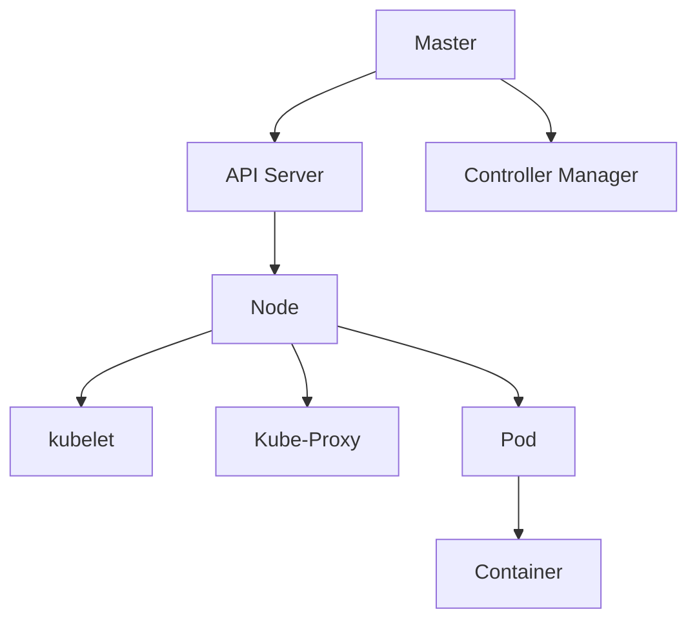

                 

### 文章标题：容器编排技术：Kubernetes在企业中的最佳实践

> 关键词：容器编排、Kubernetes、微服务架构、企业应用、最佳实践

> 摘要：本文将深入探讨容器编排技术及其在Kubernetes中的最佳实践。我们将从容器化技术基础出发，逐步介绍Kubernetes的核心概念、部署与配置，以及资源管理和高可用策略等关键方面。同时，本文将结合具体案例，分析Kubernetes在企业中的实际应用，并总结最佳实践，帮助读者更好地理解和应用Kubernetes技术。

### 第一部分：容器编排技术概述

#### 第1章：容器化技术基础

**1.1.1 容器的定义与特点**

容器是一种轻量级、可移植、自给自足的软件打包技术。容器直接利用宿主机的操作系统，没有额外的操作系统层，因此具有更高的性能和更小的资源占用。与虚拟机相比，容器具有以下特点：

- **轻量级**：容器直接运行在宿主机的操作系统上，没有额外的操作系统层，因此相比虚拟机具有更小的资源占用。
- **可移植性**：容器可以在不同的操作系统和硬件环境中运行，具有良好的跨平台性。
- **自给自足**：容器包含运行应用程序所需的所有依赖和文件，无需额外的配置和环境设置。

**1.1.2 容器的核心概念**

- **镜像**：容器的基础，包含运行应用程序所需的所有依赖和文件。镜像通常由基础镜像和用户自定义镜像组成。
- **容器引擎**：负责创建和管理容器，如Docker。容器引擎通过读取镜像文件，创建并运行容器。
- **容器编排**：对容器进行自动化部署、扩展和管理的过程。容器编排系统（如Kubernetes）可以简化容器的运维和管理。

#### 第2章：Kubernetes核心概念

**2.1.1 Kubernetes简介**

Kubernetes是一个开源的容器编排系统，用于自动化容器操作，如部署、扩展和管理。Kubernetes通过集群管理多个容器，提供高可用性、负载均衡和自动化管理功能。

**2.1.2 Kubernetes关键组件**

- **Pod**：Kubernetes的基本工作单元，一个Pod可以包含一个或多个容器。Pod在Kubernetes集群中负责运行应用程序。
- **Node**：Kubernetes的工作节点，运行Pod的物理或虚拟机。Node作为集群的运算资源，接收集群管理指令。
- **Cluster**：由一组Node组成的Kubernetes集群。集群负责管理和调度Pod，实现应用程序的自动化部署和扩展。

#### 第3章：Kubernetes部署与配置

**3.1.1 Kubernetes集群搭建**

- **单节点集群**：在单台机器上搭建Kubernetes集群。适用于开发测试环境，简单易操作。
- **多节点集群**：在多台机器上搭建Kubernetes集群。适用于生产环境，提供高可用性和负载均衡。

**3.1.2 Kubernetes配置文件**

- **YAML文件**：用于定义Kubernetes资源，如Pod、Service等。YAML文件格式清晰、易于阅读和编辑。
- **Kubernetes命令行工具**：如kubectl，用于与Kubernetes集群进行交互。kubectl提供丰富的命令，方便用户管理集群资源。

### 第二部分：Kubernetes最佳实践

#### 第4章：Kubernetes资源管理

**4.1.1 Pod资源管理**

- **Pod定义**：使用YAML文件定义Pod。Pod定义包含容器配置、网络设置、存储卷等信息。
- **Pod生命周期**：Pod的创建、运行和删除过程。Pod的状态包括创建中、运行中、失败等。

**4.1.2 服务资源管理**

- **Service定义**：使用YAML文件定义Service。Service定义包含服务类型、端口号、负载均衡策略等。
- **Service类型**：包括ClusterIP、NodePort、LoadBalancer等。不同类型的服务适用于不同的场景，如内部集群通信、外部访问等。

#### 第5章：Kubernetes部署策略

**5.1.1 Deployment策略**

- **Deployment定义**：使用YAML文件定义Deployment。Deployment定义包含容器镜像、副本数、更新策略等。
- **Rolling Update**：滚动更新策略。在更新容器镜像时，逐步替换现有Pod，实现平滑升级。

**5.1.2 StatefulSet策略**

- **StatefulSet定义**：使用YAML文件定义StatefulSet。StatefulSet定义包含容器镜像、存储卷、网络标识等。
- **StatefulSet特点**：有状态服务，稳定的网络标识。适用于需要持久化状态的应用程序，如数据库、缓存等。

#### 第6章：Kubernetes高可用与故障转移

**6.1.1 高可用性**

- **Pod复制品**：通过多个副本实现高可用。当某个Pod失败时，其他副本继续提供服务。
- **服务发现与负载均衡**：实现服务的自动发现和负载均衡。通过域名系统（DNS）或环境变量，服务实例可以被发现和访问。

**6.1.2 故障转移**

- **垂直故障转移**：在集群内部进行故障转移。当某个Node故障时，Pod自动转移到其他Node上。
- **水平扩展**：根据负载自动扩展集群。当负载增加时，自动增加Pod副本数，实现弹性伸缩。

#### 第7章：Kubernetes监控与日志

**7.1.1 监控工具**

- **Prometheus**：开源监控解决方案。用于收集和存储Kubernetes集群的指标数据。
- **Grafana**：数据可视化工具。用于可视化Prometheus收集的监控数据。

**7.1.2 日志管理**

- **Fluentd**：日志收集和转发工具。用于收集Kubernetes集群的日志数据。
- **Elasticsearch**：日志存储和分析平台。用于存储和检索Kubernetes集群的日志数据。

#### 第8章：Kubernetes安全性

**8.1.1 基本安全性**

- **命名空间**：隔离资源。通过命名空间，实现资源隔离，防止误操作。
- **Role-Based Access Control (RBAC)**：基于角色的访问控制。通过角色分配权限，实现细粒度访问控制。

**8.1.2 容器安全性**

- **容器镜像签名**：确保镜像的完整性。使用数字签名，验证容器镜像的来源和完整性。
- **容器网络策略**：限制容器间的网络通信。通过网络策略，定义容器之间的通信规则，提高安全性。

#### 第9章：Kubernetes与微服务架构

**9.1.1 微服务概述**

- **微服务架构**：将应用程序拆分为独立的、可独立部署的小服务。微服务具有高可伸缩性、高可维护性等优点。
- **服务拆分与集成**：将应用程序拆分为微服务，实现独立开发、测试和部署。

**9.1.2 Kubernetes与微服务整合**

- **Kubernetes Ingress**：管理外部访问。通过Ingress，实现外部访问到Kubernetes集群内部服务的路由。
- **Kubernetes Service Mesh**：实现服务间通信。通过Service Mesh，实现微服务之间的通信和流量管理。

#### 第10章：Kubernetes最佳实践案例

**10.1.1 案例介绍**

- **某电商平台的Kubernetes部署实践**：介绍某电商平台如何使用Kubernetes实现容器化部署，提高系统性能和可维护性。
- **某金融公司的Kubernetes集群管理经验**：介绍某金融公司如何使用Kubernetes实现集群管理，提高系统高可用性和可靠性。

**10.1.2 案例分析**

- **部署策略分析**：分析案例中使用的Kubernetes部署策略，如Deployment、StatefulSet等。
- **监控与日志分析**：分析案例中使用的监控和日志管理工具，如Prometheus、Grafana、Fluentd、Elasticsearch等。
- **安全性分析**：分析案例中使用的安全性措施，如命名空间、RBAC、容器镜像签名等。

### 附录

**附录A：常用命令行工具**

- **kubectl**：Kubernetes命令行工具，用于与Kubernetes集群进行交互。
- **helm**：Kubernetes包管理工具，用于部署和管理Kubernetes应用程序。

**附录B：扩展阅读**

- **Kubernetes官方文档**：详细介绍了Kubernetes的架构、组件、API等。
- **《Kubernetes权威指南》**：一本全面介绍Kubernetes的书籍，包括基础概念、部署与配置、最佳实践等。

### 结语

本文深入探讨了容器编排技术及其在Kubernetes中的最佳实践。通过本文的阅读，读者可以了解容器化技术的基础、Kubernetes的核心概念和部署与配置方法，以及Kubernetes资源管理、高可用性、监控与日志管理、安全性等方面的最佳实践。同时，通过具体案例的分析，读者可以更好地理解和应用Kubernetes技术，为企业在容器化时代提供技术支持。

**作者：AI天才研究院/AI Genius Institute & 禅与计算机程序设计艺术 /Zen And The Art of Computer Programming**### 容器编排技术概述

容器编排技术是现代云计算和微服务架构中的重要组成部分，它使得大规模部署、管理和服务化容器变得简单和高效。在这个快速发展的技术领域中，Kubernetes（简称K8s）无疑是最为流行和广泛使用的容器编排系统。本节将深入探讨容器编排技术的基础，包括容器化技术的基础知识、Kubernetes的核心概念以及其在企业中的应用。

#### 第1章：容器化技术基础

**1.1.1 容器的定义与特点**

容器是一种轻量级的、可移植的、自给自足的软件打包形式。与传统的虚拟机（VM）相比，容器具有以下几个显著特点：

- **轻量级**：容器不依赖于额外的操作系统，直接运行在宿主机的操作系统上。这意味着容器启动速度快、占用资源少，并且可以同时在宿主机上运行多个容器实例。
- **可移植性**：容器是独立于宿主环境的，可以部署在任何支持容器引擎的操作系统上，无需额外的配置和环境依赖。
- **自给自足**：容器打包了应用程序及其所有的依赖项，包括库、配置文件等，从而保证了应用程序在各种环境中的一致性。

**1.1.2 容器的核心概念**

- **镜像（Image）**：容器镜像是一个静态的、不可变的文件系统，它包含了运行应用程序所需的所有文件和配置。容器实例是从镜像创建的。
- **容器引擎（Container Engine）**：容器引擎是一种软件，用于创建和管理容器。常见的容器引擎包括Docker、rkt和containerd。其中，Docker是目前最流行的容器引擎。
- **容器编排（Container Orchestration）**：容器编排是指管理和自动化容器生命周期的一系列操作，包括部署、扩展、更新和监控。容器编排系统（如Kubernetes）能够简化这些操作，并提供高效的管理方式。

#### 第2章：Kubernetes核心概念

**2.1.1 Kubernetes简介**

Kubernetes是一个开源的容器编排系统，由Google设计并捐赠给Cloud Native Computing Foundation（CNCF）进行管理。Kubernetes的目标是自动化容器操作，提供高效、可靠且可伸缩的容器化应用部署和管理。

- **Kubernetes集群（Cluster）**：Kubernetes集群是由多个节点（Node）组成的集合。每个节点都是一个工作主机，运行Kubernetes组件和服务。集群管理器（Master）负责集群的整体管理和调度。
- **节点（Node）**：节点是集群中的工作主机。每个节点都运行着Kubernetes的代理组件（kubelet），负责与集群管理器通信，并管理在节点上运行的Pod。
- **Pod（Pod）**：Pod是Kubernetes中的基本工作单元，通常包含一个或多个容器实例。Pod在逻辑上代表一个应用程序实例，并且在节点上运行。

**2.1.2 Kubernetes关键组件**

- **Kubelet**：运行在每个节点上的代理，负责与集群管理器通信，并管理在节点上运行的Pod。
- **Kube-Proxy**：运行在每个节点上的代理，负责实现服务之间的网络通信和负载均衡。
- **Controller Manager**：运行在集群管理器上的组件，负责管理集群内的各种资源和对象，如Pod、Service等。
- **Kubernetes API Server**：集群管理的核心组件，提供REST API，供外部工具（如kubectl）与集群交互。

#### 第3章：Kubernetes部署与配置

**3.1.1 Kubernetes集群搭建**

Kubernetes集群的搭建可以根据需求分为单节点集群和多节点集群。

- **单节点集群**：适用于开发测试环境，可以在单台机器上同时运行Kubernetes的Master和Node组件。常见的搭建工具包括Minikube和Kind。
- **多节点集群**：适用于生产环境，需要在多台机器上部署Kubernetes的Master和Node组件。常见的搭建工具包括Kubeadm和Kops。

**3.1.2 Kubernetes配置文件**

Kubernetes使用YAML文件来定义和管理资源。配置文件通常包括以下内容：

- **Pod配置**：定义Pod的容器、存储卷、环境变量等。
- **Service配置**：定义Service的类型、名称、端口映射等。
- **Deployment配置**：定义Deployment的副本数、更新策略等。
- **Ingress配置**：定义外部访问的规则和路由。

**3.1.3 Kubernetes命令行工具**

kubectl是Kubernetes的命令行工具，用于与集群进行交互。常见的kubectl命令包括：

- `kubectl get pods`：列出集群中所有的Pod。
- `kubectl describe pod <pod-name>`：查看Pod的详细信息。
- `kubectl logs <pod-name>`：查看Pod的日志。
- `kubectl scale deployment/<deployment-name> --replicas=<number>`：调整Deployment的副本数。

通过这些基础知识的介绍，读者应该对容器编排技术及其在Kubernetes中的应用有了初步的了解。在接下来的章节中，我们将继续深入探讨Kubernetes的详细使用方法和最佳实践，帮助读者更好地掌握和运用这项技术。

### 容器化技术基础

#### 1.1.1 容器的定义与特点

容器是一种轻量级、可移植、自给自足的软件打包技术，它能够将应用程序及其运行时环境封装在一起，实现一次编写、到处运行的目标。容器与虚拟机（VM）相比具有以下显著特点：

**轻量级**：容器直接运行在宿主机的操作系统上，没有额外的操作系统层，因此具有更高的性能和更小的资源占用。这意味着容器可以更高效地利用硬件资源，尤其是在多任务并行处理时，具有明显的优势。

**可移植性**：容器是独立于宿主环境的，可以部署在任何支持容器引擎的操作系统上，无需额外的配置和环境依赖。这使得容器能够在不同的环境中保持一致性，简化了开发和部署流程。

**自给自足**：容器打包了应用程序及其所有的依赖项，包括库、配置文件等，从而保证了应用程序在各种环境中的一致性。用户无需担心依赖环境的变化，容器内的一切都是自包含的，这大大降低了部署的复杂性。

**隔离性**：容器通过命名空间（Namespace）和cgroups实现了资源隔离，保证了容器之间不会相互干扰。每个容器都有独立的文件系统、网络栈和进程空间，从而提供了一种安全和高效的环境。

**高效性**：容器启动速度快，相比虚拟机具有更低的延迟。容器在数秒内即可启动，而虚拟机可能需要几分钟。此外，容器对CPU、内存等资源的占用较小，可以同时运行多个容器实例，从而提高资源利用率。

**扩展性**：容器支持水平扩展，可以根据需求动态调整容器数量，实现弹性伸缩。容器编排系统（如Kubernetes）可以自动化地管理容器的部署、扩展和更新，提高了系统的可伸缩性和稳定性。

**动态性**：容器可以轻松地启动、停止和迁移，这使得它们非常适合动态环境。容器编排系统提供了强大的自动化功能，可以自动化容器的生命周期管理，包括滚动更新、故障恢复和负载均衡。

总之，容器以其轻量级、高可移植性、自给自足性、隔离性、高效性和动态性等特点，成为现代云计算和微服务架构中的重要组成部分。容器技术的普及和应用，不仅提高了开发效率和运维质量，还为企业的数字化转型提供了强有力的支持。

#### 1.1.2 容器的核心概念

在深入了解容器技术之前，我们需要先掌握几个核心概念：镜像、容器引擎和容器编排。

**1.1.2.1 镜像**

容器镜像（Container Image）是容器运行时的基础，它是一个静态的、不可变的文件系统，包含了运行应用程序所需的所有依赖和文件。容器镜像通常由以下几部分组成：

- **基础镜像**：这是镜像的核心部分，包含了操作系统和基本软件环境。常见的如Ubuntu、CentOS等。
- **用户自定义镜像**：在基础镜像的基础上，用户可以添加自己的应用程序和配置文件，形成自定义镜像。自定义镜像通过`Dockerfile`（Docker的构建脚本）来定义和构建。

容器镜像是容器运行的基础，一个容器实例是从镜像创建的。当容器启动时，容器引擎会从镜像存储仓库中下载所需的镜像，并在宿主机上创建一个对应的文件系统。

**1.1.2.2 容器引擎**

容器引擎（Container Engine）是一种软件，用于创建和管理容器。它负责从容器镜像中创建容器实例，并管理这些实例的生命周期。目前最流行的容器引擎是Docker，但还有其他选择，如rkt和containerd。

- **Docker**：Docker是一个开源的容器引擎，它允许开发者轻松地创建、部署和管理容器。Docker通过Dockerfile定义镜像的构建过程，并通过docker CLI与容器进行交互。
- **rkt**：rkt是CoreOS推出的一个容器引擎，它提供了安全、轻量级和易于管理的容器化解决方案。与Docker相比，rkt更注重安全性和轻量级设计。
- **containerd**：containerd是另一个轻量级的容器运行时，它是Docker 1.11版本后推出的一个组件。containerd提供了一个稳定的容器运行时接口，使得不同的容器引擎可以共享同一套运行时组件。

容器引擎不仅负责管理容器实例，还提供了以下功能：

- **容器镜像管理**：容器引擎可以存储和管理容器镜像，包括下载、上传、搜索和删除。
- **容器网络管理**：容器引擎提供了容器之间的网络通信机制，如IP地址分配、端口映射和网络命名空间。
- **容器监控和日志**：容器引擎可以收集容器的监控数据和日志，并提供可视化工具，帮助开发者和管理员监控和管理容器。

**1.1.2.3 容器编排**

容器编排（Container Orchestration）是指管理和自动化容器生命周期的一系列操作，包括部署、扩展、更新和监控。随着容器数量的增加，手动管理每个容器变得越来越困难，因此容器编排系统应运而生。

容器编排系统的主要任务是简化容器的部署和管理过程，提供高效、可靠和可伸缩的容器化应用部署和管理。常见的容器编排系统有Kubernetes、Docker Swarm和Mesos等。

- **Kubernetes**：Kubernetes是当前最流行的容器编排系统，它由Google开发，并捐赠给Cloud Native Computing Foundation（CNCF）进行管理。Kubernetes提供了丰富的API和强大的自动化功能，可以自动化容器的部署、扩展和更新，同时提供了高可用性和故障恢复机制。
- **Docker Swarm**：Docker Swarm是Docker内置的容器编排系统，它可以将多个Docker节点组成一个集群，并自动分配和管理容器。Docker Swarm提供了简单的操作接口和易于使用的API，适合小型集群和实验环境。
- **Mesos**：Mesos是Apache开源的容器编排平台，它支持多种容器引擎，如Docker、Marathon和Chronos。Mesos通过统一资源管理和任务调度，实现了大规模容器化应用的部署和管理。

容器编排系统的主要功能包括：

- **容器生命周期管理**：容器编排系统负责创建、启动、停止、删除和管理容器的生命周期。
- **服务发现和负载均衡**：容器编排系统可以自动发现容器实例，并提供负载均衡策略，确保服务的可用性和性能。
- **存储和持久化**：容器编排系统可以配置容器的存储卷，并提供数据持久化功能，确保应用数据的安全性和可靠性。
- **监控和告警**：容器编排系统可以监控容器的运行状态，收集指标数据，并设置告警机制，及时发现和解决问题。

通过容器编排系统，开发者可以轻松地将应用程序容器化，并自动化地管理容器的部署、扩展和更新，从而提高开发效率和运维质量。容器编排技术已经成为现代云计算和微服务架构中的重要组成部分，为企业的数字化转型提供了强有力的支持。

### Kubernetes核心概念

Kubernetes是一个强大的容器编排系统，它帮助企业高效地管理和自动化容器化应用程序的部署、扩展和管理。为了更好地理解Kubernetes，我们需要首先掌握其核心概念和组件。以下是Kubernetes的主要组成部分：

#### 2.1.1 Kubernetes简介

Kubernetes是一个开源的容器编排平台，由Google设计并捐赠给Cloud Native Computing Foundation（CNCF）进行管理。Kubernetes旨在自动化容器操作，提供高效、可靠且可伸缩的容器化应用部署和管理。它可以帮助开发者和管理员简化应用程序的部署、扩展和运维，从而提高开发效率和系统可靠性。

#### 2.1.2 Kubernetes关键组件

Kubernetes由多个关键组件组成，每个组件在集群中扮演不同的角色。以下是Kubernetes的主要组件：

- **集群（Cluster）**：Kubernetes集群是由多个节点（Node）组成的集合。每个节点都运行着Kubernetes的代理组件（kubelet），负责管理在节点上运行的Pod。集群管理器（Master）负责集群的整体管理和调度。
- **节点（Node）**：节点是Kubernetes集群中的工作主机。每个节点都运行着Kubernetes的代理组件（kubelet），负责与集群管理器通信，并管理在节点上运行的Pod。节点通常由物理机或虚拟机组成。
- **Pod**：Pod是Kubernetes中的基本工作单元，通常包含一个或多个容器实例。Pod在逻辑上代表一个应用程序实例，并且在节点上运行。Pod可以看作是容器的容器，它提供了容器之间的共享资源和通信机制。
- **容器（Container）**：容器是运行在Pod中的实际执行单元。每个容器都有自己的应用程序、库和配置文件，并运行在独立的进程中。容器是应用程序的核心组成部分，它实现了应用程序的隔离和运行时环境。
- **Kubelet**：Kubelet是运行在每个节点上的代理组件，负责与集群管理器（Master）通信，并管理在节点上运行的Pod。Kubelet的主要任务包括启动、停止和监控容器，以及向集群管理器报告节点的状态。
- **Kube-Proxy**：Kube-Proxy是运行在每个节点上的代理组件，负责实现服务之间的网络通信和负载均衡。Kube-Proxy通过维护容器网络命名空间（NetNS）和端口映射，确保容器之间能够进行有效的通信。
- **Controller Manager**：Controller Manager是运行在集群管理器（Master）上的组件，负责管理集群内的各种资源和对象。Controller Manager包括多种控制器（Controller），如Replication Controller、Deployment Controller、StatefulSet Controller等，它们分别负责管理不同类型的资源对象。
- **Kubernetes API Server**：Kubernetes API Server是集群管理的核心组件，提供REST API，供外部工具（如kubectl）与集群交互。Kubernetes API Server负责处理所有与集群资源和对象相关的操作，如创建、更新和删除。

#### 2.1.3 Kubernetes组件关系架构

为了更好地理解Kubernetes的组件关系，我们可以使用Mermaid流程图来展示：



在这个流程图中：

- **Master**：代表集群管理器，包括API Server和Controller Manager。
- **Node**：代表工作节点，包括kubelet、Kube-Proxy和Pod。
- **API Server**：提供REST API，供外部工具与集群交互。
- **Controller Manager**：负责管理集群内的资源和对象。
- **kubelet**：负责与集群管理器通信，并管理Pod。
- **Kube-Proxy**：负责实现服务之间的网络通信和负载均衡。
- **Pod**：Kubernetes的基本工作单元，包含一个或多个容器。
- **Container**：运行在Pod中的实际执行单元。

通过这个关系架构，我们可以清晰地了解Kubernetes组件之间的交互关系和职责分工。Kubernetes通过这些组件的协同工作，实现了容器化应用程序的自动化部署、扩展和管理。

### Kubernetes部署与配置

Kubernetes的部署与配置是确保其正常运行的关键步骤。根据不同的需求，我们可以选择在单节点或多个节点上搭建Kubernetes集群。以下是关于Kubernetes集群搭建及配置文件使用的详细说明。

#### 3.1.1 Kubernetes集群搭建

**单节点集群**

单节点集群适用于开发测试环境，可以在单台机器上同时运行Kubernetes的Master和Node组件。以下是单节点集群的搭建步骤：

1. **安装Docker**：首先需要在宿主机上安装Docker，因为Kubernetes需要依赖Docker来运行容器。可以参考官方文档进行安装。

2. **安装Kubeadm、Kubelet和Kubectl**：安装kubeadm、kubelet和kubectl，这三个工具用于初始化集群、管理节点和与集群进行交互。

   ```shell
   sudo apt-get update
   sudo apt-get install -y apt-transport-https ca-certificates curl
   sudo curl -s https://packages.cloud.google.com/apt/doc/apt-key.gpg | sudo apt-key add -
   sudo echo "deb https://apt.kubernetes.io/ kubernetes-xenial main" | sudo tee -a /etc/apt/sources.list
   sudo apt-get update
   sudo apt-get install -y kubelet kubeadm kubectl
   ```

3. **初始化Master节点**：使用kubeadm初始化Master节点。

   ```shell
   sudo kubeadm init --pod-network-cidr=10.244.0.0/16
   ```

4. **配置kubectl**：为了让kubectl能够与集群通信，需要设置环境变量。

   ```shell
   mkdir -p $HOME/.kube
   sudo cp -i /etc/kubernetes/admin.conf $HOME/.kube/config
   sudo chown $(id -u):$(id -g) $HOME/.kube/config
   ```

5. **安装Pod网络插件**：选择一个Pod网络插件（如Calico、Flannel），并安装它。以下示例使用Calico：

   ```shell
   kubectl apply -f https://docs.projectcalico.org/manifests/calico.yaml
   ```

6. **加入Worker节点**：如果需要加入Worker节点，可以在每个Worker节点上执行以下命令：

   ```shell
   sudo kubeadm join <master-node-ip>:6443 --token <token> --discovery-token-ca-cert-hash sha256:<hash>
   ```

**多节点集群**

多节点集群适用于生产环境，需要在多台机器上部署Kubernetes的Master和Node组件。以下是多节点集群的搭建步骤：

1. **初始化Master节点**：在Master节点上执行以下命令：

   ```shell
   sudo kubeadm init --pod-network-cidr=10.244.0.0/16
   ```

2. **配置kubectl**：同单节点集群一样，设置环境变量，以便kubectl与集群通信。

3. **安装Pod网络插件**：选择一个Pod网络插件并安装，如Calico。

4. **配置其他节点**：在所有Worker节点上执行以下命令，将其加入集群：

   ```shell
   sudo kubeadm join <master-node-ip>:6443 --token <token> --discovery-token-ca-cert-hash sha256:<hash>
   ```

5. **设置Master节点的主节点角色**：确保Master节点的主节点角色正确，避免其他Node尝试夺取主节点角色。

   ```shell
   kubectl taint nodes <master-node-name> node-role.kubernetes.io/master-
   ```

#### 3.1.2 Kubernetes配置文件

Kubernetes使用YAML文件来定义和管理资源。配置文件通常包括以下内容：

**Pod配置**：定义Pod的容器、存储卷、环境变量等。

```yaml
apiVersion: v1
kind: Pod
metadata:
  name: my-pod
spec:
  containers:
  - name: my-container
    image: nginx:1.16.1
    ports:
    - containerPort: 80
```

**Service配置**：定义Service的类型、名称、端口映射等。

```yaml
apiVersion: v1
kind: Service
metadata:
  name: my-service
spec:
  selector:
    app: my-app
  ports:
    - protocol: TCP
      port: 80
      targetPort: 80
  type: ClusterIP
```

**Deployment配置**：定义Deployment的副本数、更新策略等。

```yaml
apiVersion: apps/v1
kind: Deployment
metadata:
  name: my-deployment
spec:
  replicas: 3
  selector:
    matchLabels:
      app: my-app
  template:
    metadata:
      labels:
        app: my-app
    spec:
      containers:
      - name: my-container
        image: nginx:1.16.1
        ports:
        - containerPort: 80
```

**Ingress配置**：定义外部访问的规则和路由。

```yaml
apiVersion: networking.k8s.io/v1
kind: Ingress
metadata:
  name: my-ingress
spec:
  rules:
  - http:
      paths:
      - path: /
        pathType: Prefix
        backend:
          service:
            name: my-service
            port:
              number: 80
```

**存储卷配置**：定义存储卷的配置，以便容器可以使用外部存储。

```yaml
apiVersion: v1
kind: PersistentVolume
metadata:
  name: my-pv
spec:
  capacity:
    storage: 1Gi
  accessModes:
    - ReadWriteOnce
  persistentVolumeReclaimPolicy: Retain
  nfs:
    path: /path/to/nfs/share
    server: nfs-server.example.com
```

通过以上配置文件，我们可以定义和管理Kubernetes集群中的各种资源，如Pod、Service、Deployment、Ingress和存储卷等。Kubernetes提供了丰富的API和配置选项，使得开发者和管理员可以灵活地定义和管理容器化应用。

#### 3.1.3 Kubernetes命令行工具

Kubernetes提供了丰富的命令行工具，特别是kubectl，它是Kubernetes集群的管理工具，用于与集群进行交互。以下是一些常用的kubectl命令：

- `kubectl get pods`：列出集群中所有的Pod。

  ```shell
  kubectl get pods
  ```

- `kubectl describe pod <pod-name>`：查看Pod的详细信息。

  ```shell
  kubectl describe pod <pod-name>
  ```

- `kubectl logs <pod-name>`：查看Pod的日志。

  ```shell
  kubectl logs <pod-name>
  ```

- `kubectl scale deployment/<deployment-name> --replicas=<number>`：调整Deployment的副本数。

  ```shell
  kubectl scale deployment/<deployment-name> --replicas=<number>
  ```

- `kubectl apply -f <file>.yaml`：应用配置文件。

  ```shell
  kubectl apply -f <file>.yaml
  ```

- `kubectl delete <resource-name>`：删除集群中的资源。

  ```shell
  kubectl delete <resource-name>
  ```

通过这些命令，我们可以轻松地管理和监控Kubernetes集群中的资源，确保其正常运行。

### Kubernetes资源管理

Kubernetes的资源管理是确保应用程序在集群中高效运行的核心。Kubernetes中的主要资源包括Pod、Service、Deployment、StatefulSet等。这些资源通过YAML文件定义，并通过Kubernetes API进行管理和操作。以下是对Kubernetes资源管理的详细探讨。

#### 4.1.1 Pod资源管理

Pod是Kubernetes的基本工作单元，包含一个或多个容器。Pod负责运行应用程序，并与其他Pod协作完成业务逻辑。

**Pod定义**

Pod的定义通常使用YAML文件，包含以下关键部分：

- **metadata**：定义Pod的元数据，如名称、标签等。
- **spec**：定义Pod的详细配置，包括容器配置、启动命令、环境变量等。

以下是一个简单的Pod定义示例：

```yaml
apiVersion: v1
kind: Pod
metadata:
  name: my-pod
  labels:
    app: my-app
spec:
  containers:
  - name: my-container
    image: nginx:1.16.1
    ports:
    - containerPort: 80
```

在这个示例中，我们定义了一个名为`my-pod`的Pod，它包含一个名为`my-container`的容器，容器镜像为`nginx:1.16.1`，并暴露了80端口。

**Pod生命周期**

Pod的生命周期包括创建、运行、失败和删除等状态。以下是Pod生命周期的简要描述：

- **创建**：当Kubernetes API Server接收到Pod定义后，会创建一个新的Pod。
- **运行**：Pod中的容器启动并运行应用程序。
- **失败**：当Pod中的容器无法运行或运行失败时，Pod将进入失败状态。
- **删除**：用户可以手动删除Pod，或者当Pod达到预定的终止条件时，Kubernetes会自动删除Pod。

#### 4.1.2 服务资源管理

Service是Kubernetes中的另一个重要资源，用于暴露Pod并允许其他Pod访问它们。Service通过分配一个唯一的IP地址或域名，实现Pod的访问和负载均衡。

**Service定义**

Service的定义也使用YAML文件，包含以下关键部分：

- **metadata**：定义Service的元数据，如名称、标签等。
- **spec**：定义Service的详细配置，包括选择器、端口映射、类型等。

以下是一个简单的Service定义示例：

```yaml
apiVersion: v1
kind: Service
metadata:
  name: my-service
spec:
  selector:
    app: my-app
  ports:
    - protocol: TCP
      port: 80
      targetPort: 80
  type: ClusterIP
```

在这个示例中，我们定义了一个名为`my-service`的Service，它选择器为`app: my-app`，暴露了80端口，并使用ClusterIP类型。

**Service类型**

Kubernetes支持多种Service类型，包括：

- **ClusterIP**：默认类型，提供集群内的访问。
- **NodePort**：在集群内的每个Node上开放一个端口，供外部访问。
- **LoadBalancer**：在公共云环境中，通过负载均衡器提供外部访问。

#### 4.1.3 Deployment资源管理

Deployment是一种用于管理Pod的控制器，确保Pod的副本数满足预期，并实现滚动更新。

**Deployment定义**

Deployment的定义使用YAML文件，包含以下关键部分：

- **metadata**：定义Deployment的元数据，如名称、标签等。
- **spec**：定义Deployment的详细配置，包括Pod模板、副本数、更新策略等。

以下是一个简单的Deployment定义示例：

```yaml
apiVersion: apps/v1
kind: Deployment
metadata:
  name: my-deployment
spec:
  replicas: 3
  selector:
    matchLabels:
      app: my-app
  template:
    metadata:
      labels:
        app: my-app
    spec:
      containers:
      - name: my-container
        image: nginx:1.16.1
        ports:
        - containerPort: 80
```

在这个示例中，我们定义了一个名为`my-deployment`的Deployment，它包含3个副本，并使用Nginx容器镜像。

**更新策略**

Deployment支持多种更新策略，包括：

- **RollingUpdate**：逐步更新Pod，实现平滑升级。
- **Recreate**：删除旧Pod并创建新Pod，适用于不兼容的更新。

以下是一个简单的滚动更新策略示例：

```yaml
spec:
  strategy:
    type: RollingUpdate
    rollingUpdate:
      maxSurge: 1
      maxUnavailable: 0
```

在这个示例中，我们设置了最大允许的Pod增加数量（maxSurge）和最大不可用Pod数量（maxUnavailable）。

#### 4.1.4 StatefulSet资源管理

StatefulSet是Kubernetes中用于管理有状态Pod的控制器。有状态Pod通常具有持久化存储和网络标识。

**StatefulSet定义**

StatefulSet的定义使用YAML文件，包含以下关键部分：

- **metadata**：定义StatefulSet的元数据，如名称、标签等。
- **spec**：定义StatefulSet的详细配置，包括Pod模板、副本数、存储卷等。

以下是一个简单的StatefulSet定义示例：

```yaml
apiVersion: apps/v1
kind: StatefulSet
metadata:
  name: my-statefulset
spec:
  serviceName: my-service
  replicas: 3
  selector:
    matchLabels:
      app: my-app
  template:
    metadata:
      labels:
        app: my-app
    spec:
      containers:
      - name: my-container
        image: nginx:1.16.1
        ports:
        - containerPort: 80
```

在这个示例中，我们定义了一个名为`my-statefulset`的StatefulSet，它包含3个副本，并使用Nginx容器镜像。

**特点**

StatefulSet具有以下特点：

- **有序部署和扩展**：StatefulSet在部署和扩展Pod时，确保顺序进行，避免冲突。
- **稳定网络标识**：每个Pod具有固定的网络标识，如主机名和IP地址。
- **持久化存储**：StatefulSet支持持久化存储卷，确保数据不会随Pod的终止而丢失。

通过上述资源管理，Kubernetes提供了强大的容器化应用管理能力，确保应用程序在分布式环境中高效、稳定地运行。

#### 4.1.5 其他资源管理

除了Pod、Service、Deployment和StatefulSet，Kubernetes还支持其他多种资源，包括：

- **Ingress**：用于管理外部流量进入集群的规则和路由。通过定义Ingress资源，可以轻松实现基于HTTP的路由和负载均衡。
- **ConfigMap**：用于存储和管理应用程序的配置数据。ConfigMap可以应用于Pod，实现配置的动态更新。
- **Secret**：用于存储敏感数据，如密码、密钥等。Secret提供更高的安全性，确保敏感数据不会泄露。
- **PersistentVolume (PV) 和 PersistentVolumeClaim (PVC)**：用于提供外部存储卷，确保应用程序数据持久化。

以下是对这些资源的简要介绍：

**Ingress**

Ingress资源定义了外部访问集群内部服务的规则和路由。通过Ingress，可以实现基于域名和路径的路由，以及负载均衡功能。以下是一个简单的Ingress定义示例：

```yaml
apiVersion: networking.k8s.io/v1
kind: Ingress
metadata:
  name: my-ingress
  annotations:
    kubernetes.io/ingress.class: nginx
spec:
  rules:
  - http:
      paths:
      - path: /
        pathType: Prefix
        backend:
          service:
            name: my-service
            port:
              number: 80
```

在这个示例中，我们定义了一个名为`my-ingress`的Ingress，它将所有路径映射到名为`my-service`的Service。

**ConfigMap**

ConfigMap用于存储和管理应用程序的配置数据。ConfigMap可以应用于Pod，实现配置的动态更新。以下是一个简单的ConfigMap定义示例：

```yaml
apiVersion: v1
kind: ConfigMap
metadata:
  name: my-configmap
data:
  config.yaml: |
    key: value
```

在这个示例中，我们定义了一个名为`my-configmap`的ConfigMap，它包含一个名为`config.yaml`的配置文件。

**Secret**

Secret用于存储和管理敏感数据，如密码、密钥等。Secret提供更高的安全性，确保敏感数据不会泄露。以下是一个简单的Secret定义示例：

```yaml
apiVersion: v1
kind: Secret
metadata:
  name: my-secret
type: Opaque
data:
  password: cGFzc3dvcmQ=
```

在这个示例中，我们定义了一个名为`my-secret`的Secret，它包含一个名为`password`的密码字段。

**PersistentVolume (PV) 和 PersistentVolumeClaim (PVC)**

PersistentVolume（PV）和PersistentVolumeClaim（PVC）用于提供外部存储卷，确保应用程序数据持久化。以下是一个简单的PV和PVC定义示例：

```yaml
apiVersion: v1
kind: PersistentVolume
metadata:
  name: my-pv
spec:
  capacity:
    storage: 1Gi
  accessModes:
    - ReadWriteOnce
  persistentVolumeReclaimPolicy: Retain
  nfs:
    path: /path/to/nfs/share
    server: nfs-server.example.com
```

```yaml
apiVersion: v1
kind: PersistentVolumeClaim
metadata:
  name: my-pvc
spec:
  accessModes:
    - ReadWriteOnce
  resources:
    requests:
      storage: 1Gi
```

在这个示例中，我们定义了一个名为`my-pv`的PV和一个名为`my-pvc`的PVC，它们都请求1Gi的存储空间，并使用NFS存储。

通过这些资源的管理，Kubernetes提供了丰富的功能，确保容器化应用在分布式环境中能够高效、稳定地运行。开发者可以根据实际需求选择合适的资源，实现复杂的应用场景。

### Kubernetes部署策略

在Kubernetes中，部署策略是确保应用程序在集群中可靠运行的关键。有效的部署策略可以确保应用程序的稳定性、可用性和可扩展性。Kubernetes提供了多种部署策略，包括Deployment和StatefulSet，每种策略都有其独特的用途和特点。以下是对这些策略的详细探讨。

#### 5.1.1 Deployment策略

Deployment是Kubernetes中用于管理Pod副本数的控制器，确保Pod的数量和状态满足预期。Deployment支持滚动更新策略，可以逐步替换旧的Pod，实现平滑升级。

**Deployment定义**

Deployment的定义使用YAML文件，包含以下关键部分：

- **metadata**：定义Deployment的元数据，如名称、标签等。
- **spec**：定义Deployment的详细配置，包括Pod模板、副本数、更新策略等。

以下是一个简单的Deployment定义示例：

```yaml
apiVersion: apps/v1
kind: Deployment
metadata:
  name: my-deployment
spec:
  replicas: 3
  selector:
    matchLabels:
      app: my-app
  template:
    metadata:
      labels:
        app: my-app
    spec:
      containers:
      - name: my-container
        image: nginx:1.16.1
        ports:
        - containerPort: 80
```

在这个示例中，我们定义了一个名为`my-deployment`的Deployment，它包含3个副本，并使用Nginx容器镜像。

**更新策略**

Deployment支持多种更新策略，包括：

- **RollingUpdate**：逐步更新Pod，实现平滑升级。在滚动更新过程中，新的Pod会逐步替换旧的Pod，确保服务始终可用。

  ```yaml
  spec:
    strategy:
      type: RollingUpdate
      rollingUpdate:
        maxSurge: 1
        maxUnavailable: 0
  ```

  在这个示例中，`maxSurge`设置为1，表示最多可以创建1个额外的Pod；`maxUnavailable`设置为0，表示不允许任何Pod在更新过程中不可用。

- **Recreate**：删除旧Pod并创建新Pod，适用于不兼容的更新。这种策略会导致短暂的服务中断。

  ```yaml
  spec:
    strategy:
      type: Recreate
  ```

**Deployment操作**

- **创建Deployment**：

  ```shell
  kubectl create -f deployment.yaml
  ```

- **更新Deployment**：

  ```shell
  kubectl set image deployment/my-deployment my-container=nginx:1.16.2
  ```

- **查看Deployment状态**：

  ```shell
  kubectl get deployment/my-deployment
  ```

#### 5.1.2 StatefulSet策略

StatefulSet是Kubernetes中用于管理有状态Pod的控制器。有状态Pod通常具有持久化存储和网络标识，如固定的IP地址和主机名。

**StatefulSet定义**

StatefulSet的定义使用YAML文件，包含以下关键部分：

- **metadata**：定义StatefulSet的元数据，如名称、标签等。
- **spec**：定义StatefulSet的详细配置，包括Pod模板、副本数、存储卷等。

以下是一个简单的StatefulSet定义示例：

```yaml
apiVersion: apps/v1
kind: StatefulSet
metadata:
  name: my-statefulset
spec:
  serviceName: my-service
  replicas: 3
  selector:
    matchLabels:
      app: my-app
  template:
    metadata:
      labels:
        app: my-app
    spec:
      containers:
      - name: my-container
        image: nginx:1.16.1
        ports:
        - containerPort: 80
```

在这个示例中，我们定义了一个名为`my-statefulset`的StatefulSet，它包含3个副本，并使用Nginx容器镜像。

**特点**

StatefulSet具有以下特点：

- **有序部署和扩展**：StatefulSet在部署和扩展Pod时，确保顺序进行，避免冲突。
- **稳定网络标识**：每个Pod具有固定的网络标识，如主机名和IP地址。
- **持久化存储**：StatefulSet支持持久化存储卷，确保数据不会随Pod的终止而丢失。

**StatefulSet操作**

- **创建StatefulSet**：

  ```shell
  kubectl create -f statefulset.yaml
  ```

- **查看StatefulSet状态**：

  ```shell
  kubectl get statefulset/my-statefulset
  ```

- **扩容StatefulSet**：

  ```shell
  kubectl scale statefulset/my-statefulset --replicas=5
  ```

通过Deployment和StatefulSet，Kubernetes提供了强大的部署和管理策略，确保容器化应用程序在分布式环境中稳定、可靠地运行。开发者可以根据实际需求选择合适的部署策略，实现复杂的应用场景。

#### 5.1.3 部署策略比较

Deployment和StatefulSet都是Kubernetes中的部署策略，但它们适用于不同的应用场景。以下是两者的比较：

- **用途**：
  - **Deployment**：主要用于无状态应用程序，如Web服务器、API服务等。Deployment支持滚动更新和弹性伸缩，确保应用程序在更新过程中保持可用。
  - **StatefulSet**：主要用于有状态应用程序，如数据库、缓存服务等。StatefulSet提供了稳定网络标识和持久化存储，确保应用程序的数据一致性和可用性。

- **副本管理**：
  - **Deployment**：Deployment可以动态调整Pod的副本数，并支持滚动更新策略。在更新过程中，Deployment会逐步替换旧的Pod，确保服务可用性。
  - **StatefulSet**：StatefulSet的副本数是固定的，但支持Pod的有序部署和扩展。StatefulSet确保每个Pod的启动顺序，避免资源冲突。

- **网络标识**：
  - **Deployment**：Deployment中的Pod没有固定的网络标识，Pod的IP地址和主机名可能随创建时间而变化。
  - **StatefulSet**：StatefulSet中的每个Pod具有固定的网络标识，包括主机名和IP地址。这确保了应用程序在运行时能够稳定访问其他Pod。

- **存储卷**：
  - **Deployment**：Deployment默认不提供持久化存储卷，但可以与PersistentVolumeClaim（PVC）结合使用，实现数据持久化。
  - **StatefulSet**：StatefulSet支持持久化存储卷，确保数据不会随Pod的终止而丢失。StatefulSet会为每个Pod创建一个独立的存储卷，并保证数据的持久性。

通过上述比较，我们可以看出，Deployment和StatefulSet各有优势，适用于不同的应用场景。开发者可以根据实际需求，选择合适的部署策略，确保应用程序在Kubernetes集群中稳定、高效地运行。

#### 5.1.4 部署策略实战

为了更好地理解Kubernetes的部署策略，我们将通过一个实际案例来演示如何使用Deployment和StatefulSet部署应用程序。

**案例背景**：

假设我们有两个应用程序，一个是无状态的应用（如一个API服务），另一个是有状态的应用（如一个数据库服务）。我们将使用Kubernetes的Deployment和StatefulSet来部署这两个应用程序，并展示如何管理它们的副本数和更新策略。

**1. 部署无状态应用（API服务）**

首先，我们使用Deployment部署无状态的应用程序，这里选择Nginx作为示例。

**Deployment定义**：

```yaml
apiVersion: apps/v1
kind: Deployment
metadata:
  name: api-deployment
spec:
  replicas: 3
  selector:
    matchLabels:
      app: api
  template:
    metadata:
      labels:
        app: api
    spec:
      containers:
      - name: api-container
        image: nginx:1.16.1
        ports:
        - containerPort: 80
```

**部署步骤**：

- 创建Deployment：

  ```shell
  kubectl create -f api-deployment.yaml
  ```

- 查看Deployment状态：

  ```shell
  kubectl get deployment/api-deployment
  ```

此时，Kubernetes会创建3个Pod，并确保它们处于运行状态。

**更新策略**：

我们假设需要更新Nginx镜像版本，使用以下命令更新Deployment：

```shell
kubectl set image deployment/api-deployment api-container=nginx:1.16.2
```

此时，Kubernetes会按照指定的滚动更新策略逐步更新Pod，确保服务可用性。

**2. 部署有状态应用（数据库服务）**

接下来，我们使用StatefulSet部署有状态的应用程序，这里选择MongoDB作为示例。

**StatefulSet定义**：

```yaml
apiVersion: apps/v1
kind: StatefulSet
metadata:
  name: db-statefulset
spec:
  serviceName: db-service
  replicas: 3
  selector:
    matchLabels:
      app: db
  template:
    metadata:
      labels:
        app: db
    spec:
      containers:
      - name: db-container
        image: mongo:4.0
        ports:
        - containerPort: 27017
```

**部署步骤**：

- 创建StatefulSet：

  ```shell
  kubectl create -f db-statefulset.yaml
  ```

- 查看StatefulSet状态：

  ```shell
  kubectl get statefulset/db-statefulset
  ```

此时，Kubernetes会创建3个Pod，并确保它们处于运行状态，每个Pod具有固定的网络标识和IP地址。

**扩容StatefulSet**：

我们假设需要增加数据库服务的副本数，使用以下命令扩容StatefulSet：

```shell
kubectl scale statefulset/db-statefulset --replicas=5
```

此时，Kubernetes会按照有序部署策略，逐步创建新的Pod，并确保服务稳定运行。

**3. 查看应用程序状态**

- 查看API服务Pod状态：

  ```shell
  kubectl get pods -l app=api
  ```

- 查看数据库服务Pod状态：

  ```shell
  kubectl get pods -l app=db
  ```

通过以上实战案例，我们可以看到如何使用Deployment和StatefulSet部署和管理工作负载。在实际项目中，根据应用的特点和需求，选择合适的部署策略，可以确保应用程序在Kubernetes集群中稳定、可靠地运行。

### Kubernetes高可用性与故障转移

在容器化应用环境中，高可用性（High Availability，简称HA）和故障转移（Failover）是确保服务持续可用的重要策略。Kubernetes提供了多种机制来实现高可用性和故障转移，包括Pod复制品、服务发现与负载均衡等。以下是对这些机制的详细探讨。

#### 6.1.1 高可用性

高可用性是指系统在面临硬件故障、软件故障或其他异常情况时，仍然能够保持服务的正常运行。在Kubernetes中，实现高可用性的关键机制包括：

**Pod复制品**

Kubernetes通过创建Pod的多个复制品（Replicas）来实现高可用性。每个Pod的复制品都在不同的Node上运行，从而提高了服务的容错能力。当某个Pod失败时，Kubernetes会自动创建一个新的Pod来替代它，确保服务不会中断。

**实例**：

假设我们部署了一个包含3个复制品的Nginx服务。如果其中一个Pod由于Node故障而失败，Kubernetes会自动创建一个新的Pod，并在其他Node上运行。这样，Nginx服务仍然能够正常工作，用户不会察觉到服务中断。

**配置**：

在Deployment或StatefulSet配置中，可以通过设置`replicas`参数来指定Pod的复制品数量。以下是一个示例：

```yaml
spec:
  replicas: 3
```

**优势**：

- **容错能力**：通过创建多个复制品，提高了系统的容错能力，确保服务在高负载和故障情况下仍然可用。
- **负载均衡**：复制品机制还实现了负载均衡，自动将流量分配到不同的Pod实例上，提高了系统的性能和可伸缩性。

**局限性**：

- **硬件依赖**：虽然Pod复制品提高了系统的容错能力，但如果所有Node都面临硬件故障，高可用性仍会受到挑战。
- **资源消耗**：创建多个复制品会消耗更多的系统资源，如CPU、内存和存储等。

**服务发现与负载均衡**

在Kubernetes中，服务发现（Service Discovery）和负载均衡（Load Balancing）是实现高可用性的重要机制。服务发现确保Pod实例能够被发现和访问，而负载均衡则确保流量在Pod实例之间公平分配。

**服务发现**：

Kubernetes通过DNS或环境变量来实现服务发现。当创建一个Service时，Kubernetes会为该Service分配一个DNS名称，如`my-service.default.svc.cluster.local`。Pod可以通过这个DNS名称访问Service，从而实现服务发现。

**实例**：

假设我们创建了一个名为`my-service`的Service，该Service关联到一个Nginx Deployment。Nginx Deployment包含3个复制品。当Pod需要访问Nginx服务时，可以通过`my-service.default.svc.cluster.local`进行服务发现。

**配置**：

在Service配置中，通过设置`selector`和`type`参数来指定Service关联的Pod和类型。以下是一个示例：

```yaml
spec:
  selector:
    app: my-app
  type: ClusterIP
```

**优势**：

- **简化部署**：通过服务发现和负载均衡，简化了部署和管理过程，用户无需关注具体的Pod和Node。
- **弹性伸缩**：负载均衡机制可以根据流量需求自动调整Pod的复制品数量，实现弹性伸缩。

**局限性**：

- **网络依赖**：服务发现和负载均衡依赖于Kubernetes集群的网络架构，如果网络出现问题，可能会导致服务不可达。
- **性能损耗**：负载均衡引入了额外的网络跳转和计算开销，可能会对性能产生一定影响。

**总结**：

通过Pod复制品、服务发现和负载均衡，Kubernetes实现了高可用性。这些机制相互配合，确保了容器化应用在面临故障时能够快速恢复，保持服务的持续可用。在实际应用中，根据具体需求和场景，可以灵活选择和组合这些机制，实现最佳的高可用性策略。

#### 6.1.2 故障转移

在Kubernetes集群中，故障转移（Failover）是指当某个节点或Pod出现故障时，系统能够自动将工作负载转移到其他健康节点或Pod的过程。故障转移机制是确保集群稳定运行和业务连续性的关键。以下是Kubernetes中实现故障转移的几种常见策略：

**垂直故障转移**

垂直故障转移（Vertical Failover）是指当集群中的某个节点发生故障时，将运行在该节点上的Pod自动迁移到其他健康节点。这种策略通常用于处理Node级别的故障，如硬件故障、操作系统崩溃等。

**实例**：

假设Kubernetes集群中有两个Node，Node A和Node B。Node A上运行了3个Nginx Pod，而Node B上没有运行任何Pod。如果Node A发生故障，Kubernetes会自动将Node A上的Pod迁移到Node B，确保Nginx服务继续运行。

**配置**：

在部署Pod时，可以通过设置资源限制（如CPU、内存）来避免资源密集型Pod导致Node故障。以下是一个示例：

```yaml
spec:
  containers:
  - name: my-container
    image: nginx:1.16.1
    resources:
      limits:
        cpu: "500m"
        memory: "512Mi"
```

**优势**：

- **快速恢复**：垂直故障转移可以快速地将故障节点上的Pod迁移到其他健康节点，减少服务中断时间。
- **资源隔离**：通过设置资源限制，可以确保每个Pod不会占用过多资源，从而降低节点故障的风险。

**局限性**：

- **资源不足**：如果集群资源不足，垂直故障转移可能会导致其他节点也达到资源上限，从而进一步影响集群稳定性。
- **性能损耗**：迁移Pod可能会带来额外的网络和计算开销，影响系统性能。

**水平扩展**

水平扩展（Horizontal Scaling）是指根据负载需求自动增加或减少Pod的副本数量。这种策略通常用于处理流量波动和业务增长，确保系统在高负载时能够自动扩展，低负载时能够缩减资源。

**实例**：

假设Kubernetes集群中有3个Nginx Pod，当流量增加时，Kubernetes会自动创建新的Pod来应对负载；当流量减少时，Kubernetes会删除多余的Pod。

**配置**：

在Deployment或StatefulSet配置中，可以通过设置`minReplicas`和`maxReplicas`参数来指定副本数的范围。以下是一个示例：

```yaml
spec:
  strategy:
    type: RollingUpdate
    rollingUpdate:
      maxSurge: 1
      maxUnavailable: 0
  minReplicas: 3
  maxReplicas: 5
```

**优势**：

- **弹性伸缩**：水平扩展可以根据负载动态调整Pod数量，实现弹性伸缩，提高系统性能和可用性。
- **资源优化**：在低负载时，水平扩展可以减少不必要的资源消耗，提高资源利用率。

**局限性**：

- **延迟切换**：水平扩展可能会导致服务切换延迟，特别是在滚动更新时，旧Pod和新Pod之间的切换可能带来短暂的性能下降。
- **复杂配置**：配置水平扩展策略需要考虑多个因素，如负载指标、副本数范围等，配置过程可能较为复杂。

**总结**：

垂直故障转移和水平扩展是Kubernetes中实现故障转移的两种重要策略。垂直故障转移主要针对节点故障，而水平扩展则针对流量波动和业务增长。通过合理配置和组合这些策略，企业可以实现高效、稳定的容器化应用部署和管理。

### Kubernetes监控与日志

Kubernetes监控与日志管理是确保集群稳定运行和故障快速发现的重要环节。有效的监控和日志管理可以帮助开发者和运维人员及时发现和解决问题，确保应用程序的高可用性和性能。以下是对Kubernetes监控与日志管理工具的详细探讨。

#### 7.1.1 监控工具

Kubernetes提供了多种监控工具，用于收集和展示集群的运行状态和数据。以下是一些常用的监控工具：

**Prometheus**

Prometheus是一个开源的监控解决方案，它通过定期抓取目标服务的metrics数据，并存储在本地时间序列数据库中。Prometheus的特点包括：

- **高效的数据采集**：Prometheus使用拉模式（Pull-based）采集数据，确保数据采集的高效性和灵活性。
- **灵活的查询语言**：Prometheus提供了基于PromQL（Prometheus Query Language）的查询语言，支持复杂的指标计算和数据处理。
- **告警系统**：Prometheus集成了告警系统，可以根据设定的阈值和规则自动发送告警通知。

**Grafana**

Grafana是一个开源的数据可视化工具，它可以与Prometheus集成，提供强大的监控仪表板和告警功能。Grafana的特点包括：

- **丰富的图表和面板**：Grafana提供了多种图表和面板，支持自定义仪表板，方便用户展示和管理监控数据。
- **告警通知**：Grafana支持多种告警通知方式，如电子邮件、Slack、Webhook等，确保告警信息及时传递。
- **数据源扩展**：Grafana支持多种数据源，包括Prometheus、InfluxDB、Kibana等，方便用户集成和管理不同来源的监控数据。

**实例**：

假设我们使用Prometheus和Grafana进行Kubernetes集群监控。

1. **安装Prometheus**：

   在Kubernetes集群中部署Prometheus，可以通过Helm或手动部署。以下是一个简单的安装命令：

   ```shell
   helm install prometheus prometheus/prometheus
   ```

2. **配置Prometheus**：

   在Prometheus配置文件（如`prometheus.yml`）中，添加Kubernetes集群的靶机地址和 scrape 配置。以下是一个示例：

   ```yaml
   global:
     scrape_interval: 15s
     evaluation_interval: 15s
   scrape_configs:
   - job_name: 'kubernetes-pods'
     kubernetes_sd_configs:
     - role: pod
       namespaces: ['default']
     metrics_path: '/metrics'
     scheme: https
     tls_config:
       ca_file: /var/lib/prometheus/tls-ca.crt
       cert_file: /var/lib/prometheus/tls.crt
       key_file: /var/lib/prometheus/tls.key
   ```

3. **安装Grafana**：

   同样使用Helm部署Grafana：

   ```shell
   helm install grafana grafana/grafana
   ```

4. **配置Grafana**：

   在Grafana中添加数据源，选择Prometheus作为数据源，并设置相关的连接信息。

5. **创建监控仪表板**：

   在Grafana中创建监控仪表板，从Prometheus中导入各种监控模板，如Pod、Node、Service等，并自定义仪表板展示内容。

**优势**：

- **高效监控**：Prometheus和Grafana提供了高效的数据采集和可视化工具，可以实时监控集群状态和性能。
- **灵活告警**：通过自定义告警规则和通知方式，可以及时发现问题并采取措施。
- **集成扩展**：Prometheus和Grafana支持多种数据源和插件，方便用户集成和管理不同来源的监控数据。

**局限性**：

- **配置复杂**：对于初学者来说，Prometheus和Grafana的配置可能较为复杂，需要一定的学习和调试。
- **性能消耗**：监控工具会消耗一定的系统资源，可能会对集群性能产生一定影响。

#### 7.1.2 日志管理

Kubernetes日志管理是确保应用程序运行状态的可观测性（Observability）的重要手段。有效的日志管理可以帮助开发者和运维人员快速定位和解决问题。以下是一些常用的日志管理工具：

**Fluentd**

Fluentd是一个开源的数据收集和转发工具，它可以将各种日志源（如Kubernetes集群、应用程序容器等）的日志数据进行收集、过滤和转发。Fluentd的特点包括：

- **多源支持**：Fluentd支持多种日志源，包括文件、syslog、JMX等，可以灵活地收集不同类型的日志。
- **过滤和转换**：Fluentd提供了丰富的过滤和转换功能，可以对日志进行预处理，提高日志的可读性和可用性。
- **存储和转发**：Fluentd可以将收集到的日志数据存储到各种日志存储平台（如Elasticsearch、Kafka等），方便后续分析和查询。

**Elasticsearch**

Elasticsearch是一个开源的分布式搜索引擎，它主要用于存储和检索大量结构化数据。在Kubernetes日志管理中，Elasticsearch可以存储和查询应用程序的日志数据。Elasticsearch的特点包括：

- **分布式架构**：Elasticsearch支持分布式存储和计算，可以横向扩展以处理大量数据。
- **全文搜索**：Elasticsearch提供了强大的全文搜索功能，可以快速检索和分析日志数据。
- **插件丰富**：Elasticsearch拥有丰富的插件生态，可以与其他工具（如Kibana、Logstash等）集成，提供完整的日志管理解决方案。

**实例**：

假设我们使用Fluentd和Elasticsearch进行Kubernetes日志管理。

1. **安装Fluentd**：

   在Kubernetes集群中部署Fluentd，可以通过Helm或手动部署。以下是一个简单的安装命令：

   ```shell
   helm install fluentd bitnami/fluentd
   ```

2. **配置Fluentd**：

   在Fluentd配置文件（如`fluent.conf`）中，添加Kubernetes集群的日志路径和Elasticsearch配置。以下是一个示例：

   ```ini
   <source>
     @type tail
     path /var/log/containers/*.log
     pos_file /var/log/fluentd-containers.log
     tag kubernetes.*
   </source>

   <match kubernetes.**>
     @type elasticsearch
     hosts [your_elasticsearch_host]
     port 9200
     index_name kubernetes_logs
     logstash_format true
     logstash_path _kubernetes
   </match>
   ```

3. **安装Elasticsearch**：

   使用Helm部署Elasticsearch：

   ```shell
   helm install elasticsearch elasticsearch
   ```

4. **配置Elasticsearch**：

   配置Elasticsearch的集群和节点配置，确保其能够正常运行。

5. **使用Kibana**：

   安装和配置Kibana，通过Kibana可视化Elasticsearch中的日志数据。

**优势**：

- **高效收集**：Fluentd可以高效地收集各种来源的日志数据，并提供灵活的过滤和转换功能。
- **集中存储**：Elasticsearch提供了强大的日志存储和查询功能，方便用户集中管理和分析日志数据。
- **可视化分析**：通过Kibana等工具，用户可以直观地分析和可视化日志数据，提高日志的可读性和可用性。

**局限性**：

- **配置复杂**：日志管理工具的配置可能较为复杂，需要一定的学习和调试。
- **性能消耗**：日志管理工具会消耗一定的系统资源，可能会对集群性能产生一定影响。

通过监控工具和日志管理工具的合理配置和使用，Kubernetes集群可以实现高效的监控和日志管理，确保系统的稳定运行和故障快速发现。

### Kubernetes安全性

在容器化和微服务架构中，安全性是确保系统稳定运行和数据安全的重要保障。Kubernetes作为容器编排系统，提供了丰富的安全机制，包括基本安全性和容器安全性。以下是对Kubernetes安全性的详细探讨。

#### 8.1.1 基本安全性

**命名空间**

命名空间（Namespace）是Kubernetes中用于隔离资源和控制访问的机制。通过命名空间，可以隔离不同的资源，防止误操作。例如，可以创建多个命名空间，分别用于开发、测试和生产环境，从而实现资源隔离。

**Role-Based Access Control (RBAC)**

基于角色的访问控制（RBAC）是Kubernetes中最常用的安全机制之一。RBAC允许管理员为不同的用户或用户组分配不同的角色和权限。常见的角色包括：

- **ClusterAdmin**：具有对整个集群的完全访问权限。
- **ClusterRole**：代表一组权限，可以绑定到用户或用户组。
- **Role**：代表一组权限，用于命名空间级别的访问控制。

通过RBAC，可以确保只有授权用户才能执行特定的操作，从而提高了集群的安全性。

**Network Policy**

网络策略（Network Policy）是Kubernetes中用于控制容器之间网络通信的安全机制。通过定义网络策略，可以限制容器之间的流量，防止未经授权的通信。

以下是一个简单的网络策略定义示例：

```yaml
apiVersion: networking.k8s.io/v1
kind: NetworkPolicy
metadata:
  name: my-network-policy
spec:
  podSelector:
    matchLabels:
      app: my-app
  policyTypes:
  - Ingress
  ingress:
  - from:
    - podSelector:
        matchLabels:
          app: other-app
    ports:
    - protocol: TCP
      port: 80
```

在这个示例中，我们定义了一个名为`my-network-policy`的网络策略，它允许`my-app`应用程序的Pod访问`other-app`应用程序的80端口。

**优势**

- **资源隔离**：命名空间实现了资源的隔离，防止了不同环境之间的干扰。
- **权限控制**：RBAC提供了细粒度的权限控制，确保只有授权用户才能执行特定操作。
- **网络安全**：网络策略可以限制容器之间的通信，防止未经授权的流量。

**局限性**

- **配置复杂**：命名空间和RBAC的配置可能较为复杂，需要仔细规划和配置。
- **性能消耗**：网络策略可能会增加额外的网络开销，影响集群性能。

#### 8.1.2 容器安全性

**容器镜像签名**

容器镜像签名是一种确保镜像完整性和来源的安全机制。通过为镜像签名，可以验证镜像的来源和完整性，防止恶意镜像的入侵。常见的容器镜像签名工具包括Docker Content Trust。

**容器网络策略**

容器网络策略是Kubernetes中用于控制容器之间网络通信的安全机制。通过定义网络策略，可以限制容器之间的流量，防止未经授权的通信。

以下是一个简单的容器网络策略定义示例：

```yaml
apiVersion: security.openshift.io/v1
kind: NetworkPolicy
metadata:
  name: my-container-network-policy
spec:
  podSelector:
    matchLabels:
      app: my-app
  ingress:
  - from:
    - podSelector:
        matchLabels:
          app: other-app
    ports:
    - protocol: TCP
      port: 80
```

在这个示例中，我们定义了一个名为`my-container-network-policy`的容器网络策略，它允许`my-app`应用程序的Pod访问`other-app`应用程序的80端口。

**容器安全扫描**

容器安全扫描是确保容器镜像中没有已知漏洞和安全问题的机制。通过使用安全扫描工具（如Clair、Docker Bench for Security等），可以识别容器镜像中的安全风险，并及时修复。

以下是一个简单的容器安全扫描示例：

```shell
sudo clairctl image scan <image-name>
```

**优势**

- **完整性验证**：容器镜像签名确保了镜像的完整性和来源，提高了系统的安全性。
- **网络隔离**：容器网络策略可以限制容器之间的通信，防止未经授权的流量。
- **安全扫描**：容器安全扫描可以发现镜像中的安全漏洞，确保系统的安全性。

**局限性**

- **安全性开销**：容器镜像签名、网络策略和安全扫描会带来额外的性能和资源消耗。

通过基本安全性和容器安全性的结合，Kubernetes提供了全面的保护机制，确保系统的稳定运行和数据安全。在实际应用中，根据具体需求和场景，可以灵活配置和组合这些安全机制，实现最佳的安全防护效果。

### Kubernetes与微服务架构

在现代软件开发中，微服务架构已经成为一种主流的设计模式，它通过将应用程序拆分为多个独立的、可独立部署的小服务，提高了系统的可维护性和扩展性。Kubernetes作为容器编排系统，与微服务架构紧密结合，提供了强大的支持。本节将探讨Kubernetes与微服务架构的关系，包括微服务概述、服务拆分与集成，以及Kubernetes如何与微服务整合。

#### 9.1.1 微服务概述

**微服务架构**

微服务架构（Microservices Architecture）是一种基于独立、自治服务构建的应用程序架构。在微服务架构中，应用程序被拆分为多个小型、独立的服务，每个服务负责实现特定的功能。这些服务通过定义良好的API进行通信，通常使用HTTP/REST或gRPC等协议。以下是微服务架构的主要特点：

- **独立性**：每个微服务都是独立的，可以独立部署、测试和扩展。这提高了系统的可维护性和可扩展性，降低了服务的耦合度。
- **可扩展性**：微服务架构支持水平扩展，可以根据需求独立扩展特定服务，从而提高系统的性能和吞吐量。
- **灵活性**：微服务架构允许开发者使用不同的技术栈和开发语言来构建服务，从而提高了系统的灵活性。
- **可复用性**：通过拆分为独立的微服务，服务可以更方便地复用，减少了重复开发的工作量。
- **容错性**：微服务架构提高了系统的容错能力，当一个服务发生故障时，不会影响整个系统的运行。

**微服务的优势**

- **快速迭代**：由于服务独立性，开发者可以快速迭代和部署服务，缩短了开发周期。
- **弹性伸缩**：可以根据服务的实际负载进行弹性扩展，提高系统的可用性和性能。
- **高可用性**：通过服务拆分，系统可以在部分服务发生故障时保持正常运行。
- **易于维护**：每个服务都是独立的，降低了系统的复杂性，使得维护和调试变得更加容易。

**微服务的挑战**

- **分布式复杂性**：微服务架构引入了分布式系统的复杂性，包括服务发现、负载均衡、数据一致性和服务间通信等问题。
- **服务治理**：需要对微服务进行有效的管理和监控，以确保系统的稳定运行。
- **数据一致性**：在分布式系统中，数据的一致性是一个重要挑战，需要采用合适的数据一致性和分布式事务方案。

#### 9.1.2 服务拆分与集成

**服务拆分**

服务拆分是将一个大型单体应用程序拆分为多个小型、独立的服务的过程。服务拆分的原则包括：

- **功能独立性**：将应用程序的功能模块拆分为独立的微服务，每个服务实现特定的业务功能。
- **业务域划分**：根据业务域将应用程序拆分为多个服务，每个服务负责一个业务领域。
- **技术栈选择**：根据服务的需求，选择合适的技术栈和开发语言，实现服务的独立性。

以下是一个简单的服务拆分示例：

- **订单服务**：负责处理订单的创建、修改和查询。
- **库存服务**：负责管理库存信息，包括库存的查询、更新和监控。
- **支付服务**：负责处理支付请求，包括支付验证和资金转账。

**服务集成**

服务集成是将多个独立的微服务整合在一起，实现完整的业务功能的过程。服务集成的主要任务包括：

- **服务发现**：确保服务之间可以相互发现和访问。常用的服务发现机制包括DNS服务发现和服务注册中心（如Consul、Eureka等）。
- **API网关**：提供一个统一的API入口，将客户端请求转发到相应的微服务。API网关可以实现路由、负载均衡、请求过滤等功能。
- **服务间通信**：微服务之间的通信通常使用HTTP/REST或gRPC等协议。为了提高通信效率和可靠性，可以使用消息队列（如Kafka、RabbitMQ等）进行异步通信。

以下是一个简单的服务集成架构：

```
+-------------+       +-------------+       +-------------+
|  Client App | <---> |  API Gateway | <---> |   OrderSvc  |
+-------------+       +-------------+       +-------------+
                                                       |
                                                       |
+-------------+       +-------------+       +-------------+
|  Client App | <---> |  API Gateway | <---> | InventorySvc |
+-------------+       +-------------+       +-------------+
                                                       |
                                                       |
+-------------+       +-------------+       +-------------+
|  Client App | <---> |  API Gateway | <---> |   PaymentSvc |
+-------------+       +-------------+       +-------------+
```

在这个示例中，客户端应用程序通过API网关与多个微服务进行交互，实现了完整的业务功能。

**优势**

- **快速迭代**：服务独立性使得开发者可以独立开发和部署服务，提高了开发效率和迭代速度。
- **高可用性**：服务拆分提高了系统的容错能力，即使某个服务发生故障，也不会影响整个系统的运行。
- **可扩展性**：通过水平扩展，可以独立扩展特定服务，提高了系统的性能和吞吐量。

**局限性**

- **分布式复杂性**：服务拆分引入了分布式系统的复杂性，包括服务发现、负载均衡、数据一致性和服务间通信等问题。
- **服务治理**：需要对微服务进行有效的管理和监控，以确保系统的稳定运行。

#### 9.1.3 Kubernetes与微服务整合

Kubernetes与微服务架构的整合，可以通过以下几种方式实现：

**Kubernetes Ingress**

Kubernetes Ingress是用于管理外部访问的控制器，它提供了基于HTTP和HTTPS的路由和负载均衡功能。通过配置Ingress规则，可以将外部流量路由到不同的微服务。以下是一个简单的Ingress配置示例：

```yaml
apiVersion: networking.k8s.io/v1
kind: Ingress
metadata:
  name: my-ingress
spec:
  rules:
  - http:
      paths:
      - path: /order
        pathType: Prefix
        backend:
          service:
            name: order-service
            port:
              number: 80
      - path: /inventory
        pathType: Prefix
        backend:
          service:
            name: inventory-service
            port:
              number: 80
      - path: /payment
        pathType: Prefix
        backend:
          service:
            name: payment-service
            port:
              number: 80
```

在这个示例中，外部流量被路由到不同的微服务，实现了服务之间的隔离和路由。

**Service Mesh**

Service Mesh是一种用于服务间通信和流量管理的架构，它通过在服务之间插入一个特殊的代理层（如Istio、Linkerd等），实现了服务间的通信和流量控制。以下是一个简单的Service Mesh配置示例：

```yaml
apiVersion: networking.istio.io/v1alpha3
kind: ServiceEntry
metadata:
  name: order-service
spec:
  hosts:
  - order-service:80
  ports:
  - number: 80
    name: http
    protocol: HTTP
  resolution: DNS
  location: MESH_INTERNAL
  address: 10.244.1.10

---
apiVersion: networking.istio.io/v1alpha3
kind: ServiceEntry
metadata:
  name: inventory-service
spec:
  hosts:
  - inventory-service:80
  ports:
  - number: 80
    name: http
    protocol: HTTP
  resolution: DNS
  location: MESH_INTERNAL
  address: 10.244.2.10

---
apiVersion: networking.istio.io/v1alpha3
kind: ServiceEntry
metadata:
  name: payment-service
spec:
  hosts:
  - payment-service:80
  ports:
  - number: 80
    name: http
    protocol: HTTP
  resolution: DNS
  location: MESH_INTERNAL
  address: 10.244.3.10
```

在这个示例中，Service Mesh通过定义Service Entry，实现了服务间的隔离和路由。

**优势**

- **服务隔离**：通过Kubernetes Ingress和Service Mesh，可以轻松实现服务间的隔离和路由。
- **负载均衡**：Kubernetes提供了强大的负载均衡功能，可以确保服务的稳定运行和流量分配。
- **弹性伸缩**：Kubernetes支持水平扩展，可以根据负载需求自动扩展服务。

**局限性**

- **配置复杂**：配置Kubernetes Ingress和Service Mesh可能较为复杂，需要一定的学习和调试。
- **性能损耗**：负载均衡和Service Mesh可能会带来一定的性能损耗，影响系统的性能。

通过Kubernetes与微服务架构的整合，企业可以更好地管理和扩展容器化应用，提高系统的可维护性和扩展性。在实际应用中，根据具体需求和场景，可以灵活配置和组合Kubernetes和微服务架构，实现最佳的应用部署和管理。

### Kubernetes最佳实践案例

在实际应用中，Kubernetes已经成为许多企业部署和管理容器化应用程序的重要工具。以下将介绍两个实际案例：某电商平台的Kubernetes部署实践和某金融公司的Kubernetes集群管理经验。通过这些案例，我们将分析其在部署策略、监控与日志管理、安全性等方面的最佳实践。

#### 10.1.1 案例介绍

**案例1：某电商平台**

某电商平台是一个大型在线购物平台，拥有海量的用户和复杂的业务流程。为了提高系统的性能、可维护性和扩展性，该平台决定将应用程序容器化并使用Kubernetes进行管理。

**部署策略**：

- **无状态服务**：电商平台的无状态服务（如API服务、静态资源服务）使用Deployment进行管理，确保Pod的副本数根据负载动态调整。
- **有状态服务**：电商平台的有状态服务（如数据库、缓存服务）使用StatefulSet进行管理，确保每个服务的网络标识和存储卷稳定。
- **滚动更新**：在更新服务时，电商平台使用Kubernetes的滚动更新策略，逐步替换旧Pod，确保服务的平滑升级。

**监控与日志管理**：

- **Prometheus和Grafana**：电商平台使用Prometheus作为监控数据收集工具，定期采集集群和服务的监控指标。Grafana作为数据可视化工具，提供监控仪表板，方便运维人员实时监控系统的运行状态。
- **Fluentd和Elasticsearch**：电商平台使用Fluentd收集集群和服务的日志数据，并存储到Elasticsearch中。通过Kibana，运维人员可以方便地查询和分析日志数据，及时发现和解决问题。

**安全性**：

- **命名空间和RBAC**：电商平台通过命名空间实现资源隔离，防止误操作。同时，使用RBAC进行权限控制，确保只有授权用户才能执行特定操作。
- **网络策略**：电商平台通过定义网络策略，限制容器之间的网络通信，防止未经授权的流量。

**案例2：某金融公司**

某金融公司是一家提供金融服务的公司，其业务对稳定性和安全性有极高的要求。为了提高系统的可靠性和扩展性，该公司决定使用Kubernetes管理其容器化应用程序。

**部署策略**：

- **有状态服务**：金融公司的有状态服务（如数据库、中间件服务）使用StatefulSet进行管理，确保数据的一致性和可靠性。
- **滚动更新**：在更新服务时，金融公司使用Kubernetes的滚动更新策略，逐步替换旧Pod，确保服务的平滑升级。
- **多节点集群**：金融公司部署了多节点Kubernetes集群，通过垂直和水平扩展，确保系统在负载高峰时能够稳定运行。

**监控与日志管理**：

- **Prometheus和Grafana**：金融公司使用Prometheus作为监控数据收集工具，定期采集集群和服务的监控指标。Grafana作为数据可视化工具，提供监控仪表板，方便运维人员实时监控系统的运行状态。
- **Fluentd和Elasticsearch**：金融公司使用Fluentd收集集群和服务的日志数据，并存储到Elasticsearch中。通过Kibana，运维人员可以方便地查询和分析日志数据，及时发现和解决问题。

**安全性**：

- **命名空间和RBAC**：金融公司通过命名空间实现资源隔离，防止误操作。同时，使用RBAC进行权限控制，确保只有授权用户才能执行特定操作。
- **容器镜像签名**：金融公司为容器镜像签名，确保镜像的完整性和来源，防止恶意镜像的入侵。
- **网络策略**：金融公司通过定义网络策略，限制容器之间的网络通信，防止未经授权的流量。

#### 10.1.2 案例分析

**部署策略分析**

**无状态服务部署策略**：

- **Deployment**：电商平台的无状态服务使用Deployment进行管理，确保Pod的副本数根据负载动态调整。Deployment的滚动更新策略可以确保服务的平滑升级，避免服务中断。
- **水平扩展**：通过设置Deployment的副本数范围（如`minReplicas`和`maxReplicas`），可以实现服务的水平扩展。当负载增加时，自动增加Pod副本数，提高系统的性能和吞吐量。

**有状态服务部署策略**：

- **StatefulSet**：电商平台的有状态服务使用StatefulSet进行管理，确保每个Pod具有固定的网络标识和存储卷。StatefulSet的有序部署和扩容策略可以确保服务的一致性和可靠性。

**滚动更新策略**：

- **滚动更新**：电商平台和金融公司都使用Kubernetes的滚动更新策略进行服务升级。滚动更新可以逐步替换旧Pod，确保服务始终可用。在滚动更新过程中，可以通过设置`maxSurge`和`maxUnavailable`参数，控制最大允许的Pod增加数量和最大不可用Pod数量，确保服务的稳定性。

**监控与日志管理分析**

**监控工具**：

- **Prometheus**：电商平台和金融公司都使用Prometheus作为监控数据收集工具，定期采集集群和服务的监控指标。Prometheus具有高效的数据采集和灵活的查询功能，可以实时监控系统的运行状态。
- **Grafana**：作为数据可视化工具，Grafana提供了丰富的图表和仪表板，方便运维人员实时监控系统的性能和健康状态。

**日志管理**：

- **Fluentd**：电商平台和金融公司都使用Fluentd收集集群和服务的日志数据。Fluentd可以处理多源日志，并支持过滤和转换，提高了日志的可读性和可用性。
- **Elasticsearch**：日志数据存储在Elasticsearch中，Elasticsearch提供了强大的日志存储和查询功能，方便运维人员快速定位和分析问题。
- **Kibana**：Kibana作为日志数据分析工具，提供了直观的日志查询和可视化界面，帮助运维人员更好地理解和解决日志问题。

**安全性分析**

**命名空间和RBAC**：

- **命名空间**：通过命名空间实现资源隔离，防止误操作和资源冲突。例如，可以将开发、测试和生产环境的资源分别放在不同的命名空间中，确保环境的独立性。
- **RBAC**：通过RBAC进行权限控制，确保只有授权用户才能执行特定操作。例如，可以为开发人员、测试人员和运维人员分别分配不同的角色和权限，实现细粒度的访问控制。

**容器镜像签名**：

- **容器镜像签名**：电商平台和金融公司都使用容器镜像签名，确保镜像的完整性和来源。通过数字签名，可以验证镜像的来源和内容，防止恶意镜像的入侵。

**网络策略**：

- **网络策略**：通过定义网络策略，限制容器之间的网络通信，防止未经授权的流量。例如，可以定义服务间的网络访问规则，确保服务的安全性。

通过以上案例分析，我们可以看到，电商平台和金融公司都采用了Kubernetes的最佳实践，实现了高效、稳定和安全的应用程序部署和管理。这些最佳实践为其他企业提供了有益的参考和借鉴。

### Kubernetes最佳实践总结

在容器编排领域，Kubernetes已经成为企业实现自动化部署、扩展和管理容器化应用程序的重要工具。为了确保Kubernetes集群的稳定运行和高效管理，以下总结了一些关键的Kubernetes最佳实践：

#### 部署策略

1. **无状态服务使用Deployment**：无状态服务（如Web服务器、API服务）可以使用Deployment进行管理，确保副本数根据负载动态调整，实现水平扩展。

2. **有状态服务使用StatefulSet**：有状态服务（如数据库、缓存服务）可以使用StatefulSet进行管理，确保稳定的网络标识和持久化存储。

3. **滚动更新**：在更新服务时，使用Kubernetes的滚动更新策略，逐步替换旧Pod，确保服务的平滑升级，避免服务中断。

4. **资源限制**：为Pod设置合理的资源限制（如CPU、内存），避免资源消耗过高导致节点故障。

5. **多节点集群**：在生产环境中，部署多节点Kubernetes集群，实现垂直和水平扩展，提高系统的可用性和可靠性。

#### 监控与日志管理

1. **使用Prometheus和Grafana**：使用Prometheus作为监控数据收集工具，定期采集集群和服务的监控指标。Grafana作为数据可视化工具，提供实时监控仪表板。

2. **日志收集与存储**：使用Fluentd收集集群和服务的日志数据，并存储到Elasticsearch中。通过Kibana，运维人员可以方便地查询和分析日志数据。

3. **集中化日志分析**：将所有日志数据集中存储和分析，便于快速定位问题和追踪故障。

#### 安全性

1. **命名空间和RBAC**：使用命名空间实现资源隔离，防止误操作和资源冲突。使用RBAC进行权限控制，确保只有授权用户才能执行特定操作。

2. **容器镜像签名**：对容器镜像进行签名，确保镜像的完整性和来源，防止恶意镜像的入侵。

3. **网络策略**：定义网络策略，限制容器之间的网络通信，防止未经授权的流量。

#### 性能优化

1. **负载均衡**：合理配置负载均衡器，确保流量在Pod之间公平分配，提高系统性能。

2. **集群资源利用率**：定期监控集群资源利用率，优化资源分配，提高资源利用率。

3. **性能调优**：根据应用程序的特点，进行性能调优，如调整Pod副本数、容器资源限制等。

#### 维护与管理

1. **自动化部署**：使用Helm等工具实现自动化部署，简化部署和管理过程。

2. **定期备份**：定期备份Kubernetes集群配置和重要数据，确保在故障发生时能够快速恢复。

3. **定期审核**：定期审核集群配置和资源使用情况，确保系统运行在最佳状态。

通过遵循这些最佳实践，企业可以更好地利用Kubernetes的优势，实现高效、稳定和安全的容器化应用部署和管理。

### 注意事项与拓展阅读

在实践Kubernetes过程中，以下几个注意事项和建议将有助于确保集群的稳定性和高效性：

1. **集群规划**：在搭建Kubernetes集群前，进行充分的规划，包括硬件资源评估、网络架构设计和节点分配。合理的集群规划可以避免后续的扩展和升级难题。

2. **备份与恢复**：定期备份Kubernetes集群的配置和重要数据，以便在发生故障时能够快速恢复。建议使用工具如etcd备份和Restic进行数据备份。

3. **监控与告警**：配置Kubernetes集群和应用程序的监控，使用Prometheus、Grafana等工具实时监控集群状态，并根据业务需求设定告警规则。

4. **资源优化**：定期监控集群资源使用情况，合理调整容器资源限制（如CPU、内存），优化资源利用率。

5. **安全策略**：加强集群的安全性，使用命名空间和RBAC进行资源隔离和权限控制，对容器镜像进行签名，确保镜像来源和完整性。

6. **持续学习**：Kubernetes和相关技术（如Kubernetes Service Mesh、容器网络接口CNI）不断更新，开发者应保持学习的态度，及时跟进最新动态和最佳实践。

**拓展阅读**：

- **Kubernetes官方文档**：[https://kubernetes.io/docs/](https://kubernetes.io/docs/)
- **《Kubernetes权威指南》**：[https://www.oreilly.com/library/view/kubernetes-the authoritative/9781492034444/](https://www.oreilly.com/library/view/kubernetes-the-authoritative/9781492034444/)
- **《微服务设计》**：[https://book.douban.com/subject/26386311/](https://book.douban.com/subject/26386311/)
- **《Prometheus官方文档》**：[https://prometheus.io/docs/](https://prometheus.io/docs/)
- **《Grafana官方文档》**：[https://grafana.com/docs/](https://grafana.com/docs/)

通过阅读这些资源，读者可以更深入地了解Kubernetes及其相关技术，不断提升自己在容器编排领域的实践能力。

