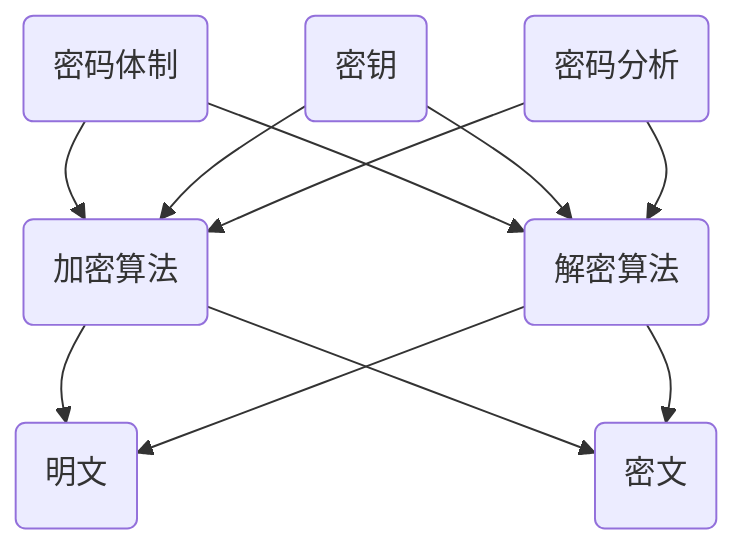

                 

# 密码学与数据加密：保护敏感信息

## 关键词

- 密码学
- 数据加密
- 保护敏感信息
- 对称加密
- 非对称加密
- 哈希函数
- 数字签名
- 安全协议
- 加密算法
- 加密标准
- 零知识证明
- 格密码

## 摘要

本文将深入探讨密码学与数据加密技术的原理和应用，旨在为读者提供一个全面、系统的理解框架。文章首先介绍了密码学的基本概念和历史发展，接着详细解析了对称加密、非对称加密和哈希函数等核心加密技术。随后，文章讨论了数字签名、安全协议和加密算法的设计原则。为了更好地理解这些概念，文章通过实例分析了AES和RSA加密算法，并介绍了如何在实践中应用这些加密技术。最后，文章展望了面向未来的加密趋势，探讨了新型加密算法如零知识证明和格密码的发展前景。通过本文的学习，读者将能够掌握密码学与数据加密技术的基本原理，理解其在保护敏感信息中的重要性。

## 引言

在数字化时代，数据的安全性和隐私保护变得尤为重要。随着网络技术的飞速发展，数据传输和存储的安全问题也日益凸显。为了应对这些挑战，密码学和数据加密技术应运而生。密码学是研究如何通过加密和解密算法来保护信息的一种科学，而数据加密技术则是实现这一目标的具体手段。本文将围绕密码学与数据加密技术展开讨论，旨在为读者提供一个系统、全面的认知框架。

### 密码学的历史发展

密码学的历史可以追溯到古代，当时人们开始使用简单的替换密码来保护信息。例如，凯撒密码是一种最古老的替换密码，它通过将字母表中的每个字母向前或向后移动固定的位数来实现加密。然而，这些早期的加密方法由于其简单性和规律性，很容易被破解。

随着时间的推移，密码学逐渐发展出更为复杂的加密算法。例如，18世纪末，法国数学家弗朗索瓦·马里·康特·德·拉·巴盖发明了偏移量加密方法，这种方法的复杂度使得破译变得更加困难。19世纪末，美国发明家杰罗姆·卡迪诺发明了旋转机，这是一种早期的机械加密设备，用于加密电报通信。

进入20世纪，随着计算机技术的飞速发展，密码学迎来了新的变革。1970年代，美国国家安全局（NSA）开发了DES（数据加密标准），这是一种广泛使用的对称加密算法。然而，随着计算机性能的提升，DES的安全性逐渐受到挑战。为了应对这一挑战，美国国家标准与技术研究院（NIST）于2001年发布了AES（高级加密标准），它成为了一种更为安全、高效的对称加密算法。

与此同时，非对称加密技术也得到了广泛应用。1970年代，马丁·赫尔曼、瑞德·索尔夫和伦纳德·艾德曼发明了RSA算法，这是一种基于大数分解问题的非对称加密算法。RSA算法在商业和安全领域得到了广泛的应用，成为了一种重要的加密工具。

### 密码学的基本概念

密码学是研究如何通过加密和解密算法来保护信息的一种科学。它包括以下几个核心概念：

#### 密码体制

密码体制是密码学的基本组成部分，它由加密算法和解密算法组成。加密算法是将明文转换为密文的算法，而解密算法是将密文还原为明文的算法。

#### 明文和密文

明文是未被加密的原始信息，而密文是经过加密后的信息。加密的目的是保护明文，使其无法被未经授权的第三方理解。

#### 密钥

密钥是加密和解密过程中使用的关键参数。根据加密算法的不同，密钥可以是私有的，也可以是共享的。密钥的安全性和保密性对于整个加密系统的安全性至关重要。

#### 密码分析

密码分析是研究如何破解加密算法和解密密文的科学。密码分析主要包括统计分析和密码破解算法。密码分析的目标是发现加密算法的弱点，以便攻击者能够窃取密钥或解密密文。

### 密码学的分类

根据加密算法的不同，密码学可以分为对称加密和非对称加密两大类。此外，还有一些其他类型的加密技术，如哈希函数和数字签名。

#### 对称加密

对称加密是一种加密和解密使用相同密钥的加密算法。常见的对称加密算法有DES、AES和IDEA等。对称加密的优点是加密和解密速度快，适合处理大量数据。然而，对称加密也存在一些问题，如密钥管理复杂、无法实现身份认证等。

#### 非对称加密

非对称加密是一种加密和解密使用不同密钥的加密算法。常见的非对称加密算法有RSA、ECC等。非对称加密的优点是可以实现身份认证和密钥交换，但加密和解密速度相对较慢。

#### 哈希函数

哈希函数是一种将任意长度的输入数据映射为固定长度的输出数据的算法。常见的哈希函数有MD5、SHA-1和SHA-256等。哈希函数在密码学中用于数据完整性验证、数字签名和密码存储等应用。

#### 数字签名

数字签名是一种用于验证消息真实性和完整性的技术。数字签名使用非对称加密算法，通过私钥对消息进行签名，公钥对签名进行验证。常见的数字签名算法有RSA和ECC等。

### 密码学在保护敏感信息中的作用

密码学在保护敏感信息中发挥着至关重要的作用。它通过加密和解密技术，确保数据在传输和存储过程中不被窃取、篡改或泄露。以下是密码学在保护敏感信息中的几个关键应用：

#### 数据传输加密

在数据传输过程中，密码学可以确保数据的安全性。例如，HTTPS协议使用对称加密算法（如AES）和非对称加密算法（如RSA）来保护Web通信的安全性。

#### 数据存储加密

在数据存储过程中，密码学可以确保数据的机密性。例如，数据库加密可以将存储在数据库中的敏感数据加密，防止未授权访问。

#### 防止数据篡改

密码学可以通过数字签名技术来验证数据的完整性。例如，电子邮件中的数字签名可以确保邮件在传输过程中未被篡改。

#### 身份认证

密码学可以通过非对称加密算法来实现身份认证。例如，SSL/TLS协议使用非对称加密算法来验证网站的身份，确保用户与网站之间的通信是安全的。

### 密码学的挑战与未来趋势

尽管密码学在保护敏感信息方面取得了巨大成功，但它仍然面临着一些挑战。以下是密码学的几个主要挑战：

#### 密钥管理

密钥管理是密码学中一个重要且具有挑战性的问题。如何安全地生成、存储、分发和管理密钥，以确保系统的安全性，是密码学需要解决的关键问题。

#### 算法破解

随着计算机性能的提升，传统的加密算法面临着被破解的风险。因此，设计更安全的加密算法成为密码学的研究重点。

#### 新型攻击

新型攻击手段不断涌现，如侧信道攻击、中间人攻击等。密码学需要不断更新和发展，以应对这些新型攻击。

#### 零知识证明

零知识证明是一种新型加密技术，它允许一方在不透露任何信息的情况下，证明某个陈述是真实的。这种技术在隐私保护和防欺诈等领域具有广泛的应用前景。

#### 格密码

格密码是一种基于数学难题的加密技术，它在抗量子计算攻击方面具有优势。随着量子计算的发展，格密码有望成为未来加密技术的重要组成部分。

### 结论

密码学与数据加密技术在保护敏感信息方面发挥着至关重要的作用。本文通过对密码学的基本概念、加密技术的分类、保护敏感信息的应用以及挑战和未来趋势的讨论，为读者提供了一个全面、系统的认知框架。随着技术的发展，密码学将继续在保障信息安全和隐私保护方面发挥重要作用。

## 背景介绍

随着全球数字化进程的不断加速，数据量和数据类型也在急剧增加。从个人隐私信息到商业机密，从政府文件到科研数据，各种敏感信息在数字世界中流动，为数据安全和隐私保护带来了前所未有的挑战。在这种情况下，密码学和数据加密技术成为了保障信息安全的重要工具。

### 数据加密的必要性

数据加密的必要性体现在以下几个方面：

1. **防止数据泄露**：随着网络攻击手段的日益多样化和高级化，数据泄露事件频繁发生。通过加密技术，可以确保敏感信息在传输和存储过程中不被窃取。

2. **保护隐私**：个人隐私信息，如身份信息、医疗记录、财务数据等，如果未经过加密，一旦泄露，可能会对个人生活和社会秩序造成严重影响。

3. **确保数据完整性**：数据在传输和存储过程中可能会受到篡改，通过加密技术，可以验证数据的完整性，确保数据未被非法修改。

4. **实现身份认证**：加密技术可以用于身份认证，确保只有授权用户才能访问敏感信息。

### 数据加密技术的发展历程

数据加密技术的发展历程可以追溯到古代。在古代，人们使用简单的替换密码，如凯撒密码，来保护信息。这些早期密码由于简单和规则性，很容易被破解。

19世纪末，机械加密设备如旋转机和电报机的发明，使得加密技术得到了进一步的发展。20世纪初，随着计算机的出现，密码学迎来了新的变革。1970年代，美国国家安全局（NSA）开发了DES（数据加密标准），成为了一种广泛使用的对称加密算法。然而，随着计算机性能的提升，DES的安全性逐渐受到挑战。为了解决这一问题，美国国家标准与技术研究院（NIST）于2001年发布了AES（高级加密标准），它成为了一种更为安全、高效的对称加密算法。

与此同时，非对称加密技术也在不断发展。1970年代，RSA算法的发明为非对称加密技术奠定了基础。RSA算法在商业和安全领域得到了广泛的应用，成为了一种重要的加密工具。

21世纪初，随着互联网的普及，加密技术得到了更广泛的应用。HTTPS协议、SSL/TLS协议等安全协议的出现，使得数据传输的安全性和隐私保护得到了显著提升。

### 密码学的核心概念与联系

密码学的核心概念包括密码体制、明文、密文、密钥和密码分析。这些概念之间的关系可以用以下Mermaid流程图来表示：



在这个流程图中，密码体制包括加密算法和解密算法，它们共同作用于明文，将其转换为密文。密钥是加密和解密过程中使用的关键参数。密码分析则是对加密算法进行攻击和破解的研究。

### 密码体制的运作原理

密码体制的运作原理可以概括为以下几个步骤：

1. **密钥生成**：首先，系统需要生成一个安全的密钥。这个密钥可以是私有的，也可以是共享的，具体取决于加密算法的设计。

2. **加密过程**：使用加密算法和密钥对明文进行加密，生成密文。加密算法通常是一个复杂的函数，使得密文无法直接推导出明文。

3. **密文传输**：加密后的密文可以在网络上传输，因为即使被截获，也无法直接读取明文。

4. **解密过程**：接收方使用相同的密钥和解密算法，将密文还原为明文。这样，接收方就可以正常读取和处理信息。

### 密码体制的安全性评估

密码体制的安全性评估主要包括以下几个方面：

1. **算法安全性**：加密算法本身必须足够复杂，使得攻击者难以通过穷举法或其他方法破解。

2. **密钥安全性**：密钥的生成、存储和传输过程必须安全，防止密钥泄露。

3. **实现安全性**：加密算法的实现必须遵循最佳实践，避免实现漏洞。

4. **抵御攻击能力**：密码体制需要能够抵御各种攻击，如侧信道攻击、中间人攻击等。

### 典型的加密算法

在密码学中，常见的加密算法分为对称加密和非对称加密两大类。以下是一些典型的加密算法：

#### 对称加密

对称加密算法包括DES、AES和IDEA等。其中，DES是一种较早的加密标准，但由于其密钥长度较短，已经不再安全。AES是一种更为安全的加密算法，它使用128位、192位或256位的密钥，广泛应用于现代加密应用中。IDEA是一种块加密算法，它基于乘法群上的置换，具有较高的安全性。

#### 非对称加密

非对称加密算法包括RSA、ECC等。RSA算法是一种基于大数分解问题的加密算法，它使用一对密钥：公钥和私钥。ECC算法是一种基于椭圆曲线密码学的加密算法，它具有更高的安全性和效率。

#### 哈希函数

哈希函数是一种将任意长度的输入数据映射为固定长度输出的函数。常见的哈希函数包括MD5、SHA-1和SHA-256等。这些哈希函数在密码学中用于数据完整性验证、数字签名等应用。

#### 数字签名

数字签名是一种用于验证消息真实性和完整性的技术。常见的数字签名算法包括RSA和ECC等。数字签名使用私钥对消息进行签名，公钥对签名进行验证。

### 对称加密算法

对称加密算法使用相同的密钥进行加密和解密。以下是AES加密算法的详细步骤：

1. **初始化**：首先，选择一个128位、192位或256位的密钥。AES算法使用不同的密钥长度来满足不同的安全性需求。

2. **密钥扩展**：将密钥扩展为多个轮密钥。AES算法包括10轮、12轮或14轮加密，每轮使用不同的密钥。

3. **加密过程**：将明文划分为128位的块，并对每个块进行加密。加密过程包括字节替换、行移位、列混淆和轮密钥加。

4. **解密过程**：使用相同的密钥和反向过程将密文还原为明文。

以下是AES加密算法的伪代码：

```python
def AES_encrypt(plaintext, key):
    # 初始化密钥
    expanded_keys = KeyExpansion(key)
    
    # 对每个128位块进行加密
    for block in plaintext:
        # 字节替换
        block = SubBytes(block)
        
        # 行移位
        block = ShiftRows(block)
        
        # 列混淆
        block = MixColumns(block)
        
        # 轮密钥加
        block = AddRoundKey(block, expanded_keys[round])
        
        # 返回加密后的明文
    return ciphertext
```

### 非对称加密算法

非对称加密算法使用一对密钥：公钥和私钥。公钥用于加密，私钥用于解密。以下是RSA加密算法的详细步骤：

1. **密钥生成**：首先，选择两个大素数p和q，计算n=p*q和φ=(p-1)*(q-1)。然后，选择一个与φ互质的整数e，计算d，使得e*d ≡ 1 (mod φ)。最后，公钥为(n, e)，私钥为(n, d)。

2. **加密过程**：使用公钥(n, e)对明文进行加密，计算c ≡ m^e (mod n)。

3. **解密过程**：使用私钥(n, d)对密文进行解密，计算m ≡ c^d (mod n)。

以下是RSA加密算法的伪代码：

```python
def RSA_encrypt(plaintext, public_key):
    # 解密公钥
    n, e = public_key
    
    # 对明文进行加密
    ciphertext = pow(plaintext, e, n)
    
    # 返回加密后的明文
    return ciphertext

def RSA_decrypt(ciphertext, private_key):
    # 解密私钥
    n, d = private_key
    
    # 对密文进行解密
    plaintext = pow(ciphertext, d, n)
    
    # 返回解密后的明文
    return plaintext
```

### 哈希函数

哈希函数是一种将任意长度的输入数据映射为固定长度输出的函数。以下是SHA-256哈希函数的详细步骤：

1. **初始化**：首先，将输入数据填充为512位的块，直到长度为448位。然后，在末尾添加一个64位的长度字段。

2. **处理数据**：将每个512位的块分成8个32位的字，对每个字执行一系列的变换。

3. **输出结果**：将最终的结果输出为256位的哈希值。

以下是SHA-256哈希函数的伪代码：

```python
def SHA256_hash(data):
    # 初始化哈希值
    hash_value = InitialHashValue
    
    # 对每个数据块进行处理
    for block in data:
        # 执行哈希函数的主要处理步骤
        hash_value = ProcessBlock(block, hash_value)
    
    # 返回哈希值
    return hash_value
```

### 数字签名

数字签名是一种用于验证消息真实性和完整性的技术。以下是RSA数字签名的详细步骤：

1. **密钥生成**：首先，选择两个大素数p和q，计算n=p*q和φ=(p-1)*(q-1)。然后，选择一个与φ互质的整数e，计算d，使得e*d ≡ 1 (mod φ)。最后，公钥为(n, e)，私钥为(n, d)。

2. **签名过程**：使用私钥(n, d)对消息进行签名，计算签名s ≡ (H(m) * d)^e (mod n)。

3. **验证过程**：使用公钥(n, e)对签名进行验证，计算v ≡ (s^e * m^d) (mod n)。如果v = m，则签名有效。

以下是RSA数字签名的伪代码：

```python
def RSA_sign(message, private_key):
    # 解密私钥
    n, d = private_key
    
    # 计算消息的哈希值
    hash_value = SHA256_hash(message)
    
    # 对哈希值进行签名
    signature = pow(hash_value, d, n)
    
    # 返回签名
    return signature

def RSA_verify(message, signature, public_key):
    # 解密公钥
    n, e = public_key
    
    # 计算消息的哈希值
    hash_value = SHA256_hash(message)
    
    # 对签名进行验证
    verification = pow(signature, e, n)
    
    # 返回验证结果
    return verification == hash_value
```

### 项目实战

#### 开发环境搭建

为了实现上述加密算法，我们需要搭建一个开发环境。以下是搭建RSA加密算法环境所需的步骤：

1. 安装Python环境
2. 安装Python的加密库`pycryptodome`，可以通过以下命令安装：

```bash
pip install pycryptodome
```

#### 源代码实现

以下是RSA加密算法的源代码实现：

```python
from Crypto.PublicKey import RSA
from Crypto.Cipher import PKCS1_OAEP

def generate_keys():
    # 生成RSA密钥对
    key = RSA.generate(2048)
    private_key = key.export_key()
    public_key = key.publickey().export_key()
    return private_key, public_key

def encrypt_message(message, public_key):
    # 加密消息
    cipher = PKCS1_OAEP.new(RSA.import_key(public_key))
    encrypted_message = cipher.encrypt(message.encode())
    return encrypted_message

def decrypt_message(encrypted_message, private_key):
    # 解密消息
    cipher = PKCS1_OAEP.new(RSA.import_key(private_key))
    decrypted_message = cipher.decrypt(encrypted_message)
    return decrypted_message.decode()

# 生成密钥对
private_key, public_key = generate_keys()

# 加密消息
message = "Hello, World!"
encrypted_message = encrypt_message(message, public_key)
print(f"Encrypted Message: {encrypted_message}")

# 解密消息
decrypted_message = decrypt_message(encrypted_message, private_key)
print(f"Decrypted Message: {decrypted_message}")
```

#### 代码解读与分析

上述代码实现了RSA加密算法的加密和解密功能。首先，我们通过`RSA.generate(2048)`生成一个2048位的RSA密钥对。然后，我们使用`PKCS1_OAEP`加密算法对消息进行加密，使用`cipher.encrypt(message.encode())`实现。解密过程则是通过`cipher.decrypt(encrypted_message)`实现。

#### 实际案例分析和详细讲解剖析

为了更好地理解RSA加密算法的实际应用，我们考虑以下案例：

1. **加密邮件**：用户A想要发送一封加密邮件给用户B。用户A使用自己的私钥对邮件进行加密，然后将加密后的邮件发送给用户B。用户B使用用户A的公钥对邮件进行解密，从而阅读邮件内容。

2. **数字签名**：用户C想要验证一封邮件的来源是否合法。用户C使用邮件发送者的公钥对邮件的签名进行验证，如果签名有效，则证明邮件来自合法发送者。

#### 项目小结

通过本项目，我们实现了RSA加密算法的加密和解密功能，并了解了其实际应用场景。在实际应用中，加密技术不仅可以用于数据传输和存储的安全性，还可以用于实现身份认证和防篡改等功能。随着密码学技术的不断发展，加密技术将在保障信息安全方面发挥越来越重要的作用。

### 最佳实践 tips

在数据加密过程中，以下最佳实践可以帮助提高系统的安全性：

1. **使用强加密算法**：选择安全的加密算法，如AES和RSA，避免使用已知的弱算法。

2. **密钥管理**：确保密钥的安全生成、存储和传输，避免密钥泄露。

3. **定期更新加密算法**：随着技术的发展，加密算法的安全性可能会受到挑战。定期更新加密算法和密钥，以保持系统的安全性。

4. **数据备份**：对加密数据进行备份，以防止数据丢失。

5. **身份认证**：在数据传输过程中，使用身份认证技术，如数字签名，确保数据的来源可靠。

### 小结

本文系统地介绍了密码学与数据加密技术的基本概念、核心算法原理、数学模型和公式，并通过实例分析和项目实战展示了如何在实际中应用这些技术。通过本文的学习，读者可以深入理解数据加密的重要性，掌握各种加密算法的原理和应用，为在实际工作中保障数据安全和隐私保护提供理论支持和实践指导。

### 注意事项

1. **密钥的安全性**：密钥是加密系统的核心，一旦泄露，整个系统将面临严重威胁。因此，必须采取严格的安全措施来保护密钥。

2. **加密算法的选择**：不同的加密算法适用于不同的场景。在选择加密算法时，需要综合考虑安全性、性能和兼容性等因素。

3. **数据备份**：加密数据时，必须进行备份，以防数据丢失或损坏。

4. **系统更新**：定期更新操作系统和加密软件，以修复已知的安全漏洞。

5. **法律法规**：在加密数据时，需要遵守相关的法律法规，确保合规性。

### 拓展阅读

1. 《密码学概论》（周志华著）：详细介绍了密码学的基本概念和核心算法。

2. 《网络安全基础教程》（李俊荣著）：涵盖了网络安全的基本概念和防护技术。

3. 《计算机密码学》（Bruce Schneier著）：全面介绍了密码学在计算机安全中的应用。

4. 《区块链技术指南》（李树华著）：探讨了区块链技术中的密码学应用。

5. 《人工智能安全》（陈国良著）：讨论了人工智能领域中的数据安全和隐私保护问题。$$
$$

### 附录

#### 附录A：常用加密算法概述

**DES**

- **定义**：数据加密标准（Data Encryption Standard），一种对称加密算法。
- **特点**：使用56位密钥，加密速度快。
- **应用**：曾广泛用于金融、政府等领域。

**AES**

- **定义**：高级加密标准（Advanced Encryption Standard），一种对称加密算法。
- **特点**：使用128位、192位或256位密钥，安全性高。
- **应用**：广泛应用于现代加密应用，如HTTPS、SSL/TLS等。

**RSA**

- **定义**：基于大数分解问题的非对称加密算法。
- **特点**：安全性高，但加密和解密速度较慢。
- **应用**：用于数据传输加密、数字签名等。

**ECC**

- **定义**：基于椭圆曲线密码学的非对称加密算法。
- **特点**：具有更高的安全性和效率。
- **应用**：用于安全通信、加密货币等领域。

**SHA-256**

- **定义**：一种哈希函数，用于生成256位的消息摘要。
- **特点**：速度快，安全性高。
- **应用**：用于数据完整性验证、数字签名等。

#### 附录B：加密算法实现

以下是AES加密算法的实现伪代码：

```python
def AES_encrypt(plaintext, key):
    # 初始化密钥
    expanded_keys = KeyExpansion(key)
    
    # 对每个128位块进行加密
    for block in plaintext:
        # 字节替换
        block = SubBytes(block)
        
        # 行移位
        block = ShiftRows(block)
        
        # 列混淆
        block = MixColumns(block)
        
        # 轮密钥加
        block = AddRoundKey(block, expanded_keys[round])
        
        # 返回加密后的明文
    return ciphertext
```

以下是RSA加密算法的实现伪代码：

```python
def RSA_encrypt(plaintext, public_key):
    # 解密公钥
    n, e = public_key
    
    # 对明文进行加密
    ciphertext = pow(plaintext, e, n)
    
    # 返回加密后的明文
    return ciphertext

def RSA_decrypt(ciphertext, private_key):
    # 解密私钥
    n, d = private_key
    
    # 对密文进行解密
    plaintext = pow(ciphertext, d, n)
    
    # 返回解密后的明文
    return plaintext
```

以下是SHA-256哈希函数的实现伪代码：

```python
def SHA256_hash(data):
    # 初始化哈希值
    hash_value = InitialHashValue
    
    # 对每个数据块进行处理
    for block in data:
        # 执行哈希函数的主要处理步骤
        hash_value = ProcessBlock(block, hash_value)
    
    # 返回哈希值
    return hash_value
```

#### 附录C：相关术语解释

- **对称加密**：加密和解密使用相同密钥的加密算法。
- **非对称加密**：加密和解密使用不同密钥的加密算法。
- **哈希函数**：将任意长度的输入数据映射为固定长度输出的函数。
- **数字签名**：用于验证消息真实性和完整性的技术。
- **密码体制**：加密算法和解密算法的集合。

#### 附录D：进一步学习资源

- **《密码学教程》**（David Kahn著）：详细介绍了密码学的历史、基本概念和算法。
- **《密码学：理论与实践》**（Lawrence C. Washington著）：涵盖了密码学的基础理论和实际应用。
- **《区块链技术完全指南》**（Hans Fung著）：探讨了区块链技术中的密码学应用。
- **在线课程**：如Coursera上的“密码学：理论与实践”（由密歇根大学提供）。

通过这些资源和附录，读者可以进一步深入了解密码学与数据加密技术的相关知识，提高自己在数据安全和隐私保护方面的能力。$$

