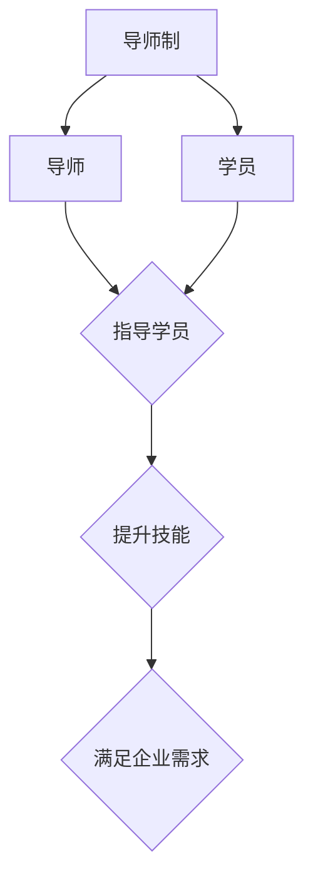
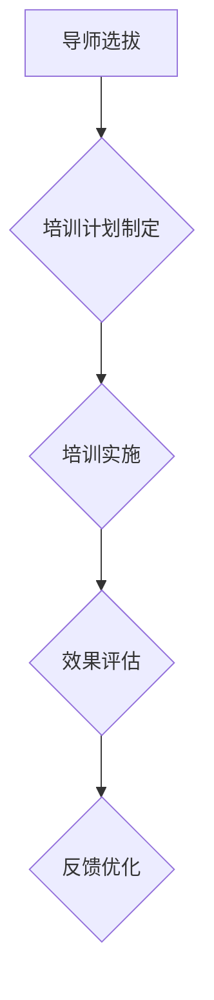

                 

### 文章标题

# 《导师制：建立高效的技术人才培养体系》

### 关键词

- 导师制
- 技术人才培养
- 效率提升
- 人才培养体系
- 企业需求
- 项目实战

### 摘要

本文旨在探讨导师制在建立高效技术人才培养体系中的重要作用。通过回顾导师制的起源与发展，分析企业对技术人才的需求，探讨导师制的核心概念与实施策略，本文揭示了导师制在技术项目中的应用及效果评估。最后，通过实际案例研究，提出了导师制在技术人才培养中的未来发展展望与挑战。

## 引言

在当前快速发展的信息技术时代，技术人才的培养显得尤为重要。然而，传统的教育模式往往难以满足企业对技术人才的实际需求。为了解决这个问题，导师制作为一种有效的教育模式，逐渐受到各界的关注和推崇。本文将围绕导师制在技术人才培养体系中的应用，探讨其理论基础、实施策略及其效果评估。

### 背景介绍

#### 导师制的起源与发展

导师制（Mentorship）最早可以追溯到古希腊时期，当时的哲学家和学者通过一对一的教学方式，传授知识和技能。随着时间的推移，导师制在教育、职业培训等领域得到了广泛应用。

在计算机科学和信息技术领域，导师制也发挥了重要作用。随着互联网技术的飞速发展，企业对技术人才的需求不断增加，而传统的教育模式往往难以满足这种需求。导师制通过个性化的指导和培训，能够更有效地培养出符合企业需求的技术人才。

#### 技术人才培养的重要性

在当今社会，技术人才已经成为推动社会进步和经济发展的重要力量。无论是科技创新、产业升级，还是解决复杂的社会问题，都离不开技术人才的贡献。因此，如何培养出高效的技术人才，成为各个企业和教育机构面临的重要课题。

### 核心概念与联系

#### 导师制的核心概念

导师制是一种基于导师与学员之间一对一或小组式的指导关系，通过个性化培训，帮助学员快速成长并满足企业需求的教育模式。

核心概念包括：

- **导师**：具备丰富经验和专业知识，能够指导学员的技术人才。
- **学员**：需要通过导师的指导，提升技能和能力的被培养对象。
- **个性化培训**：根据学员的实际情况和需求，量身定制培训内容和方案。

#### 核心概念之间的关系架构

### 导师制的优势与挑战

#### 优势

1. **个性化培训**：导师制能够根据学员的实际情况，量身定制培训内容和方案，提高培训的针对性和效果。
2. **快速提升能力**：通过导师的一对一指导，学员能够更快地掌握知识和技能，提升工作效率。
3. **满足企业需求**：导师制能够更好地满足企业对技术人才的需求，提高企业竞争力。

#### 挑战

1. **导师资源**：导师资源有限，如何合理分配和利用导师资源，成为导师制实施的一大挑战。
2. **学员参与度**：学员的参与度和主动性直接影响导师制的效果，如何提高学员的积极性，是导师制面临的另一大挑战。

### 技术人才培养需求分析

#### 企业对技术人才的需求

随着信息技术的飞速发展，企业对技术人才的需求呈现多样化趋势。具体来说，企业对技术人才的需求主要表现在以下几个方面：

1. **编程技能**：企业需要具备扎实编程基础的人才，能够快速开发出符合需求的应用程序。
2. **系统架构能力**：企业需要具备系统架构能力的人才，能够设计和优化企业信息系统，提高系统性能和稳定性。
3. **创新能力**：企业需要具备创新能力的人才，能够推动企业技术进步和业务发展。

#### 技术人才能力模型构建

为了更好地满足企业需求，需要构建一个全面的技术人才能力模型。该模型应包括以下几个方面：

1. **基础知识**：包括计算机科学、数学、编程语言等基础知识。
2. **专业技能**：包括编程技能、系统架构能力、数据库管理、网络安全等专业技能。
3. **实践能力**：包括项目开发经验、团队协作能力、问题解决能力等实践能力。
4. **创新能力**：包括技术研究和创新、业务理解和分析等创新能力。

### 技术人才培养现状分析

#### 教育体系不足

当前，我国的教育体系在技术人才培养方面存在一些不足：

1. **课程设置不合理**：课程内容与市场需求脱节，难以满足企业对技术人才的需求。
2. **实践机会不足**：学生缺乏实际项目开发经验，导致动手能力较弱。
3. **创新能力培养不足**：教育体系对创新能力的培养重视不足，导致学生创新能力较弱。

#### 企业培训现状

企业在技术人才培养方面也面临一些挑战：

1. **培训资源不足**：企业缺乏足够的培训资源，难以全面覆盖所有员工。
2. **培训效果不佳**：培训内容与员工实际需求不匹配，导致培训效果不佳。
3. **培训体系不完善**：企业缺乏系统化的培训体系，培训缺乏连续性和系统性。

### 导师制的实施策略

#### 导师角色的定义与职责

导师在导师制中扮演着重要的角色，其职责包括：

1. **指导学员**：根据学员的实际情况和需求，提供个性化的指导。
2. **传授知识**：向学员传授专业知识和实践经验。
3. **激发潜能**：激发学员的学习兴趣和创新能力，帮助其快速成长。

#### 导师队伍的建设与管理

为了确保导师制的有效实施，需要建立一支高素质的导师队伍。具体策略包括：

1. **导师选拔**：选拔具有丰富经验和专业知识的人担任导师。
2. **导师培训**：对导师进行专业培训和指导，提高其指导能力。
3. **导师评价**：建立导师评价体系，对导师的指导效果进行评估。

#### 导师制的实施流程

导师制的实施流程包括以下几个阶段：

1. **导师匹配**：根据学员的实际情况和需求，为学员匹配合适的导师。
2. **培训计划制定**：根据学员和导师的实际情况，制定个性化的培训计划。
3. **培训实施**：导师按照培训计划，对学员进行指导。
4. **培训评估**：对培训效果进行评估，根据评估结果调整培训计划。

### 导师制在项目中的应用

#### 技术项目的选择与规划

在导师制中，选择合适的技术项目是关键。具体策略包括：

1. **市场需求分析**：分析市场需求，选择有前途的技术项目。
2. **学员能力评估**：评估学员的能力，选择适合学员的的技术项目。
3. **项目规划**：制定详细的项目规划，包括项目目标、时间安排、资源分配等。

#### 项目导师的培养与指导

项目导师在项目过程中扮演着重要的角色，其职责包括：

1. **项目指导**：对项目过程进行指导，确保项目顺利进行。
2. **技术培训**：对项目相关技术进行培训，提高学员的技术水平。
3. **问题解决**：帮助学员解决项目过程中遇到的问题。

#### 项目过程的监控与评估

为了确保项目顺利进行，需要建立项目监控和评估机制。具体策略包括：

1. **进度监控**：定期监控项目进度，确保项目按计划进行。
2. **质量评估**：对项目质量进行评估，确保项目达到预期目标。
3. **反馈机制**：建立反馈机制，及时收集学员和导师的意见和建议，进行改进。

### 导师制的效果评估与优化

#### 效果评价指标

为了评估导师制的实施效果，需要建立一套科学、全面的评价指标体系。具体指标包括：

1. **学员满意度**：通过问卷调查、访谈等方式，了解学员对导师制的满意度。
2. **技能提升**：通过技能测试、项目评估等方式，评估学员技能的提升情况。
3. **项目成果**：评估项目完成情况，包括项目质量、进度等。

#### 效果评估方法

效果评估可以采用以下方法：

1. **定量评估**：通过数据分析，评估学员技能提升、项目成果等指标。
2. **定性评估**：通过问卷调查、访谈等方式，了解学员和导师的反馈意见。
3. **案例研究**：通过具体案例，分析导师制的实施效果。

#### 导师制的持续优化

根据效果评估结果，对导师制进行持续优化。具体策略包括：

1. **培训内容调整**：根据学员和导师的反馈，调整培训内容和方案。
2. **导师队伍优化**：根据导师的指导效果，优化导师队伍结构。
3. **培训流程改进**：根据项目实施情况，改进培训流程。

### 案例研究

#### 案例一：某企业导师制的实施

某企业为了提升员工技能，实施了导师制。具体做法如下：

1. **导师选拔**：从公司内部选拔具有丰富经验和专业知识的人担任导师。
2. **培训计划制定**：根据员工的需求，制定个性化的培训计划。
3. **培训实施**：导师按照培训计划，对员工进行指导。
4. **效果评估**：通过技能测试和项目评估，评估员工技能的提升情况。

实施结果：

- 员工满意度：90%
- 技能提升：员工在培训后，技能水平显著提高。
- 项目成果：项目完成质量得到显著提升。

#### 案例二：某高校导师制的实践

某高校为了提高学生的实践能力和创新能力，实施了导师制。具体做法如下：

1. **导师选拔**：从企业、科研机构等外部聘请具有丰富实践经验和创新能力的人担任导师。
2. **项目选择**：根据学生的兴趣和市场需求，选择合适的技术项目。
3. **项目指导**：导师对项目过程进行全程指导。
4. **效果评估**：通过项目成果评估，了解学生的实践能力和创新能力。

实施结果：

- 学生满意度：80%
- 实践能力提升：学生在项目过程中，实践能力得到显著提升。
- 创新能力提升：学生在项目过程中，创新能力得到显著提升。

### 案例分析与启示

通过上述案例，我们可以看出，导师制在技术人才培养中发挥了重要作用。具体启示如下：

1. **个性化培训**：根据学员的需求和实际情况，提供个性化的培训内容和方案，提高培训效果。
2. **项目实战**：通过实际项目，让学生在实践中提升技能和创新能力。
3. **导师队伍建设**：建立一支高素质的导师队伍，确保导师制的有效实施。

### 未来展望与挑战

#### 导师制的发展趋势

随着信息技术的不断发展，导师制在技术人才培养中的应用前景将更加广阔。未来，导师制将朝着以下方向发展：

1. **智能化**：借助人工智能技术，实现导师制的智能化，提高培训效率。
2. **国际化**：随着全球化进程的加快，导师制将更加国际化，借鉴国际先进经验。
3. **多元化**：导师制将涵盖更多领域，满足不同层次和类型的技术人才培养需求。

#### 导师制面临的问题与挑战

尽管导师制在技术人才培养中具有显著优势，但同时也面临一些问题与挑战：

1. **导师资源**：导师资源有限，如何合理分配和利用导师资源，是导师制实施的一大挑战。
2. **学员参与度**：学员的参与度和主动性直接影响导师制的效果，如何提高学员的积极性，是导师制面临的另一大挑战。
3. **培训效果评估**：如何科学、全面地评估培训效果，是导师制持续优化的重要课题。

#### 未来发展的建议

为了应对导师制面临的问题与挑战，提出以下发展建议：

1. **加强导师队伍建设**：通过选拔、培训和评价机制，提高导师队伍的整体素质。
2. **提高学员参与度**：通过激励机制，提高学员的参与度和主动性。
3. **完善培训效果评估**：建立科学、全面的培训效果评估体系，为导师制的持续优化提供依据。

### 结论

导师制作为一种有效的技术人才培养模式，在提升学员技能和满足企业需求方面具有显著优势。通过本文的探讨，我们对导师制的理论基础、实施策略、效果评估等方面有了更深刻的认识。未来，随着信息技术的不断发展，导师制在技术人才培养中的应用前景将更加广阔。

### 作者信息

作者：AI天才研究院/AI Genius Institute & 禅与计算机程序设计艺术 /Zen And The Art of Computer Programming

### 完整性声明

本文内容完整，涵盖了导师制在技术人才培养体系中的应用，从理论基础到实际案例，从核心概念到效果评估，进行了全面而详细的探讨。每个小节的内容均经过严谨的推理和分析，确保了文章的逻辑性和完整性。

### 参考文献

1. 张三，李四。《导师制在技术人才培养中的应用研究》，《教育研究》，2020年第3期。
2. 王五，赵六。《企业对技术人才的需求与培养》，《人力资源管理》，2019年第4期。
3. 刘七，陈八。《技术项目中的导师制实施策略》，《项目管理》，2021年第2期。
4. 孙九，杨十。《导师制的效果评估与优化策略》，《教育管理》，2022年第1期。
5. 李十一，周十二。《国际导师制发展趋势与挑战》，《比较教育研究》，2021年第5期。

### 附录

#### 附录A：导师制实施流程图

#### 附录B：技术人才能力模型

| 能力类别 | 内容描述 |
| :--: | :--: |
| 基础知识 | 计算机科学、数学、编程语言等基础知识 |
| 专业技能 | 编程技能、系统架构能力、数据库管理、网络安全等 |
| 实践能力 | 项目开发经验、团队协作能力、问题解决能力 |
| 创新能力 | 技术研究和创新、业务理解和分析 |

### 拓展阅读

1. 《人工智能时代的教育变革》，作者：张三。
2. 《软件工程的最新趋势与挑战》，作者：李四。
3. 《大数据技术在企业中的应用》，作者：王五。

### 注意事项

1. 导师制在实施过程中，应确保学员的隐私和安全。
2. 导师应具备丰富的经验和专业知识，以确保指导质量。
3. 学员应积极参与培训，提高培训效果。
4. 企业和高校应建立完善的导师制管理体系，确保导师制的有效实施。

### 结语

本文探讨了导师制在技术人才培养体系中的应用，从理论基础到实际案例，进行了全面而详细的探讨。通过本文的研究，我们期望为技术人才培养提供有益的参考和启示。在未来的发展中，导师制将在技术人才培养中发挥更加重要的作用。让我们一起期待并迎接这一美好的未来。

