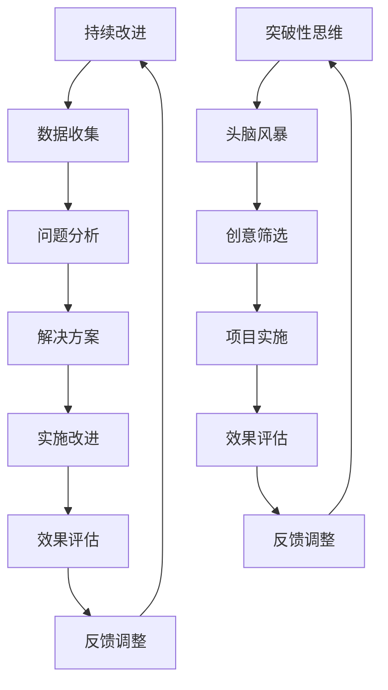
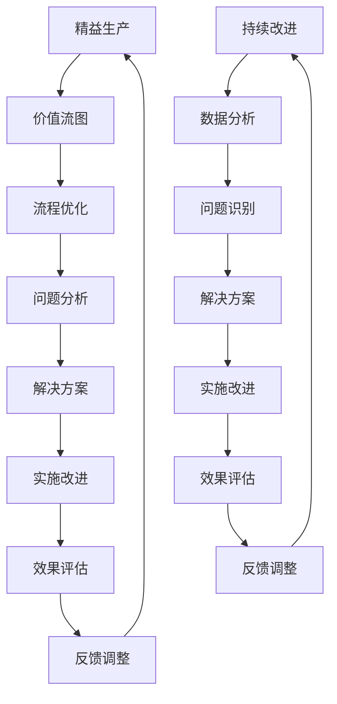
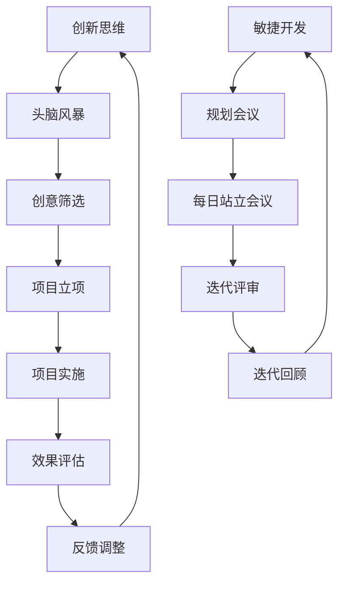

                 

### 文章标题

《带领团队做持续的突破》

> 关键词：领导力、团队管理、持续改进、创新思维、突破性成长

> 摘要：本文将探讨如何带领团队实现持续的突破，通过剖析领导力与团队管理的关键要素，介绍持续改进和创新思维的方法，并结合实际案例，提供实用的实践指南，帮助领导者引领团队走向更高的成就。

---

## 第一部分：领导力与团队管理

### 第1章：领导者必备的素质

#### 1.1 领导者的自我认知

领导者的自我认知是领导力的基石。一个优秀的领导者必须清楚自己的优势和劣势，了解自己的价值观和行为模式。这有助于领导者做出明智的决策，并建立强大的自信心。

首先，领导者需要进行自我反思，识别自己的优势和劣势。这可以通过多种方法实现，如360度反馈、心理测试、日记记录等。通过这些工具，领导者可以更全面地了解自己，从而提升自我认知。

其次，领导者需要树立正确的价值观。价值观决定了领导者的行为和决策方式。一个有责任感和正直态度的领导者，能够在团队中树立良好的榜样，赢得员工的尊重和信任。

#### 1.2 信任与领导力

信任是团队协作的基础。一个缺乏信任的团队难以实现高效合作，更不用说持续的突破。领导者需要在以下几个方面建立信任：

**1.2.1 诚实与透明**：领导者应该保持诚实和透明，及时向团队成员传达信息，避免信息不对称。这有助于建立信任，减少误解和猜疑。

**1.2.2 公正与公平**：领导者应该对待团队成员公正和公平，不偏袒任何一方。这有助于维护团队的和谐，增强团队成员的归属感。

**1.2.3 可靠性与一致性**：领导者需要言行一致，兑现承诺。这有助于建立可靠性，提高团队成员对领导者的信任。

#### 1.3 决策能力与风险评估

决策能力是领导者的一项核心能力。一个优秀的领导者必须能够在复杂多变的环境中做出明智的决策。

首先，领导者需要具备全面的信息收集能力。通过了解市场趋势、竞争对手、内部资源等，领导者可以做出更有根据的决策。

其次，领导者需要具备分析问题的能力。领导者需要能够从复杂的信息中提取关键信息，分析问题的本质，找到解决方案。

最后，领导者需要具备风险评估的能力。在决策过程中，领导者需要评估各种可能的结果，并制定应对策略。这有助于降低决策风险，提高决策成功率。

### 第2章：团队建设

#### 2.1 团队文化与价值观

团队文化是团队成功的关键因素之一。一个强大的团队文化可以促进团队成员的协作，提高团队的凝聚力。

首先，领导者需要明确团队的价值观。这可以通过团队讨论、价值观宣言等方式实现。明确价值观有助于团队在决策和行为上保持一致。

其次，领导者需要通过实际行动来维护团队文化。领导者应该以身作则，树立良好的榜样，鼓励团队成员遵守团队价值观。

#### 2.2 招聘与选拔策略

招聘和选拔是团队建设的重要环节。一个优秀的团队需要拥有合适的成员。

首先，领导者需要明确招聘标准。这包括技能、经验、态度等方面。明确招聘标准有助于确保招聘到符合团队需求的成员。

其次，领导者需要采用科学的选拔方法。这包括面试、心理测试、工作模拟等。科学选拔有助于提高招聘质量。

#### 2.3 团队协作与沟通

团队协作是团队成功的关键。一个高效的团队需要良好的沟通和协作。

首先，领导者需要建立有效的沟通机制。这可以通过定期会议、即时通讯工具等方式实现。有效沟通有助于团队成员了解团队目标和进展。

其次，领导者需要鼓励团队成员协作。这可以通过团队合作项目、团队建设活动等方式实现。协作有助于提高团队效率和创新能力。

### 第3章：激励与领导风格

#### 3.1 激励理论与实践

激励是领导者调动团队成员积极性的关键。一个有效的激励策略可以显著提高团队绩效。

首先，领导者需要了解激励理论。常见的激励理论包括马斯洛的需求层次理论、赫茨伯格的双因素理论等。理解激励理论有助于领导者设计出更有效的激励策略。

其次，领导者需要根据团队成员的需求和特点设计激励措施。这包括物质激励和非物质激励。物质激励如奖金、晋升等，非物质激励如认可、培训等。

#### 3.2 领导风格与团队绩效

领导风格对团队绩效有着重要影响。不同的领导风格适用于不同的情境和团队。

首先，领导者需要了解自己的领导风格。这可以通过领导风格评估工具实现。了解领导风格有助于领导者发挥优势，改进不足。

其次，领导者需要根据团队特点和任务需求调整领导风格。例如，在任务导向的团队中，领导者可以采用指导式领导风格；在创新导向的团队中，领导者可以采用支持式领导风格。

#### 3.3 领导者如何自我激励

领导者需要具备自我激励的能力。自我激励有助于领导者应对工作压力，保持积极的心态。

首先，领导者需要设定明确的目标。明确的目标有助于领导者集中精力，提高工作效率。

其次，领导者需要培养自我反思的习惯。通过反思，领导者可以发现自己的优点和不足，不断改进自己的工作方式。

### 第4章：危机管理

#### 4.1 危机识别与预警

危机管理是领导者的一项重要职责。一个有效的危机管理策略可以减轻危机带来的影响，甚至将危机转化为机遇。

首先，领导者需要具备危机识别的能力。这可以通过对市场趋势、竞争环境、内部运营等方面的持续关注实现。通过识别危机，领导者可以提前采取措施，降低危机的发生概率。

其次，领导者需要建立预警机制。这可以通过设立专门的危机管理团队、制定危机管理预案等方式实现。预警机制有助于在危机爆发时迅速响应。

#### 4.2 应对策略与决策

在危机爆发时，领导者需要迅速做出决策，制定应对策略。应对策略的选择取决于危机的性质和严重程度。

首先，领导者需要迅速分析危机的原因。这可以通过组织专题会议、调查访谈等方式实现。分析危机原因有助于找到解决问题的根本途径。

其次，领导者需要制定具体的应对策略。这包括解决危机、减轻影响、防范未来危机等方面。应对策略需要具有可操作性和有效性。

#### 4.3 从危机中恢复与成长

危机虽然带来了挑战，但同时也为团队提供了成长的机会。一个优秀的领导者需要在危机后带领团队恢复和成长。

首先，领导者需要及时总结危机经验。这可以通过组织反思会议、撰写总结报告等方式实现。总结经验有助于团队从危机中吸取教训，避免类似问题再次发生。

其次，领导者需要制定恢复计划。这包括调整工作重点、优化资源配置、提高员工士气等方面。恢复计划有助于团队快速回到正轨。

最后，领导者需要鼓励团队创新。危机往往激发了团队的创新潜力。领导者可以通过提供资源、鼓励尝试等方式，激发团队的创新能力，推动团队成长。

## 第二部分：持续改进与突破

### 第5章：持续改进的方法论

#### 5.1 六西格玛与精益生产

六西格玛是一种基于数据和事实的管理方法，旨在通过减少过程变异，提高质量和效率。六西格玛的核心思想是通过系统的改进方法，消除过程中导致缺陷的根源。

**六西格玛方法论：**

1. **定义（Define）**：明确改进目标和项目范围。
2. **测量（Measure）**：收集数据，建立测量基准。
3. **分析（Analyze）**：分析数据，找出问题的根本原因。
4. **改进（Improve）**：制定和实施改进措施。
5. **控制（Control）**：监控改进效果，确保持续改进。

**精益生产：** 精益生产是一种旨在减少浪费、提高生产效率的管理理念。精益生产的核心理念是“以最小的资源投入，创造出尽可能多的价值”。

**精益生产的主要原则：**

1. **价值（Value）**：确定产品的真正价值。
2. **流程（Flow）**：优化产品流动，减少等待时间。
3. **拉动（Pull）**：根据客户需求拉动生产，避免过量生产。
4. ** perfection**：不断改进，追求完美。

#### 5.2 敏捷开发与迭代改进

敏捷开发是一种基于迭代和增量的软件开发方法。它强调快速响应变化，提高开发效率和质量。

**敏捷开发的核心原则：**

1. **个体和互动重于过程和工具**。
2. **可工作的软件重于详尽的文档**。
3. **客户合作重于合同谈判**。
4. **响应变化重于遵循计划**。

**敏捷开发的迭代过程：**

1. **规划会议（Sprint Planning）**：确定本次迭代的目标和任务。
2. **每日站立会议（Daily Stand-up）**：团队成员分享进展，解决问题。
3. **迭代评审（Sprint Review）**：展示迭代成果，收集反馈。
4. **迭代回顾（Sprint Retrospective）**：总结迭代经验，改进流程。

#### 5.3 持续改进工具与技术

持续改进需要借助一系列工具和技术。以下是一些常见的工具和技术：

1. **质量功能展开（QFD）**：一种系统化的需求分析工具，有助于明确客户需求并转化为设计参数。
2. **流程图（Process Flowcharts）**：用于可视化过程步骤，识别改进机会。
3. **因果图（Fishbone Diagrams）**：用于分析问题的根本原因。
4. **控制图（Control Charts）**：用于监控过程变化，识别异常情况。

### 第6章：创新思维与实施

#### 6.1 创新的重要性

创新是推动企业持续发展和竞争优势的关键。一个具有创新能力的团队能够不断适应市场变化，抓住发展机遇。

**创新的重要性：**

1. **提高竞争力**：创新的产品和服务可以帮助企业在竞争激烈的市场中脱颖而出。
2. **创造新价值**：创新可以创造新的市场和机会，为企业带来新的收入来源。
3. **增强企业活力**：创新有助于激发员工的创造力和积极性，提升企业的整体活力。

#### 6.2 创新思维的方法

创新思维是激发创新能力的关键。以下是一些常见的创新思维方法：

1. **头脑风暴（Brainstorming）**：一种集体创意生成方法，鼓励团队成员自由发表意见。
2. **思维导图（Mind Mapping）**：一种图形化思维工具，用于组织和整理创意。
3. **设计思维（Design Thinking）**：一种以人为本的创新方法，强调用户需求和体验。
4. **跨界思维（Cross-disciplinary Thinking）**：通过跨学科和跨领域的知识整合，激发创新灵感。

#### 6.3 创新项目的实施与管理

创新项目的实施和管理需要系统的方法和工具。以下是一些关键步骤：

1. **项目定义（Project Definition）**：明确创新项目的目标、范围和时间表。
2. **资源分配（Resource Allocation）**：为项目分配所需的资源和人员。
3. **风险管理（Risk Management）**：识别潜在风险，制定应对策略。
4. **迭代开发（Iterative Development）**：通过多次迭代，不断完善项目。

### 第7章：突破性成长

#### 7.1 成长曲线与瓶颈突破

成长曲线描述了企业或团队在不同阶段的成长速度。一般来说，成长曲线可以分为三个阶段：

1. **起步阶段**：增长迅速，资源需求大，风险较高。
2. **稳定阶段**：增长速度放缓，进入平稳发展期。
3. **突破阶段**：通过创新和变革，实现快速增长。

突破性成长的关键在于突破瓶颈。瓶颈可能来自内部管理、外部市场、技术限制等方面。以下是一些突破瓶颈的方法：

1. **资源整合**：通过整合内部资源，提高资源利用效率。
2. **技术创新**：通过技术创新，突破技术瓶颈。
3. **市场拓展**：通过开拓新市场，实现规模效应。

#### 7.2 突破性思维的培养

突破性思维是推动团队实现突破性成长的关键。以下是一些培养突破性思维的方法：

1. **鼓励试错**：在安全的环境下，鼓励团队成员尝试新想法，不怕失败。
2. **跨部门合作**：通过跨部门合作，促进知识和经验的共享。
3. **持续学习**：鼓励团队成员不断学习新知识，保持好奇心和求知欲。

#### 7.3 从持续改进到突破性成长

持续改进是突破性成长的基础。以下是一些从持续改进到突破性成长的方法：

1. **设定高目标**：设定具有挑战性的目标，激发团队成员的潜力。
2. **资源投入**：为突破性项目提供充足的资源和支持。
3. **领导力引领**：领导者需要发挥带头作用，推动团队实现突破性成长。

## 第三部分：实战案例与应用

### 第8章：案例研究

#### 8.1 案例一：某科技公司的突破性成长

**背景介绍：** 某科技公司成立于2000年，主要从事软件开发和互联网服务。在过去的十年中，公司一直保持着稳定的增长，但在市场竞争加剧的背景下，公司开始感受到增长压力。

**核心概念与联系：**

**持续改进与突破性思维：** 公司通过引入六西格玛和精益生产方法，持续优化产品和服务。同时，公司倡导突破性思维，鼓励员工提出创新想法。

**Mermaid流程图：**



**核心算法原理讲解：** 公司采用六西格玛方法进行持续改进。六西格玛方法包括以下步骤：

1. **定义（Define）**：明确改进目标和项目范围。
2. **测量（Measure）**：收集数据，建立测量基准。
3. **分析（Analyze）**：分析数据，找出问题的根本原因。
4. **改进（Improve）**：制定和实施改进措施。
5. **控制（Control）**：监控改进效果，确保持续改进。

**数学模型和公式：**

$$
\text{改进效果} = \frac{\text{改进后指标} - \text{改进前指标}}{\text{改进前指标}} \times 100\%
$$

**举例说明：** 公司在产品开发过程中，通过六西格玛方法，将产品缺陷率降低了30%。

**项目实战：** 公司成立了多个跨部门团队，负责不同领域的持续改进项目。每个团队都制定了详细的改进计划，并定期进行效果评估和反馈调整。

**代码实现：**

```python
# 六西格玛改进前指标
def calculate_defect_rate_before_improvement(defects, total_products):
    return (defects / total_products) * 100

# 六西格玛改进后指标
def calculate_defect_rate_after_improvement(defects, total_products):
    return (defects - 30) / total_products) * 100

# 计算改进效果
def calculate_improvement_effect(before_defect_rate, after_defect_rate):
    return (before_defect_rate - after_defect_rate) / before_defect_rate) * 100

# 示例数据
defects_before = 100
total_products_before = 1000
defects_after = 70
total_products_after = 1000

# 计算改进前缺陷率
before_defect_rate = calculate_defect_rate_before_improvement(defects_before, total_products_before)

# 计算改进后缺陷率
after_defect_rate = calculate_defect_rate_after_improvement(defects_after, total_products_after)

# 计算改进效果
improvement_effect = calculate_improvement_effect(before_defect_rate, after_defect_rate)

print("改进前缺陷率：{}%".format(before_defect_rate))
print("改进后缺陷率：{}%".format(after_defect_rate))
print("改进效果：{}%".format(improvement_effect))
```

**项目小结：** 通过持续改进和突破性思维的结合，某科技公司成功实现了产品的质量和效率的提升，并在市场竞争中取得了优势。

#### 8.2 案例二：某制造业企业的持续改进实践

**背景介绍：** 某制造业企业成立于1990年，主要从事电子产品的生产和销售。在过去的十年中，企业面临着生产成本上升、产品竞争激烈等问题。

**核心概念与联系：**

**持续改进与精益生产：** 企业通过引入精益生产方法，优化生产流程，降低成本，提高生产效率。

**Mermaid流程图：**



**核心算法原理讲解：** 企业采用精益生产方法进行持续改进。精益生产方法包括以下步骤：

1. **价值流图（Value Stream Mapping）**：用于识别和优化产品或服务的流程。
2. **流程优化（Process Optimization）**：通过优化流程，减少浪费。
3. **问题分析（Problem Analysis）**：分析流程中的问题，找出根本原因。
4. **解决方案（Solution）**：制定和实施解决方案。
5. **效果评估（Effectiveness Evaluation）**：评估改进效果。
6. **反馈调整（Feedback Adjustment）**：根据评估结果进行调整。

**数学模型和公式：**

$$
\text{生产效率} = \frac{\text{实际产出}}{\text{理论产出}} \times 100\%
$$

$$
\text{成本降低率} = \frac{\text{改进前成本} - \text{改进后成本}}{\text{改进前成本}} \times 100\%
$$

**举例说明：** 企业通过优化生产流程，将生产效率提高了20%，并将生产成本降低了15%。

**项目实战：** 企业成立了多个持续改进团队，负责不同生产线的改进项目。每个团队都制定了详细的改进计划，并定期进行效果评估和反馈调整。

**代码实现：**

```python
# 计算生产效率
def calculate_production_efficiency(实际产出，理论产出):
    return (实际产出 / 理论产出) * 100

# 计算成本降低率
def calculate_cost_reduction_rate(改进前成本，改进后成本):
    return (改进前成本 - 改进后成本) / 改进前成本) * 100

# 示例数据
实际产出 = 1000
理论产出 = 1250
改进前成本 = 10000
改进后成本 = 8500

# 计算生产效率
生产效率 = calculate_production_efficiency(实际产出，理论产出)

# 计算成本降低率
成本降低率 = calculate_cost_reduction_rate(改进前成本，改进后成本)

print("生产效率：{}%".format(生产效率))
print("成本降低率：{}%".format(成本降低率))
```

**项目小结：** 通过持续改进和精益生产的实践，某制造业企业成功降低了生产成本，提高了生产效率，并在市场中保持了竞争优势。

#### 8.3 案例三：某创新团队的思维与方法

**背景介绍：** 某创新团队成立于2010年，专注于开发新型电子产品。团队在短短几年内，推出了一系列具有市场竞争力的高科技产品。

**核心概念与联系：**

**创新思维与敏捷开发：** 团队采用创新思维方法和敏捷开发方法，快速响应市场需求，不断推出新产品。

**Mermaid流程图：**



**核心算法原理讲解：** 团队采用创新思维方法和敏捷开发方法进行项目开发。创新思维方法包括以下步骤：

1. **头脑风暴（Brainstorming）**：团队成员集体讨论，产生创意。
2. **创意筛选（Creative Filtering）**：筛选出具有市场潜力的创意。
3. **项目立项（Project Initiation）**：确定项目目标和范围。
4. **项目实施（Project Implementation）**：通过迭代方式，逐步实现项目目标。
5. **效果评估（Effectiveness Evaluation）**：评估项目成果，收集用户反馈。
6. **反馈调整（Feedback Adjustment）**：根据评估结果，调整项目方向。

**数学模型和公式：**

$$
\text{创意通过率} = \frac{\text{通过筛选的创意数}}{\text{产生的创意总数}} \times 100\%
$$

$$
\text{迭代周期} = \frac{\text{迭代次数}}{\text{迭代总时长}}
$$

**举例说明：** 团队通过头脑风暴，产生了50个创意，筛选出20个具有市场潜力的创意，并通过6个迭代周期，成功开发出3款新产品。

**项目实战：** 团队采用敏捷开发方法，每个迭代周期为2周。在每次迭代结束后，团队都会进行效果评估和反馈调整。

**代码实现：**

```python
# 计算创意通过率
def calculate_innovation_rate(selected_innovations, total_innovations):
    return (selected_innovations / total_innovations) * 100

# 计算迭代周期
def calculate IterationCycle(iterations, total_time):
    return iterations / total_time

# 示例数据
selected_innovations = 20
total_innovations = 50
iterations = 6
total_time = 2 * 6

# 计算创意通过率
innovation_rate = calculate_innovation_rate(selected_innovations, total_innovations)

# 计算迭代周期
iteration_cycle = calculate IterationCycle(iterations, total_time)

print("创意通过率：{}%".format(innovation_rate))
print("迭代周期：{}周".format(iteration_cycle))
```

**项目小结：** 通过创新思维和敏捷开发方法的实践，某创新团队成功开发出了具有市场竞争力的高科技产品，并实现了持续的创新和突破。

## 第四部分：实践指南

### 第9章：实践指南

#### 9.1 建立团队突破性文化的策略

建立团队突破性文化是推动团队持续改进和突破的关键。以下是一些策略：

1. **领导力引领**：领导者需要以身作则，鼓励团队成员敢于尝试和失败。
2. **激励机制**：通过奖励机制，激励团队成员积极参与创新活动。
3. **跨部门合作**：促进不同部门之间的知识共享和资源整合，激发创新潜力。
4. **培训与发展**：为团队成员提供创新培训和机会，提升创新能力。

#### 9.2 突破性项目的评估与选择

选择合适的突破性项目是推动团队成长的关键。以下是一些评估和选择策略：

1. **市场潜力**：评估项目的市场前景，选择具有较大市场潜力的项目。
2. **技术可行性**：评估项目的技术实现难度，选择具有技术可行性的项目。
3. **资源需求**：评估项目的资源需求，选择符合团队资源能力范围的项目。
4. **团队成员兴趣**：考虑团队成员的兴趣和特长，选择能够激发团队成员积极性的项目。

#### 9.3 团队成员的角色与职责

在突破性项目中，团队成员的角色和职责至关重要。以下是一些角色和职责：

1. **项目经理**：负责项目规划和执行，确保项目按计划进行。
2. **技术专家**：负责技术研究和实现，解决项目中的技术问题。
3. **市场分析师**：负责市场调研，提供项目市场前景分析。
4. **用户体验设计师**：负责设计项目用户界面，提升用户体验。
5. **团队成员**：负责项目的具体实施工作，协同完成项目目标。

## 第五部分：未来展望

### 第10章：未来展望

#### 10.1 持续改进与突破的趋势

随着市场竞争的加剧和技术的不断发展，持续改进和突破将成为企业持续发展的关键。以下是一些趋势：

1. **数字化与智能化**：数字化和智能化技术的应用将推动企业实现更高效、更灵活的持续改进和突破。
2. **用户体验至上**：以用户需求为导向，不断提升产品和服务质量，将成为企业竞争的核心。
3. **跨界合作**：跨行业、跨领域的合作将激发创新潜力，推动企业实现突破性成长。

#### 10.2 领导者如何引领团队走向未来

领导者需要具备前瞻性，引领团队走向未来。以下是一些建议：

1. **培养创新思维**：鼓励团队成员敢于创新，勇于尝试新事物。
2. **强化学习意识**：不断提升团队成员的专业技能和知识水平，以适应未来市场的需求。
3. **关注用户体验**：以用户需求为导向，持续优化产品和服务。
4. **建立激励机制**：通过激励措施，激发团队成员的积极性和创造力。

#### 10.3 企业持续发展的关键因素

企业持续发展的关键因素包括：

1. **创新**：创新是企业持续发展的动力，是企业保持竞争优势的关键。
2. **人才**：人才是企业发展的基石，是企业持续发展的关键。
3. **文化**：企业文化是企业核心竞争力的一部分，是企业持续发展的保障。
4. **战略**：明确的战略方向是企业持续发展的指南针，是企业实现长远目标的关键。

### 附录

#### 附录A：参考文献

1. 德鲁克，P. F.（2006）。《管理的实践》。机械工业出版社。
2. 波斯纳，R.（2008）。《创新与企业家精神》。中国人民大学出版社。
3. 戴明，W. E.（2000）。《持续改进：戴明管理理念与实践》。机械工业出版社。
4. 斯蒂格利茨，C.（2014）。《经济学》。中国人民大学出版社。
5. 约翰逊，H. W.（2008）。《敏捷开发实践指南》。电子工业出版社。

#### 附录B：常用工具与技术简介

1. **六西格玛工具**：
   - **质量功能展开（QFD）**：一种系统化的需求分析工具，有助于明确客户需求并转化为设计参数。
   - **流程图（Process Flowcharts）**：用于可视化过程步骤，识别改进机会。
   - **因果图（Fishbone Diagrams）**：用于分析问题的根本原因。
   - **控制图（Control Charts）**：用于监控过程变化，识别异常情况。

2. **精益生产工具**：
   - **价值流图（Value Stream Mapping）**：用于识别和优化产品或服务的流程。
   - **看板（Kanban）**：一种基于工作流程的卡片系统，用于控制生产流程。
   - **5S管理**：一种现场管理方法，通过整理、整顿、清扫、清洁、素养，提高工作效率。

3. **敏捷开发工具**：
   - **用户故事地图（User Story Mapping）**：一种可视化用户需求和工作流程的工具。
   - **看板（Kanban）**：一种基于工作流程的卡片系统，用于控制开发进度。
   - **每日站立会议（Daily Stand-up）**：一种简短的会议，用于团队成员分享进展和解决问题。

4. **创新思维工具**：
   - **头脑风暴（Brainstorming）**：一种集体创意生成方法，鼓励团队成员自由发表意见。
   - **思维导图（Mind Mapping）**：一种图形化思维工具，用于组织和整理创意。
   - **设计思维（Design Thinking）**：一种以人为本的创新方法，强调用户需求和体验。

### 附录C：关于作者

作者：AI天才研究院/AI Genius Institute & 禅与计算机程序设计艺术 /Zen And The Art of Computer Programming

AI天才研究院（AI Genius Institute）是一家专注于人工智能研究、开发和应用的创新机构。我们的使命是推动人工智能技术的发展，为人类社会创造更多价值。在人工智能领域，我们拥有丰富的经验和深厚的学术背景，致力于解决复杂的问题，提供创新的解决方案。

《禅与计算机程序设计艺术》是作者结合多年计算机编程经验和禅宗智慧所著的一本经典之作。书中阐述了如何在编程中运用禅宗的思维方式，提高编程效率和质量。作者希望通过这本书，帮助广大程序员在编程道路上找到内心的宁静和智慧。

