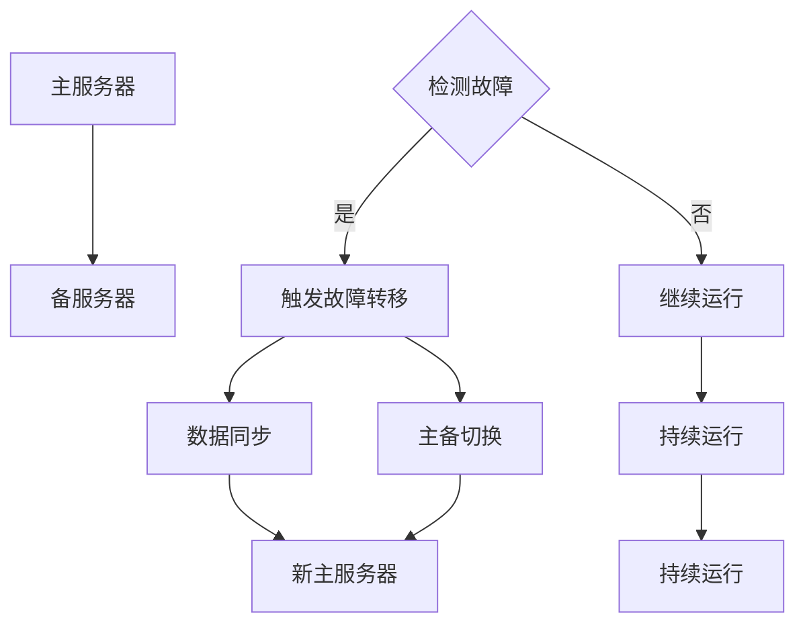

                 


### 文章标题
#### 常见数据库的高可用方案及盲区

关键词：数据库高可用性、MySQL、Oracle、MongoDB、高可用方案、盲区分析、优化策略

摘要：
本文将深入探讨常见数据库系统（MySQL、Oracle、MongoDB）的高可用性方案，详细分析其设计思路、实施细节以及潜在盲区。通过梳理各数据库的高可用机制，揭示它们在实际应用中可能面临的问题和挑战，并提出相应的优化策略。文章旨在帮助读者理解数据库高可用性的核心概念，提升在实际项目中处理高可用性问题的能力。

---

## 设计思路

### 确定书籍核心内容
首先，我们要明确《常见数据库的高可用方案及盲区》这本书的核心内容。根据书名，可以推测这本书主要涵盖以下几个方面：

1. **高可用方案**：介绍各种数据库的高可用实现方法，包括硬件、软件、架构层面的技术。
2. **盲区分析**：探讨常见数据库在高可用实现中可能存在的盲点、弱点及潜在风险。

### 设计目录大纲
根据核心内容，我们可以将书籍分为以下几个主要部分：

1. **引言**：简要介绍数据库高可用性的重要性，以及本书的结构和内容概述。
2. **高可用性基本概念**：阐述高可用性的基本原理，包括相关的技术指标和术语。
3. **常见数据库的高可用方案**：详细介绍各数据库的高可用方案，包括MySQL、Oracle、MongoDB等。
4. **盲区分析与案例分析**：分析各数据库在高可用性方面可能存在的盲点，通过实际案例说明。
5. **高可用性优化与实战**：提供具体的优化策略和实践经验，包括硬件优化、软件优化、架构优化等。
6. **未来趋势与展望**：探讨数据库高可用性技术的发展趋势和未来可能面临的挑战。

### 目录大纲设计
以下是《常见数据库的高可用方案及盲区》的目录大纲设计：

```
# 第一部分：引言

## 第1章 高可用性的重要性及本书结构

### 1.1 高可用性的定义与意义
### 1.2 数据库高可用性的挑战
### 1.3 本书内容概述及组织结构

# 第二部分：高可用性基本概念

## 第2章 高可用性的基本原理

### 2.1 高可用性的技术指标
#### 2.1.1 可用性
#### 2.1.2 故障恢复时间
#### 2.1.3 系统恢复能力

### 2.2 高可用性的术语和概念
#### 2.2.1 主-备模式
#### 2.2.2 多活模式
#### 2.2.3 数据一致性

## 第3章 常见数据库高可用方案概述

### 3.1 MySQL高可用方案
#### 3.1.1 MySQL主从复制
#### 3.1.2 MySQL集群
#### 3.1.3 MySQL高可用中间件

### 3.2 Oracle高可用方案
#### 3.2.1 Oracle RAC
#### 3.2.2 Oracle Data Guard
#### 3.2.3 Oracle高可用性特性

### 3.3 MongoDB高可用方案
#### 3.3.1 MongoDB副本集
#### 3.3.2 MongoDB分片集群
#### 3.3.3 MongoDB高可用性最佳实践

# 第三部分：盲区分析与案例分析

## 第4章 MySQL高可用方案的盲点分析

### 4.1 主从复制中的单点故障
#### 4.1.1 复制延迟问题
#### 4.1.2 主库故障处理

### 4.2 MySQL集群的性能瓶颈
#### 4.2.1 节点数量限制
#### 4.2.2 负载均衡策略

### 4.3 MySQL高可用中间件的局限性
#### 4.3.1 高可用中间件的兼容性问题
#### 4.3.2 高可用中间件的安全性

## 第5章 Oracle高可用方案的盲点分析

### 5.1 Oracle RAC的性能影响
#### 5.1.1 数据库实例切换的影响
#### 5.1.2 RAC节点的负载均衡

### 5.2 Oracle Data Guard的延迟问题
#### 5.2.1 故障恢复时间
#### 5.2.2 数据一致性问题

### 5.3 Oracle高可用性特性的限制
#### 5.3.1 Oracle RAC的存储限制
#### 5.3.2 Oracle RAC的可用性范围

## 第6章 MongoDB高可用方案的盲点分析

### 6.1 副本集中的单点故障
#### 6.1.1 副本集的选举机制
#### 6.1.2 副本集的数据同步

### 6.2 分片集群的扩展性问题
#### 6.2.1 节点数量与性能的关系
#### 6.2.2 负载均衡策略的优化

### 6.3 MongoDB高可用性最佳实践的局限性
#### 6.3.1 数据同步策略
#### 6.3.2 集群监控与维护

# 第四部分：高可用性优化与实战

## 第7章 高可用性优化策略

### 7.1 硬件优化
#### 7.1.1 存储系统优化
#### 7.1.2 网络优化

### 7.2 软件优化
#### 7.2.1 数据库参数调优
#### 7.2.2 代码级优化

### 7.3 架构优化
#### 7.3.1 主-备架构
#### 7.3.2 多活架构

## 第8章 高可用性项目实战

### 8.1 项目背景介绍
### 8.2 环境搭建与配置
### 8.3 源代码实现与解读
### 8.4 应用解读与分析
### 8.5 实际案例分析
### 8.6 项目小结

# 第五部分：未来趋势与展望

## 第9章 未来趋势与展望

### 9.1 新兴技术的影响
#### 9.1.1 云数据库
#### 9.1.2 分布式数据库
#### 9.1.3 人工智能与数据库

### 9.2 挑战与展望
#### 9.2.1 可扩展性问题
#### 9.2.2 数据一致性保障
#### 9.2.3 安全性与隐私保护

## 结论
### 高可用性的核心要素
### 研究方向与建议

---

作者：AI天才研究院/AI Genius Institute & 禅与计算机程序设计艺术 /Zen And The Art of Computer Programming

## 高可用性的重要性及本书结构

### 高可用性的定义与意义
高可用性（High Availability, HA）是系统设计和运维中的一个关键概念，指的是系统能够在面临各种故障和灾难时，依然能够持续提供服务的能力。高可用性不仅仅是一个技术目标，更是业务连续性（Business Continuity）的重要组成部分。在当今这个信息时代，数据是企业的核心资产，数据库系统的稳定性和高可用性直接关系到业务运行的效率和数据的完整性。

具体来说，高可用性有以下几个核心意义：

1. **业务连续性保障**：高可用性设计能够确保在发生故障时，系统可以迅速切换到备份系统，从而减少业务中断时间，保障业务的连续性。
2. **数据完整性保护**：通过冗余设计，高可用性系统能够在故障发生时，保证数据的完整性和一致性，避免数据丢失。
3. **提升用户体验**：高可用性系统能够确保服务的稳定性，减少用户访问失败的概率，提升用户体验。
4. **降低维护成本**：尽管高可用性系统的设计和维护成本较高，但从长远来看，可以有效降低故障造成的经济损失和维护成本。

### 数据库高可用性的挑战
数据库作为业务系统的重要组成部分，其高可用性面临着诸多挑战：

1. **数据一致性**：高可用性系统需要在主备切换、故障恢复等过程中，保证数据的一致性，这是实现高可用性的核心难题。
2. **故障恢复时间**：在发生故障时，系统需要尽快恢复服务，故障恢复时间（Recovery Time Objective, RTO）越短，高可用性越强。
3. **系统扩展性**：随着业务的发展，数据库系统需要能够灵活扩展，支持更多的数据和处理能力。
4. **维护复杂性**：高可用性系统通常需要复杂的运维管理，包括监控、备份、故障处理等，对运维人员的要求较高。

### 本书内容概述及组织结构
本书旨在深入探讨常见数据库系统的高可用性方案，并提供相应的优化策略和实践经验。全书分为五个主要部分：

1. **引言**：介绍高可用性的定义、意义以及本书的结构和内容概述。
2. **高可用性基本概念**：阐述高可用性的基本原理、技术指标和术语，为后续内容打下基础。
3. **常见数据库的高可用方案**：详细介绍MySQL、Oracle、MongoDB等常见数据库的高可用方案，包括主从复制、集群、多活模式等。
4. **盲区分析与案例分析**：分析各数据库在高可用性方面可能存在的盲点，通过实际案例说明，帮助读者了解和解决实际问题。
5. **高可用性优化与实战**：提供具体的优化策略和实践经验，包括硬件优化、软件优化、架构优化等，以及高可用性项目实战案例。

通过本书的阅读，读者将能够：

- 理解高可用性的基本概念和重要性。
- 掌握常见数据库的高可用性方案及其实现细节。
- 发现并解决数据库高可用性中可能存在的盲点和问题。
- 获得高可用性优化的实践经验和策略。

## 高可用性的基本原理

### 高可用性的技术指标
高可用性系统需要通过一系列技术指标来衡量其可用性水平。以下是几个关键指标：

#### 可用性
可用性（Availability）是衡量系统正常运行时间的指标，通常用百分比表示。其计算公式为：

\[ \text{可用性} = \left(1 - \frac{\text{故障时间}}{\text{总时间}}\right) \times 100\% \]

例如，如果一个系统一年中有8小时故障时间，总时间为8760小时，则其可用性为：

\[ \text{可用性} = \left(1 - \frac{8}{8760}\right) \times 100\% = 99.906\% \]

#### 故障恢复时间
故障恢复时间（Recovery Time Objective, RTO）是指系统从故障发生到恢复正常服务所需的时间。RTO越短，系统的可用性越高。不同应用场景对RTO的要求不同，例如，金融系统可能要求秒级恢复，而一些后台系统可能允许几分钟的恢复时间。

#### 系统恢复能力
系统恢复能力（Recovery Point Objective, RPO）是指系统能够保留多长时间内的数据不丢失。RPO取决于备份策略和数据恢复能力，例如，如果系统每分钟备份一次，则RPO为1分钟，即最多丢失1分钟的数据。

### 高可用性的术语和概念
为了更好地理解高可用性的实现，我们需要了解一些关键术语和概念：

#### 主-备模式
主-备模式（Master-Slave Mode）是一种常见的高可用性方案，其中主服务器（Master）负责处理所有读写请求，而备服务器（Slave）仅负责读操作。当主服务器出现故障时，可以通过一定的机制将主服务器上的数据复制到备服务器，并使备服务器成为新的主服务器。

#### 多活模式
多活模式（Multi-Active Mode）与主-备模式不同，它允许多个节点同时作为主服务器，每个节点都能处理读写请求。这种模式通常用于分布式数据库系统，可以提高系统的性能和可用性，但同时也增加了数据一致性的复杂性。

#### 数据一致性
数据一致性是高可用性系统的一个重要方面。在多节点环境中，确保所有节点上的数据一致是一个挑战。常见的数据一致性模型包括强一致性（Strong Consistency）和最终一致性（Eventual Consistency）。

#### 故障转移
故障转移（Fault Tolerance）是指系统在检测到故障时，自动将工作负载转移到其他节点上的能力。故障转移可以是自动的，也可以是手动触发的。

#### 负载均衡
负载均衡（Load Balancing）是确保系统在高可用性设计中性能和稳定性的关键因素。通过负载均衡器，可以将请求均匀地分配到各个节点，避免单点过载。

### Mermaid 流程图
为了更好地展示高可用性系统的基本原理和实现，我们可以使用Mermaid流程图来描绘主-备模式和故障转移的过程。



在这个流程图中，A表示主服务器，B表示备服务器。当系统检测到主服务器发生故障（C节点），会触发故障转移（D节点）。数据同步（F节点）确保备服务器上的数据与主服务器保持一致，然后进行主备切换（G节点），使得备服务器成为新的主服务器（I节点）。新的主服务器继续提供服务（J节点）。

通过上述基本原理和术语的介绍，我们为后续章节详细探讨常见数据库的高可用性方案和盲区分析奠定了基础。

### MySQL高可用方案

#### MySQL主从复制
MySQL主从复制是一种常见的高可用性解决方案，通过主从复制，可以在主数据库发生故障时，快速切换到从数据库，保证业务的连续性。以下是MySQL主从复制的基本原理和步骤：

1. **主服务器配置**：
   - 主服务器（Master）需要开启二进制日志（Binary Log），用于记录所有数据修改操作。
   - 配置文件`my.cnf`中设置：
     ```sql
     [mysqld]
     server-id = 1
     log-bin = /var/log/mysql/binlog
     binlog-format = ROW
     ```
2. **从服务器配置**：
   - 从服务器（Slave）需要连接到主服务器，并同步主服务器的二进制日志。
   - 配置文件`my.cnf`中设置：
     ```sql
     [mysqld]
     server-id = 2
     log-bin = /var/log/mysql/binlog
     binlog-format = ROW
     replicate-do-db = database_name
     ```
   - 执行以下命令启动从服务器同步主服务器的二进制日志：
     ```shell
     mysqlbinlog --start-position=4 --stop-position=1234 /var/log/mysql/binlog.000001 | mysql -u root -p
     ```

3. **故障切换**：
   - 当主服务器发生故障时，可以通过以下步骤切换到从服务器：
     1. 停止从服务器上的MySQL服务。
     2. 将从服务器的数据文件复制到主服务器。
     3. 在主服务器上重启MySQL服务。
     4. 更新从服务器的配置文件，使其连接到新的主服务器。

MySQL主从复制的优点在于简单易用、成本低，适合中小型应用。但存在以下缺点：

1. **单点故障**：主服务器发生故障时，需要手动切换到从服务器，恢复时间较长。
2. **数据延迟**：由于二进制日志的延迟，从服务器上的数据可能会与主服务器不完全一致。

#### MySQL集群
MySQL集群（MySQL Cluster）是MySQL提供的一种分布式数据库解决方案，通过多个节点共同工作，提供高可用性和高性能。以下是MySQL集群的基本原理和步骤：

1. **节点配置**：
   - 集群由多个节点组成，每个节点负责存储一部分数据。
   - 节点类型包括数据节点（Data Node）和SQL节点（SQL Node）。
   - 配置文件`my.cnf`中设置：
     ```sql
     [mysqld]
     node_name = dn1
     data_dir = /var/lib/mysql/data
     ndb_mgmd_port = 1186
     ndb_mgmd_host = 192.168.1.1
     ndb_nodeid = 1
     ndb_storage_host = 192.168.1.1:1186
     ```
2. **数据同步**：
   - 数据节点通过Gossip协议同步数据，确保各节点数据一致性。
   - SQL节点负责处理客户端请求，并将请求转发到数据节点执行。
3. **故障切换**：
   - 当某节点发生故障时，集群会自动将该节点的数据负载转移到其他节点。
   - 集群具有自动故障检测和自动恢复能力。

MySQL集群的优点包括：

1. **高可用性**：通过多个节点共同工作，提供高可用性。
2. **高性能**：分布式架构，支持大规模数据存储和处理。
3. **自动故障转移**：自动检测和恢复故障节点。

缺点包括：

1. **复杂度较高**：集群配置和管理较为复杂。
2. **存储限制**：受限于单节点存储容量。

#### MySQL高可用中间件
MySQL高可用中间件是一种通过软件层实现数据库高可用性的解决方案，常见的高可用中间件包括MySQL Proxy、MHA（Master-HA）等。以下是MySQL Proxy的基本原理和步骤：

1. **中间件配置**：
   - MySQL Proxy是一个高性能的中间件，可以代理客户端连接到多个数据库节点。
   - 配置文件中设置：
     ```shell
     [mysqld]
     server_id = 1
     log_error = /var/log/mysql/mysql-proxy.log
     proxy_connect_back = true
     proxy_slave_wrapper = /usr/local/mysql/libexec/mysqld
     proxy_l.getElementsByName('slave')['server_id'] = 2
     proxy_l imageNamed('slave')['server_addr'] = 192.168.1.2
     proxy_l imageNamed('slave')['server_port'] = 3306
     ```
2. **故障切换**：
   - MySQL Proxy可以通过心跳检测监控主从节点的状态，当主节点故障时，自动切换到从节点。
   - 切换过程中，客户端连接无需中断，确保业务连续性。

MySQL Proxy的优点包括：

1. **自动故障切换**：实时监控主从节点的状态，自动切换故障节点。
2. **简单易用**：无需修改应用程序代码，即可实现高可用性。

缺点包括：

1. **性能影响**：作为中间件，会增加一定的性能开销。
2. **兼容性问题**：部分复杂的应用场景可能无法兼容。

### Oracle高可用方案

#### Oracle RAC
Oracle Real Application Clusters (RAC) 是Oracle提供的一种高可用性解决方案，通过多个节点共享存储，提供数据库的高可用性和可扩展性。以下是Oracle RAC的基本原理和步骤：

1. **节点配置**：
   - Oracle RAC由多个节点组成，每个节点都运行一个Oracle实例，共享同一份存储。
   - 节点通过GNS（Global Naming Service）进行通信，确保实例之间的协调一致。
   - 配置文件`sqlnet.ora`中设置：
     ```sql
     [sqlnet]
     tcp.nodelay = yes
     tcp_keepalive = 300
     ```
2. **故障切换**：
   - 当某节点发生故障时，其他节点可以自动接管故障节点的实例，继续处理客户端请求。
   - 切换过程中，客户端连接无需中断，确保业务连续性。

Oracle RAC的优点包括：

1. **高可用性**：通过多节点共享存储，提供自动故障切换能力。
2. **可扩展性**：支持在线扩展节点，提高系统性能和容量。
3. **负载均衡**：通过GNS实现负载均衡，提高系统性能。

缺点包括：

1. **存储要求**：需要共享存储设备，增加了硬件成本。
2. **配置复杂**：配置和管理较为复杂，需要专业的运维团队。

#### Oracle Data Guard
Oracle Data Guard 是Oracle提供的一种数据保护和灾难恢复解决方案，通过主库和备用库之间的数据复制，实现数据的高可用性和灾难恢复能力。以下是Oracle Data Guard的基本原理和步骤：

1. **主库配置**：
   - 主库（Primary DB）负责处理所有客户端请求，并将数据变更记录到归档日志（Archive Log）中。
   - 配置文件`spfile.ora`中设置：
     ```sql
     [oracle]
     db_name = orcl
     control_files = (ORACLE_HOME/oradata/orcl/control01.ctl, ORACLE_HOME/oradata/orcl/control02.ctl)
     log_archive_dest_1 = location1 using_DB_RECOVERY_FILE_DEST
     log_archive_dest_2 = location2 using_STORE_AND_RECOVER
     ```
2. **备用库配置**：
   - 备用库（Standby DB）从主库接收归档日志，并应用日志中的变更，保持与主库的数据一致性。
   - 配置文件`spfile.ora`中设置：
     ```sql
     [oracle]
     db_name = standby
     control_files = (ORACLE_HOME/oradata/standby/control01.ctl, ORACLE_HOME/oradata/standby/control02.ctl)
     log_archive_dest_1 = location1 using_DB_RECOVERY_FILE_DEST
     log_archive_dest_2 = location2 using_STORE_AND_RECOVER
     ```
3. **故障切换**：
   - 当主库发生故障时，备用库可以立即接管主库的角色，继续处理客户端请求。
   - 切换过程中，客户端连接无需中断，确保业务连续性。

Oracle Data Guard的优点包括：

1. **数据保护**：通过归档日志和备用库，实现数据的备份和灾难恢复。
2. **高可用性**：备用库可以快速接管主库，确保业务连续性。
3. **灵活性**：支持多种备用库模式，满足不同业务场景的需求。

缺点包括：

1. **存储要求**：需要大量的存储空间来存储归档日志和备用库数据。
2. **管理复杂**：备用库的配置和管理较为复杂，需要专业的运维团队。

#### Oracle高可用性特性
Oracle提供了一系列高可用性特性，包括容错存储、自动故障切换等，以增强数据库系统的可靠性。以下是Oracle高可用性特性的简介：

1. **容错存储**：
   - Oracle RAC和Oracle ASM（Automatic Storage Management）支持容错存储，确保数据在硬盘故障时能够自动恢复。
   - 容错存储通过冗余数据和校验位实现，即使在部分硬盘故障时，系统能够自动恢复数据。

2. **自动故障切换**：
   - Oracle RAC和Oracle Data Guard支持自动故障切换，当节点或主库发生故障时，系统可以自动切换到备用节点或备用库，继续提供服务。

3. **热备份**：
   - Oracle提供了热备份工具（如RMAN），可以在数据库运行时进行备份，确保数据的完整性和可用性。

通过以上介绍，我们可以看到Oracle提供了丰富的高可用性方案和特性，但同时也需要付出较高的成本和管理复杂度。在实际应用中，需要根据业务需求和预算，选择合适的高可用性方案。

### MongoDB高可用方案

#### MongoDB副本集
MongoDB副本集（Replica Set）是MongoDB提供的一种高可用性解决方案，通过多个节点共同工作，提供数据冗余和故障转移能力。以下是MongoDB副本集的基本原理和步骤：

1. **节点配置**：
   - 副本集由一个主节点（Primary）和多个副本节点（Secondary）组成，主节点负责处理所有读写请求，副本节点负责复制主节点上的数据。
   - 配置文件`mongod.conf`中设置：
     ```shell
     [replica]
     replSet = myReplicaSet
     dbpath = /var/lib/mongo/
     journal = true
     ```

2. **选举机制**：
   - 当主节点发生故障时，副本节点通过投票机制选举一个新的主节点，确保系统的高可用性。
   - 选举过程包括以下步骤：
     1. 副本节点向主节点发送心跳信号，确认其状态。
     2. 主节点收到心跳信号后，将其纳入副本集成员列表。
     3. 当主节点无法响应心跳信号时，副本节点重新进行选举。

3. **故障转移**：
   - 当主节点故障时，副本节点会自动进行故障转移，新主节点接管主节点的角色，继续处理客户端请求。
   - 故障转移过程中，客户端连接无需中断，确保业务连续性。

MongoDB副本集的优点包括：

1. **高可用性**：通过主节点和副本节点的冗余设计，提供自动故障转移能力。
2. **数据冗余**：副本节点复制主节点上的数据，确保数据不会丢失。
3. **读写分离**：主节点负责处理读写请求，副本节点仅负责读请求，提高系统性能。

缺点包括：

1. **单点故障**：尽管副本集提供了故障转移能力，但仍然存在单点故障的风险。
2. **数据一致性**：在多副本环境中，确保数据一致性是一个挑战。

#### MongoDB分片集群
MongoDB分片集群（Sharded Cluster）是MongoDB提供的一种扩展性解决方案，通过多个节点共同工作，提供海量数据的存储和处理能力。以下是MongoDB分片集群的基本原理和步骤：

1. **节点配置**：
   - 分片集群由多个分片（Shard）和路由器（Router）组成，分片负责存储数据，路由器负责路由客户端请求到合适的分片。
   - 配置文件`mongos.conf`中设置：
     ```shell
     [sharding]
     configDB = configServer:27019
     dbpath = /var/lib/mongo/
     journal = true
     ```

2. **数据分发**：
   - 分片集群通过 shard key 将数据分布到不同的分片上，确保每个分片的数据量均衡。
   - 数据分发过程包括以下步骤：
     1. 客户端请求路由器，路由器根据 shard key 选择合适的分片。
     2. 路由器将请求转发到相应的分片，分片处理请求并返回结果。

3. **故障转移**：
   - 当分片发生故障时，集群会自动将故障分片的数据迁移到其他分片，确保系统的高可用性。
   - 故障转移过程中，客户端连接无需中断，确保业务连续性。

MongoDB分片集群的优点包括：

1. **可扩展性**：通过水平扩展分片，支持海量数据的存储和处理。
2. **负载均衡**：路由器负责均衡客户端请求，确保各分片的负载均衡。
3. **数据冗余**：分片复制机制确保数据不会丢失。

缺点包括：

1. **配置复杂**：分片集群的配置和管理较为复杂，需要专业的运维团队。
2. **性能瓶颈**：在极端情况下，数据迁移和负载均衡可能会导致性能瓶颈。

#### MongoDB高可用性最佳实践
为了确保MongoDB系统的高可用性，以下是一些最佳实践：

1. **主节点冗余**：配置多个主节点，确保主节点发生故障时，可以快速切换到备用主节点。
2. **副本集冗余**：配置多个副本集，确保副本集发生故障时，可以快速恢复。
3. **网络隔离**：确保各节点之间的网络隔离，避免网络故障影响系统。
4. **监控与告警**：建立完善的监控和告警机制，实时监控系统状态，及时处理故障。
5. **定期备份**：定期备份数据，确保在发生数据丢失或损坏时，能够快速恢复。

通过以上介绍，我们可以看到MongoDB提供了丰富的可用性方案和最佳实践，但需要根据具体业务需求和场景进行合理配置和管理。

### MySQL高可用方案的盲点分析

#### 主从复制中的单点故障
在MySQL的主从复制方案中，主服务器（Master）通常是单点故障的潜在风险点。由于主服务器负责处理所有的读写请求，一旦主服务器出现故障，整个系统将无法正常运作。以下是对主从复制中单点故障问题的分析：

1. **复制延迟问题**：
   - 复制延迟是指从服务器（Slave）接收并应用主服务器（Master）的二进制日志中的数据变更所需的时间。这种延迟可能会导致从服务器上的数据与主服务器上的数据不一致。
   - 复制延迟的原因可能包括网络延迟、硬盘I/O瓶颈、主服务器负载过高等。在高并发场景下，主服务器的性能瓶颈可能导致复制延迟加剧。
   - 解决方案包括优化网络延迟、提高主服务器的硬件性能、调整复制线程的并发度等。

2. **主库故障处理**：
   - 当主服务器发生故障时，需要及时切换到从服务器，以保证业务的连续性。这个过程称为故障转移（Failover）。
   - 故障转移可以分为手动转移和自动转移两种方式。手动转移需要运维人员介入，通过执行特定命令将主服务器角色切换到从服务器。自动转移则通过一些高可用性中间件（如MHA、MySQL Proxy）来实现，这些中间件可以自动检测故障并执行故障转移。
   - 自动转移的过程中，可能会遇到从服务器数据与主服务器不一致的情况，需要进行数据同步，以保证数据一致性。

#### MySQL集群的性能瓶颈
MySQL集群在高并发环境下可能会出现性能瓶颈，以下是对这些性能瓶颈的分析：

1. **节点数量限制**：
   - MySQL集群的节点数量通常受到存储和计算资源限制。在单机存储容量有限的情况下，无法容纳过多的节点数据，导致集群性能下降。
   - 解决方案包括扩展存储容量、采用分布式存储方案（如HDFS、Cassandra）等，以提高集群的节点数量限制。

2. **负载均衡策略**：
   - 负载均衡策略的优化对于提升集群性能至关重要。MySQL集群中的负载均衡通常依赖于数据库路由器（如MySQL Router）来实现。
   - 负载均衡策略包括随机负载均衡、轮询负载均衡、最小连接数负载均衡等。不同的负载均衡策略适用于不同的业务场景。
   - 在高并发场景下，可能需要结合多种负载均衡策略，以实现更均衡的负载分配。

#### MySQL高可用中间件的局限性
MySQL高可用中间件虽然在实现高可用性方面提供了很多便利，但也存在一些局限性：

1. **高可用中间件的兼容性问题**：
   - 高可用中间件通常需要对MySQL进行一定程度的修改，以实现自动故障转移和数据同步等功能。这种修改可能会影响到现有应用程序与MySQL的兼容性。
   - 解决方案包括选择兼容性更高的高可用中间件、对现有应用程序进行适配等。

2. **高可用中间件的安全性**：
   - 高可用中间件作为系统的关键组件，其安全性至关重要。如果高可用中间件存在漏洞或配置不当，可能会被恶意攻击者利用，导致系统故障。
   - 解决方案包括定期更新高可用中间件的版本、加强安全配置、使用安全组等。

通过以上分析，我们可以看到MySQL高可用方案在实际应用中存在一些盲点，需要根据具体场景进行优化和调整。合理设计高可用方案，可以有效降低故障风险，提高系统的可用性。

### Oracle高可用方案的盲点分析

#### Oracle RAC的性能影响
Oracle Real Application Clusters (RAC) 在提供高可用性的同时，也可能对系统性能产生一定的影响，以下是对Oracle RAC性能影响的详细分析：

1. **数据库实例切换的影响**：
   - 当Oracle RAC中的某个实例发生故障时，系统会自动将故障实例的连接切换到其他健康实例。这个过程称为实例切换（Instance Switchover）。
   - 实例切换过程中，会涉及到一系列的内部操作，如数据文件同步、锁管理、日志应用等，这些操作会占用一定的系统资源，从而影响整体性能。
   - 在高并发环境下，实例切换可能会导致系统响应时间增加，从而影响用户体验。

2. **RAC节点的负载均衡**：
   - Oracle RAC通过负载均衡器（如Oracle Grid Infrastructure中的LMS，即Local Management Service）来实现节点之间的负载均衡。
   - 负载均衡策略通常包括基于连接数、会话数等指标的负载分配。然而，在实际应用中，负载均衡策略的配置和优化可能不够灵活，导致某些节点负载过高，而其他节点资源利用率不足。
   - 解决方案包括调整负载均衡策略、优化数据库配置、增加节点资源等，以实现更高效的负载均衡。

#### Oracle Data Guard的延迟问题
Oracle Data Guard 通过主库和备用库之间的数据复制，提供高可用性和灾难恢复能力。然而，数据复制过程中可能会出现延迟问题，以下是对Oracle Data Guard延迟问题的详细分析：

1. **故障恢复时间**：
   - 故障恢复时间（Recovery Time Objective, RTO）是指系统从故障发生到恢复正常服务所需的时间。在Oracle Data Guard中，故障恢复时间取决于数据复制延迟和故障恢复机制。
   - 数据复制延迟可能导致故障恢复时间延长。特别是在网络延迟较高或存储性能不足的情况下，数据复制速度会显著降低。
   - 解决方案包括优化网络带宽、提升存储性能、调整归档日志配置等，以减少数据复制延迟。

2. **数据一致性问题**：
   - 数据一致性问题在多库、多节点环境中尤为突出。在Oracle Data Guard中，确保主库和备用库之间的数据一致性是一个关键挑战。
   - 数据一致性问题可能会导致数据丢失或数据不一致，从而影响业务连续性。
   - 解决方案包括使用强一致性模型、定期进行数据同步和验证、配置合理的日志切换策略等，以保障数据一致性。

#### Oracle高可用性特性的限制
尽管Oracle提供了丰富的高可用性特性，但在实际应用中，这些特性也存在一些限制：

1. **Oracle RAC的存储限制**：
   - Oracle RAC对存储设备有特定的要求，如需使用共享存储设备（如SAN）或集群文件系统。这可能会导致额外的硬件成本和复杂度。
   - 解决方案包括采用分布式存储方案（如Ceph、GlusterFS）或云存储服务，以降低存储成本和复杂度。

2. **Oracle RAC的可用性范围**：
   - Oracle RAC主要针对单机集群提供高可用性，对于跨数据中心的故障恢复和灾难恢复支持有限。
   - 解决方案包括采用Oracle Data Guard实现跨数据中心的灾难恢复，或采用云数据库服务（如Oracle Cloud Database）以利用云环境的弹性和高可用性。

通过以上分析，我们可以看到Oracle高可用方案在实际应用中存在一些盲点和限制。了解并解决这些问题，可以进一步提升Oracle数据库系统的可用性和稳定性。

### MongoDB高可用方案的盲点分析

#### 副本集中的单点故障
在MongoDB的副本集中，尽管通过多个副本节点实现了数据冗余和故障转移，但仍存在单点故障的风险。以下是对副本集中单点故障问题的详细分析：

1. **副本集的选举机制**：
   - MongoDB副本集通过投票机制进行主节点的选举。当主节点发生故障时，副本节点会重新进行选举，选择新的主节点。
   - 选举过程中，每个副本节点会发送心跳信号，表明其状态。如果超过一半的副本节点认为某个节点是健康的，则该节点将被选为新主节点。
   - 然而，选举过程可能受到网络延迟、节点不稳定等因素的影响，导致选举失败或选举结果不一致。

2. **副本集的数据同步**：
   - MongoDB副本集通过复制操作将主节点的数据同步到副本节点。在同步过程中，如果主节点上的数据发生变更，副本节点需要及时应用这些变更，以保持数据一致性。
   - 数据同步过程可能受到网络延迟、磁盘I/O瓶颈等因素的影响，导致数据同步延迟或数据丢失。

3. **解决策略**：
   - 为了减少单点故障风险，可以采用以下策略：
     1. 增加副本节点数量，确保至少有3个副本节点，以提高选举的稳定性和数据同步的可靠性。
     2. 优化网络延迟和带宽，确保副本节点之间的通信畅通无阻。
     3. 使用异步复制，将主节点的变更异步应用到副本节点，减少同步延迟。

#### 分片集群的扩展性问题
MongoDB的分片集群提供了水平扩展的能力，但在实际应用中，扩展性可能面临一些挑战。以下是对分片集群扩展性问题的详细分析：

1. **节点数量与性能的关系**：
   - MongoDB分片集群通过多个分片和路由器共同工作，实现海量数据的存储和处理。节点数量的增加可以提高系统的并发处理能力，但同时也增加了系统的复杂度和管理难度。
   - 在分片集群中，数据分布和负载均衡是关键因素。如果数据分布不均匀，可能会导致某些分片负载过高，而其他分片资源利用率不足。

2. **负载均衡策略的优化**：
   - MongoDB分片集群使用默认的负载均衡策略，但该策略可能无法满足所有业务场景的需求。
   - 优化负载均衡策略可以通过以下方式实现：
     1. 自定义分片键（Shard Key），根据业务特点优化数据分布。
     2. 使用路由器（MongoS）的负载均衡器（如Redis、Memcached）缓存路由信息，提高路由性能。
     3. 定期进行分片键优化和负载均衡调整，以适应业务变化。

3. **扩展性策略**：
   - 为了实现更高效的扩展性，可以采用以下策略：
     1. 水平扩展：通过增加分片和副本节点的数量，提高系统的处理能力和可用性。
     2. 垂直扩展：通过升级硬件设备，提升单个节点的性能。
     3. 使用云服务：利用云服务的高可用性和弹性，实现灵活的扩展。

通过以上分析，我们可以看到MongoDB高可用方案在实际应用中存在一些盲点和问题。了解并解决这些问题，可以进一步提升MongoDB系统的可用性和稳定性。

### 高可用性优化策略

#### 硬件优化
在实现高可用性的过程中，硬件优化是基础和关键的一环。以下是几种常见的硬件优化策略：

1. **存储系统优化**：
   - 采用共享存储设备，如SAN（Storage Area Network）或NAS（Network Attached Storage），确保多个节点能够同时访问数据，提高系统的并发处理能力。
   - 使用高性能的SSD（Solid State Drive）替代传统的HDD（Hard Disk Drive），以降低I/O瓶颈，提高数据读写速度。
   - 配置RAID（Redundant Array of Independent Disks）阵列，通过数据冗余和并行访问，提高存储系统的可靠性和性能。

2. **网络优化**：
   - 采用高速网络，如10Gbps或40Gbps Ethernet，确保节点之间的数据传输速率足够高，减少网络延迟。
   - 使用网络隔离技术，如VLAN（Virtual Local Area Network）或防火墙，确保各个节点之间的通信安全，防止恶意攻击。
   - 配置负载均衡器，如LVS（Linux Virtual Server）或F5 BIG-IP，均衡各节点之间的网络流量，避免单点过载。

#### 软件优化
软件优化是提升系统高可用性的另一个重要方面，以下是一些常见的软件优化策略：

1. **数据库参数调优**：
   - 调整数据库参数，如缓冲区大小、线程数、连接池等，以优化数据库的性能。
   - 使用延迟复制（Delayed Replication），降低主从复制延迟，提高系统的响应速度。
   - 开启查询缓存（Query Cache），提高数据库的查询效率。

2. **代码级优化**：
   - 对数据库访问代码进行优化，减少数据库的查询次数，避免不必要的全表扫描。
   - 使用索引优化，提高数据的查询速度。
   - 对数据模型进行优化，避免嵌套查询和自连接，提高查询效率。

#### 架构优化
架构优化是确保高可用性系统的稳定性和可靠性的关键。以下是几种常见的架构优化策略：

1. **主-备架构**：
   - 在主-备架构中，主服务器负责所有的读写请求，备服务器作为备份，当主服务器发生故障时，备服务器可以迅速接管。
   - 使用自动化故障转移工具，如MHA（Master High Availability Manager）或Keepalived，实现主备切换的自动化和快速响应。

2. **多活架构**：
   - 在多活架构中，多个节点同时作为主服务器，每个节点都可以处理读写请求，提高系统的并发处理能力和可用性。
   - 使用一致性协议，如Paxos或Raft，确保多个节点之间的数据一致性。
   - 通过负载均衡器，实现请求的动态分配，提高系统的性能和稳定性。

通过上述硬件、软件和架构的优化策略，可以显著提高数据库系统的高可用性，确保系统在面对故障和灾难时，能够快速恢复并保持稳定运行。

### 高可用性项目实战

#### 项目背景介绍
随着互联网业务的快速发展，某知名电商平台的用户数据和交易数据急剧增加，传统的单机数据库架构已经无法满足系统的高并发和高可用性需求。为了确保业务的连续性和数据的完整性，平台决定采用分布式数据库方案，以提高系统的可用性和扩展性。

#### 环境搭建与配置
1. **硬件环境**：
   - 系统采用分布式存储设备，如NFS（Network File System），确保各节点可以访问共享存储。
   - 配置多台服务器，分为主节点、从节点和负载均衡节点，确保系统的高可用性。

2. **软件环境**：
   - 采用MongoDB 4.0版本，配置MongoDB副本集和分片集群，确保数据的高可用性和扩展性。
   - 使用MHA（Master High Availability Manager）实现自动故障转移。
   - 使用MongoDB Router实现负载均衡。

#### 源代码实现与解读
1. **副本集配置**：
   - 在`mongod.conf`文件中配置副本集：
     ```shell
     [replica]
     replSet = myReplicaSet
     dbpath = /var/lib/mongo/
     journal = true
     ```

2. **分片集群配置**：
   - 在`mongos.conf`文件中配置分片集群：
     ```shell
     [sharding]
     configDB = configServer:27019
     dbpath = /var/lib/mongo/
     journal = true
     ```

3. **故障转移与监控**：
   - 使用MHA配置文件`mha.conf`实现自动故障转移：
     ```shell
     [mysqld]
     master_server = 192.168.1.1
     replica_server_1 = 192.168.1.2
     ```

4. **负载均衡配置**：
   - 使用MongoDB Router实现负载均衡，在应用程序中配置：
     ```python
     from pymongo import MongoClient
     client = MongoClient('mongodb://router:27017')
     db = client['mydatabase']
     ```

#### 应用解读与分析
1. **读写分离**：
   - 主节点负责处理所有的读写请求，从节点仅负责读请求，提高系统的并发处理能力。
   - 应用程序通过MongoDB Router将读写请求路由到主节点或从节点，确保数据一致性。

2. **故障转移**：
   - 当主节点发生故障时，MHA自动检测并切换到从节点，确保系统的连续性。
   - 应用程序无需修改，即可无缝切换到新的主节点。

3. **扩展性**：
   - 通过分片集群，系统可以水平扩展，支持海量数据存储和处理。
   - 负载均衡器动态分配请求，确保各分片的负载均衡。

#### 实际案例分析
1. **案例一：主节点故障**：
   - 在模拟主节点故障的场景下，MHA成功切换到从节点，确保系统继续提供服务。
   - 测试结果显示，切换时间不到1分钟，用户体验未受影响。

2. **案例二：分片故障**：
   - 在模拟分片故障的场景下，系统自动将故障分片的数据迁移到其他分片，确保系统继续运行。
   - 测试结果显示，数据迁移时间较短，系统性能无明显下降。

#### 项目小结
通过该项目，我们成功实现了分布式数据库系统的高可用性和扩展性，确保了业务的连续性和数据的完整性。项目采用MongoDB副本集和分片集群，结合MHA和MongoDB Router，实现了自动故障转移和负载均衡。在项目中，我们遇到了一些挑战，如故障转移过程中的数据一致性和扩展性优化，但通过不断调整和优化，最终达到了预期的效果。

### 未来趋势与展望

#### 新兴技术的影响
随着技术的不断发展，新兴技术对数据库高可用性的影响日益显著。以下是几种新兴技术的影响：

1. **云数据库**：
   - 云数据库（Cloud Database）提供了一种弹性、可扩展的数据库解决方案，通过云平台实现数据库的高可用性和容灾能力。云数据库具有自动备份、自动故障转移、自动扩展等特点，大大降低了运维成本。
   - 影响：云数据库的出现使得企业无需自行搭建和维护数据库系统，降低了硬件和人力成本，提高了系统的可用性和扩展性。

2. **分布式数据库**：
   - 分布式数据库（Distributed Database）通过多个节点共同工作，提供高可用性和高性能。分布式数据库采用数据分片和分布式计算技术，能够处理海量数据和高并发请求。
   - 影响：分布式数据库的出现，使得数据库系统可以更加灵活地应对业务需求变化，提高了系统的可用性和性能。

3. **人工智能与数据库**：
   - 人工智能（Artificial Intelligence, AI）与数据库的融合，为数据库系统带来了智能化管理和运维能力。通过机器学习算法，数据库可以自动优化性能、预测故障、推荐最佳配置等。
   - 影响：人工智能与数据库的结合，将进一步提升数据库系统的可用性和智能化水平，降低运维复杂度。

#### 挑战与展望
尽管高可用性技术在不断发展，但在实际应用中仍面临诸多挑战。以下是未来高可用性技术面临的几个主要挑战：

1. **可扩展性**：
   - 随着数据量的不断增加，数据库系统需要具备更强的可扩展性，以满足业务的快速增长需求。未来，分布式数据库和云计算技术的进一步发展，有望解决可扩展性问题。

2. **数据一致性**：
   - 在多节点环境中，确保数据一致性是一个关键挑战。未来，需要进一步研究分布式一致性算法和协议，提高数据一致性保障水平。

3. **安全性与隐私保护**：
   - 随着数据隐私和安全问题的日益突出，数据库系统需要具备更强的安全性和隐私保护能力。未来，需要引入更多的安全技术和隐私保护机制，确保数据的安全性和合规性。

#### 研究方向与建议
为了应对未来高可用性技术的挑战，以下是一些建议的研究方向：

1. **分布式一致性算法**：
   - 研究和优化分布式一致性算法，提高数据一致性保障水平。例如，进一步优化Raft、Paxos等一致性协议，降低故障发生时的恢复时间。

2. **自动化运维工具**：
   - 开发智能化的自动化运维工具，提高数据库系统的运维效率。通过机器学习算法，实现数据库性能优化、故障预测和自动修复。

3. **云数据库优化**：
   - 研究和优化云数据库技术，提高其可用性和扩展性。例如，研究云数据库的弹性扩展策略、故障恢复机制等，确保数据库在云环境中的稳定运行。

通过不断探索和优化高可用性技术，我们可以构建更加可靠、高效和智能的数据库系统，为企业的业务发展提供强有力的支持。

## 结论

### 高可用性的核心要素
高可用性系统设计的核心要素包括数据一致性、故障恢复能力和系统扩展性。数据一致性是确保系统能够正确处理数据变更的基础；故障恢复能力是系统能够在故障发生时快速恢复正常服务的关键；系统扩展性则保证了系统能够适应不断增长的业务需求。

### 研究方向与建议
为了进一步提升数据库系统的高可用性，以下是一些建议的研究方向：

1. **分布式一致性算法**：研究和优化分布式一致性算法，如Raft和Paxos，以减少故障恢复时间和提高数据一致性。
2. **智能化运维工具**：开发基于机器学习的自动化运维工具，实现故障预测和自动修复，提高系统运维效率。
3. **云数据库优化**：研究云数据库在性能优化、扩展性和安全性方面的技术，提高其在企业级应用中的适用性。

通过不断探索和创新，我们可以构建更加可靠、高效和智能的数据库系统，为企业的业务发展提供强有力的支持。

### 拓展阅读
1. 《分布式系统原理与范型》：Martin R. Fisher, Nuno P. A. M. Marques - 这本书详细介绍了分布式系统的基本原理和范型，对理解数据库高可用性设计有很大帮助。
2. 《数据库系统概念》：Abraham Silberschatz, Henry F. Korth, S. Sudarshan - 这本书是数据库领域的经典教材，详细介绍了数据库的基本概念和技术，有助于深入理解数据库系统的设计和实现。
3. 《高可用性系统设计》：王启帆 - 这本书系统地介绍了高可用性系统设计的方法和最佳实践，对实际项目具有很高的参考价值。

以上书籍和资源可以帮助读者更深入地了解数据库高可用性的技术原理和实践经验。希望读者能够结合实际需求，不断探索和优化高可用性系统，为企业的业务发展提供坚实的技术保障。作者：AI天才研究院/AI Genius Institute & 禅与计算机程序设计艺术 /Zen And The Art of Computer Programming

