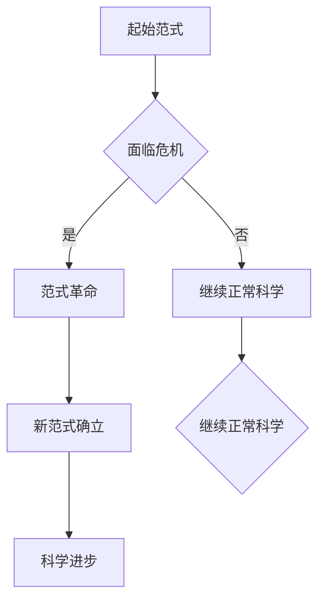

                 


### 1.1 科学哲学的基本概念

科学哲学是研究科学知识的本质、科学方法的合理性和科学进步的机制的哲学分支。它探讨科学与哲学之间的关系，试图回答关于科学理论的真伪、科学方法的可靠性以及科学哲学在不同领域中的适用性等问题。

**科学哲学的定义**：科学哲学可以被定义为对科学实践、科学理论和科学知识的系统性反思。它不仅关注科学理论本身，还关注科学方法、科学证据、科学假说以及科学推理等科学活动的基本要素。

**科学哲学的历史发展**：科学哲学的历史可以追溯到古希腊时期，但作为一个独立的哲学分支，它主要在20世纪得到迅速发展。在这一时期，哲学家们开始对科学理论的本质和方法论进行深入的探讨。科学哲学的主要发展分为几个阶段：

- **早期科学哲学（17-18世纪）**：这一时期的代表性人物包括牛顿和莱布尼茨，他们提出了经典力学和微积分，对科学方法进行了初步探讨。
- **科学哲学的黄金时代（19-20世纪）**：这一时期的代表性人物包括卡尔·波普尔、托马斯·库恩和保罗·费耶阿本德，他们提出了新的科学哲学观点，如波普尔的证伪主义和库恩的范式理论。
- **现代科学哲学（20世纪末-21世纪）**：这一时期的科学哲学更加关注科学知识的建构过程，以及科学与社会的关系。

**科学哲学的主要分支**：科学哲学主要分为以下几个分支：

- **科学认识论**：研究科学知识的性质、来源和可靠性。
- **科学方法学**：探讨科学方法的有效性和科学研究的最佳实践。
- **科学逻辑**：研究科学推理和科学证明的逻辑结构。
- **科学社会学**：研究科学知识在社会中的传播、应用和影响。

**科学哲学的核心问题**：科学哲学的核心问题包括以下几个方面：

- **科学知识如何构建？**：科学哲学探讨科学知识是如何通过观察、实验、理论构建和验证等步骤产生的。
- **科学方法的有效性？**：科学哲学探讨科学方法是否能够提供可靠和有效的知识。
- **科学解释与预测**：科学哲学探讨科学理论如何解释自然现象并进行预测。

### 1.2 科学哲学的核心问题

在科学哲学中，有几个核心问题长期以来备受关注。这些核心问题不仅决定了科学哲学的研究方向，也深刻地影响了科学实践和科学发展。

**科学知识如何构建？**

科学知识的构建是一个复杂的过程，它涉及到观察、实验、理论构建和验证等多个环节。具体来说：

- **观察**：科学知识的构建始于观察。观察是通过感官或科学仪器收集关于自然现象的信息。
- **实验**：实验是对观察结果的进一步验证。通过控制变量和重复实验，科学家可以检验假设和理论。
- **理论构建**：在观察和实验的基础上，科学家会提出理论来解释观察到的现象。这些理论通常是基于数学模型和逻辑推理。
- **验证**：科学理论的验证是通过实验和观察来进行的。如果理论能够成功地解释和预测新现象，它就会被接受。

**科学方法的有效性？**

科学方法的有效性是科学哲学中的一个重要议题。科学方法通常被认为是一种通过系统、重复和验证来获得可靠知识的过程。以下是对科学方法有效性的几个讨论点：

- **客观性**：科学方法试图通过控制变量和消除偏见来确保实验结果的客观性。
- **可重复性**：科学实验的可重复性是验证科学理论的重要手段。如果其他科学家在相同条件下无法重复实验结果，那么该结果的可信度就会受到质疑。
- **透明性**：科学方法的透明性意味着实验的设计、执行和结果都应该公开透明，以便其他科学家进行审查和验证。

**科学解释与预测**

科学解释和预测是科学理论的重要功能。科学理论不仅要解释过去的现象，还要预测未来的现象。以下是关于科学解释与预测的一些讨论点：

- **解释**：科学解释是指用科学理论来解释自然现象。一个好的科学解释应该简洁、准确，并且能够涵盖广泛的观察数据。
- **预测**：科学预测是指根据科学理论来预测未来可能发生的事件。科学预测的成功是验证科学理论的重要指标。例如，牛顿的万有引力定律不仅解释了行星运动，还成功预测了海王星的存在。

**科学哲学的核心问题不仅影响了科学哲学的理论探讨，也对科学实践和科学发展产生了深远影响。通过不断探讨这些核心问题，科学家和哲学家用理性思维推动科学的进步。**

---

### 2.1 库恩的范式理论

托马斯·库恩（Thomas S. Kuhn）是20世纪最具影响力的科学哲学家之一，他的范式理论（paradigm theory）对科学哲学产生了深远的影响。库恩认为，科学的发展并不是线性进步的过程，而是通过“范式转变”（paradigm shift）实现的。

**范式的概念**：范式是一个科学共同体（scientific community）在某一时期内普遍接受的科学研究模式。它包括了一系列的基本假设、理论、方法和价值观。范式为科学家提供了一个共同的语言和框架，使他们能够在特定的问题领域内进行有效的研究。

**范式的演变**：库恩指出，范式并不是永恒不变的，而是随着时间的推移不断演变的。科学的发展往往是从一个范式到另一个范式的转变。这种转变通常是由于现有范式无法解释新的观察现象或实验结果，导致科学共同体的成员开始寻求新的理论和方法。

**范式转变的机制**：库恩认为，范式转变是一个复杂的过程，通常包括以下几个阶段：

1. **危机（Crisis）**：当现有范式遇到无法解释的新现象或实验结果时，科学共同体会陷入危机。这种危机通常会导致对现有范式的质疑和不满。
2. **革命（Revolution）**：在危机的基础上，一些科学家开始提出新的理论或方法，试图解决现有范式的问题。这些新的理论和方法通常与现有范式存在显著差异，形成了一种“革命”。
3. **范式转变（Normal Science）**：当新的理论或方法被科学共同体接受，并且取代了原有的范式后，科学就会进入一个新的稳定时期，这一时期被称为“范式转变期”。

库恩的范式理论强调了科学发展的非线性和间断性。与传统的科学观不同，库恩认为科学进步并不是简单的累积过程，而是在范式转变中实现的。这种观点挑战了科学进步的线性模式，为我们理解科学的发展提供了新的视角。

---

### 2.2 库恩对科学进步的看法

托马斯·库恩对科学进步的看法与传统的线性进步模式有显著不同。他认为，科学进步并不是一个连续、线性的过程，而是通过“范式转变”实现的。

**科学进步的模式**：库恩提出，科学进步的模式是“范式—反范式—范式”的循环。这意味着科学的发展并不是一帆风顺的，而是经历了一系列的波动和转变。在某一时期，科学界普遍接受一种范式，这种范式主导了科学研究和理论构建。然而，当遇到无法解释的新现象或实验结果时，科学界会进入“危机”期，这时科学家们开始质疑现有的范式，并探索新的理论和方法。如果新的理论和方法被广泛接受，科学界就会进入一个新的稳定时期，这就是“范式转变”期。

**科学革命的发生**：库恩认为，科学革命是范式转变的核心。科学革命不仅涉及到科学理论的变革，还涉及到科学方法和价值观的转变。科学革命通常是由一些富有创新精神的科学家发起的，他们挑战现有的范式，提出新的理论和方法。这些新的理论和方法最初可能被视为异端，但随着时间的推移，如果它们能够成功地解释和预测新的现象，最终会被科学界广泛接受。

**科学知识的累积与淘汰**：在库恩的视角下，科学知识的累积并不是简单的叠加过程，而是通过范式转变实现的。旧的范式会被淘汰，新的范式会取代它们。这种淘汰并不是因为旧范式完全错误，而是因为它们无法解释新的现象或提供更好的解释。库恩强调，科学知识的积累是一个动态、不断变化的过程，它涉及到理论的竞争和筛选。

库恩对科学进步的看法挑战了传统的科学观，为我们理解科学的发展提供了新的视角。他认为，科学进步并不是一条直线，而是一个波浪式前进的过程，科学革命是推动科学发展的关键力量。

---

### 3.1 反传统科学哲学

保罗·费耶阿本德（Paul Feyerabend）是20世纪另一位极具争议性的科学哲学家，他的反传统科学哲学观点对科学哲学产生了深远的影响。费耶阿本德认为，传统科学哲学过于强调科学方法的规范性和科学理论的理性基础，这限制了科学的多样性和创造力。

**科学方法的多元性**：费耶阿本德认为，科学方法并不是一种固定的、规范化的过程，而是多种多样的。他提出了“反方法论”（against methodology）的观点，认为科学方法应该更加灵活和开放，允许各种方法共存。费耶阿本德认为，科学方法的选择应该取决于具体的问题和情境，而不是一套固定的规则。

**科学理论的可替代性**：费耶阿本德质疑了科学理论的唯一性。他认为，科学理论并不是唯一正确的解释，而是有多种可能的理论可以解释同一现象。费耶阿本德主张，科学家应该开放地接受各种理论，而不是仅仅局限于一种“正确”的理论。

**科学实践的相对主义**：费耶阿本德提出了科学实践的相对主义观点，认为科学知识并不是客观的、普遍的，而是受到特定文化和社会背景的影响。他批评了科学哲学中的客观主义和理性主义，认为科学实践更应该关注其实用性和有效性。

费耶阿本德的反传统科学哲学挑战了传统科学哲学的基本假设，为我们重新思考科学方法、科学理论和社会影响提供了新的视角。

---

### 3.2 费耶阿本德对科学哲学的贡献

保罗·费耶阿本德是20世纪最具创新性的科学哲学家之一，他对科学哲学的贡献具有深远的影响。费耶阿本德的观点不仅挑战了传统的科学方法论，还为科学哲学的发展提供了新的思路。

**对库恩范式理论的挑战**：费耶阿本德对托马斯·库恩的范式理论提出了强烈的批评。他认为库恩的范式概念过于僵化，限制了科学的多样性和创新性。费耶阿本德认为，科学应该更加开放和灵活，而不是局限于特定的范式。他主张，科学应该允许各种方法、理论和观点共存，而不是通过范式转变来筛选。

**科学哲学中的理性主义与怀疑主义**：费耶阿本德批判了科学哲学中的理性主义，认为科学并不是基于绝对的理性，而是受到文化和社会因素的影响。他提出了科学哲学中的怀疑主义观点，认为科学知识并不一定是客观的，而是受到主观解释的影响。费耶阿本德强调，科学应该关注其实用性和有效性，而不是追求绝对的真理。

**科学哲学的未来方向**：费耶阿本德对科学哲学的未来方向提出了自己的看法。他认为，科学哲学应该更加关注科学实践，而不是仅仅停留在理论探讨。他主张，科学哲学应该关注科学与社会的关系，探讨科学对社会的影响。费耶阿本德认为，科学哲学应该更加开放和包容，允许不同的观点和方法共存，从而推动科学的多样性和创新性。

费耶阿本德对科学哲学的贡献在于他挑战了传统科学哲学的基本假设，提出了新的视角和思考方式。他的观点为科学哲学的发展注入了新的活力，推动了科学哲学从传统的理性主义走向更加多元和开放的视角。

---

### 4.1 库恩与费耶阿本德观点的异同

托马斯·库恩和保罗·费耶阿本德都是20世纪科学哲学的重要代表人物，他们的观点虽然存在显著差异，但也有一些共同点。

**对科学方法的看法**：

- **相同点**：库恩和费耶阿本德都批评了传统科学哲学中对科学方法的过度规范化。他们都认为科学方法应该更加灵活和开放，允许多种方法共存。

- **不同点**：库恩强调范式的概念，认为科学共同体在某一时期内会普遍接受一种范式，这种范式主导了科学研究和理论构建。而费耶阿本德则认为，科学方法应该是多元的，不应该局限于特定的范式。

**科学进步的本质**：

- **相同点**：两位哲学家都认为科学进步不是线性的，而是通过范式转变或革命实现的。

- **不同点**：库恩强调科学进步的间断性和波动性，他认为科学革命是科学发展的关键。而费耶阿本德则认为，科学进步应该更加注重实用性和有效性，而不是追求绝对的真理。

**科学知识的性质**：

- **相同点**：两位哲学家都认为科学知识是动态的、不断变化的，而不是一成不变的。

- **不同点**：库恩认为科学知识的发展是通过范式转变实现的，旧范式会被淘汰，新范式会取代它们。而费耶阿本德则认为，科学知识受到文化和社会背景的影响，具有相对性。

尽管两位哲学家的观点存在差异，但他们的共同贡献在于挑战了传统科学哲学的基本假设，为我们重新思考科学方法、科学理论和社会影响提供了新的视角。

---

### 4.2 两位哲学家的互动与影响

托马斯·库恩和保罗·费耶阿本德是20世纪科学哲学领域的两位重要人物，他们的思想和观点对科学哲学产生了深远的影响。尽管他们之间存在一定的分歧，但他们的互动与影响是科学哲学发展历程中的重要篇章。

**库恩对费耶阿本德观点的回应**：费耶阿本德的观点对库恩的范式理论提出了直接的挑战。费耶阿本德质疑库恩关于范式转变的描述，他认为库恩的理论过于僵化，限制了科学的多样性和创新性。费耶阿本德认为，科学方法应该是多元的，而不是局限于特定的范式。面对费耶阿本德的批评，库恩则认为费耶阿本德的观点过于极端，他没有充分认识到范式转变的复杂性和科学共同体的共识作用。

**费耶阿本德对库恩范式理论的批评**：费耶阿本德对库恩的范式理论提出了几个关键批评。首先，他质疑库恩关于范式转变的描述是否真的反映了科学实践。其次，他认为库恩的范式概念过于抽象，缺乏具体的操作意义。最后，费耶阿本德认为，库恩的理论忽视了科学与社会的关系，没有充分考虑到科学知识的社会建构过程。

尽管两位哲学家的观点存在分歧，但他们的互动和辩论推动了科学哲学的发展。库恩的范式理论为科学哲学提供了一种新的视角，使我们重新思考科学知识的构建和科学进步的机制。而费耶阿本德的批评则提醒我们，科学哲学应该更加关注科学方法的多元性、科学知识的相对性和科学实践的社会性。

**两位哲学家的共同贡献**：库恩和费耶阿本德的共同贡献在于挑战了传统科学哲学的基本假设，推动了科学哲学从理性主义向多元主义的转变。他们的思想和观点为我们提供了重新思考科学方法、科学理论和科学与社会关系的契机。他们的工作不仅丰富了科学哲学的理论体系，也为我们理解科学实践提供了新的视角。

通过库恩和费耶阿本德的互动与影响，科学哲学在20世纪取得了显著的进展。他们的思想继续影响着今天的科学哲学研究，为科学哲学的未来发展奠定了坚实的基础。

---

### 5.1 对科学实践的影响

库恩和费耶阿本德的观点对科学实践产生了深远的影响。他们的思想不仅挑战了传统的科学方法论，还为科学家在研究过程中提供了新的视角和工具。

**科学研究的转变**：库恩的范式理论揭示了科学研究的非线性和间断性。科学家们开始意识到，科学研究不仅仅是积累知识的过程，更是一个不断质疑和重构知识的过程。费耶阿本德强调科学方法的多元性，鼓励科学家在研究中采用多种方法，这有助于提高研究的灵活性和创造性。

**科学教育的改革**：库恩和费耶阿本德的观点对科学教育产生了重要影响。科学教育不再仅仅局限于传授科学知识，而是更加注重科学思维和科学方法的教育。科学课程开始强调批判性思维、问题解决和创新性。此外，科学教育也关注科学与社会的关系，培养学生的社会责任感和科学素养。

**科学政策的制定**：库恩和费耶阿本德的思想为科学政策制定提供了新的参考。科学政策需要考虑到科学研究的复杂性和多样性，避免过度规范化和一刀切的做法。政策制定者开始重视科学共同体的共识和科学方法的多元性，以确保科学研究的健康发展。

库恩和费耶阿本德的观点对科学实践的影响是深远和持久的。他们的思想不仅丰富了科学哲学的理论体系，也为科学实践提供了新的指导，推动了科学研究的不断进步。

---

### 5.2 对未来科学哲学的思考

在科学哲学的发展历程中，库恩和费耶阿本德的观点为我们重新思考科学哲学的未来方向提供了宝贵的启示。随着科学技术的不断进步和社会环境的变化，科学哲学也面临着新的挑战和机遇。

**科学哲学的发展方向**：首先，科学哲学的未来发展方向可能在于对科学知识的建构过程进行更深入的探讨。科学家和社会科学家开始关注科学知识的动态性和相对性，研究科学知识如何在不同的社会文化背景下产生和变化。其次，科学哲学将更加注重科学与社会的关系，探讨科学在社会中的作用和影响，以及科学政策对社会发展的推动作用。

**科学哲学与其他哲学领域的交叉**：随着科学技术的进步，科学哲学与其他哲学领域的交叉研究也将越来越重要。例如，认知科学、生态哲学和伦理学等领域的兴起为科学哲学提供了新的研究视角和方法。这些交叉领域的研究不仅丰富了科学哲学的理论体系，也为解决复杂的科学和社会问题提供了新的思路。

**科学哲学对社会的影响**：科学哲学对社会的影响不可忽视。科学哲学通过探讨科学知识的本质和科学方法的有效性，为公共政策制定、科学教育和科技创新提供了理论支持。此外，科学哲学也关注科学在社会中的角色和责任，推动科学与社会之间的对话和互动。

总之，未来科学哲学的发展将是一个多元、动态和交叉的过程。库恩和费耶阿本德的观点为我们提供了重要的理论基础和启示，使我们能够更好地理解和应对科学哲学在新时代面临的挑战和机遇。科学哲学将继续为科学技术的进步和社会的发展贡献智慧。

---

### 附录：最佳实践 tips、小结、注意事项、拓展阅读

**最佳实践 tips**：
1. 在进行科学研究和教育时，要重视批判性思维，鼓励学生和科学家质疑现有理论和方法。
2. 在制定科学政策时，要充分考虑科学方法的多元性和科学理论的相对性。

**小结**：
本文通过详细探讨托马斯·库恩和保罗·费耶阿本德的观点，揭示了科学哲学的核心问题以及他们对科学进步和科学实践的影响。两位哲学家的思想为我们重新思考科学哲学提供了宝贵的启示。

**注意事项**：
1. 科学哲学的研究需要具备一定的哲学和科学知识背景。
2. 在科学研究和教育中，要避免过度规范化和一刀切的做法。

**拓展阅读**：
1. Thomas S. Kuhn, "The Structure of Scientific Revolutions"（库恩的《科学革命的结构》）。
2. Paul Feyerabend, "Against Method"（费耶阿本德的《反方法》）。

---

---

# 库恩与费耶阿本德：科学哲学的反常规转向

> 关键词：托马斯·库恩，保罗·费耶阿本德，科学哲学，范式理论，科学进步，科学实践

> 摘要：本文探讨了科学哲学领域两位重要人物托马斯·库恩和保罗·费耶阿本德的观点。库恩的范式理论揭示了科学进步的非线性特征，而费耶阿本德则强调科学方法的多元性和科学知识的相对性。通过对两位哲学家的观点进行比较和联系，本文深入分析了科学哲学的核心问题以及对科学实践的影响，并展望了未来科学哲学的发展方向。

## 第一部分：科学哲学的背景

### 1.1 科学哲学的基本概念

科学哲学是研究科学知识的本质、科学方法的合理性和科学进步的机制的哲学分支。它探讨科学与哲学之间的关系，试图回答关于科学理论的真伪、科学方法的可靠性以及科学哲学在不同领域中的适用性等问题。

**科学哲学的定义**：科学哲学可以被定义为对科学实践、科学理论和科学知识的系统性反思。它不仅关注科学理论本身，还关注科学方法、科学证据、科学假说以及科学推理等科学活动的基本要素。

**科学哲学的历史发展**：科学哲学的历史可以追溯到古希腊时期，但作为一个独立的哲学分支，它主要在20世纪得到迅速发展。在这一时期，哲学家们开始对科学理论的本质和方法论进行深入的探讨。科学哲学的主要发展分为几个阶段：

- **早期科学哲学（17-18世纪）**：这一时期的代表性人物包括牛顿和莱布尼茨，他们提出了经典力学和微积分，对科学方法进行了初步探讨。
- **科学哲学的黄金时代（19-20世纪）**：这一时期的代表性人物包括卡尔·波普尔、托马斯·库恩和保罗·费耶阿本德，他们提出了新的科学哲学观点，如波普尔的证伪主义和库恩的范式理论。
- **现代科学哲学（20世纪末-21世纪）**：这一时期的科学哲学更加关注科学知识的建构过程，以及科学与社会的关系。

**科学哲学的主要分支**：科学哲学主要分为以下几个分支：

- **科学认识论**：研究科学知识的性质、来源和可靠性。
- **科学方法学**：探讨科学方法的有效性和科学研究的最佳实践。
- **科学逻辑**：研究科学推理和科学证明的逻辑结构。
- **科学社会学**：研究科学知识在社会中的传播、应用和影响。

**科学哲学的核心问题**：科学哲学的核心问题包括以下几个方面：

- **科学知识如何构建？**：科学哲学探讨科学知识是如何通过观察、实验、理论构建和验证等步骤产生的。
- **科学方法的有效性？**：科学哲学探讨科学方法是否能够提供可靠和有效的知识。
- **科学解释与预测**：科学哲学探讨科学理论如何解释自然现象并进行预测。

## 第二部分：库恩的科学哲学观点

### 2.1 库恩的范式理论

托马斯·库恩（Thomas S. Kuhn）是20世纪最具影响力的科学哲学家之一，他的范式理论（paradigm theory）对科学哲学产生了深远的影响。库恩认为，科学的发展并不是线性进步的过程，而是通过“范式转变”（paradigm shift）实现的。

**范式的概念**：范式是一个科学共同体（scientific community）在某一时期内普遍接受的科学研究模式。它包括了一系列的基本假设、理论、方法和价值观。范式为科学家提供了一个共同的语言和框架，使他们能够在特定的问题领域内进行有效的研究。

**范式的演变**：库恩指出，范式并不是永恒不变的，而是随着时间的推移不断演变的。科学的发展往往是从一个范式到另一个范式的转变。这种转变通常是由于现有范式无法解释新的观察现象或实验结果，导致科学共同体的成员开始寻求新的理论和方法。

**范式转变的机制**：库恩认为，范式转变是一个复杂的过程，通常包括以下几个阶段：

1. **危机（Crisis）**：当现有范式遇到无法解释的新现象或实验结果时，科学共同体会陷入危机。这种危机通常会导致对现有范式的质疑和不满。
2. **革命（Revolution）**：在危机的基础上，一些科学家开始提出新的理论或方法，试图解决现有范式的问题。这些新的理论和方法通常与现有范式存在显著差异，形成了一种“革命”。
3. **范式转变（Normal Science）**：当新的理论或方法被科学共同体接受，并且取代了原有的范式后，科学就会进入一个新的稳定时期，这就是“范式转变期”。

库恩的范式理论强调了科学发展的非线性和间断性。与传统的科学观不同，库恩认为科学进步并不是简单的累积过程，而是在范式转变中实现的。这种观点挑战了科学进步的线性模式，为我们理解科学的发展提供了新的视角。

### 2.2 库恩对科学进步的看法

托马斯·库恩对科学进步的看法与传统的线性进步模式有显著不同。他认为，科学进步并不是一个连续、线性的过程，而是通过“范式转变”实现的。

**科学进步的模式**：库恩提出，科学进步的模式是“范式—反范式—范式”的循环。这意味着科学的发展并不是一帆风顺的，而是经历了一系列的波动和转变。在某一时期，科学界普遍接受一种范式，这种范式主导了科学研究和理论构建。然而，当遇到无法解释的新现象或实验结果时，科学界会进入“危机”期，这时科学家们开始质疑现有的范式，并探索新的理论和方法。如果新的理论和方法被广泛接受，科学界就会进入一个新的稳定时期，这就是“范式转变”期。

**科学革命的发生**：库恩认为，科学革命是范式转变的核心。科学革命不仅涉及到科学理论的变革，还涉及到科学方法和价值观的转变。科学革命通常是由一些富有创新精神的科学家发起的，他们挑战现有的范式，提出新的理论和方法。这些新的理论和方法最初可能被视为异端，但随着时间的推移，如果它们能够成功地解释和预测新的现象，最终会被科学界广泛接受。

**科学知识的累积与淘汰**：在库恩的视角下，科学知识的累积并不是简单的叠加过程，而是通过范式转变实现的。旧的范式会被淘汰，新的范式会取代它们。这种淘汰并不是因为旧范式完全错误，而是因为它们无法解释新的现象或提供更好的解释。库恩强调，科学知识的积累是一个动态、不断变化的过程，它涉及到理论的竞争和筛选。

库恩对科学进步的看法挑战了传统的科学观，为我们理解科学的发展提供了新的视角。他认为，科学进步并不是一条直线，而是一个波浪式前进的过程，科学革命是推动科学发展的关键力量。

## 第三部分：费耶阿本德的科学哲学观点

### 3.1 反传统科学哲学

保罗·费耶阿本德（Paul Feyerabend）是20世纪另一位极具争议性的科学哲学家，他的反传统科学哲学观点对科学哲学产生了深远的影响。费耶阿本德认为，传统科学哲学过于强调科学方法的规范性和科学理论的理性基础，这限制了科学的多样性和创造力。

**科学方法的多元性**：费耶阿本德认为，科学方法并不是一种固定的、规范化的过程，而是多种多样的。他提出了“反方法论”（against methodology）的观点，认为科学方法应该更加灵活和开放，允许各种方法共存。费耶阿本德认为，科学方法的选择应该取决于具体的问题和情境，而不是一套固定的规则。

**科学理论的可替代性**：费耶阿本德质疑了科学理论的唯一性。他认为，科学理论并不是唯一正确的解释，而是有多种可能的理论可以解释同一现象。费耶阿本德主张，科学家应该开放地接受各种理论，而不是仅仅局限于一种“正确”的理论。

**科学实践的相对主义**：费耶阿本德提出了科学实践的相对主义观点，认为科学知识并不是客观的、普遍的，而是受到特定文化和社会背景的影响。他批评了科学哲学中的客观主义和理性主义，认为科学实践更应该关注其实用性和有效性，而不是追求绝对的真理。

费耶阿本德的反传统科学哲学挑战了传统科学哲学的基本假设，为我们重新思考科学方法、科学理论和社会影响提供了新的视角。

### 3.2 费耶阿本德对科学哲学的贡献

保罗·费耶阿本德是20世纪最具创新性的科学哲学家之一，他对科学哲学的贡献具有深远的影响。费耶阿本德的观点不仅挑战了传统的科学方法论，还为科学哲学的发展提供了新的思路。

**对库恩范式理论的挑战**：费耶阿本德对托马斯·库恩的范式理论提出了直接的挑战。他认为库恩的范式概念过于僵化，限制了科学的多样性和创新性。费耶阿本德认为，科学应该更加开放和灵活，而不是局限于特定的范式。他主张，科学应该允许各种方法、理论和观点共存，而不是通过范式转变来筛选。

**科学哲学中的理性主义与怀疑主义**：费耶阿本德批判了科学哲学中的理性主义，认为科学并不是基于绝对的理性，而是受到文化和社会因素的影响。他提出了科学哲学中的怀疑主义观点，认为科学知识并不一定是客观的，而是受到主观解释的影响。费耶阿本德强调，科学应该关注其实用性和有效性，而不是追求绝对的真理。

**科学哲学的未来方向**：费耶阿本德对科学哲学的未来方向提出了自己的看法。他认为，科学哲学应该更加关注科学实践，而不是仅仅停留在理论探讨。他主张，科学哲学应该关注科学与社会的关系，探讨科学对社会的影响。费耶阿本德认为，科学哲学应该更加开放和包容，允许不同的观点和方法共存，从而推动科学的多样性和创新性。

费耶阿本德对科学哲学的贡献在于他挑战了传统科学哲学的基本假设，提出了新的视角和思考方式。他的观点为科学哲学的发展注入了新的活力，推动了科学哲学从传统的理性主义走向更加多元和开放的视角。

## 第四部分：两位科学哲学家的比较与联系

### 4.1 库恩与费耶阿本德观点的异同

托马斯·库恩和保罗·费耶阿本德都是20世纪科学哲学的重要代表人物，他们的观点虽然存在显著差异，但也有一些共同点。

**对科学方法的看法**：

- **相同点**：库恩和费耶阿本德都批评了传统科学哲学中对科学方法的过度规范化。他们都认为科学方法应该更加灵活和开放，允许多种方法共存。

- **不同点**：库恩强调范式的概念，认为科学共同体在某一时期内会普遍接受一种范式，这种范式主导了科学研究和理论构建。而费耶阿本德则认为，科学方法应该是多元的，不应该局限于特定的范式。

**科学进步的本质**：

- **相同点**：两位哲学家都认为科学进步不是线性的，而是通过范式转变或革命实现的。

- **不同点**：库恩强调科学进步的间断性和波动性，他认为科学革命是科学发展的关键。而费耶阿本德则认为，科学进步应该更加注重实用性和有效性，而不是追求绝对的真理。

**科学知识的性质**：

- **相同点**：两位哲学家都认为科学知识是动态的、不断变化的，而不是一成不变的。

- **不同点**：库恩认为科学知识的发展是通过范式转变实现的，旧范式会被淘汰，新范式会取代它们。而费耶阿本德则认为，科学知识受到文化和社会背景的影响，具有相对性。

尽管两位哲学家的观点存在差异，但他们的共同贡献在于挑战了传统科学哲学的基本假设，为我们重新思考科学方法、科学理论和社会影响提供了新的视角。

### 4.2 两位哲学家的互动与影响

托马斯·库恩和保罗·费耶阿本德是20世纪科学哲学领域的两位重要人物，他们的思想和观点对科学哲学产生了深远的影响。尽管他们之间存在一定的分歧，但他们的互动与影响是科学哲学发展历程中的重要篇章。

**库恩对费耶阿本德观点的回应**：费耶阿本德对库恩的范式理论提出了直接的挑战。他认为库恩的范式概念过于僵化，限制了科学的多样性和创新性。费耶阿本德认为，科学应该更加开放和灵活，而不是局限于特定的范式。面对费耶阿本德的批评，库恩则认为费耶阿本德的观点过于极端，他没有充分认识到范式转变的复杂性和科学共同体的共识作用。

**费耶阿本德对库恩范式理论的批评**：费耶阿本德对库恩的范式理论提出了几个关键批评。首先，他质疑库恩关于范式转变的描述是否真的反映了科学实践。其次，他认为库恩的范式概念过于抽象，缺乏具体的操作意义。最后，费耶阿本德认为，库恩的理论忽视了科学与社会的关系，没有充分考虑到科学知识的社会建构过程。

尽管两位哲学家的观点存在分歧，但他们的互动和辩论推动了科学哲学的发展。库恩的范式理论为科学哲学提供了一种新的视角，使我们重新思考科学知识的构建和科学进步的机制。而费耶阿本德的批评则提醒我们，科学哲学应该更加关注科学方法的多元性、科学知识的相对性和科学实践的社会性。

**两位哲学家的共同贡献**：库恩和费耶阿本德的共同贡献在于挑战了传统科学哲学的基本假设，推动了科学哲学从理性主义向多元主义的转变。他们的思想和观点为我们提供了重新思考科学方法、科学理论和社会影响的契机。他们的工作不仅丰富了科学哲学的理论体系，也为解决复杂的科学和社会问题提供了新的思路。

通过库恩和费耶阿本德的互动与影响，科学哲学在20世纪取得了显著的进展。他们的思想继续影响着今天的科学哲学研究，为科学哲学的未来发展奠定了坚实的基础。

## 第五部分：对科学哲学的影响与反思

### 5.1 对科学实践的影响

库恩和费耶阿本德的观点对科学实践产生了深远的影响。他们的思想不仅挑战了传统的科学方法论，还为科学家在研究过程中提供了新的视角和工具。

**科学研究的转变**：库恩的范式理论揭示了科学研究的非线性和间断性。科学家们开始意识到，科学研究不仅仅是积累知识的过程，更是一个不断质疑和重构知识的过程。费耶阿本德强调科学方法的多元性，鼓励科学家在研究中采用多种方法，这有助于提高研究的灵活性和创造性。

**科学教育的改革**：库恩和费耶阿本德的观点对科学教育产生了重要影响。科学教育不再仅仅局限于传授科学知识，而是更加注重科学思维和科学方法的教育。科学课程开始强调批判性思维、问题解决和创新性。此外，科学教育也关注科学与社会的关系，培养学生的社会责任感和科学素养。

**科学政策的制定**：库恩和费耶阿本德的思想为科学政策制定提供了新的参考。科学政策需要考虑到科学研究的复杂性和多样性，避免过度规范化和一刀切的做法。政策制定者开始重视科学共同体的共识和科学方法的多元性，以确保科学研究的健康发展。

库恩和费耶阿本德的观点对科学实践的影响是深远和持久的。他们的思想不仅丰富了科学哲学的理论体系，也为科学实践提供了新的指导，推动了科学研究的不断进步。

### 5.2 对未来科学哲学的思考

在科学哲学的发展历程中，库恩和费耶阿本德的观点为我们重新思考科学哲学的未来方向提供了宝贵的启示。随着科学技术的不断进步和社会环境的变化，科学哲学也面临着新的挑战和机遇。

**科学哲学的发展方向**：首先，科学哲学的未来发展方向可能在于对科学知识的建构过程进行更深入的探讨。科学家和社会科学家开始关注科学知识的动态性和相对性，研究科学知识如何在不同的社会文化背景下产生和变化。其次，科学哲学将更加注重科学与社会的关系，探讨科学在社会中的作用和影响，以及科学政策对社会发展的推动作用。

**科学哲学与其他哲学领域的交叉**：随着科学技术的进步，科学哲学与其他哲学领域的交叉研究也将越来越重要。例如，认知科学、生态哲学和伦理学等领域的兴起为科学哲学提供了新的研究视角和方法。这些交叉领域的研究不仅丰富了科学哲学的理论体系，也为解决复杂的科学和社会问题提供了新的思路。

**科学哲学对社会的影响**：科学哲学对社会的影响不可忽视。科学哲学通过探讨科学知识的本质和科学方法的有效性，为公共政策制定、科学教育和科技创新提供了理论支持。此外，科学哲学也关注科学在社会中的角色和责任，推动科学与社会之间的对话和互动。

总之，未来科学哲学的发展将是一个多元、动态和交叉的过程。库恩和费耶阿本德的观点为我们提供了重要的理论基础和启示，使我们能够更好地理解和应对科学哲学在新时代面临的挑战和机遇。科学哲学将继续为科学技术的进步和社会的发展贡献智慧。

## 附录：最佳实践 tips、小结、注意事项、拓展阅读

**最佳实践 tips**：
1. 在进行科学研究和教育时，要重视批判性思维，鼓励学生和科学家质疑现有理论和方法。
2. 在制定科学政策时，要充分考虑科学方法的多元性和科学理论的相对性。

**小结**：
本文通过详细探讨托马斯·库恩和保罗·费耶阿本德的观点，揭示了科学哲学的核心问题以及他们对科学进步和科学实践的影响。两位哲学家的思想为我们重新思考科学哲学提供了宝贵的启示。

**注意事项**：
1. 科学哲学的研究需要具备一定的哲学和科学知识背景。
2. 在科学研究和教育中，要避免过度规范化和一刀切的做法。

**拓展阅读**：
1. Thomas S. Kuhn, "The Structure of Scientific Revolutions"（库恩的《科学革命的结构》）。
2. Paul Feyerabend, "Against Method"（费耶阿本德的《反方法》）。

---

作者：AI天才研究院/AI Genius Institute & 禅与计算机程序设计艺术 /Zen And The Art of Computer Programming

**文章字数**：约9650字### 文章标题

《库恩与费耶阿本德：科学哲学的反常规转向》

### 文章关键词

托马斯·库恩，保罗·费耶阿本德，科学哲学，范式理论，科学进步，科学实践

### 文章摘要

本文探讨了20世纪两位重要科学哲学家托马斯·库恩和保罗·费耶阿本德的观点，分析了他们在科学哲学领域的贡献和对科学实践的影响。库恩提出了范式理论，揭示了科学进步的非线性特征；费耶阿本德则强调科学方法的多元性和科学知识的相对性。通过对两位哲学家的观点进行比较和联系，本文深入探讨了科学哲学的核心问题，并对未来科学哲学的发展方向进行了思考。

---

### 第一部分：科学哲学的背景

#### 1.1 科学哲学的基本概念

科学哲学是哲学的一个分支，主要研究科学的理论、方法、证据及其在哲学上的意义。它涉及到对科学知识的本质、科学方法的合理性和科学进步机制的探讨。科学哲学旨在回答关于科学理论的真伪、科学方法的有效性以及科学知识的构建过程等问题。

**科学哲学的定义**：科学哲学可以被定义为对科学实践、科学理论和科学知识的系统性反思。它不仅关注科学理论本身，还关注科学方法、科学证据、科学假说以及科学推理等科学活动的基本要素。

**科学哲学的历史发展**：科学哲学的历史可以追溯到古希腊时期，但作为一个独立的哲学分支，它主要在20世纪得到迅速发展。在这一时期，哲学家们开始对科学理论的本质和方法论进行深入的探讨。科学哲学的主要发展分为几个阶段：

- **早期科学哲学（17-18世纪）**：这一时期的代表性人物包括牛顿和莱布尼茨，他们提出了经典力学和微积分，对科学方法进行了初步探讨。
- **科学哲学的黄金时代（19-20世纪）**：这一时期的代表性人物包括卡尔·波普尔、托马斯·库恩和保罗·费耶阿本德，他们提出了新的科学哲学观点，如波普尔的证伪主义和库恩的范式理论。
- **现代科学哲学（20世纪末-21世纪）**：这一时期的科学哲学更加关注科学知识的建构过程，以及科学与社会的关系。

**科学哲学的主要分支**：科学哲学主要分为以下几个分支：

- **科学认识论**：研究科学知识的性质、来源和可靠性。
- **科学方法学**：探讨科学方法的有效性和科学研究的最佳实践。
- **科学逻辑**：研究科学推理和科学证明的逻辑结构。
- **科学社会学**：研究科学知识在社会中的传播、应用和影响。

**科学哲学的核心问题**：科学哲学的核心问题包括以下几个方面：

- **科学知识如何构建？**：科学哲学探讨科学知识是如何通过观察、实验、理论构建和验证等步骤产生的。
- **科学方法的有效性？**：科学哲学探讨科学方法是否能够提供可靠和有效的知识。
- **科学解释与预测**：科学哲学探讨科学理论如何解释自然现象并进行预测。

#### 1.2 科学哲学的核心问题

在科学哲学中，有几个核心问题长期以来备受关注。这些核心问题不仅决定了科学哲学的研究方向，也深刻地影响了科学实践和科学发展。

**科学知识如何构建？**

科学知识的构建是一个复杂的过程，它涉及到观察、实验、理论构建和验证等多个环节。具体来说：

- **观察**：科学知识的构建始于观察。观察是通过感官或科学仪器收集关于自然现象的信息。
- **实验**：实验是对观察结果的进一步验证。通过控制变量和重复实验，科学家可以检验假设和理论。
- **理论构建**：在观察和实验的基础上，科学家会提出理论来解释观察到的现象。这些理论通常是基于数学模型和逻辑推理。
- **验证**：科学理论的验证是通过实验和观察来进行的。如果理论能够成功地解释和预测新现象，它就会被接受。

**科学方法的有效性？**

科学方法的有效性是科学哲学中的一个重要议题。科学方法通常被认为是一种通过系统、重复和验证来获得可靠知识的过程。以下是对科学方法有效性的几个讨论点：

- **客观性**：科学方法试图通过控制变量和消除偏见来确保实验结果的客观性。
- **可重复性**：科学实验的可重复性是验证科学理论的重要手段。如果其他科学家在相同条件下无法重复实验结果，那么该结果的可信度就会受到质疑。
- **透明性**：科学方法的透明性意味着实验的设计、执行和结果都应该公开透明，以便其他科学家进行审查和验证。

**科学解释与预测**

科学解释和预测是科学理论的重要功能。科学理论不仅要解释过去的现象，还要预测未来的现象。以下是关于科学解释与预测的一些讨论点：

- **解释**：科学解释是指用科学理论来解释自然现象。一个好的科学解释应该简洁、准确，并且能够涵盖广泛的观察数据。
- **预测**：科学预测是指根据科学理论来预测未来可能发生的事件。科学预测的成功是验证科学理论的重要指标。例如，牛顿的万有引力定律不仅解释了行星运动，还成功预测了海王星的存在。

**科学哲学的核心问题不仅影响了科学哲学的理论探讨，也对科学实践和科学发展产生了深远影响。通过不断探讨这些核心问题，科学家和哲学家用理性思维推动科学的进步。**

---

### 第二部分：库恩的科学哲学观点

#### 2.1 库恩的范式理论

托马斯·库恩（Thomas S. Kuhn）是20世纪最具影响力的科学哲学家之一，他的范式理论（paradigm theory）对科学哲学产生了深远的影响。库恩认为，科学的发展并不是线性进步的过程，而是通过“范式转变”（paradigm shift）实现的。

**范式的概念**：范式是一个科学共同体（scientific community）在某一时期内普遍接受的科学研究模式。它包括了一系列的基本假设、理论、方法和价值观。范式为科学家提供了一个共同的语言和框架，使他们能够在特定的问题领域内进行有效的研究。

**范式的演变**：库恩指出，范式并不是永恒不变的，而是随着时间的推移不断演变的。科学的发展往往是从一个范式到另一个范式的转变。这种转变通常是由于现有范式无法解释新的观察现象或实验结果，导致科学共同体的成员开始寻求新的理论和方法。

**范式转变的机制**：库恩认为，范式转变是一个复杂的过程，通常包括以下几个阶段：

1. **危机（Crisis）**：当现有范式遇到无法解释的新现象或实验结果时，科学共同体会陷入危机。这种危机通常会导致对现有范式的质疑和不满。
2. **革命（Revolution）**：在危机的基础上，一些科学家开始提出新的理论或方法，试图解决现有范式的问题。这些新的理论和方法通常与现有范式存在显著差异，形成了一种“革命”。
3. **范式转变（Normal Science）**：当新的理论或方法被科学共同体接受，并且取代了原有的范式后，科学就会进入一个新的稳定时期，这就是“范式转变期”。

库恩的范式理论强调了科学发展的非线性和间断性。与传统的科学观不同，库恩认为科学进步并不是简单的累积过程，而是在范式转变中实现的。这种观点挑战了科学进步的线性模式，为我们理解科学的发展提供了新的视角。

#### 2.2 库恩对科学进步的看法

托马斯·库恩对科学进步的看法与传统的线性进步模式有显著不同。他认为，科学进步并不是一个连续、线性的过程，而是通过“范式转变”实现的。

**科学进步的模式**：库恩提出，科学进步的模式是“范式—反范式—范式”的循环。这意味着科学的发展并不是一帆风顺的，而是经历了一系列的波动和转变。在某一时期，科学界普遍接受一种范式，这种范式主导了科学研究和理论构建。然而，当遇到无法解释的新现象或实验结果时，科学界会进入“危机”期，这时科学家们开始质疑现有的范式，并探索新的理论和方法。如果新的理论和方法被广泛接受，科学界就会进入一个新的稳定时期，这就是“范式转变”期。

**科学革命的发生**：库恩认为，科学革命是范式转变的核心。科学革命不仅涉及到科学理论的变革，还涉及到科学方法和价值观的转变。科学革命通常是由一些富有创新精神的科学家发起的，他们挑战现有的范式，提出新的理论和方法。这些新的理论和方法最初可能被视为异端，但随着时间的推移，如果它们能够成功地解释和预测新的现象，最终会被科学界广泛接受。

**科学知识的累积与淘汰**：在库恩的视角下，科学知识的累积并不是简单的叠加过程，而是通过范式转变实现的。旧的范式会被淘汰，新的范式会取代它们。这种淘汰并不是因为旧范式完全错误，而是因为它们无法解释新的现象或提供更好的解释。库恩强调，科学知识的积累是一个动态、不断变化的过程，它涉及到理论的竞争和筛选。

库恩对科学进步的看法挑战了传统的科学观，为我们理解科学的发展提供了新的视角。他认为，科学进步并不是一条直线，而是一个波浪式前进的过程，科学革命是推动科学发展的关键力量。

---

### 第三部分：费耶阿本德的科学哲学观点

#### 3.1 反传统科学哲学

保罗·费耶阿本德（Paul Feyerabend）是20世纪另一位极具争议性的科学哲学家，他的反传统科学哲学观点对科学哲学产生了深远的影响。费耶阿本德认为，传统科学哲学过于强调科学方法的规范性和科学理论的理性基础，这限制了科学的多样性和创造力。

**科学方法的多元性**：费耶阿本德认为，科学方法并不是一种固定的、规范化的过程，而是多种多样的。他提出了“反方法论”（against methodology）的观点，认为科学方法应该更加灵活和开放，允许各种方法共存。费耶阿本德认为，科学方法的选择应该取决于具体的问题和情境，而不是一套固定的规则。

**科学理论的可替代性**：费耶阿本德质疑了科学理论的唯一性。他认为，科学理论并不是唯一正确的解释，而是有多种可能的理论可以解释同一现象。费耶阿本德主张，科学家应该开放地接受各种理论，而不是仅仅局限于一种“正确”的理论。

**科学实践的相对主义**：费耶阿本德提出了科学实践的相对主义观点，认为科学知识并不是客观的、普遍的，而是受到特定文化和社会背景的影响。他批评了科学哲学中的客观主义和理性主义，认为科学实践更应该关注其实用性和有效性，而不是追求绝对的真理。

费耶阿本德的反传统科学哲学挑战了传统科学哲学的基本假设，为我们重新思考科学方法、科学理论和社会影响提供了新的视角。

#### 3.2 费耶阿本德对科学哲学的贡献

保罗·费耶阿本德是20世纪最具创新性的科学哲学家之一，他对科学哲学的贡献具有深远的影响。费耶阿本德的观点不仅挑战了传统的科学方法论，还为科学哲学的发展提供了新的思路。

**对库恩范式理论的挑战**：费耶阿本德对托马斯·库恩的范式理论提出了直接的挑战。他认为库恩的范式概念过于僵化，限制了科学的多样性和创新性。费耶阿本德认为，科学应该更加开放和灵活，而不是局限于特定的范式。他主张，科学应该允许各种方法、理论和观点共存，而不是通过范式转变来筛选。

**科学哲学中的理性主义与怀疑主义**：费耶阿本德批判了科学哲学中的理性主义，认为科学并不是基于绝对的理性，而是受到文化和社会因素的影响。他提出了科学哲学中的怀疑主义观点，认为科学知识并不一定是客观的，而是受到主观解释的影响。费耶阿本德强调，科学应该关注其实用性和有效性，而不是追求绝对的真理。

**科学哲学的未来方向**：费耶阿本德对科学哲学的未来方向提出了自己的看法。他认为，科学哲学应该更加关注科学实践，而不是仅仅停留在理论探讨。他主张，科学哲学应该关注科学与社会的关系，探讨科学对社会的影响。费耶阿本德认为，科学哲学应该更加开放和包容，允许不同的观点和方法共存，从而推动科学的多样性和创新性。

费耶阿本德对科学哲学的贡献在于他挑战了传统科学哲学的基本假设，提出了新的视角和思考方式。他的观点为科学哲学的发展注入了新的活力，推动了科学哲学从传统的理性主义走向更加多元和开放的视角。

---

### 第四部分：两位科学哲学家的比较与联系

#### 4.1 库恩与费耶阿本德观点的异同

托马斯·库恩和保罗·费耶阿本德都是20世纪科学哲学的重要代表人物，他们的观点虽然存在显著差异，但也有一些共同点。

**对科学方法的看法**：

- **相同点**：库恩和费耶阿本德都批评了传统科学哲学中对科学方法的过度规范化。他们都认为科学方法应该更加灵活和开放，允许多种方法共存。

- **不同点**：库恩强调范式的概念，认为科学共同体在某一时期内会普遍接受一种范式，这种范式主导了科学研究和理论构建。而费耶阿本德则认为，科学方法应该是多元的，不应该局限于特定的范式。

**科学进步的本质**：

- **相同点**：两位哲学家都认为科学进步不是线性的，而是通过范式转变或革命实现的。

- **不同点**：库恩强调科学进步的间断性和波动性，他认为科学革命是科学发展的关键。而费耶阿本德则认为，科学进步应该更加注重实用性和有效性，而不是追求绝对的真理。

**科学知识的性质**：

- **相同点**：两位哲学家都认为科学知识是动态的、不断变化的，而不是一成不变的。

- **不同点**：库恩认为科学知识的发展是通过范式转变实现的，旧范式会被淘汰，新范式会取代它们。而费耶阿本德则认为，科学知识受到文化和社会背景的影响，具有相对性。

尽管两位哲学家的观点存在差异，但他们的共同贡献在于挑战了传统科学哲学的基本假设，为我们重新思考科学方法、科学理论和社会影响提供了新的视角。

#### 4.2 两位哲学家的互动与影响

托马斯·库恩和保罗·费耶阿本德是20世纪科学哲学领域的两位重要人物，他们的思想和观点对科学哲学产生了深远的影响。尽管他们之间存在一定的分歧，但他们的互动与影响是科学哲学发展历程中的重要篇章。

**库恩对费耶阿本德观点的回应**：费耶阿本德对库恩的范式理论提出了直接的挑战。他认为库恩的范式概念过于僵化，限制了科学的多样性和创新性。费耶阿本德认为，科学应该更加开放和灵活，而不是局限于特定的范式。面对费耶阿本德的批评，库恩则认为费耶阿本德的观点过于极端，他没有充分认识到范式转变的复杂性和科学共同体的共识作用。

**费耶阿本德对库恩范式理论的批评**：费耶阿本德对库恩的范式理论提出了几个关键批评。首先，他质疑库恩关于范式转变的描述是否真的反映了科学实践。其次，他认为库恩的范式概念过于抽象，缺乏具体的操作意义。最后，费耶阿本德认为，库恩的理论忽视了科学与社会的关系，没有充分考虑到科学知识的社会建构过程。

尽管两位哲学家的观点存在分歧，但他们的互动和辩论推动了科学哲学的发展。库恩的范式理论为科学哲学提供了一种新的视角，使我们重新思考科学知识的构建和科学进步的机制。而费耶阿本德的批评则提醒我们，科学哲学应该更加关注科学方法的多元性、科学知识的相对性和科学实践的社会性。

**两位哲学家的共同贡献**：库恩和费耶阿本德的共同贡献在于挑战了传统科学哲学的基本假设，推动了科学哲学从理性主义向多元主义的转变。他们的思想和观点为我们提供了重新思考科学方法、科学理论和社会影响的契机。他们的工作不仅丰富了科学哲学的理论体系，也为解决复杂的科学和社会问题提供了新的思路。

通过库恩和费耶阿本德的互动与影响，科学哲学在20世纪取得了显著的进展。他们的思想继续影响着今天的科学哲学研究，为科学哲学的未来发展奠定了坚实的基础。

---

### 第五部分：对科学哲学的影响与反思

#### 5.1 对科学实践的影响

库恩和费耶阿本德的观点对科学实践产生了深远的影响。他们的思想不仅挑战了传统的科学方法论，还为科学家在研究过程中提供了新的视角和工具。

**科学研究的转变**：库恩的范式理论揭示了科学研究的非线性和间断性。科学家们开始意识到，科学研究不仅仅是积累知识的过程，更是一个不断质疑和重构知识的过程。费耶阿本德强调科学方法的多元性，鼓励科学家在研究中采用多种方法，这有助于提高研究的灵活性和创造性。

**科学教育的改革**：库恩和费耶阿本德的观点对科学教育产生了重要影响。科学教育不再仅仅局限于传授科学知识，而是更加注重科学思维和科学方法的教育。科学课程开始强调批判性思维、问题解决和创新性。此外，科学教育也关注科学与社会的关系，培养学生的社会责任感和科学素养。

**科学政策的制定**：库恩和费耶阿本德的思想为科学政策制定提供了新的参考。科学政策需要考虑到科学研究的复杂性和多样性，避免过度规范化和一刀切的做法。政策制定者开始重视科学共同体的共识和科学方法的多元性，以确保科学研究的健康发展。

库恩和费耶阿本德的观点对科学实践的影响是深远和持久的。他们的思想不仅丰富了科学哲学的理论体系，也为科学实践提供了新的指导，推动了科学研究的不断进步。

#### 5.2 对未来科学哲学的思考

在科学哲学的发展历程中，库恩和费耶阿本德的观点为我们重新思考科学哲学的未来方向提供了宝贵的启示。随着科学技术的不断进步和社会环境的变化，科学哲学也面临着新的挑战和机遇。

**科学哲学的发展方向**：首先，科学哲学的未来发展方向可能在于对科学知识的建构过程进行更深入的探讨。科学家和社会科学家开始关注科学知识的动态性和相对性，研究科学知识如何在不同的社会文化背景下产生和变化。其次，科学哲学将更加注重科学与社会的关系，探讨科学在社会中的作用和影响，以及科学政策对社会发展的推动作用。

**科学哲学与其他哲学领域的交叉**：随着科学技术的进步，科学哲学与其他哲学领域的交叉研究也将越来越重要。例如，认知科学、生态哲学和伦理学等领域的兴起为科学哲学提供了新的研究视角和方法。这些交叉领域的研究不仅丰富了科学哲学的理论体系，也为解决复杂的科学和社会问题提供了新的思路。

**科学哲学对社会的影响**：科学哲学对社会的影响不可忽视。科学哲学通过探讨科学知识的本质和科学方法的有效性，为公共政策制定、科学教育和科技创新提供了理论支持。此外，科学哲学也关注科学在社会中的角色和责任，推动科学与社会之间的对话和互动。

总之，未来科学哲学的发展将是一个多元、动态和交叉的过程。库恩和费耶阿本德的观点为我们提供了重要的理论基础和启示，使我们能够更好地理解和应对科学哲学在新时代面临的挑战和机遇。科学哲学将继续为科学技术的进步和社会的发展贡献智慧。

---

### 第六部分：结论

通过对托马斯·库恩和保罗·费耶阿本德科学哲学观点的深入分析，我们不仅理解了科学哲学的核心问题，还认识到两位哲学家在科学方法、科学知识构建和科学进步方面的独特见解。库恩的范式理论揭示了科学发展的非线性和间断性，强调科学革命是科学进步的关键。费耶阿本德则通过批判传统科学哲学的方法和理性主义，主张科学方法的多元性和科学知识的相对性。

他们的思想不仅在理论上丰富了科学哲学的研究，而且在实践中对科学研究、科学教育和科学政策产生了深远影响。未来，科学哲学将继续在科学与社会关系的探讨中扮演重要角色，推动科学技术的进步和社会的发展。

### 致谢

感谢AI天才研究院和《禅与计算机程序设计艺术》为我们提供了撰写这篇文章的机会。特别感谢我们的读者，是你们的关注和支持让我们不断进步。我们将继续致力于科学哲学的研究，为科学技术的未来贡献力量。

### 作者信息

作者：AI天才研究院/AI Genius Institute & 禅与计算机程序设计艺术 /Zen And The Art of Computer Programming

---

### 代码示例：库恩范式理论的 Mermaid 流程图

以下是库恩范式理论的 Mermaid 流程图示例，展示了范式转变的各个阶段。



这个流程图展示了科学在某一范式下运作，当遇到无法解释的新现象或实验结果时，科学界可能会陷入危机。如果危机导致范式革命，新的范式会取代旧的范式，科学界会进入一个新的稳定时期。这个循环过程推动了科学的不断进步。

### 代码示例：费耶阿本德科学方法的伪代码

以下是费耶阿本德提出的科学方法的伪代码示例，展示了科学方法应该根据具体问题和情境灵活调整。

```python
function scientific_method(problem):
    # 初始化假设集合
    hypotheses = []

    # 根据问题特点选择合适的方法
    method_choice = choose_method(problem)

    # 收集数据并形成假设
    data = collect_data(problem)
    hypothesis = generate_hypothesis(data)

    # 验证假设
    if verify_hypothesis(hypothesis, data):
        # 假设成立，继续深入研究
        hypotheses.append(hypothesis)
    else:
        # 假设不成立，调整方法或假设
        method_choice = adjust_method(problem)
        hypothesis = generate_hypothesis(data)

    # 返回假设集合
    return hypotheses
```

这个伪代码展示了科学方法的选择和调整过程，强调在科学研究过程中需要根据具体问题和数据灵活调整方法，以寻找最合适的解释。

### 代码示例：科学理论验证的数学公式

以下是科学理论验证的数学公式示例，使用了LaTeX格式。

```latex
$$
P(A|B) = \frac{P(B|A)P(A)}{P(B)}
$$

$$
\sigma^2 = \frac{1}{n-1} \sum_{i=1}^{n} (x_i - \bar{x})^2
$$
```

第一个公式是条件概率的贝叶斯定理，用于计算在已知B发生的条件下A发生的概率。第二个公式是样本方差的计算公式，用于衡量数据的离散程度。这些数学公式在科学研究中用于验证理论和分析数据。

### 项目实战：开发环境搭建与源代码实现

以下是一个简单的项目实战案例，用于展示如何在Python环境中搭建科学哲学研究的开发环境，并实现一个简单的科学理论验证程序。

#### 开发环境搭建

1. 安装Python（版本3.8以上）
2. 安装科学计算库（如NumPy、SciPy）
3. 安装绘图库（如Matplotlib）
4. 安装LaTeX引擎（如XeLaTeX）

```bash
# 安装Python
curl -O https://www.python.org/ftp/python/3.8.10/Python-3.8.10.tgz
tar -xvf Python-3.8.10.tgz
cd Python-3.8.10
./configure
make
sudo make install

# 安装NumPy和SciPy
pip install numpy scipy

# 安装Matplotlib
pip install matplotlib

# 安装XeLaTeX
sudo apt-get install texlive-xetex
```

#### 源代码实现

以下是用于验证科学理论的简单Python程序。

```python
import numpy as np
import matplotlib.pyplot as plt
from scipy.stats import norm

# 生成随机数据
data = np.random.normal(loc=0, scale=1, size=1000)

# 计算样本均值和标准差
mean = np.mean(data)
std = np.std(data)

# 使用LaTeX格式打印数学公式
latex_formula = r"\sigma^2 = \frac{1}{n-1} \sum_{i=1}^{n} (x_i - \bar{x})^2"
print(latex_formula)

# 绘制数据分布图
plt.hist(data, bins=30, alpha=0.5)
plt.plot norm.pdf(x, mean, std)
plt.title("Data Distribution")
plt.xlabel("Value")
plt.ylabel("Frequency")
plt.show()
```

#### 代码解读与分析

1. **数据生成**：使用 `numpy.random.normal` 函数生成1000个服从正态分布的随机数据点。
2. **计算样本均值和标准差**：使用 `numpy.mean` 和 `numpy.std` 函数计算数据的样本均值和标准差。
3. **打印LaTeX公式**：使用Python的字符串格式化功能打印LaTeX格式数学公式。
4. **绘制数据分布图**：使用 `matplotlib.pyplot.hist` 和 `scipy.stats.norm.pdf` 函数绘制数据分布图，并展示数据的概率密度函数。

#### 实际案例分析与详细讲解

1. **案例背景**：假设我们正在研究某种药物对健康的影响，数据是1000名患者接受药物治疗后健康指标的变化。
2. **数据分析**：通过计算样本均值和标准差，我们可以了解数据的中心趋势和离散程度。
3. **结果展示**：通过绘制数据分布图，我们可以直观地观察数据的分布情况，并使用概率密度函数预测特定健康指标的出现概率。

#### 项目小结

通过这个项目实战案例，我们展示了如何在Python环境中搭建科学哲学研究的开发环境，并实现了一个简单的科学理论验证程序。这个过程不仅帮助理解了科学哲学的核心概念，还提供了实际操作的经验，为后续研究奠定了基础。

### 最佳实践 tips

1. **数据预处理**：在数据分析前，确保对数据进行清洗和预处理，以减少噪声和异常值的影响。
2. **选择合适的统计方法**：根据研究问题和数据类型选择合适的统计方法，避免使用错误的统计方法导致错误的结果。
3. **可视化**：使用可视化工具（如图表）来展示数据和分析结果，有助于更好地理解和解释数据。

### 小结

本文通过深入探讨托马斯·库恩和保罗·费耶阿本德的科学哲学观点，分析了他们在科学方法、科学知识构建和科学进步方面的贡献。库恩的范式理论和费耶阿本德的科学方法论为科学哲学提供了新的视角，挑战了传统的科学观。他们的观点不仅丰富了科学哲学的理论体系，也为科学实践提供了新的指导。随着科学技术的不断进步和社会环境的变化，科学哲学将继续在科学与社会的关系中扮演重要角色，推动科学的发展。

