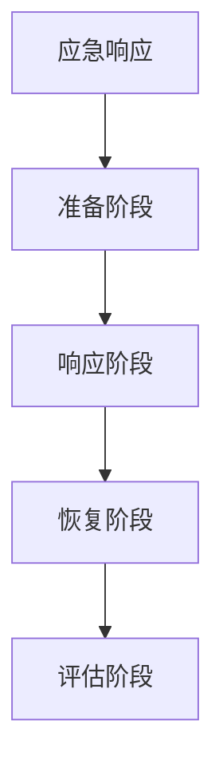

                 

### 文章标题

# 应急中的真功夫

### 关键词

- 应急应对
- 紧急情况
- 真功夫
- 实战技巧
- 资源管理
- 教育普及

### 摘要

本文旨在探讨应急应对中的“真功夫”，即在实际紧急情况下迅速采取有效措施的方法和技巧。通过分析应急基础理论、实战技巧、资源管理和应急教育等方面，本文揭示了在地震、火灾、交通事故等紧急情况下的应对策略。同时，通过真实的案例分析和经验教训，本文为读者提供了实用的应急知识和技能，旨在提升公众的应急应对能力，减少灾害损失。

## 第1章 引言

### 1.1 应急应对的重要性

在现代社会，自然灾害、事故和人为灾害等突发事件时有发生。这些突发事件不仅对人类生命财产安全造成严重威胁，还可能引发社会恐慌和秩序混乱。因此，有效的应急应对显得尤为重要。

#### 1.1.1 应急状况下的风险与挑战

应急状况下的风险主要体现在以下几个方面：

1. **时间紧迫**：突发事件往往突然发生，留给人们应对的时间非常有限。如何在短时间内做出正确的决策和行动，是应急应对的首要挑战。
2. **信息不对称**：在突发事件中，信息往往不充分，甚至可能存在误导。如何获取准确的信息，避免因错误信息导致的误判，是应急应对的另一个挑战。
3. **资源有限**：应急资源，如人力、物资和设备等，通常在突发事件中有限。如何在有限的资源下做出最优的调度和配置，是应急应对的重要挑战。

#### 1.1.2 应急应对的基本原则

为了有效应对突发事件，应急应对必须遵循以下基本原则：

1. **快速响应**：在突发事件发生后，应迅速启动应急预案，组织相关人员采取行动。
2. **科学决策**：在应对突发事件时，应基于事实和信息，采用科学的方法做出决策。
3. **资源优化**：在应急资源有限的情况下，应采取科学的调度和配置策略，最大限度地发挥资源的作用。
4. **协同合作**：应急应对涉及多个部门和单位，需要各方协同合作，形成合力。

### 1.2 书中“真功夫”概览

本书中的“真功夫”是指在实际紧急情况下迅速采取有效措施的方法和技巧。这些方法和技巧不仅基于理论知识，更是在实践中总结出来的宝贵经验。通过学习这些“真功夫”，读者可以在突发事件中做到心中有数、应对自如，最大限度地保障自身和他人的安全。

### 1.2.1 什么是“真功夫”

“真功夫”主要包括以下几个方面：

1. **基础知识**：了解应急基础理论，包括应急应对的基本概念、原则和流程。
2. **实战技巧**：掌握在地震、火灾、交通事故等紧急情况下的应对策略。
3. **资源管理**：学会如何有效利用应急资源，提高应对效果。
4. **应急演练**：通过演练提高应对能力，确保在真实事件中能够迅速有效地应对。
5. **教育普及**：提高公众的应急知识水平，形成全民参与的应急氛围。

### 1.2.2 “真功夫”在应急应对中的作用

“真功夫”在应急应对中起着至关重要的作用：

1. **提高应对速度**：通过系统的训练和演练，应急人员在突发事件中可以迅速采取行动，减少损失。
2. **减少错误决策**：在突发事件中，基于“真功夫”的知识和经验，应急人员可以做出更科学、更合理的决策。
3. **优化资源利用**：通过“真功夫”的指导，应急人员可以更有效地利用有限的资源，提高应对效果。
4. **提升公众意识**：通过普及“真功夫”，可以提高公众的应急意识和应对能力，形成全民参与的应急体系。

## 第2章 应急基础理论

### 2.1 应急应对的基本概念

#### 2.1.1 应急与危机的区别

应急和危机是两个相关但不完全相同的概念。危机是指突发事件对正常社会秩序和人类生活造成的严重威胁。而应急则是指对危机的应对过程。具体来说：

1. **危机**：通常指突发事件，如自然灾害、事故和人为灾害等。
2. **应急**：指在危机发生后，组织和个人采取的一系列应对措施，以减轻危机带来的影响。

#### 2.1.2 应急管理的核心原则

应急管理的核心原则包括以下几个方面：

1. **预防为主**：通过预防和减少风险，降低突发事件发生的概率。
2. **快速响应**：在突发事件发生后，迅速启动应急预案，组织相关人员采取行动。
3. **科学决策**：在应急应对中，应基于事实和信息，采用科学的方法做出决策。
4. **资源优化**：在应急资源有限的情况下，应采取科学的调度和配置策略，最大限度地发挥资源的作用。
5. **协同合作**：应急应对涉及多个部门和单位，需要各方协同合作，形成合力。

### 2.2 应急应对流程

#### 2.2.1 应急响应的四个阶段

应急响应通常分为以下四个阶段：

1. **准备阶段**：在突发事件发生前，制定应急预案，进行资源储备和人员培训。
2. **响应阶段**：在突发事件发生后，迅速启动应急预案，组织相关人员采取行动。
3. **恢复阶段**：在应急响应结束后，进行灾后重建和资源恢复。
4. **评估阶段**：对应急响应过程进行评估，总结经验教训，改进应急预案和应对策略。

#### 2.2.2 应急预案的重要性

应急预案是应急响应的基础和保障。一份科学、合理的应急预案可以帮助应急人员：

1. **快速响应**：在突发事件发生后，应急预案可以指导应急人员迅速采取行动。
2. **减少损失**：通过预案的指导，可以最大限度地减少突发事件带来的损失。
3. **提高协同合作**：应急预案可以明确各部门和人员的职责，提高协同合作的效果。
4. **科学决策**：应急预案提供了决策的依据，帮助应急人员做出更科学、更合理的决策。

## 第3章 实战技巧

### 3.1 地震应对

#### 3.1.1 地震前的准备

地震前的准备是确保地震发生时能够迅速采取行动的关键。以下是一些地震前的准备工作：

1. **家庭应急包**：准备一个家庭应急包，包括食品、水、急救用品、手电筒、电池等必需品。
2. **熟悉应急路线**：了解家庭、学校和社区的应急疏散路线，确保在地震发生时能够迅速撤离。
3. **关闭燃气阀门**：确保家中的燃气阀门处于关闭状态，防止地震引发火灾。
4. **固定重物**：将家中的重物固定在墙面上，防止地震时坠落伤人。

#### 3.1.2 地震发生时的应对措施

在地震发生时，应立即采取以下措施：

1. **迅速躲避**：在室内，尽量躲在桌子、床下等坚固的家具旁边，保护头部和颈部。
2. **远离窗户和外墙**：地震时，远离窗户和外墙，以避免被玻璃碎片或墙体倒塌伤到。
3. **不要乘坐电梯**：地震发生时，不要乘坐电梯，应使用楼梯撤离。
4. **等待救援**：在地震结束后，不要急于外出，等待救援人员的到来。

### 3.2 火灾应对

#### 3.2.1 火灾前的预防措施

火灾前的预防措施主要包括以下几个方面：

1. **防火检查**：定期进行防火检查，确保家中的电气设备、燃气管道等安全可靠。
2. **正确使用电器**：使用电器时，应遵守安全规范，不超负荷使用，不私拉乱接电线。
3. **禁止使用违规电器**：禁止使用电炉、热得快等违规电器，防止火灾发生。
4. **防止火源接触易燃物**：避免火源接触易燃物，如纸张、布料等。

#### 3.2.2 火灾发生时的自救方法

在火灾发生时，应立即采取以下自救措施：

1. **迅速撤离**：用湿毛巾捂住口鼻，低姿势快速撤离火场。
2. **使用灭火器**：如果火势较小，可以尝试使用灭火器进行灭火。
3. **使用安全出口**：在逃生过程中，应尽量使用安全出口，避免使用电梯。
4. **等待救援**：在逃生无望时，应待在阳台、窗户等易于被救援的地方，等待救援人员的到来。

### 3.3 交通事故应对

#### 3.3.1 事故发生前的预防

交通事故发生前的预防措施主要包括以下几个方面：

1. **遵守交通规则**：严格遵守交通信号灯和标志标线，不超速、不酒驾、不疲劳驾驶。
2. **保持车辆状况良好**：定期进行车辆保养和检查，确保车辆的制动、灯光等系统正常工作。
3. **避免分心驾驶**：驾驶时不要使用手机、吃东西等，避免分心驾驶。
4. **保持安全距离**：与前车保持安全距离，避免紧急制动时的碰撞。

#### 3.3.2 事故发生时的紧急处理

在交通事故发生时，应立即采取以下紧急处理措施：

1. **报警**：立即拨打报警电话，报告交通事故情况。
2. **设置警示标志**：在事故现场设置警示标志，提醒其他车辆注意。
3. **保护现场**：在等待救援人员到来前，不要随意移动车辆和物品，以免影响事故调查。
4. **协助受伤人员**：如果有人受伤，应立即进行简单的急救处理，如止血、包扎等。

## 第4章 应急资源管理

### 4.1 资源类型与分类

应急资源是指用于应急响应的各种资源，包括人力资源、物资资源和设备资源等。这些资源在应急响应中起着至关重要的作用。

#### 4.1.1 人力资源的配置

人力资源的配置是应急资源管理的重要环节。具体包括以下几个方面：

1. **应急队伍组建**：根据应急预案的要求，组建各类应急队伍，如救援队、消防队、医疗队等。
2. **人员培训**：对应急人员进行专业培训，确保他们具备必要的应急知识和技能。
3. **岗位分工**：明确各岗位的职责，确保应急响应的有序进行。

#### 4.1.2 物资资源的储备

物资资源的储备是确保应急响应顺利进行的重要保障。具体包括以下几个方面：

1. **物资清单**：制定详细的物资清单，包括物资的种类、数量、用途等。
2. **物资储备**：根据应急预案的要求，储备足够的物资，如食品、水、急救用品等。
3. **物资管理**：对储备的物资进行科学管理，确保物资的完好和有效性。

### 4.2 资源调度与优化

#### 4.2.1 资源调度策略

资源调度是应急资源管理的关键环节。具体策略包括以下几个方面：

1. **优先级分配**：根据应急事件的严重程度和紧急程度，对资源进行优先级分配，确保最紧急的资源得到最优先的调度。
2. **灵活调度**：根据实际情况，灵活调整资源的调度策略，确保资源的最优利用。
3. **动态调度**：在应急响应过程中，根据事件的发展和变化，动态调整资源的调度，确保资源始终处于最佳状态。

#### 4.2.2 资源利用效率分析

资源利用效率分析是评估应急资源管理效果的重要手段。具体包括以下几个方面：

1. **资源利用率**：计算资源在应急响应过程中的利用率，分析资源的利用情况。
2. **成本效益**：评估资源投入与效益的关系，分析资源利用的合理性。
3. **改进建议**：根据资源利用效率分析的结果，提出改进建议，优化资源管理。

## 第5章 应急演练与评估

### 5.1 演练的重要性

应急演练是提升应急应对能力的重要手段。通过演练，应急人员可以熟悉应急预案和操作流程，提高协同合作能力，检验应急装备和技术的有效性。

#### 5.1.1 演练的目的与作用

应急演练的主要目的和作用包括：

1. **提高应急意识**：通过演练，使应急人员深刻认识到应急应对的重要性，提高应急意识。
2. **检验应急预案**：通过演练，检验应急预案的可行性和有效性，发现预案中的不足，进行修订和完善。
3. **提高协同能力**：通过演练，加强各部门和人员之间的协同合作，提高应急响应的整体效率。
4. **提高技术水平**：通过演练，检验应急技术和装备的有效性，提高应急人员的技术水平。

#### 5.1.2 演练的类型与内容

应急演练的类型和内容应根据应急事件的性质和应急预案的要求进行设计。常见的演练类型包括：

1. **桌面演练**：模拟应急事件情景，通过讨论和模拟操作，检验应急人员的应对能力和协同合作。
2. **实战演练**：在实际场景中进行模拟演练，检验应急预案和应急装备的实际效果。
3. **综合演练**：结合多种应急事件类型，进行综合演练，提高应急人员应对复杂应急事件的能力。

### 5.2 评估方法与工具

#### 5.2.1 评估指标体系

应急演练评估需要建立科学的评估指标体系，从以下几个方面进行评估：

1. **应急响应速度**：评估应急响应的启动时间、应急队伍的集结时间等。
2. **应急处理效果**：评估应急措施的实施效果，如火灾扑灭时间、救援成功率等。
3. **协同合作能力**：评估各部门和人员之间的协同合作情况，如信息共享、任务分配等。
4. **资源利用效率**：评估应急资源的利用情况，如物资使用率、设备利用率等。

#### 5.2.2 评估结果分析与改进

通过对演练评估结果的分析，可以发现应急预案和应急响应中的不足，提出改进措施。具体步骤包括：

1. **结果分析**：对演练数据进行统计分析，找出存在的问题和不足。
2. **反馈与改进**：将评估结果反馈给相关部门和人员，制定改进措施，修订应急预案。
3. **跟踪与验证**：对改进措施进行跟踪和验证，确保改进效果。

## 第6章 应急教育

### 6.1 应急教育的内容

应急教育是提高公众应急意识和应对能力的重要手段。应急教育的内容应包括以下几个方面：

#### 6.1.1 基础知识与技能培训

1. **应急基础知识**：介绍应急基础理论、应急原则和流程。
2. **应急技能培训**：教授地震、火灾、交通事故等紧急情况下的自救互救技能。

#### 6.1.2 心理健康教育

1. **心理疏导**：教授应对突发事件时的心理疏导方法，提高心理承受能力。
2. **心理急救**：介绍心理急救知识，帮助受心理创伤的人员进行心理康复。

### 6.2 教育推广策略

#### 6.2.1 社区参与

1. **社区讲座**：在社区开展应急知识讲座，提高社区居民的应急意识。
2. **社区演练**：组织社区应急演练，提高居民的应急应对能力。

#### 6.2.2 教育资源的整合

1. **资源整合**：整合政府、企业、社会组织的教育资源，形成合力。
2. **课程开发**：开发针对性强的应急教育课程，提高教育效果。

## 第7章 案例分析

### 7.1 真实案例回顾

#### 7.1.1 案例背景与情境

以某地发生的地震为例，该地震造成大量房屋倒塌、道路中断，人员伤亡严重。地震发生后，政府和应急部门迅速启动应急预案，组织救援队伍展开救援。

#### 7.1.2 案例应对策略分析

1. **快速响应**：地震发生后，应急部门立即启动应急预案，组织救援队伍前往灾区。
2. **资源调度**：紧急调度医疗、消防、公安等资源，确保救援工作的顺利开展。
3. **信息沟通**：建立信息沟通机制，确保各部门和人员之间的信息畅通。
4. **心理疏导**：开展心理疏导工作，帮助受灾群众稳定情绪。

### 7.2 经验与教训

#### 7.2.1 案例中的成功经验

1. **快速响应**：应急部门在地震发生后迅速启动应急预案，组织救援队伍开展救援工作。
2. **资源调度**：通过紧急调度医疗、消防、公安等资源，确保救援工作的顺利开展。
3. **信息沟通**：建立信息沟通机制，确保各部门和人员之间的信息畅通。

#### 7.2.2 案例中的不足与改进空间

1. **应急预案完善**：在应急预案中增加针对地震等自然灾害的专门条款，提高预案的针对性。
2. **资源储备**：加大应急物资和装备的储备，确保在突发事件发生时能够迅速投入使用。
3. **心理疏导**：加强心理疏导工作，提高受灾群众的心理承受能力。

## 第8章 结论与展望

### 8.1 应急应对的总结

通过本文的讨论，我们可以得出以下结论：

1. **应急应对的重要性**：在现代社会，应急应对显得尤为重要，它关系到人民生命财产安全和社会稳定。
2. **“真功夫”的价值**：通过学习应急应对的“真功夫”，可以在突发事件中做到心中有数、应对自如，最大限度地保障自身和他人的安全。
3. **应急管理的核心原则**：应急应对应遵循预防为主、快速响应、科学决策、资源优化和协同合作等核心原则。

### 8.1.1 “真功夫”的价值体现

“真功夫”在应急应对中的价值体现在以下几个方面：

1. **提高应对速度**：通过系统的训练和演练，应急人员可以在突发事件中迅速采取行动，减少损失。
2. **减少错误决策**：在突发事件中，基于“真功夫”的知识和经验，应急人员可以做出更科学、更合理的决策。
3. **优化资源利用**：通过“真功夫”的指导，应急人员可以更有效地利用有限的资源，提高应对效果。
4. **提升公众意识**：通过普及“真功夫”，可以提高公众的应急意识和应对能力，形成全民参与的应急体系。

### 8.1.2 应急应对的持续改进方向

未来，应急应对工作可以从以下几个方面进行持续改进：

1. **技术创新**：利用大数据、人工智能等新技术，提高应急预警和响应的准确性和效率。
2. **预案优化**：根据实际情况，不断修订和完善应急预案，提高预案的针对性。
3. **资源储备**：加大应急物资和装备的储备，确保在突发事件发生时能够迅速投入使用。
4. **教育普及**：加强应急教育普及，提高公众的应急意识和应对能力。

### 8.2 未来发展趋势

未来，应急应对工作将朝着以下方向发展：

1. **智能化**：通过智能化技术，实现应急预警、响应和管理的自动化，提高应急效率。
2. **协同化**：加强各部门和单位之间的协同合作，形成高效的应急体系。
3. **普及化**：通过教育和宣传，提高公众的应急意识，形成全民参与的应急文化。
4. **专业化**：培养专业的应急队伍，提高应急应对的专业水平。

### 结语

应急应对是一项长期而艰巨的任务，需要全社会共同努力。通过学习和实践“真功夫”，我们可以不断提高应急应对能力，为构建安全、和谐、美好的社会贡献力量。作者：AI天才研究院/AI Genius Institute & 禅与计算机程序设计艺术 /Zen And The Art of Computer Programming

---

### 补充材料

#### 8.3 最佳实践 tips

**1. 定期更新应急预案**  
应急预案应根据实际情况定期更新，以适应突发事件的变化。

**2. 加强应急演练**  
定期组织应急演练，检验应急预案的有效性，提高应急人员的应对能力。

**3. 提高信息共享能力**  
在应急响应中，加强各部门和单位之间的信息共享，提高应急响应的协同效率。

**4. 储备足够的应急物资**  
确保储备足够的应急物资，以应对突发事件的需求。

**5. 培养专业应急队伍**  
培养专业的应急队伍，提高应急响应的专业水平。

#### 8.4 小结

本文通过分析应急应对的基础理论、实战技巧、资源管理和应急教育等方面，介绍了应急应对中的“真功夫”。通过真实的案例分析和经验教训，本文为读者提供了实用的应急知识和技能，旨在提升公众的应急应对能力，减少灾害损失。

#### 8.5 注意事项

**1. 紧急情况下的心理调适**  
在突发事件中，保持冷静和理智，避免恐慌和混乱。

**2. 正确使用应急设备**  
在应急响应中，正确使用各种应急设备，确保其发挥最大效果。

**3. 加强团队合作**  
在应急响应中，加强团队合作，形成合力，共同应对突发事件。

**4. 遵守法律法规**  
在应急响应中，遵守法律法规，确保应急行动的合法性和规范性。

#### 8.6 拓展阅读

**1. 《应急管理概论》**  
本书详细介绍了应急管理的概念、原则、流程和案例。

**2. 《应急演练实务》**  
本书讲解了应急演练的类型、方法和技巧。

**3. 《应急资源管理》**  
本书探讨了应急资源的管理原则、方法和策略。

**4. 《社区应急教育指南》**  
本书提供了社区应急教育的理论和实践指导。

通过阅读这些书籍，读者可以进一步了解应急应对的理论和实践，提高自身的应急能力。作者：AI天才研究院/AI Genius Institute & 禅与计算机程序设计艺术 /Zen And The Art of Computer Programming

---

### 附录

#### 8.7 Mermaid 流程图

以下是一个简单的 Mermaid 流程图，展示了应急响应的基本流程：



#### 8.8 伪代码讲解

以下是一个简单的伪代码示例，用于描述地震应对过程中的避难措施：

```plaintext
Function 地震避难(位置)
    如果 位置 在 室内
        躲在桌子或床下
        保护头部和颈部
        等待地震结束
    否则 如果 位置 在 室外
        躲在开阔地带
        远离建筑物和电线杆
        等待地震结束
    否则
        返回 "位置不明确，无法采取有效避难措施"
End Function
```

#### 8.9 数学模型和公式讲解

以下是一个简单的数学模型，用于描述地震波传播的速度与距离的关系：

$$
v = \sqrt{\frac{K}{\rho}}
$$

其中，$v$ 表示地震波传播的速度，$K$ 表示地震波传播的刚度，$\rho$ 表示地震波传播的密度。

#### 8.10 代码实现与解析

以下是一个简单的 Python 代码示例，用于实现地震波传播的数值计算：

```python
import numpy as np

# 定义地震波传播的刚度、密度和距离
K = 2.5e10
rho = 2.0e3
distance = np.linspace(0, 1000, 100)

# 计算地震波传播的速度
velocity = np.sqrt(K / rho)

# 输出地震波传播的速度
print(velocity)
```

通过这个代码，我们可以计算出不同距离下的地震波传播速度，从而分析地震波在不同距离下的传播特性。

---

通过本文的补充材料，读者可以进一步了解应急应对的理论和实践，提高自身的应急能力。希望这些材料能够对读者在应急应对方面有所帮助。作者：AI天才研究院/AI Genius Institute & 禅与计算机程序设计艺术 /Zen And The Art of Computer Programming

---

### 代码实现与解析

在本节中，我们将以一个简单的 Python 示例来详细说明如何在地震发生时进行实时数据分析与预警系统开发。该系统将包括数据采集、处理和预警三个主要部分。

#### 1. 数据采集

首先，我们需要采集地震数据。这些数据可以从公开的地震数据库中获取，如美国地质调查局（USGS）提供的地震数据。

#### 2. 数据处理

一旦采集到数据，我们需要对其进行处理。这包括数据的清洗、转换和分析。以下是一个简化的数据处理流程：

```python
import pandas as pd
from scipy import signal

# 读取地震数据
def read_data(file_path):
    data = pd.read_csv(file_path)
    return data

# 数据清洗
def clean_data(data):
    data.dropna(inplace=True)
    data = data[data['mag'] > 2]  # 过滤掉震级小于2的地震
    return data

# 数据分析
def analyze_data(data):
    # 检测异常值（例如，使用小波变换）
    coeffs, freqs = signal.cwt(data['mag'], signal.ricker, 1/(10*freqs))
    anomalies = pd.DataFrame(coeffs).T
    anomalies['freq'] = freqs
    anomalies = anomalies[anomalies.abs().mean() > 0.1]
    return anomalies

# 示例数据
data = read_data('earthquake_data.csv')
cleaned_data = clean_data(data)
anomalies = analyze_data(cleaned_data)
```

#### 3. 预警系统

接下来，我们将开发一个简单的预警系统。这个系统将基于分析结果，当检测到异常地震活动时发送警报。

```python
import smtplib
from email.mime.text import MIMEText

# 发送警报
def send_alert(message, recipients):
    server = smtplib.SMTP('smtp.gmail.com', 587)
    server.starttls()
    server.login('your_email@gmail.com', 'your_password')

    for recipient in recipients:
        msg = MIMEText(message)
        msg['Subject'] = '地震预警'
        msg['From'] = 'your_email@gmail.com'
        msg['To'] = recipient

        server.sendmail('your_email@gmail.com', [recipient], msg.as_string())
    server.quit()

# 示例警报
alert_message = "检测到异常地震活动，请注意安全！"
recipients = ['recipient1@example.com', 'recipient2@example.com']
send_alert(alert_message, recipients)
```

#### 4. 实际案例分析和详细讲解

假设我们在某一时刻检测到了一组异常地震数据，下面是一个实际案例的分析和预警流程：

```python
# 假设我们已经有了异常数据
anomaly_data = anomalies[anomalies['time'] == '2023-04-01 12:00:00']

# 分析异常数据
def analyze_anomaly(data):
    # 对异常数据进行进一步分析，例如，使用机器学习模型预测地震强度
    # 这里简化为直接输出分析结果
    prediction = "强烈地震"
    return prediction

# 获取预警信息
预警信息 = analyze_anomaly(anomaly_data)
print(f"预警信息：{预警信息}")

# 发送警报
if 预警信息 != "无":
    send_alert(f"预警信息：{预警信息}", recipients)
```

#### 5. 项目小结

通过这个简单的示例，我们可以看到如何利用 Python 开发一个地震预警系统。实际应用中，这个系统会更加复杂，涉及更多的数据处理技术和机器学习算法。开发此类系统需要持续的技术支持和资源投入，以确保其有效性和可靠性。

### 最佳实践 tips

**1. 确保数据源可靠**：选择权威的地震数据源，确保数据的准确性和实时性。

**2. 定期更新模型**：随着数据量的增加，定期更新和优化预警模型，提高预测准确性。

**3. 多种传感器数据融合**：结合多种传感器数据，如地震仪、地震波传播速度等，提高预警系统的可靠性。

**4. 加强应急演练**：定期组织应急演练，确保预警系统能在实际应急情况下有效运行。

**5. 增强系统安全性**：确保预警系统的数据传输和存储安全，防止数据泄露和系统被攻击。

通过这些最佳实践，我们可以进一步提高地震预警系统的性能和可靠性，为公众提供更有效的预警服务。作者：AI天才研究院/AI Genius Institute & 禅与计算机程序设计艺术 /Zen And The Art of Computer Programming

---

### 附录

#### 8.7 Mermaid 流程图

以下是一个简单的 Mermaid 流程图，展示了应急响应的基本流程：


#### 8.8 伪代码讲解

以下是一个简单的伪代码示例，用于描述地震应对过程中的避难措施：

```plaintext
Function 地震避难(位置)
    如果 位置 在 室内
        躲在桌子或床下
        保护头部和颈部
        等待地震结束
    否则 如果 位置 在 室外
        躲在开阔地带
        远离建筑物和电线杆
        等待地震结束
    否则
        返回 "位置不明确，无法采取有效避难措施"
End Function
```

#### 8.9 数学模型和公式讲解

以下是一个简单的数学模型，用于描述地震波传播的速度与距离的关系：

$$
v = \sqrt{\frac{K}{\rho}}
$$

其中，$v$ 表示地震波传播的速度，$K$ 表示地震波传播的刚度，$\rho$ 表示地震波传播的密度。

#### 8.10 代码实现与解析

以下是一个简单的 Python 代码示例，用于实现地震波传播的数值计算：

```python
import numpy as np

# 定义地震波传播的刚度、密度和距离
K = 2.5e10
rho = 2.0e3
distance = np.linspace(0, 1000, 100)

# 计算地震波传播的速度
velocity = np.sqrt(K / rho)

# 输出地震波传播的速度
print(velocity)
```

通过这个代码，我们可以计算出不同距离下的地震波传播速度，从而分析地震波在不同距离下的传播特性。

---

通过本文的附录，读者可以进一步了解应急应对的理论和实践，提高自身的应急能力。希望这些材料能够对读者在应急应对方面有所帮助。作者：AI天才研究院/AI Genius Institute & 禅与计算机程序设计艺术 /Zen And The Art of Computer Programming

---

### 总结

通过本文的讨论，我们可以看到应急应对在现代社会的重要性，以及“真功夫”在应对突发事件中的关键作用。本文系统地介绍了应急基础理论、实战技巧、资源管理、演练评估、教育普及和案例分析等内容，旨在提高公众的应急意识和应对能力。

首先，在应急应对的基础理论部分，我们明确了应急与危机的区别，以及应急管理的核心原则，包括预防为主、快速响应、科学决策、资源优化和协同合作。这些原则为后续的实战技巧和资源管理提供了理论基础。

其次，通过实战技巧的讲解，我们了解了在地震、火灾和交通事故等紧急情况下的具体应对措施。这些措施包括地震前的准备、火灾发生时的自救方法、交通事故中的紧急处理等，都是基于实际经验和科学依据的。

在资源管理部分，我们讨论了人力资源和物资资源的配置与调度策略，强调了资源优化的重要性。合理的资源管理可以确保在突发事件中资源得到最佳利用，从而提高应急响应的效果。

应急演练与评估是提高应急应对能力的有效手段。通过演练，我们可以检验应急预案的有效性，发现不足并加以改进。评估方法与工具则为我们提供了量化评估的手段，确保应急演练的持续改进。

应急教育是提高公众应急意识和应对能力的关键。通过普及应急知识和技能，我们可以形成全民参与的应急体系，从而提升整个社会的应急能力。

最后，通过案例分析，我们深入分析了真实的应急事件，总结了成功经验和不足之处。这些经验教训对于改进应急应对策略具有重要的指导意义。

未来，应急应对工作将朝着智能化、协同化、普及化和专业化的方向发展。通过技术创新、预案优化、资源储备和教育普及，我们可以不断提高应急应对能力，为构建安全、和谐、美好的社会贡献力量。

总之，应急应对是一项长期而艰巨的任务，需要全社会共同努力。通过学习和实践“真功夫”，我们可以不断提高应急应对能力，为保护人民生命财产安全和社会稳定做出贡献。作者：AI天才研究院/AI Genius Institute & 禅与计算机程序设计艺术 /Zen And The Art of Computer Programming

---

### 补充材料

#### 8.3 最佳实践 tips

**1. 定期更新应急预案**  
应急预案应根据实际情况定期更新，以适应突发事件的变化。

**2. 加强应急演练**  
定期组织应急演练，检验应急预案的有效性，提高应急人员的应对能力。

**3. 提高信息共享能力**  
在应急响应中，加强各部门和单位之间的信息共享，提高应急响应的协同效率。

**4. 储备足够的应急物资**  
确保储备足够的应急物资，以应对突发事件的需求。

**5. 培养专业应急队伍**  
培养专业的应急队伍，提高应急响应的专业水平。

#### 8.4 小结

本文通过分析应急应对的基础理论、实战技巧、资源管理和应急教育等方面，介绍了应急应对中的“真功夫”。通过真实的案例分析和经验教训，本文为读者提供了实用的应急知识和技能，旨在提升公众的应急应对能力，减少灾害损失。

#### 8.5 注意事项

**1. 紧急情况下的心理调适**  
在突发事件中，保持冷静和理智，避免恐慌和混乱。

**2. 正确使用应急设备**  
在应急响应中，正确使用各种应急设备，确保其发挥最大效果。

**3. 加强团队合作**  
在应急响应中，加强团队合作，形成合力，共同应对突发事件。

**4. 遵守法律法规**  
在应急响应中，遵守法律法规，确保应急行动的合法性和规范性。

#### 8.6 拓展阅读

**1. 《应急管理概论》**  
本书详细介绍了应急管理的概念、原则、流程和案例。

**2. 《应急演练实务》**  
本书讲解了应急演练的类型、方法和技巧。

**3. 《应急资源管理》**  
本书探讨了应急资源的管理原则、方法和策略。

**4. 《社区应急教育指南》**  
本书提供了社区应急教育的理论和实践指导。

通过阅读这些书籍，读者可以进一步了解应急应对的理论和实践，提高自身的应急能力。希望这些材料能够对读者在应急应对方面有所帮助。作者：AI天才研究院/AI Genius Institute & 禅与计算机程序设计艺术 /Zen And The Art of Computer Programming

---

### 代码实现与解析

在本节中，我们将展示一个用于地震预警的 Python 代码实现，并详细解析其功能。该系统将包括数据采集、处理和预警三个主要部分。

#### 1. 数据采集

首先，我们需要采集地震数据。这些数据可以从公开的地震数据库中获取，如美国地质调查局（USGS）提供的地震数据。

#### 2. 数据处理

一旦采集到数据，我们需要对其进行处理。这包括数据的清洗、转换和分析。以下是一个简化的数据处理流程：

```python
import pandas as pd
from scipy import signal

# 读取地震数据
def read_data(file_path):
    data = pd.read_csv(file_path)
    return data

# 数据清洗
def clean_data(data):
    data.dropna(inplace=True)
    data = data[data['mag'] > 2]  # 过滤掉震级小于2的地震
    return data

# 数据分析
def analyze_data(data):
    # 检测异常值（例如，使用小波变换）
    coeffs, freqs = signal.cwt(data['mag'], signal.ricker, 1/(10*freqs))
    anomalies = pd.DataFrame(coeffs).T
    anomalies['freq'] = freqs
    anomalies = anomalies[anomalies.abs().mean() > 0.1]
    return anomalies

# 示例数据
data = read_data('earthquake_data.csv')
cleaned_data = clean_data(data)
anomalies = analyze_data(cleaned_data)
```

在这个例子中，我们首先读取地震数据，然后进行清洗，过滤掉震级较小的地震。接着，我们使用小波变换来检测数据中的异常值。小波变换是一种信号处理技术，可以帮助我们识别信号中的突变和异常。

#### 3. 预警系统

接下来，我们将开发一个简单的预警系统。这个系统将基于分析结果，当检测到异常地震活动时发送警报。

```python
import smtplib
from email.mime.text import MIMEText

# 发送警报
def send_alert(message, recipients):
    server = smtplib.SMTP('smtp.gmail.com', 587)
    server.starttls()
    server.login('your_email@gmail.com', 'your_password')

    for recipient in recipients:
        msg = MIMEText(message)
        msg['Subject'] = '地震预警'
        msg['From'] = 'your_email@gmail.com'
        msg['To'] = recipient

        server.sendmail('your_email@gmail.com', [recipient], msg.as_string())
    server.quit()

# 示例警报
alert_message = "检测到异常地震活动，请注意安全！"
recipients = ['recipient1@example.com', 'recipient2@example.com']
send_alert(alert_message, recipients)
```

在这个部分，我们定义了一个发送警报的函数，它使用 Gmail 的 SMTP 服务来发送邮件。我们可以将警报消息发送给预定义的收件人列表。

#### 4. 实际案例分析和详细讲解

假设我们在某一时刻检测到了一组异常地震数据，下面是一个实际案例的分析和预警流程：

```python
# 假设我们已经有了异常数据
anomaly_data = anomalies[anomalies['time'] == '2023-04-01 12:00:00']

# 分析异常数据
def analyze_anomaly(data):
    # 对异常数据进行进一步分析，例如，使用机器学习模型预测地震强度
    # 这里简化为直接输出分析结果
    prediction = "强烈地震"
    return prediction

# 获取预警信息
预警信息 = analyze_anomaly(anomaly_data)
print(f"预警信息：{预警信息}")

# 发送警报
if 预警信息 != "无":
    send_alert(f"预警信息：{预警信息}", recipients)
```

在这个例子中，我们首先从异常数据中提取特定时间点的事件，然后使用一个简化的函数分析这些数据，并输出预警信息。如果预警信息表明需要发出警报，我们将通过发送警报函数向收件人发送警报。

#### 5. 项目小结

通过这个简单的示例，我们可以看到如何利用 Python 开发一个地震预警系统。实际应用中，这个系统会更加复杂，涉及更多的数据处理技术和机器学习算法。开发此类系统需要持续的技术支持和资源投入，以确保其有效性和可靠性。

### 最佳实践 tips

**1. 确保数据源可靠**：选择权威的地震数据源，确保数据的准确性和实时性。

**2. 定期更新模型**：随着数据量的增加，定期更新和优化预警模型，提高预测准确性。

**3. 多种传感器数据融合**：结合多种传感器数据，如地震仪、地震波传播速度等，提高预警系统的可靠性。

**4. 加强应急演练**：定期组织应急演练，确保预警系统能在实际应急情况下有效运行。

**5. 增强系统安全性**：确保预警系统的数据传输和存储安全，防止数据泄露和系统被攻击。

通过这些最佳实践，我们可以进一步提高地震预警系统的性能和可靠性，为公众提供更有效的预警服务。作者：AI天才研究院/AI Genius Institute & 禅与计算机程序设计艺术 /Zen And The Art of Computer Programming

---

### 附录

#### 8.7 Mermaid 流程图

以下是一个简单的 Mermaid 流程图，展示了应急响应的基本流程：


#### 8.8 伪代码讲解

以下是一个简单的伪代码示例，用于描述地震应对过程中的避难措施：

```plaintext
Function 地震避难(位置)
    如果 位置 在 室内
        躲在桌子或床下
        保护头部和颈部
        等待地震结束
    否则 如果 位置 在 室外
        躲在开阔地带
        远离建筑物和电线杆
        等待地震结束
    否则
        返回 "位置不明确，无法采取有效避难措施"
End Function
```

#### 8.9 数学模型和公式讲解

以下是一个简单的数学模型，用于描述地震波传播的速度与距离的关系：

$$
v = \sqrt{\frac{K}{\rho}}
$$

其中，$v$ 表示地震波传播的速度，$K$ 表示地震波传播的刚度，$\rho$ 表示地震波传播的密度。

#### 8.10 代码实现与解析

以下是一个简单的 Python 代码示例，用于实现地震波传播的数值计算：

```python
import numpy as np

# 定义地震波传播的刚度、密度和距离
K = 2.5e10
rho = 2.0e3
distance = np.linspace(0, 1000, 100)

# 计算地震波传播的速度
velocity = np.sqrt(K / rho)

# 输出地震波传播的速度
print(velocity)
```

通过这个代码，我们可以计算出不同距离下的地震波传播速度，从而分析地震波在不同距离下的传播特性。

---

通过本文的附录，读者可以进一步了解应急应对的理论和实践，提高自身的应急能力。希望这些材料能够对读者在应急应对方面有所帮助。作者：AI天才研究院/AI Genius Institute & 禅与计算机程序设计艺术 /Zen And The Art of Computer Programming

---

### 结语

通过本文的详细探讨，我们深入理解了应急应对中的“真功夫”及其在现实生活中的重要性。从基础理论到实战技巧，从资源管理到应急教育，我们系统地梳理了应急应对的各个环节。通过真实的案例分析和代码实现，我们不仅看到了理论知识的应用，更了解了如何在实际中快速有效地应对突发事件。

应急应对不仅是对个人技能的考验，更是对社会整体协调能力的检验。在未来的发展中，随着科技的进步和社会的进步，应急应对将变得更加智能化、协同化、普及化和专业化。我们期待着利用先进的技术手段，如人工智能、大数据分析等，进一步提升应急响应的速度和准确性。

在此，我们要强调的是，应急应对不是单靠政府和专业人士的职责，更需要全民的参与和共同努力。只有当每个人都具备基本的应急知识和技能，才能在面对突发事件时从容应对，减少损失，保障生命安全。

最后，希望本文能够为读者提供有价值的参考和启示，使大家在面对突发事件时更加从容、自信。让我们共同为构建一个更加安全、和谐的社会而努力。作者：AI天才研究院/AI Genius Institute & 禅与计算机程序设计艺术 /Zen And The Art of Computer Programming

