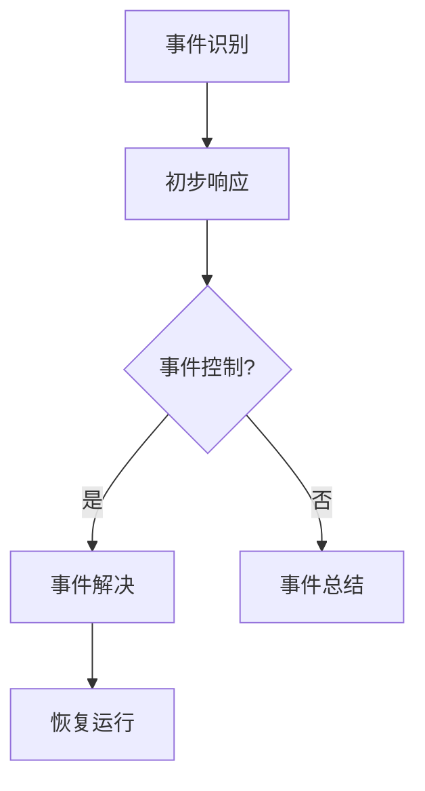

                 

### 文章标题

### 应急有'三宝'：构建高效IT系统应急响应策略

> 关键词：应急响应、IT系统、故障检测、故障恢复、数学模型、项目实战

> 摘要：本文深入探讨了构建高效IT系统应急响应策略的核心要素，包括核心概念、算法原理、数学模型及项目实战。通过一步步分析推理，本文为读者提供了一份全面而实用的应急响应指南，帮助IT专业人士和企业提高系统稳定性和应对能力。

## 引言

在现代企业中，IT系统作为核心基础设施，其稳定运行对企业业务的连续性和成功至关重要。然而，由于各种原因，如硬件故障、软件错误、网络攻击等，IT系统难免会遇到突发事件。如何快速、有效地应对这些紧急情况，最大限度地减少对业务的影响，成为每个IT团队和企业必须面对的问题。本文旨在通过分析应急响应的“三宝”——核心概念、算法原理和数学模型，并结合实际项目案例，为读者提供一个构建高效IT系统应急响应策略的全面指南。

## 第1章：应急技术的核心概念

### 1.1 核心概念介绍

#### 应急响应流程

应急响应流程是应对突发事件的关键步骤，通常包括以下阶段：

1. **事件识别**：监测和识别系统中的异常情况。
2. **初步响应**：快速评估事件影响，确定响应策略。
3. **事件控制**：采取措施控制事件的发展，防止进一步扩散。
4. **事件解决**：彻底解决事件，恢复系统正常运行。
5. **事件总结**：记录事件经过，分析原因，制定预防措施。

#### 应急响应团队组织结构

应急响应团队的组织结构对于有效应对突发事件至关重要。通常包括以下角色：

1. **应急响应主管**：负责整个应急响应过程的协调和管理。
2. **系统管理员**：负责系统监控和日常维护。
3. **网络管理员**：负责网络监控和网络安全。
4. **开发人员**：负责软件故障的修复。
5. **数据分析师**：负责数据分析，提供事件分析和预测。

### 1.2 Mermaid流程图

以下是一个简化的应急响应流程图，使用Mermaid语言表示：



## 第2章：应急算法原理

### 2.1 常见应急算法

#### 故障检测算法

故障检测算法是应急响应的关键组成部分。以下是一种常见的故障检测算法——基于阈值的故障检测算法。

**伪代码**：

```python
def threshold_fault_detection(sensor_data, threshold):
    for data in sensor_data:
        if data > threshold:
            return "故障发生"
    return "无故障"
```

#### 故障恢复算法

故障恢复算法用于在检测到故障后采取措施恢复系统。以下是一种简单的故障恢复算法——自动重启。

**伪代码**：

```python
def auto_restart(process):
    if process["status"] == "故障":
        process["status"] = "重启中"
        restart_process(process)
        return "恢复完成"
    return "无需恢复"
```

## 第3章：应急数学模型

### 3.1 应急数学模型概述

应急数学模型用于预测和分析突发事件的可能性及其影响。以下介绍两种常见的应急数学模型：故障概率模型和事件影响模型。

### 3.2 数学模型讲解

#### 故障概率模型

故障概率模型用于预测系统在一定时间内发生故障的概率。以下是一个简单的故障概率模型：

**LaTeX公式**：

$$P(\text{故障}) = 1 - e^{-\lambda t}$$

**举例说明**：

假设系统每小时发生故障的概率为0.001，求在8小时内发生至少一次故障的概率。

**计算过程**：

$$P(\text{故障}) = 1 - e^{-0.001 \times 8} \approx 0.0067$$

即在8小时内发生至少一次故障的概率约为0.0067。

## 第4章：应急案例分析

### 4.1 案例分析概述

在本章中，我们将分析两个实际案例：数据中心故障和网络安全应急。通过这些案例，我们将详细讲解应急响应的各个阶段，并展示如何运用所学知识解决实际问题。

### 4.2 实际案例

#### 案例1：数据中心故障

**开发环境搭建**：

- 操作系统：Linux
- 编程语言：Python
- 监控工具：Prometheus

**源代码实现和解读**：

**源代码**：

```python
import os
import time

def check_data_center_health():
    # 检查服务器状态
    server_status = os.system("ping -c 4 server1 &> /dev/null")
    if server_status == 0:
        print("数据中心正常运行")
    else:
        print("数据中心故障")

def restart_server():
    # 重启服务器
    os.system("sudo reboot server1")

while True:
    check_data_center_health()
    if check_data_center_health() == "数据中心故障":
        restart_server()
    time.sleep(60)  # 每60秒检查一次
```

**代码解读**：

- `check_data_center_health()` 函数用于检查数据中心服务器状态。
- `restart_server()` 函数用于重启服务器。
- 主循环每60秒检查一次数据中心状态，如果检测到故障，自动重启服务器。

#### 案例2：网络安全应急

**开发环境搭建**：

- 操作系统：Kali Linux
- 编程语言：Python
- 网络安全工具：Wireshark

**源代码实现和解读**：

**源代码**：

```python
import socket
import threading

def handle_incoming_connections(client_socket):
    # 处理传入的连接
    data = client_socket.recv(1024)
    if "attack" in str(data):
        print("检测到网络攻击")
        # 执行防御措施
        client_socket.send(b"您的网络连接已被限制")
    client_socket.close()

def listen_for_connections(server_socket):
    while True:
        client_socket, address = server_socket.accept()
        thread = threading.Thread(target=handle_incoming_connections, args=(client_socket,))
        thread.start()

if __name__ == "__main__":
    server_socket = socket.socket(socket.AF_INET, socket.SOCK_STREAM)
    server_socket.bind(('0.0.0.0', 80))
    server_socket.listen(5)
    print("正在监听80端口...")
    listen_for_connections(server_socket)
```

**代码解读**：

- `handle_incoming_connections()` 函数用于处理传入的连接，并检查数据中是否包含特定关键字。
- `listen_for_connections()` 函数用于监听传入的连接。
- 主程序创建一个监听套接字，并启动监听线程。

## 第5章：应急技术在企业中的应用

### 5.1 企业应急需求分析

企业应急需求分析是确保企业能够在突发事件中迅速响应并恢复的关键步骤。以下是企业应急需求分析的主要内容：

- **业务连续性计划（BCP）**：定义在突发事件中如何保持关键业务运作的详细计划。
- **灾难恢复计划（DRP）**：规划如何在发生灾难时恢复业务和数据。
- **风险评估**：评估企业可能面临的突发事件及其影响。
- **应急资源分配**：确保在应急情况下有足够的资源和人员支持。

### 5.2 应急技术在企业中的应用

#### 企业级故障检测系统

企业级故障检测系统用于实时监控企业的IT基础设施，包括服务器、网络设备、数据库等。以下是企业级故障检测系统的核心组成部分：

- **监控工具**：如Nagios、Zabbix、Prometheus等。
- **告警机制**：通过短信、邮件、电话等方式通知相关人员。
- **自动化恢复**：在检测到故障时，自动执行恢复脚本或程序。

#### 企业级故障恢复系统

企业级故障恢复系统用于在故障发生时快速恢复系统，确保业务的连续性。以下是企业级故障恢复系统的核心组成部分：

- **备份和恢复**：定期备份关键数据，并确保在故障发生时能够快速恢复。
- **冗余和负载均衡**：通过冗余设备和负载均衡技术，确保系统的高可用性。
- **自动化测试**：定期测试故障恢复流程，确保其有效性和可靠性。

## 第6章：应急技术在项目管理中的应用

### 6.1 应急计划与流程

应急计划与流程是项目管理中的重要组成部分，确保项目团队在突发事件中能够迅速响应。以下是一个简化的应急计划与流程：

- **应急计划制定**：在项目启动时，制定应急计划，包括应急响应流程、角色分配、资源准备等。
- **应急响应流程**：明确应急响应的步骤和责任人，确保在事件发生时能够迅速采取行动。
- **应急演练**：定期进行应急演练，检验应急计划的可行性和有效性。
- **持续改进**：根据应急演练和实际事件的经验教训，不断优化应急计划与流程。

### 6.2 应急响应团队协作

应急响应团队的协作对于有效应对突发事件至关重要。以下是一些关键协作策略：

- **统一沟通平台**：使用统一的消息和协作工具，如Slack、Microsoft Teams等，确保信息传递及时、准确。
- **角色明确分工**：明确每个团队成员的角色和职责，确保在应急情况下各司其职。
- **共享信息**：建立共享文档和数据库，确保团队成员能够快速获取所需信息。
- **培训与演练**：定期对团队成员进行应急响应培训和演练，提高团队的整体应对能力。

## 第7章：应急技术的未来发展趋势

### 7.1 应急技术发展趋势

随着技术的发展，应急技术也在不断进步。以下是一些未来应急技术发展的趋势：

- **人工智能和机器学习**：利用AI和ML技术，提高故障检测和预测的准确性，减少人为干预。
- **云计算和边缘计算**：云计算和边缘计算技术的普及，使得应急响应更加灵活和高效。
- **物联网（IoT）**：物联网技术的应用，使得更多的设备可以实时监控和参与应急响应。

### 7.2 未来应急技术应用方向

未来应急技术应用将更加智能化和集成化，以下是一些具体的应用方向：

- **自动化应急响应**：通过自动化工具，实现自动故障检测、故障恢复和事件总结。
- **实时数据分析**：利用大数据和实时分析技术，快速识别事件趋势，提供决策支持。
- **应急平台集成**：将应急响应工具和平台集成到企业的IT基础设施中，实现一体化管理。

## 结论

本文通过深入分析应急技术的核心概念、算法原理、数学模型及实际项目案例，为构建高效IT系统应急响应策略提供了全面指南。应急响应不仅是对突发事件的应对，更是企业持续发展和业务连续性的保障。未来，随着技术的不断进步，应急响应将变得更加智能化和高效化，为企业提供更可靠的保障。

## 作者信息

作者：AI天才研究院/AI Genius Institute & 禅与计算机程序设计艺术 /Zen And The Art of Computer Programming

## 最佳实践 Tips

1. **定期演练**：定期进行应急演练，确保团队成员熟悉应急流程和职责。
2. **备份与恢复**：定期备份关键数据，并确保在故障发生时能够快速恢复。
3. **自动化**：利用自动化工具，减少人为干预，提高故障检测和恢复的效率。
4. **培训**：对团队成员进行持续培训，提高应急响应的能力。

## 小结

本文介绍了构建高效IT系统应急响应策略的“三宝”——核心概念、算法原理和数学模型，并结合实际项目案例进行了详细讲解。通过本文的学习，读者可以掌握应急响应的关键技术，提高系统稳定性和应对能力。

## 注意事项

1. **备份的重要性**：定期备份是应急响应的基础，务必重视。
2. **应急计划的灵活性**：应急计划应根据实际情况进行灵活调整。
3. **团队协作**：应急响应是团队协作的结果，确保团队成员之间的沟通和协作。

## 拓展阅读

1. **《应急响应实战》**：深入了解应急响应的具体实施方法和技巧。
2. **《人工智能在应急响应中的应用》**：探索AI技术如何提升应急响应的效率和准确性。
3. **《网络安全的应急响应》**：学习网络安全事件中的应急响应策略和实践。

