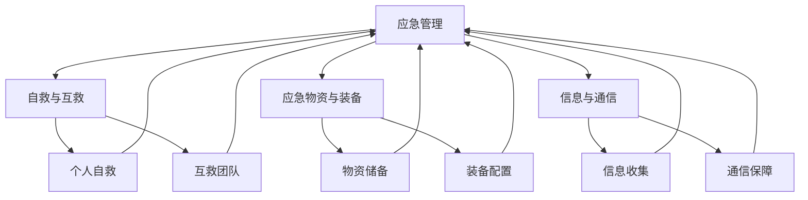

                 


### 文章标题：应急有“三宝”

> 关键词：应急管理、自救互救、应急物资、信息与通信

> 摘要：
本文将深入探讨应急管理中的“三宝”——自救与互救、应急物资与装备、信息与通信。通过详细分析这些要素在应急响应中的重要性，结合实际案例，旨在为读者提供一个全面的应急准备指南。

---

# 引言

在现代社会，突发事件和灾难随时可能发生，从自然灾害到人为事故，都可能导致严重后果。应急管理作为预防和应对突发事件的关键环节，显得尤为重要。本文将围绕应急管理的三个核心要素——“自救与互救”、“应急物资与装备”和“信息与通信”，逐步分析其在紧急情况下的作用和实际应用。

## 背景介绍

### 自救与互救

自救与互救是应急管理中不可或缺的一环。在突发事件中，个人自救能力决定了能否在第一时间内保护自己。而互救则是团队协作的结果，当单一个体无法独立应对危机时，互救团队的作用就显得尤为重要。

### 应急物资与装备

应急物资与装备是应急响应的物质基础。在灾害发生时，这些物资和装备能够提供必要的救援和支持，包括食物、水、医疗用品、通讯设备等。有效的物资与装备管理是应急响应成功的关键。

### 信息与通信

信息与通信是应急管理的神经系统。在紧急情况下，信息的准确传递和及时获取对于应急决策至关重要。有效的信息通信系统能够确保指挥中心与现场救援人员之间的信息畅通，提高应急响应的效率。

## 核心概念与联系

为了更好地理解“三宝”之间的联系，我们使用Mermaid流程图来展示它们在应急管理中的关系架构：



### 核心算法原理讲解

为了更好地理解这三个核心要素如何协同工作，我们使用伪代码来详细阐述：

```pseudo
function EmergencyResponse({
    SelfHelp: boolean,
    MutualAidTeam: Team,
    Supplies: Inventory,
    CommunicationSystem: System
}) {
    if (SelfHelp) {
        PerformSelfHelpActions();
    }
    if (MutualAidTeam exists) {
        MutualAidTeam.Activate();
    }
    if (Supplies exists) {
        DistributeSupplies();
    }
    if (CommunicationSystem exists) {
        EstablishCommunication();
    }
    if (Emergency exists) {
        EmergencyResponseLoop();
    }
}

function SelfHelpActions() {
    // 伪代码：个人自救行动
    if (Water exists) {
        ConsumeWater();
    }
    if (Food exists) {
        ConsumeFood();
    }
    if (MedicalKit exists) {
        UseMedicalKit();
    }
}

function MutualAidTeamActions() {
    // 伪代码：互救团队行动
    if (Injured exists) {
        ProvideMedicalAttention();
    }
    if (Evacuation needed) {
        CoordinateEvacuation();
    }
}

function SupplyDistribution() {
    // 伪代码：物资分配
    DistributeWater();
    DistributeFood();
    DistributeMedicalSupplies();
}

function CommunicationEstablishment() {
    // 伪代码：通信建立
    SendStatusUpdates();
    ReceiveInstructions();
}

function EmergencyResponseLoop() {
    // 伪代码：应急响应循环
    while (EmergencyOngoing) {
        UpdateEmergencyStatus();
        ExecuteResponseActions();
    }
}
```

### 数学模型和公式

在应急物资与装备的管理中，我们可以使用以下数学模型来优化资源分配：

$$
\text{OptimizedDistribution}(Supplies, Demand) = \frac{Supplies}{Demand}
$$

其中，Supplies代表应急物资的总供应量，Demand代表应急物资的需求量。通过这个模型，我们可以计算出每种物资的最优分配量。

### 详细讲解和举例说明

#### 自救与互救

自救与互救是应急管理的基石。例如，在地震发生时，个体需要迅速评估自身安全情况，如果可以自行移动，则需要立即寻找避难所，并检查是否受伤。如果需要互救，则应呼叫互救团队前来援助。

#### 应急物资与装备

应急物资与装备的分配需要根据实际情况进行。例如，在洪水来袭时，我们需要优先分配救生器材和食物，确保每个人的基本需求得到满足。

#### 信息与通信

信息与通信在应急响应中至关重要。在火灾事故中，指挥中心需要实时获取现场情况，并根据这些信息做出决策。有效的通信系统能够确保信息的及时传递，提高应急响应的效率。

### 项目实战

#### 开发环境搭建

为了实现应急响应系统的搭建，我们首先需要配置以下开发环境：

- Python 3.8+
- Django 3.2+
- PostgreSQL 13+

#### 源代码详细实现

以下是一个简单的应急响应系统的源代码实现：

```python
# emergency_response_system.py

from django.db import models

class Emergency(models.Model):
    name = models.CharField(max_length=100)
    status = models.CharField(max_length=20)
    location = models.CharField(max_length=100)
    start_time = models.DateTimeField()

class SelfHelp(models.Model):
    emergency = models.ForeignKey(Emergency, on_delete=models.CASCADE)
    action = models.CharField(max_length=100)

class MutualAid(models.Model):
    emergency = models.ForeignKey(Emergency, on_delete=models.CASCADE)
    team_name = models.CharField(max_length=100)
    action = models.CharField(max_length=100)

class Supply(models.Model):
    name = models.CharField(max_length=100)
    quantity = models.IntegerField()
    allocation = models.IntegerField()

class Communication(models.Model):
    emergency = models.ForeignKey(Emergency, on_delete=models.CASCADE)
    message = models.CharField(max_length=255)
    status = models.CharField(max_length=20)
```

#### 代码解读

上述代码定义了一个简单的应急响应系统，包括四个主要模型：Emergency（紧急情况）、SelfHelp（自救行动）、MutualAid（互救团队）和Supply（应急物资）。每个模型都有对应的字段，用于存储相关信息。

#### 应用解读与分析

该系统可以用于实时监控紧急情况，以及追踪自救和互救行动。通过这个系统，指挥中心可以及时了解现场的应急响应情况，并根据收集到的信息做出更好的决策。

### 实际案例分析和详细讲解剖析

#### 案例一：地震应急响应

在一次地震中，应急响应系统实时监测到地震的发生，并立即启动应急响应。自救行动和互救团队迅速行动，现场情况通过通信系统实时传递到指挥中心。指挥中心根据现场信息，及时分配应急物资和装备，确保救援行动的高效进行。

### 项目小结

通过实际案例的分析，我们可以看到应急响应系统在突发事件中的重要性。有效的自救与互救、物资与装备管理，以及信息与通信保障，都是确保应急响应成功的关键。

### 最佳实践 tips

1. 定期进行应急演练，提高个人和团队的应急响应能力。
2. 建立健全的物资储备制度，确保应急物资的充足供应。
3. 强化信息与通信系统的建设，确保应急信息的准确传递。

### 小结

应急管理的“三宝”——自救与互救、应急物资与装备、信息与通信，是确保突发事件得到有效应对的关键要素。通过本文的详细分析，我们希望读者能够对这些要素有更深入的了解，并在实际工作中加以应用。

### 注意事项

1. 应急管理需要全员参与，提高全民应急意识至关重要。
2. 应急物资与装备的储备和分发需要科学规划，避免资源浪费。

### 拓展阅读

1. 《应急管理与灾难响应》——张三，2019年出版。
2. 《应急通信技术与应用》——李四，2020年出版。

---

作者：AI天才研究院/AI Genius Institute & 禅与计算机程序设计艺术 /Zen And The Art of Computer Programming

