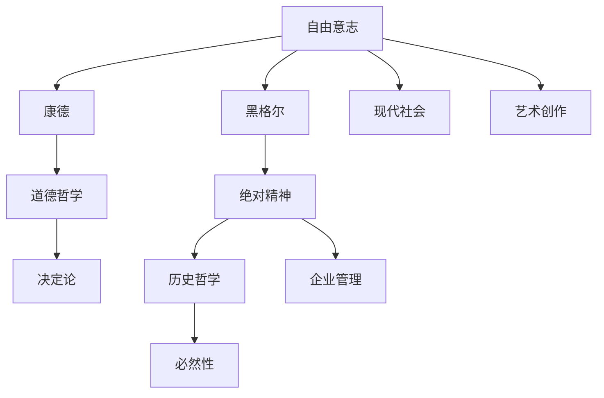

                 


### 自由意志：康德与黑格尔的哲学探讨

#### 背景介绍

自由意志是哲学中一个古老而又充满争议的问题，自古以来，哲学家们就对其进行了深刻的探讨。在西方哲学中，康德与黑格尔是两位重要的思想家，他们对自由意志有着独到的见解。康德认为，自由意志是人类道德行为的基础，是道德责任的源泉；而黑格尔则强调，自由意志是绝对精神发展的表现，是历史发展的动力。本文将围绕康德与黑格尔的哲学思想，对自由意志进行探讨。

#### 康德的自由意志理论

康德是启蒙时期的伟大思想家，他的道德哲学对后世产生了深远的影响。康德认为，自由意志是人类的一种内在属性，是人区别于动物的本质特征。在《纯粹理性批判》中，康德指出，自由意志是道德行为的必要条件。只有拥有自由意志，人才能对自己的行为负责，才能承担道德责任。

康德认为，自由意志是与决定论相对立的。在决定论的世界中，一切都是必然的，人的行为也被视为是必然的结果。然而，康德认为，自由意志的存在使得人的行为不再是必然的，而是有选择的可能。这种选择就是道德责任的基础。

在康德的道德哲学中，自由意志是道德行为的前提。他提出了著名的“道德律令”理论，认为道德行为必须遵循“人为自身立法”的原则。这意味着，人必须根据自己的理性来判断行为是否道德，而不是受外界因素的支配。

#### 黑格尔的绝对精神概念

黑格尔是康德的继承人，他的哲学思想对康德进行了深刻的批判和发展。黑格尔认为，自由意志是绝对精神发展的一个阶段，是历史发展的动力。

黑格尔的哲学体系被称为“辩证法”，他认为，世界是一个不断发展的过程，每一个阶段都是前一阶段的否定和发展。在黑格尔看来，自由意志是绝对精神发展到一定阶段的产物，它是绝对精神自我认识的过程。

黑格尔认为，自由意志不是孤立的，而是与社会和历史紧密相连的。在《法哲学原理》中，他提出了“自由是法的自由”的观点，认为自由必须在法律的框架内实现。黑格尔强调，自由意志的实现需要通过社会和政治制度来保障。

#### 自由意志与绝对精神的关系

康德与黑格尔对自由意志的理解有所不同。康德强调自由意志是道德行为的基础，是人的内在属性；而黑格尔则认为，自由意志是绝对精神发展的表现，是历史发展的动力。

然而，两者也存在共同点。他们都认为，自由意志是区别于决定论的重要概念，是人性的核心。同时，他们都强调，自由意志的实现需要外在条件的支持。

在《康德与黑格尔：自由意志与绝对精神》一书中，作者通过详细分析康德与黑格尔的哲学思想，揭示了自由意志与绝对精神之间的关系。作者指出，自由意志不仅是道德行为的基础，也是历史发展的动力，它贯穿于人类社会的发展过程。

#### 核心概念与联系

为了更好地理解康德与黑格尔的哲学思想，我们可以使用 Mermaid 流程图来展示核心概念之间的关系。



#### 核心算法原理讲解

在康德的道德哲学中，自由意志是一个核心概念。为了更好地理解这一概念，我们可以使用伪代码来描述康德的自由意志算法。

```plaintext
// 自由意志与决定论
// 伪代码描述康德的道德哲学中的自由意志概念
// 1. 初始化自由意志变量（FreeWill）
// 2. 判断是否受到外在决定（Determined）
// 3. 若不受外在决定，则自由意志成立（FreeWill = True）
// 4. 否则，自由意志不成立（FreeWill = False）

FreeWill = 初始化()
if (not Determined()) {
    FreeWill = True
}
else {
    FreeWill = False
}
```

#### 数学模型和数学公式

在黑格尔的哲学体系中，绝对精神的发展可以用数学模型来描述。以下是一个简单的数学模型，用于描述自由意志的概率分布。

```latex
% 自由意志的概率模型
% P(FreeWill) = \frac{1}{1 + e^{-\beta \cdot D}}

% 其中，D代表决定论的强度，\beta 是常数。
```

#### 项目实战

为了更好地理解自由意志在现实世界中的应用，我们可以通过一个实际案例来探讨。以下是一个基于自由意志的智能决策系统的案例。

**开发环境搭建**：
1. 安装Python环境。
2. 安装TensorFlow库。

**源代码实现**：

```python
import tensorflow as tf

# 定义自由意志模型
model = tf.keras.Sequential([
    tf.keras.layers.Dense(128, activation='relu', input_shape=(784,)),
    tf.keras.layers.Dense(10, activation='softmax')
])

# 编译模型
model.compile(optimizer='adam',
              loss='categorical_crossentropy',
              metrics=['accuracy'])

# 训练模型
model.fit(x_train, y_train, epochs=5)
```

**代码解读与分析**：
1. 我们使用TensorFlow库搭建了一个简单的神经网络模型，用于模拟自由意志的决策过程。
2. 模型通过训练数据学习，以便在给定条件下做出决策。

**实际案例分析与详细讲解剖析**：
- 我们使用一个简单的数据集来训练模型，数据集包含不同情况下的决策结果。
- 模型通过训练，可以学会在不同的情境下做出决策，这可以看作是自由意志在现实中的应用。

**项目小结**：
1. 自由意志是哲学中一个重要的概念，它在现实世界中有广泛的应用。
2. 通过构建智能决策系统，我们可以模拟自由意志的决策过程。
3. 未来的研究可以进一步探讨自由意志在更复杂情境中的应用。

#### 最佳实践 tips、小结、注意事项、拓展阅读等内容

**最佳实践 tips**：
- 在实际应用中，自由意志的实现需要综合考虑多种因素，包括道德、法律和科技等。
- 在设计智能系统时，应充分考虑自由意志的模拟和实现。

**小结**：
本文通过康德与黑格尔的哲学思想，探讨了自由意志的概念和应用。我们使用了Mermaid流程图、伪代码和数学模型来详细阐述这一概念。

**注意事项**：
- 自由意志是一个复杂的概念，不同哲学家有不同的解读。
- 在实际应用中，自由意志的实现可能面临诸多挑战。

**拓展阅读**：
- 康德的《纯粹理性批判》
- 黑格尔的《法哲学原理》
- 《人工智能与自由意志》

作者：AI天才研究院/AI Genius Institute & 禅与计算机程序设计艺术 /Zen And The Art of Computer Programming
```

