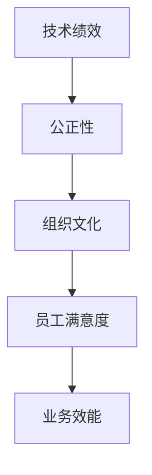
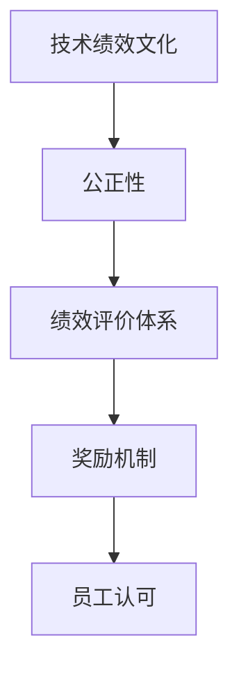
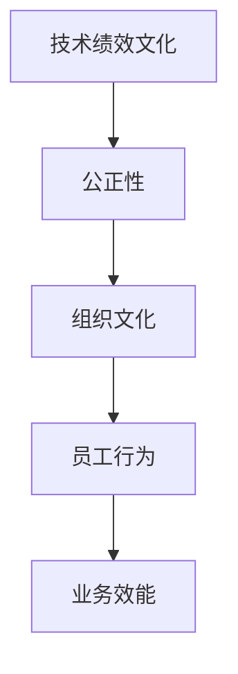
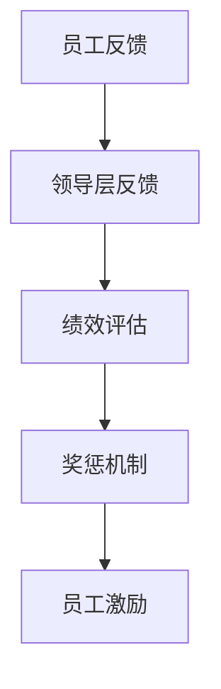
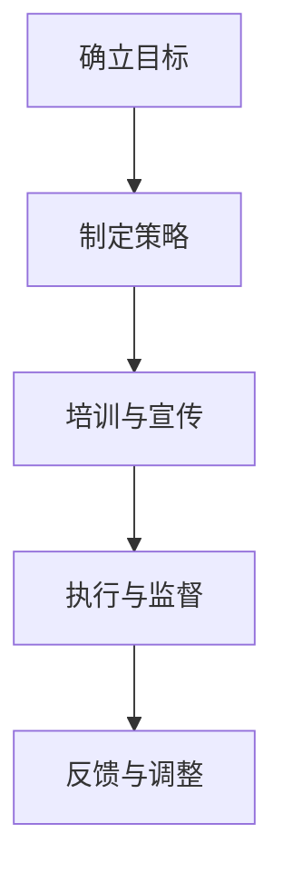

                 

### 文章标题

# 《建立公正的技术绩效文化》

### 关键词

- 公正性
- 技术绩效
- 组织文化
- 领导力
- 沟通机制
- 绩效评估

### 摘要

本文旨在探讨如何在一个组织中建立公正的技术绩效文化。我们将深入分析公正技术绩效文化的核心概念和联系，并详细阐述建立这一文化的策略和方法。本文还将分享实际案例，提供实用的最佳实践 tips，并总结注意事项和拓展阅读资源。

---

### 第一部分：引言

#### 1.1 背景介绍

在现代企业中，技术作为推动业务增长和创新的核心动力，其重要性日益凸显。然而，技术绩效的公正性成为一个备受关注的问题。公正的技术绩效文化不仅可以提升组织的整体效能，还能增强员工的工作满意度和忠诚度。因此，建立公正的技术绩效文化成为许多企业追求的目标。

#### 1.2 核心概念与联系

为了更好地理解公正的技术绩效文化，我们首先需要明确几个核心概念：

- **技术绩效**：技术人员的绩效不仅包括技术能力的体现，还包括解决问题的能力、团队合作精神、项目管理能力等多个方面。
- **公正性**：公正的技术绩效文化要求评价和奖励体系公平、透明，确保每个员工的努力和成就都能得到公正的认可。
- **组织文化**：组织文化是指组织内部共同的价值观、信念和行为规范。公正的技术绩效文化是组织文化的重要组成部分。

以下是一个用于描述这些概念之间关系的 Mermaid 流程图：



### 第一部分：引言

#### 1.3 文章结构与内容

本文将分为四个主要部分：

1. **第一部分：引言**：介绍技术绩效文化的背景和重要性，以及本文的核心概念和联系。
2. **第二部分：核心概念与联系**：详细讨论技术绩效文化、公正性和组织文化等核心概念，并展示它们之间的联系。
3. **第三部分：建立技术绩效文化的策略与方法**：阐述建立公正的技术绩效文化的具体策略和方法。
4. **第四部分：技术绩效文化的实施与优化**：探讨技术绩效文化的实施步骤、挑战与应对策略，以及如何进行持续改进。

### 第二部分：核心概念与联系

#### 2.1 技术绩效文化

技术绩效文化是指组织中对于技术人员的绩效评价、奖励和培养等方面所形成的共同价值观和行为规范。它不仅包括对技术能力的重视，还包括对团队协作、创新精神、沟通能力等多方面素质的认可。

#### 2.2 公正性

公正性是技术绩效文化的核心要素之一。一个公正的技术绩效文化要求评价和奖励体系公平、透明，确保每个员工的努力和成就都能得到公正的认可。以下是一个用于描述技术绩效文化和公正性之间关系的 Mermaid 流程图：



#### 2.3 组织文化

组织文化是指组织内部共同的价值观、信念和行为规范。它对员工的行为和决策产生深远影响。公正的技术绩效文化是组织文化的重要组成部分，它能够促进组织的整体效能和员工的满意度。

以下是一个用于描述技术绩效文化、公正性和组织文化之间关系的 Mermaid 流程图：



### 第三部分：建立技术绩效文化的策略与方法

#### 3.1 制定公正的绩效评估标准

制定公正的绩效评估标准是建立技术绩效文化的第一步。以下是一个用于描述制定公正绩效评估标准的伪代码：

```python
# 伪代码：制定公正的绩效评估标准

def define公正的绩效评估标准(员工绩效指标，员工贡献度，团队协作度):
    # 确定技术能力指标
    技术能力指标 = 获取技术能力数据(编程能力，项目完成度，代码质量等)
    
    # 确定员工贡献度指标
    员工贡献度指标 = 获取员工贡献数据(解决问题能力，创新能力，跨部门合作等)
    
    # 确定团队协作度指标
    团队协作度指标 = 获取团队协作数据(团队合作效率，沟通能力，冲突解决能力等)
    
    # 综合评估
    绩效评分 = 技术能力指标 * 0.6 + 员工贡献度指标 * 0.3 + 团队协作度指标 * 0.1
    
    return 绩效评分
```

#### 3.2 建立透明的沟通机制

建立透明的沟通机制是确保公正性得以实现的重要手段。以下是一个用于描述建立透明沟通机制的 Mermaid 流程图：



#### 3.3 培养技术人员的职业素养

培养技术人员的职业素养是建立公正的技术绩效文化的重要环节。以下是一个用于描述培养技术人员职业素养的伪代码：

```python
# 伪代码：培养技术人员的职业素养

def 培养技术人员职业素养(技术人员，职业素养指标):
    # 确定职业素养指标
    职业素养指标 = 获取职业素养数据(沟通能力，团队协作，责任感等)
    
    # 提供培训和学习资源
    提供培训资源 = True
    
    # 定期评估职业素养水平
    职业素养评估 = 评估职业素养水平(技术人员，职业素养指标)
    
    return 职业素养评估
```

### 第四部分：技术绩效文化的实施与优化

#### 4.1 技术绩效文化的实施步骤

实施技术绩效文化的步骤如下：

1. **确立目标**：明确建立公正的技术绩效文化的目标，包括期望的绩效水平、文化氛围等。
2. **制定策略**：根据组织特点，制定具体的实施策略，如绩效评估标准的制定、沟通机制的建立等。
3. **培训与宣传**：对员工进行培训，提高他们对公正技术绩效文化的认识和理解。
4. **执行与监督**：按照制定好的策略执行，同时建立监督机制，确保实施过程顺利进行。
5. **反馈与调整**：收集反馈，针对存在的问题进行调整和改进。

以下是一个用于描述实施技术绩效文化步骤的 Mermaid 流程图：



#### 4.2 技术绩效文化的挑战与应对

在实施技术绩效文化的过程中，可能会遇到以下挑战：

- **员工的抵触情绪**：部分员工可能对改变有抵触情绪，需要通过有效的沟通和培训来缓解。
- **绩效评估标准的不公正**：如果绩效评估标准制定得不合理，可能导致评估结果不公正，需要定期审视和调整。
- **领导层的支持不足**：领导层的不支持可能导致实施过程受阻，需要加强领导力的培养和沟通。

应对这些挑战的策略包括：

- **加强沟通**：通过定期的会议、培训等方式，与员工建立良好的沟通，了解他们的需求和担忧。
- **完善绩效评估标准**：确保绩效评估标准合理、透明，并定期进行调整，以适应组织的变化。
- **培养领导力**：通过培训和指导，提高领导层对技术绩效文化的认识和支持力度。

#### 4.3 技术绩效文化的持续改进

技术绩效文化不是一成不变的，它需要根据组织的发展和外部环境的变化进行持续改进。以下是一些持续改进的方法：

- **定期评估**：定期对技术绩效文化的实施效果进行评估，识别存在的问题，并及时进行调整。
- **员工参与**：鼓励员工参与技术绩效文化的建设和改进，收集他们的反馈和建议。
- **外部学习与交流**：与其他组织进行学习和交流，借鉴他们的成功经验，不断优化自身的文化。

### 总结

建立公正的技术绩效文化是一个复杂而长期的过程，需要组织、员工和领导层的共同努力。通过明确核心概念和联系、制定合理的绩效评估标准、建立透明的沟通机制、培养技术人员的职业素养以及持续改进，组织可以逐步建立起一个公正、有效的技术绩效文化。

### 附录

#### A. 技术绩效文化相关资源

- [技术绩效文化研究论文](#)
- [技术绩效文化实践案例](#)

#### B. 技术绩效文化度量指标公式

$$
绩效评分 = 技术能力指标 \times 0.6 + 员工贡献度指标 \times 0.3 + 团队协作度指标 \times 0.1
$$

### 作者

作者：AI天才研究院/AI Genius Institute & 禅与计算机程序设计艺术/Zen And The Art of Computer Programming

