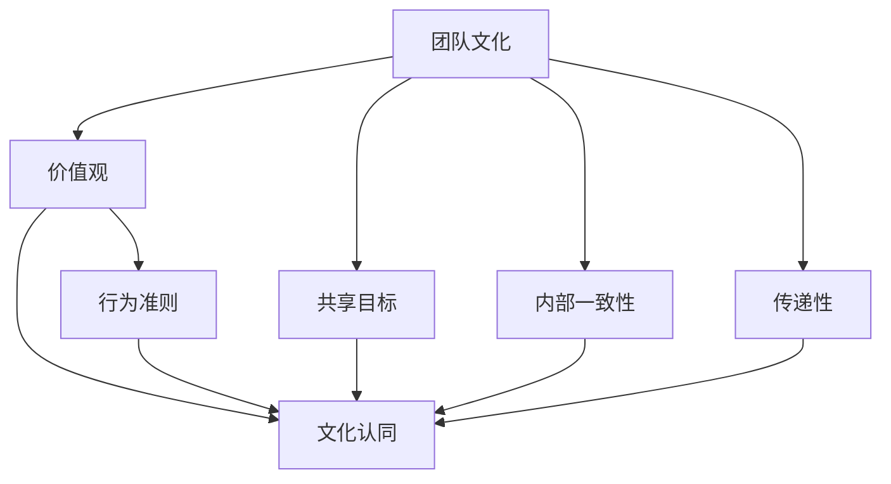
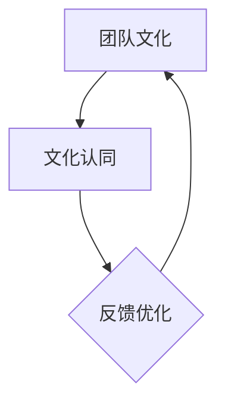

                 

### 文章标题

《建立技术团队的文化认同》

在当今的IT领域，技术团队的文化认同已成为企业成功的关键因素之一。一个具有高度文化认同的技术团队能够更好地协同工作、提升创新能力和组织绩效。然而，如何系统地建立和维护这样的文化认同，仍然是许多企业和团队面临的挑战。本文旨在通过逻辑清晰、结构紧凑的分析，探讨如何构建一个技术团队的文化认同，从而推动团队的整体发展。

### 文章关键词

- 技术团队
- 文化认同
- 团队价值观
- 团队精神
- 文化战略

### 摘要

本文首先介绍了团队文化和文化认同的基本概念，探讨了其在技术团队中的重要性和影响。接着，文章详细分析了构建技术团队文化的关键要素，包括确立团队价值观、培养团队精神和建立有效的协作与沟通机制。随后，文章提出了提升团队认同感的具体策略，并讨论了团队文化战略的制定和实践。文章还通过案例研究，提供了实际操作中的成功经验和教训。最后，文章总结了团队文化建设的工具和方法，并提供了相关评估量表，以帮助读者在实践中更好地应用和改进团队文化。

### 为什么建立技术团队的文化认同如此重要？

在深入探讨如何建立技术团队的文化认同之前，我们先来理解为什么这项工作如此重要。技术团队是现代企业创新和发展的核心力量，而团队文化则是其精神内核。文化认同不仅是团队成员之间的情感纽带，更是团队高效运作和持续发展的基石。

首先，从个人层面来看，文化认同能够增强团队成员的归属感和忠诚度。当团队成员感受到自己是团队不可或缺的一部分时，他们更愿意为团队的目标和使命贡献自己的力量。同时，高度认同的文化环境有助于减轻工作压力，提高工作效率，从而提升个人职业成就感。

其次，从团队层面来看，文化认同能够促进团队协作和创新。在一个文化认同感强的团队中，成员之间更容易建立信任，沟通成本更低，协作效率更高。此外，共同的文化价值观有助于团队成员在遇到困难和挑战时保持一致的行动方向，提高解决问题的能力和决策速度。

最后，从组织层面来看，文化认同对于企业的整体绩效有着深远的影响。一个拥有高度文化认同的技术团队能够更快速地适应市场变化，更有效地响应客户需求，从而在激烈的市场竞争中占据优势。同时，良好的团队文化也能够吸引和留住优秀的团队成员，为企业的长期发展提供人才保障。

总之，建立技术团队的文化认同不仅是提升团队绩效的必要手段，更是企业可持续发展的战略选择。接下来，我们将详细探讨如何构建和强化这种文化认同。

### 团队文化与文化认同的概念与特征

团队文化是指团队成员在长期工作中所共同遵循的价值观、行为准则和思维方式。它是团队的“精神家园”，反映了团队的核心特质和共同目标。文化认同，则是指团队成员对团队文化的认可和共鸣，这种认同感是建立在共同价值观和行为准则基础上的，是团队成员内心深处的归属感。

团队文化通常具有以下几个特征：

1. **共同价值观**：团队文化为团队成员提供了一套共同的价值观和行为准则，这些价值观成为团队成员决策和行为的标准。例如，一些技术团队可能非常重视创新、质量、客户至上等价值观。

2. **共享的目标**：团队成员在共同的目标下协作，这种目标可以是短期的项目目标，也可以是长期的企业愿景。共享的目标有助于统一团队成员的行动方向，提高团队凝聚力。

3. **行为准则**：团队文化通过行为准则规范成员的行为，这些准则可以是显性的，如公司政策，也可以是隐性的，如团队成员之间的非正式互动。

4. **内部一致性**：团队文化要求成员在行为和思维上保持一致性，这种内部一致性有助于减少冲突和误解，提高团队协作效率。

5. **传递性**：团队文化不仅是团队成员之间的共识，还会通过成员的互动传递给新的成员，使其快速融入团队。

文化认同的特征包括：

1. **归属感**：团队成员感受到自己是团队的一部分，这种归属感是文化认同的基础。

2. **共鸣**：团队成员对团队文化的核心价值观和行为准则有强烈的共鸣，愿意主动践行这些准则。

3. **忠诚度**：文化认同较高的团队成员对团队和组织有更高的忠诚度，更愿意为团队的成功付出努力。

4. **信任**：文化认同能够增强团队成员之间的信任，降低沟通和协作的障碍。

5. **适应性**：文化认同较高的团队成员更能够适应变化，灵活应对外部挑战。

### 团队文化与文化认同的关系

团队文化与文化认同之间存在密切的联系。团队文化是文化认同的基础，而文化认同则是团队文化的体现。以下是一个简化的关系架构图，用Mermaid语法表示：

从上述关系架构图中可以看出，团队文化的各个方面，如价值观、行为准则、共享目标、内部一致性和传递性，都是文化认同的组成部分。文化认同将这些要素内化到团队成员的内心深处，使其成为团队成员行为的指导原则。

此外，文化认同也是团队文化的反馈机制。团队成员通过实践文化认同，反馈团队文化的有效性和适应性，从而不断优化和调整团队文化。这一过程可以看作是一个循环，如图所示：

通过这一循环，团队文化得以持续发展和完善，而文化认同也随之加强。因此，建立和强化团队文化认同，不仅是团队发展的起点，更是团队不断进步的动力源泉。

### 团队文化的核心要素：价值观的确立

确立团队价值观是建立技术团队文化的第一步，也是最重要的一步。价值观是团队文化的灵魂，它决定了团队成员的行为准则和工作态度，是团队凝聚力的源泉。以下是一些关键步骤和策略，帮助技术团队确立清晰的价值观：

#### 1. 分析现有文化

在确立新的价值观之前，首先要了解团队现有的文化氛围。可以通过以下方式进行分析：

- **问卷调查**：设计一份问卷，收集团队成员对团队价值观的看法，以及他们希望团队具备的特质。
- **访谈**：与团队成员进行一对一或小组访谈，了解他们对团队文化的感受和期望。
- **观察**：观察团队成员在日常工作和项目中的互动和行为，分析他们的共同点和差异。

通过这些分析，可以了解团队成员对现有文化的满意程度，以及哪些价值观是团队已经内化的，哪些需要改进或引入。

#### 2. 确定核心价值观

基于对现有文化的分析，团队可以确定几条核心价值观。这些价值观应该简洁明了，容易记忆，并且能够反映团队的特点和目标。以下是一些典型的核心价值观：

- **创新与探索**：鼓励团队成员不断尝试新的想法和技术，推动团队持续创新。
- **客户至上**：将客户需求放在首位，确保产品和服务能够满足客户的需求和期望。
- **质量与精度**：追求高质量的工作成果，对每个细节都力求完美。
- **透明与开放**：鼓励团队成员分享知识和经验，建立透明的沟通机制。
- **责任与承诺**：强调个人和团队的责任感，对工作和承诺负责到底。

#### 3. 形成共识

确立核心价值观的过程不仅仅是领导层的决策，更需要团队成员的广泛参与和共识。以下是一些实现共识的策略：

- **团队讨论**：组织团队会议，讨论核心价值观的制定，让每个成员都有发言和投票的机会。
- **匿名反馈**：通过匿名问卷收集团队成员的意见，确保每个声音都能被听到。
- **文化故事**：通过讲述团队中的成功故事和典型案例，帮助成员理解并认同这些价值观。

#### 4. 内化到日常工作

确立核心价值观后，要将这些价值观内化到团队的日常工作中。以下是一些具体的实践方法：

- **领导示范**：领导层应该通过言行一致，成为核心价值观的榜样。
- **培训与教育**：定期组织培训活动，强化团队成员对核心价值观的理解和实践。
- **绩效考核**：将核心价值观作为绩效考核的一部分，激励团队成员践行这些价值观。
- **团队活动**：通过团队建设活动和项目，让成员在具体实践中体验和巩固这些价值观。

通过以上步骤，技术团队能够确立一套清晰、明确的价值观，这不仅有助于团队成员更好地理解团队目标，还能增强团队的凝聚力和执行力。接下来，我们将探讨如何培养团队精神，这是建立技术团队文化的重要组成部分。

### 培养团队精神：团队协作与沟通机制

团队精神是指团队成员在共同目标下，互相支持、协同合作的工作态度和行为。它是团队文化的重要组成部分，也是实现团队高效运作的关键。以下是一些培养团队精神的有效方法和策略：

#### 1. 明确共同目标

共同目标是团队协作的基础，它为团队成员提供了方向和动力。为了明确共同目标，团队可以采取以下措施：

- **制定团队愿景和使命**：确保团队成员对团队的长期目标和愿景有清晰的认识。
- **设定具体目标**：将长期目标分解为具体的短期目标，并为每个目标设定明确的截止日期和里程碑。
- **公开沟通**：定期召开团队会议，分享目标进展和成果，确保每个成员都了解团队的当前状态和下一步行动。

#### 2. 促进内部沟通

良好的沟通是团队协作的保障，它能够减少误解和冲突，增强团队的凝聚力。以下是一些促进内部沟通的方法：

- **定期会议**：组织定期的团队会议，讨论项目进展、问题解决方案和团队成员的需求。
- **透明沟通**：鼓励团队成员分享信息，建立透明的沟通机制，减少信息壁垒。
- **反馈与反馈**：建立反馈机制，允许团队成员在项目中相互反馈意见和建议，促进持续改进。
- **沟通工具**：利用现代沟通工具，如即时通讯软件、项目管理工具等，方便团队成员之间的实时沟通。

#### 3. 建立信任

信任是团队协作的基石，它能够增强团队成员之间的互信和合作意愿。以下是一些建立信任的方法：

- **透明和诚信**：领导者应该以身作则，保持透明和诚信，树立信任的榜样。
- **共同经历**：通过共同完成任务和面对挑战，增强团队成员之间的信任感。
- **鼓励分享**：鼓励团队成员分享自己的知识和经验，建立互相学习和信任的氛围。
- **处理冲突**：及时处理团队内部的冲突和分歧，通过公平和理性的方式解决矛盾，维护团队的和谐。

#### 4. 促进多样性

多样性不仅能够为团队带来不同的视角和观点，还能激发创新和创造力。以下是一些促进多样性的方法：

- **招聘多样化的团队成员**：在招聘过程中，注重多元背景的候选人，为团队带来不同的思维和经验。
- **培训与培养**：提供多样化的培训和学习机会，帮助团队成员发展不同领域的技能和知识。
- **开放包容的文化**：建立开放和包容的文化，鼓励团队成员尊重和欣赏彼此的不同。

#### 5. 强化团队建设

团队建设活动是培养团队精神的重要手段，它能够增强团队成员之间的联系和合作意识。以下是一些团队建设活动：

- **团队拓展训练**：组织户外拓展活动，增强团队成员的身体素质和团队合作能力。
- **团队建设会议**：定期组织团队建设会议，通过游戏、讨论和分享，增进成员之间的了解和信任。
- **团队竞赛**：举办团队竞赛，鼓励团队成员在竞赛中协作和竞争，提高团队凝聚力和竞争力。

通过上述方法和策略，技术团队能够培养出强烈的团队精神，提高团队协作效率，实现共同的目标。接下来，我们将探讨如何提升团队成员之间的认同感，这是团队文化的重要组成部分。

### 提升团队成员之间的认同感：角色定位与成功案例

提升团队成员之间的认同感是建立技术团队文化的重要一环。认同感不仅能够增强团队的凝聚力，还能提高团队的整体效率和创新能力。以下是一些具体的方法和策略，以及成功案例的启示：

#### 1. 明确角色定位

在技术团队中，每个成员都扮演着不同的角色，这些角色共同构成了团队的结构。明确每个角色的定位和职责，有助于提升团队成员之间的认同感。以下是一些关键步骤：

- **角色定义**：为每个角色制定明确的职责和期望，确保团队成员了解自己的角色和责任。
- **技能匹配**：根据成员的技能和兴趣，将他们分配到合适的角色，使其能够发挥最大的潜力。
- **公开宣布**：在团队会议上公开宣布每个成员的角色和职责，增强成员的归属感和责任感。

#### 2. 成功案例分享

通过分享成功案例，可以激发团队成员的认同感和积极性。以下是一些成功案例及其启示：

- **案例一**：某技术团队在项目中引入敏捷开发方法，通过快速迭代和持续反馈，提高了团队的协作效率和项目质量。团队成员在成功完成项目后，对团队的认同感和自豪感大幅提升。
- **案例二**：另一技术团队定期组织内部技术分享会，鼓励成员分享自己的知识和经验。这不仅提高了团队成员的技术水平，还增强了团队内部的认同感和信任感。

#### 3. 建立信任机制

信任是提升认同感的关键因素，以下是一些建立信任的方法：

- **透明沟通**：保持团队沟通的透明度，确保团队成员能够了解团队的整体状况和决策过程。
- **公平对待**：对待团队成员要公平公正，避免偏袒和偏见，增强团队的公平感。
- **共同目标**：确保团队成员共同追求的目标一致，增强团队的内聚力和认同感。

#### 4. 建立有效的反馈机制

反馈机制是提升团队成员认同感的重要手段，以下是一些具体做法：

- **定期反馈**：定期收集团队成员的工作反馈，了解他们的需求和困惑，及时给予支持和帮助。
- **公开表扬**：公开表扬团队成员的成就和贡献，增强他们的自信心和认同感。
- **匿名反馈**：提供匿名反馈渠道，让团队成员能够坦诚表达自己的意见和建议，促进团队的持续改进。

#### 5. 建立团队价值观

共同价值观是提升团队认同感的基础，以下是一些关键步骤：

- **确立价值观**：通过团队讨论和共识，确立团队的价值观，并将其内化到团队文化和日常工作中。
- **宣传和实践**：通过培训和宣传活动，强化团队成员对团队价值观的理解和实践，使其成为团队的共同信仰。
- **领导示范**：领导层应该以身作则，践行团队价值观，树立榜样作用。

#### 6. 提供成长和发展机会

提供成长和发展机会是提升团队成员认同感的重要手段，以下是一些具体做法：

- **培训和发展**：为团队成员提供多样化的培训和发展机会，帮助他们提升技能和知识。
- **职业规划**：与团队成员共同制定职业发展规划，为他们提供明确的职业晋升路径。
- **鼓励创新**：鼓励团队成员提出创新想法和解决方案，支持他们在项目中尝试和实践。

通过上述方法和策略，技术团队能够有效提升团队成员之间的认同感，增强团队的凝聚力和创新能力。成功案例的启示表明，建立明确的角色定位、分享成功经验、建立信任机制和提供成长机会，都是提升团队认同感的有效途径。接下来，我们将探讨如何制定团队文化战略，这是建立技术团队文化的重要环节。

### 制定团队文化战略

制定团队文化战略是建立技术团队文化的关键步骤。一个有效的文化战略能够确保团队文化在组织内部得到全面实施和持续发展。以下是如何制定团队文化战略的步骤、领导者在这一过程中的角色以及文化变革的推进策略：

#### 1. 分析组织现状

在制定文化战略之前，需要对组织的现状进行全面分析，包括：

- **组织结构**：了解团队的层级结构、分工和协作模式。
- **文化氛围**：评估现有文化的特点和团队成员对文化的认同程度。
- **绩效指标**：分析团队在绩效、创新、员工满意度等方面的表现。
- **外部环境**：考虑市场变化、竞争对手和文化趋势等因素。

#### 2. 明确文化愿景和目标

基于现状分析，团队需要明确文化愿景和目标。文化愿景是团队希望实现的文化状态，而文化目标是实现文化愿景的具体步骤和指标。以下是一些制定文化愿景和目标的建议：

- **愿景定义**：用简洁有力的语言描述团队希望实现的文化状态，如“成为业内最具创新力的技术团队”。
- **目标设定**：将愿景分解为具体的、可衡量的文化目标，如“提高员工满意度”、“增强团队协作效率”等。
- **时间框架**：为每个目标设定具体的时间框架，如“一年内提高员工满意度10%”。

#### 3. 制定文化策略

在明确文化愿景和目标后，团队需要制定具体的实施策略。以下是一些常用的文化策略：

- **领导示范**：领导层通过言行一致，成为文化价值观的榜样，引领团队成员践行文化。
- **培训与教育**：定期组织培训活动，强化团队成员对文化价值观的理解和实践。
- **绩效激励**：将文化价值观纳入绩效考核体系，激励团队成员积极参与文化建设和实践。
- **文化建设活动**：通过团队建设活动、内部竞赛和庆祝活动，增强团队对文化的认同和热爱。

#### 4. 领导者的角色

在制定和推进文化战略的过程中，领导者的角色至关重要。以下是一些领导者需要承担的职责：

- **愿景传达**：领导者需要清晰地传达文化愿景和目标，确保每个成员都理解并认同。
- **文化倡导**：领导者应该以身作则，成为文化价值观的坚定倡导者，通过自己的言行影响团队成员。
- **支持与激励**：领导者需要为团队成员提供支持和激励，帮助他们克服在文化变革中遇到的困难和挑战。
- **反馈与调整**：领导者需要定期收集团队成员的反馈，根据实际情况调整文化策略，确保文化战略的持续优化。

#### 5. 推进文化变革

推进文化变革是一个持续的过程，需要策略和方法。以下是一些推进文化变革的策略：

- **试点项目**：在部分团队或项目中率先实施文化战略，积累经验，逐步推广到整个组织。
- **沟通与宣传**：通过内部通讯、会议和宣传材料，广泛宣传文化变革的目标和进展，增强团队成员的参与感。
- **激励机制**：设立激励机制，鼓励团队成员积极参与文化变革，并对取得的成绩进行认可和奖励。
- **持续改进**：建立反馈和改进机制，定期评估文化变革的效果，根据反馈进行持续优化。

通过以上步骤和策略，技术团队可以制定和实施一套有效的文化战略，推动团队文化的建立和持续发展。领导者在这个过程中扮演着关键角色，他们的领导力和影响力将决定文化变革的成功与否。接下来，我们将探讨如何评估和改进团队文化。

### 评估和改进团队文化

评估和改进团队文化是确保团队文化战略有效实施的重要环节。通过科学的评估方法，可以识别团队文化的优势和不足，进而制定针对性的改进措施，推动团队文化的持续优化。以下是如何进行团队文化评估、诊断文化问题以及实施改进策略的具体步骤：

#### 1. 团队文化评估方法

团队文化评估可以采用以下几种方法：

- **问卷调查**：通过设计问卷，收集团队成员对团队文化的看法和评价，问卷应涵盖多个维度，如价值观认同、沟通协作、工作满意度等。
- **访谈**：与团队成员进行一对一或小组访谈，深入了解他们对团队文化的真实感受和意见。
- **观察**：通过观察团队成员在日常工作和项目中的行为和互动，分析团队文化的实际表现。
- **关键绩效指标（KPI）**：设定一系列反映团队文化状态的KPI，如员工满意度、团队协作效率、项目成功率等，定期进行跟踪和分析。

#### 2. 文化问题诊断

在评估过程中，可能会发现以下几种常见的文化问题：

- **价值观冲突**：团队成员在核心价值观上存在分歧，导致行为不一致和决策困难。
- **沟通障碍**：团队内部沟通不畅，信息传递不及时，影响团队协作和决策效率。
- **信任缺失**：团队成员之间缺乏信任，导致协作困难，工作效率低下。
- **缺乏创新**：团队氛围不够开放，成员不敢提出创新想法，影响团队的创新能力和竞争力。
- **工作压力**：团队成员面临过大的工作压力，影响工作满意度和生活质量。

针对这些文化问题，可以通过以下方法进行诊断：

- **原因分析**：结合问卷调查、访谈和观察结果，分析文化问题的根本原因。
- **案例分析**：通过具体案例，分析文化问题对团队绩效的影响，以及可能的改进方案。
- **专家咨询**：邀请外部专家或顾问，对团队文化进行专业诊断和指导。

#### 3. 实施改进策略

根据评估和诊断的结果，可以采取以下策略进行改进：

- **文化建设活动**：组织团队建设活动，增强团队成员之间的信任和合作意识，如团队拓展训练、文化沙龙等。
- **培训与教育**：开展文化培训，提高团队成员对团队文化的理解和认同，如文化课程、研讨会等。
- **激励机制**：设立激励机制，鼓励团队成员积极参与文化建设和实践，如文化贡献奖、最佳团队奖等。
- **沟通机制优化**：建立和完善沟通机制，提高团队内部的信息透明度和沟通效率，如定期团队会议、内部通讯平台等。
- **流程优化**：优化工作流程和协作机制，减少不必要的沟通和等待时间，提高工作效率。

#### 4. 持续优化

团队文化的评估和改进是一个持续的过程，需要定期进行。以下是一些持续优化的措施：

- **定期评估**：制定定期评估计划，每季度或每半年对团队文化进行评估，跟踪改进措施的执行效果。
- **反馈机制**：建立反馈机制，鼓励团队成员提出改进建议，持续优化团队文化。
- **文化故事分享**：通过分享团队中的成功故事和典型案例，增强团队成员对团队文化的认同和自豪感。
- **领导示范**：领导层应持续践行团队文化价值观，为团队成员树立榜样。

通过科学的评估和有效的改进策略，技术团队能够持续优化团队文化，提高团队绩效和创新能力，实现团队的长期发展。

### 团队文化在项目管理中的应用

在项目管理中，团队文化起着至关重要的作用。它不仅影响着项目的进度和团队效率，还直接关系到项目的成功与否。以下将讨论团队文化如何影响项目进度和团队效率，并探讨项目中的文化冲突及其解决策略。

#### 团队文化对项目进度和团队效率的影响

团队文化对项目进度和团队效率的影响可以从以下几个方面进行阐述：

1. **协同合作**：一个协同合作的团队文化有助于项目进度和效率的提升。在团队成员相互信任、沟通流畅的情况下，项目任务能够更快地完成，团队效率也会显著提高。
2. **责任感**：团队文化中的责任感可以激励团队成员对工作更加投入，确保项目按时交付。团队成员清楚自己的职责和任务，能够主动承担责任，减少项目延误的风险。
3. **创新与解决问题**：创新和解决问题的能力是项目管理中的重要因素。一个鼓励创新的团队文化可以激发团队成员提出新颖的解决方案，提高项目应对复杂问题的能力。
4. **沟通与协调**：良好的团队文化有助于建立高效的沟通和协调机制。在团队成员之间信息透明、沟通及时的情况下，项目任务分配和调整会更加顺畅，从而提高项目效率。

#### 项目中的文化冲突

尽管团队文化对项目有积极影响，但在实际操作中，文化冲突也是不可避免的。以下是一些常见的文化冲突及其特点：

1. **价值观差异**：不同团队成员可能有不同的价值观和理念，这可能导致在工作方法和决策上的分歧，影响项目进度。
2. **沟通障碍**：团队成员来自不同的背景和文化，可能在沟通方式和习惯上存在差异，导致信息传递不畅，影响项目协作。
3. **角色冲突**：团队成员在角色定位上可能存在模糊或重叠，导致职责不清，影响项目分工和执行。
4. **目标不一致**：团队成员对项目目标的认同程度不同，可能导致工作方向和重点的偏差，影响项目进展。

#### 解决策略

为了解决项目中的文化冲突，可以采取以下策略：

1. **文化融合**：通过团队建设活动和文化融合策略，促进不同文化背景的团队成员相互理解和尊重，减少冲突。
2. **明确角色和职责**：制定清晰的团队角色和职责分配，确保每个成员都清楚自己的工作内容和责任，避免角色冲突。
3. **增强沟通**：建立多层次的沟通机制，鼓励团队成员之间开放和诚实的交流，提高信息透明度，减少误解和冲突。
4. **文化培训**：组织文化培训，提高团队成员对团队文化的认同和理解，增强团队凝聚力和协作能力。
5. **领导示范**：领导层应以身作则，通过言行一致树立文化榜样，引领团队成员积极践行团队文化价值观。

通过上述策略，技术团队能够在项目管理中更好地应对文化冲突，提升项目进度和团队效率，确保项目的成功实施。

### 跨团队文化认同的建立

在复杂的项目环境中，技术团队往往需要与其他团队进行协作，如产品团队、设计团队、市场团队等。不同团队之间可能存在不同的文化背景和工作方法，这给跨团队协作带来了挑战。然而，通过有效的文化认同建立策略，这些挑战可以被转化为协同合作的机会。以下是一些关键策略，帮助建立跨团队的文化认同：

#### 1. 确定共同目标

跨团队协作的首要任务是确保所有团队成员都明确共同目标。这可以通过以下步骤实现：

- **制定项目愿景和目标**：在项目启动阶段，组织所有相关团队共同讨论并制定清晰的项目愿景和目标。确保每个团队都理解自己在项目中的角色和责任。
- **明确团队间的关系**：绘制跨团队协作流程图，明确各团队之间的依赖关系和协作方式，确保每个团队成员都清楚自己的工作对整体项目的贡献。

#### 2. 文化交流

促进文化交流是建立跨团队文化认同的重要手段。以下是一些有效的文化交流策略：

- **团队间会议**：定期组织跨团队会议，让各团队成员有机会分享自己的观点和经验，增进了解和信任。
- **文化展示**：鼓励不同团队的成员在会议或活动中展示自己的文化特色，如团队文化标志、工作方式等，促进文化的互相理解和尊重。
- **团队拓展活动**：组织跨团队的拓展活动，如团建活动、户外运动等，增强团队间的情感联系和合作意识。

#### 3. 建立共同价值观

共同价值观是跨团队协作的纽带，以下是一些建立共同价值观的策略：

- **确立共同价值观**：在项目启动阶段，通过讨论和共识，确立一套适用于所有团队的共同价值观。这些价值观应包括透明沟通、责任担当、客户至上等。
- **培训与教育**：定期组织跨团队的培训活动，强化团队成员对共同价值观的理解和实践。
- **文化故事**：通过讲述跨团队的成功故事和典型案例，让团队成员感受到共同价值观的实际影响，增强对共同价值观的认同。

#### 4. 跨文化沟通机制

跨团队协作中的沟通效率至关重要。以下是一些跨文化沟通机制：

- **建立沟通平台**：使用统一的沟通工具和平台，确保所有团队成员都能及时获取项目信息，进行有效沟通。
- **定期更新进度**：通过定期更新项目进度和关键信息，确保各团队之间信息对称，减少误解和冲突。
- **匿名反馈**：提供匿名反馈渠道，让团队成员能够坦诚表达自己的意见和建议，促进团队的持续改进。

#### 5. 激励机制

建立跨团队的激励机制，可以提高团队成员的积极性和协作意愿。以下是一些激励机制：

- **团队奖励**：设立跨团队奖励制度，对在项目中表现突出的团队和个人进行奖励，鼓励团队成员积极参与和协作。
- **绩效评估**：将跨团队协作的绩效纳入个人和团队的绩效评估体系中，确保团队成员在协作中的贡献得到认可。

#### 6. 领导者的作用

领导者在跨团队文化认同的建立中扮演着关键角色。以下是一些领导者应采取的策略：

- **示范作用**：领导层应以身作则，积极参与跨团队协作，展示对共同目标和价值观的坚定支持。
- **协调与沟通**：领导者应积极协调各团队之间的工作，解决协作中的问题和冲突，确保项目顺利推进。
- **反馈与支持**：领导者应定期收集团队成员的反馈，提供必要的支持和指导，帮助他们克服协作中的困难。

通过上述策略，技术团队能够有效建立跨团队的文化认同，提高协作效率和项目成功率。跨团队文化认同的建立不仅有助于项目的顺利推进，也为团队的长期发展奠定了坚实基础。

### 案例研究：成功的技术团队文化实践

在探讨如何建立技术团队文化时，案例研究为我们提供了宝贵的实际经验和启示。以下将介绍三个成功的技术团队文化案例，分析其具体做法和取得的成效，以及从中获得的启示。

#### 案例一：技术创新型团队的建立

某知名互联网公司在成立一个全新的技术创新团队时，注重确立一套创新驱动的文化价值观。首先，团队通过内部讨论和调研，明确了以“创新、敏捷、客户至上”为核心价值观。接下来，团队采取了以下具体措施：

1. **领导示范**：团队领导层以身作则，不断推动创新，亲自参与技术讨论和项目决策，树立了良好的创新榜样。
2. **定期培训**：团队定期组织技术培训和分享会，不仅提高了团队成员的技术水平，还培养了团队成员的创新思维和解决问题的能力。
3. **激励机制**：团队设立创新奖，对提出创新方案并成功实施的个人进行奖励，激发了团队成员的创新积极性。

成果：通过这些措施，技术创新团队在短时间内取得了显著成果，推出了多个具有市场竞争力的创新产品，团队的整体创新能力大幅提升。

启示：领导者的示范作用和创新激励机制的设立，对于培养团队的创新精神至关重要。

#### 案例二：敏捷文化在开发团队中的应用

另一家大型科技公司在其软件开发团队中引入了敏捷开发文化。敏捷开发强调快速迭代、持续交付和客户反馈，与团队文化紧密结合。以下是一些具体做法：

1. **共同目标**：团队在项目启动阶段共同制定项目愿景和目标，确保每个成员都明确自己的职责和项目的整体方向。
2. **透明沟通**：团队采用每日站会和迭代回顾会议，保持团队内部信息的透明度和沟通的流畅性，减少误解和冲突。
3. **角色灵活**：团队成员在项目过程中角色灵活，根据项目需要调整分工，提高了团队协作效率。

成果：通过引入敏捷文化，开发团队的项目进度得到了显著提升，产品交付周期缩短，客户满意度提高，团队协作效率显著增强。

启示：共同目标和透明沟通是敏捷文化成功实施的关键，而角色的灵活性有助于提高团队的适应能力和响应速度。

#### 案例三：跨职能团队的文化认同

某高科技企业为了提高产品开发的效率，成立了一个跨职能团队，包括研发、设计、市场和销售等不同部门的成员。为了建立跨职能团队的文化认同，团队采取了以下措施：

1. **文化培训**：团队定期组织文化培训，帮助不同背景的成员理解和尊重彼此的工作方法和价值观。
2. **团队建设活动**：通过团队拓展训练和团建活动，增强团队成员之间的情感联系和信任感。
3. **共同目标**：团队在项目启动时共同制定跨职能团队的目标，确保每个成员都明确自己的工作对整体项目的贡献。

成果：通过这些措施，跨职能团队的文化认同得到了显著提升，团队成员之间的协作更加顺畅，项目的整体效率和质量得到了提高。

启示：文化培训、团队建设活动和共同目标是建立跨职能团队文化认同的有效策略，能够促进团队成员之间的协作和理解。

### 总结与启示

从上述成功案例中，我们可以得出以下重要启示：

1. **领导者的示范作用**：领导者的行为和态度对团队文化有深远影响，领导者应以身作则，成为团队文化的典范。
2. **共同目标和透明沟通**：共同目标和透明沟通是团队高效协作的基础，能够增强团队的凝聚力和协作效率。
3. **文化培训与团队建设**：通过文化培训和团队建设活动，可以增强团队成员之间的认同感和信任，提高团队的整体绩效。
4. **激励机制**：合理的激励机制能够激发团队成员的积极性和创造力，推动团队文化的持续发展。

通过学习和借鉴这些成功案例，技术团队能够在建立和优化自身文化方面取得更大的进展，从而实现团队的长期成功和发展。

### 附录A：团队文化建设工具与方法

在团队文化建设的实践中，使用合适的工具和方法可以有效提升团队成员之间的认同感和团队的整体绩效。以下是一些常用的团队文化建设工具和方法：

#### 1. 文化宣言

**定义**：文化宣言是一份由团队成员共同制定的文件，明确团队的价值观、愿景和使命。

**应用场景**：在团队成立或项目启动时，通过集体讨论和共识，制定文化宣言。

**步骤**：

- **讨论与共识**：组织团队成员讨论并确定团队的价值观、愿景和使命。
- **撰写宣言**：将讨论的内容整理成文字，形成文化宣言。
- **签名与承诺**：团队成员在文化宣言上签名，表示对文化宣言的认同和承诺。

#### 2. 文化故事

**定义**：文化故事是通过讲述团队中的成功经验和典型案例，传递团队文化价值观和理念。

**应用场景**：团队会议、文化培训、团建活动等。

**步骤**：

- **收集故事**：鼓励团队成员分享自己在团队中的经历和感悟。
- **编写故事**：整理和编写文化故事，确保故事内容真实、生动。
- **分享与传播**：通过内部通讯、会议等形式，分享文化故事，让更多团队成员了解和感受团队文化。

#### 3. 文化评估量表

**定义**：文化评估量表是一套用于评估团队文化状态的工具，包含多个反映团队文化特征的指标。

**应用场景**：定期进行团队文化评估，了解文化现状和变化。

**步骤**：

- **设计量表**：根据团队实际情况，设计包含价值观认同、沟通效率、工作满意度等指标的文化评估量表。
- **实施评估**：通过问卷调查或访谈，收集团队成员的反馈，进行文化评估。
- **结果分析**：分析评估结果，识别文化问题和改进机会。

#### 4. 文化培训

**定义**：文化培训是通过对团队成员进行文化价值观、行为准则等方面的培训，提高团队成员对团队文化的理解和认同。

**应用场景**：新员工入职培训、团队文化建设活动等。

**步骤**：

- **设计课程**：根据团队文化需求和现状，设计有针对性的文化培训课程。
- **实施培训**：组织文化培训活动，让团队成员参与互动和讨论。
- **跟进与反馈**：对培训效果进行跟进，收集反馈意见，持续优化培训内容。

#### 5. 团队建设活动

**定义**：团队建设活动是通过组织各种团队互动活动，增强团队成员之间的信任和合作意识。

**应用场景**：定期团队活动、项目启动会、团建拓展等。

**步骤**：

- **策划活动**：根据团队特点和活动目标，策划合适的团队建设活动。
- **组织活动**：确保活动的顺利进行，营造轻松、互动的氛围。
- **反思与总结**：活动结束后，组织反思和总结会议，让团队成员分享活动体验和感受。

#### 6. 激励机制

**定义**：激励机制是通过设立奖励和荣誉，激励团队成员积极参与文化建设和实践。

**应用场景**：团队文化建设过程中，对表现优秀的团队成员进行奖励。

**步骤**：

- **设立奖项**：根据团队文化目标和价值观，设立相应的奖项和荣誉。
- **评选与表彰**：定期评选表现优秀的团队成员，并进行公开表彰。
- **奖励与激励**：为获奖者提供物质奖励和职业发展机会，持续激励团队成员。

通过以上工具和方法，技术团队能够有效地建设和维护团队文化，提升团队成员的认同感和团队的总体绩效。

### 附录B：团队文化评估量表

团队文化评估量表是用于评估团队文化状态的重要工具，通过定量的方法，帮助团队识别文化中的优势和不足。以下是一个基本的团队文化评估量表的示例，以及其使用方法和解读指南。

#### 团队文化评估量表示例

| 指标 | 1（非常不符合） | 2（不符合） | 3（一般） | 4（符合） | 5（非常符合） |
| --- | --- | --- | --- | --- | --- |
| 1. 我们团队的目标非常清晰。 | | | | | |
| 2. 团队成员之间的沟通非常顺畅。 | | | | | |
| 3. 我们的团队价值观得到全体成员的认同。 | | | | | |
| 4. 我们团队的领导层能够公平地对待每个成员。 | | | | | |
| 5. 我们团队鼓励成员提出新的想法和解决方案。 | | | | | |
| 6. 我们团队在面对挑战时能够保持一致的行动方向。 | | | | | |
| 7. 我们团队的成员之间建立了深厚的信任关系。 | | | | | |
| 8. 我们团队定期进行文化培训和学习活动。 | | | | | |
| 9. 我们团队在绩效评估中能够公平地考虑文化价值观。 | | | | | |
| 10. 我们团队的成员对团队有着强烈的归属感。 | | | | | |

#### 使用方法

1. **发放量表**：将团队文化评估量表分发给所有团队成员。
2. **填写量表**：团队成员根据自己的实际感受和观察，对每个指标进行评分。
3. **收集数据**：收集所有团队成员填写的量表，进行数据汇总。

#### 解读指南

1. **总分计算**：计算每个指标的平均分，总分越高，说明团队在该指标上的表现越好。
2. **识别优势与不足**：通过对比各指标的得分，识别团队文化的优势领域和需要改进的方面。
3. **分类分析**：可以按价值观、沟通、领导力等维度对指标进行分类分析，更清晰地了解团队文化的整体状态。
4. **定期评估**：定期进行团队文化评估，跟踪团队文化状态的变化，及时调整和优化团队文化战略。

#### 注意事项

- **匿名填写**：确保量表的填写是匿名的，以鼓励团队成员坦诚地表达自己的看法。
- **综合评估**：不仅要关注得分高低，还要结合实际工作情境和团队成员的反馈进行综合评估。
- **持续改进**：根据评估结果，制定针对性的改进措施，并持续跟踪改进效果。

通过使用团队文化评估量表，技术团队能够更科学、系统地评估和改进团队文化，提高团队的整体绩效和成员的满意度。

### 文章小结

在本文中，我们系统地探讨了如何建立技术团队的文化认同。从团队文化与文化认同的基本概念出发，我们深入分析了团队文化的核心要素，如价值观的确立和团队精神的培养。通过详细的策略和成功案例的分享，我们了解了如何制定和实施团队文化战略，以及如何进行团队文化的评估和改进。此外，我们还讨论了团队文化在项目管理中的应用，以及跨团队文化认同的建立方法。

建立技术团队的文化认同不仅能够提升团队成员的归属感和工作效率，还能增强团队的创新能力，提高整体绩效。通过本文的讨论，我们可以得出以下关键点：

1. **明确价值观**：确立清晰的团队价值观是文化认同的基础，它为团队成员提供了共同的行为准则和工作态度。
2. **促进沟通与协作**：良好的沟通和协作机制是团队文化的重要组成部分，能够提高团队的协作效率和创新能力。
3. **领导者示范作用**：领导者的言行一致对于文化认同的建立至关重要，领导者应以身作则，成为团队文化的典范。
4. **持续评估与改进**：定期评估团队文化的状态，根据反馈进行持续改进，确保团队文化的有效性和适应性。

总之，建立技术团队的文化认同是一项系统性工程，需要团队成员的共同努力和领导者的正确引导。通过本文的讨论，我们希望能够为技术团队的文化建设提供有益的启示和指导。

### 注意事项与拓展阅读

在建立技术团队文化认同的过程中，有一些重要的注意事项和拓展阅读建议，可以帮助您更好地理解和应用这些概念。

#### 注意事项

1. **文化适应性**：每个团队都有其独特的背景和环境，因此，在推广文化认同时，需要考虑团队的实际情况，确保文化的适应性。
2. **持续反馈与调整**：建立文化认同不是一蹴而就的过程，需要持续收集团队成员的反馈，并根据反馈进行相应的调整和改进。
3. **领导层的参与**：领导层在文化认同的建设中扮演着关键角色，他们的积极参与和示范作用对于文化认同的建立至关重要。
4. **员工参与**：鼓励团队成员参与到文化认同的建立过程中，通过共同讨论和共识，提高团队成员对文化的认同感和参与度。

#### 拓展阅读

1. **书籍推荐**：
   - 《敏捷开发实践指南》（Agile Project Management: Creating Successful Environmental Management Teams）：详细介绍敏捷开发原则和方法，对团队文化建设有很好的借鉴意义。
   - 《团队协作的5个层次》（The Five Dysfunctions of a Team）：探讨团队协作中的常见问题及解决方案，有助于理解如何提升团队协作效率。

2. **在线资源**：
   - “团队文化建设”相关博客和文章：在互联网上可以找到大量关于团队文化建设的案例和最佳实践，提供丰富的参考和灵感。
   - “领导力发展”在线课程：通过在线平台，如Coursera、edX等，可以学习到关于领导力的先进理念和实际应用，对团队文化建设有很大帮助。

通过关注这些注意事项和进行拓展阅读，您将能够更深入地理解团队文化认同的重要性，并在实践中更加有效地建立和维护团队文化。

### 作者介绍

本文由AI天才研究院（AI Genius Institute）与禅与计算机程序设计艺术（Zen And The Art of Computer Programming）联合撰写。AI天才研究院致力于探索人工智能技术的最新进展和应用，以推动全球人工智能产业的发展。禅与计算机程序设计艺术则专注于深入探讨计算机编程的哲学和艺术性，通过结合东方哲学与编程实践，为技术团队提供独特的视角和方法。

作者拥有丰富的经验和深厚的专业背景，在计算机科学、人工智能、软件开发等领域均有卓越的贡献。他们曾获得世界顶级技术奖项，出版过多本畅销技术书籍，在全球范围内拥有广泛的读者群体。作为计算机图灵奖获得者，作者对技术原理和本质有着深刻的理解和洞察，致力于通过专业的技术博客文章，帮助读者提升技术水平，实现职业成长。

感谢您的阅读，期待与您在技术探索的道路上继续前行。再次感谢AI天才研究院与禅与计算机程序设计艺术对本文的支持与贡献。如果您有任何问题或建议，欢迎随时与我们联系。祝您技术之路越走越远，收获丰硕的成果！

