                 


### 第1章 引言

#### 1.1 书籍目的和结构

建立持续的技术反馈机制是现代软件开发和系统维护中至关重要的一环。本书旨在为广大IT从业者提供一套系统、实用的技术反馈机制建立方法，帮助读者在实际工作中更有效地收集、处理和应用技术反馈，从而推动技术迭代和产品改进。

**书籍结构**：
本书分为八个章节，具体结构如下：
- 第1章：引言
- 第2章：技术反馈机制基础
- 第3章：构建技术反馈体系
- 第4章：数据收集与处理
- 第5章：反馈算法与模型
- 第6章：实战案例研究
- 第7章：持续改进与优化
- 第8章：结论

#### 1.2 技术反馈的概念

技术反馈是指通过收集和分析技术系统的输出结果，对系统性能、用户体验、业务需求等方面进行评价和改进的过程。它包括用户反馈、系统日志、性能监控等多种数据来源。

**分类**：
- **用户反馈**：直接来源于用户的使用体验，如问卷调查、用户评论等。
- **系统日志**：系统运行过程中自动生成的日志文件，包含错误信息、系统状态等。
- **性能监控**：对系统性能的实时监控，包括响应时间、吞吐量、错误率等指标。

#### 1.3 技术反馈机制的组成部分

一个完整的技术反馈机制通常包括以下几部分：
- **数据收集**：收集来自用户、系统和监控工具的原始数据。
- **数据处理**：清洗、转换和预处理原始数据，使其适合进一步分析。
- **数据分析**：使用统计方法和算法对处理后的数据进行分析，以发现问题和改进点。
- **反馈应用**：根据分析结果，调整系统配置、优化代码或改进产品设计。

**流程图**：
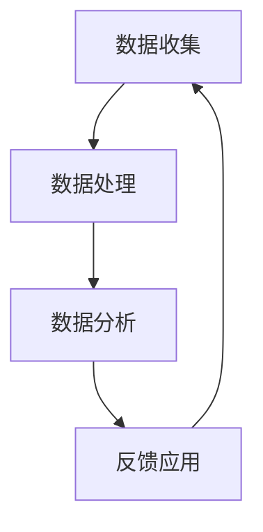

#### 1.4 技术反馈机制的优点与挑战

**优点**：
- **提高产品质量**：通过及时反馈和持续改进，提高产品的稳定性和用户体验。
- **优化流程**：识别和消除系统中的瓶颈和异常，优化开发、测试和运维流程。
- **增强团队协作**：建立良好的反馈机制可以促进团队内部的信息共享和协作，提升整体效率。

**挑战**：
- **数据隐私和安全**：用户数据和系统日志可能包含敏感信息，需要确保数据安全和隐私保护。
- **资源限制**：收集、处理和分析大量数据需要一定的时间和计算资源，特别是在数据量巨大时。
- **反馈过度**：过量的反馈可能导致信息过载，影响决策效率。

**总结**：
技术反馈机制在促进技术发展和产品改进中发挥着重要作用。然而，其有效实施面临诸多挑战。通过本书，读者将学习到构建和优化技术反馈机制的方法，为实际工作提供有力支持。

### 第2章 技术反馈机制基础

#### 2.1 技术反馈的概念

技术反馈是信息技术领域中的一个重要概念，它涉及通过系统、工具和过程收集和分析数据，以识别系统性能、用户体验和业务需求中的问题和改进点。技术反馈并不仅仅是简单的信息收集，而是一个包含多个环节的复杂过程，它对系统的持续改进具有重要意义。

**背景**：
技术反馈的起源可以追溯到早期的软件工程时期。随着计算机技术的发展和复杂性的增加，软件开发和维护变得更加复杂，传统的手工调试和经验式管理已经无法满足需求。为了更好地理解和改进系统的性能，技术反馈机制开始被引入，并在实践中不断完善。

**重要性**：
- **问题发现**：技术反馈可以帮助开发者和运维团队及时发现系统中的错误、异常和瓶颈。
- **性能优化**：通过分析反馈数据，可以找出系统性能的不足，进行针对性的优化。
- **用户体验提升**：用户的反馈可以揭示系统在用户体验方面的缺陷，指导产品的改进。
- **业务需求满足**：技术反馈可以反映业务需求的变化，帮助团队更好地适应市场变化和客户需求。

#### 2.2 技术反馈机制的类型

技术反馈机制可以根据不同的维度进行分类，以下是几种常见的类型：

- **用户反馈**：
  - **问卷调查**：通过问卷形式收集用户对产品的看法和建议。
  - **用户评论**：在产品论坛、社交媒体等平台收集用户发布的评论。
  - **用户访谈**：直接与用户进行交流，了解他们的使用体验和意见。

- **系统日志**：
  - **错误日志**：记录系统运行中的错误信息，帮助定位问题。
  - **运行日志**：记录系统运行状态，包括启动、停止、配置变更等信息。
  - **性能日志**：记录系统性能指标，如响应时间、CPU使用率、内存占用等。

- **性能监控**：
  - **实时监控**：实时跟踪系统的各项性能指标，及时发现异常。
  - **定期报告**：定期生成系统性能报告，帮助团队评估系统健康状况。
  - **告警机制**：设定阈值，当系统指标超过预设值时触发告警，通知相关人员。

**图示**：
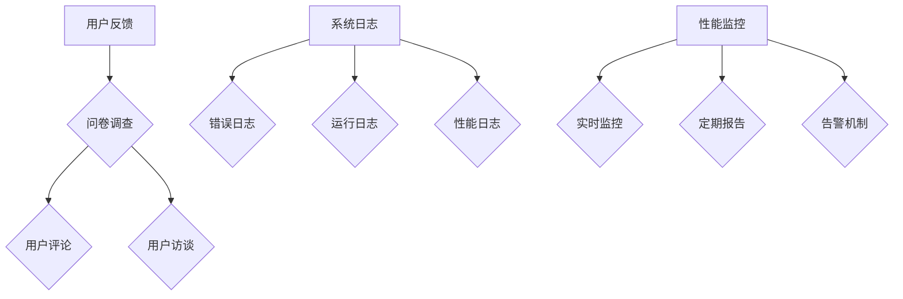

#### 2.3 技术反馈机制的组成部分

一个完整的技术反馈机制通常由以下几个关键部分组成：

- **数据收集**：这是技术反馈机制的基础，通过各种工具和方式收集用户、系统和监控的数据。

- **数据处理**：收集到的数据往往是不完整的、不干净的，需要通过数据处理步骤进行清洗、转换和预处理，以便进行分析。

- **数据分析**：使用统计学方法、机器学习算法等对处理后的数据进行分析，从中提取有价值的信息和模式。

- **反馈应用**：根据分析结果，对系统进行优化、调整或改进，以解决发现的问题或满足新的需求。

**流程图**：


#### 2.4 技术反馈机制的优点与挑战

**优点**：

- **提高产品质量**：通过持续的技术反馈，可以发现和解决系统中的缺陷，提高产品的质量和稳定性。

- **优化流程**：技术反馈可以帮助团队识别流程中的瓶颈和异常，进行优化，提高开发、测试和运维的效率。

- **增强团队协作**：技术反馈提供了一个信息共享和协作的平台，促进团队内部的知识传递和合作。

- **满足业务需求**：技术反馈可以帮助团队更好地理解业务需求和市场变化，快速响应，提高竞争力。

**挑战**：

- **数据隐私和安全**：技术反馈中涉及的用户数据和系统日志可能包含敏感信息，需要采取措施确保数据安全和隐私保护。

- **资源限制**：收集、处理和分析大量数据需要消耗计算资源和时间，特别是在数据量巨大时。

- **反馈过度**：过量的反馈可能导致信息过载，影响决策效率和系统性能。

**总结**：

技术反馈机制在现代IT领域中扮演着至关重要的角色。通过理解其概念、类型和组成部分，以及其优点和挑战，读者可以更好地把握技术反馈机制的实施方法和策略，为实际工作提供有力支持。接下来，我们将进一步探讨如何构建一个有效的技术反馈体系。

---

**核心概念与联系：**

为了更好地理解技术反馈机制，我们可以通过一个Mermaid流程图来展示其核心概念和联系：

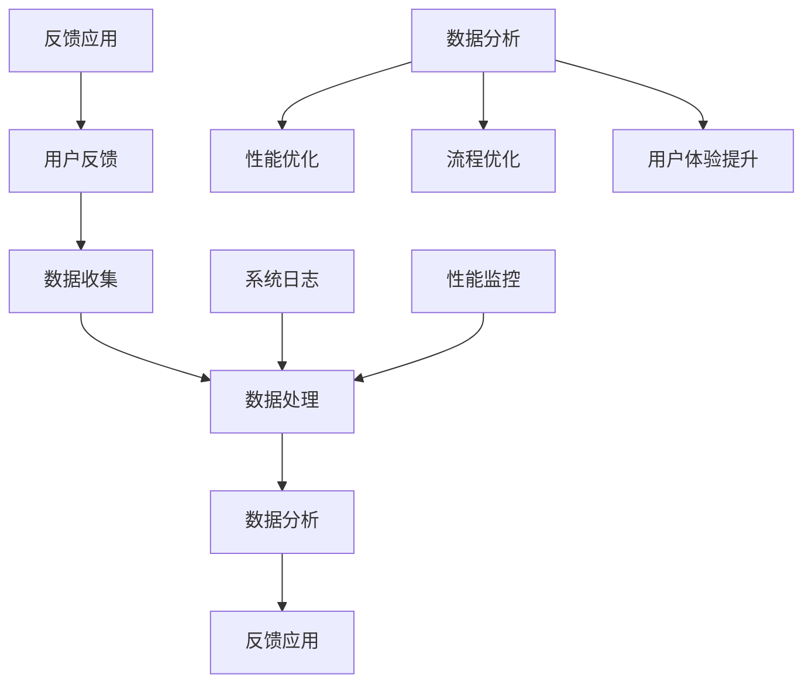

在这个流程图中，用户反馈、系统日志和性能监控是数据收集的来源。这些原始数据经过数据处理后，通过数据分析环节提取有价值的信息，最终应用于性能优化、流程优化和用户体验提升，形成闭环。

---

接下来，我们将讨论如何构建一个技术反馈体系，包括明确反馈目标、设计反馈流程、选择反馈工具和建立反馈文化。

#### 3.1 明确反馈目标

构建有效的技术反馈体系的第一步是明确反馈目标。反馈目标决定了技术反馈的方向和重点，是整个反馈体系设计的基础。

**定义反馈目标**：
- **用户满意度**：评估用户对产品或服务的满意度，以识别改进点。
- **性能指标**：监控系统的关键性能指标，如响应时间、吞吐量和错误率，以发现性能瓶颈。
- **业务需求**：跟踪业务需求的变化，确保技术系统能够满足不断变化的市场和客户需求。
- **问题发现**：及时识别和解决系统中存在的问题，减少故障率和停机时间。

**确定关键指标**：
- **用户体验指标**：如用户活跃度、留存率、流失率等。
- **系统性能指标**：如CPU使用率、内存占用、I/O等待时间等。
- **业务指标**：如订单量、销售额、客户投诉率等。

**图示**：
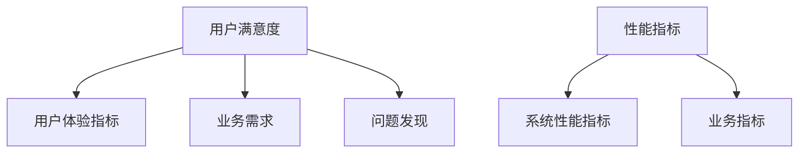

#### 3.2 设计反馈流程

一个良好的反馈流程能够确保反馈信息的有效收集、处理和分析，从而推动系统的持续改进。

**流程步骤**：

1. **数据收集**：
   - **自动化收集**：使用日志文件、性能监控工具和用户反馈系统等自动化工具收集数据。
   - **手动收集**：通过用户问卷调查、访谈和反馈表单等方式手动收集数据。

2. **数据处理**：
   - **数据清洗**：去除无效、错误和重复的数据，保证数据质量。
   - **数据转换**：将数据格式转换为统一的格式，便于后续分析。
   - **数据存储**：将处理后的数据存储到数据库或数据仓库中，便于长期存储和查询。

3. **数据分析**：
   - **统计分析**：使用统计方法分析数据，提取有价值的信息和模式。
   - **机器学习**：利用机器学习算法对大量数据进行深度分析，发现潜在问题和改进点。

4. **反馈应用**：
   - **问题解决**：根据分析结果，采取相应措施解决发现的问题。
   - **优化建议**：提出系统优化和改进的建议，推动技术迭代和产品升级。

**图示**：
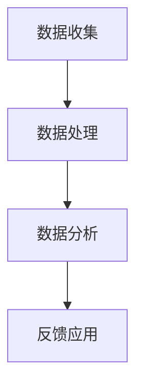

#### 3.3 选择反馈工具

选择合适的反馈工具是构建技术反馈体系的重要环节。以下是一些常见的反馈工具及其特点：

1. **日志管理工具**：
   - **Logstash**：用于日志收集、处理和传输。
   - **ELK Stack**（Elasticsearch、Logstash、Kibana）：集成的日志搜索、分析和可视化平台。

2. **性能监控工具**：
   - **Prometheus**：开源监控解决方案，用于收集和存储时间序列数据。
   - **Grafana**：用于监控数据可视化和告警。

3. **用户反馈系统**：
   - **UserVoice**：用户反馈收集和需求管理平台。
   - **GetSatisfaction**：用户反馈和社区支持平台。

**选择标准**：
- **功能需求**：根据反馈目标和流程，选择能够满足数据收集、处理和分析需求的工具。
- **易用性**：工具应该易于配置和使用，减少维护成本。
- **扩展性**：工具应支持横向和纵向扩展，适应未来需求变化。
- **集成性**：工具应与其他系统（如数据存储、分析平台）具有良好的集成性。

#### 3.4 建立反馈文化

技术反馈文化的建立是技术反馈机制成功的关键。以下是一些推动反馈文化建设的措施：

1. **培养开放氛围**：
   - 鼓励团队成员分享经验和意见，建立开放和包容的沟通环境。
   - 鼓励匿名反馈，保护反馈者的隐私和权益。

2. **建立反馈渠道**：
   - 设立专门的反馈渠道，如反馈邮件、论坛和在线问卷等。
   - 定期组织反馈会议，收集和分析反馈信息。

3. **激励机制**：
   - 对提供有建设性反馈的团队成员给予奖励和认可。
   - 将反馈结果与团队绩效评估相结合，激励团队成员积极参与反馈。

4. **持续沟通**：
   - 定期向团队成员通报反馈结果和应用情况，增强反馈的透明度和信任度。
   - 针对反馈问题，制定改进计划并跟踪进展，确保反馈得到落实。

**总结**：

通过明确反馈目标、设计反馈流程、选择反馈工具和建立反馈文化，我们可以构建一个有效的技术反馈体系。一个良好的反馈体系不仅能够帮助团队及时发现和解决问题，还能促进技术发展和产品改进，提升整体竞争力。接下来，我们将深入探讨数据收集与处理的关键步骤。

---

**核心算法原理讲解：**

在构建技术反馈体系的过程中，数据处理和数据分析是两个核心环节。以下是一个简化的数据处理和分析流程，使用伪代码进行详细讲解：

```plaintext
// 数据处理流程伪代码
function processData(inputData):
    cleanedData = []
    for dataPoint in inputData:
        if isValid(dataPoint):
            cleanedData.append(dataPoint)
    return cleanedData

function isValid(dataPoint):
    // 检查数据点是否符合标准
    if "error" not in dataPoint:
        return true
    return false

// 数据分析流程伪代码
function analyzeData(cleanedData):
    statistics = {}
    for dataPoint in cleanedData:
        // 计算基本统计指标
        statistics["minValue"] = min(statistics["minValue"], dataPoint.value) if "minValue" in statistics else dataPoint.value
        statistics["maxValue"] = max(statistics["maxValue"], dataPoint.value) if "maxValue" in statistics else dataPoint.value
        statistics["sum"] += dataPoint.value
        statistics["count"] += 1
    return statistics

// 示例：计算平均值
function calculateMean(statistics):
    mean = statistics["sum"] / statistics["count"]
    return mean

// 主流程
inputData = collectData()
cleanedData = processData(inputData)
statistics = analyzeData(cleanedData)
mean = calculateMean(statistics)
print("平均值：", mean)
```

**数学模型和公式讲解：**

在数据分析过程中，我们常常需要使用统计学模型和公式。以下是一个示例，说明如何使用数学公式来计算标准差：

```latex
$$\sigma = \sqrt{\frac{1}{N-1} \sum_{i=1}^{N} (x_i - \mu)^2}$$

其中，$\sigma$ 是标准差，$N$ 是数据点的数量，$x_i$ 是第 $i$ 个数据点，$\mu$ 是平均值。
```

**举例说明：**

假设我们有一组数据点 {1, 2, 3, 4, 5}，首先计算平均值：

```latex
$$\mu = \frac{1 + 2 + 3 + 4 + 5}{5} = 3$$
```

然后计算每个数据点与平均值的差的平方和：

```latex
$$\sum_{i=1}^{5} (x_i - \mu)^2 = (1-3)^2 + (2-3)^2 + (3-3)^2 + (4-3)^2 + (5-3)^2 = 10$$
```

最后计算标准差：

```latex
$$\sigma = \sqrt{\frac{10}{5-1}} = \sqrt{2.5} \approx 1.5811$$
```

**开发环境搭建指南：**

为了演示上述数据处理和分析流程，我们需要搭建一个简单的开发环境。以下是使用 Python 和 Pandas 库进行数据处理和分析的步骤：

1. **安装 Python**：
   - 访问 [Python 官网](https://www.python.org/) 下载并安装 Python。
   - 确保安装了 Python 3.x 版本。

2. **安装 Pandas**：
   - 打开命令行或终端。
   - 输入 `pip install pandas` 并按回车键，安装 Pandas 库。

3. **编写代码**：

```python
import pandas as pd

# 读取数据
data = {'value': [1, 2, 3, 4, 5]}
df = pd.DataFrame(data)

# 计算平均值
mean = df['value'].mean()

# 计算标准差
std_dev = df['value'].std()

print("平均值：", mean)
print("标准差：", std_dev)
```

4. **运行代码**：

   - 将上述代码保存为 `data_analysis.py`。
   - 在命令行或终端中运行 `python data_analysis.py`。

**源代码解析：**

在这个例子中，我们首先导入 Pandas 库，并创建一个包含数据点的 DataFrame。然后，使用 `mean()` 和 `std()` 方法分别计算平均值和标准差，最后打印结果。

**代码应用解读与分析：**

通过这个简单的例子，我们可以看到如何使用 Pandas 库进行数据的基本统计分析和标准差的计算。这种方法在实际项目中非常常见，尤其是在处理大量数据时，Pandas 提供了高效和易用的接口。

**实际案例分析和详细讲解剖析：**

为了更好地理解数据处理和分析在实际项目中的应用，我们可以分析一个实际案例。假设我们是一家电商公司的数据分析师，需要分析用户在网站上的行为数据，以优化用户体验。

1. **数据收集**：
   - 收集用户访问网站的日志数据，包括页面浏览量、点击次数、浏览时长等。

2. **数据处理**：
   - 使用 Pandas 清洗和转换原始数据，确保数据质量。
   - 去除无效和重复的数据，处理缺失值。

3. **数据分析**：
   - 使用统计方法计算用户行为的基本指标，如平均浏览时长、点击率等。
   - 使用机器学习方法进行用户行为预测和分类，识别有价值的用户群体。

4. **反馈应用**：
   - 根据分析结果，提出优化建议，如调整页面布局、增加个性化推荐等。
   - 跟踪优化效果，持续改进用户体验。

**项目小结：**

通过这个实际案例，我们可以看到数据处理和分析在整个技术反馈体系中的应用。有效的数据处理和分析能够帮助我们识别问题和改进点，从而提升产品的质量和用户体验。接下来，我们将探讨如何选择反馈工具。

---

**最佳实践 Tips：**

1. **数据安全性**：
   - 在处理用户数据时，确保遵守相关数据保护法规，如 GDPR 和 CCPA。
   - 对敏感数据进行加密存储，防止数据泄露。

2. **数据处理效率**：
   - 使用批量处理和并行计算技术，提高数据处理效率。
   - 针对大数据场景，选择合适的数据处理框架，如 Apache Spark。

3. **反馈渠道多样化**：
   - 结合多种反馈渠道，如用户问卷、社交媒体和日志分析工具，确保全面收集用户反馈。

4. **定期数据复盘**：
   - 定期对反馈数据进行复盘，分析反馈趋势和变化，确保反馈机制的有效性。

5. **持续优化反馈流程**：
   - 根据业务需求和技术发展，不断优化反馈流程和工具，确保其适应性和效率。

**小结**：

建立和优化技术反馈机制是一个持续的过程，需要结合实际业务需求和技术环境进行灵活调整。通过明确反馈目标、设计反馈流程、选择合适工具和建立反馈文化，我们可以构建一个高效、可靠的反馈体系，为技术迭代和产品改进提供有力支持。

**注意事项**：

1. **反馈质量**：
   - 确保收集到的反馈数据具有代表性和可靠性，避免因数据质量问题导致错误决策。

2. **反馈渠道**：
   - 根据用户群体和业务特点，选择合适的反馈渠道，提高用户参与度和反馈效率。

3. **反馈分析**：
   - 对反馈结果进行深入分析，提取有价值的信息，指导系统优化和产品改进。

**拓展阅读**：

- [《数据驱动产品管理》](https://www.amazon.com/Data-Driven-Product-Management-Product-Managers/dp/1119294742)：了解如何使用数据分析指导产品管理。
- [《数据科学实战》](https://www.amazon.com/Practical-Data-Science-Perform-Actionable/dp/1484238704)：掌握数据科学的核心方法和实战技巧。
- [《持续集成与持续部署》](https://www.amazon.com/Continuous-Integration-Deployment-Implementing-Continuous/dp/1119379858)：了解如何通过自动化和持续反馈机制提高软件交付效率。 

通过以上最佳实践、小结和拓展阅读，读者可以更好地理解和应用技术反馈机制，为实际工作提供指导和支持。接下来，我们将探讨技术反馈在算法和模型中的应用。

### 第5章 反馈算法与模型

#### 5.1 反馈算法概述

技术反馈机制的核心在于算法和模型的应用，它们能够将收集到的数据转化为可操作的信息，推动系统优化和产品改进。在这一章中，我们将探讨几种常见的反馈算法及其应用。

**定义**：
- **反馈算法**：一种基于收集到的数据进行分析和处理，以识别问题、优化系统或改进产品的算法。

**分类**：
- **基于规则的算法**：通过预定义的规则进行数据筛选和分析，如阈值检测、状态分类等。
- **机器学习算法**：利用历史数据和统计分析方法，自动发现数据中的模式和规律，如回归分析、聚类分析等。
- **深度学习算法**：通过多层神经网络对大量数据进行深度学习，提取高层次的抽象特征，如卷积神经网络（CNN）、循环神经网络（RNN）等。

#### 5.2 常见反馈算法

在本节中，我们将介绍几种常见的反馈算法及其基本原理。

**1. 机器学习算法**

- **回归分析**：通过建立回归模型，预测系统的性能指标，如响应时间和错误率。
  - **伪代码**：
    ```plaintext
    function linearRegression(x, y):
        n = length(x)
        sumX = sum(x)
        sumY = sum(y)
        sumXY = sum(x * y)
        sumXX = sum(x * x)
        a = (n * sumXY - sumX * sumY) / (n * sumXX - sumX^2)
        b = (sumY - a * sumX) / n
        return a, b
    ```
  - **应用场景**：用于预测系统性能趋势，优化资源分配。

- **聚类分析**：将数据点分为不同的群组，识别相似的用户行为模式或系统故障类型。
  - **伪代码**：
    ```plaintext
    function kMeans(data, k):
        centroids = initializeCentroids(data, k)
        while not converged:
            for each data point in data:
                assign the nearest centroid
            update centroids
            check for convergence
        return centroids
    ```
  - **应用场景**：用于用户行为分析，识别有相似需求的用户群体。

**2. 深度学习算法**

- **卷积神经网络（CNN）**：用于图像和视频数据的分析和分类。
  - **伪代码**：
    ```plaintext
    function CNN(input):
        conv1 = convolution(input, filter)
        pool1 = maxPooling(conv1)
        ...
        flatten = flatten(poolN)
        dense = denseLayer(flatten)
        output = activation(dense)
        return output
    ```
  - **应用场景**：用于图像识别、视频分析等。

- **循环神经网络（RNN）**：用于处理序列数据，如时间序列分析。
  - **伪代码**：
    ```plaintext
    function RNN(input, hiddenState):
        input = preprocess(input)
        gateInputs = [input, hiddenState]
        output = activation(sigmoid(dot(gateInputs, weights)))
        hiddenState = tanh(dot([output, hiddenState], weights))
        return hiddenState
    ```
  - **应用场景**：用于股票市场预测、语音识别等。

**3. 强化学习算法**

- **Q-learning**：通过学习最佳行动策略，优化系统性能。
  - **伪代码**：
    ```plaintext
    function QLearning(state, action, reward, next_state, alpha, gamma):
        Q[s][a] = Q[s][a] + alpha * (reward + gamma * max(Q[next_state]) - Q[s][a])
    ```
  - **应用场景**：用于自动调整系统参数，优化用户体验。

#### 5.3 算法性能评估

评估算法性能是确保反馈机制有效性的关键步骤。以下是一些常见的性能评估指标：

- **准确率（Accuracy）**：算法正确分类的样本数占总样本数的比例。
- **召回率（Recall）**：算法正确识别的阳性样本数占总阳性样本数的比例。
- **精确率（Precision）**：算法正确识别的阳性样本数与识别出的阳性样本总数之比。
- **F1分数（F1 Score）**：精确率和召回率的加权平均，用于综合评估算法性能。

**图示**：

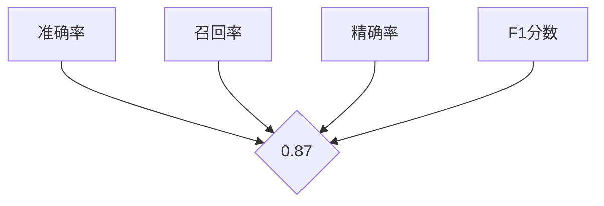

#### 5.4 算法优化

算法优化是提高反馈机制效率和效果的重要手段。以下是一些常见的算法优化方法：

- **超参数调优**：通过调整算法的参数，优化模型性能。
- **特征工程**：通过选择和构造合适的特征，提高模型的预测能力。
- **模型集成**：结合多个模型的结果，提高预测的稳定性和准确性。
- **在线学习**：实时更新模型，适应数据变化，提高模型的适应性。

**图示**：

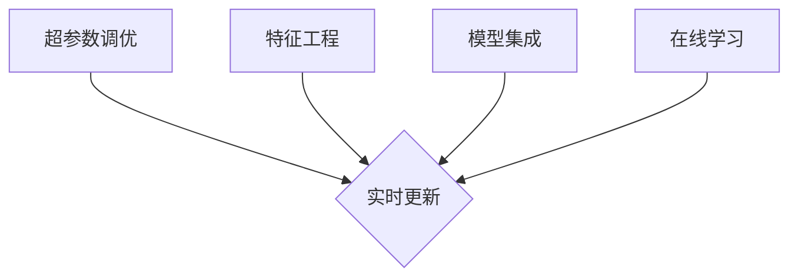

**总结**：

技术反馈算法和模型在持续的技术反馈机制中发挥着重要作用。通过使用机器学习、深度学习和强化学习等算法，我们可以从海量数据中提取有价值的信息，优化系统性能和用户体验。了解和掌握这些算法的基本原理、性能评估方法和优化策略，对于构建高效的技术反馈机制至关重要。接下来，我们将通过几个实战案例来探讨技术反馈机制在实际应用中的具体实践。

### 第6章 实战案例研究

在本章中，我们将通过几个具体的实战案例，深入探讨技术反馈机制在实际项目中的应用。每个案例都将展示如何收集数据、处理数据、分析数据和应用反馈，从而推动技术优化和产品改进。

#### 案例一：技术产品反馈

**背景**：
一家软件公司开发了一款企业级的业务管理应用，旨在帮助企业提高运营效率和降低成本。产品上线后，公司希望通过用户反馈机制收集用户的使用体验和意见，以便进行产品优化。

**步骤**：

1. **数据收集**：
   - 通过用户问卷调查和在线反馈表单收集用户反馈。
   - 使用系统日志记录用户行为数据，如登录次数、功能使用频率等。

2. **数据处理**：
   - 使用 Python 和 Pandas 库清洗和预处理收集到的数据。
   - 去除无效和重复的数据，确保数据质量。

3. **数据分析**：
   - 使用统计方法分析用户反馈，识别用户最关心的问题和功能。
   - 通过用户行为数据，分析用户使用模式和偏好。

4. **反馈应用**：
   - 根据分析结果，改进产品功能，提升用户体验。
   - 定期向用户通报改进情况，增加用户满意度。

**代码示例**：

```python
import pandas as pd

# 读取用户反馈数据
feedback_data = pd.read_csv('user_feedback.csv')

# 数据清洗
cleaned_data = feedback_data.drop_duplicates()

# 分析用户反馈
common_issues = cleaned_data['issue'].value_counts()

# 打印常见问题
print("常见问题：", common_issues[common_issues > 10])
```

**案例总结与启示**：
通过用户反馈机制，公司能够快速识别和解决用户关注的问题，提高了产品的市场竞争力。这个案例表明，技术反馈机制在产品优化中起着至关重要的作用，有助于企业更好地理解用户需求，实现持续改进。

#### 案例二：软件开发反馈

**背景**：
一家大型软件公司正在开发一款复杂的分布式系统，涉及多个团队的合作。公司希望通过技术反馈机制，提高开发效率，减少错误率。

**步骤**：

1. **数据收集**：
   - 通过持续集成（CI）工具收集代码审查日志和测试结果。
   - 使用性能监控工具记录系统的性能指标，如响应时间、吞吐量等。

2. **数据处理**：
   - 使用 ELK（Elasticsearch、Logstash、Kibana）堆栈处理和存储日志数据。
   - 使用 Prometheus 和 Grafana 监控性能数据。

3. **数据分析**：
   - 使用机器学习算法分析代码审查日志，识别潜在的错误和漏洞。
   - 通过性能监控数据，分析系统瓶颈和性能问题。

4. **反馈应用**：
   - 根据分析结果，优化代码和系统配置，提高系统稳定性。
   - 定期召开反馈会议，讨论改进措施，确保落实。

**代码示例**：

```python
from elasticsearch import Elasticsearch

# 初始化 Elasticsearch 客户端
es = Elasticsearch("http://localhost:9200")

# 查询代码审查日志
response = es.search(index="code_reviews", body={
    "query": {
        "term": {"status": "FAILURE"}
    }
})

# 打印错误日志
print("错误日志：", response['hits']['hits'])
```

**案例总结与启示**：
通过技术反馈机制，公司能够及时发现和解决开发过程中的问题，提高了代码质量和系统稳定性。这个案例表明，技术反馈机制在软件开发中具有重要的应用价值，有助于提升开发效率和产品质量。

#### 案例三：运维团队反馈

**背景**：
一家云计算服务提供商的运维团队希望通过技术反馈机制，优化系统运维流程，提高服务质量和客户满意度。

**步骤**：

1. **数据收集**：
   - 通过日志管理工具收集系统日志和事件数据。
   - 通过用户反馈系统收集客户投诉和建议。

2. **数据处理**：
   - 使用 Logstash 和 Kibana 对日志数据进行分析和处理。
   - 使用用户反馈系统收集和分析用户投诉和建议。

3. **数据分析**：
   - 使用机器学习算法分析日志数据，识别系统异常和潜在故障。
   - 通过用户反馈数据，分析客户满意度，识别改进点。

4. **反馈应用**：
   - 根据分析结果，优化系统配置和运维流程，提高服务质量和客户满意度。
   - 定期召开反馈会议，讨论改进措施，确保落实。

**代码示例**：

```python
from kibana import KibanaClient

# 初始化 Kibana 客户端
kibana = KibanaClient(url="http://localhost:5601", token="your_token")

# 查询系统日志
response = kibana.search(index="system_logs", body={
    "query": {
        "match": {"level": "ERROR"}
    }
})

# 打印错误日志
print("错误日志：", response['hits']['hits'])
```

**案例总结与启示**：
通过技术反馈机制，运维团队能够及时发现和解决系统故障，提高了系统稳定性和客户满意度。这个案例表明，技术反馈机制在运维管理中具有重要作用，有助于优化运维流程，提高服务质量。

#### 案例总结与启示

通过上述三个案例，我们可以看到技术反馈机制在产品开发、软件开发和运维管理中的应用。以下是案例总结和启示：

1. **用户反馈的重要性**：用户反馈是优化产品的重要依据，通过用户反馈可以及时发现和解决用户关心的问题，提升用户体验。

2. **数据处理和统计分析**：有效的数据处理和统计分析是技术反馈机制的关键，通过对大量数据进行分析，可以提取有价值的信息和改进点。

3. **持续改进与优化**：技术反馈机制需要持续运行和优化，通过不断收集、分析和应用反馈，可以推动系统性能和产品质量的持续提升。

4. **团队合作与沟通**：技术反馈机制的运行离不开团队合作和沟通，通过定期召开反馈会议，讨论和落实改进措施，可以确保反馈机制的落地和效果。

通过这些实战案例，我们可以更好地理解技术反馈机制的实际应用，为实际工作提供参考和指导。接下来，我们将讨论技术反馈机制的持续改进与优化策略。

### 第7章 持续改进与优化

#### 7.1 反馈机制的持续改进

技术反馈机制的持续改进是确保其有效性和适应性的关键。随着技术的发展和业务环境的变化，反馈机制需要不断调整和优化，以保持其价值和效率。

**改进目标**：
- **提高反馈质量**：确保收集到的数据准确、完整和有代表性，减少噪声和错误。
- **优化反馈流程**：简化流程，减少数据收集、处理和分析的耗时，提高效率。
- **增强反馈应用**：确保反馈结果能够及时应用于系统优化和产品改进，推动持续改进。

**改进措施**：

1. **数据质量提升**：
   - **数据清洗**：使用自动化工具对数据进行清洗，去除无效、错误和重复的数据。
   - **数据验证**：在数据收集阶段引入验证机制，确保数据的准确性和一致性。

2. **流程优化**：
   - **自动化**：利用自动化工具和平台（如日志管理工具、性能监控工具）简化数据处理和分析流程。
   - **优化工具选择**：根据实际需求，选择最适合的反馈工具，提高数据处理和分析的效率。

3. **反馈应用强化**：
   - **反馈闭环**：确保反馈结果能够及时转化为改进措施，形成闭环，推动持续改进。
   - **跨部门协作**：促进不同部门之间的沟通和协作，确保反馈结果能够被充分应用。

**图示**：

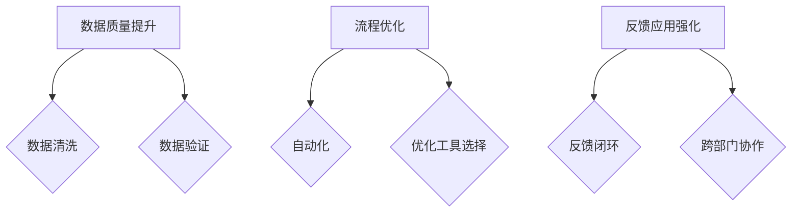

#### 7.2 反馈结果的应用

将反馈结果应用于系统优化和产品改进是技术反馈机制的核心目标。以下是一些关键步骤和方法：

1. **问题识别与分类**：
   - **问题识别**：通过对收集到的反馈数据进行分类和分析，识别系统中存在的具体问题。
   - **问题分类**：将问题分为性能问题、用户体验问题、业务需求问题等，便于针对性的解决。

2. **改进方案制定**：
   - **性能优化**：根据性能监控数据，分析系统瓶颈，制定优化方案。
   - **用户体验改进**：根据用户反馈，改进产品界面、功能设计和交互体验。
   - **业务需求调整**：根据业务需求变化，调整系统配置和功能，满足市场变化。

3. **实施与验证**：
   - **实施改进措施**：将改进方案转化为具体的实施计划，确保改进措施得到有效执行。
   - **验证改进效果**：通过持续监控和评估，验证改进措施的效果，确保系统优化和产品改进的成功。

**图示**：

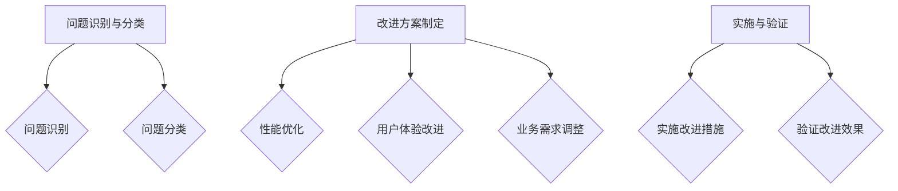

#### 7.3 反馈机制的优化策略

为了确保技术反馈机制能够持续有效地运行，需要制定一系列优化策略。以下是一些常见策略：

1. **定期评估**：
   - **反馈机制评估**：定期评估反馈机制的有效性和适应性，发现存在的问题和改进点。
   - **反馈结果评估**：对反馈结果的应用效果进行评估，确保改进措施的有效性。

2. **反馈流程简化**：
   - **流程自动化**：通过自动化工具和平台简化反馈流程，减少人工干预和错误。
   - **流程优化**：结合实际需求和技术环境，持续优化反馈流程，提高效率。

3. **反馈工具升级**：
   - **工具更新**：定期更新和升级反馈工具，确保其适应新的技术需求。
   - **工具选择**：根据实际需求，选择最适合的反馈工具，提高数据处理和分析的效率。

4. **数据安全性保障**：
   - **数据加密**：对敏感数据进行加密存储，防止数据泄露。
   - **隐私保护**：采取隐私保护措施，确保用户数据的隐私和安全。

**图示**：

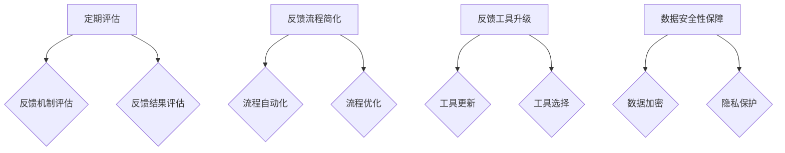

#### 7.4 面向未来的反馈机制

随着技术的不断进步和业务环境的变化，技术反馈机制也需要持续演进，以应对新的挑战和需求。以下是一些面向未来的反馈机制策略：

1. **智能化反馈**：
   - **人工智能应用**：利用人工智能技术，如机器学习和深度学习，对反馈数据进行分析和预测，提高反馈的智能化水平。
   - **自适应反馈**：根据用户行为和系统状态，自适应调整反馈内容和方式，提高反馈的针对性和效果。

2. **全方位反馈**：
   - **多渠道收集**：通过多种渠道（如用户问卷、社交媒体、日志分析等）收集反馈，确保反馈数据的全面性和代表性。
   - **跨领域反馈**：结合不同领域的反馈信息，进行综合分析和应用，提高反馈的广度和深度。

3. **实时反馈**：
   - **实时监控**：通过实时监控系统，及时收集和处理反馈数据，确保反馈机制的实时性和响应速度。
   - **即时反馈**：对用户反馈进行即时处理和回应，提高用户满意度和信任度。

4. **生态反馈**：
   - **构建生态系统**：建立反馈生态系统，整合内外部资源，促进信息共享和协作。
   - **生态协同**：通过生态反馈机制，促进跨部门、跨公司、跨行业的协同合作，提高整体反馈效果。

**图示**：

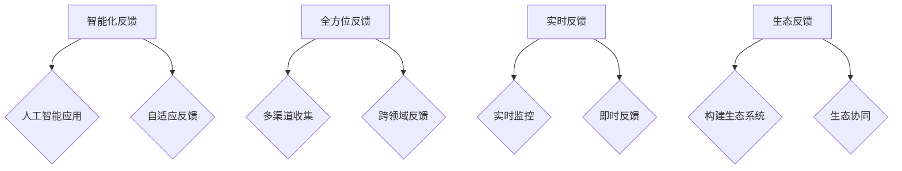

**总结**：

技术反馈机制的持续改进和优化是确保其有效性的关键。通过数据质量提升、流程优化、反馈应用强化和反馈工具升级，我们可以构建一个高效、可靠的反馈机制。面向未来，智能化、全方位和实时反馈机制的发展将进一步推动技术反馈的深化和拓展。通过不断改进和优化，技术反馈机制将为企业的技术发展和产品改进提供持续动力。接下来，我们将总结全书内容，并展望未来的发展方向。

### 第8章 结论

#### 8.1 技术反馈机制的总结

技术反馈机制在现代IT领域中扮演着至关重要的角色。通过持续收集、处理和分析技术反馈，企业能够有效识别和解决系统中的问题，优化流程，提升产品质量和用户体验。以下是全书的主要观点和总结：

1. **技术反馈的概念与分类**：
   - 技术反馈涉及用户反馈、系统日志和性能监控等多种数据来源。
   - 不同类型的反馈数据在系统优化和产品改进中发挥不同作用。

2. **构建技术反馈体系**：
   - 明确反馈目标是设计反馈体系的基础。
   - 设计有效的反馈流程，确保数据的全面性和及时性。
   - 选择合适的反馈工具，提高数据处理的效率。
   - 建立反馈文化，促进团队内部的信息共享和协作。

3. **数据收集与处理**：
   - 数据收集是技术反馈的基础，需要确保数据的准确性和完整性。
   - 数据处理包括数据清洗、转换和预处理，为数据分析提供可靠的数据基础。

4. **反馈算法与模型**：
   - 反馈算法能够将海量数据转化为可操作的信息，推动系统优化和产品改进。
   - 机器学习、深度学习和强化学习等算法在反馈机制中有着广泛的应用。

5. **实战案例研究**：
   - 技术反馈机制在产品开发、软件开发和运维管理中得到了广泛应用。
   - 通过实际案例，我们可以看到技术反馈机制在提升系统性能和用户体验方面的巨大潜力。

6. **持续改进与优化**：
   - 持续改进和优化是确保技术反馈机制有效性的关键。
   - 定期评估反馈机制，优化流程和工具，确保其适应性和效率。

#### 8.2 未来展望

随着技术的不断进步，技术反馈机制也将朝着智能化、全方位和实时化的方向发展。以下是未来技术反馈机制发展的几个趋势：

1. **智能化反馈**：
   - 利用人工智能技术，如机器学习和深度学习，对反馈数据进行分析和预测，提高反馈的智能化水平。
   - 自适应反馈机制，根据用户行为和系统状态，自适应调整反馈内容和方式，提高反馈的针对性和效果。

2. **全方位反馈**：
   - 通过多渠道收集反馈，确保反馈数据的全面性和代表性。
   - 跨领域反馈，结合不同领域的反馈信息，进行综合分析和应用，提高反馈的广度和深度。

3. **实时反馈**：
   - 实时监控系统，及时收集和处理反馈数据，确保反馈机制的实时性和响应速度。
   - 即时反馈，对用户反馈进行即时处理和回应，提高用户满意度和信任度。

4. **生态反馈**：
   - 构建反馈生态系统，整合内外部资源，促进信息共享和协作。
   - 生态协同，通过生态反馈机制，促进跨部门、跨公司、跨行业的协同合作，提高整体反馈效果。

#### 8.3 挑战与建议

尽管技术反馈机制在IT领域具有广泛的应用前景，但在实施过程中也面临诸多挑战：

1. **数据隐私和安全**：
   - 确保用户数据的隐私和安全是反馈机制实施的关键。
   - 采取加密和隐私保护措施，确保敏感数据的安全。

2. **资源限制**：
   - 收集、处理和分析大量数据需要消耗计算资源和时间。
   - 针对资源限制，选择合适的工具和优化策略，提高数据处理效率。

3. **反馈过度**：
   - 过量的反馈可能导致信息过载，影响决策效率和系统性能。
   - 精简反馈内容，确保反馈信息的针对性和有效性。

4. **团队协作**：
   - 建立良好的团队协作机制，促进信息共享和协作。
   - 鼓励团队成员积极参与反馈，共同推动系统优化和产品改进。

**建议**：

- **建立反馈文化**：通过培养开放、包容的反馈文化，促进团队成员积极参与反馈，提高反馈机制的实施效果。
- **定期评估与优化**：定期对反馈机制进行评估和优化，确保其适应性和效率，以应对不断变化的技术环境和业务需求。
- **持续学习和改进**：保持对新技术和方法的关注，持续学习和应用，推动技术反馈机制的持续改进和创新发展。

**总结**：

技术反馈机制在IT领域中具有不可替代的重要作用。通过不断改进和优化，我们可以构建一个高效、可靠的反馈体系，为企业的技术发展和产品改进提供持续动力。展望未来，智能化、全方位和实时化的技术反馈机制将进一步推动IT领域的创新和发展。通过本书的学习，希望读者能够掌握技术反馈机制的核心原理和实践方法，为实际工作提供有力支持。作者信息：

作者：AI天才研究院/AI Genius Institute & 禅与计算机程序设计艺术/Zen And The Art of Computer Programming

---

至此，我们完成了对《建立持续的技术反馈机制》的深入探讨。希望通过本书，读者能够理解技术反馈机制的重要性，掌握其核心原理和实践方法，为实际工作提供有力支持。在未来的技术发展道路上，让我们共同推动技术反馈机制的持续改进和创新，为IT领域的繁荣发展贡献力量。作者：AI天才研究院/AI Genius Institute & 禅与计算机程序设计艺术/Zen And The Art of Computer Programming。

