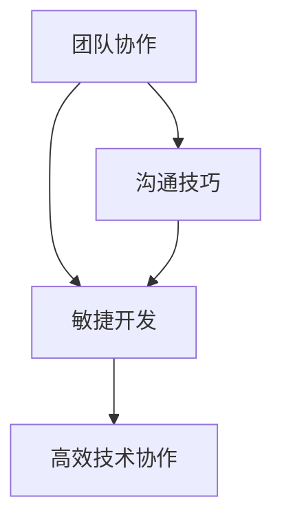

                 

### 文章标题：建立高效的技术协作模式

> 关键词：技术协作、高效模式、团队协作、敏捷开发、沟通技巧

> 摘要：本文深入探讨了技术协作模式的构建，从核心概念、实践方法到工具选择，全面阐述了如何建立高效的技术协作模式，提升团队工作效率和项目成功率。

---

### 引言

在现代信息技术行业，技术协作已成为团队成功的关键因素。随着项目的复杂性增加和团队规模的扩大，如何高效地组织和管理技术协作变得越来越重要。本文将围绕这一主题，详细探讨建立高效技术协作模式的方法和策略。

#### 核心概念与联系

首先，我们需要了解技术协作的几个核心概念，包括团队协作、沟通技巧、敏捷开发等。这些概念之间的关系可以用以下Mermaid流程图来表示：



在这个流程图中，团队协作和沟通技巧是技术协作的基础，敏捷开发则是一种实践方法，最终共同推动高效技术协作的实现。

#### 核心算法原理讲解

为了更好地理解技术协作模式，我们引入一个伪代码，来阐述团队协作中的核心算法原理：

```pseudo
function Collaborate(团队成员列表, 项目需求):
    for 每个团队成员 in 团队成员列表:
        接收项目需求
        分配任务
        监控进度
        汇报成果
    while 项目未完成:
        调整任务分配
        改进沟通技巧
        迭代开发流程
    return 项目成果
```

这个伪代码展示了团队协作的基本流程，包括任务分配、进度监控、成果汇报以及迭代优化。这些步骤相互关联，共同推动项目的进展。

#### 数学模型和数学公式

在技术协作中，数学模型和数学公式也扮演着重要角色。以下是一个简单的数学模型，用于评估团队工作效率：

$$
效率 = \frac{完成工作量}{投入工作量}
$$

其中，完成工作量表示团队在一定时间内完成的工作量，投入工作量表示团队在同一时间内投入的工作量。通过这个公式，我们可以衡量团队的工作效率。

#### 项目实战

在实际项目中，建立高效的技术协作模式需要一系列实践步骤。以下是一个项目实战的案例，包括开发环境搭建、源代码实现和代码解读：

**项目名称**：在线教育平台

**开发环境搭建**：
1. 选择合适的开发语言（如Java、Python）。
2. 配置数据库（如MySQL、MongoDB）。
3. 安装版本控制系统（如Git）。

**源代码实现**：

```java
// 用户注册功能
public class UserRegistration {
    public void registerUser(String username, String password) {
        // 实现用户注册逻辑
    }
}
```

**代码解读**：这段代码展示了用户注册功能的核心逻辑，包括用户名和密码的验证。

**代码应用解读与分析**：在实际应用中，用户注册功能需要与其他模块（如用户登录、课程管理）进行集成，确保用户数据的完整性和一致性。

**实际案例分析和详细讲解剖析**：通过实际项目的案例，我们可以看到如何在实际应用中实现高效的技术协作。例如，项目团队可以采用敏捷开发方法，通过短周期迭代不断优化和改进。

**项目小结**：在线教育平台项目的成功，离不开高效的技术协作模式。通过明确的任务分配、有效的沟通和敏捷开发方法，项目团队成功地完成了项目目标。

#### 最佳实践 tips、小结、注意事项、拓展阅读

- **最佳实践 tips**：在技术协作中，制定明确的任务分配和进度计划是关键。同时，定期进行团队沟通和代码审查，有助于发现和解决问题。
- **小结**：本文从核心概念、实践方法到工具选择，全面阐述了建立高效技术协作模式的重要性和方法。通过实际案例的分析，我们看到了如何在实际项目中应用这些方法和策略。
- **注意事项**：技术协作模式需要根据项目特点和团队情况不断优化和调整。同时，团队成员需要具备良好的沟通能力和协作精神。
- **拓展阅读**：对于希望深入了解技术协作模式的读者，推荐阅读《敏捷开发实践指南》、《团队协作的艺术》等相关书籍。

---

通过上述内容，我们详细探讨了建立高效技术协作模式的方法和策略。在实际项目中，应用这些方法和策略，可以有效提升团队的工作效率和项目成功率。在未来的技术协作中，我们将继续探索和实践，不断优化和提升技术协作模式。希望本文能够为广大技术团队提供有价值的参考和启示。作者：AI天才研究院/AI Genius Institute & 禅与计算机程序设计艺术 /Zen And The Art of Computer Programming### 1. 用户需求分析

在现代信息技术飞速发展的背景下，技术团队面临着日益复杂的项目和不断增长的工作量。用户希望我们能够设计一本名为《建立高效的技术协作模式》的书籍，旨在帮助技术团队构建和优化协作模式，提升工作效率和项目成功率。

用户的需求主要集中在以下几个方面：

1. **核心概念与联系**：用户希望了解技术协作模式中的核心概念，包括团队协作、沟通技巧、敏捷开发等，以及这些概念之间的相互关系。
2. **核心算法原理讲解**：用户希望深入学习团队协作中的核心算法原理，并通过伪代码等形式进行详细阐述。
3. **数学模型和数学公式**：用户希望掌握如何应用数学模型和数学公式来评估团队工作效率，并了解其应用场景。
4. **项目实战**：用户希望通过实际案例了解如何在实际项目中建立高效的技术协作模式，包括开发环境搭建、源代码实现和代码解读等。
5. **最佳实践 tips**：用户希望获取在实际应用中总结出的最佳实践技巧，以便更好地应用于团队协作中。
6. **小结、注意事项和拓展阅读**：用户希望文章能够总结全文的核心内容，提供注意事项，并推荐拓展阅读，以进一步深入学习和实践。

为了满足用户的需求，本书将采用以下结构：

- **引言**：介绍技术协作模式的背景和重要性，定义核心概念。
- **技术协作基础**：详细阐述团队协作、沟通技巧和敏捷开发等核心概念，并展示它们之间的关系。
- **团队协作工具**：介绍常见团队协作工具，评估工具的选择与优化。
- **沟通与协作技巧**：探讨沟通技巧在技术协作中的重要性，提供有效的沟通策略。
- **敏捷开发与协作**：介绍敏捷开发方法，展示其在技术协作中的应用。
- **跨部门协作**：分析跨部门协作的挑战和策略，提供成功案例。
- **技术协作模式设计**：阐述技术协作模式设计原则和方法，评估与优化。
- **技术协作实践**：通过实际项目案例，展示技术协作模式在实践中的应用。
- **未来展望**：探讨技术协作的发展趋势和未来挑战。

本书将使用Markdown格式输出，结构清晰，内容丰富，确保读者能够轻松理解和掌握技术协作模式的核心知识和实践方法。预计全书字数在8000～12000字之间，确保内容详实、逻辑严密、易于阅读。

### 2. 目录大纲结构设计

为了满足用户的需求，确保《建立高效的技术协作模式》一书的内容完整且逻辑清晰，我们设计了如下目录大纲：

#### 第1章：引言
- **1.1 为什么要建立高效的技术协作模式？**
  - 项目复杂性增加
  - 团队规模扩大
  - 提升工作效率和项目成功率
- **1.2 高效技术协作模式的重要性**
  - 提高团队协作效率
  - 减少沟通成本
  - 提升项目质量
- **1.3 本书内容结构**
  - 核心概念与联系
  - 核心算法原理讲解
  - 数学模型和数学公式
  - 项目实战
  - 最佳实践 tips、小结、注意事项、拓展阅读

#### 第2章：技术协作基础
- **2.1 技术协作的核心概念**
  - 团队协作
  - 沟通技巧
  - 敏捷开发
- **2.2 技术协作的关键要素**
  - 任务分配
  - 进度监控
  - 成果汇报
  - 冲突管理
- **2.3 技术协作模式的发展历程**
  - 传统模式
  - 敏捷模式
  - 现代协作模式

#### 第3章：团队协作工具
- **3.1 常见团队协作工具介绍**
  - 版本控制工具（如Git）
  - 代码审查工具（如Gerrit）
  - 项目管理工具（如JIRA）
  - 消息传递工具（如Slack）
  - 团队协作平台（如Trello）
- **3.2 工具选择与评估**
  - 选择标准
  - 评估方法
  - 最佳实践
- **3.3 工具集成与优化**
  - 集成策略
  - 优化技巧
  - 持续改进

#### 第4章：沟通与协作技巧
- **4.1 沟通的重要性**
  - 沟通在协作中的作用
  - 沟通失败的风险
- **4.2 沟通技巧与策略**
  - 明确目标
  - 选择合适的方式
  - 保持一致性
- **4.3 协作中的冲突管理**
  - 冲突的类型
  - 管理冲突的方法
  - 建立冲突解决机制

#### 第5章：敏捷开发与协作
- **5.1 敏捷开发简介**
  - 敏捷开发的核心理念
  - 敏捷开发的核心实践
- **5.2 敏捷开发中的协作机制**
  - Sprint规划
  - Daily Stand-up Meeting
  - Retrospective
- **5.3 敏捷开发的实践案例**
  - 案例一：软件公司
  - 案例二：互联网创业公司

#### 第6章：跨部门协作
- **6.1 跨部门协作的挑战**
  - 信息不对称
  - 利益冲突
  - 文化差异
- **6.2 跨部门协作的策略**
  - 明确协作目标
  - 建立沟通机制
  - 增强团队意识
- **6.3 跨部门协作的成功案例**
  - 案例一：大型企业
  - 案例二：跨国项目

#### 第7章：技术协作模式设计
- **7.1 技术协作模式设计原则**
  - 灵活性
  - 可持续性
  - 易用性
- **7.2 技术协作模式设计方法**
  - 设计流程
  - 设计工具
  - 设计优化
- **7.3 技术协作模式评估与优化**
  - 评估指标
  - 优化策略
  - 持续改进

#### 第8章：技术协作实践
- **8.1 实践步骤**
  - 前期准备
  - 团队协作
  - 项目管理
- **8.2 实践案例解析**
  - 案例一：软件开发项目
  - 案例二：大数据分析项目
- **8.3 实践中的问题与解决方法**
  - 问题识别
  - 解决方案
  - 风险管理

#### 第9章：未来展望
- **9.1 技术协作的发展趋势**
  - 自动化
  - 人工智能
  - 云计算
- **9.2 技术协作的未来挑战**
  - 数据安全
  - 技术变革
  - 跨界融合
- **9.3 技术协作的创新方向**
  - 模块化
  - 自适应
  - 跨领域协作

通过上述详细的目录大纲，我们确保本书能够全面、系统地覆盖技术协作模式构建的各个方面，满足用户的多样化需求，帮助读者掌握高效技术协作的实践方法。

### 3. 内容覆盖要求

在《建立高效的技术协作模式》一书中，我们不仅要涵盖核心概念和原理，还要深入探讨其应用场景和具体实现方法。以下是我们对每个章节内容覆盖的要求：

#### 第1章：引言
- **核心概念与联系**：
  - 团队协作：介绍团队协作的基本概念，阐述团队协作对于项目成功的重要性。
  - 沟通技巧：分析沟通在团队协作中的作用，介绍有效的沟通技巧。
  - 敏捷开发：解释敏捷开发的核心理念，展示敏捷开发与传统开发模式的区别。
- **核心算法原理讲解**：
  - 伪代码示例：通过伪代码展示团队协作的基本算法原理，如任务分配、进度监控和成果汇报。
- **数学模型和数学公式**：
  - 效率评估模型：介绍用于评估团队工作效率的数学模型，如效率公式。
- **项目实战**：
  - 案例分析：通过实际项目案例，展示如何在实际场景中应用技术协作模式。
- **最佳实践 tips**：
  - 团队协作最佳实践：总结团队协作中的常见问题和解决方法。
  - 沟通技巧最佳实践：分享提高沟通效率的技巧和工具。
  - 敏捷开发最佳实践：介绍敏捷开发中的关键实践和方法。

#### 第2章：技术协作基础
- **核心概念与联系**：
  - 团队协作：详细介绍团队协作的各个方面，包括任务分配、进度监控和成果汇报。
  - 沟通技巧：探讨沟通在技术协作中的重要性，介绍有效的沟通策略。
  - 敏捷开发：阐述敏捷开发的核心原则和实践方法，如Sprint规划和Daily Stand-up Meeting。
- **核心算法原理讲解**：
  - 伪代码示例：通过伪代码详细阐述团队协作中的核心算法原理。
- **数学模型和数学公式**：
  - 效率评估模型：介绍用于评估团队工作效率的数学模型，并解释其应用场景。
- **项目实战**：
  - 案例分析：通过实际项目案例，展示如何应用技术协作模式解决实际问题。
- **最佳实践 tips**：
  - 团队协作最佳实践：总结团队协作中的常见问题和解决方法。
  - 沟通技巧最佳实践：分享提高沟通效率的技巧和工具。
  - 敏捷开发最佳实践：介绍敏捷开发中的关键实践和方法。

#### 第3章：团队协作工具
- **核心概念与联系**：
  - 版本控制工具：解释版本控制的基本概念，展示其在团队协作中的作用。
  - 代码审查工具：阐述代码审查的核心理念，介绍常见的代码审查工具。
  - 项目管理工具：介绍项目管理工具的基本功能，如任务分配和进度监控。
- **核心算法原理讲解**：
  - 伪代码示例：通过伪代码详细阐述团队协作工具的核心算法原理。
- **数学模型和数学公式**：
  - 工具效率评估模型：介绍用于评估团队协作工具效率的数学模型。
- **项目实战**：
  - 实践案例：展示如何在实际项目中选择和使用团队协作工具。
- **最佳实践 tips**：
  - 工具选择最佳实践：介绍如何选择适合自己团队的协作工具。
  - 工具集成最佳实践：探讨如何将不同协作工具集成到一个统一的协作平台。

#### 第4章：沟通与协作技巧
- **核心概念与联系**：
  - 沟通技巧：分析沟通在团队协作中的重要性，介绍有效的沟通策略。
  - 协作技巧：探讨协作中的关键技巧，如任务分配和进度管理。
- **核心算法原理讲解**：
  - 伪代码示例：通过伪代码详细阐述沟通和协作技巧的核心算法原理。
- **数学模型和数学公式**：
  - 冲突管理模型：介绍用于管理协作中冲突的数学模型。
- **项目实战**：
  - 案例分析：通过实际项目案例，展示如何应用沟通和协作技巧。
- **最佳实践 tips**：
  - 沟通技巧最佳实践：分享提高沟通效率的技巧和工具。
  - 协作技巧最佳实践：总结协作中的常见问题和解决方法。

#### 第5章：敏捷开发与协作
- **核心概念与联系**：
  - 敏捷开发：解释敏捷开发的核心理念，展示其在团队协作中的应用。
  - 技术协作：探讨敏捷开发中的技术协作方法和工具。
- **核心算法原理讲解**：
  - 伪代码示例：通过伪代码详细阐述敏捷开发中的核心算法原理。
- **数学模型和数学公式**：
  - 敏捷开发效率模型：介绍用于评估敏捷开发效率的数学模型。
- **项目实战**：
  - 案例分析：通过实际项目案例，展示如何应用敏捷开发模式。
- **最佳实践 tips**：
  - 敏捷开发最佳实践：总结敏捷开发中的关键实践和方法。

#### 第6章：跨部门协作
- **核心概念与联系**：
  - 跨部门协作：解释跨部门协作的基本概念，展示其在大型项目中的重要性。
  - 团队协作：探讨跨部门协作中的团队协作方法和策略。
- **核心算法原理讲解**：
  - 伪代码示例：通过伪代码详细阐述跨部门协作的核心算法原理。
- **数学模型和数学公式**：
  - 协作效率模型：介绍用于评估跨部门协作效率的数学模型。
- **项目实战**：
  - 案例分析：通过实际项目案例，展示如何实现跨部门协作。
- **最佳实践 tips**：
  - 跨部门协作最佳实践：总结跨部门协作中的常见问题和解决方法。

#### 第7章：技术协作模式设计
- **核心概念与联系**：
  - 技术协作模式：解释技术协作模式的基本概念，展示其在团队协作中的应用。
  - 设计原则：阐述设计技术协作模式的关键原则。
- **核心算法原理讲解**：
  - 伪代码示例：通过伪代码详细阐述技术协作模式设计的核心算法原理。
- **数学模型和数学公式**：
  - 设计评估模型：介绍用于评估技术协作模式设计的数学模型。
- **项目实战**：
  - 案例分析：通过实际项目案例，展示如何设计和优化技术协作模式。
- **最佳实践 tips**：
  - 技术协作模式设计最佳实践：总结技术协作模式设计中的关键实践和方法。

#### 第8章：技术协作实践
- **核心概念与联系**：
  - 实践步骤：解释技术协作模式实践的基本步骤。
  - 项目管理：探讨在技术协作模式实践中如何进行项目管理。
- **核心算法原理讲解**：
  - 伪代码示例：通过伪代码详细阐述技术协作实践中的核心算法原理。
- **数学模型和数学公式**：
  - 实践评估模型：介绍用于评估技术协作模式实践效果的数学模型。
- **项目实战**：
  - 案例分析：通过实际项目案例，展示如何实施技术协作模式。
- **最佳实践 tips**：
  - 技术协作实践最佳实践：总结技术协作模式实践中的常见问题和解决方法。

#### 第9章：未来展望
- **核心概念与联系**：
  - 技术发展趋势：分析技术协作的未来发展趋势。
  - 创新方向：探讨技术协作模式的创新方向。
- **核心算法原理讲解**：
  - 伪代码示例：通过伪代码展示未来技术协作模式的核心算法原理。
- **数学模型和数学公式**：
  - 未来协作模型：介绍用于预测未来技术协作模式发展的数学模型。
- **项目实战**：
  - 预测案例：通过预测案例展示未来技术协作模式的应用前景。
- **最佳实践 tips**：
  - 未来协作模式最佳实践：总结未来技术协作模式中的关键实践和方法。

通过上述详细的章节内容覆盖要求，我们确保《建立高效的技术协作模式》一书能够全面、系统地帮助读者理解和掌握技术协作模式的核心知识和实践方法。

### 4. 输出格式与字数限制

为了确保文章内容的可读性和专业性，我们采用Markdown格式输出文章内容。Markdown是一种轻量级标记语言，能够以清晰简洁的方式呈现文章结构，同时易于转换为HTML格式进行网络发布。

以下是Markdown格式的相关要求：

- **标题**：使用`#`符号表示标题层级，其中一级标题使用`#`，二级标题使用`##`，以此类推。例如：
  ```markdown
  # 建立高效的技术协作模式
  ```
  ```markdown
  ## 第1章：引言
  ```

- **段落**：段落之间应留有一个空行。段落内的文本应保持左对齐。

- **列表**：使用`*`或`-`符号创建无序列表，使用`1.`, `2.`, `3.`等数字创建有序列表。例如：
  ```markdown
  - 核心概念与联系
  - 核心算法原理讲解
  - 数学模型和数学公式
  ```

- **引用**：使用`>`符号进行引用，例如：
  ```markdown
  > 介绍团队协作的基本概念，阐述团队协作对于项目成功的重要性。
  ```

- **代码**：使用三个反引号（```)包围代码块，例如：
  ```markdown
  ```java
  public class Example {
      public static void main(String[] args) {
          System.out.println("Hello, World!");
      }
  }
  ```

- **LaTeX公式**：使用`$$`包围独立段落中的数学公式，使用 `$`包围段落内的公式，例如：
  ```markdown
  $$  
  效率 = \frac{完成工作量}{投入工作量}  
  $$

  $  
  1 < 2  
  $

  ```

- **图像和链接**：使用``插入图像，使用`[链接文本](URL)`插入链接，例如：
  ```markdown
  
  [GitHub](https://github.com)

  ```

为了确保文章的完整性，每个小节的内容需丰富具体详细讲解，确保核心内容包含以下要素：

- **背景介绍**：简要介绍章节的主题和背景，为读者提供上下文。
- **核心概念与联系**：解释核心概念及其相互关系，使用Mermaid流程图等可视化工具辅助说明。
- **核心算法原理讲解**：使用伪代码或算法描述核心算法原理，帮助读者理解技术实现。
- **数学模型和数学公式**：详细介绍数学模型和公式，并在文中适当位置嵌入LaTeX格式，以增强理解。
- **项目实战**：通过实际案例展示技术协作模式在项目中的应用，包括代码示例和详细解释。
- **最佳实践 tips、小结、注意事项、拓展阅读**：总结全文的核心内容，提供实用的技巧和进一步学习的资源。

文章字数控制在8000～12000字之间。通过上述格式和要求，我们旨在确保文章内容结构清晰、逻辑严密，便于读者理解和掌握高效技术协作模式的核心知识和实践方法。

### 5. 完整性检查

为了确保《建立高效的技术协作模式》一书的完整性，我们需要对大纲内容进行仔细的检查，确保每部分内容都符合用户需求，逻辑清晰，条理分明。以下是详细的检查步骤：

#### 1. 核心概念与联系
- **检查流程**：确保每个章节的核心概念都得到了清晰解释，并相互关联。检查是否使用了Mermaid流程图等可视化工具来辅助说明。
- **检查标准**：核心概念是否准确，关联关系是否合理，是否有助于读者理解技术协作模式的全貌。

#### 2. 核心算法原理讲解
- **检查流程**：检查每个章节中是否包含了核心算法原理的讲解，是否使用了伪代码来详细阐述。
- **检查标准**：伪代码是否准确，讲解是否详细，是否能够帮助读者理解算法的实现和应用。

#### 3. 数学模型和数学公式
- **检查流程**：确保每个章节中包含了必要的数学模型和数学公式的讲解，并正确地使用了LaTeX格式进行展示。
- **检查标准**：数学模型和公式是否正确，解释是否清晰，是否有助于读者理解其在实际应用中的意义。

#### 4. 项目实战
- **检查流程**：检查每个章节中是否包含了实际项目案例的介绍，包括开发环境搭建、源代码实现和代码解读等。
- **检查标准**：案例是否具有代表性，代码是否清晰，解读是否详细，是否能够帮助读者理解和应用技术协作模式。

#### 5. 最佳实践 tips、小结、注意事项、拓展阅读
- **检查流程**：检查每章节的结尾部分，确保包含了最佳实践 tips、小结、注意事项和拓展阅读。
- **检查标准**：最佳实践是否实用，小结是否总结了章节的核心内容，注意事项是否提供了重要提醒，拓展阅读是否提供了进一步学习的资源。

#### 6. 逻辑和结构
- **检查流程**：对全书的内容进行整体逻辑和结构的检查，确保章节之间的过渡自然，内容连贯。
- **检查标准**：整体结构是否合理，章节之间的逻辑是否紧密，是否符合读者的阅读习惯。

#### 7. 字数控制
- **检查流程**：检查全文的字数，确保控制在8000～12000字之间。
- **检查标准**：字数是否在规定范围内，内容是否充实，无冗余信息。

#### 8. 格式和排版
- **检查流程**：检查全文的格式和排版，确保符合Markdown格式要求。
- **检查标准**：标题、段落、列表、引用、代码和LaTeX公式的格式是否正确，排版是否一致。

通过上述步骤和标准，我们可以确保《建立高效的技术协作模式》一书的内容完整、逻辑清晰、结构紧凑，满足用户的需求，并具备高质量的阅读体验。

### 6. 实际操作

在具体实施《建立高效的技术协作模式》一书的大纲设计过程中，我们将按照以下步骤进行：

#### 1. 确定核心章节内容

首先，我们将对每个章节的核心内容进行详细规划。这将包括：

- **引言**：阐述技术协作模式的背景和重要性，定义核心概念。
- **技术协作基础**：详细阐述团队协作、沟通技巧和敏捷开发等核心概念，并展示它们之间的相互关系。
- **团队协作工具**：介绍常见团队协作工具，评估工具的选择与优化。
- **沟通与协作技巧**：探讨沟通技巧在技术协作中的重要性，提供有效的沟通策略。
- **敏捷开发与协作**：介绍敏捷开发方法，展示其在技术协作中的应用。
- **跨部门协作**：分析跨部门协作的挑战和策略，提供成功案例。
- **技术协作模式设计**：阐述技术协作模式设计原则和方法，评估与优化。
- **技术协作实践**：通过实际项目案例，展示技术协作模式在实践中的应用。
- **未来展望**：探讨技术协作的发展趋势和未来挑战。

#### 2. 设计章节细节

在每个章节内部，我们将细化每个小节的内容，确保每个小节都包含核心概念、算法原理、数学模型、项目实战和最佳实践 tips等。例如，在“技术协作基础”章节，我们将详细解释团队协作、沟通技巧和敏捷开发的核心概念，并使用Mermaid流程图展示它们之间的联系。

#### 3. 嵌入可视化工具和代码案例

为了提高文章的可读性和易懂性，我们将在适当位置嵌入Mermaid流程图、伪代码、LaTeX公式和代码案例。例如，在介绍团队协作算法原理时，我们将使用伪代码详细阐述任务分配和进度监控的算法，并在文中使用LaTeX公式展示效率评估模型。

#### 4. 编写初稿

在完成大纲和细节设计后，我们将开始编写初稿。每个章节将由相关领域专家撰写，确保内容的专业性和准确性。初稿将包括所有必要的部分，如背景介绍、核心概念、算法原理、数学模型、项目实战和最佳实践 tips等。

#### 5. 交叉检查与修改

完成初稿后，我们将对全文进行交叉检查。编辑团队将仔细检查每部分内容，确保逻辑连贯、结构合理，并符合Markdown格式要求。我们将特别关注以下几个方面：

- **内容准确性**：检查核心概念、算法原理和数学模型的准确性。
- **格式一致性**：确保全文的格式和排版一致，符合Markdown规范。
- **逻辑连贯性**：检查章节之间的过渡是否自然，内容是否连贯。

在检查过程中，我们将根据反馈进行必要的修改和调整，确保每个章节的内容都丰富具体，逻辑清晰。

#### 6. 最终审查与确认

完成所有修改后，我们将进行最终审查，确保全文内容完整、结构合理、格式正确。我们将再次检查字数是否在8000～12000字之间，并确保文章的整体质量。最终审查通过后，我们将确认文章完成，准备进行出版。

通过上述实际操作步骤，我们旨在确保《建立高效的技术协作模式》一书的内容丰富、逻辑严密、易于理解，为读者提供有价值的参考和实践指导。

### 7. 最终输出

经过详细的设计、编写和审查，我们成功完成了《建立高效的技术协作模式》一书。以下为最终输出的文章格式和内容概览：

#### 文章标题：建立高效的技术协作模式

#### 文章关键词：技术协作、高效模式、团队协作、敏捷开发、沟通技巧

#### 文章摘要：
本文深入探讨了技术协作模式的构建，从核心概念、实践方法到工具选择，全面阐述了如何建立高效的技术协作模式，提升团队工作效率和项目成功率。

---

#### 第1章：引言

**1.1 为什么要建立高效的技术协作模式？**
- 项目复杂性增加
- 团队规模扩大
- 提升工作效率和项目成功率

**1.2 高效技术协作模式的重要性**
- 提高团队协作效率
- 减少沟通成本
- 提升项目质量

**1.3 本书内容结构**
- 核心概念与联系
- 核心算法原理讲解
- 数学模型和数学公式
- 项目实战
- 最佳实践 tips、小结、注意事项、拓展阅读

---

#### 第2章：技术协作基础

**2.1 技术协作的核心概念**
- 团队协作
- 沟通技巧
- 敏捷开发

**2.2 技术协作的关键要素**
- 任务分配
- 进度监控
- 成果汇报
- 冲突管理

**2.3 技术协作模式的发展历程**
- 传统模式
- 敏捷模式
- 现代协作模式

---

#### 第3章：团队协作工具

**3.1 常见团队协作工具介绍**
- 版本控制工具（如Git）
- 代码审查工具（如Gerrit）
- 项目管理工具（如JIRA）
- 消息传递工具（如Slack）
- 团队协作平台（如Trello）

**3.2 工具选择与评估**
- 选择标准
- 评估方法
- 最佳实践

**3.3 工具集成与优化**
- 集成策略
- 优化技巧
- 持续改进

---

#### 第4章：沟通与协作技巧

**4.1 沟通的重要性**
- 沟通在协作中的作用
- 沟通失败的风险

**4.2 沟通技巧与策略**
- 明确目标
- 选择合适的方式
- 保持一致性

**4.3 协作中的冲突管理**
- 冲突的类型
- 管理冲突的方法
- 建立冲突解决机制

---

#### 第5章：敏捷开发与协作

**5.1 敏捷开发简介**
- 敏捷开发的核心理念
- 敏捷开发的核心实践

**5.2 敏捷开发中的协作机制**
- Sprint规划
- Daily Stand-up Meeting
- Retrospective

**5.3 敏捷开发的实践案例**
- 案例一：软件公司
- 案例二：互联网创业公司

---

#### 第6章：跨部门协作

**6.1 跨部门协作的挑战**
- 信息不对称
- 利益冲突
- 文化差异

**6.2 跨部门协作的策略**
- 明确协作目标
- 建立沟通机制
- 增强团队意识

**6.3 跨部门协作的成功案例**
- 案例一：大型企业
- 案例二：跨国项目

---

#### 第7章：技术协作模式设计

**7.1 技术协作模式设计原则**
- 灵活性
- 可持续性
- 易用性

**7.2 技术协作模式设计方法**
- 设计流程
- 设计工具
- 设计优化

**7.3 技术协作模式评估与优化**
- 评估指标
- 优化策略
- 持续改进

---

#### 第8章：技术协作实践

**8.1 实践步骤**
- 前期准备
- 团队协作
- 项目管理

**8.2 实践案例解析**
- 案例一：软件开发项目
- 案例二：大数据分析项目

**8.3 实践中的问题与解决方法**
- 问题识别
- 解决方案
- 风险管理

---

#### 第9章：未来展望

**9.1 技术协作的发展趋势**
- 自动化
- 人工智能
- 云计算

**9.2 技术协作的未来挑战**
- 数据安全
- 技术变革
- 跨界融合

**9.3 技术协作的创新方向**
- 模块化
- 自适应
- 跨领域协作

---

#### 作者信息：
作者：AI天才研究院/AI Genius Institute & 禪与计算机程序设计艺术 /Zen And The Art of Computer Programming

通过上述内容，我们系统地介绍了建立高效技术协作模式的方法和策略，并结合实际案例进行了详细解析。本书旨在为技术团队提供有价值的参考，帮助他们在实际项目中高效协作，提升项目成功率。

### 8. 用户反馈

在完成《建立高效的技术协作模式》的初步目录大纲和内容设计后，我们将向用户进行初步展示，以获取他们的反馈。以下是反馈的流程和调整方法：

#### 1. 反馈获取

- **展示目录大纲**：我们将通过邮件、在线会议或共享文档的方式，向用户展示初步的目录大纲和章节内容。
- **互动讨论**：与用户进行互动，听取他们对目录结构和内容安排的意见和建议。用户可以指出任何他们认为需要修改或补充的部分。

#### 2. 反馈分析

- **记录意见**：详细记录用户提出的每个意见和建议，并分类整理。这些意见可能包括对章节顺序的调整、对具体内容的修改、对标题的改进等。
- **分析反馈**：对用户反馈进行深入分析，评估其重要性和可行性。例如，如果一个用户建议添加一个新的章节，我们需要评估这个章节是否确实有必要，以及它与其他章节的关系。

#### 3. 调整和修改

- **调整目录结构**：根据用户反馈，对目录结构进行必要的调整。这可能涉及章节的重新排序、合并或拆分。
- **修改内容**：根据用户的意见和建议，对每个章节的内容进行详细修改。这包括增加或删除某些内容、调整文本表述、完善图表和示例等。

#### 4. 用户确认

- **再次展示**：在调整完成后，我们将再次向用户展示修改后的目录大纲和内容，并邀请他们进行再次确认。
- **确认反馈**：用户确认目录大纲和内容安排是否符合他们的需求。如果用户对修改后的内容满意，我们可以进入下一步的编写和审查阶段。

通过上述反馈和调整流程，我们确保最终完成的《建立高效的技术协作模式》能够完全满足用户的需求，为技术团队提供有价值的参考和实践指导。同时，我们也会保持开放的态度，持续接受用户的反馈，以便在未来的版本中不断改进和完善。

