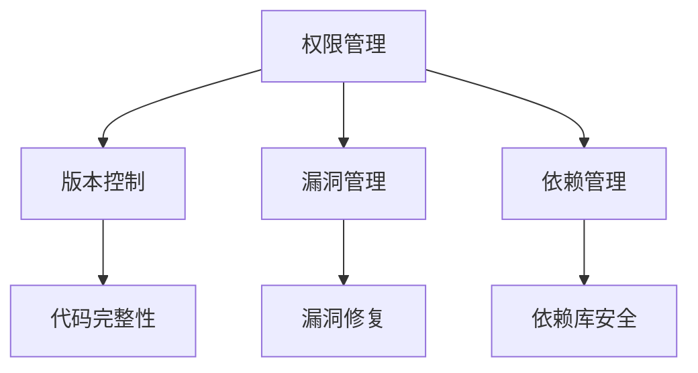

                 

### 文章标题：开源软件的安全管理策略

> 关键词：开源软件、安全管理、策略、挑战、风险管理、安全工具、案例研究、未来趋势

> 摘要：本文将深入探讨开源软件的安全管理策略，从背景介绍、核心概念与联系、核心算法原理、数学模型与公式、项目实战、最佳实践等方面，为读者提供一个全面的开源软件安全管理指南。

## 引言

开源软件已经成为现代软件开发的重要力量，其开放性、协作性和灵活性为开发者提供了丰富的资源。然而，随着开源软件在企业和项目中的广泛应用，其安全管理问题也日益凸显。本文将围绕开源软件的安全管理策略展开讨论，帮助读者理解和应对这一重要课题。

## 开源软件的概念与发展历程

### 开源软件的概念

开源软件（Open Source Software，OSS）是一种软件，其源代码可以被公众自由访问、修改和分发。开源软件的核心价值观包括开放性、协作性和透明性。

### 开源软件的发展历程

开源软件的起源可以追溯到1983年Richard Stallman发起的自由软件运动。随着Linux内核的诞生和互联网的普及，开源软件迎来了快速发展的时期。如今，开源软件已经渗透到各个领域，成为软件开发的主流模式。

### 开源软件的安全架构与组件

开源软件的安全架构通常包括以下几个方面：

1. **权限管理**：通过权限控制确保只有授权人员能够访问和修改源代码。
2. **版本控制**：使用版本控制系统（如Git）管理代码版本，确保代码的完整性和可追溯性。
3. **漏洞管理**：定期扫描和修复开源软件中的漏洞，确保软件的安全性。
4. **依赖管理**：确保使用的依赖库是安全的，不受供应链攻击的影响。

使用Mermaid流程图，我们可以展示开源软件的安全架构及其关键组件：

## 开源软件的安全性挑战

### 开源软件的安全性风险

开源软件的安全性风险主要包括以下几个方面：

1. **漏洞风险**：开源软件中的漏洞可能导致安全漏洞被利用。
2. **依赖库风险**：依赖的第三方库可能存在安全风险。
3. **许可证合规性风险**：使用不符合开源许可证的软件可能引发法律纠纷。

### 开源软件供应链攻击

开源软件供应链攻击是一种恶意行为，攻击者通过篡改开源软件的源代码或依赖库，从而在软件供应链中植入恶意代码。这种攻击方式具有隐蔽性、复杂性和广泛性。

### 开源软件的许可证合规性

开源软件的许可证种类繁多，常见的包括GPL、BSD、MIT等。企业需要确保其使用的开源软件符合相关许可证的要求，避免因许可证合规性问题导致的法律纠纷。

## 安全策略与流程

### 开源软件安全管理的策略

开源软件安全管理策略主要包括以下几个方面：

1. **安全评估与审计**：定期对开源软件进行安全评估和审计，确保软件的安全性。
2. **漏洞响应与修复**：建立漏洞响应机制，及时修复软件中的漏洞。
3. **安全培训与意识提升**：提高员工对开源软件安全性的认识和意识。

### 开源软件安全评估与审计

开源软件安全评估和审计的目标是识别软件中的安全漏洞和潜在风险。评估和审计的方法包括：

1. **静态代码分析**：通过分析源代码，发现潜在的安全漏洞。
2. **动态分析**：通过运行软件，观察其行为，发现安全漏洞。
3. **依赖关系分析**：分析依赖库的安全状况，确保其安全性。

### 开源软件安全培训和意识提升

开源软件安全培训和意识提升的目标是提高员工对开源软件安全性的认识和技能。培训内容可以包括：

1. **开源软件安全基础知识**：了解开源软件的安全架构、常见漏洞和攻击手段。
2. **安全编程实践**：掌握安全编程的最佳实践，避免在开发过程中引入安全漏洞。
3. **安全应急响应**：了解安全事件的应急响应流程，提高应对能力。

## 开源软件风险管理

### 开源软件风险识别与评估

开源软件风险识别与评估是开源软件安全管理的重要环节。风险识别的方法包括：

1. **问卷调查**：通过问卷收集开源软件使用情况，识别潜在风险。
2. **风险评估**：对识别的风险进行定量和定性评估，确定风险等级。

### 开源软件风险管理计划

开源软件风险管理计划应包括以下几个方面：

1. **风险识别与评估**：详细描述风险识别和评估的方法。
2. **风险应对措施**：制定针对不同风险等级的应对措施。
3. **风险管理流程**：描述风险管理的流程，确保风险得到有效控制。

### 开源软件漏洞响应与修复

开源软件漏洞响应与修复是开源软件安全管理的关键环节。漏洞响应和修复的流程包括：

1. **漏洞报告**：收到漏洞报告后，及时进行验证和分类。
2. **漏洞修复**：根据漏洞的严重程度，制定修复计划，及时发布修复补丁。
3. **漏洞披露**：在确保修复措施有效后，向公众披露漏洞信息。

## 开源软件安全工具与平台

### 开源软件安全工具介绍

开源软件安全工具可以帮助开发者快速识别和修复软件中的安全漏洞。常见的开源软件安全工具有：

1. **Snyk**：一款集成了漏洞扫描、依赖管理、自动化修复功能的工具。
2. **OWASP Dependency-Check**：一款用于扫描依赖库中漏洞的工具。
3. **SonarQube**：一款用于代码质量管理的工具，可以识别代码中的安全漏洞。

### 开源软件安全平台建设

开源软件安全平台的建设是确保开源软件安全的关键。开源软件安全平台应具备以下功能：

1. **漏洞管理**：实时监测开源软件中的漏洞，及时进行修复。
2. **依赖管理**：管理开源软件的依赖库，确保其安全性。
3. **安全培训**：提供安全培训和意识提升课程，提高员工的安全意识。

### 开源软件安全发展趋势

开源软件安全发展趋势包括：

1. **自动化与智能化**：随着人工智能技术的发展，开源软件安全管理将更加自动化和智能化。
2. **社区参与**：开源软件安全社区将在开源软件安全管理中发挥更大作用。
3. **合规性要求**：随着开源软件在企业和项目中的广泛应用，对开源软件的合规性要求将日益严格。

## 实战案例

### 开源软件安全实战案例

以某知名开源软件项目为例，该项目在安全管理方面采取了以下措施：

1. **定期安全审计**：项目团队定期对代码进行安全审计，确保代码的安全性。
2. **漏洞响应机制**：建立漏洞响应机制，及时修复漏洞。
3. **依赖库管理**：对依赖库进行严格管理，确保其安全性。

### 开源软件安全案例分析

分析某开源软件项目中发生的重大安全事件，总结经验教训，为其他开源软件项目提供参考。

1. **事件背景**：某开源软件项目在版本更新后，被曝出存在严重的安全漏洞。
2. **事件原因**：漏洞产生的原因分析，包括开发过程中的疏忽、依赖库的安全问题等。
3. **事件影响**：事件对项目的影响以及如何缓解和修复。
4. **经验教训**：总结事件中的经验教训，为其他项目提供借鉴。

## 未来趋势与展望

### 开源软件安全的发展趋势

开源软件安全的发展趋势包括：

1. **自动化与智能化**：随着人工智能技术的发展，开源软件安全管理将更加自动化和智能化。
2. **社区参与**：开源软件安全社区将在开源软件安全管理中发挥更大作用。
3. **合规性要求**：随着开源软件在企业和项目中的广泛应用，对开源软件的合规性要求将日益严格。

### 开源软件安全管理的挑战与机遇

开源软件安全管理的挑战与机遇并存。面临的挑战包括：

1. **安全风险的增加**：随着开源软件的广泛应用，安全风险也不断增加。
2. **合规性要求的提高**：企业需要确保其开源软件符合相关合规性要求。

### 未来展望

开源软件安全管理的未来展望包括：

1. **建立完善的安全管理体系**：企业应建立完善的开源软件安全管理体系，确保开源软件的安全性。
2. **加强社区合作**：开源软件安全社区应加强合作，共同推动开源软件安全的发展。
3. **技术创新**：随着技术创新，开源软件安全将得到进一步优化和提升。

## 结论

开源软件的安全管理是确保软件安全的关键环节。本文从背景介绍、核心概念与联系、核心算法原理、数学模型与公式、项目实战、最佳实践等方面，为读者提供了一个全面的开源软件安全管理指南。通过本文的讨论，读者可以更好地理解和应对开源软件的安全性挑战，为企业的软件开发和项目管理提供有力支持。

### 参考文献

1. Open Source Initiative (OSI). (n.d.). [Open Source Definition](https://opensource.org/docs/osd/).
2. National Vulnerability Database (NVD). (n.d.). [Vulnerability Database](https://nvd.nist.gov/).
3. OWASP Foundation. (n.d.). [OWASP Project List](https://owasp.org/www-project-list/).
4. Snyk. (n.d.). [Snyk Documentation](https://snyk.io/docs/).
5. GitHub. (n.d.). [GitHub Security](https://docs.github.com/en/code-security/getting-started/auditing-your-code-for-vulnerabilities-and-security-issues).

### 作者信息

作者：AI天才研究院/AI Genius Institute & 禅与计算机程序设计艺术/Zen And The Art of Computer Programming

### 结语

开源软件的安全管理是一个持续的过程，需要企业和开发者共同努力。通过本文的探讨，希望读者能够更好地理解和应对开源软件的安全性挑战，为开源软件的发展和安全贡献自己的力量。

**让我们共同构建一个更加安全、可靠的开源软件生态系统！**## 第一部分：开源软件安全管理概述

### 1.1 开源软件的概念与发展历程

开源软件（Open Source Software，简称OSS）是指源代码可以被公众访问、修改和分发的软件。这种模式的核心在于透明性、协作性和社区参与，它不同于传统商业软件的封闭式开发模式。开源软件的概念起源于1980年代，由自由软件运动倡导者Richard Stallman提出。他创立了自由软件基金会（Free Software Foundation，FSF）和开源开发工具Gnu（GNU's Not Unix），标志着开源软件运动的开始。

随着互联网的普及，开源软件迎来了快速发展的时期。1991年，Linus Torvalds发布了Linux内核，这是第一个具有广泛影响力的开源操作系统。Linux的成功激发了更多的开源项目诞生，如Apache、MySQL、Python等，这些项目不仅改变了软件开发的方式，也为整个IT产业带来了深远的影响。

开源软件的发展历程可以分为几个阶段：

1. **自由软件阶段**（1980年代）：以自由软件基金会为代表，强调软件的自由和用户的权利。
2. **开源软件阶段**（1990年代）：以Linux为代表，强调协作和开放性，推动开源软件的普及。
3. **商业与开源融合阶段**（2000年代至今）：开源软件逐渐成为商业软件的重要组成部分，企业和开发者通过开源项目进行合作和创新。

开源软件的核心理念包括：

1. **开放性**：源代码对公众开放，任何人都可以自由查看、修改和分发。
2. **协作性**：通过社区合作，共享知识和资源，共同改进软件。
3. **透明性**：开发过程透明，任何参与者都可以参与决策和反馈。

### 1.2 开源软件在企业和开发中的重要性

开源软件在企业和开发中的应用越来越广泛，其重要性主要体现在以下几个方面：

1. **降低成本**：开源软件通常免费使用，企业可以节省软件采购和许可费用。
2. **提高效率**：开源软件提供了丰富的模块和工具，开发者可以快速搭建原型和实现功能。
3. **促进创新**：开源项目鼓励社区参与，促进了技术的创新和进步。
4. **增强灵活性**：企业可以根据业务需求对开源软件进行定制和优化。

企业采用开源软件的策略通常包括：

1. **构建内部开源项目**：企业可以将内部开发的项目开源，吸引外部开发者参与，共同改进软件。
2. **使用第三方开源软件**：企业可以从开源社区中寻找合适的软件进行使用，降低开发成本。
3. **参与开源社区**：企业可以通过贡献代码、资金或资源，积极参与开源社区的建设和演进。

开发者参与开源软件的方式包括：

1. **贡献代码**：开发者可以修复漏洞、添加新功能或优化现有代码。
2. **文档和测试**：开发者可以编写文档、编写测试用例，提高软件的质量。
3. **社区交流**：开发者可以通过社区讨论，分享经验和学习新的技术。

### 1.3 开源软件的安全架构与组件

开源软件的安全架构是一个复杂的系统，它包括多个组件和策略，以确保软件的安全性。以下是一些关键组件和策略：

1. **权限管理**：通过权限控制，确保只有授权的人员能够访问和修改源代码。常用的权限管理系统包括Git的权限控制、Policies for Red Hat and CentOS等。

2. **版本控制**：版本控制系统（如Git、Mercurial）是开源软件的核心组件，它提供了代码的版本管理和历史记录功能。通过版本控制，开发者可以跟踪代码的变化，确保代码的完整性和可追溯性。

3. **漏洞管理**：开源项目通常需要定期进行漏洞扫描和安全评估，及时发现并修复漏洞。工具如OWASP Dependency-Check、Snyk等可以帮助开发者识别和修复软件中的安全漏洞。

4. **依赖管理**：依赖管理工具（如Maven、Gradle）可以帮助开发者管理项目中的依赖库。这些工具不仅可以自动下载和安装依赖库，还可以检测依赖库中的安全漏洞。

5. **安全编码实践**：开源项目应遵循安全编码实践，如避免使用易受攻击的API、实现正确的输入验证、使用安全的加密算法等。

6. **自动化测试**：自动化测试工具（如JUnit、Pytest）可以帮助开发者编写测试用例，确保代码的质量和安全性。

通过Mermaid流程图，我们可以展示开源软件的安全架构及其关键组件：

这个流程图展示了开源软件安全架构中的主要组件及其相互关系。权限管理确保了正确的访问控制，版本控制提供了代码的追踪和回滚能力，漏洞管理帮助发现和修复安全漏洞，依赖管理确保了依赖库的安全，而代码完整性和漏洞修复以及依赖库安全则是确保软件整体安全性的关键。

### 总结

开源软件的安全管理是一个复杂但至关重要的任务。通过理解开源软件的概念和发展历程，认识到其在企业和开发中的重要性，以及掌握其安全架构与组件，我们可以更好地制定和实施开源软件的安全管理策略。在下一部分，我们将深入探讨开源软件面临的安全性挑战，分析其风险，并介绍相应的安全管理策略和最佳实践。

