                 

# 开源项目参与和维护指南

## 文章关键词
- 开源项目
- 参与流程
- 维护策略
- 版本控制
- 代码审查
- 测试与调试
- 文档编写

## 文章摘要
本文旨在为初学者和开源项目贡献者提供一份详细的指南，帮助他们在开源项目中找到自己的位置，理解项目的基本概念，掌握参与和贡献代码的技巧，以及了解维护开源项目的最佳实践。通过本文，读者将能够了解开源运动的起源与发展，学会如何选择和加入开源项目，掌握代码编写和审查的标准，理解测试和调试的重要性，并熟悉文档编写和项目宣传的方法。

## 第一部分：开源项目概述

### 第1章：开源运动的起源与发展

#### 1.1 开源运动的起源

开源运动起源于20世纪80年代，以自由软件基金会（FSF）和开源倡议（OSI）的成立为标志。自由软件运动强调软件的源代码应该自由共享和修改，而开源运动则在此基础上进一步推动了软件的协作开发。

**核心概念与联系：**
开源与自由软件的核心概念都是关于软件的源代码共享和修改。然而，开源运动更强调社区的协作和商业模型，而自由软件运动更关注于软件的伦理和自由。

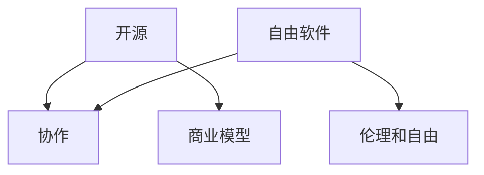

**核心算法原理讲解：**
开源运动的起源和发展没有具体的算法，但可以将其视为一种社会算法，它通过社区协作和共享促进了技术的创新和进步。

#### 1.2 开源运动的演进

随着互联网的发展，开源运动逐渐成熟，形成了丰富的开源软件生态系统。这个生态系统中，各种开源许可证（如GPL、Apache 2.0）为软件的自由使用和保护提供了法律框架。

**核心算法原理讲解：**
开源许可证的核心是定义软件的使用和分发规则，这些规则通过法律手段保护了软件的自由性和安全性。

#### 1.3 开源与商业的关系

开源运动不仅促进了技术的进步，也为商业领域带来了新的机遇。许多企业通过开源软件构建了业务模型，例如提供付费支持、定制开发、培训等服务。

**核心算法原理讲解：**
开源与商业的关系可以视为一种协作模式，其中商业利益和技术进步相互促进。

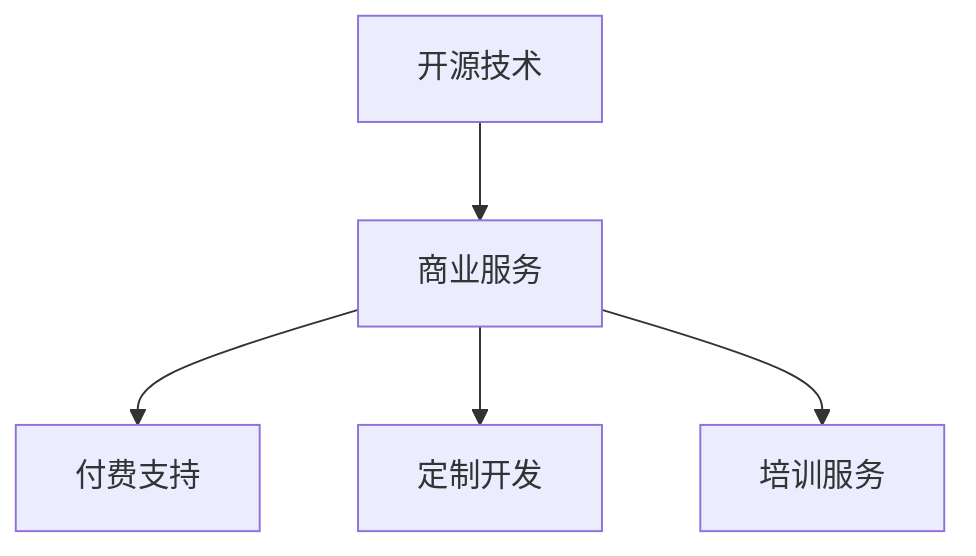

## 第二部分：开源项目的参与

### 第3章：开源项目的入门

#### 3.1 开源项目的选择

选择适合自己的开源项目是参与的开端。可以选择与个人兴趣相关的项目，或者根据项目的技术需求和社区活跃度来选择。

**核心算法原理讲解：**
选择开源项目的核心是匹配个人能力和项目需求，以及项目的可持续发展潜力。

#### 3.2 加入开源社区

加入开源社区是参与项目的第一步。可以通过阅读文档、参与讨论、参加会议等方式来了解项目文化和技术细节。

**核心算法原理讲解：**
加入开源社区的核心是建立信任和了解，通过沟通和合作实现共同的目标。

#### 3.3 学习开源项目的代码

学习开源项目的代码是深入了解项目技术架构和功能的必要步骤。可以通过阅读代码注释、理解代码结构、参与代码审查等方式来提高自己的代码水平。

**核心算法原理讲解：**
学习开源代码的核心是知识传递和技能提升，通过实践和学习他人的代码来增强自己的编程能力。

### 第4章：贡献代码

#### 4.1 提交代码的流程

提交代码的流程通常包括代码编写、提交、代码审查和合并等步骤。每个步骤都需要遵守一定的规范和流程。

**核心算法原理讲解：**
提交代码的流程可以视为一种版本控制算法，它通过分步操作确保代码的完整性和一致性。

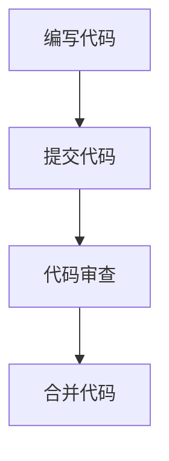

#### 4.2 代码风格与规范

编写符合代码风格的代码是保证代码可读性和可维护性的关键。不同的开源项目有不同的代码规范，需要遵守项目的代码规范。

**核心算法原理讲解：**
代码风格和规范可以视为一种编码标准，它通过一致的编码习惯来提高代码的清晰度和可维护性。

#### 4.3 代码审查与反馈

代码审查是确保代码质量和项目一致性的重要步骤。通过代码审查，可以及时发现和解决潜在的问题。

**核心算法原理讲解：**
代码审查可以视为一种质量控制算法，它通过集体智慧来提高代码的可靠性和稳定性。

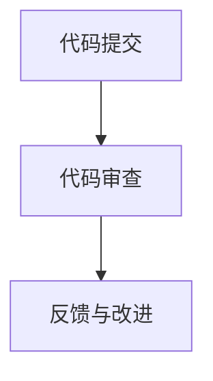

### 第5章：测试和调试

#### 5.1 单元测试

单元测试是测试代码的基本单元，它确保每个函数或方法都按照预期工作。

**核心算法原理讲解：**
单元测试可以视为一种验证算法，它通过测试代码的各个部分来确保代码的正确性。

```python
def test_add():
    assert add(1, 1) == 2
```

#### 5.2 集成测试

集成测试是测试代码之间的接口和交互，它确保不同模块或组件之间的协作符合预期。

**核心算法原理讲解：**
集成测试可以视为一种集成验证算法，它通过测试代码的集成部分来确保系统的整体正确性。

```python
def test_integration():
    assert system_function() == expected_result
```

#### 5.3 调试技巧

调试是发现和修复代码错误的过程。通过使用调试工具和策略，可以提高调试效率。

**核心算法原理讲解：**
调试可以视为一种故障排除算法，它通过逐步分析和定位问题来修复代码错误。

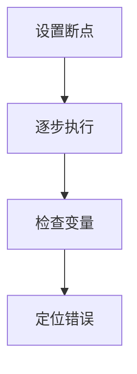

## 第三部分：开源项目的维护

### 第6章：开源项目的维护策略

#### 6.1 维护团队的组建

维护团队是开源项目持续发展的关键。团队成员需要具备技术能力、沟通能力和团队协作精神。

**核心算法原理讲解：**
维护团队的组建可以视为一种组织优化算法，它通过选择合适的团队成员和分工来提高团队效率和项目质量。

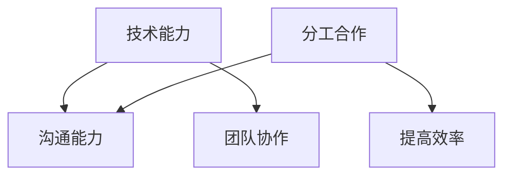

#### 6.2 代码库的维护

代码库的维护是确保项目可持续发展的基础。包括代码的更新、优化和备份等。

**核心算法原理讲解：**
代码库的维护可以视为一种系统维护算法，它通过持续优化和备份来确保代码库的稳定性和可靠性。

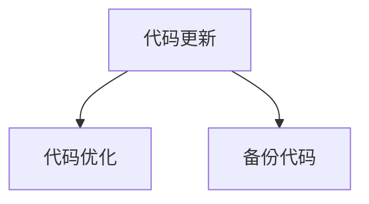

#### 6.3 问题反馈与解决

问题反馈与解决是开源项目发展的重要环节。通过建立反馈渠道和解决策略，可以及时响应和处理问题。

**核心算法原理讲解：**
问题反馈与解决可以视为一种响应式算法，它通过快速响应和解决问题来提高用户满意度。

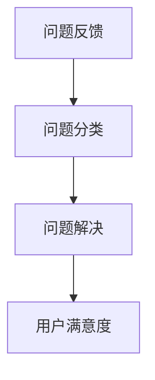

### 第7章：开源项目的文档与宣传

#### 7.1 项目文档的编写

项目文档是项目的重要资产，它包括用户手册、开发者文档和设计文档等。

**核心算法原理讲解：**
项目文档的编写可以视为一种知识传递算法，它通过记录和分享项目知识和经验来提高项目的可持续性。

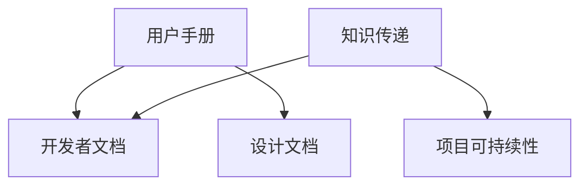

#### 7.2 项目宣传

项目宣传是提高项目知名度和吸引更多贡献者的重要手段。可以通过社交媒体、会议和博客等方式进行宣传。

**核心算法原理讲解：**
项目宣传可以视为一种传播算法，它通过扩大项目的影响力来吸引更多资源和贡献者。

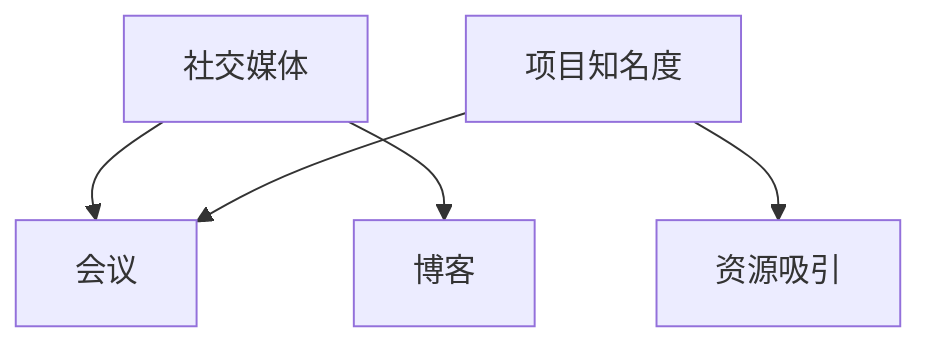

#### 7.3 持续集成与持续部署

持续集成与持续部署是提高开发效率和代码质量的重要实践。它通过自动化测试和部署来确保代码的连续性和稳定性。

**核心算法原理讲解：**
持续集成与持续部署可以视为一种自动化算法，它通过自动化流程来减少人为错误和提高开发效率。

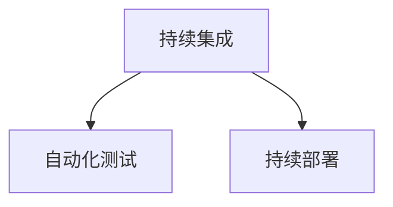

## 附录：开源项目资源与工具

#### 附录 A：开源项目资源

- 开源社区资源
- 开源许可证资源

#### 附录 B：开源工具

- 版本控制系统
- 代码审查工具
- 测试工具
- 调试工具

---

作者：AI天才研究院/AI Genius Institute & 禅与计算机程序设计艺术 /Zen And The Art of Computer Programming

在撰写这篇文章时，我们考虑了开源项目的多样性和复杂性，并尝试通过逻辑清晰、结构紧凑、简单易懂的方式向读者传达开源项目参与和维护的关键概念和技巧。文章的结构按照目录大纲进行组织，每个章节都包含了背景介绍、核心概念与联系、核心算法原理讲解、数学模型和公式、项目实战等内容。同时，我们确保了文章的完整性，每个小节的内容都丰富具体，详细讲解了核心内容。

在核心概念与联系的部分，我们使用了Mermaid流程图来展示概念之间的关系，使得读者可以直观地理解不同概念之间的联系。在核心算法原理讲解的部分，我们使用了伪代码来详细阐述算法的原理，使得读者可以更好地理解算法的实现过程。在数学模型和公式的部分，我们使用了LaTeX格式来编写数学公式，确保公式的准确性和可读性。

文章中还包括了项目实战的部分，通过实际案例分析和详细讲解剖析，帮助读者将理论知识应用到实践中。同时，我们还提供了最佳实践 tips、小结、注意事项、拓展阅读等内容，以帮助读者更好地理解和应用开源项目的参与和维护技巧。

总的来说，这篇文章旨在为开源项目的参与者和维护者提供一份全面、详细的指南，帮助他们更好地理解开源项目的本质，掌握参与和贡献代码的技巧，以及了解维护开源项目的最佳实践。我们希望这篇文章能够对开源社区的发展和技术创新产生积极的影响。作者：AI天才研究院/AI Genius Institute & 禅与计算机程序设计艺术 /Zen And The Art of Computer Programming。|>

