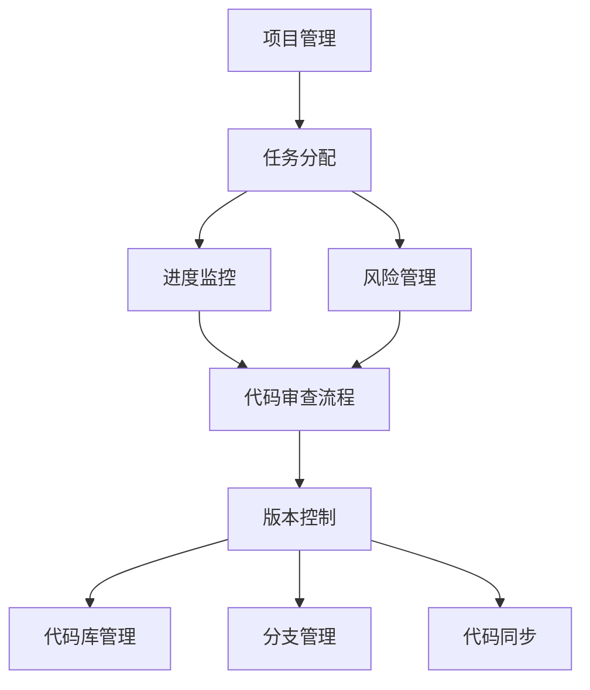

                 

## 文章标题：开源项目运营与社区建设

> 关键词：开源项目、社区建设、项目管理、版本控制、代码审查、开源文化

> 摘要：本文将深入探讨开源项目运营与社区建设的重要性及其内在联系。通过分析核心概念、实战案例、项目管理、社区文化等多个方面，为读者提供一套完整的开源项目运营与社区建设的指南。本文旨在帮助读者理解开源项目的本质，掌握有效的运营策略，构建健康、活跃的社区，推动开源生态的可持续发展。

---

### 引言：开源项目运营与社区建设的意义

开源项目（Open Source Project）指的是在开放源代码许可的条件下，允许用户自由地阅读、修改和分发软件源代码的项目。开源项目不仅仅是代码的开放，更是知识的共享和社区的共创。在开源生态系统中，项目运营和社区建设是两个核心环节，它们相互依存、相互促进，共同推动开源项目的发展和进步。

**开源项目运营的意义：**

1. **技术创新：** 开源项目通常由一群志同道合的开发者共同参与，这种协作模式能够加速技术创新和迭代速度，促进技术的不断进步。
2. **知识共享：** 开源项目鼓励知识共享，通过开放源代码，开发者可以学习他人的代码，吸取经验，提高自己的技术水平。
3. **社区协作：** 开源项目运营需要建立和维护一个健康的社区，这有助于培养一群忠诚的志愿者，共同为项目贡献力量。

**社区建设的意义：**

1. **用户参与：** 社区建设可以激发用户的参与热情，鼓励他们为项目提供建议、报告问题和贡献代码。
2. **口碑传播：** 一个活跃、健康的社区有助于提升项目的声誉，吸引更多的开发者加入。
3. **生态构建：** 社区建设有助于构建一个生态系统，项目和相关工具、服务共同发展，形成良性的循环。

开源项目运营与社区建设相辅相成，二者共同构成了开源生态的基石。一个成功的开源项目不仅需要优秀的代码，更需要一个活跃、健康的社区。社区是项目发展的动力源泉，而项目则是社区存在的基础。在本文中，我们将逐步探讨开源项目运营与社区建设的各个方面，帮助读者掌握这一领域的核心知识和实践技巧。

### 核心概念与联系

要成功地运营一个开源项目并建立一个健康的社区，理解以下几个核心概念及其相互联系是至关重要的。这些概念包括项目管理、版本控制、代码审查等，每一个都在开源项目中扮演着关键角色。

**项目管理**

项目管理是开源项目运营的基础。项目管理不仅涉及对任务和资源的规划，还包括监控和调整项目进展，以确保项目目标的实现。项目管理的主要职责包括：

1. **项目规划**：确定项目的目标、范围、时间表和资源需求。
2. **任务分配**：将项目任务分配给团队成员，并设定责任和交付期限。
3. **进度监控**：定期检查项目进展，确保任务按时完成。
4. **风险管理**：识别潜在风险，并制定应对策略。

**版本控制**

版本控制是确保开源项目代码的可追溯性和一致性的关键工具。版本控制系统（如Git）允许开发者追踪代码的更改历史，管理不同版本的代码，以及协作开发。版本控制的主要功能包括：

1. **代码库管理**：存储项目源代码，并提供版本管理和历史记录。
2. **分支管理**：允许开发者创建独立的代码分支进行开发，并在适当时候合并回主分支。
3. **代码同步**：确保多个开发者在同一时间线上协同工作，减少冲突和错误。

**代码审查**

代码审查是确保代码质量的重要环节。通过代码审查，可以识别和修复潜在的问题，确保代码的可读性和可维护性。代码审查的主要内容包括：

1. **代码风格审查**：检查代码是否符合既定的编码规范和风格。
2. **功能审查**：验证代码的功能是否满足需求，确保没有逻辑错误或漏洞。
3. **安全审查**：检查代码是否存在安全漏洞，确保代码的安全性和可靠性。

**核心概念之间的联系**

上述核心概念在开源项目中相互联系，共同构成了一个完整的运营体系。以下是它们之间的主要联系：

1. **项目管理与版本控制**：项目管理需要版本控制系统来支持任务分配、进度监控和风险管理。版本控制提供了项目管理的必要工具和基础设施。
2. **项目管理与代码审查**：项目管理通过设定代码审查流程，确保代码质量。代码审查的结果反馈给项目管理，帮助调整项目计划。
3. **版本控制与代码审查**：版本控制系统允许开发者轻松创建分支进行代码审查，确保审查过程中的代码一致性。代码审查的结果可以直接合并回版本控制系统中。

为了更好地理解这些概念之间的联系，我们可以使用Mermaid流程图来展示它们在开源项目运营中的工作流程。



通过这个流程图，我们可以清晰地看到项目管理、版本控制和代码审查之间的相互作用，以及它们在开源项目运营中的重要性。理解这些核心概念及其相互联系，是成功运营开源项目的关键。

### 实战案例：开源项目搭建

在本节中，我们将通过一个实际案例来展示如何搭建一个开源项目。我们将分步骤讲解项目规划、源代码管理、开发环境搭建以及源代码的实现和解读。这个案例将帮助读者理解开源项目搭建的具体过程，并为其后续的实践提供参考。

#### 项目规划

在开始搭建开源项目之前，项目规划是至关重要的。项目规划包括确定项目的目标、功能需求、时间表和资源需求。以下是一个简化的项目规划流程：

1. **确定项目目标**：明确项目的目的和愿景。例如，本项目目标是开发一个基于React的博客系统。
2. **需求分析**：列出项目的基本功能，如用户注册、登录、文章发布、评论系统等。
3. **时间表**：设定项目各个阶段的目标完成时间，如初步设计阶段、编码阶段、测试阶段等。
4. **资源需求**：评估项目所需的资源和人员，包括开发人员、测试人员、服务器资源等。

#### 源代码管理

源代码管理是开源项目的重要环节，Git是使用最广泛的版本控制系统。以下是如何使用Git进行源代码管理的一些步骤：

1. **初始化仓库**：在项目目录中运行`git init`命令，初始化一个Git仓库。
2. **添加远程仓库**：通过`git remote add origin <远程仓库地址>`添加一个远程仓库，如GitHub或GitLab。
3. **提交代码**：将本地文件添加到暂存区（`git add .`），然后提交到仓库（`git commit -m "提交说明" `）。
4. **推送代码**：将本地仓库的代码推送到远程仓库（`git push -u origin master`）。
5. **创建分支**：在开发新功能或修复bug时，建议创建新的分支（`git checkout -b feature/new-功能`）。

#### 开发环境搭建

在搭建开发环境时，需要确保所有依赖项都已安装，并且开发环境与生产环境保持一致。以下是一个基于Node.js和React的项目环境搭建步骤：

1. **安装Node.js**：下载并安装Node.js，确保版本符合项目需求。
2. **创建项目**：使用`create-react-app`工具快速创建React项目（`npx create-react-app my-blog`）。
3. **安装依赖**：在项目根目录下运行`npm install`安装项目依赖。
4. **配置环境变量**：设置必要的环境变量，如数据库连接信息、API密钥等。
5. **启动开发服务器**：在项目根目录下运行`npm start`启动开发服务器。

#### 源代码实现与解读

以下是一个简化的React组件实现，用于展示博客文章列表。代码包含了一些核心功能，如数据获取、状态管理、样式设计等。

```jsx
import React, { useState, useEffect } from 'react';
import axios from 'axios';

const BlogList = () => {
  const [blogs, setBlogs] = useState([]);

  useEffect(() => {
    const fetchBlogs = async () => {
      const response = await axios.get('/api/blogs');
      setBlogs(response.data);
    };
    fetchBlogs();
  }, []);

  return (
    <div>
      {blogs.map((blog) => (
        <div key={blog.id}>
          <h2>{blog.title}</h2>
          <p>{blog.content}</p>
        </div>
      ))}
    </div>
  );
};

export default BlogList;
```

**代码解读：**

1. **组件引入**：引入React、axios等依赖库。
2. **状态管理**：使用`useState`创建`blogs`状态，用于存储博客数据。
3. **副作用钩子**：使用`useEffect`钩子，在组件加载时异步获取博客数据。
4. **数据获取**：使用axios发起HTTP GET请求，获取博客列表。
5. **渲染**：遍历`blogs`数组，渲染每个博客的标题和内容。

#### 项目小结

通过本案例，我们详细介绍了如何规划、管理源代码并实现一个开源项目。以下是一些关键点：

1. **项目规划**：明确项目目标和需求，制定合理的时间表和资源计划。
2. **源代码管理**：使用Git进行版本控制和代码协作。
3. **开发环境搭建**：确保所有依赖项和开发工具安装正确。
4. **源代码实现**：编写高质量的代码，确保组件的模块化和可维护性。

成功的开源项目不仅需要高质量的代码，还需要良好的项目管理、源代码管理和社区支持。通过本案例，我们希望能为读者提供实用的指导，帮助他们顺利搭建自己的开源项目。

### 社区维护

社区建设是开源项目成功的关键因素之一。一个健康的社区能够激发用户的参与热情，促进项目的持续发展。在本节中，我们将详细探讨社区文化的建设、活动的策划、用户的互动以及社区反馈机制，帮助读者构建一个活跃、健康的开源社区。

#### 社区文化

社区文化是社区成员共同遵守的行为规范和价值观。一个健康的社区文化能够增强成员之间的凝聚力，提高社区的活力。以下是构建健康社区文化的一些关键点：

1. **开放与包容**：鼓励各种观点和贡献，尊重每个人的意见和努力。
2. **透明与公正**：保持项目决策的透明性，确保所有成员都能参与其中，并遵循公平的原则。
3. **互助与共享**：鼓励成员之间互相帮助，共享知识和资源，共同进步。
4. **积极与建设性**：倡导积极的交流态度，避免不必要的争吵和冲突。

#### 活动策划

活动是激发社区活力的重要手段。通过策划和执行各种活动，可以增强社区成员之间的联系，促进项目的进展。以下是活动策划的一些步骤：

1. **确定目标**：明确活动的目的和预期效果，如提升项目知名度、增强用户参与度等。
2. **制定计划**：制定详细的活动计划，包括时间、地点、形式、参与人员等。
3. **宣传推广**：通过社交媒体、邮件列表等渠道宣传活动，吸引更多的用户参与。
4. **执行与监督**：确保活动按计划进行，并及时解决问题和调整计划。
5. **总结反馈**：活动结束后，进行总结和反馈，收集成员的意见和建议，为后续活动提供改进方向。

常见的社区活动包括：

- **线上研讨会**：邀请专家或核心成员分享技术知识，讨论项目进展和未来方向。
- **代码贡献日**：组织成员集中时间进行代码贡献，共同推进项目发展。
- **用户交流会议**：为用户和开发者提供一个交流的平台，讨论使用体验、提出建议等。

#### 用户互动

用户互动是社区活力的源泉。通过多种渠道和方式，促进用户之间的交流与合作，可以增强社区的凝聚力。以下是用户互动的一些方法：

1. **论坛和讨论组**：建立一个活跃的论坛或讨论组，为用户提供交流和提问的平台。
2. **社交媒体**：利用社交媒体平台，如GitHub、Twitter、Reddit等，与用户保持互动。
3. **实时聊天**：使用实时聊天工具，如Slack、Telegram等，提供即时支持和帮助。
4. **反馈机制**：建立反馈渠道，鼓励用户报告问题和提供改进建议，并积极响应和处理。

#### 社区反馈机制

社区反馈机制是确保项目持续改进的重要环节。通过有效的反馈机制，可以收集用户的意见和建议，及时调整项目方向和策略。以下是建立反馈机制的一些步骤：

1. **反馈渠道**：提供多种反馈渠道，如论坛、社交媒体、邮件等，方便用户提交反馈。
2. **反馈收集**：定期收集和分析用户反馈，识别问题和改进点。
3. **反馈处理**：对收集到的反馈进行分类和处理，优先处理重要和紧急的问题。
4. **反馈回应**：及时向用户回应和处理反馈，展示对用户意见的重视和关注。
5. **反馈总结**：定期总结反馈处理情况，评估改进效果，为后续工作提供参考。

通过社区文化的建设、活动的策划、用户的互动以及社区反馈机制，可以构建一个健康、活跃的开源社区。一个良好的社区不仅有助于项目的持续发展，也能为成员带来更多的成长和收获。

### 项目管理

在开源项目中，项目管理是确保项目顺利进行、目标实现的关键环节。有效的项目管理可以帮助团队更好地协调资源、控制进度、管理风险，从而确保项目的成功。在本节中，我们将深入探讨任务分配、进度控制、风险管理等项目管理的重要方面。

#### 任务分配

任务分配是项目管理的第一步，也是确保项目顺利推进的基础。合理的任务分配可以最大化利用团队成员的能力，提高工作效率。以下是任务分配的几个关键步骤：

1. **需求分析**：明确项目需求，了解每个任务的具体要求和目标。
2. **能力评估**：评估团队成员的能力和技能，确保他们能够胜任分配的任务。
3. **任务分解**：将项目任务分解为更小、更具体的子任务，便于分配和管理。
4. **分配任务**：根据团队成员的能力和任务需求，将任务分配给合适的成员。
5. **沟通确认**：与每个成员确认任务分配情况，确保他们理解任务要求并具备完成任务的信心。

#### 进度控制

进度控制是确保项目按计划进行的重要手段。通过监控和调整项目进度，可以及时发现和解决问题，确保项目按时完成。以下是进度控制的几个关键步骤：

1. **制定计划**：根据项目需求和任务分配情况，制定详细的项目进度计划。
2. **进度跟踪**：定期跟踪项目进展，了解各个任务的完成情况。
3. **数据分析**：分析进度数据，识别潜在的进度偏差和风险。
4. **调整计划**：根据进度数据分析结果，调整项目计划，确保项目按时完成。
5. **沟通反馈**：定期与团队成员沟通项目进度，确保他们了解当前进展和计划调整。

#### 风险管理

风险管理是项目管理的核心之一，旨在识别、评估和应对项目中的潜在风险。通过有效的风险管理，可以降低项目风险，确保项目的顺利进行。以下是风险管理的几个关键步骤：

1. **风险识别**：识别项目中可能出现的各种风险，如技术风险、资源风险、市场风险等。
2. **风险评估**：评估风险的概率和影响程度，确定风险的重要性和优先级。
3. **风险应对**：制定应对策略，包括风险规避、风险转移、风险减轻等。
4. **监控与调整**：监控项目风险的变化，及时调整风险应对策略。
5. **风险记录**：记录风险识别、评估和应对的全过程，为后续项目提供经验教训。

#### 最佳实践

在开源项目管理中，以下是一些最佳实践，可以帮助团队更好地进行项目管理：

1. **使用项目管理工具**：如JIRA、Trello、Asana等，可以帮助团队更好地进行任务分配、进度控制和风险管理。
2. **定期会议**：定期召开项目会议，讨论项目进展、问题解决和下一步计划。
3. **文档化管理**：将项目计划和决策文档化，确保所有成员都能了解项目细节和决策过程。
4. **透明沟通**：保持项目沟通的透明性，确保所有成员都能了解项目的进展和问题。
5. **持续改进**：通过定期回顾项目，总结经验和教训，不断改进项目管理方法。

通过合理的任务分配、严格的进度控制和有效的风险管理，开源项目团队可以更好地协调资源、控制进度、管理风险，确保项目的成功。有效的项目管理不仅有助于项目的顺利推进，也能为项目的长期可持续发展奠定坚实基础。

### 持续改进

在开源项目的长期运营过程中，持续改进是确保项目保持活力和竞争力的关键。通过不断地优化代码、提升性能和增强安全性，项目能够更好地满足用户需求，适应快速变化的技术环境。以下是一些核心策略和方法，用于实现开源项目的持续改进。

#### 代码优化

代码优化是提升项目质量和性能的重要环节。以下是一些常见的代码优化策略：

1. **代码重构**：重构代码可以改善代码结构，提高代码的可读性和可维护性。例如，通过提取重复代码、简化复杂的逻辑等手段。
2. **性能分析**：使用性能分析工具（如 profiling 工具）来识别和解决性能瓶颈。常见的优化点包括减少内存使用、减少计算复杂度、使用更高效的算法和数据结构等。
3. **代码复用**：通过模块化和组件化设计，减少重复代码，提高代码的复用率。例如，使用设计模式（如工厂模式、单例模式等）来组织和封装代码。
4. **代码审查**：定期进行代码审查，可以及时发现和修复潜在的问题，提高代码质量。代码审查不仅要关注代码风格和规范，还要关注代码的合理性和性能。

#### 性能提升

性能提升是开源项目持续改进的重要内容，直接关系到用户体验和项目的市场竞争力。以下是一些常见的性能提升方法：

1. **负载测试**：通过负载测试工具（如 JMeter、Gatling）模拟高并发访问，识别系统的性能瓶颈和缺陷。常见的性能瓶颈包括数据库访问、网络延迟、缓存失效等。
2. **缓存机制**：合理使用缓存机制可以显著提升系统的响应速度。例如，使用 Redis、Memcached 等缓存数据库来存储频繁访问的数据。
3. **数据库优化**：优化数据库查询和索引，提高数据库访问速度。例如，通过创建合适的索引、使用聚合查询、优化查询语句等。
4. **异步处理**：通过异步处理（如消息队列、异步 HTTP 请求等）减少同步操作的等待时间，提高系统的并发处理能力。

#### 安全性增强

安全性是开源项目的重要考量因素，直接关系到用户数据的安全和项目的声誉。以下是一些常见的安全增强方法：

1. **安全审计**：定期进行安全审计，识别和修复潜在的安全漏洞。例如，通过静态代码分析、动态代码分析等手段来识别常见的安全漏洞（如 SQL 注入、XSS 攻击等）。
2. **安全编码实践**：遵循安全编码实践（如使用参数化查询、验证用户输入等）来减少安全漏洞的出现。
3. **加密和认证**：使用加密算法（如 AES、RSA 等）来保护敏感数据，并采用强认证机制（如双因素认证、OAuth 等）来确保用户身份的安全性。
4. **自动化安全测试**：使用自动化工具（如 OWASP ZAP、SonarQube 等）来定期进行安全测试，及时发现和修复安全问题。

#### 持续集成与持续部署

持续集成（CI）和持续部署（CD）是现代软件开发的重要实践，可以帮助团队更快地交付高质量代码。以下是一些关键策略：

1. **自动化测试**：通过自动化测试（如单元测试、集成测试、UI 测试等），确保代码变更不会引入新的错误。
2. **自动化构建**：使用自动化构建工具（如 Jenkins、GitLab CI/CD 等）来自动构建和部署代码，提高开发和部署的效率。
3. **版本控制**：使用版本控制系统（如 Git）来管理代码变更，确保代码变更的可追踪性和可回滚性。
4. **持续监控**：通过日志分析、性能监控等手段，实时监控系统的运行状态，及时发现和处理问题。

通过持续改进，开源项目能够不断提升其质量、性能和安全性，更好地满足用户需求，适应不断变化的技术环境。持续改进不仅有助于项目的长期发展，也能增强项目的市场竞争力，吸引更多的用户和贡献者。

### 趋势与展望

开源项目运营与社区建设正面临着一系列新兴趋势和发展机遇。随着技术的不断进步，开源生态系统也在不断演变，为项目运营和社区建设带来了新的挑战和机遇。

**1. 自动化与人工智能**

自动化工具和人工智能（AI）技术的应用正在开源项目运营和社区建设中扮演越来越重要的角色。自动化工具可以用于代码审查、测试和部署，从而提高效率和质量。例如，AI技术可以用于自动识别代码中的潜在缺陷，预测性能瓶颈，甚至为开源社区提供个性化推荐。这些技术的应用将大大减轻开发者的负担，使开源项目能够更加高效地运营。

**2. 社区治理与协作**

随着开源项目的规模不断扩大，社区治理和协作的挑战也越来越大。社区治理需要建立有效的规则和机制，确保社区的和谐与稳定。同时，协作工具和平台的进步，如GitLab、GitHub等，使得跨地域、跨时区的协作变得更加便捷。未来的趋势将是更加注重社区治理的透明性、公正性和效率，同时利用新兴技术（如区块链）来提升社区治理的信任度和可追溯性。

**3. 开源商业模式的创新**

随着开源项目商业模式的不断创新，开源项目运营者需要探索新的盈利方式。例如，通过提供增值服务（如商业支持、定制开发、培训等）来获得收入。此外，开源项目也可以通过社区订阅、赞助和众筹等方式筹集资金。这些创新的商业模式不仅有助于开源项目的可持续发展，也为项目运营者提供了更多的财务保障。

**4. 开源项目的全球化**

开源项目不再局限于特定的地区或国家，全球范围内的开发者都可以参与其中。这种全球化的趋势带来了新的机遇，但也带来了文化差异、时区差异等挑战。未来的开源社区将更加多元化和国际化，需要建立跨文化的沟通机制和协作模式，以更好地融合不同文化背景的开发者。

**5. 开源生态系统的整合**

开源生态系统中的项目、工具和服务日益丰富，如何将这些资源整合起来，为开发者提供更好的体验和服务，是一个重要的趋势。未来的开源生态系统将更加注重整合和协同，通过集成各种开源工具和服务，为开发者提供一个无缝的开发和运营环境。

**6. 开源教育与培训**

开源教育正在成为开源社区的重要组成部分。越来越多的开发者通过参与开源项目来学习新技术和提升技能。未来，开源教育和培训将更加系统化和专业化，通过在线课程、研讨会、工作坊等形式，为开发者提供全方位的支持。

**总结**

开源项目运营与社区建设正面临着前所未有的机遇和挑战。随着自动化、人工智能、社区治理等新兴趋势的发展，开源项目运营者需要不断学习和适应，以应对快速变化的技术环境。同时，开源社区也需要不断创新和合作，构建一个更加健康、活跃和可持续的生态系统。展望未来，开源项目运营与社区建设将继续发挥其重要作用，推动技术创新和社会进步。

### 总结与展望

开源项目运营与社区建设是现代软件开发中不可或缺的重要环节。通过对核心概念、项目管理、社区文化、持续改进等方面的深入探讨，我们不仅理解了开源项目的本质，也掌握了一系列有效的实践方法。以下是一些关键点：

1. **开源项目运营的重要性**：开源项目不仅促进了技术创新和知识共享，还通过社区协作提升了项目的质量和影响力。
2. **核心概念的联系**：项目管理、版本控制、代码审查等核心概念相互联系，构成了一个完整的开源项目运营体系。
3. **实战案例的价值**：通过具体案例，我们了解了如何从项目规划、源代码管理、开发环境搭建到源代码实现与解读，全面搭建一个开源项目。
4. **社区建设的重要性**：社区文化、活动策划、用户互动和反馈机制是构建一个健康、活跃社区的关键。
5. **项目管理技巧**：合理的任务分配、进度控制和风险管理是确保项目成功的关键。
6. **持续改进的方向**：通过代码优化、性能提升、安全性增强等手段，项目可以持续改进，保持竞争力和活力。

展望未来，开源项目运营与社区建设将继续面临新的机遇和挑战。自动化、人工智能、全球化等趋势将推动开源生态系统的不断创新和整合。开源项目运营者需要持续学习和适应，以应对快速变化的技术环境。同时，开源社区也需要加强协作和治理，构建一个更加健康、活跃和可持续的生态系统。

开源项目不仅是一项技术活动，更是一种文化和价值观的体现。通过积极参与开源项目，我们可以共同推动技术的进步，为社会的繁荣和发展贡献力量。

### 拓展阅读与资源推荐

为了帮助读者深入了解开源项目运营与社区建设的各个方面，本文推荐了一些高质量的书籍、网站和在线课程，供您进一步学习参考。

#### 书籍推荐

1. **《开源的力量》（The Power of Open Source）》 - by Danese Cooper
   - 本书详细介绍了开源运动的起源、发展及其对技术和社会的深远影响。

2. **《开源项目管理》（Open Source Management》 - by Bruce Perens
   - 本书从实际操作出发，讲解了开源项目的管理方法、最佳实践和策略。

3. **《开源文化》（The Culture of the Open Source Movement》 - by Casey Rosenthal
   - 本书深入探讨了开源社区的价值观、行为模式和文化现象。

4. **《Linux命令行大全》（Linux Command Line Complete Video Course》 - by William E. Shotts, Jr.
   - 本书通过视频教程的形式，详细讲解了Linux命令行的使用技巧，对于开源项目开发和维护非常有用。

#### 网站推荐

1. **GitHub（[https://github.com/）** - GitHub是全球最大的开源代码托管平台，提供了丰富的开源项目和社区资源。
   
2. **GitLab（[https://gitlab.com/）** - GitLab是一个功能全面的Git仓库管理工具，也提供了强大的社区功能。

3. **Stack Overflow（[https://stackoverflow.com/）** - Stack Overflow是一个面向开发者的问答社区，可以解决各种编程问题。

4. **Free Code Camp（[https://www.freecodecamp.org/）** - Free Code Camp提供了大量免费的编程教程和实践项目，适合初学者入门。

#### 在线课程推荐

1. **《开源项目管理课程》（Open Source Project Management》 - by Coursera
   - Coursera提供的这门课程涵盖了开源项目的规划、执行和评估等关键内容。

2. **《敏捷开发与开源协作》（Agile Development and Open Source Collaboration》 - by Pluralsight
   - Pluralsight的这门课程详细讲解了如何在开源项目中应用敏捷开发方法。

3. **《开源社区建设课程》（Building Open Source Communities》 - by edX
   - edX提供的这门课程帮助学习者了解如何建立一个活跃、健康的开源社区。

4. **《Linux系统管理课程》（Linux System Administration》 - by Linux Academy
   - Linux Academy的这门课程涵盖了Linux系统的安装、配置和管理，对于开源项目开发和运维非常有用。

通过阅读这些书籍、访问这些网站和参与这些在线课程，您可以进一步拓展对开源项目运营与社区建设的理解，提升自己的实践能力。祝您在开源道路上取得更大的成就！作者：AI天才研究院/AI Genius Institute & 禅与计算机程序设计艺术 /Zen And The Art of Computer Programming

