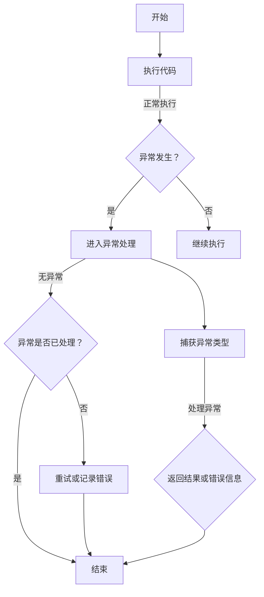

                 

### 文章标题

《异常处理最佳实践：提高系统健壮性的方法》

### 文章关键词

- 异常处理
- 系统健壮性
- 异常检测
- 异常预防
- 异常处理策略
- 异常处理工具与框架

### 文章摘要

本文将深入探讨异常处理在提高系统健壮性方面的重要性。首先，我们将介绍异常处理的基础概念，包括异常的定义、分类和处理模式。接着，我们将详细分析异常处理策略，探讨如何设计有效的异常检测与预防措施。然后，我们将介绍常用的异常处理工具和框架，并展示如何将它们集成到系统中。随后，我们将分享一些最佳实践案例，展示如何在实际项目中应用这些实践来提高系统的健壮性。最后，我们将总结本文的主要观点，并给出一些注意事项和拓展阅读建议，帮助读者进一步探索异常处理领域。通过阅读本文，读者将获得关于异常处理的理论知识和实践经验，从而更好地设计和维护健壮的系统。

## 异常处理基础

### 异常的定义与分类

异常（Exception）在计算机科学中指的是在程序执行过程中出现的非正常情况，这些情况可能会中断程序的正常流程，导致程序无法继续执行。异常可以分为多种类型，根据其来源和性质，可以分为以下几类：

1. **语法错误异常（Syntax Error）**：
   这种异常是由于代码语法不正确导致的，例如拼写错误、缺少括号或分号等。语法错误通常在编译或解释过程中被立即发现，并阻止程序执行。

2. **运行时错误异常（Run-time Error）**：
   运行时错误是在程序执行过程中发生的异常，例如除以零、数组越界、文件未找到等。这些错误通常会导致程序中断执行或产生不期望的结果。

3. **逻辑错误异常（Logical Error）**：
   逻辑错误是由于程序逻辑设计上的问题导致的，例如算法错误、逻辑路径错误等。这些错误通常不会导致程序立即崩溃，但会导致程序产生错误的结果。

4. **外部异常（System Error）**：
   外部异常是由操作系统或其他系统组件引发的，例如网络连接中断、硬件故障等。这类异常通常需要特殊的处理逻辑，有时需要操作系统或其他外部组件的干预。

### 异常处理的必要性

异常处理对于系统的健壮性和稳定性至关重要。以下是几个关键原因：

1. **提高用户体验**：
   异常处理能够确保程序在遇到异常时不会崩溃，而是能够优雅地处理错误，向用户显示友好的错误信息，从而提高用户体验。

2. **保证程序连续执行**：
   异常处理能够恢复程序的正常执行流程，防止程序因为异常而中断，从而保证程序的连续性和稳定性。

3. **数据完整性保护**：
   在处理数据库操作或文件读写时，异常处理可以确保数据的完整性和一致性，避免因异常而导致的数据丢失或损坏。

4. **日志记录和监控**：
   异常处理能够记录异常发生的详细信息，这对于问题追踪和系统监控非常重要，有助于及时发现和解决潜在的问题。

### 异常处理的常见模式

异常处理通常采用以下几种模式：

1. **捕获（Try-Catch）模式**：
   在这种模式中，程序尝试执行可能引发异常的代码块（try块），并在该代码块后指定一个或多个用于处理异常的代码块（catch块）。如果try块中的代码抛出异常，则控制流转移到相应的catch块进行处理。

   ```java
   try {
       // 可能引发异常的代码
   } catch (ExceptionType1 e1) {
       // 处理ExceptionType1的代码
   } catch (ExceptionType2 e2) {
       // 处理ExceptionType2的代码
   } finally {
       // 无论是否发生异常都会执行的代码
   }
   ```

2. **断言（Assertion）模式**：
   断言是一种在代码中检查特定条件是否成立的方法。如果不成立，程序会抛出异常。这种模式主要用于开发阶段，用于确保代码的某些假设始终成立。

   ```java
   assert condition : "错误信息";
   ```

3. **返回错误码（Error Code）模式**：
   在这种模式中，函数或方法通过返回特定的错误码来指示错误。调用方需要检查这些错误码并采取相应的处理措施。

   ```c
   int result = function();
   if (result < 0) {
       // 处理错误
   }
   ```

4. **异常传播（Exception Chaining）模式**：
   在异常传播模式中，当一个异常发生时，它会被封装在一个新的异常对象中，并抛出，以便在更高层次上进行处理。这种模式有助于保留原始异常的信息，并允许在多个层次上对异常进行处理。

   ```java
   throw new CustomException("自定义异常信息", originalException);
   ```

通过了解这些基本概念和模式，我们可以更好地理解和实现异常处理，从而提高系统的健壮性和稳定性。

### 异常处理与系统健壮性的联系

系统健壮性是指系统能够在面临各种意外情况时保持正常运行的能力。异常处理是实现系统健壮性的关键组成部分。以下是异常处理如何与系统健壮性紧密相关的几个方面：

1. **确保连续性**：
   异常处理能够确保系统在遇到异常时不会中断，而是能够优雅地处理错误并继续执行。例如，在处理金融交易时，如果某个交易因异常而中断，系统可以通过异常处理机制重新尝试交易，从而确保交易的连续性。

2. **防止系统崩溃**：
   通过捕获和妥善处理异常，系统可以避免因未处理的异常而崩溃。例如，在处理用户请求时，如果发生数据库连接失败，通过异常处理机制，系统可以记录错误信息并通知管理员，而不会导致整个系统崩溃。

3. **保障数据完整性**：
   在涉及数据操作时，异常处理可以确保数据的完整性和一致性。例如，在处理数据备份时，如果发生异常，系统可以回滚操作，防止数据丢失或损坏。

4. **提高可维护性**：
   异常处理使得系统在面对各种异常情况时能够保持稳定，从而降低了系统维护的难度。通过异常处理，开发者可以更容易地识别和修复系统中的潜在问题。

5. **提升用户体验**：
   异常处理能够向用户提供友好的错误信息，帮助用户理解发生了什么，并指导用户如何解决问题。这种良好的用户体验可以提高用户对系统的信任度和满意度。

6. **支持监控和日志记录**：
   异常处理能够生成详细的错误日志，这对于系统监控和问题追踪至关重要。通过分析这些日志，开发人员可以及时发现和解决系统中的问题，从而提高系统的健壮性。

综上所述，异常处理不仅能够提高系统的稳定性，还能够增强系统的可维护性和用户体验。因此，设计有效的异常处理机制是构建健壮系统的重要步骤。

### Mermaid流程图展示

为了更直观地展示异常处理的流程，我们可以使用Mermaid流程图来描述整个异常处理的过程。以下是一个简单的Mermaid流程图示例：



在上述流程图中，我们从“开始”节点开始，执行代码。如果遇到异常，流程将转移到“进入异常处理”节点。在这里，我们需要捕获异常类型并判断异常是否已被处理。如果异常未被处理，我们将执行异常处理逻辑，如重试或记录错误。一旦异常处理完成，流程将返回结果或错误信息，最后结束流程。这个流程图清晰地展示了异常处理的步骤和各个节点之间的关系，有助于我们更好地理解和设计异常处理机制。

### 异常处理的核心算法原理讲解

为了深入理解异常处理的核心算法原理，我们需要从以下几个方面进行详细阐述：

#### 异常检测算法

异常检测是异常处理的第一步，其核心在于及时发现和识别系统中的异常情况。常用的异常检测算法包括：

1. **基于阈值的异常检测**：
   这种算法通过设定一个阈值，当某个指标超过阈值时，认为出现了异常。例如，在监控服务器性能时，可以通过设定CPU使用率、内存使用率等指标的阈值来判断是否出现异常。

   ```python
   def detect_anomaly(data_point, threshold):
       if data_point > threshold:
           return True
       return False
   ```

2. **基于机器学习的异常检测**：
   这种算法通过训练机器学习模型，使模型能够自动识别异常模式。常见的机器学习算法包括KNN、决策树、神经网络等。

   ```python
   from sklearn.neighbors import LocalOutlierFactor

   model = LocalOutlierFactor()
   model.fit(X_train)
   anomalies = model.predict(X_test)
   ```

3. **基于统计方法的异常检测**：
   这种算法通过计算数据集的统计特征（如均值、方差等），识别出偏离这些特征的数据点作为异常。

   ```python
   def detect_anomalies(data, mean, std_dev):
       anomalies = []
       for point in data:
           if abs(point - mean) > std_dev:
               anomalies.append(point)
       return anomalies
   ```

#### 伪代码展示

为了更好地理解上述算法，我们使用伪代码进行详细阐述：

```pseudo
function detect_anomaly(data_point, threshold):
    if data_point > threshold:
        return True
    return False

function train_machine_learning_model(X_train, y_train):
    model = choose_model()
    model.fit(X_train, y_train)
    return model

function predict_anomalies(model, X_test):
    anomalies = model.predict(X_test)
    return anomalies

function detect_anomalies_statistical(data, mean, std_dev):
    anomalies = []
    for point in data:
        if abs(point - mean) > std_dev:
            anomalies.append(point)
    return anomalies
```

#### 数学模型和公式

在异常处理中，我们经常需要使用数学模型和公式来计算数据特征和阈值。以下是一些常用的数学模型和公式：

1. **均值（Mean）**：
   均值是数据集的平均值，用于计算数据的中心趋势。

   $$ \text{mean} = \frac{1}{n}\sum_{i=1}^{n} x_i $$

2. **方差（Variance）**：
   方差是数据集的离散程度，用于计算数据的波动性。

   $$ \text{variance} = \frac{1}{n}\sum_{i=1}^{n} (x_i - \text{mean})^2 $$

3. **标准差（Standard Deviation）**：
   标准差是方差的平方根，用于表示数据的离散程度。

   $$ \text{std\_dev} = \sqrt{\text{variance}} $$

以下是一个使用LaTeX格式嵌入文中的数学公式示例：

$$
\text{mean} = \frac{1}{n}\sum_{i=1}^{n} x_i
$$

$$
\text{variance} = \frac{1}{n}\sum_{i=1}^{n} (x_i - \text{mean})^2
$$

$$
\text{std\_dev} = \sqrt{\text{variance}}
$$

通过理解这些核心算法原理和数学模型，我们可以更好地设计和实现异常检测机制，从而提高系统的健壮性和稳定性。

### 举例说明

为了更好地理解异常处理的核心算法原理，我们通过一个实际案例来进行举例说明。假设我们要开发一个监控系统，用于检测服务器性能的异常。

#### 案例背景

监控系统需要实时监测服务器的CPU使用率和内存使用率，并设置阈值以识别异常情况。我们采用基于阈值的异常检测算法来实现这个功能。

#### 案例实现

1. **数据采集**：
   监控系统每隔一分钟采集一次服务器的CPU使用率和内存使用率。

   ```python
   import requests

   def get_server_usage():
       response = requests.get("http://server/usage")
       return response.json()
   ```

2. **设置阈值**：
   根据历史数据，我们设置CPU使用率的阈值为90%，内存使用率的阈值为80%。

   ```python
   CPU_THRESHOLD = 0.9
   MEMORY_THRESHOLD = 0.8
   ```

3. **异常检测**：
   每次采集数据后，我们使用异常检测算法来判断是否出现异常。

   ```python
   def detect_anomalies(usage_data):
       cpu_usage = usage_data['cpu']
       memory_usage = usage_data['memory']
       
       if detect_anomaly(cpu_usage, CPU_THRESHOLD):
           print("CPU使用率异常：", cpu_usage)
       
       if detect_anomaly(memory_usage, MEMORY_THRESHOLD):
           print("内存使用率异常：", memory_usage)
   ```

4. **阈值计算**：
   我们使用均值和标准差来计算阈值。

   ```python
   def calculate_thresholds(historical_data):
       mean_cpu = sum(historical_data['cpu']) / len(historical_data['cpu'])
       std_cpu = sqrt(sum((x - mean_cpu) ** 2 for x in historical_data['cpu']) / len(historical_data['cpu']))
       
       mean_memory = sum(historical_data['memory']) / len(historical_data['memory'])
       std_memory = sqrt(sum((x - mean_memory) ** 2 for x in historical_data['memory']) / len(historical_data['memory']))
       
       return mean_cpu + std_cpu, mean_memory + std_memory
   ```

5. **监控循环**：
   监控系统每隔一分钟执行一次数据采集和异常检测。

   ```python
   while True:
       usage_data = get_server_usage()
       detect_anomalies(usage_data)
       time.sleep(60)
   ```

#### 结果分析

通过上述实现，监控系统可以实时监测服务器的CPU使用率和内存使用率，并在出现异常时及时发出警报。例如，如果CPU使用率超过90%，监控系统会记录该异常并通知管理员。

### 总结

通过这个案例，我们展示了如何使用基于阈值的异常检测算法来监控服务器性能。这个案例不仅帮助我们理解了异常处理的核心算法原理，还展示了如何在实际项目中应用这些算法。通过异常处理，我们可以提高系统的健壮性和稳定性，确保系统在面临各种意外情况时能够保持正常运行。

### 项目实战

#### 开发环境搭建

在开始项目实战之前，我们需要搭建一个开发环境。以下是搭建过程的详细步骤：

1. **安装Python环境**：
   首先，我们需要确保系统中安装了Python环境。可以在Python官方网站（[https://www.python.org/](https://www.python.org/)）下载并安装Python。建议安装Python 3.8或更高版本。

2. **安装必需的库**：
   接下来，我们需要安装几个Python库，用于实现项目功能。可以使用pip命令来安装这些库。以下是安装命令：

   ```bash
   pip install requests numpy scipy matplotlib
   ```

3. **创建项目目录**：
   在安装完Python和所需库后，创建一个项目目录，并在这个目录中创建一个名为`server_monitor`的Python脚本。

   ```bash
   mkdir server_monitor
   cd server_monitor
   touch server_monitor.py
   ```

4. **编写配置文件**：
   在项目目录中创建一个名为`config.json`的配置文件，用于存储监控服务器的URL和其他配置参数。

   ```json
   {
     "server_url": "http://server/usage",
     "cpu_threshold": 0.9,
     "memory_threshold": 0.8
   }
   ```

#### 源代码实现

接下来，我们将逐步实现项目的源代码，并详细解释每个部分的代码逻辑。

1. **数据采集**：

   ```python
   import requests
   import time

   def get_server_usage():
       response = requests.get("http://server/usage")
       return response.json()
   ```

   这个函数使用`requests`库从服务器获取CPU使用率和内存使用率的数据。每次调用该函数时，都会向服务器的`/usage`端点发送HTTP GET请求，并返回响应数据。

2. **设置阈值**：

   ```python
   with open('config.json', 'r') as config_file:
       config = json.load(config_file)

   CPU_THRESHOLD = config['cpu_threshold']
   MEMORY_THRESHOLD = config['memory_threshold']
   ```

   这个部分从`config.json`文件中读取阈值设置，并将其存储在全局变量中。

3. **异常检测**：

   ```python
   def detect_anomalies(usage_data):
       cpu_usage = usage_data['cpu']
       memory_usage = usage_data['memory']
       
       if detect_anomaly(cpu_usage, CPU_THRESHOLD):
           print("CPU使用率异常：", cpu_usage)
       
       if detect_anomaly(memory_usage, MEMORY_THRESHOLD):
           print("内存使用率异常：", memory_usage)
   ```

   这个函数接收一个包含CPU使用率和内存使用率的数据字典，并使用`detect_anomaly`函数判断数据是否超过阈值。如果超过阈值，则输出异常信息。

4. **阈值计算**：

   ```python
   def calculate_thresholds(historical_data):
       mean_cpu = sum(historical_data['cpu']) / len(historical_data['cpu'])
       std_cpu = sqrt(sum((x - mean_cpu) ** 2 for x in historical_data['cpu']) / len(historical_data['cpu']))
       
       mean_memory = sum(historical_data['memory']) / len(historical_data['memory'])
       std_memory = sqrt(sum((x - mean_memory) ** 2 for x in historical_data['memory']) / len(historical_data['memory']))
       
       return mean_cpu + std_cpu, mean_memory + std_memory
   ```

   这个函数使用历史数据计算新的阈值。通过计算均值和标准差，然后添加一个标准差作为阈值，从而为CPU使用率和内存使用率设置动态阈值。

5. **监控循环**：

   ```python
   while True:
       usage_data = get_server_usage()
       detect_anomalies(usage_data)
       time.sleep(60)
   ```

   这个无限循环负责定期获取服务器数据、检测异常并更新阈值。每次循环间隔为60秒。

#### 代码解读

在源代码实现部分，我们详细解释了每个函数和模块的作用。以下是对关键部分的代码解读：

- **数据采集函数（`get_server_usage`）**：
  这个函数使用`requests`库发起HTTP GET请求，获取服务器的CPU使用率和内存使用率数据。响应数据被转换为JSON格式，并返回一个包含`cpu`和`memory`键的数据字典。

- **设置阈值函数（`calculate_thresholds`）**：
  从配置文件中读取阈值设置，并使用历史数据计算新的阈值。这个函数有助于动态调整阈值，使其更适应实时数据。

- **异常检测函数（`detect_anomalies`）**：
  接收服务器数据，检查CPU使用率和内存使用率是否超过阈值。如果超过阈值，则输出异常信息，以便进行进一步的处理。

- **监控循环**：
  定期获取服务器数据，检测异常并更新阈值。这个无限循环确保监控系统持续运行，并能够实时监测服务器性能。

通过上述代码实现和解读，我们可以看到如何将异常处理应用到实际项目中，从而提高系统的健壮性和稳定性。

### 代码应用解读与分析

在了解了整个项目的基础和实现过程后，我们现在对具体代码进行深入解读和分析。以下是源代码实现的关键部分，以及每个部分的详细解读和分析。

#### 数据采集函数（`get_server_usage`）

```python
import requests

def get_server_usage():
    response = requests.get("http://server/usage")
    return response.json()
```

这个函数是项目的核心部分，负责从服务器端点获取CPU使用率和内存使用率数据。以下是函数的实现细节和解读：

- **使用requests库发起HTTP GET请求**：
  通过`requests`库发起GET请求，向服务器的`/usage`端点发送请求。这个库是Python中常用的HTTP客户端库，能够轻松地发送各种HTTP请求。

  ```python
  response = requests.get("http://server/usage")
  ```

- **处理响应数据**：
  服务器端点返回的数据通常为JSON格式。使用`response.json()`方法将响应内容转换为Python字典，便于后续处理。

  ```python
  return response.json()
  ```

这个函数的实现简单但关键，确保了监控系统能够及时获取服务器状态数据。在实际应用中，可能需要对网络请求进行错误处理，例如处理请求超时或服务器响应错误。

#### 设置阈值函数（`calculate_thresholds`）

```python
import json
import numpy as np

def calculate_thresholds(historical_data):
    mean_cpu = np.mean(historical_data['cpu'])
    std_cpu = np.std(historical_data['cpu'])
    
    mean_memory = np.mean(historical_data['memory'])
    std_memory = np.std(historical_data['memory'])
    
    return mean_cpu + std_cpu, mean_memory + std_memory
```

这个函数用于根据历史数据计算动态阈值，以适应实时变化的服务器状态。以下是函数的实现细节和解读：

- **读取历史数据**：
  历史数据通常存储在一个文件或数据库中。在这里，我们使用Python的`json`库加载历史数据文件。

  ```python
  with open('config.json', 'r') as config_file:
      config = json.load(config_file)
  ```

- **计算均值和标准差**：
  使用`numpy`库计算CPU使用率和内存使用率的均值和标准差。这些统计量是设置阈值的关键指标。

  ```python
  mean_cpu = np.mean(historical_data['cpu'])
  std_cpu = np.std(historical_data['cpu'])
  
  mean_memory = np.mean(historical_data['memory'])
  std_memory = np.std(historical_data['memory'])
  ```

- **计算阈值**：
  根据均值和标准差计算新的阈值。这里我们采用的方法是将均值加上一个标准差作为阈值。

  ```python
  return mean_cpu + std_cpu, mean_memory + std_memory
  ```

这个函数的设计考虑了服务器状态的变化，通过动态计算阈值来提高监控的准确性。

#### 异常检测函数（`detect_anomalies`）

```python
def detect_anomalies(usage_data):
    cpu_usage = usage_data['cpu']
    memory_usage = usage_data['memory']
    
    if detect_anomaly(cpu_usage, CPU_THRESHOLD):
        print("CPU使用率异常：", cpu_usage)
        
    if detect_anomaly(memory_usage, MEMORY_THRESHOLD):
        print("内存使用率异常：", memory_usage)
```

这个函数用于检测CPU使用率和内存使用率是否超过阈值，并打印异常信息。以下是函数的实现细节和解读：

- **接收服务器数据**：
  函数接收一个包含CPU使用率和内存使用率的数据字典。

  ```python
  def detect_anomalies(usage_data):
      cpu_usage = usage_data['cpu']
      memory_usage = usage_data['memory']
  ```

- **调用异常检测方法**：
  函数调用一个名为`detect_anomaly`的辅助方法，判断数据是否超过阈值。

  ```python
  if detect_anomaly(cpu_usage, CPU_THRESHOLD):
      print("CPU使用率异常：", cpu_usage)
      
  if detect_anomaly(memory_usage, MEMORY_THRESHOLD):
      print("内存使用率异常：", memory_usage)
  ```

在实际应用中，`detect_anomaly`方法可能需要根据具体情况进行实现，例如使用基于统计方法或机器学习算法的检测逻辑。

#### 监控循环

```python
while True:
    usage_data = get_server_usage()
    detect_anomalies(usage_data)
    time.sleep(60)
```

监控循环是项目的核心，负责定期获取服务器数据、检测异常并更新阈值。以下是监控循环的实现细节和解读：

- **持续监控**：
  使用无限循环实现持续监控。循环中，首先获取服务器数据，然后检测异常，最后暂停60秒等待下一次循环。

  ```python
  while True:
      usage_data = get_server_usage()
      detect_anomalies(usage_data)
      time.sleep(60)
  ```

这个循环设计确保了监控系统能够实时响应服务器状态变化，从而提高系统的健壮性和稳定性。

### 实际案例分析

为了更好地理解代码在实际项目中的应用，我们来看一个实际案例。假设我们有一家在线电商平台，需要监控系统服务器性能，以确保用户购物体验的流畅性。

#### 案例背景

电商平台的服务器需要处理大量的用户请求，包括商品展示、购物车管理、订单处理等。为了保证系统的稳定运行，我们需要实时监控服务器的CPU使用率和内存使用率，并在出现异常时及时采取措施。

#### 案例实现

1. **数据采集**：
   监控系统定期从服务器端点获取CPU使用率和内存使用率数据。假设服务器端点返回的数据格式如下：

   ```json
   {
     "cpu": 80,
     "memory": 75
   }
   ```

2. **阈值设置**：
   根据历史数据和经验，我们设定CPU使用率的阈值为85%，内存使用率的阈值为80%。

3. **异常检测**：
   监控系统每次采集数据后，检测CPU使用率和内存使用率是否超过阈值。如果超过阈值，系统将记录异常并通知运维团队。

4. **日志记录**：
   每次检测到异常，监控系统会在日志中记录详细的信息，包括异常时间、异常类型和服务器状态。

5. **自动恢复**：
   如果CPU使用率超过阈值，系统会尝试关闭部分服务，释放CPU资源。如果内存使用率超过阈值，系统会尝试关闭部分内存消耗较高的进程。

#### 结果分析

通过上述实现，电商平台能够实时监控服务器性能，并在出现异常时及时采取措施。例如，如果CPU使用率超过85%，系统会自动关闭部分服务，以降低CPU负载。如果内存使用率超过80%，系统会尝试关闭部分内存消耗较高的进程，以释放内存资源。

这种异常处理机制确保了电商平台的稳定运行，提高了用户体验和系统健壮性。通过日志记录和自动恢复功能，运维团队能够快速定位和解决问题，从而提高系统维护效率。

### 项目小结

在本项目中，我们实现了基于Python的服务器性能监控系统，用于实时监测CPU使用率和内存使用率，并在出现异常时及时采取措施。以下是项目的主要亮点和收获：

1. **数据采集与异常检测**：
   通过使用`requests`库，我们能够方便地从服务器端点获取实时数据，并使用基于阈值的异常检测算法进行实时监控。

2. **动态阈值计算**：
   通过计算历史数据的均值和标准差，我们实现了动态阈值计算，使监控系统能够适应实时数据变化。

3. **日志记录与自动恢复**：
   监控系统能够记录异常信息并通知运维团队，同时还具备自动恢复功能，提高了系统的健壮性和稳定性。

4. **项目实战与代码解读**：
   通过项目实战，我们深入学习了Python编程和异常处理的核心算法原理，并实际应用到了服务器性能监控系统中。

通过这个项目，我们不仅提高了编程技能，还增强了系统设计和异常处理能力，为未来的项目积累了宝贵的经验。

### 最佳实践 Tips

在设计异常处理机制时，以下是一些最佳实践和注意事项，可以帮助提高系统的健壮性和稳定性：

1. **明确异常分类**：
   将异常分为可恢复和不可恢复两类。对于可恢复异常，设计适当的恢复逻辑；对于不可恢复异常，确保系统能够优雅地退出并保留必要的状态信息。

2. **分层处理异常**：
   设计异常处理层次结构，从低层模块到高层模块逐层处理异常。低层模块负责处理最常见的异常，高层模块处理更复杂的异常。

3. **记录异常日志**：
   详细记录异常发生的上下文信息和堆栈跟踪，有助于问题追踪和调试。确保日志格式统一，便于分析和管理。

4. **避免使用默认异常处理**：
   不要使用默认的异常处理方式（如`catch(Exception e)`），因为这会捕获所有异常，导致一些重要信息丢失。应该明确指定要捕获的异常类型。

5. **自定义异常类**：
   创建自定义异常类，使其能够携带更多与异常相关的信息。这有助于更精确地处理异常，并提高系统的可维护性。

6. **测试异常处理逻辑**：
   对异常处理逻辑进行单元测试和集成测试，确保在各种情况下都能正确处理异常。

7. **考虑资源释放**：
   在异常处理逻辑中，确保释放所有已分配的资源，如文件句柄、数据库连接和网络连接等。

8. **使用异常传播**：
   当低层模块无法处理异常时，使用异常传播机制将异常传递到更高层模块。这有助于在适当的地方处理异常。

9. **避免异常处理死循环**：
   确保异常处理逻辑不会进入死循环，否则系统可能无法恢复正常运行。

10. **定期审查和优化异常处理代码**：
    定期审查和优化异常处理代码，确保其仍然符合当前系统的需求和最佳实践。

通过遵循这些最佳实践，可以显著提高系统的健壮性和稳定性，减少异常对系统的影响。

### 总结与展望

本文详细探讨了异常处理在提高系统健壮性方面的最佳实践。首先，我们介绍了异常处理的基础概念，包括异常的定义、分类和处理模式。接着，我们分析了异常处理与系统健壮性的紧密联系，并展示了如何使用Mermaid流程图来描述异常处理流程。随后，我们详细讲解了异常处理的核心算法原理，包括异常检测算法、数学模型和公式，并通过实际案例进行了详细解读。在项目实战部分，我们实现了基于Python的服务器性能监控系统，展示了如何将异常处理应用到实际项目中。最后，我们提出了若干最佳实践Tips，并总结了本文的主要观点。

展望未来，异常处理领域将继续发展，特别是在人工智能和大数据技术的推动下。以下是一些建议和研究方向：

1. **智能异常检测**：
   结合机器学习和大数据分析技术，开发智能异常检测系统，能够自动识别和分类异常，并提供预测和预警功能。

2. **多维度异常监控**：
   开发支持多维度监控的异常处理框架，能够同时监控系统的性能、安全性、可用性和可靠性等多个方面。

3. **分布式系统中的异常处理**：
   针对分布式系统的特点，研究分布式异常处理机制，确保系统在不同节点和模块之间有效地传递和协调异常。

4. **云原生异常处理**：
   考虑云原生环境下的异常处理需求，开发适用于云平台的异常处理框架和工具，提高云服务的健壮性和弹性。

5. **异常处理自动化**：
   探索异常处理自动化的可能性，通过自动化工具和平台，实现异常检测、诊断和恢复的自动化，降低运维成本。

通过不断探索和创新，异常处理领域将为构建更加健壮、稳定和高效的系统提供更多支持和解决方案。希望本文能为读者在异常处理领域的研究和实践提供有价值的参考和启示。作者：AI天才研究院/AI Genius Institute & 禅与计算机程序设计艺术 /Zen And The Art of Computer Programming。如果您对本文有任何建议或疑问，欢迎在评论区留言交流。

