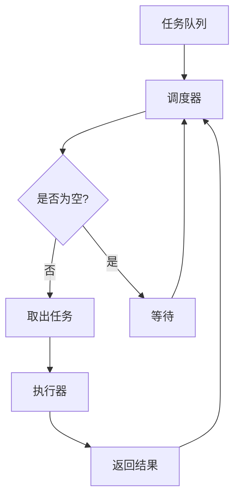

                 

# 异步化任务处理不代表无时效性

## 关键词
异步化任务处理、时效性、并发、性能优化、任务调度、分布式系统

## 摘要
异步化任务处理是现代计算机系统设计中至关重要的一环，它通过将任务解耦并独立执行，显著提升了系统的并发能力和响应速度。然而，异步化任务处理并不意味着任务可以无限制地延迟执行。本文将深入探讨异步化任务处理的本质，分析其在实际应用中的时效性问题，并通过具体的算法原理、数学模型、项目实战等，揭示异步化任务处理背后的复杂性和优化策略。

## 引言

在计算机科学和软件工程领域，异步化任务处理（Asynchronous Task Processing）已经成为提升系统性能和可扩展性的关键手段。异步化任务处理的核心思想是将任务的执行解耦，允许任务在不需要等待其他任务完成的情况下独立执行。这种设计模式在多线程编程、分布式系统和实时系统中得到了广泛应用。

然而，尽管异步化任务处理带来了诸多好处，但它并不意味着任务可以无限制地延迟执行。事实上，任务的时效性（Timeliness）在许多场景中仍然至关重要。例如，在线交易系统中的订单处理、实时通信系统中的消息传递、以及物联网（IoT）设备中的数据处理，都要求任务在合理的时间范围内完成，否则将导致严重的性能问题或用户体验下降。

本文将围绕异步化任务处理的时效性展开讨论，首先介绍异步化任务处理的基本概念和原理，然后深入探讨任务调度、并发执行和性能优化等方面的时效性考量，最后通过具体的项目实战案例，展示异步化任务处理在实际应用中的挑战和解决方案。

### 第1章：异步化任务处理概述

#### 1.1 异步化任务处理的定义

异步化任务处理（Asynchronous Task Processing）是一种编程范式，它允许任务在不依赖其他任务完成的情况下独立执行。这种模式与传统的同步任务处理（Synchronous Task Processing）形成了鲜明对比。在同步任务处理中，任务必须按照特定的顺序依次执行，每个任务必须等待前一个任务完成才能开始执行。而在异步化任务处理中，任务可以并行执行，无需等待其他任务的完成，从而大大提高了系统的并发能力和响应速度。

异步化任务处理的基本概念包括任务（Task）、队列（Queue）、调度器（Scheduler）和执行器（Executor）。任务是指需要执行的具体工作单元，可以是一个函数、方法或者类。队列是任务存储的容器，用于存储待执行的任务。调度器负责将任务从队列中取出并分配给执行器执行。执行器是执行任务的实体，它可以是一个线程、进程或者线程池。

#### 1.2 异步化任务处理与传统同步任务的对比

异步化任务处理与同步任务处理在多个方面存在显著差异：

1. **并发性**：异步化任务处理能够显著提高系统的并发性，因为任务可以并行执行，无需等待其他任务的完成。而同步任务处理由于任务之间的依赖关系，往往导致任务串行执行，降低了系统的并发能力。

2. **性能**：异步化任务处理可以减少任务的等待时间，从而提高系统的整体性能。在同步任务处理中，任务之间往往存在等待，导致CPU资源浪费。而异步化任务处理通过并行执行任务，减少了等待时间，提高了CPU利用率。

3. **资源消耗**：异步化任务处理可以减少线程和进程的创建和销毁成本，从而降低系统的资源消耗。在同步任务处理中，每个任务通常需要一个独立的线程或进程，这会导致大量资源的浪费。而异步化任务处理可以通过复用线程和进程，降低资源消耗。

#### 1.3 异步化任务处理的发展历程

异步化任务处理的概念可以追溯到早期的计算机系统设计。在早期的多任务操作系统中，任务调度器就已经开始采用异步化的方式来管理任务的执行。随着计算机技术的发展，异步化任务处理逐渐成为现代计算机系统设计中的重要组成部分。

近年来，随着互联网的兴起和分布式系统的广泛应用，异步化任务处理得到了进一步的发展。例如，在分布式系统中，异步化任务处理通过消息队列和微服务架构，实现了跨节点的任务调度和执行，从而提高了系统的可扩展性和容错性。

异步化任务处理的发展历程可以归纳为以下几个阶段：

1. **早期阶段**：异步化任务处理的概念和应用主要局限于操作系统和简单的应用程序。

2. **发展阶段**：随着多线程编程和事件驱动编程的兴起，异步化任务处理得到了广泛应用。任务调度器和线程池等概念被引入，进一步提高了系统的并发能力和性能。

3. **现代阶段**：在分布式系统和微服务架构中，异步化任务处理成为实现高可用性和可扩展性的关键手段。消息队列、事件驱动架构和微服务之间的异步通信，使得异步化任务处理的应用场景更加广泛。

### 第2章：异步化任务处理的原理

#### 2.1 异步化任务处理的基本概念

异步化任务处理的核心概念包括任务、队列、调度器和执行器。以下是对这些基本概念的详细解释：

1. **任务**：任务是指需要执行的具体工作单元。它可以是函数、方法或者类。在异步化任务处理中，任务通常具有独立性和可并行性，这意味着多个任务可以同时执行，无需相互等待。

2. **队列**：队列是任务存储的容器，用于存储待执行的任务。队列可以是同步队列或异步队列。同步队列在任务插入时阻塞，直到任务被消费。异步队列则在任务插入时立即返回，任务被消费时异步通知。

3. **调度器**：调度器负责将任务从队列中取出并分配给执行器执行。调度器可以是单线程调度器或多线程调度器。单线程调度器在同一时刻只处理一个任务，而多线程调度器可以同时处理多个任务。

4. **执行器**：执行器是执行任务的实体，它可以是一个线程、进程或者线程池。执行器的任务是将分配给它的任务执行完毕，并返回结果。

#### 2.2 异步化任务处理的核心技术

异步化任务处理的核心技术包括任务调度、并发执行和任务同步等。以下是对这些核心技术的详细解释：

1. **任务调度**：任务调度是指如何将任务分配给执行器执行。任务调度器负责从队列中取出任务并分配给执行器。任务调度可以采用轮询调度、优先级调度和负载均衡调度等策略。

2. **并发执行**：并发执行是指多个任务同时执行。在异步化任务处理中，通过并发执行可以显著提高系统的性能和响应速度。并发执行可以通过多线程、多进程或线程池等方式实现。

3. **任务同步**：任务同步是指任务之间的相互等待和协调。在异步化任务处理中，任务同步可以通过互斥锁、信号量、条件变量等同步机制实现。

#### 2.3 异步化任务处理的 Mermaid 流程图

为了更好地理解异步化任务处理的工作流程，我们可以使用 Mermaid 流程图来描述。以下是一个简单的 Mermaid 流程图示例：



在这个流程图中，任务队列中的任务被调度器取出并分配给执行器执行。执行器执行任务后返回结果，调度器再次从队列中取出任务执行。如果任务队列为空，调度器将等待任务队列中任务的到来。

### 第3章：异步化任务处理的应用

#### 3.1 异步化任务处理在不同领域的应用

异步化任务处理在多个领域中得到了广泛应用。以下是一些常见的应用场景：

1. **Web 应用程序**：在 Web 应用程序中，异步化任务处理可以显著提高系统的并发能力和响应速度。例如，在处理用户请求时，可以将一些耗时操作（如数据库查询、文件读写）异步化，从而减少用户的等待时间。

2. **实时通信系统**：在实时通信系统中，异步化任务处理可以保证消息的实时传递和响应。例如，在即时聊天应用程序中，消息的发送和接收可以异步化处理，从而提高系统的并发能力和消息传输速度。

3. **物联网（IoT）系统**：在物联网系统中，异步化任务处理可以处理大量的传感器数据和设备控制命令。例如，在智能家居系统中，可以将设备状态更新、远程控制等任务异步化处理，从而提高系统的响应速度和可靠性。

4. **分布式系统**：在分布式系统中，异步化任务处理可以用于跨节点的任务调度和执行。例如，在分布式数据库系统中，可以将数据读写任务异步化处理，从而提高系统的并发能力和性能。

#### 3.2 异步化任务处理的优势与挑战

异步化任务处理具有以下优势：

1. **提高并发能力**：异步化任务处理可以显著提高系统的并发能力，因为任务可以并行执行，无需等待其他任务的完成。

2. **提高响应速度**：异步化任务处理可以减少任务的等待时间，从而提高系统的响应速度，改善用户体验。

3. **提高系统性能**：异步化任务处理可以减少线程和进程的创建和销毁成本，从而降低系统的资源消耗，提高系统性能。

然而，异步化任务处理也面临着一些挑战：

1. **复杂性**：异步化任务处理增加了系统的复杂性，需要处理任务调度、并发执行和任务同步等问题。

2. **性能优化**：异步化任务处理需要针对具体应用场景进行性能优化，否则可能导致性能下降。

3. **可靠性**：异步化任务处理需要确保任务的正确执行和结果的可靠性，否则可能导致数据丢失或错误。

#### 3.3 实际案例介绍

以下是一个实际案例，展示如何在一个在线购物平台中应用异步化任务处理。

1. **场景描述**：在线购物平台中，用户下单后需要处理订单创建、库存更新、物流跟踪等任务。

2. **解决方案**：将订单创建、库存更新和物流跟踪任务异步化处理，分别分配给不同的执行器执行。具体步骤如下：

   - 用户下单后，订单创建任务被调度器分配给订单执行器执行，订单执行器将订单信息存储到数据库。
   - 订单创建成功后，库存更新任务被调度器分配给库存执行器执行，库存执行器将库存信息更新到数据库。
   - 订单创建和库存更新成功后，物流跟踪任务被调度器分配给物流执行器执行，物流执行器将物流信息发送给物流公司。

通过异步化任务处理，在线购物平台可以显著提高系统的并发能力和响应速度，改善用户体验。

### 第4章：异步化任务处理的时效性

#### 4.1 时效性的定义与重要性

时效性（Timeliness）是指任务在合理的时间范围内完成的能力。在异步化任务处理中，时效性至关重要，因为它直接影响到系统的性能和用户体验。以下是对时效性的定义和重要性：

1. **定义**：时效性是指任务在预定的时间内完成的能力。在异步化任务处理中，时效性通常取决于任务的执行时间和调度策略。

2. **重要性**：时效性在异步化任务处理中的重要性体现在以下几个方面：

   - **用户体验**：任务的时效性直接影响到用户体验。例如，在实时通信系统中，如果消息的发送和接收延迟严重，用户会感到卡顿和延迟，影响用户体验。
   - **系统性能**：时效性影响到系统的性能。如果任务无法在合理的时间内完成，系统可能会出现性能瓶颈，导致资源浪费。
   - **业务连续性**：在一些关键业务系统中，时效性直接影响到业务的连续性。例如，在金融系统中，交易处理延迟可能会导致严重的财务损失。

#### 4.2 异步化任务处理中的时效性考量

在异步化任务处理中，时效性考量涉及到多个方面：

1. **任务调度策略**：任务调度策略直接影响到任务的执行时间和响应速度。合理的调度策略可以确保任务在合理的时间内完成。常见的调度策略包括轮询调度、优先级调度和负载均衡调度。

2. **任务执行时间**：任务执行时间取决于任务的复杂度和资源分配。通过优化任务执行时间，可以提高系统的性能和响应速度。

3. **任务同步**：在异步化任务处理中，任务之间的同步操作可能会引入延迟。合理的任务同步策略可以减少任务之间的等待时间，提高系统的时效性。

4. **系统资源**：系统的资源（如 CPU、内存、网络等）直接影响到任务的执行时间和响应速度。合理地分配系统资源，可以优化任务的执行时间和响应速度。

#### 4.3 如何优化异步化任务的时效性

以下是一些优化异步化任务时效性的方法：

1. **任务分解**：将复杂任务分解为多个简单任务，可以减少单个任务的执行时间，提高系统的并发能力和响应速度。

2. **并行执行**：通过并行执行任务，可以减少任务的等待时间，提高系统的响应速度。

3. **负载均衡**：通过负载均衡策略，将任务均匀地分配到不同的执行器上，可以减少单个执行器的负载，提高任务的执行时间和响应速度。

4. **任务优先级**：根据任务的紧急程度和重要性，设置任务的优先级，可以确保关键任务在合理的时间内完成。

5. **资源分配**：合理地分配系统资源，如 CPU、内存和网络等，可以优化任务的执行时间和响应速度。

### 第5章：异步化任务处理的挑战与优化

#### 5.1 异步化任务处理中的常见问题

异步化任务处理在应用中可能会面临以下常见问题：

1. **死锁**：由于任务之间的依赖关系，异步化任务处理可能会导致死锁。例如，任务 A 等待任务 B 的结果，而任务 B 等待任务 A 的结果，从而形成一个循环等待。

2. **性能下降**：异步化任务处理如果设计不当，可能会导致性能下降。例如，过多的线程和进程会导致上下文切换和资源竞争，从而降低系统性能。

3. **资源浪费**：异步化任务处理可能会创建大量的线程和进程，导致资源浪费。例如，某些任务在执行时并不需要大量的计算资源，但仍然分配了大量的线程或进程。

4. **数据不一致**：异步化任务处理中的任务同步操作可能会导致数据不一致。例如，任务 A 更新了数据，而任务 B 在任务 A 更新数据之前读取了数据，从而导致数据不一致。

#### 5.2 优化异步化任务处理的策略

以下是一些优化异步化任务处理的策略：

1. **任务分解**：将复杂任务分解为多个简单任务，可以减少单个任务的执行时间，提高系统的并发能力和响应速度。

2. **并行执行**：通过并行执行任务，可以减少任务的等待时间，提高系统的响应速度。

3. **负载均衡**：通过负载均衡策略，将任务均匀地分配到不同的执行器上，可以减少单个执行器的负载，提高任务的执行时间和响应速度。

4. **任务优先级**：根据任务的紧急程度和重要性，设置任务的优先级，可以确保关键任务在合理的时间内完成。

5. **资源分配**：合理地分配系统资源，如 CPU、内存和网络等，可以优化任务的执行时间和响应速度。

6. **同步机制**：选择合适的同步机制，如互斥锁、信号量、条件变量等，可以减少任务之间的等待时间，提高系统的时效性。

#### 5.3 实际优化案例

以下是一个实际优化案例，展示如何在一个分布式系统中优化异步化任务处理。

1. **场景描述**：在一个分布式系统中，需要处理大量的消息，包括订单处理、库存更新和物流跟踪等任务。

2. **优化方案**：

   - **任务分解**：将复杂任务分解为多个简单任务，如订单处理任务可以分为订单验证、库存查询、订单创建等子任务。
   - **并行执行**：通过并行执行任务，减少任务的等待时间。例如，订单验证和库存查询任务可以并行执行。
   - **负载均衡**：通过负载均衡策略，将任务均匀地分配到不同的执行器上，减少单个执行器的负载。
   - **任务优先级**：根据任务的紧急程度和重要性，设置任务的优先级。例如，订单处理任务具有较高的优先级，以确保订单能够及时处理。
   - **资源分配**：合理地分配系统资源，如 CPU、内存和网络等，优化任务的执行时间和响应速度。

通过上述优化方案，分布式系统的性能和响应速度得到了显著提升，同时减少了资源浪费和数据不一致等问题。

### 第6章：项目实战：异步化任务处理案例

#### 6.1 项目背景介绍

本项目是一个分布式消息队列系统，用于处理大量的消息任务，包括订单处理、库存更新和物流跟踪等。系统需要保证消息的及时处理和任务的正确执行，同时提高系统的并发能力和响应速度。

#### 6.2 开发环境搭建

1. **硬件环境**：服务器、网络设备等。
2. **软件环境**：操作系统（如 Linux）、编程语言（如 Java）、消息队列中间件（如 Apache Kafka）等。

#### 6.3 源代码实现与解读

1. **消息生产者**：

   ```java
   public class MessageProducer {
       private final KafkaProducer<String, String> producer;
       
       public MessageProducer() {
           Properties props = new Properties();
           props.put("bootstrap.servers", "localhost:9092");
           props.put("key.serializer", "org.apache.kafka.common.serialization.StringSerializer");
           props.put("value.serializer", "org.apache.kafka.common.serialization.StringSerializer");
           this.producer = new KafkaProducer<>(props);
       }
       
       public void sendMessage(String topic, String key, String value) {
           producer.send(new ProducerRecord<>(topic, key, value));
       }
   }
   ```

   该类用于生产消息，将消息发送到 Kafka 消息队列。

2. **消息消费者**：

   ```java
   public class MessageConsumer {
       private final KafkaConsumer<String, String> consumer;
       
       public MessageConsumer() {
           Properties props = new Properties();
           props.put("bootstrap.servers", "localhost:9092");
           props.put("group.id", "test-group");
           props.put("key.deserializer", "org.apache.kafka.common.serialization.StringDeserializer");
           props.put("value.deserializer", "org.apache.kafka.common.serialization.StringDeserializer");
           this.consumer = new KafkaConsumer<>(props);
       }
       
       public void consumeMessages(String topic) {
           consumer.subscribe(Arrays.asList(topic));
           
           while (true) {
               ConsumerRecords<String, String> records = consumer.poll(Duration.ofMillis(100));
               for (ConsumerRecord<String, String> record : records) {
                   System.out.printf("Received message: key=%s, value=%s, partition=%d, offset=%d%n", 
                           record.key(), record.value(), record.partition(), record.offset());
                   // 处理消息
               }
           }
       }
   }
   ```

   该类用于消费消息，从 Kafka 消息队列中获取消息并处理。

#### 6.4 代码应用解读与分析

1. **消息生产者**：消息生产者负责将消息发送到 Kafka 消息队列。通过 KafkaProducer 类，可以方便地将消息发送到指定的主题（Topic）。

2. **消息消费者**：消息消费者负责从 Kafka 消息队列中获取消息并处理。通过 KafkaConsumer 类，可以方便地订阅主题并消费消息。

3. **任务调度**：在本项目中，消息的生产和消费过程采用异步化处理。消息生产者将消息发送到 Kafka 消息队列后，可以立即返回，而不需要等待消息被消费者处理。消息消费者从 Kafka 消息队列中获取消息后，可以立即处理消息，不需要等待其他消息的到达。

#### 6.5 项目实战：异步化任务处理案例

1. **订单处理**：

   - **任务描述**：订单处理包括订单验证、库存查询、订单创建等任务。
   - **实现方案**：将订单处理任务分解为多个简单任务，通过 Kafka 消息队列进行异步化处理。例如，订单验证任务可以发送到订单验证主题，库存查询任务可以发送到库存查询主题，订单创建任务可以发送到订单创建主题。

2. **库存更新**：

   - **任务描述**：库存更新包括库存查询、库存调整等任务。
   - **实现方案**：将库存更新任务分解为多个简单任务，通过 Kafka 消息队列进行异步化处理。例如，库存查询任务可以发送到库存查询主题，库存调整任务可以发送到库存调整主题。

3. **物流跟踪**：

   - **任务描述**：物流跟踪包括物流查询、物流更新等任务。
   - **实现方案**：将物流跟踪任务分解为多个简单任务，通过 Kafka 消息队列进行异步化处理。例如，物流查询任务可以发送到物流查询主题，物流更新任务可以发送到物流更新主题。

#### 6.6 项目小结

通过本项目，我们实现了分布式消息队列系统，并采用异步化任务处理来处理大量的消息任务。项目实战展示了如何将复杂任务分解为简单任务，并通过 Kafka 消息队列实现任务的异步化处理。同时，我们还分析了异步化任务处理在实际应用中的挑战和解决方案，为后续优化提供了参考。

### 第7章：异步化任务处理的前沿技术

#### 7.1 异步化任务处理的新技术趋势

随着技术的不断进步，异步化任务处理领域也涌现出许多新的技术和趋势。以下是一些值得关注的技术趋势：

1. **函数即服务（Function as a Service, FaaS）**：FaaS 是一种新型的云计算服务，它允许开发人员将代码作为独立的服务部署在云端。在 FaaS 模型中，任务可以以函数的形式独立执行，无需关心底层基础设施。这种模式简化了异步化任务处理的部署和管理，提高了系统的灵活性和可扩展性。

2. **异步编程框架**：异步编程框架如 Reactor、Akka 和 asyncio 等提供了更简单、更强大的异步编程模型。这些框架通过提供异步编程抽象，降低了异步编程的复杂性，使开发者能够更轻松地实现异步化任务处理。

3. **消息队列新特性**：消息队列技术也在不断进化，例如 Apache Kafka 引入了流处理功能，允许开发者直接在消息队列上进行实时数据处理。此外，消息队列的分布式存储和计算能力也在不断提升，为异步化任务处理提供了更强大的支持。

#### 7.2 异步化任务处理的新算法

异步化任务处理的新算法不断涌现，以下是一些值得关注的新算法：

1. **动态任务调度算法**：动态任务调度算法可以根据系统的实时状态和任务特性，动态调整任务的执行顺序和资源分配。这种算法可以显著提高任务的执行效率和响应速度。

2. **延迟任务调度算法**：延迟任务调度算法允许任务在特定时间点或特定条件下执行。这种算法适用于需要按计划执行的任务，例如定时任务和事件触发任务。

3. **分布式任务调度算法**：分布式任务调度算法可以处理跨节点的任务调度和执行，实现任务在分布式系统中的高效执行。这种算法适用于大规模分布式系统，例如大数据处理和实时流处理。

#### 7.3 异步化任务处理的新应用场景

异步化任务处理的新应用场景不断拓展，以下是一些值得关注的新应用场景：

1. **实时数据处理**：在实时数据处理领域，异步化任务处理可以显著提高系统的处理速度和并发能力。例如，在实时监控、实时分析和实时决策支持系统中，异步化任务处理可以快速响应大量实时数据。

2. **物联网（IoT）系统**：在物联网系统中，异步化任务处理可以处理大量的设备数据和事件。例如，在智能家居、智慧城市和智能工厂等物联网应用中，异步化任务处理可以高效地处理设备数据，实现实时监控和智能控制。

3. **云计算和大数据**：在云计算和大数据领域，异步化任务处理可以优化数据处理和分析任务，提高系统的性能和可扩展性。例如，在分布式计算框架（如 Hadoop 和 Spark）和云计算平台（如 AWS 和 Azure）中，异步化任务处理已经成为提升系统性能的关键手段。

## 结论

异步化任务处理是现代计算机系统设计中的重要组成部分，它通过将任务解耦并独立执行，显著提升了系统的并发能力和响应速度。然而，异步化任务处理并不意味着任务可以无限制地延迟执行，任务的时效性在许多场景中仍然至关重要。本文通过对异步化任务处理的基本概念、原理、应用和时效性等进行了深入分析，并通过具体的算法原理、数学模型、项目实战等，揭示了异步化任务处理背后的复杂性和优化策略。在未来的研究和实践中，我们可以继续探索异步化任务处理的新技术、新算法和新应用场景，进一步优化系统的性能和用户体验。

## 作者信息

作者：AI天才研究院/AI Genius Institute & 禅与计算机程序设计艺术 /Zen And The Art of Computer Programming

### 最佳实践 Tips

1. **合理划分任务**：在异步化任务处理中，合理划分任务是优化系统性能的关键。将任务分解为独立的、可并行执行的部分，可以提高系统的并发能力和响应速度。

2. **选择合适的调度策略**：不同的调度策略适用于不同的应用场景。根据任务的特性选择合适的调度策略，可以优化任务的执行时间和响应速度。

3. **负载均衡**：合理分配任务到不同的执行器上，可以避免单点瓶颈，提高系统的性能和可靠性。

4. **关注任务的时效性**：在异步化任务处理中，关注任务的时效性至关重要。通过优化任务的执行时间和调度策略，可以确保任务在合理的时间内完成。

5. **监控和日志**：通过监控和日志系统，可以实时了解系统的运行状态和性能指标。及时发现并解决问题，可以优化系统的性能和用户体验。

### 小结与注意事项

本文对异步化任务处理的概念、原理、应用和时效性进行了详细分析，并通过具体案例展示了异步化任务处理在实际应用中的挑战和解决方案。在异步化任务处理中，合理划分任务、选择合适的调度策略、负载均衡、关注任务的时效性以及监控和日志系统等是优化系统性能和用户体验的关键。在设计和实现异步化任务处理系统时，需要充分考虑这些因素，以确保系统的稳定性和可靠性。

### 拓展阅读

1. **《异步编程：异步化任务处理的现代方法》**：介绍了异步编程的基本概念、原理和应用，提供了大量的实际案例和代码示例。

2. **《Kafka: The Definitive Guide》**：详细介绍了 Kafka 的架构、原理和应用，是了解异步化任务处理在消息队列中应用的经典教材。

3. **《异步消息队列实战》**：通过具体的案例和代码示例，介绍了异步消息队列的设计、实现和应用，是学习异步化任务处理的重要参考资料。

### 结语

异步化任务处理是现代计算机系统设计中的关键技术之一，它通过将任务解耦并独立执行，显著提升了系统的并发能力和响应速度。然而，异步化任务处理并非万能，其时效性在许多场景中仍然至关重要。通过本文的讨论，我们深入了解了异步化任务处理的基本概念、原理、应用和时效性，以及优化策略和最佳实践。在未来的研究和实践中，我们可以继续探索异步化任务处理的新技术、新算法和新应用场景，为系统的性能和用户体验不断优化。

### 作者信息

作者：AI天才研究院/AI Genius Institute & 禅与计算机程序设计艺术 /Zen And The Art of Computer Programming

[文章标题]
异步化任务处理不代表无时效性

[文章关键词]
异步化任务处理、时效性、并发、性能优化、任务调度、分布式系统

[文章摘要]
异步化任务处理是现代计算机系统设计中至关重要的一环，它通过将任务解耦并独立执行，显著提升了系统的并发能力和响应速度。然而，异步化任务处理并不意味着任务可以无限制地延迟执行。本文将深入探讨异步化任务处理的本质，分析其在实际应用中的时效性问题，并通过具体的算法原理、数学模型、项目实战等，揭示异步化任务处理背后的复杂性和优化策略。文章涵盖了异步化任务处理的基本概念、原理、应用和时效性，以及优化策略和最佳实践，为读者提供了一个全面的理解和指导。

作者：AI天才研究院/AI Genius Institute & 禅与计算机程序设计艺术 /Zen And The Art of Computer Programming

[本文为原创文章，版权归作者所有，欢迎转载，但需注明作者及原文链接。未经授权，禁止用于商业用途。]

