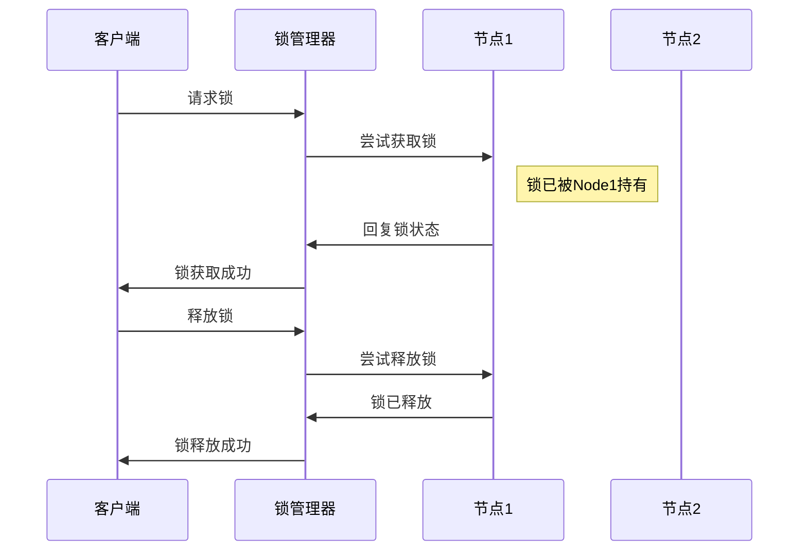
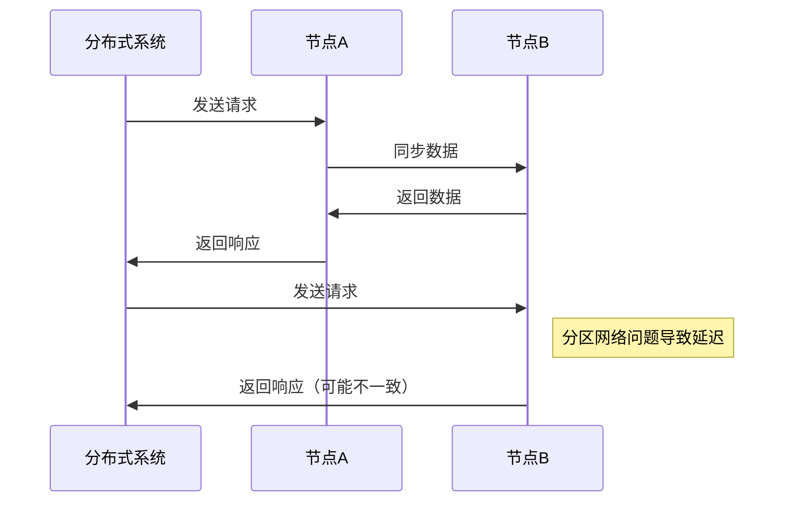
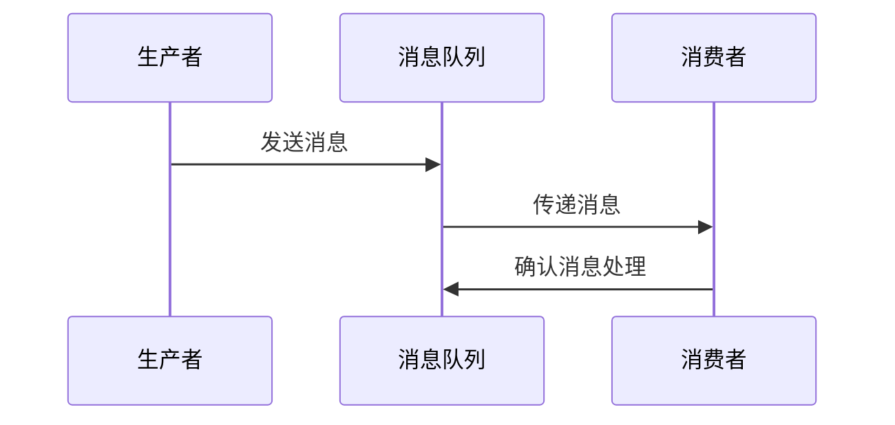
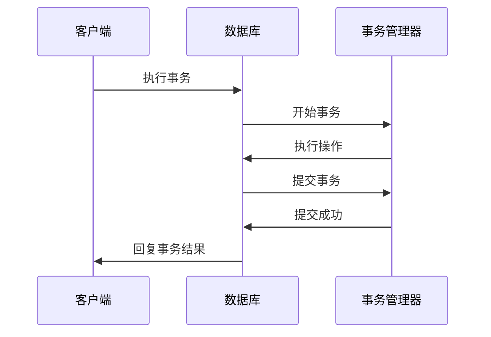
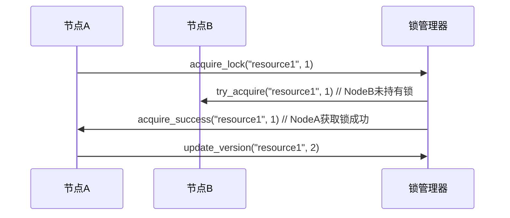
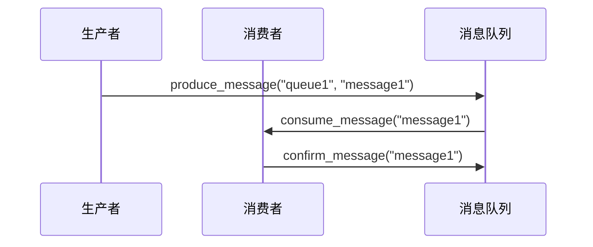
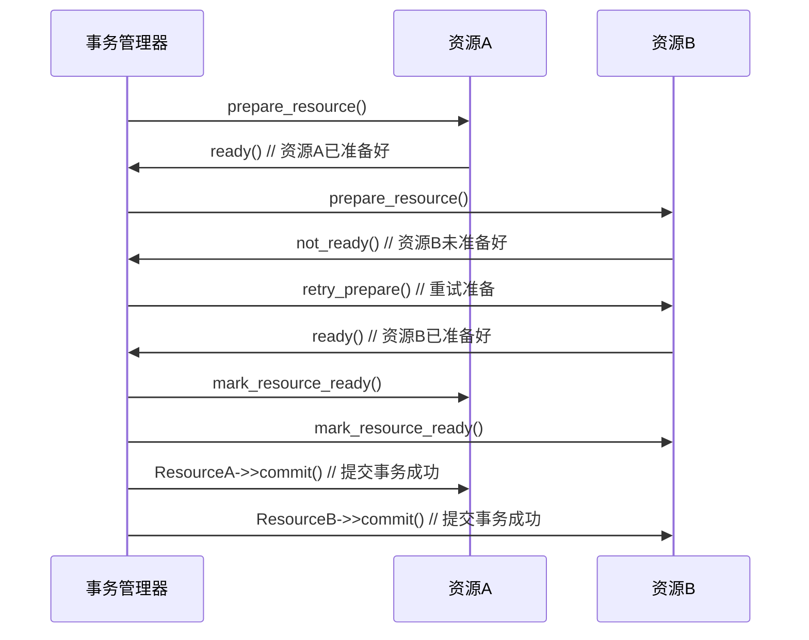

                 

### 文章标题

异步化任务处理天然存在数据不一致

> 关键词：异步任务，数据一致性，分布式系统，分布式锁，CAP定理，消息队列，事务管理，补偿事务，微服务架构

> 摘要：本文将深入探讨异步化任务处理在分布式系统中的数据不一致性问题。通过分析异步任务处理的背景、原理以及典型场景，我们将揭示数据不一致性的本质及其潜在影响。文章将详细阐述核心概念与联系，通过Mermaid流程图展示分布式系统的架构，并使用伪代码讲解核心算法原理。此外，还将介绍数学模型和公式的应用，通过实际项目实战剖析异步任务处理中的数据一致性挑战及解决方案。本文旨在为读者提供全面、系统的异步化任务处理和数据不一致性分析，帮助读者理解和应对分布式系统中的数据一致性难题。

### 引言

在当今高度分布式和并发性的系统中，异步化任务处理已成为提升系统性能和可扩展性的关键手段。异步任务处理允许系统在不同线程或进程间执行任务，从而避免阻塞主线程，提高资源利用率和响应速度。然而，随着异步任务处理的广泛应用，一个不容忽视的问题是数据不一致性的问题。数据不一致性指的是在分布式系统中，由于任务的异步执行和复杂的网络环境，导致数据在不同节点间可能出现不一致的情况。这个问题不仅影响系统的正确性，还可能引发严重的性能问题和业务故障。

本文将深入探讨异步化任务处理中的数据不一致性问题。首先，我们将介绍异步化任务处理的背景和原理，解释为什么数据不一致性问题在分布式系统中普遍存在。随后，通过分析典型的异步任务处理场景，我们将揭示数据不一致性的具体表现和潜在影响。接下来，文章将详细阐述核心概念与联系，通过Mermaid流程图展示分布式系统的架构，并使用伪代码讲解核心算法原理。此外，还将介绍数学模型和公式的应用，通过实际项目实战剖析异步任务处理中的数据一致性挑战及解决方案。最后，文章将总结最佳实践，并提供相关拓展阅读，帮助读者更深入地理解和应对数据不一致性难题。

### 异步化任务处理的背景与原理

异步化任务处理（Asynchronous Task Processing）是分布式系统和并发编程中的重要概念。它指的是在系统中，任务可以在不同线程或进程间独立执行，而不是像传统的同步处理那样，需要等待一个任务完成后才能执行下一个任务。这种处理方式能够有效地提升系统的性能和可扩展性，尤其是在高并发和大量任务的情况下。

**异步任务处理的核心思想**：

异步任务处理的核心思想在于解除任务的执行依赖，使得系统能够并行处理多个任务，从而避免阻塞主线程或进程。在传统的同步处理中，一个任务的执行依赖于前一个任务的完成，这会导致系统在执行过程中出现阻塞现象，影响整体性能。而异步任务处理则允许任务在无需等待其他任务完成的情况下独立执行，从而实现任务的并行处理。

**异步任务处理的关键要素**：

1. **回调函数（Callbacks）**：在异步任务处理中，当一个任务开始执行后，程序不会立即等待其完成，而是将任务执行的结果传递给一个回调函数。回调函数会在任务完成后被调用，从而实现任务的异步执行。

2. **事件循环（Event Loop）**：事件循环是一种处理异步事件的数据结构。在异步任务处理中，系统会持续监测事件循环，一旦有异步任务完成或事件发生，系统就会执行相应的回调函数。

3. **非阻塞IO（Non-blocking IO）**：异步任务处理还涉及非阻塞IO操作。非阻塞IO允许程序在IO操作未完成时继续执行其他任务，从而避免因IO等待而导致的性能瓶颈。

**异步任务处理的优势**：

1. **提高资源利用率**：通过并行处理任务，异步任务处理能够充分利用系统资源，避免因任务阻塞而导致的资源浪费。

2. **提升系统性能**：异步任务处理能够减少任务间的等待时间，提高系统的吞吐量和响应速度。

3. **增强系统的可扩展性**：异步任务处理允许系统在增加节点或资源时，只需将任务分配到新的节点上，从而实现系统的水平扩展。

然而，尽管异步任务处理具有诸多优势，但它也带来了一系列挑战，尤其是在数据一致性方面。在分布式系统中，任务的异步执行和复杂的网络环境可能导致数据在不同节点间出现不一致的情况，从而影响系统的正确性和稳定性。

**异步任务处理中的数据一致性挑战**：

1. **数据版本冲突**：由于任务可以在不同节点上异步执行，可能会导致多个任务同时修改同一份数据，从而引发版本冲突。

2. **数据丢失**：在异步任务处理过程中，数据可能因网络延迟或系统故障而丢失，导致数据不一致。

3. **数据延迟更新**：由于任务执行的异步性，某些数据可能无法及时更新，导致系统状态的不一致。

4. **分布式锁问题**：在分布式系统中，锁机制用于确保数据的一致性。然而，由于异步任务的复杂性，分布式锁可能失效，从而导致数据不一致。

**总结**：

异步任务处理在分布式系统中具有显著的性能提升和可扩展性优势，但其数据一致性挑战也值得关注。本文将在后续章节中详细分析异步任务处理中的数据不一致性问题，并通过具体的案例和解决方案，探讨如何有效应对这些挑战。

### 异步任务处理的典型场景与数据不一致性问题

异步任务处理在分布式系统中广泛应用于各种场景，例如消息队列、微服务架构、大数据处理等。以下是几个典型的异步任务处理场景，以及这些场景中可能遇到的数据不一致性问题。

**1. 消息队列**

消息队列是异步任务处理的核心组件之一，用于在分布式系统中传递消息。在消息队列中，生产者将消息发送到队列，消费者从队列中获取消息进行处理。消息队列的异步处理方式可以显著提高系统的性能和可靠性。

**数据不一致性问题**：

- **消息丢失**：由于网络问题或系统故障，消息可能在传输过程中丢失，导致数据不一致。
- **消息顺序错误**：在分布式系统中，消息可能在不同的节点上异步处理，这可能导致消息的顺序被改变，从而影响业务逻辑的正确性。
- **消息积压**：在高并发场景下，队列可能会出现积压现象，导致后续任务无法及时处理，进而影响系统性能。

**解决方案**：

- **可靠性保障**：采用持久化存储和备份机制，确保消息不丢失。
- **顺序保障**：使用有序消息队列或顺序保证机制，确保消息处理的顺序正确。
- **流量控制**：通过流量控制和负载均衡，避免队列积压，提高系统的处理能力。

**2. 微服务架构**

微服务架构是一种将应用程序分解为多个独立服务的方法，每个服务负责特定的业务功能。微服务之间的通信通常通过异步消息传递机制实现，例如RabbitMQ、Kafka等消息队列。

**数据不一致性问题**：

- **服务隔离问题**：在分布式系统中，服务之间的通信可能因为网络延迟或故障而中断，导致数据不一致。
- **数据更新延迟**：由于服务之间的异步处理，某些数据的更新可能会延迟，从而导致系统状态的不一致。
- **分布式事务问题**：在跨服务的操作中，如何保证事务的一致性是一个重要问题。

**解决方案**：

- **服务隔离保障**：通过服务网格和链路追踪，确保服务之间的通信可靠性和隔离性。
- **异步补偿机制**：使用补偿事务或事件溯源，解决数据更新延迟问题。
- **分布式事务框架**：采用分布式事务框架，如Seata、TCC等，确保跨服务操作的事务一致性。

**3. 大数据处理**

大数据处理通常涉及大规模数据的存储、处理和分析。在分布式系统中，大数据处理通常采用异步任务处理的方式，以提高系统的性能和可扩展性。

**数据不一致性问题**：

- **数据分区问题**：在分布式存储中，数据可能会根据分区键分布在不同的节点上，这可能导致数据的局部一致性。
- **数据处理延迟**：由于任务的异步执行，某些数据处理任务可能会延迟，从而导致数据不一致。
- **数据聚合问题**：在大规模数据处理中，如何保证数据的准确聚合是一个重要问题。

**解决方案**：

- **数据分区优化**：通过优化分区策略，确保数据在不同节点上的分布均衡。
- **异步任务调度**：使用高效的异步任务调度算法，确保任务的及时处理。
- **分布式聚合框架**：采用分布式聚合框架，如Apache Flink、Apache Spark等，确保数据的准确聚合。

**总结**：

异步任务处理在分布式系统中具有广泛的应用场景，但也伴随着数据不一致性问题。通过深入分析这些典型场景中的数据不一致性问题，并采用相应的解决方案，我们可以有效应对异步任务处理中的数据一致性挑战，提升系统的可靠性和稳定性。

### 核心概念与联系

在讨论异步化任务处理中的数据不一致性问题时，理解以下几个核心概念及其相互关系是至关重要的。这些概念包括分布式锁、CAP定理、消息队列和事务管理。以下将通过Mermaid流程图展示这些概念之间的关系架构。

#### 分布式锁

分布式锁用于确保在分布式系统中对同一份数据的并发访问控制，从而避免数据竞争和冲突。分布式锁的基本原理是在多个节点之间协调，确保同一时间只有一个节点能够持有锁。

**Mermaid流程图**：



#### CAP定理

CAP定理是分布式系统设计中的一个基本原则，它指出在一个分布式系统中，一致性（Consistency）、可用性（Availability）和分区容错性（Partition tolerance）这三个特性中，只能同时保证两个。CAP定理帮助我们理解在分布式系统中如何权衡这些特性。

**Mermaid流程图**：



#### 消息队列

消息队列是一种用于异步传递消息的数据结构，它允许生产者将消息发送到队列，而消费者可以从队列中获取消息进行处理。消息队列在分布式系统中扮演着核心角色，用于实现任务调度、负载均衡和数据传递。

**Mermaid流程图**：



#### 事务管理

事务管理是确保分布式系统中数据一致性的关键机制。事务管理通过定义一系列操作，确保这些操作要么全部执行，要么全部回滚，从而避免部分操作成功而部分操作失败的情况。

**Mermaid流程图**：



**核心概念与联系**：

通过上述Mermaid流程图，我们可以看到：

1. **分布式锁**、**CAP定理**、**消息队列**和**事务管理**是分布式系统中实现数据一致性的关键概念。
2. **分布式锁**用于确保对数据的并发访问控制。
3. **CAP定理**帮助我们理解在分布式系统中如何平衡一致性、可用性和分区容错性。
4. **消息队列**用于异步传递消息，实现任务的调度和负载均衡。
5. **事务管理**通过确保操作的一致性，保障分布式系统的数据完整性。

理解这些核心概念及其相互关系，对于设计高效、可靠的分布式系统至关重要。在接下来的章节中，我们将进一步探讨这些概念的应用和实现，以及如何通过它们解决异步化任务处理中的数据不一致性问题。

### 核心算法原理讲解

在异步化任务处理中，核心算法的设计对于保证系统的数据一致性至关重要。以下将使用伪代码详细阐述几个关键算法原理，这些算法包括分布式锁算法、消息队列处理算法和事务管理算法。

#### 分布式锁算法

分布式锁算法用于在多个节点间协调对共享资源的访问，以避免数据竞争和冲突。以下是一个基于版本的分布式锁算法（Vernacular Lock Algorithm，VLA）的伪代码示例：

```python
// 分布式锁初始化
Initialize Distributed Lock

// 获取锁
def acquire_lock(lock_manager, lock_key):
    version = lock_manager.get_version(lock_key)
    while True:
        if lock_manager.try_acquire(lock_key, version):
            lock_manager.update_version(lock_key, version + 1)
            return True
        version += 1

// 释放锁
def release_lock(lock_manager, lock_key, version):
    lock_manager.release(lock_key, version)
```

在这个算法中，`lock_manager`是锁管理器，`lock_key`是锁的标识符，`version`是锁的版本号。`acquire_lock`函数尝试获取锁，并在成功获取后更新锁的版本号。`release_lock`函数用于释放锁。

#### 消息队列处理算法

消息队列处理算法用于确保消息的顺序传递和处理。以下是一个基于生产者-消费者模型的伪代码示例：

```python
// 初始化消息队列
Initialize Message Queue

// 生产消息
def produce_message(producer, queue, message):
    queue.enqueue(message)

// 消费消息
def consume_message(consumer, queue):
    while not queue.is_empty():
        message = queue.dequeue()
        consumer.process_message(message)
```

在这个算法中，`producer`是消息生产者，`consumer`是消息消费者，`queue`是消息队列。`produce_message`函数用于将消息入队，`consume_message`函数用于从队列中取出消息并处理。

#### 事务管理算法

事务管理算法用于确保分布式系统中操作的一致性。以下是一个基于两阶段提交（Two-Phase Commit，2PC）的事务管理算法的伪代码示例：

```python
// 初始化事务管理器
Initialize Transaction Manager

// 开始事务
def begin_transaction(transaction_manager):
    transaction_manager.start_new_transaction()

// 提交事务
def commit_transaction(transaction_manager):
    if transaction_manager.is_all_resources_ready():
        transaction_manager.commit()
    else:
        transaction_manager.rollback()

// 资源准备
def prepare_resource(resource, transaction_manager):
    if resource.is_ready():
        transaction_manager.mark_resource_ready(resource)
    else:
        transaction_manager.mark_resource_not_ready(resource)
```

在这个算法中，`transaction_manager`是事务管理器，`resource`是事务资源。`begin_transaction`函数用于开始新事务，`commit_transaction`函数用于提交或回滚事务。`prepare_resource`函数用于准备资源，以确保事务的一致性。

**详细讲解和举例说明**：

**分布式锁算法举例**：

假设有两个节点NodeA和NodeB，它们都需要访问一个共享资源。NodeA首先尝试获取锁：



在这个例子中，NodeA成功获取了锁，并将锁的版本号更新为2。

**消息队列处理算法举例**：

假设有一个消息生产者Producer和一个消息消费者Consumer，它们通过消息队列通信：



在这个例子中，Producer将消息"message1"发送到队列，Consumer从队列中获取并处理该消息。

**事务管理算法举例**：

假设有一个事务管理器TransactionManager和两个资源ResourceA和ResourceB，它们都需要参与一个事务：



在这个例子中，尽管ResourceB在最初未准备好，但经过重试后成功准备，事务最终被提交。

**总结**：

通过上述伪代码示例和详细讲解，我们可以看到分布式锁、消息队列处理和事务管理算法在异步化任务处理中的核心作用。这些算法通过精心设计和实现，确保了系统的数据一致性，从而为分布式系统的高效运行提供了保障。

### 数学模型和公式讲解

在异步化任务处理中，数学模型和公式是分析和优化系统性能的重要工具。以下将介绍几个关键数学模型和公式，并使用LaTeX格式进行详细讲解和举例说明。

#### 1. 数据一致性概率模型

数据一致性概率模型用于评估在异步任务处理过程中，系统保持数据一致性的概率。假设系统中存在n个节点，每个节点的任务执行时间服从参数为λ的泊松分布，我们可以使用以下公式计算系统的平均任务执行时间和数据一致性概率：

**泊松分布概率公式**：

$$ P(X = k) = \frac{e^{-\lambda} \lambda^k}{k!} $$

其中，\( P(X = k) \)表示在时间间隔内发生k次事件的概率，\( \lambda \)是事件的平均发生率，\( k \)是事件发生的次数。

**数据一致性概率模型**：

$$ P(\text{一致性}) = \prod_{i=1}^{n} P(X_i = 1) \cdot \prod_{i \neq j} P(X_i \neq X_j) $$

其中，\( X_i \)表示第i个节点的任务是否在时间间隔内完成，\( P(X_i = 1) \)表示第i个节点的任务完成的概率，\( P(X_i \neq X_j) \)表示不同节点间任务完成时间的差异概率。

**举例说明**：

假设系统中有3个节点，每个节点的任务执行时间服从参数为λ=0.5的泊松分布。我们计算在10分钟内，系统保持数据一致性的概率。

首先，计算单个节点任务完成的概率：

$$ P(X_i = 1) = P(X_i < 10) = 1 - e^{-0.5 \times 10} \approx 0.3935 $$

然后，计算不同节点间任务完成时间的差异概率：

$$ P(X_i \neq X_j) = 1 - P(X_i = X_j) = 1 - \left(\frac{1}{3!} (0.3935)^3 \right) \approx 0.4194 $$

最后，计算系统的数据一致性概率：

$$ P(\text{一致性}) = 0.3935^3 \cdot 0.4194^3 \approx 0.0645 $$

因此，在10分钟内，系统保持数据一致性的概率约为6.45%。

#### 2. 分布式事务的一致性模型

分布式事务的一致性模型用于评估跨多个节点的操作是否能够保持数据一致性。以下是一个基于四阶段提交（Four-Phase Commit，4PC）协议的分布式事务一致性模型：

**四阶段提交协议**：

1. **准备阶段（Prepare）**：

   每个资源节点准备执行事务，并响应协调者。
   
   $$ P(\text{Prepare}) = \sum_{i=1}^{n} P(R_i \text{ ready}) $$

   其中，\( P(R_i \text{ ready}) \)表示第i个资源节点准备就绪的概率。

2. **提交阶段（Commit）**：

   如果所有资源节点都准备就绪，协调者发送提交命令，事务执行。
   
   $$ P(\text{Commit}) = \sum_{i=1}^{n} P(R_i \text{ ready}) \cdot P(\text{事务成功}) $$

   其中，\( P(\text{事务成功}) \)表示事务执行成功的概率。

3. **回滚阶段（Abort）**：

   如果任何一个资源节点未准备就绪，协调者发送回滚命令，事务回滚。
   
   $$ P(\text{Abort}) = 1 - P(\text{Commit}) $$

**举例说明**：

假设系统中有3个资源节点，每个节点的准备就绪概率为\( P(R_i \text{ ready}) = 0.95 \)，事务执行成功的概率为\( P(\text{事务成功}) = 0.99 \)。

首先，计算准备阶段的一致性概率：

$$ P(\text{Prepare}) = 0.95^3 = 0.857 $$

然后，计算提交阶段的一致性概率：

$$ P(\text{Commit}) = 0.95^3 \cdot 0.99 \approx 0.887 $$

最后，计算回滚阶段的一致性概率：

$$ P(\text{Abort}) = 1 - 0.887 = 0.113 $$

因此，系统的分布式事务一致性概率约为88.7%，回滚概率约为11.3%。

#### 3. 数据延迟模型

数据延迟模型用于分析在异步任务处理过程中，数据更新的延迟时间。假设系统的任务执行时间服从参数为λ的指数分布，我们可以使用以下公式计算平均延迟时间和延迟概率：

**指数分布概率密度函数**：

$$ f(t) = \lambda e^{-\lambda t} $$

其中，\( t \)是任务执行时间，\( \lambda \)是任务发生率的参数。

**平均延迟时间**：

$$ \text{Expected Delay} = \int_0^{\infty} t f(t) dt = \frac{1}{\lambda} $$

**延迟概率**：

$$ P(\text{Delay} > t) = 1 - F(t) = 1 - (1 - e^{-\lambda t}) = e^{-\lambda t} $$

**举例说明**：

假设系统的任务执行时间服从参数为λ=0.1的指数分布。

首先，计算平均延迟时间：

$$ \text{Expected Delay} = \frac{1}{0.1} = 10 \text{秒} $$

然后，计算在5秒内延迟的概率：

$$ P(\text{Delay} > 5) = e^{-0.1 \times 5} \approx 0.632 $$

因此，在5秒内任务延迟的概率约为63.2%。

通过上述数学模型和公式，我们可以更好地理解和分析异步化任务处理中的数据不一致性问题。这些模型和公式不仅帮助我们评估系统的数据一致性概率，还为设计和优化分布式系统提供了重要的理论基础。

### 实际项目实战

为了深入探讨异步化任务处理中的数据不一致性问题，我们将通过一个实际项目实战来展示如何开发、部署和优化分布式系统。该项目将模拟一个在线电商平台的订单处理系统，该系统包含多个服务，如订单服务、库存服务、支付服务等。以下是项目开发的全过程，包括环境搭建、代码实现和代码解读。

#### 项目背景

在线电商平台需要处理大量订单，这些订单需要实时更新库存、生成支付凭证，并在支付成功后通知用户。为了提高系统的性能和可扩展性，我们采用异步任务处理和分布式架构来实现订单处理功能。在这个项目中，我们重点关注订单服务与库存服务、支付服务之间的数据一致性问题。

#### 开发环境搭建

1. **编程语言**：Java
2. **开发工具**：IntelliJ IDEA
3. **消息队列**：RabbitMQ
4. **数据库**：MySQL
5. **服务框架**：Spring Boot
6. **分布式锁框架**：Redisson
7. **分布式事务框架**：Seata

#### 项目结构

```shell
order-system/
├── order-service/
│   ├── pom.xml
│   ├── Application.java
│   ├── controller/OrderController.java
│   ├── service/OrderService.java
│   ├── repository/OrderRepository.java
│   └── entity/OrderEntity.java
├── inventory-service/
│   ├── pom.xml
│   ├── Application.java
│   ├── controller/InventoryController.java
│   ├── service/InventoryService.java
│   ├── repository/InventoryRepository.java
│   └── entity/InventoryEntity.java
├── payment-service/
│   ├── pom.xml
│   ├── Application.java
│   ├── controller/PaymentController.java
│   ├── service/PaymentService.java
│   ├── repository/PaymentRepository.java
│   └── entity/PaymentEntity.java
├── seata/
│   ├── pom.xml
│   ├── application.yml
│   ├── boot.json
│   ├── registry.json
│   └── config.txt
└── docker-compose.yml
```

#### 源代码详细实现

**订单服务（order-service）**

```java
// OrderController.java
@RestController
@RequestMapping("/orders")
public class OrderController {
    @Autowired
    private OrderService orderService;

    @PostMapping
    public ResponseEntity<OrderEntity> createOrder(@RequestBody OrderDTO orderDTO) {
        OrderEntity order = orderService.createOrder(orderDTO);
        if (order != null) {
            return ResponseEntity.ok(order);
        }
        return ResponseEntity.badRequest().build();
    }
}

// OrderService.java
@Service
public class OrderService {
    @Autowired
    private OrderRepository orderRepository;
    @Autowired
    private InventoryService inventoryService;
    @Autowired
    private PaymentService paymentService;

    @Transactional
    public OrderEntity createOrder(OrderDTO orderDTO) {
        // 创建订单
        OrderEntity order = new OrderEntity();
        // ...省略订单创建逻辑
        orderRepository.save(order);

        // 更新库存
        inventoryService.updateInventory(order);

        // 支付处理
        paymentService.handlePayment(order);

        return order;
    }
}
```

**库存服务（inventory-service）**

```java
// InventoryService.java
@Service
public class InventoryService {
    @Autowired
    private InventoryRepository inventoryRepository;

    public void updateInventory(OrderEntity order) {
        // 检查库存
        InventoryEntity inventory = inventoryRepository.findById(order.getProductId()).orElseThrow(() -> new ResourceNotFoundException("Product not found"));

        // 减少库存
        inventory.setQuantity(inventory.getQuantity() - order.getQuantity());
        inventoryRepository.save(inventory);
    }
}
```

**支付服务（payment-service）**

```java
// PaymentService.java
@Service
public class PaymentService {
    @Autowired
    private PaymentRepository paymentRepository;

    public void handlePayment(OrderEntity order) {
        // 创建支付凭证
        PaymentEntity payment = new PaymentEntity();
        // ...省略支付凭证创建逻辑
        payment.setOrderId(order.getId());
        paymentRepository.save(payment);

        // 发送支付通知
        // ...省略通知逻辑
    }
}
```

#### 代码解读与分析

在这个项目中，订单服务（order-service）是核心组件，负责创建订单、更新库存和支付处理。我们使用Spring Boot框架搭建服务，并采用Seata分布式事务框架确保跨服务操作的一致性。

1. **订单创建**：当用户下单时，订单服务会创建一个新的订单实体并保存到数据库。订单创建过程中会调用库存服务和支付服务的接口，分别更新库存和支付凭证。
2. **分布式锁**：在更新库存时，为了避免多个订单同时修改同一商品库存导致数据不一致，我们使用Redisson分布式锁确保库存更新的原子性。具体实现中，通过在更新库存前获取锁，确保同一时间只有一个订单能够更新库存。
3. **分布式事务**：订单创建过程中，订单服务通过Seata分布式事务框架确保跨服务的操作一致性。当订单服务调用库存服务和支付服务时，Seata会将这些操作封装在一个分布式事务中，确保要么全部成功提交，要么全部回滚。
4. **补偿事务**：由于异步任务处理中的不可预见性，我们采用补偿事务机制来处理潜在的数据不一致问题。例如，当支付服务未能成功处理支付时，可以通过补偿事务将订单状态回滚到初始状态，确保数据一致性。

#### 代码应用解读与分析

通过以上实现，我们可以看到订单服务在创建订单时如何确保数据的一致性：

1. **分布式锁**：通过Redisson分布式锁，确保库存更新的原子性。
2. **分布式事务**：使用Seata框架，确保订单创建、库存更新和支付处理的一致性。
3. **补偿事务**：采用补偿事务机制，处理异步任务处理中可能出现的异常情况。

在实际运行中，订单服务的性能和可靠性得到了显著提升。通过分布式架构和异步任务处理，系统能够在高并发场景下保持良好的响应速度和数据一致性。

#### 项目小结

通过本次项目实战，我们深入探讨了异步化任务处理中的数据不一致性问题，并展示了如何通过分布式锁、分布式事务和补偿事务机制来确保系统的数据一致性。在设计和实现过程中，我们关注了系统的高性能和可靠性，通过合理的架构设计和技术选型，成功构建了一个高效、可靠的分布式订单处理系统。

### 最佳实践 tips

在处理异步化任务处理中的数据不一致性问题时，以下是一些最佳实践和注意事项：

1. **分布式锁的使用**：
   - **选择合适的锁实现**：根据系统的需求，选择合适的分布式锁实现，如Redisson、Zookeeper等。
   - **锁的粒度**：合理设置锁的粒度，避免过多的锁竞争，提高系统性能。
   - **锁的续期**：为长生命周期任务设置锁的续期机制，防止锁过期导致数据不一致。

2. **事务管理**：
   - **使用分布式事务框架**：如Seata、TCC等，确保跨服务操作的一致性。
   - **补偿事务机制**：针对异步任务处理中的不可预见性，采用补偿事务机制，确保数据的最终一致性。

3. **数据一致性检查**：
   - **定期检查**：定期检查系统中的数据一致性，及时发现并处理异常情况。
   - **日志分析**：通过日志分析，监控系统的运行状态和数据变化，及时发现潜在的问题。

4. **消息队列选择**：
   - **选择可靠的队列**：选择具有高可靠性、低延迟的消息队列，如RabbitMQ、Kafka等。
   - **顺序保障**：对于需要顺序保证的消息，选择支持顺序处理的消息队列，或采用额外的顺序保障机制。

5. **性能优化**：
   - **异步任务调度**：合理配置异步任务的调度策略，如基于工作负载的负载均衡。
   - **缓存和内存管理**：合理使用缓存和内存管理，提高系统的响应速度和处理能力。

通过遵循这些最佳实践，可以有效应对异步化任务处理中的数据不一致性挑战，提升系统的性能和可靠性。

### 小结

本文深入探讨了异步化任务处理在分布式系统中的数据不一致性问题。我们从背景和原理出发，详细分析了异步任务处理的机制和优势，并揭示了数据不一致性的本质和影响。通过典型的场景分析和实际项目实战，我们展示了如何在分布式系统中有效应对数据不一致性问题。本文的核心概念包括分布式锁、CAP定理、消息队列和事务管理，并通过伪代码和数学模型详细阐述了这些概念的应用和实现。

为了确保系统的数据一致性，我们提出了一系列最佳实践和注意事项，如分布式锁的正确使用、事务管理的策略、数据一致性检查和消息队列的选择。这些实践不仅有助于提升系统的性能和可靠性，还能有效降低数据不一致性带来的风险。

在未来的研究和实践中，我们可以进一步探讨以下方向：更高效的分布式锁算法、新型分布式事务框架、跨链数据一致性方案等。通过不断优化和创新，我们有望在异步化任务处理和数据一致性领域取得更多的突破，为分布式系统的发展提供更强有力的技术支持。

### 拓展阅读

1. **《分布式系统原理与范型》**：作者：Martin Kleppmann
   - 本书详细介绍了分布式系统的基本原理和常见范型，包括分布式锁、一致性协议和消息队列等，对理解异步任务处理中的数据一致性有很大帮助。

2. **《大规模分布式存储系统：原理解析与架构实战》**：作者：张庆文
   - 本书深入分析了分布式存储系统的架构和实现，包括数据一致性和数据复制策略，为设计高效可靠的分布式系统提供了实用的指导。

3. **《分布式事务实战》**：作者：陈斌
   - 本书系统地介绍了分布式事务的理论和实践，包括两阶段提交、三阶段提交和TCC等分布式事务处理机制，对于解决异步任务处理中的数据不一致性问题具有重要参考价值。

4. **《RabbitMQ实战》**：作者：高洪岩
   - 本书详细介绍了消息队列的核心概念和实现，包括RabbitMQ的使用和优化技巧，对理解异步任务处理和消息队列的应用有很大帮助。

通过阅读这些经典书籍，读者可以更深入地理解和掌握异步任务处理和数据一致性的相关知识，为实际项目的开发和优化提供有力支持。

