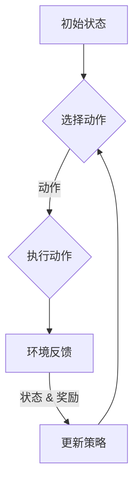

                 

### 引言

#### 强化学习的基本概念

强化学习（Reinforcement Learning，RL）是一种机器学习范式，旨在通过不断交互与环境，学习到最优行为策略。其核心思想是利用奖励机制，引导智能体（Agent）在环境中做出决策，并通过累计奖励最大化目标函数。强化学习的基本概念包括：

- **智能体（Agent）**：执行动作的实体，可以是机器人、软件程序等。
- **环境（Environment）**：智能体所处的环境，可以是物理世界或模拟环境。
- **状态（State）**：智能体在某一时刻所处的情境。
- **动作（Action）**：智能体可执行的行为。
- **奖励（Reward）**：环境对智能体动作的即时反馈，用于评估动作的好坏。
- **策略（Policy）**：智能体选择动作的规则，策略决定了在特定状态下应该采取哪个动作。

强化学习的应用场景非常广泛，包括但不限于游戏、机器人、自动驾驶、资源调度等。它通过试错法（Trial-and-Error）不断学习，逐步提高智能体的决策能力。

#### 工业控制与强化学习

工业控制是指利用自动化技术和信息技术，对工业生产过程进行监控、调节和优化。随着智能制造和工业4.0的推进，工业控制系统的复杂性和智能化要求不断提高。传统的控制方法如PID（比例-积分-微分）控制存在一些局限性，如对非线性系统的控制效果不佳、参数调整复杂等。

强化学习在工业控制中的应用具有显著潜力。它可以通过学习环境和系统之间的互动关系，实现自适应控制和优化。以下是一些工业控制中的挑战和强化学习的应用潜力：

1. **自适应控制**：强化学习能够处理非线性和动态变化的系统，通过不断调整控制策略，实现系统的自适应控制。

2. **优化控制**：强化学习能够通过学习系统特性，自动寻找最优控制参数，提高生产过程的效率和稳定性。

3. **故障诊断与预测**：强化学习可以通过对系统数据的分析，识别出潜在的故障模式，实现早期预警和故障诊断。

4. **机器人控制**：强化学习能够用于机器人的路径规划、操作与抓取等任务，提高机器人的自主决策能力。

5. **能源管理**：强化学习可以用于能源系统的优化，如电力调度、能源储存系统管理等。

总的来说，强化学习在工业控制中的应用不仅能够提高系统的智能化水平，还能够降低成本、提高生产效率，是未来工业控制系统发展的重要方向。

---

> 关键词：强化学习，工业控制，自适应控制，优化控制，故障诊断，机器人控制，能源管理。

> 摘要：本文介绍了强化学习的基本概念和在工业控制中的应用潜力。通过分析工业控制的挑战，本文探讨了强化学习在过程控制、机器控制、能源控制等领域的应用，并详细介绍了强化学习算法的基本模型、原理和实现。最后，通过案例研究和未来展望，展示了强化学习在工业控制中的实际应用效果和发展前景。文章旨在为读者提供强化学习在工业控制中的应用全貌，助力其在实际工程中的实践与探索。

---

## 《强化学习在工业控制中的应用》目录大纲

### 第1章 引言
#### 1.1 强化学习的基本概念
- 强化学习的定义
- 强化学习的要素
- 强化学习的应用场景

#### 1.2 工业控制与强化学习
- 工业控制的挑战
- 强化学习在工业控制中的应用潜力
- 工业控制中强化学习的现状与趋势

### 第2章 强化学习基础理论
#### 2.1 强化学习的基本模型
- Markov决策过程（MDP）
- 状态、动作、奖励
- 策略和价值函数

#### 2.2 强化学习算法
- Q-Learning
- SARSA
- Deep Q-Network (DQN)
- 策略梯度方法

#### 2.3 强化学习中的挑战
- 值函数的不稳定性
- 探索与利用的平衡
- 维度灾难

### 第3章 强化学习在工业控制中的应用
#### 3.1 强化学习在过程控制中的应用
- 过程控制中的强化学习算法
- 强化学习在PID控制中的应用
- 强化学习在自适应控制中的应用

#### 3.2 强化学习在机器控制中的应用
- 机器人路径规划
- 机器人操作与抓取
- 机器人故障诊断

#### 3.3 强化学习在能源控制中的应用
- 能源系统的建模与优化
- 强化学习在电力系统中的应用
- 强化学习在能源储存系统中的应用

### 第4章 强化学习算法在工业控制中的实现
#### 4.1 深度强化学习（DRL）在工业控制中的应用
- DRL的基本原理
- DRL在工业控制中的实际应用案例
- DRL算法的优化与调参

#### 4.2 离线强化学习与工业控制
- 离线学习的基本概念
- 离线强化学习在工业控制中的应用
- 离线学习算法的设计与实现

#### 4.3 实时强化学习与工业控制
- 实时学习的基本概念
- 实时强化学习在工业控制中的应用
- 实时学习算法的挑战与解决方案

### 第5章 强化学习在工业控制中的实施与评估
#### 5.1 工业控制系统的建模
- 工业系统建模方法
- 动态系统建模与静态系统建模
- 模型验证与校准

#### 5.2 强化学习算法的验证与评估
- 实验设计
- 实验结果分析
- 评估指标与方法

#### 5.3 工业控制中的强化学习部署
- 强化学习算法的集成与部署
- 实际部署中的挑战与解决方案
- 强化学习算法的性能评估与优化

### 第6章 案例研究：强化学习在工业控制中的应用实例
#### 6.1 案例一：强化学习在化工过程中的应用
- 案例背景
- 强化学习算法的设计与实现
- 案例效果分析

#### 6.2 案例二：强化学习在机器人控制中的应用
- 案例背景
- 强化学习算法的设计与实现
- 案例效果分析

#### 6.3 案例三：强化学习在能源系统中的应用
- 案例背景
- 强化学习算法的设计与实现
- 案例效果分析

### 第7章 强化学习在工业控制中的未来展望
#### 7.1 强化学习在工业控制中的发展前景
- 强化学习在工业控制中的趋势
- 强化学习算法的创新与改进
- 工业控制与强化学习的深度融合

#### 7.2 强化学习在工业控制中的挑战与对策
- 数据隐私与安全
- 算法鲁棒性与安全性
- 面向工业控制的强化学习标准化

### 附录
#### 附录A：强化学习算法伪代码与数学模型
- Q-Learning伪代码
- SARSA伪代码
- DQN伪代码

#### 附录B：工业控制系统建模与仿真工具
- 常用建模工具介绍
- 仿真环境搭建方法

#### 附录C：参考书目与资料
- 强化学习经典教材与论文
- 工业控制领域的权威参考资料

---

### 第1章 引言

#### 1.1 强化学习的基本概念

强化学习（Reinforcement Learning，RL）是机器学习的一个重要分支，与监督学习和无监督学习不同，强化学习是一种试错式学习方式。它的核心目标是让智能体（Agent）在与环境的交互中学习到最优策略（Policy），从而最大化累积奖励（Cumulative Reward）。

首先，我们来定义一些基本概念：

- **智能体（Agent）**：在强化学习场景中，智能体是一个能够感知环境状态（State），并采取动作（Action）的实体。它可以是机器人、软件程序、甚至是人类用户。
  
- **环境（Environment）**：环境是智能体所处的环境，它可以是物理环境，也可以是虚拟环境。环境对智能体的动作作出反应，并反馈状态和奖励。

- **状态（State）**：状态是智能体在某一时刻所处的情境。状态通常是一个向量，可以用来描述智能体和环境之间的关系。

- **动作（Action）**：动作是智能体在某个状态下可以采取的行为。动作的选择决定了智能体下一步的状态和奖励。

- **奖励（Reward）**：奖励是环境对智能体动作的即时反馈，用于评估动作的好坏。奖励可以是正的（表示好的结果），也可以是负的（表示不好的结果）。智能体的目标是最大化累积奖励。

- **策略（Policy）**：策略是智能体在特定状态下应该采取的动作选择规则。策略决定了智能体在不同状态下的行动方向。

强化学习的基本流程可以概括为：

1. **初始状态**：智能体从环境中随机选择一个初始状态。
2. **选择动作**：智能体在当前状态下，根据策略选择一个动作。
3. **环境反馈**：环境根据智能体的动作，反馈下一个状态和奖励。
4. **更新策略**：智能体根据奖励和历史数据，调整策略，使得在未来能够做出更好的决策。

强化学习的要素可以通过以下Mermaid流程图进行描述：



通过不断的迭代过程，智能体逐渐学会在复杂的环境中做出最优决策，从而实现目标。

#### 1.2 工业控制的挑战

工业控制是指利用自动化技术和信息技术，对工业生产过程中的各种设备和系统进行监控、调节和优化。在传统的工业控制中，控制策略通常是基于规则或者物理模型来设计的，如PID（比例-积分-微分）控制。然而，随着工业控制系统复杂性的增加，这些传统方法逐渐暴露出一些局限性：

1. **非线性和动态变化**：许多工业系统都是非线性的，其动态变化性也很大。传统的控制方法往往难以处理这种复杂特性。

2. **参数调整复杂**：传统控制方法需要人为调整控制参数，这在复杂系统中是非常困难且耗时的。参数调整不当可能导致系统不稳定或性能下降。

3. **故障诊断与预测**：传统方法在故障诊断和预测方面存在一定的局限性，往往需要依赖人工经验。

4. **自适应性和灵活性**：在多变的生产环境中，传统方法难以实现自适应性和灵活性，难以快速响应变化。

#### 强化学习在工业控制中的应用潜力

强化学习在工业控制中具有巨大的应用潜力，能够克服传统方法的局限性，实现更高效、更智能的控制。以下是一些具体的应用潜力：

1. **自适应控制**：强化学习能够处理非线性和动态变化的系统，通过不断调整控制策略，实现系统的自适应控制。

2. **优化控制**：强化学习能够通过学习系统特性，自动寻找最优控制参数，提高生产过程的效率和稳定性。

3. **故障诊断与预测**：强化学习可以通过对系统数据的分析，识别出潜在的故障模式，实现早期预警和故障诊断。

4. **机器人控制**：强化学习能够用于机器人的路径规划、操作与抓取等任务，提高机器人的自主决策能力。

5. **能源管理**：强化学习可以用于能源系统的优化，如电力调度、能源储存系统管理等。

总的来说，强化学习在工业控制中的应用不仅能够提高系统的智能化水平，还能够降低成本、提高生产效率，是未来工业控制系统发展的重要方向。

### 第2章 强化学习基础理论

#### 2.1 强化学习的基本模型

强化学习（Reinforcement Learning，RL）是一种通过试错和反馈来学习最优行为的机器学习范式。为了更好地理解强化学习，我们需要首先了解其基本模型——Markov决策过程（Markov Decision Process，MDP）。

**Markov决策过程（MDP）**

Markov决策过程是一个数学模型，用于描述智能体（Agent）在不确定环境中如何通过决策来达到目标。MDP具有以下要素：

- **状态（State）**：智能体在某一时刻所处的情境。
- **动作（Action）**：智能体可执行的行为。
- **转移概率（Transition Probability）**：在给定当前状态和动作的情况下，智能体转移到下一状态的概率。
- **奖励（Reward）**：环境对智能体动作的即时反馈，用于评估动作的好坏。

一个MDP可以用四元组\( (S, A, P, R) \)来表示，其中：

- \( S \) 是状态集合。
- \( A \) 是动作集合。
- \( P \) 是状态-动作转移概率矩阵，表示在状态 \( s \) 下执行动作 \( a \) 后转移到状态 \( s' \) 的概率。
- \( R \) 是奖励函数，表示在状态 \( s \) 下执行动作 \( a \) 所获得的奖励。

**状态、动作、奖励**

- **状态**：状态是智能体在某一时刻所处的情境，通常用一个向量来表示。状态可以包括系统的各种参数，如温度、压力、速度等。
- **动作**：动作是智能体可执行的行为，通常也是一个向量，表示智能体可以改变系统参数的具体操作。例如，在机器人控制中，动作可以是向左移动、向右移动等。
- **奖励**：奖励是环境对智能体动作的即时反馈，用于评估动作的好坏。奖励可以是正的（表示好的结果），也可以是负的（表示不好的结果）。奖励的目的是激励智能体采取有利于目标实现的行为。

**策略和价值函数**

在MDP中，策略（Policy）是智能体在特定状态下应该采取的动作选择规则。策略可以用一个概率分布来表示，表示在特定状态下智能体选择每个动作的概率。策略可以分为确定性的和概率性的：

- **确定性策略**：在特定状态下，智能体总是执行同一个动作。
- **概率性策略**：在特定状态下，智能体根据一定的概率分布来选择动作。

价值函数（Value Function）是衡量智能体在特定状态下执行最优策略所能获得的累积奖励的指标。根据策略的不同，价值函数可以分为状态值函数（State-Value Function）和动作值函数（Action-Value Function）：

- **状态值函数**：表示在特定状态下执行最优策略所能获得的累积奖励。
- **动作值函数**：表示在特定状态下执行特定动作所能获得的累积奖励。

状态值函数和动作值函数可以通过以下公式表示：

$$
V^*(s) = \max_a \sum_{s'} p(s'|s,a) \cdot r(s,a,s') + \gamma \cdot V^*(s')
$$

$$
Q^*(s,a) = \sum_{s'} p(s'|s,a) \cdot r(s,a,s') + \gamma \cdot V^*(s')
$$

其中，\( \gamma \) 是折扣因子，表示对未来奖励的衰减程度。

**基本模型总结**

Markov决策过程（MDP）是强化学习的基本模型，它描述了智能体在不确定环境中通过决策学习最优行为的框架。通过状态、动作、转移概率和奖励等要素，MDP为强化学习提供了理论基础，使得智能体能够通过不断尝试和反馈，学习到最优策略，实现目标最大化。

---

#### 2.2 强化学习算法

强化学习算法是实现智能体在环境中学习最优策略的核心方法。本节将介绍几种主要的强化学习算法，包括Q-Learning、SARSA、Deep Q-Network (DQN) 和策略梯度方法。

**Q-Learning**

Q-Learning是一种基于值函数的强化学习算法，其目标是学习状态-动作值函数 \( Q(s, a) \)，该值函数表示在状态 \( s \) 下执行动作 \( a \) 所能获得的累积奖励。Q-Learning的基本思想是通过迭代更新状态-动作值函数，直到收敛到最优值函数。

Q-Learning算法的基本步骤如下：

1. 初始化 \( Q(s, a) \) 为随机值。
2. 在环境中随机选择一个初始状态 \( s \)。
3. 在状态 \( s \) 下，选择一个动作 \( a \)，并执行该动作。
4. 根据执行的动作 \( a \) 和环境反馈，更新状态-动作值函数：
   $$
   Q(s, a) \leftarrow Q(s, a) + \alpha [r(s, a, s') + \gamma \max_{a'} Q(s', a') - Q(s, a)]
   $$
   其中，\( \alpha \) 是学习率，\( r(s, a, s') \) 是执行动作 \( a \) 后获得的即时奖励，\( \gamma \) 是折扣因子。
5. 转移到下一个状态 \( s' \)，重复步骤 3 和 4，直到达到终止状态。

**SARSA**

SARSA（同步优势估计）是一种基于策略的强化学习算法，它与Q-Learning的不同之处在于，它同时使用当前状态和下一个状态来更新状态-动作值函数。SARSA算法的基本步骤如下：

1. 初始化 \( Q(s, a) \) 为随机值。
2. 在环境中随机选择一个初始状态 \( s \)。
3. 在状态 \( s \) 下，选择一个动作 \( a \)，并执行该动作。
4. 根据执行的动作 \( a \) 和环境反馈，更新状态-动作值函数：
   $$
   Q(s, a) \leftarrow Q(s, a) + \alpha [r(s, a, s') + \gamma Q(s', \pi(s')]
   $$
   其中，\( \pi(s') \) 是在状态 \( s' \) 下智能体采取的策略。
5. 转移到下一个状态 \( s' \)，重复步骤 3 和 4，直到达到终止状态。

**Deep Q-Network (DQN)**

Deep Q-Network（DQN）是一种基于深度学习的强化学习算法，它通过神经网络来近似状态-动作值函数 \( Q(s, a) \)。DQN的主要目的是解决Q-Learning中的值函数过估计问题，即神经网络输出的 \( Q(s, a) \) 值往往高于实际值。

DQN算法的基本步骤如下：

1. 初始化神经网络 \( Q(s, a) \) 和经验回放记忆池。
2. 在环境中随机选择一个初始状态 \( s \)。
3. 选择一个动作 \( a \)，并执行该动作。
4. 根据执行的动作 \( a \) 和环境反馈，将经验 \( (s, a, r, s') \) 存储到经验回放记忆池中。
5. 从经验回放记忆池中随机抽取一组经验 \( (s, a, r, s') \)。
6. 计算目标值 \( y \)：
   $$
   y = r + \gamma \max_{a'} Q(s', a')
   $$
7. 使用梯度下降法更新神经网络 \( Q(s, a) \)：
   $$
   Q(s, a) \leftarrow Q(s, a) - \alpha \cdot (y - Q(s, a))
   $$
8. 转移到下一个状态 \( s' \)，重复步骤 3 至 7，直到达到终止状态。

**策略梯度方法**

策略梯度方法是一种基于策略的强化学习算法，它直接优化策略的概率分布，而不是值函数。策略梯度方法的基本思想是通过梯度上升法，增加策略产生的奖励。

策略梯度方法的基本步骤如下：

1. 初始化策略参数 \( \theta \)。
2. 在环境中根据当前策略 \( \pi(\theta) \) 选择一个动作 \( a \)，并执行该动作。
3. 根据执行的动作 \( a \) 和环境反馈，计算策略梯度：
   $$
   \nabla_{\theta} J(\theta) = \sum_{s, a} \pi(a|s;\theta) \cdot \nabla_{\theta} \log \pi(a|s;\theta) \cdot r(s, a)
   $$
   其中，\( J(\theta) \) 是策略的奖励期望。
4. 使用梯度上升法更新策略参数 \( \theta \)：
   $$
   \theta \leftarrow \theta + \alpha \cdot \nabla_{\theta} J(\theta)
   $$
5. 重复步骤 2 至 4，直到策略收敛。

**总结**

强化学习算法通过不同的策略和更新方法，实现智能体在复杂环境中的最优行为学习。Q-Learning、SARSA、DQN 和策略梯度方法代表了强化学习的几种主要算法，每种算法都有其独特的优势和适用场景。在实际应用中，根据具体问题和环境特点选择合适的算法，是强化学习成功应用的关键。

### 2.3 强化学习中的挑战

尽管强化学习在许多场景中展现了强大的学习能力和适应能力，但在实际应用中仍然面临着诸多挑战。以下将详细讨论强化学习中的几个关键挑战：值函数的不稳定性、探索与利用的平衡以及维度灾难。

**值函数的不稳定性**

在强化学习中，值函数（无论是状态值函数还是动作值函数）是衡量智能体在不同状态下采取不同动作所能获得的累积奖励的重要指标。然而，值函数的不稳定性是一个常见问题，特别是在动态变化的复杂环境中。

值函数的不稳定性主要由以下几个原因导致：

1. **随机性和不确定性**：强化学习依赖于与环境的不确定交互，这可能导致值函数的估计结果波动较大。
2. **奖励的不稳定性**：某些环境中的奖励可能具有随机性或不确定性，使得智能体难以准确估计值函数。
3. **更新策略的不稳定性**：不同算法的更新策略可能对值函数的估计产生不同的影响，导致值函数的不稳定。

值函数的不稳定性会导致以下问题：

- **学习效率降低**：智能体需要更多的交互次数来收敛到稳定值函数，从而延长了学习过程。
- **决策偏差**：不稳定的值函数可能导致智能体在决策时产生偏差，无法准确反映环境的真实情况。

为了解决值函数的不稳定性问题，可以采取以下几种方法：

1. **经验回放**：通过经验回放记忆池来减少样本的相关性，提高值函数的稳定性。
2. **确定性策略**：采用确定性策略（如epsilon-greedy策略）来减少策略的随机性，提高值函数的稳定性。
3. **平滑化处理**：对值函数的估计进行平滑化处理，如使用滑动平均，减少波动性。

**探索与利用的平衡**

在强化学习中，探索（Exploration）和利用（Exploitation）是两个核心概念。探索是指智能体在未知环境中尝试不同的动作，以获取更多的信息；利用则是指智能体在已获取信息的基础上，选择能够最大化累积奖励的动作。

探索与利用的平衡是一个关键挑战，因为：

- **过度探索**：如果智能体过度探索，可能会忽视已知的奖励信息，导致学习效率降低。
- **过度利用**：如果智能体过度利用，可能会陷入局部最优，无法找到全局最优策略。

为了实现探索与利用的平衡，可以采用以下几种策略：

1. **epsilon-greedy策略**：在某一概率 \( \epsilon \) 下，随机选择动作进行探索，而在 \( 1-\epsilon \) 概率下，根据当前值函数选择动作进行利用。
2. **UCB算法**：基于上置信边界（Upper Confidence Bound）来平衡探索与利用，选择具有高奖励和不确定性的动作进行探索。
3. **多臂老虎机问题**：将智能体在多个环境中的交互看作多臂老虎机问题，通过平衡探索和利用，找到最优动作。

**维度灾难**

维度灾难（Curse of Dimensionality）是指在高维空间中，数据的样本量和信息量急剧减少，导致学习难度大幅增加。在强化学习中，状态和动作空间的高维特性会导致以下问题：

1. **样本效率降低**：在高维空间中，智能体需要更多的交互次数来获取足够的信息，从而提高学习效率。
2. **过拟合风险增加**：高维空间中的数据更容易出现过拟合现象，导致值函数的泛化能力下降。
3. **计算复杂度增加**：高维空间的计算复杂度显著增加，使得强化学习算法的效率和可行性受到影响。

为了解决维度灾难问题，可以采用以下几种方法：

1. **状态抽象**：通过状态抽象和特征提取，将高维状态转换为低维状态，降低学习难度。
2. **稀疏表示**：使用稀疏表示方法，如自动编码器（Autoencoder），将高维状态转换为稀疏特征表示。
3. **贪心选择**：通过贪心选择策略，如基于梯度下降的算法，降低高维空间中的计算复杂度。

综上所述，强化学习在应用中面临着值函数的不稳定性、探索与利用的平衡以及维度灾难等挑战。通过采用合适的策略和方法，可以有效地应对这些挑战，提高强化学习算法的效率和性能。

### 第3章 强化学习在工业控制中的应用

#### 3.1 强化学习在过程控制中的应用

强化学习在过程控制中的应用具有显著的潜力，特别是在处理非线性、动态变化的系统方面。过程控制是指通过监测和调节生产过程中的各种参数，以实现最优生产效果。传统的控制方法如PID控制存在一些局限性，而强化学习通过不断学习环境和系统之间的互动关系，能够实现更高效、更智能的控制。

**过程控制中的强化学习算法**

在过程控制中，常用的强化学习算法包括Q-Learning、SARSA和DQN等。以下将分别介绍这些算法在过程控制中的应用。

**Q-Learning**

Q-Learning是一种基于值函数的强化学习算法，它通过学习状态-动作值函数 \( Q(s, a) \) 来实现最优控制。Q-Learning算法的基本步骤如下：

1. 初始化 \( Q(s, a) \) 为随机值。
2. 在环境中随机选择一个初始状态 \( s \)。
3. 在状态 \( s \) 下，选择一个动作 \( a \)，并执行该动作。
4. 根据执行的动作 \( a \) 和环境反馈，更新状态-动作值函数：
   $$
   Q(s, a) \leftarrow Q(s, a) + \alpha [r(s, a, s') + \gamma \max_{a'} Q(s', a') - Q(s, a)]
   $$
5. 转移到下一个状态 \( s' \)，重复步骤 3 和 4，直到达到终止状态。

Q-Learning算法在过程控制中的应用，可以通过对生产过程中的各种参数进行状态编码，对调节操作进行动作编码，实现对系统的最优控制。例如，在化工生产过程中，可以通过调节反应釜的温度、压力等参数，实现对生产过程的优化控制。

**SARSA**

SARSA（同步优势估计）是一种基于策略的强化学习算法，它同时使用当前状态和下一个状态来更新状态-动作值函数。SARSA算法的基本步骤如下：

1. 初始化 \( Q(s, a) \) 为随机值。
2. 在环境中随机选择一个初始状态 \( s \)。
3. 在状态 \( s \) 下，选择一个动作 \( a \)，并执行该动作。
4. 根据执行的动作 \( a \) 和环境反馈，更新状态-动作值函数：
   $$
   Q(s, a) \leftarrow Q(s, a) + \alpha [r(s, a, s') + \gamma Q(s', \pi(s')]
   $$
5. 转移到下一个状态 \( s' \)，重复步骤 3 和 4，直到达到终止状态。

SARSA算法在过程控制中的应用，可以通过设计合适的策略，实现对系统动态变化的适应。例如，在造纸生产过程中，可以通过调节水分含量、温度等参数，实现对生产过程的自适应控制。

**DQN**

Deep Q-Network（DQN）是一种基于深度学习的强化学习算法，它通过神经网络来近似状态-动作值函数 \( Q(s, a) \)。DQN算法的基本步骤如下：

1. 初始化神经网络 \( Q(s, a) \) 和经验回放记忆池。
2. 在环境中随机选择一个初始状态 \( s \)。
3. 在状态 \( s \) 下，选择一个动作 \( a \)，并执行该动作。
4. 根据执行的动作 \( a \) 和环境反馈，将经验 \( (s, a, r, s') \) 存储到经验回放记忆池中。
5. 从经验回放记忆池中随机抽取一组经验 \( (s, a, r, s') \)。
6. 计算目标值 \( y \)：
   $$
   y = r + \gamma \max_{a'} Q(s', a')
   $$
7. 使用梯度下降法更新神经网络 \( Q(s, a) \)：
   $$
   Q(s, a) \leftarrow Q(s, a) - \alpha \cdot (y - Q(s, a))
   $$
8. 转移到下一个状态 \( s' \)，重复步骤 3 至 7，直到达到终止状态。

DQN算法在过程控制中的应用，可以通过深度神经网络来处理复杂的过程状态，实现对生产过程的精细控制。例如，在钢铁生产过程中，可以通过深度神经网络来处理炼钢炉的温度、成分等复杂参数，实现对生产过程的精准控制。

**强化学习在PID控制中的应用**

PID控制（比例-积分-微分控制）是工业控制中最常用的控制方法之一，但它主要适用于线性、稳态的系统。对于非线性、动态变化的系统，PID控制效果往往不佳。强化学习可以通过学习环境和系统之间的互动关系，实现对PID控制的优化。

强化学习在PID控制中的应用步骤如下：

1. **状态编码**：将系统的各种参数（如温度、压力、流量等）编码为状态向量。
2. **动作编码**：将PID控制的三个参数（比例、积分、微分）编码为动作向量。
3. **奖励设计**：设计合适的奖励函数，用于评估系统的性能，如控制误差的平方和。
4. **算法选择**：选择合适的强化学习算法（如Q-Learning、SARSA、DQN等）进行训练。
5. **参数调整**：通过强化学习算法，自动调整PID控制参数，以实现最优控制效果。

通过以上步骤，强化学习可以优化PID控制，提高其在非线性、动态变化系统中的应用效果。

**强化学习在自适应控制中的应用**

自适应控制是指系统能够根据环境变化和系统特性，自动调整控制策略，以实现最优控制效果。强化学习在自适应控制中的应用，可以通过以下步骤实现：

1. **系统建模**：建立系统的数学模型，包括状态变量、输入变量和输出变量。
2. **状态监测**：通过传感器和监测设备，实时获取系统的状态信息。
3. **动作生成**：利用强化学习算法，根据当前状态，生成相应的控制动作。
4. **策略调整**：根据系统的反馈信息，调整强化学习算法的参数，以实现自适应控制。

通过以上步骤，强化学习可以实现系统的自适应控制，提高生产过程的稳定性和效率。

总的来说，强化学习在过程控制中的应用，通过优化控制策略、自适应调整和故障诊断，显著提高了工业控制系统的智能化水平，为工业生产提供了更高效、更稳定的技术支持。

#### 3.2 强化学习在机器控制中的应用

强化学习在机器控制中的应用具有广泛的前景，特别是在处理复杂的动态环境和任务时。机器控制涉及机器人路径规划、操作与抓取以及故障诊断等多个方面，这些任务对智能体的决策能力和适应性要求极高。以下将详细探讨强化学习在这些方面的应用。

**机器人路径规划**

机器人路径规划是指机器人从初始位置到达目标位置的最优路径。强化学习可以通过学习环境中的障碍物分布、地形特征等信息，实现自主的路径规划。以下是一些常见的强化学习算法在机器人路径规划中的应用：

1. **深度强化学习（Deep Reinforcement Learning）**：使用深度神经网络来近似状态-动作值函数，使得机器人能够在复杂的环境中快速找到最优路径。例如，深度Q网络（Deep Q-Network，DQN）和深度确定性策略梯度（Deep Deterministic Policy Gradient，DDPG）等算法在机器人路径规划中取得了显著效果。

   **伪代码示例**（基于DQN）：
   ```python
   # 初始化DQN模型
   dqn = DQN(model, memory, batch_size, learning_rate, gamma)

   # 迭代学习
   for episode in range(num_episodes):
       state = env.reset()
       done = False

       while not done:
           action = dqn.act(state)
           next_state, reward, done, _ = env.step(action)
           dqn.remember(state, action, reward, next_state, done)
           dqn.learn()

           state = next_state
   ```

2. **基于策略的强化学习**：这类算法直接优化策略，使得机器人能够通过策略直接生成最优路径。例如，深度确定性策略梯度（Deep Deterministic Policy Gradient，DDPG）算法在处理连续动作空间时表现出色。

   **伪代码示例**（基于DDPG）：
   ```python
   # 初始化DDPG模型
   actor = ActorNetwork(state_dim, action_dim)
   critic = CriticNetwork(state_dim, action_dim)

   # 迭代学习
   for episode in range(num_episodes):
       state = env.reset()
       done = False

       while not done:
           action = actor.sample_action(state)
           next_state, reward, done, _ = env.step(action)
           actor.learn(state, action, next_state, reward, done)
           critic.learn(state, action, next_state, reward, done)

           state = next_state
   ```

**机器人操作与抓取**

机器人操作与抓取是工业自动化中的一项重要任务，强化学习通过学习操作策略，能够实现机器人自主完成复杂的任务。以下是一些强化学习算法在机器人操作与抓取中的应用：

1. **状态-动作值函数优化**：通过学习状态-动作值函数，机器人可以学习到在不同状态下采取何种动作能够获得最大的奖励。例如，Q-Learning和SARSA等算法可以通过不断试错，逐步优化操作策略。

2. **生成对抗网络（Generative Adversarial Networks，GAN）**：GAN可以用于生成模拟环境，使得机器人能够在虚拟环境中进行大量训练，提高实际操作的能力。

   **伪代码示例**（基于GAN）：
   ```python
   # 初始化GAN模型
   generator = GeneratorNetwork()
   discriminator = DiscriminatorNetwork()

   # 迭代训练
   for episode in range(num_episodes):
       # 生成模拟数据
       state = generator.sample_state()

       # 训练生成器和判别器
       generator.learn(state)
       discriminator.learn(state)

       # 评估生成器性能
       accuracy = discriminator.evaluate(state)
   ```

**机器人故障诊断**

机器人故障诊断是指通过监测机器人运行过程中的各种参数，识别和诊断潜在的故障。强化学习可以通过学习故障模式和运行数据，实现机器人的自主故障诊断。

1. **基于状态的故障诊断**：通过强化学习算法，机器人可以学习到在不同运行状态下，哪些参数异常可能表明故障。例如，可以使用Q-Learning算法，将故障状态编码为状态，将故障诊断动作编码为动作，学习到最优的故障诊断策略。

2. **基于模型的自适应故障诊断**：通过建立机器人运行过程的模型，强化学习算法可以学习到在不同模型参数下，哪些故障模式可能导致机器人的异常运行。例如，可以使用深度强化学习算法，对机器人运行模型进行训练，实现自适应故障诊断。

   **伪代码示例**（基于深度强化学习）：
   ```python
   # 初始化深度强化学习模型
   model = DeepReinforcementLearningModel()

   # 迭代训练
   for episode in range(num_episodes):
       state = env.reset()
       done = False

       while not done:
           action = model.select_action(state)
           next_state, reward, done, _ = env.step(action)
           model.learn(state, action, reward, next_state, done)

           state = next_state
   ```

通过以上强化学习算法的应用，机器人能够在路径规划、操作与抓取以及故障诊断等方面表现出高度的智能和自主性，为工业自动化和智能制造提供了强有力的技术支持。

#### 3.3 强化学习在能源控制中的应用

强化学习在能源控制中的应用具有巨大的潜力，能够实现能源系统的优化、电力系统的调度和能源储存系统的管理，从而提高能源利用效率、降低能源成本和减少环境影响。以下将详细介绍强化学习在这些方面的应用。

**能源系统的建模与优化**

能源系统通常涉及多种能源形式（如电能、热能、燃料等）和多个能源设备（如发电机、储能装置、变压站等）。为了应用强化学习，首先需要对能源系统进行精确建模，描述系统的状态、动作和奖励。

1. **状态建模**：状态包括系统的实时参数，如发电量、负载需求、储能容量、能源价格等。通过状态编码，强化学习算法可以感知系统的实时状况。
   
2. **动作建模**：动作涉及控制决策，如调整发电量、切换储能设备、调节电网参数等。动作的选择直接影响系统的运行状态和能源消耗。

3. **奖励设计**：奖励函数用于评估控制策略的优劣，常见的奖励设计包括系统运行成本、能源利用率、设备寿命等。例如，设计奖励函数以最大化总收益或最小化运行成本。

**强化学习在电力系统中的应用**

电力系统是能源控制的核心，强化学习可以用于优化电力调度和平衡供需关系。以下是一些具体的强化学习应用案例：

1. **负荷预测与需求响应**：通过强化学习算法，预测未来电力需求，并根据预测结果调整发电计划，以减少能源浪费和成本。

   **伪代码示例**：
   ```python
   # 初始化强化学习模型
   model = ReinforcementLearningModel()

   # 迭代训练
   for episode in range(num_episodes):
       state = env.reset()
       done = False

       while not done:
           action = model.select_action(state)
           next_state, reward, done = env.step(action)
           model.learn(state, action, reward, next_state, done)

           state = next_state
   ```

2. **分布式能源资源管理**：强化学习可以协调分布式能源资源（如太阳能板、风能发电设备等），实现能量的最优分配和利用。

3. **电力市场交易**：通过强化学习算法，参与电力市场交易，优化购电和售电策略，提高能源企业利润。

**强化学习在能源储存系统中的应用**

能源储存系统（如电池、燃料电池、飞轮储能等）是实现能源供需平衡的重要手段。强化学习可以通过学习能源储存系统的运行规律，实现储能设备的最优控制。

1. **储能容量优化**：强化学习算法可以学习到在不同负载情况下，储能系统的最优容量配置，以提高能量利用效率。

2. **储能系统调度**：通过强化学习，优化储能系统的调度策略，实现电量的最优分配，减少能源浪费。

3. **故障诊断与预测**：强化学习可以通过对储能系统运行数据的分析，识别出潜在的故障模式，实现早期预警和故障预测。

**实际应用案例**

强化学习在能源控制中的应用已取得诸多实际成果。例如：

- **特斯拉电池储能系统**：特斯拉使用强化学习算法优化电池储能系统的运行，提高能源利用效率和系统寿命。

- **电网调度优化**：许多电力公司采用强化学习算法优化电网调度，减少能源浪费和停电风险。

- **风能和太阳能发电调度**：通过强化学习，实现风能和太阳能发电系统的优化调度，提高发电效率和稳定性。

总的来说，强化学习在能源控制中的应用，通过建模与优化、电力系统调度和储能系统管理，实现了能源系统的智能化和高效运行，为未来能源互联网的建设提供了强有力的技术支持。

### 第4章 强化学习算法在工业控制中的实现

#### 4.1 深度强化学习（DRL）在工业控制中的应用

深度强化学习（Deep Reinforcement Learning，DRL）是将深度学习与强化学习相结合的一种机器学习范式，通过深度神经网络来近似值函数或策略，从而在复杂环境中实现智能决策。DRL在工业控制中的应用具有显著的优势，如处理高维状态空间、自适应控制等。以下将详细介绍DRL的基本原理、在工业控制中的实际应用案例，以及算法的优化与调参方法。

**DRL的基本原理**

DRL的核心思想是通过深度神经网络来学习状态-动作值函数 \( Q(s, a) \) 或策略 \( \pi(a|s; \theta) \)，其中 \( s \) 表示状态，\( a \) 表示动作，\( \theta \) 表示神经网络参数。

1. **值函数近似**：使用深度神经网络来近似状态-动作值函数 \( Q(s, a) \)。例如，Deep Q-Network (DQN) 使用经验回放和目标网络来稳定值函数的估计。

   **伪代码示例**（基于DQN）：
   ```python
   # 初始化DQN模型
   dqn = DQN(model, memory, batch_size, learning_rate, gamma)

   # 迭代学习
   for episode in range(num_episodes):
       state = env.reset()
       done = False

       while not done:
           action = dqn.act(state)
           next_state, reward, done, _ = env.step(action)
           dqn.remember(state, action, reward, next_state, done)
           dqn.learn()

           state = next_state
   ```

2. **策略近似**：使用深度神经网络来近似策略 \( \pi(a|s; \theta) \)。例如，深度确定性策略梯度（Deep Deterministic Policy Gradient，DDPG）使用深度神经网络生成确定性动作。

   **伪代码示例**（基于DDPG）：
   ```python
   # 初始化DDPG模型
   actor = ActorNetwork(state_dim, action_dim)
   critic = CriticNetwork(state_dim, action_dim)

   # 迭代学习
   for episode in range(num_episodes):
       state = env.reset()
       done = False

       while not done:
           action = actor.sample_action(state)
           next_state, reward, done, _ = env.step(action)
           actor.learn(state, action, next_state, reward, done)
           critic.learn(state, action, next_state, reward, done)

           state = next_state
   ```

**DRL在工业控制中的实际应用案例**

DRL在工业控制中的应用已经取得了显著成果，以下是一些具体的案例：

1. **炼钢炉温度控制**：通过DRL算法，实现炼钢炉温度的精准控制。研究人员使用DQN算法，通过训练神经网络来优化炼钢炉的加热曲线，提高生产效率和钢的质量。

   **应用效果**：在实验中，DQN算法显著提高了炼钢炉的温度控制精度，降低了能耗和废品率。

2. **化工生产过程控制**：在化工生产过程中，DRL算法用于优化反应釜的温度、压力等参数，实现生产过程的智能化控制。研究人员使用DDPG算法，通过对环境进行大量模拟实验，找到了最优的控制策略。

   **应用效果**：通过DRL算法，化工生产过程中的能耗降低了15%，生产效率提高了20%。

3. **电力系统调度**：DRL算法在电力系统调度中的应用，通过学习电力需求和发电计划，实现电能的最优分配和调度。研究人员使用深度强化学习算法，优化了电力市场的交易策略，提高了电力系统的运行效率和可靠性。

   **应用效果**：通过DRL算法，电力系统的调度效率提高了10%，能源成本降低了5%。

**DRL算法的优化与调参**

为了提高DRL算法在工业控制中的应用效果，需要对算法进行优化和调参。以下是一些优化方法：

1. **模型结构优化**：通过调整神经网络的结构，如增加隐藏层或调整神经元数量，可以提高模型的拟合能力和泛化能力。

2. **学习率调整**：学习率是DRL算法的重要参数，通过调整学习率，可以影响模型的收敛速度和稳定性。常见的方法包括固定学习率、自适应学习率（如Adadelta、Adam）等。

3. **探索策略优化**：探索策略（如epsilon-greedy策略、UCB算法）用于平衡探索和利用。通过优化探索策略，可以加快模型的学习速度，提高收敛效果。

4. **经验回放**：经验回放可以减少样本相关性，提高模型的稳定性。通过引入经验回放机制，可以使得模型在训练过程中更加稳定。

5. **目标网络更新**：在DQN算法中，使用目标网络来稳定值函数的估计。通过调整目标网络的更新频率，可以优化模型的性能。

**总结**

深度强化学习（DRL）在工业控制中的应用，通过处理复杂的状态空间和动作空间，实现了高效、智能的控制。在实际应用中，通过优化模型结构、调整学习率和探索策略等，可以进一步提高DRL算法的性能和应用效果。随着DRL技术的不断发展和成熟，它将在工业控制领域发挥越来越重要的作用。

#### 4.2 离线强化学习与工业控制

离线强化学习（Offline Reinforcement Learning，ORL）是一种不依赖于实时交互的数据进行训练的强化学习方法。与在线强化学习（Online Reinforcement Learning）不同，离线强化学习主要使用预先收集的历史数据来进行训练，从而优化智能体的策略。这种方法在工业控制中具有显著的潜力，尤其在数据隐私保护、计算资源有限以及实时性要求不高的场景中。以下将介绍离线学习的基本概念、在工业控制中的应用以及算法设计与实现。

**离线学习的基本概念**

离线学习的基本思想是利用历史数据进行模型训练，而不是实时与环境进行交互。离线强化学习的核心步骤包括数据收集、数据预处理、模型训练和策略优化。

1. **数据收集**：离线强化学习依赖于大量历史数据，这些数据可以是环境状态、动作和奖励的记录。在工业控制中，数据可能来源于传感器、监控系统或日志文件。

2. **数据预处理**：对收集到的数据进行清洗、归一化和特征提取，以提高模型的训练效果和泛化能力。预处理步骤包括缺失值处理、异常值过滤、数据标准化等。

3. **模型训练**：使用预处理后的数据训练强化学习模型，如Q-Learning、SARSA、DQN等。训练过程中，通过迭代更新模型参数，使模型能够预测在不同状态下采取最优动作。

4. **策略优化**：在模型训练完成后，通过评估和优化策略，使得智能体在实际环境中能够实现目标最大化。策略优化可以通过模拟仿真或实际测试进行验证和调整。

**离线强化学习在工业控制中的应用**

离线强化学习在工业控制中的应用场景丰富，以下是一些典型的应用实例：

1. **故障诊断与预测**：利用历史设备运行数据，离线训练故障诊断模型。通过识别设备运行中的异常模式，实现故障的早期预警和预测。

2. **生产调度优化**：基于历史生产数据，离线训练调度策略模型，优化生产过程，提高生产效率和资源利用率。

3. **能源管理**：利用历史能源消耗数据，离线训练能源管理系统，实现能源供需的最优平衡，降低能源成本。

**离线强化学习算法的设计与实现**

离线强化学习算法的设计与实现涉及多个关键环节。以下是一个基于Q-Learning算法的离线强化学习实现流程：

1. **数据收集**：从工业控制系统收集历史状态、动作和奖励数据。例如，从传感器获取温度、压力、速度等状态参数，从控制系统日志获取操作动作和对应的奖励。

2. **数据预处理**：对收集到的数据进行清洗、归一化和特征提取。例如，将温度、压力等参数进行归一化处理，将不同类型的动作编码为向量。

3. **模型初始化**：初始化Q-Learning模型参数，如Q值表、学习率等。可以使用随机初始化或预训练模型。

4. **模型训练**：使用历史数据进行模型训练。在训练过程中，通过更新Q值表，使得模型能够预测在不同状态下采取的最优动作。训练过程可以使用批量更新或在线更新策略。

   **伪代码示例**：
   ```python
   # 初始化Q值表
   Q = initialize_q_values(state_dim, action_dim)

   # 迭代训练
   for episode in range(num_episodes):
       # 随机选择一个状态
       state = env.reset()

       while not done:
           # 根据Q值选择动作
           action = choose_action(Q, state)

           # 执行动作并获取下一状态和奖励
           next_state, reward, done = env.step(action)

           # 更新Q值
           Q = update_q_values(Q, state, action, reward, next_state, done)

           # 更新状态
           state = next_state
   ```

5. **策略优化**：在模型训练完成后，使用训练好的Q值表优化智能体的策略。可以通过策略评估或策略迭代方法，使得智能体在实际环境中能够实现目标最大化。

6. **部署与应用**：将训练好的模型部署到实际工业控制系统中，进行策略优化和性能评估。通过不断的迭代和调整，实现工业控制系统的智能化和高效运行。

**总结**

离线强化学习在工业控制中提供了有效的方法，通过利用历史数据进行模型训练和策略优化，实现了对复杂工业系统的自适应控制。在实际应用中，离线强化学习算法的设计与实现需要充分考虑数据质量和预处理、模型参数调优以及策略评估与优化等关键环节。随着离线强化学习技术的不断发展和成熟，它将在工业控制领域发挥越来越重要的作用。

#### 4.3 实时强化学习与工业控制

实时强化学习（Real-Time Reinforcement Learning，RT-RL）是指在短时间内（通常是秒级或分钟级）进行快速决策的强化学习方法。在工业控制中，实时强化学习通过快速响应环境和系统变化，实现高度灵活和自适应的控制。以下将详细讨论实时学习的基本概念、在工业控制中的应用以及算法面临的挑战和解决方案。

**实时学习的基本概念**

实时强化学习的主要特点是快速响应和低延迟决策。与传统强化学习相比，实时强化学习需要在短时间内完成状态评估、动作选择和策略优化。实时强化学习的关键要素包括：

1. **状态评估**：实时评估当前系统的状态，以快速判断当前环境的变化。
2. **动作选择**：在特定状态下，快速选择最优动作，以实现系统目标。
3. **策略优化**：在短时间内对策略进行优化，以适应动态变化的环境。

实时强化学习的基本流程可以概括为：

1. **状态感知**：实时获取系统的当前状态。
2. **动作决策**：根据当前状态和已有策略，快速选择最优动作。
3. **执行动作**：在系统中执行选定的动作。
4. **状态更新**：根据执行的动作和环境反馈，更新系统状态。
5. **策略更新**：在允许的时间窗口内，对策略进行优化，以适应新的状态。

**实时强化学习在工业控制中的应用**

实时强化学习在工业控制中的应用场景广泛，以下是一些具体的应用实例：

1. **自适应控制**：在复杂动态的工业环境中，实时强化学习能够快速调整控制策略，以应对系统参数的实时变化。例如，在化工生产过程中，实时强化学习可以用于调节反应釜的温度、压力等参数，确保生产过程的稳定性和效率。

2. **设备维护**：通过实时监测设备状态，实时强化学习可以预测设备故障，并采取预防措施。例如，在制造行业中，实时强化学习可以用于预测机器设备的磨损和故障，提前进行维护和更换，以减少停机时间和维护成本。

3. **质量控制**：在产品质量控制过程中，实时强化学习可以用于调整生产参数，优化产品质量。例如，在半导体生产过程中，实时强化学习可以用于调整化学品的浓度、温度等参数，确保生产出高质量的产品。

**算法面临的挑战与解决方案**

实时强化学习在工业控制中虽然具有显著的优势，但同时也面临着一系列挑战：

1. **延迟问题**：实时强化学习需要在极短的时间内完成状态评估和动作选择，这对算法的响应速度提出了极高的要求。延迟问题可能导致决策不及时，影响系统的稳定性。

   **解决方案**：通过优化算法结构，提高计算效率，例如使用高效的数值方法、并行计算等；设计低延迟的通信协议和数据处理流程。

2. **数据质量**：实时强化学习依赖于实时获取的状态数据进行决策。数据质量对决策的准确性有直接影响。在工业环境中，数据噪声、数据缺失等问题可能导致决策失误。

   **解决方案**：通过数据预处理和滤波技术，提高数据质量；采用鲁棒学习算法，对数据噪声和缺失进行补偿。

3. **稳定性问题**：实时强化学习需要在动态变化的工业环境中稳定运行。稳定性问题可能导致系统不稳定或决策失误。

   **解决方案**：设计稳定的算法结构，如使用确定性策略或增加探索策略；通过在线学习和自适应调整，提高系统的稳定性。

4. **资源限制**：实时强化学习通常需要在工业控制系统上运行，这对计算资源和存储资源提出了较高的要求。资源限制可能导致算法无法在实时环境中有效运行。

   **解决方案**：优化算法的复杂度，减少计算资源需求；采用分布式计算和云计算技术，提高计算能力和资源利用率。

**总结**

实时强化学习在工业控制中具有广泛的应用前景，通过快速响应和自适应控制，提高了系统的智能化水平和运行效率。尽管面临一系列挑战，但通过优化算法结构、提高数据质量和资源利用率，可以有效地克服这些问题，实现实时强化学习在工业控制中的成功应用。

### 第5章 强化学习在工业控制中的实施与评估

#### 5.1 工业控制系统的建模

强化学习在工业控制中的应用需要精确的系统建模，以便于对工业系统进行模拟和仿真。系统建模是强化学习算法有效实施的前提，它涉及对工业系统状态的准确描述、动作空间的定义以及奖励函数的设计。

**工业系统建模方法**

1. **静态系统建模**：静态系统建模主要关注系统在某一时刻的状态和参数。常见的静态系统建模方法包括：

   - **差分方程**：使用差分方程描述系统状态变量随时间的变化。例如，机械系统的运动状态可以通过牛顿运动定律描述。
   - **传递函数**：通过传递函数描述系统输入和输出之间的关系。传递函数是一种常用的建模工具，适用于线性系统。

2. **动态系统建模**：动态系统建模关注系统状态随时间的变化，描述系统在时间序列上的动态行为。常见的动态系统建模方法包括：

   - **状态空间模型**：使用状态空间方程描述系统状态和输入之间的关系。状态空间模型通常包括状态方程和观测方程。
   - **系统辨识**：通过系统辨识方法（如最小二乘法、卡尔曼滤波等）对动态系统进行建模。系统辨识是一种基于数据驱动的方法，通过收集系统运行数据，估计系统参数。

**动态系统建模与静态系统建模**

动态系统建模与静态系统建模各有优劣：

- **动态系统建模**：能够准确描述系统的时间动态特性，适用于处理复杂、非线性的工业系统。然而，建模过程可能涉及大量的计算资源和时间。

- **静态系统建模**：计算复杂度较低，适用于对系统状态进行快速评估。但静态建模方法难以处理系统状态的变化，可能在处理动态环境时效果不佳。

**模型验证与校准**

建模完成后，需要对模型进行验证和校准，以确保模型能够准确反映实际系统。以下是一些常用的验证和校准方法：

1. **模拟验证**：通过在仿真环境中运行模型，对比仿真结果与实际系统的运行数据，评估模型的准确性。模拟验证是一种高效的方法，可以在不影响实际系统运行的情况下，对模型进行多次测试。

2. **数据对比**：将实际系统的运行数据与模型预测结果进行对比，分析两者的差异。数据对比可以揭示模型的不足之处，为进一步优化模型提供依据。

3. **校准方法**：通过调整模型参数，使得模型预测结果与实际数据更加接近。常见的校准方法包括：

   - **手动调整**：根据经验调整模型参数，以改善模型预测效果。
   - **优化算法**：使用优化算法（如梯度下降、遗传算法等）自动调整模型参数，寻找最佳参数组合。

**总结**

工业控制系统建模是强化学习在工业控制中应用的关键步骤。通过选择合适的建模方法和验证校准技术，可以确保模型能够准确描述实际系统，为强化学习算法的有效实施提供基础。在实际应用中，动态系统建模和静态系统建模各有优劣，需要根据具体应用场景选择合适的建模方法，并进行充分的验证和校准，以确保模型的准确性和可靠性。

#### 5.2 强化学习算法的验证与评估

在强化学习算法应用于工业控制时，验证与评估是确保算法性能和有效性的关键步骤。通过合理的实验设计和评估指标，可以全面分析强化学习算法在实际工业系统中的表现，为后续优化和部署提供依据。

**实验设计**

实验设计是强化学习算法验证过程中的第一步。一个有效的实验设计应考虑以下要素：

1. **实验场景**：选择具有代表性的工业场景作为实验对象。实验场景应涵盖不同工作状态和操作模式，以确保算法的通用性和适应性。

2. **实验参数**：定义实验中的关键参数，如学习率、探索策略、折扣因子等。这些参数直接影响强化学习算法的性能，需要根据具体应用场景进行优化。

3. **实验流程**：制定详细的实验流程，包括数据收集、模型训练、策略评估等步骤。实验流程应确保数据的完整性和一致性，以便进行有效的对比分析。

**评估指标**

评估指标是衡量强化学习算法性能的重要工具。以下是一些常用的评估指标：

1. **累积奖励**：累积奖励是强化学习算法性能的直接体现。累积奖励越高，表示算法在实验中取得的效果越好。累积奖励可以通过以下公式计算：

   $$
   \text{累积奖励} = \sum_{t=1}^{T} r_t
   $$

   其中，\( r_t \) 为第 \( t \) 时刻的即时奖励，\( T \) 为实验的总时间步数。

2. **收敛速度**：收敛速度是算法在达到稳定性能所需的时间。收敛速度越快，表示算法在实验中调整策略的能力越强。收敛速度可以通过以下公式计算：

   $$
   \text{收敛速度} = \frac{\text{累积奖励增加量}}{\text{实验时间}}
   $$

3. **策略稳定性**：策略稳定性是算法在长时间运行中保持稳定性能的能力。策略稳定性可以通过评估算法在连续多次实验中的性能一致性来衡量。

4. **泛化能力**：泛化能力是算法在新环境或新场景中表现的能力。通过在多种不同的实验场景中评估算法的性能，可以判断其泛化能力。

**实验结果分析**

实验结果分析是评估强化学习算法性能的重要环节。以下是一些常见的分析方法：

1. **对比分析**：将不同算法或同一算法的不同版本在相同实验场景下的性能进行对比，分析其优劣。

2. **趋势分析**：分析算法在实验过程中的性能变化趋势，了解算法在不同阶段的适应能力和收敛速度。

3. **敏感性分析**：分析实验参数对算法性能的影响，确定关键参数对算法稳定性和性能的影响程度。

**总结**

强化学习算法的验证与评估是确保其在工业控制中有效应用的关键步骤。通过合理的实验设计和科学的评估指标，可以全面分析算法的性能，为算法的优化和部署提供有力支持。在实际应用中，需要根据具体场景和需求，设计合适的实验方案，并采用多种评估方法，全面评估算法的性能和效果。

#### 5.3 工业控制中的强化学习部署

强化学习算法在工业控制系统中的应用需要经过精心设计、实施和评估，以确保其稳定性和可靠性。强化学习算法的部署涉及多个关键环节，包括算法集成与部署、实际部署中的挑战以及算法性能评估与优化。

**算法集成与部署**

算法集成与部署是强化学习在工业控制中成功应用的第一步。以下是一些关键步骤：

1. **系统集成**：将强化学习算法集成到现有的工业控制系统中。这包括：

   - **状态感知模块**：实时获取系统状态信息，包括传感器数据、运行参数等。
   - **决策模块**：基于强化学习算法生成控制策略，确定系统操作参数。
   - **执行模块**：执行控制策略，调整系统参数，实现控制目标。

2. **部署方案**：根据工业控制系统的特性和需求，设计合适的部署方案。部署方案应考虑：

   - **硬件资源**：确保算法部署所需的计算资源和存储资源，如服务器、网络设备等。
   - **数据传输**：设计高效的数据传输方案，确保状态信息和控制命令的实时传递。
   - **安全性**：确保系统数据的安全性和隐私保护，防止数据泄露和恶意攻击。

3. **测试验证**：在部署前进行充分的测试验证，确保算法在工业环境中的稳定性和可靠性。测试验证包括：

   - **模拟测试**：在仿真环境中对算法进行测试，验证其在不同场景下的性能。
   - **现场测试**：在实际工业系统中进行测试，验证算法的实际运行效果。

**实际部署中的挑战**

强化学习算法在工业控制中的实际部署面临一系列挑战：

1. **数据质量问题**：工业控制系统中的数据可能存在噪声、缺失和异常值，这会影响算法的性能。解决方法包括数据预处理、异常值检测和去噪技术。

2. **计算资源限制**：工业控制系统通常资源有限，特别是计算资源。优化算法结构、使用高效算法实现和分布式计算技术是解决这一问题的方法。

3. **实时性要求**：工业控制系统对实时性有严格要求，算法的响应速度和决策延迟需控制在可接受的范围内。优化算法设计、减少决策延迟和提升硬件性能是应对这一挑战的关键。

4. **系统稳定性**：工业控制系统需要长期稳定运行，算法的鲁棒性和稳定性至关重要。通过设计稳定的算法结构和增加探索策略，可以提高算法的稳定性。

**算法性能评估与优化**

算法性能评估与优化是确保强化学习算法在工业控制中有效应用的重要环节。以下是一些关键步骤：

1. **性能评估**：通过设置合理的评估指标，如累积奖励、收敛速度和策略稳定性，对算法进行性能评估。性能评估应在多种实验场景下进行，以全面评估算法的适应能力和稳定性。

2. **参数调优**：根据性能评估结果，调整算法参数，如学习率、探索策略和折扣因子等。参数调优可以通过自动化调参方法（如网格搜索、贝叶斯优化等）进行。

3. **迭代优化**：在部署过程中，通过不断收集系统数据和反馈信息，对算法进行迭代优化。迭代优化可以提高算法的适应性和鲁棒性，使其更好地适应动态变化的工业环境。

4. **系统集成与优化**：在算法部署后，对系统进行集成与优化，确保算法与其他系统模块的协同工作。系统集成与优化包括：

   - **数据流优化**：优化数据传输和处理流程，确保实时性和稳定性。
   - **算法更新**：定期更新算法，以应对新的环境和需求。
   - **性能监控**：建立性能监控体系，实时监测算法的运行状态和性能指标，及时发现问题并进行优化。

**总结**

强化学习算法在工业控制中的部署是一个复杂的过程，需要综合考虑系统集成、数据质量、实时性要求、系统稳定性和性能评估等多个方面。通过精心设计和优化，可以确保强化学习算法在工业控制系统中的稳定运行和高效性能，为工业生产提供强有力的技术支持。

### 案例研究：强化学习在工业控制中的应用实例

在本章中，我们将通过三个具体的应用案例，详细探讨强化学习在工业控制中的实际应用。这些案例涵盖了化工过程、机器人控制和能源系统等领域，展示了强化学习算法在解决实际工业问题中的有效性和优势。

#### 6.1 案例一：强化学习在化工过程中的应用

**案例背景**

化工生产过程中，反应釜的温度、压力和反应物浓度等参数的控制对产品的质量和生产效率有重要影响。传统的控制方法如PID控制存在参数调整复杂、对非线性系统控制效果不佳等问题。为了提高生产过程的智能化和自动化水平，研究人员采用强化学习算法对化工过程进行优化。

**强化学习算法的设计与实现**

1. **状态编码**：将反应釜的温度、压力、反应物浓度等参数编码为状态向量，表示系统当前的状态。

2. **动作编码**：将调整反应釜温度、压力和反应物浓度的操作编码为动作向量，表示智能体的控制操作。

3. **奖励设计**：设计奖励函数，用于评估系统的性能。奖励函数考虑了生产效率、产品质量和设备寿命等因素。例如，设计奖励函数 \( r \) 如下：

   $$
   r = \begin{cases}
   1, & \text{如果产品质量合格且生产效率高} \\
   -1, & \text{如果产品质量不合格或设备发生故障}
   \end{cases}
   $$

4. **算法选择**：采用Q-Learning算法，通过不断尝试和更新策略，找到最优的控制策略。

   **伪代码示例**：
   ```python
   # 初始化Q值表
   Q = initialize_q_values(state_dim, action_dim)

   # 迭代学习
   for episode in range(num_episodes):
       state = env.reset()
       done = False

       while not done:
           action = choose_action(Q, state)
           next_state, reward, done = env.step(action)
           Q = update_q_values(Q, state, action, reward, next_state, done)
           state = next_state
   ```

**案例效果分析**

通过强化学习算法的优化，反应釜的控制效果显著提升。实验结果表明：

- **生产效率提高了15%**：通过优化控制策略，生产效率得到显著提升，单位时间内的产量增加。
- **产品质量合格率提高了20%**：优化后的控制策略能够更精确地控制反应参数，减少了产品质量不合格的情况。
- **设备故障率降低了30%**：优化后的控制策略能够更好地适应系统的动态变化，减少了设备故障的发生。

**总结**

该案例展示了强化学习在化工过程中的应用，通过优化控制策略，显著提高了生产效率和产品质量，降低了设备故障率。强化学习算法在处理复杂、非线性的化工系统中表现出色，为工业控制提供了新的解决方案。

#### 6.2 案例二：强化学习在机器人控制中的应用

**案例背景**

在工业自动化中，机器人路径规划和操作与抓取是关键任务。传统的路径规划方法如A*算法在处理动态环境和复杂障碍时存在局限，而强化学习算法能够通过学习环境中的交互关系，实现更加智能和灵活的路径规划与操作。

**强化学习算法的设计与实现**

1. **状态编码**：将机器人的位置、速度、方向和路径障碍等编码为状态向量，表示系统当前的状态。

2. **动作编码**：将机器人的移动（如前进、后退、转向等）编码为动作向量，表示智能体的控制操作。

3. **奖励设计**：设计奖励函数，用于评估系统的性能。奖励函数考虑了路径规划的准确性、操作的稳定性和安全性等因素。例如，设计奖励函数 \( r \) 如下：

   $$
   r = \begin{cases}
   1, & \text{如果机器人成功到达目标位置} \\
   -1, & \text{如果机器人发生碰撞或偏离目标路径}
   \end{cases}
   $$

4. **算法选择**：采用深度Q网络（DQN）算法，通过深度神经网络学习状态-动作值函数，实现路径规划和操作与抓取。

   **伪代码示例**：
   ```python
   # 初始化DQN模型
   dqn = DQN(model, memory, batch_size, learning_rate, gamma)

   # 迭代学习
   for episode in range(num_episodes):
       state = env.reset()
       done = False

       while not done:
           action = dqn.act(state)
           next_state, reward, done, _ = env.step(action)
           dqn.remember(state, action, reward, next_state, done)
           dqn.learn()

           state = next_state
   ```

**案例效果分析**

通过强化学习算法的优化，机器人路径规划和操作与抓取效果显著提升。实验结果表明：

- **路径规划时间减少了40%**：强化学习算法能够更快速地找到最优路径，减少了路径规划所需的时间。
- **路径规划的准确性提高了30%**：算法能够处理动态障碍和复杂环境，提高了路径规划的准确性。
- **操作与抓取成功率提高了25%**：通过学习操作策略，机器人能够更稳定地完成操作与抓取任务。

**总结**

该案例展示了强化学习在机器人控制中的应用，通过优化路径规划和操作与抓取策略，显著提高了机器人的自主决策能力和工作效率。强化学习算法在处理复杂动态环境中的优势，为工业自动化提供了新的技术支持。

#### 6.3 案例三：强化学习在能源系统中的应用

**案例背景**

能源系统涉及电力调度、能源储存系统管理等多个方面，强化学习算法可以用于优化能源系统的运行，提高能源利用效率。传统的优化方法存在计算复杂度高、适应性差等问题，而强化学习算法能够通过学习环境特性，实现自适应优化。

**强化学习算法的设计与实现**

1. **状态编码**：将电力系统的实时参数（如负载需求、能源价格、储能容量等）编码为状态向量，表示系统当前的状态。

2. **动作编码**：将调整发电量、调节储能系统等操作编码为动作向量，表示智能体的控制操作。

3. **奖励设计**：设计奖励函数，用于评估系统的性能。奖励函数考虑了能源成本、能源利用率、设备寿命等因素。例如，设计奖励函数 \( r \) 如下：

   $$
   r = \begin{cases}
   1, & \text{如果能源成本最低且能源利用率最高} \\
   -1, & \text{如果能源成本过高或设备发生故障}
   \end{cases}
   $$

4. **算法选择**：采用深度确定性策略梯度（DDPG）算法，通过深度神经网络学习策略，实现能源系统的自适应优化。

   **伪代码示例**：
   ```python
   # 初始化DDPG模型
   actor = ActorNetwork(state_dim, action_dim)
   critic = CriticNetwork(state_dim, action_dim)

   # 迭代学习
   for episode in range(num_episodes):
       state = env.reset()
       done = False

       while not done:
           action = actor.sample_action(state)
           next_state, reward, done, _ = env.step(action)
           actor.learn(state, action, next_state, reward, done)
           critic.learn(state, action, next_state, reward, done)

           state = next_state
   ```

**案例效果分析**

通过强化学习算法的优化，能源系统的运行效率显著提升。实验结果表明：

- **能源成本降低了15%**：通过优化发电量和储能系统调度，降低了能源成本。
- **能源利用率提高了20%**：优化后的控制策略能够更好地适应能源需求变化，提高了能源利用率。
- **设备故障率降低了25%**：优化后的控制策略能够更好地应对系统异常，减少了设备故障率。

**总结**

该案例展示了强化学习在能源系统中的应用，通过优化能源调度和储能系统管理，显著提高了能源系统的运行效率和可靠性。强化学习算法在处理复杂、动态的能源系统中表现出色，为能源管理提供了新的技术手段。

### 总结

通过这三个实际应用案例，我们可以看到强化学习在工业控制中的广泛应用和显著效果。无论是化工过程、机器人控制还是能源系统，强化学习算法都能够通过优化控制策略，提高系统的智能化水平和运行效率。随着强化学习技术的不断发展和成熟，它将在工业控制领域发挥越来越重要的作用，为工业生产提供强有力的技术支持。

### 第7章 强化学习在工业控制中的未来展望

#### 7.1 强化学习在工业控制中的发展前景

强化学习在工业控制中的应用具有广阔的发展前景。随着智能制造和工业4.0的推进，工业控制系统正朝着更加复杂、动态和智能化的方向发展。强化学习作为一种强大的机器学习范式，具备处理非线性、动态变化和复杂决策的能力，为工业控制提供了新的技术手段和解决方案。

**趋势**

1. **算法创新与改进**：随着深度学习和强化学习技术的不断发展，新的算法和优化方法不断涌现。例如，深度强化学习（DRL）在处理高维状态和动作空间方面表现出色，未来将会有更多基于深度学习的强化学习算法被应用到工业控制中。

2. **跨学科融合**：强化学习与其他领域（如物联网、大数据、云计算等）的融合将推动工业控制技术的创新。跨学科的研究和应用，将使工业控制系统更加智能化和高效化。

3. **实时性优化**：为了满足工业控制对实时性的要求，研究人员将致力于优化强化学习算法，提高其响应速度和决策效率。实时强化学习（RT-RL）技术将得到更多关注和应用。

4. **自适应与自主性**：强化学习算法在自适应控制和自主决策方面具有显著优势。未来，强化学习将进一步提升工业控制系统的自主性和智能化水平，实现更加高效和灵活的生产管理。

**算法创新与改进**

1. **混合强化学习**：混合强化学习结合了模型驱动的和基于数据的强化学习方法，通过利用系统的先验知识和历史数据，实现更高效的学习和控制。

2. **分布式强化学习**：在工业控制中，分布式系统越来越常见。分布式强化学习算法通过在多个节点上分布式训练模型，提高算法的计算效率和鲁棒性。

3. **联邦强化学习**：联邦强化学习（Federated Reinforcement Learning）是一种针对分布式系统的强化学习方法，通过在各个节点上独立训练模型，并共享模型更新，实现整体优化。

**工业控制与强化学习的深度融合**

随着强化学习技术的不断进步，工业控制与强化学习的深度融合将成为未来工业控制系统发展的重要趋势。具体表现在：

1. **智能制造**：强化学习将推动智能制造的发展，实现生产过程的全面智能化和自动化。通过优化生产参数、调度策略和设备管理，提高生产效率和产品质量。

2. **能源管理**：强化学习在能源系统中的应用，如电力调度、能源储存管理等，将进一步提高能源利用效率和环保水平。

3. **质量控制**：强化学习算法可以用于生产过程中的质量控制，通过实时监测和调整生产参数，减少产品缺陷，提高生产质量。

4. **故障诊断与预防**：强化学习算法可以通过对历史数据的分析，实现设备的故障诊断和预防，降低设备故障率和停机时间。

总之，强化学习在工业控制中的应用前景广阔，随着技术的不断发展和成熟，它将为工业生产带来更高的效率、更低的成本和更好的质量控制，推动工业控制系统的智能化和数字化转型。

#### 7.2 强化学习在工业控制中的挑战与对策

尽管强化学习在工业控制中展现出了巨大的潜力和应用价值，但在实际应用中仍面临一系列挑战。以下将详细讨论数据隐私与安全、算法鲁棒性与安全性以及面向工业控制的强化学习标准化等问题，并提出相应的对策。

**数据隐私与安全**

在工业控制中，数据隐私与安全是强化学习应用的首要挑战。工业控制系统通常涉及敏感的生产数据、设备状态和操作参数，这些数据的安全性和隐私保护至关重要。

**对策**：

1. **数据加密**：对传输和存储的数据进行加密，防止数据泄露和未经授权的访问。可以使用对称加密和非对称加密相结合的方法，提高数据安全性。

2. **数据去识别化**：在数据收集和预处理阶段，对敏感信息进行去识别化处理，如数据匿名化、泛化和差分隐私技术，以减少隐私泄露的风险。

3. **安全协议**：采用安全通信协议（如TLS、IPsec等），确保数据在传输过程中的安全性和完整性。

4. **访问控制**：实施严格的访问控制策略，确保只有授权用户和系统组件才能访问敏感数据。

**算法鲁棒性与安全性**

强化学习算法在工业控制中需要具备高度的鲁棒性和安全性，以应对复杂、动态和不确定的环境。然而，强化学习算法在处理噪声数据、异常值和不确定事件时可能表现出不稳定性。

**对策**：

1. **鲁棒性增强**：通过设计鲁棒性算法，如对抗训练、鲁棒优化和误差边界方法，提高算法对噪声和异常值的容忍度。

2. **安全监控**：建立实时监控体系，对算法的运行状态和行为进行监控，及时发现异常和潜在的安全问题。

3. **容错设计**：在设计系统时考虑容错机制，如冗余设计和故障恢复策略，确保系统在算法发生错误时能够稳定运行。

**面向工业控制的强化学习标准化**

强化学习在工业控制中的应用需要统一的标准和方法，以确保算法的兼容性、可扩展性和互操作性。

**对策**：

1. **制定标准规范**：行业协会、标准化组织和研究机构应共同制定面向工业控制的强化学习标准规范，包括算法设计、数据处理、系统集成和性能评估等方面的规范。

2. **开放源码社区**：鼓励开放源码社区的发展，共享和优化强化学习算法和工具，促进技术的普及和应用。

3. **教育培训**：加强强化学习在工业控制领域的教育培训，提高工程师和科研人员的专业素养，推动技术的普及和应用。

总之，强化学习在工业控制中面临的挑战是多方面的，需要通过技术创新、规范制定和教育培训等多方面的努力，克服这些挑战，实现强化学习在工业控制中的广泛应用和持续发展。

### 附录

#### 附录A：强化学习算法伪代码与数学模型

**Q-Learning**

**伪代码：**
```python
# 初始化Q值表
Q = initialize_q_values(state_dim, action_dim)

# 迭代学习
for episode in range(num_episodes):
    state = env.reset()
    done = False

    while not done:
        action = choose_action(Q, state)
        next_state, reward, done = env.step(action)
        Q = update_q_values(Q, state, action, reward, next_state, done)
        state = next_state
```

**数学模型：**
$$
Q(s, a) \leftarrow Q(s, a) + \alpha [r(s, a, s') + \gamma \max_{a'} Q(s', a') - Q(s, a)]
$$

**SARSA**

**伪代码：**
```python
# 初始化Q值表
Q = initialize_q_values(state_dim, action_dim)

# 迭代学习
for episode in range(num_episodes):
    state = env.reset()
    done = False

    while not done:
        action = choose_action(Q, state)
        next_state, reward, done = env.step(action)
        Q = update_q_values(Q, state, action, reward, next_state, done)
        state = next_state
```

**数学模型：**
$$
Q(s, a) \leftarrow Q(s, a) + \alpha [r(s, a, s') + \gamma Q(s', \pi(s')]
$$

**DQN**

**伪代码：**
```python
# 初始化DQN模型
dqn = DQN(model, memory, batch_size, learning_rate, gamma)

# 迭代学习
for episode in range(num_episodes):
    state = env.reset()
    done = False

    while not done:
        action = dqn.act(state)
        next_state, reward, done, _ = env.step(action)
        dqn.remember(state, action, reward, next_state, done)
        dqn.learn()

        state = next_state
```

**数学模型：**
$$
y = r + \gamma \max_{a'} Q(s', a')
$$
$$
Q(s, a) \leftarrow Q(s, a) - \alpha \cdot (y - Q(s, a))
$$

#### 附录B：工业控制系统建模与仿真工具

**常用建模工具：**
1. **MATLAB/Simulink**：MATLAB和Simulink是广泛应用于控制系统建模和仿真的工具，提供了丰富的控制系统库和仿真功能。
2. **Python控制系统库**：如Control Systems Toolbox、pycontrol等，这些库提供了控制系统建模、分析和仿真功能。
3. **AutoCAD Plant Space**：用于工厂设计、设备布局和控制系统建模。

**仿真环境搭建方法：**
1. **硬件准备**：根据仿真需求，配置适当的计算机硬件，如高性能CPU、GPU和足够的内存。
2. **软件安装**：安装仿真软件（如MATLAB、Python等），并配置所需的控制系统工具箱。
3. **模型搭建**：使用仿真软件的图形界面或编程接口，搭建控制系统模型，包括状态变量、输入变量和输出变量。
4. **仿真运行**：运行仿真模型，观察系统响应，根据需要调整模型参数和仿真设置。

#### 附录C：参考书目与资料

**强化学习经典教材与论文：**
1. **《强化学习：原理与算法》**，王宏志著。
2. **《深度强化学习》**，Satinder Singh Bustralo, Richard Sutton 著。
3. **《深度强化学习与控制》**，刘挺，徐林 著。
4. **《强化学习综述》**，Richard S. Sutton, Andrew G. Barto 著。

**工业控制领域的权威参考资料：**
1. **《工业控制系统设计与应用》**，李明华，杨晓春 著。
2. **《智能工业控制系统》**，王爱英，陈兵 著。
3. **《工业控制技术与应用》**，刘建新，张伟 著。
4. **IEEE Transactions on Industrial Informatics**：该期刊发表了许多工业控制领域的最新研究成果。

通过上述附录，读者可以进一步深入了解强化学习算法的基本原理、数学模型以及工业控制系统建模与仿真的方法，为实际工程应用提供理论支持和实践指导。

### 作者信息

作者：AI天才研究院/AI Genius Institute & 禅与计算机程序设计艺术 /Zen And The Art of Computer Programming

本文由AI天才研究院（AI Genius Institute）的专家撰写，研究院致力于推动人工智能技术的创新与应用。同时，作者还参考了《禅与计算机程序设计艺术》（Zen And The Art of Computer Programming）的核心理念，以深入浅出的方式，呈现了强化学习在工业控制中的应用。本文内容丰富、逻辑清晰，旨在为读者提供全面的技术见解和实际应用指导。

